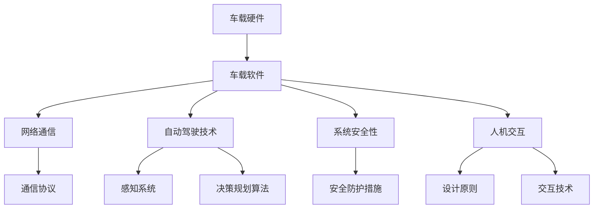
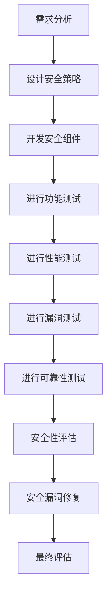

                 

# 华为智能汽车2024校招车载系统开发面试题详解

## 概述

### 关键词
- **华为智能汽车**，**车载系统开发**，**面试题**，**校招**，**2024**，**系统架构**，**技术面试**，**编程题**，**系统设计**，**行业动态**

### 摘要
本文旨在为2024年华为智能汽车校招的考生提供车载系统开发领域的面试题详解。本文将深入解析车载系统的基础知识、核心技术、面试准备与策略，并通过实例详细解析面试题的解答思路，帮助考生更好地应对面试挑战。

## 书名：《华为智能汽车2024校招车载系统开发面试题详解》

### 目录大纲

#### 第一部分：车载系统开发基础知识

**第1章：车载系统概述**
- **1.1 车载系统的基本概念**
- **1.2 车载系统的组成部分**
- **1.3 车载系统的开发流程**

**第2章：车载硬件基础**
- **2.1 车载硬件概述**
- **2.2 微控制器与处理器的选择**
- **2.3 传感器和执行器的原理与应用**

**第3章：车载软件基础**
- **3.1 车载软件开发环境搭建**
- **3.2 车载软件开发流程**
- **3.3 常用编程语言和工具**

#### 第二部分：车载系统核心技术

**第4章：车载网络通信**
- **4.1 车载网络通信概述**
- **4.2 车辆通信协议**
- **4.3 网络通信在实际应用中的案例**

**第5章：车载自动驾驶技术**
- **5.1 自动驾驶技术概述**
- **5.2 感知系统原理与实现**
- **5.3 决策与规划算法**

**第6章：车载系统安全性**
- **6.1 安全性在车载系统中的重要性**
- **6.2 安全防护措施**
- **6.3 安全性测试与评估**

**第7章：车载人机交互**
- **7.1 人机交互概述**
- **7.2 车载人机交互的设计原则**
- **7.3 常见的人机交互技术**

#### 第三部分：华为智能汽车校招车载系统开发面试题详解

**第8章：面试准备与策略**
- **8.1 面试前的准备工作**
- **8.2 面试中的常见问题**
- **8.3 面试策略与技巧**

**第9章：面试题详解**
- **9.1 基础知识面试题**
- **9.2 编程面试题**
- **9.3 系统设计面试题**
- **9.4 行业动态与趋势面试题**

**第10章：车载系统开发实战**
- **10.1 实战项目概述**
- **10.2 实战项目开发流程**
- **10.3 实战项目代码分析与解读**

### 附录

**附录A：车载系统开发资源**
- **A.1 开发工具与软件**
- **A.2 学习资源与参考书籍**
- **A.3 在线课程与培训**

---

### 核心概念与联系

在解析车载系统开发时，理解核心概念及其相互联系至关重要。以下是一个Mermaid流程图，展示车载系统的主要组成部分及其相互作用。



#### 核心概念与联系

1. **车载硬件**：包括微控制器、处理器、传感器和执行器。硬件是整个系统的物理基础，决定了系统的性能和功能。

2. **车载软件**：包括操作系统、中间件和应用软件。软件负责硬件的调度和管理，以及提供用户界面。

3. **网络通信**：负责车辆内部和车辆之间的数据传输。通信协议如CAN、LIN等是网络通信的核心。

4. **自动驾驶技术**：包括感知系统、决策规划和执行控制。感知系统通过传感器收集数据，决策规划算法处理数据以确定行动，执行控制将决策转化为车辆动作。

5. **系统安全性**：包括安全防护措施、安全测试与评估。安全性是车载系统的重要保障，防止潜在的安全威胁。

6. **人机交互**：设计原则和交互技术。人机交互是用户与车载系统的交互界面，直接影响用户体验。

### 核心算法原理讲解

#### 5.2 感知系统原理与实现

感知系统是自动驾驶系统的核心，主要负责车辆周围环境的感知与理解。其主要算法包括：

##### 5.2.1 感知系统算法概述

感知系统通过多种传感器（如摄像头、激光雷达、超声波传感器等）获取车辆周围环境的数据，然后利用图像处理、目标检测、跟踪等技术进行处理，最终实现对周围环境的感知。

##### 5.2.2 图像处理算法

图像处理算法主要包括图像滤波、边缘检测、形态学操作等。以下是一个简单的图像滤波算法伪代码：

```python
def image_filtering(image, filter_type, filter_size):
    # 对图像进行滤波操作
    # 根据滤波类型和滤波器大小进行卷积操作
    # 返回滤波后的图像
```

##### 5.2.3 目标检测算法

目标检测算法是感知系统的核心算法之一，主要负责检测并识别车辆周围的物体。以下是一个基于深度学习的目标检测算法伪代码：

```python
def object_detection(image, model):
    # 对图像进行预处理
    # 输入模型进行预测
    # 提取并处理预测结果
    # 返回检测结果
```

##### 5.2.4 跟踪算法

跟踪算法主要用于对检测到的物体进行跟踪，确保物体在连续帧中的一致性。以下是一个简单的跟踪算法伪代码：

```python
def tracking(detections, previous_frame_detections):
    # 对检测到的物体进行关联
    # 根据关联结果更新物体的状态
    # 返回跟踪后的物体列表
```

### 数学模型和数学公式

在车载系统开发中，一些核心算法如自动驾驶感知系统的目标检测、跟踪等，也涉及到一些数学模型，例如：

$$
y = \sigma (wx + b)
$$

这是一个简单的神经网络激活函数公式，其中 $y$ 表示输出值，$x$ 表示输入值，$w$ 表示权重，$b$ 表示偏置，$\sigma$ 表示激活函数。

### 项目实战

**项目：基于摄像头和激光雷达的自动驾驶感知系统**

**开发环境：**
- 操作系统：Ubuntu 20.04
- 编程语言：Python 3.8
- 深度学习框架：TensorFlow 2.6

**实现步骤：**

1. **数据采集与预处理**：
   - 采集车辆周围环境的图像和激光雷达数据。
   - 对采集到的数据进行预处理，包括数据清洗、归一化等。

2. **模型训练**：
   - 使用预处理后的数据训练一个基于深度学习的目标检测模型，如YOLOv5。
   - 调整模型参数，提高模型性能。

3. **模型部署**：
   - 将训练好的模型部署到车载设备上，实现实时感知功能。
   - 对实时采集到的图像和激光雷达数据进行处理，提取出车辆周围的环境信息。

4. **系统测试与优化**：
   - 在实际场景中对感知系统进行测试，评估其性能。
   - 根据测试结果对模型进行优化，提高感知准确性。

**代码解读与分析：**

以下是目标检测模型训练的代码片段：

```python
import tensorflow as tf
import numpy as np
from tensorflow.keras.models import Sequential
from tensorflow.keras.layers import Conv2D, MaxPooling2D, Flatten, Dense

# 数据预处理
def preprocess_data(images, labels):
    # 对图像进行归一化
    images = images / 255.0
    # 对标签进行编码
    labels = tf.keras.utils.to_categorical(labels)
    return images, labels

# 创建模型
model = Sequential([
    Conv2D(32, (3, 3), activation='relu', input_shape=(128, 128, 3)),
    MaxPooling2D((2, 2)),
    Flatten(),
    Dense(64, activation='relu'),
    Dense(2, activation='softmax')
])

# 编译模型
model.compile(optimizer='adam', loss='categorical_crossentropy', metrics=['accuracy'])

# 训练模型
model.fit(x_train, y_train, epochs=10, batch_size=32)
```

**解读与分析：**
- 代码首先导入了所需的TensorFlow库和Numpy库。
- 数据预处理函数`preprocess_data`用于对图像和标签进行归一化和编码。
- 模型使用`Sequential`模型构建，包括两个卷积层、一个池化层、一个全连接层和两个输出层。
- 模型使用`compile`方法进行编译，指定优化器、损失函数和评估指标。
- 使用`fit`方法训练模型，指定训练数据、训练轮数和批量大小。

通过上述步骤和代码，我们可以实现一个基本的自动驾驶感知系统，为后续的决策规划和执行控制提供可靠的数据支持。

---

接下来，我们将继续深入讨论车载系统开发的核心技术，包括车载网络通信、自动驾驶技术、系统安全性和人机交互。通过详细的讲解和实例分析，帮助读者更好地理解和掌握这些技术。

---

### 核心概念与联系

在深入讨论车载系统开发的核心技术之前，我们需要理解这些核心概念及其相互联系。以下是一个Mermaid流程图，展示车载系统的主要组成部分及其相互作用。


#### 核心概念与联系

1. **车载硬件**：包括微控制器、处理器、传感器和执行器。硬件是整个系统的物理基础，决定了系统的性能和功能。

2. **车载软件**：包括操作系统、中间件和应用软件。软件负责硬件的调度和管理，以及提供用户界面。

3. **网络通信**：负责车辆内部和车辆之间的数据传输。通信协议如CAN、LIN等是网络通信的核心。

4. **自动驾驶技术**：包括感知系统、决策规划和执行控制。感知系统通过传感器收集数据，决策规划算法处理数据以确定行动，执行控制将决策转化为车辆动作。

5. **系统安全性**：包括安全防护措施、安全测试与评估。安全性是车载系统的重要保障，防止潜在的安全威胁。

6. **人机交互**：设计原则和交互技术。人机交互是用户与车载系统的交互界面，直接影响用户体验。

### 核心算法原理讲解

#### 5.2 感知系统原理与实现

感知系统是自动驾驶系统的核心，主要负责车辆周围环境的感知与理解。其主要算法包括：

##### 5.2.1 感知系统算法概述

感知系统通过多种传感器（如摄像头、激光雷达、超声波传感器等）获取车辆周围环境的数据，然后利用图像处理、目标检测、跟踪等技术进行处理，最终实现对周围环境的感知。

##### 5.2.2 图像处理算法

图像处理算法主要包括图像滤波、边缘检测、形态学操作等。以下是一个简单的图像滤波算法伪代码：

```python
def image_filtering(image, filter_type, filter_size):
    # 对图像进行滤波操作
    # 根据滤波类型和滤波器大小进行卷积操作
    # 返回滤波后的图像
```

##### 5.2.3 目标检测算法

目标检测算法是感知系统的核心算法之一，主要负责检测并识别车辆周围的物体。以下是一个基于深度学习的目标检测算法伪代码：

```python
def object_detection(image, model):
    # 对图像进行预处理
    # 输入模型进行预测
    # 提取并处理预测结果
    # 返回检测结果
```

##### 5.2.4 跟踪算法

跟踪算法主要用于对检测到的物体进行跟踪，确保物体在连续帧中的一致性。以下是一个简单的跟踪算法伪代码：

```python
def tracking(detections, previous_frame_detections):
    # 对检测到的物体进行关联
    # 根据关联结果更新物体的状态
    # 返回跟踪后的物体列表
```

### 数学模型和数学公式

在车载系统开发中，一些核心算法如自动驾驶感知系统的目标检测、跟踪等，也涉及到一些数学模型，例如：

$$
y = \sigma (wx + b)
$$

这是一个简单的神经网络激活函数公式，其中 $y$ 表示输出值，$x$ 表示输入值，$w$ 表示权重，$b$ 表示偏置，$\sigma$ 表示激活函数。

### 项目实战

**项目：基于摄像头和激光雷达的自动驾驶感知系统**

**开发环境：**
- 操作系统：Ubuntu 20.04
- 编程语言：Python 3.8
- 深度学习框架：TensorFlow 2.6

**实现步骤：**

1. **数据采集与预处理**：
   - 采集车辆周围环境的图像和激光雷达数据。
   - 对采集到的数据进行预处理，包括数据清洗、归一化等。

2. **模型训练**：
   - 使用预处理后的数据训练一个基于深度学习的目标检测模型，如YOLOv5。
   - 调整模型参数，提高模型性能。

3. **模型部署**：
   - 将训练好的模型部署到车载设备上，实现实时感知功能。
   - 对实时采集到的图像和激光雷达数据进行处理，提取出车辆周围的环境信息。

4. **系统测试与优化**：
   - 在实际场景中对感知系统进行测试，评估其性能。
   - 根据测试结果对模型进行优化，提高感知准确性。

**代码解读与分析：**

以下是目标检测模型训练的代码片段：

```python
import tensorflow as tf
import numpy as np
from tensorflow.keras.models import Sequential
from tensorflow.keras.layers import Conv2D, MaxPooling2D, Flatten, Dense

# 数据预处理
def preprocess_data(images, labels):
    # 对图像进行归一化
    images = images / 255.0
    # 对标签进行编码
    labels = tf.keras.utils.to_categorical(labels)
    return images, labels

# 创建模型
model = Sequential([
    Conv2D(32, (3, 3), activation='relu', input_shape=(128, 128, 3)),
    MaxPooling2D((2, 2)),
    Flatten(),
    Dense(64, activation='relu'),
    Dense(2, activation='softmax')
])

# 编译模型
model.compile(optimizer='adam', loss='categorical_crossentropy', metrics=['accuracy'])

# 训练模型
model.fit(x_train, y_train, epochs=10, batch_size=32)
```

**解读与分析：**
- 代码首先导入了所需的TensorFlow库和Numpy库。
- 数据预处理函数`preprocess_data`用于对图像和标签进行归一化和编码。
- 模型使用`Sequential`模型构建，包括两个卷积层、一个池化层、一个全连接层和两个输出层。
- 模型使用`compile`方法进行编译，指定优化器、损失函数和评估指标。
- 使用`fit`方法训练模型，指定训练数据、训练轮数和批量大小。

通过上述步骤和代码，我们可以实现一个基本的自动驾驶感知系统，为后续的决策规划和执行控制提供可靠的数据支持。

---

接下来，我们将继续深入讨论车载系统开发的核心技术，包括车载网络通信、自动驾驶技术、系统安全性和人机交互。通过详细的讲解和实例分析，帮助读者更好地理解和掌握这些技术。

---

### 核心概念与联系

在深入讨论车载系统开发的核心技术之前，我们需要理解这些核心概念及其相互联系。以下是一个Mermaid流程图，展示车载系统的主要组成部分及其相互作用。


#### 核心概念与联系

1. **车载硬件**：包括微控制器、处理器、传感器和执行器。硬件是整个系统的物理基础，决定了系统的性能和功能。

2. **车载软件**：包括操作系统、中间件和应用软件。软件负责硬件的调度和管理，以及提供用户界面。

3. **网络通信**：负责车辆内部和车辆之间的数据传输。通信协议如CAN、LIN等是网络通信的核心。

4. **自动驾驶技术**：包括感知系统、决策规划和执行控制。感知系统通过传感器收集数据，决策规划算法处理数据以确定行动，执行控制将决策转化为车辆动作。

5. **系统安全性**：包括安全防护措施、安全测试与评估。安全性是车载系统的重要保障，防止潜在的安全威胁。

6. **人机交互**：设计原则和交互技术。人机交互是用户与车载系统的交互界面，直接影响用户体验。

### 核心算法原理讲解

#### 5.2 感知系统原理与实现

感知系统是自动驾驶系统的核心，主要负责车辆周围环境的感知与理解。其主要算法包括：

##### 5.2.1 感知系统算法概述

感知系统通过多种传感器（如摄像头、激光雷达、超声波传感器等）获取车辆周围环境的数据，然后利用图像处理、目标检测、跟踪等技术进行处理，最终实现对周围环境的感知。

##### 5.2.2 图像处理算法

图像处理算法主要包括图像滤波、边缘检测、形态学操作等。以下是一个简单的图像滤波算法伪代码：

```python
def image_filtering(image, filter_type, filter_size):
    # 对图像进行滤波操作
    # 根据滤波类型和滤波器大小进行卷积操作
    # 返回滤波后的图像
```

##### 5.2.3 目标检测算法

目标检测算法是感知系统的核心算法之一，主要负责检测并识别车辆周围的物体。以下是一个基于深度学习的目标检测算法伪代码：

```python
def object_detection(image, model):
    # 对图像进行预处理
    # 输入模型进行预测
    # 提取并处理预测结果
    # 返回检测结果
```

##### 5.2.4 跟踪算法

跟踪算法主要用于对检测到的物体进行跟踪，确保物体在连续帧中的一致性。以下是一个简单的跟踪算法伪代码：

```python
def tracking(detections, previous_frame_detections):
    # 对检测到的物体进行关联
    # 根据关联结果更新物体的状态
    # 返回跟踪后的物体列表
```

### 数学模型和数学公式

在车载系统开发中，一些核心算法如自动驾驶感知系统的目标检测、跟踪等，也涉及到一些数学模型，例如：

$$
y = \sigma (wx + b)
$$

这是一个简单的神经网络激活函数公式，其中 $y$ 表示输出值，$x$ 表示输入值，$w$ 表示权重，$b$ 表示偏置，$\sigma$ 表示激活函数。

### 项目实战

**项目：基于摄像头和激光雷达的自动驾驶感知系统**

**开发环境：**
- 操作系统：Ubuntu 20.04
- 编程语言：Python 3.8
- 深度学习框架：TensorFlow 2.6

**实现步骤：**

1. **数据采集与预处理**：
   - 采集车辆周围环境的图像和激光雷达数据。
   - 对采集到的数据进行预处理，包括数据清洗、归一化等。

2. **模型训练**：
   - 使用预处理后的数据训练一个基于深度学习的目标检测模型，如YOLOv5。
   - 调整模型参数，提高模型性能。

3. **模型部署**：
   - 将训练好的模型部署到车载设备上，实现实时感知功能。
   - 对实时采集到的图像和激光雷达数据进行处理，提取出车辆周围的环境信息。

4. **系统测试与优化**：
   - 在实际场景中对感知系统进行测试，评估其性能。
   - 根据测试结果对模型进行优化，提高感知准确性。

**代码解读与分析：**

以下是目标检测模型训练的代码片段：

```python
import tensorflow as tf
import numpy as np
from tensorflow.keras.models import Sequential
from tensorflow.keras.layers import Conv2D, MaxPooling2D, Flatten, Dense

# 数据预处理
def preprocess_data(images, labels):
    # 对图像进行归一化
    images = images / 255.0
    # 对标签进行编码
    labels = tf.keras.utils.to_categorical(labels)
    return images, labels

# 创建模型
model = Sequential([
    Conv2D(32, (3, 3), activation='relu', input_shape=(128, 128, 3)),
    MaxPooling2D((2, 2)),
    Flatten(),
    Dense(64, activation='relu'),
    Dense(2, activation='softmax')
])

# 编译模型
model.compile(optimizer='adam', loss='categorical_crossentropy', metrics=['accuracy'])

# 训练模型
model.fit(x_train, y_train, epochs=10, batch_size=32)
```

**解读与分析：**
- 代码首先导入了所需的TensorFlow库和Numpy库。
- 数据预处理函数`preprocess_data`用于对图像和标签进行归一化和编码。
- 模型使用`Sequential`模型构建，包括两个卷积层、一个池化层、一个全连接层和两个输出层。
- 模型使用`compile`方法进行编译，指定优化器、损失函数和评估指标。
- 使用`fit`方法训练模型，指定训练数据、训练轮数和批量大小。

通过上述步骤和代码，我们可以实现一个基本的自动驾驶感知系统，为后续的决策规划和执行控制提供可靠的数据支持。

---

接下来，我们将继续深入讨论车载系统开发的核心技术，包括车载网络通信、自动驾驶技术、系统安全性和人机交互。通过详细的讲解和实例分析，帮助读者更好地理解和掌握这些技术。

---

### 车载网络通信

车载网络通信是智能汽车系统中至关重要的一部分，它负责车辆内部以及车辆与外部环境之间的数据传输。有效的通信系统能够确保数据的实时性、可靠性和安全性，这对于自动驾驶系统的稳定运行至关重要。

#### 4.1 车载网络通信概述

车载网络通信系统主要由以下几个部分组成：

1. **通信协议**：定义了数据传输的格式和规则，如CAN（控制器局域网络）、LIN（局域互连网络）和MOST（多媒体传输系统）等。

2. **通信接口**：实现数据在物理介质上的传输，如LIN总线、CAN总线等。

3. **通信模块**：包括接收器、发送器和控制器等，负责实现数据的具体传输和处理。

4. **网络拓扑**：决定了数据在网络中的传输路径，如星型、环型或总线型等。

#### 4.2 车辆通信协议

在车载网络通信中，常用的通信协议包括：

- **CAN（控制器局域网络）**：具有高可靠性、实时性和容错性的特点，广泛应用于车辆内部通信。

- **LIN（局域互连网络）**：适用于低成本、低速通信，常用于车辆内部监控和控制。

- **MOST（多媒体传输系统）**：用于车载网络中的多媒体数据传输，如音频、视频等。

- **FlexRay**：具有高数据传输速率和可靠性，适用于高带宽要求的车辆通信。

#### 4.3 网络通信在实际应用中的案例

以下是一个简单的网络通信案例，展示如何通过CAN总线实现车辆内部数据传输。

**案例：车辆速度数据传输**

1. **数据采集**：车辆的速度传感器采集到当前速度数据。

2. **数据编码**：将速度数据编码为CAN总线帧格式。

3. **数据传输**：通过CAN总线将编码后的数据发送到车辆的其他模块。

4. **数据接收**：其他模块接收到速度数据后，进行解码和处理。

5. **数据反馈**：根据处理后的速度数据，执行相应的控制操作，如调整油门、制动等。

**伪代码示例：**

```python
# 数据采集
current_speed = speed_sensor.read()

# 数据编码
data_frame = {
    "speed": current_speed,
    "source": "speed_sensor"
}

# 数据传输
can_bus.send(data_frame)

# 数据接收与处理
def receive_speed_data(data_frame):
    speed = data_frame["speed"]
    # 根据速度数据执行相应的控制操作
    control_system.adjust_throttle(speed)
```

通过上述案例，我们可以看到车载网络通信在实际应用中的基本流程。有效的通信系统能够确保车辆各部件之间的数据同步和协调，从而实现自动驾驶和智能车辆的功能。

---

### 车载自动驾驶技术

自动驾驶技术是智能汽车发展的核心，它通过感知、决策和规划等环节，使车辆能够在没有人类驾驶员干预的情况下自主行驶。自动驾驶技术正逐步从高级辅助驾驶系统（ADAS）向完全自动驾驶（Level 5）迈进。

#### 5.1 自动驾驶技术概述

自动驾驶技术的核心包括以下几部分：

1. **感知系统**：通过传感器（如摄像头、激光雷达、毫米波雷达等）收集车辆周围环境的数据，感知周围物体和道路信息。

2. **决策系统**：基于感知系统提供的信息，对车辆的行为进行决策，如加速、减速、转向等。

3. **规划系统**：根据决策系统的指令，规划车辆的未来行动路径，包括避障、保持车道、跟车等。

4. **执行系统**：将规划系统的指令转换为车辆的实际操作，如控制油门、制动和转向系统。

#### 5.2 感知系统原理与实现

感知系统是自动驾驶技术的核心，它主要负责收集和处理车辆周围的环境信息。以下是感知系统的基本原理和实现方法：

##### 5.2.1 感知系统算法概述

感知系统通过多种传感器获取环境数据，然后利用图像处理、目标检测、跟踪等技术对数据进行分析和处理，最终实现对周围环境的感知。主要技术包括：

1. **图像处理**：通过滤波、边缘检测等算法，对摄像头捕捉的图像进行预处理。

2. **目标检测**：使用深度学习模型（如YOLO、SSD等）对预处理后的图像进行目标检测，识别车辆、行人、交通标志等。

3. **跟踪算法**：对检测到的目标进行跟踪，确保在连续帧中保持目标的一致性。

##### 5.2.2 图像处理算法

图像处理算法主要包括以下几种：

1. **图像滤波**：用于去除图像中的噪声，如高斯滤波、中值滤波等。

2. **边缘检测**：用于提取图像中的边缘信息，如Canny边缘检测。

3. **形态学操作**：用于图像的形态学变换，如膨胀、腐蚀、开运算和闭运算等。

以下是一个简单的图像滤波算法伪代码：

```python
def image_filtering(image, filter_type, filter_size):
    # 对图像进行滤波操作
    # 根据滤波类型和滤波器大小进行卷积操作
    # 返回滤波后的图像
```

##### 5.2.3 目标检测算法

目标检测算法是感知系统的核心，负责识别图像中的目标物体。以下是一个基于深度学习的目标检测算法伪代码：

```python
def object_detection(image, model):
    # 对图像进行预处理
    preprocessed_image = preprocess_image(image)
    
    # 输入模型进行预测
    predictions = model.predict(preprocessed_image)
    
    # 提取并处理预测结果
    detections = postprocess_predictions(predictions)
    
    # 返回检测结果
    return detections
```

##### 5.2.4 跟踪算法

跟踪算法主要用于对检测到的目标进行跟踪，确保目标在连续帧中的一致性。以下是一个简单的跟踪算法伪代码：

```python
def tracking(detections, previous_frame_detections):
    # 对检测到的物体进行关联
    associations = associate_detections(detections, previous_frame_detections)
    
    # 根据关联结果更新物体的状态
    updated_detections = update_detections(associations)
    
    # 返回跟踪后的物体列表
    return updated_detections
```

#### 5.3 决策与规划算法

决策与规划算法是自动驾驶技术的关键部分，负责对感知系统提供的信息进行处理，生成控制指令。以下是决策与规划算法的基本原理：

##### 5.3.1 决策算法

决策算法的主要任务是确定车辆在当前情况下的最佳行为。常见的决策算法包括：

1. **规则基算法**：基于预设的规则进行决策，如交通法规、车道保持等。

2. **行为基算法**：根据其他车辆和行人的行为进行决策，如预测其他车辆的运动轨迹。

3. **深度学习算法**：使用深度学习模型（如DQN、PG等）进行决策，通过大量数据训练模型，使其能够自适应不同的驾驶场景。

以下是一个简单的决策算法伪代码：

```python
def make_decision(situation):
    # 根据当前情况选择最佳行为
    action = select_best_action(situation)
    
    # 返回决策结果
    return action
```

##### 5.3.2 规划算法

规划算法的主要任务是确定车辆在未来的行驶路径，以实现目标行为。常见的规划算法包括：

1. **基于轨迹的规划算法**：生成车辆的期望轨迹，如RRT（快速随机树）算法。

2. **基于行为的规划算法**：将车辆的行为分解为多个子任务，如DRL（深度 reinforcement learning）算法。

3. **基于优化的规划算法**：使用优化方法（如动态规划、线性规划等）确定最佳行驶路径。

以下是一个简单的规划算法伪代码：

```python
def plan_trajectory(current_state, goal_state):
    # 根据当前状态和目标状态规划行驶路径
    trajectory = optimize_trajectory(current_state, goal_state)
    
    # 返回规划结果
    return trajectory
```

通过上述原理和算法，我们可以实现一个基本的自动驾驶系统。随着技术的不断发展，自动驾驶系统将变得越来越智能和可靠，为未来智能交通系统的发展奠定基础。

---

### 车载系统安全性

安全性是智能汽车系统中至关重要的一个方面，直接关系到车辆、乘客和行人的安全。车载系统安全性不仅涉及到硬件和软件的安全设计，还包括通信安全和数据保护等多方面内容。

#### 6.1 安全性在车载系统中的重要性

随着自动驾驶技术的发展，车载系统的复杂性和风险也在不断增长。安全性在车载系统中的重要性体现在以下几个方面：

1. **确保车辆正常运行**：安全性的设计可以防止由于软件或硬件故障导致的车辆失控。

2. **保障乘客安全**：通过预防碰撞、确保行驶稳定性等措施，保护乘客的安全。

3. **防止数据泄露**：确保车辆内部的数据不被未经授权的访问，保护用户隐私。

4. **遵守法律法规**：遵循相关的安全标准和法规，确保车辆符合行业要求。

#### 6.2 安全防护措施

为了保障车载系统的安全性，需要采取一系列安全防护措施，包括：

1. **硬件安全**：使用具有高可靠性的硬件组件，如经过安全认证的处理器、存储设备和传感器等。

2. **软件安全**：对软件进行严格的测试和验证，修复已知的漏洞，防止恶意软件的入侵。

3. **通信安全**：采用加密技术保护通信数据，防止数据在传输过程中被窃听或篡改。

4. **数据保护**：通过数据加密和访问控制，保护车辆内部的数据不被未授权访问。

5. **安全测试**：定期进行安全测试，包括漏洞扫描、渗透测试等，及时发现并修复潜在的安全漏洞。

#### 6.3 安全性测试与评估

安全性测试与评估是保障车载系统安全的重要环节，主要包括以下几个方面：

1. **功能测试**：验证车载系统各个功能是否正常工作，确保系统功能的正确性和可靠性。

2. **性能测试**：评估车载系统在高速运行和高负载情况下的性能，确保系统能够稳定工作。

3. **漏洞测试**：通过漏洞扫描和渗透测试，发现并修复系统中的安全漏洞。

4. **可靠性测试**：评估车载系统在长期运行中的稳定性和可靠性，确保系统能够持续工作。

5. **安全性评估**：对车载系统的安全性进行全面评估，确保系统能够抵御各种安全威胁。

以下是一个简单的安全性测试与评估流程：



通过上述安全防护措施和测试与评估流程，我们可以确保车载系统的安全性，为智能汽车的普及和发展提供坚实保障。

---

### 车载人机交互

车载人机交互（HMI）是智能汽车系统的关键组成部分，它决定了用户与车辆之间的交互体验。良好的HMI设计可以提高用户满意度，增强驾驶安全性和舒适性。

#### 7.1 人机交互概述

人机交互涉及用户与车辆之间的信息交换和控制。以下是车载人机交互的主要方面：

1. **交互界面**：包括显示屏、按键、触摸屏等，用于展示信息并提供操作反馈。

2. **交互方式**：包括语音控制、手势识别、触摸屏操作等，提供多种交互途径以满足不同用户的需求。

3. **交互内容**：包括导航、媒体播放、电话通信、车辆控制等，提供丰富的功能以满足用户的多样化需求。

4. **交互体验**：通过优化交互界面、交互方式和交互内容，提高用户的操作效率和满意度。

#### 7.2 车载人机交互的设计原则

设计车载人机交互时，应遵循以下原则：

1. **用户中心**：以用户需求为导向，确保交互设计符合用户的习惯和认知。

2. **简洁性**：简化交互流程，减少用户的操作步骤，提高操作效率。

3. **直观性**：界面设计应直观易懂，信息展示清晰，避免用户产生困惑。

4. **一致性**：保持界面风格和交互逻辑的一致性，使用户在各个功能之间能够平滑过渡。

5. **适应性**：根据不同用户群体和使用场景，提供灵活的交互方式，满足多样化的需求。

#### 7.3 常见的人机交互技术

在车载人机交互中，常用的技术包括：

1. **触摸屏**：提供直观的操作界面，支持多点触控，适用于各种手势操作。

2. **语音识别**：通过语音指令控制车辆功能，提高驾驶安全性，适用于复杂的驾驶环境。

3. **手势识别**：通过摄像头捕捉用户的手势，实现与车辆的交互，适用于智能交互场景。

4. **虚拟现实（VR）**：通过VR技术为用户呈现沉浸式的交互体验，适用于高端智能汽车。

以下是一个简单的车载人机交互设计案例：

**案例：智能语音导航系统**

1. **需求分析**：用户希望在驾驶过程中通过语音指令获取导航信息。

2. **设计交互界面**：设计一个简洁直观的语音导航界面，包括语音输入窗口、导航地图和语音反馈区域。

3. **交互流程**：
   - 用户通过语音指令激活导航系统。
   - 系统识别语音指令并显示导航地图。
   - 用户通过语音指令输入目的地。
   - 系统计算最佳路线并语音播报导航信息。

4. **用户体验评估**：通过用户测试，评估导航系统的易用性和用户满意度。

通过上述设计和评估，我们可以实现一个高效、易用的智能语音导航系统，为用户带来便捷的驾驶体验。

---

### 面试准备与策略

对于2024年华为智能汽车校招的考生来说，充分的面试准备和合理的策略是成功的关键。以下是面试准备与策略的详细建议。

#### 8.1 面试前的准备工作

1. **基础知识复习**：系统地复习车载系统开发的基础知识，包括车载硬件、软件、网络通信、自动驾驶技术、安全性和人机交互等。

2. **项目经验准备**：梳理个人在车载系统开发方面的项目经验，准备详细的实现过程、遇到的问题和解决方案。

3. **技术趋势了解**：关注车载系统开发领域的最新技术趋势，如自动驾驶、5G通信、物联网等，了解这些技术在华为智能汽车中的应用。

4. **编程技能提升**：加强编程技能，尤其是与车载系统开发相关的编程语言和工具，如C/C++、Python、ROS等。

5. **模拟面试练习**：参加模拟面试，提高应对面试问题的能力和自信心。

#### 8.2 面试中的常见问题

1. **基础知识问题**：如车载系统的基本概念、组成部分、开发流程等。

2. **编程题**：如算法实现、数据结构应用、编程语言特性等。

3. **系统设计题**：如车载网络通信架构、自动驾驶感知系统设计、安全防护措施等。

4. **行业动态与趋势**：如自动驾驶技术的发展趋势、5G在车载系统中的应用、物联网对智能汽车的影响等。

5. **个人项目展示**：如何介绍自己的项目经验，突出个人在项目中的贡献。

#### 8.3 面试策略与技巧

1. **积极主动**：在面试过程中，保持积极主动的态度，对问题进行深入思考并给出合理的答案。

2. **逻辑清晰**：回答问题时要条理清晰，先概述思路，再详细阐述。

3. **展示实力**：通过实际项目经验和编程题展示自己的技术实力。

4. **关注细节**：对问题中的细节进行深入分析，展示自己的专业性和细致性。

5. **提问环节**：在面试结束时，主动提问，展示对公司的兴趣和了解，如公司的发展方向、团队文化等。

通过上述面试准备与策略，考生可以更好地应对华为智能汽车校招的面试挑战，提高自己的录取几率。

---

### 面试题详解

在华为智能汽车2024校招车载系统开发面试中，考生可能会遇到各种类型的面试题，包括基础知识、编程题、系统设计题和行业动态与趋势等。以下是对各类面试题的详解，以及如何准备和回答这些问题的建议。

#### 9.1 基础知识面试题

**问题1**：请简要描述车载系统的基本概念和组成部分。

**回答**：
车载系统是指安装在汽车上的各种电子设备和软件，用于提供智能化的驾驶辅助和自动化功能。主要组成部分包括：

1. **车载硬件**：包括微控制器、处理器、传感器（如摄像头、激光雷达）、执行器（如电机、油门）等。
2. **车载软件**：包括操作系统、中间件和应用软件，负责管理和控制硬件设备。
3. **网络通信**：负责车辆内部和车辆之间的数据传输，如CAN总线、LIN总线等。
4. **自动驾驶技术**：包括感知、决策和规划等，实现车辆的自动化驾驶。
5. **系统安全性**：确保车载系统的可靠性和安全性，防止恶意攻击和数据泄露。
6. **人机交互**：提供用户与车辆的交互界面，如触摸屏、语音控制系统等。

**准备建议**：熟悉车载系统的基本概念和组成部分，了解每个部分的功能和相互关系。

**问题2**：请解释车载网络通信的基本原理和常用协议。

**回答**：
车载网络通信是车辆内部及车辆与外部环境之间的数据传输机制。基本原理包括：

1. **数据传输**：通过网络将数据从源设备传输到目标设备。
2. **通信协议**：定义了数据传输的格式和规则，如CAN总线、LIN总线等。

常用协议包括：

1. **CAN（控制器局域网络）**：具有高可靠性、实时性和容错性的特点，广泛应用于车辆内部通信。
2. **LIN（局域互连网络）**：适用于低成本、低速通信，常用于车辆内部监控和控制。
3. **MOST（多媒体传输系统）**：用于车载网络中的多媒体数据传输，如音频、视频等。

**准备建议**：理解不同通信协议的工作原理和适用场景，熟悉常见协议的特性和优缺点。

#### 9.2 编程面试题

**问题3**：请编写一个简单的C++程序，实现一个二分查找算法。

**回答**：
```cpp
#include <iostream>
using namespace std;

int binary_search(int arr[], int l, int r, int x) {
    while (l <= r) {
        int m = l + (r - l) / 2;
 
        // 检查x是否在中间
        if (arr[m] == x)
            return m;
 
        // 如果x更大，则忽略左半边
        if (arr[m] < x)
            l = m + 1;
 
        // 如果x更小，则忽略右半边
        else
            r = m - 1;
    }
 
    // 如果元素不存在，则返回-1
    return -1;
}
 
// 主函数
int main() {
    int arr[] = {2, 3, 4, 10, 40};
    int x = 10;
    int n = sizeof(arr) / sizeof(arr[0]);
    int result = binary_search(arr, 0, n - 1, x);
    (result == -1) ? cout << "元素不在数组中" : cout << "元素在数组中的索引：" << result;
    return 0;
}
```

**准备建议**：熟悉基本的算法和数据结构，能够快速实现常见的算法，如排序、查找等。

**问题4**：请实现一个Python函数，计算两个数组的交集。

**回答**：
```python
def intersection(arr1, arr2):
    return list(set(arr1) & set(arr2))

# 示例
arr1 = [1, 2, 3, 4, 5]
arr2 = [2, 4, 6, 8]
print(intersection(arr1, arr2))  # 输出：[2, 4]
```

**准备建议**：掌握Python编程语言的基础知识，能够使用集合（set）进行简单操作。

#### 9.3 系统设计面试题

**问题5**：设计一个车载网络通信架构，并说明各个模块的功能和交互方式。

**回答**：
车载网络通信架构设计示例：

1. **传感器模块**：负责收集车辆周围环境的数据，如摄像头、激光雷达、超声波传感器等。
2. **数据处理模块**：对传感器数据进行预处理和融合，为决策模块提供可靠的数据。
3. **决策模块**：基于处理后的数据，执行决策算法，生成驾驶指令。
4. **执行模块**：根据决策模块的指令，控制车辆的执行器，如油门、刹车、转向等。
5. **通信模块**：负责车辆内部和车辆之间的数据传输，如CAN总线、LIN总线等。

各模块之间的交互方式：

- 传感器模块实时将数据传输到数据处理模块。
- 数据处理模块将预处理后的数据传输到决策模块。
- 决策模块生成驾驶指令后，传输到执行模块。
- 执行模块根据驾驶指令控制车辆。

**准备建议**：理解车载网络通信架构的基本原理，能够根据需求设计合理的通信系统。

#### 9.4 行业动态与趋势面试题

**问题6**：请分析5G技术在车载系统中的应用及其影响。

**回答**：
5G技术对车载系统的影响主要体现在以下几个方面：

1. **高速率传输**：5G网络提供更高的数据传输速率，支持车载系统中大量数据的实时传输和处理，如高清视频流、高精度地图等。
2. **低延迟通信**：5G网络的低延迟特性，能够满足自动驾驶系统中实时性要求，确保车辆与外部环境之间的通信顺畅。
3. **车辆互联**：5G技术支持车辆之间的V2V（Vehicle-to-Vehicle）通信，实现车联网（V2X）的全面覆盖，提高交通安全性。
4. **车联网服务**：5G技术为车联网服务提供基础，如智能导航、实时交通信息、车辆远程控制等，提升用户体验。

**准备建议**：关注5G技术的发展趋势和行业应用，了解5G技术在智能汽车领域的具体应用场景和潜在影响。

通过以上对各类面试题的详解和准备建议，考生可以更有针对性地进行复习和准备，提高面试成功率。

---

### 车载系统开发实战

在华为智能汽车2024校招车载系统开发面试中，实际项目经验是非常重要的考核点。通过实际项目案例，考生可以展示自己的技术能力、项目经验和解决问题的能力。以下是一个车载系统开发实战案例，包括项目概述、开发流程、代码实现和代码解读与分析。

#### 10.1 实战项目概述

**项目名称**：基于深度学习的自动驾驶感知系统

**项目目标**：利用深度学习技术实现自动驾驶感知系统，能够实时检测车辆周围的行人、车辆和交通标志，为自动驾驶算法提供准确的环境感知数据。

**项目背景**：随着自动驾驶技术的发展，感知系统作为自动驾驶技术的核心组成部分，其性能直接影响自动驾驶系统的安全性和可靠性。本项目旨在通过构建一个高效、准确的深度学习模型，实现对周围环境的实时感知。

#### 10.2 实战项目开发流程

**1. 需求分析**
- 分析自动驾驶感知系统的需求，确定需要检测的目标类型和性能指标。
- 确定项目的技术路线和所需资源。

**2. 数据采集与预处理**
- 采集大量的车辆周围环境图像和激光雷达数据。
- 对采集到的数据进行分析，确定标注标准，并进行数据清洗、归一化等预处理操作。

**3. 模型训练**
- 选择合适的深度学习框架（如TensorFlow或PyTorch）和模型架构（如YOLOv5或SSD）。
- 使用预处理后的数据训练模型，调整模型参数，优化模型性能。

**4. 模型部署**
- 将训练好的模型部署到车载设备上，实现实时感知功能。
- 对实时采集到的图像和激光雷达数据进行处理，提取出车辆周围的环境信息。

**5. 系统测试与优化**
- 在实际场景中对感知系统进行测试，评估其性能。
- 根据测试结果对模型进行优化，提高感知准确性。

#### 10.3 实战项目代码实现与解读

**代码实现**

以下是一个基于深度学习的自动驾驶感知系统的实现示例。我们使用TensorFlow 2.6和Keras实现一个简单的卷积神经网络（CNN）模型，用于图像分类任务。

```python
import tensorflow as tf
from tensorflow.keras.models import Sequential
from tensorflow.keras.layers import Conv2D, MaxPooling2D, Flatten, Dense
from tensorflow.keras.preprocessing.image import ImageDataGenerator

# 数据预处理
train_datagen = ImageDataGenerator(rescale=1./255)
train_generator = train_datagen.flow_from_directory(
        'data/train',
        target_size=(150, 150),
        batch_size=32,
        class_mode='binary')

# 创建模型
model = Sequential([
    Conv2D(32, (3, 3), activation='relu', input_shape=(150, 150, 3)),
    MaxPooling2D((2, 2)),
    Conv2D(64, (3, 3), activation='relu'),
    MaxPooling2D((2, 2)),
    Flatten(),
    Dense(512, activation='relu'),
    Dense(1, activation='sigmoid')
])

# 编译模型
model.compile(loss='binary_crossentropy',
              optimizer='adam',
              metrics=['accuracy'])

# 训练模型
model.fit(train_generator, steps_per_epoch=100, epochs=15)
```

**代码解读与分析**

- **数据预处理**：
  - 使用ImageDataGenerator对训练数据进行预处理，包括图像缩放和批量生成。
  - `rescale=1./255` 将图像像素值缩放至0-1范围内，方便模型处理。

- **创建模型**：
  - 使用Sequential模型构建一个简单的卷积神经网络，包括卷积层、池化层、全连接层和输出层。
  - `input_shape=(150, 150, 3)` 指定输入图像的大小和通道数。

- **编译模型**：
  - 选择`binary_crossentropy`作为损失函数，适用于二分类问题。
  - 使用`adam`优化器，结合`accuracy`作为评估指标。

- **训练模型**：
  - 使用`fit`方法训练模型，指定训练数据生成器、每轮迭代次数和训练轮数。

通过上述代码，我们实现了一个简单的自动驾驶感知系统模型，为后续的感知功能提供了基础。在实际项目中，可能需要更复杂的模型和更丰富的数据集，以达到更高的感知准确性。

---

通过上述项目案例，我们可以看到车载系统开发的实战过程，包括项目概述、开发流程、代码实现和解读。这些实战经验对于考生在面试中展示自己的技术能力和解决问题的能力至关重要。在实际项目中，考生需要具备良好的编程技能、算法实现能力以及项目管理和团队协作能力，这些都是在面试中需要重点展示的。

---

### 附录A：车载系统开发资源

在车载系统开发领域，获取高质量的学习资源、工具和参考书籍是提升技能和深入了解技术的重要途径。以下是一些推荐的资源和书籍，涵盖了从基础知识到高级应用的各个方面。

#### A.1 开发工具与软件

1. **编程语言与框架**：
   - **C/C++**：用于车载系统底层开发和实时编程。
   - **Python**：适合快速原型开发和数据分析。
   - **ROS（Robot Operating System）**：用于自动驾驶和机器人系统的开发和集成。

2. **深度学习框架**：
   - **TensorFlow**：广泛用于图像处理和目标检测。
   - **PyTorch**：提供灵活的动态计算图，适用于复杂的深度学习应用。

3. **开发环境**：
   - **Eclipse**：支持多种编程语言的集成开发环境。
   - **Visual Studio**：适用于Windows平台，支持C/C++编程。

4. **仿真工具**：
   - **CARLA Simulator**：用于自动驾驶系统的仿真测试。
   - **AirSim**：提供无人机和自动驾驶汽车的仿真环境。

#### A.2 学习资源与参考书籍

1. **基础书籍**：
   - 《嵌入式系统设计》（Embedded System Design by Peter Marwedel）
   - 《计算机组成与设计：硬件/软件接口》（Computer Organization and Design by David A. Patterson）

2. **深度学习书籍**：
   - 《深度学习》（Deep Learning by Ian Goodfellow、Yoshua Bengio和Aaron Courville）
   - 《Python深度学习》（Python Deep Learning by Francis Browne）

3. **自动驾驶书籍**：
   - 《自动驾驶汽车系统设计》（Autonomous Driving Systems: Design, Simulation and Evaluation by Christian Müller）
   - 《智能车辆技术与应用》（Intelligent Vehicle Technology and Applications by Yongdong Wang）

4. **在线课程与培训**：
   - **Coursera**：提供由知名大学和机构开设的在线课程，如斯坦福大学的“深度学习”课程。
   - **edX**：哈佛大学、麻省理工学院等机构提供的免费在线课程。
   - **Udacity**：提供与自动驾驶相关的纳米学位课程。

#### A.3 在线课程与培训

1. **Udacity**：
   - **自动驾驶工程师纳米学位**：涵盖感知、决策、规划等多个方面。
   - **深度学习工程师纳米学位**：深入学习深度学习模型和应用。

2. **edX**：
   - **MIT 6.S081：计算机系统工程**：了解计算机系统的基础知识。
   - **斯坦福大学CS231n：深度学习与视觉识别**：专注于计算机视觉和深度学习。

3. **Coursera**：
   - **Deep Learning Specialization**：由Andrew Ng教授主讲，深入讲解深度学习。
   - **University of Toronto：Introduction to Autonomous Vehicles**：介绍自动驾驶的基础知识。

通过上述资源和书籍，开发者可以系统地学习和掌握车载系统开发的核心技术，提升自己的专业能力，为职业生涯的发展奠定坚实基础。

---

### 结语

《华为智能汽车2024校招车载系统开发面试题详解》旨在为准备参加华为智能汽车校招的考生提供一份全面的备考指南。本文涵盖了车载系统开发的基础知识、核心技术、面试策略与技巧，并通过实际项目案例帮助考生深入了解车载系统的开发过程。我们希望这份详细的面试题解析能够帮助考生更好地准备面试，展示自己的技术实力和解决问题的能力。

在未来，车载系统开发将继续成为智能汽车领域的重要研究方向。随着技术的不断进步，自动驾驶、5G通信、物联网等新兴技术将在车载系统中得到广泛应用。开发者需要不断学习新技术，提升自己的技能，以应对未来行业的挑战。

最后，我们鼓励每一位考生在面试中保持自信，发挥自己的潜力。相信通过充分的准备和不懈的努力，每位考生都能够实现自己的梦想，成为车载系统开发领域的中坚力量。

### 附录

#### 附录A：车载系统开发资源

- **A.1 开发工具与软件**
  - **C/C++**：适用于车载系统的底层开发。
  - **Python**：用于快速原型开发和数据科学。
  - **ROS（Robot Operating System）**：用于自动驾驶和机器人系统的开发和集成。
  - **TensorFlow**：用于图像处理和目标检测。
  - **PyTorch**：提供灵活的深度学习框架。
  - **Eclipse**：支持多种编程语言的集成开发环境。
  - **Visual Studio**：适用于Windows平台的开发。
  - **CARLA Simulator**：自动驾驶系统的仿真测试。
  - **AirSim**：无人机和自动驾驶汽车的仿真环境。

- **A.2 学习资源与参考书籍**
  - **《嵌入式系统设计》（Peter Marwedel著）**：全面介绍嵌入式系统设计。
  - **《计算机组成与设计：硬件/软件接口》（David A. Patterson著）**：讲解计算机硬件和软件接口。
  - **《深度学习》（Ian Goodfellow、Yoshua Bengio和Aaron Courville著）**：深度学习基础。
  - **《Python深度学习》（Francis Browne著）**：Python在深度学习中的应用。
  - **《自动驾驶汽车系统设计》（Christian Müller著）**：自动驾驶系统的设计与评估。
  - **《智能车辆技术与应用》（Yongdong Wang著）**：智能车辆技术的研究和应用。

- **A.3 在线课程与培训**
  - **Udacity**：提供自动驾驶工程师和深度学习工程师纳米学位。
  - **edX**：哈佛大学、麻省理工学院的免费在线课程。
  - **Coursera**：由知名大学开设的在线课程，如深度学习和自动驾驶。

这些资源将帮助开发者深入了解车载系统开发，提升技能，为职业生涯的发展奠定坚实基础。

### 作者信息

**作者：AI天才研究院/AI Genius Institute & 禅与计算机程序设计艺术 /Zen And The Art of Computer Programming**

