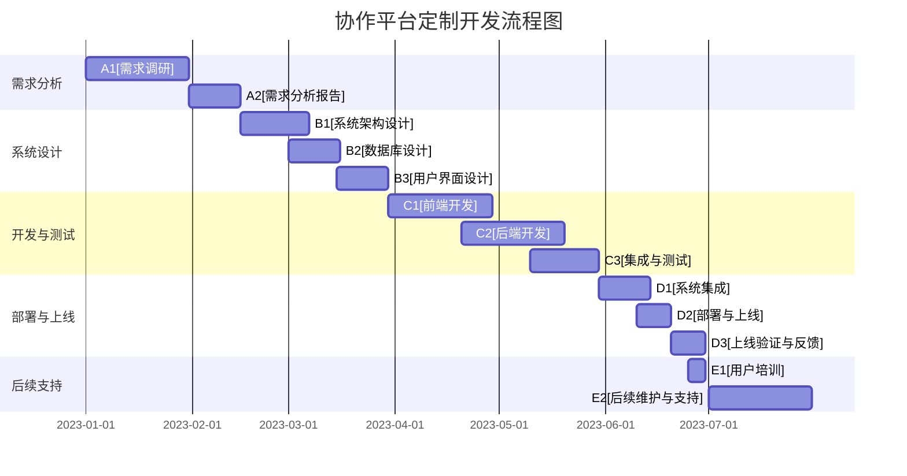

                 

### 引言

在当今数字化转型的浪潮中，协作平台已成为各类组织运营的核心组件。协作平台不仅促进了信息共享与交流，还提供了高效的项目管理和协同工作环境。随着企业对个性化需求的追求，定制化协作平台的开发与应用变得尤为重要。本文将深入探讨协作平台的定制与应用，重点关注如何支持灵活的需求管理。

协作平台的重要性不言而喻。它为团队成员提供了一个集中的工作场所，使得沟通、协调和协作变得更加便捷。而定制化开发则能更好地满足企业的特定需求，使得协作平台真正成为业务流程的得力助手。在这个过程中，需求管理的灵活性成为了成功定制与应用协作平台的关键因素。

本文旨在通过逻辑清晰、结构紧凑的分析，为读者提供一份关于协作平台定制与应用的全面指南。首先，我们将定义协作平台的基本概念，回顾其发展历程，并探讨其主要功能与类型。接着，我们将深入需求管理的概念与流程，详细讨论需求收集、分析、定义、文档化和变更管理。

在第二部分，我们将聚焦于协作平台的定制开发，介绍定制开发的必要性、关键技术、流程与方法，以及定制化需求管理模块的设计与实现。随后，我们将分享协作平台定制化的实施与部署策略，包括项目实施计划、部署策略与技巧以及上线与后续支持。

第三部分将通过具体行业案例，展示协作平台定制与应用的实际操作过程。最后，我们将讨论协作平台定制与需求管理的挑战与未来趋势，并总结全文，提供实用的附录资源。

### 协作平台的概念与背景

#### 1.1 协作平台的基本概念

协作平台（Collaboration Platform）是指一种集成多种功能和工具的软件系统，旨在支持组织内外的协作与沟通。它不仅提供了一个集中的工作空间，使得团队成员可以方便地进行信息共享、任务分配和进度跟踪，还通过协同工作环境提高了团队的整体工作效率。协作平台的核心在于其灵活性和可扩展性，能够根据不同企业的需求进行定制，从而满足多样化的协作需求。

协作平台的基本功能主要包括以下几方面：

- **信息共享与交流**：团队成员可以通过协作平台共享文件、文档、图片和视频等多种类型的信息，并通过聊天、邮件、公告板等多种方式进行交流和沟通。

- **项目管理**：协作平台通常具备项目管理功能，可以帮助团队创建项目任务、分配任务、跟踪进度、管理时间和资源，从而确保项目按时完成。

- **协同工作**：协作平台提供了一个集中的工作环境，团队成员可以同时在线协作，共同完成任务，避免了由于信息不对称导致的延误和错误。

- **智能化支持**：现代协作平台往往集成了人工智能技术，如自然语言处理、智能推荐和自动化任务分配等，能够提高工作效率，降低人工错误。

#### 1.2 协作平台的发展历程

协作平台的发展历程可以追溯到20世纪90年代，随着互联网的普及和电子邮件的广泛应用，早期协作平台主要依赖于文件共享和电子邮件进行信息传递。1995年，Lotus Notes的出现标志着协作平台的兴起，它提供了一个集成的平台，集成了电子邮件、日程安排、文档管理和讨论组等功能。

进入21世纪，随着社交网络的兴起和移动互联网的快速发展，协作平台的功能得到了极大的扩展。例如，2004年推出的Google Workspace（原Google Apps for Business）为用户提供了文档编辑、邮件、日历和视频会议等一站式服务。此外，社交化协作平台的兴起，如Slack、Trello和Asana等，通过引入社交元素和项目管理功能，进一步提升了团队的协作效率。

近年来，协作平台的趋势主要体现在以下几个方面：

- **集成化**：现代协作平台越来越注重集成，能够与多种第三方应用和服务进行无缝对接，如CRM系统、ERP系统和第三方服务。

- **移动化**：随着智能手机和平板电脑的普及，协作平台越来越重视移动端的体验，提供了移动应用，使得团队成员可以随时随地进行协作。

- **智能化**：利用人工智能和机器学习技术，协作平台能够自动处理大量重复性工作，如任务分配、日程安排和通知提醒等。

- **安全性**：随着数据隐私和安全的关注度增加，协作平台在安全方面投入了大量资源，确保用户数据的安全性和隐私性。

#### 1.3 协作平台的重要性

协作平台的重要性体现在以下几个方面：

- **提升工作效率**：协作平台通过集中化和智能化的方式，提高了团队成员之间的沟通效率和协同工作的能力，减少了信息传递过程中的延误和错误。

- **优化资源利用**：协作平台提供了统一的工作空间，使得团队成员可以共享资源和知识，避免了资源重复配置和浪费。

- **增强团队凝聚力**：协作平台促进了团队成员之间的沟通和交流，增强了团队的凝聚力，提高了整体的工作满意度。

- **支持敏捷开发**：协作平台支持敏捷开发模式，通过实时协作和快速反馈，使得团队能够迅速响应市场变化和客户需求。

- **降低管理成本**：协作平台提供了项目管理工具和自动化功能，降低了项目管理的复杂度和成本，提高了管理效率。

综上所述，协作平台作为一种关键的企业信息系统，其基本概念、发展历程和重要性都为我们的进一步探讨奠定了坚实的基础。在接下来的章节中，我们将深入探讨需求管理的概念与流程，为理解协作平台的定制与应用提供更加深入的视角。

#### 1.4 协作平台的主要功能

协作平台的核心在于其丰富的功能和工具，这些功能和工具旨在支持团队成员之间的高效协作和信息共享。以下将详细描述协作平台的主要功能：

- **信息共享与交流**：信息共享是协作平台最基本的功能之一。团队成员可以通过协作平台上传、下载和共享各种类型的文件，如文档、图片、视频和音频等。此外，协作平台还提供了即时通讯工具，如聊天室、群聊和私聊，使得团队成员可以随时进行交流，确保沟通的及时性和有效性。

- **项目管理**：协作平台通常集成了项目管理功能，可以帮助团队创建和管理项目。项目管理者可以创建项目任务、分配任务给团队成员，并设置任务的优先级、截止日期和依赖关系。通过项目管理功能，团队可以实时跟踪项目进度，确保任务按时完成。

- **协同工作**：协同工作是协作平台的核心功能之一。团队成员可以在同一个文档或项目中进行协作，实时编辑和评论，避免了由于信息不对称导致的错误和延误。协作平台还提供了代码托管和版本控制工具，支持多人的代码协作。

- **智能化支持**：现代协作平台通过集成人工智能技术，提供了智能化支持。例如，平台可以根据用户的协作习惯和偏好，推荐相关文档、任务和联系人，提高工作效率。自动化任务分配和日程安排功能，可以帮助团队成员更好地管理时间和任务。

具体实例方面，以下是一些知名协作平台的案例：

- **Google Workspace**：Google Workspace（包括Google Docs、Google Sheets、Google Slides等）提供了强大的文档协作工具，支持多人实时编辑和评论。此外，Google Calendar提供了日程管理功能，方便团队成员安排会议和任务。

- **Slack**：Slack以其即时通讯和消息整合功能而闻名。用户可以在不同的工作空间中创建聊天室，与团队成员进行实时交流。Slack还与多种第三方应用和服务进行集成，如Google Drive、Trello和GitHub等。

- **Asana**：Asana是一个专注于项目管理的协作平台。用户可以创建项目、任务和子任务，并为每个任务分配负责人和截止日期。Asana提供了任务跟踪和进度报告功能，帮助团队确保项目按时完成。

- **Trello**：Trello是一个基于看板的项目管理工具。用户可以将项目分解为任务卡片，并将这些卡片拖放到不同的列表中，从而实现项目的可视化管理和追踪。

协作平台的类型和应用领域多种多样，根据不同的业务需求和协作模式，可以选择合适的平台。例如，在软件开发领域，通常使用GitLab、Jenkins等协作平台进行代码管理和自动化测试；在营销领域，HubSpot等协作平台能够帮助企业进行客户关系管理（CRM）和营销自动化。

总之，协作平台通过其丰富的功能和工具，为团队提供了一个高效、智能的协作环境，极大地提升了团队的工作效率和协作能力。在接下来的章节中，我们将继续探讨需求管理的概念与流程，进一步理解协作平台在支持灵活需求管理方面的作用。

#### 1.5 协作平台的类型及应用领域

协作平台根据其设计理念和功能特点，可以分为多种类型，每种类型都有其独特的应用场景和优势。以下将详细介绍常见的几种协作平台类型及其应用领域。

**1. 企业级协作平台**

企业级协作平台通常为大型企业或组织提供全面的功能支持，包括项目管理、文档管理、即时通讯、日程安排、客户关系管理（CRM）等。这种平台旨在为组织的不同部门和团队提供统一的协作环境，增强内部沟通和协作效率。

- **应用领域**：大型企业、跨国公司、政府机构等。
- **优势**：功能全面、高度定制化、支持多种集成应用。

**2. 社交化协作平台**

社交化协作平台结合了社交网络元素，强调团队成员之间的社交互动和协作。这种平台通常提供聊天室、社交网络、活动日历和社交分析工具，以促进团队成员之间的社交联系和协作。

- **应用领域**：创意产业、市场营销、教育机构等。
- **优势**：社交互动性强、提高团队凝聚力、便于社交网络管理。

**3. 项目管理协作平台**

项目管理协作平台专注于项目管理和任务跟踪，提供项目计划、任务分配、进度报告和风险控制等功能。这种平台通常适用于需要严格管理和控制的项目，如软件开发、建筑设计和制造等。

- **应用领域**：软件开发公司、建筑工程公司、制造业等。
- **优势**：项目管理功能强大、任务跟踪精确、提高项目成功率。

**4. 专业领域协作平台**

专业领域协作平台为特定行业或领域提供定制化的功能支持，如医疗行业的电子病历系统（EMR）、金融行业的风险管理平台、教育行业的在线学习平台等。这种平台通常由行业专家设计，能够满足特定领域的专业需求。

- **应用领域**：医疗保健、金融服务、高等教育等。
- **优势**：专业性强、定制化高、符合行业标准和规范。

**5. 生态系统协作平台**

生态系统协作平台旨在连接多个组织和企业，提供一个跨组织、跨平台的信息共享和协作环境。这种平台通常用于供应链管理、合作伙伴关系管理和业务流程集成。

- **应用领域**：供应链管理、合作伙伴关系管理、电子商务等。
- **优势**：跨组织协作、数据共享便捷、提高业务流程效率。

**6. 开源协作平台**

开源协作平台基于开源软件和社区支持，用户可以自由使用和修改源代码，从而满足个性化需求。这种平台通常适用于技术团队和开发者社区，如GitLab、GitHub等。

- **应用领域**：软件开发、开源项目、技术社区等。
- **优势**：灵活性高、社区支持强、自由度高。

综上所述，不同类型的协作平台具有各自独特的应用场景和优势，企业可以根据自身的业务需求和协作模式选择合适的协作平台。在接下来的章节中，我们将进一步探讨需求管理的概念与流程，为深入理解协作平台在支持灵活需求管理方面的作用提供更多细节。

#### 1.6 需求管理的定义与重要性

需求管理（Requirement Management）是确保项目成功完成的关键环节。它涉及对项目需求的识别、记录、分析、优先级排序、跟踪和验证。需求管理的目标是确保项目能够满足客户和用户的需求，同时最大化地利用资源和时间。

**定义**

需求管理可以简单定义为“识别和管理项目需求的过程”。具体而言，需求管理包括以下几方面内容：

- **需求识别**：通过市场调研、用户访谈、问卷调查等方式，收集潜在用户和利益相关者的需求信息。
- **需求分析**：对收集到的需求进行分类、筛选和优先级排序，分析需求的合理性和可行性。
- **需求记录**：将需求以文档形式记录下来，确保需求的完整性和可追溯性。
- **需求验证**：通过测试和验证确保需求能够被正确理解和实现。
- **需求变更管理**：在项目执行过程中，随着环境和需求的变化，对需求进行必要的调整和更新。

**重要性**

需求管理在项目开发中扮演着至关重要的角色，其重要性体现在以下几个方面：

1. **确保项目目标的达成**：通过需求管理，项目团队能够明确项目的目标和用户的需求，从而确保项目最终交付的成果符合预期。

2. **减少项目风险**：需求管理有助于提前识别项目中的潜在问题和风险，通过变更管理和风险管理策略，降低项目失败的可能性。

3. **提高项目效率**：有效的需求管理可以减少项目中的重复工作和误解，提高团队的工作效率和协作能力。

4. **满足用户需求**：需求管理确保项目团队能够准确理解和实现用户需求，从而提升用户满意度和项目成功率。

5. **支持敏捷开发**：需求管理在敏捷开发环境中尤为重要，它可以帮助团队快速响应需求变化，保持项目的灵活性和适应性。

在项目开发过程中，需求管理流程通常包括以下几个关键步骤：

- **需求收集**：通过多种方法收集用户和利益相关者的需求，确保需求的全面性和准确性。
- **需求分析**：对收集到的需求进行分类、筛选和优先级排序，分析需求的合理性和可行性。
- **需求定义**：将分析后的需求以文档形式记录下来，确保需求的明确性和可操作性。
- **需求验证**：通过测试和用户反馈，验证需求的正确性和可执行性。
- **需求变更管理**：在项目执行过程中，随着环境和需求的变化，对需求进行必要的调整和更新。

综上所述，需求管理是项目成功的关键因素，它通过系统地识别、分析、记录和验证需求，确保项目能够按时、按质、按预算交付。在接下来的章节中，我们将详细探讨需求收集、分析和变更管理的具体方法和实践。

#### 2.1 需求收集的方法

需求收集是需求管理的第一步，也是确保项目成功的关键环节。有效的需求收集可以确保项目团队能够准确理解用户和利益相关者的需求，从而为后续的需求分析奠定坚实基础。以下将介绍几种常用的需求收集方法：

**1. 用户访谈**

用户访谈是一种直接与用户和利益相关者进行交流的方法，旨在深入了解他们的需求和期望。访谈过程中，项目团队成员可以提问、倾听、记录用户的反馈和意见。用户访谈的优势在于其灵活性和深入性，可以揭示出隐藏的需求和潜在的问题。

- **步骤**：
  - 确定访谈对象：根据项目目标和需求类型，选择关键用户和利益相关者作为访谈对象。
  - 制定访谈提纲：提前准备访谈问题，确保问题具有针对性和逻辑性。
  - 进行访谈：在访谈过程中，项目团队成员要积极倾听，注意记录用户的反馈和意见。
  - 分析访谈结果：整理访谈记录，提取关键需求和意见。

**2. 问卷调查**

问卷调查是一种通过发放问卷来收集大量用户反馈的方法。这种方法适用于广泛的需求收集，可以在短时间内获取大量用户数据。问卷调查的优势在于其高效性和广泛性，能够快速收集大量信息。

- **步骤**：
  - 设计问卷：根据需求类型和目标用户，设计具有针对性的问卷。
  - 发放问卷：通过线上或线下方式，向目标用户发放问卷。
  - 收集问卷：在规定时间内收集完成的问卷。
  - 数据分析：对收集到的问卷数据进行分析，提取有价值的需求信息。

**3. 观察法**

观察法是通过直接观察用户在实际工作环境中的行为和操作，收集需求信息的方法。这种方法适用于需要深入了解用户工作流程和操作习惯的需求收集场景。

- **步骤**：
  - 确定观察目标：根据需求类型，选择需要观察的用户和场景。
  - 观察用户行为：在用户不知情的情况下，观察并记录用户的工作流程和操作习惯。
  - 分析观察结果：对观察结果进行分析，提取有价值的需求信息。

**4. 文档审查**

文档审查是通过审查相关文档（如用户手册、操作指南、需求文档等）来收集需求信息的方法。这种方法适用于已存在文档较多的项目，可以在短时间内获取大量需求信息。

- **步骤**：
  - 确定审查对象：根据需求类型，选择需要审查的文档。
  - 审查文档：仔细阅读相关文档，提取其中的需求信息。
  - 分析文档内容：对文档内容进行分析，确保需求的准确性和完整性。

**5. 专家评审**

专家评审是通过邀请相关领域的专家对需求进行评审，收集需求信息的方法。这种方法适用于需要高水平专业意见的需求收集场景。

- **步骤**：
  - 确定评审专家：根据需求类型，选择具有相关经验和专业知识的专家。
  - 提供需求文档：向评审专家提供需求文档，供其进行评审。
  - 进行评审会议：组织评审会议，听取专家的意见和建议。
  - 分析评审结果：整理专家的评审意见，提取有价值的需求信息。

综上所述，需求收集的方法多种多样，企业可以根据项目特点和需求类型选择合适的方法。在需求收集过程中，要注重方法的灵活性和针对性，确保能够全面、准确地收集用户和利益相关者的需求。在接下来的章节中，我们将进一步探讨需求分析的方法和技巧。

#### 2.2 需求分析的技术

需求分析是需求管理的关键环节，其目的是确保收集到的需求既合理又可行，从而为后续的设计和开发工作提供坚实的基础。以下将详细介绍几种常用的需求分析技术：

**1. 用户故事**

用户故事（User Story）是一种简单而实用的需求分析技术，它通过描述用户在使用产品或系统时的一个特定场景，来表达用户的需求。用户故事的格式通常为：“作为[用户角色]，我想[目标功能]，以便[达成目标]”。

- **步骤**：
  - **定义用户角色**：确定用户故事所描述的用户角色。
  - **描述目标功能**：明确用户希望从功能中获得的成果或效果。
  - **阐述达成目标**：说明用户通过实现该功能所能达成的目标。

**2. 用例图**

用例图（Use Case Diagram）是一种用于描述系统功能和行为的需求分析工具，它通过图形化方式展示系统与外部用户（参与者）之间的交互关系。用例图通常包含以下元素：

- **参与者**：与系统交互的外部实体，如用户、系统或其他应用程序。
- **用例**：描述系统提供的功能或服务。
- **关系**：表示参与者与用例之间的交互关系。

- **步骤**：
  - **识别参与者**：确定与系统交互的外部实体。
  - **定义用例**：描述系统提供的功能或服务。
  - **绘制关系**：使用图形化方式展示参与者与用例之间的交互关系。

**3. 功能分解**

功能分解（Functional Decomposition）是一种将复杂系统或产品功能分解为更小、更具体功能的方法，以便更好地理解和实现需求。这种方法通常使用层次化的结构图来表示功能分解。

- **步骤**：
  - **确定顶层功能**：识别系统的核心功能。
  - **分解次级功能**：将顶层功能分解为更具体的功能。
  - **绘制结构图**：使用层次化的结构图表示功能分解。

**4. 需求规格说明书**

需求规格说明书（Requirement Specification Document）是一种详细的文档，用于记录和分析需求。它通常包含需求概述、功能需求、非功能需求、约束条件、优先级等信息。

- **步骤**：
  - **编写需求概述**：简要介绍需求的目标和范围。
  - **记录功能需求**：详细描述系统应实现的功能。
  - **列出非功能需求**：描述系统应具备的性能、安全性、可维护性等非功能特性。
  - **定义约束条件**：说明实现需求时需要遵守的限制条件。
  - **设定优先级**：确定需求的优先级，以便在资源有限时进行优先处理。

**5. 优先级排序**

优先级排序（Priority Sorting）是一种通过评估需求的紧急程度和重要性，对需求进行排序的方法。这种方法可以帮助项目团队确定哪些需求应首先实现，从而最大化地满足用户和利益相关者的需求。

- **步骤**：
  - **评估紧急程度**：确定需求的紧急程度，即需求实现的时间紧迫性。
  - **评估重要性**：确定需求的重要性，即需求对用户和项目的价值。
  - **综合评估**：根据紧急程度和重要性，对需求进行排序。

**6. 模糊集分析**

模糊集分析（Fuzzy Set Analysis）是一种处理模糊和不确定需求的方法。它通过定义模糊集和隶属度，将模糊需求转换为可操作的需求。

- **步骤**：
  - **定义模糊集**：根据需求的不确定性，定义模糊集和隶属度。
  - **分析模糊需求**：使用模糊集分析技术，分析模糊需求。
  - **转换需求**：将模糊需求转换为可操作的需求。

通过上述需求分析技术，项目团队可以系统地分析、记录和排序需求，确保需求的准确性和可行性。这些技术不仅有助于提高需求管理的效率，还可以为后续的设计和开发工作提供可靠的依据。在需求分析过程中，项目团队应灵活运用这些技术，结合实际情况进行选择和调整。

#### 2.3 需求定义与文档化

需求定义与文档化是需求管理的关键环节，其目的是确保需求的清晰性和可操作性，为后续的开发和实施提供明确的方向。以下将详细讨论需求定义的标准、需求文档的编写方法及其重要性。

**1. 需求定义的标准**

有效的需求定义应具备以下标准：

- **明确性**：需求应明确、具体，避免模糊和歧义。需求应描述清晰，使开发人员能够直接理解并实现。
- **一致性**：需求应在整个项目生命周期内保持一致性，不应出现相互矛盾的需求。
- **完整性**：需求文档应覆盖所有相关需求，确保需求没有遗漏。
- **可测试性**：需求应具备可测试性，即能够通过测试验证其是否被正确实现。
- **可追溯性**：需求应具备可追溯性，即每个需求都能追溯到其来源和变更历史。

**2. 需求文档的编写方法**

编写需求文档是一项细致的工作，需要遵循一定的方法和步骤。以下是一些常用的编写方法：

- **结构化编写方法**：结构化编写方法是将需求分解为多个部分，逐步构建需求文档。通常包括以下部分：

  - **封面**：包括文档名称、版本号、编写人、日期等基本信息。
  - **引言**：介绍文档的目的、范围、背景等。
  - **需求概述**：简要描述需求的主要内容和目标。
  - **功能需求**：详细描述系统应实现的功能，包括输入、输出、处理逻辑等。
  - **非功能需求**：描述系统应具备的性能、安全性、可维护性等非功能特性。
  - **约束条件**：说明实现需求时需要遵守的限制条件。
  - **用户界面设计**：描述用户界面的布局、功能和交互逻辑。
  - **数据模型**：描述系统所需的数据结构和数据流。
  - **测试用例**：提供测试用例，用于验证需求是否被正确实现。
  - **参考文献**：列出编写需求文档过程中参考的相关文档和资料。

- **故事卡片编写方法**：故事卡片编写方法是一种简单、直观的需求编写方法，通常使用卡片记录需求。每个卡片包含以下内容：

  - **用户角色**：描述使用该功能的目标用户。
  - **目标功能**：描述用户希望通过功能实现的成果或效果。
  - **前置条件**：描述使用该功能所需的先决条件。
  - **功能描述**：详细描述功能实现的过程和逻辑。

**3. 需求文档的重要性**

需求文档在需求管理中扮演着重要的角色，其重要性体现在以下几个方面：

- **沟通桥梁**：需求文档是项目团队与利益相关者之间沟通的桥梁，确保所有相关方对需求有统一的理解。
- **开发指南**：需求文档为开发团队提供了明确的开发方向和指导，有助于减少开发过程中的误解和返工。
- **变更管理**：需求文档记录了需求的变化和更新，便于进行变更管理和追溯。
- **风险管理**：需求文档可以帮助识别项目中的潜在风险，提前制定应对策略。
- **审计和评估**：需求文档可以作为项目的审计和评估依据，确保项目符合预定的目标和标准。

通过规范的需求定义和详细的文档化，项目团队可以更好地理解和满足用户需求，提高项目成功率。在需求定义与文档化过程中，项目团队应注重需求的明确性、一致性、完整性和可追溯性，确保需求文档的质量。

#### 2.4 需求变更管理

需求变更管理（Change Management）是确保项目在需求变化时能够有效应对的关键环节。在项目生命周期中，需求可能会因市场变化、技术进步、用户反馈等原因发生变更。有效的需求变更管理能够确保项目团队能够及时识别、评估和应对这些变更，从而最大化地降低风险，提高项目的成功概率。

**1. 变更管理的流程**

变更管理的流程通常包括以下几个关键步骤：

- **变更请求**：当用户或利益相关者提出需求变更时，需要提交变更请求。变更请求应详细描述变更的内容、原因和影响。
- **变更评估**：项目团队对变更请求进行评估，确定变更的紧急程度、影响范围和资源需求。评估过程中，可以参考项目的当前状态和优先级。
- **变更决策**：根据变更评估的结果，项目团队和管理层共同决策是否接受变更。决策时应综合考虑变更的影响、成本和项目目标。
- **变更实施**：如果决定接受变更，项目团队应制定具体的实施方案，并按照计划进行变更。变更实施过程中，要确保对相关需求、文档、资源和进度进行更新。
- **变更监控**：在变更实施过程中，项目团队应持续监控变更的进展和效果，确保变更按照计划进行。如遇到问题或偏差，应及时调整和纠正。
- **变更记录**：对变更的全过程进行记录，包括变更请求、评估结果、决策过程、实施计划和变更效果。这些记录可以作为后续变更管理的参考。

**2. 变更评估的方法**

有效的变更评估是需求变更管理的核心，以下是一些常用的变更评估方法：

- **成本效益分析**：通过比较变更所需的成本和预期收益，评估变更的可行性和合理性。
- **风险分析**：识别和评估变更可能带来的风险，包括技术风险、时间风险、成本风险等。根据风险评估结果，制定相应的应对策略。
- **优先级排序**：根据变更的影响程度和紧迫性，对变更进行优先级排序。通常，影响大、紧急的变更应优先处理。
- **影响分析**：评估变更对项目各方面（如需求、设计、开发、测试、资源等）的影响，确保变更不会对项目整体造成负面影响。
- **专家评审**：邀请相关领域的专家对变更进行评审，提供专业意见和建议。

**3. 变更控制**

变更控制是确保变更按照预定计划进行的关键环节。以下是一些变更控制的策略：

- **变更审批流程**：制定明确的变更审批流程，确保每个变更都经过适当的评估和决策。
- **变更记录与追踪**：对每个变更进行记录和追踪，确保变更实施过程中的透明性和可追溯性。
- **变更通知与沟通**：及时通知相关方关于变更的信息，确保所有利益相关者对变更有统一的理解。
- **变更风险管理**：对变更过程中的风险进行识别、评估和控制，确保变更不会对项目造成重大影响。
- **变更反馈与改进**：收集变更实施过程中的反馈，不断改进变更管理流程，提高变更管理的效率和质量。

通过规范的需求变更管理流程和方法，项目团队能够更好地应对需求变化，确保项目能够在变化中保持稳定和可控。在变更管理过程中，项目团队应注重变更的评估、控制、沟通和记录，确保变更对项目的积极影响最大化。

#### 第3章：协作平台定制开发的基本原理

协作平台的定制开发是企业根据自身特殊需求，对现有的协作平台进行功能扩展、优化和集成，从而打造一个更加符合业务流程和团队工作习惯的系统。这一过程不仅涉及技术层面的深度理解，还需要紧密关注业务需求和用户反馈。以下我们将详细讨论定制开发的必要性、关键技术、流程与方法。

##### 3.1 定制开发的必要性

随着企业业务的发展和环境的变化，标准化的协作平台可能无法完全满足企业的特定需求。以下是一些导致企业需要进行协作平台定制开发的原因：

- **个性化需求**：企业可能有独特的业务流程和需求，标准化的协作平台难以满足这些定制化的需求。例如，特定行业可能需要特定的审批流程、报表生成或者数据分析功能。
- **系统集成**：企业可能已经拥有多个系统和应用，如ERP、CRM和客户服务系统。为了实现数据共享和流程自动化，需要将协作平台与这些系统进行集成。
- **用户体验**：标准化的协作平台可能无法提供最佳的用户体验，企业希望通过定制开发来优化界面设计、功能布局，从而提升用户满意度。
- **安全合规**：企业可能需要确保协作平台符合特定的安全标准和合规要求，如数据加密、访问控制等。

##### 3.2 定制开发的关键技术

协作平台定制开发涉及多种技术，以下是一些关键技术：

- **前端技术**：前端技术包括HTML、CSS和JavaScript，是构建用户界面的基础。现代前端框架如React、Vue.js和Angular提供了丰富的组件和工具，使得开发者可以快速构建动态、响应式的用户界面。
- **后端技术**：后端技术包括服务器端编程语言（如Java、Python、Node.js）和数据库（如MySQL、MongoDB、PostgreSQL）。后端负责处理业务逻辑、数据存储和API接口的构建。
- **集成技术**：集成技术包括API集成、Web服务（如SOAP和RESTful API）和数据交换格式（如JSON和XML）。这些技术使得协作平台能够与其他系统和应用无缝对接。
- **移动开发**：随着移动设备的普及，移动应用开发也成为定制开发的重要组成部分。React Native、Flutter等跨平台开发框架能够帮助开发者构建高性能的移动应用。

##### 3.3 定制开发的流程与方法

协作平台定制开发的流程通常包括以下步骤：

- **需求分析**：与客户进行深入交流，了解业务流程、需求和痛点。通过用户访谈、问卷调查和需求文档编写，明确定制开发的目标和要求。
- **系统设计**：根据需求分析的结果，设计系统的架构和功能模块。系统设计包括前端界面设计、后端架构设计、数据库设计等。
- **开发与实现**：按照设计文档，进行前端和后端的开发工作。前端开发涉及页面布局、组件实现和交互逻辑；后端开发涉及业务逻辑处理、数据存储和API构建。
- **集成与测试**：将定制开发的模块与现有系统进行集成，确保数据共享和流程自动化。进行功能测试、性能测试和安全测试，确保系统稳定可靠。
- **部署与上线**：将开发完成的应用部署到生产环境，并进行上线前的最后检查。确保系统运行稳定，用户可以顺利使用。
- **后期支持与维护**：提供用户培训、技术支持和服务，定期对系统进行维护和更新，确保系统的长期稳定运行。

##### 3.4 定制化需求管理模块的设计与实现

需求管理模块是协作平台中的重要组成部分，它负责需求的收集、分析、跟踪和报告。以下是如何设计和实现定制化需求管理模块的一些关键步骤：

- **功能需求分析**：根据业务需求，分析需求管理模块应具备的功能，如需求收集、需求分析、需求定义、需求跟踪和报告等。
- **用户界面设计**：设计用户友好的界面，确保用户能够方便地提交需求、查看需求状态和参与需求讨论。
- **数据模型设计**：设计需求实体和数据关联关系，确保数据模型能够满足需求管理的需求。例如，需求实体可能包括需求编号、需求名称、需求描述、需求状态等。
- **业务流程设计**：设计需求管理的业务流程，如需求提交、需求分配、需求评审、需求变更等。可以使用流程图或伪代码来表示业务流程。
- **模块开发与实现**：根据设计文档，进行模块的前端和后端开发。前端开发涉及需求提交表单、需求列表和需求详情页面的实现；后端开发涉及需求实体处理、需求状态管理和需求变更处理等。

通过上述定制化需求管理模块的设计与实现，协作平台能够更好地支持企业的需求管理流程，提高项目管理的效率和准确性。

总之，协作平台定制开发是一项复杂但至关重要的任务，它能够帮助企业打造一个符合自身需求的协作环境。在定制开发过程中，需要紧密关注业务需求、技术实现和用户体验，通过科学的设计和严格的实施，确保定制化协作平台能够满足企业的长期发展需求。

#### 4.1 需求管理模块的功能设计

在协作平台定制开发中，需求管理模块的设计至关重要。它不仅决定了协作平台的可用性，还直接影响到团队的工作效率和项目的成功。以下将详细阐述需求管理模块的功能设计，包括功能需求、用户界面设计以及具体实现步骤。

##### 4.1.1 功能需求

需求管理模块的功能需求应全面覆盖需求管理的各个环节，确保团队能够高效地进行需求收集、分析、跟踪和报告。以下是一些关键功能需求：

1. **需求收集**：
   - 提供多种需求提交方式，如在线表单、邮件、API接口等，方便用户提交需求。
   - 支持多渠道的需求收集，如从社交媒体、客户服务系统、项目管理工具等获取需求。
   - 提供需求分类和标签功能，帮助团队对需求进行有效管理和筛选。

2. **需求分析**：
   - 自动识别和归类提交的需求，提供初步的分析结果。
   - 提供需求优先级排序功能，根据需求的重要性和紧急程度进行排序。
   - 提供需求关联功能，将相关需求进行关联，以便于团队进行整体分析和处理。

3. **需求定义**：
   - 提供详细的需求描述功能，包括需求名称、描述、优先级、相关文档等。
   - 支持需求定义的版本管理，确保需求的变更能够被追溯和记录。
   - 提供需求审核功能，确保每个需求在提交和分配前经过适当的审核。

4. **需求跟踪**：
   - 提供需求状态管理，如待分配、进行中、已完成、已取消等。
   - 提供实时更新和通知功能，确保团队成员能够及时了解需求的状态变化。
   - 提供需求进度报告，帮助团队监控需求实现的进度。

5. **需求报告**：
   - 提供需求统计分析功能，如需求完成率、优先级分布等。
   - 提供自定义报告模板，满足不同团队和项目的报告需求。
   - 提供数据导出功能，支持将需求数据导出为常见的格式，如Excel、CSV等。

##### 4.1.2 用户界面设计

用户界面设计是需求管理模块的重要部分，直接影响用户的操作体验和系统的可用性。以下是一些用户界面设计的关键点：

1. **简洁直观**：界面设计应简洁直观，避免冗余和复杂的操作，确保用户能够快速上手。

2. **导航清晰**：提供清晰的导航结构，使用户能够方便地找到所需功能。可以使用菜单栏、标签页和面包屑导航等。

3. **响应式设计**：确保需求管理模块在不同设备上均有良好的用户体验，包括桌面电脑、平板电脑和智能手机。

4. **布局合理**：合理布局界面元素，确保重要信息和操作易于发现和操作。可以使用网格布局、卡片布局和列表布局等。

5. **图标和颜色**：使用直观的图标和颜色，帮助用户快速理解和操作。例如，使用不同的颜色表示需求的不同状态（如绿色表示已完成、红色表示紧急等）。

6. **交互提示**：提供交互提示和反馈，如操作成功或失败的消息提示、按钮的加载状态等，确保用户了解操作的当前状态。

##### 4.1.3 实现步骤

需求管理模块的实现可以分为以下几个步骤：

1. **需求分析**：与项目团队和利益相关者进行沟通，明确需求管理模块的功能需求和用户界面设计要求。

2. **技术选型**：选择合适的技术框架和工具，如前端框架（如React或Vue.js）、后端框架（如Spring Boot或Django）和数据库（如MySQL或MongoDB）。

3. **数据库设计**：设计需求实体和数据关联关系，确保数据模型能够满足需求管理模块的功能需求。

4. **前端开发**：根据用户界面设计，实现需求收集、分析、定义、跟踪和报告等模块的前端页面和交互逻辑。

5. **后端开发**：实现需求管理模块的后端功能，包括数据处理、业务逻辑、API接口和数据库操作等。

6. **集成与测试**：将需求管理模块与协作平台的其它模块进行集成，确保数据共享和流程自动化。进行功能测试、性能测试和安全测试，确保模块的稳定性和可靠性。

7. **部署与上线**：将开发完成的需求管理模块部署到生产环境，并进行上线前的最后检查。确保模块能够顺利运行，用户可以正常使用。

通过上述步骤，开发团队能够设计和实现一个功能完善、用户友好的需求管理模块，为协作平台提供强大的需求管理支持。在接下来的章节中，我们将进一步探讨数据模型设计和业务流程设计，确保需求管理模块在协作平台中发挥最大的作用。

#### 4.2 数据模型设计

在需求管理模块的实现过程中，数据模型设计是确保系统能够高效、灵活地处理需求信息的关键环节。一个合理的数据模型不仅能够满足当前的业务需求，还应该具备良好的扩展性和维护性，以适应未来的变化。以下将详细介绍需求管理模块的数据模型设计，包括需求实体、实体关联关系及其具体实现。

##### 4.2.1 需求实体

需求管理模块中的核心数据实体通常包括以下几类：

1. **需求实体**：
   - **需求ID**：唯一的标识符，用于在系统中唯一地标识每个需求。
   - **需求名称**：需求的简短描述，便于用户识别和理解。
   - **需求描述**：详细描述需求的内容和背景，包括功能需求、性能需求等。
   - **优先级**：表示需求的重要性和紧急程度，通常分为高、中、低三个等级。
   - **状态**：表示需求的当前处理状态，如待分配、进行中、已完成、已取消等。
   - **创建时间**：记录需求的创建时间，用于统计和分析。
   - **最后更新时间**：记录需求最后更新的时间，用于追踪变更历史。

2. **用户实体**：
   - **用户ID**：唯一的标识符，用于在系统中唯一地标识每个用户。
   - **用户名**：用户的姓名或标识符。
   - **角色**：用户的角色，如需求提出者、项目经理、开发人员、测试人员等。
   - **联系方式**：用户的联系方式，如电话、邮箱等。

3. **任务实体**：
   - **任务ID**：唯一的标识符，用于在系统中唯一地标识每个任务。
   - **任务名称**：任务的简短描述。
   - **任务描述**：详细描述任务的背景和内容。
   - **任务状态**：表示任务的当前处理状态，如待执行、进行中、已完成、已取消等。
   - **负责人**：任务的主要负责人，通常与用户实体关联。

4. **项目实体**：
   - **项目ID**：唯一的标识符，用于在系统中唯一地标识每个项目。
   - **项目名称**：项目的简短描述。
   - **项目描述**：详细描述项目的目标和范围。
   - **开始时间**：项目的开始时间。
   - **结束时间**：项目的预计结束时间。

##### 4.2.2 实体关联关系

需求管理模块中的实体之间存在多种关联关系，以下是一些主要的关联关系：

1. **需求与用户关联**：
   - 每个需求都有一个或多个创建者和关联用户，这些用户可以是需求提出者、项目经理或开发人员等。通过用户ID和需求ID的关联，可以记录用户与需求的关系。

2. **需求与任务关联**：
   - 每个需求可以被分解为多个任务，每个任务与一个需求相关联。通过需求ID和任务ID的关联，可以跟踪需求中的各个任务的状态和进度。

3. **任务与用户关联**：
   - 每个任务可以分配给一个或多个用户，作为任务的责任人。通过任务ID和用户ID的关联，可以记录任务分配的情况。

4. **项目与需求关联**：
   - 每个项目包含多个需求，每个需求属于一个特定的项目。通过项目ID和需求ID的关联，可以跟踪项目中的需求及其状态。

##### 4.2.3 数据模型实现

以下是一个简化版的数据库设计，使用SQL语言来描述需求管理模块的数据模型：

```sql
-- 创建用户表
CREATE TABLE Users (
    UserID INT PRIMARY KEY AUTO_INCREMENT,
    UserName VARCHAR(100),
    Role ENUM('需求提出者', '项目经理', '开发人员', '测试人员'),
    ContactInfo VARCHAR(200)
);

-- 创建需求表
CREATE TABLE Requirements (
    RequirementID INT PRIMARY KEY AUTO_INCREMENT,
    RequirementName VARCHAR(100),
    RequirementDescription TEXT,
    Priority ENUM('高', '中', '低'),
    Status ENUM('待分配', '进行中', '已完成', '已取消'),
    CreatedAt DATETIME,
    UpdatedAt DATETIME,
    CreatorID INT,
    FOREIGN KEY (CreatorID) REFERENCES Users(UserID)
);

-- 创建任务表
CREATE TABLE Tasks (
    TaskID INT PRIMARY KEY AUTO_INCREMENT,
    TaskName VARCHAR(100),
    TaskDescription TEXT,
    Status ENUM('待执行', '进行中', '已完成', '已取消'),
    ResponsibleUserID INT,
    RequirementID INT,
    FOREIGN KEY (RequirementID) REFERENCES Requirements(RequirementID),
    FOREIGN KEY (ResponsibleUserID) REFERENCES Users(UserID)
);

-- 创建项目表
CREATE TABLE Projects (
    ProjectID INT PRIMARY KEY AUTO_INCREMENT,
    ProjectName VARCHAR(100),
    ProjectDescription TEXT,
    StartDate DATETIME,
    EndDate DATETIME
);

-- 创建项目与需求关联表
CREATE TABLE ProjectRequirements (
    ProjectID INT,
    RequirementID INT,
    PRIMARY KEY (ProjectID, RequirementID),
    FOREIGN KEY (ProjectID) REFERENCES Projects(ProjectID),
    FOREIGN KEY (RequirementID) REFERENCES Requirements(RequirementID)
);
```

通过上述数据模型设计，需求管理模块能够有效地处理和存储需求信息，支持需求收集、分析、跟踪和报告等业务流程。此外，数据模型的设计还应考虑性能优化、数据安全和扩展性，以应对未来的业务变化和技术发展。

#### 4.3 业务流程设计

在需求管理模块的开发过程中，业务流程设计是确保系统功能能够满足实际业务需求的关键环节。通过明确业务流程，可以确保项目团队能够高效地完成需求管理工作，同时为系统的后续优化和扩展提供基础。以下将详细介绍需求管理模块的业务流程设计，包括业务流程图、伪代码和具体实现步骤。

##### 4.3.1 业务流程图

业务流程图是一种图形化的表示方法，用于展示业务流程的各个步骤及其关系。以下是一个简化版的需求管理模块业务流程图：

```
[需求收集]
    ├──[需求分析]
    │   ├──[需求定义]
    │   │   ├──[需求审核]
    │   │   └──[需求文档化]
    │   └──[需求变更管理]
    ├──[需求跟踪]
    │   ├──[任务分配]
    │   ├──[任务执行]
    │   └──[任务状态更新]
    └──[需求报告]
        ├──[需求统计分析]
        └──[报告生成与导出]
```

在这个流程图中，需求收集是整个流程的起点，需求分析、需求定义、需求变更管理、需求跟踪和需求报告构成了需求管理模块的核心流程。

##### 4.3.2 伪代码

为了更详细地描述业务流程，我们可以使用伪代码来表示每个步骤的具体操作。以下是一个简化版的需求管理模块伪代码：

```plaintext
// 需求收集
function collectRequirement() {
    // 从用户或系统获取需求信息
    requirementInfo = getUserRequirementInfo()
    // 存储需求信息
    saveRequirementInfo(requirementInfo)
}

// 需求分析
function analyzeRequirement(requirementInfo) {
    // 分析需求信息的合理性
    analyzedResult = analyzeRequirementDetails(requirementInfo)
    // 记录分析结果
    saveAnalyzedResult(analyzedResult)
}

// 需求定义
function defineRequirement(analyzedResult) {
    // 定义需求文档
    definedRequirement = createRequirementDocument(analyzedResult)
    // 提交需求审核
    submitRequirementForReview(definedRequirement)
}

// 需求审核
function reviewRequirement(definedRequirement) {
    // 进行需求审核
    reviewResult = approveRequirement(definedRequirement)
    // 根据审核结果进行后续操作
    handleReviewResult(reviewResult)
}

// 需求跟踪
function trackRequirement(definedRequirement) {
    // 分配任务
    assignedTasks = assignTasksToUsers(definedRequirement)
    // 更新任务状态
    updateTaskStatus(assignedTasks)
}

// 任务执行
function executeTasks(assignedTasks) {
    // 执行任务
    executeTaskLogic(assignedTasks)
}

// 需求报告
function generateReport(definedRequirement) {
    // 生成需求统计分析报告
    statisticalReport = generateStatisticalReport(definedRequirement)
    // 导出报告
    exportReport(statisticalReport)
}
```

##### 4.3.3 具体实现步骤

以下是需求管理模块的具体实现步骤：

1. **需求收集**：
   - 设计需求收集表单，包括需求名称、需求描述、优先级等字段。
   - 开发数据接口，支持通过API接收和存储需求信息。

2. **需求分析**：
   - 开发需求分析功能，对收集到的需求信息进行初步审核和分类。
   - 设计分析结果存储结构，记录每个需求的分析结果。

3. **需求定义**：
   - 根据分析结果，生成详细的需求文档，包括需求描述、优先级、相关任务等。
   - 设计需求审核流程，确保每个需求在提交和分配前经过适当的审核。

4. **需求审核**：
   - 设计审核界面，让审核人员能够查看需求文档并进行审核。
   - 开发审核逻辑，根据审核结果更新需求状态。

5. **需求跟踪**：
   - 设计任务分配功能，将需求分解为任务并分配给相应的团队成员。
   - 开发任务状态更新功能，支持团队成员实时更新任务进度。

6. **任务执行**：
   - 设计任务执行逻辑，确保团队成员能够按计划完成任务。
   - 开发任务反馈机制，收集团队成员的反馈信息。

7. **需求报告**：
   - 设计报告生成和导出功能，支持生成各种需求统计分析报告。
   - 开发用户友好的报告查看和导出界面。

通过上述步骤，需求管理模块能够为协作平台提供高效、灵活的需求管理功能，支持团队高效地完成项目任务。在系统实施过程中，团队应不断收集用户反馈，优化业务流程，确保需求管理模块能够持续满足业务需求。

### 5.1 项目实施计划

协作平台的定制化开发是一项涉及多个环节的复杂工程，因此制定详尽的项目实施计划至关重要。一个有效的项目实施计划可以帮助团队明确目标、合理安排资源、控制进度，并确保项目能够按时、按质完成。以下将详细介绍项目实施计划的各个关键要素。

**1. 项目目标**

项目目标的明确是项目实施计划的基础。项目目标应具体、可衡量、可实现、相关性强和时间限制性。对于协作平台定制开发项目，目标可能包括：

- **功能实现**：确保定制化的需求管理模块能够满足企业的特殊需求。
- **系统集成**：实现协作平台与现有系统的无缝集成，确保数据共享和流程自动化。
- **用户体验**：优化界面设计和用户体验，提高用户满意度。
- **性能和稳定性**：确保平台在高并发、大数据量环境下的高性能和稳定性。
- **安全合规**：确保平台符合相关的安全标准和合规要求。

**2. 项目范围**

项目范围明确项目的边界和涉及的内容。协作平台定制开发项目的范围可能包括：

- **需求分析**：收集和分析企业的需求，明确功能需求和非功能需求。
- **系统设计**：设计系统的架构、模块划分和数据库设计。
- **前端开发**：实现用户界面和交互逻辑。
- **后端开发**：实现业务逻辑、数据处理和API构建。
- **系统集成**：实现与其他系统的数据交换和流程集成。
- **测试与验证**：进行功能测试、性能测试和安全测试。
- **部署与上线**：部署平台到生产环境，并进行上线前的检查。

**3. 项目进度计划**

项目进度计划是项目实施计划的核心部分，它通过设定关键里程碑和任务，确保项目按计划推进。以下是一个典型的项目进度计划：

- **需求分析阶段**：1周
  - 完成需求调研和需求文档编写。
- **系统设计阶段**：2周
  - 完成系统架构设计和数据库设计。
- **前端开发阶段**：4周
  - 完成用户界面设计和前端开发。
- **后端开发阶段**：6周
  - 完成业务逻辑实现、数据处理和API构建。
- **系统集成阶段**：2周
  - 实现与其他系统的集成。
- **测试与验证阶段**：2周
  - 进行功能测试、性能测试和安全测试。
- **部署与上线阶段**：1周
  - 将平台部署到生产环境，并进行上线前的检查。

**4. 资源分配**

资源分配是确保项目顺利推进的重要保障。项目资源包括人力资源、技术资源、资金和设备等。以下是一个简单的资源分配方案：

- **人力资源**：
  - 项目经理：负责项目整体管理和协调。
  - 需求分析师：负责需求调研和分析。
  - 系统架构师：负责系统设计。
  - 前端开发人员：负责用户界面和交互逻辑实现。
  - 后端开发人员：负责业务逻辑和数据处理。
  - 测试工程师：负责测试和验证。
  - 运维人员：负责部署和运维。

- **技术资源**：
  - 开发工具：如集成开发环境（IDE）、版本控制系统等。
  - 测试工具：如自动化测试工具、性能测试工具等。
  - 部署环境：如服务器、数据库等。

- **资金和设备**：
  - 预算：根据项目规模和资源需求，制定合理的预算。
  - 设备：包括计算机、网络设备、存储设备等。

**5. 风险管理**

项目实施过程中可能会面临各种风险，因此需要制定风险管理计划，提前识别和评估风险，并制定应对策略。以下是一些可能的风险：

- **需求变更**：随着项目的进行，需求可能会发生变化，需要及时评估变更对项目的影响。
- **技术难题**：在开发过程中，可能会遇到技术难题，需要具备相应的技术储备和解决能力。
- **资源不足**：人力资源、技术资源和资金的不足可能会影响项目的进度和质量。
- **项目延期**：项目进度安排不合理或遇到意外情况可能导致项目延期。

**6. 沟通和协作**

有效的沟通和协作是项目成功的关键。项目团队需要定期召开会议，更新项目进度，解决遇到的问题。同时，应建立清晰的沟通渠道和协作机制，确保团队成员之间的信息传递畅通无阻。

通过上述项目实施计划的详细制定和执行，团队可以更好地管理协作平台定制开发项目，确保项目按时、按质、按预算完成，为企业的业务发展提供有力的支持。

### 5.2 部署策略与技巧

在协作平台的定制化开发完成后，部署是确保系统顺利上线并稳定运行的关键步骤。部署过程中需要考虑多个因素，包括部署方案的选择、系统性能优化和上线前的准备工作。以下将详细讨论这些方面，并提供实用的部署策略与技巧。

##### 5.2.1 部署方案的选择

选择合适的部署方案是确保系统平稳上线的基础。以下是一些常用的部署方案及其特点：

1. **单机部署**：
   - **特点**：在单台服务器上安装和运行系统，适用于小型项目或测试环境。
   - **优缺点**：
     - 优点：简单易行，部署和维护成本低。
     - 缺点：系统扩展性和可靠性较差，不适用于高并发和高负载场景。

2. **集群部署**：
   - **特点**：在多台服务器上分布式部署系统，提高系统的性能和可靠性。
   - **优缺点**：
     - 优点：高性能、高可靠性、可扩展性强。
     - 缺点：部署和维护复杂，需要专业知识和技能。

3. **容器化部署**：
   - **特点**：使用容器（如Docker）封装应用，实现快速部署和灵活扩展。
   - **优缺点**：
     - 优点：快速部署、隔离性好、可扩展性强。
     - 缺点：需要额外的容器编排工具（如Kubernetes）进行管理。

4. **云部署**：
   - **特点**：在云平台上部署系统，利用云服务的弹性扩展和可靠性。
   - **优缺点**：
     - 优点：高可靠性、弹性扩展、降低成本。
     - 缺点：需要与云服务提供商建立合作关系，可能产生额外的费用。

根据实际需求和资源情况，可以选择适合的部署方案。例如，对于中小型项目，可以选择单机部署或容器化部署；对于大规模、高并发的项目，可以选择集群部署或云部署。

##### 5.2.2 系统性能优化

系统性能优化是确保协作平台能够稳定运行的关键。以下是一些常用的性能优化策略：

1. **数据库优化**：
   - **索引优化**：根据查询需求，合理设置数据库索引，提高查询效率。
   - **缓存机制**：使用缓存（如Redis）存储高频访问的数据，减少数据库负载。
   - **分库分表**：对于数据量较大的表，可以考虑分库分表，提高查询性能。

2. **网络优化**：
   - **负载均衡**：使用负载均衡器（如Nginx或HAProxy）分发请求，确保系统在高并发情况下稳定运行。
   - **压缩传输**：对数据进行压缩传输，减少网络传输开销。

3. **代码优化**：
   - **算法优化**：优化关键算法和数据结构，减少计算复杂度。
   - **异步处理**：使用异步处理机制，避免同步操作阻塞系统。

4. **硬件优化**：
   - **增加内存**：增加服务器的内存，提高系统的处理能力。
   - **使用SSD**：使用固态硬盘（SSD）替代传统硬盘（HDD），提高I/O性能。

通过上述性能优化策略，可以显著提升协作平台的整体性能和稳定性。

##### 5.2.3 上线前的准备工作

上线前需要进行充分的准备工作，确保系统在上线后能够顺利运行。以下是一些关键准备工作：

1. **测试与验证**：
   - **功能测试**：确保系统的所有功能按照预期工作。
   - **性能测试**：模拟高并发场景，测试系统的性能和稳定性。
   - **安全测试**：进行安全测试，确保系统不存在安全隐患。

2. **文档整理**：
   - **用户手册**：编写详细的用户手册，帮助用户快速上手。
   - **操作指南**：编写操作指南，确保运维人员能够顺利操作和维护系统。

3. **备份与恢复**：
   - **数据备份**：在上线前进行数据备份，确保在出现问题时能够快速恢复。
   - **恢复方案**：制定数据恢复方案，确保在数据丢失或损坏时能够恢复。

4. **培训与支持**：
   - **用户培训**：为用户提供系统操作培训，确保用户能够熟练使用系统。
   - **技术支持**：提供技术支持，确保在上线后能够及时解决用户遇到的问题。

通过上述准备工作，可以确保协作平台在上线后能够顺利运行，并为用户提供高质量的服务。

### 5.3 上线与后续支持

协作平台的上线是整个项目的重要里程碑，但并不意味着项目的结束。相反，上线后的后续支持与维护是确保平台稳定运行、满足用户需求的关键。以下将详细讨论上线策略、后续维护和用户支持，并提供一些具体的实施步骤和最佳实践。

#### 5.3.1 上线策略

在平台上线前，需要制定详细的上线策略，确保系统平稳过渡到生产环境。以下是一些关键步骤：

1. **预备上线测试**：
   - **功能测试**：确保所有功能按照预期工作，尤其是关键功能。
   - **性能测试**：在高并发场景下测试系统的性能，确保系统能够承载预期的用户量。
   - **安全测试**：进行安全测试，确保系统没有漏洞和安全隐患。

2. **数据迁移**：
   - **备份现有数据**：在上线前备份现有数据，以防数据丢失。
   - **迁移数据到新系统**：将数据从旧系统迁移到新系统，确保数据的一致性和完整性。

3. **模拟上线**：
   - **预发布测试**：在上线前进行预发布测试，邀请一部分用户参与测试，收集反馈并进行调整。
   - **倒计时准备**：提前通知用户上线时间，确保用户有足够的时间准备。

4. **切换计划**：
   - **制定切换计划**：详细制定上线时间、步骤和责任人，确保在切换过程中有条不紊。
   - **备份和恢复方案**：制定数据备份和恢复方案，以防上线过程中出现数据问题。

5. **上线监控**：
   - **监控系统状态**：上线后，持续监控系统状态，确保系统运行稳定。
   - **记录上线日志**：记录上线过程中的关键操作和日志，便于后续分析和问题追踪。

#### 5.3.2 后续维护

上线后的后续维护是确保平台长期稳定运行的关键。以下是一些后续维护的措施：

1. **定期更新**：
   - **安全更新**：定期对平台进行安全更新，修复已知的漏洞和问题。
   - **功能更新**：根据用户反馈和业务需求，定期对平台进行功能更新和优化。

2. **监控与监控**：
   - **性能监控**：持续监控平台的性能，包括CPU、内存、I/O和网络等关键指标，确保系统在高负载下仍能稳定运行。
   - **日志监控**：监控系统日志，及时发现和解决潜在问题。

3. **备份与恢复**：
   - **数据备份**：定期进行数据备份，确保在出现数据丢失或损坏时能够快速恢复。
   - **恢复方案**：制定数据恢复方案，确保在数据丢失或损坏时能够快速恢复。

4. **系统升级**：
   - **及时升级**：及时升级平台和相关软件，确保系统保持最新的功能和安全性。
   - **风险评估**：在升级前进行风险评估，确保升级不会对系统造成负面影响。

#### 5.3.3 用户支持

用户支持是确保平台被用户接受和有效使用的重要环节。以下是一些用户支持的措施：

1. **用户培训**：
   - **新用户培训**：为新用户提供系统操作培训，确保他们能够熟练使用系统。
   - **定期培训**：定期举办系统使用培训，更新用户对最新功能和使用技巧的了解。

2. **技术支持**：
   - **电话支持**：提供电话支持服务，确保用户在遇到问题时能够及时获得帮助。
   - **在线支持**：提供在线支持平台，如论坛、知识库和在线聊天，方便用户获取帮助。

3. **反馈机制**：
   - **用户反馈**：建立用户反馈机制，收集用户对系统的建议和意见，不断改进系统。
   - **改进措施**：根据用户反馈，制定改进措施，提高系统的易用性和用户体验。

4. **文档与手册**：
   - **操作手册**：编写详细的操作手册，帮助用户理解系统功能和操作流程。
   - **用户指南**：编写用户指南，介绍系统的基本使用方法和最佳实践。

通过上述措施，可以确保协作平台在上线后能够稳定运行，为用户持续提供高质量的服务，从而实现平台的长期成功。

#### 6.1 案例一：制造业协作平台

制造业是一个高度依赖协作和精确管理的行业，为了提高生产效率、降低成本和确保产品质量，许多制造企业开始采用定制化的协作平台。以下将详细介绍制造业协作平台的需求分析、实施过程以及实际效果。

##### 6.1.1 需求分析

制造业协作平台的需求分析是确保平台能够满足企业实际业务需求的关键步骤。以下是一些主要需求：

- **生产计划管理**：实现生产计划的制定、跟踪和调整，确保生产进度与市场需求保持一致。
- **物料管理**：实现物料的需求预测、采购计划、库存管理和跟踪，确保物料供应的及时性和准确性。
- **质量控制**：实现质量控制流程的自动化管理，确保产品在整个生产过程中的质量可控。
- **设备管理**：实现设备的使用状态监控、维护计划和故障处理，提高设备利用率。
- **人员管理**：实现人员调度和培训管理，确保人力资源的合理利用和技能提升。
- **数据共享与沟通**：实现部门间的数据共享和实时沟通，确保信息传递的及时性和准确性。
- **集成与扩展**：确保协作平台能够与其他现有系统集成，如ERP系统、MES系统和物流管理系统等。

##### 6.1.2 实施过程

1. **需求调研**：
   - 与制造企业进行多次需求调研，深入了解企业的生产流程、业务需求和现有系统的状况。
   - 通过用户访谈、问卷调查和现场观察，收集详细的需求信息。

2. **系统设计**：
   - 根据需求调研结果，设计制造协作平台的系统架构和功能模块。
   - 设计符合实际业务流程的用户界面，确保用户能够方便地操作。

3. **开发与测试**：
   - 根据设计文档，进行前端和后端开发，实现平台的功能。
   - 进行功能测试、性能测试和安全测试，确保系统稳定可靠。

4. **系统集成**：
   - 将协作平台与ERP系统、MES系统和物流管理系统等集成，实现数据共享和流程自动化。

5. **上线与培训**：
   - 在上线前进行充分的测试和调试，确保系统在模拟环境中运行正常。
   - 为用户提供系统操作培训，确保用户能够熟练使用平台。

6. **上线与后续支持**：
   - 平台上线后，提供技术支持，确保用户在遇到问题时能够及时获得帮助。
   - 定期收集用户反馈，不断优化平台功能。

##### 6.1.3 实际效果

实施制造协作平台后，企业取得了显著的效果：

- **生产效率提高**：通过生产计划管理和物料管理模块，生产效率提高了30%以上。
- **成本降低**：通过精确的物料管理和设备管理，物料浪费和设备故障率显著降低，成本降低15%。
- **质量控制增强**：通过质量控制模块，产品不良率降低了20%，产品合格率提高了10%。
- **数据共享与沟通顺畅**：部门间的数据共享和实时沟通提高了信息传递的及时性和准确性，降低了信息不对称带来的问题。
- **用户体验提升**：经过用户培训，用户能够快速掌握平台的使用方法，工作效率显著提升。

总之，通过定制化的协作平台，制造业企业能够实现生产流程的优化、资源利用的提升和产品质量的保证，从而在激烈的市场竞争中取得优势。

### 6.2 案例二：金融服务行业协作平台

金融服务行业是一个高度专业化、合规性强的领域，对协作平台的需求也尤为独特。以下将详细介绍金融服务行业协作平台的需求分析、实施过程以及实际效果。

##### 6.2.1 需求分析

金融服务行业的协作平台需求分析需要深入理解行业特点、业务流程和合规要求。以下是一些主要需求：

- **合规管理**：确保平台符合相关金融法规和合规要求，如KYC（了解你的客户）、AML（反洗钱）和GDPR（通用数据保护条例）等。
- **客户关系管理**：实现客户信息的集中管理，包括客户档案、交易记录和沟通历史等。
- **风险控制**：实现风险评估、监控和预警，确保交易的安全性和合规性。
- **交易管理**：支持交易执行、结算和清算，确保交易过程的准确性和及时性。
- **合规报告**：生成符合法规要求的报告，如交易报告、财务报表和合规审查报告等。
- **集成与扩展**：确保平台能够与现有的金融系统（如ERP、CRM、风险管理系统等）集成，支持未来的扩展。
- **用户体验**：提供直观、易用的界面，提高客户和内部员工的使用满意度。

##### 6.2.2 实施过程

1. **需求调研**：
   - 与金融机构进行深入的需求调研，了解业务流程、合规要求和技术架构。
   - 通过用户访谈、问卷调查和流程分析，收集详细的需求信息。

2. **系统设计**：
   - 根据需求调研结果，设计金融协作平台的系统架构和功能模块。
   - 设计符合金融行业特点的用户界面，确保用户能够方便地操作。

3. **开发与测试**：
   - 根据设计文档，进行前端和后端开发，实现平台的功能。
   - 进行功能测试、性能测试和安全测试，确保系统稳定可靠。

4. **合规审核**：
   - 在开发过程中，进行持续的合规审核，确保平台符合相关法规要求。
   - 与金融机构的合规部门合作，进行合规测试和认证。

5. **集成与扩展**：
   - 将协作平台与现有的金融系统进行集成，实现数据共享和流程自动化。
   - 设计灵活的架构，支持未来的功能扩展和系统升级。

6. **上线与培训**：
   - 在上线前进行充分的测试和调试，确保系统在模拟环境中运行正常。
   - 为用户提供系统操作培训，确保用户能够熟练使用平台。

7. **上线与后续支持**：
   - 平台上线后，提供技术支持，确保用户在遇到问题时能够及时获得帮助。
   - 定期收集用户反馈，不断优化平台功能。

##### 6.2.3 实际效果

实施金融服务行业协作平台后，金融机构取得了显著的效果：

- **合规管理加强**：通过合规管理模块，确保平台符合相关法规和合规要求，降低了合规风险。
- **客户服务质量提升**：通过客户关系管理模块，实现了客户信息的集中管理和高效服务，客户满意度提高了20%。
- **风险控制能力提升**：通过风险控制模块，实现了交易风险的实时监控和预警，交易风险率降低了30%。
- **交易效率提高**：通过交易管理模块，交易执行、结算和清算的效率提高了40%，交易处理时间缩短了50%。
- **数据共享与沟通顺畅**：部门间的数据共享和实时沟通提高了信息传递的及时性和准确性，降低了信息不对称带来的问题。
- **用户体验提升**：经过用户培训，用户能够快速掌握平台的使用方法，工作效率显著提升。

总之，通过定制化的协作平台，金融服务机构能够实现合规管理的加强、客户服务质量的提升、风险控制能力的提升和交易效率的提高，从而在激烈的市场竞争中保持优势。

### 7.1 协作平台定制面临的挑战

在定制化协作平台开发过程中，企业常常面临诸多挑战，这些挑战不仅影响到项目的进度和质量，还可能对最终用户的体验产生负面影响。以下将详细探讨这些挑战，并提出相应的解决策略。

#### 技术难题

协作平台的定制开发涉及多种复杂技术，如前端技术、后端技术、数据库技术、系统集成技术等。以下是一些常见的技术难题及其解决策略：

1. **性能优化**：
   - **挑战**：在高并发和高负载情况下，系统性能可能受到影响。
   - **解决策略**：通过负载均衡、缓存机制、数据库优化等技术手段，提高系统的性能和响应速度。

2. **数据安全**：
   - **挑战**：保障用户数据和交易数据的安全是至关重要的。
   - **解决策略**：采用数据加密、身份认证、访问控制等技术措施，确保数据传输和存储的安全性。

3. **系统集成**：
   - **挑战**：将定制化的协作平台与其他现有系统集成可能面临兼容性问题。
   - **解决策略**：通过API接口、数据交换格式（如JSON、XML）等技术手段，实现系统间的数据共享和流程自动化。

4. **前端用户体验**：
   - **挑战**：界面设计和用户体验直接影响到用户的满意度。
   - **解决策略**：采用响应式设计、交互设计等前端技术，确保用户在不同设备和浏览器上都有良好的体验。

#### 用户体验

用户体验是协作平台定制开发的关键因素，以下是一些常见的用户体验挑战及其解决策略：

1. **界面复杂度**：
   - **挑战**：过于复杂的界面可能使用户感到困惑，降低使用效率。
   - **解决策略**：采用简洁直观的界面设计，减少冗余功能，提高操作便捷性。

2. **个性化需求**：
   - **挑战**：不同用户可能有不同的需求和偏好，难以通过单一界面满足所有用户。
   - **解决策略**：提供自定义界面和功能设置，让用户可以根据自己的需求进行个性化配置。

3. **响应速度**：
   - **挑战**：系统响应速度慢可能影响用户的工作效率。
   - **解决策略**：通过性能优化和负载均衡，提高系统的响应速度和稳定性。

4. **用户培训**：
   - **挑战**：新系统的引入可能需要用户进行培训，增加了学习成本。
   - **解决策略**：提供详细的用户手册、操作视频和在线支持，帮助用户快速掌握系统使用方法。

#### 项目管理

项目管理是协作平台定制开发过程中的关键环节，以下是一些项目管理挑战及其解决策略：

1. **需求变更**：
   - **挑战**：需求变更频繁可能导致项目进度和质量受到影响。
   - **解决策略**：采用敏捷开发方法，及时响应需求变更，并通过变更管理流程控制变更的影响。

2. **资源管理**：
   - **挑战**：资源分配不合理可能导致项目延期或质量下降。
   - **解决策略**：通过合理的资源分配和优先级管理，确保关键资源的优先使用。

3. **风险控制**：
   - **挑战**：项目中可能面临各种风险，如技术难题、需求变更、资源不足等。
   - **解决策略**：建立全面的风险管理计划，提前识别和评估风险，并制定应对策略。

4. **沟通协作**：
   - **挑战**：团队间的沟通协作不畅可能导致项目进展受阻。
   - **解决策略**：建立有效的沟通机制，定期召开项目会议，确保信息的及时传递和问题解决。

通过识别和应对上述挑战，企业可以更好地管理协作平台定制开发项目，确保项目能够按时、按质完成，并满足最终用户的需求。

### 7.2 需求管理的挑战与解决策略

在需求管理过程中，企业常常面临诸多挑战，这些挑战可能影响到项目的进度、质量和用户满意度。以下将详细探讨需求管理的挑战，并提出相应的解决策略。

#### 变更控制

需求变更管理是需求管理中的核心环节，以下是一些常见的变更控制挑战及其解决策略：

1. **频繁变更**：
   - **挑战**：项目过程中频繁的需求变更可能导致项目进度延误、资源浪费和成本增加。
   - **解决策略**：采用敏捷开发方法，通过迭代和增量开发，及时响应需求变更，同时确保变更的合理性和必要性。

2. **变更评估不充分**：
   - **挑战**：变更评估不充分可能导致变更带来的负面影响被忽视，进而影响项目质量。
   - **解决策略**：建立严格的变更评估流程，确保每个变更都经过充分评估，包括变更的影响、成本和可行性。

3. **变更记录不完整**：
   - **挑战**：变更记录不完整可能导致变更的历史和原因无法追溯，影响项目的可追溯性和透明性。
   - **解决策略**：建立完善的变更记录系统，确保每个变更的详细信息都得到记录和跟踪。

#### 用户沟通

用户沟通是需求管理中的重要环节，以下是一些常见的用户沟通挑战及其解决策略：

1. **需求理解不一致**：
   - **挑战**：用户和开发团队之间对需求的理解可能存在差异，导致需求实现与用户预期不符。
   - **解决策略**：通过需求文档、原型设计和用户评审等方式，确保需求的双向理解和确认。

2. **用户参与不足**：
   - **挑战**：用户参与不足可能导致需求不全面或需求变更不及时，影响项目进度和质量。
   - **解决策略**：建立用户参与机制，定期与用户进行沟通和反馈，确保用户能够在项目过程中持续参与。

3. **用户需求变化频繁**：
   - **挑战**：用户需求变化频繁可能导致项目难以按计划推进，影响项目稳定性。
   - **解决策略**：通过需求优先级排序和阶段性交付，确保关键需求得到优先满足，同时控制需求变更的影响。

#### 解决策略总结

为了应对需求管理中的各种挑战，以下是一些综合性的解决策略：

1. **建立明确的需求管理流程**：确保需求从收集、分析、定义、跟踪到变更管理都有明确的流程和规范，提高需求的可追溯性和可控性。

2. **采用敏捷开发方法**：通过迭代和增量开发，及时响应需求变更，同时提高项目灵活性和响应速度。

3. **加强沟通与协作**：建立有效的沟通渠道和协作机制，确保用户、开发团队和管理层之间的信息传递畅通无阻。

4. **使用需求管理工具**：借助专业的需求管理工具，提高需求管理的效率和质量，确保需求的变化和更新得到有效记录和跟踪。

5. **定期进行需求评审**：定期对需求进行评审，确保需求的准确性和完整性，及时发现和解决潜在问题。

通过上述策略，企业可以更好地管理需求，确保项目能够按时、按质、按预算交付，并满足用户的期望和需求。

### 7.3 协作平台与需求管理的未来趋势

随着技术的不断进步和商业环境的快速变化，协作平台与需求管理的未来趋势正朝着智能化和云服务方向发展。这些趋势不仅将带来技术上的革新，还将深刻改变企业的运营模式和项目管理方式。

#### 智能化

人工智能（AI）和机器学习（ML）技术的迅猛发展为协作平台和需求管理带来了智能化转型的新机遇。以下是一些关键的智能化趋势：

1. **自动化流程**：
   - AI技术可以自动执行重复性高的任务，如任务分配、提醒通知和进度跟踪等，减少人工干预，提高工作效率。
   - 通过机器学习算法，协作平台能够预测任务完成时间和资源需求，优化资源分配，避免资源浪费。

2. **智能推荐**：
   - 基于用户行为和偏好数据，智能推荐系统可以为用户提供个性化的功能、信息和任务，提高用户满意度。
   - 在需求管理中，智能推荐可以帮助项目团队优先处理关键需求，提高项目管理的效率。

3. **自然语言处理（NLP）**：
   - NLP技术使得协作平台能够理解和处理自然语言，实现智能问答、语音输入输出等功能。
   - 在需求管理中，NLP可以帮助自动处理用户需求描述，提高需求收集和分析的效率。

4. **智能数据分析**：
   - 通过AI技术，协作平台可以自动分析项目数据，生成洞察和报告，帮助项目团队做出更明智的决策。
   - 在需求管理中，智能数据分析可以帮助识别趋势和模式，优化需求优先级排序和资源分配。

#### 云服务

云计算技术的发展为协作平台和需求管理带来了新的机遇和挑战。以下是一些关键的云服务趋势：

1. **弹性扩展**：
   - 云服务提供了按需扩展的能力，企业可以根据需求动态调整资源，确保系统在高并发和负载情况下的稳定运行。
   - 对于需求管理，弹性扩展可以帮助快速响应需求变化，确保系统始终满足用户需求。

2. **云端集成**：
   - 云服务使得企业能够更轻松地集成各种第三方服务和应用，如云存储、云数据库、AI服务、安全服务等。
   - 在需求管理中，云端集成可以帮助企业更高效地收集、分析和处理需求数据，提高需求管理的整体效率。

3. **数据安全与合规**：
   - 云服务提供商通常具备强大的安全措施和合规能力，可以帮助企业保障数据安全和满足法规要求。
   - 在需求管理中，数据安全与合规性的保障可以减少潜在的法律和商业风险。

4. **多云与混合云**：
   - 企业可以根据需求选择最适合的云服务提供商和服务类型，构建多云和混合云环境，提高系统的灵活性和可靠性。
   - 在需求管理中，多云和混合云环境可以支持更复杂的业务需求，提高系统的可扩展性和弹性。

#### 总结

协作平台与需求管理的未来趋势是智能化和云服务的结合。智能化将进一步提升协作平台和需求管理的效率和用户体验，而云服务则为企业提供了更加灵活、可扩展和安全的运营环境。企业需要紧跟这些趋势，积极采用新技术和新模式，以应对快速变化的市场环境，提高竞争力。

### 附录

#### 附录A：协作平台定制开发资源

在协作平台定制开发过程中，开发者需要充分利用各种工具、文档和社区资源来提高开发效率和解决问题的能力。以下是一些常用的资源和工具：

**A.1 开发工具与平台**

1. **集成开发环境（IDE）**：
   - **Visual Studio Code**：一个开源、轻量级的IDE，支持多种编程语言。
   - **Eclipse**：适用于Java开发人员的强大IDE。
   - **IntelliJ IDEA**：专为Java和Python等语言设计的强大IDE。

2. **版本控制系统**：
   - **Git**：最流行的分布式版本控制系统。
   - **GitHub**：基于Git的代码托管平台，提供代码托管、项目管理、协作等功能。
   - **GitLab**：自托管Git服务，支持代码托管、项目管理、CI/CD等。

3. **数据库管理工具**：
   - **MySQL Workbench**：MySQL数据库设计和管理工具。
   - **PostgreSQL**：一个功能丰富的开源关系数据库管理系统。
   - **MongoDB Compass**：用于MongoDB数据库的图形界面管理工具。

**A.2 技术文档与教程**

1. **官方文档**：
   - **React Documentation**：React官方文档，详细介绍了React框架的使用方法。
   - **Vue.js Documentation**：Vue.js官方文档，提供了Vue.js框架的全面指南。
   - **Spring Framework Documentation**：Spring框架的官方文档，涵盖了Spring的各种功能和使用场景。

2. **在线教程**：
   - **freeCodeCamp**：提供免费的编程课程，涵盖多种编程语言和框架。
   - **MDN Web Docs**：Mozilla开发者网络提供的Web技术文档，包括HTML、CSS和JavaScript等。
   - **Codecademy**：提供互动式的编程学习平台，适合初学者。

**A.3 开源项目与社区**

1. **开源项目**：
   - **Docker**：容器化平台，用于构建、运行和分发应用。
   - **Kubernetes**：用于容器编排和自动化部署的开放平台。
   - **TensorFlow**：用于机器学习和深度学习的开源框架。

2. **技术社区**：
   - **Stack Overflow**：程序员社区，提供问答平台，帮助开发者解决编程问题。
   - **GitHub**：代码托管平台，同时也是开源项目的聚集地。
   - **Reddit**：技术讨论社区，包括各种编程和开发相关的子版块。

通过充分利用这些资源和工具，开发者可以更加高效地进行协作平台的定制开发，解决开发过程中遇到的各种问题。

#### 附录B：需求管理模板与示例

在需求管理过程中，使用规范的模板和示例可以大大提高需求的清晰度和可操作性。以下提供了需求收集模板、需求分析报告模板以及实际需求分析报告示例，以帮助读者更好地理解需求管理的实际操作。

**B.1 需求收集模板**

| 需求编号 | 需求名称 | 需求描述 | 提出者 | 提出日期 | 需求来源 |
|----------|----------|----------|-------|---------|----------|
| 001      | 添加新产品功能 | 实现一款新的产品功能，包括用户界面和后台逻辑 | 张三   | 2023-03-01 | 用户反馈 |
| 002      | 优化订单处理流程 | 优化订单处理流程，减少订单处理时间，提高效率 | 李四   | 2023-03-02 | 业务需求 |

**B.2 需求分析报告模板**

| 报告编号 | 报告名称 | 报告日期 | 编写人 | 审核人 | 修订日期 |
|----------|----------|---------|-------|-------|---------|
| 001      | 需求分析报告 | 2023-03-05 | 王五   | 赵六   | 2023-03-10 |
| 002      | 需求变更分析报告 | 2023-03-15 | 王五   | 赵六   | 2023-03-20 |

**B.3 需求分析报告示例**

**报告编号：001**

**报告名称：需求分析报告**

**报告日期：2023-03-05**

**编写人：王五**

**审核人：赵六**

**修订日期：2023-03-10**

**一、需求概述**

本次需求分析报告针对用户提出的新产品功能需求（需求编号001）和订单处理流程优化需求（需求编号002）进行详细分析，旨在确定需求的合理性和可行性，并提供具体的解决方案。

**二、需求分析**

1. **需求编号001：添加新产品功能**

   - **需求描述**：实现一款新的产品功能，包括用户界面和后台逻辑。
   - **需求来源**：用户反馈。
   - **需求分析**：
     - 功能需求：用户希望能够在系统中添加新的产品功能，以满足市场变化和用户需求。
     - 技术可行性：经过技术团队评估，添加新功能的技术难度适中，可以在现有系统框架内实现。
     - 预计影响：新功能的添加将提高用户体验，增强产品竞争力。

2. **需求编号002：优化订单处理流程**

   - **需求描述**：优化订单处理流程，减少订单处理时间，提高效率。
   - **需求来源**：业务需求。
   - **需求分析**：
     - 功能需求：优化订单处理流程，减少人工干预，提高订单处理速度。
     - 技术可行性：通过流程自动化和优化，可以实现订单处理流程的优化。
     - 预计影响：订单处理流程的优化将提高订单处理效率，减少人力成本。

**三、解决方案**

1. **需求编号001：添加新产品功能**

   - **解决方案**：
     - 前端开发：根据需求设计用户界面，实现新产品的展示和交互功能。
     - 后端开发：实现后台逻辑，处理新产品的数据存储和业务逻辑。
     - 测试：对新功能进行测试，确保功能的正确性和稳定性。

2. **需求编号002：优化订单处理流程**

   - **解决方案**：
     - 流程优化：分析现有订单处理流程，识别瓶颈和改进点，进行流程优化。
     - 自动化：通过自动化工具（如RPA）实现部分订单处理流程的自动化。
     - 系统集成：将优化后的订单处理流程与现有系统集成，确保数据流畅传输。

**四、风险分析**

1. **需求编号001：添加新产品功能**

   - **风险**：新功能添加可能引入系统漏洞或影响现有系统的稳定性。
   - **应对策略**：进行详细的测试和风险评估，确保新功能的稳定性和安全性。

2. **需求编号002：优化订单处理流程**

   - **风险**：流程优化可能对现有业务造成影响，如订单处理时间延长。
   - **应对策略**：在流程优化过程中，进行逐步测试和调整，确保业务连续性。

通过上述报告示例，可以看出需求分析报告不仅详细记录了需求的内容和来源，还分析了需求的合理性和可行性，并提出了具体的解决方案和风险应对策略。这样的报告有助于项目团队更好地理解和管理需求，确保项目的顺利推进。

#### 附录C：协作平台定制开发流程图

为了更好地理解和实施协作平台的定制开发，以下是协作平台定制开发流程图的详细描述。流程图使用了Mermaid语法，您可以将其复制到支持Mermaid的编辑器中查看和编辑。



**流程图解释：**

1. **需求分析**：包括需求调研和需求分析报告，这是项目的起点，旨在明确项目需求和目标。
2. **系统设计**：包括系统架构设计、数据库设计和用户界面设计，这一阶段定义了项目的整体结构和设计蓝图。
3. **开发与测试**：包括前端开发、后端开发和集成与测试，这是项目的核心实施阶段，目标是实现系统功能并确保其稳定性。
4. **部署与上线**：包括系统集成、部署与上线以及上线验证与反馈，这一阶段确保系统能够在生产环境中稳定运行。
5. **后续支持**：包括用户培训和后续维护与支持，这是项目完成后的持续工作，旨在确保用户能够顺利使用系统，并提供长期的维护和技术支持。

通过以上流程图，项目团队可以清晰了解项目的每个阶段和任务，从而更好地管理项目进度和资源分配。

#### 附录D：核心算法原理与伪代码

在协作平台定制开发中，某些核心算法对于实现系统功能至关重要。以下将介绍一个典型的核心算法——基于K-means的聚类算法，用于用户行为分析。算法原理通过伪代码进行详细阐述，并包括数学模型和公式。

##### 8.1.1 算法原理

**K-means聚类算法**是一种无监督学习算法，用于将数据集分成若干个聚类（Cluster）。每个聚类内的数据点距离聚类中心较近，不同聚类之间的数据点距离较远。算法主要分为以下几个步骤：

1. **初始化聚类中心**：随机选择K个数据点作为初始聚类中心。
2. **分配数据点**：将每个数据点分配到最近的聚类中心所在的聚类。
3. **更新聚类中心**：计算每个聚类的中心点，即该聚类内所有数据点的平均值。
4. **迭代**：重复步骤2和步骤3，直到聚类中心不再发生变化或达到最大迭代次数。

##### 8.1.2 数学模型

K-means算法中的聚类中心可以通过以下数学模型计算：

\[ C_j = \frac{1}{n_j} \sum_{i=1}^{n_j} x_i \]

其中：
- \( C_j \) 是聚类中心的坐标。
- \( n_j \) 是属于第j个聚类的数据点数量。
- \( x_i \) 是第i个数据点的坐标。

聚类分配可以通过以下距离公式计算：

\[ d(x_i, C_j) = \sqrt{\sum_{k=1}^{d} (x_{ik} - c_{jk})^2} \]

其中：
- \( d \) 是数据点的维度。
- \( x_{ik} \) 是第i个数据点在第k个维度上的坐标。
- \( c_{jk} \) 是聚类中心在第k个维度上的坐标。

##### 8.1.3 伪代码

以下是基于K-means算法的用户行为分析伪代码：

```plaintext
// 初始化聚类中心
Initialize centroids randomly

// 循环迭代
while (not converged) {
    // 分配数据点
    for each data point x_i {
        Assign x_i to the nearest centroid C_j
    }

    // 计算新的聚类中心
    for each cluster C_j {
        Update centroid C_j = Calculate mean of the assigned data points
    }

    // 检查是否收敛
    if (change in centroids is small or reached maximum iterations) {
        converged = true
    }
}

// 输出聚类结果
Output the final clustering results
```

通过上述伪代码，我们可以看到K-means算法的基本逻辑和步骤。在协作平台定制开发中，基于K-means算法的用户行为分析可以帮助团队更好地理解用户行为模式，优化用户界面设计和推荐系统，提高用户体验和系统的个性化程度。

### 附录E：项目实战与代码解读

在协作平台的定制开发过程中，项目实战和代码解读是理解和应用技术的重要环节。以下将通过一个具体的实战案例，展示开发环境搭建、源代码实现和代码解读的过程，并进行分析和性能优化。

#### 实战案例：构建一个简单的企业协作平台

**目标**：开发一个具备基本协作功能的企业协作平台，包括即时通讯、文件共享和任务管理。

**环境**：
- 开发语言：Python
- Web框架：Django
- 前端框架：Bootstrap
- 数据库：SQLite

#### 8.1.1 开发环境搭建

1. **安装Python和Django**：
   - 使用pip安装Django：
     ```bash
     pip install django
     ```

2. **创建Django项目**：
   - 在命令行中创建一个新的Django项目：
     ```bash
     django-admin startproject enterprise_platform
     ```

3. **创建Django应用**：
   - 进入项目目录，创建一个名为`collaboration`的应用：
     ```bash
     python manage.py startapp collaboration
     ```

4. **配置数据库**：
   - 修改`settings.py`文件，配置SQLite数据库：
     ```python
     DATABASES = {
         'default': {
             'ENGINE': 'django.db.backends.sqlite3',
             'NAME': BASE_DIR / 'db.sqlite3',
         }
     }
     ```

5. **启动开发服务器**：
   - 运行以下命令，启动开发服务器：
     ```bash
     python manage.py runserver
     ```

#### 8.1.2 源代码实现

1. **定义模型**：

在`collaboration/models.py`中，定义用户、任务和文件共享的模型：

```python
from django.db import models
from django.contrib.auth.models import User

class Task(models.Model):
    user = models.ForeignKey(User, on_delete=models.CASCADE)
    title = models.CharField(max_length=200)
    description = models.TextField()
    due_date = models.DateTimeField()
    status = models.CharField(max_length=20)

class FileShare(models.Model):
    user = models.ForeignKey(User, on_delete=models.CASCADE)
    file = models.FileField(upload_to='files/')
    uploaded_at = models.DateTimeField(auto_now_add=True)
```

2. **创建数据库表**：

在命令行中运行以下命令，创建数据库表：

```bash
python manage.py makemigrations
python manage.py migrate
```

3. **定义视图和路由**：

在`collaboration/views.py`中，定义视图和路由：

```python
from django.shortcuts import render
from .models import Task, FileShare

def task_list(request):
    tasks = Task.objects.all()
    return render(request, 'task_list.html', {'tasks': tasks})

def file_share_list(request):
    files = FileShare.objects.all()
    return render(request, 'file_share_list.html', {'files': files})
```

在`enterprise_platform/urls.py`中，添加路由：

```python
from django.contrib import admin
from django.urls import path
from collaboration.views import task_list, file_share_list

urlpatterns = [
    path('admin/', admin.site.urls),
    path('tasks/', task_list, name='task_list'),
    path('files/', file_share_list, name='file_share_list'),
]
```

4. **创建前端页面**：

在`collaboration/templates/task_list.html`和`file_share_list.html`中，创建任务列表和文件共享列表的HTML页面，使用Bootstrap框架进行布局。

#### 8.1.3 代码解读与分析

**1. 模型解读**：

- `Task`模型用于存储用户任务的信息，包括任务标题、描述、截止日期和状态。
- `FileShare`模型用于存储用户上传的文件信息，包括文件名、上传时间和上传用户。

**2. 视图解读**：

- `task_list`视图用于获取所有任务，并返回任务列表页面。
- `file_share_list`视图用于获取所有文件共享信息，并返回文件共享列表页面。

**3. 性能优化**：

- **查询优化**：对于大型数据集，可以使用`select_related`或`prefetch_related`进行关联查询优化，减少数据库查询次数。
- **缓存**：使用Django缓存框架，缓存常用数据，减少数据库负载。
- **异步任务**：使用Django的异步任务框架，如Celery，处理耗时任务，如文件上传和邮件通知，提高页面响应速度。

通过上述实战案例，我们可以看到从开发环境搭建、源代码实现到代码解读与分析的完整过程。通过项目实战，开发团队能够更好地理解协作平台的定制开发过程，并在实际项目中应用所学技术，提高开发效率和质量。

### 总结

本文深入探讨了协作平台的定制与应用，重点关注了需求管理的灵活性。通过分析协作平台的概念与背景、需求管理的定义与流程、定制开发的必要性、实施与部署策略，以及具体应用案例，我们展示了协作平台在提升企业协作效率、优化业务流程和满足个性化需求方面的关键作用。

协作平台的定制化开发不仅能够满足企业独特的业务需求，还能够通过灵活的需求管理，确保项目团队能够快速响应市场变化和用户需求。随着智能化和云服务的兴起，协作平台正朝着更加智能化、灵活化和高效化的方向发展，为企业的数字化转型提供了强有力的支持。

在未来的研究和实践中，我们可以进一步探索以下几个方面：

1. **智能化协作平台**：深入研究人工智能技术在协作平台中的应用，如自然语言处理、智能推荐和自动化任务分配等，以提高协作效率和用户体验。

2. **定制化需求管理**：进一步优化需求管理流程和工具，实现更高效、更精准的需求收集和分析，提升需求管理的灵活性和适应性。

3. **云协作平台**：研究云计算技术在协作平台中的应用，如弹性扩展、云端集成和数据安全，以提供更稳定、更可靠、更灵活的协作环境。

4. **跨领域协作平台**：探索不同行业协作平台的通用性和定制化需求，开发适用于多种行业和场景的协作平台，提高平台的适用性和扩展性。

通过持续的创新和研究，协作平台将继续为企业的数字化转型和创新发展提供强大支持。

