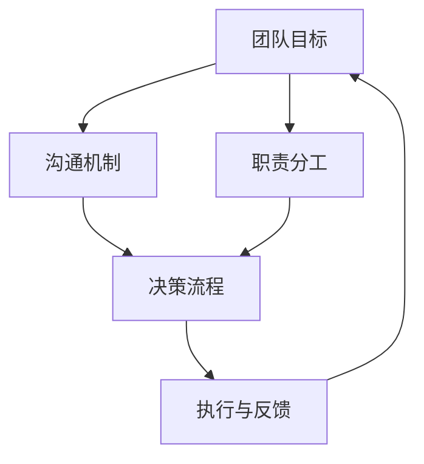

                 

# 团队协同效应：maximizing team synergy

> **关键词：团队协同效应、团队架构、沟通算法、决策算法、数学模型、项目实战、优化策略、未来趋势**

> **摘要：本文深入探讨了团队协同效应的核心概念、架构、算法原理、数学模型、实际应用和优化策略。通过详细阐述和案例分析，本文为团队协同提供了实用的指导，展望了其未来的发展趋势。**

## 第一部分：核心概念与架构

### 第1章：团队协同效应概述

#### 1.1 团队协同效应的定义

团队协同效应是指在一个团队中，通过成员之间的有效沟通、合理分工和高效决策，使得团队整体表现超越个体成员表现之和的现象。简而言之，团队协同效应是团队发挥出大于其各部分总和的效果。

在团队工作中，协同效应的重要性不可忽视。首先，它能够提高团队的执行效率，使得团队成员能够集中力量完成共同目标。其次，协同效应有助于知识共享和技能互补，使得团队成员能够在不同的领域和任务中互相支持，发挥出最大的潜力。最后，协同效应能够提升团队的凝聚力，增强团队成员之间的信任和合作意愿。

#### 1.2 团队协同效应的架构

团队协同效应的实现依赖于一套完整的架构，该架构包括以下几个关键组成部分：

1. **团队目标**：明确团队的整体目标和任务，为团队成员提供共同的方向和动力。
2. **沟通机制**：建立有效的沟通渠道和流程，确保信息的畅通和透明。
3. **职责分工**：根据团队成员的能力和专长，合理分配任务和责任。
4. **决策流程**：制定明确的决策机制，确保团队在面临问题时能够快速、高效地作出决策。
5. **执行与反馈**：落实决策，执行任务，并通过定期反馈机制评估团队表现，不断优化。

以下是一个简化的团队协同效应架构的 Mermaid 流程图：



#### 1.3 团队协同效应与传统团队管理的区别

传统团队管理强调的是对团队成员的监督和控制，侧重于任务的完成和目标的达成。而团队协同效应则更加注重团队成员之间的互动和合作，强调通过协同来提升整体效能。

传统团队管理往往依赖于权威式的决策，而团队协同效应则倡导扁平化的决策结构，鼓励团队成员参与决策过程。

此外，传统团队管理更关注任务分解和分工，而团队协同效应则更加注重知识共享和技能互补，通过协同来实现团队的整体提升。

总之，团队协同效应与传统团队管理在核心目标和实施方法上存在显著差异，团队协同效应更能够适应现代复杂项目的需求。

### 第2章：团队协同效应的核心算法原理

#### 2.1 沟通算法原理

团队协同效应的实现离不开高效的沟通。以下是一个简单的沟通算法原理，通过伪代码来描述：

```python
def communicate(message, team_members):
    for member in team_members:
        send_message(member, message)
        receive_message(member)

def send_message(member, message):
    # 实现消息发送逻辑

def receive_message(member, message):
    # 实现消息接收与处理逻辑
```

在这个算法中，`communicate` 函数负责遍历团队成员，分别发送和接收消息。`send_message` 和 `receive_message` 函数分别负责消息的发送和接收逻辑。

#### 2.2 决策算法原理

决策是团队协同效应中的关键环节。以下是一个简单的决策算法原理，通过伪代码来描述：

```python
def make_decision(option_list, criteria):
    best_option = None
    max_score = 0
    for option in option_list:
        score = evaluate_option(option, criteria)
        if score > max_score:
            max_score = score
            best_option = option
    return best_option

def evaluate_option(option, criteria):
    # 实现选项评估逻辑
```

在这个算法中，`make_decision` 函数负责从给定的选项列表中选出最佳选项。`evaluate_option` 函数负责对每个选项进行评估，并返回一个评分。

### 第3章：团队协同效应的数学模型与公式

#### 3.1 数学模型概述

团队协同效应的数学模型用于量化团队整体效能与个体效能之间的关系。一个基本的数学模型可以表示为：

$$ 效应值 = (1 + r \times n) \times (效率_1 + 效率_2 + ... + 效率_n) - (效率_1 + 效率_2 + ... + 效率_n) $$

其中：
- `效应值`：团队的整体效应值。
- `r`：协同系数，表示团队协同效应的强度。
- `n`：团队成员数量。
- `效率_1, 效率_2, ..., 效率_n`：每个团队成员的效率。

#### 3.2 关键公式解析

以下是对上述公式的详细解释和举例说明。

**公式解析：**

1. **协同系数 `r`**：协同系数反映了团队成员协作的程度。通常情况下，`r` 的取值范围在0到1之间。当 `r` 接近1时，表示团队高度协同，每个成员的贡献能够得到最大程度的放大；当 `r` 接近0时，表示团队协作程度较低，成员之间的协同效应较小。

2. **团队成员效率**：每个成员的效率可以用百分比表示，表示他们在完成特定任务时的表现。例如，一个成员的效率为80%，意味着他在执行任务时能够完成80%的工作量。

3. **整体效应值**：团队的整体效应值是团队协同效应的核心指标。它表示团队在协同工作时的整体效能。

**例子：**

假设团队中有两名成员，他们的效率分别为80%和90%，协同系数为1.2。计算团队的整体效应值。

$$ 效应值 = (1 + 1.2 \times 2) \times (0.8 + 0.9) - (0.8 + 0.9) $$
$$ 效应值 = 3.2 \times 1.7 - 1.7 $$
$$ 效应值 = 5.44 - 1.7 $$
$$ 效应值 = 3.74 $$

这意味着，通过团队协同，整体效应值提高了3.74，这表明团队在协同工作时的效能远高于单独工作时的总和。

## 第二部分：实践应用

### 第4章：团队协同效应在实际项目中的应用

#### 4.1 项目背景

为了更好地理解团队协同效应在实际项目中的应用，我们来看一个实际项目的案例。假设我们正在开发一个大型电子商务平台，该项目需要多个团队的紧密协作来完成。这些团队包括前端开发团队、后端开发团队、测试团队、UI/UX设计团队等。

#### 4.2 团队架构与职责分工

在电子商务平台项目中，我们首先需要明确每个团队的角色和职责。以下是各团队的主要职责：

1. **前端开发团队**：负责网站的前端设计和开发，确保用户界面的美观和易用性。
2. **后端开发团队**：负责网站的后端逻辑和数据存储，确保系统的稳定性和性能。
3. **测试团队**：负责对网站进行全面的测试，确保功能的完整性和可靠性。
4. **UI/UX设计团队**：负责网站的用户界面和用户体验设计，确保用户能够轻松、愉快地使用网站。

在职责分工明确之后，我们需要设计一个有效的沟通和决策流程，以确保团队之间的协作顺畅。以下是我们的设计：

1. **沟通机制**：每个团队都有定期会议，用于汇报工作进度和讨论遇到的问题。同时，团队成员之间可以通过即时通讯工具进行实时沟通。
2. **决策流程**：在项目遇到关键决策时，各团队负责人会进行讨论，并根据共识做出决策。对于特别重大的决策，可能会邀请更高层的管理人员参与。

#### 4.3 项目执行与反馈

项目执行过程中，团队之间需要紧密协作，确保每个部分都能按时完成。以下是项目执行和反馈的关键步骤：

1. **前端开发团队**：在UI/UX设计团队提供的设计方案基础上，进行前端开发工作。在开发过程中，定期与UI/UX设计团队进行沟通，确保设计的实现符合预期。
2. **后端开发团队**：根据前端开发团队的进度，进行后端逻辑和数据存储的开发。在开发过程中，与前端开发团队密切合作，确保前后端能够无缝对接。
3. **测试团队**：在整个项目开发过程中，对各个模块进行持续测试，确保系统的稳定性和性能。测试团队会定期与前端和后端团队沟通，解决测试中发现的任何问题。
4. **UI/UX设计团队**：在项目开发过程中，持续优化用户界面和用户体验，确保用户能够享受到最佳的使用体验。

在项目执行的过程中，反馈机制至关重要。每个团队都需要定期进行工作总结和评估，及时发现和解决问题。同时，项目管理层需要通过定期的项目评估会议，对项目的整体进展进行监督和指导。

### 第5章：团队协同效应的代码实现

#### 5.1 开发环境搭建

为了实现团队协同效应的代码实现，我们需要搭建一个合适的项目开发环境。以下是搭建开发环境的步骤：

1. **确定开发语言**：根据项目的需求，选择一种合适的编程语言。在这个案例中，我们选择Python作为开发语言。
2. **安装Python环境**：在开发机器上安装Python环境，确保能够运行Python代码。
3. **搭建项目框架**：使用合适的框架（如Django、Flask等）搭建项目的基本框架，确保项目的结构清晰、易于维护。
4. **配置代码版本管理工具**：使用Git等代码版本管理工具，确保团队成员能够协同工作，并对代码进行有效的管理。

#### 5.2 源代码实现

以下是电子商务平台项目的主要代码实现。为了方便理解，我们将代码分为几个模块：

1. **用户管理模块**：负责用户的注册、登录和权限管理。
2. **商品管理模块**：负责商品的信息管理，包括商品的添加、编辑、删除和查询。
3. **订单管理模块**：负责订单的创建、支付和查询。
4. **评论管理模块**：负责用户对商品的评论管理。

以下是用户管理模块的源代码：

```python
# 用户管理模块

from flask import Flask, request, jsonify
from flask_sqlalchemy import SQLAlchemy

app = Flask(__name__)
app.config['SQLALCHEMY_DATABASE_URI'] = 'sqlite:///users.db'
db = SQLAlchemy(app)

class User(db.Model):
    id = db.Column(db.Integer, primary_key=True)
    username = db.Column(db.String(80), unique=True, nullable=False)
    password = db.Column(db.String(120), nullable=False)

@app.route('/register', methods=['POST'])
def register():
    data = request.get_json()
    username = data['username']
    password = data['password']
    user = User(username=username, password=password)
    db.session.add(user)
    db.session.commit()
    return jsonify(message='User registered successfully'), 201

@app.route('/login', methods=['POST'])
def login():
    data = request.get_json()
    username = data['username']
    password = data['password']
    user = User.query.filter_by(username=username, password=password).first()
    if user:
        return jsonify(message='Login successful'), 200
    else:
        return jsonify(message='Invalid credentials'), 401
```

在这个模块中，我们使用了Flask框架和SQLAlchemy数据库工具，实现了用户的注册和登录功能。

#### 5.3 代码解读与分析

用户管理模块的核心功能是用户的注册和登录。在注册过程中，用户需要提供用户名和密码，系统会将这些信息存储在数据库中。在登录过程中，用户需要输入用户名和密码，系统会验证这些信息是否与数据库中的记录匹配。

以下是对关键代码的解读：

1. **数据库模型**：`User` 类是数据库模型，它包含了用户的用户名和密码字段。使用SQLAlchemy可以将这个模型映射到数据库表。
2. **注册接口**：`register` 函数是注册接口，它接收用户发送的JSON数据，提取用户名和密码，并创建一个新的 `User` 对象。然后，将这个对象添加到数据库中，并提交事务。
3. **登录接口**：`login` 函数是登录接口，它接收用户发送的JSON数据，提取用户名和密码，并查询数据库中是否存在匹配的用户记录。如果找到匹配的用户，返回登录成功的信息；否则，返回登录失败的信息。

这个用户管理模块的代码实现了用户注册和登录的基本功能，为电子商务平台提供了用户认证机制。在项目开发过程中，还需要继续完善其他模块的功能，实现一个完整的电子商务平台。

### 第6章：团队协同效应案例分析

#### 6.1 案例介绍

为了更好地理解团队协同效应在实际项目中的应用，我们来看一个成功的团队协同效应案例。这个案例是一家大型互联网公司开发的一款热门社交媒体应用的上线过程。

这家互联网公司汇聚了来自世界各地的优秀开发人员、设计师和市场人员。他们共同的目标是打造一款功能强大、用户体验优秀的社交媒体应用。在这个项目中，团队协同效应发挥了至关重要的作用。

#### 6.2 案例分析

在这个案例中，团队协同效应的要素主要包括以下几个方面：

1. **明确的目标**：项目的目标非常明确，即打造一款受欢迎的社交媒体应用。这个目标为团队成员提供了清晰的方向和动力。
2. **高效的沟通机制**：团队成员之间建立了高效的沟通渠道，包括定期会议、即时通讯和代码协作工具。这些工具确保了信息的高效传递和问题的及时解决。
3. **合理的职责分工**：根据团队成员的专长和兴趣，合理分配了任务和责任。前端开发团队负责应用的用户界面和交互设计，后端开发团队负责应用的服务器和数据库开发，市场团队负责推广和用户反馈收集。
4. **协作的决策流程**：在面临关键决策时，团队成员会进行充分的讨论，并根据共识作出决策。这种协作的决策流程确保了团队在决策过程中能够充分利用成员的知识和经验。
5. **持续反馈和优化**：团队成员定期进行工作总结和评估，及时反馈问题和改进措施。这种持续反馈和优化的机制保证了项目能够不断进步和完善。

#### 6.3 案例的成功经验

通过这个案例，我们可以总结出一些成功的团队协同效应经验：

1. **明确的目标**：明确的目标是团队协同效应的基石。只有当团队成员对目标有清晰的认识时，才能共同努力，实现目标的最大化。
2. **高效的沟通机制**：高效的沟通机制是团队协同效应的关键。通过建立多种沟通渠道和工具，确保团队成员之间的信息畅通和问题解决。
3. **合理的职责分工**：合理的职责分工能够充分发挥团队成员的专长和兴趣，提高工作效率和质量。
4. **协作的决策流程**：协作的决策流程能够充分利用团队成员的知识和经验，确保决策的准确性和有效性。
5. **持续反馈和优化**：持续反馈和优化能够不断改进团队的工作方式，提高团队的协同效应。

通过这些经验，我们可以更好地理解和应用团队协同效应，提高团队的工作效率和成果。

### 第7章：团队协同效应的优化策略

#### 7.1 优化策略概述

团队协同效应的优化是提高团队工作效率和质量的重要手段。以下是一些常见的优化策略：

1. **培训与能力提升**：定期组织培训，提高团队成员的专业技能和综合素质。这有助于团队成员更好地协作，提高团队的协同效应。
2. **流程优化**：对团队的工作流程进行持续优化，减少不必要的环节和重复工作，提高工作效率。
3. **技术工具**：引入先进的协作工具和平台，如敏捷开发工具、代码管理工具、即时通讯工具等，提高团队协作的效率和效果。
4. **沟通机制完善**：完善沟通机制，确保团队成员之间的信息畅通和问题解决。例如，定期召开团队会议、设置沟通渠道等。
5. **激励制度**：建立合理的激励制度，激发团队成员的积极性和创造力，提高团队的协同效应。

#### 7.2 实施优化策略

以下是如何实施团队协同效应优化策略的具体步骤：

1. **评估现状**：首先，对团队的工作流程、沟通机制、技术水平等方面进行评估，了解当前团队协同效应的实际情况。
2. **制定优化方案**：根据评估结果，制定具体的优化方案。方案应包括培训计划、流程优化方案、技术工具引入方案、沟通机制完善方案等。
3. **实施与监控**：按照优化方案实施，并对实施过程进行监控。确保各项优化措施得到有效执行，及时调整和改进。
4. **评估效果**：在优化措施实施一段时间后，对团队的工作效率和质量进行评估，了解优化策略的实际效果。
5. **持续改进**：根据评估结果，不断优化和改进团队的工作流程、沟通机制和技术工具，提高团队的协同效应。

#### 7.3 优化效果评估

优化效果评估是确保团队协同效应优化策略有效性的关键步骤。以下是一些评估方法和指标：

1. **工作效率**：通过对比优化前后的工作效率，评估优化措施对团队工作效率的影响。例如，可以计算任务完成时间、代码提交频率等指标。
2. **质量问题**：通过对比优化前后的质量问题，评估优化措施对团队质量保障的影响。例如，可以计算bug数量、用户反馈数量等指标。
3. **团队满意度**：通过调查团队成员的满意度，了解优化措施对团队氛围和士气的影响。可以设置满意度调查问卷，了解团队成员对优化措施的反馈。
4. **业务成果**：通过对比优化前后的业务成果，评估优化措施对团队业务目标实现的影响。例如，可以计算项目成功率、用户增长率等指标。

通过以上评估方法和指标，可以全面了解团队协同效应优化策略的实际效果，为后续的改进提供依据。

### 第8章：团队协同效应的未来发展趋势

#### 8.1 发展趋势概述

团队协同效应作为团队管理工作的重要组成部分，正随着技术的进步和企业管理理念的创新而不断发展。未来，团队协同效应将呈现以下几个主要发展趋势：

1. **数字化与智能化**：随着大数据、人工智能、物联网等技术的不断发展，团队协同效应将更加数字化和智能化。通过数据分析和人工智能算法，团队可以更准确地识别和解决协作中的问题，提高协作效率。
2. **虚拟化与分布式**：随着远程工作和虚拟团队的普及，团队协同效应将向虚拟化和分布式方向发展。通过云协作平台和虚拟现实技术，团队成员可以不受时间和地点的限制，实现高效的协同工作。
3. **个性化和定制化**：未来的团队协同效应将更加注重个性化和定制化。通过了解团队成员的个性特点和偏好，团队可以设计出更加适合个体和整体发展的协作模式。
4. **跨领域与跨界整合**：随着跨界整合和跨领域合作的日益增多，团队协同效应将不仅仅局限于单一领域或行业，而是向跨领域和跨界整合方向发展。这将为团队带来更多的创新和协同机会。

#### 8.2 技术创新与变革

技术创新是推动团队协同效应发展的重要动力。以下是一些关键技术创新及其对团队协同效应的影响：

1. **人工智能与机器学习**：人工智能和机器学习技术可以用于团队协作的各个方面，包括任务分配、工作流程优化、决策支持等。通过智能算法，团队可以更加高效地完成任务。
2. **虚拟现实与增强现实**：虚拟现实和增强现实技术可以为团队提供一个沉浸式的协作环境，使得团队成员可以更加直观地理解和解决问题。这有助于提高团队的创新能力和协作效率。
3. **区块链技术**：区块链技术可以为团队协作提供更加安全、透明的数据共享机制。通过智能合约，团队可以自动执行协作协议，减少人为干预和纠纷。
4. **云计算与大数据**：云计算和大数据技术可以为团队提供一个强大的计算和数据存储平台，使得团队能够快速获取和分析大量数据，从而做出更加明智的决策。

#### 8.3 未来应用前景

随着团队协同效应的不断发展和技术的不断创新，其应用前景将非常广阔：

1. **企业协作**：在企业管理中，团队协同效应将成为企业竞争力的关键因素。通过优化团队协作，企业可以更高效地完成项目，提高市场响应速度。
2. **远程工作**：随着远程工作的普及，团队协同效应将在远程工作中发挥重要作用。通过虚拟化协作平台，团队成员可以跨越地理障碍，实现高效协作。
3. **创新孵化**：团队协同效应将为创新孵化提供有力支持。通过跨领域、跨学科的团队协作，可以产生更多具有颠覆性的创新成果。
4. **公共管理**：在公共管理领域，团队协同效应可以用于解决复杂的社会问题。通过多部门、多领域的协同合作，可以更有效地应对公共危机和公共服务挑战。

总之，团队协同效应在未来将发挥越来越重要的作用，成为推动社会进步和企业发展的重要力量。

### 附录A：团队协同效应工具与资源

#### A.1 工具介绍

为了实现高效的团队协同效应，以下是一些常用的团队协作工具：

1. **Trello**：一个基于看板的项目管理工具，适用于任务分解、进度追踪和协作。
2. **Slack**：一个即时通讯工具，提供聊天室、私人对话和通知功能，支持文件共享和集成其他应用。
3. **JIRA**：一个专业的敏捷开发工具，适用于任务管理、进度追踪和团队协作。
4. **Confluence**：一个协作平台，用于文档创建、知识管理和团队沟通。
5. **Zoom**：一个视频会议和在线协作工具，适用于远程会议和团队讨论。

#### A.2 资源链接

以下是一些与团队协同效应相关的资源和学习材料：

1. **《敏捷团队管理》**：一本关于敏捷团队管理的经典书籍，提供了许多实用的实践方法和策略。
2. **《团队的五大障碍》**：这本书详细分析了团队面临的五大障碍，并提供了解决方案。
3. **《团队协同效应研究》**：一篇关于团队协同效应的学术论文，提供了深入的数学模型和案例分析。
4. **《团队协作工具比较》**：一篇关于团队协作工具的比较分析文章，帮助选择合适的工具。

通过这些工具和资源，团队可以更好地实现协同效应，提高工作效率和成果。

### 附录B：团队协同效应相关术语

#### B.1 术语定义

以下是与团队协同效应相关的一些术语及其定义：

1. **协同效应**：指团队整体效能大于各成员效能之和的现象。
2. **沟通机制**：指团队内部沟通的渠道、流程和方法。
3. **职责分工**：指根据团队成员的能力和专长，分配相应的任务和责任。
4. **决策流程**：指团队在面临问题时，如何进行讨论、分析和决策的过程。
5. **反馈机制**：指团队在任务执行后，如何进行工作总结、评估和改进的机制。
6. **协同系数**：指衡量团队协同效应强度的一个参数。
7. **效率**：指成员在完成特定任务时的表现能力。

#### B.2 术语解释

1. **协同效应**：团队协同效应是指团队成员通过有效沟通、合理分工和高效决策，共同实现团队目标的现象。这种效应能够提高团队的整体效能，使得团队在完成复杂任务时更加高效和有序。
2. **沟通机制**：沟通机制是团队内部沟通的框架和工具，包括定期的会议、即时通讯工具、邮件通知等。一个良好的沟通机制能够确保团队成员之间信息畅通，减少误解和冲突。
3. **职责分工**：职责分工是根据团队成员的能力和专长，将任务分配给合适的成员。合理的职责分工能够充分发挥团队成员的潜力，提高工作效率和质量。
4. **决策流程**：决策流程是团队在面临问题时，如何进行讨论、分析和决策的过程。一个高效的决策流程能够确保团队快速做出正确的决策，减少犹豫和浪费。
5. **反馈机制**：反馈机制是团队在任务执行后，如何进行工作总结、评估和改进的机制。有效的反馈机制能够帮助团队发现和解决问题，持续提升团队表现。
6. **协同系数**：协同系数是衡量团队协同效应强度的一个参数，通常介于0到1之间。协同系数越高，表示团队成员之间的协作程度越高，整体效能提升越明显。
7. **效率**：效率是指成员在完成特定任务时的表现能力，通常以百分比表示。高效率的成员能够更快、更准确地完成任务，为团队的成功做出重要贡献。

通过理解和应用这些术语，团队可以更好地实现协同效应，提高整体工作效率和成果。

