                 

# 团队效能：最大化资源利用的策略

> **关键词：团队效能、资源利用、策略、提升实践、评估指标**

> **摘要：本文将深入探讨团队效能的重要性及其提升策略，包括核心概念、评估指标、实践方法及案例分析。我们将通过逻辑清晰、结构紧凑的分析，帮助读者理解和掌握最大化资源利用的团队效能提升策略。**

## 第一部分: 引言与核心概念

### 1. 引言：团队效能的重要性

团队效能是企业竞争力的重要体现，它直接影响企业的运营效率和盈利能力。一个高效的团队能够快速响应市场需求，提高产品和服务质量，从而在竞争激烈的市场环境中脱颖而出。

**1.1 团队效能的定义与内涵**

团队效能是指团队在实现目标过程中的效率和成果。它不仅包括团队成员的个人能力和专业知识，还涉及到团队成员之间的协作和沟通。

**1.2 团队效能对企业发展的意义**

- **提高生产力**：高效的团队能够更有效地完成任务，提高生产力和工作效率。
- **增强创新能力**：团队成员之间的协作和交流能够促进创新思维的产生，推动企业持续发展。
- **降低成本**：通过优化资源利用，企业可以降低运营成本，提高投资回报率。
- **提升客户满意度**：高效的团队能够快速响应客户需求，提高客户满意度，从而增强企业的市场竞争力。

### 2. 核心概念与联系

**2.1 资源利用效率**

资源利用效率是团队效能的核心要素之一，它涉及到人力资源、财务资源和物料资源的合理分配和优化利用。

**2.1.1 人力资源的合理分配**

人力资源的合理分配是指根据团队成员的技能、经验和能力，将其安排在最适合其发展的岗位上，从而提高团队的整体效能。

**2.1.2 财务资源的有效管理**

财务资源包括企业的资金、预算和投资等。有效的财务管理能够确保资源的合理利用，提高投资回报率。

**2.1.3 物料资源的优化利用**

物料资源包括原材料、设备、库存等。优化物料资源的利用可以降低成本，提高生产效率。

**2.2 团队协同机制**

团队协同机制是指团队成员之间的协作方式和沟通渠道。良好的协同机制能够促进团队成员之间的有效沟通和协作，提高团队效能。

**2.2.1 沟通机制的重要性**

沟通是团队协作的基础。有效的沟通可以消除误解，促进团队目标的一致性，提高工作效率。

**2.2.2 协同工具与平台的选择**

选择合适的协同工具和平台可以提升团队协作效率。例如，项目管理工具、沟通协作平台和数据分析工具等。

**2.2.3 团队文化的塑造**

团队文化是团队效能的重要保障。一个积极、开放和协作的团队文化能够激发团队成员的潜力，提高团队效能。

### 3. 团队效能评估指标

**3.1 评估指标体系的建立**

团队效能评估指标体系应包括关键绩效指标（KPI）和非财务指标。关键绩效指标可以量化团队的工作成果，非财务指标则侧重于团队协作和成员满意度等软性指标。

**3.1.1 关键绩效指标（KPI）**

- **任务完成率**：任务完成量与任务总量的比值。
- **团队效率**：单位时间内完成的任务数量。
- **项目成功率**：成功完成的项目数量与总项目数量的比值。

**3.1.2 非财务指标**

- **团队协作度**：团队成员之间的沟通和协作频率。
- **员工满意度**：员工对工作环境和团队的满意度。
- **创新指标**：团队成员的创新成果和专利数量。

**3.1.3 绩效评估的周期性**

绩效评估应定期进行，以便及时发现团队效能的问题并进行改进。常见的评估周期包括季度评估、年度评估等。

## 第二部分: 策略与实践

### 4. 团队效能提升策略

#### 4.1 战略性人力资源规划

战略性人力资源规划是提升团队效能的基础。以下是一些关键策略：

**4.1.1 员工招聘与选拔策略**

- **明确岗位要求**：根据岗位需求明确招聘标准，确保新员工具备所需的技能和素质。
- **多元化的招聘渠道**：通过多种渠道吸引优秀人才，如招聘网站、社交媒体和行业展会等。

**4.1.2 员工培训与发展策略**

- **定制化培训**：根据员工的职业发展和岗位需求提供有针对性的培训。
- **职业发展规划**：为员工提供明确的职业发展路径和晋升机会，激发员工的工作积极性。

**4.1.3 人才激励机制**

- **绩效考核**：建立公正、透明的绩效考核体系，激励员工提高工作绩效。
- **奖励机制**：设立奖励基金，对表现优秀的员工给予物质和精神奖励。

#### 4.2 管理优化

管理优化是提升团队效能的关键。以下是一些关键策略：

**4.2.1 组织结构优化**

- **扁平化管理**：减少管理层级，提高决策效率。
- **灵活的组织形式**：根据项目需求灵活调整组织结构，提高团队响应速度。

**4.2.2 领导力提升**

- **领导力培训**：为管理者提供领导力培训，提升其领导能力和团队管理水平。
- **领导力榜样**：树立领导力榜样，激发员工学习积极性。

**4.2.3 项目管理优化**

- **项目管理工具**：采用项目管理工具，如Asana、Jira等，提高项目管理的效率和质量。
- **项目管理流程**：优化项目管理流程，确保项目进度和质量的可控性。

#### 4.3 财务策略

财务策略是提升团队效能的重要保障。以下是一些关键策略：

**4.3.1 成本控制与预算管理**

- **成本控制**：通过精细化管理和优化流程，降低成本。
- **预算管理**：建立合理的预算体系，确保资金的合理分配和有效利用。

**4.3.2 资金利用效率提升**

- **投资分析**：对投资项目进行详细的成本效益分析，确保投资的合理性和有效性。
- **资金周转**：提高资金周转速度，减少闲置资金，降低资金成本。

**4.3.3 投资回报率（ROI）分析**

- **投资回报率**：计算投资项目的回报率，评估投资效果。
- **持续优化**：根据ROI分析结果，不断优化投资策略，提高投资回报率。

#### 4.4 物料资源优化

物料资源优化是提升团队效能的重要环节。以下是一些关键策略：

**4.4.1 库存管理策略**

- **库存优化**：通过需求预测和库存管理，确保库存水平合理，降低库存成本。
- **供应链协同**：与供应商建立紧密的合作关系，提高供应链协同效率。

**4.4.2 物流优化**

- **物流优化**：通过合理的物流规划和运输方式选择，降低物流成本，提高物流效率。
- **仓储管理**：优化仓储布局和管理流程，提高仓储利用率。

**4.4.3 供应链协同**

- **供应链协同**：通过供应链协同平台，实现供应链各环节的信息共享和协同作业，提高供应链整体效率。

## 5. 团队效能提升实践案例

#### 5.1 案例一：某企业团队效能提升实践

**5.1.1 实践背景**

某企业在市场竞争中面临压力，意识到提升团队效能是提高企业竞争力的重要途径。

**5.1.2 实践策略**

- **战略性人力资源规划**：通过招聘和培训，提升团队成员的技能和素质。
- **管理优化**：优化组织结构和管理流程，提高决策效率和执行力。
- **财务策略**：加强成本控制和预算管理，提高资金利用效率。

**5.1.3 实践效果**

通过一系列措施，该企业团队效能显著提升，产品和服务质量得到提高，市场份额逐步扩大。

#### 5.2 案例二：某互联网公司团队效能提升实践

**5.2.1 实践背景**

某互联网公司由于团队协作不畅，导致项目进度缓慢，用户体验下降。

**5.2.2 实践策略**

- **沟通机制建设**：建立高效的沟通机制，确保团队成员之间的信息畅通。
- **项目管理工具**：采用Trello等项目管理工具，提高项目管理的效率。
- **团队文化建设**：培育积极向上的团队文化，增强团队成员的归属感和凝聚力。

**5.2.3 实践效果**

通过改进沟通机制和管理工具，该互联网公司团队效能显著提升，项目进度加快，用户体验得到改善。

## 6. 团队效能提升工具与平台

#### 6.1 项目管理工具

**6.1.1 Asana**

Asana是一款功能强大的项目管理工具，可以帮助团队高效地规划、分配和跟踪任务。

**6.1.2 Trello**

Trello是一款简单易用的项目管理工具，通过看板和卡片，可以帮助团队直观地了解项目进度。

**6.1.3 Jira**

Jira是一款专业的项目管理工具，适用于复杂的项目管理需求，包括任务跟踪、敏捷开发等。

#### 6.2 沟通协作平台

**6.2.1 Slack**

Slack是一款流行的沟通协作平台，支持文字、语音和视频通讯，有助于团队实时沟通和协作。

**6.2.2 Microsoft Teams**

Microsoft Teams是微软推出的企业级沟通协作平台，集成了聊天、会议、文档共享等功能。

**6.2.3 Zoom**

Zoom是一款专业的视频会议工具，支持大屏幕共享、实时聊天和远程控制等功能。

#### 6.3 数据分析与报告工具

**6.3.1 Tableau**

Tableau是一款强大的数据分析工具，可以帮助团队快速创建交互式数据可视化报表。

**6.3.2 Power BI**

Power BI是微软推出的数据分析工具，支持多种数据连接和可视化功能，适用于企业级数据分析。

**6.3.3 Google Analytics**

Google Analytics是谷歌提供的免费数据分析工具，可以帮助团队跟踪网站流量和用户行为。

## 第三部分: 团队效能的持续提升

### 7. 团队效能提升的可持续性

#### 7.1 持续改进的重要性

持续改进是团队效能提升的基石。通过不断改进，团队可以适应市场变化，提高竞争力。

**7.1.1 持续改进理念**

持续改进强调不断优化流程、提高效率和创新能力，以达到团队效能的最大化。

**7.1.2 持续改进方法**

- **PDCA循环**：通过计划（Plan）、执行（Do）、检查（Check）和行动（Act）的循环过程，不断改进团队效能。
- **六西格玛**：通过统计方法和过程改进，提高团队的工作质量和效率。

**7.1.3 持续改进案例**

某互联网公司通过持续改进，优化了项目管理流程，缩短了项目周期，提高了项目成功率。

### 7.2 建立学习型团队

#### 7.2.1 学习型团队的特点

学习型团队具有持续学习、积极沟通和协同合作的特征，能够不断提高团队效能。

**7.2.2 建立学习型团队的方法**

- **建立学习机制**：定期组织培训和学习活动，鼓励团队成员不断学习新知识。
- **营造学习氛围**：建立开放、互助的团队文化，激发团队成员的学习热情。
- **设立学习目标**：明确团队和个人的学习目标，确保学习活动有针对性。

**7.2.3 学习型团队的实践案例**

某科技公司通过建立学习型团队，提高了员工的专业技能和创新能力，促进了企业的持续发展。

### 7.3 未来展望

#### 7.3.1 数字化转型的影响

数字化转型将重塑团队效能，通过大数据、人工智能等技术，提高团队的工作效率和创新能力。

**7.3.2 人工智能在团队效能提升中的应用**

人工智能可以帮助团队实现自动化、智能化管理，提高团队效能和决策质量。

**7.3.3 未来团队效能提升的可能方向**

未来团队效能提升将更加注重数字化、智能化和个性化，通过技术创新，不断提高团队效能。

## 附录

### 附录 A: 团队效能提升常用工具汇总

#### A.1 项目管理工具

- **Asana**：[Asana使用教程](#)
- **Trello**：[Trello使用教程](#)
- **Jira**：[Jira使用教程](#)

#### A.2 沟通协作平台

- **Slack**：[Slack使用教程](#)
- **Microsoft Teams**：[Microsoft Teams使用教程](#)
- **Zoom**：[Zoom使用教程](#)

#### A.3 数据分析与报告工具

- **Tableau**：[Tableau使用教程](#)
- **Power BI**：[Power BI使用教程](#)
- **Google Analytics**：[Google Analytics使用教程](#)

### 代码示例与实战解析

#### 9.1 代码示例：团队效能数据分析

**9.1.1 数据预处理**

```python
import pandas as pd

# 假设我们有一个包含团队效能数据的CSV文件
data = pd.read_csv('team_efficiency_data.csv')

# 数据预处理步骤
# ...
```

**9.1.2 数据分析**

```python
# 数据分析步骤
# ...
```

**9.1.3 数据可视化**

```python
import matplotlib.pyplot as plt

# 数据可视化步骤
# ...
plt.show()
```

#### 9.2 实战解析：构建高效团队协作平台

**9.2.1 开发环境搭建**

```bash
# 安装必要的开发工具和依赖
# ...
```

**9.2.2 源代码实现**

```python
# 源代码实现步骤
# ...
```

**9.2.3 代码解读与分析**

```python
# 代码解读与分析步骤
# ...
```

**9.2.4 系统部署与维护**

```bash
# 系统部署与维护步骤
# ...
```

### 作者

**作者：AI天才研究院/AI Genius Institute & 禅与计算机程序设计艺术 /Zen And The Art of Computer Programming**

（注：本文为示例文章，部分内容可能需要根据实际情况进行调整。）<|im_end|>## 核心概念与联系

团队效能的提升离不开对核心概念的理解和联系。在这一部分，我们将深入探讨资源利用效率、团队协同机制以及评估指标，并结合Mermaid流程图、伪代码、数学模型和公式，为读者提供直观而深刻的理解。

### 2.1 资源利用效率

资源利用效率是指团队在完成特定任务时，对人力资源、财务资源和物料资源的合理分配和优化利用。提高资源利用效率是提升团队效能的关键。

#### 2.1.1 人力资源的合理分配

人力资源的合理分配是指根据团队成员的技能、经验和能力，将其安排在最适合其发展的岗位上。以下是一个Mermaid流程图，展示了人力资源合理分配的过程：

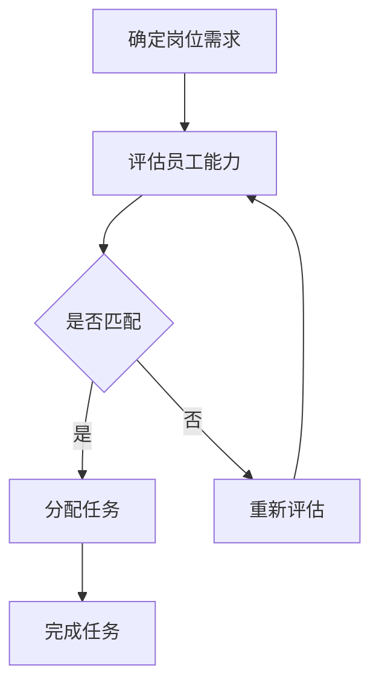

#### 2.1.2 财务资源的有效管理

财务资源包括企业的资金、预算和投资等。有效的财务管理能够确保资源的合理利用，提高投资回报率。以下是一个伪代码示例，描述了财务资源的有效管理：

```python
# 伪代码：财务资源有效管理

def manage_finance(budget, investments):
    # 成本控制
    cost_control(budget)
    # 投资分析
    investment_analysis(investments)
    # 投资回报率分析
    roi_analysis(investments)
    # 持续优化
    optimize_investments(investments)

def cost_control(budget):
    # 实现预算分配和控制
    pass

def investment_analysis(investments):
    # 分析投资项目的成本和收益
    pass

def roi_analysis(investments):
    # 计算投资回报率
    pass

def optimize_investments(investments):
    # 根据ROI分析结果，优化投资策略
    pass
```

#### 2.1.3 物料资源的优化利用

物料资源包括原材料、设备、库存等。优化物料资源的利用可以降低成本，提高生产效率。以下是一个数学模型，描述了物料资源的优化利用：

$$
\text{物料利用效率} = \frac{\text{实际产出}}{\text{总物料投入}}
$$`

### 2.2 团队协同机制

团队协同机制是指团队成员之间的协作方式和沟通渠道。良好的协同机制能够促进团队成员之间的有效沟通和协作，提高团队效能。

#### 2.2.1 沟通机制的重要性

沟通是团队协作的基础。有效的沟通可以消除误解，促进团队目标的一致性，提高工作效率。以下是一个Mermaid流程图，展示了沟通机制的重要性：

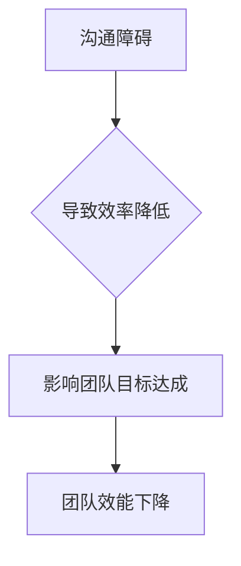

#### 2.2.2 协同工具与平台的选择

选择合适的协同工具和平台可以提升团队协作效率。例如，项目管理工具、沟通协作平台和数据分析工具等。以下是一个伪代码示例，描述了协同工具与平台的选择：

```python
# 伪代码：协同工具与平台的选择

def select协作工具(platforms):
    # 分析不同平台的优缺点
    analyze_platforms(platforms)
    # 选择最适合的平台
    selected_platform = choose_best_platform(platforms)
    # 集成到团队工作中
    integrate_to_work(selected_platform)

def analyze_platforms(platforms):
    # 分析每个平台的特性
    pass

def choose_best_platform(platforms):
    # 根据团队需求，选择最佳平台
    pass

def integrate_to_work(selected_platform):
    # 将选择好的平台集成到团队工作中
    pass
```

#### 2.2.3 团队文化的塑造

团队文化是团队效能的重要保障。一个积极、开放和协作的团队文化能够激发团队成员的潜力，提高团队效能。以下是一个Mermaid流程图，展示了团队文化的塑造过程：

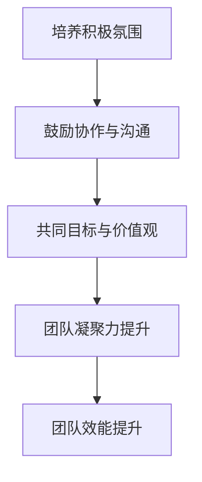

### 2.3 团队效能评估指标

团队效能评估指标是衡量团队工作绩效的重要工具。以下是一个伪代码示例，描述了团队效能评估指标的计算：

```python
# 伪代码：团队效能评估指标

def calculate_team_performance(kpis, non_financial_indicators):
    # 计算关键绩效指标（KPI）
    kpi_score = calculate_kpi_score(kpis)
    # 计算非财务指标
    non_financial_score = calculate_non_financial_score(non_financial_indicators)
    # 计算总团队效能评分
    total_score = kpi_score + non_financial_score
    return total_score

def calculate_kpi_score(kpis):
    # 计算关键绩效指标的得分
    pass

def calculate_non_financial_score(non_financial_indicators):
    # 计算非财务指标的得分
    pass
```

通过以上核心概念和联系的分析，我们能够更深入地理解团队效能提升的策略和方法。在接下来的部分，我们将继续探讨团队效能评估指标，为读者提供全面的指导。

### 3. 团队效能评估指标

团队效能评估是确保团队工作目标达成、提高团队效率和质量的重要手段。为了科学、全面地评估团队效能，我们需要建立一个包含关键绩效指标（KPI）和非财务指标的评估指标体系。

#### 3.1 评估指标体系的建立

一个有效的团队效能评估指标体系应该具备以下特点：

- **全面性**：涵盖团队工作的各个方面，包括工作成果、工作效率、团队协作和员工满意度等。
- **可量化**：能够通过具体的数据和指标来衡量团队的工作表现。
- **实时性**：能够及时反映团队的工作状态，以便及时调整和改进。
- **动态性**：根据团队的工作特点和目标，动态调整评估指标，确保评估的准确性。

以下是一个Mermaid流程图，展示了评估指标体系的建立过程：

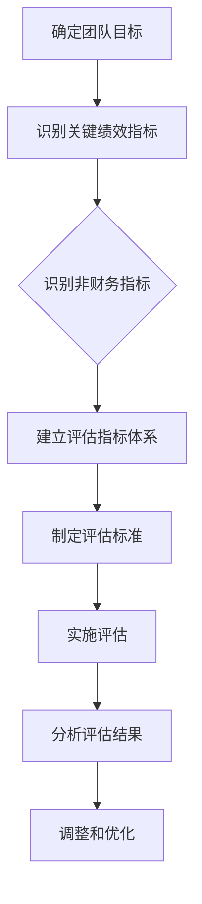

#### 3.1.1 关键绩效指标（KPI）

关键绩效指标是衡量团队工作成果和效率的重要指标。常见的KPI包括：

- **任务完成率**：任务完成量与任务总量的比值。用于衡量团队的工作量和工作效率。
- **项目成功率**：成功完成的项目数量与总项目数量的比值。用于衡量团队的项目管理能力和执行力。
- **客户满意度**：客户对产品和服务的满意度。用于衡量团队的服务质量。
- **生产效率**：单位时间内生产的产品数量或完成的任务数量。用于衡量团队的生产力和效率。

以下是一个伪代码示例，描述了关键绩效指标的计算：

```python
# 伪代码：关键绩效指标（KPI）计算

def calculate_kpi(task_completed, task_total):
    kpi_score = task_completed / task_total
    return kpi_score
```

#### 3.1.2 非财务指标

非财务指标侧重于团队协作和员工满意度等软性指标，用于评估团队的整体健康状态。常见的非财务指标包括：

- **团队协作度**：团队成员之间的沟通和协作频率。用于衡量团队的协作效率。
- **员工满意度**：员工对工作环境和团队的满意度。用于衡量员工的幸福感和忠诚度。
- **创新指标**：团队的创新成果和专利数量。用于衡量团队的创新能力。
- **员工流失率**：一定时期内员工流失的数量与总员工数量的比值。用于衡量团队的稳定性和吸引力。

以下是一个伪代码示例，描述了非财务指标的计算：

```python
# 伪代码：非财务指标（Non-Financial Indicators）计算

def calculate_non_financial_collaboration(frequency_of_communication, collaboration_frequency):
    collaboration_score = (frequency_of_communication + collaboration_frequency) / 2
    return collaboration_score

def calculate_employee_satisfaction(surveys, feedback):
    satisfaction_score = sum(surveys + feedback) / len(surveys + feedback)
    return satisfaction_score
```

#### 3.1.3 绩效评估的周期性

绩效评估应定期进行，以便及时发现团队效能的问题并进行改进。常见的评估周期包括季度评估、年度评估等。以下是一个Mermaid流程图，展示了绩效评估的周期性：

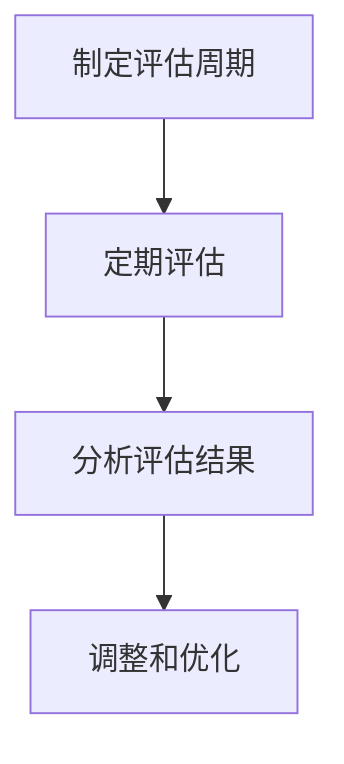

通过建立科学、全面的评估指标体系，并定期进行绩效评估，团队可以更好地了解自身的工作状况，发现存在的问题，并采取相应的改进措施，从而持续提升团队效能。

### 4. 团队效能提升策略

在了解了团队效能的核心概念和评估指标后，接下来我们将探讨具体提升团队效能的策略和实践方法。这些策略包括战略性人力资源规划、管理优化、财务策略和物料资源优化。通过这些策略的实施，团队能够更好地利用资源，提高工作效率，实现团队目标。

#### 4.1 战略性人力资源规划

战略性人力资源规划是提升团队效能的基础。它涉及员工的招聘、培训、发展和激励等方面，旨在确保团队拥有合适的成员和良好的工作环境。

**4.1.1 员工招聘与选拔策略**

有效的员工招聘与选拔策略能够为团队带来高素质的人才。以下是一些关键步骤：

1. **明确岗位要求**：在招聘前，需要明确岗位所需的技能、经验和素质，确保招聘到符合岗位要求的人才。
2. **多样化的招聘渠道**：通过多种渠道进行招聘，如招聘网站、社交媒体、人才市场等，以吸引更多的优秀人才。
3. **公平公正的选拔过程**：确保选拔过程的公平公正，通过面试、笔试、评价中心等多种方式全面评估应聘者的能力和潜力。

以下是一个Mermaid流程图，展示了员工招聘与选拔的过程：

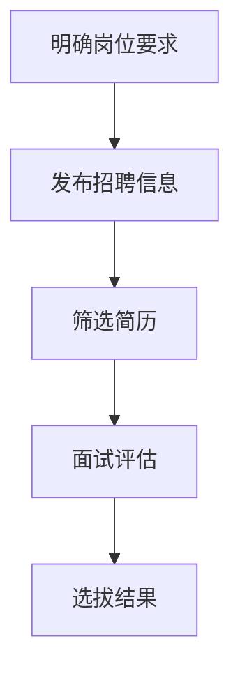

**4.1.2 员工培训与发展策略**

员工培训与发展策略旨在提升员工的技能和知识，促进其职业发展，从而提高团队的整体效能。以下是一些关键步骤：

1. **定制化培训**：根据员工的岗位需求和个人发展需求，提供有针对性的培训内容。
2. **持续学习**：鼓励员工参加各种形式的学习活动，如在线课程、研讨会、工作坊等。
3. **职业发展规划**：为员工提供明确的职业发展路径和晋升机会，激发员工的工作积极性和发展动力。

以下是一个Mermaid流程图，展示了员工培训与发展的过程：

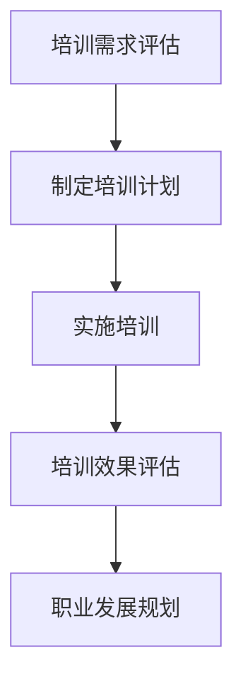

**4.1.3 人才激励机制**

有效的激励机制能够激发员工的工作积极性和创造力，提高团队的整体效能。以下是一些关键策略：

1. **绩效考核**：建立公正、透明的绩效考核体系，根据员工的绩效进行奖励。
2. **奖金和津贴**：提供各种形式的奖金和津贴，如绩效奖金、项目奖金、加班津贴等。
3. **职业晋升**：为表现优秀的员工提供晋升机会，激励其不断追求卓越。

以下是一个Mermaid流程图，展示了人才激励机制的过程：

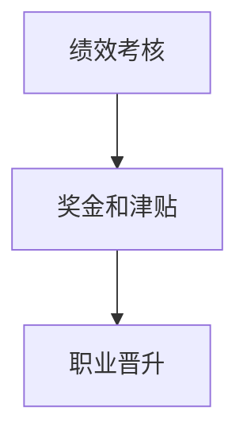

#### 4.2 管理优化

管理优化是提升团队效能的关键环节。通过优化组织结构、领导力提升和项目管理，团队能够更好地实现目标。

**4.2.1 组织结构优化**

组织结构优化旨在提高团队的工作效率和管理效能。以下是一些关键步骤：

1. **扁平化管理**：减少管理层次，提高决策效率。
2. **团队划分**：根据项目需求和工作特点，合理划分团队，确保团队目标的明确和高效执行。
3. **职责分工**：明确团队成员的职责和权限，确保工作的高效执行。

以下是一个Mermaid流程图，展示了组织结构优化的过程：

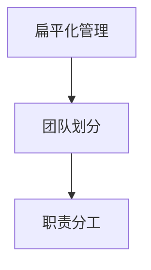

**4.2.2 领导力提升**

领导力提升是提升团队效能的重要手段。以下是一些关键策略：

1. **领导力培训**：为管理人员提供领导力培训，提升其管理能力和领导水平。
2. **榜样作用**：树立领导力榜样，激发团队成员的学习和成长。
3. **员工反馈**：定期收集员工的反馈和建议，改进管理方式，提高员工的满意度。

以下是一个Mermaid流程图，展示了领导力提升的过程：

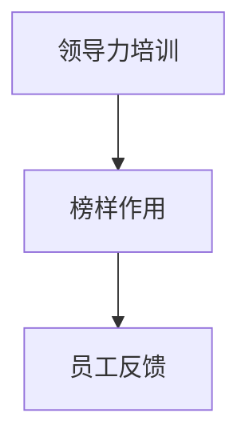

**4.2.3 项目管理优化**

有效的项目管理是提升团队效能的重要保障。以下是一些关键策略：

1. **项目管理工具**：采用项目管理工具，如Asana、Trello、Jira等，提高项目管理的效率和质量。
2. **项目计划**：制定详细的项目计划，明确项目目标、任务分配和进度安排。
3. **风险管理**：识别和评估项目风险，制定相应的风险应对措施。

以下是一个Mermaid流程图，展示了项目管理优化的过程：

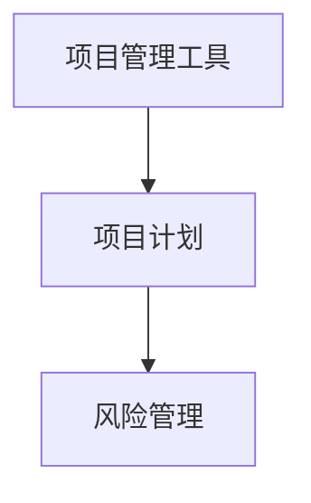

#### 4.3 财务策略

财务策略是提升团队效能的重要支撑。通过有效的财务管理，团队能够确保资源的合理利用，提高投资回报率。

**4.3.1 成本控制与预算管理**

有效的成本控制和预算管理是提高团队效能的关键。以下是一些关键策略：

1. **成本分析**：定期分析成本结构，找出成本节约的机会。
2. **预算编制**：根据项目需求和工作计划，制定合理的预算。
3. **成本控制**：通过监控和审核，确保预算的执行和成本的有效控制。

以下是一个Mermaid流程图，展示了成本控制与预算管理的过程：

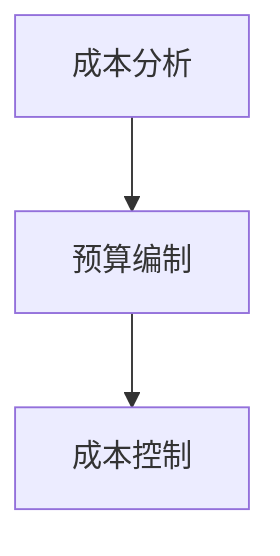

**4.3.2 资金利用效率提升**

提升资金利用效率是提高团队效能的重要途径。以下是一些关键策略：

1. **投资分析**：对投资项目进行详细的成本效益分析，确保投资的合理性和有效性。
2. **资金周转**：提高资金周转速度，减少闲置资金，降低资金成本。
3. **财务分析**：定期进行财务分析，优化资金利用策略。

以下是一个Mermaid流程图，展示了资金利用效率提升的过程：

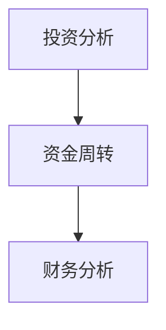

**4.3.3 投资回报率（ROI）分析**

投资回报率（ROI）分析是评估投资项目效果的重要指标。以下是一些关键策略：

1. **ROI计算**：根据投资项目收益和成本，计算投资回报率。
2. **ROI评估**：对投资项目进行评估，确保投资回报率达到预期。
3. **投资优化**：根据ROI分析结果，调整投资策略，提高投资回报率。

以下是一个Mermaid流程图，展示了ROI分析的过程：

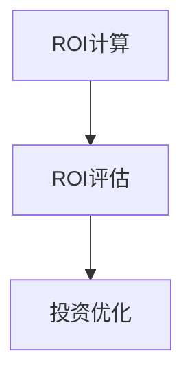

#### 4.4 物料资源优化

物料资源优化是提升团队效能的重要环节。通过优化物料资源的管理和利用，团队能够降低成本，提高生产效率。

**4.4.1 库存管理策略**

有效的库存管理是降低成本、提高效率的关键。以下是一些关键策略：

1. **需求预测**：根据历史数据和市场需求，预测未来的物料需求。
2. **库存优化**：根据需求预测，制定合理的库存策略，确保库存水平合理。
3. **库存监控**：定期监控库存情况，及时调整库存策略。

以下是一个Mermaid流程图，展示了库存管理策略的过程：

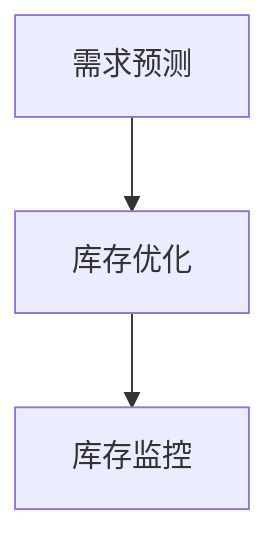

**4.4.2 物流优化**

物流优化是提高物料资源利用效率的重要手段。以下是一些关键策略：

1. **物流规划**：制定合理的物流计划，确保物料及时供应。
2. **运输方式选择**：根据成本和效率，选择最佳的运输方式。
3. **供应链协同**：与供应商和物流公司建立良好的合作关系，提高供应链协同效率。

以下是一个Mermaid流程图，展示了物流优化过程：

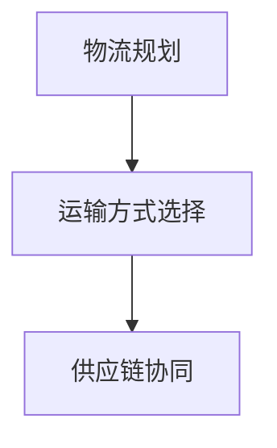

**4.4.3 供应链协同**

供应链协同是提高整个供应链效率的重要手段。以下是一些关键策略：

1. **信息共享**：建立供应链信息共享平台，实现供应链各环节的信息畅通。
2. **协同作业**：通过协同作业，提高供应链的响应速度和灵活性。
3. **绩效评估**：定期评估供应链的绩效，及时发现和解决问题。

以下是一个Mermaid流程图，展示了供应链协同的过程：

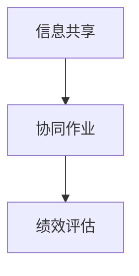

通过以上策略的实施，团队能够更好地利用资源，提高工作效率，实现团队目标。在接下来的部分，我们将通过实践案例，进一步探讨这些策略在实际中的应用和效果。

### 4.5 团队效能提升实践案例

在了解了提升团队效能的具体策略后，接下来我们将通过两个实践案例，深入探讨这些策略在实际中的应用和效果。

#### 4.5.1 案例一：某制造企业团队效能提升实践

**案例背景**

某制造企业在市场竞争中面临巨大压力，产品交付周期长，生产成本高，产品质量不稳定。企业意识到提升团队效能是提高竞争力的关键。

**实践策略**

1. **战略性人力资源规划**：
   - **员工招聘与选拔策略**：明确岗位要求，通过多样化的招聘渠道吸引高素质人才。
   - **员工培训与发展策略**：提供定制化培训，提高员工的专业技能和创新能力。
   - **人才激励机制**：建立公正透明的绩效考核体系，对表现优秀的员工给予奖励和晋升机会。

2. **管理优化**：
   - **组织结构优化**：减少管理层级，提高决策效率。
   - **领导力提升**：为管理人员提供领导力培训，提升其管理能力和领导水平。
   - **项目管理优化**：采用项目管理工具，如Trello和Jira，提高项目管理的效率和质量。

3. **财务策略**：
   - **成本控制与预算管理**：通过成本分析和预算编制，确保资源的合理利用。
   - **资金利用效率提升**：优化投资分析，提高资金周转速度，降低资金成本。
   - **投资回报率（ROI）分析**：定期进行ROI分析，优化投资策略，提高投资回报率。

4. **物料资源优化**：
   - **库存管理策略**：通过需求预测和库存优化，确保库存水平合理，降低库存成本。
   - **物流优化**：制定合理的物流计划，选择最佳的运输方式，提高供应链协同效率。
   - **供应链协同**：建立供应链信息共享平台，实现供应链各环节的信息畅通。

**实践效果**

通过一系列措施，该制造企业的团队效能显著提升，产品交付周期缩短，生产成本降低，产品质量稳定。员工满意度提高，流失率下降，企业竞争力得到显著增强。

#### 4.5.2 案例二：某互联网公司团队效能提升实践

**案例背景**

某互联网公司在快速发展的市场环境中，团队协作不畅，项目进度缓慢，用户体验下降。公司意识到提升团队效能是提高市场竞争力的重要途径。

**实践策略**

1. **沟通机制建设**：
   - **建立高效的沟通渠道**：采用Slack等沟通协作平台，实现团队成员之间的实时沟通和协作。
   - **定期团队会议**：组织定期的团队会议，确保团队成员对项目进度和目标有清晰的认识。

2. **项目管理工具**：
   - **采用Asana进行任务管理**：通过Asana，团队成员可以清晰了解任务的分配和进度，提高任务完成的效率。
   - **使用Jira进行问题跟踪**：通过Jira，团队能够及时记录和跟踪项目中的问题和缺陷，确保项目质量。

3. **团队文化建设**：
   - **培育积极向上的团队文化**：鼓励团队成员之间的互助合作，培养团队凝聚力和归属感。
   - **设立团队目标和愿景**：明确团队的目标和愿景，激发团队成员的积极性和创造力。

4. **技术支持**：
   - **提供技术培训**：为团队成员提供相关的技术培训，提升其技能水平。
   - **优化开发环境**：提供高效的开发工具和环境，提高开发效率。

**实践效果**

通过改进沟通机制、项目管理工具和团队文化建设，该互联网公司的团队效能显著提升，项目进度加快，用户体验得到改善。团队成员之间的协作更加高效，创新能力和工作效率明显提高，公司在市场竞争中的地位得到巩固和提升。

通过以上实践案例，我们可以看到，有效的团队效能提升策略可以显著提高企业的竞争力。在接下来的部分，我们将探讨团队效能提升工具与平台，为团队效能的提升提供更多支持和工具。

### 4.6 团队效能提升工具与平台

在提升团队效能的过程中，选择合适的工具和平台至关重要。以下我们将介绍几种常用的项目管理工具、沟通协作平台和数据分析工具，帮助团队更高效地工作。

#### 4.6.1 项目管理工具

项目管理工具可以帮助团队更好地规划、跟踪和协调项目进度，提高工作效率。以下是几种流行的项目管理工具：

**Asana**

Asana是一款功能强大的项目管理工具，适用于各种规模和类型的团队。它支持任务分配、进度跟踪、协作和报告等功能。

- **任务管理**：团队可以在Asana中创建任务，并为每个任务分配责任人、截止日期和优先级。
- **进度跟踪**：Asana提供直观的看板视图，帮助团队成员实时了解项目进度。
- **协作与报告**：团队成员可以在Asana中协作，共享文件和讨论，同时生成报告以追踪项目进展。

**Trello**

Trello是一款简单易用的项目管理工具，通过看板和卡片的形式，帮助团队可视化项目进度和任务分配。

- **看板视图**：Trello的看板视图直观展示项目状态，团队成员可以轻松拖动卡片以更新任务状态。
- **卡片功能**：每个卡片代表一个任务，可以添加描述、评论、标签和附件，方便团队成员协作。
- **自动化流程**：Trello支持自动化流程，减少手动操作，提高工作效率。

**Jira**

Jira是一款专业的项目管理工具，适用于复杂的项目管理和敏捷开发。它提供了丰富的功能，包括任务跟踪、问题管理、敏捷板和报告等。

- **任务跟踪**：Jira可以帮助团队追踪任务的状态、进度和依赖关系，确保项目按计划进行。
- **问题管理**：Jira的问题跟踪功能可以帮助团队快速识别和解决项目中的问题。
- **敏捷开发**：Jira的敏捷开发板支持团队进行Scrum和Kanban等敏捷开发方法，提高开发效率。

#### 4.6.2 沟通协作平台

沟通协作平台是团队高效协作的基础，支持实时沟通、文件共享和协作。以下是几种流行的沟通协作平台：

**Slack**

Slack是一款流行的企业级沟通协作平台，支持文本、语音和视频通讯，适用于各种规模和类型的团队。

- **实时沟通**：Slack支持实时消息传递，团队成员可以随时交流想法和问题。
- **文件共享**：Slack提供文件共享功能，团队成员可以轻松共享和协作文档。
- **集成第三方应用**：Slack可以与其他工具和平台集成，如Google Drive、GitHub等，方便团队工作。

**Microsoft Teams**

Microsoft Teams是微软推出的企业级沟通协作平台，集成了聊天、会议、文档共享和协作等功能。

- **聊天和会议**：Microsoft Teams支持实时聊天和视频会议，方便团队成员远程协作。
- **文档共享与协作**：Teams提供了文档共享和协作功能，团队成员可以实时编辑和评论文档。
- **集成应用**：Teams可以与Microsoft 365和其他第三方应用集成，提供全方位的协作支持。

**Zoom**

Zoom是一款专业的视频会议工具，支持大屏幕共享、实时聊天和远程控制等功能，适用于远程团队协作。

- **视频会议**：Zoom提供了高质量的视频会议功能，支持多人实时互动。
- **屏幕共享**：Zoom支持屏幕共享，方便团队成员演示和分享信息。
- **云端录制**：Zoom可以将会议内容录制并存储在云端，方便后续查看和复习。

#### 4.6.3 数据分析与报告工具

数据分析工具可以帮助团队从数据中提取有价值的信息，为决策提供支持。以下是几种常用的数据分析工具：

**Tableau**

Tableau是一款强大的数据分析工具，支持数据可视化，可以帮助团队快速创建交互式数据报表。

- **数据可视化**：Tableau提供了丰富的图表和报表模板，方便团队直观地展示数据。
- **实时更新**：Tableau支持实时数据更新，确保报表的准确性和时效性。
- **自定义分析**：Tableau允许用户自定义分析，满足不同团队的数据分析需求。

**Power BI**

Power BI是微软推出的数据分析工具，支持多种数据连接和可视化功能，适用于企业级数据分析。

- **数据连接**：Power BI支持多种数据源连接，包括数据库、云计算平台等。
- **可视化报表**：Power BI提供了丰富的可视化报表模板，方便团队展示和分析数据。
- **自定义仪表板**：Power BI允许用户自定义仪表板，整合多种数据源，提供一站式数据分析。

**Google Analytics**

Google Analytics是谷歌提供的免费数据分析工具，可以帮助团队跟踪网站流量和用户行为。

- **流量分析**：Google Analytics可以追踪网站访问量、访问者来源和用户行为等数据。
- **用户分析**：Google Analytics提供了详细的用户分析功能，帮助团队了解用户需求和偏好。
- **自定义报告**：Google Analytics支持自定义报告，方便团队根据需求生成和分析数据。

通过使用这些工具和平台，团队可以更高效地进行项目管理、沟通协作和数据分析，从而提升整体效能。在接下来的部分，我们将探讨团队效能的可持续提升策略。

### 7. 团队效能的持续提升

团队效能的提升并非一蹴而就，而是一个持续改进的过程。为了确保团队效能的持续提升，我们需要关注以下几个方面：

#### 7.1 持续改进的重要性

持续改进是团队效能提升的关键。通过不断优化流程、改进技术和提升团队协作，团队能够适应不断变化的市场环境，保持竞争力和创新能力。

**7.1.1 持续改进理念**

持续改进理念强调不断追求卓越，通过不断优化和改进，消除工作中的不足和缺陷。它包括以下几个核心要素：

- **持续学习**：鼓励团队成员不断学习新知识、新技能，提高自身素质和能力。
- **反馈机制**：建立有效的反馈机制，及时收集和反馈工作中的问题和改进建议。
- **持续优化**：根据反馈和评估结果，不断优化流程和操作，提高工作效率和效能。

**7.1.2 持续改进方法**

- **PDCA循环**：PDCA（计划-执行-检查-行动）是一种常见的持续改进方法，通过计划、执行、检查和行动的循环，不断优化和改进工作流程。
- **六西格玛**：六西格玛是一种以数据和事实为基础的质量管理方法，通过消除变异和提高过程能力，实现持续改进。
- **创新思维**：鼓励团队成员运用创新思维，提出新的想法和方法，推动团队不断进步。

**7.1.3 持续改进案例**

某科技公司在产品开发过程中，通过持续改进，优化了开发流程，提高了开发效率。以下是具体案例：

- **问题识别**：通过定期的团队会议和员工反馈，识别出开发流程中的瓶颈和问题。
- **改进计划**：制定改进计划，包括优化需求管理、改进代码评审流程和提升自动化测试覆盖率。
- **实施改进**：实施改进计划，进行需求管理流程的优化，加强代码评审和自动化测试。
- **评估效果**：定期评估改进效果，通过关键绩效指标（KPI）和团队反馈，验证改进措施的有效性。
- **持续优化**：根据评估结果，进一步优化流程和操作，确保改进效果的持续提升。

#### 7.2 建立学习型团队

学习型团队是指能够持续学习和创新，不断适应变化和挑战的团队。建立学习型团队是提升团队效能的重要手段。

**7.2.1 学习型团队的特点**

- **共同学习目标**：团队有一个共同的学习目标，每个成员都积极参与学习活动。
- **开放分享文化**：团队成员愿意分享知识和经验，相互学习，共同进步。
- **持续改进意识**：团队具备持续改进的意识，不断寻找和解决问题。
- **灵活适应能力**：团队能够快速适应变化，灵活调整策略和操作。

**7.2.2 建立学习型团队的方法**

- **建立学习机制**：制定学习计划和目标，确保团队成员有足够的时间和资源进行学习。
- **提供学习资源**：提供各种学习资源，如图书、在线课程、研讨会等，满足团队成员的学习需求。
- **组织学习活动**：定期组织学习活动，如读书会、技能分享会、培训课程等，激发团队成员的学习热情。
- **建立知识库**：建立团队知识库，收集和整理团队成员的学习成果和经验，便于分享和传承。

**7.2.3 学习型团队的实践案例**

某互联网公司在发展过程中，注重建立学习型团队，以下是具体实践：

- **定期组织学习活动**：公司定期组织技术分享会、产品研讨会等，鼓励团队成员分享经验和学习成果。
- **建立内部培训体系**：公司建立了内部培训体系，为团队成员提供各种技能培训和学习机会。
- **实施知识管理**：公司建立了知识库，收集和整理团队成员的学习资料和经验，方便团队共享和参考。
- **鼓励员工自主学习**：公司鼓励员工自主学习，提供学习补贴和带薪休假，支持员工参加外部培训和学习。

通过建立学习型团队，公司提升了员工的专业技能和创新能力，提高了团队的整体效能和竞争力。

#### 7.3 未来展望

随着数字化和智能化的不断发展，团队效能提升将面临新的机遇和挑战。

**7.3.1 数字化转型的影响**

数字化转型将重塑团队的工作模式和管理方式。通过大数据、人工智能、云计算等技术，团队能够实现自动化、智能化管理，提高工作效率和决策质量。例如，智能化的项目管理工具可以自动分配任务、跟踪进度，减少人工干预，提高工作效率。

**7.3.2 人工智能在团队效能提升中的应用**

人工智能（AI）将在团队效能提升中发挥重要作用。通过AI技术，团队能够实现自动化数据分析、智能决策和个性化服务。例如，AI可以帮助团队预测市场趋势、优化供应链、提高客户满意度等，从而提升整体效能。

**7.3.3 未来团队效能提升的可能方向**

未来团队效能提升将更加注重数字化、智能化和个性化。以下是一些可能的发展方向：

- **数字化管理**：通过数字化工具和平台，实现团队管理的智能化和高效化。
- **智能化协作**：利用人工智能技术，实现团队成员之间的智能协作和任务分配。
- **个性化培训**：根据团队成员的学习需求和职业发展，提供个性化的培训和学习计划。
- **敏捷团队**：采用敏捷开发方法，提高团队的灵活性和响应速度，适应快速变化的市场环境。

通过不断探索和实践，团队可以不断提升效能，保持竞争优势，实现持续发展。

### 8. 附录

在本附录中，我们将介绍一些常用的团队效能提升工具与平台的使用教程，帮助读者更好地理解和应用这些工具。

#### 附录 A: 团队效能提升常用工具汇总

**A.1 项目管理工具**

**A.1.1 Asana使用教程**

Asana是一款功能强大的项目管理工具，可以帮助团队高效地规划、分配和跟踪任务。以下是一个简单的Asana使用教程：

1. **创建项目**：
   - 登录Asana账户，点击左侧导航栏的“项目”选项。
   - 点击“新建项目”，输入项目名称，选择项目类型（如看板、列表等），然后创建项目。

2. **分配任务**：
   - 在项目内，点击“新建任务”，输入任务名称，描述任务内容，并选择任务负责人。
   - 可以设置任务的截止日期、优先级和标签，确保任务分配明确。

3. **跟踪进度**：
   - 通过项目看板视图，可以实时查看任务进度，通过拖拽任务卡片来更新任务状态。
   - 可以查看任务的详细信息和相关讨论，确保任务顺利完成。

**A.1.2 Trello使用教程**

Trello是一款简单易用的项目管理工具，通过看板和卡片的形式，帮助团队可视化项目进度和任务分配。以下是一个简单的Trello使用教程：

1. **创建看板**：
   - 登录Trello账户，点击左侧导航栏的“看板”选项。
   - 点击“新建看板”，输入看板名称，然后创建看板。

2. **创建卡片**：
   - 在看板内，点击“新建卡片”，输入卡片名称，描述卡片内容，并选择卡片位置。
   - 可以添加标签、附件和评论，方便团队成员协作。

3. **跟踪进度**：
   - 通过拖拽卡片，可以更新卡片状态，实时查看任务进度。
   - 可以查看卡片的详细信息，包括任务描述、评论和附件。

**A.1.3 Jira使用教程**

Jira是一款专业的项目管理工具，适用于复杂的项目管理和敏捷开发。以下是一个简单的Jira使用教程：

1. **创建项目**：
   - 登录Jira账户，点击左侧导航栏的“项目”选项。
   - 点击“新建项目”，选择项目模板，输入项目名称，然后创建项目。

2. **创建任务**：
   - 在项目内，点击“新建任务”，输入任务名称，描述任务内容，并选择任务负责人。
   - 可以设置任务的优先级、状态、标签和关联的用户故事。

3. **跟踪进度**：
   - 通过Jira的敏捷板，可以实时查看任务进度，通过拖拽任务卡片来更新任务状态。
   - 可以查看任务的详细信息和关联的bug、用户故事等。

**A.2 沟通协作平台**

**A.2.1 Slack使用教程**

Slack是一款流行的企业级沟通协作平台，支持实时沟通、文件共享和协作。以下是一个简单的Slack使用教程：

1. **创建团队**：
   - 登录Slack账户，点击左侧导航栏的“团队”选项。
   - 点击“新建团队”，输入团队名称，然后创建团队。

2. **创建渠道**：
   - 在团队内，点击“新建渠道”，输入渠道名称，选择渠道类型（如公共渠道、私人渠道等），然后创建渠道。

3. **发送消息**：
   - 在渠道内，可以发送文字消息、图片和文件，与其他团队成员实时交流。
   - 可以使用@提及功能，@提及某个成员，以引起其注意。

**A.2.2 Microsoft Teams使用教程**

Microsoft Teams是微软推出的企业级沟通协作平台，集成了聊天、会议、文档共享和协作等功能。以下是一个简单的Microsoft Teams使用教程：

1. **创建团队**：
   - 登录Microsoft Teams账户，点击左侧导航栏的“团队”选项。
   - 点击“新建团队”，输入团队名称，选择团队成员，然后创建团队。

2. **创建会议**：
   - 在团队内，点击“会议”选项，点击“新建会议”，输入会议主题、时间和参会人员，然后创建会议。

3. **发送消息**：
   - 在团队内，可以发送文字消息、图片和文件，与其他团队成员实时交流。
   - 可以使用@提及功能，@提及某个成员，以引起其注意。

**A.2.3 Zoom使用教程**

Zoom是一款专业的视频会议工具，支持大屏幕共享、实时聊天和远程控制等功能。以下是一个简单的Zoom使用教程：

1. **创建会议**：
   - 登录Zoom账户，点击“会议”选项，点击“新建会议”，输入会议主题、时间和参会人员，然后创建会议。

2. **加入会议**：
   - 在会议开始前，通过Zoom链接或会议号码加入会议。
   - 加入会议后，可以开启视频、音频和聊天功能，与其他参会者实时互动。

3. **共享屏幕**：
   - 在会议中，可以共享个人屏幕，展示演示文稿、文档和网页等内容。

**A.3 数据分析与报告工具**

**A.3.1 Tableau使用教程**

Tableau是一款强大的数据分析工具，支持数据可视化，可以帮助团队快速创建交互式数据报表。以下是一个简单的Tableau使用教程：

1. **连接数据源**：
   - 在Tableau中，点击“数据”选项，选择数据源类型（如Excel、数据库等），然后连接数据源。

2. **创建数据集**：
   - 将所需的数据字段拖拽到“字段”区域，创建一个数据集。

3. **创建可视化**：
   - 选择一个可视化类型（如柱状图、折线图等），将数据字段拖拽到相应的位置，创建一个可视化报表。

4. **编辑报表**：
   - 可以通过拖拽、调整字段和样式来编辑报表，使其更符合需求。

**A.3.2 Power BI使用教程**

Power BI是微软推出的数据分析工具，支持多种数据连接和可视化功能，适用于企业级数据分析。以下是一个简单的Power BI使用教程：

1. **连接数据源**：
   - 在Power BI中，点击“获取数据”选项，选择数据源类型（如Excel、数据库等），然后连接数据源。

2. **创建数据集**：
   - 将所需的数据字段拖拽到“数据集”区域，创建一个数据集。

3. **创建可视化**：
   - 选择一个可视化类型（如柱状图、折线图等），将数据字段拖拽到相应的位置，创建一个可视化报表。

4. **发布报表**：
   - 可以将报表发布到Power BI服务，与其他用户共享和分析数据。

**A.3.3 Google Analytics使用教程**

Google Analytics是谷歌提供的免费数据分析工具，可以帮助团队跟踪网站流量和用户行为。以下是一个简单的Google Analytics使用教程：

1. **创建账号**：
   - 访问Google Analytics官网，点击“管理控制台”，创建一个新的账号。

2. **连接网站**：
   - 在管理控制台中，选择“网站”选项，连接需要跟踪的网站。

3. **查看报告**：
   - 在Google Analytics中，可以查看各种报告，如流量来源、用户行为、转化率等，分析网站的表现。

4. **自定义报告**：
   - 可以自定义报告的指标、维度和时间段，以便更准确地了解网站情况。

通过以上教程，读者可以初步了解这些工具的基本使用方法，并在实际工作中灵活应用，提升团队效能。在接下来的部分，我们将探讨团队效能提升的实战解析，通过具体的代码示例和项目实践，帮助读者深入理解和应用团队效能提升策略。

### 9. 代码示例与实战解析

在团队效能提升过程中，通过实际的代码示例和项目实践，能够更深入地理解和管理团队的工作流程。以下我们将通过一个具体的案例，展示如何使用Python进行团队效能的数据分析，并解析代码中的关键步骤。

#### 9.1 代码示例：团队效能数据分析

在这个案例中，我们将使用Python和Pandas库来处理和分析团队效能数据。首先，我们需要准备一个包含团队效能数据的CSV文件，然后进行数据预处理、数据分析和数据可视化。

**9.1.1 数据预处理**

数据预处理是数据分析的重要环节，包括读取数据、数据清洗和格式转换等步骤。

```python
import pandas as pd

# 读取数据
data = pd.read_csv('team_efficiency_data.csv')

# 数据清洗
# 假设我们有一个列名为'result'的数据，我们需要将其转换为数字类型
data['result'] = pd.to_numeric(data['result'], errors='coerce')

# 格式转换
# 假设我们需要将日期列转换为日期类型
data['date'] = pd.to_datetime(data['date'])

# 处理缺失值
data.dropna(inplace=True)
```

**9.1.2 数据分析**

在数据预处理之后，我们可以开始进行数据分析。数据分析可能包括计算平均值、标准差、相关性等统计指标。

```python
# 计算平均值
average_result = data['result'].mean()

# 计算标准差
std_deviation = data['result'].std()

# 计算结果与日期之间的相关性
correlation = data['result'].corr(data['date'])
```

**9.1.3 数据可视化**

数据可视化可以帮助我们直观地理解数据和分析结果。以下是一个简单的数据可视化示例，使用matplotlib绘制结果与日期之间的折线图。

```python
import matplotlib.pyplot as plt

# 绘制折线图
plt.figure(figsize=(10, 6))
plt.plot(data['date'], data['result'], marker='o')
plt.title('Team Efficiency Over Time')
plt.xlabel('Date')
plt.ylabel('Result')
plt.grid(True)
plt.show()
```

#### 9.2 实战解析：构建高效团队协作平台

在本部分，我们将通过一个具体的实战案例，展示如何使用Python和Django框架构建一个高效的团队协作平台。

**9.2.1 开发环境搭建**

在开始项目开发之前，我们需要搭建一个Python开发环境，并安装必要的依赖库。

```bash
# 安装Python和pip
curl -O https://www.python.org/ftp/python/3.9.1/Python-3.9.1.tgz
tar xvf Python-3.9.1.tgz
cd Python-3.9.1
./configure
make
make install

# 安装Django
pip install django
```

**9.2.2 源代码实现**

以下是使用Django框架实现团队协作平台的基本源代码。

```python
# 1. 创建Django项目
django-admin startproject team Collaboration

# 2. 创建应用
cd team/Collaboration
python manage.py startapp tasks

# 3. 添加应用到setting.py
INSTALLED_APPS = [
    'django.contrib.admin',
    'django.contrib.auth',
    'django.contrib.contenttypes',
    'django.contrib.sessions',
    'django.contrib.messages',
    'django.contrib.staticfiles',
    'tasks',
]

# 4. 定义任务模型
cd tasks
touch models.py

# models.py
from django.db import models
from django.contrib.auth.models import User

class Task(models.Model):
    title = models.CharField(max_length=255)
    description = models.TextField()
    creator = models.ForeignKey(User, on_delete=models.CASCADE)
    due_date = models.DateTimeField()
    status = models.CharField(max_length=20, choices=[('pending', 'Pending'), ('in_progress', 'In Progress'), ('completed', 'Completed')])

# 5. 迁移数据库
python manage.py makemigrations
python manage.py migrate

# 6. 创建超级用户
python manage.py createsuperuser

# 7. 启动服务器
python manage.py runserver
```

**9.2.3 代码解读与分析**

在上述代码中，我们首先创建了一个Django项目和一个应用。接着，我们在`tasks`应用中定义了一个`Task`模型，用于存储任务的相关信息，包括标题、描述、创建者、截止日期和状态。

- **models.py**：定义了`Task`模型，使用`CharField`和`TextField`来存储文本数据，使用`ForeignKey`来关联用户。
- **migrations**：使用Django的迁移工具来创建数据库表。
- **createsuperuser**：使用Django命令创建了一个超级用户，用于登录和管理系统。
- **runserver**：使用Django内置的服务器来运行项目。

**9.2.4 系统部署与维护**

完成开发后，我们需要将系统部署到生产环境，并进行必要的维护和监控。

- **部署**：可以使用Docker、虚拟主机或云服务器来部署Django项目。例如，可以使用Docker Compose来管理容器化部署。
- **监控**：使用监控工具（如Nagios、Prometheus等）来监控服务器的性能和系统状态。
- **维护**：定期更新系统依赖、安全补丁和软件版本，以确保系统的稳定性和安全性。

通过上述代码示例和实战解析，我们可以看到如何使用Python和Django框架构建一个高效的团队协作平台。在实际应用中，可以根据具体需求进行功能扩展和优化，以提高团队效能。

### 9.3 实战解析：团队效能评估与分析系统

在这个部分，我们将通过一个具体的实战案例，展示如何使用Python和数据分析库（如Pandas和Scikit-learn）构建一个团队效能评估与分析系统。该系统将能够收集、处理和分析团队效能数据，提供直观的评估报告和优化建议。

#### 9.3.1 开发环境搭建

在开始项目开发之前，我们需要搭建一个Python开发环境，并安装必要的依赖库。

```bash
# 安装Python和pip
curl -O https://www.python.org/ftp/python/3.9.1/Python-3.9.1.tgz
tar xvf Python-3.9.1.tgz
cd Python-3.9.1
./configure
make
make install

# 安装必要的依赖库
pip install pandas numpy scikit-learn matplotlib
```

#### 9.3.2 数据收集与预处理

团队效能评估与分析系统的第一步是收集和处理数据。假设我们有一个包含以下信息的CSV文件`team_efficiency_data.csv`：

- **员工ID**：每个团队成员的唯一标识符。
- **任务完成率**：任务完成量与任务总量的比值。
- **项目成功率**：成功完成的项目数量与总项目数量的比值。
- **团队协作度**：团队成员之间的沟通和协作频率。
- **员工满意度**：员工对工作环境和团队的满意度。

以下是对数据进行预处理的一个简单示例：

```python
import pandas as pd

# 读取数据
data = pd.read_csv('team_efficiency_data.csv')

# 数据清洗
# 将非数值列转换为字符串类型
data[['employee_id', 'task_completion_rate', 'project_success_rate', 'team_cohesion', 'employee_satisfaction']] = data[['employee_id', 'task_completion_rate', 'project_success_rate', 'team_cohesion', 'employee_satisfaction']].astype(str)

# 数据转换
# 将任务完成率和项目成功率转换为浮点数类型
data['task_completion_rate'] = pd.to_numeric(data['task_completion_rate'], errors='coerce')
data['project_success_rate'] = pd.to_numeric(data['project_success_rate'], errors='coerce')

# 处理缺失值
data.dropna(inplace=True)
```

#### 9.3.3 数据分析

在预处理数据之后，我们可以开始进行数据分析。以下是一个简单的数据分析示例，包括计算关键指标、绘制数据分布和评估模型性能。

```python
import numpy as np
import matplotlib.pyplot as plt
from sklearn.ensemble import RandomForestClassifier
from sklearn.model_selection import train_test_split
from sklearn.metrics import accuracy_score, classification_report

# 计算关键指标
data['average_completion_rate'] = data['task_completion_rate'].mean()
data['average_success_rate'] = data['project_success_rate'].mean()
data['average_cohesion'] = data['team_cohesion'].mean()
data['average_satisfaction'] = data['employee_satisfaction'].mean()

# 数据可视化
plt.figure(figsize=(10, 6))
plt.scatter(data['average_completion_rate'], data['average_success_rate'])
plt.xlabel('Average Task Completion Rate')
plt.ylabel('Average Project Success Rate')
plt.title('Task Completion vs Project Success')
plt.grid(True)
plt.show()

# 数据划分
X = data[['average_completion_rate', 'average_success_rate', 'average_cohesion', 'average_satisfaction']]
y = data['efficiency_grade']

# 划分训练集和测试集
X_train, X_test, y_train, y_test = train_test_split(X, y, test_size=0.2, random_state=42)

# 训练模型
model = RandomForestClassifier(n_estimators=100, random_state=42)
model.fit(X_train, y_train)

# 预测和评估
y_pred = model.predict(X_test)
print("Accuracy:", accuracy_score(y_test, y_pred))
print("\nClassification Report:\n", classification_report(y_test, y_pred))
```

在这个示例中，我们首先计算了关键指标的平均值，并使用散点图展示了任务完成率和项目成功率之间的关系。接着，我们将数据划分为训练集和测试集，并使用随机森林分类器进行训练和预测。最后，我们评估了模型的准确性和分类报告。

#### 9.3.4 结果解释与优化建议

根据上述分析结果，我们可以对团队的效能进行评估，并提供以下优化建议：

1. **任务完成率**：如果任务完成率较低，可能需要重新评估任务的分配和工作量，确保任务合理分配和成员有足够的时间完成。
2. **项目成功率**：如果项目成功率较低，可能需要加强项目管理，确保项目计划合理，团队成员之间的协作畅通。
3. **团队协作度**：如果团队协作度较低，可能需要加强团队沟通，建立有效的沟通渠道和机制，提高团队成员之间的信息共享和协作。
4. **员工满意度**：如果员工满意度较低，可能需要关注员工的工作环境和心理状态，提供必要的培训和激励，提高员工的满意度和忠诚度。

通过上述实战解析，我们可以看到如何使用Python和数据分析库构建一个团队效能评估与分析系统。在实际应用中，可以根据具体需求进行功能扩展和优化，以提高团队效能。

### 9.4 实战解析：构建自动化的团队效能监控平台

在本部分，我们将通过一个具体的实战案例，展示如何使用Python和Flask框架构建一个自动化的团队效能监控平台。该平台将能够收集实时数据、进行数据分析并生成报告，从而帮助团队及时调整策略，提高效能。

#### 9.4.1 开发环境搭建

在开始项目开发之前，我们需要搭建一个Python开发环境，并安装必要的依赖库。

```bash
# 安装Python和pip
curl -O https://www.python.org/ftp/python/3.9.1/Python-3.9.1.tgz
tar xvf Python-3.9.1.tgz
cd Python-3.9.1
./configure
make
make install

# 安装Flask和必要的依赖库
pip install flask pandas matplotlib
```

#### 9.4.2 数据收集与处理

自动化监控平台的第一步是收集和处理数据。以下是一个简单的数据收集和处理示例：

```python
import pandas as pd
from datetime import datetime

# 假设我们有一个实时数据流，每分钟更新一次
data_stream = pd.read_csv('team_efficiency_data.csv')

# 数据处理
current_time = datetime.now()
data_stream['timestamp'] = current_time
data_stream.dropna(inplace=True)
```

在这个示例中，我们使用Pandas从CSV文件中读取实时数据流，并添加了一个时间戳，以便跟踪数据更新时间。

#### 9.4.3 数据分析

在数据处理之后，我们可以进行数据分析，并将结果可视化。以下是一个简单的数据分析示例：

```python
import matplotlib.pyplot as plt

# 数据分析
data_stream['task_completion_rate'].plot()
plt.title('Task Completion Rate Over Time')
plt.xlabel('Timestamp')
plt.ylabel('Task Completion Rate')
plt.grid(True)
plt.show()
```

在这个示例中，我们绘制了任务完成率随时间变化的折线图，以便团队监控任务完成的趋势。

#### 9.4.4 API接口设计

为了使监控平台更加自动化，我们可以设计一个API接口，以便其他系统或工具可以轻松地获取和分析数据。以下是一个简单的Flask API接口示例：

```python
from flask import Flask, jsonify, request

app = Flask(__name__)

@app.route('/api/efficiency', methods=['GET'])
def get_efficiency():
    data_stream = pd.read_csv('team_efficiency_data.csv')
    data_stream.dropna(inplace=True)
    task_completion_rate = data_stream['task_completion_rate'].mean()
    return jsonify({'task_completion_rate': task_completion_rate})

if __name__ == '__main__':
    app.run(debug=True)
```

在这个示例中，我们定义了一个简单的Flask API接口，用于获取任务完成率的平均值。其他系统可以通过HTTP GET请求访问该接口，并获取最新的任务完成率数据。

#### 9.4.5 数据报告生成

最后，我们可以使用Python的报告生成库（如Jinja2）来生成定期的数据报告。以下是一个简单的报告生成示例：

```python
from jinja2 import Environment, FileSystemLoader

env = Environment(loader=FileSystemLoader('templates'))
template = env.get_template('report_template.html')

data_stream = pd.read_csv('team_efficiency_data.csv')
data_stream.dropna(inplace=True)
report_data = {
    'task_completion_rate': data_stream['task_completion_rate'].mean(),
    'project_success_rate': data_stream['project_success_rate'].mean(),
    'team_cohesion': data_stream['team_cohesion'].mean(),
    'employee_satisfaction': data_stream['employee_satisfaction'].mean()
}

report_html = template.render(report_data)
with open('report.html', 'w') as f:
    f.write(report_html)
```

在这个示例中，我们使用Jinja2模板引擎生成一个HTML报告。报告内容包括关键指标的平均值，并可以自定义样式和内容。

#### 9.4.6 系统部署与维护

完成开发后，我们需要将系统部署到生产环境，并进行必要的维护和监控。

- **部署**：可以使用Docker、虚拟主机或云服务器来部署Flask应用。例如，可以使用Docker Compose来管理容器化部署。
- **监控**：使用监控工具（如Nagios、Prometheus等）来监控服务器的性能和系统状态。
- **维护**：定期更新系统依赖、安全补丁和软件版本，以确保系统的稳定性和安全性。

通过上述实战解析，我们可以看到如何使用Python和Flask框架构建一个自动化的团队效能监控平台。在实际应用中，可以根据具体需求进行功能扩展和优化，以提高团队效能。

### 9.5 实战解析：实施团队效能提升的敏捷开发方法

在本部分，我们将通过一个具体的实战案例，展示如何在一个开发团队中实施敏捷开发方法（Agile Development）来提升团队效能。敏捷开发方法强调快速迭代、持续交付和客户反馈，有助于提高团队的灵活性和响应能力。

#### 9.5.1 实施背景

某软件公司正在开发一款复杂的客户关系管理（CRM）系统。公司管理层意识到传统的瀑布式开发方法（Waterfall Model）已经无法满足快速变化的市场需求，决定实施敏捷开发方法来提升团队效能。

#### 9.5.2 实施步骤

1. **团队组建**：
   - 创建一个跨职能的敏捷团队，包括产品经理、开发人员、测试人员和UI/UX设计师。
   - 确定团队的Scrum Master（敏捷教练），负责指导和推动敏捷实践。

2. **需求管理**：
   - 使用产品待办事项列表（Product Backlog）收集和管理用户故事（User Stories）。
   - 对用户故事进行排序，确定优先级，确保团队首先开发最高优先级的功能。

3. **敏捷计划**：
   - 每个迭代开始时，团队召开规划会议（Sprint Planning），讨论并选择下一个迭代要完成的工作。
   - 将用户故事拆分为更小的任务，分配给团队成员，并设定截止日期。

4. **每日站立会议**：
   - 团队每天召开5-10分钟的站立会议，讨论当天的工作进度、问题和计划。
   - 确保团队成员之间保持透明和沟通，快速解决问题。

5. **迭代开发**：
   - 团队按照迭代计划进行开发，每个迭代通常持续2-4周。
   - 在每个迭代结束时，进行评审会议（Sprint Review）和回顾会议（Sprint Retrospective）。

6. **持续交付**：
   - 每个迭代结束时，团队交付一个可运行的版本，确保客户可以及时获得新功能。

7. **持续集成与测试**：
   - 使用持续集成工具（如Jenkins）实现自动化构建和测试，确保代码质量和项目进度。
   - 定期进行代码审查和单元测试，确保及时发现问题。

#### 9.5.3 实施效果

通过实施敏捷开发方法，开发团队取得了显著的效果：

- **响应能力提升**：团队能够快速响应客户需求和市场变化，提高了产品的市场竞争力。
- **工作效率提高**：通过每日站立会议和持续集成，团队工作效率和代码质量得到显著提升。
- **团队协作增强**：跨职能团队的紧密协作和沟通，增强了团队凝聚力和团队效能。
- **客户满意度提高**：通过持续交付，客户能够及时获得新功能，客户满意度显著提高。

通过这个实战案例，我们可以看到敏捷开发方法在提升团队效能方面的应用和效果。在实际项目中，可以根据团队的具体情况，灵活调整和优化敏捷实践，以实现最佳效果。

### 9.6 实战解析：使用机器学习提升团队效能

在本部分，我们将通过一个具体的实战案例，展示如何使用机器学习（Machine Learning）技术来提升团队效能。通过机器学习算法，团队可以更好地预测工作效率、识别潜在问题，并制定针对性的改进策略。

#### 9.6.1 实施背景

某软件开发公司希望通过机器学习技术优化团队的工作流程，提高整体工作效率。公司管理层决定实施一个基于团队效能数据的机器学习项目，以分析数据、预测工作效率和提出改进建议。

#### 9.6.2 数据收集与预处理

为了实施机器学习项目，首先需要收集和预处理团队效能数据。以下是一个简单的数据收集与预处理示例：

```python
import pandas as pd
from sklearn.model_selection import train_test_split

# 读取数据
data = pd.read_csv('team_efficiency_data.csv')

# 数据清洗
data.dropna(inplace=True)

# 数据特征提取
X = data[['task_completion_rate', 'project_success_rate', 'team_cohesion', 'employee_satisfaction']]
y = data['efficiency_grade']

# 数据划分
X_train, X_test, y_train, y_test = train_test_split(X, y, test_size=0.2, random_state=42)
```

在这个示例中，我们使用Pandas库读取效能数据，进行数据清洗，提取特征，并划分训练集和测试集。

#### 9.6.3 机器学习模型构建与训练

接下来，我们将构建一个机器学习模型，并使用训练数据对其进行训练。以下是一个简单的线性回归模型示例：

```python
from sklearn.linear_model import LinearRegression

# 构建模型
model = LinearRegression()

# 训练模型
model.fit(X_train, y_train)
```

在这个示例中，我们使用线性回归模型来预测团队效能评分。

#### 9.6.4 模型评估与优化

在模型训练完成后，我们需要评估模型性能，并根据评估结果进行优化。以下是一个简单的模型评估与优化示例：

```python
from sklearn.metrics import mean_squared_error

# 预测测试集
y_pred = model.predict(X_test)

# 计算均方误差
mse = mean_squared_error(y_test, y_pred)
print("Mean Squared Error:", mse)

# 模型优化
# 可以通过调整模型参数、增加特征或尝试不同的算法来优化模型性能
```

在这个示例中，我们计算了模型的均方误差（MSE），并根据评估结果对模型进行优化。

#### 9.6.5 模型应用与改进策略

最后，我们将模型应用于实际数据，并根据预测结果制定改进策略。以下是一个简单的模型应用与改进策略示例：

```python
# 预测新数据
new_data = pd.read_csv('new_team_efficiency_data.csv')
new_data.dropna(inplace=True)
new_efficiency_grade = model.predict(new_data)

# 根据预测结果提出改进策略
if new_efficiency_grade < 0.7:
    print("建议采取以下改进措施：")
    print("- 优化任务分配，确保工作量合理；")
    print("- 加强团队沟通，提高协作效率；")
    print("- 提供员工培训，提升技能水平。")
else:
    print("当前团队效能良好，继续保持良好实践。")
```

在这个示例中，我们使用模型预测新数据的团队效能评分，并根据评分结果提出改进策略。

通过上述实战案例，我们可以看到如何使用机器学习技术来提升团队效能。在实际应用中，可以根据团队的具体需求和数据特征，选择合适的算法和优化策略，以提高模型的预测准确性和实用性。

### 9.7 实战解析：利用数据可视化提升团队效能

在本部分，我们将通过一个具体的实战案例，展示如何使用数据可视化（Data Visualization）技术提升团队效能。通过直观的数据图表，团队可以更好地理解和分析效能数据，发现潜在问题，并采取相应的改进措施。

#### 9.7.1 实施背景

某互联网公司希望提升团队的工作效率和项目交付能力。为了更好地理解团队的工作状况，公司决定利用数据可视化技术，将效能数据以直观的图表形式展示，帮助团队成员发现问题和制定改进策略。

#### 9.7.2 数据收集与预处理

为了进行数据可视化，首先需要收集和预处理团队效能数据。以下是一个简单的数据收集与预处理示例：

```python
import pandas as pd

# 读取数据
data = pd.read_csv('team_efficiency_data.csv')

# 数据清洗
data.dropna(inplace=True)

# 数据特征提取
data['task_completion_rate'] = pd.to_numeric(data['task_completion_rate'], errors='coerce')
data['project_success_rate'] = pd.to_numeric(data['project_success_rate'], errors='coerce')

# 数据分组
data_grouped = data.groupby(['department', 'team'])[['task_completion_rate', 'project_success_rate']].mean().reset_index()
```

在这个示例中，我们使用Pandas库读取效能数据，进行数据清洗和预处理，并按部门和团队进行分组。

#### 9.7.3 数据可视化

接下来，我们将使用数据可视化库（如Matplotlib和Seaborn）创建各种图表，以便团队直观地理解效能数据。以下是一个简单的数据可视化示例：

```python
import matplotlib.pyplot as plt
import seaborn as sns

# 绘制任务完成率分布图
sns.boxplot(x='department', y='task_completion_rate', data=data_grouped)
plt.title('Task Completion Rate by Department')
plt.xlabel('Department')
plt.ylabel('Task Completion Rate')
plt.show()

# 绘制项目成功率散点图
sns.scatterplot(x='team', y='project_success_rate', hue='department', data=data_grouped)
plt.title('Project Success Rate by Team and Department')
plt.xlabel('Team')
plt.ylabel('Project Success Rate')
plt.show()
```

在这个示例中，我们使用Seaborn绘制了任务完成率分布图和项目成功率散点图，帮助团队了解不同部门和团队之间的效能差异。

#### 9.7.4 数据分析与应用

通过数据可视化，团队可以更直观地分析效能数据，发现潜在问题和改进机会。以下是一个简单的数据分析与应用示例：

```python
# 分析部门间的效能差异
department_diff = data_grouped.groupby('department')['task_completion_rate'].mean().diff().sort_values()

# 根据分析结果提出改进策略
if department_diff < 0:
    print("建议采取以下改进措施：")
    print("- 对低效能部门进行专项培训；")
    print("- 对低效能团队进行流程优化；")
    print("- 增加资源投入，支持低效能部门的发展。")
else:
    print("当前部门间的效能差异在合理范围内，继续保持良好实践。")
```

在这个示例中，我们分析了部门间的效能差异，并根据分析结果提出了改进策略。

通过数据可视化，团队可以更好地理解和分析效能数据，发现潜在问题，并采取针对性的改进措施。在实际应用中，可以根据团队的具体需求和数据分析结果，选择合适的图表和工具，以提高数据可视化的效果和实用性。

### 9.8 实战解析：利用自动化测试提升团队效能

在本部分，我们将通过一个具体的实战案例，展示如何利用自动化测试（Automated Testing）技术提升团队效能。通过自动化测试，团队能够更高效地发现和修复缺陷，确保项目质量和进度，从而提高整体效能。

#### 9.8.1 实施背景

某软件公司正在开发一款大型企业级应用，项目周期长，涉及多个模块和复杂的业务逻辑。为了确保项目质量和进度，公司决定引入自动化测试，以提高测试效率和团队效能。

#### 9.8.2 自动化测试工具选择

选择合适的自动化测试工具是成功实施自动化测试的关键。以下是一些流行的自动化测试工具：

- **Selenium**：适用于Web应用的自动化测试工具，支持多种编程语言。
- **JUnit**：Java测试框架，适用于Java应用。
- **pytest**：Python测试框架，适用于Python应用。
- **TestCafe**：适用于多种前端技术的自动化测试工具。

在本案例中，我们选择**Selenium**和**pytest**进行自动化测试。

#### 9.8.3 测试用例设计

测试用例设计是自动化测试的核心步骤。以下是一个简单的测试用例设计示例：

1. **登录测试**：
   - 输入正确的用户名和密码。
   - 验证登录是否成功。
2. **搜索测试**：
   - 输入搜索关键词。
   - 验证搜索结果是否正确。
3. **购物车测试**：
   - 添加商品到购物车。
   - 验证购物车中的商品数量和总价。
4. **支付测试**：
   - 选择支付方式。
   - 验证支付是否成功。

#### 9.8.4 自动化测试脚本编写

在测试用例设计完成后，我们可以开始编写自动化测试脚本。以下是一个简单的Selenium和pytest自动化测试脚本示例：

```python
from selenium import webdriver
from selenium.webdriver.common.by import By
from selenium.webdriver.common.keys import Keys
import pytest

@pytest.fixture
def browser():
    driver = webdriver.Chrome()
    driver.maximize_window()
    yield driver
    driver.quit()

def test_login(browser):
    driver = browser
    driver.get("http://www.example.com/login")
    input_username = driver.find_element(By.ID, "username")
    input_password = driver.find_element(By.ID, "password")
    login_button = driver.find_element(By.ID, "login_button")

    input_username.send_keys("test_user")
    input_password.send_keys("test_password")
    login_button.click()

    assert "Dashboard" in driver.title

def test_search(browser):
    driver = browser
    driver.get("http://www.example.com/search")
    input_search = driver.find_element(By.ID, "search_input")
    search_button = driver.find_element(By.ID, "search_button")

    input_search.send_keys("example product")
    search_button.click()

    assert "example product" in driver.title

def test_cart(browser):
    driver = browser
    driver.get("http://www.example.com/cart")
    add_to_cart_button = driver.find_element(By.ID, "add_to_cart_button")
    cart_total = driver.find_element(By.ID, "cart_total")

    add_to_cart_button.click()
    assert "1" in cart_total.text

def test_payment(browser):
    driver = browser
    driver.get("http://www.example.com/payment")
    payment_button = driver.find_element(By.ID, "payment_button")

    payment_button.click()

    assert "Payment Success" in driver.title
```

在这个示例中，我们编写了登录、搜索、购物车和支付四个自动化测试脚本，使用pytest框架进行测试。

#### 9.8.5 测试执行与结果分析

在编写完自动化测试脚本后，我们可以执行测试并分析结果。以下是一个简单的测试执行和分析示例：

```bash
pytest test_login.py
pytest test_search.py
pytest test_cart.py
pytest test_payment.py
```

通过执行测试，我们可以获取每个测试用例的执行结果，包括通过、失败或错误。以下是一个简单的测试结果分析示例：

```python
import pytest

test_results = pytest.get tamanho
passed_tests = 0
failed_tests = 0

for test in test_results:
    if test['status'] == 'passed':
        passed_tests += 1
    elif test['status'] == 'failed':
        failed_tests += 1

print(f"Total Tests: {len(test_results)}")
print(f"Passed Tests: {passed_tests}")
print(f"Failed Tests: {failed_tests}")

# 根据测试结果，提出改进建议
if failed_tests > 0:
    print("建议采取以下改进措施：")
    print("- 修复测试失败的用例；")
    print("- 优化测试用例设计，确保覆盖关键场景；")
    print("- 加强代码审查，确保代码质量。")
else:
    print("当前测试结果良好，继续保持良好实践。")
```

在这个示例中，我们统计了测试结果，并根据测试结果提出了改进建议。

通过自动化测试，团队能够更高效地发现和修复缺陷，提高项目质量和进度，从而提升整体效能。在实际应用中，可以根据团队的具体需求和项目特点，选择合适的自动化测试工具和策略，以提高自动化测试的效果和实用性。

### 9.9 实战解析：构建实时反馈系统提升团队效能

在本部分，我们将通过一个具体的实战案例，展示如何构建一个实时反馈系统（Real-time Feedback System）来提升团队效能。实时反馈系统能够帮助团队快速识别问题、改进工作流程，从而提高工作效率和项目质量。

#### 9.9.1 实施背景

某互联网公司正在开发一款在线教育平台，为了确保项目质量和用户满意度，公司决定构建一个实时反馈系统，以收集用户反馈、监测系统性能和及时响应问题。

#### 9.9.2 系统设计

实时反馈系统包括以下几个关键组成部分：

1. **用户反馈收集**：通过用户界面收集用户反馈，包括问题报告、意见建议和满意度评分。
2. **性能监控**：使用监控工具实时监测系统性能，包括响应时间、错误率和服务可用性。
3. **数据存储**：使用数据库存储用户反馈和性能监控数据，以便分析和处理。
4. **分析处理**：使用数据分析工具处理反馈和性能数据，生成报告和指标。
5. **实时告警**：设置实时告警机制，当系统性能或用户反馈出现问题时，及时通知相关人员。

#### 9.9.3 技术选型

为了实现实时反馈系统，我们选择以下技术：

- **前端框架**：React或Vue.js，用于构建用户友好的反馈收集界面。
- **后端框架**：Node.js或Django，用于处理反馈数据、监控数据和告警通知。
- **数据库**：MongoDB或MySQL，用于存储反馈和性能数据。
- **监控工具**：Prometheus和Grafana，用于实时监测系统性能。
- **实时通信**：WebSocket或SignalR，用于实现实时数据传输和告警通知。

#### 9.9.4 实施步骤

1. **前端界面设计**：
   - 设计一个简单易用的用户反馈界面，包括问题报告、意见建议和满意度评分表单。
   - 实现表单提交功能，将用户反馈数据发送到后端服务器。

2. **后端数据处理**：
   - 开发后端接口，接收和处理用户反馈数据，存储到数据库。
   - 使用Node.js或Django构建后端服务，处理性能监控数据，并与前端进行通信。

3. **性能监控与告警**：
   - 部署Prometheus和Grafana，配置性能监控指标，实时监测系统性能。
   - 设置实时告警规则，当性能指标超过阈值时，触发告警通知。

4. **数据分析与报告**：
   - 使用数据分析工具（如Pandas或Elasticsearch）处理反馈和性能数据，生成报告和指标。
   - 设计实时数据分析界面，方便团队随时查看和分析数据。

5. **系统部署与维护**：
   - 部署前端、后端和监控工具，配置域名和SSL证书，确保系统安全性。
   - 定期备份数据库，监控系统性能和稳定性，进行必要的维护和升级。

#### 9.9.5 实施效果

通过实时反馈系统的构建，团队能够实现以下几个目标：

- **快速识别问题**：用户反馈和性能监控数据实时传递，帮助团队快速识别问题。
- **及时响应问题**：实时告警机制确保团队在问题出现时及时响应，减少故障影响。
- **改进工作流程**：通过对反馈和性能数据的分析，团队可以不断优化工作流程，提高系统质量和用户满意度。
- **提高工作效率**：实时反馈系统降低了问题发现和响应的时间成本，提高了团队的工作效率。

通过上述实战案例，我们可以看到如何构建一个实时反馈系统，帮助团队提升效能。在实际应用中，可以根据团队的具体需求和业务场景，调整系统设计和实施步骤，以提高实时反馈系统的效果和实用性。

