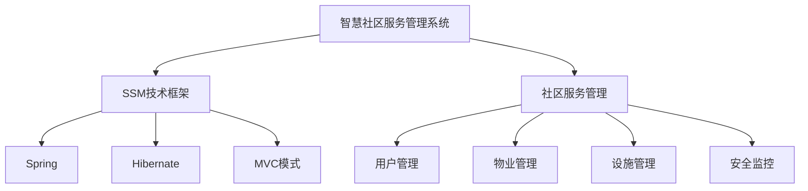

                 

# 基于SSM的智慧社区服务管理系统的设计与实现

> **关键词：**智慧社区，SSM框架，服务管理系统，设计实现，核心技术，算法原理

> **摘要：**本文围绕基于SSM（Spring + SpringMVC + Hibernate）框架的智慧社区服务管理系统展开，首先介绍智慧社区的概念与发展，接着深入探讨SSM框架的核心概念和联系，随后详细分析系统的需求、设计与实现，最后通过实际项目实战和代码解析，全面展现智慧社区服务管理系统的设计与实现过程。

## 第一部分：智慧社区服务管理系统概述

### 第1章：智慧社区服务管理系统概述

#### 1.1 智慧社区的定义与发展趋势

智慧社区，作为一种新兴的城市管理与服务模式，融合了物联网、云计算、大数据、人工智能等现代信息技术，旨在提升社区管理效率、改善居民生活质量。其定义可以归纳为：利用信息技术和智能化手段，对社区资源进行高效整合、管理和服务的一种新型社区形态。

智慧社区的发展趋势主要体现在以下几个方面：

1. **智能化设备普及**：智能家居、智能安防、智能停车等设备逐渐普及，为居民提供便捷、安全的生活环境。
2. **数据驱动管理**：通过收集和分析居民行为数据，实现社区服务的个性化、精准化。
3. **服务融合**：整合不同部门、不同服务领域的资源，提供一站式服务，提高服务效率。
4. **智能化决策**：利用大数据分析和人工智能算法，实现社区管理决策的科学化、智能化。

#### 1.2 社区服务管理系统的重要性

社区服务管理系统是智慧社区的核心组成部分，其重要性体现在以下几个方面：

1. **提高管理效率**：通过系统化、标准化的管理流程，提高社区管理效率，降低管理成本。
2. **提升服务质量**：系统化的服务流程和智能化的服务手段，有助于提升居民的服务体验。
3. **优化资源配置**：通过对社区资源的全面整合和优化，实现社区资源的最大化利用。
4. **增强安全保障**：智能化、系统化的安全管理机制，有助于提高社区的安全管理水平。

#### 1.3 SSM技术概述

SSM（Spring + SpringMVC + Hibernate）框架是一种常用的Java EE开发框架，广泛应用于企业级应用开发。SSM框架的核心组成部分如下：

1. **Spring**：作为企业级开发的核心框架，Spring提供了丰富的功能，包括IoC（控制反转）和AOP（面向切面编程），有助于简化企业应用的开发和维护。
2. **SpringMVC**：基于Spring的Web开发框架，提供了MVC（模型-视图-控制器）模式的全功能实现，简化了Web应用的开发。
3. **Hibernate**：作为ORM（对象关系映射）框架，Hibernate能够将Java对象映射到数据库表，简化了数据库操作。

### 第2章：智慧社区服务管理系统的核心概念与联系

#### 2.1 核心概念与联系

智慧社区服务管理系统的核心概念包括智慧社区、SSM框架、社区服务管理、用户管理、物业管理、设施管理、安全监控等。这些概念之间的联系可以通过Mermaid流程图来展示：



#### 2.2 SSM技术框架

SSM技术框架是智慧社区服务管理系统的核心技术基础。下面分别介绍SSM框架的核心组成部分：

1. **Spring**：Spring框架提供了IoC和AOP功能，有助于简化企业应用的开发。在智慧社区服务管理系统中，Spring主要用于管理Bean、实现事务管理、处理异常等。
2. **SpringMVC**：SpringMVC是基于Spring的Web开发框架，提供了MVC模式的全功能实现。在智慧社区服务管理系统中，SpringMVC主要用于处理用户请求、返回响应、处理表单等。
3. **Hibernate**：Hibernate作为ORM框架，能够将Java对象映射到数据库表，简化了数据库操作。在智慧社区服务管理系统中，Hibernate主要用于与数据库进行交互，实现数据的持久化。

### 第3章：系统需求分析与设计

#### 3.1 系统需求分析

系统需求分析是智慧社区服务管理系统设计的第一步，主要包括功能需求、性能需求、可靠性需求等。以下是智慧社区服务管理系统的主要需求：

1. **功能需求**：
   - 用户管理：用户注册、登录、个人信息管理、密码修改等。
   - 物业管理：物业管理员管理、物业费用管理、报修管理等。
   - 设施管理：设施设备管理、设施设备维护、设施设备查询等。
   - 安全监控：安全事件监控、安全预警、安全记录查询等。

2. **性能需求**：
   - 高并发处理能力：系统需要能够同时处理大量用户的请求。
   - 数据查询效率：系统需要能够快速响应数据查询请求。
   - 系统稳定性：系统需要能够稳定运行，确保数据不丢失。

3. **可靠性需求**：
   - 数据安全性：系统需要确保数据的安全性，防止数据泄露。
   - 系统可用性：系统需要确保在正常情况下能够稳定运行。
   - 系统可维护性：系统需要易于维护，方便后续的功能升级和维护。

#### 3.2 系统总体架构设计

智慧社区服务管理系统的总体架构设计可以分为四个层次：表现层、业务逻辑层、数据访问层和数据持久层。以下是各层的职责：

1. **表现层**：负责接收用户的请求，将业务逻辑处理结果展示给用户。主要技术包括HTML、CSS、JavaScript等。
2. **业务逻辑层**：负责处理业务逻辑，将用户的请求转换为对数据访问层的操作。主要技术包括Spring、SpringMVC等。
3. **数据访问层**：负责与数据库进行交互，实现对数据的查询、插入、更新、删除等操作。主要技术包括Hibernate、JDBC等。
4. **数据持久层**：负责数据的存储和管理，包括数据库的创建、表的设计、数据的插入、查询、更新、删除等。主要技术包括MySQL、Oracle等。

#### 3.3 系统模块划分

根据系统需求分析和总体架构设计，智慧社区服务管理系统可以分为以下几个模块：

1. **用户管理模块**：负责用户的注册、登录、个人信息管理、密码修改等功能。
2. **物业管理模块**：负责物业管理员的管理、物业费用的管理、报修管理等功能。
3. **设施管理模块**：负责设施设备的管理、设施设备的维护、设施设备的查询等功能。
4. **安全监控模块**：负责安全事件的监控、安全预警、安全记录的查询等功能。

### 第4章：核心算法原理讲解

#### 4.1 数据库设计与优化

数据库设计是智慧社区服务管理系统的重要组成部分，其设计与优化直接影响系统的性能和稳定性。以下是数据库设计的原则和常用算法：

##### 4.1.1 数据库设计原则

1. **第三范式**：确保数据的完整性和减少数据的冗余。
2. **规范化**：通过分解表结构，减少数据依赖，提高数据查询效率。
3. **索引优化**：合理创建索引，提高数据查询速度。

##### 4.1.2 关系型数据库常用算法

1. **哈希算法**：用于快速查找数据，提高查询效率。
2. **B+树算法**：用于索引数据，提高数据查询速度。
3. **排序算法**：用于数据排序，提高数据查询效率。

#### 4.2 服务管理算法原理

智慧社区服务管理系统的核心算法主要包括用户管理算法、物业管理算法、设施管理算法和安全监控算法。以下是各算法的基本原理：

1. **用户管理算法**：
   - 登录算法：通过用户名和密码验证用户身份。
   - 注册算法：接收用户注册信息，插入到用户表中。

2. **物业管理算法**：
   - 物业费用管理算法：计算物业费用，插入到费用表中。
   - 报修管理算法：接收报修信息，插入到报修表中。

3. **设施管理算法**：
   - 设施设备管理算法：接收设备信息，插入到设备表中。
   - 设施设备维护算法：根据设备状态进行维护。

4. **安全监控算法**：
   - 安全事件监控算法：实时监控社区安全事件。
   - 安全预警算法：根据监控数据生成预警信息。
   - 安全记录查询算法：查询安全事件记录。

### 第5章：数学模型与公式讲解

数学模型在智慧社区服务管理系统中有着广泛的应用，以下介绍几个常见的数学模型和公式：

#### 5.1 数学模型在智慧社区服务管理中的应用

1. **社区服务满意度模型**：
   $$
   \text{社区服务满意度} = \frac{\text{服务满意度总分}}{\text{问卷参与人数}}
   $$
   这个模型用于评估社区服务的整体满意度。

2. **社区能耗优化模型**：
   $$
   \text{能耗} = \text{基数能耗} + \text{动态能耗}
   $$
   这个模型用于计算社区的能耗，并优化能源消耗。

3. **社区安全风险评估模型**：
   $$
   \text{安全风险指数} = \text{事件概率} \times \text{损失程度}
   $$
   这个模型用于评估社区的安全风险。

#### 5.2 数学公式讲解与举例说明

1. **用户管理公式**：
   $$
   \text{用户余额} = \text{收入} - \text{支出}
   $$
   这个公式用于计算用户的账户余额。

2. **物业管理公式**：
   $$
   \text{物业费用} = \text{基数费用} + \text{动态费用}
   $$
   这个公式用于计算物业费用。

3. **设施管理公式**：
   $$
   \text{设备可用率} = \frac{\text{设备正常工作时间}}{\text{设备总工作时间}}
   $$
   这个公式用于评估设备的可用率。

4. **安全监控公式**：
   $$
   \text{安全预警等级} = \text{事件级别} + \text{预警系数}
   $$
   这个公式用于设定安全预警等级。

### 第6章：系统开发环境搭建

系统开发环境搭建是智慧社区服务管理系统开发的第一步，主要包括开发工具和软件的安装和环境配置。以下是开发环境搭建的具体步骤：

#### 6.1 开发工具与软件安装

1. **Java开发工具**：
   - 安装Java Development Kit (JDK)
   - 配置环境变量，确保Java命令可以正常运行

2. **集成开发环境（IDE）**：
   - 安装IntelliJ IDEA或Eclipse
   - 配置IDE的Java环境

3. **数据库软件**：
   - 安装MySQL数据库
   - 配置数据库环境，包括创建数据库、用户和权限

4. **版本控制工具**：
   - 安装Git
   - 配置Git环境

5. **构建工具**：
   - 安装Maven
   - 配置Maven仓库和项目依赖

#### 6.2 系统开发流程

系统开发流程主要包括以下几个步骤：

1. **需求分析**：收集用户需求，明确系统功能。

2. **系统设计**：进行系统架构设计，确定模块划分。

3. **数据库设计**：设计数据库表结构，创建数据库。

4. **代码实现**：根据系统设计，编写代码，实现功能。

5. **功能测试**：对系统功能进行测试，确保功能正确。

6. **性能测试**：对系统性能进行测试，确保系统稳定。

7. **部署上线**：将系统部署到服务器，进行上线运行。

### 第7章：代码实现与解读

#### 7.1 用户管理模块代码实现

用户管理模块是智慧社区服务管理系统的重要组成部分，主要包括用户注册、登录、个人信息管理等功能。以下是用户管理模块的代码实现和解读：

##### 7.1.1 用户注册功能

```java
// Java代码：用户注册
public boolean register(String username, String password, String email) {
    // 伪代码：检查用户名是否已存在
    User existingUser = userRepository.findByUsername(username);
    if (existingUser != null) {
        return false;
    }
    // 伪代码：创建用户对象并保存
    User user = new User();
    user.setUsername(username);
    user.setPassword(password);
    user.setEmail(email);
    userRepository.save(user);
    return true;
}
```

解读：该函数用于用户注册，首先检查用户名是否已存在，如果已存在则返回`false`，否则创建用户对象并保存。

##### 7.1.2 用户登录功能

```java
// Java代码：用户登录
public boolean login(String username, String password) {
    // 伪代码：查询用户信息
    User user = userRepository.findByUsername(username);
    if (user == null) {
        return false;
    }
    // 伪代码：检查密码是否正确
    return user.getPassword().equals(password);
}
```

解读：该函数用于用户登录，首先查询用户信息，如果用户不存在则返回`false`，否则检查密码是否正确。

##### 7.1.3 用户个人信息管理

```java
// Java代码：修改用户个人信息
public boolean updateUserInfo(String username, String newPassword, String newEmail) {
    // 伪代码：查询用户信息
    User user = userRepository.findByUsername(username);
    if (user == null) {
        return false;
    }
    // 伪代码：更新用户信息
    user.setPassword(newPassword);
    user.setEmail(newEmail);
    userRepository.save(user);
    return true;
}
```

解读：该函数用于修改用户个人信息，首先查询用户信息，然后更新用户密码和邮箱信息。

#### 7.2 物业管理模块代码实现

物业管理模块主要包括物业管理员管理、物业费用管理、报修管理等功能。以下是物业管理模块的代码实现和解读：

##### 7.2.1 物业管理员管理

```java
// Java代码：添加物业管理员
public boolean addPropertyManager(String managerName, String managerPassword) {
    // 伪代码：检查管理员名是否已存在
    PropertyManager existingManager = propertyManagerRepository.findByName(managerName);
    if (existingManager != null) {
        return false;
    }
    // 伪代码：创建管理员对象并保存
    PropertyManager manager = new PropertyManager();
    manager.setName(managerName);
    manager.setPassword(managerPassword);
    propertyManagerRepository.save(manager);
    return true;
}
```

解读：该函数用于添加物业管理员，首先检查管理员名是否已存在，如果已存在则返回`false`，否则创建管理员对象并保存。

##### 7.2.2 物业费用管理

```java
// Java代码：添加物业费用
public boolean addPropertyFee(int propertyId, double amount) {
    // 伪代码：查询物业信息
    Property property = propertyRepository.findById(propertyId);
    if (property == null) {
        return false;
    }
    // 伪代码：创建费用对象并保存
    PropertyFee fee = new PropertyFee();
    fee.setProperty(property);
    fee.setAmount(amount);
    propertyFeeRepository.save(fee);
    return true;
}
```

解读：该函数用于添加物业费用，首先查询物业信息，然后创建费用对象并保存。

##### 7.2.3 报修管理

```java
// Java代码：添加报修信息
public boolean addRepairRequest(int propertyId, String description) {
    // 伪代码：查询物业信息
    Property property = propertyRepository.findById(propertyId);
    if (property == null) {
        return false;
    }
    // 伪代码：创建报修对象并保存
    RepairRequest request = new RepairRequest();
    request.setProperty(property);
    request.setDescription(description);
    repairRequestRepository.save(request);
    return true;
}
```

解读：该函数用于添加报修信息，首先查询物业信息，然后创建报修对象并保存。

### 第8章：代码分析与测试

#### 8.1 代码分析与优化

代码分析是确保智慧社区服务管理系统质量的重要环节，包括代码的可读性、可维护性和性能优化。以下是代码分析的主要方面：

1. **代码规范**：确保代码遵循统一规范，包括命名规范、代码格式和注释规范。
2. **代码可读性**：通过良好的命名、合理的代码结构和清晰的注释，提高代码的可读性。
3. **代码可维护性**：通过模块化设计、合理分层和代码复用，提高代码的可维护性。
4. **性能优化**：通过索引优化、查询缓存和批量操作，提高系统的性能。

#### 8.2 系统功能测试与调试

系统功能测试是确保智慧社区服务管理系统功能正确和稳定运行的重要环节。以下是系统功能测试的主要方面：

1. **单元测试**：对系统中的每个模块进行单元测试，确保功能正确。
2. **集成测试**：对系统中的各个模块进行集成测试，确保模块之间的协同工作。
3. **性能测试**：对系统性能进行测试，确保在高并发情况下系统能够稳定运行。
4. **安全测试**：对系统进行安全测试，确保系统的安全性。

在系统功能测试和调试过程中，如果发现任何问题，需要及时进行定位和修复。通过反复的测试和调试，确保系统的功能正确、稳定和安全。

### 附录

#### 附录 A：开发工具与资源

以下是智慧社区服务管理系统开发所使用的工具和资源：

1. **Spring框架**：[Spring 官网](https://spring.io/)
2. **SpringMVC框架**：[SpringMVC 官网](https://spring.io/technologies/spring-mvc)
3. **Hibernate框架**：[Hibernate 官网](https://hibernate.org/)
4. **MySQL数据库**：[MySQL 官网](https://www.mysql.com/)
5. **IntelliJ IDEA**：[IntelliJ IDEA 官网](https://www.jetbrains.com/idea/)
6. **Eclipse**：[Eclipse 官网](https://www.eclipse.org/)
7. **Git**：[Git 官网](https://git-scm.com/)
8. **Maven**：[Maven 官网](https://maven.apache.org/)

#### A.1 Spring框架

Spring框架是智慧社区服务管理系统的核心，它提供了丰富的功能，包括IoC、AOP、事务管理、数据访问等。以下是Spring框架的主要模块：

1. **Spring Core**：核心容器，包括Bean管理、依赖注入等。
2. **Spring AOP**：面向切面编程，用于实现跨多个模块的公共功能。
3. **Spring MVC**：Web开发框架，用于实现MVC模式。
4. **Spring Data**：数据访问框架，用于简化数据访问操作。
5. **Spring Security**：安全框架，用于实现用户认证和授权。

#### A.2 Hibernate框架

Hibernate框架是智慧社区服务管理系统中的ORM（对象关系映射）框架，它能够将Java对象映射到数据库表，简化了数据库操作。以下是Hibernate框架的主要特点：

1. **对象关系映射**：将Java对象映射到数据库表。
2. **数据访问简化**：通过HQL（Hibernate Query Language）简化数据访问操作。
3. **缓存机制**：提供一级和二级缓存机制，提高数据查询性能。
4. **事务管理**：支持事务管理，确保数据的一致性。

#### A.3 MySQL数据库

MySQL数据库是智慧社区服务管理系统中的关系型数据库，它提供了高性能、可靠性和可扩展性的特点。以下是MySQL数据库的主要特点：

1. **高性能**：支持高并发、快速查询。
2. **可靠性**：提供事务管理、备份和恢复功能。
3. **可扩展性**：支持垂直和水平扩展。
4. **安全性**：提供用户权限管理和安全机制。

#### A.4 其他开发工具与资源链接

1. **HTML**：[HTML 官网](https://www.w3school.com.cn/html/)
2. **CSS**：[CSS 官网](https://www.w3school.com.cn/css/)
3. **JavaScript**：[JavaScript 官网](https://www.w3school.com.cn/js/)
4. **Git**：[Git 官网](https://git-scm.com/)
5. **Maven**：[Maven 官网](https://maven.apache.org/)

### 作者

作者：AI天才研究院/AI Genius Institute & 禅与计算机程序设计艺术 /Zen And The Art of Computer Programming

