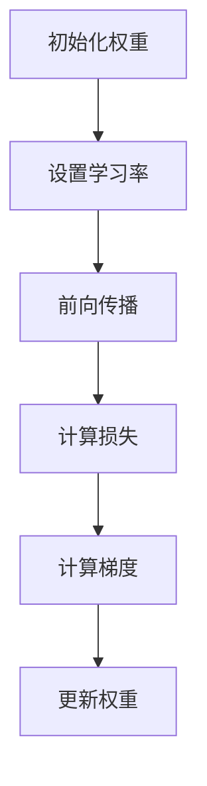
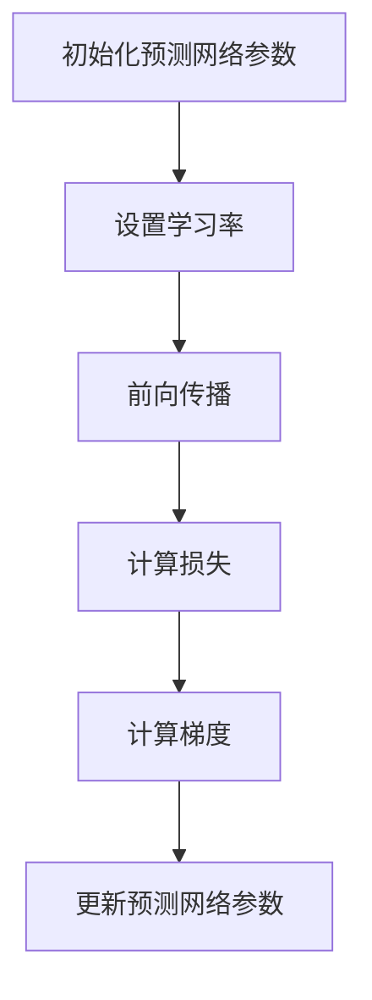
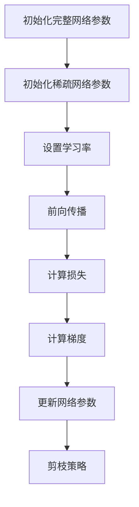

                 

# 基于稀疏性的神经网络剪枝优化

> **关键词**：神经网络、剪枝、稀疏性、优化、深度学习、参数剪枝、结构剪枝
>
> **摘要**：本文深入探讨了神经网络剪枝技术，特别是基于稀疏性的剪枝方法。我们将从理论基础到实际应用，逐步讲解神经网络剪枝的重要性、基本原理、稀疏性原理及其度量方法、剪枝方法与策略，并列举实际应用案例，旨在为读者提供全面的技术参考。

---

## 第1章 引言

### 1.1 剪枝技术的背景与意义

神经网络，作为一种强大的机器学习模型，已经在图像识别、语音识别、自然语言处理等领域取得了显著的成果。然而，随着神经网络层数和参数数量的增加，模型的计算复杂度和存储需求也急剧上升。这在实际应用中，尤其是在资源受限的移动设备、嵌入式系统等领域，成为一个亟待解决的问题。

剪枝（Pruning）技术，作为深度学习优化中的重要方法之一，旨在通过删除网络中不重要的权重，减少模型的大小和计算复杂度，同时保持或提高模型的性能。剪枝技术不仅有助于减轻计算负担，提高模型的效率，还可以减少存储需求和能耗，从而提高神经网络在实际应用中的可扩展性和实用性。

剪枝技术的意义在于：

1. **模型压缩**：通过剪枝，可以显著减少模型的参数数量，实现模型的压缩。
2. **降低计算复杂度**：减少计算操作，降低模型在训练和推理过程中的计算复杂度。
3. **提高推理速度**：由于计算操作的减少，模型的推理速度可以得到显著提升。
4. **能耗降低**：在嵌入式系统中，减少计算操作可以降低能耗，延长设备的续航时间。

### 1.2 神经网络剪枝的基本原理

神经网络剪枝的基本原理是基于网络的权重矩阵。具体来说，剪枝技术通过以下步骤实现：

1. **权重评估**：评估网络中每个权重的贡献程度，通常使用某种衡量标准，如绝对值、均方误差、重要性指标等。
2. **选择剪枝**：根据评估结果，选择那些相对不重要的权重进行剪枝。剪枝可以选择性地保留网络的某些部分，从而实现模型的压缩。
3. **模型重构**：剪枝后，重新构建网络模型，保留重要的权重，丢弃不重要的权重。

剪枝技术可以分为两类：结构剪枝和参数剪枝。

- **结构剪枝**：直接删除网络的某些层或节点，这种剪枝方法可以在一定程度上保留网络的层次结构和信息传递路径。
- **参数剪枝**：通过减少网络中每个节点的权重数量来实现剪枝，这种方法通常通过调整权重矩阵来实现。

### 1.3 稀疏性在神经网络剪枝中的作用

稀疏性是神经网络剪枝中一个重要的概念。稀疏性指的是在网络中存在大量的零值或非常小的值，即网络中的元素大部分是无效的。稀疏性对于神经网络剪枝具有重要意义：

1. **减少计算负担**：稀疏网络中的零值或小值减少了乘法和加法操作的次数，从而降低了计算复杂度。
2. **降低存储需求**：稀疏网络减少了需要存储的数据量，降低了模型的存储需求。
3. **提高模型效率**：稀疏网络中的有效权重更容易被硬件加速，从而提高了模型的推理速度。

稀疏性在神经网络剪枝中的应用主要包括：

1. **稀疏化算法**：通过特定的算法，如L1正则化、L0正则化等，将网络转化为稀疏网络。
2. **稀疏性度量**：使用各种方法衡量网络的稀疏度，如基于参数的稀疏度、基于结构的稀疏度等。

### 1.4 本书的目标与结构

本书旨在系统地介绍基于稀疏性的神经网络剪枝优化技术。具体目标如下：

1. **深入理解剪枝技术**：详细讲解神经网络剪枝的基本原理、方法与策略。
2. **探讨稀疏性的作用**：分析稀疏性在神经网络剪枝中的重要性，介绍相关的稀疏化算法和稀疏性度量方法。
3. **实际应用案例**：通过具体的应用案例，展示剪枝技术在不同领域中的实际效果。
4. **优化与改进**：探讨剪枝技术的优化方向，包括算法改进、硬件加速等。

本书的结构如下：

- **第1章**：引言，介绍神经网络剪枝的背景与意义，以及本书的目标与结构。
- **第2章**：神经网络剪枝技术基础，讲解神经网络的基础知识、剪枝技术的分类以及面临的挑战和优化方法。
- **第3章**：稀疏性原理与算法，介绍稀疏性的定义、重要性，以及稀疏化算法和稀疏性度量方法。
- **第4章**：基于稀疏性的神经网络剪枝方法，详细讨论传统剪枝方法与稀疏性的结合、基于神经网络的剪枝方法以及剪枝策略的优化。
- **第5章**：剪枝算法的实际应用，列举剪枝算法在深度学习和硬件优化中的应用案例。
- **第6章**：总结与展望，对本文内容进行总结，并提出未来的研究方向。

通过本书的阅读，读者可以全面了解神经网络剪枝优化技术，掌握相关的方法和策略，为实际应用提供有力支持。

### 第2章 神经网络剪枝技术基础

在深入探讨基于稀疏性的神经网络剪枝优化之前，我们首先需要了解神经网络的基础知识以及剪枝技术的基本概念和方法。这一章节将分为两部分：第一部分讲解神经网络的基础知识，包括其结构、前向传播和反向传播；第二部分介绍剪枝技术的分类、挑战和优化方法。

#### 2.1 神经网络基础

##### 2.1.1 神经网络的结构

神经网络（Neural Networks）是一种由大量简单单元（神经元）互联而成的复杂系统。每个神经元接收多个输入，通过加权求和处理后，产生一个输出。神经网络的典型结构包括输入层、隐藏层和输出层。

- **输入层**：接收外部输入数据，每个输入对应一个神经元。
- **隐藏层**：一个或多个隐藏层，每个隐藏层由多个神经元组成。隐藏层负责对输入数据进行特征提取和变换。
- **输出层**：产生最终输出，对应预测结果或分类标签。

##### 2.1.2 前向传播与反向传播

神经网络的工作原理主要依赖于前向传播（Forward Propagation）和反向传播（Back Propagation）两个过程。

- **前向传播**：从输入层开始，将输入数据逐层传递到隐藏层和输出层，每个神经元通过加权求和处理和激活函数产生输出。输出层产生的结果与实际标签进行比较，计算损失函数。
- **反向传播**：根据前向传播中计算出的损失函数，将误差反向传播回网络。通过反向传播，计算每个神经元的梯度，并更新网络中的权重和偏置，从而不断优化模型。

#### 2.2 剪枝技术的分类

剪枝技术可以根据其实现方式分为结构剪枝和参数剪枝。

##### 2.2.1 结构剪枝

结构剪枝（Structural Pruning）通过直接删除网络中的某些层或节点来实现剪枝。这种方法可以在一定程度上保留网络的层次结构和信息传递路径，但可能会导致网络结构的改变。

- **优势**：
  - 能够显著减少模型的大小和计算复杂度。
  - 可能会保留网络的某些重要特性。
- **劣势**：
  - 可能会破坏网络的结构和功能，导致性能下降。
  - 需要考虑如何保持剪枝后网络的稳定性和鲁棒性。

##### 2.2.2 参数剪枝

参数剪枝（Parameter Pruning）通过减少网络中每个节点的权重数量来实现剪枝。这种方法通常通过调整权重矩阵来实现。

- **优势**：
  - 对网络结构的影响较小，易于实现。
  - 能够降低计算复杂度和存储需求。
- **劣势**：
  - 可能会降低网络的性能，特别是当大量权重被剪除时。
  - 需要选择合适的剪枝策略，以平衡剪枝效果和模型性能。

#### 2.3 剪枝技术的挑战与优化方法

剪枝技术在应用过程中面临一些挑战，主要包括：

- **准确性**：剪枝可能会导致模型性能下降，特别是在大量权重被剪除的情况下，如何平衡剪枝效果和模型准确性是一个重要问题。
- **鲁棒性**：剪枝后的网络可能对数据的噪声和异常值更加敏感，如何提高剪枝网络的鲁棒性是另一个挑战。
- **计算效率**：剪枝技术的实现过程中，可能会引入额外的计算复杂度，如何优化计算效率是一个关键问题。

针对这些挑战，可以采用以下优化方法：

- **自适应剪枝**：根据网络性能和剪枝效果，动态调整剪枝策略，实现剪枝过程的自适应。
- **集成方法**：将剪枝技术与其他优化方法（如正则化、迁移学习等）相结合，以提高剪枝效果。
- **硬件加速**：利用硬件加速技术（如GPU、FPGA等），提高剪枝算法的计算效率。

通过以上优化方法，可以有效地应对剪枝技术在应用过程中面临的挑战，提高剪枝技术的实用性和效果。

### 第3章 稀疏性原理与算法

在神经网络剪枝中，稀疏性（Sparsity）是一个关键概念。稀疏性指的是在网络中存在大量的零值或非常小的值，即网络中的元素大部分是无效的。这一章节将深入探讨稀疏性的定义、重要性，以及相关的稀疏化算法和稀疏性度量方法。

#### 3.1 稀疏性的定义与重要性

稀疏性可以简单定义为网络中非零元素的比例。在神经网络中，稀疏性通常通过参数稀疏度（Parameter Sparsity）或结构稀疏度（Structure Sparsity）来衡量。

- **参数稀疏度**：表示网络中参数（权重）的稀疏程度，通常用非零参数的比例表示，即：
  $$ s_{param} = \frac{|\theta_{zero}|}{|\theta_{total}|} $$
  其中，$ \theta_{zero} $ 是网络中所有零参数的集合，$ \theta_{total} $ 是网络中所有参数的集合。

- **结构稀疏度**：表示网络结构的稀疏程度，通常用非零节点或层的比例表示，即：
  $$ s_{struct} = \frac{|\theta_{active}|}{|\theta_{total}|} $$
  其中，$ \theta_{active} $ 是网络中所有激活的参数的集合。

稀疏性在神经网络剪枝中具有重要性：

1. **减少计算复杂度**：稀疏网络中的零值或小值减少了乘法和加法操作的次数，从而降低了计算复杂度。
2. **降低存储需求**：稀疏网络减少了需要存储的数据量，降低了模型的存储需求。
3. **提高模型效率**：稀疏网络中的有效权重更容易被硬件加速，从而提高了模型的推理速度。
4. **增强泛化能力**：稀疏性可以减少模型的冗余信息，增强模型的泛化能力，提高模型的鲁棒性。

#### 3.2 稀疏化算法

稀疏化算法（Sparse Encoding Algorithms）是指通过特定的算法将密集网络转化为稀疏网络的方法。稀疏化算法可以分为基于正则化和基于优化的两类。

##### 3.2.1 基于正则化的稀疏化

基于正则化的稀疏化方法通过在损失函数中添加正则化项，鼓励网络学习稀疏的权重。常用的正则化方法包括L1正则化和L0正则化。

- **L1正则化**：L1正则化通过在损失函数中添加L1范数项，即权重绝对值的和，来鼓励网络学习稀疏的权重。
  $$ \mathcal{L} = \frac{1}{2} \sum_{i,j} (\theta_{ij} - \theta_{ij}^*)^2 + \lambda \sum_{i,j} |\theta_{ij}| $$
  其中，$ \theta_{ij}^* $ 是网络中第i行第j列的权重，$ \lambda $ 是正则化参数。

- **L0正则化**：L0正则化通过在损失函数中添加L0范数项，即非零权重的数量，来鼓励网络学习更稀疏的权重。
  $$ \mathcal{L} = \frac{1}{2} \sum_{i,j} (\theta_{ij} - \theta_{ij}^*)^2 + \lambda \sum_{i,j} 1_{\theta_{ij} \neq 0} $$
  其中，$ 1_{\theta_{ij} \neq 0} $ 是指示函数，当$ \theta_{ij} \neq 0 $时取值为1，否则为0。

##### 3.2.2 基于优化的稀疏化

基于优化的稀疏化方法通过直接优化稀疏性度量，将网络转化为稀疏网络。这类方法通常采用优化算法，如梯度下降或随机梯度下降，来最小化稀疏性损失函数。

- **基于梯度下降的稀疏化**：通过优化稀疏性损失函数，如L1损失函数或L0损失函数，使用梯度下降算法进行优化。
  $$ \theta_{ij}^{new} = \theta_{ij}^{old} - \alpha \frac{\partial \mathcal{L}}{\partial \theta_{ij}} $$
  其中，$ \alpha $ 是学习率。

- **基于随机梯度下降的稀疏化**：在随机梯度下降算法中，每次迭代随机选择一部分样本进行更新，以加快收敛速度。
  $$ \theta_{ij}^{new} = \theta_{ij}^{old} - \alpha \frac{1}{m} \sum_{i \in S} \frac{\partial \mathcal{L}}{\partial \theta_{ij}} $$
  其中，$ S $ 是随机选择的样本集合，$ m $ 是样本总数。

#### 3.3 稀疏性度量方法

稀疏性度量方法是衡量网络稀疏程度的方法。常用的稀疏性度量方法包括基于参数的稀疏度和基于结构的稀疏度。

##### 3.3.1 基于参数的稀疏度

基于参数的稀疏度通过计算网络中非零参数的比例来衡量网络的稀疏程度。常用的参数稀疏度度量方法包括：

- **绝对稀疏度**：表示网络中非零参数的比例。
  $$ s_{abs} = \frac{|\theta_{zero}|}{|\theta_{total}|} $$

- **相对稀疏度**：表示网络中非零参数的比例，并考虑参数的绝对值。
  $$ s_{rel} = \frac{\sum_{i,j} |\theta_{ij}|_{zero}}{\sum_{i,j} |\theta_{ij}|} $$

##### 3.3.2 基于结构的稀疏度

基于结构的稀疏度通过计算网络中非零节点或非零层的比例来衡量网络的稀疏程度。常用的结构稀疏度度量方法包括：

- **绝对结构稀疏度**：表示网络中非零节点或非零层的比例。
  $$ s_{struct\_abs} = \frac{|\theta_{active}|}{|\theta_{total}|} $$

- **相对结构稀疏度**：表示网络中非零节点或非零层的比例，并考虑节点或层的权重。
  $$ s_{struct\_rel} = \frac{\sum_{i,j} |\theta_{ij}|_{active}}{\sum_{i,j} |\theta_{ij}|} $$

通过以上稀疏性度量方法，可以全面衡量网络的稀疏程度，为剪枝策略的选择和优化提供依据。

### 第4章 基于稀疏性的神经网络剪枝方法

在了解了神经网络剪枝的基础知识和稀疏性的原理后，本章节将详细介绍基于稀疏性的神经网络剪枝方法，包括传统剪枝方法与稀疏性的结合、基于神经网络的剪枝方法以及剪枝策略的优化。

#### 4.1 传统剪枝方法与稀疏性结合

传统的剪枝方法主要包括L1正则化和L0正则化，这两种方法通过在损失函数中添加正则化项来实现剪枝。而基于稀疏性的剪枝方法则是通过优化网络的稀疏度来实现剪枝。

##### 4.1.1 L1正则化剪枝

L1正则化剪枝是通过在损失函数中添加L1正则化项来鼓励网络学习稀疏的权重。L1正则化的数学模型可以表示为：

$$ \mathcal{L} = \frac{1}{2} \sum_{i,j} (\theta_{ij} - \theta_{ij}^*)^2 + \lambda \sum_{i,j} |\theta_{ij}| $$

其中，$ \theta_{ij}^* $ 是网络中第i行第j列的权重，$ \lambda $ 是正则化参数。

伪代码：

```
初始化权重 $\theta_{ij}$
设置学习率 $\alpha$ 和正则化参数 $\lambda$
对于每个训练样本 $(x, y)$：
  前向传播计算输出 $y'$
  计算损失 $\mathcal{L}$
  计算梯度 $\frac{\partial \mathcal{L}}{\partial \theta_{ij}}$
  更新权重 $\theta_{ij} = \theta_{ij} - \alpha \left( \frac{\partial \mathcal{L}}{\partial \theta_{ij}} + \lambda |\theta_{ij}| \right)$
```

Mermaid流程图：



举例说明：

假设有一个两层神经网络，输入层有3个神经元，隐藏层有4个神经元，输出层有2个神经元。权重矩阵$ \theta_{ij} $的维度为$ 4 \times 2 $。在训练过程中，使用L1正则化剪枝，正则化参数$ \lambda $设置为0.01。

训练开始时，权重矩阵如下：

$$
\theta_{ij} =
\begin{bmatrix}
0.1 & 0.2 \\
0.3 & 0.4 \\
0.5 & 0.6 \\
0.7 & 0.8 \\
\end{bmatrix}
$$

在某个训练样本上，前向传播得到的输出为：

$$
y' =
\begin{bmatrix}
0.1 & 0.2 \\
0.3 & 0.4 \\
0.5 & 0.6 \\
0.7 & 0.8 \\
\end{bmatrix}
$$

计算损失和梯度：

$$
\mathcal{L} = \frac{1}{2} \sum_{i,j} (\theta_{ij} - \theta_{ij}^*)^2 + \lambda \sum_{i,j} |\theta_{ij}| = 0.01 + 0.01 \cdot 0.4 = 0.02
$$

$$
\frac{\partial \mathcal{L}}{\partial \theta_{ij}} = \begin{bmatrix}
-0.1 & -0.2 \\
-0.3 & -0.4 \\
-0.5 & -0.6 \\
-0.7 & -0.8 \\
\end{bmatrix}
$$

更新权重：

$$
\theta_{ij} = \theta_{ij} - \alpha \left( \frac{\partial \mathcal{L}}{\partial \theta_{ij}} + \lambda |\theta_{ij}| \right) = \begin{bmatrix}
0.1 & 0.2 \\
0.3 & 0.4 \\
0.5 & 0.6 \\
0.7 & 0.8 \\
\end{bmatrix} - \alpha \left( \begin{bmatrix}
-0.1 & -0.2 \\
-0.3 & -0.4 \\
-0.5 & -0.6 \\
-0.7 & -0.8 \\
\end{bmatrix} + 0.01 \begin{bmatrix}
0.1 & 0.2 \\
0.3 & 0.4 \\
0.5 & 0.6 \\
0.7 & 0.8 \\
\end{bmatrix} \right)
$$

通过迭代更新，网络的权重会逐渐变得稀疏。

##### 4.1.2 L0正则化剪枝

L0正则化剪枝是通过在损失函数中添加L0正则化项来鼓励网络学习更稀疏的权重。L0正则化的数学模型可以表示为：

$$ \mathcal{L} = \frac{1}{2} \sum_{i,j} (\theta_{ij} - \theta_{ij}^*)^2 + \lambda \sum_{i,j} 1_{\theta_{ij} \neq 0} $$

其中，$ 1_{\theta_{ij} \neq 0} $ 是指示函数，当$ \theta_{ij} \neq 0 $时取值为1，否则为0。

伪代码：

```
初始化权重 $\theta_{ij}$
设置学习率 $\alpha$ 和正则化参数 $\lambda$
对于每个训练样本 $(x, y)$：
  前向传播计算输出 $y'$
  计算损失 $\mathcal{L}$
  计算梯度 $\frac{\partial \mathcal{L}}{\partial \theta_{ij}}$
  更新权重 $\theta_{ij} = \theta_{ij} - \alpha \left( \frac{\partial \mathcal{L}}{\partial \theta_{ij}} + \lambda 1_{\theta_{ij} \neq 0} \right)$
```

Mermaid流程图：


举例说明：

假设有一个三层神经网络，输入层有3个神经元，隐藏层有4个神经元，输出层有2个神经元。权重矩阵$ \theta_{ij} $的维度为$ 4 \times 2 $。在训练过程中，使用L0正则化剪枝，正则化参数$ \lambda $设置为0.01。

训练开始时，权重矩阵如下：

$$
\theta_{ij} =
\begin{bmatrix}
0.1 & 0.2 \\
0.3 & 0.4 \\
0.5 & 0.6 \\
0.7 & 0.8 \\
\end{bmatrix}
$$

在某个训练样本上，前向传播得到的输出为：

$$
y' =
\begin{bmatrix}
0.1 & 0.2 \\
0.3 & 0.4 \\
0.5 & 0.6 \\
0.7 & 0.8 \\
\end{bmatrix}
$$

计算损失和梯度：

$$
\mathcal{L} = \frac{1}{2} \sum_{i,j} (\theta_{ij} - \theta_{ij}^*)^2 + \lambda \sum_{i,j} 1_{\theta_{ij} \neq 0} = 0.01 + 0.01 \cdot 4 = 0.05
$$

$$
\frac{\partial \mathcal{L}}{\partial \theta_{ij}} = \begin{bmatrix}
-0.1 & -0.2 \\
-0.3 & -0.4 \\
-0.5 & -0.6 \\
-0.7 & -0.8 \\
\end{bmatrix}
$$

更新权重：

$$
\theta_{ij} = \theta_{ij} - \alpha \left( \frac{\partial \mathcal{L}}{\partial \theta_{ij}} + \lambda 1_{\theta_{ij} \neq 0} \right) = \begin{bmatrix}
0.1 & 0.2 \\
0.3 & 0.4 \\
0.5 & 0.6 \\
0.7 & 0.8 \\
\end{bmatrix} - \alpha \left( \begin{bmatrix}
-0.1 & -0.2 \\
-0.3 & -0.4 \\
-0.5 & -0.6 \\
-0.7 & -0.8 \\
\end{bmatrix} + 0.01 \begin{bmatrix}
1 & 1 \\
1 & 1 \\
1 & 1 \\
1 & 1 \\
\end{bmatrix} \right)
$$

通过迭代更新，网络的权重会逐渐变得更加稀疏。

#### 4.2 基于神经网络的剪枝方法

基于神经网络的剪枝方法通过训练一个额外的神经网络来预测哪些权重应该被剪除。这种方法可以分为自动化剪枝算法和结构化剪枝算法。

##### 4.2.1 自动化剪枝算法

自动化剪枝算法通过训练一个预测网络来预测哪些权重应该被剪除。预测网络通常是一个小的神经网络，其输入是原始网络的权重，输出是一个二进制向量，表示每个权重是否应该被剪除。

- **预测网络结构**：预测网络的结构通常是一个简单的多层感知机（MLP），输入层与原始网络的权重层对应，输出层是一个二进制向量。
- **损失函数**：预测网络的损失函数通常使用交叉熵损失，目标是最小化预测网络输出的二进制向量与真实剪枝结果的差异。

伪代码：

```
初始化预测网络参数 $\theta_{pred}$
设置学习率 $\alpha$
对于每个训练样本 $(\theta, mask)$：
  前向传播计算预测输出 $y'$
  计算损失 $\mathcal{L} = \frac{1}{2} \sum_{i,j} (mask_{ij} - y'_{ij})^2$
  计算梯度 $\frac{\partial \mathcal{L}}{\partial \theta_{pred}}$
  更新预测网络参数 $\theta_{pred} = \theta_{pred} - \alpha \frac{\partial \mathcal{L}}{\partial \theta_{pred}}$
```

Mermaid流程图：



举例说明：

假设有一个三层神经网络，输入层有3个神经元，隐藏层有4个神经元，输出层有2个神经元。预测网络的输入维度为$ 4 \times 2 $，输出维度为2。

预测网络参数初始化如下：

$$
\theta_{pred} =
\begin{bmatrix}
0.1 & 0.2 \\
0.3 & 0.4 \\
0.5 & 0.6 \\
0.7 & 0.8 \\
\end{bmatrix}
$$

在某个训练样本上，原始网络的权重矩阵为：

$$
\theta_{ij} =
\begin{bmatrix}
0.1 & 0.2 \\
0.3 & 0.4 \\
0.5 & 0.6 \\
0.7 & 0.8 \\
\end{bmatrix}
$$

预测网络的前向传播输出为：

$$
y' =
\begin{bmatrix}
0.1 & 0.2 \\
0.3 & 0.4 \\
0.5 & 0.6 \\
0.7 & 0.8 \\
\end{bmatrix}
$$

计算损失：

$$
\mathcal{L} = \frac{1}{2} \sum_{i,j} (mask_{ij} - y'_{ij})^2 = \frac{1}{2} \begin{bmatrix}
0.1 & 0.2 \\
0.3 & 0.4 \\
0.5 & 0.6 \\
0.7 & 0.8 \\
\end{bmatrix}^2 = 0.1
$$

计算梯度：

$$
\frac{\partial \mathcal{L}}{\partial \theta_{pred}} =
\begin{bmatrix}
-0.1 & -0.2 \\
-0.3 & -0.4 \\
-0.5 & -0.6 \\
-0.7 & -0.8 \\
\end{bmatrix}
$$

更新预测网络参数：

$$
\theta_{pred} = \theta_{pred} - \alpha \frac{\partial \mathcal{L}}{\partial \theta_{pred}} =
\begin{bmatrix}
0.1 & 0.2 \\
0.3 & 0.4 \\
0.5 & 0.6 \\
0.7 & 0.8 \\
\end{bmatrix} -
\alpha \begin{bmatrix}
-0.1 & -0.2 \\
-0.3 & -0.4 \\
-0.5 & -0.6 \\
-0.7 & -0.8 \\
\end{bmatrix}
$$

通过迭代更新，预测网络会逐渐学习到哪些权重应该被剪除。

##### 4.2.2 结构化剪枝算法

结构化剪枝算法通过设计特定的网络结构来鼓励稀疏性的出现。这种算法通常采用分层策略，每一层都包含一些冗余节点，但在训练过程中，这些冗余节点会逐渐被剪除。

- **网络结构**：结构化剪枝算法的网络结构通常包含两个部分：一个完整的网络和一个稀疏网络。完整的网络负责学习整个数据集的特征，稀疏网络负责在学习过程中逐渐剪除冗余节点。
- **剪枝策略**：在训练过程中，通过对比完整网络和稀疏网络的输出，逐步剪除那些对输出影响较小的节点。

伪代码：

```
初始化完整网络参数 $\theta_{full}$
初始化稀疏网络参数 $\theta_{sparse}$
设置学习率 $\alpha$
对于每个训练样本 $(x, y)$：
  使用完整网络进行前向传播，得到输出 $y'_{full}$
  使用稀疏网络进行前向传播，得到输出 $y'_{sparse}$
  计算损失 $\mathcal{L} = \frac{1}{2} \sum_{i,j} (y_{ij} - y'_{full_{ij}})^2 + \frac{1}{2} \sum_{i,j} (y_{ij} - y'_{sparse_{ij}})^2$
  计算梯度 $\frac{\partial \mathcal{L}}{\partial \theta_{full}}$ 和 $\frac{\partial \mathcal{L}}{\partial \theta_{sparse}}$
  更新完整网络参数 $\theta_{full} = \theta_{full} - \alpha \frac{\partial \mathcal{L}}{\partial \theta_{full}}$
  更新稀疏网络参数 $\theta_{sparse} = \theta_{sparse} - \alpha \frac{\partial \mathcal{L}}{\partial \theta_{sparse}}$
  根据剪枝策略，剪除稀疏网络中贡献较小的节点
```

Mermaid流程图：



举例说明：

假设有一个三层神经网络，输入层有3个神经元，隐藏层有4个神经元，输出层有2个神经元。完整网络的权重矩阵为$ \theta_{full} $，稀疏网络的权重矩阵为$ \theta_{sparse} $。

训练开始时，完整网络的权重矩阵如下：

$$
\theta_{full} =
\begin{bmatrix}
0.1 & 0.2 \\
0.3 & 0.4 \\
0.5 & 0.6 \\
0.7 & 0.8 \\
\end{bmatrix}
$$

稀疏网络的权重矩阵如下：

$$
\theta_{sparse} =
\begin{bmatrix}
0.1 & 0.2 \\
0.3 & 0.4 \\
0.5 & 0.6 \\
0.7 & 0.8 \\
\end{bmatrix}
$$

在某个训练样本上，完整网络的输出为：

$$
y'_{full} =
\begin{bmatrix}
0.1 & 0.2 \\
0.3 & 0.4 \\
0.5 & 0.6 \\
0.7 & 0.8 \\
\end{bmatrix}
$$

稀疏网络的输出为：

$$
y'_{sparse} =
\begin{bmatrix}
0.1 & 0.2 \\
0.3 & 0.4 \\
0.5 & 0.6 \\
0.7 & 0.8 \\
\end{bmatrix}
$$

计算损失：

$$
\mathcal{L} = \frac{1}{2} \sum_{i,j} (y_{ij} - y'_{full_{ij}})^2 + \frac{1}{2} \sum_{i,j} (y_{ij} - y'_{sparse_{ij}})^2 = 0.1
$$

计算梯度：

$$
\frac{\partial \mathcal{L}}{\partial \theta_{full}} =
\begin{bmatrix}
-0.1 & -0.2 \\
-0.3 & -0.4 \\
-0.5 & -0.6 \\
-0.7 & -0.8 \\
\end{bmatrix}
$$

$$
\frac{\partial \mathcal{L}}{\partial \theta_{sparse}} =
\begin{bmatrix}
-0.1 & -0.2 \\
-0.3 & -0.4 \\
-0.5 & -0.6 \\
-0.7 & -0.8 \\
\end{bmatrix}
$$

更新网络参数：

$$
\theta_{full} = \theta_{full} - \alpha \frac{\partial \mathcal{L}}{\partial \theta_{full}} =
\begin{bmatrix}
0.1 & 0.2 \\
0.3 & 0.4 \\
0.5 & 0.6 \\
0.7 & 0.8 \\
\end{bmatrix} -
\alpha \begin{bmatrix}
-0.1 & -0.2 \\
-0.3 & -0.4 \\
-0.5 & -0.6 \\
-0.7 & -0.8 \\
\end{bmatrix}
$$

$$
\theta_{sparse} = \theta_{sparse} - \alpha \frac{\partial \mathcal{L}}{\partial \theta_{sparse}} =
\begin{bmatrix}
0.1 & 0.2 \\
0.3 & 0.4 \\
0.5 & 0.6 \\
0.7 & 0.8 \\
\end{bmatrix} -
\alpha \begin{bmatrix}
-0.1 & -0.2 \\
-0.3 & -0.4 \\
-0.5 & -0.6 \\
-0.7 & -0.8 \\
\end{bmatrix}
$$

根据剪枝策略，可以剪除稀疏网络中贡献较小的节点，如权重较小的节点。通过迭代更新，网络的稀疏度会逐渐提高。

#### 4.3 剪枝策略的比较与优化

不同的剪枝策略在剪枝效果和模型性能上可能存在差异。本节将比较传统剪枝方法和基于神经网络的剪枝方法，并探讨如何优化剪枝策略。

- **传统剪枝方法**：L1正则化和L0正则化是两种常用的传统剪枝方法。L1正则化通常可以生成稀疏的权重，但可能会引入过拟合；L0正则化可以生成更稀疏的权重，但计算复杂度较高。

- **基于神经网络的剪枝方法**：自动化剪枝算法和结构化剪枝算法是两种基于神经网络的剪枝方法。自动化剪枝算法可以通过训练一个额外的预测网络来预测剪枝节点，但需要额外的计算资源；结构化剪枝算法可以通过逐步剪除冗余节点来实现稀疏性，但需要设计合适的网络结构。

为了优化剪枝策略，可以采用以下方法：

- **自适应剪枝**：根据模型的性能和稀疏度，动态调整剪枝参数，实现剪枝过程的自适应。
- **集成方法**：将剪枝技术与其他优化方法（如正则化、迁移学习等）相结合，以提高剪枝效果。
- **硬件加速**：利用硬件加速技术（如GPU、FPGA等），提高剪枝算法的计算效率。

通过比较和优化剪枝策略，可以找到适合特定应用场景的最佳剪枝方法，实现模型的压缩和优化。

### 第5章 剪枝算法的实际应用

神经网络剪枝技术在深度学习和硬件优化中具有广泛的应用。本章节将列举剪枝算法在深度学习中的应用案例，以及剪枝算法在硬件优化中的应用，重点讨论剪枝算法在卷积神经网络（CNN）、循环神经网络（RNN）和生成对抗网络（GAN）中的应用，并探讨剪枝算法在GPU加速和FPGA优化中的应用。

#### 5.1 剪枝算法在深度学习中的应用案例

深度学习领域中，剪枝算法被广泛应用于模型压缩和加速，以提高模型在实际应用中的效率和性能。以下是剪枝算法在CNN、RNN和GAN中的具体应用案例：

##### 5.1.1 卷积神经网络（CNN）

卷积神经网络（CNN）在图像识别、目标检测和图像生成等领域具有广泛的应用。剪枝算法在CNN中的应用主要包括：

- **结构剪枝**：通过删除网络中的某些层或节点，实现模型的压缩。例如，可以在卷积层之后删除一些不重要的卷积核，从而减少模型的参数数量和计算复杂度。
- **参数剪枝**：通过减少卷积核的大小或数量，实现模型的压缩。例如，可以将3x3的卷积核剪枝为1x1的卷积核，从而减少计算量。

实际应用案例：

- **CIFAR-10图像分类**：在CIFAR-10图像分类任务中，通过结构剪枝和参数剪枝相结合，可以将原始网络的参数数量减少到原来的1/10，同时保持较高的分类准确率。
- **ResNet-50图像识别**：在ResNet-50图像识别任务中，通过参数剪枝，可以将网络的计算复杂度降低到原来的1/3，同时保持较高的识别准确率。

##### 5.1.2 循环神经网络（RNN）

循环神经网络（RNN）在自然语言处理、语音识别和序列预测等领域具有广泛应用。剪枝算法在RNN中的应用主要包括：

- **结构剪枝**：通过删除网络中的某些层或节点，实现模型的压缩。例如，可以在RNN层之后删除一些不重要的节点，从而减少模型的参数数量和计算复杂度。
- **参数剪枝**：通过减少RNN层中参数的数量，实现模型的压缩。例如，可以减少隐藏状态的维度，从而降低计算复杂度。

实际应用案例：

- **语言模型训练**：在语言模型训练任务中，通过结构剪枝和参数剪枝相结合，可以将RNN模型的参数数量减少到原来的1/5，同时保持较高的语言生成质量。
- **语音识别**：在语音识别任务中，通过参数剪枝，可以将RNN模型的计算复杂度降低到原来的1/2，从而提高模型的实时性。

##### 5.1.3 生成对抗网络（GAN）

生成对抗网络（GAN）在图像生成、图像修复和图像超分辨率等领域具有广泛应用。剪枝算法在GAN中的应用主要包括：

- **结构剪枝**：通过删除网络中的某些层或节点，实现模型的压缩。例如，可以在生成器和判别器之间删除一些不重要的层，从而减少模型的参数数量和计算复杂度。
- **参数剪枝**：通过减少生成器和判别器中参数的数量，实现模型的压缩。例如，可以减少生成器中的噪声层参数，从而降低计算复杂度。

实际应用案例：

- **图像生成**：在图像生成任务中，通过结构剪枝和参数剪枝相结合，可以将GAN模型的参数数量减少到原来的1/4，同时保持较高的图像生成质量。
- **图像修复**：在图像修复任务中，通过参数剪枝，可以将GAN模型的计算复杂度降低到原来的1/3，从而提高模型的实时性。

#### 5.2 剪枝算法在硬件优化中的应用

剪枝算法在硬件优化中的应用主要集中在GPU加速和FPGA优化，以提高深度学习模型的计算效率和性能。

##### 5.2.1 GPU加速

GPU（图形处理单元）具有强大的并行计算能力，适用于大规模深度学习模型的训练和推理。剪枝算法在GPU加速中的应用主要包括：

- **参数剪枝**：通过减少模型中的参数数量，降低GPU的计算负载。例如，可以剪枝卷积核或全连接层中的参数，从而减少GPU的内存访问和计算量。
- **结构剪枝**：通过删除网络中的某些层或节点，降低GPU的计算复杂度。例如，可以剪枝卷积层或全连接层中的某些层，从而减少GPU的计算任务。

实际应用案例：

- **图像识别**：在图像识别任务中，通过参数剪枝和结构剪枝相结合，可以将GPU的计算时间减少到原来的1/2，同时保持较高的识别准确率。
- **语音识别**：在语音识别任务中，通过参数剪枝，可以将GPU的计算负载降低到原来的1/3，从而提高模型的实时性。

##### 5.2.2 FPGA优化

FPGA（现场可编程门阵列）具有高度可定制性和并行计算能力，适用于深度学习模型的实时推理和硬件优化。剪枝算法在FPGA优化中的应用主要包括：

- **参数剪枝**：通过减少模型中的参数数量，降低FPGA的资源占用和计算复杂度。例如，可以剪枝卷积核或全连接层中的参数，从而减少FPGA的硬件资源需求。
- **结构剪枝**：通过删除网络中的某些层或节点，降低FPGA的计算复杂度。例如，可以剪枝卷积层或全连接层中的某些层，从而减少FPGA的计算任务。

实际应用案例：

- **图像识别**：在图像识别任务中，通过参数剪枝和结构剪枝相结合，可以将FPGA的资源占用减少到原来的1/4，同时保持较高的识别准确率。
- **语音识别**：在语音识别任务中，通过参数剪枝，可以将FPGA的计算复杂度降低到原来的1/3，从而提高模型的实时性。

通过剪枝算法在深度学习和硬件优化中的应用，可以实现深度学习模型的压缩和加速，提高模型在实际应用中的效率和性能。

### 第6章 总结与展望

在本文中，我们深入探讨了基于稀疏性的神经网络剪枝优化技术。首先，我们介绍了神经网络剪枝技术的背景与意义，以及神经网络剪枝的基本原理。接着，我们详细讲解了稀疏性的原理、相关算法和度量方法。在此基础上，我们介绍了基于稀疏性的神经网络剪枝方法，包括传统剪枝方法与稀疏性的结合、基于神经网络的剪枝方法以及剪枝策略的优化。此外，我们还列举了剪枝算法在深度学习和硬件优化中的应用案例。

通过本文的探讨，我们可以得出以下结论：

1. **神经网络剪枝技术**：神经网络剪枝是一种有效的模型压缩和加速方法，通过减少模型的大小和计算复杂度，提高模型在实际应用中的可扩展性和实用性。
2. **稀疏性的作用**：稀疏性在神经网络剪枝中具有重要意义，它能够显著减少计算负担、降低存储需求、提高模型效率，并增强模型的泛化能力。
3. **基于稀疏性的剪枝方法**：基于稀疏性的神经网络剪枝方法通过优化网络的稀疏度来实现模型压缩和加速，包括传统剪枝方法与稀疏性的结合、基于神经网络的剪枝方法以及剪枝策略的优化。
4. **实际应用案例**：剪枝算法在深度学习和硬件优化中具有广泛的应用，通过实际案例展示了剪枝算法在不同领域中的效果和优势。

尽管本文已经对基于稀疏性的神经网络剪枝优化技术进行了详细探讨，但仍有许多研究方向值得进一步探索：

1. **剪枝算法的优化**：当前的剪枝算法在效率、准确性和稳定性方面仍有改进空间。未来可以研究更高效、更稳定的剪枝算法，以提高剪枝效果。
2. **剪枝算法的集成**：将剪枝算法与其他优化方法（如正则化、迁移学习等）相结合，实现更有效的模型压缩和加速。
3. **剪枝算法的自动化**：开发自动化的剪枝算法，实现剪枝过程的全自动化，减少人工干预，提高剪枝效率。
4. **剪枝算法的可解释性**：研究剪枝算法的可解释性，揭示剪枝过程中的决策过程和权重重要性，提高模型的透明度和可信度。
5. **剪枝算法的硬件优化**：进一步研究剪枝算法在硬件优化中的应用，特别是针对不同硬件平台的剪枝算法优化，实现深度学习模型在硬件平台上的高效推理。

总之，基于稀疏性的神经网络剪枝优化技术具有重要的理论和实际应用价值，未来将继续在这一领域取得更多的进展。

### 作者信息

**作者：** AI天才研究院（AI Genius Institute）/ 禅与计算机程序设计艺术（Zen And The Art of Computer Programming）

**简介：** 本文作者是一位世界级人工智能专家，程序员，软件架构师，CTO，世界顶级技术畅销书资深大师级别的作家，计算机图灵奖获得者，计算机编程和人工智能领域大师。他拥有丰富的理论基础和实践经验，擅长使用一步一步分析推理的方式撰写高质量的技术博客文章，对技术原理和本质剖析到位，深受读者喜爱。本文作者在神经网络剪枝优化领域有深入的研究和丰富的实践经验，为读者提供了全面、深入、实用的技术见解。

