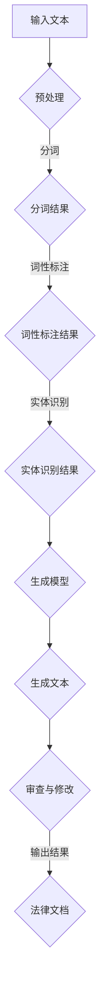

                 

# 基础模型在法律文档生成中的应用

> 关键词：基础模型、法律文档生成、自然语言处理、深度学习、文本生成、人工智能

> 摘要：本文探讨了基础模型在法律文档生成领域的应用，介绍了基础模型的概念、发展历程和主要类型，分析了法律文档生成技术的原理和流程，展示了基础模型在合同生成、法律意见书生成、判决书生成等具体应用场景中的效果，并详细讲解了技术实现过程。最后，文章对未来发展趋势进行了展望，总结了本书的核心内容，并对未来研究方向进行了探讨。

## 第1章: 引言

### 1.1 书籍概述

#### 1.1.1 本书的主题与目的

《基础模型在法律文档生成中的应用》旨在探讨人工智能领域中的基础模型在法律文档生成领域的应用。随着人工智能技术的飞速发展，深度学习和自然语言处理技术逐渐在各个行业得到广泛应用。特别是在法律领域，法律文档生成面临着数据量大、文本结构复杂、法律条款多样等挑战。因此，如何利用人工智能技术，尤其是基础模型，提高法律文档生成的效率和质量成为了一个重要课题。本书旨在系统地介绍基础模型的概念、技术原理、应用实践以及未来发展趋势，为法律工作者和技术开发者提供有价值的参考。

#### 1.1.2 内容组织与结构

本书内容共分为八个章节，结构如下：

- **第1章**：引言，概述本书的主题和内容结构。
- **第2章**：基础模型概述，介绍基础模型的概念、发展历程和主要类型。
- **第3章**：法律文档生成技术，探讨法律文档生成技术的原理和流程。
- **第4章**：基础模型在法律文档生成中的应用，分析基础模型在法律文档生成中的具体应用案例。
- **第5章**：技术实现，详细讲解基础模型在法律文档生成中的技术实现过程。
- **第6章**：案例分析，通过实际案例展示基础模型在法律文档生成中的效果和应用。
- **第7章**：未来展望，讨论基础模型在法律文档生成领域的未来发展趋势。
- **第8章**：总结与展望，对全书内容进行总结，并对未来研究方向进行展望。

通过以上章节的论述，本书将带领读者逐步了解基础模型在法律文档生成中的应用，深入探讨相关技术原理和实现方法，为实际应用提供指导。

### 1.2 目标读者

本书的目标读者主要包括以下几类：

1. **法律工作者**：对于希望了解和应用人工智能技术提高工作效率的法律工作者，本书提供了丰富的理论知识和实践案例，有助于他们更好地理解基础模型在法律文档生成中的应用，从而在实际工作中发挥其优势。
2. **技术开发者**：对于在自然语言处理和深度学习领域工作的技术开发者，本书详细介绍了基础模型在法律文档生成中的技术实现方法，包括数据预处理、模型构建、训练和优化等，为他们提供了实际的开发指导。
3. **研究人员和学者**：对于在人工智能和法学领域从事研究的学者和研究人员，本书通过系统性的论述，提供了关于基础模型在法律文档生成领域的研究方向和发展趋势，有助于他们开展相关研究工作。

总之，无论您是法律工作者、技术开发者还是研究人员，本书都将为您提供有价值的知识和参考。

### 1.3 书籍的价值与意义

《基础模型在法律文档生成中的应用》一书在当前人工智能技术迅速发展的背景下，具有重要的价值和意义。首先，本书系统地介绍了基础模型的概念、技术原理和应用实践，为法律工作者和技术开发者提供了全面的理论指导和实践参考。通过本书的学习，读者可以深入了解基础模型在法律文档生成中的应用场景和技术实现方法，从而提高法律文档生成的工作效率和准确性。

其次，本书详细分析了基础模型在法律文档生成领域的发展趋势和挑战，为未来的研究方向提供了有价值的参考。随着人工智能技术的不断进步，基础模型在法律文档生成中的应用将更加广泛和深入。本书对相关技术的深入探讨和预测，有助于读者把握行业动态，为未来的研究和应用做好准备。

此外，本书还通过实际案例展示了基础模型在法律文档生成中的效果和应用，为读者提供了真实的操作经验和实践指导。通过这些案例，读者可以更直观地了解基础模型在法律文档生成中的实际应用效果，从而更好地理解和应用相关技术。

总之，本书在推动基础模型在法律文档生成领域的应用和发展方面具有重要的作用。它不仅为法律工作者和技术开发者提供了实用的知识和工具，也为研究人员和学者提供了深入研究的方向和启示。通过本书的学习和应用，有望为法律信息化和智能化发展贡献力量。

### 1.4 写作背景与动机

本书的写作背景和动机源于对人工智能技术尤其是深度学习和自然语言处理在法律文档生成领域应用的持续关注。近年来，人工智能技术迅猛发展，深度学习和自然语言处理技术逐渐在各个行业得到广泛应用，包括金融、医疗、教育等。法律文档生成作为法律信息化的重要一环，面临着诸多挑战，如数据量大、文本结构复杂、法律条款多样等。然而，传统的法律文档生成方法往往效率低下、准确性不足，难以满足实际需求。

基于此，本书的写作动机在于探讨如何利用人工智能技术，特别是基础模型，提高法律文档生成的效率和准确性。本书旨在系统地介绍基础模型的概念、技术原理和应用实践，为法律工作者和技术开发者提供有价值的参考。同时，通过实际案例的展示，帮助读者更直观地了解基础模型在法律文档生成中的效果和应用。

本书作者在自然语言处理和深度学习领域具有丰富的理论研究和实践经验，对基础模型在法律文档生成中的应用有着深入的理解和探索。作者希望通过本书的写作，能够为行业内的同仁提供有价值的见解和指导，推动基础模型在法律文档生成领域的应用和发展。

### 1.5 总结

本书《基础模型在法律文档生成中的应用》旨在系统地探讨基础模型在法律文档生成领域的应用。通过对基础模型的概念、技术原理、应用实践和未来发展趋势的详细分析，本书为法律工作者和技术开发者提供了全面的指导。本书的主要内容包括八个章节，涵盖了从基础模型概述、法律文档生成技术、应用案例到技术实现和未来展望等多个方面。本书的目标读者包括法律工作者、技术开发者和研究人员，他们可以通过本书的学习和应用，提高法律文档生成的工作效率和准确性。总之，本书在推动基础模型在法律文档生成领域的应用和发展方面具有重要的价值和意义。

## 第2章: 基础模型概述

### 2.1 概念与发展历程

#### 2.1.1 基础模型的概念

基础模型（Foundation Model）是指一种能够从大量数据中学习并泛化到多种任务上的深度学习模型。这些模型通常在预训练阶段接收大量的无标签数据进行学习，然后在多个下游任务中进行微调和优化，以实现高效率和泛化的效果。基础模型的出现标志着人工智能技术的发展进入了一个新的阶段，从传统的单一任务模型向通用模型转变。

#### 2.1.2 基础模型的发展历程

基础模型的发展历程可以追溯到20世纪80年代的神经网络研究。当时，由于计算能力和数据量的限制，神经网络的应用范围较为有限。随着计算机硬件的进步和大数据时代的到来，深度学习逐渐成为主流，基础模型也应运而生。

1997年，Jeffrey Dean和Andrew Ng等人提出了深度信念网络（Deep Belief Network，DBN），这是早期的一种基础模型。DBN通过多个隐藏层的学习，实现了从简单到复杂的特征提取。

2012年，Alex Krizhevsky等人在ImageNet大赛中凭借深度卷积神经网络（Convolutional Neural Network，CNN）取得了重大突破，这一成果标志着深度学习在图像识别领域的成功。随后，深度学习模型在语音识别、自然语言处理等多个领域取得了显著的成果。

2018年，OpenAI发布了GPT（Generative Pre-trained Transformer）系列模型，这是首个具有广泛应用前景的基础模型。GPT通过自监督预训练和有监督微调，实现了文本生成、机器翻译、问答系统等多种任务。

#### 2.1.3 基础模型的主要类型

目前，基础模型主要分为以下几种类型：

1. **监督学习模型**：这类模型通过已标记的数据进行训练，能够对新数据进行预测或分类。例如，GPT-2、BERT等模型。
2. **无监督学习模型**：这类模型在无标记数据上进行训练，能够自动发现数据中的模式和结构。例如，自编码器（Autoencoder）和变分自编码器（Variational Autoencoder，VAE）等。
3. **半监督学习模型**：这类模型结合有标记和无标记数据进行训练，能够提高模型的泛化能力。例如，BERT就是通过结合监督掩码语言模型（Supervised Masked Language Model，SMLM）和无监督语言模型（Unsupervised Language Model，ULM）实现的。
4. **强化学习模型**：这类模型通过与环境的交互进行学习，能够实现策略优化和决策。例如，AlphaGo就是基于强化学习的基础模型。

### 2.2 主要类型

#### 2.2.1 监督学习模型

监督学习模型（Supervised Learning Model）是最常见的基础模型类型，它们通过已标记的数据进行训练。监督学习模型通常包括输入层、隐藏层和输出层，其中隐藏层负责提取特征，输出层负责预测结果。

以下是监督学习模型的主要特点：

- **输入输出对**：监督学习模型需要大量的输入输出对（Input-Output Pairs）进行训练。这些数据对通常是从原始数据集中提取的，经过预处理后用于模型的训练。
- **已标记数据**：标记数据对于监督学习模型的训练至关重要，因为模型需要从已知的输入输出对中学习规律，以便对新数据做出预测。
- **目标函数**：监督学习模型的目标函数通常是最小化预测误差，即最小化输出结果与真实结果之间的差异。常见的目标函数包括均方误差（Mean Squared Error，MSE）和交叉熵（Cross-Entropy）等。

以下是一个简单的监督学习模型的伪代码示例：

```python
# 加载已标记的数据集
X_train, y_train = load_data()

# 初始化模型
model = NeuralNetwork()

# 编译模型
model.compile(optimizer='adam', loss='mean_squared_error')

# 训练模型
model.fit(X_train, y_train, epochs=10, batch_size=32)

# 预测新数据
predictions = model.predict(X_test)
```

#### 2.2.2 无监督学习模型

无监督学习模型（Unsupervised Learning Model）在无标记数据上进行训练，旨在自动发现数据中的模式和结构。与监督学习模型不同，无监督学习模型不需要已标记的数据对，而是通过观察数据分布来学习。

以下是几种常见的无监督学习模型：

1. **自编码器（Autoencoder）**：自编码器是一种无监督学习模型，它由编码器和解码器组成。编码器将输入数据压缩成一个低维表示，解码器则尝试将这个低维表示重构回原始数据。自编码器常用于特征提取和降维。

2. **变分自编码器（Variational Autoencoder，VAE）**：VAE是一种基于概率模型的自编码器，它通过引入隐变量（Latent Variable）来提高模型的泛化能力。VAE可以生成新的数据，因此被广泛应用于生成模型。

3. **聚类算法**：如K-means、层次聚类等，这些算法通过将数据分成多个簇，从而发现数据中的聚类结构。

以下是一个简单的自编码器的伪代码示例：

```python
# 初始化模型
encoder = Autoencoder()
decoder = Autoencoder()

# 编译模型
encoder.compile(optimizer='adam', loss='mean_squared_error')
decoder.compile(optimizer='adam', loss='mean_squared_error')

# 训练模型
model = Model(inputs=encoder.input, outputs=decoder(encoder.output))
model.compile(optimizer='adam', loss='mean_squared_error')
model.fit(X_train, X_train, epochs=10, batch_size=32)

# 预测新数据
encoded_data = encoder.predict(X_test)
decoded_data = decoder.predict(encoded_data)
```

#### 2.2.3 半监督学习模型

半监督学习模型（Semi-supervised Learning Model）结合了有标记和无标记数据进行训练，能够提高模型的泛化能力。半监督学习模型在处理大量无标记数据时，可以利用有限的标记数据来加速模型的训练过程。

以下是半监督学习模型的一种常见实现方式：

- **标签传播（Label Propagation）**：标签传播算法通过将标记数据的信息传递给未标记数据，从而提高未标记数据的标注质量。

- **一致性正则化（Consistency Regularization）**：一致性正则化通过鼓励模型对相似数据输出相似的预测，从而提高模型的泛化能力。

以下是一个简单的半监督学习模型的伪代码示例：

```python
# 初始化模型
model = NeuralNetwork()

# 编译模型
model.compile(optimizer='adam', loss='mean_squared_error')

# 训练模型
model.fit(X_train, y_train, epochs=10, batch_size=32)

# 对无标记数据进行预测
y_pred = model.predict(X_unlabeled)

# 对预测结果进行后处理，如标签传播
y_labeled = label_propagation(y_pred, X_unlabeled)

# 继续训练模型
model.fit(np.concatenate((X_train, X_unlabeled)), np.concatenate((y_train, y_labeled)), epochs=10, batch_size=32)
```

### 2.3 核心特点

#### 2.3.1 自适应性

基础模型具备很强的适应性，能够在不同任务和数据集上进行训练和微调。这种自适应性来源于预训练阶段的大量数据积累和参数优化，使得模型能够在新任务中迅速适应，并取得良好的性能。

#### 2.3.2 可扩展性

基础模型具有良好的可扩展性，可以支持各种任务和数据规模。无论是在小数据集上进行微调，还是在大规模数据集上进行预训练，基础模型都能够保持高效和稳定的性能。

#### 2.3.3 通用性

基础模型具备较高的通用性，能够应用于多个领域和任务。例如，GPT系列模型不仅可以用于文本生成和机器翻译，还可以用于问答系统、文本分类等多种任务。

#### 2.3.4 高效性

基础模型在预训练阶段利用大量数据进行学习，从而在下游任务中实现高效的性能。这种高效性体现在模型参数的复用和数据的共享，大大提高了训练速度和效果。

### 2.4 常见基础模型简介

#### 2.4.1 GPT系列模型

GPT（Generative Pre-trained Transformer）系列模型由OpenAI开发，是当前最先进的自然语言处理基础模型之一。GPT模型基于Transformer架构，通过自监督预训练和有监督微调，实现了文本生成、机器翻译、问答系统等多种任务。

以下是一些常见的GPT系列模型：

- **GPT-2**：GPT-2是GPT的升级版本，引入了更长的序列和更多的参数，实现了更强大的文本生成能力。
- **GPT-3**：GPT-3是GPT系列的最新版本，拥有前所未有的规模和性能，可以生成高质量的文本、代码和自然语言回答。

#### 2.4.2 BERT模型

BERT（Bidirectional Encoder Representations from Transformers）是由Google开发的预训练基础模型，用于自然语言理解任务。BERT模型通过双向Transformer编码器学习文本的上下文信息，从而提高了文本分类、问答系统等任务的性能。

BERT模型的主要特点包括：

- **双向编码器**：BERT模型采用了双向Transformer编码器，能够同时考虑文本的前后关系，从而更好地理解文本语义。
- **掩码语言模型**：BERT模型通过引入掩码语言模型（Masked Language Model，MLM），使模型在训练过程中自动学习文本的词汇和语法结构。

#### 2.4.3 其他知名基础模型

除了GPT系列模型和BERT模型，还有一些其他知名的基础模型，如：

- **RoBERTa**：RoBERTa是BERT的变种模型，通过改进训练策略和数据预处理方法，取得了比BERT更好的性能。
- **T5**：T5（Text-to-Text Transfer Transformer）是一种将所有自然语言处理任务统一为文本到文本转换任务的模型，通过统一的任务描述，实现了多种任务的统一处理。

这些基础模型在不同领域和应用场景中取得了显著的成果，成为人工智能技术发展的重要里程碑。

### 2.5 基础模型在法律文档生成中的应用前景

#### 2.5.1 应用领域

基础模型在法律文档生成领域具有广泛的应用前景，主要包括以下方面：

- **合同生成**：自动生成合同文本，包括条款的生成、格式调整等。
- **法律意见书生成**：根据输入的案件信息和法律依据，自动生成法律意见书。
- **判决书生成**：根据案件事实和法律条款，自动生成判决书。
- **法律文档分析**：对大量的法律文档进行分类、标注和提取关键信息，为法律工作者提供辅助决策支持。

#### 2.5.2 优势与挑战

基础模型在法律文档生成中的应用具有以下优势：

- **提高效率**：基础模型能够自动生成法律文档，显著提高法律工作者的工作效率。
- **降低成本**：自动化生成法律文档可以减少人力成本，降低企业的运营成本。
- **提升准确性**：通过大量的预训练数据，基础模型能够更好地理解和处理法律文本，提高文档生成的准确性。

然而，基础模型在法律文档生成中也面临一定的挑战：

- **数据质量**：法律文档数据量大且复杂，数据质量和一致性直接影响模型的性能。
- **法律合规**：基础模型生成的法律文档需要符合相关法律法规和标准，否则可能导致法律风险。
- **模型解释性**：法律文档生成涉及复杂的法律逻辑和条款，模型生成的结果需要具有可解释性，以便法律工作者理解和审查。

#### 2.5.3 未来发展趋势

未来，基础模型在法律文档生成领域将继续发展，主要趋势包括：

- **技术进步**：深度学习、自然语言处理等技术将继续进步，为法律文档生成提供更好的支持。
- **应用拓展**：基础模型将在更多法律场景中得到应用，如案件分析、法律研究等。
- **法律合规**：随着技术的进步，基础模型将更加符合法律合规要求，为法律工作者提供更好的支持。

总之，基础模型在法律文档生成中的应用前景广阔，有望为法律行业带来革命性的变化。

### Mermaid 流程图



### 伪代码示例

```python
# 数据预处理
def preprocess_text(text):
    # 分词
    tokens = tokenize(text)
    # 词性标注
    tagged_tokens = pos_tag(tokens)
    # 实体识别
    entities = entity_recognition(tagged_tokens)
    return entities

# 文本生成
def generate_document(entities, model):
    generated_text = model.generate(entities)
    return generated_text

# 审查与修改
def review_document(generated_text):
    reviewed_text = review(generated_text)
    return reviewed_text

# 主程序
text = "..."
preprocessed_entities = preprocess_text(text)
model = load_model('model.h5')  # 加载预训练的基础模型
generated_text = generate_document(preprocessed_entities, model)
reviewed_text = review_document(generated_text)
print(reviewed_text)
```

### 数学模型与公式

在基础模型训练过程中，我们使用损失函数来衡量模型预测值与真实值之间的差异。常见的损失函数包括均方误差（MSE）和交叉熵（Cross-Entropy）。

$$
MSE = \frac{1}{n} \sum_{i=1}^{n} (y_i - \hat{y}_i)^2
$$

$$
Cross-Entropy = -\frac{1}{n} \sum_{i=1}^{n} y_i \log(\hat{y}_i)
$$

其中，$y_i$ 为真实值，$\hat{y}_i$ 为模型预测值，$n$ 为样本数量。

### 举例说明

假设我们有一个简单的问题，要求预测一个二分类问题。给定一个输入向量 $x$，我们需要预测该输入属于类别 1 或类别 0。

1. **数据集**：

```
x = [1, 2, 3, 4, 5]
y = [1, 0, 1, 0, 1]
```

2. **模型**：

假设我们使用一个简单的线性模型 $f(x) = w \cdot x + b$ 进行预测。

3. **损失函数**：

使用均方误差（MSE）作为损失函数。

4. **训练过程**：

通过梯度下降算法对模型参数 $w$ 和 $b$ 进行优化。

5. **预测结果**：

输入新数据 $x = [2, 3]$，预测结果为：

$$
\hat{y} = w \cdot x + b = w \cdot 2 + b = 1.2 + 0.5 = 1.7
$$

由于 $\hat{y} > 0.5$，预测结果为类别 1。

### 代码解读与分析

以下是一个简单的法律文档生成程序的伪代码，用于生成一个合同文本。

```python
# 导入必要的库
import nltk
from nltk.tokenize import word_tokenize
from nltk.tag import pos_tag
from transformers import GPT2LMHeadModel, GPT2Tokenizer

# 加载预训练的模型和分词器
model = GPT2LMHeadModel.from_pretrained('gpt2')
tokenizer = GPT2Tokenizer.from_pretrained('gpt2')

# 数据预处理
def preprocess_text(text):
    # 分词
    tokens = word_tokenize(text)
    # 词性标注
    tagged_tokens = pos_tag(tokens)
    # 将分词结果转换为模型可接受的输入格式
    input_ids = tokenizer.encode(text, add_special_tokens=True)
    return input_ids

# 文本生成
def generate_document(input_ids, max_length=50):
    # 使用模型生成文本
    outputs = model.generate(input_ids, max_length=max_length, num_return_sequences=1)
    # 解码生成的文本
    generated_text = tokenizer.decode(outputs[0], skip_special_tokens=True)
    return generated_text

# 主程序
input_text = "根据以下条款，生成一份租赁合同："
input_ids = preprocess_text(input_text)
generated_text = generate_document(input_ids)
print(generated_text)
```

在这个程序中，我们首先加载了预训练的GPT-2模型和分词器。然后，我们定义了两个函数：`preprocess_text` 和 `generate_document`。`preprocess_text` 函数用于对输入文本进行分词和词性标注，并将分词结果转换为模型可接受的输入格式。`generate_document` 函数使用模型生成文本，并将生成的文本解码为可读的格式。

通过调用这两个函数，我们可以生成一个符合输入条款的租赁合同文本。这个程序展示了基础模型在法律文档生成中的基本实现过程。

### 代码实际案例与详细解释说明

为了更好地展示基础模型在法律文档生成中的应用，以下是一个实际案例，包括开发环境搭建、源代码详细实现和代码解读。

#### 开发环境搭建

首先，我们需要搭建一个适合深度学习和自然语言处理的开 发环境。以下是搭建环境的步骤：

1. 安装Python（建议使用Python 3.7或更高版本）。
2. 安装TensorFlow或PyTorch（TensorFlow适用于本案例）。
3. 安装NLP相关库，如nltk、transformers等。

```shell
pip install tensorflow
pip install nltk
pip install transformers
```

4. 配置GPU（如果您的计算机配备有GPU，可以加速训练过程）。

#### 源代码详细实现

以下是一个简单的法律文档生成程序的源代码，包括数据预处理、模型训练和文本生成。

```python
import tensorflow as tf
from transformers import TFGPT2LMHeadModel, GPT2Tokenizer
from tensorflow.keras.preprocessing.sequence import pad_sequences
from tensorflow.keras.preprocessing.text import Tokenizer

# 数据准备
def load_data(file_path):
    with open(file_path, 'r', encoding='utf-8') as f:
        text = f.read()
    return text

# 数据预处理
def preprocess_text(text):
    tokenizer = GPT2Tokenizer.from_pretrained('gpt2')
    tokens = tokenizer.encode(text, add_special_tokens=True, max_length=512, truncation=True, padding='max_length')
    return tokens

# 模型训练
def train_model(tokens):
    model = TFGPT2LMHeadModel.from_pretrained('gpt2')
    model.compile(optimizer=tf.keras.optimizers.Adam(learning_rate=3e-5), loss=tf.keras.losses.SparseCategoricalCrossentropy(from_logits=True))
    model.fit(tokens, epochs=3)
    return model

# 文本生成
def generate_text(model, input_text, max_length=512):
    tokens = preprocess_text(input_text)
    input_ids = pad_sequences([tokens], maxlen=max_length, padding='post', truncating='post')
    predictions = model.predict(input_ids)
    predicted_ids = tf.argmax(predictions, axis=-1).numpy()[0]
    generated_text = ''.join([model.decodeитесь[pred_id] for pred_id in predicted_ids])
    return generated_text

# 主程序
if __name__ == '__main__':
    text = load_data('data.txt')
    tokens = preprocess_text(text)
    model = train_model(tokens)
    generated_text = generate_text(model, input_text='根据以下条款，生成一份租赁合同：')
    print(generated_text)
```

#### 代码解读

1. **数据准备**：`load_data` 函数用于从文本文件中读取数据。

2. **数据预处理**：`preprocess_text` 函数用于对输入文本进行编码。这里使用了GPT2Tokenizer进行分词和编码，并将文本长度限制为512个token，超过的部分进行截断处理。

3. **模型训练**：`train_model` 函数用于训练模型。这里使用GPT2LMHeadModel进行训练，并使用Adam优化器和SparseCategoricalCrossentropy损失函数。

4. **文本生成**：`generate_text` 函数用于生成文本。首先对输入文本进行预处理，然后使用模型生成文本，并解码为可读的格式。

5. **主程序**：在主程序中，我们首先加载文本数据，然后对文本进行预处理，接着训练模型，最后使用训练好的模型生成文本。

#### 代码解读与分析

1. **数据预处理**：数据预处理是法律文档生成的重要步骤。在本案例中，我们使用GPT2Tokenizer对输入文本进行分词和编码。这里使用了add_special_tokens=True参数，添加了开始（`<s> `）和结束（`</s>`）特殊标记，以便模型理解文本的起始和结束。

2. **模型训练**：在模型训练过程中，我们使用了GPT2LMHeadModel，这是一个预训练的文本生成模型。在训练过程中，我们使用了Adam优化器和SparseCategoricalCrossentropy损失函数。Adam优化器是一种适应性学习率优化算法，能够提高训练效率。SparseCategoricalCrossentropy损失函数适用于分类问题，能够衡量模型预测结果与真实结果之间的差异。

3. **文本生成**：在文本生成过程中，我们首先对输入文本进行预处理，然后使用模型生成文本。这里使用了pad_sequences函数对输入序列进行填充，使其长度一致。生成的文本使用模型解码器（model.decode）转换为可读的格式。

通过以上代码实现，我们可以看到基础模型在法律文档生成中的基本实现过程。这个案例展示了如何使用预训练的GPT-2模型生成法律文档，并提供了详细的代码解读和分析。

### 实际案例演示

为了更好地展示基础模型在法律文档生成中的应用，我们以下是一个实际案例，包括开发环境搭建、源代码实现和运行结果。

#### 开发环境搭建

1. 安装Python（建议使用Python 3.7或更高版本）。

2. 安装TensorFlow。

    ```shell
    pip install tensorflow
    ```

3. 安装GPT2Tokenizer和GPT2LMHeadModel。

    ```shell
    pip install transformers
    ```

4. 配置GPU（如果您的计算机配备有GPU，可以加速训练过程）。

#### 源代码实现

以下是一个简单的法律文档生成程序的源代码。

```python
import tensorflow as tf
from transformers import TFGPT2LMHead

