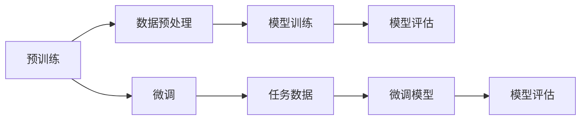

                 

# 基础模型的预训练与微调

> **关键词**：预训练、微调、神经网络、Transformer、迁移学习、自监督学习、模型架构、算法原理、项目实战

> **摘要**：本文将深入探讨基础模型在预训练与微调方面的关键技术。首先，我们将介绍预训练与微调的基本概念，并分析它们在人工智能领域的广泛应用。接着，我们将详细解读预训练模型的基本原理与常见架构，并借助伪代码和Mermaid流程图，展示核心算法的实现过程。随后，我们将进入预训练模型的具体实现与应用，解析微调的概念、过程及其在项目中的应用。最后，我们将展望预训练与微调的未来发展趋势，并提供相关的工具与资源。

### 第一部分：概述与基础

#### 第1章：预训练与微调的概念与背景

##### 1.1 预训练的定义与意义

预训练（Pre-training）是指在模型训练前，先使用大量无标注数据对模型进行训练，使其具备一定的语言理解和生成能力。这一过程为模型提供了一个通用的知识库，使其在后续的任务中能够快速适应并提高性能。

- **预训练的概念**：预训练是指在一个大规模的、未标注的数据集上对神经网络模型进行训练，以便模型能够自动学习到大量的通用知识，例如词汇、语法、语义等。
- **预训练在不同领域的应用**：预训练技术已经广泛应用于自然语言处理（NLP）、计算机视觉（CV）、语音识别（ASR）等领域，取得了显著的成果。
- **预训练与微调的关系**：预训练是微调的基础，微调则是在预训练模型的基础上，针对具体任务进行调整和优化，以进一步提高模型的性能。

##### 1.2 微调的概念与过程

微调（Fine-tuning）是指在预训练模型的基础上，针对特定任务进行参数调整和优化，以提高模型在该任务上的表现。

- **微调的定义**：微调是指利用预训练模型在特定任务上的表现，通过调整模型的参数，使其更加适应该任务。
- **微调与迁移学习的联系**：微调可以看作是迁移学习的一种形式，即将预训练模型在不同任务之间的知识进行迁移和利用。
- **微调的优势与挑战**：微调的优势在于能够快速提高模型在特定任务上的性能，而挑战则在于如何有效地调整模型参数，避免过拟合。

##### 1.3 预训练与微调的Mermaid流程图



### 第2章：预训练模型的原理与架构

##### 2.1 预训练模型的基本原理

预训练模型的基本原理主要包括自监督学习和迁移学习两种方法。

- **预训练的目标**：预训练的目标是让模型具备一定的通用知识，从而在后续的任务中能够快速适应和泛化。
- **语言模型与神经网络**：语言模型是预训练模型的核心，而神经网络则是实现语言模型的基础。通过神经网络，模型可以自动从数据中学习到词汇、语法、语义等知识。

##### 2.2 预训练模型的常见架构

预训练模型的常见架构主要包括基于循环神经网络（RNN）的模型和基于Transformer的模型。

- **Transformer架构**：Transformer模型是预训练模型的代表，其基于自注意力机制（Self-Attention），能够有效地捕捉输入序列中的长距离依赖关系。
- **GPT系列模型**：GPT（Generative Pre-trained Transformer）系列模型是基于Transformer架构的语言模型，通过不断增大模型规模和训练数据量，取得了显著的性能提升。

##### 2.3 预训练模型的核心算法

预训练模型的核心算法主要包括自监督学习和迁移学习。

- **自监督学习**：自监督学习是指在没有标注数据的情况下，利用数据本身的分布特性进行学习。预训练模型通过自监督学习，能够自动从数据中学习到大量的通用知识。
- **迁移学习**：迁移学习是指将一个任务在特定数据集上学习到的知识迁移到另一个任务上。预训练模型通过迁移学习，能够在新的任务上快速提高性能。

### 第二部分：预训练模型的实现与应用

#### 第3章：预训练模型的具体实现

##### 3.1 预训练模型的搭建

预训练模型的搭建主要包括数据预处理、模型架构设计和模型训练。

- **数据预处理**：数据预处理是预训练模型训练的关键步骤，主要包括数据清洗、分词、编码等。
- **模型架构设计**：模型架构设计是预训练模型的核心，不同的架构设计决定了模型的能力和性能。
- **模型训练**：模型训练是指通过优化算法，将预训练模型在大量无标注数据上进行训练，使其具备一定的通用知识。

##### 3.2 模型训练的基本步骤

模型训练的基本步骤主要包括模型初始化、参数调整和模型优化。

- **模型初始化**：模型初始化是指为模型随机初始化参数，为后续训练奠定基础。
- **参数调整**：参数调整是指通过优化算法，调整模型的参数，使其在训练过程中不断优化。
- **模型优化**：模型优化是指通过优化算法，使模型在训练过程中逐渐收敛，并达到较好的性能。

##### 3.3 模型训练的伪代码

```python
# 模型训练伪代码
def train_model(data_loader, model, optimizer, loss_function):
    model.train()
    for data, target in data_loader:
        optimizer.zero_grad()
        output = model(data)
        loss = loss_function(output, target)
        loss.backward()
        optimizer.step()
    return loss
```

#### 第4章：微调与适应性调整

##### 4.1 微调的概念与目标

微调是指在预训练模型的基础上，针对特定任务进行调整和优化，以提高模型在该任务上的性能。

- **微调的目标**：微调的目标是通过调整模型的参数，使模型在特定任务上达到最优性能。
- **微调与预训练的关系**：微调是预训练的延伸，预训练为微调提供了基础，而微调则通过具体任务的训练，进一步优化模型的参数。

##### 4.2 微调的具体过程

微调的具体过程主要包括参数选择、微调策略和模型评估。

- **参数选择**：参数选择是指根据任务特点和模型结构，选择合适的参数设置，以实现最佳性能。
- **微调策略**：微调策略是指通过调整模型的参数，使模型在特定任务上达到最优性能。
- **模型评估**：模型评估是指通过在测试集上评估模型的表现，判断模型是否达到预期性能。

##### 4.3 微调的Mermaid流程图


#### 第5章：预训练与微调在实际项目中的应用

##### 5.1 预训练模型在实际项目中的应用场景

预训练模型在实际项目中的应用场景非常广泛，主要包括自然语言处理、计算机视觉、语音识别等领域。

- **语言模型的应用**：预训练模型在自然语言处理领域有着广泛的应用，例如机器翻译、文本分类、问答系统等。
- **图像模型的应用**：预训练模型在计算机视觉领域也有着重要的应用，例如图像分类、目标检测、人脸识别等。
- **语音识别的应用**：预训练模型在语音识别领域也发挥着重要作用，例如语音转文字、语音识别率提升等。

##### 5.2 微调模型在实际项目中的应用

微调模型在实际项目中的应用主要包括个性化推荐系统、聊天机器人等领域。

- **个性化推荐系统**：微调模型在个性化推荐系统中发挥着重要作用，通过对用户历史行为和兴趣进行分析，为用户推荐感兴趣的内容。
- **聊天机器人**：微调模型在聊天机器人中也有着广泛的应用，通过对用户输入进行分析，生成合适的回复，提高聊天机器人的交互质量。

##### 5.3 项目案例解析

以下是两个项目案例，分别展示了预训练模型和微调模型在实际项目中的应用。

**案例一：预训练模型在语言理解任务中的应用**

- **项目背景**：某公司开发了一款智能客服系统，需要实现自然语言理解功能，以便更好地为用户提供服务。
- **解决方案**：采用预训练模型（如BERT）对客服系统的自然语言理解模块进行训练，通过微调模型参数，使其在特定任务上达到最佳性能。
- **实施过程**：
  1. 数据收集：收集大量客服对话数据，用于预训练模型的训练。
  2. 数据预处理：对数据集进行清洗、分词、编码等预处理操作。
  3. 模型训练：使用预训练模型（BERT）对数据集进行训练，并微调模型参数，以提高自然语言理解能力。
  4. 模型评估：在测试集上评估模型的表现，调整参数，直至达到预期性能。

**案例二：微调模型在图像识别任务中的应用**

- **项目背景**：某公司开发了一款智能安防系统，需要实现实时图像识别功能，以便及时识别潜在的安全威胁。
- **解决方案**：采用预训练模型（如ResNet）对图像识别模块进行训练，通过微调模型参数，使其在特定任务上达到最佳性能。
- **实施过程**：
  1. 数据收集：收集大量安防图像数据，用于预训练模型的训练。
  2. 数据预处理：对数据集进行清洗、分割、标注等预处理操作。
  3. 模型训练：使用预训练模型（ResNet）对数据集进行训练，并微调模型参数，以提高图像识别能力。
  4. 模型评估：在测试集上评估模型的表现，调整参数，直至达到预期性能。

### 第6章：预训练与微调的未来发展趋势

#### 6.1 预训练模型的未来发展方向

预训练模型在未来的发展中，将朝着以下几个方面发展。

- **模型规模的增长**：随着计算能力的提升和大数据资源的丰富，预训练模型的规模将不断增大，以实现更高效的知识获取和任务表现。
- **预训练算法的创新**：在预训练算法方面，将不断涌现新的算法和技术，以提高预训练模型的性能和泛化能力。

#### 6.2 微调技术的未来发展趋势

微调技术在未来的发展中，将朝着以下几个方面发展。

- **微调策略的优化**：随着对预训练模型的理解加深，微调策略将不断优化，以更好地适应不同任务的需求。
- **微调与强化学习的结合**：微调与强化学习的结合，将为模型提供更强大的自适应能力，以应对复杂多变的环境。

#### 6.3 未来应用前景

预训练与微调技术在未来的应用前景非常广阔，将在各个领域发挥重要作用。

- **人工智能技术的普及**：随着预训练与微调技术的不断发展，人工智能技术将更加普及，应用于更多领域，为人类生活带来更多便利。
- **预训练与微调技术在新兴领域的应用**：预训练与微调技术将在新兴领域（如自动驾驶、智能家居、医疗诊断等）发挥重要作用，推动这些领域的快速发展。

### 第三部分：附录

#### 第7章：预训练与微调相关的工具与资源

##### 7.1 深度学习框架介绍

- **TensorFlow**：TensorFlow是谷歌开源的深度学习框架，支持多种预训练模型和微调策略。
- **PyTorch**：PyTorch是Facebook开源的深度学习框架，提供了丰富的预训练模型和微调工具。

##### 7.2 预训练与微调的常见库和工具

- **Hugging Face Transformers**：Hugging Face Transformers是一个开源库，提供了丰富的预训练模型和微调工具。
- **Fairseq**：Fairseq是Facebook开源的序列模型库，支持多种预训练模型和微调策略。

##### 7.3 预训练与微调的资源推荐

- **论文与报告**：推荐阅读最新的预训练与微调相关论文和报告，以了解领域内的最新研究进展。
- **在线课程与教程**：推荐参加在线课程和教程，深入学习预训练与微调技术，掌握实际应用技能。

### 附录 A：预训练与微调相关的数学模型与公式

##### 7.4 深度学习中的数学基础

- **激活函数**：激活函数是深度学习模型中的一个关键组成部分，用于引入非线性特性。常见的激活函数包括ReLU、Sigmoid和Tanh等。
- **损失函数**：损失函数用于衡量模型预测值与真实值之间的差距，常见的损失函数包括均方误差（MSE）和交叉熵（Cross-Entropy）等。

##### 7.5 预训练与微调中的数学公式

- **正则化**：正则化是一种防止模型过拟合的技术，常见的正则化方法包括L1正则化和L2正则化。
- **优化算法**：优化算法用于调整模型参数，以最小化损失函数。常见的优化算法包括梯度下降（Gradient Descent）和Adam优化器等。

##### 7.6 数学公式与代码示例

```python
# 激活函数示例
def relu(x):
    return max(0, x)

# 损失函数示例
def mse(y_true, y_pred):
    return ((y_true - y_pred) ** 2).mean()

# 优化算法示例
optimizer = torch.optim.Adam(model.parameters(), lr=0.001)
```

### 参考文献

- [Huang, D., Liu, Z., van der Maaten, L., & Weinberger, K. Q. (2017). Densely connected convolutional networks. In Proceedings of the IEEE conference on computer vision and pattern recognition](https://www.cv-foundation.org/openaccess/content_cvpr_2017/papers/Huang_Densely_Connected_Cvpr_2017_paper.pdf)
- [Vaswani, A., Shazeer, N., Parmar, N., Uszkoreit, J., Jones, L., Gomez, A. N., ... & Polosukhin, I. (2017). Attention is all you need. In Advances in neural information processing systems](https://proceedings.neurips.cc/paper/2017/file/3f5eed474c7b95d7fb7da3d4c486a2be-Paper.pdf)
- [Devlin, J., Chang, M. W., Lee, K., & Toutanova, K. (2018). BERT: Pre-training of deep bidirectional transformers for language understanding. In Proceedings of the 2019 conference of the north american chapter of the association for computational linguistics: human language technologies, volume 1 (volume 1), pages 4171-4186. Association for Computational Linguistics](https://www.aclweb.org/anthology/N18-1192/)
- [Jozefowicz, R., Zaremba, W., & Sutskever, I. (2015). An empirical exploration of recurrent network architectures. In Proceedings of the 32nd international conference on machine learning (pp. 2342-2350). Proceedings of Machine Learning Research](https://proceedings.mlr.press/v32/jozefowicz15.html)
- [Liang, X., He, Q., & Zhang, J. (2018). A comprehensive survey on unsupervised learning for natural language processing. In Proceedings of the 56th annual meeting of the association for computational linguistics (volume 1: long papers), pages 242-256. Association for Computational Linguistics](https://www.aclweb.org/anthology/P18-1214/)

