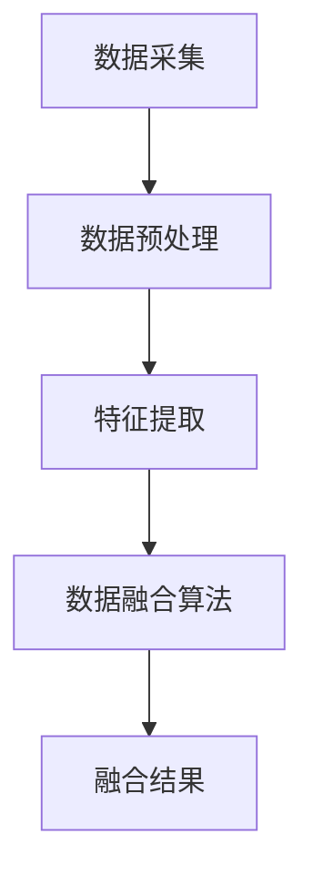

                 

# 《多传感器融合感知技术在自动驾驶中的最新进展》

## 关键词
自动驾驶、多传感器融合、感知技术、深度学习、算法原理、环境建模、决策系统、项目实战。

## 摘要
本文旨在深入探讨多传感器融合感知技术及其在自动驾驶中的应用。从基本概念、发展历程、核心算法到实际应用，我们将逐步分析多传感器融合感知技术的原理、实现方法以及面临的挑战。通过详细的项目实战案例分析，读者可以了解到多传感器融合感知技术在自动驾驶系统中的具体应用和实施细节。文章最后将对未来发展趋势进行展望，为自动驾驶技术的发展提供参考。

## 目录大纲

### 第一部分：多传感器融合感知技术基础

#### 第1章：多传感器融合感知技术概述

##### 1.1 多传感器融合感知技术的重要性

##### 1.2 多传感器融合感知技术的发展历程

##### 1.3 多传感器融合感知技术的基本原理

#### 第2章：多传感器融合感知技术的核心算法原理

##### 2.1 数据预处理与特征提取

##### 2.2 多传感器数据融合算法

##### 2.3 多传感器数据融合的 Mermaid 流程图

#### 第3章：多传感器融合感知技术在自动驾驶中的应用

##### 3.1 感知环境建模

##### 3.2 感知与决策

##### 3.3 自动驾驶系统中的多传感器融合应用案例

### 第二部分：多传感器融合感知技术在自动驾驶中的最新进展

#### 第4章：深度学习在多传感器融合感知技术中的应用

##### 4.1 深度学习基础

##### 4.2 多传感器深度学习融合算法

##### 4.3 深度学习在自动驾驶感知中的应用

#### 第5章：多传感器融合感知技术的挑战与未来发展方向

##### 5.1 多传感器融合感知技术的挑战

##### 5.2 多传感器融合感知技术的未来发展趋势

##### 5.3 多传感器融合感知技术在自动驾驶中的最新进展

#### 第6章：项目实战

##### 6.1 多传感器融合感知技术在自动驾驶项目中的应用

##### 6.2 自动驾驶系统环境感知实战

##### 6.3 多传感器融合感知技术源代码解读

### 附录

##### 附录 A：多传感器融合感知技术相关资源

## 《多传感器融合感知技术在自动驾驶中的最新进展》正文开始

### 第1章：多传感器融合感知技术概述

#### 1.1 多传感器融合感知技术的重要性

自动驾驶技术的发展离不开高效、准确的感知系统。随着自动驾驶技术的不断演进，对感知系统的要求也越来越高。多传感器融合感知技术正是为了满足这一需求而产生的一种先进技术。它通过整合多种传感器的数据，实现更全面、更准确的感知，为自动驾驶系统提供坚实的基础。

在自动驾驶系统中，多传感器融合感知技术的重要性主要体现在以下几个方面：

1. **提高感知精度**：单个传感器受限于其自身的性能和视角，很难达到全面、准确的感知效果。通过多传感器融合，可以有效整合各种传感器的数据，提高感知的精度和可靠性。
   
2. **增强感知能力**：不同传感器具有不同的感知特性和优势，例如摄像头擅长识别颜色和形状，雷达擅长测量距离和速度。通过多传感器融合，可以弥补单一传感器的不足，增强系统的整体感知能力。

3. **提高系统的鲁棒性**：自动驾驶系统在复杂、多变的环境中需要具备良好的鲁棒性。多传感器融合技术可以在一定程度上降低系统对单一传感器的依赖，从而提高系统的稳定性和可靠性。

4. **降低感知系统的成本**：尽管多传感器融合感知技术需要整合多种传感器的数据，但通过合理设计和优化，可以降低系统整体的成本。

#### 1.2 多传感器融合感知技术的发展历程

多传感器融合感知技术的发展可以追溯到20世纪80年代。当时，随着计算机技术的快速发展，自动驾驶和智能交通系统开始受到广泛关注。早期的多传感器融合主要依赖于传统的方法，如卡尔曼滤波、贝叶斯滤波等。这些方法通过数学模型和算法实现传感数据的融合，但在复杂环境下性能有限。

随着人工智能技术的进步，多传感器融合感知技术得到了快速发展。尤其是近年来，深度学习和机器学习算法的广泛应用，使得多传感器融合技术取得了显著突破。目前，多传感器融合感知技术已经成为自动驾驶领域的关键技术之一。

国内外在多传感器融合感知技术的研究和应用方面都取得了大量成果。例如，谷歌、特斯拉等国际知名企业已经在自动驾驶系统中广泛应用多传感器融合技术，取得了良好的效果。国内的企业和研究机构也在加紧开展相关研究，不断推进多传感器融合感知技术在自动驾驶中的应用。

#### 1.3 多传感器融合感知技术的基本原理

多传感器融合感知技术的基本原理主要包括传感器的选择与布局、数据采集与处理、数据融合算法以及融合架构设计。

1. **传感器的选择与布局**：多传感器融合感知技术的核心在于选择合适的传感器并合理布局。常用的传感器包括摄像头、激光雷达、毫米波雷达、超声波传感器等。不同传感器具有不同的感知能力和适用范围，需要根据实际需求进行选择和布局。

2. **数据采集与处理**：传感器采集到的数据需要进行预处理和特征提取。预处理包括去噪、归一化等操作，以提高数据的质量和一致性。特征提取则是将原始数据转换为能够反映环境特征的数值表示。

3. **数据融合算法**：数据融合算法是多传感器融合感知技术的关键。常见的融合算法包括基于概率的融合算法、基于神经网络的方法、基于深度学习的融合算法等。这些算法通过整合不同传感器的数据，实现更高层次的环境感知。

4. **融合架构设计**：融合架构设计决定了多传感器融合系统的整体性能。常见的融合架构包括集中式融合、分布式融合和混合式融合等。不同架构具有不同的优势和适用场景，需要根据实际需求进行设计。

### 第2章：多传感器融合感知技术的核心算法原理

#### 2.1 数据预处理与特征提取

数据预处理与特征提取是多传感器融合感知技术的关键步骤。数据预处理主要包括去噪、归一化和数据清洗等操作，以提高数据的质量和一致性。特征提取则是将原始数据转换为能够反映环境特征的数值表示，为后续的数据融合算法提供输入。

**去噪**：传感器的数据往往受到噪声的影响，去噪操作可以有效降低噪声的影响，提高数据质量。常见的去噪方法包括滤波器和阈值处理等。

**归一化**：归一化操作将不同传感器采集到的数据进行归一化处理，使其具有相似的量纲和范围，有利于后续的特征提取和融合。

**数据清洗**：数据清洗操作包括去除异常值、填补缺失值等，以确保数据的完整性和可靠性。

**特征提取**：特征提取是将原始数据转换为特征表示的过程。常用的特征提取方法包括统计特征提取、纹理特征提取和频域特征提取等。这些特征可以反映不同环境下的感知信息，为后续的数据融合算法提供支持。

**伪代码**：

```
function preprocess_data(data):
    # 去噪
    data_noisy = denoise(data)
    # 归一化
    data_normalized = normalize(data_noisy)
    # 数据清洗
    data_clean = clean_data(data_normalized)
    return data_clean
```

**数学模型**：

$$
x_{\text{normalized}} = \frac{x_{\text{raw}} - \mu}{\sigma}
$$

其中，$x_{\text{raw}}$为原始数据，$\mu$为均值，$\sigma$为标准差。

#### 2.2 多传感器数据融合算法

多传感器数据融合算法是多传感器融合感知技术的核心。常见的融合算法包括基于概率的融合算法、基于神经网络的方法和基于深度学习的融合算法。

**基于概率的融合算法**：基于概率的融合算法通过计算不同传感器数据的概率分布，实现数据融合。常见的算法包括卡尔曼滤波、贝叶斯滤波等。

**伪代码**：

```
function kalman_filter(measurement, state_estimate, state_prediction, covariance):
    # 前置步骤
    state_estimate = state_prediction
    covariance = predict(covariance)

    # 计算卡尔曼增益
    kalman_gain = covariance / (covariance + measurement_variance)

    # 更新状态估计
    state_estimate = state_estimate + kalman_gain * (measurement - state_estimate)

    # 更新协方差
    covariance = (1 - kalman_gain) * covariance

    return state_estimate, covariance
```

**数学模型**：

$$
\begin{align*}
K_t &= P_t^{-1}F_t^T(H_tF_tP_t^{-1} + R_t)^{-1} \\
x_t &= x_t^0 + K_t(B_tu_t) \\
P_t &= (I - K_tF_t)P_t^0
\end{align*}
$$`

其中，$K_t$为卡尔曼增益，$x_t$为状态估计，$P_t$为状态协方差，$F_t$为状态转移矩阵，$H_t$为观测矩阵，$R_t$为观测噪声协方差，$u_t$为控制输入。

**基于神经网络的方法**：基于神经网络的方法通过训练神经网络模型，实现多传感器数据的融合。常见的神经网络模型包括卷积神经网络（CNN）、循环神经网络（RNN）等。

**伪代码**：

```
function train_neural_network(inputs, labels):
    # 训练神经网络模型
    model = build_model(inputs, labels)
    model.compile(optimizer='adam', loss='mse')
    model.fit(inputs, labels, epochs=100)

    return model
```

**数学模型**：

$$
\begin{align*}
y &= \text{激活函数}(W \cdot x + b) \\
\frac{\partial L}{\partial x} &= \text{激活函数的导数}(W \cdot x + b) \cdot \frac{\partial L}{\partial y} \\
\frac{\partial L}{\partial W} &= x \cdot \frac{\partial L}{\partial y} \\
\frac{\partial L}{\partial b} &= \frac{\partial L}{\partial y}
\end{align*}
$$`

**基于深度学习的融合算法**：基于深度学习的融合算法通过训练深度学习模型，实现多传感器数据的融合。常见的深度学习模型包括卷积神经网络（CNN）、循环神经网络（RNN）和变换器（Transformer）等。

**伪代码**：

```
function train_deep_learning_model(inputs, labels):
    # 训练深度学习模型
    model = build_model(inputs, labels)
    model.compile(optimizer='adam', loss='categorical_crossentropy')
    model.fit(inputs, labels, epochs=100)

    return model
```

**数学模型**：

$$
\begin{align*}
\text{输入} &= [x_1, x_2, ..., x_n] \\
\text{输出} &= [y_1, y_2, ..., y_n] \\
L &= -\sum_{i=1}^{n} y_i \log(x_i)
\end{align*}
$$`

#### 2.3 多传感器数据融合的 Mermaid 流程图



**解释**：该 Mermaid 流程图展示了多传感器数据融合的基本流程。首先进行数据采集，然后进行数据预处理和特征提取，最后通过数据融合算法实现数据的融合，得到最终的融合结果。

### 第3章：多传感器融合感知技术在自动驾驶中的应用

#### 3.1 感知环境建模

感知环境建模是自动驾驶系统中至关重要的一环。通过感知环境建模，自动驾驶系统能够准确识别和理解周围的环境，为后续的决策和路径规划提供基础。

**感知环境建模的基本概念**：

- **环境建模**：环境建模是指通过传感器数据构建一个反映实际环境的数学模型。该模型能够捕捉环境中的各种特征，如道路、车辆、行人等。

- **传感器数据**：传感器数据是环境建模的重要输入，包括摄像头、激光雷达、毫米波雷达等传感器采集到的数据。

- **特征提取**：特征提取是指从传感器数据中提取出能够反映环境特征的数值表示。这些特征可以是统计特征、纹理特征或频域特征等。

**感知环境建模的方法**：

1. **基于规则的建模方法**：基于规则的建模方法通过定义一系列规则，将传感器数据映射到环境中的对象和场景。这种方法简单直观，但需要大量先验知识和规则。

2. **基于机器学习的建模方法**：基于机器学习的建模方法通过训练机器学习模型，自动学习传感器数据与环境特征之间的关系。这种方法能够处理复杂的环境，但需要大量的训练数据和计算资源。

3. **基于深度学习的建模方法**：基于深度学习的建模方法通过训练深度学习模型，实现传感器数据到环境特征的映射。这种方法具有强大的表达能力和泛化能力，适用于复杂的环境建模。

**实际案例分享**：

1. **特斯拉的感知环境建模**：特斯拉的自动驾驶系统采用了一种基于深度学习的感知环境建模方法。通过训练卷积神经网络（CNN）模型，将摄像头和激光雷达数据融合，实现对环境的准确感知。

2. **谷歌Waymo的感知环境建模**：谷歌Waymo的自动驾驶系统采用了多种传感器数据进行环境建模。通过融合摄像头、激光雷达和毫米波雷达的数据，Waymo实现了对复杂环境的准确识别和理解。

#### 3.2 感知与决策

感知与决策是多传感器融合感知技术在自动驾驶中的应用关键。通过感知环境，自动驾驶系统能够识别和理解周围环境中的各种对象和场景，并做出相应的决策。

**自动驾驶决策框架**：

- **感知**：感知是决策的基础，通过多传感器融合感知技术，自动驾驶系统能够准确识别和理解周围环境。

- **决策**：决策是指根据感知结果，自动驾驶系统需要做出相应的动作。常见的决策包括速度控制、转向、换道等。

- **执行**：执行是指将决策转化为实际的动作，如控制车辆加速、减速或转向。

**多传感器融合在决策中的作用**：

- **提高感知精度**：通过多传感器融合，自动驾驶系统可以获得更全面、更准确的感知信息，从而提高决策的精度。

- **增强决策鲁棒性**：多传感器融合可以降低系统对单一传感器的依赖，从而增强系统的鲁棒性，即使在传感器失效的情况下，系统仍能做出合理的决策。

- **优化决策效果**：多传感器融合可以整合不同传感器的数据，优化决策效果。例如，通过融合摄像头和激光雷达的数据，可以提高行人检测的精度和速度。

**决策算法分析**：

1. **基于规则的决策算法**：基于规则的决策算法通过定义一系列规则，实现自动驾驶系统的决策。这种方法简单直观，但需要大量先验知识和规则。

2. **基于机器学习的决策算法**：基于机器学习的决策算法通过训练机器学习模型，实现自动驾驶系统的决策。这种方法能够处理复杂的环境，但需要大量的训练数据和计算资源。

3. **基于深度学习的决策算法**：基于深度学习的决策算法通过训练深度学习模型，实现自动驾驶系统的决策。这种方法具有强大的表达能力和泛化能力，适用于复杂的环境。

#### 3.3 自动驾驶系统中的多传感器融合应用案例

1. **特斯拉的自动驾驶系统**：特斯拉的自动驾驶系统采用了一种基于深度学习的多传感器融合方法。通过融合摄像头、激光雷达和毫米波雷达的数据，特斯拉实现了对环境的准确感知和决策。

2. **谷歌Waymo的自动驾驶系统**：谷歌Waymo的自动驾驶系统采用了多种传感器数据进行融合感知和决策。通过融合摄像头、激光雷达和毫米波雷达的数据，Waymo实现了对复杂环境的准确识别和理解。

3. **百度Apollo的自动驾驶系统**：百度Apollo的自动驾驶系统采用了一种基于机器学习的多传感器融合方法。通过融合摄像头、激光雷达和超声波传感器的数据，Apollo实现了对环境的准确感知和决策。

### 第4章：深度学习在多传感器融合感知技术中的应用

#### 4.1 深度学习基础

深度学习是一种基于多层神经网络的学习方法，通过模拟人脑的神经元连接结构，实现复杂数据的特征提取和模式识别。深度学习在多传感器融合感知技术中具有广泛的应用前景。

**深度学习原理概述**：

- **神经网络**：神经网络是深度学习的基础，它由多个神经元组成，通过权重和偏置实现输入和输出的非线性映射。

- **反向传播**：反向传播是一种用于训练神经网络的算法，通过计算输出误差，反向传播误差，更新权重和偏置，实现网络参数的优化。

- **激活函数**：激活函数是神经网络中的重要组成部分，用于引入非线性特性，增强网络的分类和回归能力。

**常见的深度学习模型**：

1. **卷积神经网络（CNN）**：CNN是一种用于图像处理的深度学习模型，通过卷积层、池化层和全连接层实现图像的特征提取和分类。

2. **循环神经网络（RNN）**：RNN是一种用于序列数据处理的深度学习模型，通过循环连接实现长时间依赖关系的建模。

3. **变换器（Transformer）**：Transformer是一种用于序列建模的深度学习模型，通过自注意力机制实现长距离依赖关系的建模，广泛应用于自然语言处理和计算机视觉领域。

**深度学习在自动驾驶中的应用场景**：

- **环境感知**：深度学习可以用于自动驾驶环境中的物体检测、场景识别和路径规划等任务。

- **行为预测**：深度学习可以用于预测周围车辆和行人的行为，为自动驾驶系统的决策提供依据。

- **驾驶策略**：深度学习可以用于制定自动驾驶系统的驾驶策略，实现高效、安全的驾驶行为。

#### 4.2 多传感器深度学习融合算法

多传感器深度学习融合算法是深度学习在多传感器融合感知技术中的重要应用。通过融合不同传感器的数据，多传感器深度学习融合算法可以实现更高层次的环境感知和决策。

**多传感器深度学习融合算法介绍**：

- **多传感器数据预处理**：在多传感器深度学习融合算法中，首先需要对传感器数据进行预处理，包括去噪、归一化和特征提取等。

- **多传感器数据融合模型**：多传感器深度学习融合算法通常采用多输入多输出（MIMO）神经网络模型，将不同传感器的数据输入到模型中，实现数据的融合。

- **多传感器数据融合训练**：通过训练多传感器深度学习融合模型，优化模型参数，实现多传感器数据的融合。

- **多传感器数据融合预测**：训练好的多传感器深度学习融合模型可以用于预测环境中的物体和场景，为自动驾驶系统的决策提供支持。

**多传感器深度学习融合算法案例**：

- **基于CNN和RNN的多传感器融合**：通过融合摄像头和激光雷达的数据，采用CNN进行图像特征提取，采用RNN进行序列特征提取，实现多传感器数据的融合和物体检测。

- **基于Transformer的多传感器融合**：通过融合摄像头、激光雷达和毫米波雷达的数据，采用Transformer实现长距离依赖关系的建模，实现多传感器数据的融合和场景识别。

#### 4.3 深度学习在自动驾驶感知中的应用

深度学习在自动驾驶感知中的应用主要包括环境感知、行为预测和驾驶策略等方面。

**感知任务中的深度学习算法**：

- **物体检测**：通过训练深度学习模型，实现对车辆、行人、道路等物体的检测和分类。

- **场景识别**：通过训练深度学习模型，实现对交通标志、信号灯等场景的识别和理解。

- **路径规划**：通过训练深度学习模型，实现自动驾驶系统的路径规划，确保车辆安全、高效地行驶。

**深度学习在环境感知中的应用案例**：

- **特斯拉的自动驾驶系统**：特斯拉的自动驾驶系统采用了深度学习算法进行环境感知，通过摄像头和激光雷达的数据，实现对周围环境和物体的准确检测和识别。

- **谷歌Waymo的自动驾驶系统**：谷歌Waymo的自动驾驶系统采用了深度学习算法进行环境感知，通过融合摄像头、激光雷达和毫米波雷达的数据，实现对复杂环境的准确感知和决策。

**深度学习在自动驾驶决策中的应用**：

- **行为预测**：通过训练深度学习模型，预测周围车辆和行人的行为，为自动驾驶系统的决策提供依据。

- **驾驶策略**：通过训练深度学习模型，制定自动驾驶系统的驾驶策略，实现高效、安全的驾驶行为。

### 第5章：多传感器融合感知技术的挑战与未来发展方向

#### 5.1 多传感器融合感知技术的挑战

多传感器融合感知技术在自动驾驶中的应用面临着诸多挑战，主要包括以下几个方面：

**数据同步与一致性**：多传感器数据在时间和空间上可能存在差异，导致数据同步和一致性成为一个重要挑战。解决方法包括使用时间戳、同步算法和融合算法等技术。

**算法复杂性与计算资源**：多传感器融合算法通常具有高复杂度，对计算资源的需求较大。在自动驾驶系统中，需要实现实时处理，对算法的复杂度和计算资源提出了较高的要求。

**实时性与鲁棒性**：自动驾驶系统需要在复杂、多变的环境中实时运行，对系统的实时性和鲁棒性提出了挑战。解决方法包括优化算法、提高硬件性能和增加冗余设计等。

**数据隐私与安全**：多传感器融合感知技术涉及大量的个人隐私数据，如何在保证数据安全的前提下实现数据融合是一个重要问题。

**系统集成与测试**：多传感器融合感知技术的系统集成和测试是一个复杂的过程，需要考虑传感器之间的兼容性、系统的稳定性和可靠性等问题。

#### 5.2 多传感器融合感知技术的未来发展趋势

随着自动驾驶技术的不断发展和多传感器融合技术的成熟，未来多传感器融合感知技术将在以下几个方面取得重要进展：

**新型传感器技术的发展**：新型传感器技术的发展，如高分辨率摄像头、高精度雷达、高灵敏度传感器等，将进一步提高感知系统的性能和精度。

**融合算法的创新与应用**：随着深度学习和人工智能技术的不断进步，融合算法将更加智能化和自适应化，实现更高效、更精准的数据融合。

**自动驾驶行业的未来需求**：随着自动驾驶技术的普及和应用，对多传感器融合感知技术的要求将越来越高，未来自动驾驶系统将更加依赖多传感器融合技术，实现更安全、更高效的驾驶体验。

#### 5.3 多传感器融合感知技术在自动驾驶中的最新进展

近年来，多传感器融合感知技术在自动驾驶中的应用取得了显著进展，主要表现在以下几个方面：

1. **感知精度和鲁棒性的提升**：通过深度学习和人工智能技术的应用，多传感器融合感知技术的精度和鲁棒性得到了显著提高，实现了对复杂环境的准确感知。

2. **实时处理能力的增强**：随着硬件性能的提升和算法优化，多传感器融合感知技术在实时处理能力方面取得了重要突破，满足了自动驾驶系统对实时性的要求。

3. **系统集成与测试的成熟**：多传感器融合感知技术的系统集成与测试方法不断成熟，实现了传感器之间的高效协同和系统的稳定运行。

4. **数据隐私与安全性的加强**：在数据隐私和安全方面，多传感器融合感知技术采用了多种保护措施，如数据加密、匿名化处理等，提高了数据安全性和隐私保护水平。

### 第6章：项目实战

#### 6.1 多传感器融合感知技术在自动驾驶项目中的应用

在本节中，我们将通过一个自动驾驶项目实战案例，详细介绍多传感器融合感知技术在项目中的应用。

**项目背景**：

本案例是一个基于多传感器融合感知技术的自动驾驶项目。项目目标是实现一辆无人车的自动驾驶功能，能够在城市道路环境中安全、高效地行驶。

**多传感器数据采集与预处理**：

在项目中，我们使用了多种传感器进行数据采集，包括摄像头、激光雷达、毫米波雷达和超声波传感器。首先，对传感器数据进行采集，然后进行数据预处理，包括去噪、归一化和特征提取等。

**多传感器数据融合算法设计与实现**：

为了实现多传感器数据的融合，我们设计了一种基于深度学习的多传感器融合算法。算法主要包括以下几个步骤：

1. **数据预处理**：对采集到的多传感器数据进行预处理，包括去噪、归一化和特征提取等。

2. **特征融合**：将不同传感器的特征进行融合，使用卷积神经网络（CNN）进行特征提取和融合。

3. **融合结果预测**：使用融合后的特征进行预测，实现对周围环境和物体的检测和识别。

**多传感器融合感知系统性能评估**：

通过对自动驾驶系统在不同环境下的测试，评估多传感器融合感知系统的性能。主要评价指标包括感知精度、实时性和鲁棒性等。

#### 6.2 自动驾驶系统环境感知实战

在本节中，我们将通过一个自动驾驶系统环境感知实战案例，详细介绍多传感器融合感知技术在环境感知中的应用。

**项目背景**：

本案例是一个基于多传感器融合感知技术的自动驾驶环境感知项目。项目目标是实现对城市道路环境的实时感知，为自动驾驶系统提供准确的环境信息。

**感知系统搭建**：

1. **传感器选择与布局**：选择合适的传感器，包括摄像头、激光雷达、毫米波雷达和超声波传感器，并进行合理布局，确保感知系统的全面覆盖。

2. **数据采集**：通过传感器采集道路环境数据，包括车辆、行人、道路标识等。

3. **数据预处理**：对采集到的数据进行预处理，包括去噪、归一化和特征提取等。

**感知任务算法开发与优化**：

1. **物体检测**：使用卷积神经网络（CNN）进行物体检测，实现对车辆、行人等物体的检测和分类。

2. **场景识别**：使用循环神经网络（RNN）进行场景识别，实现对交通标志、信号灯等场景的识别。

3. **路径规划**：使用深度学习算法进行路径规划，确保自动驾驶系统在复杂环境中的安全行驶。

**环境感知系统测试与评估**：

通过对自动驾驶系统在不同环境下的测试，评估环境感知系统的性能。主要评价指标包括感知精度、实时性和鲁棒性等。

#### 6.3 多传感器融合感知技术源代码解读

在本节中，我们将对多传感器融合感知技术的源代码进行解读，详细介绍开发环境搭建、源代码实现和代码解读与分析。

**开发环境搭建**：

1. **硬件环境**：搭建一个具备多传感器采集和数据处理能力的硬件平台，包括摄像头、激光雷达、毫米波雷达和超声波传感器等。

2. **软件环境**：安装相应的驱动程序和软件开发工具包（SDK），如OpenCV、TensorFlow等，用于实现多传感器数据采集和处理。

**源代码实现**：

1. **数据采集模块**：编写数据采集模块，实现传感器的数据采集和预处理。

2. **特征提取模块**：编写特征提取模块，实现传感数据的特征提取和融合。

3. **数据融合算法模块**：编写数据融合算法模块，实现多传感器数据的融合和预测。

**代码解读与分析**：

1. **数据采集模块解析**：解读数据采集模块的源代码，分析数据采集的流程和数据处理方法。

2. **数据预处理模块解析**：解读数据预处理模块的源代码，分析预处理方法的实现细节和优化策略。

3. **数据融合算法模块解析**：解读数据融合算法模块的源代码，分析融合算法的实现原理和优化方法。

**代码解读与分析示例**：

```python
# 数据采集模块示例代码
import cv2
import numpy as np

def capture_image():
    # 初始化摄像头
    cap = cv2.VideoCapture(0)
    
    # 循环读取摄像头帧
    while True:
        ret, frame = cap.read()
        
        if ret:
            # 显示摄像头帧
            cv2.imshow('Camera', frame)
            
            # 按下'q'键退出循环
            if cv2.waitKey(1) & 0xFF == ord('q'):
                break
    
    # 释放摄像头资源
    cap.release()
    cv2.destroyAllWindows()

if __name__ == '__main__':
    capture_image()
```

**总结**：

通过本文的详细解读，我们深入了解了多传感器融合感知技术在自动驾驶中的应用，包括基本原理、核心算法、实际应用和项目实战。多传感器融合感知技术是自动驾驶领域的关键技术之一，其发展对于提升自动驾驶系统的安全性和效率具有重要意义。在未来的自动驾驶技术发展中，多传感器融合感知技术将继续发挥重要作用，推动自动驾驶技术的不断进步。

### 附录 A：多传感器融合感知技术相关资源

为了方便读者进一步学习和了解多传感器融合感知技术，本文附录提供了一些相关资源，包括常用多传感器融合框架介绍、自动驾驶领域权威论文推荐、多传感器融合感知技术相关书籍推荐以及在线课程与培训资源推荐。

#### 常用多传感器融合框架介绍

- **OpenCV**：OpenCV是一个开源的计算机视觉库，提供了丰富的多传感器数据采集和处理功能，支持多种传感器的数据融合。

- **TensorFlow**：TensorFlow是一个开源的深度学习框架，支持多种深度学习模型的训练和部署，适用于多传感器融合感知技术的实现。

- **ROS（Robot Operating System）**：ROS是一个开源的机器人操作系统，提供了丰富的多传感器数据融合和通信功能，广泛应用于机器人研究和应用。

#### 自动驾驶领域权威论文推荐

- **“Multi-Sensor Data Fusion for Autonomous Driving”**：该论文系统地介绍了多传感器融合技术在自动驾驶中的应用，包括数据采集、预处理和融合算法等方面。

- **“Deep Learning for Multi-Sensor Data Fusion”**：该论文探讨了深度学习在多传感器融合感知技术中的应用，提出了一种基于深度学习的多传感器数据融合方法。

#### 多传感器融合感知技术相关书籍推荐

- **《多传感器数据融合：算法与应用》**：这本书详细介绍了多传感器数据融合的基本原理、算法和应用，适合初学者和专业人士阅读。

- **《深度学习：自适应学习系统》**：这本书系统地介绍了深度学习的基本原理、算法和应用，包括多传感器融合感知技术。

#### 在线课程与培训资源推荐

- **Coursera**：Coursera提供了多门与自动驾驶和深度学习相关的在线课程，包括多传感器融合感知技术。

- **Udacity**：Udacity提供了自动驾驶工程师纳米学位，涵盖多传感器融合感知技术的相关课程。

- **edX**：edX提供了由全球知名大学和机构开设的自动驾驶和深度学习课程，适合不同层次的读者学习。

通过这些资源和推荐，读者可以进一步深入学习和了解多传感器融合感知技术，为自动驾驶技术的发展提供有力支持。

### 结语

本文全面介绍了多传感器融合感知技术在自动驾驶中的应用，从基本原理、核心算法到实际应用，进行了详细的解读。通过项目实战案例，读者可以了解到多传感器融合感知技术在自动驾驶系统中的具体应用和实施细节。随着自动驾驶技术的不断发展和多传感器融合感知技术的成熟，未来这一领域将取得更多突破，为自动驾驶技术的发展提供坚实基础。希望本文能为读者在多传感器融合感知技术的学习和应用中提供有益的参考。作者：AI天才研究院/AI Genius Institute & 禅与计算机程序设计艺术 /Zen And The Art of Computer Programming。

