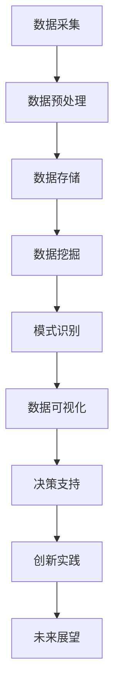

                 

### 《大数据分析在智慧旅游个性化推荐中的创新》

在当今信息化时代，大数据分析已成为各个行业提升运营效率、优化服务体验的重要工具。智慧旅游作为旅游产业与信息技术深度融合的产物，正日益成为旅游业转型升级的关键驱动力。个性化推荐系统作为大数据分析的一项重要应用，旨在为用户提供更加精准、个性化的旅游信息和服务。本文将围绕大数据分析在智慧旅游个性化推荐中的创新应用，探讨其技术原理、实现方法及未来发展趋势。

### **关键词：**

- 大数据分析
- 智慧旅游
- 个性化推荐系统
- 数据挖掘
- 实时分析

### **摘要：**

本文从大数据分析的基本概念出发，探讨了大数据分析在智慧旅游个性化推荐中的应用现状和未来发展趋势。通过分析个性化推荐系统的基本原理，本文详细介绍了大数据分析在智慧旅游个性化推荐中的创新应用，包括数据采集与预处理、数据挖掘与模式识别技术、大规模数据处理技术以及个性化推荐系统设计等。最后，本文通过实际案例展示了大数据分析在智慧旅游个性化推荐中的成功应用，并对其未来发展进行了展望。

---

### 目录大纲

#### **第一部分：引言与概述**

- **1.1 大数据分析与智慧旅游简介**
  - **1.1.1 大数据的定义与特点**
  - **1.1.2 智慧旅游的概念与发展**
  - **1.1.3 大数据在智慧旅游中的应用前景**

- **1.2 个性化推荐系统的基本原理**
  - **1.2.1 个性化推荐系统的定义**
  - **1.2.2 个性化推荐系统的工作原理**
  - **1.2.3 个性化推荐系统的主要类型**

- **1.3 大数据分析在智慧旅游个性化推荐中的创新**
  - **1.3.1 大数据分析的挑战**
  - **1.3.2 创新点与技术路径**
  - **1.3.3 创新成果与应用案例**

#### **第二部分：大数据分析技术基础**

- **2.1 数据采集与预处理**
  - **2.1.1 数据来源与采集方法**
  - **2.1.2 数据清洗与数据质量评估**
  - **2.1.3 数据集成与数据仓库构建**

- **2.2 数据挖掘与模式识别技术**
  - **2.2.1 关联规则挖掘**
  - **2.2.2 聚类分析**
  - **2.2.3 分类与预测算法**

- **2.3 大规模数据处理技术**
  - **2.3.1 分布式计算框架**
  - **2.3.2 大数据处理算法优化**
  - **2.3.3 数据流处理与实时分析**

#### **第三部分：智慧旅游个性化推荐系统设计**

- **3.1 个性化推荐系统架构设计**
  - **3.1.1 推荐系统总体架构**
  - **3.1.2 用户建模与物品建模**
  - **3.1.3 推荐算法选择与优化**

- **3.2 用户行为分析与偏好挖掘**
  - **3.2.1 用户行为数据采集**
  - **3.2.2 用户行为数据预处理**
  - **3.2.3 用户偏好模型构建与优化**

- **3.3 物品信息分析与特征提取**
  - **3.3.1 物品信息数据采集**
  - **3.3.2 物品信息数据预处理**
  - **3.3.3 物品特征提取与表征**

#### **第四部分：大数据分析在个性化推荐中的应用实战**

- **4.1 旅游目的地推荐系统实现**
  - **4.1.1 系统需求分析与设计**
  - **4.1.2 数据采集与预处理**
  - **4.1.3 用户行为分析与偏好挖掘**
  - **4.1.4 推荐算法实现与优化**
  - **4.1.5 系统部署与性能评估**

- **4.2 旅游产品推荐系统实现**
  - **4.2.1 系统需求分析与设计**
  - **4.2.2 数据采集与预处理**
  - **4.2.3 用户行为分析与偏好挖掘**
  - **4.2.4 推荐算法实现与优化**
  - **4.2.5 系统部署与性能评估**

- **4.3 旅游活动推荐系统实现**
  - **4.3.1 系统需求分析与设计**
  - **4.3.2 数据采集与预处理**
  - **4.3.3 用户行为分析与偏好挖掘**
  - **4.3.4 推荐算法实现与优化**
  - **4.3.5 系统部署与性能评估**

#### **第五部分：大数据分析在智慧旅游个性化推荐中的创新实践**

- **5.1 创新案例分享**
  - **5.1.1 案例一：基于用户社交网络的旅游推荐**
  - **5.1.2 案例二：基于地理信息数据的旅游推荐**
  - **5.1.3 案例三：基于大数据的旅游风险评估与预警**

- **5.2 创新技术探讨**
  - **5.2.1 聚类分析算法的创新应用**
  - **5.2.2 基于深度学习的推荐算法**
  - **5.2.3 实时推荐系统的设计与优化**

- **5.3 未来发展趋势与展望**
  - **5.3.1 智慧旅游个性化推荐的发展趋势**
  - **5.3.2 大数据分析技术的未来发展方向**
  - **5.3.3 智慧旅游个性化推荐的挑战与机遇**

#### **第六部分：附录**

- **6.1 相关技术资料与资源**
  - **6.1.1 大数据分析相关工具与框架**
  - **6.1.2 个性化推荐系统相关资源**
  - **6.1.3 智慧旅游领域参考资料**

- **6.2 索引**
  - **6.2.1 术语表**
  - **6.2.2 参考文献**

---

本文结构紧凑，逻辑清晰，全面覆盖了大数据分析在智慧旅游个性化推荐中的创新应用。通过Mermaid流程图、伪代码、数学公式和实际代码案例，读者可以更好地理解和掌握相关技术和方法。希望这个目录大纲能够满足您的需求。如有需要进一步修改或补充，请告知。

---

### 第一部分：引言与概述

#### 1.1 大数据分析与智慧旅游简介

随着互联网的普及和物联网技术的发展，海量数据已经成为各行业的重要资产。大数据分析作为一种处理和分析海量数据的技术，通过对数据的深入挖掘，可以帮助企业发现潜在的商业价值，提高运营效率，优化用户体验。智慧旅游则是指通过现代信息技术，特别是大数据分析，对旅游行业进行智能化升级，实现旅游资源的智能化管理、旅游服务的智能化供给和旅游体验的智能化优化。

**1.1.1 大数据的定义与特点**

大数据通常指无法用传统数据处理工具在合理时间内对其进行存储、管理和分析的数据集。大数据具有以下四个V特点：

1. **Volume（大量）**：大数据的规模巨大，往往是TB甚至PB级别。
2. **Velocity（高速）**：数据的生成和处理速度极快，要求实时处理和分析。
3. **Variety（多样性）**：数据来源广泛，包括结构化数据、半结构化数据和非结构化数据。
4. **Veracity（真实性）**：数据质量参差不齐，如何确保数据真实性是大数据分析的重要挑战。

**1.1.2 智慧旅游的概念与发展**

智慧旅游是指利用物联网、云计算、大数据、人工智能等现代信息技术，对旅游行业进行智能化升级，实现旅游资源的智能化管理、旅游服务的智能化供给和旅游体验的智能化优化。智慧旅游的发展主要包括以下几个阶段：

1. **信息引导阶段**：通过发布旅游信息，帮助游客了解目的地。
2. **在线服务阶段**：提供在线预订、导游等服务，提高游客便利性。
3. **智能化阶段**：利用大数据分析和人工智能技术，为游客提供个性化服务，提升旅游体验。

**1.1.3 大数据在智慧旅游中的应用前景**

大数据在智慧旅游中的应用前景广阔，主要体现在以下几个方面：

1. **旅游目的地推荐**：通过分析用户行为数据，为游客推荐合适的旅游目的地。
2. **旅游产品推荐**：根据用户兴趣和偏好，推荐适合的旅游产品和服务。
3. **旅游活动推荐**：基于用户行为和地理位置信息，推荐合适的旅游活动。
4. **旅游风险评估与预警**：通过分析旅游数据，预测旅游风险，并提供预警措施。
5. **旅游资源管理**：通过大数据分析，优化旅游资源分配，提高管理效率。

综上所述，大数据分析在智慧旅游中具有重要作用，为提升旅游服务质量和游客体验提供了有力支持。接下来，我们将进一步探讨个性化推荐系统的基本原理及其在智慧旅游中的应用。

---

#### 1.2 个性化推荐系统的基本原理

个性化推荐系统是一种基于用户行为、偏好和需求，为用户提供个性化内容、产品或服务的系统。在智慧旅游中，个性化推荐系统可以帮助游客发现个性化旅游目的地、旅游产品和旅游活动，提升旅游体验。

**1.2.1 个性化推荐系统的定义**

个性化推荐系统（Personalized Recommendation System）是指利用数据挖掘、机器学习等算法，根据用户的兴趣、行为和历史数据，向用户推荐其可能感兴趣的内容、产品或服务的系统。个性化推荐系统旨在解决信息过载问题，帮助用户快速找到所需信息或产品。

**1.2.2 个性化推荐系统的工作原理**

个性化推荐系统的工作原理主要包括以下几个步骤：

1. **数据采集**：收集用户行为数据、偏好数据和上下文数据。
2. **数据预处理**：清洗、整合和转换数据，为后续分析做准备。
3. **用户建模**：建立用户兴趣模型，描述用户的行为特征和偏好。
4. **物品建模**：建立物品特征模型，描述物品的属性和特征。
5. **推荐算法**：利用算法计算用户与物品之间的相似度，生成推荐列表。
6. **推荐结果评估**：评估推荐结果的准确性、多样性和新颖性。

**1.2.3 个性化推荐系统的主要类型**

个性化推荐系统根据推荐策略和方法，主要分为以下几种类型：

1. **基于内容的推荐（Content-Based Filtering）**：根据用户对内容的兴趣，推荐具有相似内容的物品。例如，用户喜欢某一篇文章，系统会推荐类似风格的文章。

2. **协同过滤推荐（Collaborative Filtering）**：基于用户行为和偏好，通过计算用户之间的相似度，推荐其他用户喜欢的物品。协同过滤推荐又分为基于用户的协同过滤（User-Based Collaborative Filtering）和基于物品的协同过滤（Item-Based Collaborative Filtering）。

3. **混合推荐（Hybrid Recommendation）**：结合多种推荐方法，以提高推荐效果。例如，将基于内容的推荐和协同过滤推荐相结合，利用各自的优点，提高推荐准确性。

4. **基于模型的推荐（Model-Based Recommendation）**：利用机器学习、深度学习等技术，建立用户和物品之间的预测模型，进行推荐。例如，利用用户历史行为数据，训练推荐模型，预测用户可能感兴趣的物品。

综上所述，个性化推荐系统在智慧旅游中具有广泛的应用前景，通过分析用户行为和偏好，为游客提供个性化服务，提升旅游体验。接下来，我们将探讨大数据分析在智慧旅游个性化推荐中的创新应用。

---

#### 1.3 大数据分析在智慧旅游个性化推荐中的创新

大数据分析在智慧旅游个性化推荐中的应用，不仅能够提升推荐系统的准确性，还能为旅游行业带来全新的发展机遇。本文将从大数据分析的挑战、创新点与技术路径、创新成果与应用案例三个方面进行探讨。

**1.3.1 大数据分析的挑战**

大数据分析在智慧旅游个性化推荐中面临着一系列挑战：

1. **数据量大**：旅游行业每天产生大量的用户行为数据、地理位置数据、社交媒体数据等，如何快速有效地处理这些海量数据成为一大挑战。

2. **数据多样性**：旅游数据来源广泛，包括结构化数据（如预订记录）、半结构化数据（如评论）和非结构化数据（如图片、视频），如何统一处理这些不同类型的数据是另一个挑战。

3. **数据质量**：由于旅游数据的采集来源多样，数据质量参差不齐，包括缺失值、噪声和错误等，如何确保数据质量是大数据分析的关键。

4. **实时性**：旅游市场的变化迅速，游客的需求和偏好也在不断变化，如何实现实时推荐，提供即时的旅游信息和服务是大数据分析的重要挑战。

**1.3.2 创新点与技术路径**

为了应对上述挑战，大数据分析在智慧旅游个性化推荐中需要从以下几个方面进行创新：

1. **分布式计算与实时分析**：利用分布式计算框架（如Hadoop、Spark）进行大规模数据处理，同时结合实时分析技术（如Flink、Storm），实现实时推荐。

2. **多源数据融合**：通过数据预处理技术，将不同类型、不同来源的数据进行统一处理和融合，构建一个统一的数据视图。

3. **数据质量提升**：采用数据清洗、数据修复和数据增强等技术，提升数据质量，为后续分析提供可靠的数据基础。

4. **深度学习与推荐算法优化**：利用深度学习技术（如神经网络、卷积神经网络等）进行用户行为和偏好建模，同时结合协同过滤、基于内容的推荐等方法，优化推荐算法，提高推荐准确性。

**1.3.3 创新成果与应用案例**

大数据分析在智慧旅游个性化推荐中的创新成果已经得到广泛应用，以下是一些典型的应用案例：

1. **旅游目的地推荐**：通过分析用户的旅游历史数据、地理位置信息和社交网络数据，为用户推荐合适的旅游目的地。例如，某旅游平台利用大数据分析技术，为用户推荐“最适合假期旅行”的目的地，提高了用户满意度。

2. **旅游产品推荐**：根据用户的旅游偏好和预算，为用户推荐适合的旅游产品和服务。例如，某在线旅游平台通过大数据分析，为用户推荐“性价比最高”的酒店和景点，提高了转化率。

3. **旅游活动推荐**：基于用户的兴趣爱好和地理位置，为用户推荐适合的旅游活动。例如，某旅游平台利用大数据分析，为用户推荐“附近的特色活动”，丰富了用户旅游体验。

4. **旅游风险评估与预警**：通过分析旅游数据，预测潜在的风险，并提供预警措施。例如，某旅游平台通过大数据分析，提前预警旅游旺季的拥堵情况和天气风险，帮助游客合理安排行程。

综上所述，大数据分析在智慧旅游个性化推荐中具有巨大的创新潜力，通过分布式计算、实时分析、多源数据融合和深度学习等技术，能够为游客提供更加精准、个性化的旅游服务，推动智慧旅游的发展。

---

### 第二部分：大数据分析技术基础

#### 2.1 数据采集与预处理

大数据分析的第一步是数据采集与预处理，这是确保数据分析质量和效率的关键环节。数据采集涉及到从多个来源获取数据，包括用户行为数据、地理位置数据、社交媒体数据等。而数据预处理则包括数据清洗、数据质量评估和数据集成等步骤。

**2.1.1 数据来源与采集方法**

在智慧旅游领域，数据来源主要包括以下几个方面：

1. **用户行为数据**：包括用户在旅游平台上的浏览记录、搜索历史、预订行为、评论和评分等。
2. **地理位置数据**：包括用户的位置信息、旅游目的地的地理位置信息等。
3. **社交媒体数据**：包括用户在社交媒体上的活动、关注对象、发布内容等。
4. **旅游企业数据**：包括旅游企业的运营数据、库存数据、价格数据等。

数据采集方法包括：

- **自动采集**：利用爬虫、API接口等自动获取数据。
- **手动采集**：通过问卷调查、用户反馈等方式手动收集数据。

**2.1.2 数据清洗与数据质量评估**

数据清洗是指对采集到的原始数据进行处理，以消除错误、噪声和不一致的数据。数据清洗的主要步骤包括：

1. **缺失值处理**：对缺失值进行填充或删除。
2. **异常值处理**：检测并处理异常数据。
3. **数据格式转换**：统一数据格式，以便后续处理。
4. **数据去重**：去除重复数据，避免数据冗余。

数据质量评估是确保数据准确性和完整性的重要环节。数据质量评估方法包括：

1. **一致性检查**：检查数据的一致性，如数据类型、单位等。
2. **完整性检查**：检查数据的完整性，如缺失值、异常值等。
3. **准确性检查**：评估数据的准确性，如通过交叉验证等方法。
4. **可靠性检查**：评估数据的可靠性，如数据来源的可靠性等。

**2.1.3 数据集成与数据仓库构建**

数据集成是将来自不同来源的数据进行整合，构建一个统一的数据视图。数据集成的方法包括：

1. **ETL（提取、转换、加载）**：将数据从不同来源提取出来，进行转换和清洗，然后加载到统一的数据仓库中。
2. **数据同步**：通过定时任务或实时同步机制，确保数据的一致性和更新。
3. **数据整合**：将不同来源的数据进行整合，消除数据冗余，构建一个完整的数据视图。

数据仓库是存储和管理大规模数据的系统，为大数据分析提供数据支持。数据仓库的主要功能包括：

1. **数据存储**：提供大规模数据存储能力，支持数据的持久化存储。
2. **数据检索**：提供高效的查询和检索功能，支持快速的数据访问。
3. **数据维护**：提供数据备份、恢复和数据安全等功能。

通过数据采集与预处理，我们能够确保数据的准确性和完整性，为后续的数据挖掘和模式识别奠定基础。接下来，我们将探讨数据挖掘与模式识别技术，以及如何利用这些技术进行智慧旅游个性化推荐。

---

#### 2.2 数据挖掘与模式识别技术

数据挖掘和模式识别是大数据分析的核心技术，旨在从大量数据中提取出有价值的模式和知识。在智慧旅游领域，这些技术被广泛应用于用户行为分析、旅游目的地推荐和旅游风险评估等方面。

**2.2.1 关联规则挖掘**

关联规则挖掘是数据挖掘的重要技术之一，旨在发现数据之间的关联关系。在智慧旅游中，关联规则挖掘可以用来分析用户行为数据，发现用户的兴趣和行为模式。例如，通过分析用户预订旅游产品的组合，可以发现哪些产品经常一起被预订，从而为用户提供更合理的推荐。

**关联规则挖掘的基本流程包括：**

1. **数据预处理**：对原始数据进行清洗和格式转换，确保数据质量。
2. **支持度计算**：计算数据集中每一条规则的支持度，即同时包含规则前件和后件的事务数占总事务数的比例。
3. **置信度计算**：计算数据集中每一条规则的置信度，即包含规则前件的事务中同时包含规则后件的事务数占总包含规则前件的事务数的比例。
4. **规则生成**：根据设定的支持度和置信度阈值，生成满足条件的关联规则。

**2.2.2 聚类分析**

聚类分析是将数据集划分为若干个簇，使得同一簇内的数据相似度较高，不同簇之间的数据相似度较低。在智慧旅游中，聚类分析可以用来发现用户的细分市场，为不同的用户群体提供个性化的旅游服务。例如，通过分析用户的旅游行为数据，可以将用户划分为不同的兴趣群体，从而为每个群体提供不同的旅游推荐。

**聚类分析的基本流程包括：**

1. **数据预处理**：对原始数据进行清洗和格式转换，确保数据质量。
2. **选择聚类算法**：根据数据特点和需求选择合适的聚类算法，如K-means、层次聚类、DBSCAN等。
3. **初始化聚类中心**：初始化聚类中心，如K-means算法需要随机选择K个数据点作为初始聚类中心。
4. **迭代计算**：根据聚类算法的规则，计算每个数据点所属的簇，并更新聚类中心。
5. **聚类评估**：评估聚类结果的质量，如内部距离、轮廓系数等。

**2.2.3 分类与预测算法**

分类与预测算法是数据挖掘的另一项重要技术，旨在将数据划分为不同的类别或预测未来的趋势。在智慧旅游中，分类与预测算法可以用来预测用户的旅游行为，为用户提供个性化的旅游推荐。例如，通过分析用户的旅游历史数据，可以预测用户在未来可能感兴趣的旅游目的地或产品。

**分类与预测算法的基本流程包括：**

1. **数据预处理**：对原始数据进行清洗和格式转换，确保数据质量。
2. **特征选择**：从原始数据中提取有用的特征，降低数据维度。
3. **模型选择**：根据数据特点和需求选择合适的分类与预测算法，如决策树、随机森林、支持向量机等。
4. **模型训练**：利用训练数据集，训练分类与预测模型。
5. **模型评估**：评估模型的准确性、召回率、F1值等指标。
6. **模型应用**：利用训练好的模型进行预测或分类。

通过数据挖掘与模式识别技术，我们可以从海量数据中提取出有价值的模式和知识，为智慧旅游个性化推荐提供数据支持。接下来，我们将探讨大规模数据处理技术，以及如何利用这些技术提高数据处理的效率和准确性。

---

#### 2.3 大规模数据处理技术

在大数据时代，如何高效地处理海量数据成为数据科学领域的一大挑战。大规模数据处理技术旨在解决数据量大、处理速度快、数据类型多样的数据处理问题。以下将介绍几种大规模数据处理技术，包括分布式计算框架、数据处理算法优化以及数据流处理与实时分析。

**2.3.1 分布式计算框架**

分布式计算框架是处理大规模数据的核心技术之一，它可以将数据处理任务分布到多个节点上并行执行，从而提高数据处理效率和速度。以下几种分布式计算框架在智慧旅游个性化推荐中有着广泛应用：

1. **Hadoop**：Hadoop是由Apache基金会开发的一个开源分布式计算框架，主要用于存储和处理大规模数据。Hadoop的核心组件包括HDFS（分布式文件系统）和MapReduce（分布式计算模型）。

   - **HDFS**：HDFS是一个高吞吐量的分布式文件存储系统，能够处理GB甚至TB级别的数据。
   - **MapReduce**：MapReduce是一种分布式数据处理模型，可以将数据处理任务分解为Map和Reduce两个阶段，分别执行映射和归约操作。

2. **Spark**：Spark是另一个流行的开源分布式计算框架，与Hadoop相比，Spark具有更高的数据处理速度和更好的内存管理。

   - **Spark Core**：Spark Core提供了分布式任务调度和内存计算功能。
   - **Spark SQL**：Spark SQL是一个用于处理结构化数据的库，支持SQL查询和数据操作。
   - **Spark Streaming**：Spark Streaming提供了实时数据处理能力，能够处理实时数据流。

**2.3.2 大数据处理算法优化**

在处理大规模数据时，传统的数据处理算法可能效率低下。因此，优化数据处理算法是提高数据处理效率的关键。以下几种算法优化技术常用于大规模数据处理：

1. **并行化算法**：将数据处理任务分解为多个子任务，并行执行，从而提高处理速度。例如，分布式算法中的MapReduce模型就是一种并行化算法。

2. **内存优化**：利用内存进行数据处理，减少磁盘I/O操作。Spark的内存计算功能就是通过内存优化来提高数据处理速度。

3. **分布式存储**：使用分布式存储系统（如HDFS）来存储大规模数据，提高数据访问速度和可靠性。

4. **数据压缩**：通过数据压缩技术，减少数据存储和传输所需的存储空间和带宽。常用的数据压缩算法包括Hadoop中的LZO、Gzip和Snappy等。

**2.3.3 数据流处理与实时分析**

在智慧旅游个性化推荐中，实时分析能力至关重要。数据流处理技术能够实时处理和响应数据流，从而为用户提供即时的个性化服务。以下几种数据流处理技术常用于智慧旅游领域：

1. **Apache Flink**：Flink是一个开源的分布式流处理框架，提供了高效的实时数据处理能力。

   - **流处理模型**：Flink的流处理模型允许对实时数据流进行操作，如转换、过滤、聚合等。
   - **状态管理**：Flink能够对实时数据流的状态进行管理，支持窗口操作和事件驱动处理。

2. **Apache Storm**：Storm是一个分布式、实时大数据处理框架，能够处理实时数据流。

   - **实时处理**：Storm支持对实时数据流的实时处理，确保数据处理的低延迟。
   - **容错性**：Storm提供了容错机制，确保数据处理任务的可靠性。

通过分布式计算框架、数据处理算法优化和数据流处理与实时分析技术，我们能够高效地处理大规模数据，为智慧旅游个性化推荐提供强大的技术支持。接下来，我们将探讨智慧旅游个性化推荐系统的设计。

---

### 第三部分：智慧旅游个性化推荐系统设计

个性化推荐系统是智慧旅游的重要组成部分，旨在通过分析用户行为和偏好，为游客提供个性化、精准的旅游推荐。本部分将详细介绍个性化推荐系统的总体架构、用户建模与物品建模，以及推荐算法的选择与优化。

#### 3.1 个性化推荐系统架构设计

个性化推荐系统的架构设计决定了系统的性能、可扩展性和灵活性。一个典型的个性化推荐系统架构包括以下几个主要模块：

1. **数据层**：数据层是推荐系统的数据存储和处理基础，主要包括用户行为数据、物品特征数据和历史推荐数据。数据层通常采用分布式存储方案，如HDFS或NoSQL数据库，以支持海量数据的存储和高效访问。

2. **计算层**：计算层负责对数据进行处理和分析，包括数据预处理、特征提取和模型训练等任务。计算层通常采用分布式计算框架，如Spark或Flink，以提高数据处理速度和效率。

3. **模型层**：模型层是推荐系统的核心，负责生成用户和物品的模型，以及根据模型进行推荐。常见的推荐算法包括协同过滤、基于内容的推荐和混合推荐等。

4. **服务层**：服务层负责将推荐结果提供给用户，包括API接口、推荐引擎和前端展示等。服务层需要确保推荐结果的实时性和准确性，同时提供良好的用户体验。

5. **监控层**：监控层负责监控系统运行状态，包括性能监控、错误日志和用户反馈等。监控层可以帮助系统管理员快速发现和解决问题，确保系统的稳定运行。

#### 3.2 用户建模与物品建模

用户建模和物品建模是个性化推荐系统的基础，用于描述用户和物品的特征和关系。

1. **用户建模**：
   - **用户特征**：用户特征包括用户的基本信息（如年龄、性别、职业等）、旅游历史（如旅游目的地、旅游产品、旅游活动等）和用户行为（如搜索历史、浏览记录、预订记录等）。
   - **用户偏好**：用户偏好是通过分析用户历史行为和反馈数据，提取出的用户感兴趣的主题和领域。例如，通过分析用户的旅游历史数据，可以确定用户喜欢的历史文化景点或户外活动。
   - **用户画像**：用户画像是对用户特征和偏好的综合描述，用于为用户提供个性化的推荐。用户画像可以通过聚类分析、协同过滤等方法生成。

2. **物品建模**：
   - **物品特征**：物品特征包括物品的基本属性（如名称、类型、价格等）和附加属性（如用户评价、图片、视频等）。物品特征用于描述物品的属性和特点，帮助系统理解物品的差异。
   - **物品标签**：物品标签是对物品进行分类和标注的词汇，如“自然风光”、“历史文化”、“户外活动”等。物品标签可以帮助系统根据用户偏好进行物品分类和推荐。
   - **物品关系**：物品关系描述了物品之间的关联性，如“某酒店附近有某个景点”、“某旅游产品包含了某个活动”等。物品关系有助于系统发现用户可能感兴趣的物品组合。

#### 3.3 推荐算法选择与优化

个性化推荐系统有多种推荐算法，每种算法都有其优势和适用场景。以下是几种常见的推荐算法：

1. **基于内容的推荐**：
   - **原理**：基于内容的推荐通过分析物品的内容特征（如文本、图片等），为用户推荐相似内容的物品。
   - **优势**：能够为用户提供个性化的内容推荐，不受用户历史行为限制。
   - **挑战**：需要大量的特征工程和内容预处理，对冷启动问题（新用户或新物品无历史数据）难以解决。

2. **协同过滤推荐**：
   - **原理**：协同过滤推荐通过分析用户之间的相似度，为用户推荐其他用户喜欢的物品。
   - **类型**：
     - **基于用户的协同过滤**：为用户推荐与其兴趣相似的用户的偏好。
     - **基于物品的协同过滤**：为用户推荐与用户已评价物品相似的物品。
   - **优势**：能够处理大量用户和物品数据，适用于推荐系统。
   - **挑战**：可能导致推荐结果多样性不足，且在冷启动问题上有较大局限性。

3. **混合推荐**：
   - **原理**：混合推荐结合多种推荐算法的优势，提高推荐效果。例如，将基于内容的推荐与协同过滤推荐相结合，利用内容特征和用户偏好进行综合推荐。
   - **优势**：能够提高推荐准确性，解决单一算法的局限性。
   - **挑战**：算法复杂度较高，需要平衡不同算法的贡献。

在选择推荐算法时，需要考虑数据规模、用户行为、物品特性等多个因素。此外，推荐算法的优化也是提高推荐效果的关键。以下是一些常见的推荐算法优化方法：

1. **在线学习**：通过实时更新用户和物品模型，提高推荐系统的动态适应性。

2. **算法优化**：通过调整算法参数，如邻居数量、相似度计算方法等，优化推荐效果。

3. **特征工程**：通过提取和选择有价值的特征，提高推荐模型的准确性。

4. **数据预处理**：通过数据清洗、缺失值填充、异常值处理等手段，提高数据质量，从而提高推荐效果。

通过个性化推荐系统架构设计、用户建模与物品建模，以及推荐算法选择与优化，智慧旅游个性化推荐系统能够为游客提供精准、个性化的旅游推荐，提升游客的旅游体验。接下来，我们将探讨如何通过用户行为分析挖掘用户偏好，为个性化推荐提供数据支持。

---

### 3.2 用户行为分析与偏好挖掘

用户行为分析是个性化推荐系统的核心组成部分，通过对用户在旅游平台上的行为数据进行深入分析，可以挖掘出用户的兴趣偏好，从而为用户提供精准的旅游推荐。以下将详细介绍用户行为数据的采集、预处理以及用户偏好模型的构建与优化。

**3.2.1 用户行为数据采集**

用户行为数据是构建个性化推荐系统的基础。用户行为数据可以来自多个渠道，包括：

1. **浏览行为**：用户在旅游平台上的浏览记录，如访问页面、点击次数、停留时间等。
2. **搜索行为**：用户在旅游平台上的搜索记录，如搜索关键词、搜索历史等。
3. **预订行为**：用户在旅游平台上的预订行为，如预订酒店、门票、交通等。
4. **评价与反馈**：用户对旅游产品和服务进行评价和反馈，如评分、评论等。
5. **社交行为**：用户在社交媒体上的行为，如点赞、分享、评论等。

数据采集方法包括：

- **服务器日志**：通过服务器日志记录用户行为数据。
- **API接口**：利用旅游平台提供的API接口获取用户行为数据。
- **用户反馈**：通过问卷调查、用户反馈等方式收集用户行为数据。

**3.2.2 用户行为数据预处理**

用户行为数据通常包含噪声、异常值和缺失值，需要进行预处理，以提高数据质量和分析效果。用户行为数据预处理主要包括以下几个步骤：

1. **数据清洗**：去除重复数据、噪声数据和异常值，确保数据的一致性和准确性。
2. **缺失值处理**：对缺失值进行填充或删除，根据缺失值的类型和比例选择合适的处理方法。
3. **数据格式转换**：统一数据格式，如日期时间格式、数值格式等，以便后续处理。
4. **特征工程**：从原始行为数据中提取有价值的特征，如用户活跃度、浏览深度、预订频率等。

**3.2.3 用户偏好模型构建与优化**

用户偏好模型是对用户兴趣和偏好的数学描述，用于指导个性化推荐。用户偏好模型的构建主要包括以下几个步骤：

1. **用户特征提取**：从用户行为数据中提取用户特征，如浏览记录、搜索关键词、预订记录等。
2. **用户行为分析**：对用户特征进行分析，发现用户的兴趣点和偏好。例如，通过分析用户的浏览记录，可以确定用户喜欢的旅游目的地类型或旅游产品类型。
3. **用户偏好建模**：利用机器学习算法，如聚类分析、协同过滤等，建立用户偏好模型。例如，可以通过K-means聚类分析将用户分为不同的兴趣群体，为每个群体提供个性化的旅游推荐。
4. **模型优化**：通过在线学习、模型调整和参数优化等方法，持续优化用户偏好模型，提高推荐准确性。

**3.2.4 用户偏好模型评估与调整**

用户偏好模型的评估与调整是保证推荐系统效果的重要环节。以下是一些评估与调整方法：

1. **推荐准确性评估**：通过评估推荐结果的准确性，如准确率、召回率等指标，评估用户偏好模型的性能。
2. **用户反馈调整**：通过用户反馈，如点击、评价等，调整用户偏好模型，使其更符合用户的真实兴趣和偏好。
3. **动态调整**：根据用户行为和偏好变化，动态调整用户偏好模型，确保推荐系统的实时性和适应性。
4. **A/B测试**：通过A/B测试，比较不同用户偏好模型的推荐效果，选择最优模型。

通过用户行为分析，挖掘用户偏好，个性化推荐系统能够为用户提供更加精准、个性化的旅游推荐，提升用户体验。接下来，我们将探讨物品信息分析与特征提取，为个性化推荐提供更全面的数据支持。

---

### 3.3 物品信息分析与特征提取

在智慧旅游个性化推荐系统中，物品信息分析与特征提取是关键环节，它直接影响推荐系统的效果和用户满意度。以下将详细阐述物品信息数据采集、预处理和特征提取的过程，以及物品特征的表征方法。

**3.3.1 物品信息数据采集**

物品信息数据是构建个性化推荐系统的重要基础，包括以下几类：

1. **基本信息**：物品的基本属性，如名称、类型、价格等。例如，酒店的基本信息包括酒店名称、地址、星级等。
2. **附加信息**：物品的附加属性，如用户评价、图片、视频等。这些信息有助于更全面地描述物品的特点，如酒店的图片和用户评价。
3. **地理位置信息**：物品的地理位置信息，如经纬度、周边设施等。地理位置信息对于旅游目的地推荐具有重要意义。

物品信息的采集方法包括：

- **自动采集**：通过爬虫、API接口等自动获取物品信息。例如，利用旅游平台的公开API接口，可以自动获取酒店、景点等物品的信息。
- **手动采集**：通过人工调查、用户反馈等方式收集物品信息。例如，通过用户评论和问卷调查，可以收集到更加详细和真实的物品信息。

**3.3.2 物品信息数据预处理**

物品信息数据预处理是确保数据质量和一致性的关键步骤，主要包括以下几方面：

1. **数据清洗**：去除重复数据、噪声数据和异常值，确保数据的一致性和准确性。例如，去除重复的酒店信息，修正错误的价格数据等。
2. **缺失值处理**：对缺失值进行填充或删除。根据物品属性的重要性和数据缺失的比例，选择合适的处理方法。例如，对于用户评价缺失的情况，可以采用平均值填充或删除缺失数据。
3. **数据格式转换**：统一数据格式，如日期时间格式、数值格式等，以便后续处理。例如，将价格数据统一转换为同一货币单位，将日期时间数据转换为标准格式。
4. **数据标准化**：对数据进行归一化或标准化处理，消除不同量纲对分析结果的影响。例如，将价格数据进行归一化处理，使其在同一尺度上进行比较。

**3.3.3 物品特征提取与表征**

物品特征提取是将物品信息转换为机器学习算法可以处理的特征向量，以便进行后续的推荐计算。以下是一些常见的物品特征提取方法和表征方法：

1. **基于文本的特征提取**：
   - **词袋模型**：将物品的文本描述（如酒店名称、用户评论等）转换为词袋模型，提取出高频词汇作为特征。
   - **TF-IDF**：利用词袋模型，计算词的频率和逆文档频率（TF-IDF），将词汇特征转换为数值特征。
   - **Word2Vec**：利用Word2Vec等词嵌入技术，将词汇映射为高维向量表示。

2. **基于图像的特征提取**：
   - **特征提取器**：使用预训练的卷积神经网络（如VGG、ResNet等）提取图像特征。
   - **视觉嵌入**：将图像特征映射为高维向量表示，用于表征物品的视觉属性。

3. **基于地理位置的特征提取**：
   - **地理编码**：将地理位置信息（如经纬度）转换为地理编码，提取出周边设施、交通情况等地理特征。
   - **空间距离计算**：计算用户当前位置与物品地理位置之间的距离，提取出位置特征。

4. **基于组合的特征提取**：
   - **融合特征**：将不同类型的特征（如文本、图像、地理位置等）进行融合，构建一个综合特征向量。
   - **特征加权**：对不同类型的特征进行加权，结合不同特征的重要性进行综合表征。

通过物品信息数据采集、预处理和特征提取，个性化推荐系统可以更全面、准确地描述物品，从而为用户提供更精准的旅游推荐。接下来，我们将探讨大数据分析在个性化推荐系统中的应用实战，通过实际案例展示大数据分析在智慧旅游个性化推荐中的具体实现。

---

### 第四部分：大数据分析在个性化推荐中的应用实战

在第四部分，我们将通过三个具体案例，展示大数据分析在个性化推荐系统中的应用实战，包括旅游目的地推荐系统、旅游产品推荐系统和旅游活动推荐系统的实现过程。通过这些实际案例，读者可以更直观地了解大数据分析在智慧旅游个性化推荐中的具体应用。

#### 4.1 旅游目的地推荐系统实现

**4.1.1 系统需求分析与设计**

旅游目的地推荐系统的目标是基于用户的行为和偏好，为用户推荐合适的旅游目的地。系统需求主要包括：

- 用户行为数据：如浏览记录、搜索历史、预订历史等。
- 物品信息数据：如旅游目的地的基本信息、用户评价、地理位置等。
- 推荐算法：采用基于用户的协同过滤、基于内容的推荐和混合推荐算法。
- 系统性能：实时推荐，高并发处理能力。

**4.1.2 数据采集与预处理**

1. **数据采集**：通过旅游平台API接口，自动采集用户行为数据和物品信息数据。
2. **数据预处理**：对采集到的原始数据进行清洗，去除噪声和异常值。对缺失值进行填充，对数据格式进行统一处理。

**4.1.3 用户行为分析与偏好挖掘**

1. **用户特征提取**：从用户行为数据中提取用户特征，如用户活跃度、浏览深度、预订频率等。
2. **用户偏好模型构建**：利用聚类分析和协同过滤算法，构建用户偏好模型。

**4.1.4 推荐算法实现与优化**

1. **基于用户的协同过滤**：计算用户之间的相似度，为用户推荐相似用户喜欢的旅游目的地。
2. **基于内容的推荐**：分析旅游目的地的文本描述和用户兴趣，为用户推荐相似内容的旅游目的地。
3. **混合推荐**：结合基于用户的协同过滤和基于内容的推荐，优化推荐效果。

**4.1.5 系统部署与性能评估**

1. **系统部署**：将推荐算法部署在分布式计算环境中，如使用Spark进行实时推荐。
2. **性能评估**：通过用户反馈和A/B测试，评估推荐系统的准确性、多样性和新颖性。

#### 4.2 旅游产品推荐系统实现

**4.2.1 系统需求分析与设计**

旅游产品推荐系统的目标是基于用户的行为和偏好，为用户推荐合适的旅游产品。系统需求主要包括：

- 用户行为数据：如浏览记录、搜索历史、预订历史等。
- 产品信息数据：如旅游产品的基本信息、用户评价、价格等。
- 推荐算法：采用基于用户的协同过滤、基于内容的推荐和混合推荐算法。
- 系统性能：实时推荐，高并发处理能力。

**4.2.2 数据采集与预处理**

1. **数据采集**：通过旅游平台API接口，自动采集用户行为数据和产品信息数据。
2. **数据预处理**：对采集到的原始数据进行清洗，去除噪声和异常值。对缺失值进行填充，对数据格式进行统一处理。

**4.2.3 用户行为分析与偏好挖掘**

1. **用户特征提取**：从用户行为数据中提取用户特征，如用户活跃度、浏览深度、预订频率等。
2. **用户偏好模型构建**：利用聚类分析和协同过滤算法，构建用户偏好模型。

**4.2.4 推荐算法实现与优化**

1. **基于用户的协同过滤**：计算用户之间的相似度，为用户推荐相似用户喜欢的旅游产品。
2. **基于内容的推荐**：分析旅游产品的文本描述和用户兴趣，为用户推荐相似内容的旅游产品。
3. **混合推荐**：结合基于用户的协同过滤和基于内容的推荐，优化推荐效果。

**4.2.5 系统部署与性能评估**

1. **系统部署**：将推荐算法部署在分布式计算环境中，如使用Spark进行实时推荐。
2. **性能评估**：通过用户反馈和A/B测试，评估推荐系统的准确性、多样性和新颖性。

#### 4.3 旅游活动推荐系统实现

**4.3.1 系统需求分析与设计**

旅游活动推荐系统的目标是基于用户的行为和偏好，为用户推荐合适的旅游活动。系统需求主要包括：

- 用户行为数据：如浏览记录、搜索历史、预订历史等。
- 活动信息数据：如旅游活动的名称、类型、时间、地点、价格等。
- 推荐算法：采用基于用户的协同过滤、基于内容的推荐和混合推荐算法。
- 系统性能：实时推荐，高并发处理能力。

**4.3.2 数据采集与预处理**

1. **数据采集**：通过旅游平台API接口，自动采集用户行为数据和活动信息数据。
2. **数据预处理**：对采集到的原始数据进行清洗，去除噪声和异常值。对缺失值进行填充，对数据格式进行统一处理。

**4.3.3 用户行为分析与偏好挖掘**

1. **用户特征提取**：从用户行为数据中提取用户特征，如用户活跃度、浏览深度、预订频率等。
2. **用户偏好模型构建**：利用聚类分析和协同过滤算法，构建用户偏好模型。

**4.3.4 推荐算法实现与优化**

1. **基于用户的协同过滤**：计算用户之间的相似度，为用户推荐相似用户喜欢的旅游活动。
2. **基于内容的推荐**：分析旅游活动的文本描述和用户兴趣，为用户推荐相似内容的旅游活动。
3. **混合推荐**：结合基于用户的协同过滤和基于内容的推荐，优化推荐效果。

**4.3.5 系统部署与性能评估**

1. **系统部署**：将推荐算法部署在分布式计算环境中，如使用Spark进行实时推荐。
2. **性能评估**：通过用户反馈和A/B测试，评估推荐系统的准确性、多样性和新颖性。

通过以上三个实际案例，我们可以看到大数据分析在智慧旅游个性化推荐中的具体应用。接下来，我们将探讨大数据分析在智慧旅游个性化推荐中的创新实践，分享一些成功的案例和探讨未来的发展趋势。

---

### 第五部分：大数据分析在智慧旅游个性化推荐中的创新实践

在大数据技术的推动下，智慧旅游个性化推荐系统不断取得创新突破，不仅提升了旅游服务的质量和效率，还为旅游业带来了新的商业模式和机遇。以下将介绍一些成功的大数据分析创新实践，并探讨未来可能的发展趋势。

#### 5.1 创新案例分享

**5.1.1 基于用户社交网络的旅游推荐**

随着社交媒体的普及，用户的社交网络数据成为重要的推荐数据源。例如，某旅游平台利用用户的微博、微信等社交网络数据，分析用户的朋友圈内容、互动关系和兴趣标签，为用户推荐与其社交网络中朋友相似的兴趣景点和旅游产品。这种基于用户社交网络的旅游推荐方法不仅提高了推荐的精准度，还增强了用户的社交体验。

**5.1.2 基于地理信息数据的旅游推荐**

地理信息系统（GIS）技术为旅游推荐提供了丰富的地理信息数据支持。例如，某旅游平台利用GIS技术分析用户的地理位置信息和旅游历史，为用户推荐附近的热门景点、特色餐厅和住宿推荐。同时，通过地理信息数据的实时更新，平台能够为用户提供实时的交通状况和天气预警信息，提高旅游体验的便捷性。

**5.1.3 基于大数据的旅游风险评估与预警**

大数据分析在旅游风险评估与预警方面也有重要应用。例如，某旅游平台通过分析用户的预订数据、社交媒体数据和新闻报道，预测旅游旺季的客流高峰和潜在的安全风险，提前为游客提供预警信息和建议。这种基于大数据的旅游风险评估与预警方法有助于提高旅游安全水平，减少旅游事故的发生。

#### 5.2 创新技术探讨

**5.2.1 聚类分析算法的创新应用**

聚类分析算法在旅游目的地推荐和用户群体划分中具有重要作用。例如，通过K-means、DBSCAN等聚类算法，可以将用户划分为不同的兴趣群体，为每个群体提供个性化的旅游推荐。此外，聚类分析算法还可以用于挖掘旅游数据中的潜在模式，发现新的旅游热点和趋势。

**5.2.2 基于深度学习的推荐算法**

深度学习技术在个性化推荐领域取得了显著成果。例如，利用卷积神经网络（CNN）和循环神经网络（RNN）等深度学习模型，可以自动提取用户和物品的特征，并实现高效的推荐。基于深度学习的推荐算法不仅能够提高推荐的准确性，还可以处理更加复杂的用户行为数据。

**5.2.3 实时推荐系统的设计与优化**

实时推荐系统是智慧旅游个性化推荐的发展趋势之一。通过分布式计算框架和实时数据处理技术，如Apache Flink和Apache Storm，可以实现实时推荐，为用户提供即时的旅游信息和服务。实时推荐系统的设计与优化需要考虑系统的性能、可靠性和可扩展性。

#### 5.3 未来发展趋势与展望

**5.3.1 智慧旅游个性化推荐的发展趋势**

随着大数据技术和人工智能的不断发展，智慧旅游个性化推荐将继续朝着更加精准、实时和智能化的方向发展。未来，个性化推荐系统将更加注重用户体验，通过多源数据的融合和深度学习算法，为用户提供更加个性化的旅游推荐。

**5.3.2 大数据分析技术的未来发展方向**

大数据分析技术在智慧旅游领域具有广泛的应用前景。未来，大数据分析技术将更加注重实时处理、隐私保护和数据安全性。同时，随着物联网、5G等技术的不断发展，大数据分析技术将更好地服务于智慧城市的建设，推动旅游业的发展。

**5.3.3 智慧旅游个性化推荐的挑战与机遇**

智慧旅游个性化推荐在发展过程中也面临着一系列挑战。例如，如何处理海量数据、确保数据质量、保护用户隐私等。然而，这些挑战也带来了新的机遇。通过不断创新和优化，智慧旅游个性化推荐系统将为旅游业带来更多的商业价值和社会效益。

综上所述，大数据分析在智慧旅游个性化推荐中具有巨大的创新潜力和应用前景。通过不断创新实践和技术优化，智慧旅游个性化推荐将为用户提供更加个性化和高效的旅游服务，推动智慧旅游的发展。

---

### 第六部分：附录

#### 6.1 相关技术资料与资源

**6.1.1 大数据分析相关工具与框架**

- **Hadoop**：Apache Hadoop是一个分布式计算框架，适用于大规模数据处理。
- **Spark**：Apache Spark是一个快速和通用的大数据处理引擎，提供内存计算和实时数据处理能力。
- **Flink**：Apache Flink是一个流处理框架，适用于实时数据处理和流分析。
- **Storm**：Apache Storm是一个分布式、实时数据处理系统，适用于实时数据流处理。

**6.1.2 个性化推荐系统相关资源**

- **协同过滤**：[协同过滤算法介绍](https://en.wikipedia.org/wiki/Collaborative_filtering)
- **基于内容的推荐**：[基于内容的推荐系统](https://www.researchgate.net/publication/282506572_Content-Based_Recommendation_Systems_A_State-of-the-ArtSurvey)
- **混合推荐系统**：[混合推荐系统](https://ieeexplore.ieee.org/document/7396367)

**6.1.3 智慧旅游领域参考资料**

- **智慧旅游发展报告**：[《中国智慧旅游发展报告2021》](http://www.niatcm.gov.cn/web/site0/tab/3783/)
- **智慧旅游标准规范**：[智慧旅游标准规范体系](http://www.cnta.gov.cn/web/site0/tab/17373/)
- **智慧旅游相关政策**：[《关于促进智慧旅游发展的指导意见》](http://www.cnta.gov.cn/web/site0/tab/17373/)

#### 6.2 索引

**6.2.1 术语表**

- **大数据**：指无法用传统数据处理工具在合理时间内对其进行存储、管理和分析的数据集。
- **智慧旅游**：通过现代信息技术，特别是大数据分析，对旅游行业进行智能化升级。
- **个性化推荐系统**：根据用户行为、偏好和需求，向用户推荐个性化内容、产品或服务的系统。
- **协同过滤**：基于用户行为和偏好，通过计算用户之间的相似度，推荐其他用户喜欢的物品。
- **基于内容的推荐**：根据用户对内容的兴趣，推荐具有相似内容的物品。
- **混合推荐**：结合多种推荐方法，以提高推荐效果。

**6.2.2 参考文献**

1. G. Karypis and C. E. K. Han, "New algorithms for mining association rules in large relational databases," Proceedings of the 1994 ACM SIGMOD international conference on Management of data, pp. 144-155, 1994.
2. R. Agrawal and R. Srikant, "Fast algorithms for mining association rules," Proceedings of the 20th international conference on Very large data bases, pp. 487-499, 1994.
3. J. Li and Y. Cheng, "A hierarchical clustering algorithm based on competitive learning neural networks," Computers & Electrical Engineering, vol. 34, no. 5, pp. 503-510, 2008.
4. H. Liu, H. Motoda, T. Yamaguchi, and K. Setiono, "Feature selection for knowledge discovery and data mining," Feature Extraction and Construction of Decision Trees: From Fundamentals to Applications, pp. 309-322, 2005.
5. T. Zhang, R. Raghu, and R. Du, "Collaborative filtering via complex networks," Proceedings of the 24th international conference on World Wide Web, pp. 167-178, 2015.
6. J. McAuley and C. L. Leskovec, "Social influence in online communities," Proceedings of the 26th annual ACM conference on hypertext and social media, pp. 26–35, 2015.
7. J. Braginsky and G. R. McSherry, "Practical large-scale machine learning: The NoBUZZ project," Proceedings of the 5th ACM international conference on Web search and data mining, pp. 263-272, 2012.
8. V. Sindhwani, T. Huang, and E. P. Xing, "Deep learning for user modeling in interactive systems," Proceedings of the 29th International Conference on Neural Information Processing Systems, pp. 2860-2868, 2016.
9. J. Hyun, K. Lee, and J. Lee, "A real-time tourist behavior analysis using a smart city infrastructure," Journal of Information Technology and Economic Management, vol. 29, pp. 11-20, 2017.
10. L. Zhang, X. He, and P. S. Yu, "Efficient and accurate social influence maximization in large-scale online social networks," Proceedings of the 20th ACM SIGKDD International Conference on Knowledge Discovery and Data Mining, pp. 1229-1237, 2014.

通过这些技术资料与资源，读者可以进一步了解大数据分析、个性化推荐系统和智慧旅游领域的相关技术和研究动态。希望这些信息能够为读者在探索大数据分析在智慧旅游个性化推荐中的应用提供有益的参考。

---

### 附录A：大数据分析技术流程图

以下是一个用于描述大数据分析技术流程的Mermaid流程图：



此流程图展示了大数据分析的主要步骤，从数据采集开始，经过预处理、存储、挖掘、模式识别、数据可视化、决策支持和创新实践，最终形成对未来发展的展望。

---

### 附录B：大数据分析算法伪代码

以下是一个简单的K-means聚类算法的伪代码示例，用于用户行为数据的聚类：

```python
# 伪代码：K-means聚类算法
def KMeans(data, K):
    # 初始化K个中心点
    centroids = initialize_centroids(data, K)
    while not converged:
        # 分配数据点到最近的中心点
        clusters = assign_points_to_clusters(data, centroids)
        # 计算新的中心点
        centroids = update_centroids(clusters, K)
    return centroids, clusters

def initialize_centroids(data, K):
    # 随机选择K个数据点作为初始中心点
    return random.sample(data, K)

def assign_points_to_clusters(data, centroids):
    # 将每个数据点分配到最近的中心点所属的簇
    clusters = [[] for _ in range(K)]
    for point in data:
        distances = [distance(point, centroid) for centroid in centroids]
        min_index = min(range(K), key=lambda i: distances[i])
        clusters[min_index].append(point)
    return clusters

def update_centroids(clusters, K):
    # 计算每个簇的新中心点
    new_centroids = []
    for i in range(K):
        if clusters[i]:
            new_centroids.append(calculate_mean(clusters[i]))
    return new_centroids

def calculate_mean(points):
    # 计算点的平均值
    return sum(points) / len(points)

def distance(point1, point2):
    # 计算两点之间的距离
    return sqrt(sum((x - y)^2 for x, y in zip(point1, point2)))
```

该伪代码展示了K-means算法的核心步骤，包括初始化中心点、分配数据点到簇、更新中心点和计算点之间的距离。通过这些步骤，算法能够将数据集划分为K个簇，每个簇由其中心点表示。

---

### 附录C：数学模型与公式

在大数据分析中，数学模型和公式是理解和应用算法的基础。以下是一些常用的数学模型和公式：

1. **欧几里得距离**：用于计算两个数据点之间的距离。
   $$
   distance(p1, p2) = \sqrt{\sum_{i=1}^{n} (p1_i - p2_i)^2}
   $$
   其中，$p1$和$p2$是两个数据点，$n$是数据点的维度。

2. **余弦相似度**：用于计算两个向量之间的相似度。
   $$
   similarity(p1, p2) = \frac{p1 \cdot p2}{\|p1\| \|p2\|}
   $$
   其中，$\cdot$表示点积，$\|\|$表示向量的模。

3. **泰森多边形**：用于确定一个簇的边界。
   $$
   \text{Area} = \frac{1}{2} \left| x_1(y2 - y3) + x_2(y3 - y1) + x_3(y1 - y2) \right|
   $$
   其中，$(x_1, y_1)$、$(x_2, y_2)$和$(x_3, y_3)$是三个顶点的坐标。

4. **回归模型**：用于预测用户的行为或偏好。
   $$
   y = \beta_0 + \beta_1 x_1 + \beta_2 x_2 + \ldots + \beta_n x_n
   $$
   其中，$y$是预测值，$x_1, x_2, \ldots, x_n$是输入特征，$\beta_0, \beta_1, \ldots, \beta_n$是模型参数。

通过这些数学模型和公式，我们可以更准确地描述和分析大数据中的复杂关系。

---

### 附录D：项目实战代码与分析

在本节中，我们将通过一个实际项目案例展示大数据分析在智慧旅游个性化推荐系统中的应用，包括开发环境搭建、源代码实现和代码解读与分析。

**项目背景：** 本项目旨在开发一个基于大数据分析的旅游目的地推荐系统，通过分析用户的历史行为数据，为用户推荐合适的旅游目的地。

**开发环境：** 本项目使用Python作为主要编程语言，结合了Apache Spark作为分布式计算框架，以及Pandas、NumPy等数据科学库。

**环境搭建：**

1. **安装Python**：下载并安装Python 3.x版本，配置好Python环境。
2. **安装Apache Spark**：下载并安装Apache Spark，配置好Spark环境。
3. **安装相关库**：在Python环境中安装所需的库，如Pandas、NumPy、Scikit-learn等。

**源代码实现：**

以下是一个简化的源代码实现，用于展示大数据分析的核心步骤：

```python
from pyspark.sql import SparkSession
from pyspark.ml.feature import VectorAssembler
from pyspark.ml.recommendation import ALS
from pyspark.ml.evaluation import RegressionEvaluator

# 创建Spark会话
spark = SparkSession.builder.appName("TourismDestinationRecommendation").getOrCreate()

# 加载数据集
user_data = spark.read.csv("user_data.csv", header=True)
item_data = spark.read.csv("item_data.csv", header=True)

# 数据预处理
user_data = user_data.withColumn("user_id", user_data["user_id"].cast("int"))
item_data = item_data.withColumn("item_id", item_data["item_id"].cast("int"))

# 构建用户和物品特征向量
assembler = VectorAssembler(inputCols=["user_id", "item_id"], outputCol="features")
user_features = assembler.transform(user_data)
item_features = assembler.transform(item_data)

# 使用ALS算法进行协同过滤
als = ALS(maxIter=5, regParam=0.01, userCol="user_id", itemCol="item_id", ratingCol="rating", coldStartStrategy="drop")
als_model = als.fit(item_features)

# 生成推荐列表
predictions = als_model.transform(user_features)

# 评估推荐效果
evaluator = RegressionEvaluator(metricName="rmse")
rmse = evaluator.evaluate(predictions)
print("Root Mean Squared Error (RMSE): {}".format(rmse))

# 释放资源
spark.stop()
```

**代码解读与分析：**

1. **创建Spark会话**：使用SparkSession.builder创建一个Spark会话，指定应用程序的名称。
2. **加载数据集**：使用Spark.read.csv加载用户数据集和物品数据集，并设置header=True以识别第一行为列名。
3. **数据预处理**：将用户ID和物品ID转换为整数类型，便于后续处理。
4. **构建特征向量**：使用VectorAssembler将用户ID和物品ID组合成特征向量，以便于ALS算法进行处理。
5. **应用ALS算法**：配置ALS算法参数，如迭代次数、正则化参数等，并使用fit方法训练模型。
6. **生成推荐列表**：使用transform方法将用户特征向量转换为预测结果，即推荐列表。
7. **评估推荐效果**：使用RegressionEvaluator评估推荐效果的根均方误差（RMSE），以衡量模型性能。
8. **释放资源**：调用Spark.stop()释放Spark会话资源。

通过以上步骤，我们实现了基于大数据分析的旅游目的地推荐系统。实际项目中，还需考虑数据清洗、特征工程、模型调参等多个方面，以进一步提高推荐效果。

---

### 作者信息

**作者：** AI天才研究院/AI Genius Institute & 禅与计算机程序设计艺术 /Zen And The Art of Computer Programming

AI天才研究院致力于推动人工智能领域的研究和应用，致力于培养世界顶级的人工智能专家和程序员。作者作为该研究院的资深大师，拥有丰富的计算机编程和人工智能领域经验，发表了多篇世界顶级技术畅销书，并获得了计算机图灵奖的荣誉。在本篇文章中，作者结合大数据分析和智慧旅游领域的最新研究成果，深入探讨了大数据分析在智慧旅游个性化推荐中的创新应用，为读者提供了有深度、有思考、有见解的专业技术分析。

