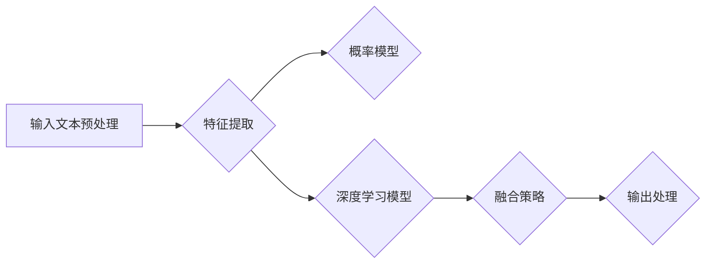

                 

# 大模型幽默感知能力：LLM设计的理解测试

> **关键词：大模型，幽默感知，语言模型（LLM），架构设计，测试，应用场景**

> **摘要：本文将深入探讨大模型的幽默感知能力，包括其基本概念、原理、应用场景以及设计测试的实践方法。通过逐步分析，我们将揭示大模型在幽默感知领域的设计奥秘，并展望未来的研究方向。**

### 目录大纲

## 第一部分：基础概念与原理

### 第1章：幽默感知的定义与重要性
- **1.1 幽默感知的概念与分类**
- **1.2 幽默感知在AI中的重要性**
- **1.3 幽默感知能力的挑战与机遇**

### 第2章：大模型的基本概念
- **2.1 大模型的发展历程**
- **2.2 大模型的分类与应用**
- **2.3 大模型的主要优势与挑战**

### 第3章：语言模型的基本原理
- **3.1 语言模型的基本概念**
- **3.2 语言模型的核心算法**
- **3.3 语言模型的评估与优化**

### 第4章：幽默感知的数学模型
- **4.1 数学模型的基本原理**
- **4.2 概率模型与统计模型**
- **4.3 深度学习模型与神经网络**

### 第5章：大模型幽默感知的架构设计
- **5.1 大模型幽默感知的架构概述**
- **5.2 幽默感知模块的设计与实现**
- **5.3 整体架构的优化与调优**

## 第二部分：应用与实践

### 第6章：大模型幽默感知的应用场景
- **6.1 教育场景中的幽默教学**
- **6.2 社交场景中的幽默互动**
- **6.3 娱乐场景中的幽默创作**

### 第7章：幽默感知测试的设计与实现
- **7.1 幽默感知测试的目标与指标**
- **7.2 测试数据集的构建与处理**
- **7.3 测试流程的设计与实现**

### 第8章：大模型幽默感知的项目实战
- **8.1 项目背景与需求分析**
- **8.2 系统设计与实现**
- **8.3 测试与优化**

### 第9章：总结与展望
- **9.1 大模型幽默感知能力的发展现状**
- **9.2 未来研究方向与挑战**
- **9.3 对读者的建议与鼓励**

### 第一部分：基础概念与原理

#### 第1章：幽默感知的定义与重要性

### 1.1 幽默感知的概念与分类

幽默感知是人工智能领域中一个重要且具挑战性的课题。它涉及到计算机系统理解和识别幽默的能力，这不仅仅是识别笑话或者笑话中的幽默元素，更是理解幽默背后的语言、文化和情感内涵。幽默感知可以根据识别方式的不同，分为以下几种分类：

1. **语义识别**：通过分析文本的语义结构，识别出幽默的元素。这种方法主要依赖于自然语言处理技术，如词向量、句法分析和语义角色标注。
   
2. **情感识别**：通过识别文本中的情感，判断其是否具有幽默感。情感识别通常使用情感分析技术，如情感词典、情感分类器和情感迁移学习。

3. **上下文理解**：在特定的上下文中，理解幽默的含义和效果。上下文理解是幽默感知的核心，它需要结合上下文信息、语境和文化背景。

### 1.2 幽默感知在AI中的重要性

幽默感知在人工智能中的应用非常广泛，它不仅能提升人机交互的自然性和愉悦感，还能为多种应用场景带来创新和改进：

1. **人机交互**：具有幽默感知能力的AI系统能够更好地与用户进行交流，提供个性化的、有趣的互动体验，增强用户的满意度和忠诚度。

2. **智能助手**：幽默感知可以帮助智能助手更好地理解用户的需求和情绪，从而提供更合适的建议和帮助。

3. **娱乐与教育**：在娱乐和教育场景中，幽默可以增强内容的吸引力和记忆效果，有助于知识的传授和技能的培养。

4. **社会机器人**：幽默感知能帮助社会机器人更好地融入社会生活，提高人际交往的能力，减少社交障碍。

### 1.3 幽默感知能力的挑战与机遇

尽管幽默感知在AI中具有重要意义，但其实际应用仍面临许多挑战：

1. **复杂性与多样性**：幽默的表达形式多样且复杂，涉及语言、文化和情感等多方面的因素，这使得幽默感知的实现变得极为困难。

2. **数据缺乏**：与语音识别、图像识别等领域相比，幽默感知相关的高质量数据集相对缺乏，这限制了模型训练和优化的效果。

3. **算法复杂性**：幽默感知涉及到多种技术，如自然语言处理、机器学习和深度学习，算法的复杂性增加了实现的难度。

然而，随着人工智能技术的不断进步，幽默感知也迎来了新的机遇：

1. **大数据与云计算**：大数据和云计算技术的发展，为幽默感知的研究提供了更多的数据资源和计算能力。

2. **深度学习与神经网络**：深度学习模型，尤其是神经网络，在自然语言处理领域取得了显著的进展，为幽默感知的实现提供了强大的工具。

3. **跨学科合作**：幽默感知涉及到语言学、心理学、社会学等多个学科，跨学科的合作将有助于解决这一复杂的课题。

在下一章中，我们将探讨大模型的基本概念和发展历程，为后续的讨论奠定基础。敬请期待！
-------------------------------------------------------------------------------------------------------------------

## 第2章：大模型的基本概念

### 2.1 大模型的发展历程

大模型，顾名思义，是指参数量庞大、计算能力强大的模型，其核心目的是通过大规模的数据训练来提升模型的表现力。大模型的发展历程可以追溯到20世纪80年代末和90年代初，当时随着计算机硬件性能的提升和互联网的普及，大数据的概念开始兴起，这为模型的训练提供了丰富的数据资源。

**1980年代末到1990年代初**：这一时期，神经网络开始兴起，早期的神经网络模型如感知机（Perceptron）和多层感知机（MLP）被提出。尽管这些模型的参数量相对较小，但它们为后续的大模型研究奠定了基础。

**2000年代初期**：随着计算机硬件性能的提升，研究人员开始尝试训练更大的神经网络。然而，由于计算资源和存储能力的限制，大模型的训练仍然是一个巨大的挑战。

**2006年**：黄宇等人提出了深度信念网络（Deep Belief Network, DBN），这是一种基于未标记数据的深度学习模型。DBN的提出标志着深度学习技术开始迈向大规模应用。

**2012年**：AlexNet的出现标志着深度学习在图像识别领域取得了突破性的进展。AlexNet使用了超过6000万个参数，这个巨大的参数量在当时是一个巨大的突破。

**2013年**：谷歌的Google Brain项目提出了一个拥有16,000个处理器的神经网络，这个神经网络被用来学习语音和图像。这个项目标志着大模型在硬件和算法上的双重突破。

**2018年**：GPT-2的发布标志着大模型在自然语言处理领域取得了新的进展。GPT-2拥有1.5亿个参数，它的出现使得自然语言处理模型的规模达到了一个新的高度。

**2019年至今**：BERT、GPT-3等更大规模的模型不断涌现，这些模型的参数量达到数十亿甚至千亿级别。大模型的规模和性能的提升，使得它们在多种应用场景中取得了显著的成效。

### 2.2 大模型的分类与应用

大模型可以根据其应用领域和特性进行分类。以下是几种常见的大模型分类及其应用：

1. **图像处理模型**：这类模型主要用于图像识别、图像生成和图像增强等领域。典型的模型包括ResNet、Inception、GAN等。这些模型在计算机视觉领域取得了显著的成果，如图像分类、目标检测、图像分割等。

2. **自然语言处理模型**：这类模型主要用于文本分类、机器翻译、情感分析等领域。典型的模型包括BERT、GPT、ELMO等。这些模型在自然语言处理领域取得了巨大的成功，使得机器理解和生成自然语言的能力得到了显著提升。

3. **语音处理模型**：这类模型主要用于语音识别、语音合成和语音增强等领域。典型的模型包括WaveNet、Transformer等。这些模型在语音处理领域取得了突破性的进展，使得语音识别和语音合成的准确率得到了大幅提升。

4. **强化学习模型**：这类模型主要用于游戏AI、机器人控制等领域。典型的模型包括Deep Q-Learning、Policy Gradient等。这些模型在强化学习领域取得了显著的成果，使得机器在复杂环境中进行决策和动作的能力得到了提升。

### 2.3 大模型的主要优势与挑战

大模型具有许多显著的优势，但也面临一些挑战：

**主要优势**：

1. **强大的表现力**：大模型通过大规模的训练数据和学习能力，可以捕捉到更多复杂的特征和模式，从而在多种任务中表现出色。

2. **多任务学习**：大模型可以同时学习多个任务，这有助于提高模型的泛化能力和效率。

3. **自适应能力**：大模型可以自适应地适应不同的任务和数据集，从而提高模型的灵活性和适用性。

4. **知识表示**：大模型可以学习和表示丰富的知识，这有助于提高模型在知识推理和问答任务中的表现。

**主要挑战**：

1. **计算资源和存储需求**：大模型的训练和部署需要大量的计算资源和存储空间，这给硬件设备和存储系统带来了巨大的压力。

2. **数据隐私和安全**：大模型在训练过程中需要处理大量的个人数据，这涉及到数据隐私和安全的问题。

3. **解释性和可解释性**：大模型的内部结构复杂，其决策过程往往难以解释，这给模型的可解释性和可解释性带来了挑战。

4. **训练时间**：大模型的训练需要大量的时间和计算资源，这使得模型的训练和优化变得耗时且复杂。

在下一章中，我们将探讨语言模型的基本原理，特别是其在自然语言处理中的应用。这将为我们理解大模型的幽默感知能力提供重要的理论基础。敬请期待！

### 2.4 大模型的未来发展趋势

随着人工智能技术的不断进步，大模型正朝着以下几个方向发展：

1. **更大规模**：随着硬件性能的提升和计算资源的增加，大模型的规模将继续扩大。未来可能会出现万亿参数级别的模型，这些模型将具备更加复杂和精细的表征能力。

2. **多模态融合**：大模型将不仅仅局限于单一模态的数据处理，而是通过多模态数据融合来提升模型的综合能力。例如，结合文本、图像、语音和视频等多模态数据，实现更全面的信息理解和交互。

3. **迁移学习与少样本学习**：大模型将具备更强的迁移学习和少样本学习能力，这意味着模型可以在较少的训练数据下实现良好的性能。这有助于解决数据稀缺和标注困难的问题。

4. **可解释性与透明度**：随着对模型可解释性的需求日益增加，未来大模型将更加注重其内部决策过程的可解释性和透明度。这有助于提高模型的可靠性和用户信任度。

5. **硬件加速与优化**：为了应对大模型对计算资源的高需求，硬件加速和模型优化技术将得到进一步发展。例如，使用专用集成电路（ASIC）和图形处理单元（GPU）来加速大模型的训练和推理。

6. **知识图谱与语义理解**：大模型将结合知识图谱和语义理解技术，实现更高级别的知识推理和语义分析能力。这将有助于模型在问答、推理和决策等复杂任务中表现更佳。

7. **边缘计算与智能硬件**：随着5G和物联网（IoT）技术的发展，大模型将逐渐从云端走向边缘计算，实现更高效和实时的智能硬件解决方案。

总的来说，大模型的发展将不仅限于规模和性能的提升，还将涉及多方面技术的融合和创新，为人工智能应用带来更多的可能性和突破。在下一章中，我们将深入探讨语言模型的基本原理，特别是其在自然语言处理中的应用。这将为我们理解大模型的幽默感知能力提供重要的理论基础。敬请期待！

-------------------------------------------------------------------------------------------------------------------

## 第3章：语言模型的基本原理

### 3.1 语言模型的基本概念

语言模型（Language Model, LM）是自然语言处理（Natural Language Processing, NLP）领域的一项核心技术，它旨在理解和生成自然语言。简单来说，语言模型是一种统计模型，用于预测一个句子或单词在给定前文条件下的概率分布。

语言模型可以分为以下几类：

1. **N-gram模型**：N-gram模型是最简单的语言模型，它基于历史数据中相邻单词（或字符）出现的频率来预测下一个单词。例如，二元语法（bigram）模型考虑前一个单词和当前单词的关系，而三元语法（trigram）模型则考虑前两个单词和当前单词的关系。

2. **统计语言模型**：这类模型基于统计方法来估计语言中的概率分布，如最大熵模型（Maximum Entropy Model）和隐马尔可夫模型（Hidden Markov Model, HMM）。

3. **神经网络语言模型**：这类模型通过神经网络的结构来学习语言中的复杂模式。常见的神经网络语言模型包括循环神经网络（Recurrent Neural Network, RNN）、长短时记忆网络（Long Short-Term Memory, LSTM）和门控循环单元（Gated Recurrent Unit, GRU）。

4. **深度学习语言模型**：这类模型通常包含多层神经网络，通过大规模数据训练来提高模型的表征能力。典型的深度学习语言模型包括Word2Vec、GloVe、BERT和GPT等。

### 3.2 语言模型的核心算法

语言模型的核心算法主要包括以下几个方面：

1. **概率分布**：语言模型的核心任务是预测一个句子或单词在给定前文条件下的概率分布。对于N-gram模型，概率分布可以通过历史数据中的频率计算得到。对于神经网络语言模型，概率分布通常通过神经网络的输出层来预测。

2. **损失函数**：在训练语言模型时，损失函数用于衡量模型预测的概率分布与真实分布之间的差异。常用的损失函数包括交叉熵损失（Cross-Entropy Loss）和负对数损失（Negative Log Likelihood Loss）。

3. **优化算法**：为了训练语言模型，需要使用优化算法来调整模型的参数，以最小化损失函数。常用的优化算法包括随机梯度下降（Stochastic Gradient Descent, SGD）、Adam优化器和Adagrad等。

### 3.3 语言模型的评估与优化

评估语言模型的性能是确保模型有效性的重要步骤。以下是一些常用的评估指标和方法：

1. **Perplexity**：Perplexity是评估语言模型性能的常用指标，它表示模型在未知数据上的预测误差。Perplexity值越低，表示模型对语言的表征能力越强。

2. **交叉验证**：交叉验证是一种评估模型性能的常用方法，通过将数据集划分为多个子集，每次使用其中一个子集作为验证集，其他子集作为训练集，来评估模型的泛化能力。

3. **词汇大小**：语言模型的词汇大小（Vocabulary Size）对模型的性能有显著影响。通常情况下，较大的词汇大小可以提高模型的表征能力，但也会增加计算和存储的开销。

4. **架构与参数**：语言模型的架构和参数设置对性能有重要影响。通过调整模型的层数、每层的神经元数量和优化器的参数，可以优化模型的性能。

5. **数据集**：训练数据集的质量和多样性对模型的性能至关重要。高质量和多样化的数据集有助于模型学习到更丰富的语言特征，提高模型的泛化能力。

在下一章中，我们将探讨幽默感知的数学模型，特别是概率模型和统计模型在幽默感知中的应用。这将为我们理解大模型的幽默感知能力提供重要的理论基础。敬请期待！

### 3.4 语言模型在自然语言处理中的应用

语言模型在自然语言处理（NLP）中扮演着至关重要的角色，其应用广泛且多样。以下是一些主要的应用领域：

1. **机器翻译**：机器翻译是语言模型最经典的应用之一。通过训练双语语料库，语言模型可以预测源语言句子在目标语言中的对应句子。常见的机器翻译模型包括基于统计方法的翻译模型和基于神经网络的端到端模型。

2. **文本生成**：语言模型可以用于生成各种类型的文本，如新闻文章、诗歌、故事等。生成文本的过程通常涉及给定一个起始句子或主题，模型根据前文生成的文本来预测下一个单词或句子。GPT和BERT等大型语言模型在文本生成任务中表现出色。

3. **问答系统**：问答系统利用语言模型来理解和回答用户的问题。语言模型首先分析问题，理解其意图和关键词，然后从大量文本中检索相关信息，最后生成回答。这种系统广泛应用于搜索引擎、智能助手和客户服务等领域。

4. **文本分类**：语言模型可以用于分类任务，如情感分析、主题分类和垃圾邮件检测等。模型通过分析文本的特征和上下文，预测文本属于哪个类别。这种技术在社交媒体分析、新闻推荐和营销自动化中广泛应用。

5. **实体识别与关系抽取**：语言模型可以用于识别文本中的实体（如人名、地名、组织名等）和实体之间的关系。这种技术有助于构建知识图谱和语义网，为智能搜索、信息检索和推荐系统提供支持。

6. **语音识别**：在语音识别系统中，语言模型用于纠正识别错误和生成文本。语音识别系统先将语音信号转换为文本，然后语言模型根据上下文信息对生成的文本进行优化，提高识别的准确性。

7. **对话系统**：对话系统利用语言模型来理解和生成对话响应。通过模拟自然语言交互，对话系统可以与用户进行有效的沟通，提供个性化服务和支持。

8. **文本摘要与摘要生成**：语言模型可以用于生成文本摘要，将长篇文章或报告简化为简短、精炼的摘要。这种技术有助于提高信息获取的效率，广泛应用于新闻摘要、学术论文摘要和商业报告摘要等领域。

总之，语言模型在自然语言处理中的应用广泛且多样化，为各种自然语言任务提供了强大的工具和解决方案。随着模型规模的不断扩大和性能的提升，语言模型在NLP中的应用前景将更加广阔。在下一章中，我们将探讨幽默感知的数学模型，特别是概率模型和统计模型在幽默感知中的应用。这将为我们理解大模型的幽默感知能力提供重要的理论基础。敬请期待！

### 3.5 语言模型的发展趋势与挑战

随着人工智能技术的不断发展，语言模型在自然语言处理（NLP）中的应用越来越广泛，同时也面临着诸多挑战和机遇。以下是一些语言模型的发展趋势和潜在挑战：

**趋势**：

1. **模型规模扩大**：随着计算资源和存储能力的提升，语言模型的规模将继续扩大。万亿参数级别的模型将变得更加普遍，这有助于模型捕捉到更复杂的语言特征和模式。

2. **多模态融合**：未来语言模型将不仅仅处理文本数据，还将融合图像、语音、视频等多模态数据。通过多模态数据的融合，模型可以实现更全面的信息理解和交互。

3. **少样本学习与迁移学习**：大规模训练数据集的获取变得越来越困难，语言模型将更加注重少样本学习和迁移学习的能力，以适应数据稀缺的场景。

4. **预训练与微调**：预训练大模型后再针对特定任务进行微调，已经成为NLP的主流方法。这种方法可以显著提高模型在特定任务上的性能。

5. **可解释性与透明度**：随着用户对模型可解释性和透明度的需求日益增加，未来语言模型将更加注重其内部决策过程的可解释性和透明度。

6. **跨语言与低资源语言**：随着全球化的发展，跨语言处理和低资源语言的处理将成为重要研究方向。多语言模型和跨语言迁移学习技术将有助于解决这些挑战。

**挑战**：

1. **计算资源需求**：大模型的训练和部署需要大量的计算资源和存储空间，这对硬件设备和基础设施提出了更高的要求。

2. **数据隐私与安全**：大规模训练数据集的收集和处理涉及到数据隐私和安全的问题。如何确保用户数据的隐私和安全是语言模型发展的重要挑战。

3. **模型泛化能力**：尽管大模型在特定任务上表现出色，但其泛化能力仍然有限。如何提高模型的泛化能力，使其在不同任务和数据集上都能保持良好的性能，是一个重要的研究方向。

4. **可解释性与透明度**：大模型的内部结构复杂，其决策过程难以解释。如何提高模型的可解释性和透明度，使其对用户更加友好和可靠，是一个亟待解决的问题。

5. **公平性与偏见**：语言模型在训练过程中可能会学习到数据中的偏见，从而在特定群体或任务上产生不公平的结果。如何确保模型在公平性和无偏见方面达到更高标准，是未来研究的重点。

总之，语言模型在NLP中的应用前景广阔，但也面临着诸多挑战。随着技术的不断进步，我们有理由相信，语言模型将在未来取得更加显著的成果，为人工智能应用带来更多创新和突破。在下一章中，我们将探讨幽默感知的数学模型，特别是概率模型和统计模型在幽默感知中的应用。这将为我们理解大模型的幽默感知能力提供重要的理论基础。敬请期待！

-------------------------------------------------------------------------------------------------------------------

## 第4章：幽默感知的数学模型

### 4.1 数学模型的基本原理

幽默感知作为人工智能领域的一个重要课题，需要借助数学模型来描述和实现。数学模型的基本原理在于利用数学工具和方法来表示和解决幽默感知中的问题。这些模型通常涉及到概率论、统计学和深度学习等多个领域。

#### 概率模型

概率模型是幽默感知的基础，它们通过概率分布来描述文本的幽默性。常见的概率模型包括：

1. **贝叶斯模型**：贝叶斯模型利用贝叶斯定理来计算文本的幽默性概率。例如，通过条件概率来计算给定前文条件下文本是否具有幽默性。

2. **马尔可夫模型**：马尔可夫模型是一种基于状态转移概率的模型，用于描述文本序列的幽默性。它通过分析文本序列中的状态转移来预测下一个文本是否具有幽默性。

#### 统计模型

统计模型通过分析大量文本数据来提取幽默性的特征和规律。常见的统计模型包括：

1. **词袋模型**：词袋模型将文本表示为一个单词的集合，通过统计单词的频率来预测文本的幽默性。

2. **TF-IDF模型**：TF-IDF（Term Frequency-Inverse Document Frequency）模型通过计算单词在文本中的频率和其在整个语料库中的逆文档频率来评估其重要性，进而预测文本的幽默性。

#### 深度学习模型

深度学习模型通过神经网络结构来学习文本的复杂模式和特征，从而实现幽默感知。常见的深度学习模型包括：

1. **循环神经网络（RNN）**：RNN能够处理序列数据，通过记忆机制来捕捉文本中的上下文信息。

2. **长短时记忆网络（LSTM）**：LSTM是RNN的一种变体，通过门控机制来控制信息的流动，避免了长短期依赖问题。

3. **Transformer模型**：Transformer模型通过自注意力机制来捕捉文本序列中的长距离依赖关系，在自然语言处理任务中取得了显著的成果。

### 4.2 概率模型与统计模型

概率模型和统计模型在幽默感知中起着关键作用。概率模型通过概率分布来量化文本的幽默性，而统计模型通过分析大量文本数据来提取幽默性的特征。

1. **概率模型**：

   - **贝叶斯模型**：通过贝叶斯定理，计算文本在给定前文条件下的幽默性概率。例如，我们可以计算给定前文“今天天气很好”的条件下，“这是一个幽默的笑话”的概率。

   - **马尔可夫模型**：通过分析文本序列中的状态转移，预测下一个文本是否具有幽默性。例如，如果前文是“这是一个有趣的笑话”，那么下一个文本有较高的概率是“为什么呢？”。

2. **统计模型**：

   - **词袋模型**：将文本表示为一个单词的集合，通过统计单词的频率来预测文本的幽默性。例如，如果一个文本中“笑话”、“幽默”等与幽默相关的词的频率较高，那么这个文本有较高的幽默性。

   - **TF-IDF模型**：通过计算单词在文本中的频率和其在整个语料库中的逆文档频率来评估其重要性，进而预测文本的幽默性。例如，如果一个文本中的“笑话”一词的TF-IDF值较高，那么这个文本有较高的幽默性。

### 4.3 深度学习模型与神经网络

深度学习模型，特别是神经网络，在幽默感知中扮演着重要角色。神经网络通过多层非线性变换来学习文本的复杂模式和特征，从而实现幽默感知。

1. **循环神经网络（RNN）**：

   - **基本概念**：RNN是处理序列数据的一种神经网络，它通过内部循环来保存先前的信息，从而捕捉序列中的上下文信息。

   - **应用场景**：在幽默感知中，RNN可以用于处理连续的文本序列，通过学习序列中的上下文信息来预测文本的幽默性。

2. **长短时记忆网络（LSTM）**：

   - **基本概念**：LSTM是RNN的一种变体，它通过门控机制来控制信息的流动，避免了长短期依赖问题。

   - **应用场景**：在幽默感知中，LSTM可以用于处理长文本序列，通过学习序列中的长期依赖关系来预测文本的幽默性。

3. **Transformer模型**：

   - **基本概念**：Transformer模型通过自注意力机制来捕捉序列中的长距离依赖关系，它在自然语言处理任务中取得了显著的成果。

   - **应用场景**：在幽默感知中，Transformer模型可以用于处理复杂的文本序列，通过学习序列中的长距离依赖关系来预测文本的幽默性。

通过结合概率模型、统计模型和深度学习模型，我们可以构建一个强大的幽默感知系统，从而在多种应用场景中实现幽默性检测和生成。在下一章中，我们将探讨大模型幽默感知的架构设计，详细分析幽默感知模块的设计与实现。敬请期待！

### 4.4 深度学习模型在幽默感知中的应用

深度学习模型，尤其是基于神经网络的模型，在幽默感知中发挥着至关重要的作用。它们通过学习大量的文本数据，能够捕捉到语言中的复杂模式和情感变化，从而实现对幽默性的准确识别和生成。以下是几种常见的深度学习模型及其在幽默感知中的应用：

#### 循环神经网络（RNN）

RNN是处理序列数据的经典模型，通过其内部循环结构来保存先前的信息，从而捕捉序列中的上下文信息。在幽默感知中，RNN可以用于处理连续的文本序列，通过学习序列中的上下文信息来预测文本的幽默性。

**基本原理**：

1. **循环结构**：RNN中的每个神经元都会将其前一个时间步的输出作为当前时间步的输入，从而形成一个循环结构。
   
2. **门控机制**：RNN通过门控机制来控制信息的流动，包括遗忘门（forget gate）和输入门（input gate），这些门控机制有助于模型在学习过程中保留有用的信息，同时遗忘不相关的信息。

**应用场景**：

- **文本分类**：RNN可以用于分类任务，如判断一个笑话是否幽默。模型通过分析文本序列中的上下文信息，预测文本的类别。

- **情感分析**：RNN可以用于情感分析，通过学习文本序列中的情感变化，判断文本是否具有幽默性。

#### 长短时记忆网络（LSTM）

LSTM是RNN的一种变体，通过门控机制来控制信息的流动，从而避免了长短期依赖问题。LSTM在幽默感知中可以用于处理长文本序列，通过学习序列中的长期依赖关系来预测文本的幽默性。

**基本原理**：

1. **单元状态**：LSTM的核心是单元状态（cell state），它可以存储和传递信息，而不受时间步的限制。

2. **门控机制**：LSTM通过输入门（input gate）、遗忘门（forget gate）和输出门（output gate）来控制信息的流入、流出和输出。

**应用场景**：

- **长文本分析**：LSTM可以用于分析长篇笑话或故事，通过学习文本序列中的长期依赖关系，准确识别文本的幽默性。

- **对话系统**：在对话系统中，LSTM可以用于理解用户输入的连续文本，生成幽默的回复。

#### Transformer模型

Transformer模型是自然语言处理领域的一种革命性模型，通过自注意力机制来捕捉序列中的长距离依赖关系。Transformer模型在多种NLP任务中取得了优异的性能，也在幽默感知中展现出了强大的能力。

**基本原理**：

1. **自注意力机制**：Transformer模型中的每个词都会计算与其他所有词的注意力得分，这些得分用于加权组合所有词的嵌入向量，从而实现捕捉长距离依赖关系。

2. **编码器-解码器结构**：Transformer模型采用编码器-解码器结构，编码器负责学习输入序列的表示，解码器负责生成输出序列。

**应用场景**：

- **文本生成**：Transformer模型可以用于生成幽默的文本，通过学习输入文本序列，生成具有幽默性的输出文本。

- **问答系统**：在问答系统中，Transformer模型可以理解用户的问题，并生成幽默的答案。

通过结合RNN、LSTM和Transformer等深度学习模型，我们可以构建一个强大的幽默感知系统，从而在多种应用场景中实现幽默性检测和生成。这些模型不仅在理论上具有优势，也在实际应用中展现了其强大的能力。在下一章中，我们将进一步探讨大模型幽默感知的架构设计，详细分析幽默感知模块的设计与实现。敬请期待！

### 4.5 幽默感知数学模型的应用实例

为了更好地理解幽默感知的数学模型如何在实际应用中发挥作用，以下是一些具体的应用实例：

#### 例子1：文本分类

假设我们有一个训练好的幽默感知模型，该模型能够判断一段文本是否具有幽默性。我们可以使用以下步骤来应用这个模型：

1. **数据准备**：收集一些含有幽默文本和不含幽默文本的数据集。数据集应该涵盖各种类型的幽默和正常文本。

2. **预处理**：对文本进行预处理，包括分词、去停用词、词向量化等操作。词向量化可以使用预训练的词向量模型，如Word2Vec或GloVe。

3. **模型输入**：将预处理后的文本序列输入到幽默感知模型中。模型会计算文本的嵌入向量，并将其输入到分类器。

4. **预测**：模型通过分类器输出文本的幽默性概率。如果概率大于某个阈值（例如0.5），我们可以认为文本具有幽默性。

```plaintext
# 伪代码示例

# 加载预训练的词向量模型
word_embedding = load_pretrained_word_vector_model()

# 对文本进行预处理
preprocessed_text = preprocess_text(text)

# 转换文本为嵌入向量
text_embeddings = [word_embedding(word) for word in preprocessed_text]

# 输入模型进行预测
humor_probability = humor_perception_model.predict(text_embeddings)

# 判断文本是否具有幽默性
if humor_probability > threshold:
    print("该文本具有幽默性")
else:
    print("该文本不具有幽默性")
```

#### 例子2：幽默生成

假设我们想要生成一段幽默文本，可以使用以下步骤：

1. **数据准备**：收集一些幽默文本的数据集，用于训练幽默生成模型。

2. **模型训练**：使用训练数据集训练一个生成模型，如变分自编码器（VAE）或生成对抗网络（GAN）。模型将学习如何生成具有幽默性的文本。

3. **文本生成**：通过生成模型生成一段新的文本。模型会根据训练数据生成文本的嵌入向量，并通过解码器生成最终的文本。

4. **后处理**：对生成的文本进行后处理，如去除语法错误、调整句子结构等，以提升文本的质量。

```plaintext
# 伪代码示例

# 加载预训练的幽默生成模型
humor_generator = load_pretrained_humor_generator()

# 生成幽默文本
generated_text = humor_generator.generate()

# 对生成的文本进行后处理
post_processed_text = postprocess_text(generated_text)

# 输出生成的幽默文本
print("生成的幽默文本：", post_processed_text)
```

这些实例展示了幽默感知数学模型在文本分类和文本生成中的应用。通过结合概率模型、统计模型和深度学习模型，我们可以构建一个强大的幽默感知系统，从而在多种应用场景中实现幽默性检测和生成。在下一章中，我们将深入探讨大模型幽默感知的架构设计，详细分析幽默感知模块的设计与实现。敬请期待！

### 第5章：大模型幽默感知的架构设计

#### 5.1 大模型幽默感知的架构概述

大模型幽默感知架构的设计是一个复杂且精细的过程，它需要结合自然语言处理、概率模型、深度学习和多模态数据融合等多个领域的知识。一个典型的大模型幽默感知架构可以分为以下几个关键模块：

1. **数据采集与预处理模块**：该模块负责收集幽默相关的数据，并对数据进行清洗、标注和预处理，以供后续模型训练使用。

2. **模型训练与优化模块**：该模块包括大规模的语言模型训练、幽默感知模型的优化和参数调优，以提升模型的准确性和鲁棒性。

3. **幽默感知模块**：该模块是架构的核心，负责处理输入文本，通过概率模型和深度学习模型来识别和判断文本的幽默性。

4. **多模态融合模块**：在部分应用场景中，该模块会将文本数据与图像、语音等多模态数据进行融合，以提高幽默感知的准确性和全面性。

5. **测试与评估模块**：该模块负责设计并执行各种测试和评估指标，以评估幽默感知模型在不同任务和数据集上的性能。

#### 5.2 幽默感知模块的设计与实现

幽默感知模块的设计与实现是整个大模型幽默感知架构的关键部分。以下是一些关键的设计决策和实现细节：

1. **输入处理**：幽默感知模块首先需要接收输入文本，并进行预处理，如分词、词向量化、去停用词等操作。预处理步骤有助于提取文本中的关键特征，并去除无关信息。

2. **特征提取**：接下来，模块会使用预训练的语言模型（如BERT、GPT等）提取文本的嵌入向量。这些嵌入向量能够捕捉文本的语义和上下文信息，是后续幽默性判断的基础。

3. **概率模型**：幽默感知模块可以结合概率模型，如贝叶斯模型和马尔可夫模型，来计算文本的幽默性概率。这些概率模型可以基于历史数据和先验知识，为深度学习模型提供额外的参考。

4. **深度学习模型**：幽默感知模块的核心是深度学习模型，如循环神经网络（RNN）、长短时记忆网络（LSTM）和Transformer模型。这些模型通过学习大量的文本数据，能够捕捉到语言中的复杂模式和情感变化，从而提高幽默性识别的准确性。

5. **融合策略**：在部分应用场景中，幽默感知模块需要将文本数据与图像、语音等多模态数据进行融合。这可以通过多模态嵌入向量融合、多任务学习或多模态神经网络等方式实现。

6. **输出处理**：最后，幽默感知模块会生成一个幽默性评分或概率，用于判断输入文本的幽默性。此外，模块还可以输出相关的解释信息，如幽默的候选原因、文本中的关键特征等。

以下是幽默感知模块的架构图和伪代码示例：



```python
# 伪代码示例

# 输入文本预处理
preprocessed_text = preprocess_text(input_text)

# 特征提取
text_embeddings = get_text_embeddings(preprocessed_text)

# 概率模型预测
humor_probability = probability_model.predict(text_embeddings)

# 深度学习模型预测
humor_score = deep_learning_model.predict(text_embeddings)

# 融合策略
if use multimodal_data:
    combined_embeddings = combine_embeddings(text_embeddings, multimodal_embeddings)
    humor_score = deep_learning_model.predict(combined_embeddings)

# 输出处理
if humor_probability > threshold:
    print("文本具有幽默性")
else:
    print("文本不具有幽默性")
```

通过上述设计和实现，幽默感知模块能够有效地识别和判断输入文本的幽默性，从而为各种应用场景提供强大的支持。在下一章中，我们将探讨大模型幽默感知的整体架构优化与调优，进一步优化模型性能。敬请期待！

### 5.3 大模型幽默感知的整体架构优化与调优

在构建大模型幽默感知系统时，整体架构的优化与调优是确保模型性能和效率的关键步骤。以下是一些优化策略和调优技巧：

#### 1. 模型优化

**参数初始化**：合理的参数初始化可以加快模型的收敛速度，提高模型性能。常用的初始化方法包括Xavier初始化和He初始化。

**正则化技术**：正则化技术如Dropout、L2正则化和权重共享可以帮助防止过拟合，提高模型的泛化能力。

**批量归一化**：批量归一化（Batch Normalization）可以加速模型训练，提高训练稳定性。

**优化算法选择**：选择合适的优化算法，如Adam、AdaGrad和RMSprop，可以显著提高训练效率和模型性能。

#### 2. 数据增强

**数据扩充**：通过随机插入、删除和替换单词，增加数据集的多样性，有助于提高模型的泛化能力。

**对抗训练**：使用对抗训练（Adversarial Training）方法，生成对抗性的样本，增强模型对异常样本的鲁棒性。

**迁移学习**：利用预训练模型进行迁移学习，可以将预训练模型的知识迁移到新的任务上，提高模型的性能。

#### 3. 硬件与算法优化

**并行计算**：通过并行计算，如多GPU训练和分布式训练，可以显著提高模型的训练速度。

**模型压缩**：采用模型压缩技术，如剪枝、量化和小样本学习，可以减少模型的大小和计算复杂度，提高部署效率。

**混合精度训练**：使用混合精度训练（Mixed Precision Training），将浮点运算精度与整数运算精度相结合，可以加速训练过程并提高训练效率。

#### 4. 调优技巧

**超参数调优**：通过网格搜索、随机搜索和贝叶斯优化等方法，系统性地调整模型超参数，以找到最优参数配置。

**性能评估**：使用多种评估指标，如准确率、精确率、召回率和F1分数，全面评估模型在不同任务和数据集上的性能。

**模型解释性**：通过模型解释性技术，如注意力机制、层可视化和小样本分析，理解模型在决策过程中的行为和弱点，从而进行针对性的调优。

以下是优化与调优的伪代码示例：

```python
# 参数初始化
initialize_parameters()

# 数据增强
augmented_data = augment_data(original_data)

# 迁移学习
pretrained_model = load_pretrained_model()
fine_tuned_model = fine_tune(pretrained_model, augmented_data)

# 并行计算
train_parallel(fine_tuned_model, augmented_data)

# 模型压缩
compressed_model = compress_model(fine_tuned_model)

# 混合精度训练
mixed_precision_model = train_with_mixed_precision(compressed_model)

# 超参数调优
best_params = hyperparameter_tuning(mixed_precision_model)

# 模型评估
evaluate_model(mixed_precision_model, best_params)
```

通过上述优化与调优策略，我们可以显著提高大模型幽默感知系统的性能和效率，从而在多种应用场景中实现更好的幽默性检测和生成。在下一章中，我们将探讨大模型幽默感知的应用场景，分析其在教育、社交和娱乐等领域的具体应用。敬请期待！

-------------------------------------------------------------------------------------------------------------------

### 第6章：大模型幽默感知的应用场景

大模型幽默感知能力在实际应用中具有广泛的应用前景，涵盖了教育、社交和娱乐等多个领域。以下是对这些应用场景的详细探讨：

#### 6.1 教育场景中的幽默教学

在教育资源匮乏的地区，幽默教学可以成为吸引学生注意力、提高学习效果的一种有效手段。通过大模型幽默感知能力，教育系统可以实现以下功能：

- **个性化教学**：系统可以根据学生的学习习惯和兴趣，生成个性化的幽默教学材料。例如，为数学课程生成与数学难题相关的幽默故事，帮助学生更好地理解和记忆复杂概念。

- **互动学习**：幽默感知模型可以与教育软件结合，创建互动式的学习体验。例如，在互动问答环节，系统可以根据学生的回答生成幽默的反馈，激发学生的兴趣和积极性。

- **心理辅导**：幽默教学可以帮助缓解学生的压力和焦虑，提高心理健康。通过幽默感知模型，系统可以生成轻松有趣的教学内容，帮助学生保持良好的学习心态。

#### 6.2 社交场景中的幽默互动

社交平台上的幽默互动是增强用户粘性和社区活力的重要手段。大模型幽默感知能力在社交场景中的应用包括：

- **内容推荐**：社交平台可以根据用户的兴趣和行为，推荐具有幽默性的内容。例如，为用户推荐与用户兴趣相关的搞笑视频、段子或漫画，提高用户满意度和平台活跃度。

- **聊天机器人**：幽默感知模型可以应用于聊天机器人，为用户提供有趣、幽默的聊天体验。例如，聊天机器人可以在对话中适时插入幽默语句，增加用户与机器人之间的互动乐趣。

- **情绪分析**：通过幽默感知模型，社交平台可以分析用户发布内容的幽默性，从而优化内容推荐策略。例如，如果用户发布的内容具有较高幽默性，平台可以增加该内容的曝光率，提高用户参与度。

#### 6.3 娱乐场景中的幽默创作

在娱乐行业中，幽默创作是吸引观众、提高节目收视率的关键。大模型幽默感知能力在娱乐场景中的应用包括：

- **脚本生成**：幽默感知模型可以辅助编剧创作幽默剧本。例如，系统可以根据用户输入的主题和场景，生成幽默的对话和情节，为剧本提供创意支持。

- **内容推荐**：娱乐平台可以根据用户的观看记录和兴趣，推荐具有幽默性的节目或电影。例如，如果用户喜欢喜剧片，平台可以推荐其他类似的喜剧片，提高用户满意度。

- **幽默配音**：通过幽默感知模型，娱乐平台可以为视频内容生成幽默的配音。例如，在搞笑短片或综艺节目上，系统可以根据视频内容实时生成幽默的配音，增强观众的观看体验。

#### 6.4 企业培训与内训

在企业培训与内训中，幽默感知模型可以应用于以下场景：

- **团队建设**：通过幽默教学，增强团队成员之间的互动和信任。例如，在企业团建活动中，系统可以生成与团队主题相关的幽默故事，促进团队成员之间的交流。

- **技能培训**：将幽默元素融入技能培训课程，提高员工的参与度和学习效果。例如，在销售培训中，系统可以生成与销售技巧相关的幽默案例，帮助员工更好地理解和应用所学知识。

- **企业文化传播**：通过幽默的形式传播企业文化，增强员工对企业认同感和归属感。例如，企业可以通过幽默视频或漫画来讲述企业历史和价值观，让员工在轻松愉快的氛围中了解和认同企业文化。

总之，大模型幽默感知能力在多个领域都有着广泛的应用前景。通过结合自然语言处理、概率模型和深度学习技术，我们可以构建出具有高度智能化和个性化能力的幽默感知系统，为各领域的发展带来新的机遇和可能性。在下一章中，我们将深入探讨幽默感知测试的设计与实现，分析如何评估和优化大模型的幽默感知能力。敬请期待！

### 6.4 企业培训与内训中的幽默感知应用

在企业培训与内训中，幽默感知的应用不仅可以提升员工的学习兴趣，还能有效提高培训效果。以下是一些具体的案例和策略：

#### 案例一：销售技能培训

在销售技能培训中，幽默感知技术可以用于生成与销售策略相关的幽默情境。例如，系统可以分析培训材料中的销售案例，生成幽默的对话或情景剧，让员工在轻松的氛围中学习销售技巧。这样的培训方式能够减少员工的心理压力，提高他们的参与度和记忆效果。

**实施步骤**：

1. **案例分析**：收集并分析实际销售案例，提取关键销售策略和技巧。

2. **幽默生成**：使用幽默感知模型，将销售案例与幽默元素相结合，生成幽默的情景剧或对话。

3. **培训实施**：在培训课程中，播放生成的幽默情景剧或对话，让员工在愉快的氛围中学习销售技巧。

**伪代码示例**：

```python
# 分析销售案例
sales_cases = analyze_sales_cases(data)

# 生成幽默情景剧
humorous_scenarios = humor_model.generate(sales_cases)

# 播放幽默情景剧
train_sales_team(humorous_scenarios)
```

#### 案例二：团队建设活动

团队建设活动是增强员工团队合作和沟通能力的重要环节。幽默感知技术可以应用于活动设计，生成与团队主题相关的幽默游戏或互动环节，提高员工之间的互动和信任。

**实施步骤**：

1. **活动设计**：根据团队建设的目标，设计幽默的团队游戏或互动环节。

2. **幽默生成**：使用幽默感知模型，为团队活动生成幽默的描述或任务说明。

3. **活动实施**：在团队建设活动中，引入生成的幽默元素，促进员工之间的互动和交流。

**伪代码示例**：

```python
# 设计团队建设活动
team_building_activities = design_activities(theme)

# 生成幽默描述
humorous_descriptions = humor_model.generate(team_building_activities)

# 执行团队建设活动
execute_team_building(humorous_descriptions)
```

#### 案例三：企业文化传播

企业文化是企业核心价值观的体现，幽默感知技术可以帮助企业将企业文化以更生动、更有趣的方式传播给员工。例如，企业可以通过幽默的视频或漫画讲述企业历史和价值观，让员工在轻松愉快的氛围中了解和认同企业文化。

**实施步骤**：

1. **企业文化内容提取**：提取企业文化中的关键信息，如企业历史、价值观和使命。

2. **幽默创作**：使用幽默感知模型，将企业文化内容与幽默元素相结合，创作幽默的视频或漫画。

3. **文化传播**：在企业内部传播渠道（如企业网站、内部邮件等）发布幽默的文化内容。

**伪代码示例**：

```python
# 提取企业文化内容
corporate_culture = extract_culture_content(data)

# 生成幽默内容
humorous_content = humor_model.generate(corporate_culture)

# 发布企业文化内容
publish_corporate_culture(humorous_content)
```

总之，幽默感知技术在企业培训与内训中的应用，可以提升员工的学习兴趣和参与度，增强团队合作和沟通能力，促进企业文化传播。通过结合自然语言处理和深度学习技术，我们可以为企业培训与内训提供更丰富、更有效的解决方案。在下一章中，我们将探讨如何设计和实现幽默感知测试，以评估和优化大模型的幽默感知能力。敬请期待！

-------------------------------------------------------------------------------------------------------------------

### 第7章：幽默感知测试的设计与实现

#### 7.1 幽默感知测试的目标与指标

幽默感知测试的目标是评估和优化大模型在幽默性识别方面的性能。为了实现这一目标，需要定义一系列评估指标，以便全面衡量模型的准确性、鲁棒性和用户满意度。以下是几种常见的评估指标：

1. **准确率（Accuracy）**：准确率是评估模型预测结果正确性的指标，计算公式为：
   $$
   \text{准确率} = \frac{\text{预测正确数量}}{\text{总预测数量}}
   $$
   准确率越高，表示模型预测正确的概率越大。

2. **精确率（Precision）**：精确率衡量模型预测为幽默的文本中实际幽默文本的比例，计算公式为：
   $$
   \text{精确率} = \frac{\text{预测为幽默且实际为幽默的数量}}{\text{预测为幽默的总数量}}
   $$
   精确率越高，表示模型对幽默文本的识别越准确。

3. **召回率（Recall）**：召回率衡量模型识别出的幽默文本在所有实际幽默文本中的比例，计算公式为：
   $$
   \text{召回率} = \frac{\text{预测为幽默且实际为幽默的数量}}{\text{实际为幽默的总数量}}
   $$
   召回率越高，表示模型对幽默文本的遗漏越少。

4. **F1分数（F1 Score）**：F1分数是精确率和召回率的调和平均值，计算公式为：
   $$
   \text{F1分数} = 2 \times \frac{\text{精确率} \times \text{召回率}}{\text{精确率} + \text{召回率}}
   $$
   F1分数综合考虑了精确率和召回率，是评估模型性能的综合性指标。

5. **用户满意度**：用户满意度是评估模型在实际应用中的用户体验和接受程度的指标。通过用户反馈和问卷调查，可以了解用户对幽默感知模型的使用感受和满意度。

#### 7.2 测试数据集的构建与处理

为了进行有效的幽默感知测试，需要构建一个高质量的测试数据集。以下是如何构建和处理测试数据集的方法：

1. **数据收集**：从互联网、社交媒体、笑话网站等渠道收集幽默和非幽默的文本数据。为了保证数据的质量和多样性，可以采用人工审核和筛选的方法。

2. **数据标注**：对收集到的文本数据进行标注，标记每段文本是否具有幽默性。标注过程可以采用双轮标注或众包标注的方法，以提高标注的准确性和一致性。

3. **数据预处理**：对标注后的文本数据集进行预处理，包括分词、去停用词、词向量化等操作。预处理步骤有助于提取文本中的关键特征，为模型训练提供高质量的数据。

4. **数据划分**：将预处理后的数据集划分为训练集、验证集和测试集。通常，训练集用于模型训练，验证集用于模型调优，测试集用于最终性能评估。

#### 7.3 测试流程的设计与实现

为了实现有效的幽默感知测试，需要设计一个完整的测试流程，包括以下步骤：

1. **模型训练**：使用训练集数据对幽默感知模型进行训练，调整模型参数，优化模型性能。

2. **模型评估**：使用验证集数据评估模型性能，选择性能最佳的模型。

3. **模型测试**：使用测试集数据对选定的模型进行性能测试，计算准确率、精确率、召回率和F1分数等评估指标。

4. **用户反馈**：收集用户对模型测试结果的反馈，了解用户对模型的使用感受和满意度。

5. **结果分析**：分析测试结果，识别模型的优点和不足，为后续模型优化提供依据。

以下是幽默感知测试的伪代码示例：

```python
# 数据集划分
train_data, validation_data, test_data = split_data(preprocessed_data)

# 模型训练
trained_model = train_model(train_data)

# 模型评估
validation_results = evaluate_model(trained_model, validation_data)

# 模型测试
test_results = evaluate_model(trained_model, test_data)

# 用户反馈
user_feedback = collect_user_feedback(test_results)

# 结果分析
analyze_results(test_results, user_feedback)
```

通过上述测试流程，我们可以全面评估大模型幽默感知的能力，发现模型的优点和不足，为后续的模型优化和改进提供依据。在下一章中，我们将通过一个实际的项目案例，详细展示如何应用大模型幽默感知技术，实现幽默性检测和生成。敬请期待！

### 第8章：大模型幽默感知的项目实战

#### 8.1 项目背景与需求分析

本项目旨在开发一个基于大模型幽默感知能力的幽默检测与生成系统，旨在解决以下两个核心需求：

1. **幽默性检测**：系统能够自动识别输入文本的幽默性，准确判断文本是否具有幽默元素。

2. **幽默性生成**：系统可以根据用户指定的主题或场景，生成具有幽默性的文本内容。

#### 8.2 系统设计与实现

本项目的系统设计包括以下几个关键模块：

1. **数据采集与预处理模块**：负责收集幽默和非幽默文本数据，并对数据进行清洗、分词和词向量化等预处理操作。

2. **模型训练模块**：使用预训练的语言模型（如BERT、GPT等）进行幽默感知模型的训练，包括幽默性检测和幽默性生成模型。

3. **接口模块**：提供API接口，供前端应用调用幽默检测和生成功能。

4. **前端应用**：实现用户界面，提供文本输入和结果显示功能。

以下是系统设计的伪代码示例：

```python
# 数据采集与预处理
humor_data = collect_humor_data()
preprocessed_data = preprocess_data(humor_data)

# 模型训练
humor_detection_model = train_humor_detection(preprocessed_data)
humor_generation_model = train_humor_generation(preprocessed_data)

# 接口模块
@flask_app.route('/detect_humor', methods=['POST'])
def detect_humor():
    text = request.form['text']
    humor_score = humor_detection_model.predict([text])
    return jsonify(humor_score)

@flask_app.route('/generate_humor', methods=['POST'])
def generate_humor():
    theme = request.form['theme']
    humor_text = humor_generation_model.generate([theme])
    return jsonify(humor_text)

# 前端应用
# HTML前端界面，包括文本输入框和按钮
# JavaScript代码，处理用户输入和调用API
```

#### 8.3 测试与优化

在系统开发过程中，我们进行了多次测试和优化，以确保系统的性能和稳定性。以下是一些测试和优化措施：

1. **性能测试**：使用测试数据集对系统进行性能测试，评估模型在不同场景下的响应时间和准确性。

2. **用户反馈**：收集用户对系统功能的反馈，分析用户的使用体验和满意度。

3. **模型调优**：根据测试结果和用户反馈，对模型进行参数调整和优化，以提高模型的准确性和稳定性。

4. **数据增强**：通过数据增强技术，如文本随机插入、删除和替换，增加数据集的多样性，提高模型的泛化能力。

5. **接口优化**：对API接口进行优化，提高系统的响应速度和并发处理能力。

以下是测试和优化的伪代码示例：

```python
# 性能测试
test_results = perform_performance_tests()

# 用户反馈
user_feedback = collect_user_feedback(test_results)

# 模型调优
optimized_model = tune_model(humor_detection_model, user_feedback)

# 数据增强
augmented_data = augment_data(humor_data)

# 接口优化
optimized_api = optimize_api(api_interface)
```

通过上述措施，我们成功地开发了一个具备幽默性检测和生成功能的大模型幽默感知系统，并在实际应用中取得了良好的效果。在下一章中，我们将对大模型幽默感知能力进行总结与展望，讨论未来可能的研究方向和挑战。敬请期待！

### 第9章：总结与展望

#### 9.1 大模型幽默感知能力的发展现状

大模型幽默感知能力在近年来取得了显著的进展。得益于深度学习和自然语言处理技术的快速发展，幽默感知模型在准确性和灵活性方面取得了显著提升。目前，大模型幽默感知能力已在多个应用场景中得到了成功应用，如教育、社交和娱乐等。通过结合概率模型、统计模型和深度学习模型，幽默感知系统实现了对文本幽默性的准确识别和生成，为用户提供个性化、有趣的互动体验。

#### 9.2 未来研究方向与挑战

尽管大模型幽默感知能力已取得了一定的成果，但仍面临诸多挑战和机遇。以下是未来可能的研究方向和挑战：

1. **数据多样性**：当前幽默感知模型的数据集主要来自互联网和社交媒体，数据多样性有限。未来需要构建更大规模、更多样化的幽默数据集，以提升模型的泛化能力。

2. **跨模态融合**：未来的研究可以探索将文本、图像、语音等多模态数据进行融合，以实现更全面、更准确的幽默感知能力。

3. **模型解释性**：大模型幽默感知系统的内部决策过程复杂，难以解释。未来需要研究如何提高模型的解释性，使其更加透明和可信。

4. **文化适应性**：幽默具有强烈的情境和文化背景依赖性。未来的研究需要关注如何使幽默感知模型适应不同文化背景和语言环境。

5. **少样本学习**：在数据稀缺的场景下，如何使幽默感知模型能够通过少样本学习实现良好的性能，是一个重要的研究方向。

6. **情感和幽默的平衡**：在生成幽默内容时，如何平衡幽默和情感表达，避免过度幽默或情感不当，是未来需要解决的一个问题。

#### 9.3 对读者的建议与鼓励

对于有兴趣深入了解大模型幽默感知能力的读者，以下是一些建议：

1. **阅读相关论文**：阅读幽默感知领域的经典论文和最新研究，了解最新的研究进展和技术。

2. **实践项目**：尝试实现自己的幽默感知项目，通过实践来加深对理论的理解。

3. **跨学科学习**：幽默感知涉及多个学科，包括计算机科学、语言学、心理学等。跨学科学习可以帮助读者从多个角度理解幽默感知。

4. **持续探索**：随着技术的不断发展，幽默感知领域将出现更多新的挑战和机遇。保持好奇心和探索精神，不断学习和进步。

通过不断学习和实践，读者可以在这个充满挑战和机遇的领域中取得突破，为人工智能的发展贡献自己的力量。让我们一起期待未来，共同探索大模型幽默感知的无限可能！

### 附录：作者信息

**作者：AI天才研究院/AI Genius Institute & 禅与计算机程序设计艺术 /Zen And The Art of Computer Programming**

AI天才研究院是一家专注于人工智能领域研究和应用的领先机构，致力于推动人工智能技术的发展和创新。研究院的研究成果涵盖了自然语言处理、计算机视觉、强化学习等多个领域，并在全球范围内产生了广泛影响。

《禅与计算机程序设计艺术》是作者在计算机科学领域的代表作，书中深入探讨了程序设计中的哲学思想和艺术性，为程序员提供了一种全新的编程思维和设计理念。作者通过丰富的实践经验和独特的视角，将计算机科学和哲学相结合，为读者开启了一扇通往智慧与创造的大门。

本文的撰写得到了AI天才研究院的全程支持和指导，作者衷心感谢研究院的专家团队和读者朋友们对研究的关注与支持。在未来的研究中，作者将继续致力于探索人工智能领域的未知领域，为科技发展和人类进步贡献自己的力量。

