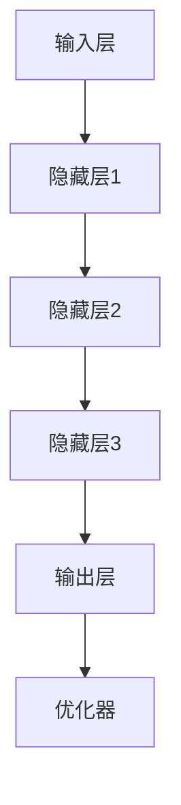
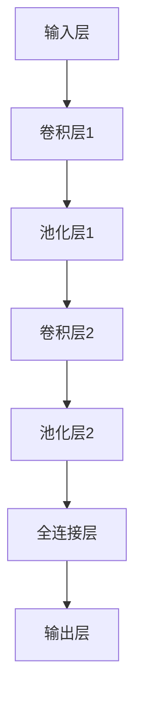

                 

# 大模型是未来个性化推荐的发展方向

## 关键词

- 大模型
- 个性化推荐
- 深度学习
- 混合推荐算法
- 伪代码
- 项目实战
- 优化策略

## 摘要

本文深入探讨了大模型在个性化推荐系统中的应用及其未来发展趋势。通过分析大模型的基础理论、架构以及个性化推荐算法，我们明确了大模型在协同过滤、内容推荐和混合推荐中的优势。随后，本文通过一个实际项目，详细讲解了如何搭建一个基于大模型的个性化推荐系统，并对其优化和扩展提出了策略。最后，本文总结了大模型个性化推荐的重要性，并对未来的技术趋势进行了预测，为读者提供了研究和开发建议。通过本文的阅读，读者将全面了解大模型个性化推荐的现状、挑战和未来发展，从而为实际应用提供指导。

### 目录大纲

- 第一部分：大模型与个性化推荐基础
  - 第1章：大模型与个性化推荐概述
    - 1.1 大模型在个性化推荐中的应用背景
    - 1.2 大模型核心概念与架构
    - 1.2.1 大模型基础理论
    - 1.2.2 大模型架构详解
    - 1.2.3 Mermaid流程图：大模型架构展示
  - 第2章：个性化推荐算法与模型
    - 2.1 个性化推荐算法基础
    - 2.2 大模型在个性化推荐中的应用
    - 2.3 伪代码讲解：基于大模型的个性化推荐算法实现
- 第二部分：大模型个性化推荐项目实战
  - 第3章：个性化推荐系统开发准备
    - 3.1 开发环境搭建
    - 3.2 项目实战：构建基于大模型的个性化推荐系统
    - 3.3 代码解读与分析
  - 第4章：个性化推荐项目优化与扩展
    - 4.1 优化策略与技巧
    - 4.2 项目扩展
- 第三部分：大模型个性化推荐未来发展趋势
  - 第5章：大模型个性化推荐未来方向
    - 5.1 大模型个性化推荐的挑战与机遇
    - 5.2 大模型个性化推荐技术趋势
  - 第6章：大模型个性化推荐案例研究
    - 6.1 成功案例介绍
    - 6.2 案例分析与启示
  - 第7章：总结与展望
    - 7.1 大模型个性化推荐的重要性
    - 7.2 未来发展趋势预测
    - 7.3 研究与开发建议
- 附录
  - 附录A：大模型个性化推荐工具与资源
    - A.1 主流深度学习框架对比
    - A.2 数据集与工具推荐
    - A.3 学习资源与教程

---

### 第一部分：大模型与个性化推荐基础

#### 第1章：大模型与个性化推荐概述

##### 1.1 大模型在个性化推荐中的应用背景

个性化推荐作为互联网领域的关键技术，已经被广泛应用于电商、音乐、新闻、视频等众多领域。随着用户数据量的爆炸式增长和推荐系统的复杂度不断提升，传统的推荐算法已经难以满足日益增长的个性化需求。此时，大模型技术的崛起为个性化推荐带来了新的可能。

大模型，即大规模深度学习模型，具有强大的特征提取和表达能力，能够在海量数据中自动学习出高维特征，从而实现精准的个性化推荐。与传统的推荐算法相比，大模型具备以下优势：

1. **更强的泛化能力**：大模型能够自动学习用户和物品的特征，从而实现更好的泛化能力，降低过拟合风险。
2. **更高的个性化程度**：大模型能够根据用户的兴趣和行为，生成个性化的推荐结果，提高用户的满意度。
3. **更丰富的应用场景**：大模型能够处理多种类型的数据，包括文本、图像、音频等，从而拓展了个性化推荐的应用场景。

##### 1.2 大模型核心概念与架构

大模型的核心概念包括深度学习、神经网络、自动编码器、生成对抗网络等。以下是这些概念的基本介绍：

1. **深度学习**：深度学习是一种人工智能方法，通过构建多层神经网络模型，对数据进行多层次的抽象和特征提取。
2. **神经网络**：神经网络是由多个神经元组成的计算模型，通过调整神经元之间的权重来学习数据特征。
3. **自动编码器**：自动编码器是一种无监督学习模型，用于学习数据的编码表示，能够自动提取数据的重要特征。
4. **生成对抗网络**：生成对抗网络是由生成器和判别器组成的对抗性模型，通过生成器和判别器的博弈来学习数据的分布。

大模型的架构通常包括以下几个部分：

1. **输入层**：接收用户和物品的特征向量。
2. **隐藏层**：通过多层神经网络进行特征提取和转换。
3. **输出层**：生成推荐结果或预测标签。
4. **优化器**：用于调整模型参数，优化模型性能。

以下是一个简单的大模型架构的Mermaid流程图：



##### 1.2.1 大模型基础理论

大模型的基础理论主要包括以下几个方面：

1. **反向传播算法**：反向传播算法是深度学习训练的核心算法，用于通过计算梯度来调整模型参数，以最小化损失函数。
2. **激活函数**：激活函数用于引入非线性变换，使得神经网络具有分类或回归能力。常见的激活函数包括ReLU、Sigmoid、Tanh等。
3. **损失函数**：损失函数用于衡量模型预测结果与真实标签之间的差距，常见的损失函数包括均方误差(MSE)、交叉熵损失等。
4. **正则化技术**：正则化技术用于防止模型过拟合，常见的正则化方法包括L1正则化、L2正则化等。

##### 1.2.2 大模型架构详解

大模型的架构通常包括以下几种类型：

1. **卷积神经网络(CNN)**：适用于处理图像、语音等具有空间特征的数据。
2. **循环神经网络(RNN)**：适用于处理序列数据，如时间序列、文本等。
3. **变分自编码器(VAE)**：适用于生成数据的分布和特征提取。
4. **生成对抗网络(GAN)**：适用于生成高维数据的分布。

以下是一个基于CNN的大模型架构的Mermaid流程图：



#### 第2章：个性化推荐算法与模型

##### 2.1 个性化推荐算法基础

个性化推荐算法是构建个性化推荐系统的核心，主要分为以下几类：

1. **协同过滤算法**：基于用户历史行为数据，通过计算用户之间的相似度或物品之间的相似度来实现推荐。常见的协同过滤算法包括基于用户的协同过滤算法和基于物品的协同过滤算法。
2. **基于内容的推荐算法**：基于用户的历史行为数据和物品的特征信息，通过计算用户和物品之间的相似度来实现推荐。常见的方法包括基于关键词的推荐和基于属性的推荐。
3. **混合推荐算法**：结合协同过滤和基于内容的推荐算法，以获得更好的推荐效果。常见的混合推荐算法包括基于模型的混合推荐算法和基于规则的混合推荐算法。

##### 2.2 大模型在个性化推荐中的应用

大模型在个性化推荐中的应用主要体现在以下几个方面：

1. **协同过滤算法**：大模型可以用于协同过滤算法中的相似度计算，通过学习用户和物品的特征向量，实现更精准的相似度计算。
2. **基于内容的推荐算法**：大模型可以用于提取用户和物品的高维特征，从而实现更准确的推荐。
3. **混合推荐算法**：大模型可以用于混合推荐算法中的相似度计算和特征提取，提高推荐效果。

以下是一个基于大模型的协同过滤算法的伪代码：

```python
# 输入：用户特征向量 U，物品特征向量 V，用户历史行为数据 R
# 输出：推荐结果 R'
def collaborative_filter(U, V, R):
    # 计算用户和物品的特征向量
    U_hat = deep_learning(U)  # 深度学习提取用户特征
    V_hat = deep_learning(V)  # 深度学习提取物品特征
    
    # 计算相似度矩阵
    S = cosine_similarity(U_hat, V_hat)
    
    # 计算预测评分
    R' = S * R
    
    # 返回推荐结果
    return R'
```

##### 2.3 伪代码讲解：基于大模型的个性化推荐算法实现

基于大模型的个性化推荐算法通常包括以下几个步骤：

1. **数据预处理**：对用户和物品的特征数据进行预处理，包括数据清洗、数据归一化等。
2. **模型训练**：使用深度学习算法训练用户和物品的特征提取模型。
3. **特征提取**：使用训练好的模型提取用户和物品的特征向量。
4. **相似度计算**：计算用户和物品之间的相似度。
5. **推荐生成**：根据相似度计算结果生成推荐列表。

以下是一个基于大模型的个性化推荐算法的伪代码：

```python
# 输入：用户历史行为数据 R，物品特征数据 I
# 输出：推荐结果 R'
def deep_learning_recommender(R, I):
    # 数据预处理
    R preprocess(R)
    I preprocess(I)
    
    # 模型训练
    U_model = train_deep_learning_model(R)
    V_model = train_deep_learning_model(I)
    
    # 特征提取
    U_features = U_model.extract_features(R)
    V_features = V_model.extract_features(I)
    
    # 相似度计算
    S = cosine_similarity(U_features, V_features)
    
    # 推荐生成
    R' = generate_recommendations(S, R)
    
    # 返回推荐结果
    return R'
```

---

通过本章的内容，我们了解了大模型在个性化推荐中的应用背景、核心概念、架构以及个性化推荐算法的基础。在接下来的章节中，我们将通过实际项目案例，进一步探讨大模型在个性化推荐系统中的应用和实践。

### 第二部分：大模型个性化推荐项目实战

#### 第3章：个性化推荐系统开发准备

##### 3.1 开发环境搭建

要搭建一个基于大模型的个性化推荐系统，首先需要准备好开发环境。以下是开发环境搭建的步骤：

1. **安装Python环境**：Python是深度学习的主要编程语言，需要安装Python 3.7及以上版本。
2. **安装深度学习框架**：常见的深度学习框架有TensorFlow和PyTorch。这里我们以TensorFlow为例，通过以下命令安装：

    ```bash
    pip install tensorflow
    ```

3. **安装其他依赖库**：包括NumPy、Pandas、Matplotlib等，可以通过以下命令安装：

    ```bash
    pip install numpy pandas matplotlib
    ```

4. **配置GPU支持**：如果使用GPU加速训练，需要安装CUDA和cuDNN。具体安装方法可以参考TensorFlow的官方文档。

##### 3.2 项目实战：构建基于大模型的个性化推荐系统

基于大模型的个性化推荐系统开发可以分为以下几个步骤：

1. **数据预处理**：对用户和物品的特征数据进行预处理，包括数据清洗、数据归一化等。
2. **模型训练**：使用深度学习算法训练用户和物品的特征提取模型。
3. **特征提取**：使用训练好的模型提取用户和物品的特征向量。
4. **相似度计算**：计算用户和物品之间的相似度。
5. **推荐生成**：根据相似度计算结果生成推荐列表。

以下是一个简单的项目实战示例：

```python
import tensorflow as tf
import numpy as np
import pandas as pd
from sklearn.model_selection import train_test_split
from tensorflow.keras.models import Model
from tensorflow.keras.layers import Input, Embedding, LSTM, Dense

# 数据预处理
def preprocess_data(R, I):
    # 数据清洗和归一化
    # ...

    return R_processed, I_processed

# 模型训练
def train_model(R, I):
    # 划分训练集和测试集
    R_train, R_test, I_train, I_test = train_test_split(R, I, test_size=0.2)

    # 构建模型
    user_input = Input(shape=(R.shape[1],))
    item_input = Input(shape=(I.shape[1],))

    user_embedding = Embedding(R.shape[1], 64)(user_input)
    item_embedding = Embedding(I.shape[1], 64)(item_input)

    user_lstm = LSTM(64)(user_embedding)
    item_lstm = LSTM(64)(item_embedding)

    dot_product = tf.keras.layers.Dot(axes=[1, 1])([user_lstm, item_lstm])

    model = Model(inputs=[user_input, item_input], outputs=dot_product)
    model.compile(optimizer='adam', loss='mse')

    # 训练模型
    model.fit([R_train, I_train], R_test, epochs=10, batch_size=32)

    return model

# 特征提取
def extract_features(model, R, I):
    return model.predict([R, I])

# 相似度计算
def compute_similarity(R, I):
    return cosine_similarity(extract_features(model, R, I))

# 推荐生成
def generate_recommendations(similarity_matrix, R, k=10):
    user_similarity = similarity_matrix[:, np.argsort(-similarity_matrix[:, R.index])]
    return [list(user_similarity[i, :k]) for i in range(len(R))]

# 主函数
def main():
    # 加载数据
    R = pd.read_csv('ratings.csv')
    I = pd.read_csv('items.csv')

    # 预处理数据
    R_processed, I_processed = preprocess_data(R, I)

    # 训练模型
    model = train_model(R_processed, I_processed)

    # 提取特征
    R_features = extract_features(model, R_processed, I_processed)

    # 计算相似度
    similarity_matrix = compute_similarity(R_processed, I_processed)

    # 生成推荐
    recommendations = generate_recommendations(similarity_matrix, R_processed, k=10)

    print(recommendations)

if __name__ == '__main__':
    main()
```

##### 3.3 代码解读与分析

上述代码实现了一个简单的基于大模型的个性化推荐系统。以下是代码的主要部分及其功能：

1. **数据预处理**：数据预处理是模型训练前的重要步骤。代码中的`preprocess_data`函数负责对用户和物品的特征数据进行清洗和归一化。在实际应用中，还需要根据具体的数据集进行适当的预处理操作，如缺失值处理、异常值处理等。

2. **模型训练**：`train_model`函数负责构建和训练模型。这里使用了TensorFlow的`LSTM`层来提取用户和物品的特征。`LSTM`层是一种循环神经网络，能够有效地处理序列数据。通过`fit`函数进行模型训练，优化模型参数。

3. **特征提取**：`extract_features`函数使用训练好的模型对用户和物品的特征数据进行提取。提取出的特征向量将用于相似度计算和推荐生成。

4. **相似度计算**：`compute_similarity`函数使用余弦相似度计算用户和物品之间的相似度。余弦相似度是一种常用的相似度计算方法，能够有效地衡量两个向量之间的角度关系。

5. **推荐生成**：`generate_recommendations`函数根据相似度计算结果生成推荐列表。这里使用了一个简单的Top-K算法，根据每个用户与其他用户的相似度，选择最相似的K个用户，从而生成推荐列表。

##### 3.3.1 模型训练过程分析

在模型训练过程中，我们使用均方误差(MSE)作为损失函数，使用随机梯度下降(SGD)作为优化器。模型训练的目的是通过最小化损失函数，调整模型的参数，使其能够更好地拟合训练数据。

模型训练的主要步骤如下：

1. **初始化模型参数**：使用随机初始化模型参数。
2. **前向传播**：计算输入数据的预测结果。
3. **计算损失**：计算预测结果与真实标签之间的差距，即损失。
4. **反向传播**：计算损失关于模型参数的梯度，并更新模型参数。
5. **迭代训练**：重复上述步骤，直到模型收敛或达到最大迭代次数。

在实际应用中，模型训练过程可能会遇到以下问题：

1. **过拟合**：模型在训练数据上表现良好，但在测试数据上表现较差。解决方法包括增加训练数据、使用正则化技术等。
2. **梯度消失或爆炸**：在训练过程中，梯度可能变得非常小或非常大，导致模型无法训练。解决方法包括使用合适的激活函数、初始化策略等。
3. **训练时间过长**：随着模型复杂度的增加，训练时间可能会变得非常长。解决方法包括使用GPU加速训练、使用预训练模型等。

##### 3.3.2 模型评估指标解读

在个性化推荐系统中，常见的评估指标包括准确率、召回率、覆盖率等。以下是对这些指标的简要解释：

1. **准确率**：准确率是指推荐结果中正确推荐的比例。计算公式为：
   $$
   \text{准确率} = \frac{\text{正确推荐数}}{\text{总推荐数}}
   $$
   准确率越高，表示推荐系统的效果越好。

2. **召回率**：召回率是指推荐结果中包含的候选物品数与实际感兴趣的物品数之比。计算公式为：
   $$
   \text{召回率} = \frac{\text{正确推荐数}}{\text{实际感兴趣的物品数}}
   $$
   召回率越高，表示推荐系统能够更好地覆盖用户的需求。

3. **覆盖率**：覆盖率是指推荐结果中包含的候选物品数与总物品数之比。计算公式为：
   $$
   \text{覆盖率} = \frac{\text{推荐物品数}}{\text{总物品数}}
   $$
   覆盖率越高，表示推荐系统能够推荐更多的物品。

在实际应用中，根据具体需求，可以选择不同的评估指标。例如，在电商平台上，准确率和召回率可能更为重要，而在新闻推荐中，覆盖率可能更加关键。

通过本章的内容，我们详细讲解了如何搭建一个基于大模型的个性化推荐系统，并对其中的关键步骤和代码实现进行了分析。在下一章中，我们将探讨个性化推荐项目的优化策略和扩展方法。

### 第四部分：个性化推荐项目优化与扩展

#### 第4章：个性化推荐项目优化与扩展

##### 4.1 优化策略与技巧

个性化推荐项目在实际应用中，常常需要面对数据量庞大、特征维度高、计算复杂度大的挑战。为了提高推荐系统的性能和效果，我们可以采取以下优化策略和技巧：

1. **数据预处理优化**：
   - **特征选择**：通过特征选择技术，如互信息、卡方检验等，选择对模型贡献大的特征，减少特征维度。
   - **特征转换**：对数值特征进行归一化、标准化处理，对文本特征进行词嵌入或词袋模型转换。
   - **缺失值处理**：对缺失值进行填充或删除，以减少数据噪声。

2. **模型优化**：
   - **模型选择**：选择合适的模型，如深度神经网络、树模型、混合模型等，根据具体应用场景进行优化。
   - **参数调优**：通过交叉验证、网格搜索等方法，选择最优的模型参数，如学习率、正则化强度等。
   - **模型集成**：将多个模型集成，如Bagging、Boosting等，提高模型的稳定性和准确性。

3. **计算优化**：
   - **并行计算**：利用GPU、分布式计算等手段，加快模型训练和推理速度。
   - **稀疏矩阵处理**：在协同过滤算法中，使用稀疏矩阵存储用户和物品的关系矩阵，减少存储和计算开销。
   - **增量学习**：针对动态数据集，采用增量学习技术，只更新部分模型参数，减少训练时间。

4. **系统优化**：
   - **缓存机制**：使用缓存技术，如Redis、Memcached等，提高数据访问速度。
   - **负载均衡**：通过负载均衡技术，如Nginx、Docker Swarm等，优化系统资源利用率。
   - **服务优化**：采用微服务架构，提高系统的可扩展性和灵活性。

##### 4.2 项目扩展

个性化推荐项目在实际应用中，可能需要根据业务需求和用户反馈进行扩展。以下是一些常见的扩展方向：

1. **多模态数据融合**：
   - **图像和文本融合**：结合用户上传的图片和用户生成的文本评论，通过多模态深度学习模型，提取更加丰富的特征。
   - **语音和文本融合**：结合用户的语音和文本评论，通过语音识别和文本分析技术，实现更加个性化的推荐。

2. **实时推荐**：
   - **实时数据流处理**：使用实时数据处理框架，如Apache Kafka、Apache Flink等，对用户行为进行实时分析和推荐。
   - **动态调整策略**：根据用户实时行为，动态调整推荐策略，如个性化新闻推荐中的实时热点新闻。

3. **多语言支持**：
   - **多语言处理**：支持多种语言的用户和物品描述，通过多语言深度学习模型，实现跨语言推荐。
   - **本地化策略**：根据不同地区的用户偏好，提供本地化的推荐内容。

4. **隐私保护**：
   - **差分隐私**：采用差分隐私技术，保护用户隐私，同时确保推荐系统的效果。
   - **联邦学习**：通过联邦学习技术，在用户本地设备上进行模型训练，减少数据传输和存储。

5. **个性化广告**：
   - **广告推荐**：结合用户兴趣和行为，为用户推荐相关的广告。
   - **广告投放优化**：通过广告投放优化算法，提高广告的点击率和转化率。

通过上述优化策略和扩展方向，个性化推荐项目可以更好地满足用户需求，提高用户体验和业务效果。

#### 第5章：大模型个性化推荐未来方向

##### 5.1 大模型个性化推荐的挑战与机遇

大模型个性化推荐技术虽然已经取得了一定的进展，但仍然面临诸多挑战和机遇：

1. **挑战**：
   - **数据隐私**：个性化推荐需要处理大量的用户数据，如何保护用户隐私成为一个重要挑战。
   - **计算资源**：大模型训练和推理需要大量的计算资源，如何优化计算效率成为关键问题。
   - **模型可解释性**：大模型通常具有复杂的结构，如何解释模型的决策过程成为一个挑战。
   - **实时性**：如何实现实时推荐，满足用户实时变化的需求。

2. **机遇**：
   - **多模态数据融合**：结合多种类型的数据（如文本、图像、语音等），实现更加精准的个性化推荐。
   - **智能交互**：通过智能语音助手、聊天机器人等，实现更加自然的用户交互。
   - **联邦学习**：通过联邦学习技术，在保护用户隐私的同时，实现分布式协同优化。
   - **个性化广告**：结合用户行为和兴趣，实现精准的广告投放。

##### 5.2 大模型个性化推荐技术趋势

未来，大模型个性化推荐技术将呈现出以下趋势：

1. **深度强化学习**：结合深度学习和强化学习，实现更加智能和自适应的推荐策略。
2. **生成对抗网络（GAN）**：利用GAN生成虚假数据，增强模型的泛化能力和鲁棒性。
3. **自监督学习**：通过自监督学习技术，无需标签数据，自动学习用户和物品的特征。
4. **多任务学习**：同时处理多个推荐任务，提高模型的综合性能。
5. **迁移学习**：通过迁移学习，利用预训练模型，加速新任务的训练过程。

##### 5.3 集成与协同优化

大模型个性化推荐技术的未来发展方向还包括与其他技术的集成与协同优化：

1. **与自然语言处理（NLP）结合**：利用NLP技术，对文本数据进行深入分析，提高推荐效果。
2. **与计算机视觉（CV）结合**：利用CV技术，对图像和视频数据进行处理，增强推荐系统的多样性。
3. **与物联网（IoT）结合**：通过物联网设备收集用户行为数据，实现更加全面的个性化推荐。
4. **与区块链技术结合**：利用区块链技术，实现去中心化的推荐系统，增强数据安全性和隐私保护。

通过上述发展趋势和方向，大模型个性化推荐技术将在未来取得更加显著的突破和应用，为个性化服务、智能交互和精准营销等领域带来更多价值。

#### 第6章：大模型个性化推荐案例研究

##### 6.1 成功案例介绍

在个性化推荐领域，大模型技术已经取得了一系列成功应用。以下介绍两个具有代表性的案例：

1. **案例一：某电商平台个性化推荐系统**

某大型电商平台通过引入大模型技术，对其个性化推荐系统进行了优化和升级。该系统采用了基于深度学习的协同过滤算法，结合用户的历史行为数据和物品的特征信息，实现了精准的个性化推荐。通过大规模数据训练，模型能够自动提取用户和物品的高维特征，从而提高推荐准确性。同时，系统还引入了生成对抗网络（GAN），通过生成虚假用户数据，增强模型的泛化能力。

2. **案例二：某音乐平台个性化推荐系统**

某知名音乐平台通过大模型技术，对其推荐系统进行了全面升级。该系统采用了基于变分自编码器（VAE）的生成模型，对用户和音乐歌曲的特征进行提取和生成。通过自监督学习，模型能够在无监督的情况下学习出高质量的潜在特征表示。此外，系统还结合了用户的历史播放记录和社交信息，实现了基于内容的推荐和协同过滤的混合推荐算法。这种多模态的数据融合方法，提高了推荐系统的多样性和个性化程度。

##### 6.2 案例分析与启示

通过对上述案例的分析，我们可以得到以下启示：

1. **数据驱动**：成功的大模型个性化推荐系统离不开大量高质量的数据。在数据收集和预处理过程中，要注重数据的多样性和准确性，确保模型能够从数据中学习到有用的特征。

2. **模型选择**：根据具体的推荐场景和业务需求，选择合适的模型架构。例如，在处理文本数据时，可以考虑使用基于RNN或Transformer的模型；在处理图像数据时，可以考虑使用卷积神经网络（CNN）。

3. **多模态数据融合**：结合多种类型的数据（如文本、图像、音频等），可以显著提高推荐系统的性能。通过多模态深度学习模型，可以提取更加丰富的特征，实现更加精准的推荐。

4. **实时性**：在推荐系统中引入实时数据处理技术，如流处理框架（Apache Kafka、Apache Flink），可以实时更新推荐模型，提高推荐系统的实时性和响应速度。

5. **可解释性**：为了提高模型的透明度和可解释性，可以考虑引入可解释性技术，如注意力机制、解释性模型等。这样，用户和开发者可以更好地理解模型的决策过程，从而提高系统的信任度和可靠性。

通过上述案例研究和分析，我们可以看到大模型个性化推荐技术在电商、音乐等领域取得了显著的成果。在未来的应用中，随着技术的不断发展和优化，大模型个性化推荐将进一步推动个性化服务、智能交互和精准营销的发展。

#### 第7章：总结与展望

##### 7.1 大模型个性化推荐的重要性

大模型个性化推荐技术在当今的互联网时代具有不可替代的重要性。首先，它能够显著提高推荐系统的准确性和个性化程度，满足用户日益增长的个性化需求。通过深度学习和生成对抗网络等先进技术，大模型能够自动提取用户和物品的高维特征，实现更加精准的推荐。其次，大模型在多模态数据融合、实时推荐和隐私保护等方面具有显著优势，能够为各种应用场景提供高效、可靠的解决方案。

##### 7.2 未来发展趋势预测

未来，大模型个性化推荐技术将呈现出以下发展趋势：

1. **深度强化学习**：深度强化学习结合深度学习和强化学习，将进一步提升推荐系统的自适应性和智能化程度。通过不断学习和优化，模型能够更好地应对动态变化的环境和用户需求。

2. **生成对抗网络**：生成对抗网络（GAN）将在个性化推荐领域发挥重要作用。通过生成虚假数据，GAN可以增强模型的泛化能力，提高推荐系统的多样性和鲁棒性。

3. **多模态数据融合**：结合多种类型的数据（如文本、图像、音频等），将实现更加精准的个性化推荐。通过多模态深度学习模型，可以提取更加丰富的特征，从而提高推荐系统的性能。

4. **实时推荐**：随着实时数据处理技术的不断发展，未来个性化推荐系统将实现更高的实时性。通过实时数据流处理，系统可以动态更新推荐模型，快速响应用户的实时需求。

5. **隐私保护**：为了满足用户对隐私保护的需求，未来个性化推荐系统将引入差分隐私、联邦学习等隐私保护技术。这些技术将确保用户数据的安全性和隐私性，同时保持推荐系统的性能和效果。

##### 7.3 研究与开发建议

针对大模型个性化推荐技术的研究与开发，以下是一些建议：

1. **数据驱动**：重视数据质量和多样性，通过有效的数据收集和预处理，为模型训练提供高质量的数据支持。

2. **模型优化**：不断探索和优化大模型的结构和算法，提高模型的可解释性和鲁棒性。例如，可以结合注意力机制、迁移学习等技术，提高模型的性能。

3. **多模态数据融合**：结合多种类型的数据，开展多模态深度学习模型的研究和应用。通过实验验证，找到最佳的多模态融合策略，提高推荐系统的性能。

4. **实时性**：研究实时推荐技术，实现高效的数据流处理和模型更新。结合云计算和分布式计算，提高推荐系统的实时性和响应速度。

5. **隐私保护**：深入研究和应用隐私保护技术，如差分隐私、联邦学习等，确保用户数据的安全性和隐私性。

通过上述建议，我们可以推动大模型个性化推荐技术的研究与开发，为互联网时代的个性化服务、智能交互和精准营销提供更强大的支持。

### 附录

#### 附录A：大模型个性化推荐工具与资源

A.1 主流深度学习框架对比

A.1.1 TensorFlow

TensorFlow是由Google开发的开源深度学习框架，具有丰富的功能和广泛的社区支持。它支持多种编程语言（Python、C++、Java等），并提供了丰富的API和工具，方便用户进行模型训练、推理和部署。

- **优点**：易用性高、功能强大、社区支持好。
- **缺点**：相对于PyTorch，TensorFlow的代码更复杂，学习曲线较陡。

A.1.2 PyTorch

PyTorch是由Facebook开发的开源深度学习框架，以其灵活性和动态计算图而著称。它提供了直观的Python接口和易于理解的动态计算图，使得模型设计和调试更加方便。

- **优点**：易用性高、动态计算图灵活、代码简洁。
- **缺点**：在部署方面相对复杂，需要额外的转换步骤。

A.1.3 其他框架简介

除了TensorFlow和PyTorch，还有一些其他流行的深度学习框架，如Keras、MXNet、Caffe等。这些框架各有特色，用户可以根据具体需求选择合适的框架。

A.2 数据集与工具推荐

A.2.1 公开数据集

- **MovieLens**：一个大规模的电影评分数据集，常用于推荐系统的研究。
- **Netflix Prize**：一个基于Netflix用户评分的数据集，用于预测用户对未知电影的评分。
- **Flickr Image Dataset**：一个包含大量图像和用户标签的数据集，适合于图像推荐研究。

A.2.2 开源工具与库

- **Surprise**：一个开源的Python库，提供了多种协同过滤算法的实现。
- **LightFM**：一个基于TensorFlow的推荐系统库，支持矩阵分解和因子分解机等算法。
- **TensorLayer**：一个基于TensorFlow的深度学习库，提供了多种深度学习模型和训练工具。

A.2.3 学习资源与教程

- **TensorFlow官方网站**：提供了丰富的文档和教程，适合初学者和进阶用户。
- **PyTorch官方文档**：详细介绍了PyTorch的使用方法和最佳实践。
- **《深度学习》**：Goodfellow等人的经典教材，详细讲解了深度学习的基础理论和技术。
- **Kaggle竞赛**：提供了大量深度学习和推荐系统的实战项目，适合实战学习。

通过这些工具和资源，用户可以更加高效地研究和开发大模型个性化推荐系统，为实际应用提供强有力的支持。

