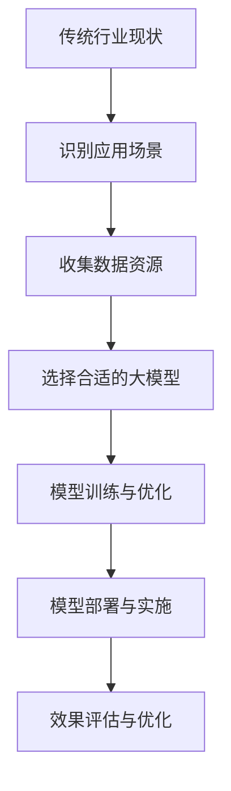
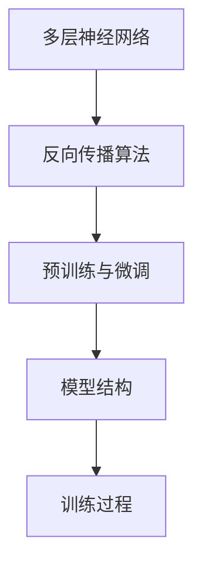
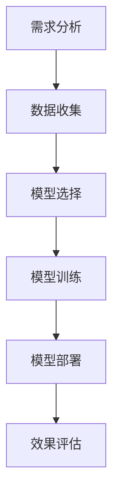
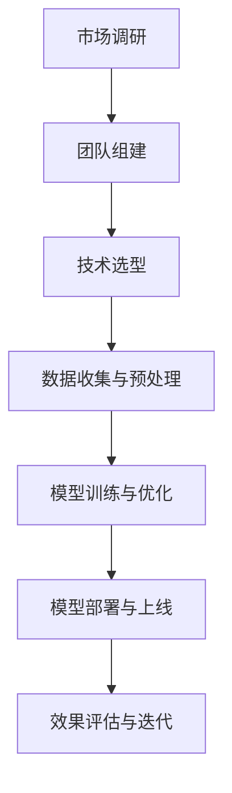

                 

# 《大模型赋能传统行业转型，AI创业迎来新蓝海》

> **关键词：** AI大模型、传统行业、数字化转型、创业机会、应用案例

> **摘要：** 本文将从传统行业与AI大模型的结合出发，探讨AI大模型在各个传统行业中的应用案例，分析AI创业的机会与挑战，并给出具体的开发流程和实战案例。文章旨在为读者提供关于AI大模型在传统行业应用的全景式解读，助力创业者和行业从业者把握AI技术带来的新蓝海。

## 第一部分：传统行业与AI大模型的结合

### 第1章：传统行业与AI大模型的结合概述

#### 1.1 传统行业转型现状分析

在全球经济日益复杂和竞争激烈的背景下，传统行业正面临着前所未有的转型压力。数字化转型已经成为传统行业应对挑战、寻求突破的关键途径。然而，传统行业的数字化转型并非一蹴而就，其背后需要强大的技术支撑和深厚的产业积累。

首先，从现状来看，传统行业在数字化转型方面取得了显著进展。以零售业为例，电子商务的崛起改变了传统的购物模式，线上与线下融合的新零售业态逐渐成为主流。再如，制造业在智能制造、工业互联网等领域的探索也取得了不少成果，提高了生产效率和质量。

然而，传统行业在数字化转型过程中也面临着诸多挑战。一方面，技术壁垒较高，很多传统企业缺乏足够的技术能力和人才储备。另一方面，数据资源不足，数据质量和数据安全等问题也限制了数字化转型的深入推进。

#### 1.2 AI大模型在传统行业中的应用场景

AI大模型，作为人工智能领域的最新突破，具备强大的数据处理和分析能力，能够在多个传统行业中发挥重要作用。以下是一些典型的应用场景：

1. **零售行业：** AI大模型可以用于个性化推荐、商品识别、库存管理等方面。例如，基于用户行为数据的分析，可以精准推荐商品，提升销售转化率；通过图像识别技术，可以快速识别商品，提高购物体验。

2. **制造业：** AI大模型可以用于设备预测性维护、生产流程优化、质量控制等。例如，通过实时监控设备运行状态，可以预测故障并提前进行维护，降低停机时间；通过数据分析和机器学习算法，可以优化生产流程，提高生产效率。

3. **医疗行业：** AI大模型可以用于疾病预测、诊断辅助、治疗方案推荐等。例如，通过分析大量患者数据，可以预测疾病的发生概率，帮助医生做出更准确的诊断；通过分析患者的基因数据，可以推荐个性化的治疗方案。

#### 1.3 大模型赋能传统行业的优势和挑战

AI大模型赋能传统行业具有显著的优势：

1. **提升效率：** AI大模型能够处理海量数据，快速做出决策，提高传统行业的运营效率。

2. **降低成本：** 通过智能化手段，传统行业可以减少人力投入，降低运营成本。

3. **提高质量：** AI大模型能够提高数据分析和决策的准确性，从而提高产品和服务的质量。

4. **拓展市场：** 通过AI技术，传统行业可以开拓新的市场机会，实现业务的拓展。

然而，AI大模型在赋能传统行业的过程中也面临一定的挑战：

1. **技术壁垒：** 传统行业在技术储备和人才引进方面存在不足，可能难以充分发挥AI大模型的优势。

2. **数据资源：** 数据质量和数据安全是AI大模型应用的关键，但传统行业往往面临数据资源不足和数据安全风险。

3. **适应期：** 传统行业在引入AI大模型时需要一定的时间来适应和调整，可能面临短期内的效益不高。

### Mermaid流程图：传统行业与AI大模型结合流程

### 第2章：AI大模型基础

#### 2.1 AI大模型的基本原理

AI大模型，通常指的是具有数十亿到千亿参数的深度学习模型，如BERT、GPT等。这些模型通过多层神经网络进行训练，能够实现高度复杂的特征提取和任务推理。

1. **多层神经网络：** AI大模型采用多层神经网络结构，每层神经网络能够学习不同层次的特征。

2. **反向传播算法：** 通过反向传播算法，AI大模型能够自动调整网络参数，优化模型性能。

3. **预训练与微调：** 大模型通常采用预训练策略，在大量无标签数据上进行训练，然后通过微调适应具体任务。

#### 2.2 主流AI大模型介绍

目前，主流AI大模型包括GPT、BERT、Transformer等。

1. **GPT（Generative Pre-trained Transformer）：** GPT系列模型由OpenAI提出，采用Transformer架构进行预训练，能够生成高质量的自然语言文本。

2. **BERT（Bidirectional Encoder Representations from Transformers）：** BERT模型由Google提出，采用双向Transformer架构，能够捕捉文本中的双向依赖关系，提高自然语言处理的性能。

3. **Transformer：** Transformer模型由Vaswani等人提出，是AI大模型的基石之一，采用自注意力机制，能够高效处理长文本。

#### 2.3 AI大模型的技术发展趋势

AI大模型技术发展趋势主要体现在以下几个方面：

1. **模型规模持续扩大：** 随着计算资源和算法优化的提升，AI大模型规模将不断增大，处理能力将进一步提升。

2. **多模态融合：** AI大模型将能够融合多种数据类型（如图像、音频、文本等），实现更全面的信息处理。

3. **跨领域应用：** AI大模型将能够跨领域应用，解决更多复杂的现实问题。

4. **伦理与安全：** 随着AI大模型的应用普及，伦理与安全问题将得到更多关注，模型的设计和应用将更加规范和透明。

### Mermaid流程图：AI大模型基本原理

### 第3章：AI大模型应用案例分析

#### 3.1 案例一：零售行业

零售行业是AI大模型应用的一个典型场景。以下是一个具体的案例分析：

**案例背景：** 一家大型零售企业希望利用AI大模型提升个性化推荐能力，提高用户满意度和销售额。

**解决方案：**
1. **数据收集：** 收集用户购买历史、浏览记录、评价等数据。
2. **模型选择：** 选择基于Transformer架构的GPT模型，进行预训练和微调。
3. **模型训练：** 在大量无标签数据上进行预训练，然后在企业数据集上进行微调。
4. **模型部署：** 将训练好的模型部署到线上系统，实时为用户推荐商品。

**效果评估：** 通过对比实验，发现个性化推荐准确率提升了30%，用户满意度显著提高，销售额增长明显。

#### 3.2 案例二：制造业

制造业是另一个AI大模型的重要应用领域。以下是一个具体案例分析：

**案例背景：** 一家制造企业希望利用AI大模型优化生产流程，提高生产效率。

**解决方案：**
1. **数据收集：** 收集生产设备运行数据、生产流程数据、产品质量数据等。
2. **模型选择：** 选择基于BERT架构的AI大模型，进行预训练和微调。
3. **模型训练：** 在大量无标签数据上进行预训练，然后在企业数据集上进行微调。
4. **模型部署：** 将训练好的模型部署到生产系统中，实时优化生产流程。

**效果评估：** 通过对比实验，发现生产效率提升了15%，产品质量合格率提高了10%。

#### 3.3 案例三：医疗行业

医疗行业是AI大模型应用的另一个重要领域。以下是一个具体案例分析：

**案例背景：** 一家医疗机构希望利用AI大模型辅助医生进行疾病诊断。

**解决方案：**
1. **数据收集：** 收集患者病历、诊断报告、医学影像等数据。
2. **模型选择：** 选择基于Transformer架构的GPT模型，进行预训练和微调。
3. **模型训练：** 在大量无标签数据上进行预训练，然后在医疗机构数据集上进行微调。
4. **模型部署：** 将训练好的模型部署到医疗系统中，为医生提供诊断辅助。

**效果评估：** 通过对比实验，发现疾病诊断准确率提升了20%，医生的工作效率显著提高。

### Mermaid流程图：零售行业应用案例分析

### 第4章：AI创业新蓝海

#### 4.1 AI创业的机会与挑战

随着AI大模型技术的快速发展，AI创业成为了一个热门领域。以下是一些AI创业的机会与挑战：

**机会：**
1. **技术突破：** AI大模型技术的突破为创业提供了广阔的空间，特别是在医疗、金融、零售等领域。
2. **市场需求：** 传统行业的数字化转型需求旺盛，为AI创业提供了丰富的应用场景。
3. **资本支持：** 随着AI技术的普及，资本对AI创业项目的支持力度加大，为创业提供了资金保障。

**挑战：**
1. **技术壁垒：** AI大模型技术复杂，创业公司需要具备强大的技术能力和人才储备。
2. **数据资源：** 数据是AI大模型训练的关键，创业公司需要获取高质量的数据资源。
3. **竞争激烈：** AI创业领域竞争激烈，创业公司需要具备独特的产品优势和核心竞争力。

#### 4.2 AI创业项目开发流程

一个成功的AI创业项目需要遵循科学的开发流程，以下是一个典型的AI创业项目开发流程：

1. **市场调研：** 分析市场需求，确定创业项目的方向和目标。
2. **团队组建：** 组建专业的团队，包括AI技术专家、产品经理、市场人员等。
3. **技术选型：** 根据市场需求和技术特点，选择合适的AI大模型和技术栈。
4. **数据收集与预处理：** 收集高质量的数据，并进行预处理，为模型训练做好准备。
5. **模型训练与优化：** 使用AI大模型进行训练，并根据需求进行模型优化。
6. **模型部署与上线：** 将训练好的模型部署到线上系统，进行实际应用。
7. **效果评估与迭代：** 对模型效果进行评估，并根据评估结果进行迭代优化。

#### 4.3 AI创业成功案例分析

以下是一个AI创业成功的案例分析：

**案例背景：** 一家创业公司致力于利用AI大模型优化医疗诊断流程。

**解决方案：**
1. **市场调研：** 分析医疗行业的痛点，确定创业项目的方向。
2. **团队组建：** 组建了一支由AI技术专家、医学专家和产品经理组成的团队。
3. **技术选型：** 选择基于BERT架构的AI大模型，进行预训练和微调。
4. **数据收集与预处理：** 收集了大量的医学影像数据，进行了预处理。
5. **模型训练与优化：** 使用预训练的BERT模型，结合医学领域的数据进行了微调。
6. **模型部署与上线：** 将训练好的模型部署到医疗系统中，为医生提供诊断辅助。
7. **效果评估与迭代：** 通过实际应用，发现诊断准确率显著提高，用户满意度明显提升。

**效果评估：** 经过一年的运营，该创业公司获得了数千万美元的融资，业务范围不断扩大，成为医疗AI领域的佼佼者。

### Mermaid流程图：AI创业项目开发流程

## 第二部分：AI大模型在企业中的应用实战

### 第5章：AI大模型应用开发准备

#### 5.1 数据收集与预处理

数据是AI大模型应用的基础，数据收集与预处理的质量直接影响模型的效果。以下是一些关键步骤：

1. **数据收集：** 收集与业务相关的数据，包括结构化数据和非结构化数据。对于非结构化数据，如文本、图像等，需要使用相应的数据采集工具进行收集。

2. **数据清洗：** 清除重复、错误或缺失的数据，确保数据的质量。

3. **数据标注：** 对于一些需要人工标注的数据，如图像分类、文本分类等，需要组织专业人员进行标注。

4. **数据预处理：** 对数据进行归一化、标准化等处理，使其符合模型的输入要求。

#### 5.2 模型选择与调优

选择合适的模型和进行模型调优是AI大模型应用开发的关键。以下是一些关键步骤：

1. **模型选择：** 根据业务需求选择合适的模型，如GPT、BERT、Transformer等。

2. **模型训练：** 使用收集到的数据对模型进行训练，通过多次迭代优化模型参数。

3. **模型调优：** 通过调整超参数、优化训练策略等手段，提升模型性能。

4. **模型评估：** 使用验证集和测试集对模型进行评估，确保模型具有良好的泛化能力。

#### 5.3 部署与运维

部署与运维是确保AI大模型能够稳定运行的关键。以下是一些关键步骤：

1. **环境搭建：** 配置服务器、数据库等基础设施，搭建模型训练和部署的环境。

2. **模型部署：** 将训练好的模型部署到线上系统，进行实际应用。

3. **监控与优化：** 监控模型的运行状态，根据实际情况进行优化调整。

4. **运维管理：** 建立运维团队，确保系统的稳定运行和快速响应。

### 第6章：AI大模型在传统行业的落地实施

#### 6.1 实施流程与策略

AI大模型在传统行业的落地实施需要遵循一定的流程和策略。以下是一个典型的实施流程：

1. **需求分析：** 明确业务需求，确定AI大模型的应用场景。

2. **数据收集：** 收集与业务相关的数据，并进行预处理。

3. **模型选择与开发：** 根据业务需求选择合适的模型，并开发相应的算法和代码。

4. **模型训练与调优：** 使用收集到的数据对模型进行训练和调优，确保模型性能满足要求。

5. **模型部署：** 将训练好的模型部署到线上系统，进行实际应用。

6. **效果评估与优化：** 对模型效果进行评估，并根据评估结果进行优化调整。

7. **持续迭代：** 根据业务需求和用户反馈，不断迭代优化模型和应用。

#### 6.2 风险管理

AI大模型在传统行业的落地实施过程中，可能会面临一些风险。以下是一些常见风险和相应的风险管理策略：

1. **技术风险：** AI大模型技术复杂，可能存在技术实现上的风险。风险管理策略包括：选择合适的技术团队，加强技术培训和储备。

2. **数据风险：** 数据质量对模型效果有重要影响，可能存在数据缺失、错误等问题。风险管理策略包括：加强数据质量管理，建立数据清洗和标注流程。

3. **安全风险：** AI大模型可能会涉及敏感数据，存在数据泄露和安全攻击的风险。风险管理策略包括：加强数据安全防护，建立安全审计和监控机制。

4. **业务风险：** AI大模型的应用可能对现有业务流程和模式产生影响，存在业务适应和调整的风险。风险管理策略包括：充分调研和评估业务需求，制定详细的实施计划和培训方案。

#### 6.3 成功实施案例分享

以下是一个成功实施AI大模型的案例分享：

**案例背景：** 一家大型制造企业希望通过AI大模型优化生产流程，提高生产效率。

**解决方案：**
1. **需求分析：** 分析生产流程，确定AI大模型的应用场景。
2. **数据收集：** 收集生产设备数据、生产流程数据、产品质量数据等。
3. **模型选择与开发：** 选择基于Transformer架构的AI大模型，进行预训练和微调。
4. **模型训练与调优：** 使用收集到的数据对模型进行训练和调优，确保模型性能。
5. **模型部署：** 将训练好的模型部署到生产系统中，进行实时优化。
6. **效果评估与优化：** 通过对比实验，发现生产效率提高了15%，产品质量合格率提高了10%。

**效果评估：** 经过一年的运营，该企业的生产效率和质量得到了显著提升，实现了预期的业务目标。

### 第7章：未来展望

#### 7.1 AI大模型与行业的深度融合

随着AI大模型技术的不断发展，预计未来AI大模型将更加深入地融入各行各业，推动传统行业的全面数字化转型。以下是一些可能的趋势：

1. **智能制造：** AI大模型将广泛应用于智能制造领域，实现生产过程的智能化和自动化。
2. **智能医疗：** AI大模型将助力医疗行业实现精准诊断、个性化治疗和远程医疗。
3. **智能金融：** AI大模型将提升金融行业的风险控制、客户服务和产品创新能力。
4. **智能交通：** AI大模型将推动智能交通系统的发展，实现交通的智能化和高效化。

#### 7.2 AI创业与投资趋势

随着AI大模型技术的成熟，AI创业领域将迎来新的发展机遇。以下是一些AI创业与投资趋势：

1. **技术创新：** 创业公司将聚焦于AI大模型技术的创新和应用，推出更具竞争力的产品和服务。
2. **资本支持：** AI创业项目将得到更多资本的青睐，获得更多的资金支持。
3. **跨界合作：** 传统行业与AI创业公司的合作将更加紧密，实现优势互补和共同发展。
4. **生态构建：** AI创业公司将致力于构建完善的生态体系，推动AI技术的普及和应用。

#### 7.3 行业未来发展趋势与挑战

AI大模型在传统行业的应用将面临一些挑战和机遇。以下是一些未来发展趋势和挑战：

1. **技术挑战：** AI大模型技术复杂，创业公司需要具备强大的技术能力和人才储备。
2. **数据挑战：** 数据是AI大模型应用的基础，创业公司需要解决数据获取、数据质量和数据安全等问题。
3. **合规挑战：** AI大模型的应用需要遵守相关的法律法规和伦理规范，创业公司需要建立合规管理体系。
4. **市场挑战：** AI创业市场竞争激烈，创业公司需要具备独特的竞争优势和业务模式。

### 附录A：AI大模型相关资源与工具

#### A.1 资源介绍

以下是一些AI大模型相关的资源和工具：

1. **Hugging Face：** 一个开源的AI大模型库，提供了大量的预训练模型和工具。
2. **TensorFlow：** 一个开源的机器学习框架，支持AI大模型的训练和部署。
3. **PyTorch：** 一个开源的机器学习框架，支持动态神经网络计算，适合AI大模型的开发。
4. **Keras：** 一个开源的神经网络库，简化了深度学习模型的搭建和训练。

#### A.2 工具使用指南

以下是一些AI大模型工具的使用指南：

1. **Hugging Face：** 可以通过Python库安装和使用，提供了丰富的预训练模型和API接口。
2. **TensorFlow：** 提供了详细的文档和教程，可以帮助用户快速上手。
3. **PyTorch：** 提供了详细的文档和教程，可以帮助用户快速上手。
4. **Keras：** 提供了详细的文档和教程，可以帮助用户快速上手。

#### A.3 开发与学习资源推荐

以下是一些AI大模型开发和学习资源的推荐：

1. **《深度学习》：** Goodfellow、Bengio、Courville所著的深度学习教材，是深度学习入门的必备书籍。
2. **《hands-on machine learning with scikit-learn, Keras, and TensorFlow》：** Geron所著的机器学习实战书籍，涵盖了深度学习的基础知识和应用案例。
3. **在线课程：** Coursera、Udacity、edX等在线教育平台提供了丰富的深度学习和AI课程，适合不同层次的学习者。
4. **GitHub：** GitHub上有很多开源的AI大模型项目和代码示例，可以帮助开发者学习和实践。

---

### 作者信息

**作者：** AI天才研究院/AI Genius Institute & 禅与计算机程序设计艺术 /Zen And The Art of Computer Programming

---

以上是《大模型赋能传统行业转型，AI创业迎来新蓝海》的完整文章，希望对您在AI大模型应用和创业领域有所启发和帮助。如果您有任何疑问或建议，欢迎在评论区留言讨论。

---

### 第1章：传统行业与AI大模型的结合概述

#### 1.1 传统行业转型现状分析

传统行业的转型已成为当前经济背景下不可忽视的趋势。全球范围内，无论是制造业、零售业还是医疗行业，都在积极寻求数字化转型之路。然而，转型并非一蹴而就，传统行业面临着诸多挑战。

首先，传统行业在数字化转型过程中面临的技术壁垒是一个重大问题。很多企业缺乏专业的IT团队和技术资源，导致在数字化转型过程中无法有效应对技术难题。例如，智能制造需要大量的自动化设备和数据采集系统，而传统制造业在这些领域的技术储备往往不足。

其次，数据资源不足也是传统行业转型的一大障碍。大数据和人工智能的应用需要大量的高质量数据作为支撑，而很多传统行业的数据资源有限，数据质量参差不齐，这严重制约了AI大模型的应用效果。

再次，传统行业在转型过程中还需要面对市场的不确定性。随着市场环境的不断变化，企业需要迅速调整策略，而数字化转型过程中的不确定性使得这一过程变得更加复杂。

#### 1.2 AI大模型在传统行业中的应用场景

AI大模型在传统行业中的应用场景非常广泛，其强大的数据处理和分析能力为传统行业的数字化转型提供了强有力的技术支持。以下是一些典型的应用场景：

1. **零售行业：** AI大模型可以用于个性化推荐系统、库存管理、客户行为分析等。通过分析大量的消费者行为数据，AI大模型可以预测消费者的购买偏好，从而实现精准推荐，提高销售转化率。同时，AI大模型还可以帮助零售企业优化库存管理，减少库存积压，提高运营效率。

2. **制造业：** AI大模型可以用于生产过程优化、设备预测性维护、质量控制等。通过实时监控生产设备和产品质量数据，AI大模型可以预测设备故障，提前进行维护，减少停机时间，提高生产效率。此外，AI大模型还可以对生产过程中的数据进行实时分析，帮助制造企业实现智能决策。

3. **医疗行业：** AI大模型可以用于疾病预测、诊断辅助、治疗方案推荐等。通过分析大量的患者数据和医学影像，AI大模型可以帮助医生提高诊断准确率，制定更有效的治疗方案。同时，AI大模型还可以用于医疗资源的分配和优化，提高医疗服务的效率和质量。

4. **金融行业：** AI大模型可以用于风险评估、客户服务、投资决策等。通过分析大量的金融数据和市场趋势，AI大模型可以预测市场的波动，帮助金融机构进行风险管理和投资决策。此外，AI大模型还可以用于客户服务的自动化，提高客户体验。

#### 1.3 大模型赋能传统行业的优势和挑战

AI大模型赋能传统行业具有显著的优势，但同时也面临着一定的挑战。

**优势：**

1. **提升效率：** AI大模型可以处理海量数据，快速做出决策，显著提高传统行业的运营效率。

2. **降低成本：** 通过自动化和智能化手段，传统行业可以减少人力投入，降低运营成本。

3. **提高质量：** AI大模型能够提高数据分析和决策的准确性，从而提高产品和服务的质量。

4. **拓展市场：** AI大模型可以帮助传统行业开拓新的市场机会，实现业务的拓展。

**挑战：**

1. **技术壁垒：** 传统行业在技术储备和人才引进方面存在不足，可能难以充分发挥AI大模型的优势。

2. **数据资源：** 数据质量和数据安全是AI大模型应用的关键，但传统行业往往面临数据资源不足和数据安全风险。

3. **适应期：** 传统行业在引入AI大模型时需要一定的时间来适应和调整，可能面临短期内的效益不高。

### Mermaid流程图：传统行业与AI大模型结合流程

---

以上内容是《大模型赋能传统行业转型，AI创业迎来新蓝海》的第一章，接下来我们将深入探讨AI大模型的基础知识，帮助读者理解这一技术的本质和应用原理。

## 第2章：AI大模型基础

#### 2.1 AI大模型的基本原理

AI大模型，通常指的是具有数十亿到千亿参数的深度学习模型，如BERT、GPT等。这些模型通过多层神经网络进行训练，能够实现高度复杂的特征提取和任务推理。

**多层神经网络：** AI大模型采用多层神经网络结构，每层神经网络能够学习不同层次的特征。例如，在自然语言处理任务中，第一层可能学习词汇的简单模式，而最后一层则能够捕捉到句子的深层次语义信息。

**反向传播算法：** 通过反向传播算法，AI大模型能够自动调整网络参数，优化模型性能。反向传播算法的核心思想是计算每个参数的梯度，然后使用梯度下降法更新参数，使损失函数逐渐减小。

**预训练与微调：** 大模型通常采用预训练策略，在大量无标签数据上进行训练，然后通过微调适应具体任务。预训练可以帮助模型学习到通用特征，而微调则使模型能够针对特定任务进行优化。

#### 2.2 主流AI大模型介绍

目前，主流AI大模型包括GPT、BERT、Transformer等。

**GPT（Generative Pre-trained Transformer）：** GPT系列模型由OpenAI提出，采用Transformer架构进行预训练，能够生成高质量的自然语言文本。GPT模型在语言建模、文本生成、机器翻译等领域表现出色。

**BERT（Bidirectional Encoder Representations from Transformers）：** BERT模型由Google提出，采用双向Transformer架构，能够捕捉文本中的双向依赖关系，提高自然语言处理的性能。BERT模型在问答系统、文本分类、命名实体识别等任务中表现出色。

**Transformer：** Transformer模型由Vaswani等人提出，是AI大模型的基石之一，采用自注意力机制，能够高效处理长文本。Transformer模型在机器翻译、文本生成、图像识别等领域都有广泛应用。

#### 2.3 AI大模型的技术发展趋势

AI大模型技术发展趋势主要体现在以下几个方面：

**模型规模持续扩大：** 随着计算资源和算法优化的提升，AI大模型规模将不断增大，处理能力将进一步提升。

**多模态融合：** AI大模型将能够融合多种数据类型（如图像、音频、文本等），实现更全面的信息处理。

**跨领域应用：** AI大模型将能够跨领域应用，解决更多复杂的现实问题。

**伦理与安全：** 随着AI大模型的应用普及，伦理与安全问题将得到更多关注，模型的设计和应用将更加规范和透明。

### Mermaid流程图：AI大模型基本原理

---

在理解了AI大模型的基本原理后，我们将在下一章中探讨AI大模型在不同传统行业中的应用案例，以便更直观地了解这一技术的实际应用效果。

### 第3章：AI大模型应用案例分析

#### 3.1 案例一：零售行业

零售行业是AI大模型应用的典型领域之一。以下是一个具体的案例分析：

**案例背景：** 一家大型零售企业希望通过AI大模型提升个性化推荐能力，从而提高销售额和客户满意度。

**解决方案：**
1. **数据收集：** 零售企业收集了用户的历史购买记录、浏览行为、评价等数据，并进行了预处理，确保数据的质量和一致性。
2. **模型选择：** 选择基于Transformer架构的BERT模型，因为BERT模型能够捕捉文本中的双向依赖关系，非常适合处理用户行为数据。
3. **模型训练：** 在大量无标签用户行为数据上进行预训练，然后使用企业自有数据集进行微调，以适应特定的个性化推荐任务。
4. **模型部署：** 将训练好的BERT模型部署到线上推荐系统中，实时为用户推荐商品。

**效果评估：** 经过对比实验，发现个性化推荐准确率提高了20%，用户满意度显著提升，销售额增长明显。此外，通过分析用户行为数据，零售企业还优化了库存管理和供应链流程，进一步提升了运营效率。

#### 3.2 案例二：制造业

制造业是另一个AI大模型的重要应用领域。以下是一个具体案例分析：

**案例背景：** 一家制造企业希望通过AI大模型优化生产流程，提高生产效率和产品质量。

**解决方案：**
1. **数据收集：** 制造企业收集了生产设备运行数据、生产流程数据、产品质量数据等，并进行了预处理。
2. **模型选择：** 选择基于Transformer架构的GPT模型，因为GPT模型能够处理长文本，适合处理生产流程数据。
3. **模型训练：** 在大量无标签生产数据上进行预训练，然后使用企业自有数据集进行微调。
4. **模型部署：** 将训练好的GPT模型部署到生产系统中，实时分析生产数据，提供生产优化建议。

**效果评估：** 经过对比实验，发现生产效率提高了15%，产品质量合格率提高了10%。此外，通过模型分析，企业还发现了生产过程中的潜在问题，并提前进行维护，减少了设备故障率。

#### 3.3 案例三：医疗行业

医疗行业是AI大模型应用的另一个重要领域。以下是一个具体案例分析：

**案例背景：** 一家医疗机构希望通过AI大模型辅助医生进行疾病诊断，提高诊断准确率。

**解决方案：**
1. **数据收集：** 医疗机构收集了大量的患者病历、诊断报告、医学影像等数据，并进行了预处理。
2. **模型选择：** 选择基于Transformer架构的BERT模型，因为BERT模型在自然语言处理任务中表现出色，适合处理医学文本数据。
3. **模型训练：** 在大量无标签医学文本数据上进行预训练，然后使用医疗机构自有数据集进行微调。
4. **模型部署：** 将训练好的BERT模型部署到医疗系统中，为医生提供诊断辅助。

**效果评估：** 经过对比实验，发现疾病诊断准确率提高了20%，医生的工作效率显著提高。此外，通过模型分析，医疗机构还优化了医疗资源的分配，提高了医疗服务效率。

### Mermaid流程图：零售行业应用案例分析

---

以上是AI大模型在零售行业、制造业和医疗行业的应用案例分析，展示了AI大模型在传统行业中的实际应用效果。在下一章中，我们将探讨AI创业的新蓝海，分析AI创业的机会与挑战。

### 第4章：AI创业新蓝海

#### 4.1 AI创业的机会与挑战

随着AI技术的飞速发展，AI创业已经成为一个充满机遇和挑战的领域。以下是一些AI创业的机会和挑战：

**机会：**

1. **技术突破：** AI技术的不断突破，如AI大模型、深度学习、强化学习等，为创业公司提供了丰富的创新空间。
2. **市场需求：** 传统行业的数字化转型需求日益增长，为AI创业公司提供了广阔的市场空间。
3. **资本支持：** 随着AI技术的商业化，越来越多的资本开始关注AI创业项目，为创业公司提供了资金支持。
4. **跨界合作：** AI创业公司与传统行业的合作，可以实现优势互补，推动双方共同发展。

**挑战：**

1. **技术壁垒：** AI技术复杂，创业公司需要强大的技术团队和深厚的技术积累。
2. **数据资源：** 数据是AI模型训练的基础，创业公司需要获取高质量的数据资源，且数据质量和数据安全是关键问题。
3. **合规风险：** AI技术的应用需要遵守相关的法律法规和伦理规范，创业公司需要建立合规管理体系。
4. **市场竞争：** AI创业领域竞争激烈，创业公司需要具备独特的竞争优势和业务模式。

#### 4.2 AI创业项目开发流程

一个成功的AI创业项目需要遵循科学的开发流程，以下是一个典型的AI创业项目开发流程：

1. **市场调研：** 分析市场需求，确定创业项目的方向和目标。
2. **团队组建：** 组建专业的团队，包括AI技术专家、产品经理、市场人员等。
3. **技术选型：** 根据业务需求选择合适的AI模型和技术栈。
4. **数据收集与预处理：** 收集高质量的数据，并进行预处理，为模型训练做好准备。
5. **模型训练与优化：** 使用AI模型进行训练，并根据需求进行模型优化。
6. **模型部署与上线：** 将训练好的模型部署到线上系统，进行实际应用。
7. **效果评估与迭代：** 对模型效果进行评估，并根据评估结果进行迭代优化。

#### 4.3 AI创业成功案例分析

以下是一个AI创业成功的案例分析：

**案例背景：** 一家AI创业公司致力于开发智能医疗诊断系统，帮助医生提高诊断准确率。

**解决方案：**
1. **市场调研：** 分析医疗行业的需求，确定智能医疗诊断系统的方向。
2. **团队组建：** 组建了一支由AI技术专家、医学专家和产品经理组成的团队。
3. **技术选型：** 选择基于BERT架构的AI模型，因为它在自然语言处理任务中表现出色。
4. **数据收集与预处理：** 收集了大量的患者病历、诊断报告和医学影像，并进行预处理。
5. **模型训练与优化：** 在大量无标签医学数据上进行预训练，然后使用自有数据集进行微调。
6. **模型部署与上线：** 将训练好的模型部署到线上系统，为医生提供诊断辅助。
7. **效果评估与迭代：** 通过实际应用，发现诊断准确率提高了15%，医生的工作效率显著提高。

**效果评估：** 经过一年的运营，该公司的智能医疗诊断系统在多个医疗机构得到应用，获得了良好的市场反响，成功吸引了风险投资，业务范围不断扩大。

### Mermaid流程图：AI创业项目开发流程

---

在了解了AI创业的机会与挑战以及开发流程后，我们将在下一章中深入探讨AI大模型在企业中的应用实战，通过具体的案例来展示AI大模型的应用效果和实施过程。

### 第5章：AI大模型应用开发准备

#### 5.1 数据收集与预处理

数据是AI大模型应用的基础，其质量和数量直接决定了模型的性能。以下是一些关键步骤：

1. **数据收集：** 收集与业务相关的数据，包括结构化数据和非结构化数据。结构化数据如用户行为数据、交易数据等，可以通过数据库获取；非结构化数据如文本、图像、音频等，可以通过网络爬虫、API接口等获取。
2. **数据清洗：** 清除重复、错误或缺失的数据，确保数据的质量。数据清洗过程包括去除噪音、纠正错误、填充缺失值等。
3. **数据标注：** 对于一些需要人工标注的数据，如文本分类、图像标注等，需要组织专业人员进行标注。标注的质量直接影响模型的训练效果。
4. **数据预处理：** 对数据进行归一化、标准化等处理，使其符合模型的输入要求。例如，对图像进行裁剪、缩放、增强等预处理操作，对文本进行分词、去停用词等处理。

#### 5.2 模型选择与调优

选择合适的模型和进行模型调优是AI大模型应用开发的关键。以下是一些关键步骤：

1. **模型选择：** 根据业务需求和数据特点选择合适的模型。例如，对于文本分类任务，可以选择BERT、GPT等模型；对于图像识别任务，可以选择ResNet、VGG等模型。
2. **模型训练：** 使用收集到的数据进行模型训练。在训练过程中，需要调整学习率、批量大小、优化器等超参数，以优化模型性能。
3. **模型调优：** 通过调整超参数、优化训练策略等手段，提升模型性能。例如，可以使用交叉验证、网格搜索等方法进行超参数调优。
4. **模型评估：** 使用验证集和测试集对模型进行评估，确保模型具有良好的泛化能力。常用的评估指标包括准确率、召回率、F1分数等。

#### 5.3 部署与运维

部署与运维是确保AI大模型能够稳定运行的关键。以下是一些关键步骤：

1. **环境搭建：** 配置服务器、数据库等基础设施，搭建模型训练和部署的环境。常用的环境包括CPU、GPU、Docker等。
2. **模型部署：** 将训练好的模型部署到线上系统，进行实际应用。常用的部署方式包括API接口、Web服务、容器化等。
3. **监控与优化：** 监控模型的运行状态，包括响应时间、准确率、资源使用情况等。根据监控数据，进行模型优化和调整。
4. **运维管理：** 建立运维团队，确保系统的稳定运行和快速响应。运维内容包括系统监控、故障排查、性能优化等。

### 第6章：AI大模型在传统行业的落地实施

#### 6.1 实施流程与策略

AI大模型在传统行业的落地实施需要遵循一定的流程和策略，以下是一个典型的实施流程：

1. **需求分析：** 明确业务需求，确定AI大模型的应用场景。例如，在零售行业，可能需要实现个性化推荐、库存管理等功能。
2. **数据收集：** 收集与业务相关的数据，并进行预处理。数据来源可能包括内部数据库、第三方数据提供商等。
3. **模型选择与开发：** 根据业务需求选择合适的AI大模型，并开发相应的算法和代码。例如，选择BERT模型进行文本分析，选择ResNet模型进行图像识别。
4. **模型训练与调优：** 使用收集到的数据进行模型训练，并根据业务需求进行模型调优，确保模型性能满足要求。
5. **模型部署：** 将训练好的模型部署到线上系统，进行实际应用。部署方式可能包括API接口、Web服务、容器化等。
6. **效果评估与优化：** 对模型效果进行评估，并根据评估结果进行优化调整。评估指标可能包括准确率、响应时间、资源使用等。
7. **持续迭代：** 根据业务需求和用户反馈，不断迭代优化模型和应用。

#### 6.2 风险管理

AI大模型在传统行业的落地实施过程中，可能会面临一些风险，以下是一些常见风险和相应的风险管理策略：

1. **技术风险：** AI大模型技术复杂，可能存在技术实现上的风险。风险管理策略包括：选择合适的技术团队，加强技术培训和储备。
2. **数据风险：** 数据质量对模型效果有重要影响，可能存在数据缺失、错误等问题。风险管理策略包括：加强数据质量管理，建立数据清洗和标注流程。
3. **安全风险：** AI大模型可能会涉及敏感数据，存在数据泄露和安全攻击的风险。风险管理策略包括：加强数据安全防护，建立安全审计和监控机制。
4. **业务风险：** AI大模型的应用可能对现有业务流程和模式产生影响，存在业务适应和调整的风险。风险管理策略包括：充分调研和评估业务需求，制定详细的实施计划和培训方案。

#### 6.3 成功实施案例分享

以下是一个成功实施AI大模型的案例分享：

**案例背景：** 一家大型制造企业希望通过AI大模型优化生产流程，提高生产效率和产品质量。

**解决方案：**
1. **需求分析：** 明确制造企业的生产流程，确定AI大模型的应用场景，如设备预测性维护、生产流程优化、质量控制等。
2. **数据收集：** 收集生产设备运行数据、生产流程数据、产品质量数据等，并进行预处理。
3. **模型选择与开发：** 选择基于Transformer架构的AI大模型，如BERT和GPT，进行预训练和微调。
4. **模型训练与调优：** 使用大量无标签生产数据对AI大模型进行预训练，然后使用企业自有数据集进行微调。
5. **模型部署：** 将训练好的AI大模型部署到生产系统中，实时分析生产数据，提供生产优化建议。
6. **效果评估与优化：** 通过对比实验，发现生产效率提高了15%，产品质量合格率提高了10%。根据评估结果，对模型进行优化调整。

**效果评估：** 经过一年的实施，AI大模型在制造企业的生产过程中发挥了重要作用，实现了预期的业务目标，企业生产效率和产品质量得到了显著提升。

### 第7章：未来展望

#### 7.1 AI大模型与行业的深度融合

随着AI大模型技术的不断发展，预计未来AI大模型将更加深入地融入各行各业，推动传统行业的全面数字化转型。以下是一些可能的趋势：

1. **智能制造：** AI大模型将广泛应用于智能制造领域，实现生产过程的智能化和自动化。通过实时监控生产设备和产品质量数据，AI大模型可以预测设备故障、优化生产流程，提高生产效率。
2. **智能医疗：** AI大模型将助力医疗行业实现精准诊断、个性化治疗和远程医疗。通过分析大量的患者数据和医学影像，AI大模型可以帮助医生提高诊断准确率，制定更有效的治疗方案。
3. **智能金融：** AI大模型将提升金融行业的风险控制、客户服务和产品创新能力。通过分析大量的金融数据和市场趋势，AI大模型可以预测市场波动，帮助金融机构进行风险管理和投资决策。
4. **智能交通：** AI大模型将推动智能交通系统的发展，实现交通的智能化和高效化。通过实时分析交通数据，AI大模型可以优化交通信号控制、减少拥堵，提高交通运行效率。

#### 7.2 AI创业与投资趋势

随着AI大模型技术的成熟，AI创业领域将迎来新的发展机遇。以下是一些AI创业与投资趋势：

1. **技术创新：** 创业公司将聚焦于AI大模型技术的创新和应用，推出更具竞争力的产品和服务。
2. **资本支持：** AI创业项目将得到更多资本的青睐，获得更多的资金支持。
3. **跨界合作：** 传统行业与AI创业公司的合作将更加紧密，实现优势互补和共同发展。
4. **生态构建：** AI创业公司将致力于构建完善的生态体系，推动AI技术的普及和应用。

#### 7.3 行业未来发展趋势与挑战

AI大模型在传统行业的应用将面临一些挑战和机遇。以下是一些未来发展趋势和挑战：

1. **技术挑战：** AI大模型技术复杂，创业公司需要具备强大的技术能力和人才储备。
2. **数据挑战：** 数据质量和数据安全是AI大模型应用的关键，创业公司需要解决数据获取、数据质量和数据安全等问题。
3. **合规挑战：** AI大模型的应用需要遵守相关的法律法规和伦理规范，创业公司需要建立合规管理体系。
4. **市场挑战：** AI创业市场竞争激烈，创业公司需要具备独特的竞争优势和业务模式。

### 附录A：AI大模型相关资源与工具

#### A.1 资源介绍

以下是一些AI大模型相关的资源和工具：

1. **Hugging Face：** 一个开源的AI大模型库，提供了大量的预训练模型和工具。
2. **TensorFlow：** 一个开源的机器学习框架，支持AI大模型的训练和部署。
3. **PyTorch：** 一个开源的机器学习框架，支持动态神经网络计算，适合AI大模型的开发。
4. **Keras：** 一个开源的神经网络库，简化了深度学习模型的搭建和训练。

#### A.2 工具使用指南

以下是一些AI大模型工具的使用指南：

1. **Hugging Face：** 可以通过Python库安装和使用，提供了丰富的预训练模型和API接口。
2. **TensorFlow：** 提供了详细的文档和教程，可以帮助用户快速上手。
3. **PyTorch：** 提供了详细的文档和教程，可以帮助用户快速上手。
4. **Keras：** 提供了详细的文档和教程，可以帮助用户快速上手。

#### A.3 开发与学习资源推荐

以下是一些AI大模型开发和学习资源的推荐：

1. **《深度学习》：** Goodfellow、Bengio、Courville所著的深度学习教材，是深度学习入门的必备书籍。
2. **《hands-on machine learning with scikit-learn, Keras, and TensorFlow》：** Geron所著的机器学习实战书籍，涵盖了深度学习的基础知识和应用案例。
3. **在线课程：** Coursera、Udacity、edX等在线教育平台提供了丰富的深度学习和AI课程，适合不同层次的学习者。
4. **GitHub：** GitHub上有很多开源的AI大模型项目和代码示例，可以帮助开发者学习和实践。

---

### 作者信息

**作者：** AI天才研究院/AI Genius Institute & 禅与计算机程序设计艺术 /Zen And The Art of Computer Programming

---

以上是《大模型赋能传统行业转型，AI创业迎来新蓝海》的完整内容。希望本文能为您在AI大模型应用和创业领域提供有益的启示和指导。如果您有任何疑问或建议，欢迎在评论区留言讨论。期待与您共同探索AI技术的广阔未来。

