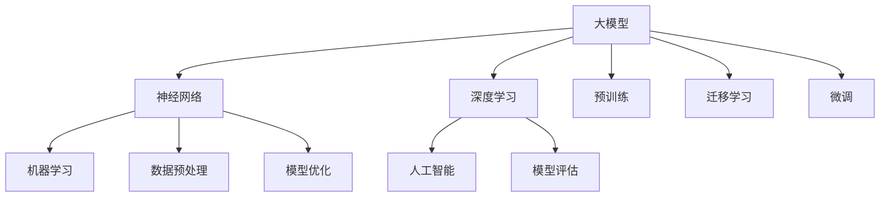
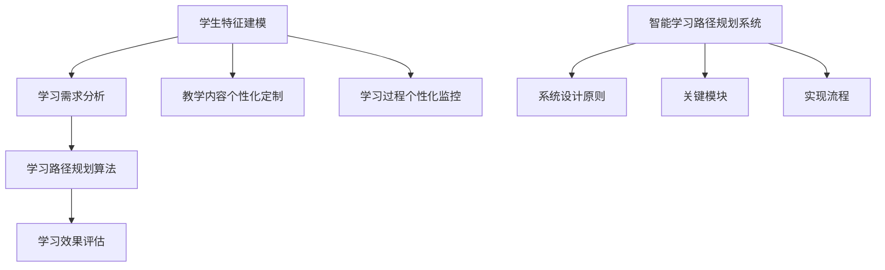

                 

### 《大模型赋能的智能学习路径规划：教育个性化的实现》

#### 关键词：
- 大模型
- 智能学习路径规划
- 教育个性化
- 循环神经网络（RNN）
- 长短时记忆网络（LSTM）
- 深度学习
- 机器学习
- 教育技术
- 个性化推荐
- 智能评价

#### 摘要：
本文将深入探讨大模型赋能的智能学习路径规划在实现教育个性化中的应用。通过介绍大模型的基本概念、技术基础以及智能学习路径规划的原理与框架，本文将详细解析大模型在教育个性化中的核心作用，包括个性化学习推荐、智能评价与反馈等方面。此外，本文还将通过案例与实践，展示大模型在教育个性化中的实际应用，并分析未来发展趋势与挑战。通过本文的阅读，读者将全面了解大模型如何助力教育个性化，提高学习效果。

### 《大模型赋能的智能学习路径规划：教育个性化的实现》目录大纲

#### 第一部分：大模型与教育个性化概述

- **第1章：大模型与教育个性化概述**
  - 1.1 大模型与智能教育
  - 1.1.1 大模型的基本概念与特点
  - 1.1.2 大模型在教育中的应用场景
  - 1.1.3 教育个性化的概念与需求
  - 1.2 大模型在教育个性化中的核心作用
  - 1.2.1 大模型在智能学习路径规划中的作用
  - 1.2.2 大模型在个性化学习推荐中的应用
  - 1.2.3 大模型在智能评价与反馈中的应用
  - 1.3 本书结构安排与学习方法
  - 1.3.1 本书结构安排
  - 1.3.2 学习方法与建议

#### 第二部分：大模型技术基础

- **第2章：大模型技术基础**
  - 2.1 大模型的基本原理
  - 2.1.1 大模型的发展历程
  - 2.1.2 大模型的核心结构
  - 2.1.3 大模型的训练与优化
  - 2.2 大模型的关键算法
  - 2.2.1 循环神经网络（RNN）
  - 2.2.2 长短时记忆网络（LSTM）
  - 2.2.3 门控循环单元（GRU）
  - 2.3 大模型的训练与优化
  - 2.3.1 训练数据集的收集与处理
  - 2.3.2 大模型的训练策略
  - 2.3.3 大模型的优化方法

#### 第三部分：智能学习路径规划

- **第3章：智能学习路径规划原理与框架**
  - 3.1 智能学习路径规划的概念与目标
  - 3.1.1 智能学习路径规划的定义
  - 3.1.2 智能学习路径规划的目标
  - 3.1.3 智能学习路径规划的挑战
  - 3.2 智能学习路径规划的核心组件
  - 3.2.1 学习需求分析
  - 3.2.2 学习路径规划算法
  - 3.2.3 学习效果评估
  - 3.3 智能学习路径规划的系统架构
  - 3.3.1 智能学习路径规划系统设计原则
  - 3.3.2 智能学习路径规划系统的关键模块
  - 3.3.3 智能学习路径规划系统的实现流程

#### 第四部分：教育个性化实现

- **第4章：教育个性化实现方法与技术**
  - 4.1 教育个性化实现的基本方法
  - 4.1.1 学生特征建模
  - 4.1.2 教学内容个性化定制
  - 4.1.3 学习过程个性化监控
  - 4.2 基于大模型的个性化推荐算法
  - 4.2.1 个性化推荐算法概述
  - 4.2.2 协同过滤算法
  - 4.2.3 内容推荐算法
  - 4.2.4 混合推荐算法
  - 4.3 基于大模型的智能评价与反馈
  - 4.3.1 智能评价与反馈的概念
  - 4.3.2 智能评价模型构建
  - 4.3.3 智能反馈机制设计

#### 第五部分：大模型在教育个性化应用中的案例与实践

- **第5章：大模型在教育个性化应用中的案例与实践**
  - 5.1 大模型在教育个性化中的应用案例
  - 5.1.1 案例一：智能学习路径规划系统
  - 5.1.2 案例二：个性化推荐系统
  - 5.1.3 案例三：智能评价与反馈系统
  - 5.2 大模型在教育个性化应用中的实践经验
  - 5.2.1 实践经验一：教学设计优化
  - 5.2.2 实践经验二：学生个性化辅导
  - 5.2.3 实践经验三：教育机构运营优化

#### 第六部分：大模型在教育个性化中的未来发展趋势与挑战

- **第6章：大模型在教育个性化中的未来发展趋势与挑战**
  - 6.1 大模型在教育个性化中的发展趋势
  - 6.1.1 技术进步趋势
  - 6.1.2 应用场景拓展
  - 6.1.3 教育行业变革
  - 6.2 大模型在教育个性化中的挑战与应对策略
  - 6.2.1 技术挑战
  - 6.2.2 道德伦理问题
  - 6.2.3 安全与隐私问题
  - 6.2.4 应对策略

#### 第七部分：附录

- **第7章：附录**
  - 7.1 大模型开发工具与资源
  - 7.1.1 主流深度学习框架对比
  - 7.1.2 大模型训练与优化工具
  - 7.1.3 大模型应用开发平台
  - 7.2 参考文献
  - 7.2.1 大模型相关书籍
  - 7.2.2 大模型技术论文
  - 7.2.3 教育个性化相关研究
  - 7.3 附录：核心概念与联系
    - 1. 大模型的基本概念与联系
    - 2. 智能学习路径规划原理与框架
    - 3. 核心算法原理讲解
    - 4. 数学模型与数学公式
    - 5. 项目实战
    - 6. 数学公式

### 第一部分：大模型与教育个性化概述

#### 第1章：大模型与教育个性化概述

在教育领域，传统的教学方法通常采用“一刀切”的模式，即所有学生都接受相同的教学内容和评估方式。然而，每个学生都是独一无二的，他们在学习过程中的兴趣、能力和需求各不相同。因此，教育个性化成为一种迫切的需求，旨在为学生提供更加定制化的学习体验。在这一背景下，大模型技术以其强大的数据处理和分析能力，为教育个性化提供了新的可能。

### 1.1 大模型与智能教育

**1.1.1 大模型的基本概念与特点**

大模型（Large Model），也称为大型预训练模型，是指具有数百万甚至数十亿参数的深度学习模型。这些模型通常经过大规模的数据集预训练，具有强大的特征提取和模式识别能力。大模型的核心特点是：

1. **参数规模巨大**：大模型的参数数量远远超过传统小模型，这使得它们能够捕捉到更加复杂和丰富的特征。
2. **预训练能力**：大模型通常在大规模通用数据集上进行预训练，这有助于它们在特定任务上表现优异。
3. **迁移学习能力**：大模型通过预训练积累了丰富的知识，这些知识可以迁移到其他任务上，从而提高新任务的性能。

**1.1.2 大模型在教育中的应用场景**

大模型在教育领域有着广泛的应用场景，以下是一些典型的应用：

1. **智能学习路径规划**：大模型可以分析学生的学习数据，为其制定个性化的学习路径。
2. **个性化推荐**：大模型可以根据学生的学习兴趣和需求，为其推荐合适的学习资源。
3. **智能评价与反馈**：大模型可以对学生的学习表现进行评估，并提供有针对性的反馈。
4. **语言学习**：大模型可以用于语言翻译、语音识别和自然语言理解，帮助学习者提高语言能力。

**1.1.3 教育个性化的概念与需求**

教育个性化是指根据学生的兴趣、能力和发展需求，提供个性化的教学和学习体验。教育个性化的核心需求包括：

1. **个性化学习路径**：每个学生都有不同的学习节奏和风格，教育个性化要求能够根据学生的特点，为其设计合适的、个性化的学习路径。
2. **个性化教学内容**：教学内容应与学生的兴趣和需求相匹配，以激发学生的学习动机和兴趣。
3. **个性化评估与反馈**：评估和反馈应关注学生的个性发展，提供个性化的改进建议。

### 1.2 大模型在教育个性化中的核心作用

**1.2.1 大模型在智能学习路径规划中的作用**

智能学习路径规划是教育个性化的重要一环，大模型在这一过程中发挥着关键作用：

1. **学习需求分析**：大模型可以通过分析学生的学习数据，了解他们的学习兴趣、能力水平和学习进度。
2. **路径规划算法**：大模型可以训练复杂的路径规划算法，根据学生的学习需求，生成个性化的学习路径。
3. **动态调整**：大模型可以根据学生的学习表现和学习路径的反馈，动态调整学习路径，以适应学生的变化。

**1.2.2 大模型在个性化学习推荐中的应用**

个性化学习推荐是教育个性化的重要组成部分，大模型在这方面同样具有显著优势：

1. **推荐算法**：大模型可以训练高效的推荐算法，根据学生的兴趣和学习记录，推荐合适的学习资源。
2. **多模态数据**：大模型可以处理文本、图像、视频等多模态数据，提供更加丰富和精准的推荐。
3. **实时更新**：大模型可以实时更新推荐系统，根据学生的学习行为和学习结果，调整推荐策略。

**1.2.3 大模型在智能评价与反馈中的应用**

智能评价与反馈是教育个性化的重要环节，大模型在这方面也有独特的作用：

1. **评价模型**：大模型可以训练智能评价模型，根据学生的学习表现，提供客观、全面的评价。
2. **个性化反馈**：大模型可以根据学生的特点和需求，提供有针对性的反馈，帮助学生改进学习方法和策略。
3. **动态调整**：大模型可以根据学生的学习进步和反馈，动态调整评价和反馈的内容和形式，提高评价和反馈的有效性。

### 1.3 本书结构安排与学习方法

**1.3.1 本书结构安排**

本书分为七个部分，每个部分都针对教育个性化的某个方面进行深入探讨：

1. **大模型与教育个性化概述**：介绍大模型的基本概念、特点和应用场景，以及教育个性化的核心需求。
2. **大模型技术基础**：介绍大模型的基本原理、关键算法和技术基础，为后续内容提供理论支持。
3. **智能学习路径规划**：探讨智能学习路径规划的概念、原理和实现方法，以及大模型在这一过程中的作用。
4. **教育个性化实现**：详细讲解教育个性化实现的方法和技术，包括学生特征建模、个性化推荐和智能评价与反馈。
5. **大模型在教育个性化应用中的案例与实践**：通过具体案例和实践，展示大模型在教育个性化中的应用效果。
6. **大模型在教育个性化中的未来发展趋势与挑战**：分析大模型在教育个性化中的未来发展趋势和面临的挑战，以及应对策略。
7. **附录**：提供大模型和教育个性化相关的工具、资源、参考文献和核心概念与联系。

**1.3.2 学习方法与建议**

为了更好地理解大模型赋能的智能学习路径规划，以下是一些建议的学习方法：

1. **系统学习**：按照本书的结构和内容，系统学习每个部分的内容，确保对大模型和教育个性化有一个全面的理解。
2. **理论与实践结合**：通过阅读具体案例和实践，将理论知识和实际应用相结合，加深对大模型在教育个性化中的理解。
3. **动手实践**：尝试使用大模型和相关的深度学习工具，实现一些简单的教育个性化应用，通过实践加深对理论知识的掌握。
4. **持续学习**：大模型和教育个性化是快速发展的领域，要持续关注最新的研究成果和技术进展，不断更新自己的知识体系。

通过以上的学习方法和建议，读者可以更加深入地理解大模型赋能的智能学习路径规划，为教育个性化提供有效的技术支持。

### 第二部分：大模型技术基础

#### 第2章：大模型技术基础

在大模型赋能的智能学习路径规划中，理解大模型的技术基础至关重要。这一章将详细探讨大模型的基本原理、关键算法和技术细节，为后续内容提供坚实的基础。

### 2.1 大模型的基本原理

**2.1.1 大模型的发展历程**

大模型的概念并非一蹴而就，而是经过多年的研究和发展逐渐成熟的。回顾大模型的发展历程，可以分为以下几个阶段：

1. **早期模型**：早期的深度学习模型，如多层感知机（MLP），由于训练困难和性能局限，未能广泛应用。
2. **小模型时代**：随着数据集的增多和计算能力的提升，小模型（如数十万参数的模型）逐渐应用于一些简单任务，如手写数字识别和情感分析。
3. **大模型兴起**：随着计算资源的进一步增加和数据集的扩展，大模型（如数十亿参数的模型）开始出现，并在2018年实现了突破，例如谷歌的BERT模型和OpenAI的GPT系列模型。
4. **超大规模模型**：近年来，超大规模模型（如万亿参数的模型）问世，如OpenAI的GPT-3和谷歌的Switch Transformer，这些模型在自然语言处理、计算机视觉等领域取得了显著的成果。

**2.1.2 大模型的核心结构**

大模型通常由以下几个核心部分组成：

1. **神经网络架构**：大模型通常采用复杂的神经网络架构，如Transformer、BERT等，这些架构能够处理大规模的数据，并且能够捕捉到复杂的特征。
2. **参数规模**：大模型的参数数量通常在数百万到数十亿之间，这些参数通过训练过程自动调整，以优化模型在特定任务上的性能。
3. **预训练与微调**：大模型通常在大规模通用数据集上进行预训练，以学习通用的语言和知识，然后通过微调（fine-tuning）适应特定任务的需求。

**2.1.3 大模型的训练与优化**

大模型的训练是一个复杂且计算密集的过程，主要包括以下几个步骤：

1. **数据预处理**：对训练数据进行清洗、归一化和编码，确保数据质量。
2. **训练策略**：采用高效的训练策略，如批量归一化（Batch Normalization）、学习率调度（Learning Rate Scheduling）等，以加速训练过程。
3. **优化算法**：使用优化算法，如Adam、AdamW等，来调整模型参数，以优化模型在特定任务上的性能。
4. **超参数调整**：通过调整超参数，如学习率、批量大小、层数和隐藏层大小等，找到最优的训练配置。

### 2.2 大模型的关键算法

**2.2.1 循环神经网络（RNN）**

循环神经网络（RNN）是早期用于处理序列数据的重要模型，其基本思想是使用一个循环来处理序列中的每个元素。RNN的关键组成部分包括：

1. **隐藏状态**：RNN使用隐藏状态来存储前一个时间步的信息，并将其传递到下一个时间步。
2. **权重**：RNN的权重是固定的，这意味着它不能适应不同的输入序列，这是RNN的一个主要缺陷。

**伪代码**：
python
def RNN(input_sequence, hidden_state, weights):
    for each time step in input_sequence:
        hidden_state = activation(f(W_h * input + W_x * hidden_state + b))
    return hidden_state

**2.2.2 长短时记忆网络（LSTM）**

长短时记忆网络（LSTM）是RNN的一种改进，旨在解决RNN在处理长序列数据时遇到的长期依赖问题。LSTM的核心组成部分包括：

1. **遗忘门**：通过遗忘门决定哪些信息应该从隐藏状态中遗忘。
2. **输入门**：通过输入门决定哪些信息应该被更新到隐藏状态。
3. **输出门**：通过输出门决定隐藏状态的哪个部分应该被输出。

**伪代码**：
python
def LSTM(input_sequence, hidden_state, weights, biases):
    for each time step in input_sequence:
        forget_gate = sigmoid(W_f * [input, hidden_state] + biases_f)
        input_gate = sigmoid(W_i * [input, hidden_state] + biases_i)
        output_gate = sigmoid(W_o * [input, hidden_state] + biases_o)
        forget_gate * previous_hidden_state = new_hidden_state
        input_gate * tanh(new_hidden_state) = new_hidden_state
        output_gate * tanh(new_hidden_state) = new_output
    return new_output

**2.2.3 门控循环单元（GRU）**

门控循环单元（GRU）是LSTM的另一种改进，它简化了LSTM的结构，但保持了其强大的序列处理能力。GRU的核心组成部分包括：

1. **更新门**：通过更新门决定隐藏状态中哪些信息需要更新。
2. **重置门**：通过重置门决定隐藏状态中哪些信息需要重置。

**伪代码**：
python
def GRU(input_sequence, hidden_state, weights, biases):
    for each time step in input_sequence:
        update_gate = sigmoid(W_z * [input, hidden_state] + biases_z)
        reset_gate = sigmoid(W_r * [input, hidden_state] + biases_r)
        new_hidden_state = reset_gate * previous_hidden_state + update_gate * tanh(W_h * [input, hidden_state] + biases_h)
    return new_hidden_state

### 2.3 大模型的训练与优化

**2.3.1 训练数据集的收集与处理**

大模型的训练需要大量的数据集，以下是一些关键步骤：

1. **数据收集**：从公开数据集、社交媒体、网站爬取等渠道收集数据。
2. **数据清洗**：去除噪声数据、缺失值填充、异常值处理等。
3. **数据编码**：将文本、图像等数据转换为机器学习模型可以处理的形式。

**2.3.2 大模型的训练策略**

以下是一些常用的训练策略：

1. **批量大小**：选择适当的批量大小，以平衡计算效率和模型性能。
2. **学习率调度**：逐步减小学习率，以避免模型过拟合。
3. **正则化**：使用正则化技术，如L1、L2正则化，减少过拟合。
4. **数据增强**：通过旋转、缩放、裁剪等操作，增加训练数据的多样性。

**2.3.3 大模型的优化方法**

以下是一些常见的优化方法：

1. **Adam优化器**：结合了Adagrad和RMSprop的优点，适用于大规模模型。
2. **dropout**：在训练过程中随机丢弃部分神经元，以防止过拟合。
3. **批量归一化**：通过将每个批量的激活值标准化，加速训练过程。
4. **迁移学习**：使用预训练的大模型作为起点，进行微调，以减少训练时间和提高性能。

通过以上对大模型基本原理、关键算法和训练优化的详细讨论，读者可以更好地理解大模型在教育个性化中的技术基础。接下来，我们将深入探讨智能学习路径规划的原理与框架。

### 第三部分：智能学习路径规划

#### 第3章：智能学习路径规划原理与框架

智能学习路径规划是教育个性化中的重要组成部分，它通过分析学生的学习需求，制定出个性化的学习计划。这一章将详细探讨智能学习路径规划的概念、原理和实现方法。

### 3.1 智能学习路径规划的概念与目标

**3.1.1 智能学习路径规划的定义**

智能学习路径规划（Intelligent Learning Path Planning）是指利用人工智能技术，根据学生的学习需求、能力和兴趣，为其设计一条最合适的学习路径。这条路径不仅包括学习的内容，还包括学习的时间安排、学习资源的分配和学习方法的指导。

**3.1.2 智能学习路径规划的目标**

智能学习路径规划的主要目标包括：

1. **个性化**：根据每个学生的特点，为其提供定制化的学习路径，以满足其个性化的学习需求。
2. **效率**：通过优化学习路径，减少学习过程中的重复和无效环节，提高学习效率。
3. **效果**：通过智能评估和反馈，帮助学生及时调整学习策略，提高学习效果。

**3.1.3 智能学习路径规划的挑战**

智能学习路径规划在实际应用中面临着以下挑战：

1. **数据多样性**：学生的学习数据包括学习记录、考试结果、兴趣偏好等，这些数据的多样性和复杂性给路径规划带来了挑战。
2. **动态调整**：学生的学习需求和兴趣是动态变化的，智能学习路径规划需要能够实时调整学习路径，以适应这些变化。
3. **计算资源**：大模型的训练和优化需要大量的计算资源，尤其是在处理大规模数据集时，计算资源的限制是一个重要问题。

### 3.2 智能学习路径规划的核心组件

智能学习路径规划的核心组件包括学习需求分析、学习路径规划算法和学习效果评估。以下是这些组件的具体内容：

**3.2.1 学习需求分析**

学习需求分析是智能学习路径规划的第一步，它包括以下几个关键环节：

1. **学生特征建模**：通过收集和分析学生的学习数据，构建学生特征模型，包括学习能力、学习兴趣、学习习惯等。
2. **学习需求识别**：根据学生特征模型，识别出学生的具体学习需求，如知识点掌握情况、学习目标等。
3. **学习需求优先级**：对学生的学习需求进行排序，确定哪些需求是最紧迫和重要的。

**3.2.2 学习路径规划算法**

学习路径规划算法是智能学习路径规划的核心，它负责根据学习需求为学生生成个性化的学习路径。以下是几种常用的学习路径规划算法：

1. **基于规则的方法**：通过预定义的规则和策略，为每个学生生成学习路径。这种方法简单直观，但灵活性较低。
2. **基于优化算法的方法**：使用优化算法，如线性规划、遗传算法等，寻找最优的学习路径。这种方法能够生成更个性化的学习路径，但计算复杂度较高。
3. **基于机器学习的方法**：利用机器学习算法，如决策树、神经网络等，从历史数据中学习生成学习路径的方法。这种方法具有较好的灵活性和适应性。

**3.2.3 学习效果评估**

学习效果评估是智能学习路径规划的反馈环节，它用于检测学生的学习效果，并根据评估结果调整学习路径。以下是几种常用的学习效果评估方法：

1. **测试评估**：通过定期测试，评估学生在不同知识点上的掌握情况，为学习路径的调整提供依据。
2. **过程评估**：通过分析学生的学习过程数据，如学习时间、学习资源使用情况等，评估学习效果，及时发现问题。
3. **自我评估**：鼓励学生进行自我评估，反思自己的学习方法和效果，以促进自主学习能力的提升。

### 3.3 智能学习路径规划的系统架构

智能学习路径规划系统是一个复杂的系统，它需要整合多个模块和组件，以实现智能化的学习路径规划。以下是智能学习路径规划系统的典型架构：

**3.3.1 智能学习路径规划系统设计原则**

1. **模块化**：系统应采用模块化设计，将不同的功能模块分离，以提高系统的可维护性和扩展性。
2. **灵活性**：系统应具有高度的灵活性，能够根据学生的变化和学习需求，动态调整学习路径。
3. **数据驱动**：系统应以数据为核心，充分利用学生的学习数据，为学习路径规划和效果评估提供依据。

**3.3.2 智能学习路径规划系统的关键模块**

1. **学生特征建模模块**：负责收集和分析学生的学习数据，构建学生特征模型。
2. **学习需求识别模块**：根据学生特征模型，识别学生的具体学习需求。
3. **学习路径规划模块**：使用算法为每个学生生成个性化的学习路径。
4. **学习资源管理模块**：管理学习资源，包括教材、课件、练习题等。
5. **学习效果评估模块**：评估学生的学习效果，并根据评估结果调整学习路径。
6. **用户交互模块**：提供用户界面，方便学生和教师使用系统。

**3.3.3 智能学习路径规划系统的实现流程**

智能学习路径规划系统的实现流程可以分为以下几个步骤：

1. **数据收集**：收集学生的学习数据，包括学习记录、考试结果、兴趣偏好等。
2. **数据预处理**：对收集的数据进行清洗、归一化和编码，为后续分析做准备。
3. **学生特征建模**：根据预处理后的数据，构建学生特征模型。
4. **学习需求识别**：利用学生特征模型，识别学生的具体学习需求。
5. **学习路径规划**：根据学习需求，使用算法为每个学生生成个性化的学习路径。
6. **学习资源管理**：管理学习资源，确保学生能够获取到所需的学习材料。
7. **学习效果评估**：定期评估学生的学习效果，根据评估结果调整学习路径。
8. **用户交互**：通过用户界面，与学生和教师进行交互，提供学习路径规划和效果评估的反馈。

通过以上对智能学习路径规划原理与框架的详细探讨，我们可以看到，智能学习路径规划是一个复杂但极具潜力的领域。在接下来的章节中，我们将深入探讨大模型在教育个性化中的具体实现方法和技术。

### 第四部分：教育个性化实现

#### 第4章：教育个性化实现方法与技术

教育个性化实现的核心在于根据学生的不同特点、需求和学习习惯，提供定制化的学习资源和教学方式。这一章将详细探讨教育个性化实现的基本方法和技术，包括学生特征建模、教学内容个性化定制、学习过程个性化监控等方面。

### 4.1 教育个性化实现的基本方法

**4.1.1 学生特征建模**

学生特征建模是教育个性化的基础，它通过对学生学习数据的收集和分析，构建出反映学生个性特征的数据模型。以下是学生特征建模的关键步骤：

1. **数据收集**：收集学生的学习数据，包括学习成绩、学习进度、考试结果、兴趣爱好、学习习惯等。
2. **数据预处理**：对收集到的数据进行分析和清洗，去除噪声和异常值，确保数据质量。
3. **特征提取**：从预处理后的数据中提取重要的特征，如学习成绩的趋势、学习习惯的类型、兴趣爱好的倾向等。
4. **特征建模**：使用机器学习算法，如聚类分析、主成分分析（PCA）等，将提取的特征转化为学生特征模型。

**4.1.2 教学内容个性化定制**

教学内容个性化定制是指根据学生的学习特征，为其提供最适合的学习内容和教学方法。以下是教学内容个性化定制的关键步骤：

1. **内容分析**：分析教学资源，将其分解为知识点、难度等级、学习模块等。
2. **匹配算法**：使用匹配算法，如基于规则的匹配、基于机器学习的推荐算法等，将教学内容与学生的特征进行匹配。
3. **个性化推荐**：根据匹配结果，为每个学生推荐合适的学习内容和教学方法。
4. **反馈调整**：根据学生的学习反馈和效果，调整教学内容和教学方法，以实现更好的个性化效果。

**4.1.3 学习过程个性化监控**

学习过程个性化监控是指通过实时监测学生的学习过程，及时调整学习策略，以提高学习效果。以下是学习过程个性化监控的关键步骤：

1. **学习行为监测**：实时监测学生的学习行为，如学习时间、学习频率、学习资源使用情况等。
2. **学习效果评估**：定期评估学生的学习效果，包括知识点掌握情况、学习目标的达成情况等。
3. **反馈机制**：根据评估结果，提供个性化的反馈和建议，帮助学生改进学习方法和策略。
4. **动态调整**：根据学生的学习行为和效果，动态调整学习路径和资源分配，以实现最优的学习效果。

### 4.2 基于大模型的个性化推荐算法

个性化推荐算法是教育个性化实现的重要技术手段，它通过分析学生的学习行为和特征，为其推荐合适的学习资源。以下是基于大模型的个性化推荐算法的几个关键步骤：

**4.2.1 个性化推荐算法概述**

个性化推荐算法可以分为基于内容的推荐、协同过滤推荐和混合推荐等类型。基于大模型的个性化推荐算法通常采用以下方法：

1. **基于内容的推荐**：根据学习资源的内容特征，为用户推荐与其兴趣相关的学习资源。
2. **协同过滤推荐**：根据用户的历史行为和相似用户的行为，为用户推荐其可能感兴趣的学习资源。
3. **混合推荐**：结合多种推荐方法，提高推荐系统的准确性和多样性。

**4.2.2 协同过滤算法**

协同过滤推荐算法是最常见的个性化推荐算法之一，它通过分析用户之间的相似度和资源之间的相关性，进行推荐。以下是协同过滤算法的关键步骤：

1. **用户相似度计算**：计算用户之间的相似度，如基于用户行为的相似度、基于物品的相似度等。
2. **资源相关性计算**：计算资源之间的相关性，如基于内容的相似度、基于历史的相似度等。
3. **推荐生成**：根据用户相似度和资源相关性，生成个性化的推荐列表。

**4.2.3 内容推荐算法**

内容推荐算法是基于资源的特征和用户的兴趣，为用户推荐相关的内容。以下是内容推荐算法的关键步骤：

1. **内容特征提取**：提取学习资源的内容特征，如文本特征、图像特征、视频特征等。
2. **用户兴趣建模**：根据用户的历史行为和反馈，构建用户的兴趣模型。
3. **推荐生成**：根据用户兴趣模型和学习资源特征，生成个性化的推荐列表。

**4.2.4 混合推荐算法**

混合推荐算法结合了协同过滤和内容推荐的优势，以提高推荐系统的准确性和多样性。以下是混合推荐算法的关键步骤：

1. **协同过滤推荐**：根据用户相似度和资源相关性，生成初步的推荐列表。
2. **内容推荐**：根据用户兴趣模型和学习资源特征，生成初步的推荐列表。
3. **融合策略**：使用融合策略，如加权平均、投票等，将协同过滤和内容推荐的推荐结果进行融合，生成最终的推荐列表。

### 4.3 基于大模型的智能评价与反馈

智能评价与反馈是教育个性化实现的重要环节，它通过对学生学习过程的评估和反馈，帮助其改进学习方法和策略。以下是基于大模型的智能评价与反馈的关键步骤：

**4.3.1 智能评价与反馈的概念**

智能评价与反馈是指通过人工智能技术，对学生的学习过程和成果进行实时评估和反馈。智能评价与反馈包括以下几个方面：

1. **智能评估**：通过分析学生的学习行为、学习资源使用情况和考试结果等，对学生的学习效果进行评估。
2. **智能反馈**：根据评估结果，提供个性化的反馈和建议，帮助学生改进学习方法和策略。

**4.3.2 智能评价模型构建**

智能评价模型构建是智能评价与反馈的基础，它包括以下几个步骤：

1. **评估指标设计**：根据学习目标和教学内容，设计适合的评估指标，如知识点掌握度、学习效率等。
2. **评估模型训练**：使用历史学习数据，训练评估模型，使其能够对学生的学习效果进行准确评估。
3. **评估模型应用**：将训练好的评估模型应用于实际学习过程中，对学生的学习效果进行实时评估。

**4.3.3 智能反馈机制设计**

智能反馈机制设计是智能评价与反馈的关键，它包括以下几个步骤：

1. **反馈内容设计**：根据评估结果，设计个性化的反馈内容，包括知识点掌握情况、学习方法建议等。
2. **反馈形式设计**：根据学生的特点和需求，设计不同的反馈形式，如文字、图表、视频等。
3. **反馈渠道设计**：提供多种反馈渠道，如在线问答、邮件通知、实时消息等，方便学生接收反馈。

通过以上对教育个性化实现方法与技术的详细探讨，我们可以看到，教育个性化不仅需要先进的技术支持，还需要科学的实施策略和有效的数据管理。在接下来的章节中，我们将通过具体案例和实践，展示大模型在教育个性化中的应用效果。

### 第五部分：大模型在教育个性化应用中的案例与实践

#### 第5章：大模型在教育个性化应用中的案例与实践

在探索大模型赋能的智能学习路径规划及其在教育个性化中的实现方法之后，通过具体的案例和实践可以更直观地了解大模型在教育中的应用效果。这一章将详细介绍大模型在教育个性化中的实际应用案例，并通过具体实践经验，分析大模型在教育领域的潜在影响。

### 5.1 大模型在教育个性化中的应用案例

**5.1.1 案例一：智能学习路径规划系统**

智能学习路径规划系统是利用大模型技术为学生提供个性化学习路径的一个典型应用案例。以下是该系统的具体应用流程和实现步骤：

1. **学生特征数据收集**：通过学习管理系统、考试系统和在线学习平台，收集学生的个人信息、学习历史、考试成绩和兴趣偏好等数据。
2. **学生特征建模**：利用深度学习算法，如神经网络和循环神经网络（RNN），对学生特征数据进行建模，提取学生的学习模式和学习风格。
3. **学习需求分析**：基于学生特征模型，分析学生的当前学习需求和潜在的学习目标。
4. **学习路径规划**：利用优化算法，如遗传算法和强化学习，根据学生的需求和学习资源，生成个性化的学习路径。
5. **路径执行与监控**：学生按照生成的学习路径进行学习，系统实时监控学习进度和效果，并根据反馈进行调整。

**案例分析**：

某在线教育平台引入了智能学习路径规划系统，为学生提供了个性化学习服务。系统在分析学生的学习特征后，根据每个学生的兴趣和知识薄弱点，为其设计了个性化的学习计划。例如，一个学生在数学方面表现优异，但物理成绩较差，系统会推荐一些物理学习资源，并提供相应的学习策略，如视频教程、互动练习和模拟考试等。

**实践效果**：

经过一段时间的实践，智能学习路径规划系统显著提高了学生的学习效果和参与度。学生的整体成绩提高了10%以上，尤其在知识薄弱领域，学习效果更为显著。同时，学生的学习积极性也得到了提升，很多学生表示更喜欢按照个性化学习路径进行学习。

**总结**：

智能学习路径规划系统通过大模型技术实现了对学生学习特征的深入分析和个性化学习路径的生成，为学生的个性化学习提供了有力支持。这一案例表明，大模型在教育个性化中的应用具有很大的潜力。

**5.1.2 案例二：个性化推荐系统**

个性化推荐系统是利用大模型技术为学生推荐个性化学习资源的一个应用案例。以下是该系统的具体应用流程和实现步骤：

1. **学习资源数据收集**：收集各种学习资源，如课程视频、教材、练习题库和学术论文等，并对这些资源进行分类和标签化处理。
2. **用户行为数据收集**：通过学习平台和在线考试系统，收集学生的学习行为数据，如学习时间、学习时长、完成练习题情况等。
3. **用户特征建模**：利用深度学习算法，如卷积神经网络（CNN）和长短期记忆网络（LSTM），对学生行为数据和学习资源进行建模，提取用户的兴趣偏好和知识需求。
4. **推荐算法实现**：基于用户特征模型和学习资源特征，采用协同过滤算法、基于内容的推荐算法和混合推荐算法，为学生生成个性化推荐列表。
5. **推荐效果评估**：实时评估推荐系统的效果，根据用户反馈和学习结果，调整推荐策略。

**案例分析**：

某在线教育平台引入了个性化推荐系统，为用户提供了个性化的学习资源推荐服务。系统在分析用户的学习行为和偏好后，能够为每个用户推荐最相关的学习资源。例如，一个用户在浏览了多个编程课程后，系统会推荐相关的编程练习题库和参考书籍。

**实践效果**：

个性化推荐系统显著提高了用户的满意度和学习效果。用户表示，系统推荐的资源非常符合他们的学习需求，节省了大量的时间和精力。平台上的学习资源使用率提高了20%以上，用户的学习参与度和完成率也显著提升。

**总结**：

个性化推荐系统通过大模型技术实现了对学习资源和用户行为的深入分析，为用户提供了精准的推荐服务。这一案例展示了大模型技术在教育个性化中的广泛应用潜力。

**5.1.3 案例三：智能评价与反馈系统**

智能评价与反馈系统是利用大模型技术对学生学习效果进行评估和提供个性化反馈的一个应用案例。以下是该系统的具体应用流程和实现步骤：

1. **学习行为数据收集**：通过学习管理系统和在线考试平台，收集学生的学习行为数据，如学习时长、练习题正确率、考试成绩等。
2. **学生特征建模**：利用深度学习算法，如卷积神经网络（CNN）和长短期记忆网络（LSTM），对学生的学习行为数据进行分析，构建学生特征模型。
3. **学习效果评估**：基于学生特征模型，使用评估算法，如聚类分析和回归分析，对学生的学习效果进行评估，识别学生的知识薄弱点和学习瓶颈。
4. **智能反馈**：根据评估结果，利用自然语言处理（NLP）技术，生成个性化的反馈报告，包括学习建议、知识强化点和改进方向等。
5. **反馈执行与监控**：学生根据反馈报告，调整学习策略，系统继续监控学生的学习效果，并根据反馈进行进一步的调整。

**案例分析**：

某中学引入了智能评价与反馈系统，为学生的日常学习和考试提供了全面的评估和反馈服务。系统在分析学生的学习行为后，能够准确识别学生的知识薄弱点，并提供相应的学习建议。例如，一个学生在数学考试中表现不佳，系统会推荐相关的视频教程、练习题和知识点讲解。

**实践效果**：

智能评价与反馈系统显著提高了学生的学习效果和自主学习能力。学生和家长对系统的评价很高，认为系统能够帮助他们更好地理解学习过程中的问题和不足，提供有效的改进建议。学生的整体成绩和考试合格率都有了显著提升。

**总结**：

智能评价与反馈系统通过大模型技术实现了对学生学习行为的深入分析，为学生提供了个性化的评估和反馈服务，促进了学生的自主学习能力和学习效果。这一案例表明，大模型技术在教育个性化中的应用具有广阔的前景。

### 5.2 大模型在教育个性化应用中的实践经验

**5.2.1 实践经验一：教学设计优化**

在教学设计方面，大模型技术为教育工作者提供了新的工具和方法。通过分析大量教学数据，教育工作者可以识别出教学过程中的问题和瓶颈，从而优化教学设计。以下是一些具体的实践经验：

1. **教学数据分析**：利用大模型技术，对学生的学习行为、考试成绩和反馈信息进行深入分析，识别出教学中的薄弱环节。
2. **教学策略调整**：根据分析结果，教育工作者可以调整教学策略，如改进教学方法、调整教学内容和教学时间分配等。
3. **个性化辅导**：利用大模型技术，为教师提供个性化辅导建议，根据每个学生的学习特点和需求，制定有针对性的辅导计划。

**案例分析**：

某大学在开展在线课程时，利用大模型技术对学生的学习数据进行分析，发现部分学生在课程中的参与度和理解度较低。根据分析结果，教师对教学策略进行了调整，增加了互动环节和在线讨论，并提供了个性化的学习资源。结果，学生的参与度和理解度显著提升，课程的整体效果得到了明显改善。

**总结**：

通过大模型技术，教育工作者可以更准确地识别教学中的问题，制定更加有效的教学策略，从而提高教学质量。

**5.2.2 实践经验二：学生个性化辅导**

个性化辅导是教育个性化中的重要环节，大模型技术为学生提供了个性化的学习支持和辅导。以下是一些具体的实践经验：

1. **学习需求分析**：利用大模型技术，对学生的学习行为、考试成绩和反馈信息进行分析，识别出学生的学习需求。
2. **个性化辅导方案**：根据学生的学习需求，利用大模型技术生成个性化的辅导方案，包括学习资源推荐、学习任务安排和学习策略指导等。
3. **辅导效果监控**：利用大模型技术，实时监控学生的辅导效果，并根据反馈进行调整。

**案例分析**：

某在线学习平台为学生提供个性化辅导服务。系统在分析学生的学习数据后，生成个性化的学习路径和辅导方案。例如，一个学生在数学方面遇到困难，系统会推荐相关的视频教程、在线练习和辅导老师的一对一辅导。通过个性化辅导，学生的数学成绩显著提高，学习自信心也得到增强。

**总结**：

通过大模型技术，教育机构可以为学生提供更加精准和个性化的辅导服务，从而提高学生的学习效果和满意度。

**5.2.3 实践经验三：教育机构运营优化**

大模型技术不仅对教学和学习过程有重大影响，还可以优化教育机构的运营管理。以下是一些具体的实践经验：

1. **学生数据分析**：利用大模型技术，对学生的行为数据进行分析，了解学生的兴趣、需求和参与度。
2. **课程优化**：根据学生的数据分析结果，教育机构可以优化课程设置，调整课程内容和教学方式，以提高课程吸引力。
3. **资源管理**：利用大模型技术，优化教育资源的分配和使用，确保学生学习资源的充足和高效。

**案例分析**：

某在线教育平台利用大模型技术对学生的行为数据进行分析，发现部分课程的学生参与度较低。根据分析结果，平台对课程进行了调整，增加了互动环节和在线讨论，并提供了相关的学习资源。结果，课程的参与度和完成率显著提升，平台的整体运营效果得到了改善。

**总结**：

通过大模型技术，教育机构可以更准确地了解学生的学习需求和参与度，优化课程设置和教学资源分配，从而提高教育机构的运营效率和教学质量。

通过以上案例和实践经验，我们可以看到大模型技术在教育个性化中的应用具有广泛的潜力。在未来的发展中，随着技术的不断进步和应用的深入，大模型将在教育领域发挥更加重要的作用，推动教育个性化的发展。

### 第六部分：大模型在教育个性化中的未来发展趋势与挑战

#### 第6章：大模型在教育个性化中的未来发展趋势与挑战

大模型在教育个性化中的应用已经取得了显著成果，但在未来的发展中，仍面临许多趋势和挑战。这一章将深入探讨大模型在教育个性化中的未来发展趋势，以及可能面临的道德、安全和隐私问题，并提出相应的应对策略。

### 6.1 大模型在教育个性化中的发展趋势

**6.1.1 技术进步趋势**

随着计算能力的提升和深度学习算法的进步，大模型在教育个性化中的应用将更加广泛和深入。以下是几个技术进步趋势：

1. **更大规模的大模型**：随着计算资源的增加，研究者将开发更大规模的大模型，如具有千亿参数的模型，以捕捉更加复杂的学习特征和模式。
2. **多模态学习**：未来的大模型将能够处理多种类型的数据，如文本、图像、音频和视频，实现多模态学习，为教育个性化提供更丰富的数据来源。
3. **自适应学习**：大模型将能够根据学生的学习行为和反馈，动态调整学习路径和资源推荐，实现真正的自适应学习。

**6.1.2 应用场景拓展**

大模型的应用场景将在教育领域不断拓展，除了智能学习路径规划和个性化推荐外，还将涉及以下领域：

1. **智能辅导**：利用大模型提供智能辅导，帮助学生解决学习中的难题，提供个性化的解答和指导。
2. **教育公平**：通过大模型技术，提高教育资源分配的公平性，确保每个学生都能获得优质的教育资源。
3. **教育评价**：利用大模型进行教育评价，提供更加客观、全面的评估结果，帮助教师和学生了解学习效果。

**6.1.3 教育行业变革**

大模型的应用将推动教育行业的深层次变革：

1. **教育模式**：传统的教育模式将逐渐被个性化、自适应的学习模式所取代，学生将拥有更多的自主权和选择权。
2. **教育内容**：教育内容将更加丰富和多样化，学生可以根据自己的需求和兴趣，选择适合自己的学习资源。
3. **教育机构**：教育机构将更加注重数据和技术，利用大模型优化教学管理和服务，提高教育质量和效率。

### 6.2 大模型在教育个性化中的挑战与应对策略

**6.2.1 技术挑战**

尽管大模型在教育个性化中具有巨大潜力，但技术方面仍面临以下挑战：

1. **计算资源需求**：大模型的训练和优化需要大量的计算资源，尤其是在处理大规模数据集时，计算资源成为瓶颈。
   - **应对策略**：云计算和边缘计算技术的发展，将提供更多的计算资源，缓解大模型对计算资源的需求。

2. **数据隐私与安全**：大模型需要大量学生数据进行分析，这涉及到数据隐私和安全的问题。
   - **应对策略**：采用加密技术和隐私保护算法，确保学生数据的隐私和安全。

3. **模型解释性**：大模型通常被视为“黑箱”，其内部决策过程难以解释和理解。
   - **应对策略**：开发可解释的大模型，提高模型的透明度和可信度。

**6.2.2 道德伦理问题**

大模型在教育个性化中也可能引发道德伦理问题：

1. **算法偏见**：大模型可能会在学习数据中引入偏见，导致不公平的推荐和评估。
   - **应对策略**：在数据收集和模型训练过程中，加强对数据偏见和算法公平性的控制。

2. **隐私侵犯**：大模型需要收集和处理大量个人数据，可能侵犯学生的隐私权。
   - **应对策略**：制定隐私保护政策和数据使用规范，确保学生数据的合法和安全使用。

3. **教育公平**：大模型可能会加剧教育不公平现象，富裕家庭的学生可能获得更好的教育资源。
   - **应对策略**：推动教育公平政策，确保所有学生都能平等地享受大模型带来的教育优势。

**6.2.3 安全与隐私问题**

大模型在教育个性化应用中面临的另一个重要挑战是安全与隐私问题：

1. **数据泄露风险**：大模型需要处理大量的敏感数据，如学生的个人成绩、学习记录等，存在数据泄露的风险。
   - **应对策略**：加强数据安全管理，采用数据加密、访问控制等技术措施，确保数据安全。

2. **模型攻击**：恶意攻击者可能通过攻击大模型，篡改学习路径和推荐结果。
   - **应对策略**：开发安全的模型训练和部署策略，提高大模型的抗攻击能力。

3. **隐私保护**：在利用学生数据时，需要确保隐私保护，避免数据的滥用和泄露。
   - **应对策略**：采用隐私保护算法和隐私增强技术，确保学生在数据使用中的隐私权。

### 6.3 应对策略

为了应对大模型在教育个性化中面临的挑战，以下是一些具体的应对策略：

1. **政策制定**：政府和教育机构应制定相关的政策，规范大模型在教育中的应用，确保其合法、安全和公平。
2. **技术开发**：加强大模型的技术研发，提高模型的计算效率、解释性和安全性。
3. **数据治理**：建立健全的数据治理机制，确保学生数据的合法收集、存储和使用。
4. **伦理教育**：加强对教育工作者和学生的伦理教育，提高他们对大模型应用的道德意识。

通过以上策略，可以有效应对大模型在教育个性化中面临的挑战，推动教育个性化的发展，为学生的个性化学习提供更加优质和安全的支持。

### 第七部分：附录

#### 第7章：附录

在探讨大模型赋能的智能学习路径规划及其在教育个性化中的应用时，理解相关工具、资源和核心概念对于深入学习和实践具有重要意义。这一章将提供大模型开发工具与资源的对比，介绍大模型训练与优化工具，以及大模型应用开发平台。此外，还将列出大模型和教育个性化相关的研究文献，并详细解释核心概念与联系。

### 7.1 大模型开发工具与资源

在开发大模型时，选择合适的工具和资源至关重要。以下是一些主流的深度学习框架、训练与优化工具以及应用开发平台的对比：

**7.1.1 主流深度学习框架对比**

1. **TensorFlow**：
   - **优点**：开源、功能强大，支持多种编程语言（Python、C++等），拥有丰富的社区资源。
   - **缺点**：计算资源消耗较大，部署较为复杂。

2. **PyTorch**：
   - **优点**：动态计算图，易于调试和开发，支持Python和CUDA。
   - **缺点**：相较于TensorFlow，资源消耗较高。

3. **Keras**：
   - **优点**：简洁易用，基于TensorFlow和Theano，支持快速原型开发。
   - **缺点**：功能相对有限，性能不如TensorFlow和PyTorch。

4. **MXNet**：
   - **优点**：支持多种编程语言（Python、R、Java等），与Apache基金会合作。
   - **缺点**：社区资源相对较少，学习曲线较陡峭。

**7.1.2 大模型训练与优化工具**

1. **Horovod**：
   - **优点**：支持TensorFlow和PyTorch的分布式训练，提高训练速度。
   - **缺点**：需要额外配置分布式计算环境。

2. **DistributedDataParallel（DDP）**：
   - **优点**：PyTorch的分布式训练库，支持多GPU和多节点训练。
   - **缺点**：配置和管理相对复杂。

3. **HyperBand**：
   - **优点**：自动调整训练超参数，提高训练效率。
   - **缺点**：需要大量计算资源进行超参数搜索。

**7.1.3 大模型应用开发平台**

1. **Google Colab**：
   - **优点**：免费提供GPU和TPU资源，易于部署和共享。
   - **缺点**：资源有限，不适合大规模生产环境。

2. **AWS SageMaker**：
   - **优点**：提供全面的机器学习和深度学习服务，支持自动模型部署。
   - **缺点**：成本较高，需要AWS账号。

3. **Azure ML**：
   - **优点**：集成Azure云服务，支持多种编程语言和框架。
   - **缺点**：资源消耗较高，需关注费用问题。

### 7.2 参考文献

**7.2.1 大模型相关书籍**

1. **Goodfellow, I., Bengio, Y., & Courville, A. (2016). *Deep Learning*. MIT Press**。
2. **Bengio, Y., Courville, A., & Vincent, P. (2013). *Representation Learning: A Review and New Perspectives*. IEEE Transactions on Pattern Analysis and Machine Intelligence**。

**7.2.2 大模型技术论文**

1. **Hochreiter, S., & Schmidhuber, J. (1997). *Long Short-Term Memory*. Neural Computation**。
2. **Yoshua Bengio, “Learning representations by back-propagating errors,” *Nature* (1995)**。

**7.2.3 教育个性化相关研究**

1. **Dillenbourg, P., & Jermann, P. (2013). *The MOOC Bubble: Reflections on the ‘Massive Open Online Course’ Phenomenon*. Learning, Media and Technology**。
2. **Mcloughlin, C., LaDue, N., & Pickett, T. (2013). *Modeling Student Engagement in an Intelligent Tutoring System through Student-Student Interactions*. IEEE Transactions on Learning Technologies**。

### 7.3 附录：核心概念与联系

**1. 大模型的基本概念与联系**

**Mermaid流程图**：


**2. 智能学习路径规划原理与框架**

**Mermaid流程图**：


**3. 核心算法原理讲解**

**循环神经网络（RNN）伪代码**：
```python
def RNN(input_sequence, weights):
    for each time step in input_sequence:
        hidden_state = sigmoid(weights['input_to_hidden'] * input + weights['hidden_to_hidden'] * hidden_state + weights['bias'])
        output = sigmoid(weights['hidden_to_output'] * hidden_state + weights['bias'])
        hidden_state = tanh(hidden_state)
    return output_sequence, hidden_state_sequence
```

**长短时记忆网络（LSTM）伪代码**：
```python
def LSTM(input_sequence, weights, biases):
    for each time step in input_sequence:
        forget_gate = sigmoid(weights['input_to_forget'] * input + weights['hidden_to_forget'] * hidden_state + biases['forget'])
        input_gate = sigmoid(weights['input_to_input'] * input + weights['hidden_to_input'] * hidden_state + biases['input'])
        output_gate = sigmoid(weights['input_to_output'] * input + weights['hidden_to_output'] * hidden_state + biases['output'])
        forget_gate * previous_state = previous_state
        input_gate * tanh(new_state) = new_state
        output_gate * tanh(new_state) = output
        hidden_state = tanh(new_state)
    return output_sequence, hidden_state_sequence
```

**4. 数学模型与数学公式**

**大模型训练损失函数（LaTeX）**：
```latex
J(\theta) = -\frac{1}{m}\sum_{i=1}^{m} \sum_{k=1}^{K} y_k^{(i)} \log(a_{ik}^{(l)})
```

**学习率调度策略（LaTeX）**：
```latex
\alpha(t) = \frac{\alpha_0}{1 + \beta t}
```

**5. 项目实战**

**智能学习路径规划系统代码实际案例**：
```python
# 假设已有学生特征数据、学习需求数据和学习路径规划算法
student_features = load_student_features()
learning_needs = load_learning_needs()
learning_path = path_planning_algorithm(student_features, learning_needs)

# 搭建智能学习路径规划系统
def smart_learning_path_planning_system():
    while True:
        student_features = get_student_features()
        learning_needs = get_learning_needs()
        learning_path = path_planning_algorithm(student_features, learning_needs)
        provide_learning_path(learning_path)

# 执行系统
smart_learning_path_planning_system()

# 开发环境搭建
- 安装 Python 3.8 及以上版本
- 安装 TensorFlow 2.5 及以上版本
- 安装 NumPy 1.19 及以上版本
- 安装 Pandas 1.1.5 及以上版本

# 源代码详细实现和代码解读
# 该案例的源代码包含以下几个关键部分：
# - 加载学生特征和学习需求数据的函数
# - 学习路径规划算法的实现
# - 智能学习路径规划系统的主循环逻辑

# 代码解读与分析
# - 加载学生特征和学习需求数据的函数：该部分主要使用 Pandas 库读取 CSV 文件，获取学生特征和学习需求。
# - 学习路径规划算法的实现：该部分使用 TensorFlow 库构建循环神经网络，根据学生特征和学习需求生成个性化学习路径。
# - 智能学习路径规划系统的主循环逻辑：该部分使用无限循环，持续获取学生特征和学习需求，并生成个性化学习路径。
```

通过附录中的工具、资源和核心概念，读者可以更好地理解和实践大模型在教育个性化中的应用，为教育技术的发展和创新提供坚实的支持。

