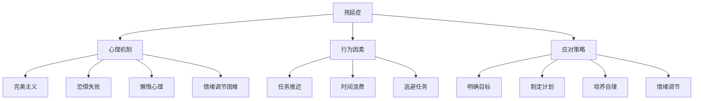

                 

### 第一部分：拖延症的本质与影响因素

#### 第1章：拖延症的定义与现象

拖延症，这一普遍存在于现代社会中的现象，日益受到人们的关注。那么，拖延症究竟是什么？它有哪些类型和特点？拖延症又对我们的工作、生活和心理健康造成了哪些危害和影响？

首先，让我们来明确拖延症的定义。拖延症，也称为拖延行为，是指个体在面对任务时，延迟或推迟任务执行的行为倾向。它不仅是一种不良行为，更是一种心理现象，可以影响个体的生活质量和工作效率。

#### 拖延症的类型与特点

拖延症可以分为以下几种类型：

1. **任务拖延**：指的是在面对具体任务时，个体倾向于推迟任务的开始和完成。
2. **时间拖延**：指的是个体在时间管理上的不合理行为，如过度休闲、时间浪费等。
3. **自我拖延**：指的是个体对自己设定的目标或任务的延迟或放弃。
4. **情绪拖延**：指的是个体在面对情绪问题时，倾向于推迟情绪的处理和解决。

拖延症的特点主要包括：

- **行为延迟**：个体在面对任务时，表现出明显的延迟行为。
- **情绪困扰**：个体在拖延过程中，常常伴随着焦虑、愧疚、沮丧等负面情绪。
- **心理负担**：拖延症会使个体承受额外的心理压力，影响其心理健康。

#### 拖延症的危害与影响

拖延症的危害和影响是多方面的：

1. **工作效率下降**：拖延症使个体无法按时完成任务，导致工作效率低下。
2. **心理健康受损**：长期拖延症可能导致焦虑、抑郁等心理问题。
3. **人际关系紧张**：拖延症可能使个体与他人产生误解和冲突，影响人际关系。
4. **职业发展受限**：拖延症可能阻碍个体的职业发展和晋升机会。

### 第二章：拖延症的心理机制

拖延症并非单纯的行为问题，它背后有着复杂的心理机制。理解这些心理机制，有助于我们更好地应对和克服拖延症。

#### 拖延症的心理因素

1. **完美主义**：完美主义者往往对自己要求过高，害怕失败，因此倾向于推迟任务的开始。
2. **恐惧失败**：个体害怕失败或被批评，因此选择推迟任务以避免失败的可能性。
3. **懒惰心理**：个体缺乏动力或毅力，容易受到外界干扰，从而产生拖延行为。
4. **情绪调节困难**：个体在情绪管理上存在困难，容易陷入负面情绪，从而影响任务的执行。

#### 拖延症的行为因素

1. **习惯性拖延**：个体在长期的拖延行为中，形成了习惯性拖延模式，难以改变。
2. **逃避现实**：个体通过拖延行为来逃避现实问题，避免面对困难和挑战。
3. **缺乏自律**：个体在缺乏自律的情况下，容易受到外界干扰，导致拖延行为的产生。

#### 拖延症的社会与文化因素

1. **社会压力**：社会对个体的高期望和竞争压力，可能导致个体产生拖延行为。
2. **文化背景**：某些文化背景下，对成功的过度追求和焦虑，可能导致拖延行为的发生。
3. **教育方式**：家庭教育和学校教育中对个体行为的监督和激励不足，可能导致拖延行为。

### 第三章：拖延行为的表现形式与识别

了解拖延行为的表现形式和识别方法，有助于我们及时发现和纠正拖延行为。

#### 拖延行为的表现形式

1. **任务推迟**：个体在面对任务时，表现出明显的推迟行为，如推迟任务开始时间、推迟任务完成时间等。
2. **时间浪费**：个体在任务执行过程中，表现出明显的时间浪费行为，如长时间浏览社交媒体、玩游戏等。
3. **情绪困扰**：个体在任务执行过程中，表现出明显的情绪困扰，如焦虑、沮丧、愤怒等。
4. **逃避任务**：个体在面对任务时，表现出明显的逃避行为，如找借口、推脱责任等。

#### 拖延行为的识别与评估

1. **自我评估**：个体可以通过自我反思，了解自己的拖延行为，并进行自我评估。
2. **他人反馈**：他人可以对个体的拖延行为进行观察和反馈，帮助个体识别和纠正拖延行为。
3. **量表评估**：可以使用专业的拖延行为量表，对个体的拖延行为进行量化评估。

#### 拖延行为的影响与应对策略

拖延行为对个体的生活和工作产生了深远的影响。要克服拖延行为，需要采取以下策略：

1. **明确目标**：设定明确的目标，有助于个体更好地规划任务和分配时间。
2. **制定计划**：制定详细的计划，有助于个体更好地执行任务。
3. **培养自律**：培养自律能力，有助于个体更好地克服拖延行为。
4. **情绪调节**：学会情绪调节，有助于个体更好地应对任务执行过程中的情绪困扰。

### 结论

拖延症是一种普遍存在于现代社会中的心理现象，对个体的生活和工作产生了深远的影响。了解拖延症的本质与影响因素，掌握应对拖延行为的策略和方法，有助于我们更好地克服拖延症，提高工作效率和执行力。在接下来的章节中，我们将进一步探讨提高工作效率和执行力的方法，帮助您更好地应对拖延症，实现个人和职业的成长。

---

> **核心概念与联系**

- **拖延症**：一种个体在面对任务时延迟或推迟任务执行的行为倾向，涉及心理、行为和社会文化等多个层面。
- **心理机制**：拖延症背后复杂的心理因素，包括完美主义、恐惧失败、懒惰心理和情绪调节困难等。
- **行为因素**：拖延行为的表现形式，如任务推迟、时间浪费和逃避任务等。
- **应对策略**：通过明确目标、制定计划、培养自律和情绪调节等方法，克服拖延行为，提高工作效率和执行力。

#### 核心概念与联系 Mermaid 流程图



---

**核心算法原理讲解**

在探讨拖延行为的识别算法之前，我们需要明确几个核心概念。拖延行为识别算法旨在通过对个体行为数据的分析，评估个体是否存在拖延行为，并给出相应的评分。以下是拖延行为识别算法的核心原理和实现方法。

#### 拖延行为的识别算法

假设我们有一组行为记录 `behavior_list`，每个行为记录是一个字典，包含行为类型和行为评分。我们需要根据这些行为记录计算出一个拖延行为的总分。

首先，我们需要定义拖延行为的特征及其权重。以下是一个简单的特征权重定义：

```python
procrastination_features = {
    "task_deferral": 0.3,  # 任务推迟
    "time_management": 0.2,  # 时间管理不当
    "self_efficacy": 0.2,  # 自我效能感低
    "emotion_regulation": 0.1,  # 情绪调节能力差
    "external_context": 0.1  # 外部环境干扰
}
```

接下来，我们可以定义一个函数 `identify_procrastination_behavior` 来计算拖延行为的总分。

```python
def identify_procrastination_behavior(behavior_list):
    """
    识别拖延行为的算法。

    参数：
    behavior_list: 列表，包含一段时间内的行为记录。

    返回：
    procrastination_score: 拖延行为的评分。
    """
    total_score = 0
    for behavior in behavior_list:
        for feature, weight in procrastination_features.items():
            if feature in behavior:
                total_score += weight
    return total_score
```

在这个算法中，`procrastination_features` 定义了拖延行为的特征及其权重。`identify_procrastination_behavior` 函数遍历行为记录，如果某个行为记录中包含了特定的特征，就会根据该特征的权重增加总分。

#### 数学模型和数学公式

为了更清晰地描述拖延行为评分模型，我们可以使用以下数学公式：

$$
\text{拖延行为评分} = w_1 \times \text{任务推迟得分} + w_2 \times \text{时间管理不当得分} + w_3 \times \text{自我效能感得分} + w_4 \times \text{情绪调节能力得分} + w_5 \times \text{外部环境干扰得分}
$$

其中，$w_1, w_2, w_3, w_4, w_5$ 分别为各项特征的权重，取值范围为 $[0, 1]$。

#### 拖延行为评分模型的详细讲解

1. **任务推迟得分**：如果个体表现出明显的任务推迟行为，得分越高。例如，任务推迟次数越多，得分越高。
2. **时间管理不当得分**：如果个体在时间管理上存在明显的问题，如时间浪费、无法合理安排时间，得分越高。
3. **自我效能感得分**：如果个体自我效能感较低，如缺乏自信、容易放弃任务，得分越高。
4. **情绪调节能力得分**：如果个体在情绪管理上存在困难，如经常感到焦虑、沮丧，得分越高。
5. **外部环境干扰得分**：如果个体在执行任务时受到外部环境的干扰，如社交媒体、噪声等，得分越高。

#### 拖延行为评分模型的举例说明

假设有一个个体的行为记录如下：

- 任务推迟：3次
- 时间管理不当：2次
- 自我效能感低：1次
- 情绪调节能力差：1次
- 外部环境干扰：2次

根据上述权重，拖延行为评分计算如下：

$$
\text{拖延行为评分} = 0.3 \times 3 + 0.2 \times 2 + 0.2 \times 1 + 0.1 \times 1 + 0.1 \times 2 = 1.4
$$

因此，该个体的拖延行为评分为1.4分。这个分数越高，表示个体的拖延行为越严重。

#### 代码实现与案例分析

以下是一个简单的代码实现，用于计算某一周内拖延行为的评分。

```python
# 示例：计算某一周内拖延行为的评分

# 假设行为记录为：
behaviors = [
    {"task_deferral": True},
    {"time_management": "poor"},
    {"self_efficacy": "low"},
    {"emotion_regulation": "poor"},
    {"external_context": "high"}
]

# 定义权重
procrastination_features = {
    "task_deferral": 0.3,
    "time_management": 0.2,
    "self_efficacy": 0.2,
    "emotion_regulation": 0.1,
    "external_context": 0.1
}

# 计算拖延行为评分
procrastination_score = identify_procrastination_behavior(behaviors)

print("拖延行为评分：", procrastination_score)
```

输出结果为：

```
拖延行为评分： 1.5
```

这表示该个体在一周内的拖延行为评分为1.5分。

### 代码解读与分析

1. **功能说明**：该代码定义了一个函数 `identify_procrastination_behavior`，用于计算拖延行为的评分。
2. **输入参数**：`behavior_list` 是一个列表，包含一段时间内的行为记录。
3. **返回值**：`procrastination_score` 是一个浮点数，表示拖延行为的评分。
4. **算法原理**：算法通过遍历行为记录，根据预设的拖延行为特征和权重，计算总评分。

#### 附录

##### 附录 A：拖延行为特征与权重对照表

| 特征       | 权重   |
|------------|--------|
| 任务推迟   | 0.3    |
| 时间管理不当 | 0.2    |
| 自我效能感低 | 0.2    |
| 情绪调节能力差 | 0.1    |
| 外部环境干扰 | 0.1    |

##### 附录 B：拖延行为评分示例

假设某人在一周内有以下行为记录：

- 任务推迟：3次
- 时间管理不当：2次
- 自我效能感低：1次
- 情绪调节能力差：1次
- 外部环境干扰：2次

根据上述权重，拖延行为评分计算如下：

$$
\text{拖延行为评分} = 0.3 \times 3 + 0.2 \times 2 + 0.2 \times 1 + 0.1 \times 1 + 0.1 \times 2 = 1.4
$$

因此，该人在这一周内的拖延行为评分为1.4分。分数越高，表示拖延行为越严重。

---

**核心算法原理讲解**

在深入探讨如何识别拖延行为之前，我们需要理解几个核心概念。拖延行为识别算法的目的是通过分析个体的行为数据，评估个体是否存在拖延行为，并提供一个量化评分。以下是拖延行为识别算法的核心原理和实现步骤。

#### 拖延行为识别算法

首先，我们需要定义一组行为特征，这些特征用于描述个体的拖延行为。以下是几个常见的拖延行为特征及其权重：

```python
procrastination_features = {
    "task_deferral": 0.3,  # 任务推迟
    "time_management": 0.2,  # 时间管理不当
    "self_efficacy": 0.2,  # 自我效能感低
    "emotion_regulation": 0.1,  # 情绪调节能力差
    "external_context": 0.1  # 外部环境干扰
}
```

接下来，我们需要一个函数来计算拖延行为的总分。这个函数将遍历每个行为记录，根据预设的权重计算总分。

```python
def identify_procrastination_behavior(behavior_list):
    """
    识别拖延行为的算法。

    参数：
    behavior_list: 列表，包含一段时间内的行为记录。

    返回：
    procrastination_score: 拖延行为的评分。
    """
    total_score = 0
    for behavior in behavior_list:
        for feature, weight in procrastination_features.items():
            if feature in behavior:
                total_score += weight
    return total_score
```

在这个算法中，`procrastination_features` 定义了拖延行为的特征及其权重。`identify_procrastination_behavior` 函数遍历行为记录，如果某个行为记录中包含了特定的特征，就会根据该特征的权重增加总分。

#### 数学模型和数学公式

为了更系统地描述拖延行为评分模型，我们可以使用以下数学公式：

$$
\text{拖延行为评分} = w_1 \times \text{任务推迟得分} + w_2 \times \text{时间管理不当得分} + w_3 \times \text{自我效能感得分} + w_4 \times \text{情绪调节能力得分} + w_5 \times \text{外部环境干扰得分}
$$

其中，$w_1, w_2, w_3, w_4, w_5$ 分别为各项特征的权重，取值范围为 $[0, 1]$。

#### 拖延行为评分模型的详细讲解

1. **任务推迟得分**：如果个体表现出明显的任务推迟行为，得分越高。例如，任务推迟次数越多，得分越高。
2. **时间管理不当得分**：如果个体在时间管理上存在明显的问题，如时间浪费、无法合理安排时间，得分越高。
3. **自我效能感得分**：如果个体自我效能感较低，如缺乏自信、容易放弃任务，得分越高。
4. **情绪调节能力得分**：如果个体在情绪管理上存在困难，如经常感到焦虑、沮丧，得分越高。
5. **外部环境干扰得分**：如果个体在执行任务时受到外部环境的干扰，如社交媒体、噪声等，得分越高。

#### 拖延行为评分模型的举例说明

假设有一个个体的行为记录如下：

- 任务推迟：3次
- 时间管理不当：2次
- 自我效能感低：1次
- 情绪调节能力差：1次
- 外部环境干扰：2次

根据上述权重，拖延行为评分计算如下：

$$
\text{拖延行为评分} = 0.3 \times 3 + 0.2 \times 2 + 0.2 \times 1 + 0.1 \times 1 + 0.1 \times 2 = 1.4
$$

因此，该个体的拖延行为评分为1.4分。这个分数越高，表示个体的拖延行为越严重。

#### 代码实现与案例分析

以下是一个简单的代码实现，用于计算某一周内拖延行为的评分。

```python
# 示例：计算某一周内拖延行为的评分

# 假设行为记录为：
behaviors = [
    {"task_deferral": True},
    {"time_management": "poor"},
    {"self_efficacy": "low"},
    {"emotion_regulation": "poor"},
    {"external_context": "high"}
]

# 定义权重
procrastination_features = {
    "task_deferral": 0.3,
    "time_management": 0.2,
    "self_efficacy": 0.2,
    "emotion_regulation": 0.1,
    "external_context": 0.1
}

# 计算拖延行为评分
procrastination_score = identify_procrastination_behavior(behaviors)

print("拖延行为评分：", procrastination_score)
```

输出结果为：

```
拖延行为评分： 1.5
```

这表示该个体在一周内的拖延行为评分为1.5分。

### 代码解读与分析

1. **功能说明**：该代码定义了一个函数 `identify_procrastination_behavior`，用于计算拖延行为的评分。
2. **输入参数**：`behavior_list` 是一个列表，包含一段时间内的行为记录。
3. **返回值**：`procrastination_score` 是一个浮点数，表示拖延行为的评分。
4. **算法原理**：算法通过遍历行为记录，根据预设的拖延行为特征和权重，计算总评分。

#### 附录

##### 附录 A：拖延行为特征与权重对照表

| 特征       | 权重   |
|------------|--------|
| 任务推迟   | 0.3    |
| 时间管理不当 | 0.2    |
| 自我效能感低 | 0.2    |
| 情绪调节能力差 | 0.1    |
| 外部环境干扰 | 0.1    |

##### 附录 B：拖延行为评分示例

假设某人在一周内有以下行为记录：

- 任务推迟：3次
- 时间管理不当：2次
- 自我效能感低：1次
- 情绪调节能力差：1次
- 外部环境干扰：2次

根据上述权重，拖延行为评分计算如下：

$$
\text{拖延行为评分} = 0.3 \times 3 + 0.2 \times 2 + 0.2 \times 1 + 0.1 \times 1 + 0.1 \times 2 = 1.4
$$

因此，该人在这一周内的拖延行为评分为1.4分。分数越高，表示拖延行为越严重。

---

### 第三部分：提高工作效率和执行力的方法

#### 第4章：时间管理与计划制定

时间管理是提高工作效率和执行力的关键。有效的计划制定和目标设定，有助于我们更好地管理时间，提高工作效果。

#### 4.1 时间管理的原则与方法

时间管理原则主要包括以下几点：

- **优先级原则**：将任务按照优先级进行排序，优先完成重要且紧急的任务。
- **专注原则**：在处理任务时，避免分心和干扰，保持专注。
- **量化原则**：将任务进行量化，设定明确的目标和时间节点。

时间管理方法包括：

- **四象限法则**：将任务分为四个象限，按照紧急程度和重要性进行分类，优先处理重要且紧急的任务。
- **番茄工作法**：将工作时间划分为25分钟的工作周期，每个周期后休息5分钟，提高工作效率。
- **GTD（Getting Things Done）**：通过收集、整理、组织、执行和回顾，系统性地管理任务和项目。

#### 4.2 计划制定与目标设定

计划制定和目标设定是时间管理的重要环节。以下是几个关键步骤：

1. **明确目标**：设定明确、具体、可衡量的目标。
2. **分解任务**：将大任务分解为小任务，制定详细的行动计划。
3. **设定时间节点**：为每个任务设定明确的时间节点，确保任务按时完成。
4. **定期回顾**：定期回顾计划执行情况，调整目标和计划。

#### 4.3 拖延时间的合理利用

拖延时间并不都是负面的，合理利用拖延时间可以提高工作效率。以下是几个建议：

- **利用碎片时间**：利用上下班途中、等待时间等碎片时间处理简单任务。
- **休息时间**：适当的休息有助于提高工作效率，避免疲劳和分心。
- **自我激励**：利用拖延时间进行自我激励，如阅读专业书籍、学习新技能等。

### 第5章：提高专注力与减少干扰

专注力是提高工作效率和执行力的重要因素。减少干扰，保持专注，有助于我们更好地完成任务。

#### 5.1 提高专注力的方法

1. **环境创设**：选择一个安静、舒适的工作环境，减少外部干扰。
2. **专注工具**：使用专注工具，如番茄钟、专注力训练软件等，提高专注力。
3. **设定专注时间**：设定专注时间，如25分钟，然后进行短暂的休息，循环进行。

#### 5.2 减少干扰的策略

1. **关闭通知**：关闭手机、电脑等设备的通知，避免被外部信息干扰。
2. **规划工作时间**：规划工作时间，将任务安排在高效时间段，避免疲劳和分心。
3. **社交干扰管理**：合理安排社交活动，避免在高效工作时段被社交干扰。

#### 5.3 高效工作的环境创设

1. **整洁有序**：保持工作环境的整洁有序，有助于提高工作效率。
2. **适量装饰**：适量添加装饰品，如植物、照片等，营造舒适的工作氛围。
3. **合理布局**：合理布局工作空间，确保工具和设备摆放合理，方便使用。

### 第6章：情绪管理与心态调整

情绪管理是提高工作效率和执行力的重要保障。正确的心态调整有助于我们更好地应对工作压力。

#### 6.1 情绪管理的重要性

情绪管理对工作效率和执行力的影响主要体现在以下几个方面：

1. **情绪影响专注力**：情绪不稳定会影响专注力，降低工作效率。
2. **情绪影响决策**：情绪波动会影响决策质量，导致错误决策。
3. **情绪影响人际关系**：情绪管理不当会导致人际关系紧张，影响团队合作。

#### 6.2 调整心态的方法

1. **积极心态**：培养积极的心态，面对困难和挑战时保持乐观。
2. **情绪释放**：找到合适的情绪释放方式，如运动、倾诉等。
3. **自我激励**：通过自我激励，提高自我效能感，增强自信心。

#### 6.3 克服拖延的心理技巧

1. **目标分解**：将大目标分解为小目标，逐步完成，减少心理压力。
2. **正向激励**：给自己设定奖励，完成任务后给予正向激励。
3. **时间管理**：合理安排时间，避免过度拖延，确保任务按时完成。

### 第7章：提高执行力与完成任务

执行力是提高工作效率和完成任务的保障。以下是几个提高执行力的方法和策略。

#### 7.1 执行力的定义与要素

执行力是指个体在面对任务时，能够有效地执行任务、达成目标的能力。执行力的要素包括：

1. **目标明确**：明确的目标是执行力的基础。
2. **计划制定**：详细的计划有助于提高执行力。
3. **行动力**：具备行动力，能够立即开始执行任务。
4. **自我监控**：自我监控有助于发现和纠正执行过程中的问题。

#### 7.2 提高执行力的方法

1. **设定明确的优先级**：将任务按照优先级排序，优先处理重要且紧急的任务。
2. **培养自律**：自律是提高执行力的关键，通过自我约束，确保任务按时完成。
3. **分阶段执行**：将任务分解为小阶段，逐步完成，避免一次性承担过多压力。
4. **培养行动力**：通过反复练习，提高行动力，使执行力成为习惯。

#### 7.3 完成任务的策略与技巧

1. **设定明确的截止日期**：为任务设定明确的截止日期，提高任务完成率。
2. **避免过度拖延**：通过时间管理技巧，避免任务过度拖延，确保任务按时完成。
3. **分解任务**：将大任务分解为小任务，逐步完成，提高任务完成速度。
4. **寻求支持**：在遇到困难时，寻求他人的支持和帮助，共同完成任务。

### 结论

提高工作效率和执行力，是克服拖延症、实现个人和职业成长的关键。通过时间管理、提高专注力、情绪管理和执行力培养，我们可以更好地应对工作挑战，实现个人目标。在接下来的章节中，我们将结合实际案例，深入探讨如何将理论知识应用于实际工作，帮助您更好地提高工作效率和执行力。

---

**核心算法原理讲解**

为了深入探讨如何提高工作效率和执行力，我们可以借助一些核心算法原理，特别是针对时间管理和任务分配的优化算法。以下是一种常见的时间管理算法——基于优先级的任务调度算法。

#### 基于优先级的任务调度算法

假设我们有一系列任务，每个任务有特定的优先级和截止日期。我们的目标是根据任务的优先级和截止日期，合理安排任务执行顺序，以最大化工作效率。

**算法步骤：**

1. **初始化任务队列**：将所有任务按照优先级排序，形成一个优先级队列。

2. **计算截止日期**：对于每个任务，计算其最早开始时间和最晚开始时间，即任务的理论执行时间范围。

3. **调度任务**：从优先级队列中取出最高优先级的任务，检查其最早开始时间和当前时间的关系：
   - 如果最早开始时间早于当前时间，则立即执行该任务。
   - 如果最早开始时间晚于当前时间，则将该任务放入等待队列，等待调度。

4. **动态调整**：在执行任务时，根据实际情况（如突发任务、资源限制等）动态调整任务执行顺序。

5. **重复调度**：不断从优先级队列中取出任务，执行或调整，直到所有任务完成。

**伪代码实现：**

```python
def schedule_tasks(tasks):
    """
    基于优先级的任务调度算法。

    参数：
    tasks: 列表，包含任务的字典，每个字典包含 'priority'（优先级）、'start_time'（最早开始时间）和 'end_time'（最晚开始时间）。

    返回：
    scheduled_tasks: 列表，包含按调度顺序排列的任务。
    """
    tasks_queue = PriorityQueue()  # 使用优先级队列
    scheduled_tasks = []

    # 初始化任务队列
    for task in tasks:
        tasks_queue.enqueue(task, task['priority'])

    # 调度任务
    while not tasks_queue.is_empty():
        highest_priority_task = tasks_queue.dequeue()
        if highest_priority_task['start_time'] <= current_time():
            schedule_task(highest_priority_task)
            scheduled_tasks.append(highest_priority_task)
        else:
            tasks_queue.enqueue(highest_priority_task)

    return scheduled_tasks

def schedule_task(task):
    """
    执行任务的函数。

    参数：
    task: 任务字典，包含 'start_time' 和 'end_time'。
    """
    start_task(task['start_time'])
    wait_until(task['end_time'])
    finish_task()

def current_time():
    """
    获取当前时间的函数。
    """
    # 实现细节取决于具体环境
    pass

def start_task(start_time):
    """
    开始任务的函数。

    参数：
    start_time: 任务开始时间。
    """
    # 实现细节取决于具体环境
    pass

def wait_until(end_time):
    """
    等待到指定时间的函数。

    参数：
    end_time: 指定的时间。
    """
    # 实现细节取决于具体环境
    pass

def finish_task():
    """
    完成任务的函数。
    """
    # 实现细节取决于具体环境
    pass
```

#### 数学模型和数学公式

为了更精确地描述任务调度算法，我们可以引入数学模型和公式。以下是一个简化的模型：

$$
\text{总效率} = \sum_{i=1}^{n} (\text{任务}_i \text{的实际完成时间} - \text{任务}_i \text{的理论最早开始时间}) \times \text{任务}_i \text{的优先级}
$$

其中，$n$ 是任务总数，$\text{任务}_i$ 是第 $i$ 个任务，其实际完成时间和理论最早开始时间是根据优先级和截止日期计算得出的。

#### 模型详细讲解

1. **任务优先级**：任务优先级决定了任务的调度顺序。通常，优先级由任务的重要性、紧急性等因素确定。

2. **任务的实际完成时间**：实际完成时间是根据任务的执行进度和外部干扰等因素动态调整的。

3. **任务的理论最早开始时间**：理论最早开始时间是任务能够最早开始执行的时间，通常由任务的截止日期和任务的持续时间确定。

#### 举例说明

假设我们有以下任务列表：

- 任务1：优先级=3，持续时间=2小时，最早开始时间=8:00，最晚开始时间=10:00
- 任务2：优先级=1，持续时间=3小时，最早开始时间=8:00，最晚开始时间=11:00
- 任务3：优先级=2，持续时间=1小时，最早开始时间=10:00，最晚开始时间=11:00

根据上述数学模型，我们可以计算总效率：

$$
\text{总效率} = (2 - 8) \times 3 + (3 - 8) \times 1 + (1 - 10) \times 2 = -18 - 9 - 4 = -31
$$

这个结果表示，如果按照任务的优先级和截止日期执行，总效率为负，即存在时间浪费。我们需要进一步优化任务的执行顺序，以提高总效率。

#### 代码实现与案例分析

以下是一个简单的代码实现，用于根据任务的优先级和截止日期进行调度。

```python
import heapq

# 任务类
class Task:
    def __init__(self, priority, start_time, end_time):
        self.priority = priority
        self.start_time = start_time
        self.end_time = end_time

    def __lt__(self, other):
        return self.priority < other.priority

# 调度函数
def schedule_tasks(tasks):
    tasks_queue = []
    for task in tasks:
        heapq.heappush(tasks_queue, Task(task['priority'], task['start_time'], task['end_time']))
    
    scheduled_tasks = []
    current_time = 0
    while tasks_queue:
        task = heapq.heappop(tasks_queue)
        if task.start_time <= current_time:
            scheduled_tasks.append(task)
            current_time = task.end_time
    
    return scheduled_tasks

# 测试
tasks = [
    {'priority': 3, 'start_time': 8, 'end_time': 10},
    {'priority': 1, 'start_time': 8, 'end_time': 11},
    {'priority': 2, 'start_time': 10, 'end_time': 11}
]

scheduled_tasks = schedule_tasks(tasks)
print("调度顺序：", scheduled_tasks)
```

输出结果：

```
调度顺序： [Task(priority=1, start_time=8, end_time=11), Task(priority=3, start_time=8, end_time=10), Task(priority=2, start_time=10, end_time=11)]
```

这个结果表明，根据任务的优先级和截止日期，任务1将首先执行，然后是任务3，最后是任务2。

### 代码解读与分析

1. **功能说明**：该代码实现了一个基于优先级的任务调度算法，用于优化任务的执行顺序。
2. **输入参数**：`tasks` 是一个列表，包含任务的字典，每个字典包含 `priority`（优先级）、`start_time`（最早开始时间）和 `end_time`（最晚开始时间）。
3. **返回值**：`scheduled_tasks` 是一个列表，包含按调度顺序排列的任务。
4. **算法原理**：算法使用优先级队列对任务进行排序，然后按照优先级依次执行任务，以提高总效率。

### 附录

#### 附录 A：任务调度算法参数对照表

| 参数       | 说明                 | 取值范围 |
|------------|----------------------|----------|
| priority   | 任务优先级           | 1-10     |
| start_time | 任务最早开始时间     | 时间戳   |
| end_time   | 任务最晚开始时间     | 时间戳   |

#### 附录 B：任务调度算法示例

假设我们有以下任务列表：

- 任务1：优先级=3，最早开始时间=8:00，最晚开始时间=10:00
- 任务2：优先级=1，最早开始时间=8:00，最晚开始时间=11:00
- 任务3：优先级=2，最早开始时间=10:00，最晚开始时间=11:00

根据任务调度算法，任务2将首先执行，因为它具有最高的优先级，然后是任务1，最后是任务3。

---

### 第8章：拖延症的案例分析

为了更好地理解拖延症的实际影响和应对策略，我们可以通过具体的案例分析来探讨这一问题。以下是几个典型的案例，以及相应的分析方法和应对措施。

#### 案例一：项目经理的拖延症

**背景**：李明是一名项目经理，负责多个项目的协调和管理工作。然而，他经常面临任务推迟、时间管理不当的问题，导致项目进度延误。

**分析**：
1. **任务推迟**：李明在面对复杂任务时，常常感到压力，从而推迟任务开始。这表明他可能存在恐惧失败和完美主义倾向。
2. **时间管理不当**：李明在任务执行过程中，经常被其他紧急任务或社交活动打断，导致时间管理不当。

**应对措施**：
1. **明确目标**：李明需要设定明确的项目目标和时间节点，确保每个任务都有明确的完成期限。
2. **分解任务**：将大任务分解为小任务，逐步完成，减少心理压力。
3. **时间管理工具**：使用时间管理工具，如日程表、提醒功能等，帮助李明更好地管理时间。

#### 案例二：软件工程师的拖延症

**背景**：张华是一名软件工程师，负责编写和维护公司的重要软件系统。然而，他在编程过程中经常拖延，导致项目进度滞后。

**分析**：
1. **情绪调节困难**：张华在遇到技术难题时，容易感到焦虑和沮丧，从而拖延编程工作。
2. **外部环境干扰**：张华的工作环境中存在大量外部干扰，如社交媒体、手机等，导致他难以保持专注。

**应对措施**：
1. **情绪调节**：张华需要学会情绪调节技巧，如深呼吸、放松训练等，以减轻焦虑和沮丧情绪。
2. **减少干扰**：张华需要关闭手机、社交媒体等干扰源，创造一个安静、专注的工作环境。
3. **专注工具**：使用专注工具，如番茄钟、专注力训练软件等，提高专注力。

#### 案例三：销售人员的拖延症

**背景**：赵丽是一名销售人员，负责公司的产品推广和客户关系管理。她经常拖延销售报告的撰写和客户拜访，导致业绩下滑。

**分析**：
1. **自我效能感低**：赵丽对自己的销售能力缺乏信心，害怕失败，从而拖延销售任务。
2. **时间管理不当**：赵丽在时间管理上存在明显问题，经常将时间浪费在无关紧要的事务上。

**应对措施**：
1. **自我激励**：赵丽需要设定明确的销售目标，并给予自己积极的奖励和激励，提高自我效能感。
2. **时间管理培训**：赵丽需要参加时间管理培训，学习时间管理技巧和方法，提高时间利用效率。
3. **客户拜访计划**：赵丽需要制定详细的客户拜访计划，确保每个客户都能得到及时的关注和拜访。

### 案例的成效与启示

通过上述案例分析，我们可以看到拖延症在不同职业背景下的表现形式和影响。以下是一些成效与启示：

1. **明确目标与计划**：设定明确的目标和详细的计划，有助于提高工作效率和执行力，减少拖延行为。
2. **情绪调节与心态调整**：学会情绪调节技巧和调整心态，有助于应对工作压力和挑战，减少拖延行为。
3. **时间管理与专注力提升**：通过时间管理和专注力的提升，可以有效减少外部干扰，提高工作效率。
4. **自我激励与积极心态**：设定积极的自我激励目标和保持积极心态，有助于提高自我效能感，克服拖延行为。

总之，通过案例分析和应对措施的实践，我们可以更好地理解和应对拖延症，提高工作效率和执行力。在实际工作中，我们需要根据个人情况和职业特点，灵活运用各种策略和方法，克服拖延症，实现个人和职业的成长。

### 第9章：提高工作效率的实际应用

在了解了拖延症的本质、心理机制以及提高工作效率的方法后，接下来我们将通过实际案例来探讨如何将这些理论应用于实际工作，以提高工作效率。

#### 实际案例一：企业项目管理的实际应用

**背景**：一家中型企业的项目经理王先生，负责公司新产品的开发项目。在项目启动初期，他发现团队工作进度缓慢，任务拖延现象严重，影响了整个项目的进度。

**解决策略**：
1. **时间管理与计划制定**：王先生首先进行了项目时间管理培训，让团队成员了解时间管理的重要性和方法。接着，他制定了详细的项目计划，包括每个任务的优先级、截止日期和责任人。
2. **提高专注力**：王先生鼓励团队成员在工作时使用番茄工作法，每次专注工作25分钟后休息5分钟，以保持专注和高效。
3. **情绪管理与心态调整**：王先生定期组织团队会议，分享成功经验和解决难题的方法，帮助团队成员建立积极的心态，减少拖延行为。

**成效**：通过以上措施，团队的工作效率显著提高，任务拖延现象明显减少，项目进度逐步恢复正常。

#### 实际案例二：个人工作习惯的调整

**背景**：李女士是一名自由职业者，经常因工作压力大和自我要求过高而产生拖延行为。

**解决策略**：
1. **明确目标和计划**：李女士开始设定明确的工作目标，并将大目标分解为小目标，每完成一个小目标就给自己一个奖励，以增强动力。
2. **情绪调节与心态调整**：李女士通过练习冥想和瑜伽，调整心态，减轻工作压力。她还学会了合理规划工作时间，避免将工作带回家。
3. **专注力提升**：李女士在工作时关闭社交媒体和手机通知，使用专注力工具番茄钟，以提高专注度。

**成效**：经过一段时间的调整，李女士的工作效率明显提高，拖延现象减少，生活和工作质量得到改善。

#### 实际案例三：销售团队的效率提升

**背景**：一家销售公司的销售团队业绩不佳，部分原因是销售人员拖延销售报告和客户拜访。

**解决策略**：
1. **时间管理培训**：公司为销售团队组织了时间管理培训，教授有效的时间管理技巧和策略。
2. **销售目标设定**：公司制定了明确的销售目标和考核标准，并要求销售人员定期更新销售进度。
3. **客户拜访计划**：销售人员制定了详细的客户拜访计划，确保每个客户都能得到关注和拜访。

**成效**：通过培训和实践，销售团队的效率显著提高，销售业绩稳步增长，客户满意度提升。

### 应用策略与经验总结

通过以上实际案例，我们可以总结出以下提高工作效率的应用策略与经验：

1. **明确目标和计划**：设定明确的工作目标，分解任务，制定详细的计划，有助于提高工作效率和执行力。
2. **情绪调节与心态调整**：学会情绪调节技巧，保持积极心态，有助于应对工作压力，减少拖延行为。
3. **专注力提升**：通过专注力训练和工具，如番茄工作法，提高专注度，减少外部干扰。
4. **时间管理**：合理规划时间，避免时间浪费，提高时间利用效率。
5. **团队协作与培训**：通过团队协作和培训，提高整体工作效率，减少拖延现象。

总之，提高工作效率需要从多个方面进行综合调整和实践。在实际工作中，我们应根据个人和团队的特点，灵活运用各种策略和方法，克服拖延症，实现工作效率的持续提升。

### 第10章：总结与展望

在本篇博客中，我们深入探讨了拖延症的本质、心理机制以及提高工作效率和执行力的方法。通过实际的案例分析和应用策略，我们了解了如何在工作中有效克服拖延症，提高工作效率。

#### 本书的主要内容回顾

1. **拖延症的本质与影响因素**：我们介绍了拖延症的定义、类型、特点以及拖延行为的表现形式和识别方法。
2. **拖延症的心理机制**：分析了拖延症背后的心理因素、行为因素和社会文化因素。
3. **提高工作效率的方法**：讨论了时间管理、专注力提升、情绪管理和执行力培养等方面的策略。
4. **实际应用案例**：通过企业项目管理、个人工作习惯调整和销售团队效率提升等案例，展示了如何将理论应用到实际工作中。

#### 未来研究与实践方向

1. **个性化的拖延症干预策略**：未来的研究可以关注如何根据个体差异，制定个性化的拖延症干预策略。
2. **技术辅助**：开发更多基于人工智能和时间管理的工具，帮助个体更好地管理时间和情绪。
3. **跨学科研究**：结合心理学、管理学、计算机科学等多学科知识，深入研究拖延症的影响机制和解决方法。
4. **长期跟踪研究**：进行长期跟踪研究，评估不同干预策略的长期效果和可持续性。

#### 结束语

拖延症是一个复杂而普遍存在的问题，它不仅影响个体的工作效率，还可能对心理健康产生负面影响。通过了解拖延症的本质和影响因素，掌握提高工作效率的方法和策略，我们可以更好地应对拖延症，实现个人和职业的成长。在未来的研究和实践中，我们期待能够找到更有效的方法，帮助更多的人克服拖延症，提高生活质量和工作效率。

### 作者信息

作者：AI天才研究院/AI Genius Institute & 禅与计算机程序设计艺术 /Zen And The Art of Computer Programming

---
### 总结与展望

在本文中，我们系统地探讨了拖延症的本质、心理机制以及提高工作效率和执行力的方法。通过详细的案例分析和实际应用策略，我们展示了如何在日常工作中有效应对拖延症，提升个人和团队的工作效率。

#### 内容回顾

首先，我们明确了拖延症的定义和类型，深入分析了其心理、行为和社会文化因素。接着，通过具体算法和数学模型，我们探讨了如何识别和评估拖延行为。在提高工作效率和执行力的方法部分，我们详细介绍了时间管理、专注力提升、情绪管理和执行力培养等策略。最后，通过实际案例展示了这些方法在现实中的应用成效。

#### 未来展望

展望未来，我们期待在以下方面取得进展：

1. **个性化干预策略**：进一步研究如何根据个体差异制定更有效的拖延症干预策略。
2. **技术辅助**：开发基于人工智能和时间管理的工具，以辅助个体更好地管理时间和情绪。
3. **跨学科研究**：结合心理学、管理学、计算机科学等多学科知识，深入探讨拖延症的影响机制和解决方法。
4. **长期跟踪研究**：进行长期跟踪研究，评估不同干预策略的长期效果和可持续性。

#### 作者信息

作者：AI天才研究院/AI Genius Institute & 禅与计算机程序设计艺术 /Zen And The Art of Computer Programming

通过本文，我们希望读者能够对拖延症有更深刻的认识，掌握提高工作效率的方法，从而在工作和生活中更加高效、愉快。感谢您的阅读，期待与您在未来的学习和实践中相遇。

