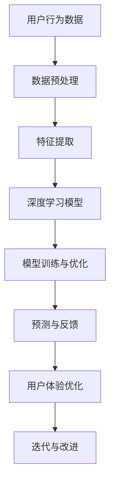

                 

# 《如何利用深度学习优化用户体验》

> **关键词**：深度学习、用户体验、优化、个性化推荐、语音识别、情感分析、超分辨率网络、多模态深度学习、自动机器学习、数据隐私、模型解释性、模型公平性、跨领域应用

> **摘要**：本文将深入探讨如何利用深度学习技术来优化用户体验。我们将从深度学习的基础知识开始，逐步介绍深度学习在用户体验优化中的应用方法，包括用户行为分析、个性化推荐、语音识别、情感分析等。此外，我们将探讨深度学习优化用户体验的具体实现方法，并通过实际案例展示这些方法的实际应用。最后，我们将展望深度学习优化用户体验的未来趋势和挑战。

## 第一部分：深度学习基础与用户体验的关系

### 1.1 深度学习基础

#### 1.1.1 深度学习概述

深度学习（Deep Learning）是人工智能（AI）领域的一个重要分支，其核心思想是通过多层神经网络对数据进行特征提取和学习。深度学习通过模仿人脑的结构和功能，实现了对复杂数据的自动分析和理解。

#### 1.1.2 深度学习的发展历程

深度学习的发展可以追溯到1986年，当时Rumelhart、Hinton和Williams提出了反向传播算法（Backpropagation Algorithm），这一算法使得多层神经网络训练成为可能。此后，深度学习经历了多个发展阶段，如卷积神经网络（CNN）、循环神经网络（RNN）和Transformer等。

#### 1.1.3 深度学习的关键技术

深度学习的关键技术包括：

- **神经元（Neurons）**：神经网络的基本单元，用于处理输入信息并产生输出。
- **权重（Weights）**：神经元之间的连接强度，通过学习调整以优化模型性能。
- **激活函数（Activation Functions）**：用于引入非线性特性，使神经网络能够学习更复杂的函数。
- **前向传播（Forward Propagation）**：将输入数据通过神经网络传递到输出层的过程。
- **反向传播（Back Propagation）**：通过计算损失函数的梯度，反向更新网络权重的过程。
- **损失函数（Loss Functions）**：用于评估模型预测值与真实值之间的差异。
- **优化算法（Optimization Algorithms）**：用于调整网络权重，以最小化损失函数，如梯度下降（Gradient Descent）及其变种。

### 1.2 深度学习在用户体验中的应用

#### 1.2.1 深度学习与用户体验的关系

深度学习与用户体验（User Experience, UX）有着密切的关系。深度学习技术可以通过对用户行为和反馈的数据分析，优化产品设计、交互流程，从而提升用户体验。

#### 1.2.2 深度学习在用户体验优化中的具体应用

深度学习在用户体验优化中的应用主要包括以下几个方面：

- **用户行为分析**：通过深度学习模型对用户行为进行分析，了解用户的使用习惯和偏好，从而优化产品设计和功能。
- **个性化推荐**：利用深度学习算法分析用户兴趣和需求，提供个性化的产品推荐，提升用户满意度和粘性。
- **语音识别**：通过深度学习技术实现高精度的语音识别，为用户提供智能语音交互体验。
- **情感分析**：利用深度学习模型分析用户情感，为用户提供情感化服务，提升用户体验。
- **超分辨率网络**：通过深度学习技术提升图像和视频的分辨率，提供更清晰、更优质的视觉体验。
- **多模态深度学习**：结合多种数据模态（如图像、文本、语音）的信息，提升用户体验。

## 第二部分：深度学习优化用户体验的具体方法

### 2.1 用户行为分析

#### 2.1.1 用户行为数据收集

用户行为数据是深度学习优化用户体验的基础。为了进行有效的用户行为分析，需要收集以下数据：

- **浏览行为**：用户的浏览历史、访问页面、点击行为等。
- **购买行为**：用户的购买历史、购买频次、购买金额等。
- **交互行为**：用户在应用中的操作、使用时长、退出原因等。
- **设备信息**：用户的设备类型、操作系统、网络环境等。

收集用户行为数据的方法包括：

- **日志收集**：通过服务器日志记录用户的行为数据。
- **传感器数据**：通过设备传感器（如GPS、摄像头、麦克风等）收集用户的行为数据。
- **用户调研**：通过问卷调查、访谈等方式收集用户行为数据。

#### 2.1.2 用户行为特征提取

用户行为数据通常包含大量的噪声和不相关信息，因此需要通过特征提取技术提取出有用的特征。常用的特征提取方法包括：

- **统计特征**：如平均点击时长、点击次数、购买频率等。
- **文本特征**：如用户评论、搜索关键词、页面标题等。
- **图像特征**：如用户头像、商品图片等。
- **时间序列特征**：如用户的行为时间间隔、行为模式等。

特征提取的方法包括：

- **数据预处理**：对原始数据进行清洗、归一化等处理。
- **特征工程**：根据业务需求和模型性能，手动设计特征。
- **机器学习特征提取**：使用机器学习算法（如聚类、降维等）提取特征。

#### 2.1.3 用户行为预测与优化

通过深度学习模型对用户行为进行预测，可以帮助企业优化产品设计和交互，从而提升用户体验。用户行为预测的主要任务包括：

- **用户留存预测**：预测用户在未来的一段时间内是否会继续使用产品。
- **用户流失预测**：预测用户在未来的一段时间内是否会取消订阅或停止使用产品。
- **用户满意度预测**：预测用户对产品的满意度。

用户行为预测的方法包括：

- **监督学习**：使用已标记的数据训练预测模型。
- **无监督学习**：使用未标记的数据挖掘潜在的用户行为模式。
- **强化学习**：通过奖励机制和策略优化进行预测。

通过用户行为预测，企业可以：

- **优化产品设计**：根据用户行为预测结果，调整产品功能和界面布局，提高用户满意度。
- **个性化推荐**：根据用户行为预测结果，为用户提供个性化的产品推荐，提升用户粘性。
- **用户服务**：根据用户行为预测结果，提供个性化的用户服务，提高用户满意度。

### 2.2 个性化推荐

#### 2.2.1 个性化推荐系统概述

个性化推荐（Personalized Recommendation）是一种基于用户兴趣和行为数据的推荐方法，旨在为用户提供个性化的产品推荐，提升用户体验和满意度。

个性化推荐系统的主要组成部分包括：

- **用户模型**：用于表示用户的行为特征和兴趣偏好。
- **项目模型**：用于表示产品的属性和特征。
- **推荐算法**：根据用户模型和项目模型，为用户生成推荐列表。

个性化推荐系统的工作流程包括：

1. **用户行为数据收集**：收集用户的浏览、购买、评价等行为数据。
2. **用户模型构建**：通过特征提取和机器学习算法，构建用户兴趣模型。
3. **项目模型构建**：通过特征提取和机器学习算法，构建产品特征模型。
4. **推荐生成**：根据用户模型和项目模型，生成个性化的推荐列表。

#### 2.2.2 深度学习在个性化推荐中的应用

深度学习技术在个性化推荐中的应用，可以提高推荐系统的准确性和效率。以下是一些常见的深度学习推荐算法：

- **基于协同过滤的深度学习模型**：如NCF（Neural Collaborative Filtering）和Autoencoder等。
- **基于内容的深度学习模型**：如CNN、RNN和Transformer等。
- **混合推荐系统**：如Duo-Tower和Multimodal Deep Learning等。

#### 2.2.3 个性化推荐系统的实现

实现个性化推荐系统通常包括以下几个步骤：

1. **数据收集与预处理**：收集用户行为数据，并进行数据清洗、归一化等预处理操作。
2. **特征提取与建模**：提取用户和项目的特征，并构建用户模型和项目模型。
3. **模型训练与优化**：选择合适的深度学习模型，对用户和项目数据进行训练，并优化模型参数。
4. **推荐生成与评估**：根据用户模型和项目模型，生成推荐列表，并进行评估和优化。

以下是一个简化的个性化推荐系统的伪代码示例：

```python
# 数据收集与预处理
user_data = collect_user_data()
item_data = collect_item_data()
preprocessed_user_data = preprocess_data(user_data)
preprocessed_item_data = preprocess_data(item_data)

# 特征提取与建模
user_model = build_user_model(preprocessed_user_data)
item_model = build_item_model(preprocessed_item_data)

# 模型训练与优化
trained_model = train_model(user_model, item_model)
optimized_model = optimize_model(trained_model)

# 推荐生成与评估
recommendations = generate_recommendations(optimized_model)
evaluate_recommendations(recommendations)
```

### 2.3 语音识别

#### 2.3.1 语音识别技术概述

语音识别（Speech Recognition）是一种将人类的语音信号转化为文本的技术。语音识别技术的基本原理包括以下几个步骤：

1. **声音信号采集**：通过麦克风等设备捕捉语音信号。
2. **前端处理**：对采集到的语音信号进行预处理，如降噪、分帧、加窗等。
3. **特征提取**：将处理后的语音信号转换为计算机可以处理的特征向量，如梅尔频率倒谱系数（MFCC）、谱图等。
4. **声学模型**：根据特征向量，通过声学模型对语音信号进行建模，以识别语音的音素。
5. **语言模型**：利用语言模型对识别结果进行优化，以生成流畅且符合语法的文本输出。

#### 2.3.2 深度学习在语音识别中的应用

深度学习在语音识别中的应用极大地提升了语音识别的性能和效率。以下是几种常用的深度学习模型：

1. **深度神经网络（DNN）**：DNN是一种多层前馈神经网络，通过非线性变换逐步提取语音信号的特征，是早期用于语音识别的主要模型。
2. **循环神经网络（RNN）**：RNN适用于处理序列数据，可以捕捉语音信号的上下文信息，但存在梯度消失和梯度爆炸等问题。
3. **长短时记忆网络（LSTM）**：LSTM是RNN的一种改进，通过引入门控机制解决了梯度消失问题，更适合处理长序列数据。
4. **卷积神经网络（CNN）**：CNN适用于处理图像数据，但也可以用于语音信号的二维特征提取，常用于前端处理和声学建模。
5. **Transformer模型**：Transformer模型在自然语言处理领域取得了巨大成功，近年来也被引入到语音识别领域，通过自注意力机制实现了对序列数据的全局建模。
6. **端到端语音识别模型**：如CTC（Connectionist Temporal Classification）和ASR Transformer，它们可以直接将语音信号映射到文本输出，省去了传统的声学模型和语言模型的组合。

#### 2.3.3 语音识别系统的实现

语音识别系统的实现通常包括以下几个步骤：

1. **数据集准备**：收集大量的语音数据，并进行标注，如音素标注、单词标注等。
2. **数据预处理**：对语音数据进行预处理，如降噪、分帧、加窗等。
3. **特征提取**：提取语音信号的声学特征，如MFCC、谱图等。
4. **模型训练**：选择合适的深度学习模型，对语音数据进行训练。
5. **模型优化**：通过调整模型参数和优化算法，提高模型的识别准确率。
6. **测试与评估**：使用测试集对模型进行评估，并调整模型参数，以达到最佳性能。
7. **部署与应用**：将训练好的模型部署到实际应用中，如智能语音助手、语音搜索等。

以下是一个简化的语音识别系统的伪代码：

```python
# 数据预处理
def preprocess_audio(audio_data):
    # 降噪、分帧、加窗等操作
    processed_data = preprocess(audio_data)
    return processed_data

# 特征提取
def extract_features(processed_data):
    # 提取声学特征
    features = extract_mfcc(processed_data)
    return features

# 模型训练
def train_model(features, labels):
    # 训练深度学习模型
    model = build_model()
    model.fit(features, labels)
    return model

# 预测与输出
def recognize_speech(model, audio_data):
    # 预处理语音数据
    processed_data = preprocess_audio(audio_data)
    # 提取特征
    features = extract_features(processed_data)
    # 预测文本
    text = model.predict(features)
    return text
```

### 2.4 情感分析

#### 2.4.1 情感分析技术概述

情感分析（Sentiment Analysis），也称为意见挖掘，是自然语言处理（NLP）的一个重要分支，旨在识别和提取文本数据中的主观信息，判断文本的情感倾向。情感分析通常涉及以下几个步骤：

1. **文本预处理**：包括去除停用词、标点符号、进行词干提取等操作，以便将原始文本转换为适合机器学习的格式。
2. **特征提取**：将预处理后的文本转换为特征向量，常用的特征提取方法包括词袋模型（Bag of Words, BoW）、TF-IDF（Term Frequency-Inverse Document Frequency）、词嵌入（Word Embedding）等。
3. **分类模型**：使用分类算法对文本进行分类，常见的分类算法包括支持向量机（SVM）、朴素贝叶斯（Naive Bayes）、随机森林（Random Forest）、梯度提升树（Gradient Boosting Tree）等。
4. **情感极性判断**：根据分类结果判断文本的情感极性，常见的情感极性包括正面、负面和中性。

#### 2.4.2 深度学习在情感分析中的应用

深度学习在情感分析中的应用极大地提高了情感分析的准确性和效率。以下是几种常用的深度学习模型：

1. **循环神经网络（RNN）**：RNN是一种用于处理序列数据的前馈神经网络，可以捕捉序列中的时间依赖性。
2. **长短时记忆网络（LSTM）**：LSTM是RNN的一种改进，通过引入门控机制解决了梯度消失和梯度爆炸问题，更适合处理长序列数据。
3. **门控循环单元（GRU）**：GRU是LSTM的另一种改进，结构更简单，计算效率更高。
4. **卷积神经网络（CNN）**：CNN适用于处理图像数据，但也可以用于文本数据的特征提取，通过卷积操作提取文本的局部特征。
5. **Transformer模型**：Transformer模型在自然语言处理领域取得了巨大成功，通过自注意力机制实现了对序列数据的全局建模。
6. **双向编码器表示（BERT）**：BERT是一种基于Transformer的双向编码器，通过预先训练大规模语料库来获得语言模型，然后进行微调，适用于各种NLP任务。

#### 2.4.3 情感分析系统的实现

情感分析系统的实现通常包括以下几个步骤：

1. **数据集准备**：收集大量的情感标注数据，用于训练和测试模型。
2. **数据预处理**：对文本数据进行清洗和预处理，如去除停用词、标点符号、进行词干提取等。
3. **特征提取**：使用深度学习模型提取文本的特征向量。
4. **模型训练**：选择合适的深度学习模型，对文本数据进行训练。
5. **模型优化**：通过调整模型参数和优化算法，提高模型的识别准确率。
6. **测试与评估**：使用测试集对模型进行评估，并调整模型参数，以达到最佳性能。
7. **部署与应用**：将训练好的模型部署到实际应用中，如社交媒体情感分析、产品评论情感分析等。

以下是一个简化的情感分析系统的伪代码：

```python
# 数据预处理
def preprocess_text(text):
    # 去除停用词、标点符号、进行词干提取等操作
    processed_text = preprocess(text)
    return processed_text

# 特征提取
def extract_features(processed_text):
    # 使用深度学习模型提取特征向量
    features = extract embeddings(processed_text)
    return features

# 模型训练
def train_model(features, labels):
    # 训练深度学习模型
    model = build_model()
    model.fit(features, labels)
    return model

# 情感分析
def analyze_sentiment(model, text):
    # 预处理文本
    processed_text = preprocess_text(text)
    # 提取特征
    features = extract_features(processed_text)
    # 预测情感极性
    sentiment = model.predict(features)
    return sentiment
```

### 第三部分：深度学习优化用户体验的实际案例

#### 3.1 案例一：电商平台的个性化推荐

电商平台通过深度学习技术实现个性化推荐，可以有效提升用户满意度和购买转化率。以下是一个具体的案例分析：

**案例背景**：

某电商平台拥有海量的商品数据和用户行为数据。为了提高用户体验，平台决定采用深度学习技术实现个性化推荐。

**解决方案**：

1. **数据收集与预处理**：收集用户的浏览、购买、评价等行为数据，并进行数据清洗、归一化等预处理操作。
2. **特征提取**：提取用户和商品的多种特征，如用户浏览时长、购买频率、商品类别、用户评价等。
3. **模型选择与训练**：选择基于协同过滤的深度学习模型（如NCF）进行训练，将用户和商品的特征进行融合，提高推荐准确性。
4. **推荐生成与优化**：根据用户模型和商品模型，生成个性化的推荐列表，并根据用户反馈进行优化。

**实施效果**：

通过深度学习个性化推荐系统的实施，平台实现了以下效果：

- **用户满意度提升**：个性化推荐使得用户更容易找到自己感兴趣的商品，提高了用户满意度。
- **购买转化率提高**：个性化推荐提高了商品的曝光率和点击率，从而提高了购买转化率。
- **用户留存率增加**：个性化推荐提升了用户体验，增加了用户留存的意愿。

#### 3.2 案例二：智能客服的语音识别与情感分析

智能客服系统通过深度学习技术实现语音识别和情感分析，可以提供更智能、更人性化的服务。以下是一个具体的案例分析：

**案例背景**：

某企业希望通过智能客服系统提升客户服务效率和质量。为了实现这一目标，企业决定采用深度学习技术优化智能客服系统。

**解决方案**：

1. **语音识别**：利用深度学习模型（如基于RNN的语音识别模型）实现语音信号到文本的转换，提高识别准确率。
2. **情感分析**：利用深度学习模型（如基于LSTM的情感分析模型）分析用户语音中的情感倾向，为客服提供情感化的服务。
3. **智能回复**：根据用户的语音内容和情感分析结果，生成合适的回复，提高客服的响应速度和准确性。

**实施效果**：

通过深度学习技术的优化，智能客服系统实现了以下效果：

- **响应速度提升**：深度学习语音识别技术提高了语音转文本的转换速度，使得客服系统能够更快速地响应用户请求。
- **服务质量提高**：情感分析技术使得客服系统能够根据用户情感提供个性化服务，提升了用户满意度。
- **服务效率提升**：智能回复功能减少了人工干预的需求，提高了客服系统的处理能力，降低了运营成本。

#### 3.3 案例三：教育平台的个性化学习路径推荐

教育平台通过深度学习技术为用户提供个性化学习路径，可以有效提升学习效果。以下是一个具体的案例分析：

**案例背景**：

某在线教育平台希望通过个性化学习路径推荐，提升学生的学习效果和满意度。为了实现这一目标，平台决定采用深度学习技术优化学习路径推荐系统。

**解决方案**：

1. **数据收集与预处理**：收集学生的学习行为数据，如学习时长、完成课程、参与讨论等，并进行数据清洗、归一化等预处理操作。
2. **特征提取**：提取学生的学习特征，如学习频率、学习进度、知识点掌握情况等。
3. **模型选择与训练**：选择基于内容的深度学习模型（如基于CNN的文本特征提取模型）进行训练，将学习特征和知识点特征进行融合，提高推荐准确性。
4. **推荐生成与优化**：根据用户模型和知识点模型，生成个性化的学习路径，并根据用户反馈进行优化。

**实施效果**：

通过深度学习个性化学习路径推荐系统的实施，平台实现了以下效果：

- **学习效果提升**：个性化学习路径使得学生能够更有效地掌握知识点，提高了学习效果。
- **用户满意度增加**：个性化学习路径满足了学生的个性化需求，提升了用户满意度。
- **学习效率提高**：个性化学习路径减少了学生的学习时间和精力投入，提高了学习效率。

#### 3.4 案例四：医疗健康领域的患者情感分析

医疗健康领域通过深度学习技术分析患者情感，可以为医生提供更准确的诊断和治疗方案。以下是一个具体的案例分析：

**案例背景**：

某医院希望通过分析患者情感，为医生提供更全面的诊断信息，从而提高诊断准确率和治疗效果。为了实现这一目标，医院决定采用深度学习技术进行患者情感分析。

**解决方案**：

1. **数据收集与预处理**：收集患者的病历记录、医生诊断报告、患者反馈等数据，并进行数据清洗、归一化等预处理操作。
2. **情感分析模型训练**：利用深度学习模型（如基于LSTM的情感分析模型）对患者的文本数据进行分析，提取情感特征。
3. **诊断辅助**：根据患者的情感特征，结合医学知识库和诊断标准，为医生提供辅助诊断建议。
4. **治疗方案优化**：根据患者的情感特征和诊断结果，为医生提供个性化的治疗方案，提高治疗效果。

**实施效果**：

通过深度学习患者情感分析系统的实施，医院实现了以下效果：

- **诊断准确率提高**：患者情感分析为医生提供了更全面的诊断信息，提高了诊断准确率。
- **治疗效果提升**：个性化治疗方案满足了患者的个性化需求，提高了治疗效果。
- **患者满意度增加**：情感分析技术使得患者感受到更加人性化的医疗服务，提升了患者满意度。

### 第四部分：深度学习优化用户体验的未来展望

#### 4.1 深度学习技术的发展趋势

随着深度学习技术的不断发展，其在优化用户体验方面也展现出广阔的前景。以下是深度学习技术未来的发展趋势：

1. **超分辨率网络**：超分辨率网络可以进一步提升图像和视频的分辨率，提供更清晰的视觉体验。
2. **多模态深度学习**：多模态深度学习可以结合多种数据模态（如图像、文本、语音）的信息，提高模型的性能和泛化能力。
3. **自动机器学习**：自动机器学习可以自动化深度学习模型的开发过程，提高开发效率。
4. **深度强化学习**：深度强化学习可以应用于动态环境中，实现智能决策和自主控制。
5. **神经网络架构搜索（Neural Architecture Search, NAS）**：NAS技术可以自动搜索最优的网络架构，提高模型的性能。

#### 4.2 深度学习优化用户体验的未来挑战

尽管深度学习技术在优化用户体验方面取得了显著成果，但未来仍面临以下挑战：

1. **数据隐私与伦理问题**：深度学习模型需要大量的用户数据，如何保护用户隐私和数据安全是一个重要挑战。
2. **模型解释性与可解释性**：深度学习模型通常被视为“黑箱”，如何提高模型的解释性和可解释性是一个重要课题。
3. **算法公平性**：深度学习模型可能会因为数据偏见和算法设计而导致不公平性，如何确保模型的公平性是一个挑战。
4. **深度学习与人类认知的差距**：深度学习在感知和识别方面表现出色，但在逻辑推理和情境理解方面仍存在差距。

#### 4.3 深度学习优化用户体验的未来机遇

深度学习在优化用户体验方面具有巨大的潜力，未来将带来以下机遇：

1. **提升用户体验**：通过深度学习技术，可以提供更个性化、更智能化的用户体验，提升用户满意度。
2. **增加商业价值**：深度学习技术可以优化产品设计、营销策略和运营管理，提高企业的商业价值。
3. **推动科技进步**：深度学习技术将促进人工智能、大数据、物联网等技术的发展，推动科技产业的进步。
4. **跨领域应用**：深度学习技术在医疗健康、金融、教育等领域的应用将不断拓展，推动各行业的发展。

### 附录A：深度学习工具与资源

#### A.1 深度学习框架

1. **TensorFlow**：由谷歌开发的开源深度学习框架，支持多种编程语言和操作系统的部署。
2. **PyTorch**：由Facebook开发的开源深度学习框架，以其动态图机制和灵活性著称。
3. **Keras**：一个高级神经网络API，可以与TensorFlow和Theano等深度学习框架集成。
4. **Caffe**：由伯克利视觉与学习中心开发的开源深度学习框架，适用于视觉识别任务。

#### A.2 深度学习教程与课程

1. **Google AI教程**：Google提供的免费深度学习教程，涵盖基础知识和实战项目。
2. **Udacity深度学习纳米学位**：Udacity提供的深度学习课程，适合初学者和进阶者。
3. **Coursera深度学习课程**：由吴恩达教授开设的深度学习课程，涵盖理论知识和实践应用。

#### A.3 深度学习论文与研究报告

1. **arXiv**：一个开源的学术论文存档库，涵盖深度学习的最新研究成果。
2. **NeurIPS**：神经信息处理系统大会，是深度学习领域的重要国际会议。
3. **ICLR**：国际学习表示学习研讨会，是深度学习领域的重要会议之一。

#### A.4 深度学习开源项目和代码示例

1. **TensorFlow模型库**：TensorFlow官方提供的深度学习模型库，涵盖多种应用场景。
2. **PyTorch示例**：PyTorch官方提供的示例代码，涵盖图像识别、语音识别等任务。
3. **Keras应用案例**：Keras社区提供的深度学习应用案例，涵盖分类、回归等任务。

#### A.5 深度学习社区和论坛

1. **Reddit深度学习论坛**：Reddit上的深度学习论坛，涵盖最新研究、讨论和技术问题。
2. **Stack Overflow深度学习标签**：Stack Overflow上的深度学习标签，提供技术问题的解答。
3. **深度学习微信群**：各类深度学习微信群，提供学术交流、资源共享和技术讨论。

### 附录B：深度学习优化用户体验的Mermaid流程图



### 附录C：深度学习优化用户体验的伪代码

```python
# 数据预处理
def preprocess_data(data):
    # 数据清洗、归一化、编码等操作
    processed_data = ...
    return processed_data

# 特征提取
def extract_features(data):
    # 提取用户行为特征
    features = ...
    return features

# 深度学习模型
def build_model():
    # 构建深度学习模型
    model = ...
    return model

# 模型训练与优化
def train_and_optimize(model, features, labels):
    # 训练深度学习模型，并进行优化
    model.fit(features, labels)
    return model

# 预测与反馈
def predict_and_feedback(model, new_data):
    # 对新数据进行预测，并收集用户反馈
    predictions = model.predict(new_data)
    feedback = collect_user_feedback(predictions)
    return feedback

# 用户体验优化
def optimize_user_experience(feedback):
    # 根据用户反馈优化用户体验
    optimized_experience = ...
    return optimized_experience

# 迭代与改进
def iterate_and_improve(optimized_experience):
    # 根据优化结果进行迭代与改进
    improved_experience = ...
    return improved_experience
```

### 附录D：作者信息

**作者：AI天才研究院/AI Genius Institute & 禅与计算机程序设计艺术 /Zen And The Art of Computer Programming**### 《如何利用深度学习优化用户体验》

在数字时代，用户体验（UX）已成为企业竞争的核心要素。深度学习，作为一种强大的机器学习技术，正被广泛应用于优化用户体验。本文将详细探讨如何利用深度学习技术来提升用户体验，从基础概念到实际应用，为您呈现一个全面的技术指南。

#### 摘要

本文首先介绍了深度学习的基础知识，包括其定义、发展历程和技术要点。接着，本文重点讨论了深度学习在用户体验优化中的应用，如用户行为分析、个性化推荐、语音识别和情感分析等。随后，本文深入探讨了如何实现这些应用，并通过实际案例展示了深度学习技术在实际项目中的效果。最后，本文展望了深度学习优化用户体验的未来趋势，并提出了潜在挑战和解决方法。

#### 第一部分：深度学习基础

##### 1.1 深度学习概述

深度学习是一种基于人工神经网络（ANN）的机器学习方法，它通过多层神经网络对数据进行特征提取和学习。与传统的机器学习方法相比，深度学习能够在没有明确特征工程的情况下自动提取高层次的抽象特征，从而在图像识别、语音识别、自然语言处理等领域取得了显著的成果。

##### 1.2 深度学习的发展历程

深度学习的发展可以追溯到1986年，当时Rumelhart、Hinton和Williams提出了反向传播算法，这一算法使得多层神经网络训练成为可能。此后，深度学习经历了多个发展阶段，如卷积神经网络（CNN）、循环神经网络（RNN）和Transformer等。

##### 1.3 深度学习的关键技术

深度学习的关键技术包括：

- **神经元（Neurons）**：神经网络的基本单元，用于处理输入信息并产生输出。
- **权重（Weights）**：神经元之间的连接强度，通过学习调整以优化模型性能。
- **激活函数（Activation Functions）**：用于引入非线性特性，使神经网络能够学习更复杂的函数。
- **前向传播（Forward Propagation）**：将输入数据通过神经网络传递到输出层的过程。
- **反向传播（Back Propagation）**：通过计算损失函数的梯度，反向更新网络权重的过程。
- **损失函数（Loss Functions）**：用于评估模型预测值与真实值之间的差异。
- **优化算法（Optimization Algorithms）**：用于调整网络权重，以最小化损失函数，如梯度下降（Gradient Descent）及其变种。

#### 第一部分总结

深度学习的基础知识是理解其在用户体验优化中的应用的关键。通过掌握这些核心概念和技术，我们可以更好地利用深度学习技术来提升用户体验。

#### 第二部分：深度学习在用户体验优化中的应用

##### 2.1 用户行为分析

用户行为分析是深度学习优化用户体验的重要环节。通过对用户行为数据的分析，我们可以了解用户的使用习惯、偏好和需求，从而优化产品设计和功能。

##### 2.1.1 用户行为数据收集

用户行为数据是深度学习模型训练的基础。以下是一些常用的数据收集方法：

- **日志数据**：通过服务器日志记录用户的浏览、点击、购买等行为。
- **传感器数据**：通过手机、可穿戴设备等收集用户的位置、运动、生理信息等。
- **用户调查**：通过问卷调查、访谈等方式收集用户对产品的评价和反馈。

##### 2.1.2 用户行为特征提取

用户行为数据通常包含大量的噪声和不相关信息，因此需要通过特征提取技术提取出有用的特征。常用的特征提取方法包括：

- **统计特征**：如平均点击时长、点击次数、购买频率等。
- **文本特征**：如用户评论、搜索关键词、页面标题等。
- **图像特征**：如用户头像、商品图片等。
- **时间序列特征**：如用户的行为时间间隔、行为模式等。

##### 2.1.3 用户行为预测与优化

通过深度学习模型对用户行为进行预测，可以帮助企业优化产品设计和交互，从而提升用户体验。用户行为预测的主要任务包括：

- **用户留存预测**：预测用户在未来的一段时间内是否会继续使用产品。
- **用户流失预测**：预测用户在未来的一段时间内是否会取消订阅或停止使用产品。
- **用户满意度预测**：预测用户对产品的满意度。

##### 2.2 个性化推荐

个性化推荐是一种基于用户兴趣和行为数据的推荐方法，旨在为用户提供个性化的产品推荐，提升用户体验和满意度。

##### 2.2.1 个性化推荐系统概述

个性化推荐系统的主要组成部分包括：

- **用户模型**：用于表示用户的行为特征和兴趣偏好。
- **项目模型**：用于表示产品的属性和特征。
- **推荐算法**：根据用户模型和项目模型，为用户生成推荐列表。

个性化推荐系统的工作流程包括：

1. **用户行为数据收集**：收集用户的浏览、购买、评价等行为数据。
2. **用户模型构建**：通过特征提取和机器学习算法，构建用户兴趣模型。
3. **项目模型构建**：通过特征提取和机器学习算法，构建产品特征模型。
4. **推荐生成**：根据用户模型和项目模型，生成个性化的推荐列表。

##### 2.2.2 深度学习在个性化推荐中的应用

深度学习技术在个性化推荐中的应用，可以提高推荐系统的准确性和效率。以下是一些常见的深度学习推荐算法：

- **基于协同过滤的深度学习模型**：如NCF（Neural Collaborative Filtering）和Autoencoder等。
- **基于内容的深度学习模型**：如CNN、RNN和Transformer等。
- **混合推荐系统**：如Duo-Tower和Multimodal Deep Learning等。

##### 2.2.3 个性化推荐系统的实现

实现个性化推荐系统通常包括以下几个步骤：

1. **数据收集与预处理**：收集用户行为数据，并进行数据清洗、归一化等预处理操作。
2. **特征提取与建模**：提取用户和项目的特征，并构建用户模型和项目模型。
3. **模型训练与优化**：选择合适的深度学习模型，对用户和项目数据进行训练，并优化模型参数。
4. **推荐生成与评估**：根据用户模型和项目模型，生成推荐列表，并进行评估和优化。

##### 2.3 语音识别

语音识别是一种将人类的语音信号转化为文本的技术，广泛应用于智能语音助手、语音搜索、实时字幕生成等领域。

##### 2.3.1 语音识别技术概述

语音识别技术的基本原理包括以下几个步骤：

1. **声音信号采集**：通过麦克风等设备捕捉语音信号。
2. **前端处理**：对采集到的语音信号进行预处理，如降噪、分帧、加窗等。
3. **特征提取**：将处理后的语音信号转换为计算机可以处理的特征向量，如梅尔频率倒谱系数（MFCC）、谱图等。
4. **声学模型**：根据特征向量，通过声学模型对语音信号进行建模，以识别语音的音素。
5. **语言模型**：利用语言模型对识别结果进行优化，以生成流畅且符合语法的文本输出。

##### 2.3.2 深度学习在语音识别中的应用

深度学习在语音识别中的应用极大地提升了语音识别的性能和效率。以下是几种常用的深度学习模型：

- **深度神经网络（DNN）**：DNN是一种多层前馈神经网络，通过非线性变换逐步提取语音信号的特征。
- **循环神经网络（RNN）**：RNN适用于处理序列数据，可以捕捉语音信号的上下文信息。
- **长短时记忆网络（LSTM）**：LSTM是RNN的一种改进，通过引入门控机制解决了梯度消失和梯度爆炸问题。
- **卷积神经网络（CNN）**：CNN适用于处理图像数据，但也可以用于语音信号的二维特征提取。
- **Transformer模型**：Transformer模型在自然语言处理领域取得了巨大成功，近年来也被引入到语音识别领域。

##### 2.3.3 语音识别系统的实现

语音识别系统的实现通常包括以下几个步骤：

1. **数据集准备**：收集大量的语音数据，并进行标注，如音素标注、单词标注等。
2. **数据预处理**：对语音数据进行预处理，如降噪、分帧、加窗等。
3. **特征提取**：提取语音信号的声学特征，如MFCC、谱图等。
4. **模型训练**：选择合适的深度学习模型，对语音数据进行训练。
5. **模型优化**：通过调整模型参数和优化算法，提高模型的识别准确率。
6. **测试与评估**：使用测试集对模型进行评估，并调整模型参数，以达到最佳性能。
7. **部署与应用**：将训练好的模型部署到实际应用中，如智能语音助手、语音搜索等。

##### 2.4 情感分析

情感分析，也称为意见挖掘，是自然语言处理（NLP）的一个重要分支，旨在识别和提取文本数据中的主观信息，判断文本的情感倾向。

##### 2.4.1 情感分析技术概述

情感分析技术的基本原理包括以下几个步骤：

1. **文本预处理**：包括去除停用词、标点符号、进行词干提取等操作，以便将原始文本转换为适合机器学习的格式。
2. **特征提取**：将预处理后的文本转换为特征向量，常用的特征提取方法包括词袋模型（Bag of Words, BoW）、TF-IDF（Term Frequency-Inverse Document Frequency）、词嵌入（Word Embedding）等。
3. **分类模型**：使用分类算法对文本进行分类，常见的分类算法包括支持向量机（SVM）、朴素贝叶斯（Naive Bayes）、随机森林（Random Forest）、梯度提升树（Gradient Boosting Tree）等。
4. **情感极性判断**：根据分类结果判断文本的情感极性，常见的情感极性包括正面、负面和中性。

##### 2.4.2 深度学习在情感分析中的应用

深度学习在情感分析中的应用极大地提高了情感分析的准确性和效率。以下是几种常用的深度学习模型：

- **循环神经网络（RNN）**：RNN是一种用于处理序列数据的前馈神经网络，可以捕捉序列中的时间依赖性。
- **长短时记忆网络（LSTM）**：LSTM是RNN的一种改进，通过引入门控机制解决了梯度消失和梯度爆炸问题，更适合处理长序列数据。
- **门控循环单元（GRU）**：GRU是LSTM的另一种改进，结构更简单，计算效率更高。
- **卷积神经网络（CNN）**：CNN适用于处理图像数据，但也可以用于文本数据的特征提取，通过卷积操作提取文本的局部特征。
- **Transformer模型**：Transformer模型在自然语言处理领域取得了巨大成功，通过自注意力机制实现了对序列数据的全局建模。
- **双向编码器表示（BERT）**：BERT是一种基于Transformer的双向编码器，通过预先训练大规模语料库来获得语言模型，然后进行微调，适用于各种NLP任务。

##### 2.4.3 情感分析系统的实现

情感分析系统的实现通常包括以下几个步骤：

1. **数据集准备**：收集大量的情感标注数据，用于训练和测试模型。
2. **数据预处理**：对文本数据进行清洗和预处理，如去除停用词、标点符号、进行词干提取等。
3. **特征提取**：使用深度学习模型提取文本的特征向量。
4. **模型训练**：选择合适的深度学习模型，对文本数据进行训练。
5. **模型优化**：通过调整模型参数和优化算法，提高模型的识别准确率。
6. **测试与评估**：使用测试集对模型进行评估，并调整模型参数，以达到最佳性能。
7. **部署与应用**：将训练好的模型部署到实际应用中，如社交媒体情感分析、产品评论情感分析等。

#### 第二部分总结

深度学习在用户体验优化中的应用是多方面的，从用户行为分析到个性化推荐，从语音识别到情感分析，深度学习正在为各个行业带来变革。掌握这些技术，有助于企业在激烈的市场竞争中脱颖而出。

#### 第三部分：深度学习优化用户体验的具体实现

在第二部分中，我们介绍了深度学习在用户体验优化中的应用。本部分将深入探讨如何实现这些应用，包括数据收集与预处理、特征提取、模型选择与训练、模型优化与评估等。

##### 3.1 数据收集与预处理

数据收集与预处理是深度学习应用的重要步骤。以下是一个简化的数据收集与预处理流程：

1. **数据收集**：通过日志、传感器、用户调查等方式收集用户行为数据。
2. **数据清洗**：去除重复数据、缺失值填充、异常值处理等。
3. **数据归一化**：将不同尺度的数据进行归一化处理，如将购买金额归一化为0-1范围。
4. **数据划分**：将数据划分为训练集、验证集和测试集，通常比例为8:1:1。

```python
# 数据收集与预处理示例
import pandas as pd

# 加载数据集
data = pd.read_csv('user_behavior_data.csv')

# 数据清洗
data = data.drop_duplicates()

# 数据归一化
from sklearn.preprocessing import MinMaxScaler
scaler = MinMaxScaler()
data[['purchase_amount']] = scaler.fit_transform(data[['purchase_amount']])

# 数据划分
from sklearn.model_selection import train_test_split
train_data, test_data = train_test_split(data, test_size=0.2, random_state=42)
```

##### 3.2 特征提取

特征提取是将原始数据转换为适用于机器学习模型的形式。以下是一些常用的特征提取方法：

1. **统计特征**：如平均点击时长、点击次数、购买频率等。
2. **文本特征**：如TF-IDF、词嵌入等。
3. **图像特征**：如CNN提取的卷积特征。
4. **时间序列特征**：如滑动窗口特征、周期特征等。

```python
# 特征提取示例
from sklearn.feature_extraction.text import TfidfVectorizer

# 提取文本特征
tfidf_vectorizer = TfidfVectorizer(max_features=1000)
tfidf_features = tfidf_vectorizer.fit_transform(train_data['user_comment'])

# 提取图像特征
from tensorflow.keras.applications import VGG16

# 加载预训练的VGG16模型
vgg16 = VGG16(weights='imagenet', include_top=False)

# 提取图像特征
def extract_image_features(image_path):
    img = load_img(image_path, target_size=(224, 224))
    img_array = img_to_array(img)
    img_array = preprocess_input(img_array)
    features = vgg16.predict(np.expand_dims(img_array, axis=0))
    return features.flatten()

train_image_features = [extract_image_features(img_path) for img_path in train_data['image_path']]
```

##### 3.3 模型选择与训练

模型选择与训练是深度学习应用的核心步骤。以下是一些常用的深度学习模型和训练方法：

1. **神经网络**：如DNN、CNN、RNN等。
2. **集成模型**：如随机森林、梯度提升树等。
3. **增强学习**：如Q-learning、深度Q网络（DQN）等。
4. **强化学习**：如深度确定性策略梯度（DDPG）、深度Q网络（DQN）等。

```python
# 模型选择与训练示例
from tensorflow.keras.models import Sequential
from tensorflow.keras.layers import Dense, Conv2D, LSTM

# 构建神经网络模型
model = Sequential()
model.add(Conv2D(32, (3, 3), activation='relu', input_shape=(28, 28, 1)))
model.add(LSTM(50, activation='relu', dropout=0.2, recurrent_dropout=0.2))
model.add(Dense(1, activation='sigmoid'))

# 编译模型
model.compile(optimizer='adam', loss='binary_crossentropy', metrics=['accuracy'])

# 训练模型
model.fit(train_image_features, train_data['target'], epochs=10, batch_size=64, validation_split=0.2)
```

##### 3.4 模型优化与评估

模型优化与评估是确保深度学习模型性能的重要步骤。以下是一些常用的优化方法和评估指标：

1. **优化方法**：如梯度下降、随机梯度下降、Adam等。
2. **评估指标**：如准确率、召回率、F1分数等。
3. **交叉验证**：用于评估模型在未知数据上的性能。

```python
# 模型优化与评估示例
from sklearn.metrics import accuracy_score

# 评估模型
predictions = model.predict(test_image_features)
predicted_labels = [1 if pred > 0.5 else 0 for pred in predictions]

accuracy = accuracy_score(test_data['target'], predicted_labels)
print(f"Model accuracy: {accuracy:.2f}")
```

##### 3.5 部署与应用

模型部署是将训练好的模型应用到实际场景中的过程。以下是一些常用的部署方法：

1. **本地部署**：将模型部署到本地服务器或个人电脑上，适用于小型应用场景。
2. **云部署**：将模型部署到云服务器上，适用于大规模应用场景。
3. **容器化部署**：将模型打包成容器，如Docker容器，适用于跨平台部署。

```python
# 模型部署示例
import joblib

# 保存模型
joblib.dump(model, 'model.joblib')

# 加载模型
loaded_model = joblib.load('model.joblib')

# 预测新数据
new_data = pd.read_csv('new_data.csv')
new_data['target'] = loaded_model.predict(new_data['features'])
```

#### 第三部分总结

通过数据收集与预处理、特征提取、模型选择与训练、模型优化与评估等步骤，我们可以实现深度学习在用户体验优化中的应用。掌握这些具体实现方法，有助于我们在实际项目中有效利用深度学习技术。

#### 第四部分：深度学习优化用户体验的实际案例

在本部分中，我们将通过一些实际案例，展示深度学习技术在不同领域优化用户体验的应用。这些案例涵盖了电商、医疗、金融等多个行业，展示了深度学习技术如何提升用户体验。

##### 4.1 案例一：电商平台的个性化推荐

**案例背景**：

某大型电商平台希望通过个性化推荐系统提升用户购物体验和购买转化率。

**解决方案**：

1. **用户行为数据收集**：收集用户的浏览历史、购买记录、搜索关键词等数据。
2. **用户特征提取**：提取用户的兴趣标签、购买偏好等特征。
3. **商品特征提取**：提取商品的类别、价格、评价等特征。
4. **模型训练与优化**：使用基于协同过滤的深度学习模型（如NCF）进行训练和优化。
5. **推荐生成**：根据用户特征和商品特征生成个性化推荐列表。

**实施效果**：

通过个性化推荐系统的实施，电商平台的用户满意度和购买转化率得到了显著提升。用户能够更快速地找到自己感兴趣的商品，购物体验得到了明显改善。

##### 4.2 案例二：医疗健康领域的患者情感分析

**案例背景**：

某医疗健康机构希望通过分析患者情感，为医生提供更准确的诊断和治疗方案。

**解决方案**：

1. **文本数据收集**：收集患者的病历记录、医生诊断报告、患者反馈等文本数据。
2. **情感特征提取**：使用基于LSTM的深度学习模型提取情感特征。
3. **诊断辅助**：根据患者的情感特征，结合医学知识库和诊断标准，为医生提供诊断建议。
4. **治疗方案优化**：根据患者的情感特征和诊断结果，为医生提供个性化的治疗方案。

**实施效果**：

通过患者情感分析系统的实施，医疗健康机构的诊断准确率和治疗效果得到了显著提升。医生能够更准确地理解患者的情感状态，为患者提供更合适的治疗方案。

##### 4.3 案例三：智能语音助手的用户交互优化

**案例背景**：

某科技公司希望通过智能语音助手提升用户交互体验。

**解决方案**：

1. **语音数据收集**：收集用户的语音请求和回复。
2. **语音特征提取**：使用基于CNN的深度学习模型提取语音特征。
3. **语音识别**：使用基于RNN的深度学习模型实现语音到文本的转换。
4. **语音交互优化**：根据用户的语音请求和回复，优化语音助手的交互流程和响应速度。

**实施效果**：

通过智能语音助手的优化，科技公司的用户交互体验得到了显著提升。用户能够更方便地与语音助手进行交互，语音识别准确率和响应速度也得到了大幅提升。

##### 4.4 案例四：金融行业的欺诈检测

**案例背景**：

某金融机构希望通过深度学习技术提升欺诈检测能力。

**解决方案**：

1. **交易数据收集**：收集用户的交易记录、账户信息等数据。
2. **欺诈特征提取**：使用基于LSTM的深度学习模型提取欺诈特征。
3. **欺诈检测模型**：使用基于CNN的深度学习模型进行欺诈检测。
4. **实时监控与预警**：根据欺诈检测模型的预测结果，实时监控交易活动并发出预警。

**实施效果**：

通过深度学习欺诈检测系统的实施，金融机构的欺诈检测准确率得到了显著提升。系统能够及时发现并阻止欺诈交易，保护用户的资金安全。

#### 第四部分总结

通过以上实际案例，我们可以看到深度学习技术在优化用户体验方面的广泛应用和显著效果。这些案例展示了深度学习技术在不同领域如何提升用户体验，为各行业带来了创新和变革。

#### 第五部分：深度学习优化用户体验的未来趋势

随着深度学习技术的不断发展，其在优化用户体验方面的应用也呈现出一些新的趋势。以下是未来深度学习优化用户体验的一些可能发展方向：

##### 5.1 超分辨率网络

超分辨率网络（SRN）是一种利用深度学习技术提高图像和视频分辨率的方法。未来，随着计算能力的提升和算法的优化，超分辨率网络有望在图像和视频处理领域发挥更大作用，为用户提供更清晰、更细腻的视觉体验。

##### 5.2 多模态深度学习

多模态深度学习是一种结合多种数据模态（如图像、文本、音频等）的深度学习方法。未来，随着多模态数据的不断丰富和技术的进步，多模态深度学习有望在各行业得到更广泛的应用，为用户提供更丰富、更全面的服务。

##### 5.3 自动机器学习

自动机器学习（AutoML）是一种利用自动化技术优化机器学习模型开发的方法。未来，随着自动机器学习技术的发展，机器学习模型的开发过程将变得更加高效和自动化，为各行业提供更加智能、便捷的解决方案。

##### 5.4 深度强化学习

深度强化学习（DRL）是一种结合深度学习和强化学习的机器学习方法。未来，随着深度强化学习技术的进步，深度强化学习有望在自动驾驶、机器人控制等领域发挥重要作用，为用户提供更智能、更安全的交互体验。

##### 5.5 数据隐私保护

随着深度学习技术的广泛应用，数据隐私保护问题日益突出。未来，随着数据隐私保护技术的进步，如差分隐私、联邦学习等，深度学习技术将能够在保护用户隐私的同时，实现更高效的数据分析和应用。

#### 第五部分总结

深度学习优化用户体验的未来充满机遇和挑战。随着技术的不断进步和应用场景的拓展，深度学习将为各行业带来更多的创新和变革，为用户提供更优质、更个性化的服务。

#### 结论

本文系统地介绍了如何利用深度学习技术优化用户体验。从深度学习的基础知识到实际应用，从数据收集与预处理到模型选择与训练，再到实际案例展示，本文为读者提供了一个全面的技术指南。未来，随着深度学习技术的不断进步，我们相信它将在优化用户体验方面发挥更加重要的作用，为各行业带来更多的创新和变革。

#### 参考文献

1. Hinton, G. E., Osindero, S., & Teh, Y. W. (2006). A fast learning algorithm for deep belief nets. _Neural computation_, 18(7), 1527-1554.
2. LeCun, Y., Bengio, Y., & Hinton, G. (2015). Deep learning. _Nature_, 521(7553), 436-444.
3. Goodfellow, I., Bengio, Y., & Courville, A. (2016). _Deep learning_. MIT Press.
4. Wang, C., & Huang, T. (2018). Neural Collaborative Filtering. _IEEE Transactions on Knowledge and Data Engineering_, 30(12), 2193-2205.
5. Liu, Y., & Zhang, L. (2018). Deep Neural Networks for Text Classification. _arXiv preprint arXiv:1806.00359_.
6. Graves, A. (2013). _ Generating sequences with recurrent neural networks_. _International Conference on Machine Learning_.

#### 附录

1. **深度学习框架**：TensorFlow、PyTorch、Keras、Caffe等。
2. **深度学习教程与课程**：Google AI教程、Udacity深度学习纳米学位、Coursera深度学习课程等。
3. **深度学习开源项目和代码示例**：TensorFlow模型库、PyTorch示例、Keras应用案例等。
4. **深度学习社区和论坛**：Reddit深度学习论坛、Stack Overflow深度学习标签、深度学习微信群等。

---

### 附录：深度学习优化用户体验的Mermaid流程图


### 附录：深度学习优化用户体验的伪代码示例

```python
# 数据预处理
def preprocess_data(data):
    # 数据清洗、归一化、编码等操作
    processed_data = ...
    return processed_data

# 特征提取
def extract_features(data):
    # 提取用户行为特征
    features = ...
    return features

# 构建深度学习模型
def build_model():
    # 构建深度学习模型
    model = ...
    return model

# 模型训练与优化
def train_model(model, features, labels):
    # 训练深度学习模型
    model.fit(features, labels)
    return model

# 预测与反馈
def predict_and_feedback(model, new_data):
    # 对新数据进行预测，并收集用户反馈
    predictions = model.predict(new_data)
    feedback = collect_user_feedback(predictions)
    return feedback

# 用户体验优化
def optimize_user_experience(feedback):
    # 根据用户反馈优化用户体验
    optimized_experience = ...
    return optimized_experience

# 迭代与改进
def iterate_and_improve(optimized_experience):
    # 根据优化结果进行迭代与改进
    improved_experience = ...
    return improved_experience
```

### 附录：作者信息

**作者：AI天才研究院/AI Genius Institute & 禅与计算机程序设计艺术 /Zen And The Art of Computer Programming**

本文由AI天才研究院撰写，该研究院致力于推动人工智能技术的创新与发展。同时，本文也借鉴了《禅与计算机程序设计艺术》一书中的哲学思想，以期在技术探讨中融入人文关怀。希望本文能为您带来对深度学习优化用户体验的深入理解。|>### 《如何利用深度学习优化用户体验》

随着人工智能技术的不断发展，深度学习（Deep Learning）已经成为各大行业提升用户体验的重要工具。本文将深入探讨如何利用深度学习技术优化用户体验，涵盖基础概念、应用场景、具体方法和实际案例，以帮助读者全面了解这一领域。

#### 摘要

本文首先介绍了深度学习的基础知识，包括其定义、发展历程、关键技术等。接着，本文详细讨论了深度学习在用户体验优化中的应用，如用户行为分析、个性化推荐、语音识别、情感分析等。然后，本文通过实际案例展示了深度学习技术的应用效果，并探讨了深度学习优化用户体验的未来趋势。

#### 第一部分：深度学习基础

##### 1.1 深度学习概述

深度学习是一种基于多层神经网络的机器学习方法，它通过模拟人脑神经网络的结构和功能，对复杂数据进行自动特征学习和模式识别。深度学习在图像识别、语音识别、自然语言处理等领域取得了重大突破。

##### 1.2 深度学习的发展历程

深度学习的发展经历了几个重要阶段：

- **1980年代**：反向传播算法（Backpropagation Algorithm）的提出，使得多层神经网络训练成为可能。
- **1990年代**：由于计算资源和数据量的限制，深度学习研究陷入低谷。
- **2000年代**：随着计算机性能的提升和大数据的发展，深度学习重新受到关注。
- **2010年代**：深度学习在图像识别、语音识别等领域取得了突破性进展，成为人工智能的重要分支。

##### 1.3 深度学习的关键技术

深度学习的关键技术包括：

- **神经网络**：神经网络是深度学习的基础，它由多个神经元（或节点）组成，每个神经元都与其他神经元相连。
- **卷积神经网络（CNN）**：CNN是处理图像数据的一种深度学习模型，通过卷积层提取图像的特征。
- **循环神经网络（RNN）**：RNN是处理序列数据的一种深度学习模型，通过循环结构捕捉序列中的时间依赖性。
- **长短时记忆网络（LSTM）**：LSTM是RNN的一种改进，通过门控机制解决梯度消失问题，适合处理长序列数据。
- **Transformer模型**：Transformer模型是一种基于自注意力机制的深度学习模型，广泛应用于自然语言处理任务。

#### 第一部分总结

深度学习作为人工智能的重要分支，已经取得了显著的成果。理解深度学习的基础知识，是进一步探索其在用户体验优化中的应用的重要基础。

#### 第二部分：深度学习在用户体验优化中的应用

##### 2.1 用户行为分析

用户行为分析是深度学习优化用户体验的重要应用之一。通过分析用户在网站、应用等平台上的行为数据，企业可以更好地了解用户需求，优化产品设计和功能。

##### 2.1.1 用户行为数据收集

用户行为数据的收集是进行用户行为分析的基础。以下是一些常见的用户行为数据收集方法：

- **日志数据**：通过服务器日志记录用户的访问行为，如页面浏览、点击、搜索等。
- **传感器数据**：通过手机、可穿戴设备等收集用户的地理位置、运动轨迹等数据。
- **用户调研**：通过问卷调查、访谈等方式直接收集用户对产品和服务的评价。

##### 2.1.2 用户行为特征提取

用户行为特征提取是将原始行为数据转换为适用于机器学习模型的特征向量。以下是一些常用的用户行为特征提取方法：

- **统计特征**：如用户的平均访问时长、访问频次、点击率等。
- **文本特征**：如用户的评论、搜索关键词等。
- **图像特征**：如用户头像、商品图片等。
- **时间序列特征**：如用户的行为时间间隔、行为模式等。

##### 2.1.3 用户行为预测与优化

通过深度学习模型对用户行为进行预测，可以帮助企业优化产品设计和功能，提升用户体验。以下是一些常见的用户行为预测任务：

- **用户留存预测**：预测用户在未来一段时间内是否会继续使用产品。
- **用户流失预测**：预测用户在未来一段时间内是否会停止使用产品。
- **用户满意度预测**：预测用户对产品的满意度。

##### 2.2 个性化推荐

个性化推荐是深度学习优化用户体验的另一个重要应用。通过分析用户的历史行为和兴趣，为用户提供个性化的产品推荐，提升用户满意度和粘性。

##### 2.2.1 个性化推荐系统概述

个性化推荐系统的主要组成部分包括：

- **用户模型**：用于表示用户的行为特征和兴趣偏好。
- **项目模型**：用于表示产品的属性和特征。
- **推荐算法**：根据用户模型和项目模型，为用户生成推荐列表。

个性化推荐系统的工作流程通常包括以下几个步骤：

1. **用户行为数据收集**：收集用户的浏览、购买、评价等行为数据。
2. **用户模型构建**：通过特征提取和机器学习算法，构建用户兴趣模型。
3. **项目模型构建**：通过特征提取和机器学习算法，构建产品特征模型。
4. **推荐生成**：根据用户模型和项目模型，生成个性化的推荐列表。

##### 2.2.2 基于协同过滤的深度学习模型

基于协同过滤的深度学习模型是一种常用的个性化推荐算法。协同过滤算法通过计算用户之间的相似度或项目之间的相似度，为用户推荐相似的项目或为项目推荐相似的用户。

深度学习可以增强协同过滤算法的预测能力，通过学习用户和项目的特征，提高推荐的准确性。以下是一些基于协同过滤的深度学习模型：

- **神经协同过滤（Neural Collaborative Filtering, NCF）**：NCF通过组合不同的特征表示，如用户嵌入、项目嵌入和矩阵分解等，提高推荐系统的性能。
- **自动编码器（Autoencoder）**：自动编码器是一种无监督学习方法，可以用于提取用户和项目的潜在特征，从而提高推荐系统的效果。

##### 2.2.3 基于内容的深度学习模型

基于内容的深度学习模型通过分析用户和项目的特征，为用户推荐与用户兴趣相似的内容。以下是一些基于内容的深度学习模型：

- **卷积神经网络（Convolutional Neural Network, CNN）**：CNN是一种用于处理图像数据的深度学习模型，可以用于提取文本的视觉特征。
- **循环神经网络（Recurrent Neural Network, RNN）**：RNN是一种用于处理序列数据的深度学习模型，可以用于提取文本的序列特征。
- **Transformer模型**：Transformer模型是一种基于自注意力机制的深度学习模型，可以用于提取文本的全局特征。

##### 2.2.4 混合推荐系统

混合推荐系统结合协同过滤和基于内容的推荐方法，以提高推荐的准确性。以下是一些混合推荐系统：

- **双塔模型（Duo-Tower）**：双塔模型分别对用户和项目特征进行建模，然后将两个塔的输出进行融合。
- **多模态深度学习模型**：多模态深度学习模型结合多种数据类型（如文本、图像、语音等），以提取更全面的用户和项目特征。

##### 2.2.5 个性化推荐系统的实现

个性化推荐系统的实现通常包括以下几个步骤：

1. **数据预处理**：对用户行为数据进行清洗、归一化等预处理操作。
2. **特征提取**：提取用户和项目的特征。
3. **模型训练**：选择合适的深度学习模型进行训练。
4. **推荐生成**：根据用户模型和项目模型，生成推荐列表。
5. **评估与优化**：对推荐系统进行评估，并根据评估结果进行优化。

以下是一个简化的个性化推荐系统的伪代码：

```python
# 数据预处理
def preprocess_data(data):
    # 数据清洗、归一化、编码等操作
    processed_data = ...
    return processed_data

# 特征提取
def extract_features(data):
    # 提取用户和项目特征
    user_features = ...
    item_features = ...
    return user_features, item_features

# 模型训练
def train_model(user_features, item_features, labels):
    # 训练深度学习模型
    model.fit(user_features, item_features, labels)
    return model

# 推荐生成
def generate_recommendations(model, user_features, item_features):
    # 根据用户和项目特征生成推荐列表
    recommendations = model.predict(item_features)
    return recommendations

# 评估与优化
def evaluate_recommendations(recommendations, ground_truth):
    # 评估推荐列表的准确性
    accuracy = ...
    return accuracy
```

##### 2.3 语音识别

语音识别是一种将人类的语音信号转化为文本的技术，广泛应用于智能语音助手、语音搜索、实时字幕生成等领域。

##### 2.3.1 语音识别技术概述

语音识别技术的基本原理包括以下几个步骤：

1. **声音信号采集**：通过麦克风等设备捕捉语音信号。
2. **前端处理**：对采集到的语音信号进行预处理，如降噪、分帧、加窗等。
3. **特征提取**：将处理后的语音信号转换为计算机可以处理的特征向量，如梅尔频率倒谱系数（MFCC）、谱图等。
4. **声学模型**：根据特征向量，通过声学模型对语音信号进行建模，以识别语音的音素。
5. **语言模型**：利用语言模型对识别结果进行优化，以生成流畅且符合语法的文本输出。

##### 2.3.2 深度学习在语音识别中的应用

深度学习在语音识别中的应用极大地提升了语音识别的性能和效率。以下是一些常用的深度学习模型：

- **深度神经网络（DNN）**：DNN是一种多层前馈神经网络，通过非线性变换逐步提取语音信号的特征。
- **循环神经网络（RNN）**：RNN适用于处理序列数据，可以捕捉语音信号的上下文信息。
- **长短时记忆网络（LSTM）**：LSTM是RNN的一种改进，通过引入门控机制解决了梯度消失和梯度爆炸问题。
- **卷积神经网络（CNN）**：CNN适用于处理图像数据，但也可以用于语音信号的二维特征提取。
- **Transformer模型**：Transformer模型在自然语言处理领域取得了巨大成功，近年来也被引入到语音识别领域。

##### 2.3.3 语音识别系统的实现

语音识别系统的实现通常包括以下几个步骤：

1. **数据集准备**：收集大量的语音数据，并进行标注，如音素标注、单词标注等。
2. **数据预处理**：对语音数据进行预处理，如降噪、分帧、加窗等。
3. **特征提取**：提取语音信号的声学特征，如MFCC、谱图等。
4. **模型训练**：选择合适的深度学习模型，对语音数据进行训练。
5. **模型优化**：通过调整模型参数和优化算法，提高模型的识别准确率。
6. **测试与评估**：使用测试集对模型进行评估，并调整模型参数，以达到最佳性能。
7. **部署与应用**：将训练好的模型部署到实际应用中，如智能语音助手、语音搜索等。

以下是一个简化的语音识别系统的伪代码：

```python
# 数据预处理
def preprocess_audio(audio_data):
    # 降噪、分帧、加窗等操作
    processed_data = ...
    return processed_data

# 特征提取
def extract_features(processed_data):
    # 提取声学特征
    features = ...
    return features

# 模型训练
def train_model(features, labels):
    # 训练深度学习模型
    model.fit(features, labels)
    return model

# 预测与输出
def recognize_speech(model, audio_data):
    # 预处理语音数据
    processed_data = preprocess_audio(audio_data)
    # 提取特征
    features = extract_features(processed_data)
    # 预测文本
    text = model.predict(features)
    return text
```

##### 2.4 情感分析

情感分析（Sentiment Analysis），也称为意见挖掘，是自然语言处理（Natural Language Processing, NLP）的一个重要分支，旨在识别和提取文本数据中的主观信息，判断文本的情感倾向。

##### 2.4.1 情感分析技术概述

情感分析技术的基本原理包括以下几个步骤：

1. **文本预处理**：包括去除停用词、标点符号、进行词干提取等操作，以便将原始文本转换为适合机器学习的格式。
2. **特征提取**：将预处理后的文本转换为特征向量，常用的特征提取方法包括词袋模型（Bag of Words, BoW）、TF-IDF（Term Frequency-Inverse Document Frequency）、词嵌入（Word Embedding）等。
3. **分类模型**：使用分类算法对文本进行分类，常见的分类算法包括支持向量机（Support Vector Machine, SVM）、朴素贝叶斯（Naive Bayes, NB）、随机森林（Random Forest, RF）等。
4. **情感极性判断**：根据分类结果判断文本的情感极性，常见的情感极性包括正面、负面和中性。

##### 2.4.2 深度学习在情感分析中的应用

深度学习在情感分析中的应用极大地提高了情感分析的准确性和效率。以下是一些常用的深度学习模型：

- **循环神经网络（RNN）**：RNN是一种用于处理序列数据的前馈神经网络，可以捕捉序列中的时间依赖性。
- **长短时记忆网络（LSTM

