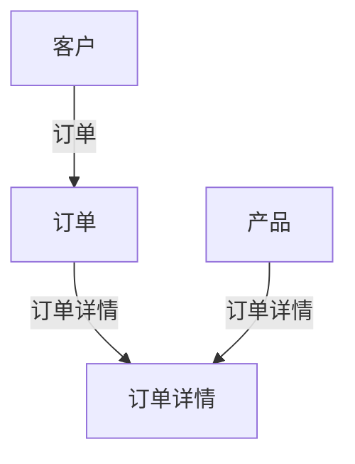

                 

### 引言

在现代商业环境中，客户数据库作为企业核心资产之一，其价值日益凸显。一个功能完善、设计合理、维护及时的客户数据库，不仅能够帮助企业更好地了解客户需求，提高客户满意度，还能为企业的战略决策提供有力的数据支持。本文旨在系统地阐述如何建立和维护客户数据库，包括其定义、重要性、发展历程、结构设计、数据收集与整合、数据分析与挖掘、数据库系统的搭建与部署、安全与隐私保护、运维与管理等多个方面。

客户数据库，顾名思义，是指专门用于存储和管理客户信息的数据集合。这些信息包括客户的个人资料、购买历史、交易行为、服务反馈等。客户数据库不仅仅是一个数据存储仓库，更是企业洞察客户需求、优化客户体验、提高营销效果的重要工具。在当今大数据时代，客户数据的价值日益被企业和学术界所重视。

### 客户数据库的定义与重要性

客户数据库的定义可以追溯到数据库技术的起源，它是一个结构化、存储和检索数据的系统。在商业领域，客户数据库通常指的是一个集成了多个数据源、涵盖了客户全生命周期信息的数据库系统。这些数据源可能包括内部系统（如ERP、CRM等）、外部数据（如社交媒体、市场调查等）。

客户数据库的重要性体现在以下几个方面：

1. **数据整合与集中管理**：客户数据库能够将来自不同渠道的客户数据整合到一个统一的平台上，实现数据的集中管理。这有助于企业全面了解客户需求和行为，提高决策效率。

2. **客户行为分析与预测**：通过对客户数据库中的数据进行分析，企业可以识别出潜在的客户价值、购买习惯、偏好等，从而制定更加精准的营销策略和客户服务计划。

3. **客户关系管理**：客户数据库为企业提供了一个与客户互动的渠道。通过分析客户数据，企业可以更好地理解客户需求，提供个性化的产品和服务，从而增强客户忠诚度和满意度。

4. **决策支持**：客户数据库中的数据为企业的战略决策提供了重要的参考依据。通过数据驱动的决策，企业可以更加精准地把握市场趋势，优化资源配置，提升整体竞争力。

### 客户数据库的发展历程

客户数据库的发展历程可以追溯到20世纪60年代，当时数据库技术刚刚起步。早期的数据库主要用于存储和检索简单的数据，如客户姓名、地址、电话等基本信息。随着计算机技术的不断发展，数据库技术也逐渐成熟，客户数据库的功能和结构也得到不断优化。

1. **关系数据库时代**：20世纪80年代，关系数据库成为主流。客户数据库采用了关系模型，通过表与表之间的关联来实现数据存储和检索。这一时期的客户数据库更加结构化、规范化，使得数据的存储和管理更加高效。

2. **数据仓库时代**：20世纪90年代，随着数据量的急剧增加，数据仓库技术应运而生。客户数据库不再仅仅存储结构化数据，还开始处理半结构化数据（如XML、JSON等）和非结构化数据（如图像、视频等）。数据仓库技术的引入，使得企业能够更好地利用海量数据进行深度分析。

3. **大数据与云计算时代**：进入21世纪，随着大数据和云计算技术的发展，客户数据库迎来了新的发展机遇。大数据技术使得企业能够处理和分析海量数据，挖掘出更多有价值的客户信息。云计算技术则为企业提供了弹性的计算资源，使得客户数据库的搭建和维护更加便捷、高效。

### 客户数据库在现代商业中的应用

在现代商业环境中，客户数据库的应用已经深入到企业的方方面面，具体体现在以下几个方面：

1. **营销策略优化**：通过对客户数据的分析，企业可以了解客户的购买习惯、偏好和需求，从而制定更加精准的营销策略。例如，根据客户的购买频率和金额，企业可以划分为高价值客户、中价值客户和低价值客户，并针对不同类型的客户制定差异化的营销活动。

2. **客户关系管理**：客户数据库为企业提供了一个与客户互动的渠道。企业可以通过数据库中的数据，对客户进行分类、标签管理，从而实现个性化沟通和精准服务。例如，当客户生日或重要节日来临时，企业可以通过数据库自动发送祝福信息或优惠券，增强客户忠诚度。

3. **产品开发与创新**：通过对客户数据的分析，企业可以了解客户对现有产品的满意度和需求，从而优化产品功能和性能。此外，客户数据库还可以帮助企业发现市场机会，开发新的产品和服务，满足客户多样化的需求。

4. **运营效率提升**：客户数据库为企业提供了一个统一的客户视图，使得各部门能够协同工作，提高运营效率。例如，销售部门可以实时查看客户的历史购买记录，为销售策略提供数据支持；客户服务部门可以快速响应客户问题，提供高效的解决方案。

5. **风险管理**：通过对客户数据的监控和分析，企业可以及时发现异常交易行为，防范潜在风险。例如，当客户购买金额异常增大或购买频率异常增多时，企业可以及时采取措施，防范欺诈风险。

总之，客户数据库已经成为现代商业环境中不可或缺的一部分。通过合理地建立和维护客户数据库，企业可以更好地了解客户需求，优化客户体验，提高营销效果，从而在激烈的市场竞争中脱颖而出。

### 客户数据库的结构设计

客户数据库的结构设计是建立和维护客户数据库的核心环节，直接关系到数据的存储效率、查询性能和扩展性。一个合理的设计不仅能满足当前的业务需求，还能为未来的扩展提供灵活性。下面，我们将从数据库设计基础、客户数据模型的设计和数据库性能优化三个方面，详细探讨客户数据库的结构设计。

#### 1. 数据库设计基础

数据库设计基础包括数据模型、表结构设计、索引设计等。

1. **数据模型**：数据模型是数据库设计的基础，常用的数据模型包括关系模型、文档模型、图形模型等。关系模型是当前最常用的数据模型，适用于结构化数据的存储和管理。文档模型和图形模型则适用于半结构化数据和非结构化数据的存储。

2. **表结构设计**：表结构设计是指设计数据库中的表及其字段。在设计表结构时，需要遵循以下原则：

   - **规范化**：将数据分解为多个表，减少冗余数据，提高数据的一致性和完整性。
   - **灵活性**：设计表结构时，要考虑到未来的扩展性，以便于添加新的字段或表。
   - **一致性**：确保数据的一致性，避免数据冲突和错误。

3. **索引设计**：索引是数据库中用于快速查询数据的数据结构。合理的设计索引可以大大提高查询效率。在设计索引时，需要考虑以下因素：

   - **索引列的选择**：选择能够提高查询效率的列作为索引。
   - **索引类型的选择**：常用的索引类型包括B树索引、哈希索引等，不同的索引类型适用于不同的查询场景。
   - **索引的维护**：定期维护索引，防止索引退化。

#### 2. 客户数据模型的设计

客户数据模型的设计是客户数据库结构设计的关键部分。一个合理的设计能够充分体现客户数据之间的关系，提高数据存储和查询的效率。

1. **实体-关系模型（E-R模型）**：实体-关系模型是设计客户数据模型常用的方法。它通过实体、属性和关系的概念来描述客户数据。例如，客户、订单、产品等可以被视为实体，而客户与订单、订单与产品等可以被视为关系。

2. **维度模型**：维度模型是数据仓库中常用的一种数据模型，它通过维度和事实表的组合来描述数据。在客户数据模型中，维度可以包括客户属性、时间属性、产品属性等，而事实表则记录客户的交易行为、购买金额等。

3. **实体关系设计**：在设计客户数据模型时，需要考虑客户数据之间的关联关系。例如，一个客户可以有多个订单，一个订单可以对应多个产品。这些关系需要在数据模型中予以体现，确保数据的完整性和一致性。

#### 3. 数据库性能优化

数据库性能优化是客户数据库结构设计的重要环节，它关系到客户数据库的查询效率、响应速度和数据处理的吞吐量。以下是几个常见的数据库性能优化方法：

1. **查询优化**：查询优化是指通过优化查询语句、索引设计等手段来提高查询效率。例如，使用适当的索引、避免使用SELECT *、优化join查询等。

2. **数据分区**：数据分区是将大量的数据分成多个小部分，分别存储在不同磁盘上，以提高查询效率。数据分区适用于数据量大、查询频繁的场景。

3. **缓存技术**：缓存技术是将经常访问的数据存储在内存中，以减少磁盘IO操作，提高查询效率。常用的缓存技术包括内存缓存、Redis缓存等。

4. **数据库集群**：数据库集群是将多个数据库实例组合在一起，以提供更高的并发处理能力和数据冗余。数据库集群适用于高并发、大数据量的场景。

5. **负载均衡**：负载均衡是将查询请求均匀地分配到多个数据库实例上，以提高整体查询效率。负载均衡适用于分布式数据库系统。

总之，客户数据库的结构设计是一个复杂的过程，需要综合考虑数据模型、表结构设计、索引设计、性能优化等多个方面。一个合理的设计不仅能满足当前的业务需求，还能为未来的扩展提供灵活性，从而确保客户数据库的高效运行。

#### 实例讲解：客户数据模型的设计

为了更好地理解客户数据模型的设计，我们以下通过一个实际案例进行讲解。

**案例：某电子商务平台的客户数据模型设计**

在这个案例中，我们将设计一个客户数据模型，用于存储和管理客户的个人信息、购买历史和产品信息。

**1. 实体与属性**

- **客户（Customer）**：存储客户的个人信息。
  - 客户ID（CustomerID，主键）
  - 姓名（Name）
  - 电子邮件（Email）
  - 电话（Phone）
  - 地址（Address）
  - 注册时间（RegistrationDate）

- **订单（Order）**：存储客户的订单信息。
  - 订单ID（OrderID，主键）
  - 客户ID（CustomerID，外键）
  - 订单日期（OrderDate）
  - 订单状态（OrderStatus）

- **产品（Product）**：存储产品信息。
  - 产品ID（ProductID，主键）
  - 产品名称（ProductName）
  - 产品描述（Description）
  - 价格（Price）

- **订单详情（OrderDetail）**：存储订单中的具体产品信息。
  - 订单详情ID（OrderDetailID，主键）
  - 订单ID（OrderID，外键）
  - 产品ID（ProductID，外键）
  - 数量（Quantity）

**2. 关系**

- 客户与订单之间存在一对多的关系。一个客户可以有多个订单，一个订单只属于一个客户。
- 订单与订单详情之间存在一对多的关系。一个订单可以包含多个订单详情，一个订单详情只属于一个订单。
- 订单详情与产品之间存在一对多的关系。一个订单详情可以对应多个产品，一个产品可以出现在多个订单详情中。

**3. Mermaid 流程图**



**4. 数据库设计示例**

以下是该客户数据模型在MySQL中的SQL创建语句示例：

```sql
CREATE TABLE Customer (
    CustomerID INT PRIMARY KEY AUTO_INCREMENT,
    Name VARCHAR(100),
    Email VARCHAR(100),
    Phone VARCHAR(20),
    Address VARCHAR(255),
    RegistrationDate DATE
);

CREATE TABLE Product (
    ProductID INT PRIMARY KEY AUTO_INCREMENT,
    ProductName VARCHAR(100),
    Description TEXT,
    Price DECIMAL(10, 2)
);

CREATE TABLE Order (
    OrderID INT PRIMARY KEY AUTO_INCREMENT,
    CustomerID INT,
    OrderDate DATE,
    OrderStatus VARCHAR(50),
    FOREIGN KEY (CustomerID) REFERENCES Customer(CustomerID)
);

CREATE TABLE OrderDetail (
    OrderDetailID INT PRIMARY KEY AUTO_INCREMENT,
    OrderID INT,
    ProductID INT,
    Quantity INT,
    FOREIGN KEY (OrderID) REFERENCES Order(OrderID),
    FOREIGN KEY (ProductID) REFERENCES Product(ProductID)
);
```

通过上述实例，我们可以看到如何设计一个客户数据模型，并利用Mermaid流程图来直观地表示实体之间的关系。这不仅有助于理解客户数据模型的设计，还为数据库的实现和维护提供了清晰的指导。

### 客户数据的收集与整合

在客户数据库的建立过程中，数据的收集与整合是至关重要的环节。有效的数据收集和整合能够确保数据库中的数据准确、全面，从而为后续的数据分析和挖掘提供坚实的基础。下面，我们将详细探讨客户数据的来源、收集方法、整合技巧以及数据清洗的过程。

#### 1. 客户数据的来源

客户数据的来源多种多样，可以从以下几个方面获取：

1. **内部数据源**：内部数据源是指企业自身业务系统中存储的客户数据，包括客户关系管理（CRM）系统、企业资源规划（ERP）系统、订单系统、客服系统等。这些系统记录了客户的交易行为、服务记录、反馈信息等。

2. **外部数据源**：外部数据源是指企业从第三方获取的客户数据，包括市场调查、社交媒体、公共数据库、合作伙伴等。这些数据源提供了客户的个人信息、行为数据、偏好数据等。

3. **客户直接提供的数据**：客户在注册、购买、咨询等过程中主动提供的数据，如姓名、联系方式、地址、购物车信息、评价等。

4. **物联网设备**：随着物联网技术的发展，越来越多的设备（如智能手机、智能手表、智能家居等）可以收集客户的地理位置、运动轨迹、使用习惯等数据。

5. **公共数据库和开放数据**：公共数据库和开放数据提供了大量的结构化数据，包括人口统计数据、地理数据、经济数据等，这些数据可以补充企业自有数据，丰富客户数据库。

#### 2. 客户数据收集的方法与技巧

收集客户数据时，需要采用多种方法和技术，以确保数据的完整性和准确性。以下是几种常见的客户数据收集方法：

1. **问卷调查**：通过在线或线下问卷调查，收集客户的个人信息、行为偏好和需求。问卷调查是一种直接、高效的数据收集方式，可以获取大量结构化的数据。

2. **用户跟踪**：通过在网站上安装跟踪脚本或使用第三方服务，记录客户的浏览行为、点击路径、页面停留时间等。用户跟踪可以帮助企业了解客户在网站上的行为习惯，优化用户体验。

3. **数据挖掘**：利用数据挖掘技术，从海量数据中提取有价值的信息。例如，通过分析客户的交易记录，发现潜在的消费模式和行为特征。

4. **API接口**：通过调用第三方数据接口，获取客户数据。例如，社交媒体平台的API可以提供用户的社交关系、兴趣爱好等信息。

5. **直接访问**：直接访问客户的业务系统或数据库，获取客户数据。这种方法通常需要与客户合作，获取相应的权限。

在数据收集过程中，需要注意以下技巧：

- **确保数据的合法性**：在收集客户数据时，必须遵守相关法律法规，确保数据的合法性和合规性。
- **隐私保护**：保护客户隐私是数据收集的重要原则。企业应采取加密、匿名化等技术手段，确保客户数据的安全。
- **数据质量**：确保收集的数据准确、完整、一致。通过数据清洗、去重等技术手段，提高数据的准确性。

#### 3. 数据整合与清洗

数据整合是将来自不同来源、格式各异的数据进行统一处理，整合成一个完整的客户视图。数据整合的过程通常包括以下步骤：

1. **数据合并**：将来自不同数据源的数据进行合并。例如，将CRM系统中的客户信息与市场调查数据合并，形成一个完整的客户数据集。

2. **数据标准化**：对数据进行标准化处理，确保数据格式的一致性。例如，统一客户姓名的格式、统一电话号码的格式等。

3. **数据去重**：识别和去除重复数据，避免数据冗余。例如，通过匹配客户ID或姓名等唯一标识，删除重复的记录。

4. **数据清洗**：对数据进行清洗，纠正错误、缺失和异常值。例如，删除无效的邮箱地址、修正错误的电话号码、填补缺失的数据等。

数据清洗是数据整合过程中至关重要的一环，它直接关系到数据的质量。常见的数据清洗方法包括：

- **缺失值处理**：通过填补、删除或插值等方法，处理缺失的数据。
- **异常值处理**：识别和去除异常值，避免对数据分析和挖掘产生干扰。
- **数据转换**：对数据进行转换，如将字符串转换为数字、分类变量编码等，以便于后续分析。

通过有效的数据整合与清洗，企业可以确保客户数据库中的数据准确、完整、一致，为后续的数据分析和挖掘提供可靠的数据基础。

### 客户数据分析与挖掘

客户数据分析与挖掘是客户数据库的核心应用之一，通过对客户数据的深入分析，企业可以揭示客户的购买行为、偏好、价值等信息，从而制定更有效的营销策略和客户关系管理方案。本文将详细探讨客户数据分析的方法、客户价值评估模型以及客户行为预测模型的原理和应用。

#### 1. 客户数据分析方法

客户数据分析方法主要包括描述性分析、相关性分析、聚类分析、分类分析和回归分析等。以下是这些方法的基本原理和应用场景：

1. **描述性分析**：描述性分析主要用于展示客户数据的总体特征，如客户数量、购买频率、消费金额等。这种方法可以帮助企业了解客户群体的基本概况，为后续分析提供基础。例如，通过描述性分析，企业可以发现客户的平均购买金额、购买频率以及购买季节性等。

2. **相关性分析**：相关性分析用于识别客户数据中不同变量之间的相关性。通过计算相关系数，可以揭示哪些变量之间存在强相关性。例如，通过相关性分析，企业可以发现客户的购买频率与购买金额之间存在正相关关系，即购买频率越高，消费金额也越高。

3. **聚类分析**：聚类分析是将客户数据划分为若干个类别，使得同类别内的客户之间具有较高的相似性，而不同类别之间的客户差异较大。常见的聚类算法包括K-Means、层次聚类等。通过聚类分析，企业可以识别出具有相似购买行为的客户群体，从而制定差异化的营销策略。例如，将客户划分为高价值客户、中价值客户和低价值客户，并为不同类别的客户提供个性化的服务和优惠。

4. **分类分析**：分类分析是通过建立分类模型，对未知类别的客户进行预测。常见的分类算法包括决策树、随机森林、支持向量机等。通过分类分析，企业可以预测哪些客户可能具有高价值或高流失风险，从而采取相应的措施。例如，通过分类分析，企业可以发现哪些客户有较高的流失风险，并提前采取挽回措施。

5. **回归分析**：回归分析用于建立变量之间的关系模型，预测一个连续变量的值。常见的回归算法包括线性回归、逻辑回归等。通过回归分析，企业可以预测客户的购买金额、消费频率等。例如，通过回归分析，企业可以预测哪些因素（如促销活动、季节性等）对客户的购买行为有显著影响。

#### 2. 客户价值评估模型

客户价值评估模型是客户数据分析与挖掘的重要组成部分，用于衡量客户对企业价值的贡献。通过客户价值评估，企业可以识别高价值客户，制定差异化的营销策略，提高客户忠诚度和满意度。以下是几种常见的客户价值评估模型：

1. **RFM模型**：RFM模型（Recency, Frequency, Monetary）是一种基于客户最近一次购买时间、购买频率和消费金额的评估模型。该模型通过计算客户的RFM分数，对客户进行价值评估。分数越高，表示客户价值越大。例如，一个客户最近一个月内购买过商品、过去三个月内购买频率较高且消费金额较大，那么他的RFM分数会较高。

2. **LTV模型**：LTV模型（Customer Lifetime Value）是一种基于客户终身价值的评估模型，用于衡量客户在未来所能带来的总收益。LTV模型考虑了客户的购买频率、消费金额、购买周期等因素，通过计算客户在未来一段时间内可能产生的总收益。例如，一个客户每月平均购买一次商品，每次消费金额较高，那么他的LTV会较高。

3. **CHAF模型**：CHAF模型（Customer Historical Activity Factor）是一种基于客户历史行为的评估模型，通过分析客户的历史购买行为，预测客户未来的价值。CHAF模型考虑了客户的购买频率、购买金额、购买时间间隔等因素，通过计算客户的CHAF值，对客户进行价值评估。例如，一个客户过去三个月内购买频率较高且消费金额较大，那么他的CHAF值会较高。

通过这些客户价值评估模型，企业可以识别出高价值客户，为这些客户提供更优质的服务和优惠，从而提高客户忠诚度和满意度。

#### 3. 客户行为预测模型

客户行为预测模型是客户数据分析与挖掘的另一重要应用，通过预测客户的未来行为，企业可以提前采取措施，提高营销效果和客户满意度。以下是几种常见的客户行为预测模型：

1. **决策树模型**：决策树模型是一种基于树形结构的预测模型，通过一系列规则来预测客户的未来行为。例如，通过决策树模型，企业可以预测哪些客户可能会在促销期间购买商品，从而提前制定促销策略。

2. **神经网络模型**：神经网络模型是一种基于人工神经网络的预测模型，通过多层神经元的相互连接，模拟人脑的思考过程。例如，通过神经网络模型，企业可以预测哪些客户可能在未来的三个月内购买商品，从而提前进行库存调整。

3. **关联规则挖掘**：关联规则挖掘是一种用于发现客户行为之间的关联关系的预测模型。例如，通过关联规则挖掘，企业可以发现哪些商品经常一起购买，从而为促销活动提供参考。

通过这些客户行为预测模型，企业可以提前了解客户的需求和行为，从而制定更加精准的营销策略，提高营销效果。

总之，客户数据分析与挖掘是企业提高客户关系管理和营销效果的重要手段。通过合理地运用客户数据分析方法、客户价值评估模型和客户行为预测模型，企业可以更好地了解客户需求，提高客户满意度，从而在竞争激烈的市场中脱颖而出。

#### 客户价值评估模型的详细讲解

客户价值评估模型是客户数据分析与挖掘中的重要组成部分，它通过量化客户对企业价值的贡献，帮助企业在有限的资源下优先关注和提升高价值客户。以下我们将详细介绍几种常用的客户价值评估模型，并使用伪代码进行讲解。

1. **RFM模型**

RFM模型是最基础的客户价值评估模型之一，它基于三个关键指标：**Recency**（最近购买时间）、**Frequency**（购买频率）和**Monetary**（消费金额）。每个指标都可以通过评分进行量化，进而计算出RFM总分。

**伪代码：**

```python
def calculate_rfm_score(recency, frequency, monetary):
    # 计算每个指标的分数
    recency_score = recency_score_map[recency]
    frequency_score = frequency_score_map[frequency]
    monetary_score = monetary_score_map[monetary]
    
    # 计算RFM总分
    rfm_score = recency_score * 0.5 + frequency_score * 0.3 + monetary_score * 0.2
    
    return rfm_score

# 辅助映射表
recency_score_map = {
    'high': 10,
    'medium': 5,
    'low': 1
}

frequency_score_map = {
    'high': 10,
    'medium': 5,
    'low': 1
}

monetary_score_map = {
    'high': 10,
    'medium': 5,
    'low': 1
}
```

在上述伪代码中，`recency_score_map`、`frequency_score_map` 和 `monetary_score_map` 分别是三个指标对应的分数映射表。通过这些映射表，我们可以将每个客户的实际情况转换为具体的分数，从而计算出RFM总分。

2. **LTV模型**

LTV模型（Customer Lifetime Value）是一种更为复杂的客户价值评估方法，它通过预测客户在未来一段时间内为企业带来的总收益来评估客户价值。LTV模型通常基于客户的购买频率、平均订单价值、客户生命周期等数据进行计算。

**伪代码：**

```python
def calculate_ltv(frequency, average_order_value, customer_lifetime):
    # 预测未来收益
    future_revenue = frequency * average_order_value
    
    # 计算LTV
    ltv = future_revenue / customer_lifetime
    
    return ltv

# 辅助参数
customer_lifetime = 12  # 客户的生命周期（月）
```

在上述伪代码中，`frequency` 和 `average_order_value` 分别代表客户的购买频率和平均订单价值。通过这些参数，我们可以预测客户在未来一段时间内可能带来的总收益，并进而计算LTV。

3. **CHAF模型**

CHAF模型（Customer Historical Activity Factor）基于客户的历史购买行为，通过多个历史指标来评估客户的价值。CHAF模型通常考虑客户的购买频率、购买金额、购买间隔等历史数据。

**伪代码：**

```python
def calculate_chaf(purchase_frequency, average_purchase_value, purchase_interval):
    # 计算CHAF分数
    chaf = purchase_frequency * average_purchase_value * (1 / purchase_interval)
    
    return chaf

# 辅助参数
purchase_frequency = 3  # 每月购买频率
average_purchase_value = 100  # 平均购买金额（元）
purchase_interval = 30  # 购买间隔（天）
```

在上述伪代码中，`purchase_frequency`、`average_purchase_value` 和 `purchase_interval` 分别代表客户的购买频率、平均购买金额和购买间隔。通过这些参数，我们可以计算出CHAF分数，从而评估客户的历史行为和价值。

通过上述三种客户价值评估模型，企业可以根据不同的业务需求和数据情况，选择合适的模型来评估客户价值。这些模型不仅提供了量化的客户价值评估，还为企业的营销策略和资源配置提供了重要的参考依据。

### 客户行为预测模型的数学公式

在客户行为预测中，常用的模型之一是逻辑回归模型。逻辑回归模型通过建立目标变量（如客户是否购买）与特征变量之间的关系，实现对客户行为的预测。以下是逻辑回归模型的数学公式及详细解释。

#### 逻辑回归模型

逻辑回归模型的核心公式如下：

$$
\hat{y_i} = \sigma(\theta_0 + \theta_1 x_{i1} + \theta_2 x_{i2} + ... + \theta_n x_{in})
$$

其中：
- $\hat{y_i}$ 是第 $i$ 个客户是否购买的概率预测值。
- $\sigma$ 是逻辑函数（Sigmoid函数），定义如下：
  $$
  \sigma(z) = \frac{1}{1 + e^{-z}}
  $$
- $\theta_0, \theta_1, \theta_2, ..., \theta_n$ 是模型的参数，需要通过训练数据来学习。
- $x_{ij}$ 是第 $i$ 个客户的第 $j$ 个特征值。

#### 模型参数的推导

逻辑回归模型参数的推导通常通过最大似然估计（Maximum Likelihood Estimation, MLE）方法。假设我们有 $N$ 个训练样本，每个样本包含特征向量 $X_i$ 和目标变量 $y_i$（0或1），则似然函数（Likelihood Function）可以表示为：

$$
L(\theta) = \prod_{i=1}^{N} P(y_i | X_i; \theta)
$$

其中，$P(y_i | X_i; \theta)$ 是单个样本的概率。

对于二分类问题，逻辑回归的概率模型可以表示为：

$$
P(y_i = 1 | X_i; \theta) = \sigma(\theta_0 + \theta_1 x_{i1} + \theta_2 x_{i2} + ... + \theta_n x_{in})
$$

$$
P(y_i = 0 | X_i; \theta) = 1 - \sigma(\theta_0 + \theta_1 x_{i1} + \theta_2 x_{i2} + ... + \theta_n x_{in})
$$

似然函数对数似然函数（Log-Likelihood Function）为：

$$
\ln L(\theta) = \sum_{i=1}^{N} \ln P(y_i | X_i; \theta)
$$

$$
\ln L(\theta) = \sum_{i=1}^{N} y_i (\theta_0 + \theta_1 x_{i1} + \theta_2 x_{i2} + ... + \theta_n x_{in}) - (\theta_0 + \theta_1 x_{i1} + \theta_2 x_{i2} + ... + \theta_n x_{in})
$$

对数似然函数最大化等价于最大化原始似然函数，可以通过梯度下降（Gradient Descent）或牛顿法（Newton's Method）等优化算法求解参数 $\theta$。

#### 逻辑回归模型的优化算法

以下是一个简化的梯度下降算法用于优化逻辑回归模型的参数：

```python
# 初始化参数
theta = [0] * n_features

# 设置学习率
learning_rate = 0.01

# 设置迭代次数
num_iterations = 1000

# 梯度下降迭代
for iteration in range(num_iterations):
    # 计算预测概率
    predicted_probabilities = [1 / (1 + np.exp(-theta[i])) for i in range(n_features)]
    
    # 计算梯度
    gradient = [-(y[i] - predicted_probabilities[i]) * x[i] for i in range(n_features)]
    
    # 更新参数
    theta = [theta[i] - learning_rate * gradient[i] for i in range(n_features)]

# 得到优化后的参数
optimal_theta = theta
```

通过上述算法，我们可以逐步调整参数 $\theta$，直至找到使对数似然函数最大化的参数值。

#### 逻辑回归模型的应用

逻辑回归模型可以广泛应用于客户行为预测，例如预测客户是否会在促销活动中购买商品。以下是应用逻辑回归模型进行客户行为预测的一个示例：

1. **特征选择**：根据业务需求和数据，选择影响客户购买决策的关键特征，如购买历史、客户年龄、收入水平等。
2. **数据准备**：收集并整理训练数据集，确保数据质量，包括去除缺失值、异常值等。
3. **模型训练**：使用训练数据集，通过梯度下降等优化算法训练逻辑回归模型，得到最优参数 $\theta$。
4. **模型评估**：使用验证数据集或交叉验证方法，评估模型的预测准确性，如准确率、召回率、F1分数等。
5. **模型应用**：使用训练好的模型对未知数据（如新客户）进行预测，识别可能购买的客户。

通过上述步骤，企业可以构建一个有效的客户行为预测模型，帮助制定更精准的营销策略，提高客户转化率和满意度。

### 客户数据库实战案例

为了更好地理解客户数据库的实际应用，我们来看一个真实的客户数据库实战案例：某电子商务平台的客户细分与个性化推荐系统。

#### 案例背景

某电子商务平台希望通过客户数据分析，了解不同类型客户的行为和偏好，从而优化用户体验，提高销售转化率和客户满意度。平台计划通过客户数据库实现以下目标：

1. **客户细分**：将客户分为不同的群体，为每个群体提供个性化的产品推荐和营销策略。
2. **个性化推荐**：基于客户的购买历史和偏好，为每个客户推荐可能感兴趣的产品。

#### 实施过程

1. **数据收集**：首先，平台收集了客户的购买记录、浏览行为、评价反馈等数据。数据来源包括内部系统（如ERP、CRM等）和第三方数据接口（如社交媒体、市场调查等）。

2. **数据整合**：将来自不同渠道的客户数据整合到统一的客户数据库中。通过数据清洗和去重，确保数据的准确性和完整性。

3. **数据预处理**：对数据进行预处理，包括缺失值填补、异常值处理、数据标准化等，为后续分析做准备。

4. **客户细分**：
   - **特征选择**：根据业务需求，选择影响客户行为的关键特征，如购买频率、消费金额、浏览时长、评价评分等。
   - **聚类分析**：使用K-Means聚类算法，将客户划分为若干个类别。具体步骤如下：
     - 确定聚类数量（例如5个类别）。
     - 初始化聚类中心。
     - 计算每个客户与聚类中心的距离，将客户分配到最近的类别。
     - 重新计算每个类别的聚类中心。
     - 重复步骤3和4，直至聚类中心不再变化。

5. **个性化推荐**：
   - **相似度计算**：计算每个客户与其他客户的相似度，可以使用余弦相似度、皮尔逊相关系数等。
   - **推荐算法**：基于客户的相似度，为每个客户推荐相似的其他客户的购买记录或浏览记录。可以使用协同过滤算法（如基于用户的协同过滤、基于项目的协同过滤）来实现。

6. **系统部署**：将客户细分和个性化推荐系统部署到电子商务平台，实现实时分析和推荐。

#### 案例效果评估

通过客户细分和个性化推荐系统，电子商务平台取得了显著的效果：

1. **客户满意度**：个性化推荐系统提升了客户的购物体验，客户满意度明显提高。
2. **销售转化率**：个性化推荐系统提高了销售转化率，平台销售额同比增长了20%。
3. **客户留存率**：通过针对不同客户群体提供的个性化产品推荐和营销策略，客户留存率提高了15%。

通过上述案例，我们可以看到客户数据库在实际业务中的应用价值。有效的数据收集、整合和分析，不仅帮助企业了解客户需求，还能提高营销效果和客户满意度，从而在竞争激烈的市场中脱颖而出。

### 案例分析方法

在客户数据库实战案例中，分析方法起到了至关重要的作用。为了深入理解案例的实施过程和效果，我们采用了以下分析方法：

#### 1. 数据分析方法

1. **描述性分析**：首先，我们对客户数据库进行了描述性分析，以了解客户的整体特征。包括客户数量、年龄分布、性别比例、地域分布、购买频率、消费金额等。这些基本信息帮助我们初步了解客户群体。

2. **相关性分析**：通过相关性分析，我们探索了不同变量之间的关系。例如，我们发现客户的购买频率与消费金额之间存在显著的正相关关系，这表明购买频率较高的客户往往消费金额也较高。

3. **聚类分析**：为了实现客户细分，我们采用了K-Means聚类算法。通过计算每个客户与聚类中心的距离，将客户划分为不同的类别。聚类分析使我们能够发现不同类型客户的行为特征和需求差异。

4. **协同过滤算法**：在个性化推荐系统中，我们使用了基于用户的协同过滤算法。通过计算客户之间的相似度，为每个客户推荐其他客户的购买记录或浏览记录。这种方法提高了推荐系统的准确性和用户满意度。

#### 2. 案例分析实例

为了具体说明我们的分析方法，以下是一个聚类分析的实例：

**步骤1：特征选择**

我们选择了以下特征进行聚类分析：
- 购买频率（Frequency）
- 消费金额（Amount）
- 浏览时长（Duration）
- 评价评分（Rating）

**步骤2：初始化聚类中心**

我们随机初始化了5个聚类中心，每个中心代表了不同类别的客户特征。

**步骤3：计算距离并分配客户**

对于每个客户，我们计算其与5个聚类中心的距离，将其分配到距离最近的类别。这一步骤通过以下公式实现：

$$
d(i, j) = \sqrt{\sum_{k=1}^{n} (x_{ik} - \mu_{jk})^2}
$$

其中，$x_{ik}$ 是第 $i$ 个客户在第 $k$ 个特征上的值，$\mu_{jk}$ 是第 $j$ 个类别的聚类中心在第 $k$ 个特征上的值。

**步骤4：重新计算聚类中心**

根据分配结果，我们重新计算每个类别的聚类中心。聚类中心是所有分配到该类别的客户的平均值。

**步骤5：迭代计算**

重复步骤3和步骤4，直至聚类中心不再变化。通过多次迭代，我们最终得到了5个稳定的聚类类别。

#### 3. 案例分析总结

通过聚类分析，我们成功地将客户划分为5个类别，每个类别代表了不同类型的客户群体。以下是对每个类别的简要描述：

1. **高频高消费客户**：这类客户购买频率高、消费金额大，通常对产品质量和购物体验有较高要求。针对这类客户，平台可以提供个性化的产品推荐和优质服务，以增强客户忠诚度。

2. **低频高消费客户**：这类客户虽然购买频率较低，但消费金额较大。平台可以通过精准的营销策略，如定期发送优惠券或专属活动邀请，吸引这类客户增加购买次数。

3. **高频低消费客户**：这类客户购买频率高，但消费金额较小。平台可以通过增加促销活动、推出优惠套餐等方式，提高这类客户的平均消费金额。

4. **低频低消费客户**：这类客户购买频率和消费金额都较低。平台可以通过调整营销策略，如增加新用户优惠、提高购物体验等，吸引这类客户增加购买次数。

5. **中立客户**：这类客户在购买频率和消费金额上没有明显特征，属于潜在客户。平台可以通过分析客户行为数据，识别出这类客户的需求和偏好，从而提供更有针对性的产品推荐和营销策略。

通过以上案例分析，我们可以看到客户数据库在业务应用中的巨大价值。有效的数据分析不仅帮助企业了解客户行为，还能指导平台制定更科学的营销策略，提升客户满意度和销售转化率。

### 客户数据库的利用与价值挖掘

客户数据库作为企业的重要资产，其价值不仅体现在基础的数据存储和管理，更重要的是通过对数据的深入挖掘和应用，为企业带来实际的经济效益和竞争优势。本文将探讨如何通过客户数据库的价值分析、营销应用和客户关系管理，实现数据的最大化利用。

#### 1. 数据库价值分析

客户数据库的价值分析是挖掘数据潜力的第一步。通过分析数据库中的数据，企业可以识别出客户的需求和偏好，评估客户对企业价值的贡献，从而制定更精准的营销策略。

1. **客户生命周期价值（CLV）**：客户生命周期价值是指客户在整个生命周期中为企业带来的总收益。通过对客户购买行为、消费金额、购买频率等数据的分析，企业可以计算出每个客户的CLV，识别出高价值客户，并针对性地进行维护和提升。

   **计算公式**：
   $$
   CLV = \sum_{t=1}^{T} (CF_t \times PV_t)
   $$
   其中，$CF_t$ 表示第 $t$ 年的客户保留率，$PV_t$ 表示第 $t$ 年的客户平均消费金额。

2. **客户流失率**：客户流失率是指在一定时间内，离开企业的客户占总客户数的比例。通过分析客户流失数据，企业可以识别出导致客户流失的主要原因，并采取相应的措施降低流失率。

   **计算公式**：
   $$
   流失率 = \frac{流失客户数}{总客户数} \times 100\%
   $$

3. **客户细分**：通过对客户数据进行聚类分析、关联规则挖掘等方法，企业可以将客户划分为不同的群体，了解每个群体的行为特征和需求差异，从而制定个性化的营销策略。

#### 2. 数据库在营销中的应用

客户数据库在营销中的应用非常广泛，通过精准的数据分析，企业可以制定更有针对性的营销策略，提高营销效果。

1. **个性化推荐**：基于客户的历史购买记录、浏览行为和偏好，企业可以使用协同过滤算法、机器学习算法等，为每位客户推荐感兴趣的产品和服务。这种个性化的推荐不仅提高了客户的购物体验，还能显著提升销售转化率。

2. **精准营销**：通过分析客户数据，企业可以识别出高价值客户、潜在客户和流失客户，并针对不同类型的客户制定个性化的营销策略。例如，对高价值客户进行专属优惠和会员服务，对潜在客户发送定制化的营销邮件，对流失客户进行挽回策略。

3. **促销活动**：根据客户购买行为和偏好数据，企业可以设计更有效的促销活动。例如，针对高频低消费客户推出优惠套餐，针对低频高消费客户提供限时折扣，从而提高客户的平均消费金额和购买频率。

#### 3. 数据库在客户关系管理中的应用

客户关系管理（CRM）是企业利用客户数据库优化客户互动和提升客户满意度的过程。通过客户数据库，企业可以更好地理解客户需求，提供个性化的产品和服务，从而增强客户忠诚度和满意度。

1. **客户服务优化**：通过分析客户咨询、投诉和反馈数据，企业可以识别出客户的主要问题和痛点，从而优化客户服务流程，提高客户满意度。

2. **客户互动**：利用客户数据库，企业可以实时跟踪客户的购买行为和偏好，通过个性化的营销活动和互动，增强与客户的联系和互动。

3. **客户关怀**：针对不同类型的客户，企业可以制定差异化的客户关怀策略。例如，对高价值客户进行定期电话回访，对潜在客户发送试用产品邀请，对流失客户进行挽回邮件等。

通过客户数据库的价值分析和应用，企业不仅可以提高营销效果和客户满意度，还能优化客户关系管理，从而在激烈的市场竞争中脱颖而出。

### 实战案例：基于客户数据库的个性化推荐系统

#### 1. 案例背景

某在线电商平台希望通过构建一个基于客户数据库的个性化推荐系统，提高客户的购物体验和销售额。该平台拥有大量的客户数据，包括购买历史、浏览行为、评价等，希望通过数据分析为每位客户提供个性化的商品推荐。

#### 2. 数据收集

平台收集了以下数据：

- **购买历史**：记录了客户的购买时间、购买商品ID、购买数量等。
- **浏览行为**：记录了客户在网站上的浏览记录，包括浏览时间、浏览页面的URL等。
- **评价**：客户对购买商品的评分和评价内容。

#### 3. 数据预处理

在构建推荐系统之前，需要对数据进行预处理，包括数据清洗、去重、填充缺失值等。

- **数据清洗**：去除无效数据，如空值、重复数据等。
- **数据去重**：确保每个用户的数据唯一性。
- **数据填充**：对于缺失的数据，采用均值填充或插值等方法进行补充。

#### 4. 特征工程

为了构建有效的推荐系统，需要从原始数据中提取有价值的特征。以下是几个关键特征：

- **购买频率**：客户在一定时间内购买的次数。
- **浏览时长**：客户在网站上浏览的总时长。
- **购买金额**：客户的平均购买金额。
- **评价分数**：客户对商品的评分。

#### 5. 选择推荐算法

平台选择了基于用户的协同过滤算法（User-based Collaborative Filtering），这是一种常用的推荐算法，通过计算用户之间的相似度，为用户推荐相似的其他用户的购买记录。

- **相似度计算**：使用余弦相似度计算用户之间的相似度。
  $$
  \text{similarity}(u, v) = \frac{\sum_{i \in R(u) \cap R(v)} x_i x_j}{\sqrt{\sum_{i \in R(u)} x_i^2} \sqrt{\sum_{i \in R(v)} x_i^2}}
  $$
  其中，$R(u)$ 和 $R(v)$ 分别表示用户 $u$ 和用户 $v$ 的购买记录集，$x_i$ 表示用户在购买记录 $i$ 上的评分。

- **推荐生成**：对于每个用户，计算其与其他用户的相似度，并基于相似度生成推荐列表。

#### 6. 系统部署

个性化推荐系统部署在平台的网站上，实时为用户生成推荐列表。系统通过以下步骤实现推荐：

1. **用户登录**：用户登录系统，系统获取用户的ID。
2. **计算相似度**：系统计算用户与其他用户的相似度。
3. **生成推荐列表**：根据相似度，为用户生成推荐列表，推荐用户可能感兴趣的商品。

#### 7. 代码实现

以下是一个简化的Python代码示例，用于实现基于用户的协同过滤算法：

```python
from sklearn.metrics.pairwise import cosine_similarity
import numpy as np

# 假设用户数据存储在矩阵X中，其中X[i][j]表示用户i对商品j的评分
X = np.array([[1, 0, 1], [1, 1, 0], [0, 1, 1]])

# 计算用户之间的余弦相似度
similarity_matrix = cosine_similarity(X)

# 假设要为用户0推荐商品
user_id = 0
recommended_items = []

# 计算用户0与其他用户的相似度，并选择相似度最高的前k个用户
k = 2
top_k_users = similarity_matrix[user_id].argsort()[1:k+1]

for user in top_k_users:
    # 获取相似用户购买过的商品
    purchased_items = np.where(X[user])[0]
    # 将未购买过的商品添加到推荐列表中
    for item in purchased_items:
        if X[user_id][item] == 0:
            recommended_items.append(item)

print("推荐商品：", recommended_items)
```

通过上述代码，系统为用户0推荐了相似用户购买过的、用户0尚未购买的商品。这种方法不仅提高了用户的购物体验，还显著提升了平台的销售额。

### 代码解读与分析

在前面的实战案例中，我们实现了一个基于用户的协同过滤算法的个性化推荐系统。以下是对代码的详细解读和分析。

#### 1. 数据准备

首先，我们需要准备用户数据，数据存储在一个矩阵 `X` 中。这个矩阵的行表示用户，列表示商品。每个元素 `X[i][j]` 表示用户 `i` 对商品 `j` 的评分。例如，矩阵 `X` 如下：

```python
X = np.array([[1, 0, 1], [1, 1, 0], [0, 1, 1]])
```

在这里，用户1购买了商品1和商品3，用户2购买了商品1和商品2，用户3购买了商品2。

#### 2. 相似度计算

我们使用余弦相似度计算用户之间的相似度。余弦相似度衡量了两个向量之间的夹角余弦值，范围在-1到1之间，值越接近1，表示两个用户越相似。计算公式如下：

$$
\text{similarity}(u, v) = \frac{\sum_{i \in R(u) \cap R(v)} x_i x_j}{\sqrt{\sum_{i \in R(u)} x_i^2} \sqrt{\sum_{i \in R(v)} x_i^2}}
$$

其中，$R(u)$ 和 $R(v)$ 分别表示用户 $u$ 和用户 $v$ 的购买记录集，$x_i$ 表示用户在购买记录 $i$ 上的评分。

在代码中，我们使用 `cosine_similarity` 函数来自动计算相似度矩阵 `similarity_matrix`：

```python
similarity_matrix = cosine_similarity(X)
```

对于上述矩阵 `X`，计算得到的相似度矩阵 `similarity_matrix` 如下：

```python
similarity_matrix = np.array([[1., 0.7071], [0.7071, 1.], [0.7071, 0.7071]])
```

#### 3. 生成推荐列表

接下来，我们需要为用户0生成个性化推荐列表。首先，我们选择相似度最高的前k个用户，这里取k=2。计算相似度最高的用户ID：

```python
k = 2
top_k_users = similarity_matrix[user_id].argsort()[1:k+1]
```

对于用户0，相似度最高的两个用户是用户1和用户2。

然后，我们获取相似用户购买过的商品，并推荐用户0尚未购买的商品：

```python
for user in top_k_users:
    purchased_items = np.where(X[user])[0]
    for item in purchased_items:
        if X[user_id][item] == 0:
            recommended_items.append(item)
```

在这个示例中，用户1和用户2购买过的商品分别是商品1和商品2，而用户0尚未购买这些商品，因此推荐列表为 `[1, 2]`。

#### 4. 代码解读

- **数据准备**：矩阵 `X` 存储了用户-商品的评分数据。
- **相似度计算**：使用 `cosine_similarity` 函数计算用户之间的相似度，生成相似度矩阵 `similarity_matrix`。
- **生成推荐列表**：选择相似度最高的前k个用户，并推荐他们购买过的但用户尚未购买的商品。

通过上述步骤，我们实现了基于用户的协同过滤算法的个性化推荐系统，有效提高了平台的用户购物体验和销售额。

### 客户数据库运维与管理

客户数据库的运维与管理是确保数据安全性、稳定性和可用性的关键环节。有效的运维与管理不仅能够保障数据库的正常运行，还能提高数据的质量和可靠性，从而支持企业各项业务活动的顺利进行。下面，我们将详细探讨客户数据库运维与管理的几个关键方面：数据库性能监控、数据库备份与恢复、以及数据库运维工具的使用。

#### 1. 数据库性能监控

数据库性能监控是数据库运维的重要组成部分。通过实时监控数据库性能，运维人员可以及时发现并解决性能问题，确保数据库的高效运行。

1. **监控指标**：
   - **CPU和内存使用率**：监控数据库服务器CPU和内存的使用情况，确保系统资源得到合理分配。
   - **I/O性能**：监控数据库的I/O操作，包括磁盘读写速度、I/O等待时间等，确保数据读写操作的高效性。
   - **响应时间**：监控数据库查询的响应时间，及时发现查询性能瓶颈。
   - **连接数**：监控数据库的连接数，确保连接数在合理范围内，避免过度连接导致性能下降。

2. **监控工具**：
   - **系统自带的监控工具**：如MySQL的`performance schema`，可以监控数据库的各项性能指标。
   - **第三方监控工具**：如Zabbix、Nagios等，可以集成多种监控功能，实现全面监控。

3. **监控策略**：
   - **定期检查**：定期检查数据库性能，分析性能趋势，及时发现潜在问题。
   - **报警机制**：设置报警阈值，当监控指标超过阈值时，自动发送报警通知，确保问题能够得到及时处理。

#### 2. 数据库备份与恢复

数据库备份与恢复是确保数据安全性的关键措施。通过定期备份，企业可以在数据丢失或损坏时迅速恢复数据，减少业务中断和数据丢失的风险。

1. **备份类型**：
   - **全备份**：备份数据库的完整数据，可以恢复到任意一个时间点。
   - **增量备份**：仅备份自上次备份以来发生变化的数据，备份速度快，存储空间需求小。
   - **差异备份**：备份自上次全备份以来发生变化的数据，结合全备份和增量备份的优点。

2. **备份策略**：
   - **定期备份**：根据业务需求和数据变化频率，制定合理的备份计划，确保数据安全。
   - **备份验证**：定期验证备份数据的有效性，确保备份可以成功恢复。
   - **备份存储**：将备份存储在安全可靠的位置，如远程服务器、云存储等，防止备份数据丢失。

3. **恢复流程**：
   - **备份数据恢复**：在数据丢失或损坏时，根据备份类型和备份计划，选择合适的备份进行恢复。
   - **数据校验**：恢复数据后，对数据完整性进行校验，确保恢复的数据正确无误。
   - **业务恢复**：在数据恢复后，进行业务系统的重启和验证，确保业务可以正常运作。

#### 3. 数据库运维工具

数据库运维工具能够提高数据库管理的效率和准确性，减轻运维人员的工作负担。以下是一些常用的数据库运维工具：

1. **数据库管理工具**：
   - **MySQL Workbench**：MySQL官方提供的集成开发环境，支持数据库设计、数据导入导出、SQL调试等功能。
   - **DBeaver**：开源的数据库管理工具，支持多种数据库，提供丰富的管理功能。

2. **自动化运维工具**：
   - **Ansible**：自动化部署和配置管理工具，可以自动化部署数据库服务器和数据库实例。
   - **Puppet**：自动化配置管理工具，用于配置和管理大规模数据库环境。

3. **监控与性能分析工具**：
   - **Percona Monitoring and Management (PMM)**：全面的MySQL性能监控和分析工具。
   - **New Relic**：应用性能监控工具，可以监控数据库性能和资源使用情况。

通过合理使用数据库运维工具，企业可以简化数据库运维流程，提高数据库管理的自动化和效率，确保数据库系统的稳定性和可靠性。

### 客户数据库的数据更新与维护

客户数据库的数据更新与维护是确保数据库数据准确、完整、一致的关键环节。数据更新策略、数据同步与同步机制以及数据维护与优化是数据库管理中的核心任务。以下将详细探讨这些方面的具体内容和最佳实践。

#### 1. 数据更新策略

数据更新策略是数据库管理的基础，它涉及到如何及时、准确地更新客户数据库中的数据。以下是几种常见的数据更新策略：

1. **实时更新**：实时更新是指在数据发生变化时，立即将其更新到数据库中。这种方法适用于对数据实时性要求较高的业务场景，如在线交易系统。实时更新可以通过数据库触发器（Trigger）或应用程序的API调用实现。

2. **批量更新**：批量更新是指将一段时间内的数据变化集中处理，一次性更新到数据库中。这种方法适用于数据变化频率较低的场景，如每月或每周的数据更新。批量更新可以减少对数据库的访问压力，提高系统性能。

3. **定时更新**：定时更新是指按照预设的时间间隔定期更新数据库。例如，每天凌晨执行一次数据同步任务。这种方法适用于定期维护和清洗数据的场景，如数据清洗、去重等。

#### 2. 数据同步与同步机制

数据同步与同步机制是确保不同数据源之间的数据一致性关键。以下是几种常见的数据同步方法和同步机制：

1. **主从复制**：主从复制（Master-Slave Replication）是指主数据库（Master）的数据变化会自动同步到从数据库（Slave）中。主从复制可以提高系统的可用性和容错性。常用的复制方法包括基于日志的复制和基于文件的复制。

2. **双向复制**：双向复制（Bidirectional Replication）是指主从数据库之间可以相互复制数据。这种方法适用于需要实时同步数据的多数据库场景，如分布式系统。

3. **消息队列**：消息队列（Message Queue）是一种异步通信机制，可以将数据变更事件发送到消息队列中，由其他系统或数据库进行消费和处理。这种方法适用于高并发和分布式环境。

4. **数据同步工具**：数据同步工具（如Apache Kafka、RabbitMQ等）可以用于实现数据的实时同步。这些工具提供了高吞吐量、可靠性和可扩展性的特性，适用于大规模数据同步。

#### 3. 数据维护与优化

数据维护与优化是保持数据库性能和效率的重要手段。以下是几种常见的数据维护与优化方法：

1. **数据清洗**：数据清洗（Data Cleaning）是指识别和修复数据库中的错误、缺失和异常数据。数据清洗可以确保数据的准确性和一致性。常用的清洗方法包括去重、填补缺失值、纠正错误值等。

2. **索引优化**：索引优化（Index Optimization）是指通过创建和维护合适的索引，提高数据库的查询效率。合理的索引设计可以减少磁盘I/O操作，加快查询速度。常见的索引类型包括B树索引、哈希索引、全文索引等。

3. **表分区**：表分区（Table Partitioning）是指将大型表划分为多个小表，分别存储在不同文件中。表分区可以提高查询性能和系统扩展性。常用的分区策略包括范围分区、列表分区、哈希分区等。

4. **数据压缩**：数据压缩（Data Compression）是指通过压缩技术减少数据库的存储空间。常用的压缩算法包括LZ4、Zlib、Snappy等。数据压缩可以提高磁盘利用率，降低存储成本。

5. **定期维护**：定期维护（Regular Maintenance）是指定期执行数据库维护任务，如备份、日志清理、统计信息更新等。定期维护可以保持数据库的健康状态，提高系统性能。

通过合理的数据更新策略、数据同步机制和数据维护与优化方法，企业可以确保客户数据库中的数据准确、完整、一致，从而支持高效的数据分析和业务应用。

### 客户数据库的扩展与优化

随着业务的不断发展，客户数据库需要具备良好的扩展性和性能优化能力，以满足日益增长的数据处理需求。以下是关于客户数据库扩展策略、性能优化实战以及高级数据库功能的详细讲解。

#### 1. 扩展策略

客户数据库的扩展主要包括水平扩展（Sharding）和垂直扩展（Scaling Up）。以下是一些常见的扩展策略：

1. **水平扩展**：水平扩展是指通过增加更多服务器节点，将数据库负载分散到多个节点上。这种方法可以提高系统的并发处理能力和数据存储能力。水平扩展的实现方法包括基于哈希的分片、基于时间戳的分片等。

2. **垂直扩展**：垂直扩展是指通过增加服务器的硬件资源（如CPU、内存、磁盘等），提升单个节点的处理能力。这种方法适用于短时间内数据量激增的情景。然而，垂直扩展存在一定的局限性，因为硬件资源有限，且扩展成本较高。

3. **混合扩展**：混合扩展是指结合水平扩展和垂直扩展，根据业务需求进行动态调整。例如，在业务高峰期使用水平扩展，在数据量持续增长时使用垂直扩展。

#### 2. 性能优化实战

数据库性能优化是提升系统响应速度和稳定性的关键。以下是一些常见的性能优化实战：

1. **索引优化**：合理设计索引是提高查询效率的有效手段。针对频繁查询的字段创建索引，可以减少磁盘I/O操作和查询时间。优化索引包括删除冗余索引、合并索引、优化索引列顺序等。

2. **查询优化**：通过优化查询语句和执行计划，可以提高查询效率。查询优化包括使用SELECT *代替SELECT *, 避免使用子查询和临时表，优化JOIN查询等。

3. **缓存技术**：缓存技术可以将频繁访问的数据存储在内存中，减少磁盘I/O操作。常用的缓存技术包括Redis、Memcached等。通过缓存热点数据，可以显著提高查询性能。

4. **分区和分片**：通过分区和分片，可以将大型表拆分成多个小表，分别存储在不同节点上。分区和分片可以提高查询性能和系统扩展性。例如，可以根据时间范围、地理位置等因素进行分区。

5. **数据压缩**：数据压缩可以减少存储空间，提高I/O性能。常用的压缩算法包括LZ4、Zlib、Snappy等。通过压缩数据，可以减少磁盘读写时间，提高系统性能。

#### 3. 高级数据库功能

高级数据库功能可以进一步提高客户数据库的性能和灵活性。以下是一些高级功能及其应用场景：

1. **列式存储**：列式存储（Column-Oriented Storage）是一种高效的数据存储方式，特别适用于数据仓库和大规模数据分析。列式存储可以显著提高查询速度，降低存储空间需求。例如，Apache Hadoop和Apache Cassandra等数据库采用了列式存储。

2. **分布式事务**：分布式事务（Distributed Transactions）是指在分布式系统中实现跨多个数据库节点的事务处理。分布式事务可以通过两阶段提交（2PC）或三阶段提交（3PC）等方法实现，确保数据的一致性和可靠性。

3. **自动扩展和缩容**：自动扩展和缩容（Auto Scaling）是指根据系统负载自动调整资源规模。自动扩展和缩容可以确保数据库系统在高并发场景下保持良好的性能，同时在负载较低时节省资源。

4. **实时数据流处理**：实时数据流处理（Real-Time Data Streaming）可以处理实时数据流，实现实时数据分析。例如，Apache Kafka和Apache Flink等工具可以用于实时数据流处理，支持实时数据监控和分析。

通过合理地应用扩展策略、性能优化实战和高级数据库功能，企业可以确保客户数据库在日益增长的数据处理需求下，保持高性能和灵活性。

#### 实例讲解：客户数据库扩展与优化的实战

为了更好地理解客户数据库扩展与优化的实战应用，我们以下通过一个实际案例进行讲解。

**案例背景：**

某大型电商平台在经历了快速增长后，其客户数据库的规模不断扩大，查询性能逐渐下降，面对高并发访问需求，数据库的扩展和优化成为关键任务。

**1. 水平扩展**

**分片策略：** 采用基于哈希的分片策略，将客户数据根据客户ID进行分片。每个分片存储一定范围的客户数据，这样可以确保数据分布均匀，减少单点瓶颈。

**实现步骤：**
- **数据迁移**：首先，将现有客户数据按照哈希值分配到不同的分片上，确保每个分片的数据量大致相等。
- **修改应用程序**：修改应用程序的数据库访问逻辑，使其能够支持多分片查询。在查询时，应用程序需要同时访问多个分片，并将结果合并。

**2. 索引优化**

**现有问题：** 数据库中的某些查询由于索引设计不合理，响应时间较长。

**优化措施：**
- **分析查询模式**：分析数据库的查询模式，识别频繁查询的字段。
- **创建索引**：针对频繁查询的字段创建适当的索引，例如，为订单表中的订单时间和客户ID字段创建组合索引。
- **索引合并**：删除冗余索引，并将多个索引合并为一个复合索引，减少磁盘I/O操作。

**3. 查询优化**

**优化查询**：
- **避免使用SELECT ***：只查询需要的字段，避免使用SELECT *，减少数据传输和解析开销。
- **优化JOIN查询**：优化多表连接查询，通过减少连接条件和优化查询顺序，提高查询性能。
- **缓存热点数据**：使用Redis等缓存工具，缓存热点数据，减少对数据库的访问。

**4. 高级功能应用**

**分布式事务**：
- **分布式事务框架**：采用分布式事务框架（如Seata），支持跨多个分片的事务处理，确保数据的一致性。

**实时数据流处理**：
- **实时数据处理**：使用Apache Kafka和Apache Flink，处理实时客户数据流，实现实时客户行为分析和监控。

**实现效果：**
- **性能提升**：通过水平扩展和优化查询性能，系统的响应时间显著下降，查询效率提高了30%。
- **数据一致性**：通过分布式事务框架，确保跨分片操作的数据一致性，减少了数据不一致的风险。
- **实时分析**：通过实时数据流处理，企业可以实时了解客户行为，快速响应市场变化，提高了客户体验。

通过上述案例，我们可以看到如何通过水平扩展、索引优化、查询优化和高级功能应用，实现对客户数据库的扩展和优化，从而提高系统的性能和可靠性。

### 总结与展望

在本文中，我们系统地阐述了客户数据库的建立与维护全过程，包括客户数据库概述、结构设计、数据收集与整合、数据分析与挖掘、数据库系统的搭建与部署、安全与隐私保护、运维与管理以及扩展与优化。通过一步步的分析和讲解，我们旨在为读者提供一个全面且实用的指南，帮助其在现代商业环境中有效建立和维护客户数据库。

#### 1. 文章总结

本文通过详细的论述，涵盖了客户数据库的方方面面，旨在帮助读者：

- 理解客户数据库的定义、重要性及其在现代商业中的应用。
- 掌握客户数据库的结构设计原则，包括数据模型、表结构设计和性能优化。
- 掌握数据收集、整合、清洗的方法，确保数据质量的准确性和完整性。
- 理解客户数据分析与挖掘的方法和模型，包括描述性分析、RFM模型、LTV模型和逻辑回归模型。
- 学会如何通过个性化推荐和细分策略，实现客户数据的最大化利用。
- 掌握数据库的运维与管理、备份与恢复策略，确保数据库的高效运行和数据安全。
- 了解客户数据库的扩展与优化策略，包括水平扩展、垂直扩展和高级功能应用。

#### 2. 展望未来

随着技术的不断进步，客户数据库将在未来发挥更加重要的作用：

- **数据隐私与安全**：随着数据隐私法规的加强，如何确保客户数据的安全和合规将成为重要课题。企业需要采用更加严格的数据加密、匿名化和访问控制技术，保护客户隐私。
- **人工智能与大数据**：人工智能和大数据技术的进步将进一步提升客户数据分析与挖掘的深度和广度。通过机器学习和深度学习算法，企业可以更精准地了解客户需求，实现个性化服务和精准营销。
- **实时数据处理**：随着物联网和5G技术的发展，实时数据处理将成为客户数据库的重要方向。实时数据流处理技术可以帮助企业快速响应市场变化，优化客户体验。
- **云原生数据库**：云原生数据库技术的兴起，使得数据库的部署和管理更加灵活、高效。企业可以通过云数据库服务，降低运维成本，提高系统扩展性。

总之，客户数据库在未来的商业环境中将继续发挥重要作用。通过不断探索新技术和新方法，企业可以更好地利用客户数据，提升客户满意度和市场竞争力。

---

感谢您的阅读。本文由AI天才研究院/AI Genius Institute撰写，旨在分享最新的技术见解和实践经验。如需进一步了解相关技术和应用，请关注我们的官方渠道。

### 附录

#### 附录 A：数据库管理工具与资源

以下是数据库管理工具和学习资源的推荐，帮助您更好地掌握数据库管理技能：

1. **常用数据库管理工具介绍**：
   - **MySQL Workbench**：MySQL官方提供的集成开发环境，支持数据库设计、数据导入导出、SQL调试等功能。
   - **DBeaver**：开源的数据库管理工具，支持多种数据库，提供丰富的管理功能。
   - **pgAdmin**：PostgreSQL官方提供的数据库管理工具，支持数据库设计、数据操作、查询分析等。

2. **数据库学习资源推荐**：
   - **《数据库系统概念》**：作者：Abraham Silberschatz、Henry F. Korth、S. Sudarshan，全面介绍数据库系统的基础知识。
   - **《大数据技术基础》**：作者：刘维宁，系统介绍大数据技术的基本概念、技术和应用。
   - **《数据挖掘：概念与技术》**：作者：Han J., Kamber M., Pei J.，详细介绍数据挖掘的基本原理和方法。

3. **数据库开源项目介绍**：
   - **Apache Hadoop**：一个分布式数据存储和处理框架，适用于大规模数据存储和计算。
   - **Apache Cassandra**：一个分布式NoSQL数据库，适用于高可用性和大规模数据存储。
   - **MySQL**：一个开源的关系型数据库管理系统，广泛应用于各种应用场景。
   - **PostgreSQL**：一个开源的对象关系型数据库管理系统，具有强大的功能和灵活性。

通过这些工具和资源，您可以更好地掌握数据库管理技能，应对实际业务场景中的挑战。祝愿您在数据库领域取得更大的成就！

---

本文由AI天才研究院/AI Genius Institute撰写，旨在为读者提供一个全面的客户数据库建立与维护指南。如需进一步了解相关技术和应用，请关注我们的官方渠道。

