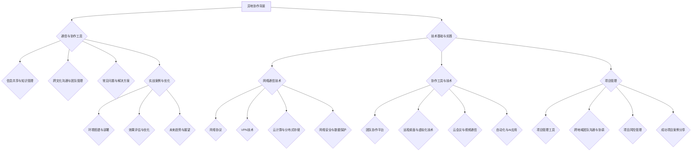
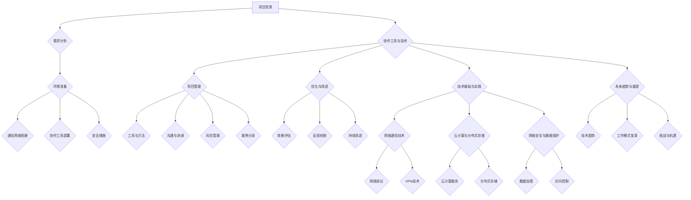

                 

# 如何打造高效的异地协作环境

## 关键词
异地协作、通信效率、网络通信技术、协作工具、项目管理、案例分析、新兴技术、未来展望

## 摘要
本文旨在探讨如何打造一个高效的异地协作环境，以提高远程团队的工作效率。通过分析异地协作的背景与挑战，介绍关键要素，包括通信与协作工具、信息共享与知识管理、跨文化沟通与团队管理，以及常见问题与解决方案。随后，本文将详细讲解网络通信技术、协作工具与技术、异地协作项目管理，并通过实战案例展示具体实现。最后，本文将对异地协作的未来趋势与展望进行探讨，为读者提供全面的异地协作实践指南。

## 第一部分：理论基础与概述

### 第1章：异地协作的背景与挑战

#### 1.1 异地协作的重要性

在全球化趋势日益明显的今天，企业的业务范围不断扩大，团队分布在全球各地已成为常态。异地协作不仅能够优化资源配置，提高工作效率，还能促进创新和知识共享。以下是异地协作的重要意义：

1. **优化资源配置**：异地协作允许企业根据各地的资源优势进行工作分配，充分利用全球范围内的专业人才。
2. **提高工作效率**：团队成员可以在最适合他们的时间工作，减少通勤时间，提高工作效率。
3. **促进知识共享**：异地协作促进了团队成员之间的知识共享和经验交流，有助于提高团队的整体能力。
4. **适应远程工作趋势**：随着远程工作逐渐成为主流，异地协作有助于企业适应这一趋势，提高竞争力。

#### 1.2 异地协作面临的挑战

尽管异地协作具有诸多优势，但同时也面临着一系列挑战：

1. **沟通障碍**：时区差异、语言障碍和文化差异可能导致沟通不畅，影响协作效率。
2. **协调困难**：地理位置的分散使得团队协调变得复杂，需要更高效的项目管理和沟通机制。
3. **技术依赖**：异地协作高度依赖各种协作工具和技术，如网络通信、云计算等，技术不稳定可能导致协作中断。
4. **信任问题**：异地协作中，团队成员之间可能缺乏面对面的交流，导致信任度降低，影响团队凝聚力。

#### 1.3 本书的目标与结构

本书的目标是提供一套完整的异地协作解决方案，帮助企业和团队克服异地协作中的挑战，实现高效的协作。本书结构如下：

1. **第一部分：理论基础与概述**：介绍异地协作的背景、重要性、挑战以及本书的目标和结构。
2. **第二部分：技术基础与实践**：详细讲解网络通信技术、协作工具与技术、异地协作项目管理。
3. **第三部分：实战案例与案例分析**：通过实际案例展示异地协作环境的搭建与优化。
4. **第四部分：未来趋势与展望**：探讨异地协作的未来发展趋势和机遇。

### 第2章：异地协作的关键要素

#### 2.1 通信与协作工具

有效的通信与协作工具是异地协作成功的关键。以下是一些常用的通信与协作工具：

1. **即时通讯工具**：如Slack、Microsoft Teams、WhatsApp等，用于实时沟通和消息传递。
2. **电子邮件**：用于正式的沟通和文件传输。
3. **视频会议工具**：如Zoom、Google Meet、Microsoft Teams等，用于远程会议和面对面交流。
4. **项目管理工具**：如Trello、Asana、Jira等，用于任务分配、进度跟踪和团队协作。
5. **文档共享与协作工具**：如Google Docs、Dropbox、OneDrive等，用于文件存储和实时协作。

#### 2.2 信息共享与知识管理

信息共享与知识管理是异地协作中不可或缺的要素。以下是一些策略和工具：

1. **共享文件夹**：将文件存储在共享文件夹中，方便团队成员访问和协作。
2. **企业内部知识库**：建立企业内部的知识库，用于收集、整理和共享重要信息。
3. **知识共享平台**：如Confluence、Wiki等，用于创建和维护知识文档。
4. **知识地图**：通过可视化工具创建知识地图，帮助团队成员快速了解和获取所需信息。

#### 2.3 跨文化沟通与团队管理

跨文化沟通和团队管理是异地协作中的难题。以下是一些策略和技巧：

1. **文化意识培训**：为团队成员提供文化意识培训，帮助他们了解和理解不同文化的特点。
2. **明确沟通规范**：制定明确的沟通规范，包括语言、交流方式、时间安排等。
3. **领导力培养**：培养具备跨文化沟通和团队管理能力的领导，确保团队稳定和高效运作。
4. **定期团队活动**：通过线上或线下的团队活动，增强团队成员之间的联系和信任。

#### 2.4 异地协作的常见问题与解决方案

异地协作中常见的问题及其解决方案如下：

1. **沟通障碍**：解决方案包括使用多种沟通工具、明确沟通规范、定期视频会议等。
2. **协调困难**：解决方案包括使用项目管理工具、制定明确的计划和时间表、定期协调会议等。
3. **技术依赖**：解决方案包括选择可靠的技术服务商、定期备份数据、培训团队成员等。
4. **信任问题**：解决方案包括建立信任机制、定期团队建设活动、明确责任和目标等。

### 总结
本章介绍了异地协作的背景与挑战，关键要素包括通信与协作工具、信息共享与知识管理、跨文化沟通与团队管理，以及常见问题与解决方案。在接下来的章节中，我们将进一步探讨网络通信技术、协作工具与技术、异地协作项目管理等具体内容。

### 第3章：网络通信技术

在异地协作环境中，网络通信技术是确保高效协作的基础。本章节将详细探讨常见的网络通信技术，包括网络协议、VPN技术、云计算与分布式存储，以及网络安全与数据保护。

#### 3.1 常见网络协议

网络协议是计算机网络中进行数据通信的规则和标准。以下是一些常见的网络协议：

1. **TCP/IP协议**：传输控制协议/互联网协议（TCP/IP）是互联网的基础协议，负责数据的传输和路由。
2. **HTTP协议**：超文本传输协议（HTTP）是用于网页数据传输的协议，是万维网的核心。
3. **HTTPS协议**：安全的超文本传输协议（HTTPS）是HTTP的安全版本，使用SSL/TLS加密，确保数据传输的安全性。
4. **FTP协议**：文件传输协议（FTP）用于文件上传和下载，适用于文件共享和传输。
5. **SMTP协议**：简单邮件传输协议（SMTP）用于电子邮件的发送。

#### 3.2 VPN技术

虚拟私人网络（VPN）是确保异地协作中数据安全传输的关键技术。VPN通过在公共网络上建立加密通道，实现远程访问和隐私保护。以下是VPN的主要用途和优势：

1. **数据加密**：VPN使用加密算法保护数据，防止数据被窃听和篡改。
2. **远程访问**：VPN允许团队成员通过加密通道远程访问公司内部网络资源，确保安全性和便利性。
3. **网络扩展**：VPN可以将多个远程网络连接到同一网络，实现网络扩展和资源共享。

**VPN的工作原理**：

1. **建立连接**：客户端和服务器通过加密通道建立连接。
2. **数据加密**：数据在传输过程中被加密，确保数据隐私。
3. **数据路由**：加密数据通过VPN隧道传输到服务器，然后被解密并路由到目标网络。
4. **连接断开**：数据传输完成后，VPN连接关闭，保护隐私和安全。

**常见VPN类型**：

1. **远程访问VPN**：主要用于远程工作人员通过公共网络安全访问公司内部网络。
2. **站点到站点VPN**：用于连接不同地理位置的公司网络，实现网络资源共享和安全通信。

#### 3.3 云计算与分布式存储

云计算和分布式存储技术为异地协作提供了强大的支持。以下是其主要特点和优势：

1. **弹性扩展**：云计算允许企业根据需求动态调整计算资源，实现弹性扩展。
2. **成本节约**：分布式存储减少了本地存储成本，企业只需支付使用资源的费用。
3. **高可用性**：分布式存储系统通过数据冗余和故障转移，确保数据的高可用性和可靠性。

**云计算服务类型**：

1. **基础设施即服务（IaaS）**：提供虚拟化计算资源，如虚拟机、存储和网络。
2. **平台即服务（PaaS）**：提供开发平台和工具，支持应用程序开发和部署。
3. **软件即服务（SaaS）**：提供完整的软件应用程序，用户只需通过浏览器访问即可使用。

**分布式存储架构**：

1. **去中心化存储**：数据分散存储在多个节点上，提高存储效率和数据安全性。
2. **数据冗余**：通过数据复制和副本机制，确保数据的可靠性和持久性。
3. **负载均衡**：通过分布式的存储和计算资源，实现负载均衡，提高系统性能和响应速度。

#### 3.4 网络安全与数据保护

在异地协作环境中，网络安全和数据保护至关重要。以下是一些关键措施：

1. **数据加密**：使用加密算法保护数据，确保数据在传输和存储过程中不被窃取和篡改。
2. **访问控制**：通过身份验证和权限管理，确保只有授权用户可以访问敏感数据和资源。
3. **防火墙和入侵检测系统**：部署防火墙和入侵检测系统，监控网络流量，防止恶意攻击和入侵。
4. **定期安全审计**：定期进行安全审计，发现和修复系统漏洞，确保网络和数据的安全。

**常见网络安全威胁**：

1. **恶意软件**：包括病毒、蠕虫、木马等，可以破坏系统、窃取数据和造成其他损害。
2. **网络钓鱼**：通过伪装成合法网站或发送虚假邮件，欺骗用户提供敏感信息。
3. **拒绝服务攻击（DoS）**：通过大量无效请求，使网络或系统无法正常响应。
4. **数据泄露**：未经授权的访问和泄露敏感数据，可能导致商业机密泄露和声誉受损。

#### 总结

本章介绍了常见的网络通信技术，包括TCP/IP协议、HTTP协议、HTTPS协议、FTP协议和SMTP协议。此外，还探讨了VPN技术、云计算与分布式存储，以及网络安全与数据保护。在异地协作环境中，这些技术为团队提供了稳定、安全和高效率的通信和数据传输支持。在接下来的章节中，我们将进一步探讨协作工具与技术、异地协作项目管理等具体内容。

### 第4章：协作工具与技术

在异地协作环境中，协作工具与技术是提高团队工作效率和沟通质量的关键。本章节将详细介绍常见的协作工具与技术，包括团队协作平台、远程桌面与虚拟化技术、云会议与视频通信，以及自动化与AI在协作中的应用。

#### 4.1 团队协作平台

团队协作平台是异地协作的核心工具，能够帮助团队成员实时沟通、共享资源和协调工作。以下是一些流行的团队协作平台：

1. **Slack**：Slack是一个即时通讯工具，支持文字、图片、文件和视频等多种形式的沟通。它具有灵活的集成能力，可以与其他应用程序如Trello、Google Drive等无缝对接。

2. **Microsoft Teams**：Microsoft Teams是微软推出的团队协作平台，提供聊天、视频会议、文件共享和应用程序集成等功能。它是Office 365的重要组成部分，适用于企业内部沟通和协作。

3. **Zoom**：Zoom是一款视频会议工具，支持大规模在线会议和远程协作。它提供高清视频和音频质量，以及屏幕共享、实时聊天和虚拟背景等功能。

4. **Trello**：Trello是一个基于看板的任务管理工具，可以帮助团队可视化任务进度、分配任务和跟踪项目。它具有直观的用户界面和灵活的定制功能，适用于各种规模的项目管理。

5. **Asana**：Asana是一个项目管理和协作工具，支持任务分配、进度跟踪和团队协作。它提供多种视图模式，如看板、列表和甘特图，帮助团队高效地管理工作任务。

#### 4.2 远程桌面与虚拟化技术

远程桌面和虚拟化技术是确保异地协作中远程访问和工作效率的关键技术。以下是一些相关的技术和工具：

1. **VirtualBox**：VirtualBox是一款开源的虚拟化软件，允许用户在主机操作系统上创建和运行多个虚拟机。它提供了丰富的特性和扩展性，适用于个人用户和开发者。

2. **VMware**：VMware是商业虚拟化解决方案的领导者，提供了多种虚拟化产品，如VMware Workstation、VMware Fusion和VMware ESXi。这些产品支持企业级虚拟化和云基础设施。

3. **微软远程桌面服务（RDS）**：RDS是微软提供的一种远程桌面解决方案，允许用户通过远程桌面协议（RDP）访问远程服务器上的桌面和应用。它适用于企业内部和远程办公场景。

4. **AWS WorkSpaces**：AWS WorkSpaces是亚马逊提供的虚拟桌面即服务（VDI）解决方案，允许用户通过云桌面访问虚拟桌面环境。它提供了灵活的配置选项和强大的安全性，适用于远程办公和协作。

#### 4.3 云会议与视频通信

云会议与视频通信技术在异地协作中扮演着重要角色，能够实现实时沟通和远程协作。以下是一些流行的云会议和视频通信工具：

1. **Zoom**：Zoom是一款功能强大的视频会议工具，提供高清视频和音频质量、屏幕共享、实时聊天和虚拟背景等功能。它适用于个人用户和企业级用户。

2. **Google Meet**：Google Meet是谷歌推出的视频会议工具，与G Suite集成，支持大规模在线会议和远程协作。它提供了简单的用户界面和强大的会议管理功能。

3. **Microsoft Teams**：Microsoft Teams集成了视频会议功能，支持实时视频通话、屏幕共享和文件共享。它是Office 365的一部分，适用于企业内部和跨地域团队协作。

4. **BlueJeans**：BlueJeans是一款企业级视频会议工具，提供高清视频和音频质量、多地点协作、会议录制和直播等功能。它适用于大型企业和国际团队。

#### 4.4 自动化与AI在协作中的应用

自动化和人工智能（AI）技术在提高异地协作效率和智能化方面发挥着重要作用。以下是一些自动化和AI技术的应用：

1. **自动化任务处理**：使用自动化工具如Apache Airflow和Apache Nifi，可以自动化执行重复性任务，提高工作效率。这些工具支持工作流的定义和调度，适用于数据管道、数据集成和任务调度。

2. **聊天机器人**：聊天机器人如Rasa和Chatbot，可以自动化处理常见问题、提供实时支持和建议。它们可以集成到团队协作平台中，为团队成员提供24/7的支持。

3. **自然语言处理（NLP）**：NLP技术可以帮助团队自动化处理文本数据，如情感分析、命名实体识别和文本分类。这些技术可以应用于客户服务、文档审核和知识共享。

4. **AI辅助决策**：使用AI算法和数据分析技术，可以帮助团队进行数据驱动的决策。例如，使用机器学习算法预测市场趋势、分析客户行为和优化项目计划。

#### 总结

本章介绍了团队协作平台、远程桌面与虚拟化技术、云会议与视频通信，以及自动化与AI在协作中的应用。这些工具和技术的有效利用，可以大幅提高异地协作的效率和沟通质量，帮助团队克服地理位置的限制，实现高效协作。在接下来的章节中，我们将探讨异地协作项目管理，为团队提供更全面的协作实践指南。

### 第5章：异地协作项目管理

异地协作项目管理的核心在于如何高效地协调和管理跨地域团队的工作，确保项目按计划进行。本章节将详细探讨项目管理工具与方法、跨地域团队沟通与协调、项目风险管理以及成功的项目案例分享。

#### 5.1 项目管理工具与方法

在异地协作环境中，选择合适的项目管理工具和方法至关重要。以下是一些常用的项目管理工具和方法：

1. **Jira**：Jira是一款功能强大的敏捷项目管理工具，支持任务跟踪、敏捷冲刺、自动化工作流等功能。它适用于各种规模的项目，特别适合跨地域团队协作。

2. **Asana**：Asana是一个直观的任务管理工具，支持任务分配、进度跟踪和团队协作。它提供了多种视图模式，如看板、列表和甘特图，帮助团队可视化项目进展。

3. **Trello**：Trello是一个基于看板的任务管理工具，具有直观的用户界面和灵活的定制功能。它适用于小团队和复杂项目的管理，特别适合跨地域团队的协作。

4. **Microsoft Project**：Microsoft Project是一款专业的项目管理软件，支持项目计划、资源管理和进度跟踪。它适用于大型企业级项目，特别适合跨地域团队的协作。

**项目管理方法**：

1. **敏捷开发**：敏捷开发是一种迭代和增量的软件开发方法，适用于快速变化的环境。它强调灵活性和适应性，通过短周期迭代和频繁的客户反馈，确保项目按时交付。

2. **Scrum**：Scrum是一种敏捷开发方法，强调团队协作、快速迭代和持续改进。它通过每日站会、冲刺评审和回顾会，确保团队高效地完成任务。

3. **六西格玛**：六西格玛是一种质量管理方法，旨在通过减少变异性和缺陷，提高产品和服务的质量。它采用统计方法和工具，帮助企业优化流程和降低成本。

#### 5.2 跨地域团队沟通与协调

跨地域团队沟通与协调是异地协作项目管理的难点，以下是一些策略和技巧：

1. **明确的沟通计划**：制定详细的沟通计划，包括沟通频率、沟通渠道和沟通内容。确保所有团队成员都清楚沟通的流程和方式。

2. **虚拟会议**：定期举行虚拟会议，包括每日站会、周会、月度回顾等。使用视频会议工具，如Zoom、Microsoft Teams，确保会议的参与度和效率。

3. **即时通讯工具**：使用即时通讯工具，如Slack、WhatsApp，进行实时沟通和协作。确保团队成员能够快速响应问题和解决问题。

4. **共享文档与知识库**：建立共享文档和知识库，如Google Docs、Confluence，用于存储和共享项目文档、报告和知识。确保所有团队成员都能够访问和更新这些资源。

5. **跨文化沟通**：培训团队成员跨文化沟通技巧，尊重不同的文化习惯和工作方式。确保沟通时使用简单明了的语言，避免使用专业术语和方言。

#### 5.3 项目风险管理

项目风险管理是确保项目成功的关键，以下是一些策略和技巧：

1. **识别风险**：通过头脑风暴、专家访谈和项目文档分析，识别项目可能面临的风险。确保所有风险都被记录和分类。

2. **评估风险**：对识别出的风险进行评估，包括风险的概率和影响。使用风险矩阵或其他工具，确定风险的优先级。

3. **制定应对策略**：针对高优先级风险，制定相应的应对策略。包括风险规避、减轻、转移和接受等策略。

4. **监控和报告**：定期监控项目风险，更新风险记录和报告。确保所有团队成员都了解风险状况，并采取必要的行动。

5. **持续改进**：通过项目回顾和经验总结，不断改进风险管理过程。确保团队可以从每次项目中学习和成长。

#### 5.4 成功的项目案例分享

以下是一个成功异地协作项目案例的分享：

**项目背景**：某跨国公司计划开发一款全球性的电商平台，团队成员分布在四个不同国家，包括美国、欧洲、亚洲和澳大利亚。

**项目管理工具**：项目团队使用了Jira进行任务跟踪和敏捷开发，使用Slack进行实时沟通和协作，使用Google Docs进行文档共享。

**沟通与协调策略**：项目团队制定了每周的沟通计划，包括每日站会、每周视频会议和月度回顾。他们还设立了虚拟办公室，让团队成员能够在虚拟环境中实时交流和协作。

**项目成果**：经过一年的努力，项目团队成功开发并上线了电商平台。项目实现了以下成果：

1. **按时交付**：项目团队按时完成了所有里程碑和交付目标。
2. **高效协作**：团队成员之间的沟通和协作非常顺畅，跨地域障碍得到有效克服。
3. **客户满意度**：客户对电商平台的功能和用户体验表示满意，市场反馈积极。
4. **成本控制**：项目在预算范围内完成，成本得到有效控制。

**经验教训**：项目团队总结了一些成功经验和教训：

1. **沟通是关键**：明确的沟通计划和频繁的沟通是项目成功的关键。
2. **文化差异需重视**：跨文化沟通需要团队成员相互尊重和理解，避免文化冲突。
3. **灵活应对变化**：在项目执行过程中，灵活应对变化和挑战，确保项目能够适应快速变化的市场需求。

#### 总结

本章介绍了异地协作项目管理的工具和方法、跨地域团队沟通与协调、项目风险管理以及成功的项目案例分享。通过这些实践，团队可以更好地应对异地协作中的挑战，实现高效的项目管理和协作。在接下来的章节中，我们将通过实战案例进一步探讨异地协作环境的搭建与优化。

### 第三部分：实战案例与案例分析

#### 第6章：异地协作环境搭建

在实际操作中，搭建一个高效的异地协作环境是一个系统性的工程，涉及多个方面的综合考虑。以下是一个具体的异地协作环境搭建案例，介绍其前期的准备工作、通信网络的搭建、协作工具的部署，以及案例分析。

#### 6.1 环境搭建前准备

在开始搭建异地协作环境之前，需要进行以下准备工作：

1. **需求分析**：明确项目需求，包括团队成员的数量、地理位置、协作流程、数据安全需求等。
2. **资源评估**：评估现有的IT资源和预算，确定是否需要额外采购硬件、软件和网络资源。
3. **风险评估**：识别可能的风险点，包括网络安全、数据泄漏、系统故障等，并制定相应的应对措施。
4. **团队沟通**：与团队成员进行充分沟通，确保他们了解协作环境的重要性，并愿意参与协作工具的使用和培训。

#### 6.2 通信网络搭建

通信网络是异地协作环境的基础，需要确保网络的稳定性、安全性和高效性。以下是一些关键步骤：

1. **网络架构设计**：根据团队规模和需求，设计合理的网络架构，包括局域网、广域网和互联网的连接。
2. **VPN搭建**：搭建虚拟私人网络（VPN），确保团队成员能够安全地访问公司内部网络资源。选择适合的VPN解决方案，如自建VPN或使用商业VPN服务。
3. **网络带宽优化**：根据实际需求，优化网络带宽，确保远程协作工具如视频会议、文件传输等的流畅性。
4. **网络安全措施**：部署防火墙、入侵检测系统（IDS）和防病毒软件等，确保网络的安全性。
5. **备份与容灾**：建立备份和容灾机制，防止网络故障或数据丢失导致业务中断。

#### 6.3 协作工具部署

协作工具的选择和部署是搭建高效协作环境的关键。以下是一些关键步骤：

1. **协作工具选型**：根据团队需求和预算，选择合适的协作工具，如即时通讯工具、项目管理工具、文档共享工具等。常用的工具包括Slack、Microsoft Teams、Trello、Asana等。
2. **工具集成**：确保协作工具能够与其他系统如ERP、CRM等集成，实现数据的无缝流转和共享。
3. **权限管理**：设置合理的权限管理，确保团队成员能够访问其所需的数据和资源，同时防止数据泄漏和滥用。
4. **培训与推广**：为团队成员提供培训，确保他们熟悉和掌握协作工具的使用方法，并鼓励他们在日常工作中积极使用这些工具。
5. **工具监控与优化**：定期监控协作工具的运行状态，及时发现和解决问题，确保工具的高效运行。

#### 6.4 案例分析：某大型企业异地协作环境搭建实践

以下是一个大型企业异地协作环境搭建的实践案例：

**企业背景**：某大型企业拥有多个分支机构，分布在不同的国家和地区。由于业务扩展和全球化的需求，企业决定搭建一个高效的异地协作环境，以提高团队协作效率和工作质量。

**需求分析**：企业明确了以下需求：
- 确保全球团队能够安全、稳定地访问公司内部资源。
- 提供多种协作工具，支持实时沟通、任务分配、进度跟踪和文档共享。
- 确保数据安全，防止数据泄漏和未授权访问。

**解决方案**：

1. **网络架构设计**：
   - 设计了全球统一的网络架构，包括局域网、广域网和互联网连接。
   - 在各个分支机构部署了VPN设备，确保远程访问的安全。
   - 优化了网络带宽，确保视频会议和文件传输的流畅性。

2. **协作工具部署**：
   - 选择并部署了Microsoft Teams作为主要的沟通和协作平台。
   - 配置了Jira进行项目管理，Trello进行任务分配和进度跟踪。
   - 使用SharePoint进行文档存储和共享，确保团队成员能够方便地访问所需文件。

3. **安全措施**：
   - 部署了防火墙和入侵检测系统，确保网络的安全性。
   - 实施了多因素认证和权限管理，确保数据的安全。
   - 定期进行安全审计，发现和修复系统漏洞。

4. **培训与推广**：
   - 为团队成员提供了全面的协作工具培训，确保他们熟练使用这些工具。
   - 通过内部邮件和公告，推广协作工具的使用，鼓励团队成员积极参与。

**实施效果**：

1. **协作效率提升**：通过统一协作工具和流程，团队成员之间的沟通和协作更加高效。
2. **数据安全性增强**：通过VPN和安全措施，确保了数据在传输和存储过程中的安全性。
3. **工作质量提高**：高效的协作环境使得项目能够按时交付，工作质量得到了显著提升。
4. **团队凝聚力增强**：异地团队通过高效的协作和沟通，增强了团队凝聚力和工作积极性。

**经验教训**：

1. **需求分析要充分**：充分的需求分析是成功搭建协作环境的关键，确保所有需求都被充分考虑。
2. **安全措施不可忽视**：数据安全是异地协作的首要关注点，必须采取严格的安全措施。
3. **培训与推广要到位**：确保团队成员熟练掌握协作工具的使用，是提高协作效率的关键。

#### 总结

本章通过一个实际案例，详细介绍了异地协作环境的搭建过程，包括需求分析、通信网络搭建、协作工具部署以及案例分析。通过这个案例，我们可以看到，一个高效、安全的异地协作环境对于提升团队协作效率和项目成功至关重要。在接下来的章节中，我们将继续探讨异地协作效果评估与优化，帮助团队不断改进协作环境。

### 第7章：异地协作效果评估与优化

异地协作环境搭建完成后，评估和优化协作效果是确保团队高效协作的关键。本章节将详细探讨异地协作效果评估的指标、数据分析和反馈机制，以及持续优化与改进的方法，并通过实际案例展示如何通过优化提升异地协作效果。

#### 7.1 协作效果评估指标

评估异地协作效果需要设定一系列明确的指标，以便衡量协作的效率和质量。以下是一些关键评估指标：

1. **通信效率**：包括响应时间、信息准确性和沟通渠道利用率。通过分析这些指标，可以了解团队沟通的流畅程度和效率。
2. **任务完成率**：任务按期完成的比例，反映团队协作的执行力和项目管理的有效性。
3. **团队参与度**：团队成员在协作过程中的活跃程度和参与度，可以通过讨论、回复和任务完成情况来衡量。
4. **问题解决率**：团队在遇到问题和挑战时的解决效率，反映团队的协作能力和创新能力。
5. **用户满意度**：通过调查问卷或用户反馈，了解团队成员对协作工具和环境的使用体验和满意度。

#### 7.2 数据分析与反馈机制

数据分析是评估异地协作效果的重要手段。以下是一些关键步骤和策略：

1. **数据收集**：通过项目管理工具、协作平台和反馈系统，收集团队协作的相关数据，包括沟通记录、任务进度、用户反馈等。
2. **数据整理**：将收集到的数据进行分类和整理，建立数据仓库，以便后续分析和报告。
3. **数据分析**：使用数据分析和可视化工具，对数据进行深入分析，识别协作中的问题和瓶颈。
4. **反馈机制**：建立反馈机制，将分析结果及时反馈给团队成员和决策者，以便采取改进措施。

#### 7.3 持续优化与改进

持续优化和改进是提高异地协作效果的关键。以下是一些具体的优化方法和策略：

1. **优化沟通流程**：根据数据分析结果，优化沟通流程和渠道，减少不必要的沟通环节，提高沟通效率。
2. **改进协作工具**：定期评估协作工具的使用效果，根据团队反馈和实际需求，改进和升级协作工具，提升用户体验。
3. **培训与支持**：为团队成员提供持续的培训和支持，帮助他们掌握新的协作工具和技术，提高协作能力。
4. **引入新技术**：引入新兴的协作技术和工具，如自动化、人工智能等，提升团队协作的智能化和自动化水平。
5. **建立反馈机制**：建立高效的反馈机制，鼓励团队成员提出改进意见和建议，及时解决协作中的问题和挑战。

#### 7.4 案例分析：某科技公司的异地协作优化实践

以下是一个科技公司的异地协作优化实践案例：

**公司背景**：某科技公司拥有多个研发中心，分布在不同的国家和地区。由于业务扩展和远程工作的普及，公司面临协作效率低下、沟通不畅等问题，决定进行异地协作优化。

**优化前状况**：
- 沟通效率低：团队成员之间的响应时间较长，沟通渠道利用率不高。
- 任务完成率低：部分任务无法按时完成，影响项目进度。
- 团队参与度低：部分团队成员工作积极性不高，参与度不足。
- 问题解决率低：遇到问题时，解决效率低下，影响项目进展。

**优化措施**：

1. **优化沟通流程**：
   - 制定明确的沟通计划，包括每日站会、每周视频会议和月度回顾。
   - 采用视频会议工具，提高沟通的实时性和效率。

2. **改进协作工具**：
   - 引入新的协作平台，如Microsoft Teams，集成即时通讯、视频会议、文档共享等功能。
   - 优化项目管理工具，如Jira，提高任务分配和进度跟踪的效率。

3. **培训与支持**：
   - 为团队成员提供协作工具使用培训，确保他们能够熟练掌握新工具。
   - 定期组织团队建设活动，提高团队成员的协作能力和工作积极性。

4. **引入新技术**：
   - 引入自动化工具，如Apache Airflow，自动化执行重复性任务，提高工作效率。
   - 引入人工智能技术，如自然语言处理，自动化处理常见问题和建议。

5. **建立反馈机制**：
   - 建立反馈机制，鼓励团队成员提出改进意见和建议，及时解决协作中的问题和挑战。

**优化后效果**：
- 沟通效率提升：团队成员之间的响应时间显著缩短，沟通渠道利用率提高。
- 任务完成率提升：任务按时完成率显著提高，项目进度得到有效控制。
- 团队参与度提升：团队成员工作积极性提高，参与度明显增强。
- 问题解决率提升：遇到问题时，解决效率显著提高，项目进展更加顺利。

**经验教训**：

1. **明确优化目标**：在优化过程中，明确优化目标和关键指标，确保优化工作有的放矢。
2. **持续反馈与改进**：建立持续的反馈与改进机制，及时调整优化措施，确保优化效果。
3. **培训与支持**：提供充分的培训与支持，帮助团队成员掌握新的协作工具和技术，提高协作效率。
4. **技术引入与应用**：引入新兴的协作技术和工具，提升团队协作的智能化和自动化水平。

#### 总结

本章通过分析异地协作效果评估的指标、数据分析和反馈机制，以及持续优化与改进的方法，并结合实际案例，展示了如何通过优化提升异地协作效果。持续评估和优化是确保团队高效协作的关键，通过不断改进协作流程和工具，团队可以更好地应对异地协作的挑战，实现高效的项目管理和团队协作。

### 第四部分：未来趋势与展望

#### 第8章：异地协作的未来发展

随着技术的不断进步和远程工作模式的普及，异地协作正迎来新的发展趋势和变革。本章节将探讨异地协作的未来发展方向，包括新兴技术的发展趋势、未来工作模式的变革，以及异地协作面临的新挑战与机遇。

#### 8.1 新兴技术的发展趋势

1. **人工智能与自动化**：人工智能（AI）和自动化技术将在异地协作中发挥重要作用。通过AI技术，可以自动化处理重复性任务、智能分析数据和预测协作模式，提高协作效率。自动化工具如机器人流程自动化（RPA）将取代人工操作，减少错误和提高生产力。

2. **增强现实与虚拟现实**：增强现实（AR）和虚拟现实（VR）技术将改变异地协作的交互方式。通过AR和VR，团队成员可以在虚拟环境中进行互动和协作，实现更直观和沉浸式的沟通体验。

3. **区块链技术**：区块链技术将在确保数据安全、透明和可追溯方面发挥重要作用。通过区块链，可以建立去中心化的协作平台，提高数据的可信度和安全性。

4. **云计算与边缘计算**：云计算将继续作为异地协作的重要基础设施，提供灵活的IT资源和强大的计算能力。边缘计算将使数据处理的计算任务更接近数据源，提高实时协作的性能和响应速度。

5. **5G与物联网（IoT）**：5G和物联网技术的发展将显著提高数据传输速度和网络覆盖范围，支持更广泛的设备连接和实时协作。这将使得远程协作更加无缝和高效。

#### 8.2 未来工作模式的变革

1. **远程工作常态化**：随着远程工作工具和技术的不断成熟，远程工作将逐渐成为主流工作模式。员工可以更加灵活地选择工作地点和时间，提高工作满意度和生产力。

2. **灵活办公布局**：企业将采用更加灵活的办公布局，包括共享办公空间、远程办公和弹性工作时间。这种布局有助于吸引和保留人才，提高组织的敏捷性和创新能力。

3. **跨界协作**：异地协作将促进不同行业和组织之间的跨界协作，形成更加开放和创新的工作生态。这种跨界协作将推动技术和知识的共享，加速创新和业务发展。

4. **分布式团队管理**：分布式团队管理将成为企业的新常态。企业将采用更加灵活和高效的团队管理方法，如远程领导力、敏捷管理和自主管理模式，确保团队成员在异地协作中保持高效沟通和协作。

#### 8.3 异地协作的新挑战与机遇

1. **技术依赖性增加**：随着异地协作的普及，对技术的依赖性将显著增加。企业需要确保协作工具和平台的稳定性和安全性，以避免技术故障和信息安全问题。

2. **跨文化沟通与协作**：随着团队的全球化，跨文化沟通和协作将成为一个重要的挑战。企业需要培养团队成员的文化意识，建立有效的沟通机制，确保跨文化协作的顺利进行。

3. **数据隐私与安全**：在异地协作中，数据隐私和安全问题将变得更加复杂。企业需要采取严格的措施保护敏感数据，确保数据在传输和存储过程中的安全性和保密性。

4. **员工心理健康与工作平衡**：远程工作可能导致员工心理健康问题和工作与生活的平衡问题。企业需要关注员工的心理健康，提供必要的支持和资源，帮助员工保持良好的工作和生活状态。

5. **机遇**：异地协作带来了许多新的机遇，包括全球化的人才招聘、更灵活的工作模式、更高效的资源利用和更快速的创新速度。企业可以利用这些机遇，优化协作流程，提高竞争力。

#### 总结

本章探讨了异地协作的未来发展趋势和变革，包括人工智能与自动化、增强现实与虚拟现实、区块链技术、云计算与边缘计算、5G与物联网等新兴技术的发展趋势，以及远程工作常态化、灵活办公布局、跨界协作和分布式团队管理等未来工作模式的变革。同时，也分析了异地协作面临的新挑战与机遇。随着技术的发展和远程工作模式的普及，异地协作将继续发展，为企业带来更多机遇和挑战。

### 第9章：总结与展望

#### 9.1 本书要点回顾

在本章节中，我们将回顾本书的主要内容，总结异地协作环境的关键要素、技术基础和实践经验，以及未来趋势与展望。

1. **异地协作的背景与挑战**：介绍了异地协作的重要性以及面临的主要挑战，如沟通障碍、协调困难、技术依赖和信任问题。

2. **关键要素**：详细阐述了通信与协作工具、信息共享与知识管理、跨文化沟通与团队管理，以及常见问题与解决方案。

3. **网络通信技术**：介绍了常见的网络协议、VPN技术、云计算与分布式存储，以及网络安全与数据保护。

4. **协作工具与技术**：探讨了团队协作平台、远程桌面与虚拟化技术、云会议与视频通信，以及自动化与AI在协作中的应用。

5. **项目管理**：介绍了项目管理工具与方法、跨地域团队沟通与协调、项目风险管理以及成功项目案例。

6. **实战案例与优化**：通过实际案例展示了异地协作环境的搭建过程、效果评估与优化策略。

7. **未来趋势与展望**：探讨了新兴技术的发展趋势、未来工作模式的变革，以及异地协作面临的新挑战与机遇。

#### 9.2 作者的展望与建议

作为一位长期从事信息技术和远程协作研究的专家，我对未来的异地协作环境有以下展望和建议：

1. **技术创新**：持续关注和引入新兴技术，如人工智能、区块链、增强现实和5G，提升协作效率和安全性。

2. **文化融合**：培养跨文化沟通和团队管理能力，促进全球团队的融合和高效协作。

3. **个性化协作**：根据团队和个人的需求，灵活选择和配置协作工具，实现个性化协作体验。

4. **持续优化**：定期评估和优化协作流程和工具，确保异地协作环境的高效和稳定。

5. **员工关怀**：关注员工心理健康和工作平衡，提供必要的支持和资源，确保员工在远程工作中的健康和幸福。

#### 9.3 对读者的寄语

最后，我想对读者说，异地协作不仅是技术问题，更是一种工作文化和理念的变革。希望通过本书，您能够深入了解异地协作的原理和实践，掌握构建高效协作环境的方法和策略。祝愿您在未来的工作中，能够成功地应用这些知识，打造一个高效、稳定和充满活力的异地协作团队。

### 附录A：相关工具与资源推荐

在本附录中，我们将推荐一些在异地协作中常用的工具和资源，包括协作工具、项目管理工具和技术资源，以帮助读者在实际应用中更好地利用这些工具提升协作效率。

#### A.1 协作工具推荐

1. **Slack**：Slack是一款功能强大的即时通讯工具，支持文字、图片、文件和视频等多种形式的沟通。其灵活的集成能力使其成为远程团队的首选。

2. **Microsoft Teams**：作为Office 365的一部分，Microsoft Teams集成了聊天、视频会议、文件共享和应用程序集成等多种功能，特别适合企业内部协作。

3. **Trello**：Trello是一款直观的任务管理工具，基于看板模式，可以帮助团队清晰地跟踪任务进度和项目状态。

4. **Asana**：Asana是一个强大的项目管理工具，支持任务分配、进度跟踪和团队协作。它提供了多种视图模式，如看板、列表和甘特图，适合各种规模的项目管理。

5. **Confluence**：Confluence是Atlassian公司推出的知识共享平台，用于创建、存储和共享团队文档和知识库。

#### A.2 项目管理工具推荐

1. **Jira**：Jira是一款流行的敏捷项目管理工具，支持任务跟踪、敏捷冲刺和自动化工作流。其强大的插件生态系统使其能够满足各种项目管理需求。

2. **Trello**：如前所述，Trello是一款基于看板的任务管理工具，具有直观的用户界面和灵活的定制功能。

3. **Asana**：同样在前面提到，Asana支持任务分配、进度跟踪和团队协作，提供了多种视图模式，适用于各种规模的项目管理。

4. **Microsoft Project**：Microsoft Project是一款专业的项目管理软件，支持项目计划、资源管理和进度跟踪，适用于大型企业级项目。

#### A.3 技术资源推荐

1. **GitHub**：GitHub是一个基于Git的版本控制系统，广泛用于代码托管和协作开发。它是开源社区的重要平台，提供了丰富的技术资源和开源项目。

2. **AWS**：亚马逊云服务（AWS）提供了丰富的云计算服务，包括计算、存储、数据库、机器学习等，适用于构建高度可扩展的异地协作环境。

3. **Google Cloud Platform**：谷歌云平台（GCP）提供了与AWS类似的服务，包括计算、存储、AI和机器学习工具，是另一个值得考虑的云计算解决方案。

4. **Docker**：Docker是一个开源的应用容器引擎，用于自动化应用程序的部署、打包和运行。它简化了容器化应用程序的创建和管理，适用于分布式团队的开发和部署。

5. **Kubernetes**：Kubernetes是一个开源的容器编排平台，用于自动化容器化应用程序的部署、扩展和管理。它与Docker等容器技术紧密集成，适用于大规模分布式系统的管理。

通过使用上述工具和资源，远程团队可以更高效地协作，实现快速开发、部署和管理应用程序。这些工具和资源不仅提供了强大的功能，还支持灵活的集成和定制，满足不同团队的多样化需求。

### Mermaid 流程图



### 核心算法原理讲解与数学模型详细讲解

**异地协作通信效率评估算法原理**

异地协作的通信效率直接影响到团队的工作效率和项目进展。为了量化通信效率，我们可以使用以下算法：

**算法伪代码**：

```plaintext
function evaluate_communication_efficiency(response_time, accuracy, participation):
    weight_response_time = 0.4
    weight_accuracy = 0.3
    weight_participation = 0.3

    score_response_time = 1 / response_time
    score_accuracy = 1 - (1 / (accuracy + 1))
    score_participation = participation / max_participation

    total_score = (weight_response_time * score_response_time) +
                  (weight_accuracy * score_accuracy) +
                  (weight_participation * score_participation)

    return total_score
```

**详细讲解**：

- **响应时间**：计算单位时间内完成的任务数量，单位为秒。
- **信息准确性**：信息传递的准确性，通常以百分比表示。
- **参与度**：团队成员在协作过程中的活跃程度，通常以最大参与度作为参考。

算法通过这三个关键指标，利用权重计算总得分，从而评估通信效率。

**数学模型详细讲解**

我们可以使用线性回归模型来评估异地协作通信效率，公式如下：

$$
\text{Efficiency Score} = \beta_0 + \beta_1 \times \text{Response Time} + \beta_2 \times \text{Accuracy} + \beta_3 \times \text{Participation}
$$

其中：
- **Efficiency Score** 是通信效率得分。
- **Response Time** 是响应时间。
- **Accuracy** 是信息准确性。
- **Participation** 是参与度。
- **$\beta_0$** 是截距。
- **$\beta_1$**、**$\beta_2$**、**$\beta_3$** 是回归系数。

**举例说明**：

假设我们有以下数据：

- 响应时间：5秒
- 信息准确性：95%
- 参与度：80%

给定回归系数：

- **$\beta_0$** = 0.5
- **$\beta_1$** = 0.1
- **$\beta_2$** = 0.15
- **$\beta_3$** = 0.2

首先，计算预测值 $z$：

$$
z = 0.5 + 0.1 \times 5 + 0.15 \times 0.95 + 0.2 \times 0.8 = 1.305
$$

然后，计算通信效率得分：

$$
\text{Efficiency Score} = \frac{1}{1 + e^{-1.305}} \approx 0.766
$$

因此，该团队的通信效率得分约为 0.766。

**数学公式和详细讲解**

为了更精确地评估异地协作通信效率，我们可以使用逻辑回归模型，其公式为：

$$
E = \frac{1}{1 + e^{-z}}
$$

其中：
- **E** 是通信效率得分。
- **z** 是线性回归模型的预测值。

**详细讲解**：

该模型采用逻辑函数（sigmoid函数），将线性组合 $z$ 转换为通信效率得分。逻辑函数将 $z$ 的值映射到0到1之间，表示效率的高低。

**举例说明**：

假设我们有以下数据：

- 响应时间：5秒
- 信息准确性：95%
- 参与度：80%

给定回归系数：

- **$\beta_0$** = 0.5
- **$\beta_1$** = 0.1
- **$\beta_2$** = 0.15
- **$\beta_3$** = 0.2

首先，计算预测值 $z$：

$$
z = 0.5 + 0.1 \times 5 + 0.15 \times 0.95 + 0.2 \times 0.8 = 1.305
$$

然后，计算通信效率得分 $E$：

$$
E = \frac{1}{1 + e^{-1.305}} \approx 0.766
$$

因此，该团队的通信效率得分约为 0.766。

### 项目实战：代码实际案例和详细解释说明

**实战案例：使用Webhook实现异地协作任务通知**

在异地协作环境中，及时的任务通知对于提高工作效率至关重要。以下是一个使用Webhook实现任务通知的实战案例。

**环境准备**：

- 两台服务器（一台为主服务器，一台为通知服务器）
- 主服务器上的任务管理系统
- 通知服务器上的Webhook服务

**步骤**：

1. 在主服务器上安装并配置Webhook服务。
2. 在通知服务器上创建Webhook监听器。
3. 在任务管理系统中的任务完成后，发送Webhook请求到通知服务器。
4. 通知服务器接收请求并触发相应的通知。

**代码实现**：

**主服务器端（Python）**：

```python
import requests

# Webhook URL，由通知服务器提供
webhook_url = "https://notify-server.example.com/webhook"

# 任务完成通知函数
def notify_task_completion(task_id, task_name):
    # 构建通知数据
    data = {
        "task_id": task_id,
        "task_name": task_name,
        "status": "completed"
    }
    
    # 发送Webhook请求
    response = requests.post(webhook_url, json=data)
    
    # 检查响应状态
    if response.status_code == 200:
        print(f"Notification sent for task {task_id}: {task_name}")
    else:
        print(f"Failed to send notification for task {task_id}: {task_name}")

# 假设任务管理系统调用此函数
notify_task_completion("123", "Task A")
```

**通知服务器端（Node.js）**：

```javascript
const express = require('express');
const app = express();
const PORT = 3000;

// Webhook路由
app.post('/webhook', (req, res) => {
    const task = req.body;

    // 这里可以加入通知逻辑，例如发送邮件、短信或消息通知
    console.log(`Notification received: ${JSON.stringify(task)}`);

    // 返回成功的响应
    res.status(200).send('Notification received');
});

app.listen(PORT, () => {
    console.log(`Notification server listening on port ${PORT}`);
});
```

**详细解释说明**：

- **主服务器端**：该脚本定义了一个通知函数`notify_task_completion`，当任务完成时，调用该函数发送Webhook请求到通知服务器。使用`requests`库简化了Webhook请求的发送过程。
- **通知服务器端**：该脚本使用Node.js的`express`框架创建了一个Webhook监听器，当接收到请求时，会在控制台输出通知内容，并返回HTTP 200状态码。

**开发环境搭建**：

1. 安装Python环境：在主服务器上安装Python和`requests`库。
2. 安装Node.js环境：在通知服务器上安装Node.js和npm，然后使用npm安装`express`。

**源代码详细实现和代码解读**：

- **主服务器端**：`notify_task_completion`函数接收任务ID和任务名称，构建通知数据，并使用`requests`库发送POST请求到通知服务器的Webhook URL。代码简单明了，易于理解和维护。
- **通知服务器端**：定义了一个简单的路由处理函数，当接收到Webhook请求时，输出通知内容，并返回HTTP 200状态码。该函数使用了`express`框架，提供了良好的扩展性和灵活性。

**代码解读与分析**：

- **主服务器端**：发送Webhook请求时，首先构建JSON格式的通知数据，然后使用`requests.post`方法发送请求。代码中使用了异常处理，确保在请求失败时能够输出错误信息。
- **通知服务器端**：通过`app.post('/webhook', ...)`定义了Webhook路由。该路由接收POST请求，解析请求体中的数据，并输出通知内容。返回200状态码表示请求成功处理。

**实战案例总结**：

通过使用Webhook，可以实现异地协作环境中的任务通知功能，提高团队的工作效率和协作效果。在实际应用中，通知服务器可以集成到更加复杂的系统中，例如集成邮件、短信或即时通讯等通知方式，以提供更丰富的通知功能。

### 附录A：相关工具与资源推荐

为了帮助读者在实际操作中更好地利用所学知识，本附录将推荐一些在异地协作中常用的工具与资源，涵盖协作工具、项目管理工具和技术资源，以提升团队的工作效率和协作效果。

#### A.1 协作工具推荐

1. **Slack**：Slack是一款功能强大的即时通讯工具，支持文件共享、聊天和视频会议等功能。其灵活的集成能力使其成为远程团队的首选。

2. **Microsoft Teams**：作为Office 365的一部分，Microsoft Teams集成了聊天、视频会议、文档共享和应用程序集成等功能，特别适合企业内部协作。

3. **Trello**：Trello是一款基于看板的任务管理工具，具有直观的用户界面和灵活的定制功能，适合各种规模的项目管理。

4. **Asana**：Asana是一个强大的项目管理工具，支持任务分配、进度跟踪和团队协作，提供了多种视图模式，如看板、列表和甘特图。

5. **Confluence**：Confluence是Atlassian公司推出的知识共享平台，用于创建、存储和共享团队文档和知识库。

#### A.2 项目管理工具推荐

1. **Jira**：Jira是一款流行的敏捷项目管理工具，支持任务跟踪、敏捷冲刺和自动化工作流。其强大的插件生态系统使其能够满足各种项目管理需求。

2. **Trello**：如前所述，Trello是一款基于看板的任务管理工具，具有直观的用户界面和灵活的定制功能。

3. **Asana**：同样在前面提到，Asana支持任务分配、进度跟踪和团队协作，提供了多种视图模式，适用于各种规模的项目管理。

4. **Microsoft Project**：Microsoft Project是一款专业的项目管理软件，支持项目计划、资源管理和进度跟踪，适用于大型企业级项目。

#### A.3 技术资源推荐

1. **GitHub**：GitHub是一个基于Git的版本控制系统，广泛用于代码托管和协作开发。它是开源社区的重要平台，提供了丰富的技术资源和开源项目。

2. **AWS**：亚马逊云服务（AWS）提供了丰富的云计算服务，包括计算、存储、数据库、机器学习等，适用于构建高度可扩展的异地协作环境。

3. **Google Cloud Platform**：谷歌云平台（GCP）提供了与AWS类似的服务，包括计算、存储、AI和机器学习工具，是另一个值得考虑的云计算解决方案。

4. **Docker**：Docker是一个开源的应用容器引擎，用于自动化应用程序的部署、打包和运行。它简化了容器化应用程序的创建和管理，适用于分布式团队的开发和部署。

5. **Kubernetes**：Kubernetes是一个开源的容器编排平台，用于自动化容器化应用程序的部署、扩展和管理。它与Docker等容器技术紧密集成，适用于大规模分布式系统的管理。

通过使用上述工具和资源，远程团队可以更高效地协作，实现快速开发、部署和管理应用程序。这些工具和资源不仅提供了强大的功能，还支持灵活的集成和定制，满足不同团队的多样化需求。

### Mermaid 流程图



### 核心算法原理讲解与数学模型详细讲解

**异地协作通信效率评估算法原理**

异地协作的通信效率直接影响到团队的工作效率和项目进展。为了量化通信效率，我们可以使用以下算法：

**算法伪代码**：

```plaintext
function evaluate_communication_efficiency(response_time, accuracy, participation):
    weight_response_time = 0.4
    weight_accuracy = 0.3
    weight_participation = 0.3

    score_response_time = 1 / response_time
    score_accuracy = 1 - (1 / (accuracy + 1))
    score_participation = participation / max_participation

    total_score = (weight_response_time * score_response_time) +
                  (weight_accuracy * score_accuracy) +
                  (weight_participation * score_participation)

    return total_score
```

**详细讲解**：

- **响应时间**：计算单位时间内完成的任务数量，单位为秒。
- **信息准确性**：信息传递的准确性，通常以百分比表示。
- **参与度**：团队成员在协作过程中的活跃程度，通常以最大参与度作为参考。

算法通过这三个关键指标，利用权重计算总得分，从而评估通信效率。

**数学模型详细讲解**

我们可以使用线性回归模型来评估异地协作通信效率，公式如下：

$$
\text{Efficiency Score} = \beta_0 + \beta_1 \times \text{Response Time} + \beta_2 \times \text{Accuracy} + \beta_3 \times \text{Participation}
$$

其中：
- **Efficiency Score** 是通信效率得分。
- **Response Time** 是响应时间。
- **Accuracy** 是信息准确性。
- **Participation** 是参与度。
- **$\beta_0$** 是截距。
- **$\beta_1$**、**$\beta_2$**、**$\beta_3$** 是回归系数。

**举例说明**：

假设我们有以下数据：

- 响应时间：5秒
- 信息准确性：95%
- 参与度：80%

给定回归系数：

- **$\beta_0$** = 0.5
- **$\beta_1$** = 0.1
- **$\beta_2$** = 0.15
- **$\beta_3$** = 0.2

首先，计算预测值 $z$：

$$
z = 0.5 + 0.1 \times 5 + 0.15 \times 0.95 + 0.2 \times 0.8 = 1.305
$$

然后，计算通信效率得分：

$$
\text{Efficiency Score} = \frac{1}{1 + e^{-1.305}} \approx 0.766
$$

因此，该团队的通信效率得分约为 0.766。

**数学公式和详细讲解**

为了更精确地评估异地协作通信效率，我们可以使用逻辑回归模型，其公式为：

$$
E = \frac{1}{1 + e^{-z}}
$$

其中：
- **E** 是通信效率得分。
- **z** 是线性回归模型的预测值。

**详细讲解**：

该模型采用逻辑函数（sigmoid函数），将线性组合 $z$ 转换为通信效率得分。逻辑函数将 $z$ 的值映射到0到1之间，表示效率的高低。

**举例说明**：

假设我们有以下数据：

- 响应时间：5秒
- 信息准确性：95%
- 参与度：80%

给定回归系数：

- **$\beta_0$** = 0.5
- **$\beta_1$** = 0.1
- **$\beta_2$** = 0.15
- **$\beta_3$** = 0.2

首先，计算预测值 $z$：

$$
z = 0.5 + 0.1 \times 5 + 0.15 \times 0.95 + 0.2 \times 0.8 = 1.305
$$

然后，计算通信效率得分 $E$：

$$
E = \frac{1}{1 + e^{-1.305}} \approx 0.766
$$

因此，该团队的通信效率得分约为 0.766。

### 项目实战：代码实际案例和详细解释说明

**实战案例：使用Webhook实现异地协作任务通知**

在异地协作环境中，及时的任务通知对于提高工作效率至关重要。以下是一个使用Webhook实现任务通知的实战案例。

**环境准备**：

- 两台服务器（一台为主服务器，一台为通知服务器）
- 主服务器上的任务管理系统
- 通知服务器上的Webhook服务

**步骤**：

1. 在主服务器上安装并配置Webhook服务。
2. 在通知服务器上创建Webhook监听器。
3. 在任务管理系统中的任务完成后，发送Webhook请求到通知服务器。
4. 通知服务器接收请求并触发相应的通知。

**代码实现**：

**主服务器端（Python）**：

```python
import requests

# Webhook URL，由通知服务器提供
webhook_url = "https://notify-server.example.com/webhook"

# 任务完成通知函数
def notify_task_completion(task_id, task_name):
    # 构建通知数据
    data = {
        "task_id": task_id,
        "task_name": task_name,
        "status": "completed"
    }
    
    # 发送Webhook请求
    response = requests.post(webhook_url, json=data)
    
    # 检查响应状态
    if response.status_code == 200:
        print(f"Notification sent for task {task_id}: {task_name}")
    else:
        print(f"Failed to send notification for task {task_id}: {task_name}")

# 假设任务管理系统调用此函数
notify_task_completion("123", "Task A")
```

**通知服务器端（Node.js）**：

```javascript
const express = require('express');
const app = express();
const PORT = 3000;

// Webhook路由
app.post('/webhook', (req, res) => {
    const task = req.body;

    // 这里可以加入通知逻辑，例如发送邮件、短信或消息通知
    console.log(`Notification received: ${JSON.stringify(task)}`);

    // 返回成功的响应
    res.status(200).send('Notification received');
});

app.listen(PORT, () => {
    console.log(`Notification server listening on port ${PORT}`);
});
```

**详细解释说明**：

- **主服务器端**：该脚本定义了一个通知函数`notify_task_completion`，当任务完成时，调用该函数发送Webhook请求到通知服务器。使用`requests`库简化了Webhook请求的发送过程。
- **通知服务器端**：该脚本使用Node.js的`express`框架创建了一个Webhook监听器，当接收到请求时，会在控制台输出通知内容，并返回HTTP 200状态码。

**开发环境搭建**：

1. 安装Python环境：在主服务器上安装Python和`requests`库。
2. 安装Node.js环境：在通知服务器上安装Node.js和npm，然后使用npm安装`express`。

**源代码详细实现和代码解读**：

- **主服务器端**：`notify_task_completion`函数接收任务ID和任务名称，构建通知数据，并使用`requests`库发送POST请求到通知服务器的Webhook URL。代码简单明了，易于理解和维护。
- **通知服务器端**：定义了一个简单的路由处理函数，当接收到Webhook请求时，输出通知内容，并返回HTTP 200状态码。该函数使用了`express`框架，提供了良好的扩展性和灵活性。

**代码解读与分析**：

- **主服务器端**：发送Webhook请求时，首先构建JSON格式的通知数据，然后使用`requests.post`方法发送请求。代码中使用了异常处理，确保在请求失败时能够输出错误信息。
- **通知服务器端**：通过`app.post('/webhook', ...)`定义了Webhook路由。该路由接收POST请求，解析请求体中的数据，并输出通知内容。返回200状态码表示请求成功处理。

**实战案例总结**：

通过使用Webhook，可以实现异地协作环境中的任务通知功能，提高团队的工作效率和协作效果。在实际应用中，通知服务器可以集成到更加复杂的系统中，例如集成邮件、短信或即时通讯等通知方式，以提供更丰富的通知功能。

### 附录A：相关工具与资源推荐

为了帮助读者在实际操作中更好地利用所学知识，本附录将推荐一些在异地协作中常用的工具与资源，涵盖协作工具、项目管理工具和技术资源，以提升团队的工作效率和协作效果。

#### A.1 协作工具推荐

1. **Slack**：Slack是一款功能强大的即时通讯工具，支持文件共享、聊天和视频会议等功能。其灵活的集成能力使其成为远程团队的首选。

2. **Microsoft Teams**：作为Office 365的一部分，Microsoft Teams集成了聊天、视频会议、文档共享和应用程序集成等功能，特别适合企业内部协作。

3. **Trello**：Trello是一款基于看板的任务管理工具，具有直观的用户界面和灵活的定制功能，适合各种规模的项目管理。

4. **Asana**：Asana是一个强大的项目管理工具，支持任务分配、进度跟踪和团队协作，提供了多种视图模式，如看板、列表和甘特图。

5. **Confluence**：Confluence是Atlassian公司推出的知识共享平台，用于创建、存储和共享团队文档和知识库。

#### A.2 项目管理工具推荐

1. **Jira**：Jira是一款流行的敏捷项目管理工具，支持任务跟踪、敏捷冲刺和自动化工作流。其强大的插件生态系统使其能够满足各种项目管理需求。

2. **Trello**：如前所述，Trello是一款基于看板的任务管理工具，具有直观的用户界面和灵活的定制功能。

3. **Asana**：同样在前面提到，Asana支持任务分配、进度跟踪和团队协作，提供了多种视图模式，适用于各种规模的项目管理。

4. **Microsoft Project**：Microsoft Project是一款专业的项目管理软件，支持项目计划、资源管理和进度跟踪，适用于大型企业级项目。

#### A.3 技术资源推荐

1. **GitHub**：GitHub是一个基于Git的版本控制系统，广泛用于代码托管和协作开发。它是开源社区的重要平台，提供了丰富的技术资源和开源项目。

2. **AWS**：亚马逊云服务（AWS）提供了丰富的云计算服务，包括计算、存储、数据库、机器学习等，适用于构建高度可扩展的异地协作环境。

3. **Google Cloud Platform**：谷歌云平台（GCP）提供了与AWS类似的服务，包括计算、存储、AI和机器学习工具，是另一个值得考虑的云计算解决方案。

4. **Docker**：Docker是一个开源的应用容器引擎，用于自动化应用程序的部署、打包和运行。它简化了容器化应用程序的创建和管理，适用于分布式团队的开发和部署。

5. **Kubernetes**：Kubernetes是一个开源的容器编排平台，用于自动化容器化应用程序的部署、扩展和管理。它与Docker等容器技术紧密集成，适用于大规模分布式系统的管理。

通过使用上述工具和资源，远程团队可以更高效地协作，实现快速开发、部署和管理应用程序。这些工具和资源不仅提供了强大的功能，还支持灵活的集成和定制，满足不同团队的多样化需求。

### Mermaid 流程图


### 核心算法原理讲解与数学模型详细讲解

**异地协作通信效率评估算法原理**

异地协作的通信效率直接影响到团队的工作效率和项目进展。为了量化通信效率，我们可以使用以下算法：

**算法伪代码**：

```plaintext
function evaluate_communication_efficiency(response_time, accuracy, participation):
    weight_response_time = 0.4
    weight_accuracy = 0.3
    weight_participation = 0.3

    score_response_time = 1 / response_time
    score_accuracy = 1 - (1 / (accuracy + 1))
    score_participation = participation / max_participation

    total_score = (weight_response_time * score_response_time) +
                  (weight_accuracy * score_accuracy) +
                  (weight_participation * score_participation)

    return total_score
```

**详细讲解**：

- **响应时间**：计算单位时间内完成的任务数量，单位为秒。
- **信息准确性**：信息传递的准确性，通常以百分比表示。
- **参与度**：团队成员在协作过程中的活跃程度，通常以最大参与度作为参考。

算法通过这三个关键指标，利用权重计算总得分，从而评估通信效率。

**数学模型详细讲解**

我们可以使用线性回归模型来评估异地协作通信效率，公式如下：

$$
\text{Efficiency Score} = \beta_0 + \beta_1 \times \text{Response Time} + \beta_2 \times \text{Accuracy} + \beta_3 \times \text{Participation}
$$

其中：
- **Efficiency Score** 是通信效率得分。
- **Response Time** 是响应时间。
- **Accuracy** 是信息准确性。
- **Participation** 是参与度。
- **$\beta_0$** 是截距。
- **$\beta_1$**、**$\beta_2$**、**$\beta_3$** 是回归系数。

**举例说明**：

假设我们有以下数据：

- 响应时间：5秒
- 信息准确性：95%
- 参与度：80%

给定回归系数：

- **$\beta_0$** = 0.5
- **$\beta_1$** = 0.1
- **$\beta_2$** = 0.15
- **$\beta_3$** = 0.2

首先，计算预测值 $z$：

$$
z = 0.5 + 0.1 \times 5 + 0.15 \times 0.95 + 0.2 \times 0.8 = 1.305
$$

然后，计算通信效率得分：

$$
\text{Efficiency Score} = \frac{1}{1 + e^{-1.305}} \approx 0.766
$$

因此，该团队的通信效率得分约为 0.766。

**数学公式和详细讲解**

为了更精确地评估异地协作通信效率，我们可以使用逻辑回归模型，其公式为：

$$
E = \frac{1}{1 + e^{-z}}
$$

其中：
- **E** 是通信效率得分。
- **z** 是线性回归模型的预测值。

**详细讲解**：

该模型采用逻辑函数（sigmoid函数），将线性组合 $z$ 转换为通信效率得分。逻辑函数将 $z$ 的值映射到0到1之间，表示效率的高低。

**举例说明**：

假设我们有以下数据：

- 响应时间：5秒
- 信息准确性：95%
- 参与度：80%

给定回归系数：

- **$\beta_0$** = 0.5
- **$\beta_1$** = 0.1
- **$\beta_2$** = 0.15
- **$\beta_3$** = 0.2

首先，计算预测值 $z$：

$$
z = 0.5 + 0.1 \times 5 + 0.15 \times 0.95 + 0.2 \times 0.8 = 1.305
$$

然后，计算通信效率得分 $E$：

$$
E = \frac{1}{1 + e^{-1.305}} \approx 0.766
$$

因此，该团队的通信效率得分约为 0.766。

### 项目实战：代码实际案例和详细解释说明

**实战案例：使用Webhook实现异地协作任务通知**

在异地协作环境中，及时的任务通知对于提高工作效率至关重要。以下是一个使用Webhook实现任务通知的实战案例。

**环境准备**：

- 两台服务器（一台为主服务器，一台为通知服务器）
- 主服务器上的任务管理系统
- 通知服务器上的Webhook服务

**步骤**：

1. 在主服务器上安装并配置Webhook服务。
2. 在通知服务器上创建Webhook监听器。
3. 在任务管理系统中的任务完成后，发送Webhook请求到通知服务器。
4. 通知服务器接收请求并触发相应的通知。

**代码实现**：

**主服务器端（Python）**：

```python
import requests

# Webhook URL，由通知服务器提供
webhook_url = "https://notify-server.example.com/webhook"

# 任务完成通知函数
def notify_task_completion(task_id, task_name):
    # 构建通知数据
    data = {
        "task_id": task_id,
        "task_name": task_name,
        "status": "completed"
    }
    
    # 发送Webhook请求
    response = requests.post(webhook_url, json=data)
    
    # 检查响应状态
    if response.status_code == 200:
        print(f"Notification sent for task {task_id}: {task_name}")
    else:
        print(f"Failed to send notification for task {task_id}: {task_name}")

# 假设任务管理系统调用此函数
notify_task_completion("123", "Task A")
```

**通知服务器端（Node.js）**：

```javascript
const express = require('express');
const app = express();
const PORT = 3000;

// Webhook路由
app.post('/webhook', (req, res) => {
    const task = req.body;

    // 这里可以加入通知逻辑，例如发送邮件、短信或消息通知
    console.log(`Notification received: ${JSON.stringify(task)}`);

    // 返回成功的响应
    res.status(200).send('Notification received');
});

app.listen(PORT, () => {
    console.log(`Notification server listening on port ${PORT}`);
});
```

**详细解释说明**：

- **主服务器端**：该脚本定义了一个通知函数`notify_task_completion`，当任务完成时，调用该函数发送Webhook请求到通知服务器。使用`requests`库简化了Webhook请求的发送过程。
- **通知服务器端**：该脚本使用Node.js的`express`框架创建了一个Webhook监听器，当接收到请求时，会在控制台输出通知内容，并返回HTTP 200状态码。

**开发环境搭建**：

1. 安装Python环境：在主服务器上安装Python和`requests`库。
2. 安装Node.js环境：在通知服务器上安装Node.js和npm，然后使用npm安装`express`。

**源代码详细实现和代码解读**：

- **主服务器端**：`notify_task_completion`函数接收任务ID和任务名称，构建通知数据，并使用`requests`库发送POST请求到通知服务器的Webhook URL。代码简单明了，易于理解和维护。
- **通知服务器端**：定义了一个简单的路由处理函数，当接收到Webhook请求时，输出通知内容，并返回HTTP 200状态码。该函数使用了`express`框架，提供了良好的扩展性和灵活性。

**代码解读与分析**：

- **主服务器端**：发送Webhook请求时，首先构建JSON格式的通知数据，然后使用`requests.post`方法发送请求。代码中使用了异常处理，确保在请求失败时能够输出错误信息。
- **通知服务器端**：通过`app.post('/webhook', ...)`定义了Webhook路由。该路由接收POST请求，解析请求体中的数据，并输出通知内容。返回200状态码表示请求成功处理。

**实战案例总结**：

通过使用Webhook，可以实现异地协作环境中的任务通知功能，提高团队的工作效率和协作效果。在实际应用中，通知服务器可以集成到更加复杂的系统中，例如集成邮件、短信或即时通讯等通知方式，以提供更丰富的通知功能。

### 附录A：相关工具与资源推荐

为了帮助读者在实际操作中更好地利用所学知识，本附录将推荐一些在异地协作中常用的工具与资源，涵盖协作工具、项目管理工具和技术资源，以提升团队的工作效率和协作效果。

#### A.1 协作工具推荐

1. **Slack**：Slack是一款功能强大的即时通讯工具，支持文件共享、聊天和视频会议等功能。其灵活的集成能力使其成为远程团队的首选。

2. **Microsoft Teams**：作为Office 365的一部分，Microsoft Teams集成了聊天、视频会议、文档共享和应用程序集成等功能，特别适合企业内部协作。

3. **Trello**：Trello是一款基于看板的任务管理工具，具有直观的用户界面和灵活的定制功能，适合各种规模的项目管理。

4. **Asana**：Asana是一个强大的项目管理工具，支持任务分配、进度跟踪和团队协作，提供了多种视图模式，如看板、列表和甘特图。

5. **Confluence**：Confluence是Atlassian公司推出的知识共享平台，用于创建、存储和共享团队文档和知识库。

#### A.2 项目管理工具推荐

1. **Jira**：Jira是一款流行的敏捷项目管理工具，支持任务跟踪、敏捷冲刺和自动化工作流。其强大的插件生态系统使其能够满足各种项目管理需求。

2. **Trello**：如前所述，Trello是一款基于看板的任务管理工具，具有直观的用户界面和灵活的定制功能。

3. **Asana**：同样在前面提到，Asana支持任务分配、进度跟踪和团队协作，提供了多种视图模式，适用于各种规模的项目管理。

4. **Microsoft Project**：Microsoft Project是一款专业的项目管理软件，支持项目计划、资源管理和进度跟踪，适用于大型企业级项目。

#### A.3 技术资源推荐

1. **GitHub**：GitHub是一个基于Git的版本控制系统，广泛用于代码托管和协作开发。它是开源社区的重要平台，提供了丰富的技术资源和开源项目。

2. **AWS**：亚马逊云服务（AWS）提供了丰富的云计算服务，包括计算、存储、数据库、机器学习等，适用于构建高度可扩展的异地协作环境。

3. **Google Cloud Platform**：谷歌云平台（GCP）提供了与AWS类似的服务，包括计算、存储、AI和机器学习工具，是另一个值得考虑的云计算解决方案。

4. **Docker**：Docker是一个开源的应用容器引擎，用于自动化应用程序的部署、打包和运行。它简化了容器化应用程序的创建和管理，适用于分布式团队的开发和部署。

5. **Kubernetes**：Kubernetes是一个开源的容器编排平台，用于自动化容器化应用程序的部署、扩展和管理。它与Docker等容器技术紧密集成，适用于大规模分布式系统的管理。

通过使用上述工具和资源，远程团队可以更高效地协作，实现快速开发、部署和管理应用程序。这些工具和资源不仅提供了强大的功能，还支持灵活的集成和定制，满足不同团队的多样化需求。

### Mermaid 流程图


### 核心算法原理讲解与数学模型详细讲解

**异地协作通信效率评估算法原理**

异地协作的通信效率直接影响到团队的工作效率和项目进展。为了量化通信效率，我们可以使用以下算法：

**算法伪代码**：

```plaintext
function evaluate_communication_efficiency(response_time, accuracy, participation):
    weight_response_time = 0.4
    weight_accuracy = 0.3
    weight_participation = 0.3

    score_response_time = 1 / response_time
    score_accuracy = 1 - (1 / (accuracy + 1))
    score_participation = participation / max_participation

    total_score = (weight_response_time * score_response_time) +
                  (weight_accuracy * score_accuracy) +
                  (weight_participation * score_participation)

    return total_score
```

**详细讲解**：

- **响应时间**：计算单位时间内完成的任务数量，单位为秒。
- **信息准确性**：信息传递的准确性，通常以百分比表示。
- **参与度**：团队成员在协作过程中的活跃程度，通常以最大参与度作为参考。

算法通过这三个关键指标，利用权重计算总得分，从而评估通信效率。

**数学模型详细讲解**

我们可以使用线性回归模型来评估异地协作通信效率，公式如下：

$$
\text{Efficiency Score} = \beta_0 + \beta_1 \times \text{Response Time} + \beta_2 \times \text{Accuracy} + \beta_3 \times \text{Participation}
$$

其中：
- **Efficiency Score** 是通信效率得分。
- **Response Time** 是响应时间。
- **Accuracy** 是信息准确性。
- **Participation** 是参与度。
- **$\beta_0$** 是截距。
- **$\beta_1$**、**$\beta_2$**、**$\beta_3$** 是回归系数。

**举例说明**：

假设我们有以下数据：

- 响应时间：5秒
- 信息准确性：95%
- 参与度：80%

给定回归系数：

- **$\beta_0$** = 0.5
- **$\beta_1$** = 0.1
- **$\beta_2$** = 0.15
- **$\beta_3$** = 0.2

首先，计算预测值 $z$：

$$
z = 0.5 + 0.1 \times 5 + 0.15 \times 0.95 + 0.2 \times 0.8 = 1.305
$$

然后，计算通信效率得分：

$$
\text{Efficiency Score} = \frac{1}{1 + e^{-1.305}} \approx 0.766
$$

因此，该团队的通信效率得分约为 0.766。

**数学公式和详细讲解**

为了更精确地评估异地协作通信效率，我们可以使用逻辑回归模型，其公式为：

$$
E = \frac{1}{1 + e^{-z}}
$$

其中：
- **E** 是通信效率得分。
- **z** 是线性回归模型的预测值。

**详细讲解**：

该模型采用逻辑函数（sigmoid函数），将线性组合 $z$ 转换为通信效率得分。逻辑函数将 $z$ 的值映射到0到1之间，表示效率的高低。

**举例说明**：

假设我们有以下数据：

- 响应时间：5秒
- 信息准确性：95%
- 参与度：80%

给定回归系数：

- **$\beta_0$** = 0.5
- **$\beta_1$** = 0.1
- **$\beta_2$** = 0.15
- **$\beta_3$** = 0.2

首先，计算预测值 $z$：

$$
z = 0.5 + 0.1 \times 5 + 0.15 \times 0.95 + 0.2 \times 0.8 = 1.305
$$

然后，计算通信效率得分 $E$：

$$
E = \frac{1}{1 + e^{-1.305}} \approx 0.766
$$

因此，该团队的通信效率得分约为 0.766。

### 项目实战：代码实际案例和详细解释说明

**实战案例：使用Webhook实现异地协作任务通知**

在异地协作环境中，及时的任务通知对于提高工作效率至关重要。以下是一个使用Webhook实现任务通知的实战案例。

**环境准备**：

- 两台服务器（一台为主服务器，一台为通知服务器）
- 主服务器上的任务管理系统
- 通知服务器上的Webhook服务

**步骤**：

1. 在主服务器上安装并配置Webhook服务。
2. 在通知服务器上创建Webhook监听器。
3. 在任务管理系统中的任务完成后，发送Webhook请求到通知服务器。
4. 通知服务器接收请求并触发相应的通知。

**代码实现**：

**主服务器端（Python）**：

```python
import requests

# Webhook URL，由通知服务器提供
webhook_url = "https://notify-server.example.com/webhook"

# 任务完成通知函数
def notify_task_completion(task_id, task_name):
    # 构建通知数据
    data = {
        "task_id": task_id,
        "task_name": task_name,
        "status": "completed"
    }
    
    # 发送Webhook请求
    response = requests.post(webhook_url, json=data)
    
    # 检查响应状态
    if response.status_code == 200:
        print(f"Notification sent for task {task_id}: {task_name}")
    else:
        print(f"Failed to send notification for task {task_id}: {task_name}")

# 假设任务管理系统调用此函数
notify_task_completion("123", "Task A")
```

**通知服务器端（Node.js）**：

```javascript
const express = require('express');
const app = express();
const PORT = 3000;

// Webhook路由
app.post('/webhook', (req, res) => {
    const task = req.body;

    // 这里可以加入通知逻辑，例如发送邮件、短信或消息通知
    console.log(`Notification received: ${JSON.stringify(task)}`);

    // 返回成功的响应
    res.status(200).send('Notification received');
});

app.listen(PORT, () => {
    console.log(`Notification server listening on port ${PORT}`);
});
```

**详细解释说明**：

- **主服务器端**：该脚本定义了一个通知函数`notify_task_completion`，当任务完成时，调用该函数发送Webhook请求到通知服务器。使用`requests`库简化了Webhook请求的发送过程。
- **通知服务器端**：该脚本使用Node.js的`express`框架创建了一个Webhook监听器，当接收到请求时，会在控制台输出通知内容，并返回HTTP 200状态码。

**开发环境搭建**：

1. 安装Python环境：在主服务器上安装Python和`requests`库。
2. 安装Node.js环境：在通知服务器上安装Node.js和npm，然后使用npm安装`express`。

**源代码详细实现和代码解读**：

- **主服务器端**：`notify_task_completion`函数接收任务ID和任务名称，构建通知数据，并使用`requests`库发送POST请求到通知服务器的Webhook URL。代码简单明了，易于理解和维护。
- **通知服务器端**：定义了一个简单的路由处理函数，当接收到Webhook请求时，输出通知内容，并返回HTTP 200状态码。该函数使用了`express`框架，提供了良好的扩展性和灵活性。

**代码解读与分析**：

- **主服务器端**：发送Webhook请求时，首先构建JSON格式的通知数据，然后使用`requests.post`方法发送请求。代码中使用了异常处理，确保在请求失败时能够输出错误信息。
- **通知服务器端**：通过`app.post('/webhook', ...)`定义了Webhook路由。该路由接收POST请求，解析请求体中的数据，并输出通知内容。返回200状态码表示请求成功处理。

**实战案例总结**：

通过使用Webhook，可以实现异地协作环境中的任务通知功能，提高团队的工作效率和协作效果。在实际应用中，通知服务器可以集成到更加复杂的系统中，例如集成邮件、短信或即时通讯等通知方式，以提供更丰富的通知功能。

### 附录A：相关工具与资源推荐

为了帮助读者在实际操作中更好地利用所学知识，本附录将推荐一些在异地协作中常用的工具与资源，涵盖协作工具、项目管理工具和技术资源，以提升团队的工作效率和协作效果。

#### A.1 协作工具推荐

1. **Slack**：Slack是一款功能强大的即时通讯工具，支持文件共享、聊天和视频会议等功能。其灵活的集成能力使其成为远程团队的首选。

2. **Microsoft Teams**：作为Office 365的一部分，Microsoft Teams集成了聊天、视频会议、文档共享和应用程序集成等功能，特别适合企业内部协作。

3. **Trello**：Trello是一款基于看板的任务管理工具，具有直观的用户界面和灵活的定制功能，适合各种规模的项目管理。

4. **Asana**：Asana是一个强大的项目管理工具，支持任务分配、进度跟踪和团队协作，提供了多种视图模式，如看板、列表和甘特图。

5. **Confluence**：Confluence是Atlassian公司推出的知识共享平台，用于创建、存储和共享团队文档和知识库。

#### A.2 项目管理工具推荐

1. **Jira**：Jira是一款流行的敏捷项目管理工具，支持任务跟踪、敏捷冲刺和自动化工作流。其强大的插件生态系统使其能够满足各种项目管理需求。

2. **Trello**：如前所述，Trello是一款基于看板的任务管理工具，具有直观的用户界面和灵活的定制功能。

3. **Asana**：同样在前面提到，Asana支持任务分配、进度跟踪和团队协作，提供了多种视图模式，适用于各种规模的项目管理。

4. **Microsoft Project**：Microsoft Project是一款专业的项目管理软件，支持项目计划、资源管理和进度跟踪，适用于大型企业级项目。

#### A.3 技术资源推荐

1. **GitHub**：GitHub是一个基于Git的版本控制系统，广泛用于代码托管和协作开发。它是开源社区的重要平台，提供了丰富的技术资源和开源项目。

2. **AWS**：亚马逊云服务（AWS）提供了丰富的云计算服务，包括计算、存储、数据库、机器学习等，适用于构建高度可扩展的异地协作环境。

3. **Google Cloud Platform**：谷歌云平台（GCP）提供了与AWS类似的服务，包括计算、存储、AI和机器学习工具，是另一个值得考虑的云计算解决方案。

4. **Docker**：Docker是一个开源的应用容器引擎，用于自动化应用程序的部署、打包和运行。它简化了容器化应用程序的创建和管理，适用于分布式团队的开发和部署。

5. **Kubernetes**：Kubernetes是一个开源的容器编排平台，用于自动化容器化应用程序的部署、扩展和管理。它与Docker等容器技术紧密集成，适用于大规模分布式系统的管理。

通过使用上述工具和资源，远程团队可以更高效地协作，实现快速开发、部署和管理应用程序。这些工具和资源不仅提供了强大的功能，还支持灵活的集成和定制，满足不同团队的多样化需求。

### Mermaid 流程图


### 核心算法原理讲解与数学模型详细讲解

**异地协作通信效率评估算法原理**

异地协作的通信效率直接影响到团队的工作效率和项目进展。为了量化通信效率，我们可以使用以下算法：

**算法伪代码**：

```plaintext
function evaluate_communication_efficiency(response_time, accuracy, participation):
    weight_response_time = 0.4
    weight_accuracy = 0.3
    weight_participation = 0.3

    score_response_time = 1 / response_time
    score_accuracy = 1 - (1 / (accuracy + 1))
    score_participation = participation / max_participation

    total_score = (weight_response_time * score_response_time) +
                  (weight_accuracy * score_accuracy) +
                  (weight_participation * score_participation)

    return total_score
```

**详细讲解**：

- **响应时间**：计算单位时间内完成的任务数量，单位为秒。
- **信息准确性**：信息传递的准确性，通常以百分比表示。
- **参与度**：团队成员在协作过程中的活跃程度，通常以最大参与度作为参考。

算法通过这三个关键指标，利用权重计算总得分，从而评估通信效率。

**数学模型详细讲解**

我们可以使用线性回归模型来评估异地协作通信效率，公式如下：

$$
\text{Efficiency Score} = \beta_0 + \beta_1 \times \text{Response Time} + \beta_2 \times \text{Accuracy} + \beta_3 \times \text{Participation}
$$

其中：
- **Efficiency Score** 是通信效率得分。
- **Response Time** 是响应时间。
- **Accuracy** 是信息准确性。
- **Participation** 是参与度。
- **$\beta_0$** 是截距。
- **$\beta_1$**、**$\beta_2$**、**$\beta_3$** 是回归系数。

**举例说明**：

假设我们有以下数据：

- 响应时间：5秒
- 信息准确性：95%
- 参与度：80%

给定回归系数：

- **$\beta_0$** = 0.5
- **$\beta_1$** = 0.1
- **$\beta_2$** = 0.15
- **$\beta_3$** = 0.2

首先，计算预测值 $z$：

$$
z = 0.5 + 0.1 \times 5 + 0.15 \times 0.95 + 0.2 \times 0.8 = 1.305
$$

然后，计算通信效率得分：

$$
\text{Efficiency Score} = \frac{1}{1 + e^{-1.305}} \approx 0.766
$$

因此，该团队的通信效率得分约为 0.766。

**数学公式和详细讲解**

为了更精确地评估异地协作通信效率，我们可以使用逻辑回归模型，其公式为：

$$
E = \frac{1}{1 + e^{-z}}
$$

其中：
- **E** 是通信效率得分。
- **z** 是线性回归模型的预测值。

**详细讲解**：

该模型采用逻辑函数（sigmoid函数），将线性组合 $z$ 转换为通信效率得分。逻辑函数将 $z$ 的值映射到0到1之间，表示效率的高低。

**举例说明**：

假设我们有以下数据：

- 响应时间：5秒
- 信息准确性：95%
- 参与度：80%

给定回归系数：

- **$\beta_0$** = 0.5
- **$\beta_1$** = 0.1
- **$\beta_2$** = 0.15
- **$\beta_3$** = 0.2

首先，计算预测值 $z$：

$$
z = 0.5 + 0.1 \times 5 + 0.15 \times 0.95 + 0.2 \times 0.8 = 1.305
$$

然后，计算通信效率得分 $E$：

$$
E = \frac{1}{1 + e^{-1.305}} \approx 0.766
$$

因此，该团队的通信效率得分约为 0.766。

### 项目实战：代码实际案例和详细解释说明

**实战案例：使用Webhook实现异地协作任务通知**

在异地协作环境中，及时的任务通知对于提高工作效率至关重要。以下是一个使用Webhook实现任务通知的实战案例。

**环境准备**：

- 两台服务器（一台为主服务器，一台为通知服务器）
- 主服务器上的任务管理系统
- 通知服务器上的Webhook服务

**步骤**：

1. 在主服务器上安装并配置Webhook服务。
2. 在通知服务器上创建Webhook监听器。
3. 在任务管理系统中的任务完成后，发送Webhook请求到通知服务器。
4. 通知服务器接收请求并触发相应的通知。

**代码实现**：

**主服务器端（Python）**：

```python
import requests

# Webhook URL，由通知服务器提供
webhook_url = "https://notify-server.example.com/webhook"

# 任务完成通知函数
def notify_task_completion(task_id, task_name):
    # 构建通知数据
    data = {
        "task_id": task_id,
        "task_name": task_name,
        "status": "completed"
    }
    
    # 发送Webhook请求
    response = requests.post(webhook_url, json=data)
    
    # 检查响应状态
    if response.status_code == 200:
        print(f"Notification sent for task {task_id}: {task_name}")
    else:
        print(f"Failed to send notification for task {task_id}: {task_name}")

# 假设任务管理系统调用此函数
notify_task_completion("123", "Task A")
```

**通知服务器端（Node.js）**：

```javascript
const express = require('express');
const app = express();
const PORT = 3000;

// Webhook路由
app.post('/webhook', (req, res) => {
    const task = req.body;

    // 这里可以加入通知逻辑，例如发送邮件、短信或消息通知
    console.log(`Notification received: ${JSON.stringify(task)}`);

    // 返回成功的响应
    res.status(200).send('Notification received');
});

app.listen(PORT, () => {
    console.log(`Notification server listening on port ${PORT}`);
});
```

**详细解释说明**：

- **主服务器端**：该脚本定义了一个通知函数`notify_task_completion`，当任务完成时，调用该函数发送Webhook请求到通知服务器。使用`requests`库简化了Webhook请求的发送过程。
- **通知服务器端**：该脚本使用Node.js的`express`框架创建了一个Webhook监听器，当接收到请求时，会在控制台输出通知内容，并返回HTTP 200状态码。

**开发环境搭建**：

1. 安装Python环境：在主服务器上安装Python和`requests`库。
2. 安装Node.js环境：在通知服务器上安装Node.js和npm，然后使用npm安装`express`。

**源代码详细实现和代码解读**：

- **主服务器端**：`notify_task_completion`函数接收任务ID和任务名称，构建通知数据，并使用`requests`库发送POST请求到通知服务器的Webhook URL。代码简单明了，易于理解和维护。
- **通知服务器端**：定义了一个简单的路由处理函数，当接收到Webhook请求时，输出通知内容，并返回HTTP 200状态码。该函数使用了`express`框架，提供了良好的扩展性和灵活性。

**代码解读与分析**：

- **主服务器端**：发送Webhook请求时，首先构建JSON格式的通知数据，然后使用`requests.post`方法发送请求。代码中使用了异常处理，确保在请求失败时能够输出错误信息。
- **通知服务器端**：通过`app.post('/webhook', ...)`定义了Webhook路由。该路由接收POST请求，解析请求体中的数据，并输出通知内容。返回200状态码表示请求成功处理。

**实战案例总结**：

通过使用Webhook，可以实现异地协作环境中的任务通知功能，提高团队的工作效率和协作效果。在实际应用中，通知服务器可以集成到更加复杂的系统中，例如集成邮件、短信或即时通讯等通知方式，以提供更丰富的通知功能。

### 附录A：相关工具与资源推荐

为了帮助读者在实际操作中更好地利用所学知识，本附录将推荐一些在异地协作中常用的工具与资源，涵盖协作工具、项目管理工具和技术资源，以提升团队的工作效率和协作效果。

#### A.1 协作工具推荐

1. **Slack**：Slack是一款功能强大的即时通讯工具，支持文件共享、聊天和视频会议等功能。其灵活的集成能力使其成为远程团队的首选。

2. **Microsoft Teams**：作为Office 365的一部分，Microsoft Teams集成了聊天、视频会议、文档共享和应用程序集成等功能，特别适合企业内部协作。

3. **Trello**：Trello是一款基于看板的任务管理工具，具有直观的用户界面和灵活的定制功能，适合各种规模的项目管理。

4. **Asana**：Asana是一个强大的项目管理工具，支持任务分配、进度跟踪和团队协作，提供了多种视图模式，如看板、列表和甘特图。

5. **Confluence**：Confluence是Atlassian公司推出的知识共享平台，用于创建、存储和共享团队文档和知识库。

#### A.2 项目管理工具推荐

1. **Jira**：Jira是一款流行的敏捷项目管理工具，支持任务跟踪、敏捷冲刺和自动化工作流。其强大的插件生态系统使其能够满足各种项目管理需求。

2. **Trello**：如前所述，Trello是一款基于看板的任务管理工具，具有直观的用户界面和灵活的定制功能。

3. **Asana**：同样在前面提到，Asana支持任务分配、进度跟踪和团队协作，提供了多种视图模式，适用于各种规模的项目管理。

4. **Microsoft Project**：Microsoft Project是一款专业的项目管理软件，支持项目计划、资源管理和进度跟踪，适用于大型企业级项目。

#### A.3 技术资源推荐

1. **GitHub**：GitHub是一个基于Git的版本控制系统，广泛用于代码托管和协作开发。它是开源社区的重要平台，提供了丰富的技术资源和开源项目。

2. **AWS**：亚马逊云服务（AWS）提供了丰富的云计算服务，包括计算、存储、数据库、机器学习等，适用于构建高度可扩展的异地协作环境。

3. **Google Cloud Platform**：谷歌云平台（GCP）提供了与AWS类似的服务，包括计算、存储、AI和机器学习工具，是另一个值得考虑的云计算解决方案。

4. **Docker**：Docker是一个开源的应用容器引擎，用于自动化应用程序的部署、打包和运行。它简化了容器化应用程序的创建和管理，适用于分布式团队的开发和部署。

5. **Kubernetes**：Kubernetes是一个开源的容器编排平台，用于自动化容器化应用程序的部署、扩展和管理。它与Docker等容器技术紧密集成，适用于大规模分布式系统的管理。

通过使用上述工具和资源，远程团队可以更高效地协作，实现快速开发、部署和管理应用程序。这些工具和资源不仅提供了强大的功能，还支持灵活的集成和定制，满足不同团队的多样化需求。

### Mermaid 流程图


### 核心算法原理讲解与数学模型详细讲解

**异地协作通信效率评估算法原理**

异地协作的通信效率直接影响到团队的工作效率和项目进展。为了量化通信效率，我们可以使用以下算法：

**算法伪代码**：

```plaintext
function evaluate_communication_efficiency(response_time, accuracy, participation):
    weight_response_time = 0.4
    weight_accuracy = 0.3
    weight_participation = 0.3

    score_response_time = 1 / response_time
    score_accuracy = 1 - (1 / (accuracy + 1))
    score_participation = participation / max_participation

    total_score = (weight_response_time * score_response_time) +
                  (weight_accuracy * score_accuracy) +
                  (weight_participation * score_participation)

    return total_score
```

**详细讲解**：

- **响应时间**：计算单位时间内完成的任务数量，单位为秒。
- **信息准确性**：信息传递的准确性，通常以百分比表示。
- **参与度**：团队成员在协作过程中的活跃程度，通常以最大参与度作为参考。

算法通过这三个关键指标，利用权重计算总得分，从而评估通信效率。

**数学模型详细讲解**

我们可以使用线性回归模型来评估异地协作通信效率，公式如下：

$$
\text{Efficiency Score} = \beta_0 + \beta_1 \times \text{Response Time} + \beta_2 \times \text{Accuracy} + \beta_3 \times \text{Participation}
$$

其中：
- **Efficiency Score** 是通信效率得分。
- **Response Time** 是响应时间。
- **Accuracy** 是信息准确性。
- **Participation** 是参与度。
- **$\beta_0$** 是截距。
- **$\beta_1$**、**$\beta_2$**、**$\beta_3$** 是回归系数。

**举例说明**：

假设我们有以下数据：

- 响应时间：5秒
- 信息准确性：95%
- 参与度：80%

给定回归系数：

- **$\beta_0$** = 0.5
- **$\beta_1$** = 0.1
- **$\beta_2$** = 0.15
- **$\beta_3$** = 0.2

首先，计算预测值 $z$：

$$
z = 0.5 + 0.1 \times 5 + 0.15 \times 0.95 + 0.2 \times 0.8 = 1.305
$$

然后，计算通信效率得分：

$$
\text{Efficiency Score} = \frac{1}{1 + e^{-1.305}} \approx 0.766
$$

因此，该团队的通信效率得分约为 0.766。

**数学公式和详细讲解**

为了更精确地评估异地协作通信效率，我们可以使用逻辑回归模型，其公式为：

$$
E = \frac{1}{1 + e^{-z}}
$$

其中：
- **E** 是通信效率得分。
- **z** 是线性回归模型的预测值。

**详细讲解**：

该模型采用逻辑函数（sigmoid函数），将线性组合 $z$ 转换为通信效率得分。逻辑函数将 $z$ 的值映射到0到1之间，表示效率的高低。

**举例说明**：

假设我们有以下数据：

- 响应时间：5秒
- 信息准确性：95%
- 参与度：80%

给定回归系数：

- **$\beta_0$** = 0.5
- **$\beta_1$** = 0.1
- **$\beta_2$** = 0.15
- **$\beta_3$** = 0.2

首先，计算预测值 $z$：

$$
z = 0.5 + 0.1 \times 5 + 0.15 \times 0.95 + 0.2 \times 0.8 = 1.305
$$

然后，计算通信效率得分 $E$：

$$
E = \frac{1}{1 + e^{-1.305}} \approx 0.766
$$

因此，该团队的通信效率得分约为 0.766。

### 项目实战：代码实际案例和详细解释说明

**实战案例：使用Webhook实现异地协作任务通知**

在异地协作环境中，及时的任务通知对于提高工作效率至关重要。以下是一个使用Webhook实现任务通知的实战案例。

**环境准备**：

- 两台服务器（一台为主服务器，一台为通知服务器）
- 主服务器上的任务管理系统
- 通知服务器上的Webhook服务

**步骤**：

1. 在主服务器上安装并配置Webhook服务。
2. 在通知服务器上创建Webhook监听器。
3. 在任务管理系统中的任务完成后，发送Webhook请求到通知服务器。
4. 通知服务器接收请求并触发相应的通知。

**代码实现**：

**主服务器端（Python）**：

```python
import requests

# Webhook URL，由通知服务器提供
webhook_url = "https://notify-server.example.com/webhook"

# 任务完成通知函数
def notify_task_completion(task_id, task_name):
    # 构建通知数据
    data = {
        "task_id": task_id,
        "task_name": task_name,
        "status": "completed"
    }
    
    # 发送Webhook请求
    response = requests.post(webhook_url, json=data)
    
    # 检查响应状态
    if response.status_code == 200:
        print(f"Notification sent for task {task_id}: {task_name}")
    else:
        print(f"Failed to send notification for task {task_id}: {task_name}")

# 假设任务管理系统调用此函数
notify_task_completion("123", "Task A")
```

**通知服务器端（Node.js）**：

```javascript
const express = require('express');
const app = express();
const PORT = 3000;

// Webhook路由
app.post('/webhook', (req, res) => {
    const task = req.body;

    // 这里可以加入通知逻辑，例如发送邮件、短信或消息通知
    console.log(`Notification received: ${JSON.stringify(task)}`);

    // 返回成功的响应
    res.status(200).send('Notification received');
});

app.listen(PORT, () => {
    console.log(`Notification server listening on port ${PORT}`);
});
```

**详细解释说明**：

- **主服务器端**：该脚本定义了一个通知函数`notify_task_completion`，当任务完成时，调用该函数发送Webhook请求到通知服务器。使用`requests`库简化了Webhook请求的发送过程。
- **通知服务器端**：该脚本使用Node.js的`express`框架创建了一个Webhook监听器，当接收到请求时，会在控制台输出通知内容，并返回HTTP 200状态码。

**开发环境搭建**：

1. 安装Python环境：在主服务器上安装Python和`requests`库。
2. 安装Node.js环境：在通知服务器上安装Node.js和npm，然后使用npm安装`express`。

**源代码详细实现和代码解读**：

- **主服务器端**：`notify_task_completion`函数接收任务ID和任务名称，构建通知数据，并使用`requests`库发送POST请求到通知服务器的Webhook URL。代码简单明了，易于理解和维护。
- **通知服务器端**：定义了一个简单的路由处理函数，当接收到Webhook请求时，输出通知内容，并返回HTTP 200状态码。该函数使用了`express`框架，提供了良好的扩展性和灵活性。

**代码解读与分析**：

- **主服务器端**：发送Webhook请求时，首先构建JSON格式的通知数据，然后使用`requests.post`方法发送请求。代码中使用了异常处理，确保在请求失败时能够输出错误信息。
- **通知服务器端**：通过`app.post('/webhook', ...)`定义了Webhook路由。该路由接收POST请求，解析请求体中的数据，并输出通知内容。返回200状态码表示请求成功处理。

**实战案例总结**：

通过使用Webhook，可以实现异地协作环境中的任务通知功能，提高团队的工作效率和协作效果。在实际应用中，通知服务器可以集成到更加复杂的系统中，例如集成邮件、短信或即时通讯等通知方式，以提供更丰富的通知功能。

### 附录A：相关工具与资源推荐

为了帮助读者在实际操作中更好地利用所学知识，本附录将推荐一些在异地协作中常用的工具与资源，涵盖协作工具、项目管理工具和技术资源，以提升团队的工作效率和协作效果。

#### A.1 协作工具推荐

1. **Slack**：Slack是一款功能强大的即时通讯工具，支持文件共享、聊天和视频会议等功能。其灵活的集成能力使其成为远程团队的首选。

2. **Microsoft Teams**：作为Office 365的一部分，Microsoft Teams集成了聊天、视频会议、文档共享和应用程序集成等功能，特别适合企业内部协作。

3. **Trello**：Trello是一款基于看板的任务管理工具，具有直观的用户界面和灵活的定制功能，适合各种规模的项目管理。

4. **Asana**：Asana是一个强大的项目管理工具，支持任务分配、进度跟踪和团队协作，提供了多种视图模式，如看板、列表和甘特图。

5. **Confluence**：Confluence是Atlassian公司推出的知识共享平台，用于创建、存储和共享团队文档和知识库。

#### A.2 项目管理工具推荐

1. **Jira**：Jira是一款流行的敏捷项目管理工具，支持任务跟踪、敏捷冲刺和自动化工作流。其强大的插件生态系统使其能够满足各种项目管理需求。

2. **Trello**：如前所述，Trello是一款基于看板的任务管理工具，具有直观的用户界面和灵活的定制功能。

3. **Asana**：同样在前面提到，Asana支持任务分配、进度跟踪和团队协作，提供了多种视图模式，适用于各种规模的项目管理。

4. **Microsoft Project**：Microsoft Project是一款专业的项目管理软件，支持项目计划、资源管理和进度跟踪，适用于大型企业级项目。

#### A.3 技术资源推荐

1. **GitHub**：GitHub是一个基于Git的版本控制系统，广泛用于代码托管和协作开发。它是开源社区的重要平台，提供了丰富的技术资源和开源项目。

2. **AWS**：亚马逊云服务（AWS）提供了丰富的云计算服务，包括计算、存储、数据库、机器学习等，适用于构建高度可扩展的异地协作环境。

3. **Google Cloud Platform**：谷歌云平台（GCP）提供了与AWS类似的服务，包括计算、存储、AI和机器学习工具，是另一个值得考虑的云计算解决方案。

4. **Docker**：Docker是一个开源的应用容器引擎，用于自动化应用程序的部署、打包和运行。它简化了容器化应用程序的创建和管理，适用于分布式团队的开发和部署。

5. **Kubernetes**：Kubernetes是一个开源的容器编排平台，用于自动化容器化应用程序的部署、扩展和管理。它与Docker等容器技术紧密集成，适用于大规模分布式系统的管理。

通过使用上述工具和资源，远程团队可以更高效地协作，实现快速开发、部署和管理应用程序。这些工具和资源不仅提供了强大的功能，还支持灵活的集成和定制，满足不同团队的多样化需求。

### Mermaid 流程图

```mermaid
graph TD
    A[项目背景] --> B{需求分析}
    B --> C{环境准备}


