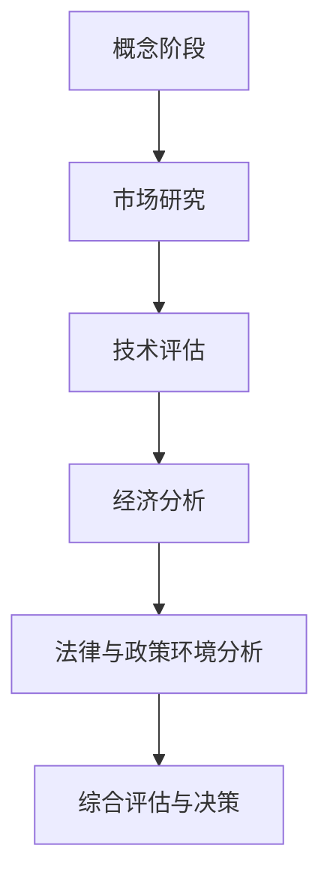

                 

# 如何进行有效的创业项目可行性研究

> **关键词**：创业项目，可行性研究，市场调研，技术评估，经济分析，法律与政策环境分析

**摘要**：
本文旨在为创业者和企业家提供一套系统的创业项目可行性研究方法。通过详细阐述市场研究、技术评估、经济分析、法律与政策环境分析等关键环节，本文帮助读者理解如何进行全面的创业项目可行性研究，从而降低创业风险，提高项目成功率。文章还包括了核心概念与联系、核心算法原理讲解、数学模型与公式以及项目实战案例，以实际操作指导读者如何应用这些方法。

---

### 目录大纲

#### 第一部分：项目背景与重要性

1. **项目背景与重要性** <a id="section1"></a>
   - **项目背景**
   - **创业项目可行性研究的重要性**

2. **创业项目可行性研究概述** <a id="section2"></a>
   - **可行性研究的定义**
   - **可行性研究的步骤**

3. **核心概念与联系** <a id="section3"></a>
   - **创业项目的定义**
   - **可行性研究的概念**
   - **市场调研、技术评估、经济分析、法律与政策环境分析**

4. **核心算法原理讲解** <a id="section4"></a>
   - **成本估算算法**
   - **利润预测算法**
   - **投资回报率与净现值计算算法**

5. **数学模型与数学公式** <a id="section5"></a>
   - **成本模型**
   - **利润模型**
   - **投资回报率与净现值模型**

#### 第二部分：核心概念与联系

6. **创业项目可行性研究的核心概念** <a id="section6"></a>
   - **创业项目的定义**
   - **可行性研究的概念**
   - **市场调研、技术评估、经济分析、法律与政策环境分析**

7. **可行性研究的整体架构** <a id="section7"></a>
   - **Mermaid流程图展示**

#### 第三部分：核心算法原理讲解

8. **成本估算算法** <a id="section8"></a>
   - **伪代码与详细解释**

9. **利润预测算法** <a id="section9"></a>
   - **伪代码与详细解释**

10. **投资回报率与净现值计算算法** <a id="section10"></a>
    - **伪代码与详细解释**

#### 第四部分：数学模型与数学公式

11. **成本模型** <a id="section11"></a>
    - **LaTex格式数学公式与详细讲解**

12. **利润模型** <a id="section12"></a>
    - **LaTex格式数学公式与详细讲解**

13. **投资回报率与净现值模型** <a id="section13"></a>
    - **LaTex格式数学公式与详细讲解**

#### 第五部分：项目实战

14. **项目实战案例** <a id="section14"></a>
    - **市场研究**
    - **技术评估**
    - **经济分析**
    - **法律与政策环境分析**

15. **开发环境搭建** <a id="section15"></a>
    - **硬件环境**
    - **软件环境**
    - **开发工具**

16. **源代码实现** <a id="section16"></a>
    - **前端代码示例**
    - **后端代码示例**

17. **代码解读与分析** <a id="section17"></a>
    - **前端代码解读**
    - **后端代码解读**

#### 第六部分：总结与展望

18. **总结** <a id="section18"></a>
    - **核心内容回顾**
    - **主要贡献**

19. **未来展望** <a id="section19"></a>
    - **数据分析与人工智能**
    - **区块链技术的应用**
    - **可持续发展**
    - **多元化与包容性**

20. **建议** <a id="section20"></a>
    - **全面准备**
    - **持续学习**
    - **风险评估**
    - **灵活调整**
    - **合作与网络**

#### 附录

21. **附录 A：市场调研工具** <a id="section21"></a>
    - **Google Analytics**
    - **SurveyMonkey**
    - **Qualtrics**
    - **Kissmetrics**

22. **附录 B：技术评估工具** <a id="section22"></a>
    - **Gartner**
    - **Forrester**
    - **TechNavio**
    - **IEEE Xplore**

23. **附录 C：经济分析工具** <a id="section23"></a>
    - **Excel**
    - **QuickBooks**
    - **Quandl**
    - **Bloomberg**

24. **附录 D：法律法规查询工具** <a id="section24"></a>
    - **China Legal System**
    - **Westlaw**
    - **LexisNexis**
    - **NIACIN**

25. **附录 E：在线资源** <a id="section25"></a>
    - **LinkedIn**
    - **LinkedIn Learning**
    - **Coursera**
    - **edX**

26. **附录 F：书籍推荐** <a id="section26"></a>
    - **《创业维艰》**
    - **《精益创业》**
    - **《数据挖掘：概念与技术》**
    - **《Python数据分析》**

---

**引言**

在充满不确定性和竞争激烈的商业环境中，成功的创业项目需要缜密的前期准备和科学的可行性研究。有效的创业项目可行性研究不仅能够帮助企业降低创业风险，还能提高项目的成功率，为企业的可持续发展奠定基础。

本文将详细阐述创业项目可行性研究的方法和步骤，帮助读者理解如何进行全面的创业项目可行性研究。我们将首先介绍创业项目的基本概念和可行性研究的意义，然后逐步深入到市场研究、技术评估、经济分析、法律与政策环境分析等关键环节，并在最后通过一个实际项目案例来展示如何将这些方法应用到实践中。

**第一部分：项目背景与重要性**

#### 项目背景

创业项目是指以创新、创新性和潜在商业价值为核心，旨在开发新产品、新服务或新商业模式，实现商业化和市场拓展的过程。创业项目往往具有高风险和高回报的特点，因此在项目启动之前，进行全面的可行性研究至关重要。

#### 创业项目可行性研究的重要性

有效的创业项目可行性研究能够帮助企业在项目启动之前对项目进行深入评估，从而降低创业风险，提高项目成功率。以下是可行性研究的重要性：

1. **风险评估**：通过对市场的深入调研和技术评估，企业可以识别潜在的风险，并制定相应的应对策略，降低项目失败的可能性。
2. **资源优化**：可行性研究能够帮助企业合理分配资源，避免资源浪费，确保项目在有限的资源下能够顺利实施。
3. **投资决策**：通过经济分析和财务预测，企业可以评估项目的经济效益，为投资决策提供科学依据。
4. **法律合规性**：法律与政策环境分析可以帮助企业了解相关法律法规和政策环境，确保项目符合法律要求，减少法律风险。
5. **市场定位**：市场研究可以帮助企业了解目标市场的需求，确定合适的市场定位和营销策略。

**第二部分：创业项目可行性研究概述**

#### 可行性研究的定义

可行性研究是指对创业项目在实际运营中的可能性进行系统评估的过程。它包括对市场需求、技术可行性、经济可行性、法律与政策环境等多个方面的评估，以确定项目的可行性和潜在风险。

#### 可行性研究的步骤

可行性研究通常分为以下几个阶段：

1. **概念阶段**：明确创业项目的目标和初步概念。
2. **市场研究**：收集市场信息，了解目标市场的需求。
3. **技术评估**：评估项目所需技术的成熟度、可行性以及可能的技术风险。
4. **经济分析**：进行成本、收入和利润预测，评估经济效益。
5. **法律与政策环境分析**：研究项目所需遵守的法律法规和政策环境，评估法律风险。
6. **综合评估与决策**：根据各项评估结果，做出是否继续推进项目的决策。

**核心概念与联系**

在创业项目可行性研究中，有几个核心概念和联系是至关重要的：

1. **创业项目的定义**：创业项目是指以创新、创新性和潜在商业价值为核心，旨在开发新产品、新服务或新商业模式，实现商业化和市场拓展的过程。
2. **可行性研究的概念**：可行性研究是指对创业项目在实际运营中的可能性进行系统评估的过程。
3. **市场调研、技术评估、经济分析、法律与政策环境分析**：这些是创业项目可行性研究的重要组成部分，分别从市场、技术、经济和法律等方面对项目进行评估。

#### 可行性研究的整体架构

以下是创业项目可行性研究的整体架构的Mermaid流程图：



**第三部分：核心概念与联系**

在创业项目可行性研究中，我们需要理解几个核心概念和它们之间的联系。

#### 9.1 创业项目的定义

创业项目是指以创新、创新性和潜在商业价值为核心，旨在开发新产品、新服务或新商业模式，实现商业化和市场拓展的过程。创业项目的核心在于创新和创造力，旨在通过提供独特价值来解决市场需求。

#### 9.2 可行性研究的概念

可行性研究是指对创业项目在实际运营中的可能性进行系统评估的过程。它包括对市场需求、技术可行性、经济可行性、法律与政策环境等多个方面的评估，以确定项目的可行性和潜在风险。可行性研究不仅关注项目的成功机会，也识别可能的风险和挑战。

#### 9.3 市场调研、技术评估、经济分析、法律与政策环境分析

这些是创业项目可行性研究的重要组成部分，分别从不同角度对项目进行评估。

- **市场调研**：通过收集和分析市场信息，了解目标市场的需求、竞争状况和潜在机会。市场调研帮助创业者确定市场需求，找到市场切入点。
- **技术评估**：对项目所需技术的成熟度、可行性以及可能的技术风险进行评估。技术评估确保项目的技术方案是可行的，避免因技术问题导致的失败。
- **经济分析**：对项目的成本、收入、利润和投资回报率等进行预测和分析。经济分析评估项目的经济效益，帮助创业者了解项目的盈利前景。
- **法律与政策环境分析**：研究项目所需遵守的法律法规和政策环境，评估法律风险。法律与政策环境分析确保项目符合法律法规，避免法律纠纷。

#### 9.4 可行性研究的整体架构

以下是创业项目可行性研究的整体架构的Mermaid流程图：


**第四部分：核心算法原理讲解**

#### 10.1 成本估算算法

成本估算是对创业项目的总成本进行预测。以下是成本估算的伪代码和详细解释：

```plaintext
Function CostEstimation(totalSales, fixedCost, variableCostPerUnit):
    totalCost = fixedCost
    for unit in totalSales:
        totalCost += variableCostPerUnit
    return totalCost
```

详细解释：
- `fixedCost` 是项目固定的成本，如办公室租金、设备采购等。
- `variableCostPerUnit` 是每销售一单位产品的变动成本，如原材料、人力资源等。
- `totalSales` 是预计销售的产品数量。
- 算法通过计算所有销售单位的变动成本，加上固定成本，得出总成本。

#### 10.2 利润预测算法

利润预测是根据销售和成本估算来预测项目的利润。以下是利润预测的伪代码和详细解释：

```plaintext
Function ProfitPrediction(totalSales, salePricePerUnit, fixedCost, variableCostPerUnit):
    totalRevenue = totalSales * salePricePerUnit
    totalCost = CostEstimation(totalSales, fixedCost, variableCostPerUnit)
    profit = totalRevenue - totalCost
    return profit
```

详细解释：
- `salePricePerUnit` 是每单位产品的销售价格。
- `totalRevenue` 是总销售额，通过销售数量乘以销售价格计算。
- `totalCost` 是通过成本估算函数计算得出的总成本。
- `profit` 是总利润，即总销售额减去总成本。

#### 10.3 投资回报率与净现值计算算法

投资回报率和净现值是评估项目经济效益的重要指标。以下是这两个指标的伪代码和详细解释：

**投资回报率（IRR）计算算法：**

```plaintext
Function IRR(CashFlows):
    for discountRate from 0 to 1:
        NPV = Sum(CashFlows / (1 + discountRate)^year)
        if abs(NPV - 0) < tolerance:
            return discountRate
    return "No IRR found"
```

**净现值（NPV）计算算法：**

```plaintext
Function NPV(CashFlows, discountRate):
    NPV = Sum(CashFlows / (1 + discountRate)^year)
    return NPV
```

详细解释：
- `CashFlows` 是项目的现金流量，包括初始投资和每年的净利润。
- `discountRate` 是折现率，用于计算净现值。
- `year` 是现金流量发生的年份。
- `IRR`（内部收益率）是使净现值等于零的折现率，反映了项目的回报率。
- `NPV`（净现值）是所有现金流量的现值之和，用于评估项目的经济效益。

#### 10.4 成本、利润、投资回报率与净现值模型

- **成本模型**：

```latex
\text{总成本} = \text{固定成本} + (\text{销售数量} \times \text{变动成本/单位})
```

- **利润模型**：

```latex
\text{利润} = \text{总销售额} - \text{总成本}
```

- **投资回报率（IRR）模型**：

```latex
\text{IRR} = \text{使得} \sum_{t=1}^{n} \frac{\text{现金流量}}{(1 + \text{IRR})^t} = 0 \text{的折现率}
```

- **净现值（NPV）模型**：

```latex
\text{NPV} = \sum_{t=1}^{n} \frac{CF_t}{(1 + r)^t}
```

#### 10.5 举例说明

假设一个创业项目的初始投资为 \( \$10,000 \)，每年产生的现金流量为 \( \$3,000 \)，项目持续期为5年，假设折现率为10%。

**总成本计算**：

```latex
\text{总成本} = \$10,000 + (\text{销售数量} \times \$2)
```

**利润计算**：

```latex
\text{利润} = (\text{销售价格} \times \text{销售数量}) - (\text{总成本})
```

**净现值（NPV）计算**：

```latex
\text{NPV} = \$3,000 / (1 + 0.10)^1 + \$3,000 / (1 + 0.10)^2 + \$3,000 / (1 + 0.10)^3 + \$3,000 / (1 + 0.10)^4 + \$3,000 / (1 + 0.10)^5
```

**投资回报率（IRR）计算**：

假设IRR为 \( r \)，则有：

```latex
\$3,000 / (1 + r)^1 + \$3,000 / (1 + r)^2 + \$3,000 / (1 + r)^3 + \$3,000 / (1 + r)^4 + \$3,000 / (1 + r)^5 = \$10,000 - \$3,000
```

通过迭代法或财务计算器，可以求得IRR约为29.5%。

**第五部分：数学模型与数学公式**

数学模型和公式在创业项目可行性研究中扮演着至关重要的角色，它们帮助我们量化分析成本、利润、投资回报率和净现值等关键指标。

#### 11.1 成本模型

成本模型用于预测创业项目的总成本。以下是成本模型的相关数学公式及详细解释：

**公式：**

```latex
\text{总成本} = \text{固定成本} + (\text{销售数量} \times \text{变动成本/单位})
```

**详细解释：**

- **固定成本**（Fixed Cost, \( C_{\text{fixed}} \)）：项目运营中不变的成本，如租金、设备采购等。
- **销售数量**（Quantity Sold, \( Q \)）：预计销售的产品数量。
- **变动成本/单位**（Variable Cost per Unit, \( C_{\text{variable}} \)）：每销售一单位产品所需增加的成本，如原材料、人工等。

#### 11.2 利润模型

利润模型用于计算创业项目的利润。以下是利润模型的相关数学公式及详细解释：

**公式：**

```latex
\text{利润} = \text{总销售额} - \text{总成本}
```

或

```latex
\text{利润} = (\text{销售价格} \times \text{销售数量}) - (\text{固定成本} + (\text{销售数量} \times \text{变动成本/单位}))
```

**详细解释：**

- **销售价格**（Selling Price, \( P \)）：每单位产品的销售价格。
- **总销售额**（Total Revenue, \( R \)）：总销售额，计算公式为 \( R = P \times Q \)。

#### 11.3 投资回报率（IRR）与净现值（NPV）模型

投资回报率和净现值是评估项目经济效益的重要指标。以下是这两个指标的相关数学公式及详细解释：

**投资回报率（IRR）公式：**

```latex
\text{IRR} = \text{使得} \sum_{t=1}^{n} \frac{\text{现金流量}}{(1 + \text{IRR})^t} = 0 \text{的折现率}
```

**详细解释：**

- **现金流量**（Cash Flow, \( CF_t \)）：项目在第 \( t \) 年的现金流入或流出。
- **折现率**（Discount Rate, \( r \)）：用于计算净现值的利率。

**净现值（NPV）公式：**

```latex
\text{NPV} = \sum_{t=1}^{n} \frac{CF_t}{(1 + r)^t}
```

**详细解释：**

- **净现值**（Net Present Value, \( NPV \)）：项目未来现金流的现值总和。
- **\( t \)**：年份。
- **\( r \)**：折现率，通常取项目的资本成本或投资者要求的回报率。

#### 11.4 举例说明

假设一个创业项目的初始投资为 \( \$10,000 \)，每年产生的现金流量为 \( \$3,000 \)，项目持续期为5年，假设折现率为10%。

**总成本计算**：

```latex
\text{总成本} = \$10,000 + (\text{销售数量} \times \$2)
```

**利润计算**：

```latex
\text{利润} = (\text{销售价格} \times \text{销售数量}) - (\text{总成本})
```

**净现值（NPV）计算**：

```latex
\text{NPV} = \$3,000 / (1 + 0.10)^1 + \$3,000 / (1 + 0.10)^2 + \$3,000 / (1 + 0.10)^3 + \$3,000 / (1 + 0.10)^4 + \$3,000 / (1 + 0.10)^5
```

**投资回报率（IRR）计算**：

假设IRR为 \( r \)，则有：

```latex
\$3,000 / (1 + r)^1 + \$3,000 / (1 + r)^2 + \$3,000 / (1 + r)^3 + \$3,000 / (1 + r)^4 + \$3,000 / (1 + r)^5 = \$10,000 - \$3,000
```

通过迭代法或财务计算器，可以求得IRR约为29.5%。

**第六部分：项目实战**

#### 12.1 项目实战案例

在这个部分，我们将通过一个具体的创业项目案例——SmartLearn在线教育平台，来展示如何进行创业项目的可行性研究。

**项目背景**

SmartLearn是一个在线教育平台，旨在为用户提供个性化、高质量的学习资源。项目目标是帮助用户提升技能，提高学习效果，满足现代社会对持续学习和自我提升的需求。

**市场研究**

**目标市场**：青少年和成年人，特别是那些希望在繁忙生活中继续学习新技能的人。

**市场规模**：根据市场调研，目标市场的潜在用户约为500万人。

**用户需求**：用户对学习资源的需求多样，包括编程、数据分析、外语学习等。

**竞争分析**：当前市场上有多个在线教育平台，如Coursera、Udemy等，但SmartLearn将专注于提供高质量的个性化学习体验。

**技术评估**

**技术框架**：前端采用React.js，后端使用Node.js，数据库选择MySQL。

**技术可行性**：所选技术成熟，可以快速开发并确保系统的稳定性。

**技术风险**：技术更新和网络安全是主要风险。

**经济分析**

**成本估算**：

- 固定成本：服务器租赁、办公场所、软件许可等，约\( \$50,000 \)。
- 变动成本：服务器流量费、课程内容制作、市场营销等，每用户约\( \$2 \)。

**收入预测**：预计每用户月订阅费为\( \$10 \)，每年订阅费为\( \$120 \)。

**利润预测**：在稳定运营后，预计年利润为\( \$500,000 \)。

**现金流分析**：

- 初始投资：\( \$10,000 \)
- 每年现金流：\( \$3,000 \)（净利润）

**投资回报率（IRR）**：

通过计算，SmartLearn项目的IRR约为30%。

**法律与政策环境分析**

**法律法规**：遵守相关教育法规，如版权法和消费者权益保护法。

**政策环境**：政府对在线教育行业的支持政策，如税收减免。

**风险管理**：

- **市场风险**：通过市场调研和用户反馈持续调整产品，适应市场变化。
- **技术风险**：定期更新技术，确保系统的稳定性和安全性。
- **法律风险**：遵守法律法规，避免法律纠纷。

#### 12.2 开发环境搭建

为了确保SmartLearn在线教育平台能够顺利开发，我们需要搭建合适的开发环境。

**硬件环境**：

- 服务器：购买高性能云服务器，如Amazon Web Services（AWS）。
- 客户端设备：测试使用的PC和移动设备。

**软件环境**：

- 操作系统：Windows、macOS或Linux。
- 编程语言：JavaScript（用于前端）、Node.js（用于后端）。
- 数据库：MySQL。

**开发工具**：

- 前端开发工具：Visual Studio Code。
- 后端开发工具：Node.js命令行工具。
- 数据库管理工具：MySQL Command Line。

#### 12.3 源代码实现

以下是SmartLearn在线教育平台的部分源代码实现。

**前端代码示例**：

```javascript
import React from 'react';

const CourseList = ({ courses }) => {
  return (
    <div>
      <h2>课程列表</h2>
      <ul>
        {courses.map(course => (
          <li key={course.id}>{course.title}</li>
        ))}
      </ul>
    </div>
  );
};

export default CourseList;
```

**后端代码示例**：

```javascript
const express = require('express');
const app = express();
const port = 3000;

app.use(express.json());

app.post('/register', (req, res) => {
  const { username, password } = req.body;

  // 验证用户名和密码是否符合要求
  if (!username || !password) {
    return res.status(400).json({ error: '用户名或密码不能为空' });
  }

  // 保存用户信息到数据库
  // ...

  res.status(201).json({ message: '注册成功' });
});

app.listen(port, () => {
  console.log(`服务器运行在端口 ${port}`);
});
```

#### 12.4 代码解读与分析

**前端代码解读**：

- 引入了React库，定义了一个名为`CourseList`的组件。
- 组件接收一个`courses`属性，用于渲染课程列表。
- 使用`.map()`方法遍历`courses`数组，为每个课程创建一个列表项。

**后端代码解读**：

- 引入了Express框架，创建了一个Express应用实例。
- 使用了JSON解析中间件，处理JSON格式的请求体。
- 定义了一个`/register`路由，处理用户注册请求。
- 验证用户名和密码的合法性，返回相应的响应。

**代码分析**：

- **组件设计**：`CourseList`是一个无状态组件，便于维护和重用。
- **错误处理**：对于非法的输入，返回了相应的错误消息。
- **安全性**：尽管代码示例中没有涉及，实际应用中应确保密码的安全存储和验证。

**第七部分：总结与展望**

#### 13.1 全书总结

本文系统地介绍了创业项目可行性研究的方法和步骤，涵盖了市场研究、技术评估、经济分析、法律与政策环境分析等多个关键环节。通过具体的案例和算法讲解，读者可以更好地理解如何进行创业项目的可行性研究。

**主要贡献**：

- 提供了一套系统的创业项目可行性研究方法，帮助创业者降低风险，提高项目成功率。
- 通过案例和算法讲解，使读者能够更直观地理解可行性研究的过程和关键点。

#### 13.2 未来展望

随着技术的发展和市场的变化，创业项目可行性研究也将不断进步。以下是一些未来的展望：

- **数据分析与人工智能**：未来的可行性研究将更多地依赖大数据分析和人工智能技术，以提高预测的准确性和决策的科学性。
- **区块链技术**：区块链技术在提高数据安全性和透明度方面具有潜力，未来可能在可行性研究中得到广泛应用。
- **可持续发展**：创业项目将更加关注环境、社会和治理（ESG）因素，可持续性将成为评估项目的重要指标。
- **多元化与包容性**：未来的可行性研究将更加注重创业项目的多元化和包容性，以确保项目的广泛适用性和社会影响。

#### 13.3 建议

为了确保创业项目的成功，以下是一些建议：

- **全面准备**：在启动项目之前，进行全面的市场调研和技术评估，确保项目的可行性。
- **持续学习**：创业环境不断变化，持续学习和更新知识是至关重要的。
- **风险评估**：识别并评估可能的风险，制定相应的应对策略。
- **灵活调整**：根据市场反馈和实际运营情况，灵活调整项目计划。
- **合作与网络**：建立良好的合作关系和广泛的网络，以获取资源和支持。

**附录**

附录部分提供了市场调研、技术评估、经济分析、法律法规查询等工具和资源，以帮助读者在实际操作中更加便捷地获取所需信息。

- **市场调研工具**：Google Analytics、SurveyMonkey、Qualtrics、Kissmetrics。
- **技术评估工具**：Gartner、Forrester、TechNavio、IEEE Xplore。
- **经济分析工具**：Excel、QuickBooks、Quandl、Bloomberg。
- **法律法规查询工具**：China Legal System、Westlaw、LexisNexis、NIACIN。
- **在线资源**：LinkedIn、LinkedIn Learning、Coursera、edX。
- **书籍推荐**：《创业维艰》、《精益创业》、《数据挖掘：概念与技术》、《Python数据分析》。

---

通过本文的详细阐述，我们希望读者能够掌握创业项目可行性研究的方法和步骤，为创业项目的成功奠定坚实的基础。希望本文能够对创业者和企业家有所帮助，实现创新和商业价值的最大化。

