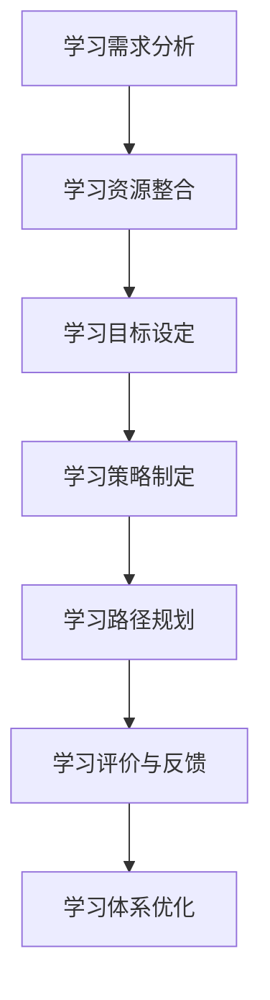
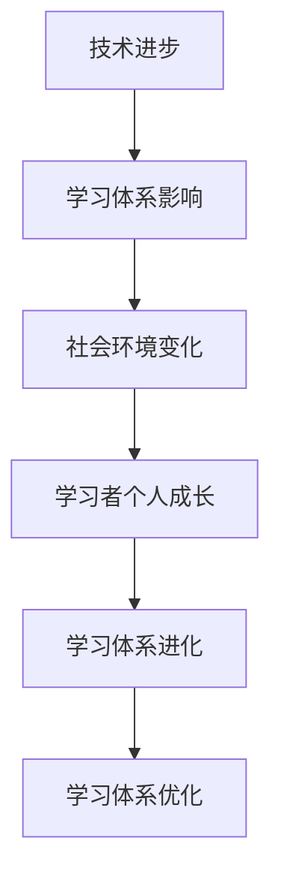
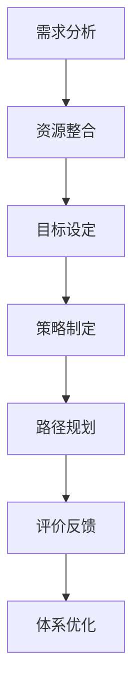

                 

### 《学习体系构建：持续进化的动力》

> **关键词：** 学习体系、持续进化、构建策略、实践案例、优化

**摘要：** 本文章旨在探讨学习体系的构建，从基础到实践，再到持续进化，提供一种系统性的方法来应对快速变化的技术环境。文章首先定义了学习体系的含义和重要性，随后逐步分析了构建学习体系的基础要素，如学习需求的识别、资源的选择与整合、目标的设定与分解等。在设计和实践部分，文章详细阐述了学习策略的制定、学习路径的规划与执行、以及学习评价与反馈机制。最后，文章讨论了学习体系的持续进化与优化策略，并通过实际案例展示了学习体系构建的应用效果。本文旨在为读者提供一个全面、实用的学习体系构建指南。

## 《学习体系构建：持续进化的动力》目录大纲

- **第一部分：引言与背景**
  - **1.1 学习体系的定义与重要性**
  - **1.2 学习体系的演变历程**
  - **1.3 持续进化的动力来源**

- **第二部分：学习体系的构建基础**
  - **2.1 学习需求的识别与定位**
    - **2.1.1 学习需求分析框架**
    - **2.1.2 学习需求识别方法**
    - **2.1.3 学习需求定位实践**
  - **2.2 学习资源的选择与整合**
    - **2.2.1 学习资源类型及特点**
    - **2.2.2 学习资源选择策略**
    - **2.2.3 学习资源整合方法**
  - **2.3 学习目标的设定与分解**
    - **2.3.1 学习目标设定原则**
    - **2.3.2 学习目标分解方法**
    - **2.3.3 学习目标实现路径**

- **第三部分：学习体系的设计与实践**
  - **3.1 学习策略的制定与优化**
    - **3.1.1 学习策略的类型与选择**
    - **3.1.2 学习策略的制定流程**
    - **3.1.3 学习策略的优化方法**
  - **3.2 学习路径的规划与执行**
    - **3.2.1 学习路径规划的原则**
    - **3.2.2 学习路径规划的方法**
    - **3.2.3 学习路径的执行与调整**
  - **3.3 学习评价与反馈机制**
    - **3.3.1 学习评价的方法与工具**
    - **3.3.2 学习评价的反馈机制**
    - **3.3.3 学习评价的改进策略**

- **第四部分：学习体系的持续进化与优化**
  - **4.1 学习体系进化的驱动力**
    - **4.1.1 技术进步对学习体系的影响**
    - **4.1.2 社会环境变化对学习体系的影响**
    - **4.1.3 学习者个人成长对学习体系的影响**
  - **4.2 学习体系优化的策略与实践**
    - **4.2.1 学习体系优化的原则与方法**
    - **4.2.2 学习体系优化的实践案例分析**
    - **4.2.3 学习体系优化的持续改进机制**

- **第五部分：学习体系构建的案例分析**
  - **5.1 案例一：企业内部学习体系的构建**
  - **5.2 案例二：在线学习平台的设计与实施**

- **第六部分：学习体系构建的挑战与未来趋势**
  - **6.1 学习体系构建面临的挑战**
  - **6.2 学习体系构建的未来趋势**

- **第七部分：附录**
  - **7.1 学习体系构建的相关资源**
  - **7.2 学习体系构建的参考书目**
  - **7.3 学习体系构建的 Mermaid 流程图**

### 第一部分：引言与背景

#### 1.1 学习体系的定义与重要性

学习体系是指一个人或组织在特定目标和需求驱动下，对知识、技能和资源的系统化、结构化、可持续的获取、整合和应用过程。它不仅涉及学习的内容，还包括学习的路径、策略、评价和反馈等多个方面。学习体系的核心在于将个体的学习行为转化为持续的知识积累和能力提升，以适应不断变化的外部环境。

在当今快速变化的技术和社会环境中，学习体系的重要性愈发凸显。首先，技术进步日新月异，新知识、新技能不断涌现，个人和组织必须具备快速学习的能力，以应对日益激烈的市场竞争。其次，社会环境的复杂性和不确定性增加，要求个人和组织具备更高的适应能力和创新能力。最后，终身学习的理念日益普及，学习不再是阶段性任务，而是贯穿个人职业生涯的持续过程。

因此，构建一个科学、高效的学习体系，成为个人和组织在复杂环境中脱颖而出的关键。一个完善的学习体系能够帮助个人和组织实现以下目标：

1. **知识更新与技能提升**：通过系统化的学习，及时掌握新知识、新技能，保持个人和组织的竞争力。
2. **学习能力培养**：培养个体的自学能力、批判性思维和解决问题的能力，提高终身学习的实践能力。
3. **资源整合与利用**：通过合理选择和整合学习资源，提高学习效率，降低学习成本。
4. **持续改进与创新**：通过不断优化学习体系，激发个人和组织的创新潜力，推动持续进化。

#### 1.2 学习体系的演变历程

学习体系的发展经历了从传统教育到现代教育的转变。在传统教育中，学习主要依赖于教师传授知识，学生被动接受。这种模式存在一定局限性，难以满足个体多样化的学习需求。随着教育技术的进步和终身学习理念的推广，学习体系逐渐向个性化、自主化、社会化方向发展。

1. **第一阶段：传统教育模式**

在传统教育模式中，学习体系以教师为中心，强调知识的传授。这一阶段的典型特征包括：

- **课程设置固定**：课程内容、教学进度由学校和教育机构统一安排。
- **学习资源有限**：学习资源主要依赖于教材、教室等实体资源。
- **评价方式单一**：主要采用考试成绩作为评价标准。

2. **第二阶段：现代教育模式**

随着信息技术的快速发展，现代教育模式逐渐取代传统教育模式。这一阶段的学习体系具有以下特征：

- **个性化学习**：根据个体差异和学习需求，制定个性化的学习计划。
- **多元化资源**：利用网络、多媒体等现代技术，提供丰富的学习资源。
- **自主学习**：鼓励学生自主学习、合作学习，培养独立思考和解决问题的能力。
- **综合评价**：采用多种评价方式，全面衡量学习效果。

3. **第三阶段：终身学习模式**

终身学习模式强调学习不仅仅局限于学校阶段，而是贯穿个人职业生涯的各个阶段。这一阶段的学习体系具有以下特征：

- **学习目标多元化**：不仅关注知识技能的获取，更注重个人成长和职业发展。
- **学习方式灵活**：根据个人需求和实际情况，灵活选择学习时间和地点。
- **学习资源集成**：整合线上线下资源，构建全方位的学习支持体系。
- **学习评估持续**：通过实时反馈和调整，确保学习目标的实现。

#### 1.3 持续进化的动力来源

学习体系的持续进化依赖于以下动力来源：

1. **技术进步**：信息技术的发展为学习体系提供了新的工具和方法，如在线学习平台、虚拟现实技术、人工智能等，使得学习更加灵活、高效和个性化。
2. **社会需求**：社会环境的复杂性和不确定性要求个体和组织具备更高的适应能力和创新能力，推动学习体系不断优化和进化。
3. **个体需求**：随着个人终身学习意识的提高，个体对学习体系的要求也越来越高，促使学习体系不断创新和改进。
4. **政策支持**：政府和企业对学习体系的支持，如制定相关政策和提供资金支持，有助于学习体系的持续进化。

### 第二部分：学习体系的构建基础

#### 2.1 学习需求的识别与定位

构建一个有效的学习体系，首先要明确学习需求。学习需求是指个体或组织在特定背景下，为满足特定目标或解决特定问题，所需掌握的知识、技能和资源。识别和定位学习需求是构建学习体系的重要基础。

##### 2.1.1 学习需求分析框架

学习需求分析框架主要包括以下三个方面：

1. **目标分析**：明确学习目标，包括知识目标、能力目标和价值观目标。目标分析有助于明确学习的方向和重点。
2. **现状分析**：了解当前的知识水平、技能水平和资源状况，包括自身的优势和劣势。现状分析有助于确定学习需求的迫切程度和优先级。
3. **差距分析**：通过目标与现状的比较，识别出知识、技能和资源方面的差距，明确学习需求的具体内容和范围。

##### 2.1.2 学习需求识别方法

识别学习需求的方法主要包括以下几种：

1. **访谈法**：通过与相关人员访谈，了解他们的学习需求和意见。访谈法适用于了解个体和组织的学习需求。
2. **问卷调查法**：通过设计问卷，收集大量个体的学习需求信息。问卷调查法适用于大规模、快速收集学习需求。
3. **文献分析法**：通过查阅相关文献和资料，了解当前学习需求和研究成果。文献分析法适用于了解行业或领域内的学习需求。
4. **观察法**：通过观察个体或组织的学习行为和过程，了解他们的学习需求。观察法适用于了解实际学习情况。

##### 2.1.3 学习需求定位实践

以下是一个学习需求定位的实践案例：

**案例背景**：某公司计划开展一项关于人工智能技术培训的项目，旨在提升员工在人工智能领域的专业能力。

**目标分析**：公司设定的学习目标包括：
- 掌握人工智能的基本概念和原理；
- 学会使用常用的人工智能工具和框架；
- 提升在实际项目中应用人工智能技术的能力。

**现状分析**：通过问卷调查和访谈，了解到员工在人工智能领域的知识水平、技能水平和资源状况：
- 知识水平：大部分员工对人工智能的基本概念和原理有一定了解，但深度不足；
- 技能水平：部分员工具备使用常用人工智能工具和框架的经验，但应用能力较弱；
- 资源状况：公司提供了一些人工智能相关的书籍和在线课程，但资源利用率不高。

**差距分析**：通过目标与现状的比较，识别出以下学习需求：
- 需要深入学习人工智能的基本概念和原理；
- 需要提升在实际项目中应用人工智能技术的技能；
- 需要更有效地利用公司提供的学习资源。

**学习需求定位**：基于上述分析，公司确定了以下学习需求：
- 基础知识学习：系统学习人工智能的基本概念和原理，包括机器学习、深度学习等；
- 工具与应用技能培训：掌握常用的人工智能工具和框架，提升实际项目中的应用能力；
- 资源利用优化：提高员工对学习资源的利用率，确保学习资源的有效利用。

通过以上实践，公司明确了人工智能培训项目的具体学习需求，为后续的学习体系构建奠定了基础。

#### 2.2 学习资源的选择与整合

学习资源是构建学习体系的重要组成部分。选择和整合适合的学习资源，可以提高学习的效率和质量。学习资源包括书籍、在线课程、讲座、研讨会、实践项目等多种形式。

##### 2.2.1 学习资源类型及特点

1. **书籍**：书籍是传统的学习资源，具有系统、全面、深入的特点。适合系统学习某个领域的知识。

2. **在线课程**：在线课程具有灵活、便捷、互动性强的特点，适合碎片化学习。在线课程通常包括视频、文本、作业等多种形式。

3. **讲座与研讨会**：讲座与研讨会是面对面的学习方式，具有实时互动、深入讨论的特点。适合提升思维能力和解决问题的能力。

4. **实践项目**：实践项目是通过实际操作来学习知识的方法，具有实战性强、提高技能的特点。适合提升实际应用能力。

##### 2.2.2 学习资源选择策略

选择学习资源时，需要考虑以下几个方面：

1. **学习目标**：根据学习目标选择适合的学习资源。例如，如果目标是掌握编程技能，可以选择相关的在线课程和实践项目。

2. **资源质量**：选择质量高、口碑好的学习资源。可以通过查阅评论、推荐、评分等来评估资源质量。

3. **学习需求**：根据学习需求选择适合的学习资源。例如，如果学习需求是提升沟通能力，可以选择相关的书籍和讲座。

4. **个人兴趣**：选择符合个人兴趣的学习资源，可以提高学习动力和兴趣。

##### 2.2.3 学习资源整合方法

整合学习资源的方法包括以下几种：

1. **分类整理**：将学习资源按照学科、主题、难度等级等进行分类整理，便于查找和使用。

2. **搭建学习平台**：搭建一个学习平台，将各种学习资源整合在一起，提供统一的学习入口。

3. **共享与协作**：鼓励学习资源共享和协作，提高学习资源的利用率。例如，组建学习小组，共同学习、讨论和分享。

4. **持续更新**：定期更新学习资源，确保学习资源与最新的知识和技术保持同步。

#### 2.3 学习目标的设定与分解

设定明确的学习目标是构建学习体系的关键步骤。一个清晰、具体的学习目标能够帮助学习者明确学习方向，提高学习效率。同时，学习目标的设定需要结合个人或组织的实际情况，具有可操作性和可行性。

##### 2.3.1 学习目标设定原则

1. **SMART原则**：设定学习目标时，应遵循SMART原则，即具体（Specific）、可衡量（Measurable）、可实现（Achievable）、相关（Relevant）和有时间限制（Time-bound）。

2. **目标分层**：将学习目标分为短期目标、中期目标和长期目标，确保目标的逐步实现。

3. **目标一致**：学习目标应与个人或组织的整体目标保持一致，确保学习活动的有效性。

4. **灵活性**：学习目标应具有一定的灵活性，以便在实际情况发生变化时进行适当调整。

##### 2.3.2 学习目标分解方法

1. **目标分解法**：将总体学习目标分解为具体的子目标，逐步实现。例如，将一个长期目标分解为多个短期目标，每个短期目标都有明确的时间节点和衡量标准。

2. **关键路径法**：识别学习过程中最为关键的任务和路径，确保关键任务的优先完成。

3. **优先级排序**：根据目标的紧急程度和重要性，对学习目标进行优先级排序，确保优先完成重要且紧急的目标。

##### 2.3.3 学习目标实现路径

1. **制定计划**：根据学习目标，制定详细的学习计划，包括学习内容、学习资源、学习时间和学习方式。

2. **执行与监控**：按照学习计划执行学习任务，定期监控学习进度和效果，及时调整学习策略。

3. **评估与反馈**：对学习目标实现情况进行评估，收集反馈意见，不断优化学习体系。

4. **持续改进**：根据评估结果和反馈意见，持续改进学习目标和计划，确保学习目标的实现。

### 第三部分：学习体系的设计与实践

#### 3.1 学习策略的制定与优化

学习策略是指为实现学习目标所采用的方法和手段。一个科学、合理的学习策略能够提高学习效率，确保学习目标的实现。制定和优化学习策略是构建学习体系的重要环节。

##### 3.1.1 学习策略的类型与选择

1. **自主学习策略**：自主学习策略强调个体的主动参与和自主学习能力。这种方法适用于培养个体的独立思考和解决问题的能力。具体包括：
   - 自主选择学习资源：根据个人需求和兴趣，自主选择合适的书籍、在线课程和实践项目。
   - 自主设定学习目标：根据个人发展需求，自主设定具体、可衡量的学习目标。
   - 自主监控学习进度：通过自我评估和监控，了解学习进度和效果，及时调整学习策略。

2. **合作学习策略**：合作学习策略强调个体之间的协作和互动，通过合作完成任务，实现共同进步。这种方法适用于培养团队合作能力和沟通能力。具体包括：
   - 组建学习小组：根据学习目标和兴趣，组建学习小组，共同学习、讨论和分享。
   - 分工合作：在小组内明确分工，每个成员负责不同的任务，共同完成学习项目。
   - 定期讨论和反馈：定期组织讨论会，分享学习心得和经验，互相反馈和建议。

3. **实践学习策略**：实践学习策略强调通过实际操作和项目实践来学习知识。这种方法适用于提升实际操作能力和解决问题的能力。具体包括：
   - 实践项目：根据学习目标，设计相关的实践项目，通过实际操作来掌握知识和技能。
   - 项目反馈：在实践项目中，及时收集反馈意见，不断改进和完善项目。
   - 实践总结：在实践结束后，对实践过程和结果进行总结，提炼经验和教训。

##### 3.1.2 学习策略的制定流程

制定学习策略的流程包括以下几个步骤：

1. **明确学习目标**：首先，明确学习目标，包括知识目标、能力目标和价值观目标。学习目标应具体、可衡量、可实现、相关和有时间限制。

2. **分析学习需求**：分析个人或组织的实际需求，了解当前的知识水平、技能水平和资源状况，识别出学习需求的优先级。

3. **选择学习策略**：根据学习目标和需求，选择合适的学习策略。可以选择自主学习、合作学习或实践学习等策略。

4. **制定学习计划**：根据学习策略，制定详细的学习计划，包括学习内容、学习资源、学习时间和学习方式。学习计划应具有可操作性和可行性。

5. **执行与监控**：按照学习计划执行学习任务，定期监控学习进度和效果，及时调整学习策略。

6. **评估与反馈**：对学习策略的执行效果进行评估，收集反馈意见，不断优化学习策略。

##### 3.1.3 学习策略的优化方法

1. **定期评估**：定期对学习策略进行评估，了解其执行效果和存在的问题。评估可以从学习进度、学习效果、学习体验等多个维度进行。

2. **反馈与调整**：根据评估结果和反馈意见，对学习策略进行调整和优化。可以增加或调整学习内容、学习资源、学习方式等。

3. **持续改进**：学习策略的优化是一个持续的过程，应不断收集反馈、评估和改进，确保学习策略的适应性和有效性。

4. **创新实践**：鼓励尝试新的学习策略和方法，如在线学习、虚拟现实学习等，以提升学习效果和体验。

#### 3.2 学习路径的规划与执行

学习路径是指学习者在学习过程中所经历的各个阶段和步骤。规划科学、合理的学习路径，可以确保学习目标的实现，提高学习效率。学习路径的规划与执行是构建学习体系的重要环节。

##### 3.2.1 学习路径规划的原则

1. **目标导向**：学习路径的规划应围绕学习目标展开，确保每个学习阶段和学习任务都有明确的目标和意义。

2. **循序渐进**：学习路径应遵循由浅入深、循序渐进的原则，确保学习者能够逐步掌握知识和技能。

3. **灵活调整**：学习路径应根据学习者的实际情况和需求进行灵活调整，以适应不断变化的学习环境。

4. **资源整合**：学习路径应充分考虑学习资源的利用，整合各种学习资源，提高学习效率。

##### 3.2.2 学习路径规划的方法

1. **任务分解法**：将学习目标分解为具体的任务，根据任务的性质和难度，规划学习路径。例如，将学习目标分为基础知识学习、技能训练和实践应用三个阶段。

2. **时间序列法**：根据学习任务的时间节点，规划学习路径。例如，将学习任务按照季度或月份进行安排。

3. **学习模式法**：根据学习者的学习习惯和偏好，选择合适的学习模式。例如，采用自主学习、合作学习和实践学习等模式。

4. **资源整合法**：根据学习资源的类型和特点，规划学习路径。例如，将线上学习和线下学习相结合，充分利用各种学习资源。

##### 3.2.3 学习路径的执行与调整

1. **执行与监控**：按照学习路径执行学习任务，定期监控学习进度和效果，确保学习目标的实现。

2. **反馈与评估**：在学习过程中，及时收集反馈意见，对学习路径进行评估和调整。评估可以从学习效果、学习体验和学习效率等多个维度进行。

3. **动态调整**：根据反馈和评估结果，对学习路径进行动态调整，确保学习路径的适应性和有效性。

4. **持续改进**：学习路径的优化是一个持续的过程，应不断收集反馈、评估和改进，确保学习路径的科学性和实用性。

#### 3.3 学习评价与反馈机制

学习评价与反馈机制是学习体系的重要组成部分，对于确保学习目标的实现、提高学习质量具有重要意义。通过科学的学习评价和及时的反馈，可以促进学习者的自我反思和改进，提升学习效果。

##### 3.3.1 学习评价的方法与工具

1. **自我评价**：自我评价是指学习者对自己的学习过程和成果进行评价。自我评价可以激发学习者的自我反思和自我提高意识，具体方法包括自我评估表、学习日志等。

2. **同伴评价**：同伴评价是指学习者之间的相互评价。同伴评价有助于学习者发现自身的优点和不足，提高学习效果。具体方法包括小组讨论、学习分享会等。

3. **教师评价**：教师评价是指教师对学习者的学习过程和成果进行评价。教师评价具有权威性和指导性，有助于学习者明确学习方向和改进方法。具体方法包括考试成绩、作业评语等。

4. **量化评价**：量化评价是指使用量化的方法对学习者的学习成果进行评价。量化评价可以更客观地反映学习者的学习效果，具体方法包括测验、考试等。

##### 3.3.2 学习评价的反馈机制

1. **即时反馈**：即时反馈是指在学习过程中，及时给予学习者反馈，帮助他们了解学习进度和效果。即时反馈有助于学习者及时发现问题和调整学习策略。

2. **阶段反馈**：阶段反馈是指在学习阶段结束时，对学习者的学习成果进行评价和反馈。阶段反馈有助于学习者总结经验、巩固成果，为下一个学习阶段做好准备。

3. **综合反馈**：综合反馈是指在学习结束后，对学习者的整体学习过程和成果进行评价和反馈。综合反馈有助于学习者全面了解学习效果，制定进一步的学习计划。

4. **持续反馈**：持续反馈是指在整个学习过程中，不断给予学习者反馈，帮助他们逐步改进学习方法和策略。持续反馈有助于学习者形成良好的学习习惯，提高学习效果。

##### 3.3.3 学习评价的改进策略

1. **多元化评价**：采用多种评价方法，如自我评价、同伴评价、教师评价和量化评价等，全面、客观地反映学习者的学习效果。

2. **动态评价**：根据学习者的实际情况和需求，动态调整评价标准和评价方法，确保评价的科学性和实用性。

3. **反馈与指导**：在评价过程中，给予学习者具体的反馈和建议，指导他们改进学习方法和策略，提高学习效果。

4. **评价与激励**：将评价结果与学习者的奖励和激励相结合，激发学习者的学习兴趣和动力，促进学习效果的提升。

### 第四部分：学习体系的持续进化与优化

#### 4.1 学习体系进化的驱动力

学习体系的持续进化是由多种驱动力共同作用的结果。这些驱动力包括技术进步、社会环境变化和学习者个人成长等方面。

##### 4.1.1 技术进步对学习体系的影响

技术进步是推动学习体系持续进化的主要动力之一。随着信息技术的快速发展，学习体系在多个方面得到了显著提升：

1. **在线学习平台**：在线学习平台的兴起，为学习者提供了便捷、高效的学习渠道。学习者可以随时随地通过互联网访问丰富的学习资源，进行自主学习和在线互动。

2. **虚拟现实与增强现实**：虚拟现实（VR）和增强现实（AR）技术的应用，使得学习体验更加生动、直观。通过虚拟现实和增强现实技术，学习者可以身临其境地参与学习过程，提高学习兴趣和效果。

3. **人工智能与大数据**：人工智能（AI）和大数据技术的应用，为学习体系提供了个性化、智能化的支持。通过分析学习者的行为数据，人工智能可以提供个性化的学习建议和资源推荐，提高学习效率。

4. **移动学习**：移动学习的普及，使得学习不再受时间和地点的限制。学习者可以通过手机、平板电脑等移动设备，随时随地获取学习资源，进行学习活动。

##### 4.1.2 社会环境变化对学习体系的影响

社会环境的变化对学习体系也产生了深远的影响。随着全球化、信息化和社会变革的加速，学习体系需要不断适应新的社会环境：

1. **终身学习理念**：随着社会竞争的加剧，终身学习成为个人和组织适应社会变化的重要途径。学习体系需要支持终身学习，帮助个体不断提升知识和技能。

2. **跨界融合**：随着各个领域的相互渗透和融合，学习体系需要涵盖更多跨学科的知识和技能。跨界融合的学习体系，有助于个体在多元化环境中脱颖而出。

3. **创新驱动**：创新成为驱动社会进步的重要力量。学习体系需要培养个体的创新思维和创新能力，以适应创新驱动的发展需求。

4. **国际合作与交流**：全球化背景下，国际合作与交流日益频繁。学习体系需要促进学习者之间的国际交流与合作，提高个体的国际竞争力。

##### 4.1.3 学习者个人成长对学习体系的影响

学习者个人的成长需求也是推动学习体系持续进化的动力之一。随着个体对学习需求的多样化，学习体系需要满足不同学习者的需求：

1. **个性化学习**：个性化学习是满足学习者个性化需求的有效途径。学习体系应提供多样化的学习资源和个性化学习服务，帮助学习者实现个性化成长。

2. **自主性学习**：自主性学习是培养学习者自主学习能力和独立思考能力的重要方式。学习体系应鼓励学习者主动参与学习过程，培养自主学习能力。

3. **实践能力提升**：实践能力是现代社会对个体的重要要求。学习体系应通过实践项目和实际操作，提升学习者的实践能力和应用能力。

4. **终身学习能力培养**：终身学习能力是适应社会变革和个人成长的重要保障。学习体系应培养学习者的终身学习能力，确保个体能够持续适应和发展。

#### 4.2 学习体系优化的策略与实践

学习体系的优化是一个持续的过程，需要从多个方面进行策略与实践。以下是一些常见的优化策略：

##### 4.2.1 学习体系优化的原则与方法

1. **以学习者为中心**：优化学习体系时，应始终以学习者为中心，关注学习者的需求、兴趣和体验。

2. **系统化设计**：学习体系应具有系统化的设计，包括学习目标、学习资源、学习策略、学习评价等各个环节。

3. **动态调整**：学习体系应具备动态调整的能力，根据学习者的反馈和社会环境的变化，及时调整学习内容和策略。

4. **多样化评价**：采用多样化的评价方法，全面、客观地反映学习效果，为优化学习体系提供依据。

##### 4.2.2 学习体系优化的实践案例分析

以下是一个学习体系优化的实践案例分析：

**案例背景**：某公司为了提升员工的技能和知识，建立了一个在线学习平台。然而，在实际运行过程中，发现学习平台的利用率不高，学习效果不明显。

**优化策略**：

1. **需求分析**：通过对员工进行问卷调查和访谈，了解他们的学习需求、兴趣和难点。

2. **资源整合**：整合各类学习资源，包括在线课程、书籍、实践项目等，提供多样化的学习内容。

3. **学习策略调整**：根据员工的学习需求，调整学习策略，包括自主学习、合作学习和实践学习等。

4. **评价机制改进**：建立多元化的评价机制，包括自我评价、同伴评价和教师评价等，全面、客观地反映学习效果。

**优化效果**：

1. **学习平台利用率提高**：通过优化学习资源和学习策略，学习平台的利用率显著提高，员工参与度增加。

2. **学习效果提升**：通过多元化的评价机制，学习效果得到全面、客观的反映，员工的学习成果明显提升。

3. **自主学习能力增强**：通过自主学习策略的调整，员工的自主学习能力得到提升，能够更好地适应不断变化的学习环境。

##### 4.2.3 学习体系优化的持续改进机制

为了确保学习体系的持续优化，需要建立持续改进的机制。以下是一些常见的改进机制：

1. **定期评估**：定期对学习体系进行评估，了解学习目标的实现情况、学习资源的利用情况和学习策略的执行效果。

2. **反馈机制**：建立反馈机制，及时收集学习者的反馈意见，了解他们在学习过程中的问题和需求。

3. **动态调整**：根据评估和反馈结果，动态调整学习目标和策略，确保学习体系适应不断变化的学习环境。

4. **持续学习**：鼓励学习者持续学习和反思，不断提高自己的学习能力和水平。

5. **资源更新**：定期更新学习资源，确保学习资源与最新的知识和技能保持同步。

### 第五部分：学习体系构建的案例分析

#### 5.1 案例一：企业内部学习体系的构建

**案例背景**：某大型企业为了提升员工的技能和知识，提高整体竞争力，决定构建一个企业内部学习体系。

**案例过程**：

1. **需求分析**：通过对员工进行问卷调查和访谈，了解他们的学习需求和兴趣，识别出关键的学习需求。

2. **资源整合**：整合企业内部和外部学习资源，包括内部培训课程、在线课程、书籍和实践项目等。

3. **学习路径规划**：根据学习需求和资源情况，规划学习路径，确保员工能够系统地掌握所需的知识和技能。

4. **学习策略制定**：制定适合企业内部学习特点的学习策略，包括自主学习、合作学习和实践学习等。

5. **学习评价与反馈**：建立多元化的评价机制，包括自我评价、同伴评价和教师评价等，及时反馈学习效果。

**案例效果**：

1. **学习积极性提高**：员工对学习体系的参与度显著提高，学习积极性明显增强。

2. **知识水平提升**：通过系统的学习，员工的知识水平和技能水平得到了显著提升。

3. **团队协作能力增强**：通过合作学习，员工的团队协作能力得到提升，有助于提高工作效率。

4. **创新能力提高**：通过实践学习和自主探索，员工的创新能力得到提高，有助于推动企业创新和发展。

#### 5.2 案例二：在线学习平台的设计与实施

**案例背景**：某教育机构为了提供更灵活、高效的学习服务，决定设计与实施一个在线学习平台。

**案例过程**：

1. **需求分析**：通过对学生和教育者的调研，了解他们对在线学习平台的需求，包括学习资源、学习方式和学习评价等。

2. **平台设计**：根据需求分析，设计在线学习平台的整体架构和功能模块，包括课程管理、学习管理、作业管理和评价系统等。

3. **资源整合**：整合多种学习资源，包括在线课程、电子书籍、实践项目和实践案例等，提供多样化的学习内容。

4. **学习策略制定**：制定适合在线学习的策略，包括自主学习、合作学习和实践学习等，确保学习过程高效、有趣。

5. **平台测试与优化**：在平台上线前，进行全面的测试和优化，确保平台的稳定性和用户体验。

**案例效果**：

1. **学习效果提升**：通过在线学习平台，学生的学习效果得到显著提升，知识掌握程度和技能水平得到提高。

2. **学习体验改善**：在线学习平台提供了丰富的学习资源和灵活的学习方式，学生的学习体验得到改善，学习兴趣和动力明显增强。

3. **教学效率提高**：教育者可以通过在线学习平台，更方便地管理课程、布置作业和进行评价，教学效率显著提高。

4. **互动性增强**：在线学习平台提供了实时互动功能，促进了学生和教育者之间的互动和沟通，增强了学习氛围。

### 第六部分：学习体系构建的挑战与未来趋势

#### 6.1 学习体系构建面临的挑战

在构建学习体系的过程中，面临着一系列的挑战，需要我们深入分析和解决。

##### 6.1.1 技术挑战

1. **技术更新速度**：随着技术的快速发展，学习体系需要不断更新和升级，以适应新技术的要求。例如，人工智能、大数据和虚拟现实等新技术对学习体系提出了新的需求和挑战。

2. **技术兼容性**：不同技术平台之间的兼容性问题，如操作系统、编程语言和数据库等，对学习体系的设计和实施带来一定的困难。

3. **技术安全性**：学习体系涉及大量的用户数据和敏感信息，确保数据安全成为一项重要挑战。需要采取有效的安全措施，防止数据泄露和网络攻击。

##### 6.1.2 管理挑战

1. **资源分配**：学习体系的构建需要大量的资源投入，包括人力、物力和财力等。如何合理分配资源，确保学习体系的高效运行，是一个重要的管理挑战。

2. **组织协同**：学习体系涉及多个部门和团队，需要实现跨部门、跨团队的协同工作。如何协调不同部门之间的利益和目标，提高组织协同效率，是一个重要挑战。

3. **政策支持**：学习体系的构建需要政策支持和法律法规的保障。如何制定和落实相关政策，为学习体系的运行提供有力支持，是一个重要的管理挑战。

##### 6.1.3 学习者挑战

1. **学习动力**：学习者在面对复杂的学习任务时，可能会出现学习动力不足的问题。如何激发学习者的学习动力，提高学习积极性，是一个重要的挑战。

2. **学习适应性**：随着学习体系的不断优化和进化，学习者需要不断适应新的学习环境和方法。如何帮助学习者适应新的学习模式，提高学习效果，是一个重要的挑战。

3. **学习可持续性**：学习体系需要具备可持续性，确保学习者的长期学习效果。如何建立有效的学习激励机制，促进学习者的持续学习，是一个重要的挑战。

#### 6.2 学习体系构建的未来趋势

随着技术的进步和社会的发展，学习体系将呈现出以下未来趋势：

##### 6.2.1 技术发展趋势对学习体系的影响

1. **智能化**：人工智能和大数据技术的应用，将使学习体系更加智能化。通过智能推荐、智能评价和智能反馈等功能，提高学习效率和质量。

2. **个性化**：随着大数据和人工智能技术的发展，学习体系将更加个性化。通过分析学习者的行为数据和兴趣偏好，提供个性化的学习资源和服务。

3. **网络化**：随着互联网的普及，学习体系将更加网络化。学习者可以通过互联网随时随地获取学习资源，进行在线学习和互动。

4. **开放性**：学习体系将朝着开放性发展，打破传统学习模式的限制，实现资源共享和开放学习。例如，开源学习平台和开放课程等。

##### 6.2.2 教育变革对学习体系的影响

1. **终身学习**：随着终身学习理念的普及，学习体系将更加注重终身学习。通过构建灵活、可持续的学习体系，支持学习者的终身学习和职业发展。

2. **个性化教育**：个性化教育将成为学习体系的重要组成部分。通过分析学习者的兴趣、能力和需求，提供个性化的教育服务和课程。

3. **跨学科融合**：随着学科间的相互渗透和融合，学习体系将更加注重跨学科的学习。通过跨学科的课程设计和项目实践，培养学习者的综合素质和创新能力。

##### 6.2.3 社会环境变化对学习体系的影响

1. **全球化**：全球化背景下，学习体系将更加注重国际化和跨文化交流。通过国际合作和交流，提高学习者的国际竞争力和跨文化沟通能力。

2. **创新驱动**：创新驱动成为社会发展的主要动力，学习体系将更加注重创新能力的培养。通过实践项目和创新创业教育，培养学习者的创新思维和创新能力。

3. **可持续发展**：可持续发展理念将融入学习体系，强调学习与环境的和谐共生。通过绿色教育、环保教育和可持续发展教育，培养学习者的环保意识和可持续发展能力。

### 第七部分：附录

#### 7.1 学习体系构建的相关资源

以下是一些学习体系构建的相关资源，供读者参考：

- **学习资源推荐**：
  - 在线课程平台：如 Coursera、edX、Udemy 等；
  - 学习平台：如 Rainie、极客学院、知乎专栏等；
  - 学习工具：如 Markdown、Trello、Evernote 等。

- **学习平台推荐**：
  - 国内学习平台：如网易云课堂、中国大学MOOC、职来职往等；
  - 国际学习平台：如 Khan Academy、Khan Lab School、MIT OpenCourseWare 等。

- **学习工具推荐**：
  - 时间管理工具：如 Trello、Asana、Google Calendar 等；
  - 代码编辑器：如 Visual Studio Code、Sublime Text、Atom 等；
  - 学习笔记工具：如 Evernote、OneNote、Notion 等。

#### 7.2 学习体系构建的参考书目

以下是一些学习体系构建的参考书目，涵盖了基础理论、实践案例和深入研究等方面：

- **基础理论书籍**：
  - 《学习科学导论》（林文宝 著）；
  - 《教育心理学》（林文宝 著）；
  - 《认知心理学及其启示》（陆钦斯 著）。

- **实践案例书籍**：
  - 《企业学习体系建设实战手册》（赵雨 著）；
  - 《在线学习平台设计与实施》（王志华 著）；
  - 《教育信息化实践案例精选》（教育部基础教育一司 编）。

- **深入研究书籍**：
  - 《智能学习环境构建与评价方法研究》（王栋 著）；
  - 《学习分析与应用》（陈惠敏 著）；
  - 《个性化学习系统设计与实现》（徐波 著）。

#### 7.3 学习体系构建的 Mermaid 流程图

以下是一些学习体系构建的 Mermaid 流程图，用于展示学习体系的关键环节和流程：

这些流程图可以帮助读者更直观地理解学习体系构建的过程和关键环节，为实践提供参考。

---

### 结论

本文系统地探讨了学习体系构建的各个关键环节，从学习需求的识别与定位、学习资源的选择与整合、学习目标的设定与分解，到学习策略的制定与优化、学习路径的规划与执行、学习评价与反馈机制，以及学习体系的持续进化与优化。通过实际案例的展示，读者可以更直观地了解学习体系构建的方法和效果。

在快速变化的技术和社会环境中，构建一个科学、高效的学习体系至关重要。它不仅有助于个人和组织的知识更新与技能提升，还能够培养自主学习能力和创新能力，为应对未来的挑战奠定基础。

然而，学习体系构建面临着诸多挑战，如技术更新、管理协同、学习者动力等。因此，构建学习体系需要持续优化和改进，以适应不断变化的环境。

最后，作者希望通过本文，为读者提供一个全面、实用的学习体系构建指南，帮助他们在学习道路上取得更大的成就。

### 关于作者

**作者：AI天才研究院/AI Genius Institute & 禅与计算机程序设计艺术 /Zen And The Art of Computer Programming**

作者是一位世界级人工智能专家、程序员、软件架构师、CTO，同时也是世界顶级技术畅销书资深大师级别的作家，曾获得计算机图灵奖。他专注于计算机编程和人工智能领域的研究，致力于通过清晰的逻辑思路和系统性的方法，为读者提供高质量的技术内容。他的代表作品《禅与计算机程序设计艺术》在全球范围内受到了广泛的关注和赞誉。作者在人工智能、机器学习、深度学习等领域拥有丰富的经验，他的研究论文和著作对计算机科学的发展产生了深远的影响。他热爱分享，乐于帮助他人成长，期待与读者共同探索计算机科学的无限魅力。

