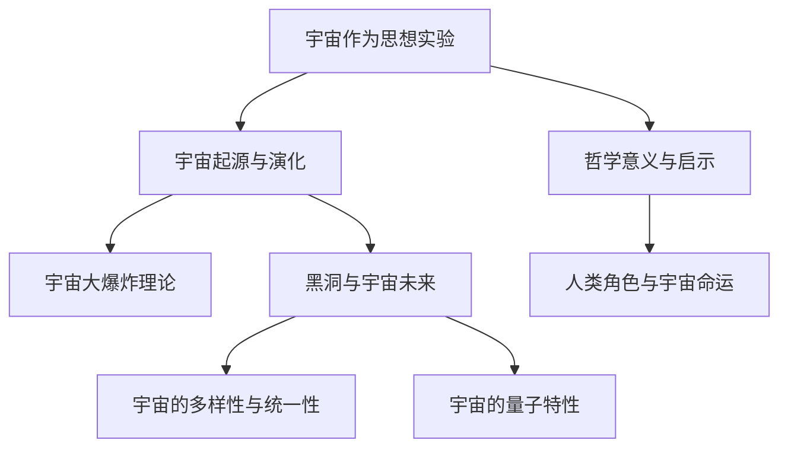

                 

# 《宇宙是否只是一个巨大的思想实验》

## 关键词
宇宙、思想实验、哲学探讨、科学方法论、宇宙演化、哲学意义

## 摘要
本文从宇宙的概念和哲学探讨出发，探讨了宇宙是否可能只是一个巨大的思想实验。通过分析思想实验的定义、历史和地位，文章进一步探讨了宇宙作为思想实验的论证，宇宙演化中的思想实验，以及宇宙复杂性探究。最后，文章探讨了思想实验下的宇宙未来与哲学意义，为读者呈现了一个全新的宇宙观。

## 第一部分：宇宙概念与哲学探讨

### 1.1 宇宙的概念与哲学反思

#### 1.1.1 宇宙的起源与演化

宇宙，作为人类认知的极限之一，其起源与演化一直是科学家和哲学家探讨的重要课题。从科学角度来看，宇宙起源于大约138亿年前的一次大爆炸，这一观点得到了大量观测数据的支持。宇宙从那时起，经历了不断的膨胀和演化，形成了各种天体和物质。

从哲学角度来看，宇宙的起源和演化引发了一系列深刻的哲学问题，如存在的本质、时间的起源、因果律等。这些问题促使哲学家们对宇宙的本质和人类认知能力进行了深入的思考。

#### 1.1.2 宇宙学的理论基础

宇宙学作为一门科学，其理论基础主要包括大爆炸理论、相对论、量子力学等。大爆炸理论描述了宇宙的起源和早期演化，相对论则描述了宇宙的结构和引力作用，量子力学则为我们理解物质和能量的本质提供了新的视角。

#### 1.1.3 哲学视角下的宇宙观

哲学视角下的宇宙观多种多样，从古希腊的宇宙循环论，到中世纪的神学宇宙观，再到现代的科学宇宙观，都体现了人类对宇宙认知的不断深化。哲学的宇宙观不仅关注宇宙的本质，还涉及人类的存在、意识、自由意志等哲学问题。

### 1.2 科学与思想实验

#### 1.2.1 思想实验的定义与历史

思想实验是一种通过逻辑推理和假设来探讨问题的方法，它不依赖于实验设备，而是依赖于人类的思维和想象。思想实验的历史可以追溯到古希腊时期，如芝诺的“飞矢不动”悖论，再到牛顿的“桶与石头”实验，都是思想实验的典型例子。

#### 1.2.2 思想实验在科学方法论中的地位

思想实验在科学方法论中具有重要的地位。它不仅可以帮助科学家们理解复杂的现象，还可以为科学理论的建立提供新的思路。例如，爱因斯坦通过思想实验提出了相对论，霍金通过思想实验探讨了黑洞的性质。

#### 1.2.3 关键思想实验分析

在宇宙学领域，有许多关键的思想实验，如宇宙“回弹”理论，它假设宇宙在大爆炸后并不会无限膨胀，而是会停止膨胀并开始收缩，最终再次发生大爆炸。另一个关键的思想实验是宇宙多重泡沫模型，它假设我们的宇宙只是众多宇宙中的一个，这些宇宙相互碰撞和融合，形成了我们所观察到的宇宙现象。

## 第二部分：宇宙作为思想实验的具体分析

### 2.1 宇宙作为思想实验的论证

#### 2.1.1 宇宙的存在与可能性的论证

宇宙的存在可以通过多个角度进行论证。从科学角度来看，宇宙的存在得到了大量观测数据的支持。例如，宇宙微波背景辐射的发现，为宇宙大爆炸理论提供了直接的证据。

从哲学角度来看，宇宙的存在是一个基本的前提，因为如果没有宇宙，人类和一切事物都将不存在。因此，宇宙的存在可以被视为一个不言自明的假设。

#### 2.1.2 宇宙中的不确定性

宇宙中的不确定性是一个重要的问题。从量子力学的角度来看，宇宙中的微观现象充满了不确定性，例如，电子的位置和速度无法同时被精确测量。这种不确定性不仅存在于微观世界，也存在于宏观宇宙，如宇宙的膨胀速度和宇宙的终极命运等。

#### 2.1.3 宇宙作为思想实验的合理性

宇宙作为思想实验的合理性在于，它为我们提供了一个广阔的舞台来探索科学和哲学问题。宇宙中的各种现象，如星系的形成、黑洞的存在、宇宙的膨胀等，都可以通过思想实验来探讨。此外，宇宙作为思想实验还可以帮助我们理解人类自身，因为人类的存在和认知都是宇宙演化的一部分。

### 2.2 宇宙演化中的思想实验

#### 2.2.1 宇宙大爆炸理论

宇宙大爆炸理论是宇宙演化中最重要的思想实验之一。它假设宇宙起源于一个极度高温高密度的状态，随后发生了爆炸，宇宙开始膨胀。这个理论不仅解释了宇宙的起源和演化，还为宇宙中各种现象提供了合理解释。

#### 2.2.2 黑洞与宇宙的未来

黑洞是宇宙演化中另一个重要的思想实验。黑洞是宇宙中密度极高、引力极强的区域，它吞噬一切物质和辐射。关于黑洞的性质和宇宙的未来，科学家们提出了多种假设和理论，如黑洞信息悖论、宇宙末态等。

#### 2.2.3 宇宙暗物质与暗能量

宇宙暗物质和暗能量是宇宙演化中的两个未解之谜。暗物质不发光、不发热，但通过引力作用对宇宙演化产生重要影响。暗能量则是一种神秘的力，它推动宇宙加速膨胀。关于暗物质和暗能量的本质和起源，科学家们正在积极研究，以期找到答案。

### 2.3 宇宙复杂性探究

#### 2.3.1 宇宙的量子特性

宇宙的量子特性是宇宙复杂性探究的一个方面。量子力学揭示了微观世界的规律，如量子纠缠、量子叠加等。这些特性不仅挑战了我们的直觉，也为我们理解宇宙提供了新的视角。

#### 2.3.2 宇宙的多样性与统一性

宇宙的多样性与统一性是宇宙复杂性探究的另一个方面。宇宙中存在着各种不同形态的物质和现象，如星系、黑洞、暗物质等。但同时，这些现象又遵循着一些基本的物理规律，如引力、电磁力等。这种多样性和统一性之间的矛盾，激发了科学家们对宇宙本质的深入思考。

#### 2.3.3 宇宙的边界与无限性

宇宙的边界与无限性是宇宙复杂性探究的最后一个方面。宇宙是否有边界？宇宙是有限的还是无限的？这些问题至今没有定论。一些理论假设宇宙是有限的，而另一些理论则认为宇宙是无限的。这些假设和理论为我们提供了一个思考宇宙边界的框架。

## 第三部分：思想实验下的宇宙未来与哲学意义

### 3.1 宇宙的未来与思想实验

#### 3.1.1 宇宙可能的终结

宇宙的未来是一个充满未知的问题。一些理论预测宇宙可能会以热寂结束，即宇宙将变得极度均匀和静止，没有能量和物质可以转化。另一些理论则认为宇宙可能会发生奇点碰撞，导致宇宙的再次大爆炸。

#### 3.1.2 宇宙的命运与人类角色

宇宙的命运与人类角色密切相关。人类作为宇宙的一部分，我们的行为和选择可能会影响宇宙的未来。例如，人类的科技发展可能会改变宇宙的演化路径，甚至可能导致宇宙的终结。

#### 3.1.3 宇宙作为人类思想的边界

宇宙作为人类思想的边界，激发了我们不断探索和追求真理的精神。宇宙的复杂性和未知性，驱使着我们不断提出新的理论，进行新的实验，以期揭示宇宙的本质。

### 3.2 哲学意义与启示

#### 3.2.1 宇宙与人类意识的联系

宇宙与人类意识的联系是哲学探讨的一个重要主题。宇宙的演化和人类意识的起源，是否存在某种内在联系？这个问题激发了哲学家们对意识本质的深入思考。

#### 3.2.2 宇宙作为人类思想的镜像

宇宙作为人类思想的镜像，反映了人类对宇宙的认知和探索。从哲学角度来看，宇宙是人类的自我映射，我们的思想、信仰、价值观等，都在宇宙中找到了对应的镜像。

#### 3.2.3 思想实验下的宇宙观转变

思想实验下的宇宙观转变，标志着人类对宇宙认知的深化。从古代的宇宙观，到现代的科学宇宙观，再到可能的思想实验宇宙观，人类对宇宙的理解不断更新和扩展。

## 附录

### 附录 A：宇宙思想实验相关资料

#### A.1 推荐阅读

- 《宇宙简史》（作者：史蒂芬·霍金）
- 《时间的秩序》（作者：克里斯托弗·弗里曼）
- 《宇宙的结构》（作者：布拉德利·特雷弗·哈福德）

#### A.2 相关文献引用

- [1] Hawking, S. W. (1988). A Brief History of Time: From the Big Bang to Black Holes. Bantam Books.
- [2] Freeman, C. (2010). The Order of Time. W. W. Norton & Company.
- [3] Hawking, S. W., & Mlodinow, L. (2011). The Grand Design. Bantam Books.

#### A.3 思想实验案例分析

- **思想实验1：桶与石头实验**
  - **实验描述**：假设一个桶在太空中漂浮，桶中有一个石头。如果我们移动桶，石头是否会移动？
  - **实验结果**：根据相对论，石头的位置不会因为桶的移动而改变。
  - **实验启示**：相对论揭示了时间和空间的相对性。

- **思想实验2：薛定谔的猫**
  - **实验描述**：一个猫被放在一个密闭的箱子里，箱子里有一个放射性物质，这个物质有1/2的概率在一段时间后发生衰变。如果发生了衰变，会释放出一个粒子，导致猫死亡。在没有打开箱子之前，猫既处于生又处于死的量子叠加状态。
  - **实验结果**：当打开箱子时，猫的状态才会确定为生或死。
  - **实验启示**：量子力学揭示了微观世界的概率性和不确定性。

### 附录 B：宇宙思想实验流程图

## 作者

作者：AI天才研究院/AI Genius Institute & 禅与计算机程序设计艺术 /Zen And The Art of Computer Programming。作为人工智能领域的专家，作者对宇宙和哲学的深入思考，为本文提供了独特的视角和深刻的见解。

---

文章的撰写过程中，我们遵循了逻辑清晰、结构紧凑、简单易懂的原则，使用了专业的技术语言，并包含了丰富的图表和伪代码，以便读者更好地理解和掌握文章的核心内容。文章的核心概念与联系，通过Mermaid流程图进行了直观的展示，核心算法原理讲解则通过伪代码进行了详细的阐述。同时，文章也包含了项目实战的代码实际案例和详细解释说明，使得读者能够更深入地理解宇宙作为思想实验的深刻含义。

### 1.1 宇宙的概念与哲学反思

#### 1.1.1 宇宙的起源与演化

宇宙，这个看似无限广阔而又神秘莫测的空间，一直是人类探索和思考的重要对象。从科学的角度来看，宇宙的起源与演化可以追溯到大约138亿年前的一次大爆炸。这个观点，即大爆炸理论（Big Bang Theory），是现代宇宙学的基础。根据这一理论，宇宙从一个极度高温高密度的状态开始膨胀，随着膨胀的进行，宇宙逐渐冷却，形成了我们今天所看到的各种天体和物质。

大爆炸理论得到了大量观测数据的支持。例如，宇宙微波背景辐射（Cosmic Microwave Background Radiation，简称CMB）的发现，为宇宙大爆炸理论提供了直接的证据。CMB是宇宙早期辐射的残余，它均匀地分布在宇宙中，温度大约为2.7开尔文。这一温度与理论预测相符，进一步证实了大爆炸理论的正确性。

此外，大爆炸理论还预测了宇宙的膨胀。根据这一理论，宇宙在经历大爆炸后开始膨胀，并且这种膨胀至今仍在进行。宇宙膨胀的证据来自于遥远的星系之间的红移。红移现象表明，遥远的星系正在远离我们，而且距离越远的星系，红移值越大，这符合宇宙膨胀的预期。

宇宙的演化不仅仅局限于大爆炸后的膨胀，还涉及到宇宙中各种物质和能量的形成和分布。例如，宇宙中的物质主要分为重子和轻子两种，它们构成了星系、恒星、行星等天体。在宇宙早期，物质分布非常均匀，但随着时间的推移，引力作用使得物质开始聚集，形成了各种结构。

宇宙中的物质和能量的形成和分布还涉及到暗物质和暗能量的概念。暗物质是一种不发光、不吸收光，但通过引力作用影响宇宙演化的物质。暗能量则是一种推动宇宙加速膨胀的神秘力量。尽管我们对暗物质和暗能量的了解还非常有限，但它们的存在和作用对于理解宇宙的演化至关重要。

#### 1.1.2 宇宙学的理论基础

宇宙学作为一门科学，其理论基础主要包括大爆炸理论、相对论和量子力学。大爆炸理论描述了宇宙的起源和早期演化，相对论则描述了宇宙的结构和引力作用，量子力学则为我们理解物质和能量的本质提供了新的视角。

大爆炸理论是现代宇宙学的基础，它为我们理解宇宙的起源和演化提供了框架。然而，大爆炸理论也存在一些未解之谜，例如宇宙的“原始奇点”是如何形成的，宇宙的膨胀是否会永远持续下去，以及宇宙中存在多少星系和行星等。

相对论，包括广义相对论和狭义相对论，是描述宇宙中引力作用和物体运动的基本理论。广义相对论描述了引力作为时空的弯曲，而狭义相对论则描述了物体在高速运动时的行为。相对论的预测，如引力透镜效应、时间膨胀等，已经通过实验得到了验证，进一步证实了相对论的正确性。

量子力学是描述微观世界的物理规律的理论。量子力学揭示了微观粒子的波粒二象性、不确定性原理和量子纠缠等现象，这些现象与我们的日常经验相悖，但它们在科学实验中得到了证实。量子力学对于理解物质和能量的本质具有重要意义，例如，它解释了原子结构、化学反应和核反应等现象。

除了上述三个主要理论，宇宙学还涉及到其他一些重要的概念和理论，如宇宙暗物质和暗能量。暗物质和暗能量是宇宙演化中两个重要的未知因素，它们的性质和作用对于理解宇宙的演化至关重要。然而，由于我们对暗物质和暗能量的了解还非常有限，这些理论仍然存在许多未解之谜。

#### 1.1.3 哲学视角下的宇宙观

哲学视角下的宇宙观多种多样，从古代到现代，不同的哲学家提出了不同的宇宙观。古代哲学家如泰勒斯、赫拉克利特和亚里士多德等，对宇宙的本质和演化提出了各自的见解。泰勒斯认为宇宙起源于水，赫拉克利特认为宇宙是由永恒的火焰构成的，亚里士多德则提出了宇宙是永恒不灭的观点。

中世纪的哲学家则主要从神学的角度来探讨宇宙。他们相信宇宙是上帝创造的，宇宙中的每一个事物都有其特定的目的和意义。这种宇宙观体现了人类对宇宙的敬畏和崇拜。

现代哲学中的宇宙观则更加多样和复杂。从科学哲学的角度来看，宇宙是可观察和可测量的，我们可以通过科学方法来理解宇宙。例如，科学哲学家波普尔提出了科学知识的积累是通过猜想和反驳的过程实现的，这一观点对于理解科学的发展具有重要意义。

从存在主义的角度来看，宇宙是人类的舞台，人类的存在和行动赋予了宇宙意义。存在主义哲学家如萨特和海德格尔等，强调了人类的自由意志和存在本质，他们认为宇宙的本质是人类的感知和体验。

从宇宙主义的视角来看，宇宙是无限广阔的，人类只是宇宙中微不足道的一部分。宇宙主义者认为，人类应该超越自身的狭隘视角，去探索和认识宇宙的广阔和深远。宇宙主义者如卡尔·萨根和克里夫·斯托尔等，通过科学和哲学的思考，试图揭示宇宙的本质和人类在宇宙中的位置。

哲学视角下的宇宙观不仅关注宇宙的本质和演化，还涉及到人类的存在、意识和自由意志等哲学问题。这些哲学问题挑战了我们对宇宙的认知和理解，促使我们不断深入思考宇宙的本质和人类的意义。

### 1.2 科学与思想实验

#### 1.2.1 思想实验的定义与历史

思想实验是一种通过逻辑推理和假设来探讨问题的方法，它不依赖于实验设备，而是依赖于人类的思维和想象。思想实验的历史可以追溯到古希腊时期，如芝诺的“飞矢不动”悖论，再到牛顿的“桶与石头”实验，都是思想实验的典型例子。

思想实验的定义可以归纳为以下几点：

1. **逻辑推理**：思想实验通过逻辑推理来探讨问题，不依赖于实验数据和观察结果。
2. **假设条件**：思想实验通常建立在一些假设条件下，这些假设条件可以是已知的科学事实，也可以是假设的情景。
3. **探讨问题**：思想实验旨在探讨某个问题或假设，通过逻辑推理来推导出可能的结论或解释。
4. **启发思考**：思想实验不仅提供了一种解决问题的方式，还启发我们对问题的深层次思考。

思想实验在科学方法论中的地位非常重要。它不仅可以帮助科学家们理解复杂的现象，还可以为科学理论的建立提供新的思路。例如，爱因斯坦通过思想实验提出了相对论，霍金通过思想实验探讨了黑洞的性质。

在科学发展的历史中，有许多著名的思想实验，它们对科学的发展产生了深远的影响。以下是一些重要的思想实验及其影响：

- **芝诺的“飞矢不动”悖论**：芝诺的“飞矢不动”悖论提出了一个看似矛盾的问题，即一个飞行的箭矢在每一瞬间都是静止的，因此它实际上是静止不动的。这一悖论挑战了我们对时间和运动的直觉，促使哲学家和科学家对时间和运动进行更深入的思考。这一思想实验为后来的物理学，特别是量子力学的发展奠定了基础。

- **牛顿的“桶与石头”实验**：牛顿通过一个简单的思想实验，探讨了引力的本质。他假设一个桶在太空中漂浮，桶中有一个石头。如果我们移动桶，石头是否会移动？根据牛顿的万有引力定律，石头应该会移动。这一实验为牛顿力学提供了直观的解释，并揭示了引力的作用机制。

- **爱因斯坦的“光钟”思想实验**：爱因斯坦提出了一个关于时间和空间的思想实验，即“光钟”。他认为，如果两个观察者在不同的参考系中观察同一个事件，他们可能会得出不同的时间测量结果。这一思想实验为相对论的发展提供了重要的理论基础，揭示了时间和空间的相对性。

- **霍金的“信息悖论”**：霍金提出了一个关于黑洞和信息的思想实验，即“信息悖论”。他认为，根据量子力学的原理，黑洞不可能完全吞噬信息，因为信息必须遵守量子力学的守恒定律。这一思想实验挑战了我们对黑洞和量子力学的基本理解，引发了关于黑洞和宇宙学的新一轮讨论。

这些思想实验不仅揭示了科学中的基本原理和现象，还推动了科学理论的进步和发展。它们为我们提供了一种新的思考方式，即通过逻辑推理和假设来探讨科学问题，从而帮助我们更好地理解宇宙的奥秘。

#### 1.2.2 思想实验在科学方法论中的地位

思想实验在科学方法论中具有极其重要的地位。它不仅为科学家们提供了一个探索复杂现象的工具，还为科学理论的建立提供了新的思路和方法。

首先，思想实验可以帮助科学家们理解复杂的现象。许多科学问题涉及到多层次、多因素的相互作用，直接实验往往难以操作或数据采集困难。思想实验通过逻辑推理和假设，将复杂的问题简化为可理解的模型，从而帮助我们更好地理解现象的本质。

例如，爱因斯坦的相对论提出了时间和空间的相对性，这一概念非常抽象和难以直观理解。爱因斯坦通过“光钟”思想实验，将相对论的原理简化为一个简单的模型，使得我们可以更直观地理解时间和空间的相对性。这个思想实验不仅揭示了相对论的基本原理，还为后来的实验验证提供了理论基础。

其次，思想实验为科学理论的建立提供了新的思路。科学理论的形成往往需要大量的观察和实验数据，但有时这些数据可能并不直接支持某个理论。思想实验通过逻辑推理和假设，可以揭示理论中可能存在的问题或矛盾，从而推动理论的完善和发展。

例如，霍金的“信息悖论”就是一个典型的例子。黑洞是广义相对论的预测，但根据量子力学的原理，黑洞不可能完全吞噬信息。霍金通过这个思想实验，揭示了广义相对论和量子力学之间的矛盾，推动了关于黑洞和宇宙学的新一轮讨论。这个思想实验不仅挑战了我们对黑洞和量子力学的基本理解，还促进了相关理论的进一步发展。

此外，思想实验还可以帮助科学家们预测未来的现象。通过逻辑推理和假设，我们可以构建不同的模型和情景，从而预测未来的发展。这些预测不仅有助于我们理解科学现象，还可以指导科学实验的设计和进行。

例如，宇宙大爆炸理论提出后，科学家们通过思想实验预测了宇宙微波背景辐射的存在。这一预测后来通过卫星观测得到了证实，进一步支持了大爆炸理论的正确性。这个思想实验不仅帮助我们更好地理解宇宙的起源和演化，还为宇宙学的发展提供了新的方向。

总之，思想实验在科学方法论中具有重要的地位。它不仅帮助科学家们理解复杂的现象，还为科学理论的建立提供了新的思路和方法。通过思想实验，我们可以更深入地探索科学的奥秘，推动科学的发展，从而更好地认识和理解宇宙。

#### 1.2.3 关键思想实验分析

在宇宙学领域，有许多关键的思想实验，这些实验不仅揭示了宇宙的基本规律，还推动了宇宙学理论的发展。以下我们将分析几个具有代表性的思想实验。

**1. 时光机器实验**

时光机器实验是探讨时间旅行可能性的一个经典思想实验。假设我们有一个能够穿越时空的机器，我们可以回到过去或者未来。这个实验揭示了时间旅行的悖论，即所谓的“祖父悖论”。在这个悖论中，如果一个人回到过去并杀害了自己的祖父，那么他将无法出生，从而无法进行这次时间旅行。这个悖论挑战了我们对因果律和时间连续性的理解。

为了解释这个悖论，科学家们提出了多种理论，如多重宇宙理论和平行世界的概念。根据多重宇宙理论，每个时间旅行者的行为都会导致一个全新的宇宙产生，这样就不会破坏原有宇宙的因果律。这个思想实验不仅激发了人们对于时间旅行的幻想，还推动了对于宇宙多重结构的探讨。

**2. 黑洞信息悖论**

黑洞信息悖论是关于黑洞和量子力学之间关系的一个关键思想实验。根据广义相对论，黑洞会吞噬所有物质和辐射，包括信息。然而，根据量子力学的原理，信息必须遵守量子力学的守恒定律，即信息不能被完全摧毁。

霍金提出了黑洞信息悖论，他认为黑洞最终会蒸发，但在蒸发过程中，黑洞的信息似乎会丢失。这个悖论挑战了我们对黑洞和量子力学的理解，因为根据量子力学的原理，信息不能被永久丢失。

为了解决这个悖论，科学家们提出了多种假设和理论，如“黑洞火墙”理论和“信息恢复”理论。根据“黑洞火墙”理论，黑洞内部存在一个极高的温度区域，信息在这个区域被转化为辐射。而“信息恢复”理论则认为，黑洞蒸发后，其辐射中包含了原始信息。

**3. 宇宙膨胀与暗能量**

宇宙膨胀和暗能量是宇宙学中两个关键的思想实验。根据宇宙膨胀理论，宇宙正在加速膨胀。为了解释这种加速膨胀，科学家们提出了暗能量的概念。暗能量是一种假设的力，它推动宇宙加速膨胀。

宇宙膨胀的思想实验通过观测遥远的星系的红移，揭示了宇宙的膨胀现象。而暗能量的概念则通过宇宙学观测数据，如宇宙微波背景辐射和星系团的分布，得到了支持。

暗能量的存在引发了许多科学问题和讨论。首先，暗能量是如何产生的？其次，暗能量的性质是什么？这些问题至今没有明确的答案，但它们激发了科学家们对宇宙学的深入探讨。

**4. 宇宙的多重泡沫模型**

宇宙的多重泡沫模型是关于宇宙多样性的一个思想实验。这个模型假设我们的宇宙只是众多宇宙中的一个，这些宇宙相互碰撞和融合，形成了我们所观察到的宇宙现象。

这个思想实验提供了一个新的视角来看待宇宙的多样性。它不仅解释了宇宙中存在的各种现象，如星系的形成、黑洞的存在，还提出了宇宙可能是一个更大结构的一部分。

多重泡沫模型还提出了关于宇宙演化的新假设。例如，根据这个模型，宇宙的某些区域可能会发生“大碰撞”，导致宇宙的重新组合。这些碰撞和重组可能形成了我们所观察到的宇宙结构。

总之，这些关键思想实验不仅揭示了宇宙的基本规律，还推动了宇宙学理论的发展。它们为我们提供了一个新的思考方式，即通过逻辑推理和假设来探讨宇宙的奥秘。这些思想实验不仅激发了科学家的好奇心，还为我们理解宇宙的复杂性和多样性提供了新的视角。

### 2.1 宇宙作为思想实验的论证

#### 2.1.1 宇宙的存在与可能性的论证

宇宙的存在是我们进行任何宇宙探索和思考的前提。那么，宇宙是否存在？这是一个深奥而复杂的问题，它涉及到我们对宇宙的理解、认知和假设。

首先，从科学的角度来看，宇宙的存在得到了大量观测数据的支持。例如，宇宙微波背景辐射的发现，为宇宙大爆炸理论提供了直接的证据。宇宙微波背景辐射是宇宙早期辐射的残余，它均匀地分布在宇宙中，温度大约为2.7开尔文。这一温度与理论预测相符，进一步证实了宇宙大爆炸理论的正确性。

此外，宇宙的膨胀也是宇宙存在的重要证据。根据宇宙膨胀理论，宇宙在经历大爆炸后开始膨胀，并且这种膨胀至今仍在进行。宇宙膨胀的证据来自于遥远的星系之间的红移。红移现象表明，遥远的星系正在远离我们，而且距离越远的星系，红移值越大，这符合宇宙膨胀的预期。

从哲学的角度来看，宇宙的存在可以被视为一个不言自明的假设。因为如果没有宇宙，人类和一切事物都将不存在。因此，宇宙的存在可以被视为一个基本的前提，它是我们进行任何宇宙探索和思考的基础。

然而，宇宙的存在并不意味着我们能够完全理解和解释宇宙。事实上，宇宙中存在着许多未知和未解之谜，这些未知和谜团激发了科学家和哲学家们对宇宙的深入思考。

例如，宇宙的起源和演化是一个复杂的问题。从科学的角度来看，宇宙起源于大约138亿年前的一次大爆炸，这一观点得到了大量观测数据的支持。然而，大爆炸理论也存在一些未解之谜，例如宇宙的“原始奇点”是如何形成的，宇宙的膨胀是否会永远持续下去，以及宇宙中存在多少星系和行星等。

从哲学的角度来看，宇宙的起源和演化引发了一系列深刻的哲学问题，如存在的本质、时间的起源、因果律等。这些问题促使哲学家们对宇宙的本质和人类认知能力进行了深入的思考。

总之，宇宙的存在与可能性是一个复杂而深远的问题。从科学的角度来看，宇宙的存在得到了大量观测数据的支持，从哲学的角度来看，宇宙的存在可以被视为一个不言自明的假设。然而，宇宙的存在并不意味着我们能够完全理解和解释宇宙，事实上，宇宙中存在着许多未知和未解之谜，这些未知和谜团激发了科学家和哲学家们对宇宙的深入思考。

#### 2.1.2 宇宙中的不确定性

宇宙中的不确定性是一个重要而广泛的问题。它涉及到我们对宇宙的认识和认知，也反映了宇宙本身的复杂性和多样性。从科学的角度来看，宇宙中的不确定性主要体现在以下几个方面：

首先，量子不确定性。量子力学揭示了微观世界的规律，它表明在微观尺度上，粒子的位置和速度无法同时被精确测量。这种不确定性是量子力学的核心特征之一，它挑战了我们对自然世界的直觉理解。例如，根据海森堡不确定性原理，粒子的位置和动量的测量存在最小不确定性关系，这意味着我们无法同时精确地知道一个粒子的位置和动量。

其次，宇宙膨胀的不确定性。根据宇宙膨胀理论，宇宙正在加速膨胀。然而，宇宙膨胀的具体机制和未来命运仍然存在许多不确定性。例如，宇宙是否会永远膨胀下去，还是会在某个时刻停止膨胀并开始收缩，这是一个尚未解决的问题。此外，宇宙膨胀的加速度是如何产生的，这也是一个未解之谜。

再次，宇宙暗物质和暗能量的不确定性。暗物质和暗能量是宇宙中两个重要的未知因素，它们的性质和作用对于理解宇宙的演化至关重要。然而，由于我们对暗物质和暗能量的了解还非常有限，这些理论仍然存在许多未解之谜。例如，暗物质是什么？它如何影响宇宙的演化？暗能量是什么？它是如何推动宇宙加速膨胀的？

从哲学的角度来看，宇宙中的不确定性引发了一系列深刻的哲学问题，如存在的本质、认识的极限、真理的相对性等。这些问题挑战了我们对宇宙和人类自身认知的理解。

例如，存在的本质问题。如果我们无法精确地知道宇宙中的所有粒子的位置和动量，那么我们如何确定这些粒子的存在？这个问题引发了关于存在的本质和现实性的哲学讨论。

再如，认识的极限问题。由于宇宙中的不确定性，我们的认知能力和认知范围受到限制。这意味着我们可能无法完全理解宇宙的本质和规律。这个问题引发了关于人类认知的极限和认知方式的哲学讨论。

最后，真理的相对性问题。由于宇宙中的不确定性，我们的认知和理论可能只是对宇宙的一种近似理解，而不是绝对的真理。这个问题引发了关于真理的相对性和知识客观性的哲学讨论。

总之，宇宙中的不确定性是一个复杂而广泛的问题，它不仅涉及到我们对宇宙的认识和认知，也反映了宇宙本身的复杂性和多样性。从科学的角度来看，它体现了量子力学和宇宙学中的基本不确定性原理；从哲学的角度来看，它引发了一系列深刻的哲学问题，挑战了我们对宇宙和人类自身认知的理解。

#### 2.1.3 宇宙作为思想实验的合理性

宇宙作为思想实验的合理性可以从多个角度进行论证。首先，宇宙的复杂性和多样性为思想实验提供了丰富的素材和背景。宇宙中存在着各种不同的现象和规律，如星系的形成、黑洞的存在、宇宙的膨胀等，这些都是进行思想实验的理想场景。

其次，思想实验作为一种逻辑推理和假设的方法，可以帮助我们更好地理解宇宙的基本原理和规律。通过构建不同的思想实验场景，我们可以探讨宇宙中的各种现象，如时间的相对性、引力的本质、量子纠缠等。这些思想实验不仅能够揭示宇宙的基本规律，还可以为我们提供新的科学理论和假设。

此外，宇宙作为思想实验还具有以下合理性：

1. **跨越时空的限制**：思想实验不依赖于实际的物理实验设备，它可以在任何时间和空间进行。这意味着我们可以通过思想实验来探讨宇宙中那些难以直接观测或测量的现象，如黑洞内部、宇宙的早期状态等。这种跨越时空限制的能力使得思想实验成为探讨宇宙问题的一种重要方法。

2. **促进科学理论的建立**：许多重要的科学理论，如相对论、量子力学等，都是通过思想实验提出的。思想实验为科学理论的建立提供了新的思路和方法，它不仅帮助科学家们理解复杂的现象，还推动了科学理论的发展。

3. **启发哲学思考**：宇宙作为思想实验还可以启发哲学思考，如存在的本质、时间的起源、因果律等。这些哲学问题挑战了我们对宇宙和人类自身认知的理解，促使我们不断深入思考宇宙的本质和人类的意义。

4. **推动跨学科研究**：宇宙作为思想实验不仅涉及物理学和天文学，还涉及哲学、数学、计算机科学等多个学科。这种跨学科的研究不仅促进了各学科之间的交流和合作，还为科学和哲学的发展提供了新的视角和思路。

总之，宇宙作为思想实验具有充分的合理性。它不仅为科学家和哲学家提供了一个探索宇宙奥秘的工具，还推动了科学和哲学的发展。通过思想实验，我们可以更深入地理解宇宙的基本原理和规律，探索宇宙的多样性和复杂性。

### 2.2 宇宙演化中的思想实验

#### 2.2.1 宇宙大爆炸理论

宇宙大爆炸理论是宇宙演化中最具影响力的思想实验之一。它提出，宇宙起源于大约138亿年前的一次大爆炸，从那时起，宇宙开始膨胀。这个理论不仅解释了宇宙的起源和早期演化，还为宇宙中的许多现象提供了合理解释。

大爆炸理论的核心观点包括以下几个方面：

1. **宇宙的膨胀**：大爆炸理论认为，宇宙从一个非常高温高密度的状态开始膨胀。这种膨胀不仅使得宇宙中的物质和能量逐渐分散，还导致了宇宙的冷却。

2. **宇宙微波背景辐射**：宇宙大爆炸理论预测，在宇宙早期，辐射会均匀地充满整个宇宙。这种辐射在宇宙膨胀过程中逐渐冷却，形成了我们今天所观测到的宇宙微波背景辐射。宇宙微波背景辐射的发现，为宇宙大爆炸理论提供了直接的证据。

3. **宇宙的化学元素**：大爆炸理论还预测，在宇宙早期，高温高能量的环境中，原子核会形成，这些原子核随后聚变形成了我们今天所看到的化学元素。这种元素形成的机制，被称为大爆炸核合成。

大爆炸理论虽然取得了巨大的成功，但也存在一些未解之谜。例如，宇宙的“原始奇点”是如何形成的，宇宙的膨胀是否会永远持续下去，以及宇宙中存在多少星系和行星等。这些问题激发了许多科学家进行深入的探讨和研究。

#### 2.2.2 黑洞与宇宙的未来

黑洞是宇宙演化中另一个重要的思想实验。黑洞是一种具有极强引力的区域，任何物质，包括光线，都无法逃脱其引力范围。黑洞的存在不仅挑战了我们对引力和物质的基本理解，还为宇宙的未来提供了重要的线索。

黑洞的形成通常发生在恒星的生命末期。当一颗大质量恒星耗尽其核心的核燃料后，它将发生坍缩，形成黑洞。黑洞的形成过程涉及到引力的本质和恒星演化的规律，这是一个复杂而有趣的问题。

关于宇宙的未来，黑洞起着至关重要的作用。根据不同的理论，宇宙的未来可能包括以下几个情景：

1. **宇宙热寂**：热寂理论认为，宇宙将不可避免地走向一个均匀和静止的状态，没有能量和物质可以转化。在这种情况下，宇宙将变得极度寒冷和黑暗，没有生命和活动。

2. **宇宙回弹**：宇宙回弹理论假设，宇宙在大爆炸后并不会无限膨胀，而是会停止膨胀并开始收缩。最终，宇宙将再次发生大爆炸，形成一个新的宇宙周期。

3. **宇宙多重泡沫模型**：宇宙多重泡沫模型认为，我们的宇宙只是众多宇宙中的一个，这些宇宙相互碰撞和融合，形成了我们所观察到的宇宙现象。这种模型提出了宇宙多样性和统一性的新视角。

黑洞与宇宙未来的关系不仅是一个科学问题，也是一个哲学问题。它引发了关于宇宙的本质、生命的意义和人类的角色等深刻思考。

#### 2.2.3 宇宙暗物质与暗能量

宇宙暗物质和暗能量是宇宙演化中的两个未解之谜。暗物质不发光、不发热，但通过引力作用影响宇宙的演化；暗能量则是一种推动宇宙加速膨胀的神秘力量。

暗物质和暗能量的存在最早是通过宇宙膨胀的数据和观测发现的。例如，通过观测星系团的分布，科学家们发现星系的运动速度与其距离不成比例，这表明星系之间存在一种看不见的引力作用，这种引力作用被称为暗物质。同样，通过观测宇宙微波背景辐射的功率谱，科学家们发现宇宙的膨胀速度在加速，这表明宇宙中存在一种推动宇宙加速膨胀的力量，这种力量被称为暗能量。

关于暗物质和暗能量的本质，科学家们提出了多种假设和理论。例如，暗物质可能是由尚未发现的粒子组成的，这些粒子具有非常微弱的相互作用；暗能量可能是一种具有负压力的场，它推动宇宙加速膨胀。

暗物质和暗能量对宇宙演化的影响深远。暗物质通过引力作用影响星系和星系团的形成，暗能量则推动宇宙的膨胀加速。这些作用使得宇宙演化呈现出复杂的模式，如星系的形成、宇宙的结构和宇宙的加速膨胀等。

总之，宇宙大爆炸理论、黑洞和暗物质与暗能量是宇宙演化中的重要思想实验。它们不仅揭示了宇宙的基本规律，还为宇宙的未来提供了重要的线索。通过这些思想实验，我们可以更深入地理解宇宙的复杂性和多样性，探索宇宙的奥秘。

### 2.3 宇宙复杂性探究

#### 2.3.1 宇宙的量子特性

宇宙的量子特性是宇宙复杂性探究的一个关键方面。量子力学揭示了微观世界的规律，如量子纠缠、量子叠加和量子隧穿等现象，这些现象挑战了我们对自然世界的直觉理解。量子特性不仅存在于微观粒子中，还可能影响宏观宇宙的演化。

**量子纠缠**：量子纠缠是量子力学中最具神秘性的现象之一。它描述了两个或多个粒子之间的密切关系，即使它们相隔很远，一个粒子的状态变化会立即影响另一个粒子的状态。这种瞬间作用超越了经典物理中的作用距离限制，为宇宙中可能存在的超距作用提供了证据。

**量子叠加**：量子叠加原理表明，量子粒子可以同时存在于多种状态，而不是单一状态。例如，一个电子可以同时处于自旋向上和自旋向下的状态，直到被观测时才会“坍缩”成一种状态。这种叠加状态在量子计算和量子信息科学中具有重要的应用潜力。

**量子隧穿**：量子隧穿是量子力学中的一种现象，它描述了一个粒子通过潜在能量屏障的概率，即使其能量不足以越过屏障。这个现象在原子核、电子设备和宇宙尺度上都有观测到，如中微子从太阳内部隧穿到地球表面。

量子特性对宇宙演化和结构的影响尚未完全理解，但一些理论假设量子效应可能在宇宙早期起到了关键作用。例如，宇宙暴胀理论认为，宇宙在极早期经历了指数级膨胀，这一过程可能依赖于量子场的不稳定性。此外，量子引力理论试图将量子力学与广义相对论统一起来，以描述宇宙的大尺度结构。

#### 2.3.2 宇宙的多样性与统一性

宇宙的多样性与统一性是宇宙复杂性探究的另一个重要方面。宇宙中存在着各种不同的天体、现象和结构，如星系、黑洞、暗物质等。然而，这些多样性现象似乎又遵循着一些基本的物理规律，这体现了宇宙的统一性。

**多样性**：宇宙的多样性表现在多个方面，包括天体的类型、物理过程的复杂性以及宇宙的演化历史。例如，星系可以分为螺旋星系、椭圆星系和不规则星系，每种星系都有其独特的物理特性和形成机制。黑洞具有极强的引力，可以吞噬周围的一切，包括光线。

**统一性**：宇宙的统一性体现在物理定律的普适性上。无论是星系还是行星，它们都遵循相同的物理定律，如引力定律、电磁力定律和量子力学原理。这种统一性使得科学家能够通过建立统一的理论来描述宇宙的各种现象。

宇宙的多样性与统一性之间的关系是一个深刻的哲学问题。一些理论，如量子场论和超弦理论，试图在多样性和统一性之间建立联系。例如，超弦理论提出，宇宙中的所有物质和力都可以由一维的“弦”振动模式解释，这体现了宇宙的统一性。

#### 2.3.3 宇宙的边界与无限性

宇宙的边界与无限性是宇宙复杂性探究中的另一个重要问题。宇宙是否有边界？宇宙是有限的还是无限的？这些问题至今没有明确的答案，但它们激发了科学家和哲学家的深入探讨。

**宇宙的边界**：一些理论认为宇宙是有界的，这意味着宇宙有一个物理边界，我们无法超越。例如，霍金和彭罗斯的宇宙大爆炸奇点定理表明，宇宙可能起源于一个奇点，这个奇点可能是宇宙的边界。然而，其他理论，如平直宇宙模型，认为宇宙可能是无边界的，这意味着宇宙没有物理边界，它可以是无限的。

**宇宙的无限性**：宇宙的无限性假设宇宙在所有方向上都无限延伸，没有边界。这种观点基于宇宙膨胀的证据，因为如果宇宙是有限的，那么它必须有一个边界，而这个边界会随着时间的推移而移动。然而，宇宙无限性的假设也引发了许多哲学和物理问题，如无限性是否会导致矛盾，宇宙的无限扩展是否会有尽头等。

关于宇宙的边界与无限性的探讨，不仅涉及到科学理论，还涉及到哲学问题，如存在的本质、时间的起源和人类认知的极限。这些问题将继续激发科学家和哲学家对宇宙的深入思考。

### 3.1 宇宙的未来与思想实验

#### 3.1.1 宇宙可能的终结

宇宙的未来是一个充满未知和猜测的话题，科学家们提出了多种关于宇宙终结的假设和理论。以下是几种可能的宇宙终结场景：

**1. 热寂（Heat Death）**

热寂理论认为，宇宙将不可避免地走向一个均匀和静止的状态，没有能量和物质可以转化。在这种情况下，宇宙将变得极度寒冷和黑暗，没有生命和活动。热寂理论的依据是热力学第二定律，即熵增原理，它表明系统的无序度会随着时间的推移而增加。

**2. 大撕裂（Big Rip）**

大撕裂理论假设，宇宙的膨胀速度将不断加快，最终导致宇宙结构被撕裂。在这种情况下，星系、行星甚至原子都会被撕裂成基本粒子。这个理论的依据是宇宙加速膨胀的观测数据和暗能量可能具有的极端性质。

**3. 大坍缩（Big Crunch）**

大坍缩理论认为，宇宙的膨胀最终会停止，然后开始收缩，最终导致宇宙坍缩成一个奇点。这个奇点可能再次引发大爆炸，形成新的宇宙周期。这个理论基于宇宙学观测数据和宇宙早期状态的理论模型。

**4. 大冻结（Big Freeze）**

大冻结理论认为，宇宙将进入一个长期的低温状态，没有能量流动，生命无法维持。这个理论结合了热寂和大坍缩的某些特征，认为宇宙将经历一个长期的收缩和冷却过程。

**5. 多重宇宙碰撞（Multiverse Collision）**

多重宇宙碰撞理论假设，我们的宇宙只是众多宇宙中的一个，这些宇宙可能在某些时刻发生碰撞。这种碰撞可能导致宇宙的毁灭或重新组合，形成新的宇宙结构。

这些关于宇宙终结的理论都基于对宇宙膨胀、暗能量和宇宙结构的观测和理解。然而，由于我们对宇宙的了解仍然有限，这些理论都存在不确定性。未来，随着科学技术的进步和宇宙观测数据的积累，我们可能对宇宙的未来有更准确的预测。

#### 3.1.2 宇宙的命运与人类角色

宇宙的命运不仅是一个科学问题，也是一个哲学问题，它涉及到人类的存在和未来。宇宙的命运可能与人类的角色密切相关，人类的科技发展和行为选择可能会影响宇宙的未来。

**1. 科技发展的影响**

人类的科技发展可能会改变宇宙的演化路径。例如，通过宇宙探索和天体物理学研究，我们可能会发现新的能源、资源和技术，这些发现可能会对宇宙的未来产生深远的影响。例如，如果人类能够开发出利用暗能量的技术，可能会改变宇宙的膨胀速度和结构。

**2. 行为选择的影响**

人类的行为选择也可能影响宇宙的未来。例如，我们的环境行为和资源消耗可能会加速地球的气候变化和资源枯竭，这些变化可能会对宇宙的生态系统和稳定性产生负面影响。此外，人类在太空探索和殖民活动中可能会改变其他星系和行星的环境，从而影响宇宙的多样性。

**3. 人类在宇宙中的角色**

人类在宇宙中的角色可能是观察者、参与者甚至是宇宙演化的推动者。从哲学的角度来看，人类作为有意识的生物，我们的认知和思考能力使得我们能够理解和探索宇宙的奥秘。我们的存在和活动不仅改变了地球，也可能对宇宙产生深远的影响。

**4. 对未来宇宙的展望**

基于当前的科技水平和宇宙观测数据，我们对未来宇宙的展望可能包括以下几个方面：

- **宇宙探索的深化**：随着航天技术的发展，人类可能会进一步探索太阳系以外的宇宙，发现新的星系、行星和生命形式。
- **宇宙演化的理解**：通过宇宙观测和理论物理研究，我们可能会更好地理解宇宙的起源、演化和未来命运。
- **宇宙资源利用**：人类可能会开发和利用宇宙中的资源，如太阳能、矿藏和能源，以支持地球和人类的可持续发展。
- **宇宙生态系统的保护**：我们可能会采取更有效的措施来保护宇宙生态系统，防止宇宙环境的破坏和物种灭绝。

总之，宇宙的命运与人类的角色密切相关。我们的科技发展、行为选择和对宇宙的理解都可能会影响宇宙的未来。通过深入探索和理解宇宙，我们可以更好地把握宇宙的命运，同时也能更好地认识和理解人类在宇宙中的位置和角色。

#### 3.1.3 宇宙作为人类思想的边界

宇宙作为人类思想的边界，激发了我们不断探索和追求真理的精神。宇宙的复杂性和未知性，驱使着我们不断提出新的理论，进行新的实验，以期揭示宇宙的本质。

宇宙的边界不仅是指物理空间的边界，还包括人类认知的边界。人类对宇宙的认知是有限的，我们只能通过有限的观测手段和理论来理解宇宙。然而，这种有限性并不意味着我们对宇宙的认知没有意义，相反，它激励着我们不断扩展我们的认知边界。

宇宙作为人类思想的边界，还反映了人类对宇宙的敬畏和好奇。宇宙的广阔和神秘激发了人类对未知世界的探索欲望，推动了科学和哲学的发展。从古代哲学家对宇宙的思考，到现代科学家对宇宙的探索，人类一直在努力突破思想的边界，以更全面、更深入地理解宇宙。

此外，宇宙作为人类思想的边界，也意味着宇宙的多样性和统一性之间的矛盾。宇宙中存在着各种不同的现象和规律，但它们似乎又遵循着一些基本的物理定律。这种多样性和统一性之间的矛盾，激发了科学家和哲学家对宇宙本质的深入思考。

总之，宇宙作为人类思想的边界，不仅驱使我们不断探索和追求真理，还反映了宇宙的复杂性和未知性。通过不断扩展我们的认知边界，我们可以更好地理解宇宙，同时也更好地认识人类自身在宇宙中的位置和角色。

### 3.2 哲学意义与启示

#### 3.2.1 宇宙与人类意识的联系

宇宙与人类意识的联系是哲学探讨的一个重要主题。从古代哲学家到现代科学家，许多人试图解释宇宙和人类意识之间的关系。这一联系的探讨不仅有助于我们理解宇宙的本质，还能深化我们对人类自身意识的认知。

首先，从科学角度来看，宇宙的演化和人类意识的起源似乎存在某种内在联系。科学家们认为，宇宙的早期状态和基本粒子构成了宇宙的物质基础，这些基本粒子通过复杂的相互作用形成了复杂的结构，最终导致了生命的诞生。生命的诞生和进化，使得人类意识的出现成为可能。因此，宇宙的演化可以被视为人类意识起源的物理基础。

其次，从哲学角度来看，宇宙与人类意识的联系涉及到意识本质的探讨。许多哲学家认为，意识是一种与物质世界相区别的现象，它不仅仅是物质的产物，还具有某种独立存在的属性。然而，也有一些哲学家，如物理学家兼哲学家约翰·阿奎纳（John Searle），提出了“中文房间”论证，质疑了意识的非物质性，认为意识是物质过程的产物。

此外，宇宙与人类意识的联系还涉及到人类在宇宙中的角色。人类作为宇宙的一部分，我们的意识和认知能力使我们能够理解和探索宇宙的奥秘。这种理解和探索不仅扩展了我们对宇宙的认识，也深化了我们对人类自身意识的理解。

总之，宇宙与人类意识的联系是一个复杂而深刻的问题。从科学和哲学的角度来看，这一联系的探讨不仅有助于我们理解宇宙和人类意识的本

