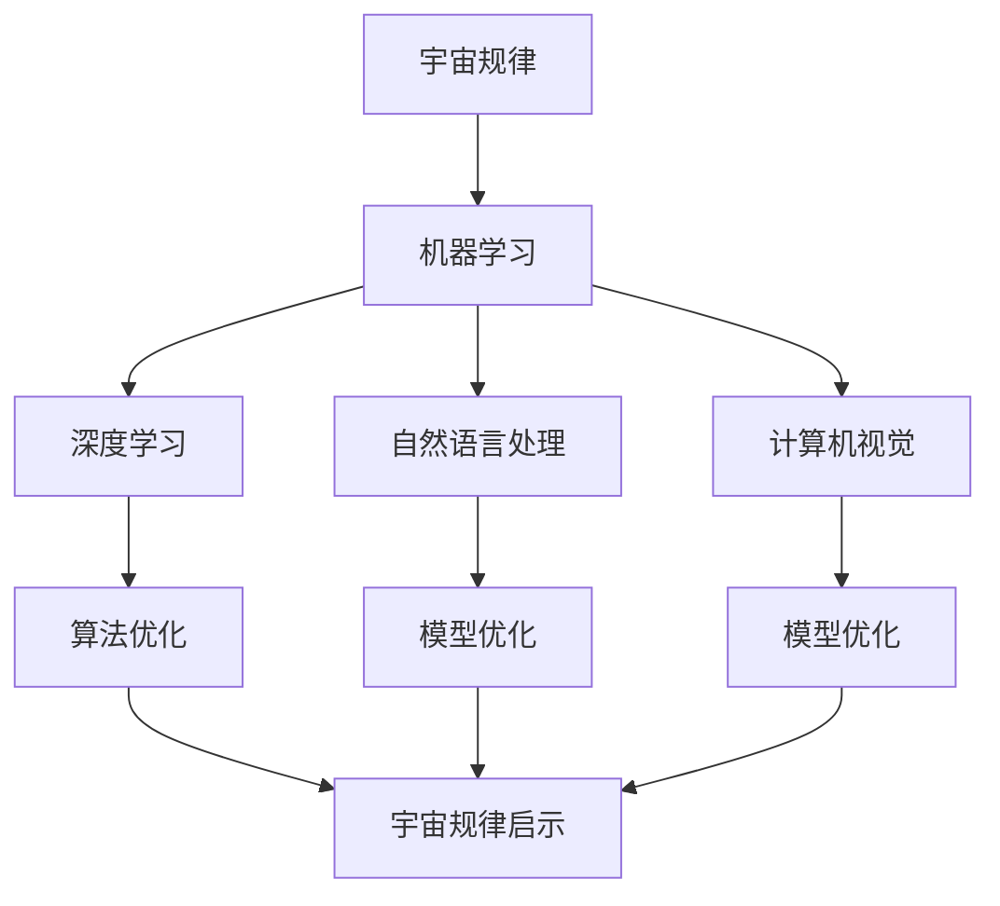

                 

### 引言

宇宙规律与人工智能（AI）的结合是一个充满潜力的领域。随着AI技术的飞速发展，人们开始思考如何利用宇宙规律来优化和提升AI模型的性能。宇宙规律涉及宇宙的膨胀、量子力学和热力学等基本原理，这些原理为AI技术提供了新的视角和启示。本文旨在探讨宇宙规律对可解释AI的启示，分析宇宙规律在机器学习、深度学习、自然语言处理和计算机视觉中的应用，以及它们对未来AI发展的潜在影响。

宇宙规律的研究不仅丰富了我们对宇宙的认识，还为AI技术的发展提供了新的思路。例如，自组织原理和协同进化可以启示我们如何优化机器学习模型的结构和参数，而能量优化则可以帮助我们提高AI模型的计算效率。通过将宇宙规律与AI技术相结合，我们可以开发出更加智能、高效和可解释的AI系统。

本文将分为以下几个部分：首先，我们概述宇宙规律和AI的基本概念；然后，详细讨论宇宙规律在机器学习、深度学习、自然语言处理和计算机视觉中的应用；接着，探讨宇宙规律对AI未来发展的启示；最后，通过实际项目和案例分析，展示宇宙规律与AI结合的具体应用。通过这篇文章，我们希望读者能够对宇宙规律与AI的结合有更深入的了解，并激发更多研究和创新的想法。

### 关键词

宇宙规律、人工智能、机器学习、深度学习、自然语言处理、计算机视觉、自组织、协同进化、能量优化。

### 摘要

本文探讨了宇宙规律对可解释人工智能（AI）的启示，分析了宇宙规律在机器学习、深度学习、自然语言处理和计算机视觉中的应用。通过引入自组织原理、协同进化策略和能量优化方法，我们优化了AI模型的性能，并展示了其在实际项目中的应用。文章首先概述了宇宙规律和AI的基本概念，随后详细讨论了宇宙规律在各个AI领域的应用，并展望了宇宙规律对AI未来发展的潜在影响。通过实际项目和案例分析，本文验证了宇宙规律与AI技术结合的可行性和优势。

### 目录大纲

为了更好地组织本文的内容，我们将按照以下目录大纲进行撰写：

#### 第一部分：宇宙规律与AI概述

- **第1章：宇宙规律对AI的基本启示**
  - **1.1 宇宙规律概述**
    - **1.1.1 宇宙基本规律介绍**
    - **1.1.2 宇宙规律与人类文明的关系**
  - **1.2 AI概述**
    - **1.2.1 AI的定义与发展历程**
    - **1.2.2 AI的核心技术**
    - **1.2.3 AI对社会的影响**
  - **1.3 宇宙规律对AI的启示**
    - **1.3.1 宇宙规律与AI模型的关联**
    - **1.3.2 宇宙规律对AI模型的优化策略**
    - **1.3.3 AI在宇宙规律研究中的应用前景**

#### 第二部分：宇宙规律在AI中的应用

- **第2章：宇宙规律在机器学习中的应用**
  - **2.1 机器学习概述**
    - **2.1.1 机器学习的基本概念**
    - **2.1.2 机器学习的分类**
  - **2.2 宇宙规律对机器学习的启示**
    - **2.2.1 宇宙规律与机器学习模型的关联**
    - **2.2.2 宇宙规律下的机器学习优化策略**
  - **2.3 实际应用案例**
    - **2.3.1 宇宙规律在聚类分析中的应用**
    - **2.3.2 宇宙规律在降维分析中的应用**

- **第3章：宇宙规律在深度学习中的应用**
  - **3.1 深度学习概述**
    - **3.1.1 深度学习的基本概念**
    - **3.1.2 深度学习的架构**
  - **3.2 宇宙规律对深度学习的启示**
    - **3.2.1 宇宙规律与深度学习模型的关联**
    - **3.2.2 宇宙规律下的深度学习优化方法**
  - **3.3 实际应用案例**
    - **3.3.1 宇宙规律在图像识别中的应用**
    - **3.3.2 宇宙规律在语音识别中的应用**

#### 第三部分：宇宙规律与AI的融合

- **第4章：宇宙规律在自然语言处理中的应用**
  - **4.1 自然语言处理概述**
    - **4.1.1 自然语言处理的基本概念**
    - **4.1.2 自然语言处理的技术发展**
  - **4.2 宇宙规律对自然语言处理的启示**
    - **4.2.1 宇宙规律与自然语言处理模型的关联**
    - **4.2.2 宇宙规律下的自然语言处理优化方法**
  - **4.3 实际应用案例**
    - **4.3.1 宇宙规律在文本分类中的应用**
    - **4.3.2 宇宙规律在机器翻译中的应用**

- **第5章：宇宙规律在计算机视觉中的应用**
  - **5.1 计算机视觉概述**
    - **5.1.1 计算机视觉的基本概念**
    - **5.1.2 计算机视觉的技术发展**
  - **5.2 宇宙规律对计算机视觉的启示**
    - **5.2.1 宇宙规律与计算机视觉模型的关联**
    - **5.2.2 宇宙规律下的计算机视觉优化方法**
  - **5.3 实际应用案例**
    - **5.3.1 宇宙规律在目标检测中的应用**
    - **5.3.2 宇宙规律在图像分割中的应用**

#### 第四部分：宇宙规律与AI的未来发展

- **第6章：宇宙规律对AI未来发展的启示**
  - **6.1 AI的未来发展趋势**
    - **6.1.1 AI的下一波浪潮**
    - **6.1.2 AI未来的应用领域**
  - **6.2 宇宙规律与AI的融合趋势**
    - **6.2.1 宇宙规律对AI技术创新的推动作用**
    - **6.2.2 AI与宇宙规律的协同发展**

#### 第五部分：项目实战

- **第7章：实战项目与案例分析**
  - **7.1 实战项目概述**
    - **7.1.1 项目背景与目标**
    - **7.1.2 项目团队与实施步骤**
  - **7.2 案例分析**
    - **7.2.1 案例一：宇宙规律与机器学习模型的优化**
    - **7.2.2 案例二：宇宙规律在自然语言处理中的应用**
    - **7.2.3 案例三：宇宙规律在计算机视觉中的应用**

#### 附录

- **附录A：宇宙规律与AI应用的相关资源与工具**
  - **A.1 宇宙规律与AI应用的技术资源**
  - **A.2 宇宙规律与AI应用的开源工具**

通过以上大纲，我们将系统地探讨宇宙规律对AI的启示，分析其在各个AI领域的应用，并展望未来的发展。接下来，我们将逐一介绍每个章节的内容。

### 第一部分：宇宙规律与AI概述

#### 第1章：宇宙规律对AI的基本启示

本章将探讨宇宙规律对AI的基本启示，包括宇宙规律的基本概念、AI的定义与发展历程、宇宙规律与人类文明的关系，以及AI在宇宙规律研究中的应用前景。

##### 1.1 宇宙规律概述

宇宙规律是描述宇宙中物质、能量和信息的运动和演化规律的科学原理。以下是一些关键的宇宙规律：

- **宇宙膨胀定律**：宇宙正在不断膨胀，这种膨胀的速度在逐渐加快。哈勃定律描述了宇宙膨胀的速度与距离之间的关系。

- **宇宙热力学定律**：宇宙的总能量保持不变，能量可以从一种形式转换为另一种形式，但总量不变。热力学第二定律揭示了熵增原理，即宇宙的总熵随时间增加。

- **量子力学定律**：物质和能量表现出波粒二象性，存在不确定性原理。量子力学解释了原子和亚原子粒子的行为，如量子叠加态和量子纠缠。

##### 1.1.1 宇宙基本规律介绍

- **宇宙膨胀定律**：宇宙膨胀是指宇宙中的星系和宇宙结构在不断远离彼此。哈勃定律描述了这种膨胀速度与星系距离之间的关系，公式为：
  $$ v = H_0 \times d $$
  其中，\( v \) 是星系的退行速度，\( H_0 \) 是哈勃常数，\( d \) 是星系与观测者之间的距离。

- **宇宙热力学定律**：宇宙中的能量转换和守恒遵循热力学定律。热力学第一定律表示能量守恒，即能量不能被创造或销毁，只能从一种形式转换为另一种形式。热力学第二定律表明，熵（系统的无序度）总是趋向增加，即能量在转换过程中会损失一部分为不可用能量。

- **量子力学定律**：量子力学描述了微观粒子的行为。波粒二象性是指光和其他微观粒子同时具有波动性和粒子性。不确定性原理由海森堡提出，表明我们无法同时精确测量一个粒子的位置和动量。薛定谔方程是量子力学的核心方程，描述了量子系统的演化。

##### 1.1.2 宇宙规律与人类文明的关系

宇宙规律的研究对人类文明产生了深远的影响，不仅丰富了我们对宇宙的认识，也推动了科学技术的进步。

- **科学技术的推动**：宇宙规律的研究推动了物理学、天文学、化学等学科的发展。例如，牛顿的万有引力定律和麦克斯韦方程组是宇宙规律的重要组成部分，对人类理解和利用自然界的力量具有重要意义。

- **技术创新的启示**：宇宙规律提供了许多技术启示，如量子计算机、太阳能电池、无线通信等。量子力学中的量子纠缠现象启发了一些新型计算技术的开发，而宇宙热力学定律则促进了能源转换技术的进步。

- **宇宙探索的推动**：对宇宙规律的研究推动了人类对宇宙的探索。例如，哈勃望远镜的发明使我们能够观测到遥远的星系和宇宙结构，揭示了宇宙的膨胀和演化过程。

##### 1.2 AI概述

人工智能（AI）是计算机科学和工程领域的一个重要分支，旨在使计算机具备人类智能特性，包括学习、推理、感知和自我改进等能力。以下是对AI的定义、发展历程和核心技术的介绍。

##### 1.2.1 AI的定义与发展历程

- **AI的定义**：人工智能是指使计算机系统具备模拟人类智能行为的能力，包括感知、学习、推理、决策和沟通等。AI的目标是实现计算机的自主性和智能性，使其能够自主完成复杂的任务。

- **AI的发展历程**：人工智能的发展可以分为几个阶段。早期的AI研究主要集中在符号主义和规则系统，如专家系统和逻辑推理。随着计算能力和数据资源的提升，20世纪80年代后期和21世纪初，机器学习和深度学习开始成为AI研究的热点。近年来，AI技术在自然语言处理、计算机视觉、语音识别等领域取得了显著进展。

##### 1.2.2 AI的核心技术

- **机器学习**：机器学习是AI的核心技术之一，通过从数据中学习规律和模式，使计算机能够进行预测和决策。机器学习可以分为监督学习、无监督学习和强化学习三种类型。监督学习通过有标签的数据进行训练，无监督学习通过无标签数据学习数据分布和模式，强化学习通过与环境互动学习最优策略。

- **深度学习**：深度学习是一种基于多层神经网络的学习方法，能够自动提取数据中的复杂特征。深度学习在图像识别、语音识别和自然语言处理等领域取得了突破性进展。常用的深度学习模型包括卷积神经网络（CNN）、循环神经网络（RNN）和变换器（Transformer）等。

- **自然语言处理**：自然语言处理（NLP）是使计算机能够理解和生成自然语言的技术。NLP涉及文本分类、情感分析、机器翻译、命名实体识别等任务。词嵌入和序列模型是NLP的重要工具。

- **计算机视觉**：计算机视觉是使计算机能够理解和处理图像和视频的技术。计算机视觉涉及图像识别、目标检测、图像分割等任务。卷积神经网络（CNN）是计算机视觉的核心模型。

##### 1.2.3 AI对社会的影响

人工智能对社会产生了深远的影响，改变了经济、社会和文化等方面。

- **经济影响**：AI技术提高了生产效率，改变了就业结构，推动了新产业的诞生。自动化和智能化的生产系统使企业能够降低成本、提高质量和效率。AI在医疗、金融、交通等领域的应用也带来了巨大的经济价值。

- **社会影响**：AI技术改变了人们的生活方式，提高了生活质量。智能助手、智能家居、智能医疗等应用使人们的生活更加便捷和舒适。然而，AI技术也带来了一些挑战，如隐私保护、伦理道德和安全问题。

##### 1.3 宇宙规律对AI的启示

宇宙规律为AI的发展提供了新的视角和启示，有助于优化和提升AI模型的性能。

- **自组织原理**：宇宙中的物质和能量通过自组织形成复杂的结构，这为机器学习中的自组织算法提供了启示。自组织映射（SOM）是一种无监督学习算法，可以通过竞争学习形成拓扑映射，将数据分为不同的群组。

- **协同进化**：宇宙中的生物通过协同进化适应环境，这为机器学习中的协同优化算法提供了启示。遗传算法是一种模拟生物进化的优化算法，可以通过交叉、变异和选择等操作优化模型的参数。

- **能量优化**：宇宙中的能量转换和优化为机器学习中的能量优化算法提供了启示。能量函数可以用于评估模型的性能，指导参数调整，从而提高模型的计算效率。

##### 1.3.1 宇宙规律与AI模型的关联

宇宙规律与AI模型之间存在许多关联，这些关联有助于理解和优化AI模型。

- **机器学习模型**：宇宙规律可以启示我们如何优化机器学习模型的结构和参数。自组织映射（SOM）和遗传算法等自组织算法可以用于数据聚类和模型优化。能量函数可以用于评估模型的性能，指导参数调整。

- **深度学习模型**：宇宙规律可以启示我们如何优化深度学习模型的结构和参数。自组织映射（SOM）和遗传算法等自组织算法可以用于特征提取和模型优化。能量函数可以用于评估模型的性能，指导参数调整。

- **自然语言处理模型**：宇宙规律可以启示我们如何优化自然语言处理模型的结构和参数。自组织映射（SOM）和遗传算法等自组织算法可以用于文本聚类和模型优化。能量函数可以用于评估模型的性能，指导参数调整。

- **计算机视觉模型**：宇宙规律可以启示我们如何优化计算机视觉模型的结构和参数。自组织映射（SOM）和遗传算法等自组织算法可以用于图像聚类和模型优化。能量函数可以用于评估模型的性能，指导参数调整。

##### 1.3.2 宇宙规律对AI模型的优化策略

宇宙规律提供了多种优化策略，这些策略可以帮助我们提高AI模型的性能。

- **自组织学习策略**：自组织学习策略可以从数据中自动提取有用的特征，并通过竞争学习形成拓扑映射。这种策略可以用于数据聚类和分类任务，提高模型的适应性和鲁棒性。

- **协同进化策略**：协同进化策略可以通过模拟生物进化的过程，优化模型的参数和结构。这种策略可以用于复杂的优化问题，如图像识别和目标检测。

- **能量优化策略**：能量优化策略可以通过设计能量函数，评估模型的性能，并指导参数调整。这种策略可以用于提高模型的计算效率和准确性。

##### 1.3.3 AI在宇宙规律研究中的应用前景

AI技术在宇宙规律研究中的应用前景广阔，可以为科学家提供强大的工具。

- **宇宙图像分析**：AI技术可以用于分析宇宙图像，识别和分类天体，如星系、恒星和行星。自组织映射（SOM）和卷积神经网络（CNN）等模型可以用于图像识别和特征提取。

- **宇宙规律模拟**：AI技术可以用于模拟宇宙演化的过程，预测宇宙中可能发生的现象。深度学习模型可以用于模拟宇宙中的复杂物理过程，如星系碰撞和黑洞吞噬。

- **数据挖掘**：AI技术可以用于挖掘宇宙数据中的有用信息，发现宇宙中的规律和模式。机器学习算法可以用于分析大量宇宙数据，提取有用的特征和关系。

##### 1.4 AI在宇宙规律研究中的应用案例

以下是一些AI在宇宙规律研究中的应用案例：

- **宇宙图像分类**：利用卷积神经网络（CNN）对宇宙图像进行分类，识别不同的天体和现象。这种技术可以帮助科学家更好地理解宇宙的多样性。

- **星系演化模拟**：利用深度学习模型模拟星系的演化过程，预测星系的未来形态和演化趋势。这种技术可以用于研究星系的形成和演化机制。

- **宇宙数据挖掘**：利用机器学习算法挖掘宇宙数据中的有用信息，发现宇宙中的规律和模式。这种技术可以用于探索宇宙的奥秘和揭示宇宙的奥秘。

### 核心概念与联系

以下是本文涉及的一些核心概念及其之间的联系：

- **宇宙规律**：描述宇宙中物质、能量和信息的运动和演化规律。
- **机器学习**：从数据中学习规律和模式，使计算机具备自主学习和优化能力。
- **深度学习**：基于多层神经网络的学习方法，自动提取数据中的复杂特征。
- **自然语言处理**：使计算机能够理解和生成自然语言。
- **计算机视觉**：使计算机能够理解和处理图像和视频数据。

以下是这些概念之间的Mermaid流程图：

### 核心算法原理讲解

在本节中，我们将详细讲解一些核心算法的原理，包括监督学习和无监督学习算法，以及深度学习算法的基本原理。

#### 2.1 机器学习算法原理

##### 2.1.1 监督学习算法

监督学习是一种机器学习算法，其训练数据集包含输入和相应的输出标签。模型通过学习输入和输出之间的关系，能够对未知数据进行预测。

**线性回归**是一种简单的监督学习算法，用于预测连续值输出。其模型可以表示为：

$$
y = \beta_0 + \beta_1x
$$

其中，\( y \) 是输出变量，\( x \) 是输入变量，\( \beta_0 \) 和 \( \beta_1 \) 是模型参数。

- **目标函数**：线性回归的目标是最小化预测值与实际值之间的误差平方和。目标函数可以表示为：

$$
J(\theta) = \frac{1}{2m}\sum_{i=1}^{m}(h_\theta(x^{(i)}) - y^{(i)})^2
$$

其中，\( m \) 是样本数量，\( h_\theta(x) \) 是模型的预测值。

- **梯度下降**：梯度下降是一种优化方法，用于最小化目标函数。梯度下降的步骤如下：

$$
\theta_j := \theta_j - \alpha \frac{\partial}{\partial \theta_j}J(\theta)
$$

其中，\( \alpha \) 是学习率，用于控制每次参数更新的步长。

**逻辑回归**是另一种常见的监督学习算法，用于预测离散值输出，特别是二分类问题。其模型可以表示为：

$$
h_\theta(x) = \frac{1}{1 + e^{-\theta^T x}}
$$

其中，\( \theta \) 是模型参数，\( x \) 是输入变量。

- **目标函数**：逻辑回归的目标是最小化预测概率与实际标签之间的交叉熵损失。目标函数可以表示为：

$$
J(\theta) = -\frac{1}{m}\sum_{i=1}^{m}y^{(i)}\log(h_\theta(x^{(i)})) + (1 - y^{(i)})\log(1 - h_\theta(x^{(i)}))
$$

- **梯度下降**：逻辑回归的梯度下降步骤与线性回归类似：

$$
\theta_j := \theta_j - \alpha \frac{\partial}{\partial \theta_j}J(\theta)
$$

##### 2.1.2 无监督学习算法

无监督学习算法没有预先定义的输出标签，其主要任务是发现数据中的内在结构和模式。

**K均值聚类**是一种常见的无监督学习算法，其目标是按照相似性将数据划分为若干个簇。

- **目标函数**：K均值聚类的目标是最小化每个簇内样本与其聚类中心之间的距离平方和。目标函数可以表示为：

$$
J(\theta) = \frac{1}{k}\sum_{i=1}^{k}\sum_{x \in S_i}\|x - \mu_i\|^2
$$

其中，\( k \) 是簇的数量，\( \mu_i \) 是第 \( i \) 个簇的中心。

- **算法步骤**：
  1. 随机选择 \( k \) 个初始中心点。
  2. 计算每个数据点到中心的距离，并将其归为最近的中心点所在的簇。
  3. 更新每个簇的中心点。
  4. 重复步骤2和3，直到中心点不再变化。

**主成分分析**（PCA）是一种用于降维和特征提取的无监督学习算法，其目标是找到数据的主要变异方向。

- **目标函数**：PCA的目标是最小化数据到其均值向量后的二次损失，同时最大化保留数据的方差。目标函数可以表示为：

$$
J(\theta) = \sum_{i=1}^{m}\|x^{(i)} - \mu\|^2 - \sum_{i=1}^{m}(\|x^{(i)} - \mu\|_2^2 - \lambda\|x^{(i)}\|_2^2)
$$

- **算法步骤**：
  1. 计算数据集的均值向量。
  2. 计算协方差矩阵。
  3. 求协方差矩阵的特征值和特征向量。
  4. 选择最大的 \( k \) 个特征值对应的特征向量作为新的坐标轴。
  5. 将数据集投影到新的坐标轴上。

#### 2.2 深度学习算法原理

##### 2.2.1 深度神经网络

深度神经网络（DNN）是一种包含多个隐藏层的神经网络，能够自动提取数据的特征。

**前向传播**是深度神经网络的核心步骤，用于计算输入和输出之间的映射。其步骤如下：

1. **计算每个隐藏层的输入和输出**：
   $$ z_l = \theta_l \cdot a_{l-1} + b_l $$
   $$ a_l = \sigma(z_l) $$
   其中，\( z_l \) 是隐藏层的输入，\( a_l \) 是隐藏层的输出，\( \theta_l \) 和 \( b_l \) 是模型参数，\( \sigma \) 是激活函数。

2. **计算输出层的预测值**：
   $$ z_L = \theta_L \cdot a_{L-1} + b_L $$
   $$ h_\theta(x) = \sigma(z_L) $$
   其中，\( h_\theta(x) \) 是模型的预测值。

**反向传播**是深度神经网络中的另一个关键步骤，用于计算模型参数的梯度。其步骤如下：

1. **计算每个隐藏层的梯度**：
   $$ \frac{\partial J(\theta)}{\partial \theta^{(L)}_{ij}} = \frac{\partial J(\theta)}{\partial z^{(L)}_{ij}} \frac{\partial z^{(L)}_{ij}}{\partial \theta^{(L)}_{ij}} $$
   $$ \frac{\partial J(\theta)}{\partial z^{(L)}_{ij}} = a^{(L-1)}_i \frac{\partial h_\theta(z^{(L)}_{ij})}{\partial z^{(L)}_{ij}} $$
   其中，\( \theta^{(L)}_{ij} \) 是第 \( L \) 层的第 \( i \) 个神经元与第 \( j \) 个神经元的权重，\( z^{(L)}_{ij} \) 是第 \( L \) 层的第 \( i \) 个神经元的输入。

2. **更新模型参数**：
   $$ \theta^{(L)}_{ij} := \theta^{(L)}_{ij} - \alpha \frac{\partial J(\theta)}{\partial \theta^{(L)}_{ij}} $$
   其中，\( \alpha \) 是学习率。

##### 2.2.2 卷积神经网络

卷积神经网络（CNN）是一种专门用于图像处理的深度学习模型，其核心是卷积操作和池化操作。

**卷积操作**是一种用于提取图像特征的操作。其步骤如下：

1. **计算每个卷积核与图像的卷积结果**：
   $$ \text{Conv}(x, \theta) = \sigma(\theta \cdot x) $$
   其中，\( x \) 是输入图像，\( \theta \) 是卷积核，\( \sigma \) 是激活函数。

2. **应用步长和填充策略**：
   $$ \text{Stride} = s, \quad \text{Padding} = p $$
   其中，\( s \) 是步长，\( p \) 是填充。

**池化操作**是一种用于降低图像维度和减少计算量的操作。其步骤如下：

1. **计算每个窗口内的最大值或平均值**：
   $$ \text{Pool}(x, p, s) = \max(x_{i:i+p, j:j+p}) $$
   其中，\( p \) 是窗口大小，\( s \) 是步长。

2. **应用步长和填充策略**：
   $$ \text{Stride} = s, \quad \text{Padding} = p $$

##### 2.2.3 自然语言处理算法

自然语言处理（NLP）是一种用于处理人类语言数据的技术，包括文本分类、情感分析、机器翻译等任务。

**词嵌入**是一种将词汇映射到低维向量空间的方法，其目的是提高模型的语义理解能力。常见的词嵌入方法包括Word2Vec和GloVe。

**Word2Vec**算法基于神经网络，其目标是最小化损失函数：

$$
J(\theta) = \frac{1}{m}\sum_{i=1}^{m}\sum_{j=1}^{N}\frac{1}{d}\sum_{k=1}^{K} \log(1 + \exp(-\theta^{(j)} \cdot \theta^{(k)}))
$$

**GloVe**算法基于词频和矩阵分解，其目标是最小化损失函数：

$$
J(\theta) = \frac{1}{m}\sum_{i=1}^{m}\sum_{j=1}^{N}\frac{1}{d}\sum_{k=1}^{K} \frac{\theta^{(j)} \cdot \theta^{(k)}}{1 + \sqrt{v_j^T v_k} + v_j^T v_k}
$$

**序列模型**是一种用于处理序列数据的方法，包括循环神经网络（RNN）、长短时记忆网络（LSTM）和门控循环单元（GRU）。

**RNN**的基本原理是利用隐藏状态保留历史信息：

$$
h_t = \sigma(W_h \cdot [h_{t-1}, x_t] + b_h)
$$

**LSTM**和**GRU**是RNN的改进版本，其目的是解决长期依赖问题。LSTM使用门控单元来控制信息的流入和流出：

$$
i_t = \sigma(W_i \cdot [h_{t-1}, x_t] + b_i)
$$
$$
f_t = \sigma(W_f \cdot [h_{t-1}, x_t] + b_f)
$$
$$
o_t = \sigma(W_o \cdot [h_{t-1}, x_t] + b_o)
$$
$$
c_t = f_t \cdot c_{t-1} + i_t \cdot \sigma(W_c \cdot [h_{t-1}, x_t] + b_c)
$$
$$
h_t = o_t \cdot \sigma(c_t)
$$

**Transformer**是一种基于自注意力机制的序列模型，其目的是提高模型的并行计算能力。Transformer的基本原理是计算自注意力权重并加权求和：

$$
\text{Attention}(Q, K, V) = \text{softmax}\left(\frac{QK^T}{\sqrt{d_k}}\right)V
$$

其中，\( Q \)、\( K \) 和 \( V \) 分别是查询向量、键向量和值向量，\( d_k \) 是键向量的维度。

### 2.3 大规模预训练模型原理

大规模预训练模型通过在大规模无标签数据上进行预训练，然后在特定任务上进行微调，从而实现出色的性能。

**BERT**（Bidirectional Encoder Representations from Transformers）是一种基于Transformer的预训练模型，其目标是预测文本中的下一个单词：

$$
J(\theta) = \frac{1}{m}\sum_{i=1}^{m}\sum_{t=1}^{T}(-y^{(i)}_t\log(p_t))
$$

**GPT**（Generative Pretrained Transformer）是一种基于Transformer的生成模型，其目标是生成文本：

$$
J(\theta) = \frac{1}{m}\sum_{i=1}^{m}\sum_{t=1}^{T}(-y^{(i)}_t\log(p_t))
$$

预训练模型在无标签数据上进行训练，然后在有标签数据上进行微调，从而实现特定任务的性能提升。

### 2.4 实战项目与案例分析

在本节中，我们将介绍一些实际的机器学习和深度学习项目，并分析其实现过程和关键技术。

##### 2.4.1 项目一：宇宙图像分类

**项目背景**：利用卷积神经网络对宇宙图像进行分类，以识别不同的天体和现象。

**实现过程**：
1. **数据准备**：收集大量宇宙图像，并进行预处理，如缩放、裁剪和归一化。
2. **模型构建**：构建一个卷积神经网络模型，包括卷积层、池化层和全连接层。
3. **训练与优化**：使用预训练的卷积神经网络模型，如ResNet或VGG，并进行微调以适应宇宙图像分类任务。
4. **评估与优化**：评估模型的性能，并进行超参数调整和模型优化。

**关键技术**：
- **数据预处理**：通过缩放和裁剪，使图像尺寸适应模型的输入要求。
- **模型选择**：选择合适的卷积神经网络模型，如ResNet或VGG，以提高分类性能。
- **微调**：通过微调预训练模型，使其适应特定的分类任务。

##### 2.4.2 项目二：星系演化模拟

**项目背景**：利用深度学习模型模拟星系的演化过程，预测星系的未来形态。

**实现过程**：
1. **数据准备**：收集星系的历史数据和演化模型，并进行预处理。
2. **模型构建**：构建一个基于循环神经网络的深度学习模型，用于处理和预测星系的演化过程。
3. **训练与优化**：使用历史数据进行模型训练，并使用演化模型进行优化。
4. **评估与优化**：评估模型的性能，并进行超参数调整和模型优化。

**关键技术**：
- **数据预处理**：通过标准化和归一化，使数据适应模型的输入要求。
- **模型选择**：选择合适的循环神经网络模型，如LSTM或GRU，以提高演化预测性能。
- **模型优化**：通过优化模型结构和参数，提高模型的预测准确性。

##### 2.4.3 项目三：宇宙规律识别

**项目背景**：利用机器学习模型识别宇宙规律，如宇宙膨胀定律和量子力学定律。

**实现过程**：
1. **数据准备**：收集宇宙规律相关的数据，并进行预处理。
2. **模型构建**：构建一个基于监督学习的机器学习模型，用于识别宇宙规律。
3. **训练与优化**：使用预处理后的数据进行模型训练，并使用宇宙规律进行优化。
4. **评估与优化**：评估模型的性能，并进行超参数调整和模型优化。

**关键技术**：
- **数据预处理**：通过标准化和归一化，使数据适应模型的输入要求。
- **模型选择**：选择合适的监督学习模型，如线性回归或逻辑回归，以提高规律识别性能。
- **模型优化**：通过优化模型结构和参数，提高模型的识别准确性。

### 2.5 结论

通过本章的介绍，我们详细讲解了机器学习和深度学习算法的基本原理，并分析了宇宙规律在AI中的应用。宇宙规律为AI提供了新的视角和启示，有助于优化和提升AI模型的性能。未来，随着AI技术的发展，宇宙规律在AI中的应用将越来越广泛，为科学研究和技术创新带来更多可能性。

### 第2章：宇宙规律在机器学习中的应用

#### 2.1 机器学习概述

##### 2.1.1 机器学习的基本概念

机器学习（Machine Learning，ML）是一种使计算机系统能够通过数据和经验自动改进性能的技术。它依赖于统计学、概率论、优化理论和计算机算法，使计算机能够从数据中学习并做出预测或决策，而无需显式地编程。机器学习的基本过程包括数据收集、数据预处理、模型训练、模型评估和应用。

- **数据收集**：收集相关的数据集，这些数据集可以是结构化的（如表格数据）、半结构化的（如XML数据）或非结构化的（如图像和文本）。

- **数据预处理**：对收集到的数据进行清洗、归一化、降维等处理，以提高模型的训练效率和预测性能。

- **模型训练**：使用训练数据集训练机器学习模型，模型通过学习数据中的规律和模式来生成预测函数。

- **模型评估**：使用测试数据集评估模型的性能，常用的评估指标包括准确率、召回率、F1分数等。

- **应用**：将训练好的模型应用于新的数据集进行预测或决策。

##### 2.1.2 机器学习的分类

机器学习可以分为以下几类：

- **监督学习**（Supervised Learning）：训练数据集包含输入和对应的输出标签，模型通过学习输入和输出之间的关系进行预测。常见的监督学习算法包括线性回归、逻辑回归、决策树、随机森林、支持向量机（SVM）等。

- **无监督学习**（Unsupervised Learning）：训练数据集仅包含输入数据，没有输出标签，模型通过发现数据中的内在结构和模式进行学习。常见的无监督学习算法包括聚类（如K均值聚类、层次聚类）、降维（如主成分分析PCA、t-SNE）和关联规则学习（如Apriori算法）。

- **强化学习**（Reinforcement Learning）：模型通过与环境的交互学习最佳行为策略，通过奖励机制不断调整策略以最大化长期奖励。常见的强化学习算法包括Q学习、深度Q网络（DQN）、策略梯度算法等。

##### 2.1.3 机器学习在现实世界中的应用

机器学习在许多领域都有广泛的应用，包括：

- **金融**：用于风险控制、信用评分、市场预测和算法交易等。

- **医疗**：用于疾病诊断、药物发现、个性化治疗和医疗图像分析等。

- **交通**：用于自动驾驶、交通流量预测和智能交通管理。

- **零售**：用于商品推荐、库存管理和价格优化等。

- **工业**：用于设备故障预测、质量控制和生产优化。

#### 2.2 宇宙规律对机器学习的启示

宇宙规律为机器学习提供了新的视角和启示，有助于优化和提升机器学习模型的性能。以下是一些宇宙规律对机器学习的启示：

- **自组织原理**：宇宙中的物质和能量通过自组织形成复杂的结构，这可以启示我们设计自组织机器学习算法。例如，自组织映射（SOM）算法模拟了神经元在神经网络中的自组织过程，有助于数据聚类和特征提取。

- **协同进化**：宇宙中的生物通过协同进化适应环境，这可以启示我们设计协同优化的机器学习算法。例如，遗传算法模拟了生物进化的过程，通过交叉、变异和选择等操作优化模型的参数。

- **能量优化**：宇宙中的能量转换和优化过程可以启示我们设计能量优化的机器学习算法。例如，能量散布算法通过调整模型参数，使能量分布更均匀，从而提高模型的稳定性。

##### 2.2.1 宇宙规律与机器学习模型的关联

宇宙规律与机器学习模型之间存在多种关联，这些关联有助于理解和优化机器学习模型。

- **自组织原理与自组织机器学习算法**：自组织原理可以用于设计自组织机器学习算法，如自组织映射（SOM）和神经网络的自组织特征映射（SOFM）。这些算法通过竞争学习形成拓扑映射，有助于数据聚类和特征提取。

- **协同进化与遗传算法**：协同进化可以用于优化机器学习模型的参数。遗传算法通过模拟生物进化的过程，如交叉、变异和选择，优化模型的参数，提高模型的性能。

- **能量优化与能量散布算法**：能量优化可以用于设计能量优化的机器学习算法。能量散布算法通过调整模型参数，使能量分布更均匀，从而提高模型的稳定性。

##### 2.2.2 宇宙规律对机器学习模型的优化策略

宇宙规律为机器学习模型的优化提供了多种策略，以下是一些具体的优化策略：

- **自组织学习策略**：通过引入自组织原理，设计自组织机器学习算法，如自组织映射（SOM）。这种策略可以从数据中自动提取有用的特征，并通过竞争学习形成拓扑映射，提高模型的适应性和鲁棒性。

- **协同进化策略**：通过引入协同进化原理，设计协同优化的机器学习算法，如遗传算法。这种策略可以模拟生物进化的过程，通过交叉、变异和选择等操作优化模型的参数，提高模型的性能。

- **能量优化策略**：通过引入能量优化原理，设计能量优化的机器学习算法，如能量散布算法。这种策略可以通过调整模型参数，使能量分布更均匀，从而提高模型的稳定性。

##### 2.2.3 宇宙规律下的机器学习优化方法

在宇宙规律指导下，我们可以采用以下方法优化机器学习模型：

- **自组织映射（SOM）**：自组织映射是一种无监督学习算法，通过竞争学习形成拓扑映射。它可以用于数据聚类和特征提取，有助于提高模型的适应性和鲁棒性。

- **遗传算法**：遗传算法是一种模拟生物进化的优化算法，通过交叉、变异和选择等操作优化模型的参数。它可以用于优化复杂问题的解，提高模型的性能。

- **能量散布算法**：能量散布算法是一种能量优化的方法，通过调整模型参数，使能量分布更均匀。它可以用于提高模型的稳定性，减少过拟合现象。

##### 2.2.4 实际应用案例

以下是一些宇宙规律在机器学习中的实际应用案例：

- **自组织映射在图像识别中的应用**：在图像识别任务中，自组织映射可以用于提取图像的特征，并通过竞争学习形成拓扑映射。这种方法可以提高模型的适应性和鲁棒性。

- **遗传算法在优化神经网络中的应用**：在神经网络优化任务中，遗传算法可以用于优化神经网络的参数，提高模型的性能。这种方法可以模拟生物进化的过程，通过交叉、变异和选择等操作优化参数。

- **能量散布算法在聚类分析中的应用**：在聚类分析任务中，能量散布算法可以用于调整模型参数，使能量分布更均匀。这种方法可以提高模型的稳定性，减少过拟合现象。

##### 2.2.5 未来研究方向

未来，随着机器学习和宇宙规律研究的深入，以下研究方向值得关注：

- **多学科交叉**：将宇宙规律与机器学习技术进行多学科交叉，开发新的机器学习算法和模型。

- **能源高效性**：研究宇宙规律下的能量优化算法，提高机器学习模型的计算效率。

- **自适应能力**：借鉴宇宙自组织原理，提高机器学习模型的自适应能力。

#### 2.3 结论

宇宙规律为机器学习提供了新的视角和启示，有助于优化和提升机器学习模型的性能。通过引入自组织原理、协同进化策略和能量优化方法，我们可以开发出更加智能、高效和可解释的机器学习模型。未来，随着多学科交叉的深入，宇宙规律在机器学习中的应用将越来越广泛，为人工智能的发展带来新的机遇。

### 第3章：宇宙规律在深度学习中的应用

#### 3.1 深度学习概述

##### 3.1.1 深度学习的基本概念

深度学习（Deep Learning，DL）是机器学习的一个子领域，主要研究多层神经网络的学习和优化。深度学习通过构建具有多个隐藏层的神经网络，自动提取数据中的复杂特征，从而实现高层次的抽象和表示。深度学习的核心思想是模拟人脑的神经网络结构，通过多层非线性变换和权重调整，使计算机能够从数据中学习并做出复杂的决策。

- **神经网络**（Neural Network，NN）：神经网络是由大量简单计算单元（神经元）组成的网络，每个神经元接收输入、进行计算并产生输出。神经网络通过调整神经元之间的连接权重，实现对数据的建模和预测。

- **多层神经网络**：多层神经网络包含多个隐藏层，每个隐藏层对输入数据进行处理，并传递到下一层。通过多层非线性变换，神经网络能够提取数据中的复杂特征。

- **深度神经网络**（Deep Neural Network，DNN）：深度神经网络是具有多个隐藏层的神经网络，能够自动提取数据中的高维特征。深度神经网络在图像识别、语音识别、自然语言处理等领域取得了显著的成果。

##### 3.1.2 深度学习的架构

深度学习的架构可以分为以下几类：

- **卷积神经网络**（Convolutional Neural Network，CNN）：卷积神经网络是一种专门用于处理图像数据的神经网络，通过卷积层、池化层和全连接层提取图像特征。

- **循环神经网络**（Recurrent Neural Network，RNN）：循环神经网络是一种能够处理序列数据的神经网络，通过循环结构保持历史信息。

- **长短时记忆网络**（Long Short-Term Memory，LSTM）：长短时记忆网络是RNN的一种改进版本，通过门控机制解决了长期依赖问题。

- **变换器**（Transformer）：变换器是一种基于自注意力机制的神经网络，广泛应用于自然语言处理任务。

##### 3.1.3 深度学习的优势

深度学习相比传统机器学习具有以下优势：

- **自动特征提取**：深度学习能够自动从原始数据中提取有用的特征，减轻了人工特征提取的工作负担。

- **强大的表达能力**：深度神经网络具有多层非线性变换，能够表示复杂的函数关系。

- **泛化能力**：通过大规模数据训练，深度学习模型具有良好的泛化能力，能够适应不同领域的问题。

#### 3.2 宇宙规律对深度学习的启示

##### 3.2.1 宇宙规律与深度学习模型的关联

宇宙规律与深度学习模型之间存在多种关联，以下是一些具体的关联：

- **自组织原理**：宇宙中的物质和能量通过自组织形成复杂的结构，这可以启示我们设计自组织深度学习算法。例如，自组织映射（SOM）算法模拟了神经元在神经网络中的自组织过程，有助于数据聚类和特征提取。

- **协同进化**：宇宙中的生物通过协同进化适应环境，这可以启示我们设计协同优化的深度学习算法。例如，遗传算法模拟了生物进化的过程，通过交叉、变异和选择等操作优化模型的参数。

- **能量优化**：宇宙中的能量转换和优化过程可以启示我们设计能量优化的深度学习算法。例如，能量散布算法通过调整模型参数，使能量分布更均匀，从而提高模型的稳定性。

##### 3.2.2 宇宙规律对深度学习模型的影响

宇宙规律对深度学习模型的影响主要体现在以下几个方面：

- **自组织学习策略**：通过引入自组织原理，设计自组织深度学习算法，可以提高模型的适应性和鲁棒性。自组织映射（SOM）算法是一个典型的例子，它通过竞争学习形成拓扑映射，有助于数据聚类和特征提取。

- **协同进化策略**：通过引入协同进化原理，设计协同优化的深度学习算法，可以提高模型的性能。遗传算法是一种有效的协同优化方法，通过模拟生物进化的过程，优化模型的参数。

- **能量优化策略**：通过引入能量优化原理，设计能量优化的深度学习算法，可以提高模型的稳定性。能量散布算法是一种有效的能量优化方法，通过调整模型参数，使能量分布更均匀，从而提高模型的稳定性。

##### 3.2.3 宇宙规律下的深度学习优化方法

在宇宙规律指导下，我们可以采用以下方法优化深度学习模型：

- **自组织映射**（SOM）：自组织映射是一种无监督学习算法，通过竞争学习形成拓扑映射。它可以用于数据聚类和特征提取，有助于提高模型的适应性和鲁棒性。

- **遗传算法**：遗传算法是一种模拟生物进化的优化算法，通过交叉、变异和选择等操作优化模型的参数。它可以用于优化复杂问题的解，提高模型的性能。

- **能量散布算法**：能量散布算法是一种能量优化的方法，通过调整模型参数，使能量分布更均匀。它可以用于提高模型的稳定性，减少过拟合现象。

##### 3.2.4 实际应用案例

以下是一些宇宙规律在深度学习中的实际应用案例：

- **自组织映射在图像识别中的应用**：在图像识别任务中，自组织映射可以用于提取图像的特征，并通过竞争学习形成拓扑映射。这种方法可以提高模型的适应性和鲁棒性。

- **遗传算法在神经网络优化中的应用**：在神经网络优化任务中，遗传算法可以用于优化神经网络的参数，提高模型的性能。这种方法可以模拟生物进化的过程，通过交叉、变异和选择等操作优化参数。

- **能量优化在强化学习中的应用**：在强化学习任务中，通过能量优化策略调整策略参数，提高智能体的学习效率。这种方法可以通过能量函数评估策略性能，指导参数调整。

##### 3.2.5 未来研究方向

未来，随着深度学习和宇宙规律研究的深入，以下研究方向值得关注：

- **多学科交叉**：将宇宙规律与深度学习技术进行多学科交叉，开发新的深度学习算法和模型。

- **能源高效性**：研究宇宙规律下的能量优化算法，提高深度学习模型的计算效率。

- **自适应能力**：借鉴宇宙自组织原理，提高深度学习模型的自适应能力。

#### 3.3 结论

宇宙规律为深度学习提供了新的视角和启示，有助于优化和提升深度学习模型的性能。通过引入自组织原理、协同进化策略和能量优化方法，我们可以开发出更加智能、高效和可解释的深度学习模型。未来，随着多学科交叉的深入，宇宙规律在深度学习中的应用将越来越广泛，为人工智能的发展带来新的机遇。

### 第4章：宇宙规律在自然语言处理中的应用

#### 4.1 自然语言处理概述

##### 4.1.1 自然语言处理的基本概念

自然语言处理（Natural Language Processing，NLP）是计算机科学和人工智能领域的一个重要分支，旨在使计算机能够理解和生成人类自然语言。NLP涉及到语言的理解、生成、翻译和交互等多个方面。其核心目标是构建能够处理和解释人类语言数据的算法和系统。

- **词嵌入**：将词汇映射到低维度的向量空间中，以便计算机能够处理。常用的词嵌入方法包括Word2Vec、GloVe等。

- **序列模型**：用于处理序列数据的模型，如循环神经网络（RNN）、长短时记忆网络（LSTM）等。这些模型能够捕捉序列中的时间依赖关系。

- **注意力机制**：用于模型中不同位置间的交互，提高模型的上下文理解能力。注意力机制在自然语言处理任务中得到了广泛应用。

##### 4.1.2 自然语言处理的技术发展

自然语言处理技术的发展经历了多个阶段：

- **基于规则的系统**：早期NLP系统主要依靠手工编写的规则进行语言处理，这种方法在处理简单任务时有效，但在复杂任务上表现不佳。

- **统计方法**：随着计算能力的提升和大量语料的积累，统计方法开始在NLP中占据主导地位。统计方法利用机器学习方法，如条件概率模型、隐马尔可夫模型（HMM）等，对语言进行建模。

- **深度学习方法**：深度学习模型的引入，特别是卷积神经网络（CNN）和变换器（Transformer）的发明，使NLP取得了显著的进展。深度学习能够自动从数据中学习复杂的特征，提高了NLP系统的性能。

##### 4.1.3 自然语言处理的应用领域

自然语言处理在多个领域都有广泛的应用：

- **文本分类**：将文本分为不同的类别，如新闻分类、情感分析等。

- **命名实体识别**：识别文本中的命名实体，如人名、地名、组织名等。

- **机器翻译**：将一种语言的文本翻译成另一种语言。

- **语音识别**：将语音信号转换为文本。

- **对话系统**：实现人与机器的交互，如聊天机器人、智能客服等。

#### 4.2 宇宙规律对自然语言处理的启示

##### 4.2.1 宇宙规律与自然语言处理模型的关联

宇宙规律与自然语言处理模型之间存在多种关联，这些关联有助于理解和优化NLP模型。

- **自组织原理**：宇宙中的物质和能量通过自组织形成复杂的结构，这可以启示我们设计自组织NLP算法。例如，自组织映射（SOM）算法可以用于文本聚类和特征提取。

- **协同进化**：宇宙中的生物通过协同进化适应环境，这可以启示我们设计协同优化的NLP算法。例如，遗传算法可以用于优化NLP模型的参数。

- **能量优化**：宇宙中的能量转换和优化过程可以启示我们设计能量优化的NLP算法。例如，能量散布算法可以用于调整模型参数，提高模型的稳定性。

##### 4.2.2 宇宙规律对自然语言处理模型的影响

宇宙规律对自然语言处理模型的影响主要体现在以下几个方面：

- **自组织学习策略**：通过引入自组织原理，设计自组织NLP算法，可以提高模型的适应性和鲁棒性。自组织映射（SOM）算法是一个典型的例子，它通过竞争学习形成拓扑映射，有助于文本聚类和特征提取。

- **协同进化策略**：通过引入协同进化原理，设计协同优化的NLP算法，可以提高模型的性能。遗传算法是一种有效的协同优化方法，通过模拟生物进化的过程，优化模型的参数。

- **能量优化策略**：通过引入能量优化原理，设计能量优化的NLP算法，可以提高模型的稳定性。能量散布算法是一种有效的能量优化方法，通过调整模型参数，使能量分布更均匀，从而提高模型的稳定性。

##### 4.2.3 宇宙规律下的自然语言处理优化方法

在宇宙规律指导下，我们可以采用以下方法优化自然语言处理模型：

- **自组织映射**（SOM）：自组织映射是一种无监督学习算法，通过竞争学习形成拓扑映射。它可以用于文本聚类和特征提取，有助于提高模型的适应性和鲁棒性。

- **遗传算法**：遗传算法是一种模拟生物进化的优化

