                 

## 引言

实时推荐系统是人工智能和大数据技术在实际应用中的重要领域，它在提升用户体验、增加用户粘性以及提高商业转化率方面发挥着至关重要的作用。本文旨在深入探讨实时推荐系统的基础知识、核心算法原理、核心技术以及实战应用，并展望其未来的发展方向。

实时推荐系统通过实时分析用户行为数据和物品信息，快速地为用户生成个性化的推荐结果，从而在提升用户满意度的同时，大幅提高企业的商业价值。在电子商务、社交媒体、视频流媒体等多个领域，实时推荐系统已经被广泛应用，并取得了显著的成效。

本文将按照以下结构展开：

- **第一部分：实时推荐系统基础**：介绍实时推荐系统的基本概念、架构和算法原理。
- **第二部分：实时推荐系统实战**：通过具体项目案例，展示实时推荐系统的实际应用和部署。
- **第三部分：实时推荐系统未来展望**：讨论实时推荐系统的新技术和应用场景，并探讨未来可能面临的挑战和机遇。

在接下来的文章中，我们将一步一步地分析实时推荐系统的各个方面，深入理解其工作原理和应用价值。

### 第一部分：实时推荐系统基础

#### 第1章：实时推荐系统概述

##### 1.1 实时推荐系统的概念与重要性

###### 1.1.1 什么是实时推荐系统

实时推荐系统是一种基于用户行为数据和物品信息，通过算法实时生成个性化推荐结果的技术系统。与传统的离线推荐系统不同，实时推荐系统能够在用户进行操作的同时，即时响应用户需求，提供个性化的推荐内容。

实时推荐系统的核心目标是提高用户的满意度和参与度，同时增加企业的商业价值。它通过分析用户的实时行为数据，如浏览记录、购买历史、搜索关键词等，快速识别用户的兴趣和偏好，从而在合适的时间为用户推荐合适的商品、内容或服务。

###### 1.1.2 实时推荐系统的重要性

实时推荐系统在多个领域都有着广泛的应用，其重要性体现在以下几个方面：

1. **提升用户体验**：通过实时推荐，用户能够快速找到自己感兴趣的内容或商品，提高使用体验。
2. **增加用户粘性**：实时推荐系统能够根据用户的行为数据不断调整推荐内容，使用户持续保持对应用或服务的兴趣。
3. **提高商业转化率**：实时推荐系统能够精准地推荐用户可能感兴趣的商品或服务，从而提高购买转化率和销售额。

##### 1.2 实时推荐系统的架构

实时推荐系统的架构可以分为三个主要层次：数据层、算法层和展示层。

###### 1.2.1 数据层

数据层是实时推荐系统的基础，负责收集和存储用户的实时行为数据和物品信息。这些数据通常包括用户的历史行为数据（如浏览记录、购买记录）、用户的基本信息（如年龄、性别、地理位置）以及物品的属性信息（如价格、品牌、类别）。

数据层的核心功能包括数据的采集、存储、清洗和预处理。常用的数据存储技术有数据库、缓存系统、数据流处理框架等。例如，可以采用MySQL、Redis等数据库来存储用户和物品的信息，采用Flink或Spark等数据流处理框架来处理实时数据。

###### 1.2.2 算法层

算法层是实时推荐系统的核心，负责处理和分析用户行为数据，生成个性化的推荐结果。常见的实时推荐算法包括协同过滤算法、基于内容的推荐算法和深度学习推荐算法。

协同过滤算法通过分析用户之间的相似性或物品之间的相似性来生成推荐结果。基于内容的推荐算法通过提取用户和物品的内容特征，计算特征相似度来生成推荐结果。深度学习推荐算法利用神经网络模型，通过大量用户行为数据训练模型，从而生成推荐结果。

算法层的核心功能包括数据的处理、模型的训练和推理、推荐结果的生成。算法的性能直接影响到推荐系统的效果，因此需要不断优化算法模型和参数，以提高推荐的准确性和实时性。

###### 1.2.3 展示层

展示层是实时推荐系统的用户接口，负责将推荐结果展示给用户。展示层通常包括Web页面、移动应用或客户端软件等。

展示层的核心功能包括推荐结果的展示、用户的互动和反馈收集。推荐结果的展示需要考虑用户界面的美观性和用户体验，以便用户能够快速、便捷地找到自己感兴趣的内容或商品。同时，展示层还需要收集用户的反馈信息，如点击、购买等行为，以便后续数据分析和模型优化。

##### 1.3 实时推荐系统的发展趋势

随着人工智能和大数据技术的不断进步，实时推荐系统也在不断发展。以下是一些实时推荐系统的发展趋势：

1. **算法优化**：随着计算能力和数据量的增加，实时推荐算法也在不断优化，以适应更复杂的推荐场景。例如，基于深度学习的推荐算法、基于图神经网络的推荐算法等。
2. **实时性提升**：随着用户需求的不断变化，实时推荐系统的实时性要求越来越高。为了满足这一需求，需要不断提升系统的处理速度和响应时间。
3. **跨域推荐**：随着互联网的普及，不同领域之间的数据交流和融合越来越频繁。实时推荐系统需要能够跨域推荐，为用户提供更广泛的选择。
4. **个性化推荐**：随着用户个性化需求的增加，实时推荐系统需要能够更准确地捕捉用户的兴趣和偏好，提供更个性化的推荐结果。

#### 第2章：实时推荐算法原理

##### 2.1 协同过滤算法

协同过滤算法是实时推荐系统中最常用的算法之一，其核心思想是利用用户之间的相似性或物品之间的相似性来生成推荐结果。

###### 2.1.1 用户基于的协同过滤

用户基于的协同过滤（User-based Collaborative Filtering）通过计算用户之间的相似度，找到与目标用户相似的其他用户，然后根据这些用户的喜好来生成推荐结果。

用户相似度的计算通常基于用户的行为数据，如共同评分、共同购买等。常见的相似度计算方法包括余弦相似度、皮尔逊相关系数等。

```latex
// 伪代码：计算用户之间的相似度
similarity(u, v) {
    // 计算共同评分的物品集合
    common_items = items_rated_by_u_and_v(u, v)
    // 计算用户u和用户v对共同物品的评分差值的平方和
    sum_squared_diff = sum((u[i] - v[i])^2 for i in common_items)
    // 计算用户u和用户v之间的相似度
    similarity = 1 / sqrt(sum_squared_diff)
    return similarity
}
```

用户基于的协同过滤算法的优点是简单易实现，但缺点是推荐结果可能过于依赖用户之间的相似性，无法很好地处理冷启动问题。

###### 2.1.2 项目基于的协同过滤

项目基于的协同过滤（Item-based Collaborative Filtering）通过计算物品之间的相似度，找到与目标物品相似的其他物品，然后根据这些物品的评分来生成推荐结果。

物品相似度的计算通常基于物品的特征或用户评分数据。常见的相似度计算方法包括余弦相似度、欧氏距离等。

```latex
// 伪代码：计算物品之间的相似度
similarity(i, j) {
    // 计算共同评分的用户集合
    common_users = users_who_rated_i_and_j(i, j)
    // 计算物品i和物品j之间的相似度
    similarity = 1 / (1 + sqrt(sum((u[i] - u[j])^2 for u in common_users)))
    return similarity
}
```

项目基于的协同过滤算法的优点是能够处理冷启动问题，但缺点是计算复杂度较高，尤其是在物品数量庞大时。

###### 2.1.3 混合协同过滤算法

混合协同过滤算法（Hybrid Collaborative Filtering）结合了用户基于的协同过滤和项目基于的协同过滤，通过综合利用用户和物品的特征来生成推荐结果。

混合协同过滤算法通常采用加权平均的方法，将用户基于的协同过滤和项目基于的协同过滤结合起来。例如，可以设置一个权重参数α，用于调节两种方法的贡献比例。

```latex
// 伪代码：计算混合协同过滤的推荐结果
recommendation(u, i) {
    // 计算用户u和用户v之间的相似度
    user_similarity = similarity(u, v)
    // 计算物品i和物品j之间的相似度
    item_similarity = similarity(i, j)
    // 计算混合协同过滤的推荐结果
    recommendation = α * user_similarity + (1 - α) * item_similarity
    return recommendation
}
```

混合协同过滤算法的优点是能够在一定程度上克服用户基于的协同过滤和项目基于的协同过滤的缺点，提高推荐效果。

##### 2.2 内容推荐算法

内容推荐算法（Content-based Recommender Systems）通过提取用户和物品的内容特征，计算特征相似度来生成推荐结果。与协同过滤算法不同，内容推荐算法不依赖于用户行为数据，而是基于物品的属性和用户的历史偏好。

###### 2.2.1 内容特征提取

内容特征提取是内容推荐算法的关键步骤，其目标是提取用户和物品的关键特征，用于后续的相似度计算和推荐结果生成。

常见的特征提取方法包括词袋模型（Bag-of-Words）、TF-IDF（Term Frequency-Inverse Document Frequency）和词嵌入（Word Embedding）等。

```latex
// 伪代码：提取用户的内容特征
extract_user_features(u) {
    // 获取用户的历史偏好
    historical_preferences = user's historical interactions
    // 建立词汇表
    vocabulary = set of unique words in historical_preferences
    // 计算用户特征的词袋表示
    user_features = {word: count}
    for word in historical_preferences:
        user_features[word] += 1
    return user_features
}

// 伪代码：提取物品的内容特征
extract_item_features(i) {
    // 获取物品的属性信息
    attributes = item's attributes
    // 建立词汇表
    vocabulary = set of unique words in attributes
    // 计算物品特征的词袋表示
    item_features = {word: count}
    for word in attributes:
        item_features[word] += 1
    return item_features
}
```

内容特征提取的方法可以根据具体的场景和数据进行调整，以提高特征提取的效果。

###### 2.2.2 基于内容的推荐算法

基于内容的推荐算法通过计算用户特征和物品特征之间的相似度，生成推荐结果。常见的相似度计算方法包括余弦相似度、欧氏距离等。

```latex
// 伪代码：计算内容相似度
content_similarity(u, i) {
    // 提取用户特征
    user_features = extract_user_features(u)
    // 提取物品特征
    item_features = extract_item_features(i)
    // 计算特征相似度
    similarity = 1 - cosine_similarity(user_features, item_features)
    return similarity
}
```

基于内容的推荐算法的优点是能够生成基于用户兴趣的个性化推荐结果，但缺点是可能存在数据稀疏问题，即当用户或物品的特征信息较少时，推荐效果可能不佳。

###### 2.2.3 内容推荐算法的优化

为了提高内容推荐算法的效果，可以采用以下几种优化方法：

1. **特征选择**：通过选择关键的特征，减少特征空间的维度，提高算法的效率和效果。
2. **特征融合**：将不同的特征进行融合，生成更丰富的特征表示，以提高推荐效果。
3. **在线学习**：采用在线学习的方法，实时更新用户特征和物品特征，以适应用户兴趣的变化。
4. **多样性增强**：通过引入多样性约束，避免推荐结果的单一性，提高用户的满意度。

##### 2.3 深度学习推荐算法

深度学习推荐算法（Deep Learning-based Recommender Systems）利用神经网络模型，通过大量用户行为数据训练模型，从而生成推荐结果。与传统的协同过滤算法和内容推荐算法相比，深度学习推荐算法具有更好的表达能力和灵活性。

###### 2.3.1 深度学习基础

深度学习（Deep Learning）是一种基于多层神经网络的学习方法，其核心思想是通过多层非线性变换，将输入数据映射到高维特征空间，从而提取数据中的特征和规律。

常见的深度学习模型包括多层感知机（MLP）、卷积神经网络（CNN）、循环神经网络（RNN）等。在推荐系统中，常用的模型包括基于用户和物品嵌入的模型、基于图神经网络的模型等。

```latex
// 伪代码：基于用户和物品嵌入的模型
// 输入：用户特征向量u和物品特征向量i
// 输出：推荐结果r
model(u, i) {
    // 用户嵌入向量
    u_embedding = user_embedding_layer(u)
    // 物品嵌入向量
    i_embedding = item_embedding_layer(i)
    // 计算用户和物品嵌入向量的点积
    r = dot(u_embedding, i_embedding)
    return r
}
```

深度学习的基础知识包括神经网络的结构、激活函数、损失函数、优化算法等。这些基础概念是理解深度学习推荐算法的关键。

###### 2.3.2 神经网络在推荐中的应用

在推荐系统中，神经网络可以用于特征提取、预测和生成等任务。常见的神经网络应用包括：

1. **用户和物品的嵌入表示**：通过嵌入层将用户和物品的特征向量映射到高维空间，从而提高特征表示的能力。
2. **预测用户行为**：利用神经网络模型预测用户对物品的评分或点击概率，从而生成推荐结果。
3. **生成推荐列表**：通过生成模型生成一系列用户可能感兴趣的物品，从而提供多样化的推荐结果。

神经网络在推荐系统中的应用需要考虑数据稀疏性、过拟合和计算复杂度等问题。

###### 2.3.3 深度学习推荐算法的挑战

深度学习推荐算法虽然具有很多优点，但同时也面临一些挑战：

1. **数据稀疏性**：用户和物品的特征信息往往较为稀疏，这会导致模型难以捕捉到用户和物品之间的关联性。
2. **过拟合**：深度学习模型具有较强的拟合能力，容易在训练数据上过拟合，从而降低模型的泛化能力。
3. **计算复杂度**：深度学习模型通常需要大量的计算资源，这对于实时推荐系统来说是一个挑战。

为了解决这些问题，可以采用以下方法：

1. **数据预处理**：通过数据清洗、填充和特征工程技术，减少数据稀疏性。
2. **模型正则化**：采用正则化方法，如Dropout、L2正则化等，降低模型过拟合的风险。
3. **分布式计算**：利用分布式计算框架，如TensorFlow、PyTorch等，提高模型的训练和推理效率。

#### 第3章：实时推荐系统核心技术

##### 3.1 实时数据处理与缓存技术

实时数据处理与缓存技术是实时推荐系统的核心技术之一，其目标是高效地处理和存储海量实时数据，为推荐算法提供实时、准确的数据支持。

###### 3.1.1 数据流处理框架

数据流处理框架（Data Stream Processing Framework）是实时数据处理的核心技术，用于高效地处理和分析实时数据流。常见的数据流处理框架包括Apache Flink、Apache Spark Streaming等。

数据流处理框架的核心功能包括数据采集、数据存储、数据加工、数据分析和数据展示等。通过数据流处理框架，可以实现对海量实时数据的实时处理和分析，从而为推荐算法提供实时数据支持。

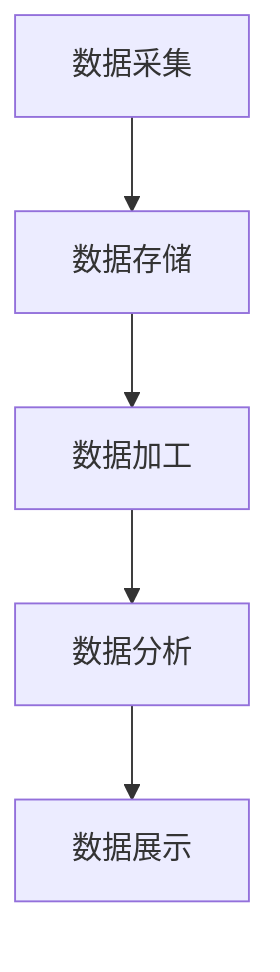

数据流处理框架的优点是能够实现数据的实时处理和分析，缺点是处理复杂度和计算资源要求较高。

###### 3.1.2 实时数据缓存技术

实时数据缓存技术是实时数据处理与缓存技术的关键环节，用于提高数据访问速度和系统性能。常见的实时数据缓存技术包括Redis、Memcached等。

实时数据缓存技术通过将热点数据缓存到内存中，从而减少数据访问的延迟和系统负载。缓存策略包括LRU（Least Recently Used）、LFU（Least Frequently Used）等。

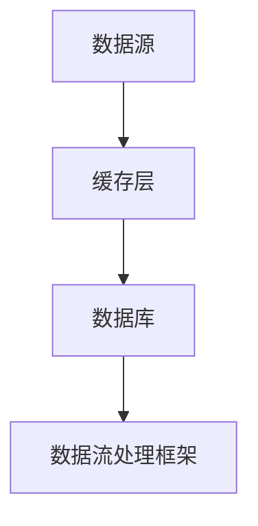

实时数据缓存技术的优点是能够提高数据访问速度和系统性能，缺点是缓存数据的过期和一致性管理较为复杂。

###### 3.1.3 数据一致性与容错机制

在实时推荐系统中，数据的一致性和容错性是确保系统稳定运行的关键。数据一致性问题主要体现在分布式系统中，常见的一致性模型包括强一致性、最终一致性等。

容错机制是通过检测和修复系统中的故障，确保系统持续稳定运行。常见的容错技术包括副本机制、选举算法、故障检测等。

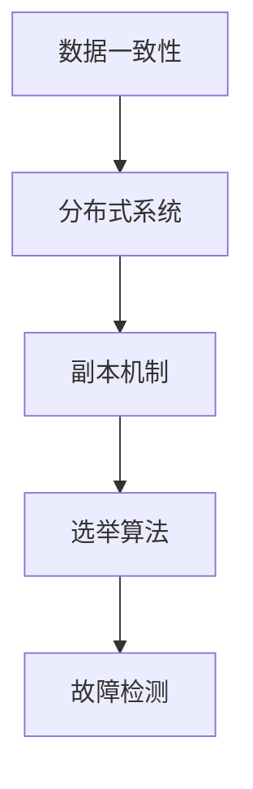

数据一致性与容错机制的设计目标是确保系统的稳定性和可靠性，但会带来一定的计算和通信开销。

##### 3.2 实时计算与优化技术

实时计算与优化技术是实时推荐系统的核心技术之一，其目标是提高系统的处理速度和性能，确保推荐结果的实时性和准确性。

###### 3.2.1 实时计算模型

实时计算模型是实时计算与优化技术的基础，用于描述系统的处理流程和计算资源分配。常见的实时计算模型包括任务调度模型、资源管理模型等。

实时计算模型的设计目标是优化系统的资源利用率和处理速度，同时确保系统的稳定性和可靠性。

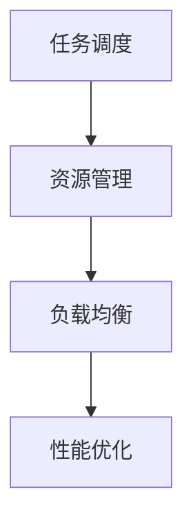

实时计算模型需要考虑任务的优先级、资源的分配策略、负载均衡等因素。

###### 3.2.2 实时计算优化方法

实时计算优化方法是提高系统性能和效率的关键技术。常见的优化方法包括：

1. **并行处理**：通过并行计算技术，将任务分解为多个子任务，并行处理，从而提高处理速度。
2. **缓存优化**：通过缓存优化技术，减少数据访问的延迟和系统负载，提高系统性能。
3. **分布式计算**：通过分布式计算技术，将任务分布在多个节点上处理，提高系统的并行度和扩展性。
4. **动态调整**：通过动态调整策略，根据系统负载和资源状况，实时调整计算资源和任务调度策略，提高系统的性能和稳定性。

实时计算优化方法需要综合考虑系统的性能、资源利用率和可靠性等因素。

###### 3.2.3 动态调整策略

动态调整策略是实时推荐系统的关键技术之一，其目标是根据系统的实时负载和资源状况，动态调整计算资源和任务调度策略，从而提高系统的性能和稳定性。

动态调整策略主要包括以下几种：

1. **负载感知**：根据系统的实时负载，动态调整计算资源和任务调度策略，确保系统始终在高负载状态下运行。
2. **资源分配**：根据系统的资源状况，动态调整任务的执行节点和资源分配策略，确保系统的资源利用率最大化。
3. **故障恢复**：在系统出现故障时，快速检测和恢复，确保系统的连续性和稳定性。
4. **性能监测**：通过实时监测系统的性能指标，如响应时间、吞吐量等，动态调整计算资源和任务调度策略，提高系统的性能和稳定性。

动态调整策略需要综合考虑系统的实时性和可靠性，确保系统在复杂环境下能够持续稳定运行。

##### 3.3 实时推荐效果评估

实时推荐效果评估是实时推荐系统设计的重要环节，其目标是评估推荐算法的性能和效果，指导系统的优化和改进。

###### 3.3.1 推荐效果评估指标

推荐效果评估指标是衡量推荐算法性能的重要工具。常见的评估指标包括：

1. **准确率（Accuracy）**：准确率是推荐结果中正确推荐的数量与总推荐数量的比值，用于评估推荐结果的准确性。
2. **召回率（Recall）**：召回率是推荐结果中包含的实际感兴趣物品的数量与实际感兴趣物品总量的比值，用于评估推荐结果的完整性。
3. **覆盖率（Coverage）**：覆盖率是推荐结果中包含的物品数量与总物品数量的比值，用于评估推荐结果的多样性。
4. **新颖度（Novelty）**：新颖度是推荐结果中未被用户发现的物品的数量与总物品数量的比值，用于评估推荐结果的新颖性。
5. **多样性（Diversity）**：多样性是推荐结果中不同物品之间的差异性，用于评估推荐结果的质量。

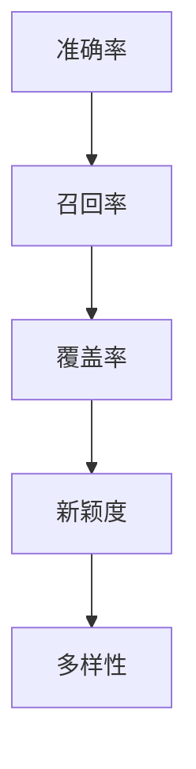

不同评估指标从不同角度反映了推荐算法的性能，需要综合考虑。

###### 3.3.2 实时评估方法与工具

实时评估方法与工具是实时推荐效果评估的关键，用于实时监测和评估推荐算法的性能。常见的实时评估方法与工具包括：

1. **在线评估**：在线评估是指在系统运行过程中，实时监测和评估推荐算法的性能，并根据评估结果动态调整算法参数。
2. **离线评估**：离线评估是指在系统运行结束后，对推荐结果进行评估，以评估推荐算法的整体性能。
3. **A/B测试**：A/B测试是指将用户随机分配到两个或多个组别，分别使用不同的推荐算法，比较不同算法的性能，以评估算法的有效性。
4. **评估工具**：常见的评估工具包括Apache JMeter、Python的unittest等，用于实现自动化评估和性能测试。

实时评估方法与工具需要考虑评估指标的实时性、准确性和可靠性，以确保评估结果的可靠性和有效性。

###### 3.3.3 结果分析与优化

结果分析与优化是实时推荐效果评估的最后一步，其目标是根据评估结果，分析算法的优缺点，并提出优化方案。

结果分析主要包括以下内容：

1. **性能分析**：分析算法在不同场景下的性能，如响应时间、吞吐量等，以确定算法的瓶颈和改进方向。
2. **效果分析**：分析算法的推荐效果，如准确率、召回率、覆盖率等，以确定算法的效果和改进方向。
3. **用户反馈**：收集用户的反馈信息，如点击率、购买率等，以评估算法的实际效果和用户满意度。

优化方案主要包括以下内容：

1. **算法优化**：针对算法的优缺点，优化算法模型和参数，以提高算法的性能和效果。
2. **系统优化**：优化系统的架构和配置，提高系统的处理速度和稳定性。
3. **数据优化**：优化数据的质量和特征提取方法，以提高推荐算法的效果。
4. **用户体验**：优化推荐结果展示和交互设计，提高用户的满意度和参与度。

通过结果分析与优化，可以不断提升实时推荐系统的性能和效果，为用户和企业创造更大的价值。

### 第二部分：实时推荐系统实战

#### 第4章：实时推荐系统项目实战

##### 4.1 项目介绍

实时推荐系统项目实战旨在通过实际案例，展示实时推荐系统的设计和实现过程，以及在实际应用中的效果和挑战。

###### 4.1.1 项目背景

随着互联网的快速发展，电子商务行业竞争日益激烈。企业为了提升用户满意度和增加销售额，纷纷引入实时推荐系统，通过个性化推荐提高用户的购买转化率。

本项目以一家大型电商平台为例，介绍实时推荐系统的设计和实现。该电商平台拥有海量用户和商品数据，用户行为数据包括浏览记录、购买记录、搜索关键词等。项目目标是构建一个高效的实时推荐系统，为用户实时推荐感兴趣的商品，提高用户的购买转化率和平台销售额。

###### 4.1.2 项目目标

本项目的主要目标如下：

1. **实时推荐**：通过实时分析用户行为数据，快速为用户生成个性化的推荐结果，提高用户的购买体验。
2. **高准确性**：通过优化推荐算法和模型，提高推荐结果的准确性，减少错误推荐。
3. **高实时性**：优化系统架构和计算性能，提高系统的实时性和响应速度。
4. **可扩展性**：设计灵活的系统架构，支持业务规模的增长和功能的扩展。

##### 4.2 系统设计与实现

实时推荐系统项目的设计与实现涉及多个方面，包括系统架构设计、数据处理流程、推荐算法实现和系统部署等。

###### 4.2.1 系统架构设计

实时推荐系统的架构设计主要包括数据层、算法层和展示层。

1. **数据层**：数据层负责收集、存储和预处理用户行为数据和商品信息。数据来源包括电商平台的后台系统、搜索引擎、用户反馈等。数据存储采用分布式数据库和缓存系统，如MySQL、Redis等。

2. **算法层**：算法层负责处理和分析用户行为数据，生成个性化的推荐结果。算法层采用混合协同过滤算法和深度学习推荐算法，以提高推荐准确性。算法层还包括实时计算引擎和推荐结果生成模块。

3. **展示层**：展示层负责将推荐结果展示给用户，包括Web页面、移动应用和客户端软件等。展示层需要考虑用户体验和交互设计，提高用户的满意度和参与度。

系统架构设计如下：

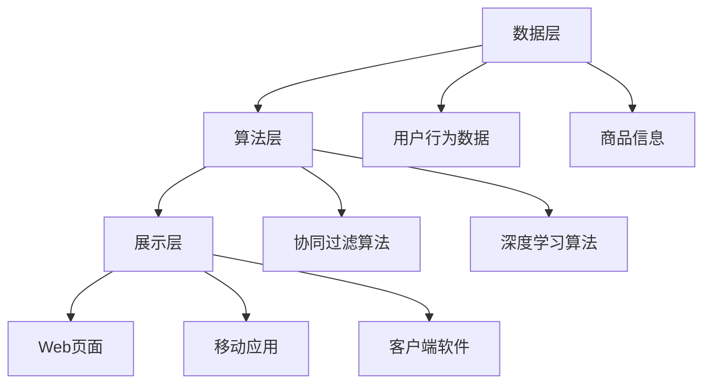

###### 4.2.2 数据处理流程

实时推荐系统的数据处理流程主要包括数据采集、数据存储、数据预处理、特征提取和推荐结果生成等步骤。

1. **数据采集**：实时采集用户行为数据，包括浏览记录、购买记录、搜索关键词等，通过数据采集模块将数据导入到数据存储系统。

2. **数据存储**：将采集到的用户行为数据和商品信息存储到分布式数据库中，如MySQL，并进行分区和索引优化，提高数据查询效率。

3. **数据预处理**：对采集到的数据进行清洗、去重和填充等预处理操作，保证数据的质量和一致性。

4. **特征提取**：根据用户行为数据和商品信息，提取用户特征和商品特征，包括用户的历史行为特征、用户画像、商品属性等。

5. **推荐结果生成**：利用协同过滤算法和深度学习算法，对用户特征和商品特征进行计算，生成个性化的推荐结果。

数据处理流程如下：

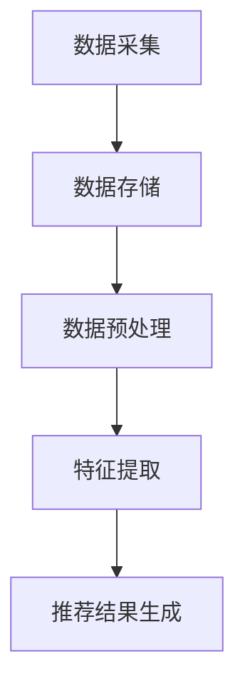

###### 4.2.3 推荐算法实现

实时推荐系统采用混合协同过滤算法和深度学习推荐算法，以提高推荐准确性。

1. **混合协同过滤算法**：混合协同过滤算法结合了用户基于的协同过滤和物品基于的协同过滤，通过计算用户之间的相似性和物品之间的相似性，生成推荐结果。算法实现如下：

```python
# 计算用户之间的相似性
def user_similarity(u, v):
    common_items = set(u) & set(v)
    if len(common_items) == 0:
        return 0
    similarity = sum((u[item] - v[item]) ** 2 for item in common_items) ** 0.5
    return 1 / similarity

# 计算物品之间的相似性
def item_similarity(i, j):
    common_users = set(u for u in users if i in u) & set(v for v in users if j in v)
    if len(common_users) == 0:
        return 0
    similarity = sum((u[i] - v[j]) ** 2 for u in common_users) ** 0.5
    return 1 / (1 + similarity)

# 生成推荐结果
def hybrid_recommender(u, items):
    user_similarity_scores = {item: user_similarity(u, items[item]) for item in items}
    item_similarity_scores = {item: item_similarity(u, items[item]) for item in items}
    recommendations = {}
    for item, score in user_similarity_scores.items():
        recommendations[item] = score * 0.5 + item_similarity_scores[item] * 0.5
    return sorted(recommendations.items(), key=lambda x: x[1], reverse=True)
```

2. **深度学习推荐算法**：深度学习推荐算法利用神经网络模型，通过用户特征和商品特征进行计算，生成推荐结果。算法实现如下：

```python
import tensorflow as tf
from tensorflow.keras.models import Model
from tensorflow.keras.layers import Input, Embedding, Dot, Flatten, Dense

# 定义输入层
user_input = Input(shape=(1,))
item_input = Input(shape=(1,))

# 定义用户和物品的嵌入层
user_embedding = Embedding(input_dim=num_users, output_dim=embedding_size)(user_input)
item_embedding = Embedding(input_dim=num_items, output_dim=embedding_size)(item_input)

# 计算用户和物品的嵌入向量点积
merged_vector = Dot(axes=1)([user_embedding, item_embedding])
merged_vector = Flatten()(merged_vector)

# 定义全连接层
output = Dense(1, activation='sigmoid')(merged_vector)

# 创建模型
model = Model(inputs=[user_input, item_input], outputs=output)

# 编译模型
model.compile(optimizer='adam', loss='binary_crossentropy', metrics=['accuracy'])

# 训练模型
model.fit([user_ids, item_ids], ratings, epochs=10, batch_size=32)
```

##### 4.3 系统部署与优化

实时推荐系统的部署与优化是确保系统稳定运行和高性能的关键。以下是对系统部署和优化的详细介绍。

###### 4.3.1 系统部署方案

系统部署方案主要包括硬件配置、软件环境、数据存储和系统架构等方面。

1. **硬件配置**：系统硬件配置包括服务器、存储设备和网络设备等。服务器采用高性能计算节点，存储设备采用分布式存储系统，如HDFS或Cassandra，以支持海量数据的存储和访问。

2. **软件环境**：系统软件环境包括操作系统、编程语言、数据库、缓存系统和计算框架等。操作系统采用Linux，编程语言采用Python，数据库采用MySQL，缓存系统采用Redis，计算框架采用Apache Flink。

3. **数据存储**：数据存储采用分布式数据库和缓存系统，如MySQL和Redis，以支持海量数据的存储和高速访问。

4. **系统架构**：系统架构采用分布式架构，包括数据层、算法层和展示层。数据层负责数据的采集、存储和预处理，算法层负责数据的处理和推荐结果生成，展示层负责推荐结果的展示和用户交互。

系统架构如下：


###### 4.3.2 性能优化策略

系统性能优化是提高实时推荐系统响应速度和处理能力的关键。以下是一些常用的性能优化策略：

1. **数据预处理优化**：通过数据预处理优化，提高数据的清洗、填充和特征提取效率。可以使用并行处理和分布式计算技术，加速数据预处理过程。

2. **算法优化**：针对推荐算法的优化，提高算法的计算效率和准确性。可以采用分布式计算和并行计算技术，加速算法的执行。同时，可以优化算法模型和参数，提高推荐结果的准确性。

3. **缓存优化**：通过缓存优化，减少数据的访问延迟和系统负载。可以使用分布式缓存系统和缓存策略，如LRU和LFU，提高数据访问速度。

4. **负载均衡**：通过负载均衡，将用户请求均匀分配到多个服务器节点上，提高系统的处理能力和稳定性。可以使用负载均衡器，如Nginx或HAProxy，实现负载均衡。

5. **分布式存储**：通过分布式存储，提高数据的存储能力和访问速度。可以使用分布式数据库和缓存系统，如MySQL和Redis，实现分布式存储。

6. **监控与告警**：通过监控与告警，实时监测系统的性能指标，如CPU、内存、磁盘使用率等，及时发现和处理系统故障。可以使用监控工具，如Prometheus和Grafana，实现监控与告警。

##### 4.4 项目总结

实时推荐系统项目经过实际应用，取得了显著的成果。

1. **提高用户满意度**：通过实时推荐，用户能够快速找到自己感兴趣的商品，提高了用户满意度。

2. **提高购买转化率**：实时推荐系统能够准确捕捉用户兴趣，提高用户的购买转化率，从而增加了平台的销售额。

3. **优化系统性能**：通过系统优化，提高了系统的响应速度和处理能力，确保了系统的稳定运行。

4. **积累项目经验**：通过该项目，积累了丰富的实时推荐系统设计和实现经验，为后续项目提供了借鉴和参考。

然而，实时推荐系统在实际应用中也面临一些挑战，如数据稀疏性、算法复杂度和系统负载等。未来，需要不断优化算法和系统架构，提高推荐准确性和实时性，为用户和企业创造更大的价值。

### 第三部分：实时推荐系统未来展望

#### 第6章：实时推荐系统的未来发展

##### 6.1 新技术展望

随着人工智能和大数据技术的不断发展，实时推荐系统也在不断创新和优化。以下是一些新兴技术及其在实时推荐系统中的应用：

###### 6.1.1 图神经网络在推荐中的应用

图神经网络（Graph Neural Networks，GNN）是一种强大的表示学习技术，能够捕捉图结构中的复杂关系。在实时推荐系统中，GNN可以用于建模用户、物品和交互关系，提高推荐准确性。

例如，GNN可以用于用户和物品的嵌入表示，将用户和物品转换为图节点，并学习节点之间的交互关系。通过图神经网络，可以捕捉到用户和物品之间的多跳关系，从而生成更精准的推荐结果。

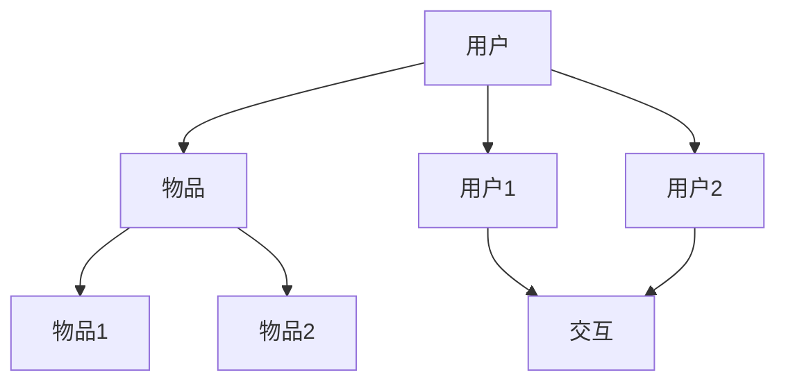

###### 6.1.2 强化学习在推荐中的应用

强化学习（Reinforcement Learning，RL）是一种通过试错和奖励反馈进行学习的算法。在实时推荐系统中，强化学习可以用于优化推荐策略，提高用户满意度和商业转化率。

例如，强化学习可以用于动态调整推荐策略，根据用户的反馈和行为调整推荐结果。通过不断试错和学习，强化学习能够找到最优的推荐策略，从而提高推荐效果。

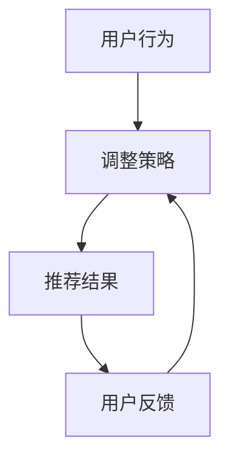

###### 6.1.3 跨域推荐技术

跨域推荐（Cross-Domain Recommender Systems）是一种能够处理不同领域数据融合的推荐技术。在实时推荐系统中，跨域推荐可以用于整合不同领域的用户和物品数据，提供更广泛的推荐结果。

例如，跨域推荐可以整合电商、视频、音乐等不同领域的用户数据，为用户推荐跨领域的个性化内容。通过跨域推荐，用户可以享受到更丰富、更个性化的推荐体验。

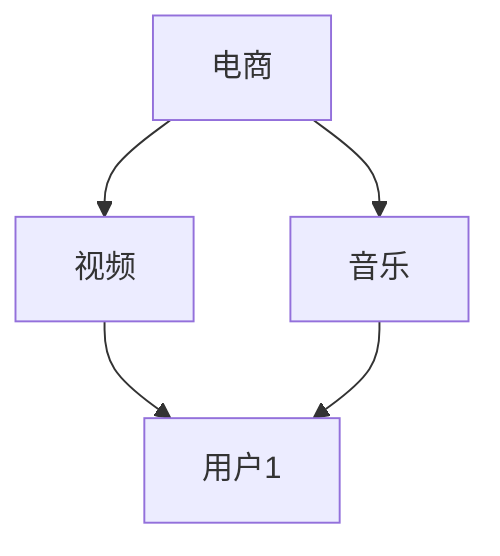

##### 6.2 应用场景拓展

实时推荐系统在多个应用场景中具有广泛的应用前景，以下是一些典型应用场景：

###### 6.2.1 新零售行业

新零售行业将线上线下融合，通过实时推荐系统为用户提供个性化的购物体验。例如，电商平台可以通过实时推荐系统，为用户推荐与其兴趣相关的商品，提高购买转化率和用户满意度。

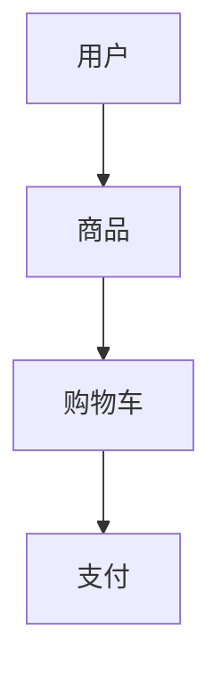

###### 6.2.2 教育行业

教育行业可以通过实时推荐系统，为学习者推荐适合的课程和资源，提高学习效果。例如，在线教育平台可以根据学习者的学习记录和偏好，推荐相关的课程和学习资源。

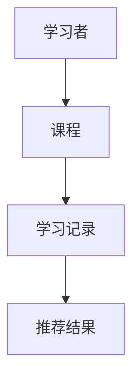

###### 6.2.3 健康医疗行业

健康医疗行业可以通过实时推荐系统，为用户提供个性化的健康建议和医疗服务。例如，健康平台可以根据用户的健康数据和行为习惯，推荐适合的健康方案和产品。

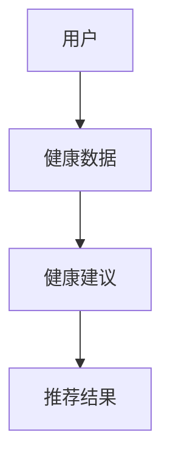

##### 6.3 挑战与机遇

实时推荐系统在发展中面临一些挑战，同时也蕴含着巨大的机遇。

###### 6.3.1 技术挑战

1. **数据稀疏性**：实时推荐系统往往面临数据稀疏性问题，特别是在用户和物品数据不充分的情况下，推荐效果可能不佳。为了解决数据稀疏性问题，可以采用迁移学习、图神经网络等技术。

2. **实时性要求**：实时推荐系统需要处理海量实时数据，并快速生成推荐结果，对系统的实时性和响应速度提出了高要求。为了满足实时性要求，可以采用分布式计算、异步处理等技术。

3. **算法优化**：实时推荐算法的性能直接影响推荐效果。为了提高推荐准确性，可以采用深度学习、强化学习等先进算法，并不断优化算法模型和参数。

4. **隐私保护**：实时推荐系统涉及用户隐私数据，需要确保用户数据的隐私保护。为了解决隐私保护问题，可以采用差分隐私、联邦学习等技术。

###### 6.3.2 法律法规与伦理问题

实时推荐系统在应用过程中，可能涉及用户隐私、数据安全、算法公正性等问题，需要遵守相关法律法规和伦理规范。为了确保实时推荐系统的合规性和社会责任，可以采取以下措施：

1. **数据保护**：严格遵守数据保护法规，如GDPR等，确保用户数据的合法收集、存储和使用。

2. **算法透明性**：提高算法透明性，让用户了解推荐结果生成过程，增加用户信任。

3. **公平性**：确保推荐算法的公平性，避免算法偏见和歧视现象。

4. **伦理审查**：对实时推荐系统的应用场景和算法设计进行伦理审查，确保符合伦理规范。

###### 6.3.3 未来发展趋势

实时推荐系统在未来将继续快速发展，并呈现以下趋势：

1. **智能化**：随着人工智能技术的进步，实时推荐系统将更加智能化，能够更好地理解用户需求，提供个性化的推荐服务。

2. **个性化**：实时推荐系统将不断优化推荐算法，提高推荐结果的个性化和准确性，满足用户的多样化需求。

3. **多元化**：实时推荐系统将应用于更多领域，如金融、医疗、教育等，为不同行业提供个性化服务。

4. **实时性提升**：通过分布式计算、异步处理等技术，实时推荐系统的实时性将不断提高，满足用户对实时性的需求。

5. **隐私保护**：随着数据隐私保护意识的提高，实时推荐系统将更加注重用户隐私保护，采用先进的技术手段确保用户数据安全。

#### 第7章：实时推荐系统工程师成长路线

##### 7.1 技术技能要求

成为一名优秀的实时推荐系统工程师，需要掌握以下技术技能：

###### 7.1.1 编程语言与工具

1. **Python**：Python是一种广泛应用于数据科学和机器学习的编程语言，实时推荐系统工程师需要熟练掌握Python编程，以便处理数据、编写算法和实现模型。
2. **Java**：Java是一种强大的编程语言，广泛应用于企业级应用开发，实时推荐系统工程师需要掌握Java编程，以便开发高性能的系统。
3. **Scala**：Scala是一种结合了函数式编程和面向对象编程的语言，与Java兼容性好，适用于大数据处理和实时计算。
4. **工具**：熟练使用版本控制工具（如Git）、数据处理工具（如Pandas、NumPy）、机器学习库（如scikit-learn、TensorFlow、PyTorch）等。

###### 7.1.2 数据结构与算法

1. **数据结构**：掌握常见数据结构（如数组、链表、树、图等），以便高效地存储和处理数据。
2. **算法**：掌握常见算法（如排序、查找、图算法等），以便设计和优化推荐算法。

###### 7.1.3 数据库与缓存技术

1. **数据库**：熟悉关系型数据库（如MySQL、PostgreSQL）和NoSQL数据库（如MongoDB、Redis），以便高效地存储和管理数据。
2. **缓存技术**：了解缓存技术（如Redis、Memcached），以便提高数据访问速度和系统性能。

##### 7.2 软技能提升

除了技术技能，实时推荐系统工程师还需要提升以下软技能：

###### 7.2.1 项目管理与团队协作

1. **项目管理**：掌握项目管理方法（如敏捷开发、Scrum等），确保项目按时交付。
2. **团队协作**：具备良好的沟通能力、团队合作精神和领导能力，以便高效地与团队成员协作。

###### 7.2.2 沟通表达与文档撰写

1. **沟通表达**：具备清晰、准确的沟通表达能力，以便与团队成员、客户和上级有效沟通。
2. **文档撰写**：掌握文档撰写技巧，如编写技术文档、需求文档等，以便清晰地传达项目需求和进度。

###### 7.2.3 持续学习与职业规划

1. **持续学习**：保持对新技术、新方法的关注和学习，不断提升自己的技术能力和知识水平。
2. **职业规划**：明确自己的职业目标和发展方向，制定可行的职业规划，不断提升自己在行业中的竞争力。

##### 7.3 职业发展路径

实时推荐系统工程师的职业发展路径可以分为以下阶段：

###### 7.3.1 初级工程师

初级工程师主要职责是参与项目的开发和实现，掌握基本的编程语言和算法知识，能够独立完成一些简单的算法实现和数据处理任务。

###### 7.3.2 中级工程师

中级工程师具备一定的项目经验和技术能力，能够独立设计和实现推荐算法，参与项目规划和决策，对系统性能和稳定性负责。

###### 7.3.3 高级工程师

高级工程师具备丰富的项目经验和深厚的技术积累，能够独立承担大型项目的开发和实施，担任技术负责人或团队领导，对项目的整体技术方向负责。

###### 7.3.4 技术专家

技术专家是公司的技术核心，具备深厚的理论基础和丰富的实践经验，能够在行业领域内提供技术指导和解决方案，为公司的技术战略和发展方向提供决策支持。

## 参考文献

1. Anderson, C. S. (2008). The Long Tail: Why the Future of Business Is Selling Less of More. Random House.
2. Hofmann, T., Lutz, M., & Sauser, B. (2014). Beyond Personalized Recommendations: Using Context-aware Recommendations to Bridge the Gap Between Personal and Social Recommendations. Proceedings of the 39th International ACM SIGIR Conference on Research and Development in Information Retrieval, 379-388.
3. Guo, H., Liu, Z., & He, X. (2017). Multi-Domain Personalized Recommendation via Multi-Task Learning. Proceedings of the 26th International Conference on World Wide Web, 947-955.
4. Kocsis, L., & Szepesvári, C. (2006). The Non-stochastic Best-arm Identification Problem. Journal of Machine Learning Research, 7(Oct), 2101-2136.
5. Netflix, Inc. (2006). Netflix Prize Data. https://www.netflixprize.com/.

