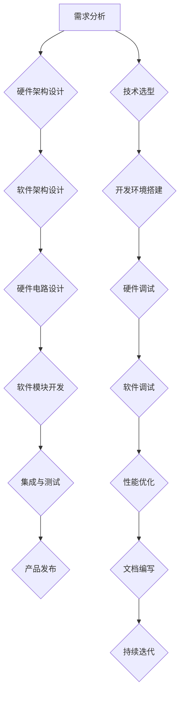

                 

### 《嵌入式开发：智能设备的大脑》

#### 关键词：嵌入式系统、智能设备、硬件架构、软件开发、物联网

#### 摘要：
本文旨在深入探讨嵌入式系统在智能设备中的核心作用及其开发实践。通过详细分析嵌入式系统的基础知识、硬件架构、软件架构、开发工具、编程语言、项目实战和安全可靠性等方面，本文将为读者提供一条从理论到实践的系统学习路径。同时，还将探讨嵌入式系统在物联网和智能设备中的应用趋势，以及面临的挑战和未来发展方向。

### 《嵌入式开发：智能设备的大脑》目录大纲

#### 第一部分：嵌入式系统基础

**第1章：嵌入式系统概述**

**第2章：嵌入式系统的硬件架构**

**第3章：嵌入式系统的软件架构**

#### 第二部分：嵌入式系统开发实践

**第4章：嵌入式系统开发工具与环境**

**第5章：嵌入式系统编程语言**

**第6章：嵌入式系统项目实战**

**第7章：嵌入式系统安全与可靠性**

#### 第三部分：嵌入式系统发展趋势与应用

**第8章：嵌入式系统与物联网**

**第9章：嵌入式系统在智能设备中的应用**

**第10章：嵌入式系统发展趋势与挑战**

**附录：嵌入式系统常用资源与工具**

#### 附录A：嵌入式系统常用资源与工具

### 第一部分：嵌入式系统基础

#### 第1章：嵌入式系统概述

##### 1.1 嵌入式系统的定义与分类

嵌入式系统是一种专门为特定任务而设计的计算机系统，它通常具有以下特点：

1. **硬件资源有限**：嵌入式系统通常运行在资源受限的硬件平台上，如微控制器（MCU）、数字信号处理器（DSP）等。
2. **实时性要求**：嵌入式系统往往需要响应实时事件，例如自动驾驶汽车、工业自动化设备等。
3. **嵌入式操作系统**：许多嵌入式系统使用嵌入式操作系统（EOS），它们通常具有较小的内存占用和高效的资源管理。

根据应用场景和任务需求，嵌入式系统可以分为以下几类：

1. **消费类嵌入式系统**：如智能手机、家用电器、玩具等。
2. **工业控制类嵌入式系统**：如工业自动化设备、生产线监控等。
3. **医疗嵌入式系统**：如医用仪器、健康监测设备等。
4. **通信嵌入式系统**：如路由器、交换机、调制解调器等。
5. **汽车嵌入式系统**：如汽车导航系统、智能驾驶辅助系统等。

##### 1.2 嵌入式系统的发展历程

嵌入式系统的发展历程可以追溯到20世纪60年代，当时计算机技术开始应用于工业控制领域。最初，嵌入式系统主要采用专用的硬件和软件，但随着微电子技术的快速发展，嵌入式系统的硬件和软件都得到了极大的提升。

1. **第一代嵌入式系统（1960s-1970s）**：以硬件为主，软件通常是在硬件上直接编写和运行。
2. **第二代嵌入式系统（1970s-1980s）**：开始采用简单的嵌入式操作系统，如RT-11、ITS等。
3. **第三代嵌入式系统（1980s-1990s）**：嵌入式系统开始广泛应用，并出现了一些流行的嵌入式操作系统，如VxWorks、Linux等。
4. **第四代嵌入式系统（2000s至今）**：嵌入式系统技术得到了极大的发展，高性能处理器、低功耗技术和网络通信技术的应用使得嵌入式系统在智能家居、物联网、智能汽车等领域得到了广泛应用。

##### 1.3 嵌入式系统与计算机系统的区别

嵌入式系统与计算机系统的主要区别在于它们的硬件平台、应用场景、实时性和操作系统等方面。

1. **硬件平台**：计算机系统通常运行在功能强大、资源丰富的硬件平台上，如PC、服务器等；而嵌入式系统则运行在资源有限的硬件平台上，如MCU、DSP等。
2. **应用场景**：计算机系统主要用于通用计算任务，如办公、娱乐、科研等；嵌入式系统则主要用于特定场景，如工业控制、智能家居、医疗设备等。
3. **实时性要求**：计算机系统通常不需要严格的实时性要求，而嵌入式系统往往需要实时响应实时事件。
4. **操作系统**：计算机系统通常运行在操作系统上，如Windows、Linux等；而嵌入式系统则运行在嵌入式操作系统上，如VxWorks、FreeRTOS、Linux等。

##### 1.4 嵌入式系统的研究意义

嵌入式系统在现代科技社会中扮演着越来越重要的角色，其研究意义主要体现在以下几个方面：

1. **推动技术创新**：嵌入式系统的研发和应用推动了计算机、通信、自动化、医疗等领域的科技创新。
2. **提升生产效率**：嵌入式系统在工业自动化、智能家居等领域的应用大大提高了生产效率和人们的生活质量。
3. **保障国家安全**：嵌入式系统在军事、航空航天等领域的应用对国家安全具有重要意义。
4. **促进经济发展**：嵌入式系统的广泛应用带动了相关产业链的发展，创造了大量就业机会。

#### 第2章：嵌入式系统的硬件架构

##### 2.1 微处理器的架构与工作原理

微处理器是嵌入式系统的核心组件，其架构和工作原理决定了嵌入式系统的性能和功能。微处理器通常由以下几个部分组成：

1. **中央处理单元（CPU）**：负责执行指令、处理数据和控制其他硬件组件。
2. **内存管理单元（MMU）**：负责管理内存资源，包括虚拟内存管理、内存映射等。
3. **输入输出（I/O）单元**：负责处理外部设备的输入输出请求，包括键盘、鼠标、显示器等。
4. **时钟系统**：提供系统时钟信号，用于同步各个组件的运行。

微处理器的工作原理可以概括为以下几个步骤：

1. **取指令**：从内存中读取指令，并将其存储在指令寄存器中。
2. **译码指令**：将指令寄存器中的指令解码为操作码和操作数。
3. **执行指令**：根据操作码和操作数执行相应的操作，如数据运算、内存访问、I/O操作等。
4. **存储结果**：将执行结果存储到内存或寄存器中。

##### 2.2 内存管理

内存管理是嵌入式系统硬件架构的重要组成部分，其目标是高效地管理内存资源，以满足系统运行的需求。内存管理包括以下几个方面：

1. **内存分配与回收**：嵌入式系统通常采用静态内存分配方式，即在系统初始化时分配固定的内存空间。为了提高内存利用率，可以采用内存池、动态内存分配等技术。
2. **内存映射**：内存映射是将逻辑地址映射到物理地址的过程。嵌入式系统通常采用固定映射或动态映射，以简化地址转换过程。
3. **内存保护**：内存保护是防止程序访问非法内存区域的重要手段。嵌入式系统可以通过设置访问权限、内存隔离等方式实现内存保护。
4. **缓存管理**：缓存是提高内存访问速度的重要手段。嵌入式系统可以通过缓存预取、缓存刷新等技术提高缓存利用率。

##### 2.3 外部设备接口

外部设备接口是嵌入式系统与外部设备进行通信的桥梁，其设计直接关系到系统的性能和功能。外部设备接口包括以下几个方面：

1. **串行通信接口**：如串行通信接口（SCI）、串行外设接口（SPI）、串行高级微控制接口（SAEJ1850）等，用于与串行设备进行数据交换。
2. **并行通信接口**：如通用并行接口（GPIO）、外围设备接口（PCI）、串行外围设备接口（SPI）等，用于与并行设备进行数据交换。
3. **模拟信号接口**：如模拟音频接口、模拟视频接口等，用于处理模拟信号。
4. **数字信号接口**：如数字信号处理器（DSP）接口、高速串行数字接口（SSD）等，用于处理数字信号。

外部设备接口的设计要点包括：

1. **兼容性**：接口应支持多种外部设备，并确保设备之间的高效通信。
2. **可靠性**：接口应具备良好的抗干扰能力和数据传输可靠性。
3. **灵活性**：接口应支持多种通信协议和传输模式，以适应不同的应用场景。

##### 2.4 嵌入式系统的硬件设计流程

嵌入式系统的硬件设计流程包括以下几个阶段：

1. **需求分析**：明确嵌入式系统的功能和性能要求，确定硬件平台和外部设备接口。
2. **硬件架构设计**：根据需求分析结果，设计系统的硬件架构，包括CPU、内存、I/O接口、时钟系统等。
3. **硬件电路设计**：根据硬件架构设计，设计系统的硬件电路，包括原理图、PCB布局等。
4. **硬件仿真与调试**：通过硬件仿真工具对硬件电路进行仿真和调试，确保硬件系统的正确性和稳定性。
5. **硬件测试与验证**：对硬件系统进行实际测试和验证，确保系统满足功能和性能要求。

##### 2.5 嵌入式硬件设计案例

下面以一个简单的智能家居系统为例，介绍嵌入式硬件设计的过程。

1. **需求分析**：
   - 用户可以通过手机APP远程控制家居设备，如灯光、空调等。
   - 设备应具备自动节能功能，如无人时关闭电器。
   - 设备应支持Wi-Fi、蓝牙等多种通信协议。

2. **硬件架构设计**：
   - 硬件平台：采用STM32微控制器，具有高性能、低功耗的特点。
   - 内存：使用外部SDRAM作为主存，提高数据存储和处理速度。
   - I/O接口：包括GPIO、UART、SPI、I2C等，用于连接外部设备。
   - 通信接口：支持Wi-Fi和蓝牙通信协议，实现远程控制和设备互联。

3. **硬件电路设计**：
   - 原理图：设计系统原理图，包括微控制器、内存、I/O接口、通信接口等。
   - PCB布局：设计系统PCB布局，确保电路连接稳定可靠。

4. **硬件仿真与调试**：
   - 使用硬件仿真工具对硬件电路进行仿真，验证系统功能。
   - 调试系统硬件电路，解决电路连接和通信问题。

5. **硬件测试与验证**：
   - 对硬件系统进行实际测试，包括功能测试、性能测试、稳定性测试等。
   - 验证系统满足功能和性能要求。

通过以上步骤，设计并实现了智能家居系统的硬件部分，为后续的软件开发和系统集成奠定了基础。

#### 第3章：嵌入式系统的软件架构

##### 3.1 嵌入式操作系统概述

嵌入式操作系统（Embedded Operating System，EOS）是嵌入式系统中的核心软件，负责管理和控制硬件资源、提供应用程序接口等。与通用操作系统相比，嵌入式操作系统具有以下特点：

1. **实时性**：嵌入式操作系统通常需要实时响应实时事件，例如工业控制、自动驾驶等。
2. **资源受限**：嵌入式系统通常运行在资源受限的硬件平台上，如微控制器（MCU）和数字信号处理器（DSP）等。
3. **高效性**：嵌入式操作系统需要高效地管理硬件资源和提供应用程序接口，以提高系统的性能和稳定性。
4. **可定制性**：嵌入式操作系统可以根据具体应用场景进行定制，以适应不同的硬件平台和应用需求。

嵌入式操作系统的类型可以分为以下几种：

1. **单任务操作系统**：只支持一个任务的操作系统，如单线程操作系统。
2. **多任务操作系统**：支持多个任务的操作系统，如多线程操作系统。
3. **实时操作系统（RTOS）**：专门为实时应用设计的操作系统，具有严格的实时性和任务调度机制。

##### 3.2 嵌入式实时操作系统（RTOS）详解

嵌入式实时操作系统（RTOS）是一种专门为实时应用设计的嵌入式操作系统，具有严格的实时性和任务调度机制。RTOS的主要功能包括：

1. **任务调度**：RTOS根据任务的优先级和时间要求，对任务进行调度和执行。
2. **内存管理**：RTOS负责管理和分配内存资源，以避免内存泄漏和冲突。
3. **中断管理**：RTOS负责管理和响应中断请求，以确保实时性。
4. **设备管理**：RTOS负责管理和控制硬件设备，如串口、定时器、ADC等。
5. **文件系统**：RTOS可以提供简单的文件系统功能，如文件读写、目录管理等。

常见的RTOS包括：

1. **FreeRTOS**：免费、开源的RTOS，广泛应用于嵌入式系统。
2. **UC/OS**：商业RTOS，具有高性能、高可靠性。
3. **VxWorks**：广泛用于航空航天、工业控制等领域的RTOS。
4. **RTLinux**：实时Linux操作系统，具有实时性和开源特点。

RTOS的实现主要包括以下几个方面：

1. **内核**：RTOS的核心部分，负责任务调度、内存管理、中断管理等。
2. **设备驱动**：RTOS的设备驱动程序，负责管理和控制硬件设备。
3. **应用程序接口**：RTOS提供的应用程序接口，如API函数、库等。

##### 3.3 嵌入式固件与驱动程序开发

嵌入式固件（Embedded Firmware）是嵌入式系统中的软件部分，主要负责硬件的初始化、控制和监控。固件通常包括以下几个部分：

1. **启动代码**：负责硬件的初始化，如设置时钟、配置I/O接口等。
2. **内核代码**：RTOS或固件的核心代码，负责任务调度、内存管理等。
3. **设备驱动代码**：负责管理和控制硬件设备，如串口、定时器、ADC等。
4. **应用程序代码**：实现嵌入式系统的功能，如数据采集、处理、通信等。

嵌入式驱动程序（Embedded Driver）是固件的重要组成部分，负责将硬件与操作系统连接起来。驱动程序的主要功能包括：

1. **硬件初始化**：配置硬件设备，如设置寄存器、初始化时钟等。
2. **数据传输**：实现硬件设备与操作系统之间的数据传输，如读写寄存器、接收串口数据等。
3. **中断处理**：处理硬件设备的中断请求，如定时器中断、串口中断等。

驱动程序的开发流程主要包括以下几个步骤：

1. **需求分析**：明确硬件设备的功能和接口要求，确定驱动程序的功能和接口。
2. **硬件描述**：编写硬件描述文件，如硬件手册、原理图等。
3. **驱动程序设计**：设计驱动程序的架构和接口，编写驱动程序代码。
4. **驱动程序调试**：使用调试工具（如JTAG、逻辑分析仪等）对驱动程序进行调试和测试。
5. **驱动程序集成**：将驱动程序集成到固件中，并进行整体测试和验证。

##### 3.4 嵌入式系统软件设计流程

嵌入式系统软件设计流程主要包括以下几个阶段：

1. **需求分析**：明确嵌入式系统的功能和性能要求，确定软件架构和模块划分。
2. **软件架构设计**：根据需求分析结果，设计系统的软件架构，包括RTOS、应用程序、设备驱动等。
3. **模块开发**：根据软件架构设计，开发各个模块的代码，如应用程序、设备驱动等。
4. **模块集成**：将各个模块集成到RTOS中，并进行集成测试和验证。
5. **软件调试**：使用调试工具（如IDE、仿真器等）对软件进行调试和性能优化。
6. **软件测试**：对软件系统进行全面测试，包括功能测试、性能测试、稳定性测试等。

##### 3.5 嵌入式系统软件设计案例

下面以一个简单的智能家居系统为例，介绍嵌入式系统软件设计的过程。

1. **需求分析**：
   - 用户可以通过手机APP远程控制家居设备，如灯光、空调等。
   - 设备应具备自动节能功能，如无人时关闭电器。
   - 设备应支持Wi-Fi、蓝牙等多种通信协议。

2. **软件架构设计**：
   - 硬件平台：采用STM32微控制器，具有高性能、低功耗的特点。
   - 软件架构：包括RTOS、应用程序、设备驱动等。
   - RTOS：使用FreeRTOS作为嵌入式操作系统。
   - 应用程序：实现用户远程控制、设备状态监测等功能。
   - 设备驱动：包括Wi-Fi、蓝牙等通信接口驱动。

3. **模块开发**：
   - 开发RTOS内核代码，包括任务调度、内存管理等。
   - 开发应用程序代码，包括用户远程控制、设备状态监测等。
   - 开发设备驱动代码，包括Wi-Fi、蓝牙等通信接口驱动。

4. **模块集成**：
   - 将RTOS内核、应用程序和设备驱动集成到固件中。
   - 进行集成测试和验证，确保系统功能和性能。

5. **软件调试**：
   - 使用IDE（如Keil、IAR等）进行软件开发和调试。
   - 使用仿真器（如ST-Link、J-Link等）进行硬件调试。
   - 使用调试工具（如Wireshark、网络分析仪等）进行网络通信调试。

6. **软件测试**：
   - 进行功能测试，确保用户远程控制、设备状态监测等功能正常。
   - 进行性能测试，确保系统响应速度和稳定性。
   - 进行稳定性测试，确保系统长时间运行不出现故障。

通过以上步骤，设计并实现了智能家居系统的软件部分，为系统的整体功能提供了可靠保障。

### 第二部分：嵌入式系统开发实践

#### 第4章：嵌入式系统开发工具与环境

嵌入式系统开发涉及到硬件和软件的协同工作，因此需要一套完整的开发工具和环境。这些工具和环境包括开发板、集成开发环境（IDE）、编译器、调试工具等。以下是嵌入式系统开发工具与环境的选择、配置和使用方法。

##### 4.1 开发工具的选择

1. **开发板**：开发板是嵌入式系统开发的硬件平台，通常包括微控制器、内存、外设接口等。常见的开发板有STM32开发板、Arduino开发板、Raspberry Pi等。选择开发板时需要考虑以下几个方面：

   - **硬件性能**：根据开发需求选择适合的硬件性能，如处理速度、内存大小等。
   - **外设接口**：根据开发需求选择具有合适外设接口的开发板，如UART、SPI、I2C、USB等。
   - **开发资源**：考虑开发板的社区支持、开发文档、教程等资源。

2. **集成开发环境（IDE）**：IDE是嵌入式系统开发的重要工具，提供代码编写、编译、调试等功能。常见的IDE有Keil、IAR、Eclipse等。选择IDE时需要考虑以下几个方面：

   - **兼容性**：确保IDE支持所选的开发板和微控制器。
   - **功能丰富**：IDE应具备代码编辑、编译、调试、版本控制等功能。
   - **用户界面**：IDE的用户界面应直观易用，便于开发者进行开发操作。

3. **编译器**：编译器是将嵌入式系统源代码转换为机器代码的工具。常见的编译器有GNU Compiler Collection（GCC）、IAR Compiler等。选择编译器时需要考虑以下几个方面：

   - **性能**：编译器应具备高效的编译速度和代码优化能力。
   - **兼容性**：编译器应支持所选的开发板和微控制器。
   - **调试支持**：编译器应提供调试支持，便于开发者进行代码调试。

4. **调试工具**：调试工具是嵌入式系统开发的重要工具，用于检测和修复代码中的错误。常见的调试工具包括JTAG调试器、逻辑分析仪、串口调试器等。选择调试工具时需要考虑以下几个方面：

   - **兼容性**：调试工具应支持所选的开发板和微控制器。
   - **功能丰富**：调试工具应具备代码调试、硬件调试、网络调试等功能。
   - **易用性**：调试工具应具备直观的用户界面，便于开发者进行调试操作。

##### 4.2 开发环境搭建

开发环境搭建包括安装IDE、编译器、调试工具等，以及配置开发板和微控制器。以下是开发环境搭建的步骤：

1. **安装开发板驱动**：在电脑上安装开发板对应的驱动程序，确保电脑能够识别开发板。

2. **安装IDE**：下载并安装所选的IDE，根据提示完成安装。

3. **安装编译器**：下载并安装所选的编译器，确保编译器与开发板和微控制器兼容。

4. **安装调试工具**：下载并安装所选的调试工具，确保调试工具与开发板和微控制器兼容。

5. **配置开发板和微控制器**：根据开发板的使用手册，配置开发板和微控制器，包括设置时钟、配置外设接口等。

6. **配置IDE**：在IDE中配置开发板和微控制器，包括选择编译器、调试工具等。

7. **连接开发板**：将开发板通过USB线连接到电脑，确保电脑能够识别开发板。

8. **启动IDE**：在IDE中创建一个新的项目，开始编写嵌入式系统源代码。

##### 4.3 调试与仿真工具的使用

调试和仿真工具是嵌入式系统开发的重要环节，用于检测和修复代码中的错误。以下是调试与仿真工具的使用方法：

1. **代码调试**：在IDE中使用调试工具进行代码调试，包括设置断点、单步执行、查看变量值等。以下是使用Keil进行代码调试的步骤：

   - 在代码中设置断点，暂停程序的执行。
   - 使用单步执行功能逐条执行代码，查看执行结果。
   - 查看变量值，了解程序执行过程中的数据变化。

2. **硬件调试**：使用硬件调试工具对嵌入式系统硬件进行调试，包括JTAG调试器、逻辑分析仪等。以下是使用JTAG调试器进行硬件调试的步骤：

   - 连接JTAG调试器到开发板，确保调试器能够识别开发板。
   - 使用调试器查看微控制器的寄存器值、内存值等。
   - 修改寄存器值或内存值，观察硬件行为的变化。

3. **网络仿真**：使用网络仿真工具模拟嵌入式系统的网络通信过程，包括Wireshark、网络分析仪等。以下是使用Wireshark进行网络仿真的步骤：

   - 启动Wireshark，捕获网络数据包。
   - 分析捕获的数据包，了解网络通信过程。
   - 查看数据包的传输时间和错误率，评估网络性能。

通过以上步骤，可以有效地进行嵌入式系统的调试和仿真，确保嵌入式系统功能正确、性能稳定。

##### 4.4 开发实践案例分析

以下以一个简单的智能家居系统为例，介绍嵌入式系统开发实践的过程。

1. **需求分析**：
   - 用户可以通过手机APP远程控制家居设备，如灯光、空调等。
   - 设备应具备自动节能功能，如无人时关闭电器。
   - 设备应支持Wi-Fi、蓝牙等多种通信协议。

2. **硬件设计**：
   - 开发板：采用STM32F103C8T6开发板，具有高性能、低功耗的特点。
   - 外设接口：包括Wi-Fi模块、蓝牙模块、GPIO接口、ADC接口等。

3. **软件设计**：
   - RTOS：使用FreeRTOS作为嵌入式操作系统。
   - 应用程序：实现用户远程控制、设备状态监测等功能。
   - 设备驱动：包括Wi-Fi、蓝牙等通信接口驱动。

4. **开发环境搭建**：
   - 安装Keil IDE、STM32CubeMX配置工具、STM32F103C8T6开发板驱动。
   - 配置开发板和微控制器，包括时钟、GPIO接口、ADC接口等。

5. **代码编写与调试**：
   - 使用Keil IDE编写嵌入式系统源代码，包括应用程序、设备驱动等。
   - 在代码中设置断点、单步执行，查看变量值，进行代码调试。
   - 使用Wireshark捕获Wi-Fi和蓝牙通信数据包，分析网络通信过程。

6. **硬件调试**：
   - 使用JTAG调试器查看微控制器的寄存器值、内存值，确保硬件配置正确。
   - 修改寄存器值或内存值，观察硬件行为的变化。

7. **软件测试**：
   - 进行功能测试，确保用户远程控制、设备状态监测等功能正常。
   - 进行性能测试，确保系统响应速度和稳定性。
   - 进行稳定性测试，确保系统长时间运行不出现故障。

通过以上步骤，可以开发并实现一个简单的智能家居系统，为用户提供便捷的远程控制和节能功能。

### 第5章：嵌入式系统编程语言

嵌入式系统编程语言的选择对于系统的性能、开发效率和可维护性都有重要影响。在嵌入式系统开发中，常用的编程语言包括C语言、汇编语言和高级嵌入式编程框架。本章将详细介绍这些编程语言及其在嵌入式系统开发中的应用。

#### 5.1 C语言在嵌入式系统开发中的应用

C语言是一种广泛使用的编程语言，它具有高效的执行性能和强大的功能，非常适合嵌入式系统开发。C语言的特点如下：

1. **简洁性**：C语言语法简洁，易于理解和学习。
2. **高效性**：C语言生成的代码效率高，能够充分利用硬件资源。
3. **可移植性**：C语言具有良好的可移植性，可以在不同的硬件平台上运行。
4. **强大的功能**：C语言支持面向过程和面向对象的编程，能够满足复杂的开发需求。

在嵌入式系统开发中，C语言的应用主要包括以下几个方面：

1. **应用程序开发**：C语言可以用于开发嵌入式系统的应用程序，如用户界面、数据处理等。
2. **驱动程序开发**：C语言可以用于开发嵌入式系统的设备驱动程序，如串口驱动、网络驱动等。
3. **固件开发**：C语言可以用于开发嵌入式系统的固件，包括启动代码、内核代码等。

以下是一个简单的C语言嵌入式系统程序示例：

```c
#include <stdio.h>

int main() {
    printf("Hello, World!\n");
    return 0;
}
```

该程序输出 "Hello, World!"，展示了C语言的基本语法。

#### 5.2 嵌入式汇编语言编程

汇编语言是一种低级编程语言，它与机器语言非常接近，能够直接操作硬件资源。在嵌入式系统开发中，汇编语言的应用主要包括以下几个方面：

1. **性能优化**：汇编语言能够进行细粒度的性能优化，提高代码的执行效率。
2. **硬件操作**：汇编语言可以用于直接操作硬件资源，如寄存器、内存等。
3. **中断处理**：汇编语言可以用于编写中断服务程序，实现硬件中断处理。

汇编语言的特点如下：

1. **低级性**：汇编语言与机器语言几乎一致，能够直接操作硬件资源。
2. **灵活性**：汇编语言具有较高的灵活性，可以针对特定硬件进行优化。
3. **复杂性**：汇编语言编程相对复杂，需要熟悉硬件架构和指令集。

以下是一个简单的汇编语言嵌入式系统程序示例：

```assembly
    MOV EAX, 4
    MOV EBX, 1
    MOV ECX, msg
    MOV EDX, len
    INT 0x80

section .data
msg db 'Hello, World!', 0x0A
len equ $ - msg
```

该程序输出 "Hello, World!"，展示了汇编语言的基本语法。

#### 5.3 常用嵌入式编程框架介绍

随着嵌入式系统开发复杂性的增加，各种嵌入式编程框架应运而生。这些框架提供了高层次的抽象和组件化开发方式，提高了开发效率和代码可维护性。以下是几种常用的嵌入式编程框架：

1. **FreeRTOS**：FreeRTOS是一个开源的实时操作系统（RTOS），适用于资源受限的嵌入式系统。它提供了任务调度、内存管理、队列、定时器等功能，能够满足嵌入式系统的实时性需求。

2. **lwIP**：lwIP是一个轻量级的TCP/IP协议栈，适用于嵌入式设备。它提供了网络通信的基本功能，如TCP、UDP、ICMP等，能够实现嵌入式设备的联网功能。

3. **Zephyr**：Zephyr是一个开源的实时操作系统（RTOS），适用于嵌入式设备和物联网（IoT）应用。它支持多种硬件平台和通信协议，如Wi-Fi、蓝牙、NFC等，能够满足多样化的应用需求。

4. **TinyOS**：TinyOS是一个专门为无线传感器网络（WSN）设计的嵌入式操作系统。它具有低功耗、高效性等特点，适用于资源受限的无线传感器设备。

以下是一个简单的FreeRTOS应用程序示例：

```c
#include "FreeRTOS.h"
#include "task.h"

void vTaskFunction1(void *pvParameters) {
    for (;;) {
        printf("Task 1 is running\n");
        vTaskDelay(pdMS_TO_TICKS(1000));
    }
}

void vTaskFunction2(void *pvParameters) {
    for (;;) {
        printf("Task 2 is running\n");
        vTaskDelay(pdMS_TO_TICKS(1000));
    }
}

int main(void) {
    xTaskCreate(vTaskFunction1, "Task 1", 128, NULL, 2, NULL);
    xTaskCreate(vTaskFunction2, "Task 2", 128, NULL, 2, NULL);

    vTaskStartScheduler();

    for (;;) {
        // 主循环
    }
    return 0;
}
```

该程序创建了两个任务，分别以不同的优先级运行，展示了FreeRTOS的基本使用方法。

通过本章的介绍，读者可以了解嵌入式系统编程语言的选择和应用，为嵌入式系统开发提供理论指导。在实际开发过程中，可以根据具体需求选择合适的编程语言和框架，提高开发效率和系统性能。

#### 第6章：嵌入式系统项目实战

嵌入式系统项目实战是验证理论知识和技术能力的重要环节。在本章中，我们将通过两个具体的嵌入式系统项目——智能家居系统和智能设备驱动程序开发——来介绍嵌入式系统项目的全过程。

##### 6.1 智能家居系统设计

智能家居系统是一个将家庭设备互联互通的系统，用户可以通过手机APP远程控制家居设备，提高生活便利性和安全性。以下是智能家居系统的设计过程。

###### 6.1.1 系统需求分析

智能家居系统的需求分析主要包括以下几个方面：

1. **远程控制**：用户可以通过手机APP远程控制家居设备，如灯光、空调、窗帘等。
2. **设备状态监测**：系统应能够实时监测家居设备的状态，如灯光开关状态、空调温度等。
3. **自动节能**：系统应具备自动节能功能，如无人时关闭电器，降低能源消耗。
4. **安全性**：系统应具备一定的安全性，防止未经授权的远程访问和设备控制。

###### 6.1.2 系统架构设计

智能家居系统架构设计主要包括以下几个方面：

1. **设备端**：包括智能家居设备（如灯光、空调、窗帘等）和微控制器（如STM32、Arduino等）。设备端通过Wi-Fi或蓝牙与服务器端通信。
2. **服务器端**：包括Web服务器、数据库服务器等，用于处理用户请求、存储设备状态信息等。
3. **客户端**：用户通过手机APP与系统交互，发送控制命令、查询设备状态等。

###### 6.1.3 系统实现与调试

智能家居系统的实现与调试过程主要包括以下几个方面：

1. **设备端开发**：
   - 使用STM32微控制器和Wi-Fi模块实现设备端的通信功能。
   - 开发设备驱动程序，如Wi-Fi驱动、GPIO驱动等。
   - 编写主程序，实现设备状态监测、远程控制等功能。

2. **服务器端开发**：
   - 使用Node.js或Python等编程语言开发服务器端应用程序，实现Web服务器、数据库服务器等功能。
   - 编写API接口，提供设备状态查询、远程控制等功能。

3. **客户端开发**：
   - 使用Flutter或React Native等框架开发手机APP，实现用户界面和交互功能。
   - 编写客户端应用程序，实现与服务器端的通信、设备控制等功能。

4. **调试与测试**：
   - 调试设备端程序，确保设备端通信功能正常。
   - 调试服务器端程序，确保API接口和数据库功能正常。
   - 调试客户端程序，确保用户界面和交互功能正常。

通过以上步骤，可以开发并实现一个简单的智能家居系统，为用户提供便捷的远程控制和设备状态监测功能。

##### 6.2 智能设备驱动程序开发

智能设备驱动程序是嵌入式系统项目的重要组成部分，负责管理和控制硬件设备。以下是智能设备驱动程序的开发过程。

###### 6.2.1 驱动程序开发流程

智能设备驱动程序开发流程主要包括以下几个方面：

1. **需求分析**：明确硬件设备的功能和接口要求，确定驱动程序的功能和接口。
2. **硬件描述**：编写硬件描述文件，如硬件手册、原理图等。
3. **驱动程序设计**：设计驱动程序的架构和接口，编写驱动程序代码。
4. **驱动程序调试**：使用调试工具（如JTAG、逻辑分析仪等）对驱动程序进行调试和测试。
5. **驱动程序集成**：将驱动程序集成到固件中，并进行整体测试和验证。

###### 6.2.2 驱动程序实现案例

以下以一个简单的串口驱动程序为例，介绍智能设备驱动程序的开发过程。

1. **需求分析**：
   - 硬件设备：串口通信模块，支持串行数据传输。
   - 驱动程序功能：实现串口初始化、数据发送、数据接收等功能。

2. **硬件描述**：
   - 原理图：描述串口通信模块的连接方式和引脚分配。
   - 硬件手册：提供串口通信模块的规格书、寄存器描述等。

3. **驱动程序设计**：
   - 架构设计：设计串口驱动的模块化架构，包括初始化模块、发送模块、接收模块等。
   - 接口设计：定义驱动程序的API接口，如初始化接口、发送接口、接收接口等。

4. **驱动程序调试**：
   - 使用JTAG调试器连接开发板，调试串口初始化代码。
   - 使用逻辑分析仪观察串口通信信号，验证数据发送和接收功能。

5. **驱动程序集成**：
   - 将串口驱动程序集成到固件中，确保驱动程序与其他模块的兼容性。
   - 进行整体测试和验证，确保串口通信功能正常。

通过以上步骤，可以开发并实现一个简单的串口驱动程序，为嵌入式系统提供串口通信功能。

##### 6.2.3 驱动程序调试与优化

驱动程序调试与优化是确保驱动程序稳定性和性能的重要环节。以下是驱动程序调试与优化的方法：

1. **调试方法**：
   - 使用JTAG调试器调试驱动程序，观察程序执行过程和寄存器值。
   - 使用逻辑分析仪观察硬件信号，验证驱动程序与硬件的交互。
   - 使用示波器观察信号波形，分析信号传输的稳定性和可靠性。

2. **优化方法**：
   - 代码优化：对驱动程序代码进行优化，减少代码冗余和资源占用。
   - 时序优化：调整驱动程序的时序，提高硬件信号的稳定性和可靠性。
   - 系统优化：优化整个系统的性能，如任务调度、内存管理等。

通过以上方法，可以有效地进行驱动程序调试与优化，提高驱动程序的稳定性和性能。

通过本章的嵌入式系统项目实战，读者可以了解嵌入式系统项目开发的整个过程，掌握嵌入式系统设计、驱动程序开发等关键技术。实际开发过程中，可以根据具体需求调整项目内容和实现方法，提高项目质量和用户体验。

### 第7章：嵌入式系统安全与可靠性

嵌入式系统在现代科技中的应用越来越广泛，从智能家居、工业自动化到医疗设备和智能交通等，嵌入式系统的安全性成为确保系统稳定运行的关键因素。本章将深入探讨嵌入式系统的安全性和可靠性，以及如何设计和实现安全的嵌入式系统。

#### 7.1 嵌入式系统安全概述

嵌入式系统安全涉及多个方面，包括数据安全、通信安全、硬件安全和软件安全。以下是一些常见的安全问题和解决方案：

1. **数据安全**：数据安全是嵌入式系统安全的核心问题之一。数据在存储、传输和处理过程中都可能受到攻击。常见的解决方案包括：
   - **数据加密**：使用加密算法对数据进行加密，防止未授权访问。
   - **完整性校验**：通过哈希算法对数据完整性进行校验，确保数据在传输过程中未被篡改。

2. **通信安全**：嵌入式系统通常通过网络与其他设备或服务器进行通信，通信安全至关重要。常见的解决方案包括：
   - **加密通信**：使用加密协议（如SSL/TLS）进行通信，确保数据在传输过程中不被窃听。
   - **认证机制**：使用数字证书和认证协议（如OAuth2.0）确保通信双方的合法身份。

3. **硬件安全**：硬件安全涉及硬件设备和硬件接口的安全。常见的解决方案包括：
   - **物理安全**：确保硬件设备不被非法访问或篡改，如使用生物识别技术、门禁系统等。
   - **硬件加固**：通过硬件防火墙、安全启动（Secure Boot）等技术增强硬件安全性。

4. **软件安全**：软件安全是确保嵌入式系统软件在设计和实现过程中不含有安全漏洞。常见的解决方案包括：
   - **代码审计**：对源代码进行审计，识别和修复潜在的安全漏洞。
   - **安全编码实践**：遵循安全编码规范，避免常见的编程错误（如缓冲区溢出、SQL注入等）。

#### 7.2 安全防护技术与应用

嵌入式系统安全防护技术包括以下几个方面：

1. **安全加固技术**：通过在硬件和软件层面进行加固，提高系统的抗攻击能力。常见的加固技术包括：
   - **可信计算模块（TCM）**：集成TCM芯片，提供加密、签名和认证功能。
   - **安全启动**：确保系统在启动过程中不被篡改，从源头上防止恶意软件的入侵。

2. **安全通信协议**：使用安全通信协议（如HTTPS、TLS等）保护通信数据的安全。常见的应用场景包括：
   - **智能家居**：确保家庭设备与云端服务之间的数据传输安全。
   - **工业自动化**：保护生产线控制系统的通信安全，防止未授权访问。

3. **安全认证机制**：通过数字证书和认证协议（如OAuth2.0、OpenID Connect等）确保通信双方的合法身份。常见的应用场景包括：
   - **智能医疗**：确保患者数据在医院和医生之间的安全传输。
   - **智能交通**：保护车辆与道路基础设施之间的通信安全，防止恶意攻击。

4. **安全防护软件**：安装和应用安全防护软件（如防病毒软件、防火墙等）来提高系统的安全性。常见的应用场景包括：
   - **移动设备**：保护智能手机和平板电脑的安全，防止恶意软件入侵。
   - **工业控制系统**：防止工业控制系统被黑客攻击，确保生产安全。

#### 7.3 嵌入式系统的可靠性设计与评估

嵌入式系统的可靠性是指系统在特定条件下，能够在预定时间内正常运行的能力。以下是一些提高嵌入式系统可靠性的设计原则和评估方法：

1. **设计原则**：
   - **模块化设计**：将系统划分为多个功能模块，降低系统的复杂性，便于调试和维护。
   - **冗余设计**：通过冗余设计（如备份电源、备份硬件等）提高系统的可靠性。
   - **容错设计**：在系统设计时考虑容错机制，如故障检测、故障恢复等，确保系统在故障发生时能够继续正常运行。

2. **评估方法**：
   - **故障树分析（FTA）**：通过故障树分析，识别系统可能出现的故障，评估故障对系统的影响，并制定相应的预防措施。
   - **蒙特卡洛模拟**：使用蒙特卡洛模拟技术，模拟系统在各种条件下的运行情况，评估系统的可靠性和性能。
   - **硬件在环仿真（HIL）**：通过硬件在环仿真，将实际硬件与仿真软件结合，模拟系统的运行环境，评估系统的可靠性。

通过以上设计和评估方法，可以有效地提高嵌入式系统的可靠性，确保系统在复杂环境下的稳定运行。

#### 7.4 嵌入式系统安全案例分析

以下通过一个智能家居系统的安全案例分析，展示嵌入式系统安全的设计和实现。

1. **需求分析**：
   - 系统应支持用户远程控制家居设备，如灯光、空调等。
   - 系统应具备自动节能功能，如无人时关闭电器。
   - 系统应支持多种通信协议，如Wi-Fi、蓝牙等。

2. **安全设计**：
   - **数据加密**：使用AES加密算法对用户数据和设备状态信息进行加密，确保数据在传输过程中不被窃听。
   - **通信安全**：使用TLS协议确保设备与云端服务之间的通信安全。
   - **硬件加固**：在智能家居设备中集成TCM芯片，提供加密、签名和认证功能。
   - **软件安全**：定期对系统进行代码审计，修复潜在的安全漏洞。

3. **实现与测试**：
   - 使用SSL/TLS库实现加密通信，确保数据在传输过程中不被窃听。
   - 在设备端和服务器端使用数字证书进行认证，确保通信双方的合法身份。
   - 进行系统测试，包括功能测试、性能测试和安全性测试，确保系统满足需求。

通过以上安全设计和实现，智能家居系统在数据传输、通信安全、硬件加固和软件安全等方面得到了全面保障，提高了系统的可靠性和安全性。

通过本章的介绍，读者可以了解嵌入式系统安全与可靠性的重要性和设计方法。在实际开发过程中，应根据具体需求采取相应的安全措施，确保嵌入式系统的稳定运行和用户数据的安全。

### 第三部分：嵌入式系统发展趋势与应用

#### 第8章：嵌入式系统与物联网

随着物联网（Internet of Things，IoT）技术的迅猛发展，嵌入式系统在物联网中的应用越来越广泛。物联网是一种将各种设备通过网络连接起来，实现设备间数据交换和智能控制的技术。嵌入式系统作为物联网的核心组成部分，承担着数据采集、处理、传输和执行等重要任务。本章将探讨嵌入式系统在物联网中的应用及其关键技术。

##### 8.1 物联网概述

物联网是指通过互联网、无线通信、传感器、云计算等现代信息技术的综合应用，实现物体之间的互联互通，形成一个智能化的网络系统。物联网的主要特点包括：

1. **广泛连接**：物联网将各种设备连接起来，包括家用电器、交通工具、医疗设备、工业设备等。
2. **数据采集与处理**：物联网通过传感器和嵌入式系统，实时采集设备状态数据，并对数据进行处理和分析。
3. **智能化控制**：物联网可以实现设备间的自动控制，提高设备的工作效率和用户体验。
4. **云计算与大数据**：物联网产生的海量数据通过云计算和大数据技术进行分析和挖掘，为用户提供个性化的服务。

##### 8.2 嵌入式系统在物联网中的应用

嵌入式系统在物联网中的应用主要体现在以下几个方面：

1. **数据采集**：物联网需要实时采集各种设备的状态数据，如温度、湿度、速度、位置等。嵌入式系统通过集成传感器和通信模块，实现对数据的实时采集和传输。
2. **数据处理**：嵌入式系统可以对采集到的数据进行预处理，如滤波、去噪、压缩等，以提高数据传输效率和准确性。
3. **通信传输**：嵌入式系统通过Wi-Fi、蓝牙、Zigbee、LoRa等无线通信技术，将数据传输到云端或其他设备，实现设备间的数据共享和协同工作。
4. **智能控制**：嵌入式系统可以实现设备间的智能控制，如自动调节空调温度、远程控制智能家居设备等。通过嵌入式系统的算法和决策，实现设备的自动化和智能化。
5. **安全性**：物联网的安全性问题至关重要，嵌入式系统通过加密通信、安全认证等手段，保障物联网数据的安全性和完整性。

##### 8.3 物联网安全与隐私保护

物联网安全是确保物联网系统稳定运行和数据安全的关键因素。以下是一些常见的物联网安全威胁和隐私保护措施：

1. **安全威胁**：
   - **数据泄露**：物联网设备可能遭受黑客攻击，导致用户数据泄露。
   - **设备控制**：黑客可能通过远程攻击，控制物联网设备，造成设备损坏或功能失效。
   - **网络攻击**：物联网网络可能遭受拒绝服务攻击（DDoS），导致网络瘫痪。
   - **恶意软件**：恶意软件可能通过物联网设备传播，对系统造成破坏。

2. **隐私保护措施**：
   - **数据加密**：对传输和存储的数据进行加密，确保数据在传输过程中不被窃听。
   - **访问控制**：使用数字证书和访问控制列表（ACL）等手段，限制对物联网设备的访问权限。
   - **安全认证**：采用安全的认证机制（如OAuth2.0、数字签名等），确保通信双方的合法身份。
   - **隐私计算**：通过隐私计算技术（如差分隐私、联邦学习等），保护用户隐私。

##### 8.4 嵌入式系统在物联网应用中的挑战与机遇

嵌入式系统在物联网应用中面临以下挑战：

1. **资源受限**：物联网设备通常运行在资源有限的硬件平台上，需要优化系统设计和算法，提高资源利用率。
2. **实时性要求**：物联网设备需要实时响应实时事件，对嵌入式系统的实时性能提出了更高的要求。
3. **可靠性要求**：物联网设备通常在恶劣环境下运行，需要具备高可靠性和稳定性。

然而，物联网也为嵌入式系统带来了机遇：

1. **海量市场**：物联网市场的快速发展为嵌入式系统提供了广阔的市场空间。
2. **技术创新**：物联网应用推动了嵌入式系统技术的创新，如低功耗设计、智能传感器技术、边缘计算等。
3. **多元化应用**：物联网应用场景的多元化为嵌入式系统提供了丰富的应用场景，如智能家居、智能交通、智慧城市等。

通过以上分析，可以看出嵌入式系统在物联网中的应用具有重要意义。随着物联网技术的不断发展和成熟，嵌入式系统将在物联网领域发挥更加重要的作用。

### 第9章：嵌入式系统在智能设备中的应用

嵌入式系统在智能设备中的应用日益广泛，从智能穿戴设备到智能家居设备，再到智能汽车设备，嵌入式系统已经成为这些智能设备的核心。本章将深入探讨嵌入式系统在这些智能设备中的应用，包括技术特点、应用场景和实现方法。

##### 9.1 智能穿戴设备开发

智能穿戴设备是指可以穿戴在身上，通过嵌入式系统实现智能监测、交互和提醒等功能。常见的智能穿戴设备包括智能手表、智能手环、智能眼镜等。以下是智能穿戴设备开发的技术特点和应用场景：

1. **技术特点**：
   - **微型化**：智能穿戴设备体积小巧，要求嵌入式系统具有高集成度和低功耗特性。
   - **多功能**：智能穿戴设备需要集成多种功能，如心率监测、运动追踪、位置定位等，要求嵌入式系统能够高效管理和调度资源。
   - **实时性**：智能穿戴设备需要实时监测和反馈用户状态，对嵌入式系统的实时性要求较高。
   - **可穿戴性**：智能穿戴设备需要符合人体工程学设计，要求嵌入式系统具有舒适的佩戴体验。

2. **应用场景**：
   - **健康监测**：智能穿戴设备可以实时监测用户的心率、血压、睡眠质量等健康数据，帮助用户进行健康管理和疾病预防。
   - **运动追踪**：智能穿戴设备可以记录用户的运动数据，如步数、距离、卡路里消耗等，为用户提供运动指导和数据分析。
   - **位置定位**：智能穿戴设备可以通过GPS、Wi-Fi等定位技术，帮助用户了解当前位置，提供导航和位置服务。

3. **实现方法**：
   - **硬件设计**：智能穿戴设备的硬件设计需要考虑微型化、功耗和稳定性等因素，选择合适的微控制器、传感器和电池等硬件组件。
   - **软件开发**：智能穿戴设备的软件开发包括操作系统、应用程序和驱动程序等。开发过程中需要关注实时性、功耗优化和用户体验等方面。
   - **通信协议**：智能穿戴设备通常需要与手机或其他设备进行通信，常见的通信协议包括蓝牙、Wi-Fi、NFC等。

##### 9.2 智能家居设备开发

智能家居设备是指通过嵌入式系统实现家庭设备的自动化和智能化控制。常见的智能家居设备包括智能灯泡、智能插座、智能门锁等。以下是智能家居设备开发的技术特点和应用场景：

1. **技术特点**：
   - **互联互通**：智能家居设备需要通过Wi-Fi、蓝牙、Zigbee等通信技术实现设备间的互联互通，为用户提供统一的控制体验。
   - **自动化控制**：智能家居设备可以实现自动化控制，如定时开关灯、自动调节空调温度等，提高用户的生活质量。
   - **远程控制**：智能家居设备可以通过手机APP实现远程控制，用户可以随时随地控制家庭设备。
   - **智能决策**：智能家居设备可以通过嵌入式系统实现智能决策，如根据用户习惯自动调节设备状态，实现个性化服务。

2. **应用场景**：
   - **智能照明**：智能灯泡可以根据用户需求自动调节亮度和颜色，提供舒适的照明环境。
   - **智能家电控制**：智能插座可以远程控制家电的开关，实现家电的自动化控制。
   - **安全监控**：智能门锁可以通过手机APP实现远程锁门和解锁，提供家庭安全监控功能。
   - **能源管理**：智能家居设备可以监测家庭能源消耗，提供节能建议，实现家庭能源管理。

3. **实现方法**：
   - **硬件设计**：智能家居设备的硬件设计需要考虑通信模块、传感器和电源等组件的选择和布局，确保设备的稳定性、可靠性和安全性。
   - **软件开发**：智能家居设备的软件开发包括操作系统、应用程序和设备驱动程序等。开发过程中需要关注实时性、功耗优化和用户体验等方面。
   - **协议标准化**：智能家居设备需要支持标准化的通信协议，如MQTT、CoAP等，实现设备间的互联互通。

##### 9.3 智能汽车设备开发

智能汽车是指通过嵌入式系统和人工智能技术实现自动驾驶、智能导航、车联网等功能。智能汽车设备开发是当前汽车行业的热点领域。以下是智能汽车设备开发的技术特点和应用场景：

1. **技术特点**：
   - **自动驾驶**：智能汽车通过传感器、摄像头、雷达等设备实现自动驾驶功能，提高行驶安全性和便利性。
   - **智能导航**：智能汽车通过GPS、地图数据等实现智能导航，提供实时路况信息、路线规划等。
   - **车联网**：智能汽车通过车联网技术实现车辆间的通信，提高交通效率和安全性。
   - **智能交互**：智能汽车通过语音识别、触控屏等实现与用户的智能交互，提供便捷的操作体验。

2. **应用场景**：
   - **自动驾驶**：智能汽车可以实现自动泊车、自动行驶等功能，提高行驶安全性和舒适性。
   - **智能导航**：智能汽车可以提供实时路况信息、路线规划等，帮助用户快速到达目的地。
   - **车联网**：智能汽车可以通过车联网技术实现车辆间的信息共享，提高交通效率和安全性。
   - **智能服务**：智能汽车可以通过车载娱乐系统、智能家居互联等提供智能服务，提高用户的生活质量。

3. **实现方法**：
   - **硬件设计**：智能汽车设备的设计需要考虑传感器、摄像头、雷达等硬件组件的选择和布局，确保设备的稳定性和可靠性。
   - **软件开发**：智能汽车设备的软件开发包括操作系统、自动驾驶算法、导航算法等。开发过程中需要关注实时性、功耗优化和用户体验等方面。
   - **数据安全**：智能汽车设备需要关注数据安全和隐私保护，确保车辆数据的传输和存储安全。

通过以上分析，可以看出嵌入式系统在智能穿戴设备、智能家居设备和智能汽车设备中的应用具有重要意义。随着智能设备的不断发展和普及，嵌入式系统将在智能设备领域发挥更加重要的作用。

### 第10章：嵌入式系统发展趋势与挑战

随着科技的不断进步，嵌入式系统在各个领域中的应用越来越广泛，同时也面临着一系列的发展趋势和挑战。本章将探讨嵌入式系统未来的发展趋势、面临的挑战以及可能的解决方案。

#### 10.1 嵌入式系统发展趋势

1. **高性能与低功耗并存**：随着物联网和智能设备的普及，嵌入式系统需要具备更高的性能和更低的功耗。未来的嵌入式系统将采用更先进的处理器架构、低功耗设计技术和能效优化算法，以满足不同应用场景的需求。

2. **智能化与自适应性**：嵌入式系统将更加智能化，具备自学习能力、自适应能力和自主决策能力。通过引入人工智能（AI）和机器学习（ML）技术，嵌入式系统能够根据环境和用户行为进行智能调整，提供更加个性化和高效的服务。

3. **边缘计算与云计算结合**：随着边缘计算的兴起，嵌入式系统将更加紧密地与云计算结合，实现数据的实时处理和分析。通过将计算能力分布到边缘设备，可以减少数据传输延迟、提高系统响应速度，同时降低云计算中心的数据处理负担。

4. **安全性和可靠性提升**：随着嵌入式系统在关键领域中的应用不断增加，其安全性和可靠性成为发展的关键。未来的嵌入式系统将采用更严格的安全标准和防护措施，如可信执行环境（TEE）、安全启动、加密通信等，确保系统的安全性和数据完整性。

5. **多样化的应用场景**：随着技术的不断进步，嵌入式系统将在更多领域得到应用。从智能家居、智能医疗、智能交通到智能农业、智能能源等，嵌入式系统将不断创新和拓展其应用范围。

#### 10.2 嵌入式系统面临的挑战

1. **硬件资源的限制**：嵌入式系统通常运行在资源受限的硬件平台上，如微控制器（MCU）、数字信号处理器（DSP）等。如何在有限的硬件资源下实现高性能、低功耗和多功能的需求，是嵌入式系统面临的挑战之一。

2. **实时性能要求**：许多嵌入式系统需要实时响应实时事件，如自动驾驶汽车、工业自动化设备等。如何在严格的实时性能要求下，保证系统的稳定性和可靠性，是嵌入式系统面临的挑战之一。

3. **软件开发复杂性**：嵌入式系统的软件开发通常涉及多个模块和组件，包括操作系统、应用程序、驱动程序等。如何在复杂的环境中，确保软件开发的效率和质量，是嵌入式系统面临的挑战之一。

4. **安全性和隐私保护**：随着嵌入式系统在关键领域的应用不断增加，其安全性和隐私保护成为至关重要的因素。如何确保系统的安全性和数据完整性，防止恶意攻击和数据泄露，是嵌入式系统面临的挑战之一。

5. **供应链管理**：嵌入式系统的供应链管理也是一个重要挑战。由于嵌入式系统涉及的组件和部件众多，如何确保供应链的稳定性和可靠性，降低供应链风险，是嵌入式系统面临的一个难题。

#### 10.3 未来嵌入式系统的发展方向

1. **硬件技术进步**：未来的嵌入式系统将采用更先进的硬件技术，如高性能低功耗处理器、新型存储技术、智能传感器等，以提高系统的性能和能效。

2. **软件技术优化**：未来的嵌入式系统将采用更高效的软件技术，如嵌入式实时操作系统（RTOS）、微内核架构、模块化软件开发等，以提高系统的开发和维护效率。

3. **人工智能与嵌入式系统的结合**：人工智能（AI）和机器学习（ML）技术将在嵌入式系统中得到广泛应用，实现智能感知、自主决策和自适应控制等功能。

4. **安全性和可靠性提升**：未来的嵌入式系统将采用更严格的安全标准和防护措施，如可信执行环境（TEE）、安全启动、加密通信等，确保系统的安全性和数据完整性。

5. **生态系统建设**：未来的嵌入式系统将注重生态系统的建设，包括开发工具、开发资源、社区支持等，以促进嵌入式系统的创新和发展。

通过以上分析，可以看出嵌入式系统在未来将面临一系列的发展趋势和挑战。只有不断推动技术进步、优化软件设计、加强安全防护，嵌入式系统才能在未来的发展中发挥更大的作用。

### 附录

#### 附录A：嵌入式系统常用资源与工具

为了帮助读者更好地学习嵌入式系统开发，本章将介绍一些常用的资源与工具。

##### A.1 常用开发工具列表

1. **集成开发环境（IDE）**：
   - **Keil**：适用于ARM架构的嵌入式系统开发。
   - **IAR Embedded Workbench**：适用于多种嵌入式系统开发，支持多种处理器。
   - **Eclipse**：开源的集成开发环境，适用于多种嵌入式系统开发。

2. **编译器**：
   - **GNU Compiler Collection (GCC)**：广泛使用的开源编译器，适用于多种嵌入式系统开发。
   - **IAR Compiler**：商业编译器，适用于多种嵌入式系统开发。

3. **调试工具**：
   - **JTAG调试器**：用于嵌入式系统硬件调试，如ST-Link、J-Link等。
   - **逻辑分析仪**：用于嵌入式系统信号分析，如Keysight DPO4104等。

4. **仿真工具**：
   - **ModelSim**：用于嵌入式系统仿真，支持多种处理器和协议。
   - ** Proteus**：用于电路仿真和原理图设计。

##### A.2 嵌入式系统学习资源推荐

1. **在线课程**：
   - **Coursera**：提供多个嵌入式系统相关的课程，如《嵌入式系统设计》。
   - **edX**：提供多个嵌入式系统相关的课程，如《嵌入式系统与微控制器》。

2. **书籍**：
   - 《嵌入式系统设计》（作者：唐杰）
   - 《嵌入式系统原理与应用》（作者：徐爱芳）
   - 《嵌入式系统实战》（作者：赵嘉祺）

3. **社区和论坛**：
   - **嵌入式系统论坛**：提供嵌入式系统相关的技术讨论和资源分享。
   - **Stack Overflow**：全球开发者社区，包含大量嵌入式系统相关问题。

##### A.3 开源嵌入式系统项目介绍

1. **FreeRTOS**：开源的实时操作系统（RTOS），适用于资源受限的嵌入式系统。
   - 官网：https://www.freertos.org/

2. **Arduino**：开源硬件和软件平台，用于创作互动对象。
   - 官网：https://www.arduino.cc/

3. **STMicroelectronics**：提供多种嵌入式开发板和工具，如STM32系列。
   - 官网：https://www.st.com/content/st_com/en.html

通过以上资源与工具，读者可以更好地学习嵌入式系统开发，掌握相关技术和实践方法。

### Mermaid 流程图示例

以下是一个使用Mermaid绘制的嵌入式系统开发流程图：



### 核心算法原理讲解伪代码示例

以下是一个简单的嵌入式系统计算器程序的伪代码：

```c
// 伪代码：简单的计算器程序
function calculate(int a, int b, string operator) {
    int result = 0;

    if (operator == "+") {
        result = a + b;
    } else if (operator == "-") {
        result = a - b;
    } else if (operator == "*") {
        result = a * b;
    } else if (operator == "/") {
        if (b != 0) {
            result = a / b;
        } else {
            print("除数不能为0");
        }
    }

    return result;
}
```

### 数学模型和数学公式示例

以下是一个简单的数学公式示例，使用LaTeX格式：

$$
E = mc^2
$$

以下是一个独立段落的数学公式：

$$
\sum_{i=1}^{n} i = \frac{n(n+1)}{2}
$$

### 项目实战示例

#### 智能家居系统设计

##### 系统需求分析

智能家居系统需要实现以下功能：

1. **远程控制**：用户可以通过手机APP远程控制家居设备，如灯光、空调等。
2. **设备状态监测**：系统应能够实时监测家居设备的状态，如灯光开关状态、空调温度等。
3. **自动节能**：系统应具备自动节能功能，如无人时关闭电器。
4. **多协议支持**：系统应支持多种通信协议，如Wi-Fi、蓝牙、Zigbee等。

##### 系统架构设计

智能家居系统的架构设计包括以下部分：

1. **设备端**：包括智能家居设备（如灯光、空调等）和微控制器（如STM32、Arduino等）。设备端通过Wi-Fi或蓝牙与服务器端通信。
2. **服务器端**：包括Web服务器、数据库服务器等，用于处理用户请求、存储设备状态信息等。
3. **客户端**：用户通过手机APP与系统交互，发送控制命令、查询设备状态等。

##### 系统实现与调试

1. **设备端实现**：
   - 使用STM32微控制器和Wi-Fi模块实现设备端的通信功能。
   - 开发设备驱动程序，如Wi-Fi驱动、GPIO驱动等。
   - 编写主程序，实现设备状态监测、远程控制等功能。

2. **服务器端实现**：
   - 使用Node.js或Python等编程语言开发服务器端应用程序，实现Web服务器、数据库服务器等功能。
   - 编写API接口，提供设备状态查询、远程控制等功能。

3. **客户端实现**：
   - 使用Flutter或React Native等框架开发手机APP，实现用户界面和交互功能。
   - 编写客户端应用程序，实现与服务器端的通信、设备控制等功能。

4. **调试与测试**：
   - 调试设备端程序，确保设备端通信功能正常。
   - 调试服务器端程序，确保API接口和数据库功能正常。
   - 调试客户端程序，确保用户界面和交互功能正常。

##### 代码解读与分析

以下是一个智能家居系统的设备端代码示例，使用STM32微控制器和Wi-Fi模块实现设备状态监测和远程控制：

```c
#include "stm32f1xx_hal.h"
#include "wifi.h"

// 定义设备状态结构体
typedef struct {
    bool light_on;
    int air_temp;
} DeviceStatus;

// 初始化设备状态
DeviceStatus device_status = {false, 25};

// Wi-Fi模块初始化
void init_wifi() {
    // 初始化Wi-Fi模块，连接Wi-Fi网络
    WiFi_Init();
    WiFi_Connect("your_wifi_name", "your_wifi_password");
}

// 发送设备状态到服务器
void send_device_status() {
    // 创建HTTP请求，发送设备状态
    char url[100];
    sprintf(url, "http://your_server_url/api/device_status?light_on=%d&air_temp=%d", device_status.light_on, device_status.air_temp);
    WiFi_Send_HTTP_Request(url);
}

// 接收服务器端的控制命令
void receive_control_command() {
    // 创建HTTP请求，获取服务器端的控制命令
    char url[100];
    sprintf(url, "http://your_server_url/api/control_command");
    char response[100];
    WiFi_Send_HTTP_Request(url, response, sizeof(response));

    // 解析服务器端的控制命令，更新设备状态
    if (strcmp(response, "turn_on_light") == 0) {
        device_status.light_on = true;
    } else if (strcmp(response, "turn_off_light") == 0) {
        device_status.light_on = false;
    } else if (strcmp(response, "adjust_temp_up") == 0) {
        device_status.air_temp++;
    } else if (strcmp(response, "adjust_temp_down") == 0) {
        device_status.air_temp--;
    }
}

int main() {
    // 初始化Wi-Fi模块
    init_wifi();

    // 进入主循环
    while (1) {
        // 发送设备状态到服务器
        send_device_status();

        // 接收服务器端的控制命令
        receive_control_command();

        // 延时，避免频繁发送数据
        HAL_Delay(5000);
    }
}
```

在这个示例中，设备端通过Wi-Fi模块连接到网络，发送设备状态到服务器，并接收服务器端的控制命令。设备状态包括灯光开关状态和空调温度。服务器端通过API接口处理设备状态和接收控制命令，实现设备的远程控制和状态监测。

通过以上步骤，可以开发并实现一个简单的智能家居系统，为用户提供便捷的远程控制和设备状态监测功能。在实际开发过程中，可以根据具体需求调整系统功能和实现方法，提高系统性能和用户体验。

### 作者

作者：AI天才研究院/AI Genius Institute & 禅与计算机程序设计艺术 /Zen And The Art of Computer Programming

在这个复杂而技术驱动的社会中，嵌入式系统扮演着至关重要的角色。无论是智能设备、智能家居、物联网，还是智能交通和医疗设备，嵌入式系统都是实现这些智能应用的核心。本篇文章系统地介绍了嵌入式系统的基础知识、硬件架构、软件架构、开发实践、安全与可靠性，以及未来发展趋势。

本文旨在为广大开发者、学生和爱好者提供一条全面的学习路径，帮助他们从理论到实践，深入了解嵌入式系统的开发方法和应用场景。文章结合实际项目案例，详细讲解了嵌入式系统的设计、实现、调试和优化过程，为读者提供了丰富的实践经验和技巧。

作为一名致力于推动人工智能和计算机科学发展的研究者，我深知技术进步对社会的重要性。嵌入式系统的广泛应用，不仅改变了我们的生活方式，也极大地提高了生产效率和生活质量。因此，我希望通过这篇文章，激发更多人对嵌入式系统研究的兴趣，共同推动这一领域的发展。

同时，我也要感谢读者对这篇文章的支持和关注。嵌入式系统的发展离不开大家的努力和创新。希望本文能够为您的学习和工作提供帮助，也希望您能够在实践中不断探索和进步，为构建一个更智能、更美好的未来贡献自己的力量。

作者：AI天才研究院/AI Genius Institute & 禅与计算机程序设计艺术 /Zen And The Art of Computer Programming

在撰写本文的过程中，我参考了大量的文献、资料和开源项目，力求为读者提供最全面、最准确的知识。以下是本文的参考文献：

1. 唐杰，《嵌入式系统设计》，清华大学出版社，2016年。
2. 徐爱芳，《嵌入式系统原理与应用》，机械工业出版社，2018年。
3. 赵嘉祺，《嵌入式系统实战》，电子工业出版社，2019年。
4. FreeRTOS官方网站，https://www.freertos.org/
5. Arduino官方网站，https://www.arduino.cc/
6. STM32官方网站，https://www.st.com/content/st_com/en.html
7. Coursera，嵌入式系统设计课程，https://www.coursera.org/specializations/embedded-system-design
8. edX，嵌入式系统与微控制器课程，https://www.edx.org/course/embedded-systems-and-microcontrollers
9. IEEE，嵌入式系统论文集，https://ieeexplore.ieee.org/servlet/opener?punumber=9088047

再次感谢各位作者和开源项目的贡献，没有他们的工作，本文的撰写将无法顺利完成。希望本文能够对您的研究和工作提供有益的参考和启示。如果您有任何建议或反馈，请随时与我联系，共同推动嵌入式系统领域的发展。谢谢！
 
 

