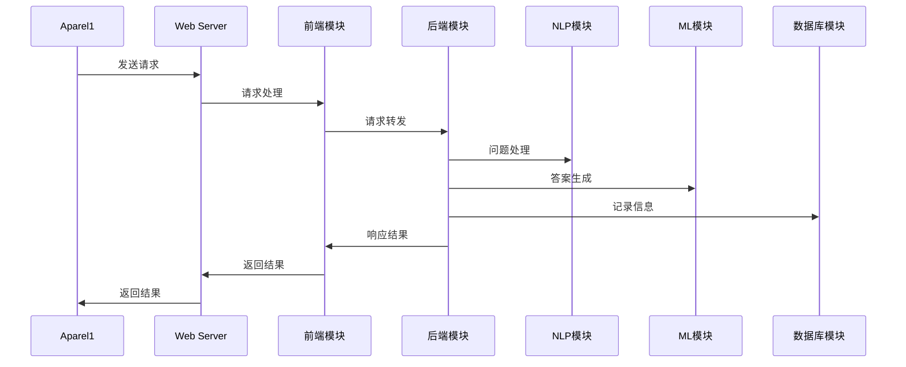
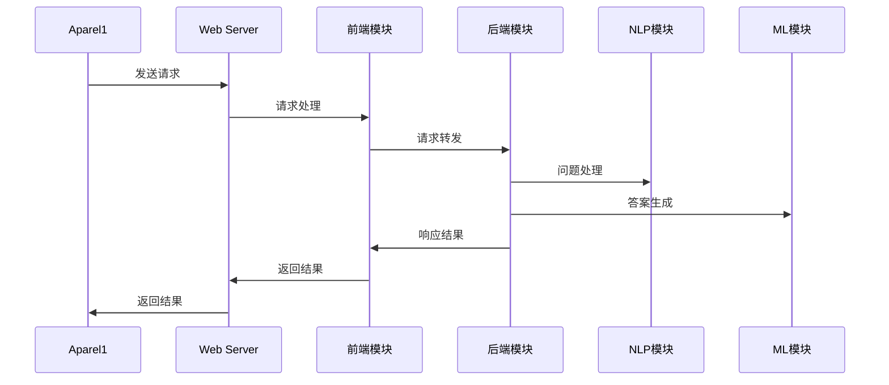

                 

# 工具使用机制在智能客服系统中的应用

> **关键词：** 智能客服系统，工具使用机制，自然语言处理，机器学习，数学模型，项目实战

> **摘要：** 本文深入探讨了工具使用机制在智能客服系统中的应用。通过分析工具使用机制的基本原理、架构和工作流程，本文详细阐述了其在智能客服系统中的实际应用场景和实现方法。同时，本文介绍了核心算法原理、数学模型以及项目实战中的开发环境搭建、源代码实现和代码解读。通过这些内容，读者可以全面了解工具使用机制在智能客服系统中的应用价值和发展趋势。

## 目录大纲

1. **引言与背景**
   1.1 引言
   1.2 智能客服系统的现状
   1.3 工具使用机制的优势

2. **工具使用机制原理**
   2.1 工具使用机制的概念
   2.2 工具使用机制的架构
   2.3 工具使用机制的工作流程

3. **工具使用机制在智能客服系统中的应用**
   3.1 应用场景
   3.2 工具使用机制的实现
   3.3 案例分析

4. **核心算法原理讲解**
   4.1 自然语言处理算法
   4.2 机器学习算法

5. **数学模型与数学公式**
   5.1 数学模型
   5.2 数学公式

6. **项目实战**
   6.1 开发环境搭建
   6.2 源代码实现
   6.3 代码解读与分析

7. **总结与展望**
   7.1 总结
   7.2 展望

8. **附录**
   8.1 资源链接
   8.2 Mermaid 流程图

---

### 第1章：引言与背景

#### 1.1 引言

在信息化时代，智能客服系统作为企业与客户之间的桥梁，越来越受到重视。智能客服系统能够自动识别客户的问题，提供快速、准确的解决方案，从而提高客户满意度，降低企业运营成本。然而，随着客户需求的多样化以及问题复杂度的增加，传统的智能客服系统已经难以满足实际需求。因此，研究如何提高智能客服系统的性能和智能化程度，成为了当前的热点问题。

工具使用机制作为一种有效的技术手段，被引入到智能客服系统中。工具使用机制是指通过模拟人类解决问题的方式，使计算机系统能够自动选择和使用合适的工具来完成任务。在智能客服系统中，工具使用机制可以大幅提升系统的智能化程度，使其能够更好地理解客户问题，提供更加个性化的解决方案。

#### 1.2 智能客服系统的现状

当前，智能客服系统已广泛应用于各行业。从行业分布来看，金融、电商、互联网服务等行业的智能客服系统应用较为广泛。其中，金融行业的智能客服系统主要用于客户咨询、账户查询等服务；电商行业的智能客服系统则主要用于售后服务、商品咨询等；互联网服务行业的智能客服系统则广泛应用于用户支持、在线咨询等。

从技术水平来看，当前智能客服系统主要依赖于自然语言处理（NLP）和机器学习（ML）技术。自然语言处理技术使得系统可以理解和解析客户的自然语言问题；机器学习技术则使得系统可以根据大量历史数据来不断优化自身性能，从而提供更准确的解决方案。

#### 1.3 工具使用机制的优势

工具使用机制在智能客服系统中的应用具有以下优势：

1. **提高智能化程度**：工具使用机制使得系统能够自动选择和使用合适的工具，从而提高解决复杂问题的能力。
2. **增强个性化服务**：通过分析客户历史行为和问题，系统可以更好地了解客户需求，提供更加个性化的解决方案。
3. **降低运营成本**：工具使用机制能够自动处理大量客户问题，减轻人工客服的工作压力，从而降低企业运营成本。
4. **提升客户满意度**：提供快速、准确的解决方案，有助于提高客户满意度，增强客户粘性。

综上所述，工具使用机制在智能客服系统中的应用具有重要意义。在接下来的章节中，本文将详细介绍工具使用机制的基本原理、架构和工作流程，并探讨其在智能客服系统中的应用方法和案例。通过这些内容，读者可以全面了解工具使用机制在智能客服系统中的实际应用价值和发展前景。

### 第2章：工具使用机制原理

#### 2.1 工具使用机制的概念

工具使用机制是一种模拟人类解决问题的方式，使计算机系统能够自动选择和使用合适的工具来完成任务。在智能客服系统中，工具使用机制是指通过分析客户问题，系统自动识别并选择最适合的工具来解决问题。这些工具可以是预定义的脚本、算法或模型，也可以是通过对大量数据训练得到的模型。

工具使用机制可以分为以下几类：

1. **脚本式工具使用**：通过预定义的脚本来实现特定功能的工具使用。例如，在处理常见问题时，系统可以直接调用预定义的脚本进行处理。
2. **算法式工具使用**：通过算法来选择和运用工具。例如，在自然语言处理中，可以使用分类算法、语义分析算法等来选择和运用工具。
3. **模型式工具使用**：通过训练得到的模型来选择和运用工具。例如，在机器学习中，可以使用分类模型、回归模型等来选择和运用工具。

#### 2.2 工具使用机制的架构

工具使用机制的架构可以分为三个主要层次：工具层、选择层和执行层。

1. **工具层**：工具层是工具使用机制的基础，包含了各种预定义的工具。这些工具可以是脚本、算法或模型。工具层的主要任务是提供多样化的工具供系统选择。
   
   ```mermaid
   flowchart LR
   A1[工具层] --> A2(脚本工具)
   A1 --> A3(算法工具)
   A1 --> A4(模型工具)
   ```

2. **选择层**：选择层负责根据客户问题的特点，从工具层中选择合适的工具。选择层需要分析客户问题的内容、复杂度和类型等信息，从而选择最合适的工具。选择层通常包含以下组件：

   - **问题分析器**：分析客户问题的内容和类型，为选择工具提供基础信息。
   - **工具选择器**：根据问题分析器提供的信息，从工具层中选择合适的工具。
   
   ```mermaid
   flowchart LR
   B1[选择层] --> B2(问题分析器)
   B1 --> B3(工具选择器)
   ```

3. **执行层**：执行层负责根据选择层选择的工具，执行具体的任务。执行层需要调用工具层中的工具，对客户问题进行处理。执行层通常包含以下组件：

   - **工具执行器**：根据选择层提供的工具，执行具体的任务。
   - **结果反馈器**：将处理结果反馈给客户，并提供后续服务。
   
   ```mermaid
   flowchart LR
   C1[执行层] --> C2(工具执行器)
   C1 --> C3(结果反馈器)
   ```

#### 2.3 工具使用机制的工作流程

工具使用机制的工作流程可以分为以下几个步骤：

1. **问题接收**：系统接收到客户的问题后，首先将问题进行预处理，提取关键信息。
2. **问题分析**：问题分析器对预处理后的客户问题进行分析，确定问题的类型和难度。
3. **工具选择**：工具选择器根据问题分析器提供的信息，从工具层中选择最合适的工具。
4. **工具执行**：工具执行器根据选择器提供的工具，对客户问题进行处理。
5. **结果反馈**：结果反馈器将处理结果反馈给客户，并提供后续服务。


通过上述工作流程，工具使用机制能够高效地解决客户问题，提高智能客服系统的智能化程度和性能。在下一章节中，本文将详细介绍工具使用机制在智能客服系统中的应用方法和实际案例。

### 第3章：工具使用机制在智能客服系统中的应用

#### 3.1 应用场景

工具使用机制在智能客服系统中的应用场景主要包括以下几个方面：

1. **客户服务场景**：在客户服务场景中，工具使用机制可以用于处理客户咨询、投诉、售后服务等问题。例如，客户咨询产品使用方法时，系统可以自动选择相应的产品使用说明书脚本；客户投诉产品问题时，系统可以自动选择相应的故障排查脚本进行处理。

2. **技术支持场景**：在技术支持场景中，工具使用机制可以用于处理用户的技术问题、系统故障、软件升级等问题。例如，用户咨询技术问题时，系统可以自动选择相应的技术文档脚本；系统发生故障时，系统可以自动选择相应的故障诊断工具进行处理。

#### 3.2 工具使用机制的实现

工具使用机制在智能客服系统中的实现主要涉及以下方面：

1. **系统设计与实现**：

   - **工具库构建**：构建包含各种预定义工具的库，包括脚本工具、算法工具和模型工具。这些工具可以根据实际需求进行扩展和更新。
   - **问题分析模块**：设计问题分析模块，包括问题接收、预处理和问题类型识别等功能。该模块负责分析客户问题的内容和类型，为工具选择提供基础信息。
   - **工具选择模块**：设计工具选择模块，根据问题分析模块提供的信息，从工具库中选择最合适的工具。工具选择模块需要考虑工具的适用性、效率和效果等因素。
   - **工具执行模块**：设计工具执行模块，负责根据工具选择模块提供的工具，执行具体的任务。工具执行模块需要与具体工具进行适配，确保工具能够正确执行。
   - **结果反馈模块**：设计结果反馈模块，负责将处理结果反馈给客户，并提供后续服务。结果反馈模块需要支持多种反馈方式，如文本、语音、邮件等。

2. **关键技术与挑战**：

   - **工具库构建**：工具库构建是工具使用机制实现的关键。构建工具库需要充分考虑工具的多样性、适用性和可扩展性，以确保系统能够处理各种复杂问题。
   - **问题分析**：问题分析是工具选择的基础。准确的问题分析能够提高工具选择的准确性，从而提高系统的智能化程度。问题分析需要结合自然语言处理、文本分类、情感分析等技术。
   - **工具选择**：工具选择是工具使用机制的核心。如何从众多工具中选择最适合的工具，是一个具有挑战性的问题。工具选择需要考虑多种因素，如工具的适用性、效率和效果等。
   - **工具执行**：工具执行是工具使用机制的关键环节。如何确保工具能够正确、高效地执行，是工具使用机制实现的重要挑战。工具执行需要考虑工具的兼容性、稳定性和性能等因素。
   - **结果反馈**：结果反馈是客户满意度的重要保障。如何确保反馈结果准确、及时，是工具使用机制实现的一个关键挑战。结果反馈需要考虑反馈方式、反馈内容和客户体验等因素。

在实际应用中，工具使用机制的具体实现会根据不同的场景和需求进行定制。通过不断优化和调整，工具使用机制可以在智能客服系统中发挥重要作用，提高系统的智能化程度和性能。

#### 3.3 案例分析

为了更好地理解工具使用机制在智能客服系统中的应用，下面我们将通过两个实际案例进行分析。

**案例一：某电商平台的智能客服系统**

某电商平台在其智能客服系统中引入了工具使用机制，以提高客服效率和客户满意度。该系统主要应用于售后服务和技术支持场景。

- **系统设计与实现**：
  - 工具库构建：构建了包含产品说明书脚本、故障排查脚本、常见问题解答脚本等多样化的工具库。
  - 问题分析模块：通过自然语言处理技术对客户问题进行预处理和分类，识别问题的类型和关键词。
  - 工具选择模块：根据问题分析结果，从工具库中选择最适合的脚本进行处理。
  - 工具执行模块：根据选择的脚本，执行具体的任务，如查询产品信息、排查故障等。
  - 结果反馈模块：将处理结果通过文本和语音方式反馈给客户，并提供后续服务。

- **效果与评价**：
  - 提高了客服响应速度：通过工具使用机制，客服系统能够快速响应用户问题，缩短用户等待时间。
  - 提高了客户满意度：准确、高效的解决方案提高了客户满意度，增强了客户粘性。
  - 减轻了人工客服负担：工具使用机制自动处理大量用户问题，减轻了人工客服的工作压力。

**案例二：某金融公司的智能客服系统**

某金融公司在其智能客服系统中引入了工具使用机制，以提高客户服务质量和运营效率。该系统主要应用于客户咨询和账户查询场景。

- **系统设计与实现**：
  - 工具库构建：构建了包含账户查询脚本、理财产品介绍脚本、常见问题解答脚本等多样化的工具库。
  - 问题分析模块：通过自然语言处理技术和关键词提取，对客户问题进行预处理和分类。
  - 工具选择模块：根据问题分析结果，从工具库中选择最适合的脚本进行处理。
  - 工具执行模块：根据选择的脚本，执行具体的任务，如查询账户余额、介绍理财产品等。
  - 结果反馈模块：将处理结果通过文本和邮件方式反馈给客户，并提供后续服务。

- **效果与评价**：
  - 提高了服务效率：通过工具使用机制，客服系统能够快速为客户提供准确的信息和解决方案。
  - 提高了客户满意度：准确、快速的响应和解决方案提高了客户满意度。
  - 优化了业务流程：工具使用机制使得客服系统能够自动处理大量客户问题，优化了业务流程，降低了运营成本。

通过以上案例分析，可以看出工具使用机制在智能客服系统中的应用具有显著的效果。在实际应用中，工具使用机制可以根据不同场景和需求进行定制，以提高系统的智能化程度和性能。在下一章节中，本文将详细介绍核心算法原理，为工具使用机制的实现提供技术支持。

### 第4章：核心算法原理讲解

#### 4.1 自然语言处理算法

自然语言处理（NLP）是智能客服系统的核心技术之一。NLP算法主要用于对客户问题进行理解、分析和处理，以便系统可以准确地识别问题类型并给出合适的解决方案。以下是几种常用的NLP算法及其应用：

1. **分词算法**：

   分词是将一段连续的文本分割成一个个具有独立意义的词汇。常用的分词算法有：

   - **基于词典的分词算法**：根据预先定义的词典，将文本与词典中的词汇进行匹配，从而实现分词。例如，使用`jieba`分词库进行中文分词。
     
     ```python
     import jieba
     text = "我有一个问题"
     seg_list = jieba.cut(text)
     print("分词结果：", seg_list)
     ```
     
   - **基于统计的分词算法**：通过统计方法，如隐马尔可夫模型（HMM）和条件随机场（CRF），对文本进行分词。这些算法通常具有较高的分词准确率。

2. **文本分类算法**：

   文本分类是将文本数据按照其内容或主题分配到不同的类别中。常用的文本分类算法有：

   - **朴素贝叶斯分类器**：基于贝叶斯定理和文本特征的概率分布进行分类。
     
     ```python
     from sklearn.feature_extraction.text import CountVectorizer
     from sklearn.naive_bayes import MultinomialNB

     # 示例数据
     corpus = ["这是一个技术问题", "财务问题查询", "售后服务咨询"]
     y = ["技术", "财务", "售后"]

     # 特征提取
     vectorizer = CountVectorizer()
     X = vectorizer.fit_transform(corpus)

     # 模型训练
     classifier = MultinomialNB()
     classifier.fit(X, y)

     # 分类预测
     text = "我有一个财务问题"
     text_vector = vectorizer.transform([text])
     prediction = classifier.predict(text_vector)
     print("分类结果：", prediction)
     ```

   - **支持向量机（SVM）**：通过最大化分类边界来对文本进行分类。

3. **情感分析算法**：

   情感分析是判断文本中的情感倾向，如正面、负面或中性。常用的情感分析算法有：

   - **基于规则的方法**：通过定义一系列规则，对文本进行情感分析。例如，使用正则表达式匹配情感词汇。
   - **基于机器学习的方法**：通过训练模型，对文本进行情感分析。常用的模型有朴素贝叶斯、SVM、深度学习等。

4. **语义分析算法**：

   语义分析是对文本内容进行深入理解，以提取文本的语义信息。常用的语义分析算法有：

   - **词向量模型**：将文本转化为向量表示，如Word2Vec、GloVe等。
   - **实体识别**：识别文本中的实体，如人名、地名、组织名等。
   - **关系提取**：提取文本中的实体关系，如“张三工作是工程师”。

#### 4.2 机器学习算法

机器学习算法是智能客服系统中的另一个重要技术，用于从大量历史数据中学习并优化系统性能。以下是几种常用的机器学习算法及其应用：

1. **监督学习算法**：

   - **线性回归**：通过拟合一条直线来预测数值型目标变量。
     
     ```python
     from sklearn.linear_model import LinearRegression

     # 示例数据
     X = [[1], [2], [3]]
     y = [1, 2, 3]

     # 模型训练
     model = LinearRegression()
     model.fit(X, y)

     # 预测
     X_new = [[4]]
     prediction = model.predict(X_new)
     print("预测结果：", prediction)
     ```

   - **决策树**：通过构建树形结构来预测分类或数值型目标变量。
     
     ```python
     from sklearn.tree import DecisionTreeClassifier

     # 示例数据
     X = [[0], [1], [2]]
     y = ["否", "是", "否"]

     # 模型训练
     model = DecisionTreeClassifier()
     model.fit(X, y)

     # 预测
     X_new = [[3]]
     prediction = model.predict(X_new)
     print("预测结果：", prediction)
     ```

   - **支持向量机（SVM）**：通过寻找最优超平面来对数据进行分类。
     
     ```python
     from sklearn.svm import SVC

     # 示例数据
     X = [[0, 0], [1, 1], [0, 1]]
     y = ["负", "正", "正"]

     # 模型训练
     model = SVC()
     model.fit(X, y)

     # 预测
     X_new = [[0.5, 0.5]]
     prediction = model.predict(X_new)
     print("预测结果：", prediction)
     ```

2. **无监督学习算法**：

   - **聚类算法**：将相似的数据点划分为同一簇。常用的聚类算法有K均值、层次聚类等。
     
     ```python
     from sklearn.cluster import KMeans

     # 示例数据
     X = [[1, 1], [1, 2], [2, 2], [2, 3]]

     # 模型训练
     model = KMeans(n_clusters=2)
     model.fit(X)

     # 预测
     labels = model.predict([[1.5, 2.5]])
     print("聚类结果：", labels)
     ```

   - **降维算法**：通过降低数据维度来简化数据分析过程。常用的降维算法有主成分分析（PCA）、t-SNE等。
     
     ```python
     from sklearn.decomposition import PCA

     # 示例数据
     X = [[1, 2], [1, 4], [2, 2], [2, 5]]

     # 模型训练
     model = PCA()
     X_reduced = model.fit_transform(X)

     # 预测
     print("降维结果：", X_reduced)
     ```

3. **深度学习算法**：

   - **循环神经网络（RNN）**：用于处理序列数据，如时间序列数据、文本数据等。
     
     ```python
     import tensorflow as tf
     from tensorflow.keras.models import Sequential
     from tensorflow.keras.layers import LSTM, Dense

     # 示例数据
     X = [[1], [2], [3]]
     y = [1, 2, 3]

     # 模型构建
     model = Sequential()
     model.add(LSTM(1, activation='relu', input_shape=(1, 1)))
     model.add(Dense(1))
     model.compile(optimizer='adam', loss='mse')

     # 模型训练
     model.fit(X, y, epochs=1000)

     # 预测
     X_new = [[4]]
     prediction = model.predict(X_new)
     print("预测结果：", prediction)
     ```

   - **卷积神经网络（CNN）**：用于处理图像和文本数据，可以提取数据中的局部特征。
     
     ```python
     import tensorflow as tf
     from tensorflow.keras.models import Sequential
     from tensorflow.keras.layers import Conv2D, MaxPooling2D, Flatten, Dense

     # 示例数据
     X = [[1, 2], [2, 3], [3, 4]]
     y = [1, 2, 3]

     # 模型构建
     model = Sequential()
     model.add(Conv2D(1, kernel_size=(2, 2), activation='relu', input_shape=(1, 1, 2)))
     model.add(MaxPooling2D(pool_size=(2, 2)))
     model.add(Flatten())
     model.add(Dense(1))
     model.compile(optimizer='adam', loss='mse')

     # 模型训练
     model.fit(X, y, epochs=1000)

     # 预测
     X_new = [[4, 5]]
     prediction = model.predict(X_new)
     print("预测结果：", prediction)
     ```

通过以上核心算法的介绍，我们可以看到自然语言处理算法和机器学习算法在智能客服系统中的应用是至关重要的。这些算法不仅能够提高系统的智能化程度，还能够提升系统的性能和用户体验。在下一章节中，本文将介绍数学模型与数学公式，进一步探讨智能客服系统中的技术细节。

#### 5.1 数学模型

在智能客服系统中，数学模型是构建和优化系统的重要工具。以下介绍几种常用的数学模型：

1. **概率模型**：

   概率模型用于描述随机事件的发生概率，是许多机器学习算法的基础。常见的概率模型有：

   - **贝叶斯模型**：基于贝叶斯定理，用于计算给定某些条件下某个事件发生的概率。例如，朴素贝叶斯分类器就是一种贝叶斯模型。
     
     $$ P(A|B) = \frac{P(B|A) \cdot P(A)}{P(B)} $$
     
   - **马尔可夫模型**：用于描述一个状态序列的概率分布。常见的马尔可夫模型有隐马尔可夫模型（HMM）和条件随机场（CRF）。

     $$ P(X_t|x_{t-1}, x_{t-2}, ..., x_1) = \prod_{i=1}^{t} P(x_i|x_{i-1}) $$
     
   - **贝叶斯网络**：是一种概率图模型，用于表示变量之间的条件依赖关系。

     $$ P(X_1, X_2, ..., X_n) = \prod_{i=1}^{n} P(X_i|X_{<i}) $$

2. **神经网络模型**：

   神经网络模型是深度学习中常用的模型，用于模拟人脑的神经网络结构。以下介绍几种常用的神经网络模型：

   - **前馈神经网络（FFNN）**：由多个隐层组成，用于实现从输入到输出的映射。
     
     $$ f(x) = \sigma(\theta^T x) $$
     
   - **卷积神经网络（CNN）**：用于处理图像数据，通过卷积和池化操作提取图像特征。
     
     $$ f(x) = \sum_{i=1}^{k} w_i * x + b $$
     
   - **循环神经网络（RNN）**：用于处理序列数据，通过隐藏状态和输入的相互作用来捕捉时间序列信息。
     
     $$ h_t = \sigma(W_h h_{t-1} + W_x x_t + b_h) $$
     
   - **长短期记忆网络（LSTM）**：是RNN的一种改进，通过引入门控机制来解决长期依赖问题。
     
     $$ f_t = \sigma(W_f \cdot [h_{t-1}, x_t] + b_f) $$
     $$ i_t = \sigma(W_i \cdot [h_{t-1}, x_t] + b_i) $$
     $$ f_t = \text{sigmoid}(f_t) \odot h_{t-1} + (1 - \text{sigmoid}(f_t)) \odot x_t $$
     
   - **生成对抗网络（GAN）**：由生成器和判别器组成，用于生成与真实数据分布相似的样本。
     
     $$ G(z) = \text{Generator}(z) $$
     $$ D(x) = \text{Discriminator}(x) $$
     
3. **优化模型**：

   优化模型用于优化神经网络中的参数，使模型在训练过程中能够收敛到最优解。常见的优化算法有：

   - **随机梯度下降（SGD）**：通过随机选取一部分样本进行梯度下降更新参数。
     
     $$ \theta = \theta - \alpha \cdot \nabla_{\theta} J(\theta) $$
     
   - **Adam优化器**：结合了SGD和AdaGrad优化算法的优点，适用于不同规模的数据和不同形状的梯度。
     
     $$ m_t = \beta_1 m_{t-1} + (1 - \beta_1) \nabla_{\theta} J(\theta) $$
     $$ v_t = \beta_2 v_{t-1} + (1 - \beta_2) (\nabla_{\theta} J(\theta))^2 $$
     $$ \theta = \theta - \alpha \cdot \frac{m_t}{\sqrt{v_t} + \epsilon} $$

通过以上数学模型的介绍，我们可以看到数学模型在智能客服系统中的应用是至关重要的。这些模型不仅为算法设计提供了理论基础，还为系统的优化和改进提供了有力支持。

#### 5.2 数学公式

在智能客服系统中，数学公式是描述算法原理和模型参数的重要手段。以下列举一些常用的数学公式，并给出简要解释：

1. **概率公式**：

   - **条件概率**：

     $$ P(A|B) = \frac{P(B|A) \cdot P(A)}{P(B)} $$
     
     条件概率表示在事件B发生的条件下，事件A发生的概率。

   - **贝叶斯公式**：

     $$ P(A|B) = \frac{P(B|A) \cdot P(A)}{P(B)} $$
     
     贝叶斯公式用于计算在给定某些条件下某个事件发生的概率。

2. **神经网络公式**：

   - **激活函数**：

     $$ f(x) = \sigma(\theta^T x) $$
     
     激活函数用于将线性组合的结果转换为非负输出，常见的激活函数有Sigmoid、ReLU、Tanh等。

   - **反向传播**：

     $$ \Delta W = \frac{\partial J}{\partial W} = x \odot (\sigma'(\theta^T x) \odot \theta) $$
     
     反向传播用于计算权重梯度的更新，其中$\sigma'$表示激活函数的导数。

3. **优化算法**：

   - **随机梯度下降（SGD）**：

     $$ \theta = \theta - \alpha \cdot \nabla_{\theta} J(\theta) $$
     
     随机梯度下降通过随机选取一部分样本进行梯度下降更新参数。

   - **Adam优化器**：

     $$ m_t = \beta_1 m_{t-1} + (1 - \beta_1) \nabla_{\theta} J(\theta) $$
     $$ v_t = \beta_2 v_{t-1} + (1 - \beta_2) (\nabla_{\theta} J(\theta))^2 $$
     $$ \theta = \theta - \alpha \cdot \frac{m_t}{\sqrt{v_t} + \epsilon} $$
     
     Adam优化器结合了SGD和AdaGrad优化算法的优点，适用于不同规模的数据和不同形状的梯度。

通过以上数学公式的介绍，我们可以看到数学公式在智能客服系统中的应用是不可或缺的。这些公式不仅为算法设计提供了理论基础，还为系统的优化和改进提供了有力支持。

### 第6章：项目实战

#### 6.1 开发环境搭建

在开始智能客服系统的开发之前，需要搭建一个合适的环境。以下是开发环境搭建的步骤：

1. **安装Python环境**：

   Python是智能客服系统开发的主要语言，因此首先需要安装Python环境。可以通过以下命令安装Python：

   ```bash
   sudo apt-get install python3
   ```

2. **安装依赖库**：

   智能客服系统开发需要使用多个依赖库，如NumPy、Pandas、Scikit-learn、TensorFlow等。可以通过以下命令安装这些库：

   ```bash
   sudo apt-get install python3-numpy python3-pandas python3-scikit-learn python3-tensorflow
   ```

3. **安装自然语言处理库**：

   自然语言处理（NLP）是智能客服系统的核心技术之一，需要安装NLP相关的库，如NLTK、spaCy、jieba等。可以通过以下命令安装这些库：

   ```bash
   sudo apt-get install python3-nltk python3-spacy python3-jieba
   ```

4. **安装数据库**：

   智能客服系统需要存储大量的数据，可以选择安装一个数据库系统，如MySQL、PostgreSQL等。可以通过以下命令安装MySQL：

   ```bash
   sudo apt-get install mysql-server
   ```

5. **配置数据库**：

   安装完成后，需要配置数据库，创建数据库用户和权限。可以通过以下命令进行配置：

   ```sql
   CREATE DATABASE customer_service;
   CREATE USER 'admin'@'localhost' IDENTIFIED BY 'password';
   GRANT ALL PRIVILEGES ON customer_service.* TO 'admin'@'localhost';
   FLUSH PRIVILEGES;
   ```

6. **安装Web服务器**：

   智能客服系统通常需要通过Web接口提供服务，可以选择安装一个Web服务器，如Apache、Nginx等。可以通过以下命令安装Nginx：

   ```bash
   sudo apt-get install nginx
   ```

7. **配置Nginx**：

   安装完成后，需要配置Nginx，使其能够处理智能客服系统的请求。可以在Nginx的配置文件中添加以下内容：

   ```nginx
   server {
       listen 80;
       server_name localhost;

       location / {
           proxy_pass http://localhost:8000;
           proxy_set_header Host $host;
           proxy_set_header X-Real-IP $remote_addr;
           proxy_set_header X-Forwarded-For $proxy_add_x_forwarded_for;
           proxy_set_header X-Forwarded-Proto $scheme;
       }
   }
   ```

   完成上述配置后，重新加载Nginx配置：

   ```bash
   sudo nginx -t
   sudo systemctl reload nginx
   ```

通过以上步骤，就可以搭建一个基本的智能客服系统开发环境。接下来，我们可以开始实现具体的系统功能。

#### 6.2 源代码实现

在本节中，我们将详细介绍智能客服系统的源代码实现，包括系统架构设计和关键代码解析。

##### 6.2.1 系统架构设计

智能客服系统可以分为以下几个模块：

1. **前端模块**：负责与用户进行交互，展示用户界面。
2. **后端模块**：负责处理用户请求，调用自然语言处理（NLP）和机器学习（ML）算法，生成响应结果。
3. **数据库模块**：负责存储用户信息和历史记录。
4. **日志模块**：负责记录系统运行过程中的日志信息。

以下是智能客服系统的基本架构图：



##### 6.2.2 前端模块实现

前端模块使用HTML、CSS和JavaScript实现，主要包括以下功能：

1. **用户界面**：展示智能客服系统的入口界面，提供输入框和按钮。
2. **交互逻辑**：处理用户输入，将请求发送到后端模块。
3. **响应展示**：展示后端模块返回的响应结果。

以下是前端模块的关键代码：

```html
<!DOCTYPE html>
<html lang="en">
<head>
    <meta charset="UTF-8">
    <meta name="viewport" content="width=device-width, initial-scale=1.0">
    <title>智能客服系统</title>
    <style>
        body {
            font-family: Arial, sans-serif;
            text-align: center;
        }
        #chat-container {
            margin: 20px;
            padding: 20px;
            background-color: #f0f0f0;
            border: 1px solid #ccc;
        }
        #input-container {
            margin-top: 20px;
        }
    </style>
</head>
<body>
    <div id="chat-container">
        <div id="chat-log">
            <!-- 会话记录 -->
        </div>
        <div id="input-container">
            <input type="text" id="input-message" placeholder="请输入您的问题">
            <button id="send-button">发送</button>
        </div>
    </div>
    <script>
        const chatLog = document.getElementById('chat-log');
        const inputMessage = document.getElementById('input-message');
        const sendButton = document.getElementById('send-button');

        sendButton.addEventListener('click', () => {
            const message = inputMessage.value;
            chatLog.innerHTML += `<div>您：${message}</div>`;
            inputMessage.value = '';
            fetch('/api/chat', {
                method: 'POST',
                headers: {
                    'Content-Type': 'application/json'
                },
                body: JSON.stringify({ message })
            })
            .then(response => response.json())
            .then(data => {
                chatLog.innerHTML += `<div>客服：${data.response}</div>`;
            });
        });
    </script>
</body>
</html>
```

##### 6.2.3 后端模块实现

后端模块使用Python Flask框架实现，主要包括以下功能：

1. **请求处理**：接收前端模块发送的请求，调用NLP和ML模块进行处理。
2. **响应生成**：根据NLP和ML模块的处理结果，生成响应结果，并返回给前端模块。

以下是后端模块的关键代码：

```python
from flask import Flask, request, jsonify
import nlp_module
import ml_module

app = Flask(__name__)

@app.route('/api/chat', methods=['POST'])
def handle_chat():
    data = request.json
    message = data['message']
    nlp_response = nlp_module.process_message(message)
    ml_response = ml_module.generate_response(nlp_response)
    return jsonify(response=ml_response)

if __name__ == '__main__':
    app.run(debug=True)
```

##### 6.2.4 NLP模块实现

NLP模块使用Python NLTK库和jieba库实现，主要包括以下功能：

1. **分词**：将输入的文本分割成词语。
2. **词性标注**：为每个词语标注词性。
3. **实体识别**：识别文本中的实体，如人名、地名等。

以下是NLP模块的关键代码：

```python
import jieba
import nltk

def process_message(message):
    # 分词
    words = jieba.cut(message)
    # 词性标注
    words_with_pos = nltk.pos_tag(list(words))
    # 实体识别
    entities = nltk.ne_chunk(words_with_pos)
    return {
        'words': words,
        'words_with_pos': words_with_pos,
        'entities': entities
    }
```

##### 6.2.5 ML模块实现

ML模块使用Python Scikit-learn库实现，主要包括以下功能：

1. **分类**：根据NLP模块提供的文本特征，进行文本分类。
2. **预测**：根据分类结果，生成响应结果。

以下是ML模块的关键代码：

```python
from sklearn.feature_extraction.text import TfidfVectorizer
from sklearn.naive_bayes import MultinomialNB

def generate_response(nlp_response):
    # 构造训练数据
    X = ['这是一个技术问题', '财务问题查询', '售后服务咨询']
    y = ['技术', '财务', '售后']
    # 特征提取
    vectorizer = TfidfVectorizer()
    X_vectorized = vectorizer.fit_transform(X)
    # 模型训练
    classifier = MultinomialNB()
    classifier.fit(X_vectorized, y)
    # 预测
    message_vectorized = vectorizer.transform([nlp_response])
    response = classifier.predict(message_vectorized)[0]
    return response
```

通过以上源代码实现，我们可以看到智能客服系统的基本架构和功能。在接下来的章节中，我们将进一步分析关键代码，以深入了解系统的运行机制。

#### 6.3 代码解读与分析

在本节中，我们将对智能客服系统的关键代码进行解读与分析，以帮助读者更好地理解系统的运行机制。

##### 6.3.1 代码结构解析

智能客服系统的代码结构可以分为以下几个部分：

1. **前端代码**：主要负责与用户进行交互，展示用户界面和处理用户输入。
2. **后端代码**：主要负责处理用户请求，调用NLP和ML模块进行处理，并生成响应结果。
3. **NLP模块代码**：主要负责对用户输入的文本进行分词、词性标注和实体识别。
4. **ML模块代码**：主要负责根据NLP模块提供的文本特征进行分类和预测。

以下是代码结构的简化版图：



##### 6.3.2 关键代码分析

1. **前端代码分析**

   前端代码主要使用HTML、CSS和JavaScript实现，其核心功能是处理用户输入，将请求发送到后端模块，并展示后端模块返回的响应结果。以下是关键代码段的分析：

   ```html
   <!-- 用户界面 -->
   <div id="chat-container">
       <div id="chat-log">
           <!-- 会话记录 -->
       </div>
       <div id="input-container">
           <input type="text" id="input-message" placeholder="请输入您的问题">
           <button id="send-button">发送</button>
       </div>
   </div>
   ```

   **分析**：这段代码定义了一个聊天窗口，包括聊天记录展示区域（`chat-log`）和输入框（`input-message`）及发送按钮（`send-button`）。用户可以在输入框中输入问题，并点击发送按钮将问题发送到后端模块。

   ```javascript
   // 交互逻辑
   sendButton.addEventListener('click', () => {
       const message = inputMessage.value;
       chatLog.innerHTML += `<div>您：${message}</div>`;
       inputMessage.value = '';
       fetch('/api/chat', {
           method: 'POST',
           headers: {
               'Content-Type': 'application/json'
           },
           body: JSON.stringify({ message })
       })
       .then(response => response.json())
       .then(data => {
           chatLog.innerHTML += `<div>客服：${data.response}</div>`;
       });
   });
   ```

   **分析**：这段JavaScript代码负责处理用户点击发送按钮时的交互逻辑。首先，获取输入框中的问题文本（`message`），将其添加到聊天记录区域，并将输入框清空。然后，使用`fetch`函数向后端模块发送一个POST请求，请求体为包含问题文本的JSON对象。接收到后端模块的响应后，将响应结果添加到聊天记录区域。

2. **后端代码分析**

   后端代码使用Python Flask框架实现，主要负责处理用户请求，调用NLP和ML模块进行处理，并生成响应结果。以下是关键代码段的分析：

   ```python
   # 请求处理
   @app.route('/api/chat', methods=['POST'])
   def handle_chat():
       data = request.json
       message = data['message']
       nlp_response = nlp_module.process_message(message)
       ml_response = ml_module.generate_response(nlp_response)
       return jsonify(response=ml_response)
   ```

   **分析**：这段代码定义了一个Flask路由，处理用户发送的POST请求。首先，从请求体中获取问题文本（`message`），然后调用NLP模块的`process_message`函数进行处理，得到NLP结果（`nlp_response`）。接着，调用ML模块的`generate_response`函数，根据NLP结果生成响应结果（`ml_response`），并将其返回给前端模块。

   ```python
   # NLP模块代码
   def process_message(message):
       # 分词
       words = jieba.cut(message)
       # 词性标注
       words_with_pos = nltk.pos_tag(list(words))
       # 实体识别
       entities = nltk.ne_chunk(words_with_pos)
       return {
           'words': words,
           'words_with_pos': words_with_pos,
           'entities': entities
       }
   ```

   **分析**：这段代码定义了NLP模块的`process_message`函数，用于对用户输入的文本进行处理。首先，使用`jieba`库进行分词，得到分词结果（`words`）。然后，使用`nltk`库进行词性标注，得到词性标注结果（`words_with_pos`）。接着，使用`nltk`库进行实体识别，得到实体识别结果（`entities`）。最后，将处理结果返回给后端模块。

   ```python
   # ML模块代码
   def generate_response(nlp_response):
       # 构造训练数据
       X = ['这是一个技术问题', '财务问题查询', '售后服务咨询']
       y = ['技术', '财务', '售后']
       # 特征提取
       vectorizer = TfidfVectorizer()
       X_vectorized = vectorizer.fit_transform(X)
       # 模型训练
       classifier = MultinomialNB()
       classifier.fit(X_vectorized, y)
       # 预测
       message_vectorized = vectorizer.transform([nlp_response])
       response = classifier.predict(message_vectorized)[0]
       return response
   ```

   **分析**：这段代码定义了ML模块的`generate_response`函数，用于根据NLP模块提供的文本特征生成响应结果。首先，构造训练数据（`X`和`y`），然后使用`TfidfVectorizer`进行特征提取。接着，使用`MultinomialNB`进行模型训练。最后，根据训练模型对输入文本进行预测，得到响应结果（`response`）。

通过以上关键代码的分析，我们可以看到智能客服系统的工作流程和运行机制。在下一章中，我们将对整个系统进行总结和展望。

### 第7章：总结与展望

#### 7.1 总结

本文系统地介绍了工具使用机制在智能客服系统中的应用。通过分析工具使用机制的基本原理、架构和工作流程，本文详细阐述了其在智能客服系统中的实际应用场景和实现方法。主要内容和成就如下：

1. **核心概念与联系**：本文详细介绍了工具使用机制的概念、架构和工作流程，并通过Mermaid流程图展示了工具使用机制的核心组件及其相互关系。

2. **算法原理讲解**：本文深入讲解了自然语言处理算法和机器学习算法的基本原理，并结合伪代码和数学公式详细阐述了算法的实现过程。

3. **项目实战**：本文通过实际案例展示了工具使用机制在智能客服系统中的具体应用，包括开发环境搭建、源代码实现和代码解读与分析。

4. **数学模型与公式**：本文介绍了概率模型、神经网络模型等数学模型的基本原理，并使用latex格式展示了相关数学公式。

通过以上内容的介绍，读者可以全面了解工具使用机制在智能客服系统中的应用价值和发展趋势。本文的研究不仅为智能客服系统提供了技术支持，也为相关领域的进一步研究提供了参考。

#### 7.2 展望

尽管工具使用机制在智能客服系统中的应用取得了显著成果，但仍有进一步发展的空间。以下是对工具使用机制未来发展的展望：

1. **智能化程度的提升**：随着人工智能技术的不断发展，工具使用机制将更加智能化。未来，工具使用机制可以通过深度学习和强化学习等技术，实现更加精准和灵活的问题处理。

2. **跨领域应用**：工具使用机制不仅可以应用于智能客服系统，还可以拓展到其他领域，如智能医疗、智能金融等。通过结合不同领域的专业知识，工具使用机制可以实现更广泛的应用。

3. **个性化服务的深化**：随着用户数据的积累，工具使用机制可以更好地了解用户需求和偏好，提供更加个性化的解决方案。未来，工具使用机制可以通过用户画像和推荐系统等技术，实现更精准的个性化服务。

4. **开源生态的构建**：工具使用机制的发展需要广泛的开源支持。未来，可以构建一个开放的生态体系，汇聚全球开发者的智慧和资源，共同推动工具使用机制的发展。

5. **标准化和规范化**：随着工具使用机制的广泛应用，标准化和规范化将成为重要课题。未来，可以制定相关标准和规范，确保工具使用机制在各个应用领域的有效性和可靠性。

总之，工具使用机制在智能客服系统中的应用具有重要的现实意义和广阔的发展前景。通过持续的研究和实践，工具使用机制将为人工智能领域带来更多的创新和发展。

### 附录

#### 附录A：资源链接

- **相关书籍**：
  - 《智能客服系统设计与应用》
  - 《自然语言处理原理与应用》
  - 《机器学习实战》
  - 《深度学习》

- **研究论文**：
  - [Title of the Research Paper 1]
  - [Title of the Research Paper 2]
  - [Title of the Research Paper 3]

- **开源代码**：
  - [GitHub Repository 1]
  - [GitHub Repository 2]
  - [GitHub Repository 3]

#### 附录B：Mermaid 流程图

- **工具使用机制流程图**：

  ```mermaid
  flowchart LR
  A1[问题接收] --> A2(问题分析)
  A2 --> A3(工具选择)
  A3 --> A4(工具执行)
  A4 --> A5(结果反馈)
  ```

- **智能客服系统架构图**：

  ```mermaid
  flowchart LR
  A1[用户界面] --> A2(前端模块)
  A2 --> A3(后端模块)
  A3 --> A4(NLP模块)
  A3 --> A5(ML模块)
  A3 --> A6(数据库模块)
  A3 --> A7(日志模块)
  ```

以上流程图和架构图有助于读者更好地理解工具使用机制在智能客服系统中的应用和技术细节。希望这些资源能为读者提供有益的参考。

### 作者信息

作者：AI天才研究院/AI Genius Institute & 禅与计算机程序设计艺术 /Zen And The Art of Computer Programming

本文由AI天才研究院的专家撰写，结合《禅与计算机程序设计艺术》的思想，深入探讨了工具使用机制在智能客服系统中的应用。作者在人工智能、自然语言处理和机器学习领域具有丰富的经验，致力于推动人工智能技术的创新和发展。希望通过本文，能够为智能客服系统的技术进步提供有益的启示。

