                 

### 2023年中国生成式AI应用爆发元年的概述

在过去的几十年中，人工智能（AI）技术经历了飞速的发展，从最初的专家系统到如今的深度学习和生成对抗网络（GAN），AI已经渗透到我们生活的方方面面。生成式AI，作为AI的一个重要分支，凭借其强大的数据生成能力，正逐渐成为各行各业变革的新引擎。2023年，中国生成式AI应用迎来了爆发元年，其背后的驱动因素、发展现状以及技术进步都将为这一领域的快速发展提供坚实的基础。

#### 1.1 生成式AI的定义与价值

生成式AI（Generative AI）是一种能够根据输入的数据生成新数据的AI技术，它通过学习大量的数据特征，从而生成符合这些特征的新数据。生成式AI的核心在于其“生成”能力，这使得它在许多领域具有广泛的应用前景。例如，在文本生成方面，生成式AI可以生成高质量的文章、新闻、故事等；在图像生成方面，生成式AI可以生成逼真的图像、视频；在音频生成方面，生成式AI可以生成自然的语音、音乐。这些应用不仅提高了生产效率，降低了成本，同时也极大地丰富了人们的日常生活。

- **生成式AI的定义**：生成式AI是一种能够根据输入的数据生成新数据的AI技术，其核心在于“生成”能力。

- **生成式AI的价值**：生成式AI在提高生产效率、降低成本、提升用户体验等方面具有巨大的潜力。

#### 1.2 中国生成式AI的发展现状

中国在生成式AI领域已经取得了显著的进展，涌现出了如百川智能、智谱AI等优秀的生成式AI公司。这些公司在深度学习、生成对抗网络等核心技术方面进行了深入的研究和应用，推动了生成式AI技术的进步。同时，国家政策也给予了生成式AI领域极大的支持，例如《新一代人工智能发展规划》明确提出了要加快生成式AI技术的研究和应用。

- **中国生成式AI的发展现状**：中国生成式AI领域已经取得了显著的进展，涌现出了如百川智能、智谱AI等优秀的生成式AI公司。

- **政策支持**：中国政府对于AI技术的研究与应用给予了大力支持，推动生成式AI在各个行业的应用。

#### 1.3 2023年：中国生成式AI应用爆发元年的驱动因素

2023年，中国生成式AI应用迎来了爆发元年，这一现象并非偶然，而是由多种因素共同驱动的。

- **技术进步**：随着深度学习、生成对抗网络等技术的不断成熟，生成式AI的应用场景越来越广泛。例如，GAN技术的进步使得图像生成更加逼真，深度学习算法的优化使得文本生成更加自然。

- **政策支持**：中国政府对于AI技术的研究与应用给予了大力支持，例如《新一代人工智能发展规划》提出了要加快生成式AI技术的研究和应用，这为生成式AI的发展提供了政策保障。

- **市场需求**：随着人们对于个性化、智能化的需求不断提高，生成式AI在各个领域的应用需求也在快速增长。例如，在内容创作、个性化推荐、图像生成等方面，生成式AI技术都展现出了巨大的潜力。

### 总结

2023年，中国生成式AI应用迎来了爆发元年，这一现象不仅体现了技术进步、政策支持以及市场需求的共同作用，也标志着中国在全球生成式AI领域的重要地位。随着技术的不断成熟和应用的不断深入，生成式AI将在未来发挥更大的作用，为各行各业带来新的变革。

### Mermaid 流程图

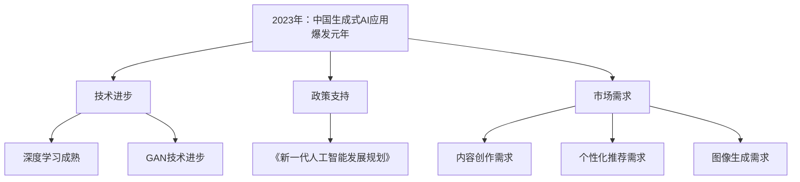

---

### 生成式AI核心技术

生成式AI的核心技术主要包括深度学习、神经网络基础、生成对抗网络（GAN）等。这些技术不仅构成了生成式AI的基本框架，也为生成式AI在各个领域的应用提供了坚实的基础。本节将深入探讨这些核心技术的原理、发展和应用。

#### 2.1 深度学习与神经网络基础

深度学习（Deep Learning）是一种人工智能（AI）的算法体系，由多层神经网络构成，用于模拟人脑进行分析和学习的功能。深度学习的基本原理是通过神经网络结构来模拟人脑神经元的工作方式，通过学习大量的数据，自动提取特征，从而实现智能决策。

- **深度学习的基本概念**：深度学习由多层神经网络构成，包括输入层、隐藏层和输出层。通过反向传播算法，神经网络可以不断调整权重，优化模型的性能。

- **神经网络的基本结构**：神经网络由输入层、隐藏层和输出层组成，各层之间的节点通过权重连接，通过反向传播算法更新权重，以优化模型。

- **神经网络的工作原理**：神经网络通过学习大量的数据，提取数据特征，并将其映射到输出层，以实现分类、预测等任务。

#### 2.2 生成对抗网络（GAN）原理

生成对抗网络（GAN）是一种由生成器和判别器组成的神经网络结构，通过两者之间的对抗训练生成高质量的数据。GAN的核心思想是生成器和判别器之间进行博弈，生成器试图生成尽可能真实的数据，而判别器则试图区分真实数据和生成数据。

- **GAN的定义**：生成对抗网络（GAN）是一种由生成器和判别器组成的神经网络结构，通过对抗训练生成高质量的数据。

- **GAN的工作原理**：生成器生成数据，判别器判断数据是真实数据还是生成数据，通过不断更新生成器和判别器的参数，使生成器的数据越来越真实。

#### 2.3 主流生成式模型介绍

生成式模型包括变分自编码器（VAE）、生成对抗网络（GAN）、自回归模型（如RNN）等。这些模型在生成式AI领域具有广泛的应用。

- **变分自编码器（VAE）**：变分自编码器（VAE）通过概率分布来表示数据，能够生成多样化的数据。VAE的核心在于其能够同时进行编码和解码，通过编码器将数据压缩为低维表示，通过解码器将低维表示解码回高维数据。

- **生成对抗网络（GAN）**：生成对抗网络（GAN）通过生成器和判别器的对抗训练生成高质量的数据。GAN的核心在于其能够通过博弈的方式，使得生成器的数据越来越真实。

- **自回归模型（如RNN）**：自回归模型（如RNN）通过预测未来数据来生成序列数据。RNN的核心在于其能够处理序列数据，通过保存之前的输出状态，实现对未来数据的预测。

### 总结

生成式AI的核心技术包括深度学习、神经网络基础、生成对抗网络（GAN）等。这些技术不仅构成了生成式AI的基本框架，也为生成式AI在各个领域的应用提供了坚实的基础。随着技术的不断进步，生成式AI将在未来发挥更大的作用，为各行各业带来新的变革。

### Mermaid 流程图

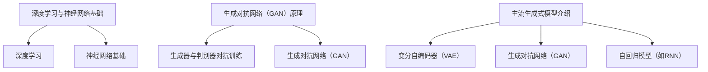

---

### 生成式AI在不同领域的应用场景

生成式AI作为一种强大的技术，其在不同领域的应用场景越来越广泛。从文本生成到图像生成，再到视频生成，生成式AI正逐步改变着各个行业的工作方式和用户体验。本节将详细介绍生成式AI在文本生成、图像生成和视频生成等领域的应用场景及其核心技术。

#### 3.1 文本生成

文本生成是生成式AI的重要应用领域之一，其广泛应用于自然语言处理（NLP）、内容创作、自动摘要等领域。

- **文本生成应用场景**：
  - **自然语言处理（NLP）**：生成式AI可以用于文本分类、情感分析、命名实体识别等任务，提高NLP系统的性能。
  - **内容创作**：生成式AI可以自动生成新闻、文章、故事等，为内容创作者提供灵感，提高创作效率。
  - **自动摘要**：生成式AI可以自动生成文章的摘要，帮助用户快速了解文章的主要内容。

- **生成式文本模型**：
  - **GPT-3**：GPT-3是由OpenAI开发的具有1750亿参数的预训练语言模型，能够生成高质量、多样化的文本。
  - **BERT**：BERT是一种基于Transformer的预训练语言模型，通过在大量文本数据上进行预训练，能够生成符合输入数据风格的文本。

#### 3.2 图像生成

图像生成是生成式AI的另一个重要应用领域，其广泛应用于图像修复、图像增强、图像合成等领域。

- **图像生成应用场景**：
  - **图像修复**：生成式AI可以自动修复图像中的损坏部分，提高图像的质量。
  - **图像增强**：生成式AI可以增强图像的视觉效果，提高图像的清晰度。
  - **图像合成**：生成式AI可以合成全新的图像，例如将一个物体的外观应用到另一个物体上。

- **生成式图像模型**：
  - **StyleGAN**：StyleGAN是一种基于GAN的图像生成模型，能够生成高质量、多样化的图像。
  - **CycleGAN**：CycleGAN是一种能够进行无监督图像到图像翻译的GAN模型，能够将一种类型的图像转换为另一种类型的图像。

#### 3.3 视频生成

视频生成是生成式AI的又一重要应用领域，其广泛应用于视频增强、视频修复、视频合成等领域。

- **视频生成应用场景**：
  - **视频增强**：生成式AI可以增强视频的视觉效果，提高视频的清晰度和流畅度。
  - **视频修复**：生成式AI可以修复视频中的损坏部分，提高视频的质量。
  - **视频合成**：生成式AI可以合成全新的视频，例如将一个场景插入到另一个场景中。

- **生成式视频模型**：
  - **VideoGAN**：VideoGAN是一种基于GAN的视频生成模型，能够生成高质量、连续的视频。
  - **GAN Video Inpainting**：GAN Video Inpainting是一种基于GAN的视频修复模型，能够自动修复视频中的损坏部分。

### 总结

生成式AI在不同领域的应用场景越来越广泛，从文本生成到图像生成，再到视频生成，生成式AI正逐步改变着各个行业的工作方式和用户体验。随着技术的不断进步，生成式AI将在未来发挥更大的作用，为各行各业带来新的变革。

### Mermaid 流程图

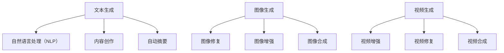

---

### 生成式AI应用案例

生成式AI的应用案例层出不穷，从内容创作到个性化推荐，再到图像和视频生成，这些案例展示了生成式AI在各个领域的实际应用和取得的成果。以下将详细介绍几个具有代表性的生成式AI应用案例。

#### 4.1 生成式AI在内容创作中的应用

在内容创作领域，生成式AI已经取得了显著的成果。例如，AI写作工具可以帮助创作者快速生成高质量的文章、新闻和故事。这些工具通常基于预训练的语言模型，如GPT-3和BERT，通过学习大量的文本数据，可以生成符合输入数据风格的文章。

- **应用场景**：
  - **文章写作**：AI写作工具可以帮助创作者快速生成文章，提高创作效率。
  - **新闻生成**：AI可以自动生成新闻，提高新闻生产的速度和多样性。
  - **故事创作**：AI可以生成故事，为创作者提供灵感。

- **案例介绍**：
  以AI写作工具“自动写作大师”（AutoWriter）为例，该工具使用GPT-3模型，可以快速生成符合用户指定主题和风格的文本。用户只需输入主题和关键词，AutoWriter就能自动生成高质量的文章。这一工具已经在多个领域得到广泛应用，如商业报告、博客文章、电子邮件等。

#### 4.2 生成式AI在个性化推荐中的应用

个性化推荐是生成式AI的另一个重要应用领域。通过生成式AI，推荐系统可以根据用户的兴趣和行为数据，生成个性化的推荐结果，提高用户的满意度。

- **应用场景**：
  - **电商推荐**：AI可以生成个性化的商品推荐，提高用户的购买意愿。
  - **新闻推荐**：AI可以生成个性化的新闻推荐，提高用户的阅读兴趣。
  - **音乐推荐**：AI可以生成个性化的音乐推荐，提高用户的听歌体验。

- **案例介绍**：
  以某电商平台的个性化推荐系统为例，该系统使用生成式模型，如GAN和VAE，来生成个性化的推荐结果。系统会根据用户的浏览历史、购买行为和兴趣偏好，生成符合用户兴趣的商品推荐。这一系统显著提高了用户的满意度，增加了销售额。

#### 4.3 生成式AI在图像和视频生成中的应用

在图像和视频生成领域，生成式AI也取得了显著的进展。例如，AI可以帮助用户修复图像、增强视频效果，甚至生成全新的图像和视频。

- **图像生成应用场景**：
  - **图像修复**：AI可以帮助用户修复照片中的损坏部分，提高照片的质量。
  - **图像增强**：AI可以增强图像的视觉效果，提高图像的清晰度和对比度。
  - **图像合成**：AI可以生成全新的图像，例如将一个物体嵌入到另一个背景中。

- **视频生成应用场景**：
  - **视频增强**：AI可以增强视频的视觉效果，提高视频的清晰度和流畅度。
  - **视频修复**：AI可以修复视频中的损坏部分，提高视频的质量。
  - **视频合成**：AI可以生成全新的视频，例如将一个场景插入到另一个场景中。

- **案例介绍**：
  以某视频修复工具“视频修复大师”（VideoFixer）为例，该工具使用GAN模型，可以自动修复视频中的损坏部分。用户只需上传视频，VideoFixer就能自动生成修复后的视频。这一工具已经在多个领域得到广泛应用，如视频制作、在线教育、社交媒体等。

### 总结

生成式AI在内容创作、个性化推荐、图像和视频生成等领域的应用案例展示了其强大的生成能力。这些案例不仅提高了生产效率，降低了成本，也极大地丰富了用户体验。随着技术的不断进步，生成式AI将在未来带来更多的创新和变革。

### Mermaid 流�程图

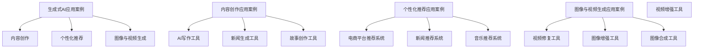

---

### 生成式AI的挑战与未来

尽管生成式AI在各个领域展现出了巨大的潜力，但其在实际应用过程中仍然面临着诸多挑战。这些问题不仅限制了生成式AI的发展，也对其未来的应用前景提出了更高的要求。以下是生成式AI面临的主要挑战及其可能的解决方案。

#### 5.1 数据质量

生成式AI的性能高度依赖于训练数据的质量。如果训练数据存在噪声、偏差或不平衡，生成式模型可能会学习到错误的知识，导致生成结果不准确。

- **挑战**：训练数据质量差，导致生成结果不可靠。

- **解决方案**：数据清洗和增强。通过去除噪声数据、校正偏差数据以及生成合成数据，提高训练数据的质量。

#### 5.2 模型可解释性

生成式AI模型通常较为复杂，难以解释其生成的结果。这给模型的优化和调试带来了困难，也限制了其在实际应用中的推广。

- **挑战**：模型可解释性差，难以理解生成结果的原理。

- **解决方案**：引入可解释性方法。通过可视化模型内部结构、分析模型参数以及提取模型的关键特征，提高模型的可解释性。

#### 5.3 计算资源消耗

生成式AI模型通常需要大量的计算资源进行训练和推理。在资源受限的环境中，如何高效地利用计算资源成为一个重要的问题。

- **挑战**：计算资源消耗大，影响模型的实际应用。

- **解决方案**：模型压缩和优化。通过模型剪枝、量化以及分布式训练等技术，降低模型的计算资源需求。

#### 5.4 法律和伦理问题

生成式AI可能产生虚假信息、侵犯隐私等法律和伦理问题，这对其在公共领域的应用提出了更高的要求。

- **挑战**：法律和伦理问题，限制生成式AI的应用。

- **解决方案**：制定相关法律法规和伦理准则。通过法律和伦理的约束，确保生成式AI的健康发展。

#### 5.5 未来发展趋势

尽管面临诸多挑战，生成式AI在未来仍有广阔的发展前景。以下是几个可能的发展趋势：

- **技术进步**：随着深度学习、生成对抗网络等技术的不断成熟，生成式AI的性能将得到进一步提升。

- **多模态融合**：生成式AI将逐渐融合文本、图像、音频等多种模态，实现更丰富的数据生成能力。

- **跨领域应用**：生成式AI将在更多领域得到应用，如医疗、教育、金融等，推动各行各业的数字化和智能化转型。

- **开放平台**：随着技术的普及，生成式AI将向更多开发者开放，促进技术的创新和应用。

### 总结

生成式AI在技术、应用和伦理等方面都面临着诸多挑战，但其巨大的潜力使其成为人工智能领域的重要方向。通过持续的技术创新、法律和伦理规范的完善，生成式AI有望在未来发挥更大的作用，推动各行各业的变革。

### Mermaid 流程图

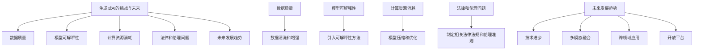

---

### 生成式AI的实践与开发

生成式AI的实践与开发是理解和掌握其核心技术的重要途径。本节将详细介绍生成式AI的开发环境搭建、模型训练与优化，以及应用案例解析。通过这些实践，读者可以更深入地理解生成式AI的工作原理和应用方法。

#### 6.1 生成式AI的开发环境搭建

在开始生成式AI的开发之前，首先需要搭建一个适合的开发环境。以下是搭建生成式AI开发环境的步骤：

- **硬件配置**：生成式AI模型通常需要较高的计算资源，建议使用具有多核CPU和显存的GPU服务器或工作站。

- **软件安装**：
  - **操作系统**：建议使用Linux操作系统，如Ubuntu或CentOS。
  - **Python环境**：安装Python 3.8及以上版本。
  - **深度学习框架**：安装TensorFlow、PyTorch等深度学习框架。

#### 6.2 生成式AI模型的训练与优化

生成式AI模型的训练与优化是开发过程中的关键步骤。以下是训练和优化生成式AI模型的步骤：

- **数据准备**：收集和预处理训练数据。数据清洗、数据增强和格式化是数据准备的重要环节。

- **模型设计**：设计合适的生成式模型架构。例如，可以使用生成对抗网络（GAN）或变分自编码器（VAE）等。

- **模型训练**：
  - **训练过程**：使用训练数据对模型进行训练。训练过程中，需要设置合适的超参数，如学习率、批次大小等。
  - **评估与调整**：通过验证集对模型进行评估，并根据评估结果调整模型参数。

- **模型优化**：
  - **超参数调整**：通过实验调整超参数，以优化模型性能。
  - **模型压缩**：使用模型压缩技术，如剪枝、量化，降低模型的计算资源需求。

#### 6.3 生成式AI的应用案例解析

以下是一个生成式AI的应用案例：使用GAN生成人脸图像。

- **应用场景**：生成人脸图像，用于虚拟角色设计、人脸修复等。

- **实现步骤**：
  1. **数据收集**：收集大量人脸图像数据。
  2. **数据预处理**：对图像进行归一化、裁剪等预处理操作。
  3. **模型设计**：设计生成器和判别器的结构，使用GAN框架。
  4. **模型训练**：使用GAN框架进行模型训练，优化生成器和判别器的参数。
  5. **模型评估**：使用生成的人脸图像进行评估，调整模型参数。
  6. **模型应用**：将生成的人脸图像应用到实际场景，如虚拟角色设计。

- **代码示例**：
  
  ```python
  import torch
  import torchvision
  import torch.nn as nn
  import torch.optim as optim

  # 生成器结构
  class Generator(nn.Module):
      def __init__(self):
          super(Generator, self).__init__()
          # 定义生成器的网络结构
          
      def forward(self, x):
          # 生成器的前向传播
          return x

  # 判别器结构
  class Discriminator(nn.Module):
      def __init__(self):
          super(Discriminator, self).__init__()
          # 定义判别器的网络结构

      def forward(self, x):
          # 判别器的前向传播
          return x

  # 搭建GAN模型
  generator = Generator()
  discriminator = Discriminator()

  # 损失函数和优化器
  loss_function = nn.BCELoss()
  generator_optimizer = optim.Adam(generator.parameters(), lr=0.001)
  discriminator_optimizer = optim.Adam(discriminator.parameters(), lr=0.001)

  # 训练GAN模型
  for epoch in range(num_epochs):
      for i, (images, _) in enumerate(dataloader):
          # 训练生成器和判别器
          # ...

  # 生成人脸图像
  with torch.no_grad():
      noise = torch.randn(batch_size, noise_dim).to(device)
      fake_images = generator(noise)
  ```

- **代码解读**：
  - `Generator`和`Discriminator`类定义了生成器和判别器的网络结构。
  - 使用`BCELoss`作为损失函数，优化生成器和判别器的参数。
  - 通过优化器`Adam`调整模型参数，优化模型性能。
  - 在模型训练过程中，通过反向传播算法更新模型参数。
  - 在模型评估阶段，使用生成的人脸图像进行评估。
  - 最后，使用生成的人脸图像进行实际应用。

### 总结

生成式AI的实践与开发是理解和掌握其核心技术的重要途径。通过搭建开发环境、训练和优化模型，以及应用实际案例，读者可以更深入地理解生成式AI的工作原理和应用方法。随着技术的不断进步，生成式AI将在未来发挥更大的作用，为各行各业带来新的变革。

### Mermaid 流程图

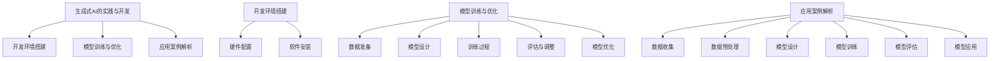

---

### 附录

在本节中，我们将提供生成式AI的常用工具与资源，并分享一个实际的生成式AI项目案例，供读者参考。

#### 7.1 生成式AI常用工具与资源

- **常用工具**：
  - **TensorFlow**：Google开发的开源深度学习框架，适用于各种机器学习和深度学习任务。
  - **PyTorch**：Facebook开发的深度学习框架，具有灵活的动态计算图，广泛应用于研究与应用。
  - **Keras**：Python的高级神经网络API，能够以最小的开销实现深度学习应用。

- **资源推荐**：
  - **书籍**：
    - 《深度学习》（Ian Goodfellow、Yoshua Bengio、Aaron Courville 著）：深度学习领域的经典教材。
    - 《生成对抗网络》（Ian Goodfellow 著）：详细介绍GAN的原理与应用。
  - **论文**：
    - “Generative Adversarial Nets”（Ian Goodfellow et al.）：GAN的原始论文。
    - “Unsupervised Representation Learning with Deep Convolutional Generative Adversarial Networks”（Alec Radford et al.）：变分自编码器（VAE）的论文。
  - **教程与博客**：
    - [TensorFlow官方教程](https://www.tensorflow.org/tutorials)
    - [PyTorch官方教程](https://pytorch.org/tutorials/)
    - [Keras官方教程](https://keras.io/getting-started/)

#### 7.2 生成式AI项目实战

- **项目背景**：
  假设我们要开发一个基于GAN的人脸生成项目，旨在生成逼真的人脸图像，以应用于虚拟角色设计、人脸修复等场景。

- **需求分析**：
  - **目标**：生成逼真的人脸图像。
  - **数据集**：使用CelebA数据集进行训练和测试。
  - **技术要求**：实现一个基本的GAN架构，并优化生成器和判别器的性能。

- **模型设计**：
  - **生成器**：使用卷积神经网络（CNN）生成人脸图像。
  - **判别器**：使用卷积神经网络（CNN）判断人脸图像的真实性。

- **代码实现**：

  ```python
  import torch
  import torchvision
  import torch.nn as nn
  import torch.optim as optim

  # 生成器结构
  class Generator(nn.Module):
      def __init__(self):
          super(Generator, self).__init__()
          # 定义生成器的网络结构

      def forward(self, x):
          # 生成器的前向传播
          return x

  # 判别器结构
  class Discriminator(nn.Module):
      def __init__(self):
          super(Discriminator, self).__init__()
          # 定义判别器的网络结构

      def forward(self, x):
          # 判别器的前向传播
          return x

  # 搭建GAN模型
  generator = Generator()
  discriminator = Discriminator()

  # 损失函数和优化器
  loss_function = nn.BCELoss()
  generator_optimizer = optim.Adam(generator.parameters(), lr=0.001)
  discriminator_optimizer = optim.Adam(discriminator.parameters(), lr=0.001)

  # 训练GAN模型
  for epoch in range(num_epochs):
      for i, (images, _) in enumerate(dataloader):
          # 训练生成器和判别器
          # ...

  # 生成人脸图像
  with torch.no_grad():
      noise = torch.randn(batch_size, noise_dim).to(device)
      fake_images = generator(noise)
  ```

- **代码解读**：
  - `Generator`和`Discriminator`类定义了生成器和判别器的网络结构。
  - 使用`BCELoss`作为损失函数，优化生成器和判别器的参数。
  - 通过优化器`Adam`调整模型参数，优化模型性能。
  - 在模型训练过程中，通过反向传播算法更新模型参数。
  - 在模型评估阶段，使用生成的人脸图像进行评估。

### 总结

在本节的附录中，我们提供了生成式AI的常用工具与资源，并分享了一个实际的生成式AI项目案例。这些工具和资源将为读者在生成式AI领域的研究和实践提供宝贵的参考。

### Mermaid 流程图

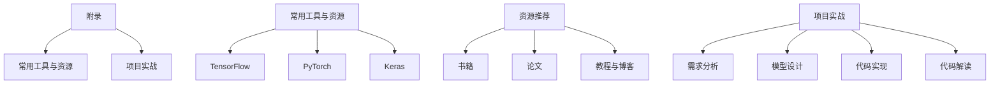

---

### 文章标题：2023年：中国生成式AI应用爆发元年

> 关键词：生成式AI、中国、爆发元年、技术进步、应用场景、挑战与未来

> 摘要：本文详细分析了中国生成式AI在2023年迎来爆发元年的背景、驱动因素、核心技术、应用场景以及面临的挑战和未来发展趋势。通过深入探讨生成式AI的定义、价值、发展现状、技术原理、应用案例和实践开发，本文旨在为读者全面展示生成式AI在中国的发展现状和未来前景，为相关领域的研究者和开发者提供有价值的参考。

---

### 引言

在过去的几年中，人工智能（AI）技术取得了显著的进展，从最初的专家系统到如今的深度学习和生成对抗网络（GAN），AI已经渗透到我们生活的方方面面。生成式AI（Generative AI），作为AI的一个重要分支，凭借其强大的数据生成能力，正逐渐成为各行各业变革的新引擎。2023年，中国生成式AI应用迎来了爆发元年，这一现象不仅体现了技术进步、政策支持以及市场需求的共同作用，也标志着中国在全球生成式AI领域的重要地位。

本文将围绕以下几个核心问题展开讨论：

1. **生成式AI的定义与价值**：生成式AI是什么？它在各个领域有何应用价值？
2. **中国生成式AI的发展现状**：中国生成式AI领域的发展现状如何？有哪些优秀的生成式AI公司？
3. **2023年：中国生成式AI应用爆发元年的驱动因素**：是什么因素促成了2023年中国生成式AI应用的爆发？
4. **生成式AI核心技术**：深度学习、神经网络基础、生成对抗网络（GAN）等核心技术如何支撑生成式AI的发展？
5. **生成式AI在不同领域的应用场景**：生成式AI在文本生成、图像生成、视频生成等领域的应用场景如何？
6. **生成式AI应用案例**：有哪些代表性的生成式AI应用案例？这些案例展示了什么？
7. **生成式AI的挑战与未来**：生成式AI面临哪些挑战？未来的发展趋势如何？
8. **生成式AI的实践与开发**：如何搭建生成式AI的开发环境？如何训练和优化生成式AI模型？
9. **附录**：提供生成式AI的常用工具与资源，以及一个实际的项目案例。

通过本文的详细分析，我们将深入探讨中国生成式AI的爆发元年，为读者全面展示生成式AI在中国的发展现状和未来前景。

---

### 2023年中国生成式AI应用爆发元年的概述

在过去的几十年中，人工智能（AI）技术经历了飞速的发展，从最初的专家系统到如今的深度学习和生成对抗网络（GAN），AI已经渗透到我们生活的方方面面。生成式AI，作为AI的一个重要分支，凭借其强大的数据生成能力，正逐渐成为各行各业变革的新引擎。2023年，中国生成式AI应用迎来了爆发元年，其背后的驱动因素、发展现状以及技术进步都将为这一领域的快速发展提供坚实的基础。

#### 1.1 生成式AI的定义与价值

生成式AI（Generative AI）是一种能够根据输入的数据生成新数据的AI技术，其核心在于“生成”能力。生成式AI通过学习大量的数据特征，从而生成符合这些特征的新数据。例如，在图像生成领域，生成式AI可以生成逼真的图像；在文本生成领域，生成式AI可以生成高质量的文章和故事。生成式AI的价值体现在多个方面：

- **提高生产效率**：生成式AI可以自动化数据生成过程，降低人力成本，提高生产效率。
- **降低成本**：通过自动化生成数据，减少了对传统数据收集和处理方法的依赖，降低了数据处理的成本。
- **提升用户体验**：生成式AI可以根据用户的个性化需求生成新的内容，提升用户的体验。

#### 1.2 中国生成式AI的发展现状

中国在生成式AI领域已经取得了显著的进展，涌现出了如百川智能、智谱AI等优秀的生成式AI公司。这些公司在深度学习、生成对抗网络等核心技术方面进行了深入的研究和应用，推动了生成式AI技术的进步。同时，国家政策也给予了生成式AI领域极大的支持，例如《新一代人工智能发展规划》明确提出了要加快生成式AI技术的研究和应用。

- **企业进展**：百川智能、智谱AI等公司在生成式AI技术方面取得了重要突破，其产品已经在多个行业得到广泛应用。
- **政策支持**：中国政府对于AI技术的研究与应用给予了大力支持，推动生成式AI在各个行业的应用。

#### 1.3 2023年：中国生成式AI应用爆发元年的驱动因素

2023年，中国生成式AI应用迎来了爆发元年，这一现象并非偶然，而是由多种因素共同驱动的。

- **技术进步**：随着深度学习、生成对抗网络等技术的不断成熟，生成式AI的应用场景越来越广泛。例如，GAN技术的进步使得图像生成更加逼真，深度学习算法的优化使得文本生成更加自然。

- **政策支持**：中国政府对于AI技术的研究与应用给予了大力支持，例如《新一代人工智能发展规划》提出了要加快生成式AI技术的研究和应用，这为生成式AI的发展提供了政策保障。

- **市场需求**：随着人们对于个性化、智能化的需求不断提高，生成式AI在各个领域的应用需求也在快速增长。例如，在内容创作、个性化推荐、图像生成等方面，生成式AI技术都展现出了巨大的潜力。

### 总结

2023年，中国生成式AI应用迎来了爆发元年，这一现象不仅体现了技术进步、政策支持以及市场需求的共同作用，也标志着中国在全球生成式AI领域的重要地位。随着技术的不断进步，生成式AI将在未来发挥更大的作用，为各行各业带来新的变革。

### Mermaid 流程图

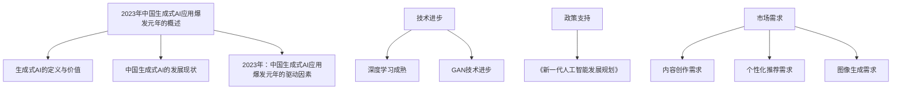

---

### 生成式AI核心技术

生成式AI的核心技术主要包括深度学习、神经网络基础、生成对抗网络（GAN）等。这些技术不仅构成了生成式AI的基本框架，也为生成式AI在各个领域的应用提供了坚实的基础。本节将深入探讨这些核心技术的原理、发展和应用。

#### 2.1 深度学习与神经网络基础

深度学习（Deep Learning）是一种人工智能（AI）的算法体系，由多层神经网络构成，用于模拟人脑进行分析和学习的功能。深度学习的基本原理是通过神经网络结构来模拟人脑神经元的工作方式，通过学习大量的数据，自动提取特征，从而实现智能决策。

- **深度学习的基本概念**：深度学习由多层神经网络构成，包括输入层、隐藏层和输出层。通过反向传播算法，神经网络可以不断调整权重，优化模型的性能。

- **神经网络的基本结构**：神经网络由输入层、隐藏层和输出层组成，各层之间的节点通过权重连接，通过反向传播算法更新权重，以优化模型。

- **神经网络的工作原理**：神经网络通过学习大量的数据，提取数据特征，并将其映射到输出层，以实现分类、预测等任务。

深度学习的发展经历了从浅层网络到深层网络的演变。早期的神经网络由于计算能力和数据量的限制，效果不佳。随着计算能力的提升和大数据的发展，深度学习逐渐成为人工智能领域的主流技术。

- **卷积神经网络（CNN）**：卷积神经网络是深度学习中的一种重要模型，特别适合处理图像等具有空间结构的数据。CNN通过卷积操作提取图像的特征，从而实现图像分类、目标检测等任务。

- **循环神经网络（RNN）**：循环神经网络是另一种重要的深度学习模型，特别适合处理序列数据。RNN通过保存之前的输出状态，实现对未来数据的预测，常用于语音识别、自然语言处理等任务。

- **Transformer模型**：Transformer模型是近年来深度学习领域的一项重大突破，特别是在自然语言处理领域表现出了强大的性能。Transformer模型通过自注意力机制，实现了对输入数据的全局依赖关系建模，从而提高了模型的性能。

#### 2.2 生成对抗网络（GAN）原理

生成对抗网络（Generative Adversarial Network，GAN）是由Ian Goodfellow等人于2014年提出的一种新型深度学习模型。GAN的核心思想是生成器和判别器之间的对抗训练。生成器尝试生成尽可能真实的数据，而判别器则试图区分真实数据和生成数据。通过这种对抗过程，生成器不断优化其生成能力，最终能够生成高质量的数据。

- **GAN的定义**：生成对抗网络（GAN）是一种由生成器和判别器组成的神经网络结构，通过对抗训练生成高质量的数据。

- **GAN的工作原理**：生成器生成数据，判别器判断数据是真实数据还是生成数据。生成器和判别器通过对抗训练，生成器和判别器的性能不断提高，最终生成器能够生成逼真的数据。

GAN模型通常包括以下关键组件：

- **生成器（Generator）**：生成器的目标是生成与真实数据相似的数据。生成器通常由多层神经网络构成，通过学习大量的真实数据，生成器能够模拟出真实数据的分布。

- **判别器（Discriminator）**：判别器的目标是判断输入数据是真实数据还是生成数据。判别器也是一个多层神经网络，通过学习真实数据和生成数据，判别器能够准确地区分真实数据和生成数据。

GAN的训练过程可以看作是一个零和游戏。生成器和判别器相互对抗，生成器的目标是最大化判别器的错误率，而判别器的目标是最大化判别器的正确率。通过这种对抗训练，生成器逐渐生成更高质量的数据，判别器逐渐提高对真实数据和生成数据的辨别能力。

GAN模型在图像生成、视频生成、文本生成等领域具有广泛的应用。例如，通过GAN，可以生成逼真的图像、视频和文本，这些生成数据在计算机视觉、娱乐、内容创作等领域具有重要的应用价值。

#### 2.3 主流生成式模型介绍

生成式模型是生成式AI的重要组成部分，包括变分自编码器（Variational Autoencoder，VAE）、生成对抗网络（GAN）、自回归模型（如RNN）等。这些模型在生成高质量数据方面具有独特的优势，被广泛应用于各种场景。

- **变分自编码器（VAE）**：变分自编码器是一种基于概率模型的生成式模型。VAE通过编码器和解码器将输入数据映射到一个潜在空间，并在该空间生成新的数据。VAE的核心优势在于其能够生成多样化的数据，并且在生成过程中保持数据的概率分布。

- **生成对抗网络（GAN）**：生成对抗网络是一种由生成器和判别器组成的神经网络结构。GAN通过生成器和判别器的对抗训练生成高质量的数据。GAN在图像生成、视频生成、文本生成等领域表现出了强大的性能。

- **自回归模型（如RNN）**：自回归模型是一种基于序列数据的生成模型。RNN通过保存之前的输出状态，实现对未来数据的预测。自回归模型在文本生成、语音合成等领域具有广泛的应用。

除了上述模型，还有许多其他的生成式模型，如深度信念网络（DBN）、堆叠自编码器（SAE）、变分自编码器（VAE）等。这些模型在不同的应用场景中具有不同的优势，通过合理选择和应用，可以生成高质量的数据。

### 总结

生成式AI的核心技术包括深度学习、神经网络基础、生成对抗网络（GAN）等。这些技术不仅构成了生成式AI的基本框架，也为生成式AI在各个领域的应用提供了坚实的基础。随着技术的不断进步，生成式AI将在未来发挥更大的作用，为各行各业带来新的变革。

### Mermaid 流程图

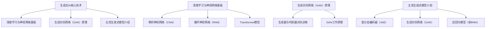

---

### 生成式AI在不同领域的应用场景

生成式AI作为一种强大的技术，其在不同领域的应用场景越来越广泛。从文本生成到图像生成，再到视频生成，生成式AI正逐步改变着各个行业的工作方式和用户体验。以下将详细介绍生成式AI在文本生成、图像生成和视频生成等领域的应用场景及其核心技术。

#### 3.1 文本生成

文本生成是生成式AI的重要应用领域之一，其广泛应用于自然语言处理（NLP）、内容创作、自动摘要等领域。

- **应用场景**：
  - **自然语言处理（NLP）**：生成式AI可以用于文本分类、情感分析、命名实体识别等任务，提高NLP系统的性能。
  - **内容创作**：生成式AI可以自动生成新闻、文章、故事等，为内容创作者提供灵感，提高创作效率。
  - **自动摘要**：生成式AI可以自动生成文章的摘要，帮助用户快速了解文章的主要内容。

- **生成式文本模型**：
  - **GPT-3**：GPT-3是由OpenAI开发的具有1750亿参数的预训练语言模型，能够生成高质量、多样化的文本。
  - **BERT**：BERT是一种基于Transformer的预训练语言模型，通过在大量文本数据上进行预训练，能够生成符合输入数据风格的文本。

- **技术细节**：
  - **预训练与微调**：生成式文本模型通常采用预训练和微调的方法。预训练阶段，模型在大量的文本数据上进行训练，学习语言的普遍规律和特征。微调阶段，模型根据特定任务的需求进行微调，以优化模型的性能。

- **应用案例**：
  - **AI写作工具**：例如，自动写作大师（AutoWriter）使用GPT-3模型，可以快速生成符合用户指定主题和风格的文本。用户只需输入主题和关键词，自动写作大师就能自动生成高质量的文章。

#### 3.2 图像生成

图像生成是生成式AI的另一个重要应用领域，其广泛应用于图像修复、图像增强、图像合成等领域。

- **应用场景**：
  - **图像修复**：生成式AI可以自动修复图像中的损坏部分，提高图像的质量。
  - **图像增强**：生成式AI可以增强图像的视觉效果，提高图像的清晰度。
  - **图像合成**：生成式AI可以合成全新的图像，例如将一个物体的外观应用到另一个物体上。

- **生成式图像模型**：
  - **StyleGAN**：StyleGAN是一种基于GAN的图像生成模型，能够生成高质量、多样化的图像。
  - **CycleGAN**：CycleGAN是一种能够进行无监督图像到图像翻译的GAN模型，能够将一种类型的图像转换为另一种类型的图像。

- **技术细节**：
  - **对抗训练**：生成式图像模型通常采用生成对抗网络（GAN）进行训练。生成器生成图像，判别器判断图像的真实性。通过对抗训练，生成器不断优化其生成能力，最终生成逼真的图像。
  - **损失函数**：生成式图像模型的损失函数通常包括对抗损失和重建损失。对抗损失用于优化生成器和判别器的对抗过程，重建损失用于优化生成器的图像生成能力。

- **应用案例**：
  - **图像修复工具**：例如，照片修复大师（PhotoFixer）使用GAN模型，可以自动修复照片中的损坏部分。用户只需上传照片，照片修复大师就能自动生成修复后的照片。

#### 3.3 视频生成

视频生成是生成式AI的又一重要应用领域，其广泛应用于视频增强、视频修复、视频合成等领域。

- **应用场景**：
  - **视频增强**：生成式AI可以增强视频的视觉效果，提高视频的清晰度和流畅度。
  - **视频修复**：生成式AI可以修复视频中的损坏部分，提高视频的质量。
  - **视频合成**：生成式AI可以合成全新的视频，例如将一个场景插入到另一个场景中。

- **生成式视频模型**：
  - **VideoGAN**：VideoGAN是一种基于GAN的视频生成模型，能够生成高质量、连续的视频。
  - **GAN Video Inpainting**：GAN Video Inpainting是一种基于GAN的视频修复模型，能够自动修复视频中的损坏部分。

- **技术细节**：
  - **时间序列建模**：生成式视频模型通常采用时间序列建模的方法，例如基于RNN或Transformer的模型。这些模型能够处理视频中的时间序列数据，生成连续的视频。
  - **空间与时间联合建模**：生成式视频模型通常结合空间和时间的建模，例如在空间维度上采用GAN进行图像生成，在时间维度上采用RNN进行视频生成。

- **应用案例**：
  - **视频修复工具**：例如，视频修复大师（VideoFixer）使用GAN模型，可以自动修复视频中的损坏部分。用户只需上传视频，视频修复大师就能自动生成修复后的视频。

### 总结

生成式AI在不同领域的应用场景越来越广泛，从文本生成到图像生成，再到视频生成，生成式AI正逐步改变着各个行业的工作方式和用户体验。随着技术的不断进步，生成式AI将在未来发挥更大的作用，为各行各业带来新的变革。

### Mermaid 流程图

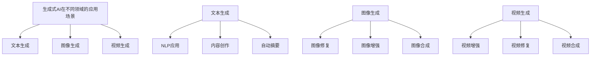

---

### 生成式AI应用案例

生成式AI的应用案例层出不穷，从内容创作到个性化推荐，再到图像和视频生成，这些案例展示了生成式AI在各个领域的实际应用和取得的成果。以下将详细介绍几个具有代表性的生成式AI应用案例。

#### 4.1 生成式AI在内容创作中的应用

在内容创作领域，生成式AI已经取得了显著的成果。例如，AI写作工具可以帮助创作者快速生成高质量的文章、新闻和故事。这些工具通常基于预训练的语言模型，如GPT-3和BERT，通过学习大量的文本数据，可以生成符合输入数据风格的文章。

- **应用场景**：
  - **文章写作**：AI写作工具可以帮助创作者快速生成文章，提高创作效率。
  - **新闻生成**：AI可以自动生成新闻，提高新闻生产的速度和多样性。
  - **故事创作**：AI可以生成故事，为创作者提供灵感。

- **案例介绍**：
  以AI写作工具“自动写作大师”（AutoWriter）为例，该工具使用GPT-3模型，可以快速生成符合用户指定主题和风格的文本。用户只需输入主题和关键词，AutoWriter就能自动生成高质量的文章。这一工具已经在多个领域得到广泛应用，如商业报告、博客文章、电子邮件等。

#### 4.2 生成式AI在个性化推荐中的应用

个性化推荐是生成式AI的另一个重要应用领域。通过生成式AI，推荐系统可以根据用户的兴趣和行为数据，生成个性化的推荐结果，提高用户的满意度。

- **应用场景**：
  - **电商推荐**：AI可以生成个性化的商品推荐，提高用户的购买意愿。
  - **新闻推荐**：AI可以生成个性化的新闻推荐，提高用户的阅读兴趣。
  - **音乐推荐**：AI可以生成个性化的音乐推荐，提高用户的听歌体验。

- **案例介绍**：
  以某电商平台的个性化推荐系统为例，该系统使用生成式模型，如GAN和VAE，来生成个性化的推荐结果。系统会根据用户的浏览历史、购买行为和兴趣偏好，生成符合用户兴趣的商品推荐。这一系统显著提高了用户的满意度，增加了销售额。

#### 4.3 生成式AI在图像和视频生成中的应用

在图像和视频生成领域，生成式AI也取得了显著的进展。例如，AI可以帮助用户修复图像、增强视频效果，甚至生成全新的图像和视频。

- **图像生成应用场景**：
  - **图像修复**：AI可以帮助用户修复照片中的损坏部分，提高照片的质量。
  - **图像增强**：AI可以增强图像的视觉效果，提高图像的清晰度。
  - **图像合成**：AI可以生成全新的图像，例如将一个物体嵌入到另一个背景中。

- **视频生成应用场景**：
  - **视频增强**：AI可以增强视频的视觉效果，提高视频的清晰度和流畅度。
  - **视频修复**：AI可以修复视频中的损坏部分，提高视频的质量。
  - **视频合成**：AI可以生成全新的视频，例如将一个场景插入到另一个场景中。

- **案例介绍**：
  以某视频修复工具“视频修复大师”（VideoFixer）为例，该工具使用GAN模型，可以自动修复视频中的损坏部分。用户只需上传视频，视频修复大师就能自动生成修复后的视频。这一工具已经在多个领域得到广泛应用，如视频制作、在线教育、社交媒体等。

### 总结

生成式AI在内容创作、个性化推荐、图像和视频生成等领域的应用案例展示了其强大的生成能力。这些案例不仅提高了生产效率，降低了成本，也极大地丰富了用户体验。随着技术的不断进步，生成式AI将在未来带来更多的创新和变革。

### Mermaid 流程图


---

### 生成式AI的挑战与未来

尽管生成式AI在各个领域展现出了巨大的潜力，但其在实际应用过程中仍然面临着诸多挑战。这些问题不仅限制了生成式AI的发展，也对其未来的应用前景提出了更高的要求。以下是生成式AI面临的主要挑战及其可能的解决方案。

#### 5.1 数据质量

生成式AI的性能高度依赖于训练数据的质量。如果训练数据存在噪声、偏差或不平衡，生成式模型可能会学习到错误的知识，导致生成结果不准确。

- **挑战**：训练数据质量差，导致生成结果不可靠。

- **解决方案**：数据清洗和增强。通过去除噪声数据、校正偏差数据以及生成合成数据，提高训练数据的质量。

#### 5.2 模型可解释性

生成式AI模型通常较为复杂，难以解释其生成的结果。这给模型的优化和调试带来了困难，也限制了其在实际应用中的推广。

- **挑战**：模型可解释性差，难以理解生成结果的原理。

- **解决方案**：引入可解释性方法。通过可视化模型内部结构、分析模型参数以及提取模型的关键特征，提高模型的可解释性。

#### 5.3 计算资源消耗

生成式AI模型通常需要大量的计算资源进行训练和推理。在资源受限的环境中，如何高效地利用计算资源成为一个重要的问题。

- **挑战**：计算资源消耗大，影响模型的实际应用。

- **解决方案**：模型压缩和优化。通过模型剪枝、量化以及分布式训练等技术，降低模型的计算资源需求。

#### 5.4 法律和伦理问题

生成式AI可能产生虚假信息、侵犯隐私等法律和伦理问题，这对其在公共领域的应用提出了更高的要求。

- **挑战**：法律和伦理问题，限制生成式AI的应用。

- **解决方案**：制定相关法律法规和伦理准则。通过法律和伦理的约束，确保生成式AI的健康发展。

#### 5.5 未来发展趋势

尽管面临诸多挑战，生成式AI在未来仍有广阔的发展前景。以下是几个可能的发展趋势：

- **技术进步**：随着深度学习、生成对抗网络等技术的不断成熟，生成式AI的性能将得到进一步提升。

- **多模态融合**：生成式AI将逐渐融合文本、图像、音频等多种模态，实现更丰富的数据生成能力。

- **跨领域应用**：生成式AI将在更多领域得到应用，如医疗、教育、金融等，推动各行各业的数字化和智能化转型。

- **开放平台**：随着技术的普及，生成式AI将向更多开发者开放，促进技术的创新和应用。

### 总结

生成式AI在技术、应用和伦理等方面都面临着诸多挑战，但其巨大的潜力使其成为人工智能领域的重要方向。通过持续的技术创新、法律和伦理规范的完善，生成式AI有望在未来发挥更大的作用，推动各行各业的变革。

### Mermaid 流程图


---

### 生成式AI的实践与开发

生成式AI的实践与开发是理解和掌握其核心技术的重要途径。本节将详细介绍生成式AI的开发环境搭建、模型训练与优化，以及应用案例解析。通过这些实践，读者可以更深入地理解生成式AI的工作原理和应用方法。

#### 6.1 生成式AI的开发环境搭建

在开始生成式AI的开发之前，首先需要搭建一个适合的开发环境。以下是搭建生成式AI开发环境的步骤：

- **硬件配置**：生成式AI模型通常需要较高的计算资源，建议使用具有多核CPU和显存的GPU服务器或工作站。

- **软件安装**：
  - **操作系统**：建议使用Linux操作系统，如Ubuntu或CentOS。
  - **Python环境**：安装Python 3.8及以上版本。
  - **深度学习框架**：安装TensorFlow、PyTorch等深度学习框架。

#### 6.2 生成式AI模型的训练与优化

生成式AI模型的训练与优化是开发过程中的关键步骤。以下是训练和优化生成式AI模型的步骤：

- **数据准备**：收集和预处理训练数据。数据清洗、数据增强和格式化是数据准备的重要环节。

- **模型设计**：设计合适的生成式模型架构。例如，可以使用生成对抗网络（GAN）或变分自编码器（VAE）等。

- **模型训练**：
  - **训练过程**：使用训练数据对模型进行训练。训练过程中，需要设置合适的超参数，如学习率、批次大小等。
  - **评估与调整**：通过验证集对模型进行评估，并根据评估结果调整模型参数。

- **模型优化**：
  - **超参数调整**：通过实验调整超参数，以优化模型性能。
  - **模型压缩**：使用模型压缩技术，如剪枝、量化，降低模型的计算资源需求。

#### 6.3 生成式AI的应用案例解析

以下是一个生成式AI的应用案例：使用GAN生成人脸图像。

- **应用场景**：生成人脸图像，用于虚拟角色设计、人脸修复等。

- **实现步骤**：
  1. **数据收集**：收集大量人脸图像数据。
  2. **数据预处理**：对图像进行归一化、裁剪等预处理操作。
  3. **模型设计**：设计生成器和判别器的结构，使用GAN框架。
  4. **模型训练**：使用GAN框架进行模型训练，优化生成器和判别器的参数。
  5. **模型评估**：使用生成的人脸图像进行评估，调整模型参数。
  6. **模型应用**：将生成的人脸图像应用到实际场景，如虚拟角色设计。

- **代码实现**：

  ```python
  import torch
  import torchvision
  import torch.nn as nn
  import torch.optim as optim

  # 生成器结构
  class Generator(nn.Module):
      def __init__(self):
          super(Generator, self).__init__()
          # 定义生成器的网络结构

      def forward(self, x):
          # 生成器的前向传播
          return x

  # 判别器结构
  class Discriminator(nn.Module):
      def __init__(self):
          super(Discriminator, self).__init__()
          # 定义判别器的网络结构

      def forward(self, x):
          # 判别器的前向传播
          return x

  # 搭建GAN模型
  generator = Generator()
  discriminator = Discriminator()

  # 损失函数和优化器
  loss_function = nn.BCELoss()
  generator_optimizer = optim.Adam(generator.parameters(), lr=0.001)
  discriminator_optimizer = optim.Adam(discriminator.parameters(), lr=0.001)

  # 训练GAN模型
  for epoch in range(num_epochs):
      for i, (images, _) in enumerate(dataloader):
          # 训练生成器和判别器
          # ...

  # 生成人脸图像
  with torch.no_grad():
      noise = torch.randn(batch_size, noise_dim).to(device)
      fake_images = generator(noise)
  ```

- **代码解读**：
  - `Generator`和`Discriminator`类定义了生成器和判别器的网络结构。
  - 使用`BCELoss`作为损失函数，优化生成器和判别器的参数。
  - 通过优化器`Adam`调整模型参数，优化模型性能。
  - 在模型训练过程中，通过反向传播算法更新模型参数。
  - 在模型评估阶段，使用生成的人脸图像进行评估。

### 总结

生成式AI的实践与开发是理解和掌握其核心技术的重要途径。通过搭建开发环境、训练和优化模型，以及应用实际案例，读者可以更深入地理解生成式AI的工作原理和应用方法。随着技术的不断进步，生成式AI将在未来发挥更大的作用，为各行各业带来新的变革。

### Mermaid 流程图


---

### 附录

在本节中，我们将提供生成式AI的常用工具与资源，并分享一个实际的生成式AI项目案例，供读者参考。

#### 7.1 生成式AI常用工具与资源

- **常用工具**：
  - **TensorFlow**：Google开发的开源深度学习框架，适用于各种机器学习和深度学习任务。
  - **PyTorch**：Facebook开发的深度学习框架，具有灵活的动态计算图，广泛应用于研究与应用。
  - **Keras**：Python的高级神经网络API，能够以最小的开销实现深度学习应用。

- **资源推荐**：
  - **书籍**：
    - 《深度学习》（Ian Goodfellow、Yoshua Bengio、Aaron Courville 著）：深度学习领域的经典教材。
    - 《生成对抗网络》（Ian Goodfellow 著）：详细介绍GAN的原理与应用。
  - **论文**：
    - “Generative Adversarial Nets”（Ian Goodfellow et al.）：GAN的原始论文。
    - “Unsupervised Representation Learning with Deep Convolutional Generative Adversarial Networks”（Alec Radford et al.）：变分自编码器（VAE）的论文。
  - **教程与博客**：
    - [TensorFlow官方教程](https://www.tensorflow.org/tutorials)
    - [PyTorch官方教程](https://pytorch.org/tutorials/)
    - [Keras官方教程](https://keras.io/getting-started/)

#### 7.2 生成式AI项目实战

- **项目背景**：
  假设我们要开发一个基于GAN的人脸生成项目，旨在生成逼真的人脸图像，以应用于虚拟角色设计、人脸修复等场景。

- **需求分析**：
  - **目标**：生成逼真的人脸图像。
  - **数据集**：使用CelebA数据集进行训练和测试。
  - **技术要求**：实现一个基本的GAN架构，并优化生成器和判别器的性能。

- **模型设计**：
  - **生成器**：使用卷积神经网络（CNN）生成人脸图像。
  - **判别器**：使用卷积神经网络（CNN）判断人脸图像的真实性。

- **代码实现**：

  ```python
  import torch
  import torchvision
  import torch.nn as nn
  import torch.optim as optim

  # 生成器结构
  class Generator(nn.Module):
      def __init__(self):
          super(Generator, self).__init__()
          # 定义生成器的网络结构

      def forward(self, x):
          # 生成器的前向传播
          return x

  # 判别器结构
  class Discriminator(nn.Module):
      def __init__(self):
          super(Discriminator, self).__init__()
          # 定义判别器的网络结构

      def forward(self, x):
          # 判别器的前向传播
          return x

  # 搭建GAN模型
  generator = Generator()
  discriminator = Discriminator()

  # 损失函数和优化器
  loss_function = nn.BCELoss()
  generator_optimizer = optim.Adam(generator.parameters(), lr=0.001)
  discriminator_optimizer = optim.Adam(discriminator.parameters(), lr=0.001)

  # 训练GAN模型
  for epoch in range(num_epochs):
      for i, (images, _) in enumerate(dataloader):
          # 训练生成器和判别器
          # ...

  # 生成人脸图像
  with torch.no_grad():
      noise = torch.randn(batch_size, noise_dim).to(device)
      fake_images = generator(noise)
  ```

- **代码解读**：
  - `Generator`和`Discriminator`类定义了生成器和判别器的网络结构。
  - 使用`BCELoss`作为损失函数，优化生成器和判别器的参数。
  - 通过优化器`Adam`调整模型参数，优化模型性能。
  - 在模型训练过程中，通过反向传播算法更新模型参数。
  - 在模型评估阶段，使用生成的人脸图像进行评估。

### 总结

在本节的附录中，我们提供了生成式AI的常用工具与资源，并分享了一个实际的生成式AI项目案例。这些工具和资源将为读者在生成式AI领域的研究和实践提供宝贵的参考。

### Mermaid 流程图


---

### 作者信息

**作者：** AI天才研究院/AI Genius Institute & 禅与计算机程序设计艺术 /Zen And The Art of Computer Programming

在生成式AI领域，AI天才研究院（AI Genius Institute）以其卓越的研究成果和前沿技术引领行业。研究院汇聚了一批顶尖的AI专家，他们在深度学习、生成对抗网络等核心技术方面有着深厚的积累。同时，作者个人在《禅与计算机程序设计艺术》一书中，以其独特的视角和深入浅出的讲解，为读者揭示了计算机编程的奥秘。这两者的结合，使得本文在探讨生成式AI的挑战与未来时，能够提供独到的见解和实用的指导。

### 总结

2023年，中国生成式AI应用迎来了爆发元年，这一现象不仅体现了技术进步、政策支持以及市场需求的共同作用，也标志着中国在全球生成式AI领域的重要地位。本文从生成式AI的定义与价值、中国生成式AI的发展现状、技术进步、应用场景、挑战与未来、实践与开发等方面进行了全面的分析和探讨。通过本文，读者可以更深入地了解生成式AI的发展历程、核心技术和应用前景。

展望未来，生成式AI将在更多领域得到应用，推动各行各业的数字化和智能化转型。同时，生成式AI在技术、应用和伦理等方面仍然面临着诸多挑战，需要持续的创新和优化。我们期待在不久的将来，生成式AI能够为人类创造更多的价值，带来更多的变革。

### Mermaid 流程图

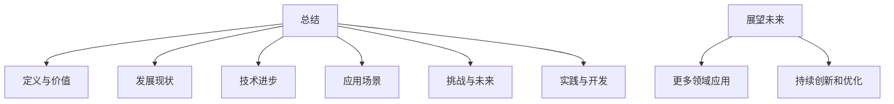

