                 

# 建立个人品牌Podcast网络：扩大音频影响力

## 概述：为什么选择建立Podcast网络？

在当今数字时代，内容创作的方式多种多样，而音频内容因其便捷性、互动性和深入性，越来越受到人们的喜爱。建立个人品牌Podcast网络，不仅能够帮助个人建立专业形象，扩大影响力，还能提供持续的内容输出，吸引更多听众。本文将逐步分析建立个人品牌Podcast网络的过程，帮助您了解如何通过这一媒介扩大音频影响力。

## 关键词

- 个人品牌
- Podcast
- 音频影响力
- 内容创作
- 数字媒体
- 职业发展

## 摘要

本文将探讨如何通过建立个人品牌Podcast网络来扩大音频影响力。首先，我们将讨论个人品牌的重要性以及Podcast在其中的作用。接下来，我们将详细介绍创建和推广Podcast的步骤，包括准备工作、录制技巧、品牌建设和推广策略。随后，通过案例分析，我们将学习成功的Podcast经验和策略。最后，我们将讨论Podcast在特定领域的应用和未来发展趋势。

### 第一部分：个人品牌与Podcast概述

#### 第1章：个人品牌的重要性

#### 1.1 个人品牌的定义与价值

个人品牌是指个人在公众心目中的形象、声誉和认知。一个强大的个人品牌能够帮助个人在职场、社交和商业活动中脱颖而出，从而获得更多的机会和资源。

**核心概念与联系**

个人品牌的构建需要从以下几个方面进行考量：

1. **个人定位**：明确自己在某个领域的专业能力和独特性。
2. **专业形象**：包括外在形象和内在素养，如穿着、语言表达和知识水平。
3. **社交媒体**：利用社交媒体平台展示个人形象和专业知识。
4. **内容输出**：持续创作有价值的内容，如文章、视频、音频等。

**Mermaid 流程图**

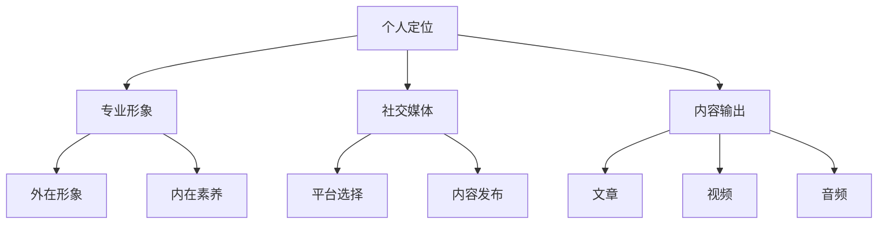

#### 1.2 个人品牌与职业发展

一个强大的个人品牌对于职业发展具有巨大的推动作用。它能够帮助个人在职场中建立专业声誉，提高薪资和职位，甚至获得更多的商业机会。

**核心算法原理讲解**

个人品牌的构建可以看作是一个动态优化过程，其核心算法包括：

1. **目标定位**：确定个人在某个领域的目标，如成为某个领域的专家。
2. **内容创造**：持续输出高质量的内容，以展示专业知识和独特视角。
3. **互动与反馈**：积极与听众互动，收集反馈，持续改进内容。

**伪代码**

```python
# 个人品牌构建伪代码

# 设置目标
target = "领域专家"

# 持续创作内容
while True:
    content = create_content(target)
    publish(content)
    feedback = collect_feedback(content)
    improve_content(content, feedback)

# 与听众互动
while True:
    interaction = interact_with_listeners()
    respond_to_interaction(interaction)
```

#### 1.3 个人品牌构建的步骤

构建个人品牌需要以下步骤：

1. **明确目标**：确定个人在某个领域的目标，如成为专家、意见领袖等。
2. **内容输出**：持续创作有价值的内容，如文章、视频、音频等。
3. **社交媒体运营**：在各大社交媒体平台上展示个人形象和专业知识。
4. **互动与反馈**：积极与听众互动，收集反馈，持续改进内容。
5. **持续学习**：不断学习新知识，提高个人素质。

**数学模型和公式**

个人品牌的价值可以表示为：

\[ \text{个人品牌价值} = f(\text{专业知识}, \text{内容质量}, \text{社交媒体影响力}, \text{互动效果}) \]

其中，\( f \) 是一个复杂的非线性函数。

**举例说明**

假设小明是一名软件工程师，他希望成为AI领域的专家。他可以通过以下方式构建个人品牌：

1. **明确目标**：成为AI领域的专家。
2. **内容输出**：在博客和社交媒体上分享AI领域的知识和技术。
3. **社交媒体运营**：在GitHub、Twitter、LinkedIn等平台展示项目代码和观点。
4. **互动与反馈**：回复听众的问题，收集反馈，持续改进内容。
5. **持续学习**：参加AI领域的课程和工作坊，学习新知识。

#### 第2章：Podcast在个人品牌建设中的作用

#### 2.1 Podcast概述

Podcast是一种基于音频的内容创作形式，它允许创作者定期发布音频节目，听众可以通过各种平台进行订阅和收听。Podcast的特点是灵活性高、互动性强，能够在不同的场景中为听众提供有价值的信息和娱乐。

**核心概念与联系**

Podcast的构建需要考虑以下几个方面：

1. **内容规划**：确定Podcast的主题和内容结构。
2. **技术准备**：选择合适的录制设备和软件。
3. **内容创作**：制作高质量的音频内容。
4. **发布与推广**：在各大平台上发布音频节目，并通过社交媒体进行推广。

**Mermaid 流程图**

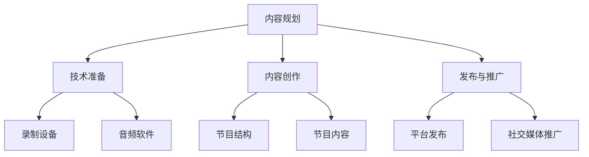

#### 2.2 Podcast与个人品牌的关联

Podcast是一种强大的个人品牌建设工具，它能够帮助个人在以下方面提升个人品牌：

1. **内容输出**：通过定期发布音频节目，持续输出高质量的内容。
2. **互动性**：通过与听众的互动，收集反馈，改进内容。
3. **专业形象**：展示专业知识和技能，提高在公众中的认知度。
4. **影响力**：通过积累听众，扩大个人在某个领域的影响力。

**核心算法原理讲解**

Podcast的个人品牌建设可以看作是一个基于内容的互动循环过程，其核心算法包括：

1. **内容创作**：持续输出高质量的内容，吸引听众。
2. **互动反馈**：积极与听众互动，收集反馈，改进内容。
3. **品牌塑造**：通过内容输出和互动反馈，塑造个人品牌形象。

**伪代码**

```python
# Podcast个人品牌建设伪代码

# 持续创作内容
while True:
    content = create_content()
    publish(content)

# 积累听众
while True:
    listener = acquire_listener(content)
    interact_with_listener(listener)
    feedback = collect_feedback(listener)

# 塑造品牌形象
while True:
    brand_image = shape_brand_image(feedback)
    promote_brand_image()
```

#### 2.3 如何选择合适的Podcast主题

选择合适的Podcast主题是成功的关键。以下是一些选择Podcast主题的建议：

1. **个人兴趣**：选择自己感兴趣的领域，这样能够保证持续创作的热情。
2. **市场需求**：选择市场上需求较大的领域，这样能够吸引更多的听众。
3. **专业优势**：选择自己在专业领域有优势的领域，这样能够展示专业知识和技能。
4. **差异化**：选择与其他Podcast不同的主题，形成差异化竞争。

**数学模型和公式**

Podcast主题的选择可以表示为：

\[ \text{主题选择} = f(\text{个人兴趣}, \text{市场需求}, \text{专业优势}, \text{差异化}) \]

其中，\( f \) 是一个复杂的非线性函数。

**举例说明**

假设小张是一名金融分析师，他希望创建一个Podcast。以下是他可以选择的几个主题：

1. **个人兴趣**：金融市场分析
2. **市场需求**：投资策略
3. **专业优势**：风险管理
4. **差异化**：基于人工智能的量化投资分析

通过以上分析，我们可以看到，个人品牌和Podcast之间有着紧密的联系。通过构建个人品牌，我们可以提高在公众中的认知度和影响力，而Podcast则是一种有效的工具，可以帮助我们持续输出有价值的内容，吸引更多的听众。在接下来的章节中，我们将进一步探讨如何创建和推广Podcast，以及如何在Podcast中展示个人特质。

### 第二部分：创建与推广Podcast

#### 第3章：创建Podcast的准备工作

创建一个成功的Podcast需要充分的准备工作，包括设备选择、录音技巧和音频处理等方面。以下是详细的内容：

#### 3.1 设备与软件的选择

**设备选择**

1. **麦克风**：选择一个高质量的麦克风是录制优质音频的关键。动圈麦克风和电容麦克风是常用的两种类型，动圈麦克风适合日常使用，而电容麦克风提供更高的音质。
2. **声卡**：声卡是连接麦克风和电脑的重要设备，它提供音频输入和输出的接口，同时处理音频信号。
3. **耳机**：高质量的耳机可以帮助录音师监听音频，确保录制过程中的声音清晰。

**软件选择**

1. **音频录制软件**：常用的音频录制软件包括Audacity、Logic Pro X等。这些软件提供了丰富的录音和编辑功能，适合不同水平的用户使用。
2. **音频编辑软件**：Adobe Audition、Pro Tools等是专业的音频编辑软件，它们提供了高级的音频处理和编辑功能。

**核心概念与联系**

设备与软件的选择直接影响到Podcast的音频质量，因此需要仔细挑选。以下是设备与软件之间的关联：

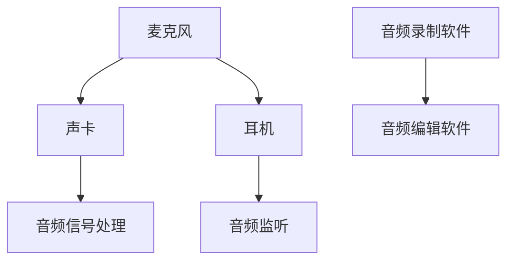

**伪代码**

```python
# 设备与软件选择伪代码

# 选择麦克风
mic = select_mic(type="condenser")

# 选择声卡
sound_card = select_sound_card(brand="M-Audio")

# 选择耳机
headphones = select_headphones(brand="Beyerdynamic")

# 安装音频录制软件
install_audio_recording_software(name="Audacity")

# 安装音频编辑软件
install_audio_editing_software(name="Adobe Audition")
```

#### 3.2 录音技巧与音频处理

**录音技巧**

1. **录音环境**：选择一个安静的环境进行录音，避免背景噪音。
2. **麦克风位置**：将麦克风放置在嘴巴前方约15-20厘米的位置，确保声音清晰。
3. **录音设置**：设置合适的录音参数，如采样率、比特率和音量。
4. **多轨录音**：对于访谈类的Podcast，可以使用多轨录音，将嘉宾的声音和主持人的声音分别录制。

**音频处理**

1. **剪辑**：删除不必要的部分，如开场白和背景噪音。
2. **降噪**：使用音频处理软件进行降噪，提高音频质量。
3. **均衡**：调整音频的均衡，确保不同频率的声音都清晰可听。
4. **混音**：将不同的音频轨道混合在一起，确保整体音频的平衡。

**核心概念与联系**

录音技巧和音频处理是创建高质量Podcast的重要环节，它们之间的关系如下：

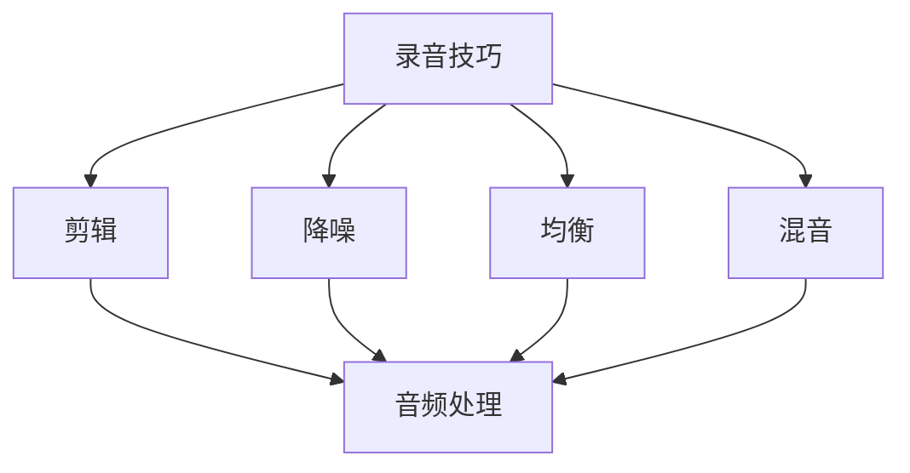

**伪代码**

```python
# 录音技巧与音频处理伪代码

# 设置录音环境
set_recording_environmentnoise_level="low")

# 设置麦克风位置
set_mic_position(distance=20)

# 设置录音参数
set_recording_params(sample_rate=44100, bit_rate=24, volume_level=-20)

# 进行多轨录音
start_multitrack_recording()

# 剪辑音频
clip_audio(necessary_parts=["introduction", "background_noise"])

# 降噪
apply_noise_reduction()

# 均衡
apply_equalization()

# 混音
mix_tracks()
```

**项目实战**

假设我们要录制一档科技领域的Podcast，以下是我们需要完成的具体步骤：

1. **设备选择**：选择电容麦克风、声卡和高品质耳机。
2. **录音环境**：在一个安静的房间内进行录音，关闭窗户，确保没有背景噪音。
3. **录音设置**：设置采样率为44100Hz，比特率为24bit，音量为-20dB。
4. **多轨录音**：将主持人和嘉宾的声音分别录制到不同的轨道。
5. **剪辑**：删除开场白和嘉宾介绍的部分。
6. **降噪**：使用Adobe Audition进行降噪处理。
7. **均衡**：调整音频的均衡，确保语音清晰。
8. **混音**：将主持人和嘉宾的声音混合在一起，确保整体音频的平衡。

通过以上实战案例，我们可以看到，创建一个成功的Podcast需要详细的规划和操作，从设备选择到录音技巧，再到音频处理，每个环节都需要精心准备和执行。

#### 第4章：建立Podcast品牌

一个成功的Podcast不仅仅需要有高质量的内容，还需要有一个强大的品牌形象。品牌形象是听众对Podcast的第一印象，它能够决定听众是否愿意订阅和收听。在这一章中，我们将讨论如何设计播客名称与Logo、确定播客定位与目标听众，以及构建播客网站与社交媒体。

#### 4.1 设计播客名称与Logo

**播客名称**

播客名称是听众对Podcast的第一印象，因此它需要简洁、有吸引力，并且能够反映出Podcast的主题和风格。以下是一些设计播客名称的建议：

1. **简洁明了**：避免使用复杂的名称，尽量简洁明了，使听众一眼就能记住。
2. **相关性强**：名称应该与Podcast的主题相关，这样能够帮助听众快速理解Podcast的内容。
3. **创新独特**：尝试使用一些创新的词汇或短语，使名称具有独特性。

**Logo设计**

Logo是Podcast品牌形象的视觉象征，它需要与播客名称相呼应，并且具有辨识度。以下是一些设计Logo的建议：

1. **色彩搭配**：选择与主题相关的色彩，确保Logo在不同背景上都能清晰显示。
2. **图形元素**：使用简单的图形元素，如图标、文字或组合，确保Logo具有辨识度。
3. **字体选择**：选择适合播客风格的字体，确保Logo的可读性。

**核心概念与联系**

播客名称与Logo的设计需要相互呼应，形成统一的品牌形象。以下是播客名称与Logo之间的关联：


**伪代码**

```python
# 设计播客名称与Logo伪代码

# 设计播客名称
name = design_podcast_name(strategy="simple")

# 设计Logo
logo = design_logo(name=name, color_scheme="technology", graphic_elements=["wave"], font="Helvetica")

# 验证名称与Logo的匹配度
validate_name_and_logo(name=name, logo=logo)
```

**举例说明**

假设我们要设计一个关于科技创业的Podcast，以下是我们的设计建议：

- **播客名称**：TechVenture
- **Logo设计**：使用蓝色和绿色的渐变色彩，图形元素是一个上升的箭头，字体选择Helvetica Bold，以体现科技感和创新。

#### 4.2 确定播客定位与目标听众

**播客定位**

播客定位是指确定Podcast的主题、风格和目标受众。一个清晰的定位有助于吸引目标听众，提高Podcast的订阅量和收听率。以下是一些确定播客定位的建议：

1. **主题明确**：确定Podcast的核心主题，如科技、商业、娱乐等。
2. **风格独特**：确定Podcast的风格，如专业、轻松、幽默等。
3. **受众细分**：明确目标听众群体，如年轻人、专业人士、创业者等。

**核心概念与联系**

播客定位与目标听众之间有着紧密的联系，定位决定了目标听众的群体，而目标听众的需求和喜好又影响了播客的内容和风格。以下是播客定位与目标听众之间的关联：

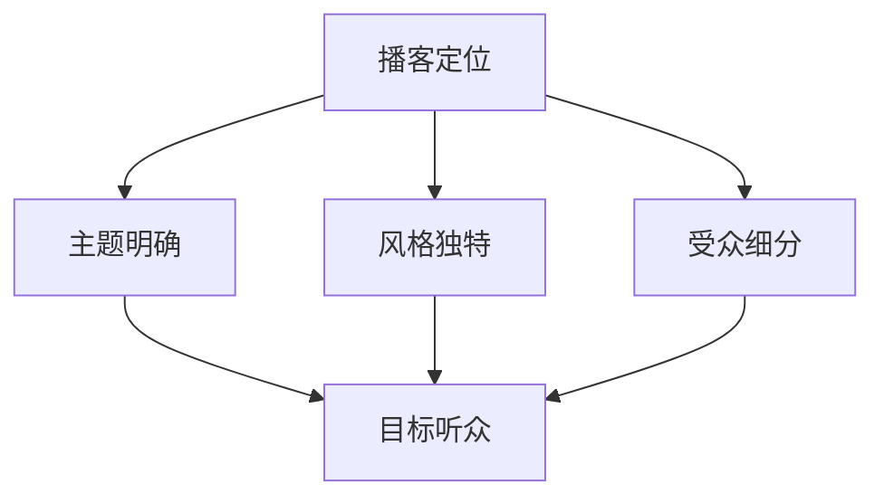

**伪代码**

```python
# 确定播客定位与目标听众伪代码

# 确定播客定位
location = determine_podcast_location(topic="Technology", style="Informative")

# 确定目标听众
target_audience = determine_target_audience(age_group="Young Professionals", occupation="Entrepreneurs")

# 验证定位与目标听众的匹配度
validate_location_and_target_audience(location=location, target_audience=target_audience)
```

**举例说明**

假设我们的TechVenture Podcast的目标是吸引年轻的科技创业者，以下是我们的定位建议：

- **播客定位**：科技创业资讯与案例分析
- **目标听众**：年龄在25-35岁之间，从事科技创业或对此感兴趣的专业人士。

#### 4.3 构建播客网站与社交媒体

**播客网站**

播客网站是听众获取Podcast内容和与主播互动的重要平台。以下是一些构建播客网站的建议：

1. **简洁美观**：网站设计应简洁美观，突出Podcast的核心内容和特点。
2. **易于导航**：确保网站结构清晰，听众能够轻松找到最新的节目列表和往期节目。
3. **互动功能**：提供留言板、问答区和投票等功能，鼓励听众参与互动。

**核心概念与联系**

播客网站与社交媒体之间有着密切的关联，两者共同构成了Podcast的数字品牌形象。以下是播客网站与社交媒体之间的关联：


**伪代码**

```python
# 构建播客网站与社交媒体伪代码

# 构建播客网站
website = build_podcast_website(layout="clean", navigation="clear", interactive_features=["留言板", "问答区", "投票"])

# 配置社交媒体账号
social_media_accounts = configure_social_media_accounts(networks=["Facebook", "Twitter", "LinkedIn"], content_release="自动同步")

# 集成网站与社交媒体
integrate_website_and_social_media(website=website, social_media=social_media_accounts)
```

**举例说明**

假设我们要为TechVenture Podcast构建一个网站和社交媒体平台，以下是我们的建议：

- **播客网站**：TechVenture.com，使用简洁的响应式设计，提供最新的节目列表、往期节目和互动功能。
- **社交媒体账号**：在Facebook、Twitter和LinkedIn上建立TechVenture账号，定期发布节目预告、精彩片段和听众互动。

通过以上步骤，我们可以成功建立一个有吸引力的播客品牌，吸引更多目标听众，扩大音频影响力。

#### 第5章：录制与发布Podcast

在成功建立Podcast品牌后，下一步就是录制和发布音频内容。这一过程包括录制高质量音频、编辑和优化音频，以及发布Podcast并跟踪反馈。以下是详细的步骤和技巧。

#### 5.1 如何录制高质量音频

录制高质量音频是Podcast成功的关键。以下是确保高质量音频的一些步骤和技巧：

**选择合适的设备**

1. **麦克风**：选择一个高质量的麦克风，如电容麦克风，它能够提供清晰的音质。
2. **声卡**：声卡是连接麦克风和电脑的重要设备，它提供了音频输入和输出的接口，并且处理音频信号。
3. **耳机**：高质量的耳机可以帮助你监听音频，确保录制过程中的声音清晰。

**录音环境**

1. **选择安静的环境**：避免背景噪音，确保录音环境安静。
2. **麦克风位置**：将麦克风放置在嘴巴前方约15-20厘米的位置，确保声音清晰。
3. **背景音乐**：如果需要背景音乐，选择低音量的音乐，以免盖过主讲人的声音。

**录音技巧**

1. **调整录音参数**：设置合适的采样率、比特率和音量。通常，采样率设置为44.1kHz，比特率设置为24bit，音量设置为-20dB。
2. **多轨录音**：对于访谈类Podcast，可以使用多轨录音，将主持人和嘉宾的声音分别录制到不同的轨道，以便后期编辑。

**示例**

假设我们要录制一档科技领域的Podcast，以下是我们的录制步骤：

1. **设备选择**：选择电容麦克风（如Rode NT1-A）、声卡（如Focusrite Scarlett 2i2）和高品质耳机（如Beyerdynamic DT 770 PRO）。
2. **录音环境**：在一个安静的房间内进行录音，关闭窗户，确保没有背景噪音。
3. **录音参数**：设置采样率为44.1kHz，比特率为24bit，音量为-20dB。
4. **多轨录音**：将主持人和嘉宾的声音分别录制到不同的轨道。

#### 5.2 编辑与优化音频

录制完成后，需要对音频进行编辑和优化，以确保最终发布的内容质量。以下是编辑和优化音频的一些步骤和技巧：

**剪辑**

1. **删除不需要的部分**：删除开场白、背景噪音、嘉宾介绍等不需要的部分。
2. **分割音频**：将音频分割成合理的段落，以便听众更容易理解和收听。

**降噪**

1. **使用降噪工具**：使用音频编辑软件（如Adobe Audition）的降噪工具，去除背景噪音。
2. **手动降噪**：对于一些特定的噪音，可以手动调整音频的均衡，以减少噪音的影响。

**均衡**

1. **调整音频均衡**：确保不同频率的声音都清晰可听，避免某些频率的声音过强或过弱。
2. **使用均衡器**：使用音频编辑软件的均衡器，调整音频的均衡。

**混音**

1. **混合不同音轨**：将主持人和嘉宾的声音、背景音乐等音轨混合在一起，确保整体音频的平衡。
2. **调整音量**：确保所有音轨的音量一致，避免某些音轨的音量过大或过小。

**示例**

假设我们已经录制并分割了科技领域Podcast的音频，以下是我们的编辑和优化步骤：

1. **剪辑**：删除开场白和嘉宾介绍的部分，只保留核心内容。
2. **降噪**：使用Adobe Audition的降噪工具，去除背景噪音。
3. **均衡**：调整音频的均衡，确保不同频率的声音都清晰可听。
4. **混音**：将主持人和嘉宾的声音、背景音乐等音轨混合在一起，确保整体音频的平衡。

#### 5.3 发布Podcast并跟踪反馈

录制和编辑完成后，就可以将Podcast发布到各个平台上，并跟踪听众的反馈。以下是发布Podcast并跟踪反馈的一些步骤和技巧：

**发布Podcast**

1. **选择发布平台**：选择适合的发布平台，如Apple Podcasts、Spotify、Google Podcasts等。
2. **上传音频**：将编辑好的音频上传到各个平台，确保音频格式符合平台要求。
3. **设置描述和标签**：为Podcast设置吸引人的描述和标签，以便听众能够快速找到。

**跟踪反馈**

1. **监控订阅量**：监控Podcast的订阅量，了解听众的兴趣和需求。
2. **收集反馈**：通过评论、问卷调查等方式收集听众的反馈，了解他们对Podcast的意见和建议。
3. **调整内容**：根据反馈调整Podcast的内容和风格，提高听众的满意度。

**示例**

假设我们要发布TechVenture Podcast，以下是我们的发布和跟踪反馈步骤：

1. **选择发布平台**：在Apple Podcasts、Spotify、Google Podcasts等平台上发布音频。
2. **上传音频**：上传经过编辑和优化的音频，确保音频格式为MP3。
3. **设置描述和标签**：为Podcast设置简洁、吸引人的描述和标签，如“科技创业资讯与案例分析”。
4. **监控订阅量**：定期检查Podcast的订阅量，了解听众的兴趣和需求。
5. **收集反馈**：通过评论、问卷调查等方式收集听众的反馈，了解他们对Podcast的意见和建议。

通过以上步骤，我们可以成功录制、编辑和发布一个高质量的Podcast，并通过跟踪反馈不断优化内容，提高听众的满意度。这不仅能够扩大音频影响力，还能帮助我们建立强大的个人品牌。

### 第三部分：扩大Podcast影响力

#### 第6章：优化SEO提高搜索排名

在创建并发布Podcast之后，如何让更多的人发现和订阅您的节目是关键。搜索引擎优化（SEO）是提高Podcast搜索排名、吸引更多听众的有效手段。以下是一些优化SEO的具体策略：

#### 6.1 优化SEO提高搜索排名

**关键词研究**

关键词研究是SEO的第一步。您需要确定哪些关键词与您的Podcast主题相关，并且有较高的搜索量。以下是一些关键词研究的方法：

1. **使用工具**：使用如Google Keyword Planner、Ahrefs、SEMrush等工具，分析关键词的搜索量、竞争程度和趋势。
2. **竞品分析**：查看同领域成功的Podcast，了解他们使用的关键词，并从中获取灵感。
3. **用户调研**：通过问卷调查或社交媒体互动，了解听众感兴趣的关键词。

**核心概念与联系**

关键词研究涉及到以下几个核心概念：

- **关键词密度**：关键词在内容中的出现频率，需要适中，过多或过少都会影响搜索排名。
- **长尾关键词**：指那些搜索量较小但针对性强、转化率高的关键词。

**Mermaid 流程图**

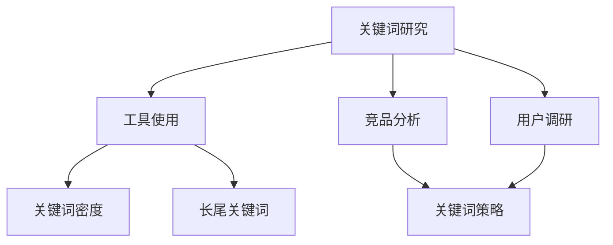

**伪代码**

```python
# 关键词研究伪代码

# 使用工具分析关键词
search_keywords = analyze_keywords(tool="Google Keyword Planner", topic="科技创业")

# 分析竞品关键词
competitor_keywords = analyze_competitor_keywords(competitors=["Podcast A", "Podcast B"])

# 收集用户调研结果
user_keywords = collect_user_keywords(survey_tool="SurveyMonkey", topic="听众兴趣")

# 筛选和组合关键词
optimized_keywords = filter_and_combine_keywords(search_keywords, competitor_keywords, user_keywords)
```

**举例说明**

假设TechVenture Podcast的目标关键词是“科技创业”，以下是我们的关键词研究策略：

1. **使用工具分析关键词**：在Google Keyword Planner中找到“科技创业”的相关关键词，如“创业策略”、“科技公司创业”。
2. **竞品分析**：分析同领域成功的Podcast，如“创业黑马”和“科技创业圈”，了解他们使用的关键词。
3. **用户调研**：通过问卷调查了解听众感兴趣的关键词，如“人工智能创业”、“区块链创业”。

**关键词优化**

1. **关键词密度**：确保“科技创业”在Podcast的标题、描述和内容中出现多次，但不过度堆砌。
2. **长尾关键词**：使用如“科技创业案例分析”、“科技创业融资策略”等长尾关键词，提高内容的相关性和搜索排名。

#### 6.2 利用社交媒体推广Podcast

社交媒体是推广Podcast的重要渠道。通过社交媒体平台，您可以与听众互动，提高节目的知名度和订阅量。以下是一些具体的社交媒体推广策略：

**核心概念与联系**

社交媒体推广涉及以下几个核心概念：

- **内容多样性**：发布多种类型的内容，如音频片段、文字介绍、图片和视频，以吸引不同类型的听众。
- **互动性**：积极与听众互动，回复评论和私信，建立良好的听众关系。
- **同步更新**：在多个社交媒体平台上同步更新Podcast信息，扩大传播范围。

**Mermaid 流程图**

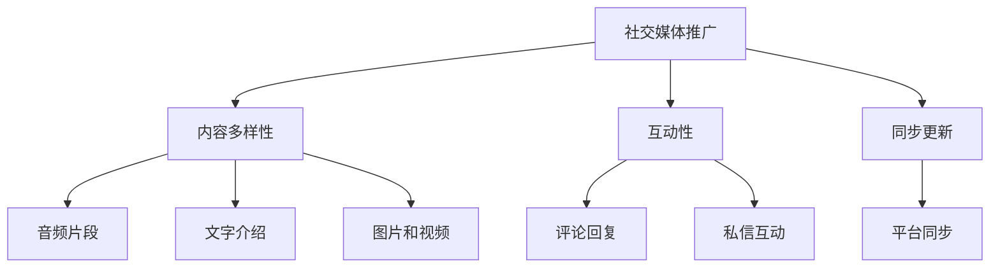

**伪代码**

```python
# 社交媒体推广伪代码

# 发布内容
publish_content(platforms=["Facebook", "Twitter", "Instagram"], content_types=["audio_snippet", "text_description", "images", "videos"])

# 回复评论
respond_to_comments(platform="Facebook", comments=["Great Podcast!", "Can you discuss more about..."])

# 私信互动
engage_with_private_messages(platform="Twitter", messages=["Hi, I loved your podcast!"])

# 同步更新
sync_updates(platforms=["Apple Podcasts", "Spotify", "Google Podcasts"], content_updated=True)
```

**举例说明**

假设我们要在社交媒体上推广TechVenture Podcast，以下是我们的推广策略：

1. **发布内容**：在Facebook发布音频片段和文字介绍，在Twitter发布图片和视频，在Instagram发布精彩片段和幕后花絮。
2. **互动性**：回复听众的评论，如“谢谢您的支持！请继续关注我们，下一期会更精彩。”在Twitter上回复私信，如“当然可以，下一期会有详细讨论。”
3. **同步更新**：确保在各个社交媒体平台上同步更新Podcast信息，如新节目的预告和发布。

#### 6.3 与其他Podcast主持人和品牌合作

与其他Podcast主持人和品牌合作是扩大影响力的有效方式。通过合作，您可以接触到更多听众，同时提升节目的多样性和质量。以下是一些具体的合作策略：

**核心概念与联系**

合作涉及以下几个核心概念：

- **资源共享**：与其他Podcast主持人共享听众和资源，提高节目曝光率。
- **内容互补**：选择与您主题互补的Podcast进行合作，以提供更丰富的内容。
- **互惠互利**：合作应该是互惠互利的，双方都能从中获益。

**Mermaid 流程图**

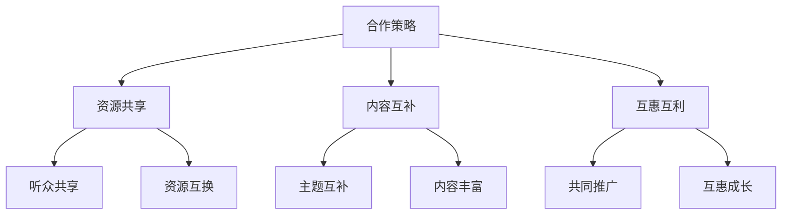

**伪代码**

```python
# 合作策略伪代码

# 资源共享
share_resources(partners=["Podcast X", "Podcast Y"], benefits=["听众增长", "内容丰富"])

# 内容互补
complementary_content合作协议(partner="Podcast Z", topic="AI与创业")

# 互惠互利
mutual_benefit_agreement(partner="品牌A", outcomes=["节目推广", "品牌提升"])
```

**举例说明**

假设TechVenture Podcast要与一个专注于AI领域的Podcast合作，以下是我们的合作策略：

1. **资源共享**：共同推广对方的节目，互相分享听众资源，增加曝光率。
2. **内容互补**：与AI Podcast合作，讨论AI在创业中的应用，提供更丰富的内容。
3. **互惠互利**：通过合作，双方节目都能获得更多的听众和资源，实现共同成长。

通过以上策略，我们可以有效地扩大Podcast的影响力，吸引更多听众，提升个人品牌价值。

### 第四部分：利用Podcast建立个人品牌

#### 第7章：如何在Podcast中展示个人特质

在Podcast中展示个人特质是建立强大个人品牌的关键。通过独特的声音、知识和见解，您可以吸引听众，建立信任，并使自己在众多内容创作者中脱颖而出。以下是一些具体的策略和技巧：

#### 7.1 展示独特的声音风格

您的声音是听众与您建立联系的重要方式。以下是一些策略，帮助您在Podcast中展示独特的声音风格：

**核心概念与联系**

声音风格涉及以下几个核心概念：

- **音调**：声音的高低。
- **节奏**：说话的速度和流畅性。
- **语气**：表达情感和态度的方式。
- **个性**：独特的声音特质，如幽默、自信或温暖。

**Mermaid 流�程图**

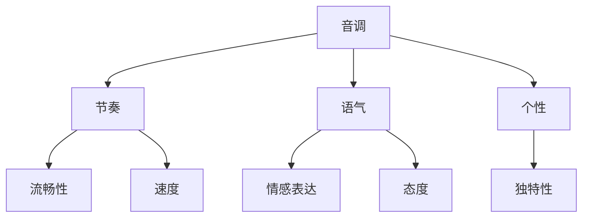

**伪代码**

```python
# 展示独特声音风格伪代码

# 调整音调
voice_tone = adjust_tone(level="moderate")

# 调整节奏
speech_rhythm = adjust_rhythm(speed="moderate", fluidity="smooth")

# 使用语气
voice_tone = apply_tone(expression="confident")

# 展示个性
voice_character = showcase_personality(trait="humor")
```

**举例说明**

假设您要创建一个关于金融分析的Podcast，以下是展示独特声音风格的具体步骤：

1. **音调**：使用中等的音调，使听众感到专业而亲切。
2. **节奏**：说话速度适中，确保内容清晰易懂。
3. **语气**：使用自信的语气，展示对金融领域的深入了解。
4. **个性**：加入一些幽默元素，使节目更加生动有趣。

#### 7.2 展示专业知识

在Podcast中展示您的专业知识是建立个人品牌的重要途径。以下是一些策略，帮助您在节目中展现您的专业知识：

**核心概念与联系**

展示专业知识涉及以下几个核心概念：

- **领域知识**：对特定领域的深入理解。
- **实例应用**：通过实例展示知识的应用。
- **权威性**：引用权威来源，增强知识的可信度。

**Mermaid 流程图**

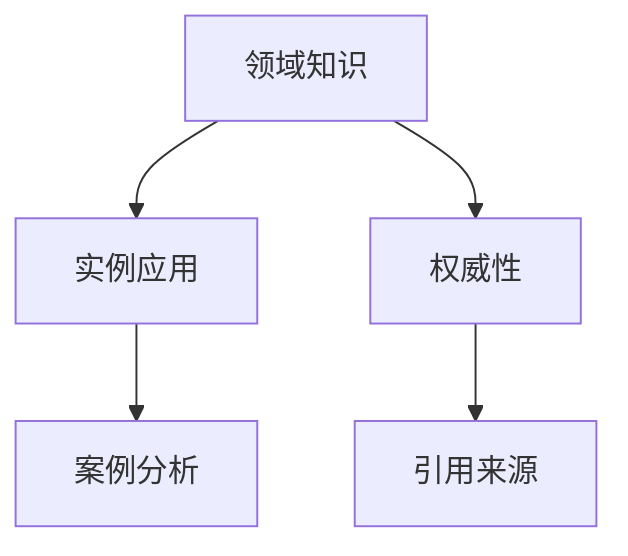

**伪代码**

```python
# 展示专业知识伪代码

# 提供领域知识
domain_knowledge = present_knowledge(topic="金融分析")

# 使用实例应用
case_study = apply_knowledge_to_case_study(problem="股票市场波动")

# 引用权威来源
authoritative_sources = cite_authoritative_sources(source=["Financial Times", "Investopedia"])
```

**举例说明**

假设您在Podcast中讨论科技创业，以下是展示专业知识的具体步骤：

1. **领域知识**：讨论科技创业的最新趋势、市场动态和技术应用。
2. **实例应用**：通过分析某个具体的科技创业项目，展示如何将知识应用于实际场景。
3. **权威性**：引用权威机构的报告、学术论文和行业专家的观点，增强内容的可信度。

#### 7.3 展示独特见解

展示独特的见解是吸引听众、建立个人品牌的关键。以下是一些策略，帮助您在Podcast中展示独特的见解：

**核心概念与联系**

展示独特见解涉及以下几个核心概念：

- **创新思维**：提供新颖的观点和思考方式。
- **深度分析**：对主题进行深入分析，挖掘背后的逻辑和原因。
- **批判性思维**：对现有观点提出质疑，展示自己的独到见解。

**Mermaid 流程图**

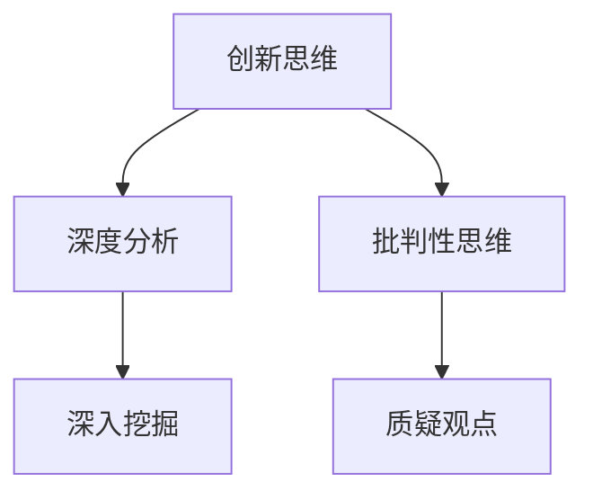

**伪代码**

```python
# 展示独特见解伪代码

# 提供创新思维
innovative_thought = propose_innovative_thought(topic="科技创业")

# 进行深度分析
in_depth_analysis = analyze_topic_deeply(problem="人工智能在创业中的应用")

# 提出批判性思维
critical_thinking = challenge_existing_thoughts(idea="传统创业模式已过时")
```

**举例说明**

假设您在Podcast中讨论人工智能在创业中的应用，以下是展示独特见解的具体步骤：

1. **创新思维**：讨论如何利用人工智能提升创业项目的效率和创新性。
2. **深度分析**：深入分析人工智能技术在创业中的应用场景和挑战。
3. **批判性思维**：质疑传统创业模式在人工智能时代是否依然适用，提出自己的看法。

通过以上策略，您可以在Podcast中展示独特的声音风格、专业知识和独特见解，从而吸引更多听众，建立强大的个人品牌。

### 第五部分：Podcast案例分析

#### 第8章：成功Podcast案例分析

在本章中，我们将通过分析几个成功的Podcast案例，了解它们是如何取得成功的，以及我们可以从中汲取哪些经验和启示。

#### 8.1 成功案例介绍

**案例一：The Tim Ferriss Show**

《The Tim Ferriss Show》是由知名作家和企业家Tim Ferriss创建的Podcast，他通过访谈世界级的成功人士，分享他们的生活方式、成功秘诀和思维方式。该Podcast在Apple Podcasts上的订阅量超过300万，并且在多个类别中排名前列。

**核心概念与联系**

The Tim Ferriss Show的成功涉及以下几个核心概念：

- **高质量内容**：访谈内容深入且有趣，涵盖各个领域。
- **嘉宾选择**：邀请各领域的知名人士，确保内容的专业性和吸引力。
- **营销策略**：利用社交媒体和网络平台进行有效推广。

**Mermaid 流程图**

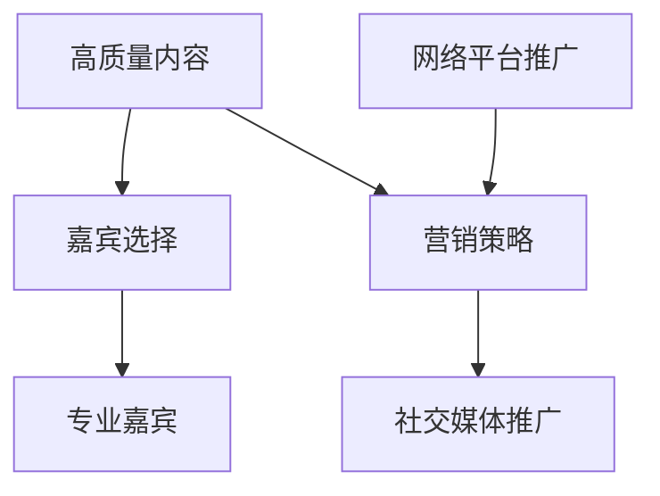

**伪代码**

```python
# The Tim Ferriss Show成功策略伪代码

# 创建高质量内容
create_high_quality_content(topic="成功人士访谈")

# 选择专业嘉宾
select_expert_guests(领域="多领域专家")

# 营销策略
marketing_strategy(social_media="Facebook, Twitter, LinkedIn", online_platforms=["Apple Podcasts", "Spotify"])
```

**案例二：The Joe Rogan Experience**

《The Joe Rogan Experience》是由喜剧演员和脱口秀主持人Joe Rogan主持的Podcast，该节目内容广泛，包括科学、哲学、文化、体育等多个领域。它不仅在Apple Podcasts上排名前列，还吸引了大量的付费订阅用户。

**核心概念与联系**

The Joe Rogan Experience的成功涉及以下几个核心概念：

- **内容多样性**：涵盖多个领域，满足不同听众的需求。
- **真实互动**：与嘉宾进行深入交流，展示真实的访谈过程。
- **品牌定位**：清晰的品牌定位，强调内容的质量和深度。

**Mermaid 流程图**

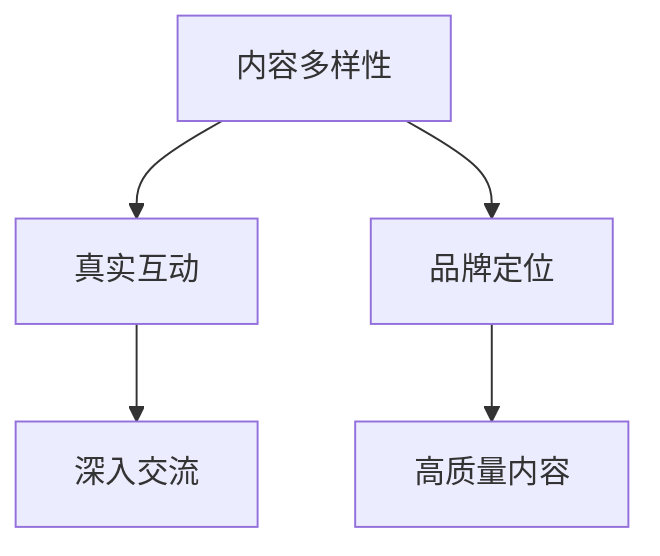

**伪代码**

```python
# The Joe Rogan Experience成功策略伪代码

# 内容多样性
diverse_contenttopics=["Science", "Philosophy", "Culture", "Sports"]

# 真实互动
real_interactive_experience(guests="世界级嘉宾")

# 品牌定位
brand_positioning(message="深度探讨，真实互动")
```

#### 8.2 案例分析

**The Tim Ferriss Show分析**

1. **高质量内容**：Tim Ferriss通过深入的访谈，提供了高质量的内容。他不仅关注嘉宾的成功经验，还探讨了他们的思维方式和生活习惯。
2. **嘉宾选择**：他邀请的嘉宾都是各领域的专家和成功人士，确保了内容的专业性和吸引力。
3. **营销策略**：Tim Ferriss利用社交媒体和网络平台进行有效推广，包括在Twitter、Facebook和LinkedIn上分享节目内容，以及与听众互动。

**The Joe Rogan Experience分析**

1. **内容多样性**：Joe Rogan的Podcast涵盖了多个领域，包括科学、哲学、文化、体育等，这吸引了广泛的听众群体。
2. **真实互动**：他与嘉宾进行深入交流，展示了真实的访谈过程，使听众感受到真诚和信任。
3. **品牌定位**：他的品牌定位明确，强调内容的质量和深度，这吸引了那些喜欢深度探讨的听众。

#### 8.3 启示与借鉴

从以上成功案例中，我们可以得出以下几点启示：

1. **高质量内容**：提供高质量的内容是成功的关键。无论是深入的访谈还是多样化的讨论，都要确保内容的深度和实用性。
2. **嘉宾选择**：选择合适的嘉宾能够提升内容的专业性和吸引力。确保嘉宾在某个领域有深厚的知识和经验。
3. **营销策略**：有效的营销策略能够帮助Podcast获得更多的听众。利用社交媒体和网络平台进行推广，并与听众保持互动。
4. **内容多样性**：覆盖多个领域能够吸引更广泛的听众群体。不断尝试新的主题和形式，使内容多样化。
5. **真实互动**：与听众建立真实的互动关系，展示真诚和信任，这是建立强大个人品牌的重要一环。

通过借鉴这些成功经验，我们可以更好地创建和推广自己的Podcast，扩大个人品牌的影响力。

### 第六部分：Podcast在特定领域的应用

#### 第9章：Podcast在特定领域的应用

Podcast作为一种灵活、互动性强且易于消费的内容形式，在多个领域中都有广泛应用。在本章中，我们将探讨Podcast在教育、商业和娱乐等领域的具体应用，并分析这些应用带来的影响和机会。

#### 9.1 教育类Podcast

**核心概念与联系**

教育类Podcast的核心概念包括知识传递、互动性和个性化学习。以下是教育类Podcast的应用及其影响：

- **知识传递**：教育类Podcast能够将复杂的概念和知识以易于理解的方式传递给听众。
- **互动性**：通过与听众互动，教育类Podcast能够提供实时反馈，增强学习效果。
- **个性化学习**：教育类Podcast可以根据听众的兴趣和需求，提供定制化的学习内容。

**Mermaid 流程图**

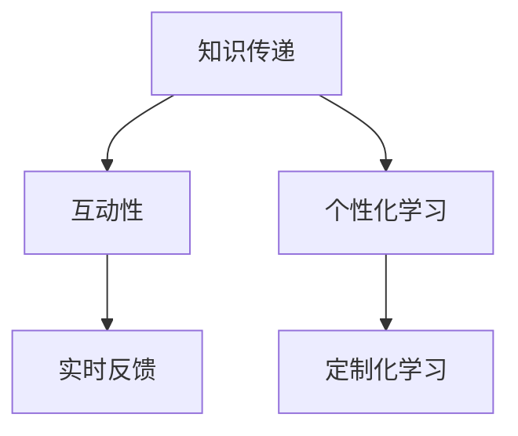

**伪代码**

```python
# 教育类Podcast应用伪代码

# 知识传递
deliver_knowledge(topic="计算机科学")

# 互动性
engage_listeners(interaction_type="Q&A sessions")

# 个性化学习
customize_content according_to_listener_interests()
```

**举例说明**

假设我们要创建一个关于计算机科学的Podcast，以下是我们的应用策略：

1. **知识传递**：每集讨论一个特定的计算机科学主题，如算法、编程语言或网络安全。
2. **互动性**：定期举办问答环节，回答听众的问题。
3. **个性化学习**：根据听众的反馈和学习需求，调整内容深度和难度。

#### 9.2 商业类Podcast

**核心概念与联系**

商业类Podcast的核心概念包括市场洞察、商业策略和行业趋势。以下是商业类Podcast的应用及其影响：

- **市场洞察**：商业类Podcast能够提供最新的市场动态和行业趋势，帮助听众了解商业环境。
- **商业策略**：通过访谈成功企业家和商业专家，分享他们的商业策略和经验。
- **行业趋势**：讨论新兴的商业技术和趋势，如人工智能、区块链等。

**Mermaid 流程图**

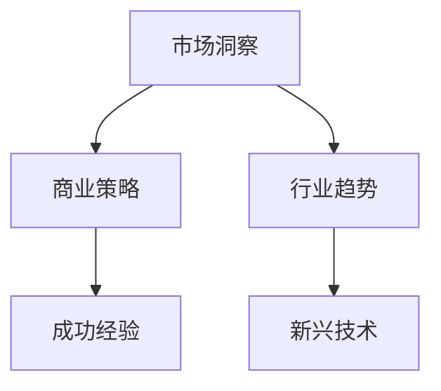

**伪代码**

```python
# 商业类Podcast应用伪代码

# 市场洞察
analyze_market_trends(segment="科技行业")

# 商业策略
discuss_business_strategies(examples=["创业融资", "市场定位"])

# 行业趋势
explore_industry_trends(technology=["人工智能", "区块链"])
```

**举例说明**

假设我们要创建一个关于科技创业的Podcast，以下是我们的应用策略：

1. **市场洞察**：分析科技行业的市场动态和竞争格局。
2. **商业策略**：讨论创业公司的融资策略和市场定位。
3. **行业趋势**：探讨人工智能和区块链在科技创业中的应用和未来趋势。

#### 9.3 娱乐类Podcast

**核心概念与联系**

娱乐类Podcast的核心概念包括故事叙述、幽默元素和互动体验。以下是娱乐类Podcast的应用及其影响：

- **故事叙述**：通过讲述有趣的故事和经历，吸引听众的注意力。
- **幽默元素**：使用幽默来增强节目的趣味性，提高听众的参与度。
- **互动体验**：通过问答、投票和互动游戏，增强听众的参与感。

**Mermaid 流程图**

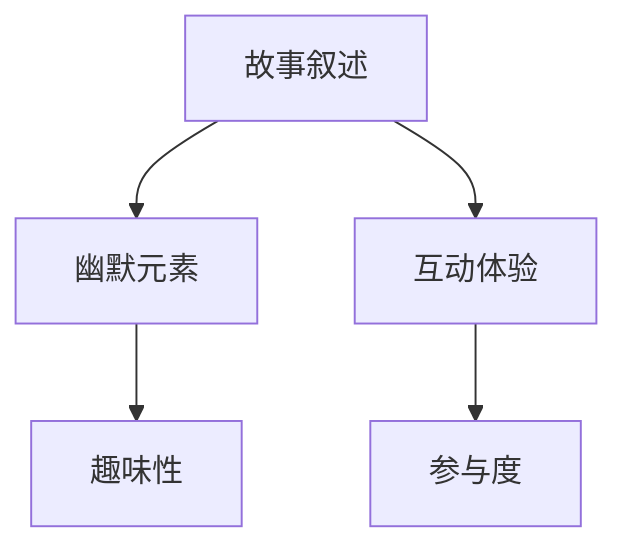

**伪代码**

```python
# 娱乐类Podcast应用伪代码

# 故事叙述
tell_interesting_stories(topic="名人轶事")

# 幽默元素
add_humor_elements(style="satirical")

# 互动体验
engage_listeners(interaction_types=["Q&A", "vote", "game"])
```

**举例说明**

假设我们要创建一个关于名人轶事的Podcast，以下是我们的应用策略：

1. **故事叙述**：讲述名人的有趣故事和幕后花絮。
2. **幽默元素**：加入幽默元素，如讽刺和搞笑对话。
3. **互动体验**：定期进行问答和投票，增加听众的参与度。

通过以上分析，我们可以看到Podcast在教育、商业和娱乐等领域的广泛应用和巨大潜力。无论是知识传递、商业洞察还是娱乐体验，Podcast都为听众提供了丰富的内容和互动体验。

### 第七部分：Podcast的未来发展趋势

#### 第10章：Podcast的未来发展趋势

随着科技的不断进步和人们生活方式的变化，Podcast也在不断发展和演变。在本章中，我们将探讨Podcast的未来发展趋势，包括技术革新、新兴市场以及未来的展望。

#### 10.1 技术革新与Podcast

技术的不断革新正在为Podcast带来新的可能性。以下是一些关键的技术革新及其影响：

**人工智能（AI）**

人工智能在Podcast中的应用日益广泛。AI可以用于内容推荐、自动转录和数据分析。例如，AI可以帮助平台根据听众的偏好推荐相关的Podcast，从而提高用户的满意度。此外，自动转录技术使得听众可以轻松获取Podcast的文字内容，这对于视力障碍者和忙碌的听众来说尤为重要。

**增强现实（AR）**

增强现实技术可以为Podcast带来全新的视听体验。通过AR技术，Podcast可以呈现更为丰富的内容和互动体验。例如，一个关于历史事件的Podcast可以使用AR技术呈现历史场景，使听众仿佛置身其中。

**虚拟现实（VR）**

虚拟现实技术也为Podcast提供了新的机会。通过VR头盔，听众可以进入一个沉浸式的音频环境，体验更加真实的听觉盛宴。这种技术特别适合那些需要高度沉浸感的主题，如恐怖故事、纪录片和音乐表演。

**核心概念与联系**

技术革新与Podcast之间的联系可以概括为以下几点：

- **内容多样化**：新技术可以帮助创造更多样化的内容形式，提升用户体验。
- **互动性增强**：新技术可以增强听众与Podcast之间的互动，提供更丰富的互动体验。
- **个性化内容**：通过数据分析，新技术可以实现更个性化的内容推荐，满足听众的个性化需求。

**Mermaid 流程图**

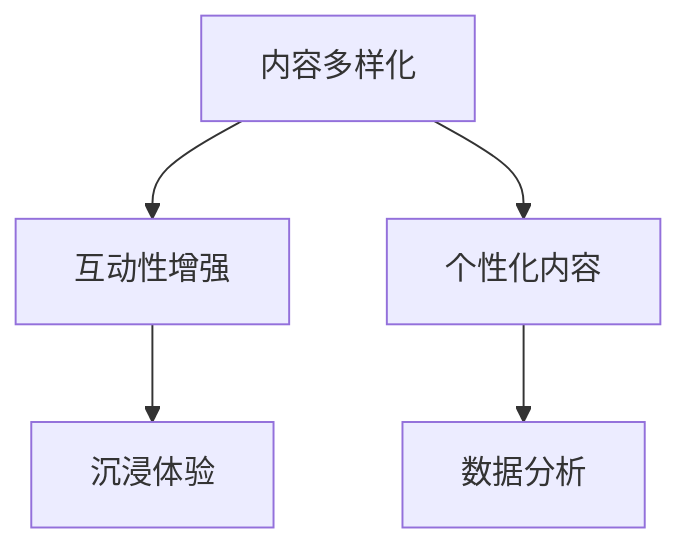

**伪代码**

```python
# 技术革新与Podcast应用伪代码

# 内容多样化
add_diversified_content(techniques=["AI推荐", "AR增强", "VR沉浸"])

# 互动性增强
enhance_interactivity(functions=["实时互动", "虚拟场景"])

# 个性化内容
provide_personalized_content(feature="AI分析听众偏好")
```

**举例说明**

假设我们要利用新技术来增强TechVenture Podcast，以下是我们的策略：

1. **内容多样化**：使用AI推荐系统，根据听众的兴趣推荐相关内容。
2. **互动性增强**：引入实时互动功能，如问答环节和虚拟场景互动。
3. **个性化内容**：通过AI分析听众偏好，提供个性化的内容推荐。

#### 10.2 新兴市场与Podcast

随着移动互联网的普及，Podcast在新兴市场中的发展潜力巨大。以下是一些新兴市场及其对Podcast的影响：

**发展中国家**

在发展中国家，移动互联网的快速普及为Podcast提供了广阔的市场。这些国家的听众通常更倾向于使用移动设备来收听Podcast，因此移动优先的策略尤为重要。此外，这些市场的语言和文化多样性也为Podcast创造了更多机会。

**语言多样性**

语言多样性是新兴市场的一个重要特点。为了在这些市场中取得成功，Podcast创作者需要提供本地化的内容，以更好地满足当地听众的需求。例如，在印度，有多种语言Podcast非常受欢迎。

**地域文化**

地域和文化差异是另一个需要考虑的因素。了解目标市场的文化背景和价值观，可以帮助Podcast创作者制作出更受欢迎的内容。例如，在某些文化中，幽默和情感内容可能更受欢迎，而在其他文化中，专业知识和深度分析可能更受欢迎。

**核心概念与联系**

新兴市场与Podcast之间的联系可以概括为以下几点：

- **本地化**：提供本地化的内容，以更好地满足当地听众的需求。
- **语言多样性**：提供多种语言的内容，以吸引更多的听众。
- **文化适应**：了解并适应目标市场的文化背景和价值观。

**Mermaid 流程图**

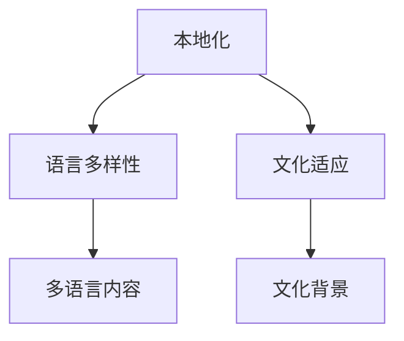

**伪代码**

```python
# 新兴市场与Podcast应用伪代码

# 本地化
localize_content(country="印度", language="印地语")

# 语言多样性
support_multiple_languages(languages=["印地语", "英语", "孟加拉语"])

# 文化适应
cultural_adaptation(strategy="了解当地价值观", example="幽默内容")
```

**举例说明**

假设TechVenture Podcast要进入印度市场，以下是我们的策略：

1. **本地化**：提供印地语版本的节目，以更好地满足当地听众的需求。
2. **语言多样性**：同时提供英语和孟加拉语的节目，吸引更多听众。
3. **文化适应**：制作一些幽默的内容，以符合印度市场的文化偏好。

#### 10.3 未来展望

随着技术的不断进步和市场的发展，Podcast的未来充满了机遇和挑战。以下是一些未来展望：

**内容质量提升**

随着技术的发展，Podcast的内容质量将不断提升。高质量的音频和视频内容将吸引更多的听众，提高Podcast的订阅量和影响力。

**多样化内容形式**

未来的Podcast将呈现出更多样化的内容形式，如增强现实（AR）、虚拟现实（VR）和交互式内容。这些新技术将为听众带来更加丰富和沉浸的体验。

**个性化内容推荐**

通过人工智能和数据分析，Podcast平台将能够提供更加个性化的内容推荐，满足听众的个性化需求。

**全球市场拓展**

随着移动互联网的普及，Podcast将在全球市场中得到更广泛的应用。各国市场的本地化内容将吸引更多的听众，推动Podcast的全球化发展。

**核心概念与联系**

未来展望涉及以下几个核心概念：

- **内容质量**：提高内容的质量，提升用户体验。
- **多样化内容形式**：探索新的内容形式，提供更多样化的内容。
- **个性化内容推荐**：通过数据分析，提供个性化的内容推荐。
- **全球市场拓展**：拓展全球市场，吸引更多国际听众。

**Mermaid 流程图**

```mermaid
graph TD
    A[内容质量] --> B[多样化内容形式]
    A --> C[个性化内容推荐]
    A --> D[全球市场拓展]
    B --> E[新技术应用]
    C --> F[数据分析]
    D --> G[国际化]
```

**伪代码**

```python
# 未来展望伪代码

# 提升内容质量
improve_content_quality(quality_elements=["音频质量", "视频质量", "内容深度"])

# 探索多样化内容形式
explore_diversified_content_formats(formats=["AR", "VR", "交互式内容"])

# 提供个性化内容推荐
provide_personalized_content_recommendations(technique="AI分析")

# 拓展全球市场
expand_global_market(countries=["印度", "巴西", "中国"])
```

**举例说明**

假设TechVenture Podcast要在未来实现以上展望，以下是我们的计划：

1. **提升内容质量**：使用新技术提高音频和视频的质量，提供更深入的内容分析。
2. **探索多样化内容形式**：尝试使用AR和VR技术，提供沉浸式的听觉体验。
3. **提供个性化内容推荐**：通过AI分析听众偏好，提供个性化的内容推荐。
4. **拓展全球市场**：进入印度、巴西和中国等新兴市场，提供本地化的内容。

通过以上展望和计划，TechVenture Podcast将在未来继续保持高质量的内容输出，吸引更多听众，并在全球市场中取得更大的成功。

### 附录A：常见问题解答

#### 附录A.1 创建Podcast常见问题

**Q1：如何选择适合的麦克风？**

A1：选择麦克风时，首先需要考虑您的预算和需求。动圈麦克风适合日常使用，而电容麦克风提供更高的音质。此外，选择适合您录音环境（如室内或户外）的麦克风也很重要。

**Q2：需要哪些软件来创建Podcast？**

A2：创建Podcast常用的软件包括音频录制软件（如Audacity、Logic Pro X）和音频编辑软件（如Adobe Audition、Pro Tools）。这些软件提供了丰富的功能，可以帮助您录制、编辑和优化音频内容。

**Q3：如何选择合适的发布平台？**

A3：选择发布平台时，需要考虑听众的分布情况和平台的特点。例如，Apple Podcasts和Spotify是较为主流的选择，而一些专业的Podcast平台（如 Anchor）则提供了更多的功能和支持。

**Q4：如何优化Podcast的搜索排名？**

A4：要优化Podcast的搜索排名，可以采用以下策略：进行关键词研究，确保关键词在标题、描述和内容中出现；保持内容更新，定期发布新的节目；利用社交媒体推广，提高节目曝光率。

**Q5：如何与听众互动？**

A5：与听众互动可以通过以下方式实现：回复听众的评论和私信，参与社交媒体上的讨论，定期举办问答环节或线上活动。这些互动可以增强听众的参与感和忠诚度。

#### 附录A.2 推广Podcast常见问题

**Q1：如何有效地利用社交媒体推广Podcast？**

A1：利用社交媒体推广Podcast的方法包括：在社交媒体平台上发布节目预告、精彩片段和节目摘要；定期发布与节目相关的内容，吸引听众关注；与听众互动，回答问题，收集反馈。

**Q2：如何增加Podcast的订阅量？**

A2：增加订阅量的方法包括：在节目中提供高质量的内容，确保听众愿意订阅；在各个发布平台上优化节目信息，包括标题、描述和关键词；利用电子邮件列表和社交媒体推广，提醒听众订阅节目。

**Q3：如何与其他Podcast主持人合作？**

A3：与其他Podcast主持人合作的步骤包括：找到合适的合作伙伴，对方在您感兴趣或互补的领域有影响力；建立联系，讨论合作的可能性；制定合作计划，确定内容主题和发布时间。

**Q4：如何衡量Podcast的推广效果？**

A4：衡量Podcast推广效果的方法包括：跟踪订阅量和收听率，了解听众的增长情况；分析社交媒体互动数据，如点赞、评论和分享；定期进行听众调查，了解他们对节目的满意度和建议。

#### 附录A.3 利用Podcast建立个人品牌常见问题

**Q1：如何通过Podcast建立个人品牌？**

A1：通过Podcast建立个人品牌的步骤包括：确定个人定位和目标听众，确保内容与个人品牌相关；提供高质量的内容，展示专业知识和见解；积极与听众互动，建立信任和忠诚度。

**Q2：如何展示个人特质？**

A2：展示个人特质的方法包括：在Podcast中使用独特的声音风格，如幽默、自信或亲切；分享个人经历和故事，展示个性；通过内容展示个人的专业知识和独到见解。

**Q3：如何持续更新内容？**

A3：持续更新内容的方法包括：制定内容计划，确保定期发布新节目；从听众反馈中获取灵感，调整内容方向；不断学习新知识，为内容提供新鲜素材。

**Q4：如何管理Podcast的时间和资源？**

A4：管理Podcast时间和资源的方法包括：制定详细的工作计划，分配时间进行内容创作、录音、编辑和推广；利用自动化工具，如社交媒体管理工具和内容发布平台，提高工作效率；定期评估和调整计划，确保资源得到合理利用。

### 附录B：资源链接

#### B.1 相关工具与平台推荐

**音频录制和编辑软件**

- Audacity（[https://www.audacityteam.org/](https://www.audacityteam.org/)）
- Adobe Audition（[https://www.adobe.com/products/audition.html](https://www.adobe.com/products/audition.html)）
- Pro Tools（[https://www.ableton.com/pro-tools/](https://www.ableton.com/pro-tools/)）

**发布平台**

- Apple Podcasts（[https://podcasts.apple.com/](https://podcasts.apple.com/)）
- Spotify（[https://open.spotify.com/](https://open.spotify.com/)）
- Google Podcasts（[https://podcasts.google.com/](https://podcasts.google.com/)）

**社交媒体管理工具**

- Hootsuite（[https://hootsuite.com/](https://hootsuite.com/)）
- Buffer（[https://buffer.com/](https://buffer.com/)）
- Sprout Social（[https://sproutsocial.com/](https://sproutsocial.com/)）

**关键词研究工具**

- Google Keyword Planner（[https://ads.google.com/home/tools/keyword-planner/](https://ads.google.com/home/tools/keyword-planner/)）
- Ahrefs（[https://ahrefs.com/](https://ahrefs.com/)）
- SEMrush（[https://www.semrush.com/](https://www.semrush.com/)）

#### B.2 学习资源与教程

**入门教程**

- Podcast制作入门教程（[https://www.podcastmaking.com/](https://www.podcastmaking.com/)）
- Creating a Successful Podcast（[https://www.blubrry.com/podcast Tutorial.html](https://www.blubrry.com/podcast%20Tutorial.html)）

**进阶教程**

- Podcasting with Audacity（[https://www.audacityteam.org/tutorials/podcasting.html](https://www.audacityteam.org/tutorials/podcasting.html)）
- Podcast Production Masterclass（[https://www.udemy.com/course/podcast-production-masterclass/](https://www.udemy.com/course/podcast-production-masterclass/)）

**专业课程**

- Podcasting and Content Creation（[https://www.edx.org/course/podcasting-and-content-creation](https://www.edx.org/course/podcasting-and-content-creation)）
- Creating Your Podcast with WordPress（[https://www.lynda.com/Podcasting-training/](https://www.lynda.com/Podcasting-training/)）

#### B.3 Podcast社区与论坛

**Podcast社区**

- Podcast Movement（[https://www.podcastmovement.com/](https://www.podcastmovement.com/)）
- Podcasters’ Roundtable（[https://www.podcastersroundtable.com/](https://www.podcastersroundtable.com/)）
- The Podcast Host（[https://www.thepodcasthost.com/](https://www.thepodcasthost.com/)）

**论坛**

- Podcast Guest（[https://www.podcastguest.com/](https://www.podcastguest.com/)）
- Podcast Academy（[https://www.podcastacademy.com/](https://www.podcastacademy.com/)）
- The Smart Podcast Player Community（[https://smartpodcastplayer.com/community/](https://smartpodcastplayer.com/community/)）

通过这些资源链接，您可以了解更多关于创建、编辑和推广Podcast的信息，以及如何通过Podcast建立个人品牌。

### 附录C：术语表

#### C.1 专业术语解释

- **Podcast**：一种基于音频的内容形式，创作者定期发布音频节目，听众可以通过各种平台进行订阅和收听。
- **个人品牌**：个人在公众心目中的形象、声誉和认知，通过持续的内容输出和互动，帮助个人在职场和商业活动中脱颖而出。
- **SEO（搜索引擎优化）**：通过优化内容、关键词和结构，提高网站在搜索引擎中的排名，从而吸引更多访问者。
- **社交媒体**：在线平台，如Facebook、Twitter、LinkedIn等，允许用户分享内容、交流观点和互动。

#### C.2 相关概念概述

- **内容创作**：创作和制作各种形式的内容，如文章、视频、音频等，以传达信息、娱乐或教育听众。
- **互动性**：内容创作者与听众之间的双向交流，包括评论、私信、问答等，增强听众的参与感和忠诚度。
- **品牌定位**：确定品牌在市场中的位置和目标，包括品牌形象、价值观和目标听众。

#### C.3 常用缩写词解释

- **AI**：人工智能（Artificial Intelligence）
- **AR**：增强现实（Augmented Reality）
- **VR**：虚拟现实（Virtual Reality）
- **SEO**：搜索引擎优化（Search Engine Optimization）
- **CRM**：客户关系管理（Customer Relationship Management）
- **SMM**：社交媒体营销（Social Media Marketing）
- **UX**：用户体验（User Experience）
- **UI**：用户界面（User Interface）

通过理解这些专业术语、概念和缩写词，您可以更好地理解Podcast创建和推广的过程，以及如何利用Podcast建立个人品牌。

