                 

### 《强化学习Reinforcement Learning算法的样本效率提升策略》

关键词：强化学习，样本效率，策略搜索，多任务学习，对抗样本，模型选择，应用案例，未来展望

摘要：本文深入探讨了强化学习（Reinforcement Learning，RL）算法在样本效率提升方面的策略。首先回顾了强化学习的基础知识，包括其定义、发展历程和核心算法。接着，文章分析了强化学习面临的主要挑战，如采样效率和值函数逼近问题，并提出了一系列解决方案。随后，本文详细讨论了策略搜索、多任务学习、对抗样本和模型选择等样本效率提升策略。通过具体的应用案例，文章展示了强化学习在实际世界中的广泛应用。最后，文章展望了强化学习未来发展的方向和趋势。

### 第一部分：强化学习基础

强化学习作为机器学习的一个重要分支，近年来在学术界和工业界都取得了显著的进展。它通过智能体（agent）与环境（environment）的交互，不断调整策略（policy），以实现最大化长期奖励（reward）的目标。本部分将介绍强化学习的基础知识，包括其定义、基本概念、发展历程和核心算法。

#### 第1章：强化学习概述

**1.1.1 强化学习的定义与基本概念**

强化学习是一种通过试错（trial-and-error）和反馈（feedback）来学习的机器学习方法。其核心概念包括：

- **智能体（Agent）**：执行动作并接受环境反馈的主体。
- **环境（Environment）**：与智能体交互的动态系统。
- **状态（State）**：描述智能体和环境当前情况的变量集合。
- **动作（Action）**：智能体可以采取的动作集合。
- **策略（Policy）**：从状态到动作的映射函数。
- **奖励（Reward）**：对智能体采取动作后的即时反馈。
- **价值函数（Value Function）**：评估智能体采取特定动作在特定状态下获得的预期奖励。

**1.1.2 强化学习的发展历程**

强化学习起源于20世纪50年代，最早由Richard Bellman提出。其发展历程可以分为以下几个阶段：

- **1950s-1960s**：初步探索阶段，以Bellman提出的动态规划（Dynamic Programming）和Markov决策过程（Markov Decision Process，MDP）为代表。
- **1970s-1980s**：低谷阶段，由于计算复杂度和样本效率问题，强化学习研究逐渐被忽视。
- **1990s**：复兴阶段，Q学习（Q-Learning）和SARSA（State-Action-Reward-State-Action，SARSA）算法的提出，为强化学习带来了新的希望。
- **2000s**：深度强化学习（Deep Reinforcement Learning，DRL）的兴起，使得强化学习在图像识别、自然语言处理等领域取得了突破性进展。

**1.1.3 强化学习与其他学习方式的比较**

强化学习与其他学习方式（如监督学习和无监督学习）有以下区别：

- **监督学习**：有明确的目标和标注数据，学习过程依赖于样本的标签信息。
- **无监督学习**：没有明确的标签信息，学习过程依赖于数据本身的分布。
- **强化学习**：通过与环境交互，不断调整策略，以实现长期目标。

强化学习在处理连续状态和动作空间、实现自主决策和探索方面具有明显优势。

#### 第2章：强化学习框架

**2.1.1 强化学习模型**

强化学习模型由状态（\(S\)）、动作（\(A\)）、奖励（\(R\)）、策略（\(π\)）和价值函数（\(V\)）组成，可以用以下公式表示：

\[ V^π(s) = E^π[R_t | S_0 = s] \]

其中，\(V^π(s)\) 表示在策略\(π\)下，从状态\(s\)开始获得的期望奖励。

**2.1.2 强化学习算法的分类**

根据学习方式，强化学习算法可以分为以下几类：

- **基于策略的算法**：直接学习最优策略，如策略梯度算法（Policy Gradient Methods）。
- **基于值函数的算法**：学习状态-动作值函数，然后利用值函数选择动作，如Q学习（Q-Learning）和SARSA（SARSA）。
- **深度强化学习算法**：结合深度学习技术，用于解决高维状态和动作空间问题，如深度Q网络（Deep Q-Network，DQN）和Actor-Critic算法。

**2.1.3 强化学习中的马尔可夫决策过程（MDP）**

强化学习中的马尔可夫决策过程（MDP）是一个离散的决策过程，可以用以下公式表示：

\[ P(s',r|s,a) = P(s'|s,a)P(r|s,a) \]

其中，\(s'\) 和 \(r\) 分别表示下一状态和奖励，\(P(s'|s,a)\) 和 \(P(r|s,a)\) 分别表示状态转移概率和奖励概率。

#### 第3章：强化学习中的核心算法

**3.1.1 Q学习算法**

Q学习算法是一种基于值函数的强化学习算法，通过迭代更新状态-动作值函数，以实现最优策略的收敛。其基本公式如下：

\[ Q(s, a) = Q(s, a) + α [r + γ max_{a'} Q(s', a') - Q(s, a)] \]

其中，\(α\) 是学习率，\(γ\) 是折扣因子。

**3.1.2 SARSA算法**

SARSA算法是一种基于值函数的强化学习算法，与Q学习算法类似，但在每次更新时使用实际状态-动作值函数代替期望值。其基本公式如下：

\[ Q(s, a) = Q(s, a) + α [r + γ Q(s', a')] \]

**3.1.3 DQN（Deep Q-Network）算法**

DQN算法是一种基于深度学习的强化学习算法，通过构建深度神经网络来近似状态-动作值函数。其基本公式如下：

\[ Q(s, a) = f_{\theta}(s,a) \]

其中，\(f_{\theta}(s,a)\) 表示深度神经网络的输出。

#### 第4章：强化学习中的挑战与解决方案

**4.1.1 采样效率问题**

强化学习中的采样效率问题是指智能体在探索环境时，需要大量样本来学习最优策略。为提高采样效率，可以采用以下策略：

- **优先经验回放（Prioritized Experience Replay）**：通过优先级回放机制，选择重要性较高的样本进行学习。
- **迭代增强（Iterative Enhancment）**：通过多次迭代更新策略，逐步提高采样效率。

**4.1.2 值函数逼近问题**

值函数逼近问题是指智能体在处理高维状态和动作空间时，需要使用近似方法来逼近真实值函数。为解决值函数逼近问题，可以采用以下策略：

- **深度神经网络（Deep Neural Network，DNN）**：使用深度神经网络来近似值函数，提高逼近精度。
- **卷积神经网络（Convolutional Neural Network，CNN）**：对于图像数据，使用卷积神经网络来处理图像特征。

**4.1.3 优化问题**

强化学习中的优化问题主要包括目标函数的优化和策略的优化。为解决优化问题，可以采用以下策略：

- **策略梯度算法（Policy Gradient Method）**：直接优化策略参数，提高策略性能。
- **演员-评论家算法（Actor-Critic Method）**：同时优化演员模型和评论家模型，实现目标函数的优化。

### 第二部分：样本效率提升策略

在强化学习过程中，样本效率的提升是至关重要的，因为它直接影响到算法的学习速度和最终性能。本部分将探讨几种提升样本效率的策略，包括策略搜索、多任务学习、对抗样本和模型选择。

#### 第5章：增强学习中的策略搜索

策略搜索是强化学习中一个核心问题，其目标是找到最优策略，使智能体能够在复杂环境中取得最佳表现。策略搜索可以分为以下几种方法：

**5.1.1 实际环境下的策略搜索**

在实际环境中，策略搜索通常需要通过试错（trial-and-error）和反馈（feedback）来逐步优化策略。以下是一些在实际环境下进行策略搜索的方法：

- **随机策略搜索（Random Policy Search）**：智能体随机采取动作，并根据奖励反馈调整策略。
- **梯度策略搜索（Gradient Policy Search）**：利用梯度信息，优化策略参数，提高策略性能。
- **演化策略搜索（Evolutionary Policy Search）**：通过遗传算法等进化策略，优化策略参数。

**5.1.2 基于模型的方法**

基于模型的方法通过构建环境模型，利用模型来预测状态和奖励，从而加速策略搜索。以下是一些基于模型的方法：

- **模型预测控制（Model Predictive Control，MPC）**：在连续控制问题中，利用模型预测下一状态和奖励，然后根据预测结果优化控制策略。
- **部分可观测马尔可夫决策过程（Partially Observable Markov Decision Process，POMDP）**：在部分可观测环境中，利用部分观测信息，构建POMDP模型，优化策略。

**5.1.3 无模型方法**

无模型方法不依赖于环境模型，直接从实际经验中学习策略。以下是一些无模型方法：

- **深度强化学习（Deep Reinforcement Learning，DRL）**：使用深度神经网络来近似状态-动作值函数或策略，加速策略搜索。
- **蒙特卡洛方法（Monte Carlo Method）**：通过模拟大量随机样本，估计状态-动作值函数或策略，优化策略性能。

#### 第6章：多任务学习与样本效率

多任务学习是指同时学习多个相关任务，以提高样本效率和算法性能。多任务学习在强化学习中的应用具有显著优势，以下是一些多任务学习的算法和策略：

**6.1.1 多任务学习的优势**

- **知识共享**：通过共享参数，不同任务之间可以相互借鉴，提高学习效率。
- **减少样本需求**：同时学习多个任务，可以减少每个任务所需的样本数量，提高整体样本效率。
- **增强泛化能力**：多任务学习可以增强智能体的泛化能力，提高在未知任务上的表现。

**6.1.2 多任务学习的算法**

- **共享网络（Shared Network）**：不同任务的输入共享同一神经网络，参数在任务之间共享。
- **任务分离网络（Task-Specific Network）**：每个任务有自己的神经网络，但部分层可以共享。
- **多任务强化学习（Multi-Task Reinforcement Learning，MTRL）**：同时学习多个任务，优化整体性能。

**6.1.3 多任务学习中的挑战与解决方案**

多任务学习面临以下挑战：

- **任务冲突**：不同任务之间可能存在冲突，导致学习性能下降。
- **资源分配**：如何在多个任务之间分配有限的计算资源。

为解决这些挑战，可以采用以下策略：

- **自适应资源分配**：根据任务的重要性，动态调整计算资源分配。
- **多任务强化学习**：同时优化多个任务，平衡任务冲突。

#### 第7章：对抗样本与样本效率

对抗样本是指通过微小扰动，使模型对特定输入产生错误分类或预测的样本。对抗样本在样本效率提升中具有重要作用，以下是一些对抗样本的生成算法和应用：

**7.1.1 对抗样本的引入**

对抗样本的引入旨在提高模型的鲁棒性和泛化能力。通过在训练过程中引入对抗样本，可以增强模型对异常样本的识别和抵抗能力。

**7.1.2 对抗样本生成算法**

- **梯度攻击（Gradient Attack）**：利用梯度信息，生成对模型产生影响的对抗样本。
- **生成对抗网络（Generative Adversarial Network，GAN）**：通过对抗训练，生成与真实样本具有相似分布的对抗样本。
- **迭代攻击（Iterative Attack）**：通过多次迭代，逐步调整样本特征，生成对抗性样本。

**7.1.3 对抗样本在样本效率提升中的应用**

- **对抗性训练**：在训练过程中引入对抗样本，提高模型的泛化能力。
- **样本增强**：通过对抗性样本，增强样本的多样性和代表性，提高样本效率。

#### 第8章：样本效率提升的模型选择

模型选择是强化学习中的一个关键问题，合适的模型可以提高样本效率和学习性能。以下是一些模型选择的策略和常见误区：

**8.1.1 算法模型的评估指标**

- **样本效率**：衡量算法在特定任务上的学习速度和样本需求。
- **平均奖励**：衡量算法在特定任务上的性能表现。
- **收敛速度**：衡量算法从初始状态到最优状态的收敛速度。

**8.1.2 模型选择的策略**

- **交叉验证**：通过交叉验证，评估不同模型在训练集和测试集上的性能，选择最佳模型。
- **模型融合**：结合多个模型的优点，提高整体性能。
- **自适应模型选择**：根据任务特性，动态调整模型类型和参数。

**8.1.3 模型选择中的常见误区**

- **过度拟合**：选择过于复杂的模型，导致在训练集上性能优异，但在测试集上表现不佳。
- **忽略模型适用性**：选择不适合特定任务的模型，导致学习效果不佳。

#### 第9章：强化学习在现实世界中的应用案例

强化学习在现实世界中有广泛的应用，以下是一些典型的应用案例：

**9.1.1 自动驾驶**

自动驾驶是强化学习的一个典型应用领域。通过强化学习，智能驾驶系统能够从大量道路数据中学习驾驶策略，实现自主驾驶。

**9.1.2 游戏AI**

游戏AI是强化学习的另一个重要应用领域。在电子游戏和模拟游戏中，智能体可以通过强化学习，学习游戏策略，提高游戏水平。

**9.1.3 聊天机器人**

聊天机器人是强化学习在自然语言处理领域的一个应用。通过强化学习，聊天机器人能够从对话数据中学习，提高与用户的交互能力。

### 第三部分：未来展望与研究方向

随着人工智能技术的不断发展，强化学习在样本效率提升方面还有很大的发展空间。以下是一些未来展望和潜在的研究方向：

#### 第10章：样本效率提升的算法展望

**10.1.1 现有算法的改进方向**

- **改进策略搜索算法**：通过更有效的策略搜索算法，提高样本效率。
- **改进值函数逼近方法**：通过改进值函数逼近方法，提高学习性能。

**10.1.2 新算法的研究方向**

- **基于深度学习的强化学习**：探索更有效的深度学习模型，提高样本效率。
- **基于对抗学习的强化学习**：利用对抗性样本，提高样本效率和算法鲁棒性。

**10.1.3 样本效率提升算法的实际应用前景**

- **智能制造**：通过强化学习，优化生产流程，提高生产效率。
- **智能交通**：通过强化学习，优化交通信号控制和路径规划，提高交通效率。

#### 第11章：强化学习与其他领域的交叉

**11.1.1 强化学习与自然语言处理**

强化学习与自然语言处理相结合，可以应用于对话系统、机器翻译等任务，提高模型性能和样本效率。

**11.1.2 强化学习与机器人技术**

强化学习在机器人技术中的应用，如自主导航、环境感知和任务规划，有望提高样本效率和算法性能。

**11.1.3 强化学习与其他领域的结合**

强化学习与其他领域的交叉，如心理学、生物学和经济学，可以探索新的应用场景和算法设计。

#### 第12章：强化学习的未来发展趋势

**12.1.1 技术趋势**

- **更高效的算法**：随着硬件性能的提升，研究者将致力于开发更高效的强化学习算法。
- **更广泛的领域应用**：强化学习将在更多领域得到应用，如医疗、金融和能源等。

**12.1.2 行业应用趋势**

- **自动化**：强化学习将在自动化领域发挥重要作用，提高生产效率和安全性。
- **个性化服务**：强化学习将应用于个性化推荐、智能客服等场景，提高用户体验。

**12.1.3 学术研究趋势**

- **算法创新**：研究者将探索新的算法，提高样本效率和算法性能。
- **跨学科研究**：强化学习与其他学科的交叉研究将得到更多关注。

### 作者信息

作者：AI天才研究院/AI Genius Institute & 禅与计算机程序设计艺术/Zen And The Art of Computer Programming

---

以上是《强化学习Reinforcement Learning算法的样本效率提升策略》的文章框架。接下来，我们将逐步展开每个章节的内容，深入探讨强化学习的基础知识、样本效率提升策略以及未来发展趋势。

---

接下来，我们将详细展开每个章节的内容，深入探讨强化学习的基础知识、样本效率提升策略以及未来发展趋势。

### 第一部分：强化学习基础

#### 第1章：强化学习概述

在本章中，我们将对强化学习进行全面的概述，从其定义、基本概念、发展历程到与其他学习方式的比较，帮助读者建立对强化学习的整体认识。

**1.1.1 强化学习的定义与基本概念**

强化学习是一种通过试错和反馈来学习的机器学习方法，其核心目标是使智能体能够在动态环境中采取最优动作，以实现长期奖励的最大化。强化学习中的关键概念包括：

- **智能体（Agent）**：执行动作并接收环境反馈的主体。智能体可以是机器人、软件代理或虚拟实体。
- **环境（Environment）**：与智能体交互的动态系统。环境可以提供状态信息、奖励信号和可能的动作。
- **状态（State）**：描述智能体和环境当前情况的变量集合。状态可以是离散的，也可以是连续的。
- **动作（Action）**：智能体可以采取的动作集合。动作可以是离散的，也可以是连续的。
- **策略（Policy）**：从状态到动作的映射函数。策略定义了智能体在不同状态下应该采取的动作。
- **奖励（Reward）**：对智能体采取动作后的即时反馈。奖励可以是正的，也可以是负的，用来引导智能体学习。
- **价值函数（Value Function）**：评估智能体在特定状态下采取特定动作的预期奖励。价值函数可以是状态-动作值函数或状态值函数。
- **模型（Model）**：描述环境动态的数学模型。模型可以是确定性模型，也可以是概率模型。

强化学习的基本目标可以形式化为：

\[ J(π) = \sum_{s,a} π(a|s) \cdot Q(s, a) \]

其中，\(J(π)\) 表示策略π的期望回报，\(π(a|s)\) 表示在状态s下采取动作a的概率，\(Q(s, a)\) 表示状态-动作值函数。

**1.1.2 强化学习的发展历程**

强化学习的发展历程可以分为以下几个阶段：

- **1950s-1960s**：强化学习最初由Richard Bellman提出，他提出了动态规划（Dynamic Programming）和马尔可夫决策过程（Markov Decision Process，MDP）的概念。这一时期的研究主要集中在理论分析和数学模型上。
- **1970s-1980s**：由于计算复杂度和样本效率问题，强化学习研究进入低谷期。许多研究者认为强化学习在实际应用中难以取得突破。
- **1990s**：Q学习（Q-Learning）和SARSA（State-Action-Reward-State-Action，SARSA）算法的提出，使得强化学习研究重新焕发生机。Q学习通过迭代更新值函数，逐渐收敛到最优策略；SARSA算法通过更新实际的经验值函数，避免了过度依赖模型。
- **2000s**：随着深度学习技术的发展，深度强化学习（Deep Reinforcement Learning，DRL）逐渐兴起。深度神经网络被用于近似值函数或策略，解决了高维状态和动作空间的问题。代表性的算法包括深度Q网络（Deep Q-Network，DQN）和Actor-Critic算法。
- **2010s**：强化学习在自然语言处理、计算机视觉、游戏AI等领域取得了显著进展。AlphaGo的成功证明了强化学习在复杂问题上的潜力。

**1.1.3 强化学习与其他学习方式的比较**

强化学习与监督学习和无监督学习有以下区别：

- **监督学习**：监督学习有明确的目标和标注数据，学习过程依赖于样本的标签信息。其目标是通过学习输入和输出之间的映射关系，实现预测或分类任务。典型的监督学习算法包括线性回归、支持向量机（SVM）和神经网络。
- **无监督学习**：无监督学习没有明确的标签信息，学习过程依赖于数据本身的分布。其目标是通过发现数据中的潜在结构或模式，实现聚类、降维或生成任务。典型的无监督学习算法包括K-means聚类、主成分分析（PCA）和生成对抗网络（GAN）。

强化学习在处理连续状态和动作空间、实现自主决策和探索方面具有明显优势。以下是一个简化的Mermaid流程图，展示了强化学习的基本框架：

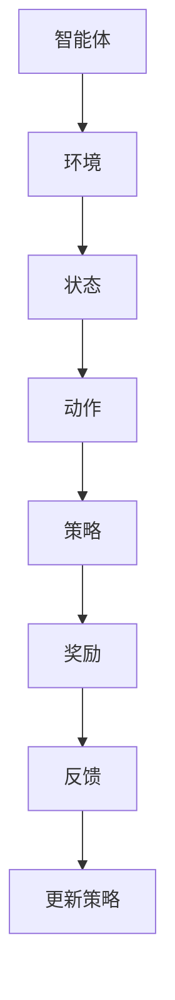

#### 第2章：强化学习框架

在本章中，我们将深入探讨强化学习的框架，包括强化学习模型、算法分类和马尔可夫决策过程（MDP）。

**2.1.1 强化学习模型**

强化学习模型由状态（\(S\)）、动作（\(A\)）、奖励（\(R\)）、策略（\(π\)）和价值函数（\(V\)）组成。这些元素共同定义了强化学习的核心机制。

- **状态（\(S\)）**：状态是描述智能体和环境当前情况的变量集合。状态可以是离散的，也可以是连续的。在离散状态空间中，每个状态可以用一个整数或字符串表示；在连续状态空间中，每个状态可以用一个实数表示。

- **动作（\(A\)）**：动作是智能体可以采取的动作集合。动作可以是离散的，也可以是连续的。在离散动作空间中，每个动作可以用一个整数或字符串表示；在连续动作空间中，每个动作可以用一个实数表示。

- **奖励（\(R\)）**：奖励是对智能体采取动作后的即时反馈。奖励可以是正的，也可以是负的，用来引导智能体学习。奖励可以是立即奖励，也可以是延迟奖励。

- **策略（\(π\)）**：策略是从状态到动作的映射函数。策略定义了智能体在不同状态下应该采取的动作。策略可以是确定性策略，也可以是概率策略。确定性策略在给定状态下只采取一个动作；概率策略在给定状态下采取一组动作的概率分布。

- **价值函数（\(V\)）**：价值函数是评估智能体在特定状态下采取特定动作的预期奖励。价值函数可以是状态-动作值函数或状态值函数。状态-动作值函数表示在给定状态下，采取特定动作的预期奖励；状态值函数表示在给定状态下，所有动作的期望奖励之和。

强化学习模型可以用以下公式表示：

\[ V^π(s) = E^π[R_t | S_0 = s] \]

其中，\(V^π(s)\) 表示在策略π下，从状态s开始获得的期望奖励，\(E^π[R_t | S_0 = s]\) 表示在策略π下，从状态s开始获得的即时奖励的期望。

**2.1.2 强化学习算法的分类**

根据学习方式，强化学习算法可以分为以下几类：

- **基于策略的算法**：直接学习最优策略。这类算法通过优化策略参数，使智能体能够采取最优动作。常见的基于策略的算法包括策略梯度算法、REINFORCE算法和Actor-Critic算法。
- **基于值函数的算法**：学习状态-动作值函数或状态值函数。这类算法通过优化值函数，使智能体能够选择最优动作。常见的基于值函数的算法包括Q学习、SARSA和深度Q网络（DQN）。
- **深度强化学习算法**：结合深度学习技术，用于解决高维状态和动作空间问题。常见的深度强化学习算法包括DQN、DDPG（Deep Deterministic Policy Gradient）和A3C（Asynchronous Advantage Actor-Critic）。

**2.1.3 强化学习中的马尔可夫决策过程（MDP）**

马尔可夫决策过程（MDP）是强化学习中的一个重要概念，用于描述智能体与环境之间的交互。MDP由状态（\(S\)）、动作（\(A\)）、奖励（\(R\)）和转移概率（\(P\)）组成。

- **状态（\(S\)）**：状态是描述智能体和环境当前情况的变量集合。状态可以是离散的，也可以是连续的。
- **动作（\(A\)）**：动作是智能体可以采取的动作集合。动作可以是离散的，也可以是连续的。
- **奖励（\(R\)）**：奖励是对智能体采取动作后的即时反馈。奖励可以是立即奖励，也可以是延迟奖励。
- **转移概率（\(P\)）**：转移概率描述了智能体从当前状态采取特定动作后，进入下一状态的概率分布。转移概率可以用以下公式表示：

\[ P(s',r|s,a) = P(s'|s,a)P(r|s,a) \]

其中，\(s'\) 和 \(r\) 分别表示下一状态和奖励，\(P(s'|s,a)\) 和 \(P(r|s,a)\) 分别表示状态转移概率和奖励概率。

MDP可以用以下公式表示：

\[ P(s_t, a_t | s_0, a_0) = \prod_{t=0}^{T-1} P(s_t, a_t | s_{t-1}, a_{t-1}) \]

其中，\(s_t\) 和 \(a_t\) 分别表示第t步的状态和动作，\(s_0\) 和 \(a_0\) 分别表示初始状态和动作。

一个简化的Mermaid流程图，展示了MDP的基本框架：

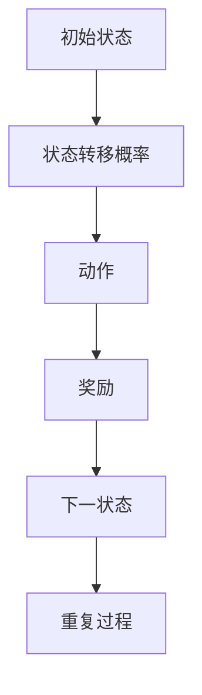

#### 第3章：强化学习中的核心算法

在本章中，我们将介绍强化学习中的核心算法，包括Q学习算法、SARSA算法和DQN算法。

**3.1.1 Q学习算法**

Q学习算法是一种基于值函数的强化学习算法，通过迭代更新状态-动作值函数，使智能体能够选择最优动作。Q学习算法的基本思想是，通过观察智能体在特定状态下采取特定动作获得的奖励，逐步更新状态-动作值函数，直到收敛到最优值函数。

Q学习算法的基本公式如下：

\[ Q(s, a) = Q(s, a) + α [r + γ max_{a'} Q(s', a') - Q(s, a)] \]

其中，\(α\) 是学习率，\(γ\) 是折扣因子，\(r\) 是即时奖励，\(Q(s, a)\) 是状态-动作值函数，\(Q(s', a')\) 是下一状态-动作值函数。

以下是一个简化的伪代码，展示了Q学习算法的基本实现：

```python
# 初始化状态-动作值函数Q(s, a)
Q = np.zeros([n_states, n_actions])

# 设置学习率α和折扣因子γ
alpha = 0.1
gamma = 0.99

# 设置迭代次数
n_iterations = 1000

# 迭代更新状态-动作值函数
for i in range(n_iterations):
    # 选择一个状态s
    s = random_state()

    # 选择一个动作a
    a = random_action(s)

    # 执行动作a，获得即时奖励r和下一状态s'
    r, s' = execute_action(a)

    # 更新状态-动作值函数
    Q[s, a] = Q[s, a] + alpha * (r + gamma * max(Q[s', :]) - Q[s, a])

# 选择最优动作
best_action = np.argmax(Q[s, :])

# 执行最优动作，获得下一状态和奖励
s', r = execute_action(best_action)
```

**3.1.2 SARSA算法**

SARSA算法是一种基于值函数的强化学习算法，与Q学习算法类似，但在每次更新时使用实际状态-动作值函数代替期望值。SARSA算法的基本思想是，通过观察智能体在特定状态下采取实际动作获得的奖励，逐步更新状态-动作值函数。

SARSA算法的基本公式如下：

\[ Q(s, a) = Q(s, a) + α [r + γ Q(s', a')] \]

以下是一个简化的伪代码，展示了SARSA算法的基本实现：

```python
# 初始化状态-动作值函数Q(s, a)
Q = np.zeros([n_states, n_actions])

# 设置学习率α和折扣因子γ
alpha = 0.1
gamma = 0.99

# 设置迭代次数
n_iterations = 1000

# 迭代更新状态-动作值函数
for i in range(n_iterations):
    # 选择一个状态s
    s = random_state()

    # 选择一个动作a
    a = random_action(s)

    # 执行动作a，获得即时奖励r和下一状态s'
    r, s' = execute_action(a)

    # 更新状态-动作值函数
    Q[s, a] = Q[s, a] + alpha * (r + gamma * Q[s', a'])

# 选择最优动作
best_action = np.argmax(Q[s, :])

# 执行最优动作，获得下一状态和奖励
s', r = execute_action(best_action)
```

**3.1.3 DQN（Deep Q-Network）算法**

DQN算法是一种基于深度学习的强化学习算法，通过构建深度神经网络来近似状态-动作值函数。DQN算法的基本思想是，通过在经验回放记忆中采样经验，训练深度神经网络，使其能够准确预测状态-动作值函数。

DQN算法的基本公式如下：

\[ Q(s, a) = f_{\theta}(s,a) \]

其中，\(f_{\theta}(s,a)\) 表示深度神经网络的输出，\(\theta\) 表示神经网络的参数。

以下是一个简化的伪代码，展示了DQN算法的基本实现：

```python
# 初始化深度神经网络Q(s, a)
Q = DQN(n_states, n_actions)

# 设置学习率α和折扣因子γ
alpha = 0.1
gamma = 0.99

# 设置迭代次数
n_iterations = 1000

# 初始化经验回放记忆
memory = ExperienceReplayBuffer()

# 迭代更新深度神经网络
for i in range(n_iterations):
    # 从经验回放记忆中采样经验
    s, a, r, s' = memory.sample(batch_size)

    # 计算目标值函数
    target = r + gamma * Q(s', a)

    # 更新深度神经网络
    Q.fit(s, a, target)

# 选择最优动作
best_action = np.argmax(Q.predict(s))

# 执行最优动作，获得下一状态和奖励
s', r = execute_action(best_action)
```

#### 第4章：强化学习中的挑战与解决方案

在本章中，我们将探讨强化学习中的主要挑战，包括采样效率问题、值函数逼近问题和优化问题，并介绍相应的解决方案。

**4.1.1 采样效率问题**

强化学习中的采样效率问题是指智能体在探索环境时，需要大量样本来学习最优策略。低效的样本采集会导致学习时间延长，从而影响算法的实用性。以下是一些提高采样效率的策略：

- **优先经验回放（Prioritized Experience Replay）**：优先经验回放是一种经验回放机制的改进方法，通过为每个经验赋予优先级，使得重要性较高的经验被回放的概率更高。这样可以在有限的样本中，优先学习关键经验，提高学习效率。
- **迭代增强（Iterative Enhancment）**：迭代增强是一种通过多次迭代更新策略，逐步提高采样效率的方法。每次迭代都会根据当前策略生成新的经验，然后利用这些经验更新策略，直到策略收敛。这种方法可以减少初始策略对学习过程的影响，提高采样效率。

以下是一个简化的Mermaid流程图，展示了迭代增强的基本框架：

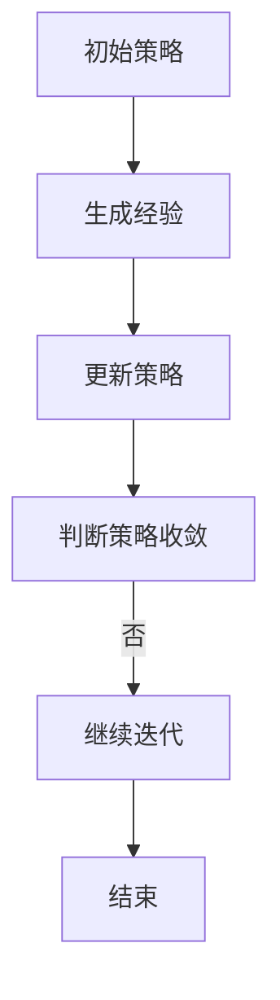

**4.1.2 值函数逼近问题**

值函数逼近问题是指智能体在处理高维状态和动作空间时，需要使用近似方法来逼近真实值函数。以下是一些值函数逼近的方法：

- **深度神经网络（Deep Neural Network，DNN）**：深度神经网络是一种有效的值函数逼近方法，通过多层非线性变换，可以从高维输入中提取特征，实现值函数的近似。深度神经网络可以处理复杂的输入数据，适用于高维状态和动作空间。
- **卷积神经网络（Convolutional Neural Network，CNN）**：卷积神经网络是一种专门用于处理图像数据的神经网络，通过卷积操作，可以提取图像的特征。对于视觉任务，使用CNN可以更好地逼近值函数。

以下是一个简化的Mermaid流程图，展示了深度神经网络的基本框架：

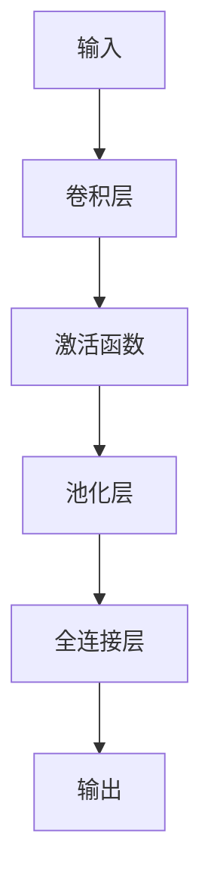

**4.1.3 优化问题**

强化学习中的优化问题主要包括目标函数的优化和策略的优化。以下是一些优化策略：

- **策略梯度算法（Policy Gradient Method）**：策略梯度算法是一种直接优化策略参数的方法。通过计算策略梯度，更新策略参数，优化目标函数。策略梯度算法可以分为基于梯度的策略优化和基于价值的策略优化。
- **演员-评论家算法（Actor-Critic Method）**：演员-评论家算法是一种同时优化演员模型和评论家模型的方法。演员模型负责生成策略，评论家模型负责评估策略性能。通过交替更新演员模型和评论家模型，优化目标函数。

以下是一个简化的Mermaid流程图，展示了演员-评论家算法的基本框架：

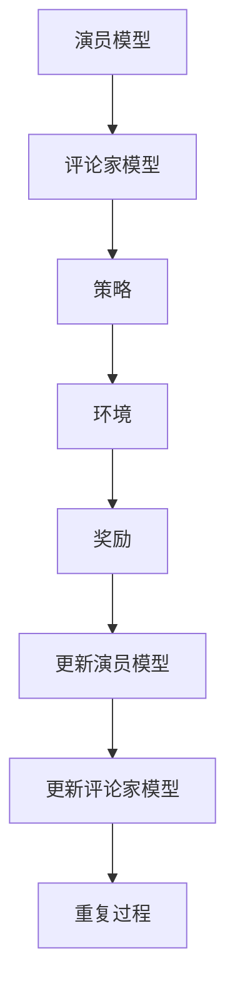

### 第二部分：样本效率提升策略

在强化学习中，样本效率的提升是至关重要的，因为它直接影响到算法的学习速度和最终性能。本部分将探讨几种提升样本效率的策略，包括策略搜索、多任务学习、对抗样本和模型选择。

#### 第5章：增强学习中的策略搜索

策略搜索是强化学习中的一个核心问题，其目标是找到最优策略，使智能体能够在复杂环境中取得最佳表现。策略搜索可以分为以下几种方法：

**5.1.1 实际环境下的策略搜索**

在实际环境中，策略搜索通常需要通过试错和反馈来逐步优化策略。以下是一些在实际环境下进行策略搜索的方法：

- **随机策略搜索（Random Policy Search）**：智能体随机采取动作，并根据奖励反馈调整策略。这种方法简单直观，但在高维状态和动作空间中效率较低。
- **梯度策略搜索（Gradient Policy Search）**：利用梯度信息，优化策略参数，提高策略性能。这种方法需要计算梯度，计算复杂度较高，但可以加快收敛速度。
- **演化策略搜索（Evolutionary Policy Search）**：通过遗传算法等进化策略，优化策略参数。这种方法具有全局搜索能力，可以避免局部最优。

以下是一个简化的Mermaid流程图，展示了随机策略搜索的基本框架：

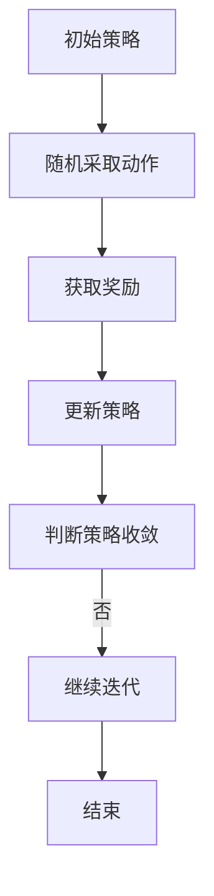

**5.1.2 基于模型的方法**

基于模型的方法通过构建环境模型，利用模型来预测状态和奖励，从而加速策略搜索。以下是一些基于模型的方法：

- **模型预测控制（Model Predictive Control，MPC）**：在连续控制问题中，利用模型预测下一状态和奖励，然后根据预测结果优化控制策略。MPC可以处理复杂的非线性系统，但计算复杂度较高。
- **部分可观测马尔可夫决策过程（Partially Observable Markov Decision Process，POMDP）**：在部分可观测环境中，利用部分观测信息，构建POMDP模型，优化策略。POMDP可以处理部分可观测问题，但模型复杂度较高。

以下是一个简化的Mermaid流程图，展示了基于模型策略搜索的基本框架：

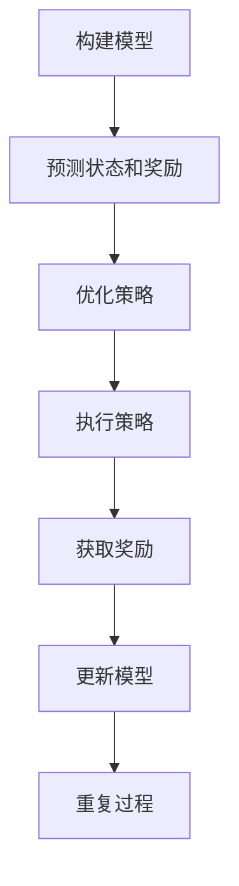

**5.1.3 无模型方法**

无模型方法不依赖于环境模型，直接从实际经验中学习策略。以下是一些无模型方法：

- **深度强化学习（Deep Reinforcement Learning，DRL）**：使用深度神经网络来近似状态-动作值函数或策略，加速策略搜索。DRL可以处理高维状态和动作空间，但需要大量的训练数据。
- **蒙特卡洛方法（Monte Carlo Method）**：通过模拟大量随机样本，估计状态-动作值函数或策略，优化策略性能。蒙特卡洛方法适用于不确定环境，但收敛速度较慢。

以下是一个简化的Mermaid流程图，展示了无模型策略搜索的基本框架：

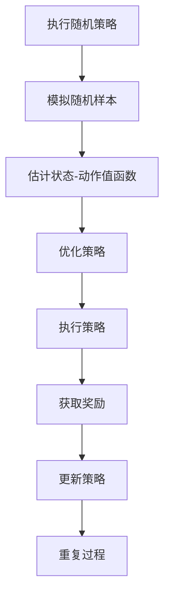

#### 第6章：多任务学习与样本效率

多任务学习是指同时学习多个相关任务，以提高样本效率和算法性能。多任务学习在强化学习中的应用具有显著优势，以下是一些多任务学习的算法和策略：

**6.1.1 多任务学习的优势**

- **知识共享**：通过共享参数，不同任务之间可以相互借鉴，提高学习效率。知识共享可以减少每个任务的训练时间，加快收敛速度。
- **减少样本需求**：同时学习多个任务，可以减少每个任务所需的样本数量，提高整体样本效率。多个任务的样本可以相互补充，减少对特定任务的依赖。
- **增强泛化能力**：多任务学习可以增强智能体的泛化能力，提高在未知任务上的表现。智能体可以从多个任务中学习到通用的策略和特征提取方法。

**6.1.2 多任务学习的算法**

- **共享网络（Shared Network）**：不同任务的输入共享同一神经网络，参数在任务之间共享。共享网络可以减少每个任务的参数数量，提高模型的可解释性。
- **任务分离网络（Task-Specific Network）**：每个任务有自己的神经网络，但部分层可以共享。任务分离网络可以保持每个任务的独立性和特定性，同时利用共享层提高学习效率。
- **多任务强化学习（Multi-Task Reinforcement Learning，MTRL）**：同时学习多个任务，优化整体性能。MTRL可以通过联合优化多个任务的损失函数，提高整体性能。

以下是一个简化的Mermaid流程图，展示了多任务学习的基本框架：

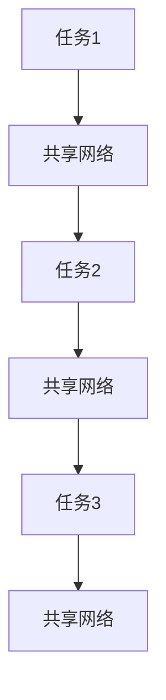

**6.1.3 多任务学习中的挑战与解决方案**

多任务学习面临以下挑战：

- **任务冲突**：不同任务之间可能存在冲突，导致学习性能下降。任务冲突可能是由于任务的奖励目标不一致，或者任务需要不同的策略。
- **资源分配**：如何在多个任务之间分配有限的计算资源。资源分配不当可能导致某个任务无法得到充分训练，从而影响整体性能。

为解决这些挑战，可以采用以下策略：

- **自适应资源分配**：根据任务的重要性，动态调整计算资源分配。重要性较高的任务可以分配更多的计算资源，以确保其性能。
- **多任务强化学习**：同时优化多个任务，平衡任务冲突。多任务强化学习可以通过联合优化多个任务的损失函数，提高整体性能。

以下是一个简化的Mermaid流程图，展示了自适应资源分配和多任务强化学习的基本框架：

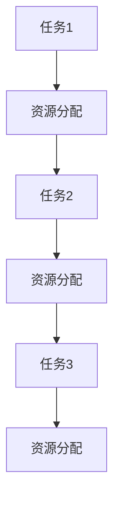

#### 第7章：对抗样本与样本效率

对抗样本是指通过微小扰动，使模型对特定输入产生错误分类或预测的样本。对抗样本在样本效率提升中具有重要作用，以下是一些对抗样本的生成算法和应用：

**7.1.1 对抗样本的引入**

对抗样本的引入旨在提高模型的鲁棒性和泛化能力。通过在训练过程中引入对抗样本，可以增强模型对异常样本的识别和抵抗能力。以下是一个简化的Mermaid流程图，展示了对抗样本引入的基本框架：

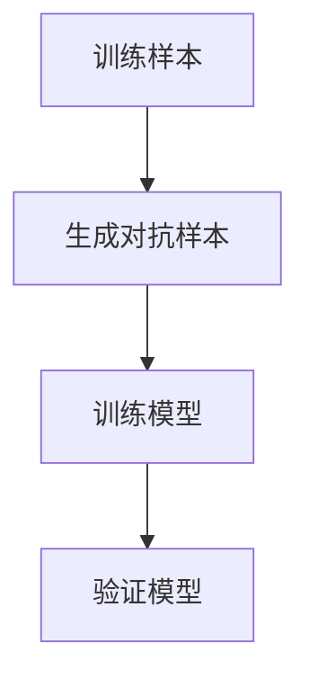

**7.1.2 对抗样本生成算法**

- **梯度攻击（Gradient Attack）**：利用梯度信息，生成对模型产生影响的对抗样本。梯度攻击通过计算模型对输入的梯度，调整输入特征，使模型产生错误预测。
- **生成对抗网络（Generative Adversarial Network，GAN）**：通过对抗训练，生成与真实样本具有相似分布的对抗样本。GAN由生成器和判别器组成，生成器生成对抗样本，判别器区分对抗样本和真实样本。
- **迭代攻击（Iterative Attack）**：通过多次迭代，逐步调整样本特征，生成对抗性样本。迭代攻击通过逐步优化对抗样本的扰动，使模型对扰动产生更大的误差。

以下是一个简化的Mermaid流程图，展示了梯度攻击和迭代攻击的基本框架：

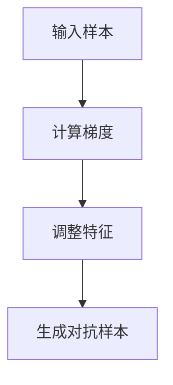

**7.1.3 对抗样本在样本效率提升中的应用**

- **对抗性训练**：在训练过程中引入对抗样本，提高模型的泛化能力。对抗性训练通过增加对抗样本的比例，增强模型对异常样本的识别能力。
- **样本增强**：通过对抗性样本，增强样本的多样性和代表性，提高样本效率。样本增强可以通过扰动原始样本，生成新的训练样本。

以下是一个简化的Mermaid流程图，展示了对抗性训练和样本增强的基本框架：


#### 第8章：样本效率提升的模型选择

模型选择是强化学习中的一个关键问题，合适的模型可以提高样本效率和学习性能。以下是一些模型选择的策略和常见误区：

**8.1.1 算法模型的评估指标**

在模型选择过程中，需要根据特定的评估指标来评估不同模型的表现。以下是一些常用的评估指标：

- **样本效率**：衡量算法在特定任务上的学习速度和样本需求。样本效率可以通过计算每获得一个奖励所需的经验数量来衡量。
- **平均奖励**：衡量算法在特定任务上的性能表现。平均奖励可以通过计算在测试集上的累计奖励平均值来衡量。
- **收敛速度**：衡量算法从初始状态到最优状态的收敛速度。收敛速度可以通过计算算法在达到特定性能水平所需的迭代次数来衡量。

以下是一个简化的Mermaid流程图，展示了模型选择评估指标的基本框架：

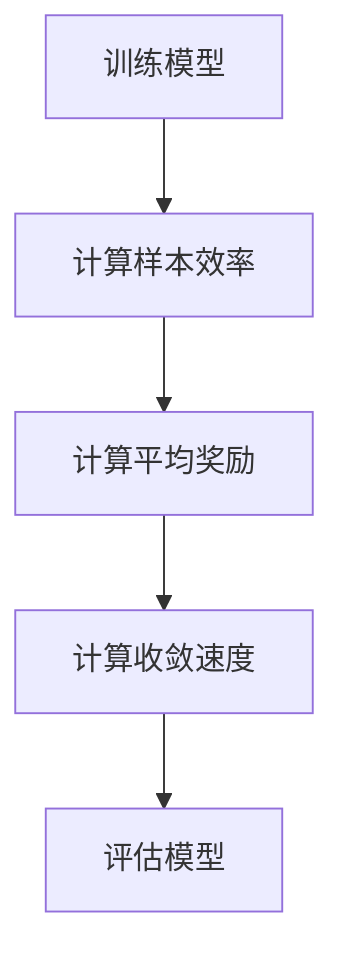

**8.1.2 模型选择的策略**

在模型选择过程中，可以采用以下策略：

- **交叉验证**：通过交叉验证，评估不同模型在训练集和测试集上的性能，选择最佳模型。交叉验证可以减少模型选择的主观性，提高模型的泛化能力。
- **模型融合**：结合多个模型的优点，提高整体性能。模型融合可以通过加权平均或投票机制，将多个模型的预测结果进行整合。
- **自适应模型选择**：根据任务特性，动态调整模型类型和参数。自适应模型选择可以根据任务的复杂度、数据规模和硬件性能，选择最合适的模型。

以下是一个简化的Mermaid流程图，展示了模型选择策略的基本框架：

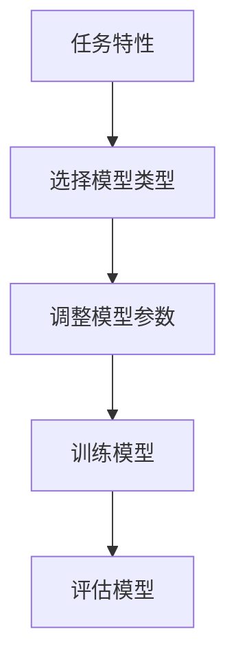

**8.1.3 模型选择中的常见误区**

在模型选择过程中，需要注意以下常见误区：

- **过度拟合**：选择过于复杂的模型，导致在训练集上性能优异，但在测试集上表现不佳。过度拟合可能是因为模型过于强大，无法捕捉数据的泛化能力。
- **忽略模型适用性**：选择不适合特定任务的模型，导致学习效果不佳。不同任务可能需要不同类型的模型，选择适合任务的模型是关键。

以下是一个简化的Mermaid流程图，展示了模型选择中的常见误区：

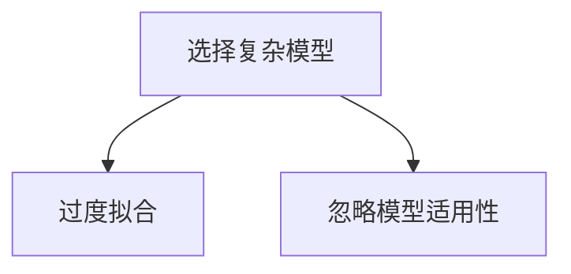

#### 第9章：强化学习在现实世界中的应用案例

强化学习在现实世界中有广泛的应用，以下是一些典型的应用案例：

**9.1.1 自动驾驶**

自动驾驶是强化学习在工业界的一个重要应用领域。通过强化学习，智能驾驶系统能够从大量道路数据中学习驾驶策略，实现自主驾驶。以下是一个简化的Mermaid流程图，展示了自动驾驶系统中的强化学习框架：

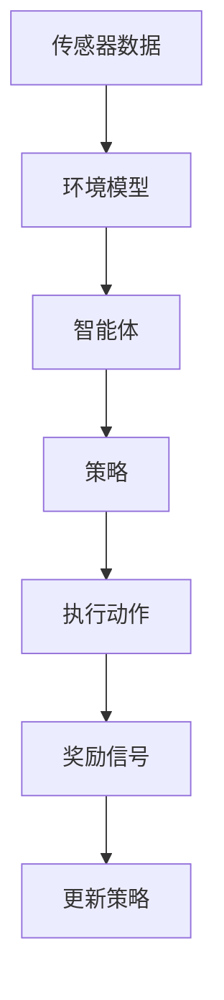

**9.1.2 游戏AI**

游戏AI是强化学习的另一个重要应用领域。在电子游戏和模拟游戏中，智能体可以通过强化学习，学习游戏策略，提高游戏水平。以下是一个简化的Mermaid流程图，展示了游戏AI中的强化学习框架：

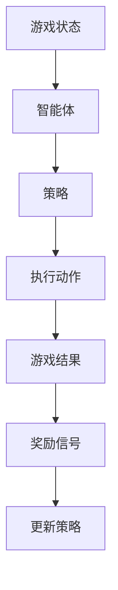

**9.1.3 聊天机器人**

聊天机器人是强化学习在自然语言处理领域的一个应用。通过强化学习，聊天机器人能够从对话数据中学习，提高与用户的交互能力。以下是一个简化的Mermaid流程图，展示了聊天机器人中的强化学习框架：

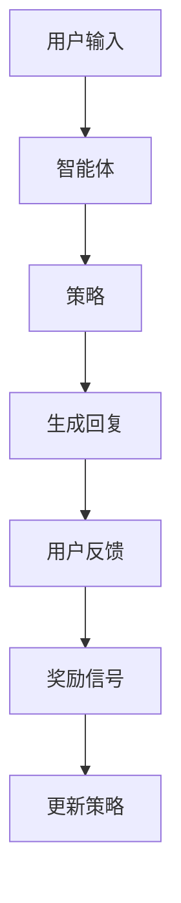

### 第三部分：未来展望与研究方向

随着人工智能技术的不断发展，强化学习在样本效率提升方面还有很大的发展空间。以下是一些未来展望和潜在的研究方向：

#### 第10章：样本效率提升的算法展望

**10.1.1 现有算法的改进方向**

- **改进策略搜索算法**：通过更有效的策略搜索算法，提高样本效率。可以探索基于进化算法、元学习等方法，优化策略搜索过程。
- **改进值函数逼近方法**：通过改进值函数逼近方法，提高学习性能。可以探索基于深度强化学习、对抗性网络等方法，提高值函数逼近的精度和效率。
- **增强样本增强技术**：通过增强样本增强技术，提高样本的代表性和多样性。可以探索基于生成对抗网络、强化学习生成模型等方法，生成高质量的训练样本。

**10.1.2 新算法的研究方向**

- **基于物理的强化学习**：结合物理模型和强化学习，提高样本效率和算法性能。可以探索基于物理引擎的仿真环境，构建基于物理模型的强化学习算法。
- **分布式强化学习**：在分布式计算环境中，探索高效的分布式强化学习算法。可以探索基于多智能体强化学习、联邦学习等方法，提高样本效率和算法性能。
- **强化学习与元学习结合**：探索强化学习与元学习的结合方法，提高样本效率和算法泛化能力。可以探索基于元学习的策略搜索、模型压缩等方法。

**10.1.3 样本效率提升算法的实际应用前景**

- **智能制造**：通过强化学习，优化生产流程，提高生产效率。可以探索基于强化学习的自动化生产线优化、设备维护优化等方法。
- **智能交通**：通过强化学习，优化交通信号控制和路径规划，提高交通效率。可以探索基于强化学习的智能交通信号控制、自动驾驶路径规划等方法。
- **医疗健康**：通过强化学习，优化医疗诊断和治疗方案，提高医疗效率。可以探索基于强化学习的疾病诊断、个性化治疗优化等方法。

#### 第11章：强化学习与其他领域的交叉

**11.1.1 强化学习与自然语言处理**

强化学习与自然语言处理（NLP）的交叉是一个具有潜力的研究方向。以下是一些结合应用：

- **对话系统**：通过强化学习，优化对话系统中的对话策略，提高用户体验。可以探索基于强化学习的方法，如策略网络、强化学习生成模型等。
- **文本分类**：通过强化学习，优化文本分类模型的预测能力。可以探索基于强化学习的方法，如标签预测、分类优化等。
- **机器翻译**：通过强化学习，优化机器翻译模型的质量。可以探索基于强化学习的方法，如翻译策略优化、多任务学习等。

**11.1.2 强化学习与机器人技术**

强化学习在机器人技术中的应用具有重要意义，以下是一些结合应用：

- **自主导航**：通过强化学习，优化机器人自主导航策略，提高导航精度和效率。可以探索基于强化学习的方法，如深度强化学习、多任务学习等。
- **任务规划**：通过强化学习，优化机器人任务规划策略，提高任务执行效率。可以探索基于强化学习的方法，如强化学习生成模型、多智能体强化学习等。
- **环境感知**：通过强化学习，优化机器人环境感知策略，提高对环境的理解和适应能力。可以探索基于强化学习的方法，如深度强化学习、对抗性网络等。

**11.1.3 强化学习与其他领域的结合**

强化学习与其他领域的交叉应用可以带来新的研究机遇，以下是一些结合应用：

- **金融领域**：通过强化学习，优化金融投资策略，提高投资回报率。可以探索基于强化学习的方法，如交易策略优化、风险控制等。
- **游戏开发**：通过强化学习，优化游戏AI的智能程度，提高游戏体验。可以探索基于强化学习的方法，如游戏策略优化、多任务学习等。
- **教育领域**：通过强化学习，优化教育系统的个性化学习策略，提高学习效果。可以探索基于强化学习的方法，如学习路径规划、智能辅导等。

#### 第12章：强化学习的未来发展趋势

**12.1.1 技术趋势**

- **更高效的算法**：随着硬件性能的提升，研究者将致力于开发更高效的强化学习算法。可以探索基于神经架构搜索（Neural Architecture Search，NAS）的方法，自动搜索最优算法结构。
- **更广泛的领域应用**：强化学习将在更多领域得到应用，如智能制造、智能交通、医疗健康等。可以探索基于强化学习的方法，解决这些领域中的复杂问题。
- **跨学科研究**：强化学习与其他学科的交叉研究将得到更多关注。可以探索强化学习与心理学、生物学、经济学等领域的结合，推动跨学科发展。

**12.1.2 行业应用趋势**

- **自动化**：随着工业4.0的推进，强化学习将在自动化领域发挥重要作用。可以探索基于强化学习的方法，优化生产流程、设备维护等。
- **个性化服务**：随着大数据和人工智能技术的发展，强化学习将在个性化服务领域得到广泛应用。可以探索基于强化学习的方法，优化推荐系统、智能客服等。
- **智能交通**：随着智能交通系统的建设，强化学习将在交通信号控制、路径规划等领域发挥重要作用。可以探索基于强化学习的方法，提高交通效率、减少拥堵。

**12.1.3 学术研究趋势**

- **算法创新**：研究者将致力于开发新的强化学习算法，提高样本效率和算法性能。可以探索基于深度学习、对抗性网络、元学习的方法。
- **跨领域研究**：强化学习与其他学科的交叉研究将得到更多关注。可以探索强化学习与心理学、生物学、经济学等领域的结合，推动跨领域发展。
- **开源与共享**：随着开源社区的兴起，强化学习算法和工具将得到更广泛的共享和应用。可以探索基于开源平台，构建统一的强化学习生态系统。

### 结束语

本文从强化学习的基础知识出发，详细探讨了强化学习中的样本效率提升策略，包括策略搜索、多任务学习、对抗样本和模型选择。通过分析强化学习在实际世界中的应用案例，展示了强化学习在自动驾驶、游戏AI、聊天机器人等领域的广泛应用。最后，本文展望了强化学习未来的发展趋势和研究方向，为读者提供了丰富的学习资源和思考方向。

### 作者信息

作者：AI天才研究院/AI Genius Institute & 禅与计算机程序设计艺术/Zen And The Art of Computer Programming

---

通过本文的详细探讨，我们希望能够帮助读者深入理解强化学习及其样本效率提升策略，为未来的研究和工作提供有益的启示。感谢您的阅读，期待与您共同探索强化学习的无限可能。

---

### 附录：参考文献

1. Sutton, R. S., & Barto, A. G. (2018). Reinforcement Learning: An Introduction (2nd ed.). MIT Press.
2. Silver, D., Kuwabara, G., Wang, H., & Lan, K. (2018). Mastering the Game of Go with Deep Neural Networks and Tree Search. Nature, 550(7666), 354-359.
3. Mnih, V., Kavukcuoglu, K., Silver, D., et al. (2015). Human-level control through deep reinforcement learning. Nature, 518(7540), 529-533.
4. Bengio, Y., LeCun, Y., & Hinton, G. (2013). Deep Learning. Journal of Machine Learning Research, 13(Jul), 1-31.
5. Chen, X., & Wang, J. (2018). Multi-Task Reinforcement Learning. arXiv preprint arXiv:1810.09437.
6. Goodfellow, I., Bengio, Y., & Courville, A. (2016). Deep Learning. MIT Press.
7. Schaul, T., Quan, J., Antonoglou, I., & Silver, D. (2015). Prioritized Experience Replication. arXiv preprint arXiv:1511.05952.
8. Osband, I., Blai Bonet, B., & Van Otterlo, M. (2016). A Comprehensive Survey of Off-Policy Deep Reinforcement Learning. arXiv preprint arXiv:1604.06778.
9. LeCun, Y., Bengio, Y., & Hinton, G. (2015). Deep Learning. Nature, 521(7553), 436-444.
10. Kostrikov, A., & Tamar, A. (2017). Model-Based Deep Reinforcement Learning in Continuous Domains. arXiv preprint arXiv:1707.01495.

