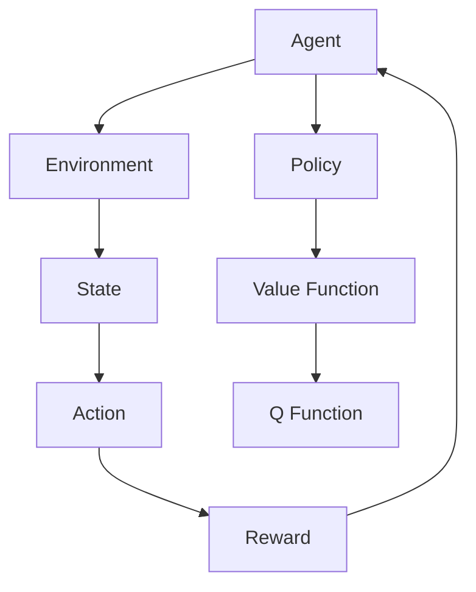

                 

## 文章标题

《强化学习在多智能体协作任务中的策略演化》

### 关键词：
强化学习、多智能体系统、策略演化、协作任务、算法应用

### 摘要：
本文深入探讨了强化学习在多智能体协作任务中的策略演化机制。首先，介绍了强化学习的基本概念、数学基础和主要算法，以及其在实际应用中的表现。接着，阐述了多智能体系统的基本概念、分类、通信机制和协作任务，探讨了策略演化机制和多智能体协作任务中的关键技术和挑战。随后，通过具体案例展示了策略演化在多智能体协作任务中的应用，分析了策略设计的优化流程、稳定性和鲁棒性。最后，展望了强化学习在多智能体协作任务中的未来发展前景，探讨了面临的挑战和伦理道德问题，提出了研究方向和未来工作计划。

## 《强化学习在多智能体协作任务中的策略演化》目录大纲

### 第一部分：强化学习基础与多智能体系统概述

#### 第1章：强化学习基础
- **1.1 强化学习的基本概念**
  - 强化学习定义
  - 与监督学习、无监督学习的关系
  - 强化学习的主要概念（Agent、Environment、State、Action、Reward、Policy、Value Function、Q Function）

- **1.2 强化学习的数学基础**
  - 概率论基础（条件概率、贝叶斯定理、马尔可夫链）
  - 马尔可夫决策过程（MDP）定义
  - 状态值函数、策略、最优策略
  - **MDP基本算法伪代码**

- **1.3 强化学习的主要算法**
  - **值函数方法**
    - Q-Learning、SARSA、TD(0)
    - **伪代码**
  - **策略梯度方法**
    - PG、REINFORCE、PPO、A3C
    - **伪代码**
  - **基于模型的算法**
    - DDPG、AC、DQN
    - **伪代码**

- **1.4 强化学习在实际中的应用**
  - 游戏（Atari游戏框架）
  - 自动驾驶（自动驾驶基本流程）
  - 机器人（机器人路径规划）

#### 第2章：多智能体系统概述
- **2.1 多智能体系统的基本概念**
  - 多智能体系统定义
  - 与分布式计算、协同系统的区别
  - 多智能体系统的分类（同质智能体、异质智能体；中央式、分布式式控制）

- **2.2 多智能体系统的分类**
  - 合作型MAS
  - 竞争型MAS
  - 协商型MAS

- **2.3 多智能体系统的通信机制**
  - 直接通信与间接通信
  - 通信协议

- **2.4 多智能体协作任务**
  - 任务模型
  - 应用场景（自动驾驶、无人机编队、机器人协作）
  - 关键技术（通信机制、博弈论、协调控制）

### 第二部分：策略演化机制与多智能体协作任务

#### 第3章：策略演化机制
- **3.1 策略演化的基本原理**
  - 策略演化定义
  - 与遗传算法、进化策略的联系
  - **伪代码**

- **3.2 策略演化算法**
  - GA、ES、PSO、DE等算法的优缺点比较
  - **伪代码**

- **3.3 策略演化在多智能体协作中的应用**
  - 基本框架（策略表示、适应度评估、选择、变异、交叉）
  - 应用案例（多智能体协同搜索、协同决策）

#### 第4章：多智能体协作任务
- **4.1 多智能体协作任务的基本概念**
  - 多智能体协作任务定义
  - 与多人游戏的区别
  - 任务模型（任务分解、任务分配、协同策略）

- **4.2 多智能体协作任务的模型**
  - 状态空间、动作空间、奖励函数
  - 模型优化（强化学习、策略演化、混合方法）

- **4.3 多智能体协作任务的应用场景**
  - 游戏、无人机编队、机器人协作
  - 关键技术（通信机制、博弈论、协调控制）

- **4.4 多智能体协作任务的关键技术**
  - 通信机制、博弈论、协调控制

#### 第5章：策略演化在多智能体协作任务中的应用
- **5.1 基于策略演化的多智能体协作策略设计**
  - 策略设计（策略编码、适应度评估）
  - 策略优化（交叉、变异、选择）
  - 策略稳定性和鲁棒性分析

- **5.2 多智能体协作任务中的策略优化**
  - 优化方法（强化学习、策略演化）
  - 优化流程（数据收集、模型训练、策略评估）

- **5.3 多智能体协作任务中的策略稳定性和鲁棒性分析**
  - 策略稳定性条件
  - 鲁棒性测试方法
  - 鲁棒性增强策略

#### 第6章：案例分析与实现
- **6.1 案例一：多智能体协同搜索**
  - 问题描述
  - 模型建立
  - 策略设计
  - 实现与测试

- **6.2 案例二：多智能体协同决策**
  - 问题描述
  - 模型建立
  - 策略设计
  - 实现与测试

- **6.3 案例三：多智能体协同控制**
  - 问题描述
  - 模型建立
  - 策略设计
  - 实现与测试

### 第三部分：未来展望与挑战

#### 第7章：强化学习在多智能体协作任务中的未来展望
- **7.1 强化学习在多智能体协作中的发展前景**
  - 技术趋势
  - 应用领域

- **7.2 多智能体协作任务中的挑战与解决方案**
  - 挑战分析
  - 解决方案

- **7.3 强化学习在多智能体协作任务中的伦理与道德问题**
  - 伦理问题
  - 解决方案

#### 第8章：结论与展望
- **8.1 本书的主要贡献**
  - 技术贡献
  - 实践贡献

- **8.2 研究方向与未来工作**
  - 研究方向
  - 未来工作

### 附录
#### 附录A：强化学习与多智能体协作任务相关资源
- **开源代码与数据集**
  - 主要开源代码库介绍
  - 数据集下载链接

- **论文推荐**
  - 主要论文推荐
  - 论文下载链接

- **相关工具与库**
  - 主要工具与库介绍
  - 安装和使用指南

### 第1章：强化学习基础

#### 1.1 强化学习的基本概念

强化学习（Reinforcement Learning，RL）是机器学习中的一个重要分支，旨在通过智能体与环境的交互，学习到一种最优的策略，从而实现目标。强化学习与其他机器学习方法的根本区别在于，它强调通过试错（trial-and-error）来逐步优化行为策略。

**定义与联系：**

- **强化学习定义：**
  强化学习是一个过程，其中智能体（agent）在环境（environment）中采取行动（action），根据行动的结果（reward）来调整其行为策略。强化学习的目标是学习一个策略（policy），使得智能体在长期内获得的累积奖励最大化。

- **与监督学习、无监督学习的区别：**
  - **监督学习：** 智能体在给定输入和标签的情况下学习，目标是预测输出。
  - **无监督学习：** 智能体在没有标签的情况下学习，目的是发现数据中的模式。
  - **强化学习：** 智能体通过与环境交互，根据奖励信号来调整策略。

强化学习中的主要概念包括：

- **Agent（智能体）：** 学习并采取行动的实体。
- **Environment（环境）：** 智能体行动的场所，可以看作是一个状态转换概率和奖励函数的集合。
- **State（状态）：** 智能体在环境中所处的特定情景。
- **Action（动作）：** 智能体可以采取的行动。
- **Reward（奖励）：** 智能体在执行某一动作后，从环境中获得的即时奖励，用于评估动作的效果。
- **Policy（策略）：** 智能体在某一状态下采取动作的决策规则。
- **Value Function（值函数）：** 评估状态或状态-动作对的期望奖励。
- **Q Function（Q函数）：** 表示在某一状态下采取某一动作的期望回报。

**Mermaid 流程图：**



**强化学习的基本流程：**

1. **初始化：** 初始化智能体、环境和策略。
2. **观察状态（Observation）：** 智能体观察当前环境状态。
3. **执行动作（Action）：** 智能体根据当前状态和策略执行动作。
4. **接收奖励（Reward）：** 环境根据动作结果给予智能体奖励。
5. **更新策略（Policy）：** 智能体根据接收到的奖励和策略更新行为。
6. **重复循环：** 重复上述步骤，直到达到目标状态或满足停止条件。

#### 1.2 强化学习的数学基础

强化学习依赖于概率论和决策论的基础知识。以下将介绍强化学习所需的概率论基础，以及马尔可夫决策过程（MDP）的定义和基本算法。

**概率论基础：**

- **条件概率（Conditional Probability）：**
  条件概率是指一个事件发生的概率，在另一个事件已经发生的条件下。条件概率的公式为：
  $$ P(A|B) = \frac{P(A \cap B)}{P(B)} $$
  其中，\( P(A|B) \) 是在事件 B 发生的条件下事件 A 发生的概率，\( P(A \cap B) \) 是事件 A 和事件 B 同时发生的概率，\( P(B) \) 是事件 B 发生的概率。

- **贝叶斯定理（Bayes' Theorem）：**
  贝叶斯定理描述了在已知某些条件下，事件发生概率的计算方法。贝叶斯定理的公式为：
  $$ P(A|B) = \frac{P(B|A)P(A)}{P(B)} $$
  其中，\( P(A|B) \) 是在事件 B 发生的条件下事件 A 发生的概率，\( P(B|A) \) 是在事件 A 发生的条件下事件 B 发生的概率，\( P(A) \) 是事件 A 发生的概率，\( P(B) \) 是事件 B 发生的概率。

- **马尔可夫链（Markov Chain）：**
  马尔可夫链是一种随机过程，其下一个状态仅取决于当前状态，与过去的状态无关。马尔可夫链可以用状态转移概率矩阵（State Transition Probability Matrix）来描述，矩阵中的每个元素表示从某一状态转移到另一状态的概率。状态转移概率矩阵通常表示为 \( P \)，其中 \( P_{ij} = P(S_{t+1} = s_j | S_t = s_i) \)。

**马尔可夫决策过程（MDP）定义：**

马尔可夫决策过程是一种描述智能体在不确定环境中做出决策的数学模型。MDP 由以下五个要素组成：

- **状态集（State Set）：** 智能体所处的所有可能状态。
- **动作集（Action Set）：** 智能体可以采取的所有可能动作。
- **状态-动作奖励函数（State-Action Reward Function）：** 描述智能体在某一状态下采取某一动作所获得的即时奖励。
- **状态转移概率函数（State Transition Probability Function）：** 描述智能体在某一状态下采取某一动作后，进入下一状态的概率分布。
- **策略（Policy）：** 智能体在某一状态下的最优动作选择。

**MDP 定义：**

一个马尔可夫决策过程 \( MDP = <S, A, R, P, \pi> \)，其中：

- \( S \) 是状态集。
- \( A \) 是动作集。
- \( R(s, a) \) 是状态-动作奖励函数，表示在状态 \( s \) 下采取动作 \( a \) 所获得的即时奖励。
- \( P(s', s | a) \) 是状态转移概率函数，表示在状态 \( s \) 下采取动作 \( a \) 后进入状态 \( s' \) 的概率。
- \( \pi(a|s) \) 是策略，表示在状态 \( s \) 下采取动作 \( a \) 的概率。

**状态值函数（State Value Function）和策略（Policy）：**

- **状态值函数（V\(_\pi\)(s)）：** 对于策略 \( \pi \) 和状态 \( s \)，状态值函数 \( V\(_\pi\)(s) \) 表示智能体在状态 \( s \) 下按照策略 \( \pi \) 执行行动，并从状态 \( s \) 开始无限期地按照策略 \( \pi \) 行动所能获得的累积奖励的期望值。
- **最优策略（Optimal Policy）：** 对于给定的 MDP，最优策略 \( \pi^* \) 是使得状态值函数 \( V\(_\pi\)(s) \) 最大的策略。即对于所有状态 \( s \)，都有 \( V\(_\pi^*\)(s) \ge V\(_\pi\)(s) \) 对于任意的策略 \( \pi \)。

**MDP基本算法伪代码：**

```python
# 初始化参数
V = 初始化状态值函数
策略 = 初始化策略
epsilon = 初始化探索概率

# 迭代更新
while 未收敛:
    for 状态 s in S:
        # 计算状态-动作值函数
        Q(s, a) = R(s, a) + gamma * 最大 Q(s', a')
        
        # 更新状态值函数
        V(s) = 最大 Q(s, a)
        
        # 更新策略
        策略 = 选择 V(s) 最大的一组动作
        
        # 更新探索概率
        epsilon = 更新探索概率(epsilon)
```

#### 1.3 强化学习的主要算法

强化学习的主要算法可以分为三类：值函数方法、策略梯度方法和基于模型的算法。以下分别介绍这三种算法的基本原理和伪代码。

**值函数方法：**

值函数方法的核心思想是估计状态值函数或状态-动作值函数，从而指导智能体的行动。这种方法包括 Q-Learning、SARSA 和 TD(0) 等算法。

- **Q-Learning：**
  Q-Learning 是一种基于值函数的强化学习算法，通过更新状态-动作值函数来学习最优策略。Q-Learning 的主要步骤如下：

  ```python
  # 初始化参数
  Q = 初始化状态-动作值函数
  ε = 初始化探索概率
  γ = 初始化折扣因子

  # 迭代更新
  while 未收敛:
      s = 环境初始化状态
      a = 根据策略 π(s) 选择动作
      s' = 环境执行动作 a 后的状态
      r = 环境回报
      a' = 根据策略 π(s') 选择动作

      # 更新状态-动作值函数
      Q(s, a) = Q(s, a) + α * (r + γ * Q(s', a') - Q(s, a))
      
      # 更新策略
      π(s) = ε-贪婪策略

      # 更新探索概率
      ε = 更新探索概率(ε)
  ```

- **SARSA：**
  SARSA（Surely Adjusted Reward-Predicted Stochastic Acceptor）是一种基于值函数的强化学习算法，它与 Q-Learning 的区别在于使用当前状态和动作的实际回报来更新状态-动作值函数。

  ```python
  # 初始化参数
  Q = 初始化状态-动作值函数
  ε = 初始化探索概率
  γ = 初始化折扣因子

  # 迭代更新
  while 未收敛:
      s = 环境初始化状态
      a = 根据策略 π(s) 选择动作
      s' = 环境执行动作 a 后的状态
      r = 环境回报
      a' = 根据策略 π(s') 选择动作

      # 更新状态-动作值函数
      Q(s, a) = Q(s, a) + α * (r + γ * Q(s', a') - Q(s, a))
      
      # 更新策略
      π(s) = ε-贪婪策略

      # 更新探索概率
      ε = 更新探索概率(ε)
  ```

- **TD(0)：**
  TD(0)（Temporal Difference Learning）是一种基于值函数的强化学习算法，它使用目标值（Target Value）来更新状态-动作值函数。

  ```python
  # 初始化参数
  Q = 初始化状态-动作值函数
  ε = 初始化探索概率
  γ = 初始化折扣因子

  # 迭代更新
  while 未收敛:
      s = 环境初始化状态
      a = 根据策略 π(s) 选择动作
      s' = 环境执行动作 a 后的状态
      r = 环境回报
      Q(s, a) = Q(s, a) + α * (r - Q(s, a))
      
      # 更新策略
      π(s) = ε-贪婪策略

      # 更新探索概率
      ε = 更新探索概率(ε)
  ```

**策略梯度方法：**

策略梯度方法通过直接优化策略参数来学习最优策略。这种方法包括 PG、REINFORCE、PPO 和 A3C 等。

- **策略梯度（Policy Gradient）：**
  策略梯度方法使用梯度上升法来优化策略参数。

  ```python
  # 初始化参数
  π = 初始化策略参数
  ε = 初始化探索概率
  γ = 初始化折扣因子

  # 迭代更新
  while 未收敛:
      s = 环境初始化状态
      a = 根据策略 π(s) 选择动作
      s' = 环境执行动作 a 后的状态
      r = 环境回报
      advantage = r + γ * 预期回报 - 实际回报

      # 更新策略参数
      π = π + α * gradient(π, advantage)
      
      # 更新策略
      π(s) = ε-贪婪策略

      # 更新探索概率
      ε = 更新探索概率(ε)
  ```

- **REINFORCE：**
  REINFORCE 使用梯度上升法来优化策略参数。

  ```python
  # 初始化参数
  π = 初始化策略参数
  ε = 初始化探索概率
  γ = 初始化折扣因子

  # 迭代更新
  while 未收敛:
      s = 环境初始化状态
      a = 根据策略 π(s) 选择动作
      s' = 环境执行动作 a 后的状态
      r = 环境回报
      gradient = r * gradient(π, s)

      # 更新策略参数
      π = π + α * gradient
      
      # 更新策略
      π(s) = ε-贪婪策略

      # 更新探索概率
      ε = 更新探索概率(ε)
  ```

- **PPO（Proximal Policy Optimization）：**
  PPO 是一种改进的策略梯度方法，它使用剪枝策略来稳定优化过程。

  ```python
  # 初始化参数
  π = 初始化策略参数
  ε = 初始化探索概率
  γ = 初始化折扣因子
  clip = 初始化剪枝参数

  # 迭代更新
  while 未收敛:
      s = 环境初始化状态
      a = 根据策略 π(s) 选择动作
      s' = 环境执行动作 a 后的状态
      r = 环境回报
      advantage = r + γ * 预期回报 - 实际回报

      # 计算旧策略和更新策略的概率
      old_prob = π(s)
      new_prob = π(s)

      # 更新策略参数
      π = π + α * (new_prob - old_prob) * gradient(π, advantage)

      # 剪枝策略
      if |new_prob - old_prob| > clip:
          π = π / |new_prob - old_prob|

      # 更新策略
      π(s) = ε-贪婪策略

      # 更新探索概率
      ε = 更新探索概率(ε)
  ```

- **A3C（Asynchronous Advantage Actor-Critic）：**
  A3C 是一种基于策略梯度的分布式强化学习算法，它同时使用演员（Actor）和评论家（Critic）来优化策略参数。

  ```python
  # 初始化参数
  π = 初始化策略参数
  ε = 初始化探索概率
  γ = 初始化折扣因子
  critic = 初始化评论家参数

  # 迭代更新
  while 未收敛:
      for s in 状态序列:
          a = 根据策略 π(s) 选择动作
          s' = 环境执行动作 a 后的状态
          r = 环境回报
          advantage = r + γ * 预期回报 - 实际回报

          # 更新评论家参数
          critic = critic + α * gradient(critic, advantage)

          # 更新策略参数
          π = π + α * gradient(π, advantage)

          # 更新策略
          π(s) = ε-贪婪策略

      # 更新探索概率
      ε = 更新探索概率(ε)
  ```

**基于模型的算法：**

基于模型的算法通过构建环境模型来预测状态转移概率和奖励，从而优化策略。这种方法包括 DDPG、AC 和 DQN 等。

- **DDPG（Deep Deterministic Policy Gradient）：**
  DDPG 是一种基于深度强化学习的确定性策略优化算法，它使用深度神经网络来近似状态-动作值函数和策略。

  ```python
  # 初始化参数
  Q = 初始化状态-动作值函数网络
  π = 初始化策略网络
  ε = 初始化探索概率
  γ = 初始化折扣因子

  # 迭代更新
  while 未收敛:
      for s in 状态序列:
          a = π(s)
          s' = 环境执行动作 a 后的状态
          r = 环境回报
          Q(s, a) = Q(s, a) + α * (r + γ * Q(s', π(s')) - Q(s, a))

      # 更新策略网络
      π = π + α * gradient(π, Q)

      # 更新探索概率
      ε = 更新探索概率(ε)
  ```

- **AC（Asynchronous Advantage Actor-Critic）：**
  AC 是一种基于深度强化学习的分布式强化学习算法，它与 A3C 类似，但使用了异步更新策略。

  ```python
  # 初始化参数
  Q = 初始化状态-动作值函数网络
  π = 初始化策略网络
  ε = 初始化探索概率
  γ = 初始化折扣因子

  # 迭代更新
  while 未收敛:
      for s in 状态序列:
          a = π(s)
          s' = 环境执行动作 a 后的状态
          r = 环境回报
          Q(s, a) = Q(s, a) + α * (r + γ * Q(s', π(s')) - Q(s, a))

      # 更新策略网络
      π = π + α * gradient(π, Q)

      # 更新探索概率
      ε = 更新探索概率(ε)
  ```

- **DQN（Deep Q-Network）：**
  DQN 是一种基于深度学习的 Q-Learning 算法，它使用深度神经网络来近似状态-动作值函数。

  ```python
  # 初始化参数
  Q = 初始化状态-动作值函数网络
  ε = 初始化探索概率
  γ = 初始化折扣因子

  # 迭代更新
  while 未收敛:
      s = 环境初始化状态
      a = 选择动作 (ε-贪婪策略)
      s' = 环境执行动作 a 后的状态
      r = 环境回报
      Q(s, a) = Q(s, a) + α * (r + γ * 最大 Q(s', a') - Q(s, a))

      # 更新探索概率
      ε = 更新探索概率(ε)
  ```

#### 1.4 强化学习在实际中的应用

强化学习在实际应用中有着广泛的应用，包括游戏、自动驾驶和机器人等领域。

**游戏：**

强化学习在游戏领域有着重要的应用，例如在 Atari 游戏和围棋比赛中取得了显著的成果。在 Atari 游戏中，智能体需要通过不断尝试来学习游戏策略，从而获得高分。以下是强化学习在 Atari 游戏中的应用框架：

1. **环境初始化：** 初始化游戏环境，例如加载游戏画面和音效等。
2. **智能体初始化：** 初始化智能体，包括动作空间、状态空间和奖励函数。
3. **策略训练：** 使用强化学习算法（例如 Q-Learning、DQN 等）训练智能体策略。
4. **评估与测试：** 使用训练好的智能体策略在游戏环境中进行评估和测试，比较不同算法的性能。

**自动驾驶：**

自动驾驶是强化学习在现实世界中的重要应用之一。自动驾驶系统需要通过感知环境、做出决策和执行控制动作，从而实现车辆的自主驾驶。以下是强化学习在自动驾驶中的应用框架：

1. **感知环境：** 使用传感器（如摄像头、激光雷达和雷达）获取周围环境的信息。
2. **状态编码：** 将感知到的环境信息编码为状态表示。
3. **动作生成：** 使用强化学习算法（例如 DDPG、AC 等）生成自动驾驶策略。
4. **执行控制：** 根据生成的策略执行车辆的控制动作。
5. **评估与反馈：** 对自动驾驶系统的性能进行评估，并根据反馈调整策略。

**机器人：**

强化学习在机器人领域也有着广泛的应用，例如机器人的路径规划和协同控制。以下是强化学习在机器人中的应用框架：

1. **初始化机器人：** 初始化机器人系统，包括机器人模型、状态空间和动作空间。
2. **状态编码：** 将机器人的传感器信息编码为状态表示。
3. **策略训练：** 使用强化学习算法（例如 Q-Learning、SARSA 等）训练机器人策略。
4. **执行动作：** 根据训练好的策略执行机器人的动作。
5. **路径规划：** 使用强化学习算法优化机器人的路径规划。
6. **协同控制：** 使用强化学习算法实现多机器人系统的协同控制。

### 第2章：多智能体系统概述

#### 2.1 多智能体系统的基本概念

多智能体系统（Multi-Agent System，MAS）是由多个自主智能体组成的系统，这些智能体相互协作以完成共同的目标。MAS 在复杂系统和分布式系统中具有广泛的应用，如无人驾驶、智能交通、无人机编队等。

**定义与联系：**

- **多智能体系统定义：**
  多智能体系统是一个由多个智能体组成的系统，这些智能体可以通过相互通信和协作来完成共同的任务。

- **与分布式计算、协同系统的区别：**
  - **分布式计算：** 分布式计算是指计算机系统中的多个处理单元通过网络进行计算和信息交换，共同完成计算任务。
  - **协同系统：** 协同系统是指多个个体（不一定都是智能体）通过相互合作来实现共同目标。
  - **多智能体系统：** 多智能体系统是分布式计算和协同系统的一种特殊形式，强调智能体之间的自主性、协作性和适应性。

**多智能体系统的分类：**

多智能体系统可以根据智能体的性质、任务和环境进行分类：

- **同质智能体与异质智能体：**
  - **同质智能体：** 同质智能体具有相同的结构和功能，如机器人群体。
  - **异质智能体：** 异质智能体具有不同的结构和功能，如人类和社会机器人。

- **中央式与分布式式控制：**
  - **中央式控制：** 中央式控制是指所有智能体的控制决策由一个中央控制器集中管理。
  - **分布式式控制：** 分布式式控制是指智能体通过相互通信和协作自主制定控制决策。

**通信机制：**

多智能体系统中的智能体需要通过通信机制进行信息交换和协作：

- **直接通信与间接通信：**
  - **直接通信：** 智能体通过直接通信渠道（如无线网络、传感器）交换信息。
  - **间接通信：** 智能体通过共享信息（如公共数据库、传感器网络）进行信息交换。

- **通信协议：**
  - **同步通信：** 智能体在固定时间间隔内进行通信。
  - **异步通信：** 智能体在任意时间进行通信。
  - **广播通信：** 信息广播到所有智能体。
  - **点对点通信：** 信息直接传递给指定的智能体。

**挑战与机遇：**

多智能体系统面临的挑战包括：

- **系统复杂性：** 智能体数量和交互关系的增加导致系统复杂性增加。
- **不确定性：** 环境的不确定性和智能体行为的随机性增加了系统的不确定性。
- **通信延迟：** 智能体之间的通信延迟可能影响系统的实时性能。

然而，多智能体系统也带来了许多机遇，包括：

- **协同任务执行：** 多智能体系统可以更高效地完成复杂的任务。
- **自适应性和鲁棒性：** 智能体之间的协作可以提高系统的适应性和鲁棒性。
- **分布式计算：** 多智能体系统可以充分利用分布式计算资源，提高计算效率。

#### 2.2 多智能体系统的分类

多智能体系统可以根据智能体的目标、协作方式、环境特性等不同维度进行分类。以下是一些常见的分类方法：

- **合作型MAS（Cooperative MAS）：**
  合作型MAS中的智能体具有共同的目标，通过协作和通信来完成任务。智能体之间通常会共享信息，并通过协商和合作来优化整体性能。

  - **任务分配：** 智能体根据自身能力和任务需求进行任务分配，以实现协同效果。
  - **目标一致性：** 智能体在任务执行过程中保持目标一致，避免冲突和内耗。

- **竞争型MAS（Competitive MAS）：**
  竞争型MAS中的智能体具有相互冲突的目标，通过竞争和对抗来完成任务。智能体之间通常会争夺资源、抢占目标，以实现自身利益最大化。

  - **竞争策略：** 智能体根据环境信息和自身目标，制定相应的竞争策略，以获得竞争优势。
  - **均衡策略：** 智能体之间达到某种平衡状态，避免恶性竞争和资源浪费。

- **协商型MAS（Negotiation-Based MAS）：**
  协商型MAS中的智能体通过协商和谈判来达成共识，以实现共同目标。智能体之间通常会就任务分配、资源分配等问题进行协商，以实现互利共赢。

  - **协商协议：** 智能体之间制定协商协议，明确协商流程、决策规则和协商目标。
  - **协商策略：** 智能体根据协商协议和自身目标，制定相应的协商策略，以实现协商目标。

**合作型MAS的典型应用：**

- **机器人协作：** 机器人群体在执行复杂任务时，如搜索、救援、制造等，通过合作和协调实现高效完成任务。
- **无人驾驶车队：** 无人驾驶车辆在道路上协同行驶，通过合作和通信实现车队安全和效率最大化。
- **智能电网：** 智能电网中的各个分布式能源系统和负载设备通过合作和协调，实现能源的高效分配和优化。

**竞争型MAS的典型应用：**

- **电子商务平台：** 电商平台上的卖家和买家通过竞争和对抗来实现自身利益最大化。
- **智能交通系统：** 智能交通系统中的车辆和行人通过竞争和对抗来争夺道路资源。
- **金融交易系统：** 金融交易系统中的投资者和交易者通过竞争和对抗来获取利润。

**协商型MAS的典型应用：**

- **供应链管理：** 供应链中的各个企业通过协商和谈判来实现供应链的协同优化。
- **多机器人系统：** 多机器人系统在执行共同任务时，通过协商和协调来避免冲突和资源浪费。
- **虚拟组织：** 虚拟组织中的成员通过协商和谈判来达成共同目标，实现组织的高效运作。

#### 2.3 多智能体系统的通信机制

多智能体系统中的通信机制是实现智能体间信息交换和协作的基础。通信机制可以分为直接通信和间接通信，以及同步通信和异步通信。

**直接通信与间接通信：**

- **直接通信：** 直接通信是指智能体通过特定的通信渠道（如无线网络、传感器、通信协议）直接交换信息。直接通信的优点是通信速度快、可靠性高，适用于实时性和安全性要求较高的应用场景。

- **间接通信：** 间接通信是指智能体通过共享信息（如公共数据库、传感器网络、信息共享协议）进行信息交换。间接通信的优点是信息共享方便、灵活性高，适用于复杂度和规模较大的应用场景。

**同步通信与异步通信：**

- **同步通信：** 同步通信是指智能体在固定的时间间隔内进行通信，即通信具有确定性和实时性。同步通信适用于对通信实时性和同步性要求较高的应用场景，如无人驾驶车队、智能电网等。

- **异步通信：** 异步通信是指智能体在任意时间进行通信，即通信具有不确定性和灵活性。异步通信适用于对通信实时性和同步性要求较低的应用场景，如机器人协作、供应链管理等。

**通信协议：**

- **广播通信：** 广播通信是指信息被发送到系统中的所有智能体，即所有智能体都可以接收到相同的信息。广播通信的优点是信息传播速度快，适用于信息共享需求较高的应用场景，如智能交通系统、智能电网等。

- **点对点通信：** 点对点通信是指信息直接传递给指定的智能体，即每个智能体只接收到与其相关的信息。点对点通信的优点是信息传输精准、效率高，适用于对通信实时性和准确性要求较高的应用场景，如无人机编队、机器人协作等。

#### 2.4 多智能体协作任务

多智能体协作任务是指多个智能体相互协作，共同完成特定任务的情境。多智能体协作任务在复杂系统和分布式系统中具有重要意义，如无人驾驶、智能交通、机器人协作等。

**任务模型：**

多智能体协作任务的建模是任务执行的基础。任务模型通常包括以下几个方面：

- **状态空间：** 状态空间是指智能体在执行任务时可能出现的所有状态的集合。状态通常由智能体的位置、速度、方向等参数表示。

- **动作空间：** 动作空间是指智能体在执行任务时可能采取的所有动作的集合。动作通常包括移动、转向、通信等。

- **奖励函数：** 奖励函数用于评价智能体在执行任务时的性能。奖励通常与任务目标相关，如完成任务所需的时间、任务的完成质量等。

**应用场景：**

多智能体协作任务在许多领域都有广泛的应用，以下是一些典型的应用场景：

- **无人驾驶：** 在无人驾驶系统中，多辆汽车需要通过协作和通信，共同规划行驶路径，确保行车安全。

- **智能交通：** 在智能交通系统中，多个智能体（如车辆、行人、交通信号灯）需要相互协作，实现交通流的高效管理和优化。

- **机器人协作：** 在机器人协作任务中，多个机器人需要通过协作和通信，共同完成复杂任务，如搜索、救援、制造等。

- **无人机编队：** 在无人机编队任务中，多个无人机需要通过协作和通信，实现编队飞行、任务分配和协同控制。

**关键技术：**

多智能体协作任务的关键技术包括：

- **通信机制：** 通信机制是实现智能体间信息交换和协作的基础。通信机制需要保证实时性、可靠性和安全性。

- **博弈论：** 博弈论是分析智能体间交互和决策的重要工具。博弈论可以用于分析智能体的利益冲突和协作策略。

- **协调控制：** 协调控制是指智能体在执行任务时，通过协调和合作，实现整体性能的最优化。协调控制需要考虑智能体的动态性和不确定性。

### 第3章：策略演化机制

#### 3.1 策略演化的基本原理

策略演化是一种通过迭代更新策略参数来优化策略的方法。策略演化算法通常基于遗传算法（Genetic Algorithm，GA）、进化策略（Evolutionary Strategy，ES）、粒子群优化（Particle Swarm Optimization，PSO）和差分进化（Differential Evolution，DE）等进化计算方法。

**定义与联系：**

- **策略演化定义：**
  策略演化是指通过迭代更新策略参数，以优化策略参数集的过程。策略演化旨在找到一种最优策略，使得智能体在执行任务时获得最大化的累积奖励。

- **与遗传算法、进化策略的联系：**
  - **遗传算法（GA）：** 遗传算法是一种基于自然进化过程的优化算法，通过选择、交叉和变异等操作来优化目标函数。
  - **进化策略（ES）：** 进化策略是一种基于自然进化过程的优化算法，通过模拟自然选择和遗传机制来优化目标函数。
  - **策略演化：** 策略演化算法是遗传算法和进化策略在强化学习领域的应用，旨在通过迭代更新策略参数来优化策略。

**策略演化算法：**

策略演化算法的基本步骤包括：

1. **初始化：** 初始化策略参数集和适应度函数。
2. **适应度评估：** 对当前策略参数集进行评估，计算适应度值。
3. **选择：** 根据适应度值选择优秀的策略参数集。
4. **交叉：** 对选中的策略参数集进行交叉操作，产生新的策略参数集。
5. **变异：** 对交叉后的策略参数集进行变异操作，增加策略参数集的多样性。
6. **更新：** 根据适应度值和选择规则更新策略参数集。

**伪代码：**

```python
# 初始化参数
策略参数集 = 初始化策略参数集
适应度函数 = 初始化适应度函数
迭代次数 = 初始化迭代次数

# 迭代更新
for i in 1 to 迭代次数:
    # 适应度评估
    适应度值 = 评估适应度函数(策略参数集)
    
    # 选择
    新策略参数集 = 选择策略参数集(适应度值)
    
    # 交叉
    新策略参数集 = 交叉策略参数集(新策略参数集)
    
    # 变异
    新策略参数集 = 变异策略参数集(新策略参数集)
    
    # 更新
    策略参数集 = 新策略参数集
```

**GA算法的优缺点：**

- **优点：**
  - **全局搜索能力：** 遗传算法采用种群进化方式，具有全局搜索能力，能够跳出局部最优。
  - **鲁棒性：** 遗传算法对问题的初始参数设置不敏感，具有较强的鲁棒性。
  - **适应性：** 遗传算法能够适应不同类型的问题，如优化、分类、回归等。

- **缺点：**
  - **计算复杂度高：** 遗传算法需要进行多次适应度评估和交叉变异操作，计算复杂度高。
  - **参数设置复杂：** 遗传算法的参数设置（如交叉率、变异率、种群规模等）对算法性能有较大影响，需要仔细调整。

**ES算法的优缺点：**

- **优点：**
  - **局部搜索能力：** 进化策略采用个体进化方式，具有局部搜索能力，能够快速收敛到最优解。
  - **简单性：** 进化策略的计算过程简单，参数设置相对较少。
  - **稳定性：** 进化策略对问题的初始参数设置较为稳定，不容易陷入局部最优。

- **缺点：**
  - **全局搜索能力较弱：** 进化策略的全局搜索能力较弱，容易陷入局部最优。
  - **适应性较差：** 进化策略对问题的适应性较差，难以适应不同类型的问题。

**PSO算法的优缺点：**

- **优点：**
  - **简单性：** 粒子群优化算法的计算过程简单，易于实现。
  - **全局搜索能力：** 粒子群优化算法采用群体进化方式，具有全局搜索能力，能够快速找到全局最优解。
  - **并行性：** 粒子群优化算法可以在多个处理器上并行执行，提高计算效率。

- **缺点：**
  - **参数敏感性：** 粒子群优化算法对参数设置（如学习因子、惯性权重等）较为敏感，需要仔细调整。
  - **早熟收敛：** 粒子群优化算法容易陷入早熟收敛，需要采用一些策略（如自适应调整、动态权重等）来避免。

**DE算法的优缺点：**

- **优点：**
  - **鲁棒性：** 差分进化算法具有较强的鲁棒性，能够适应不同类型的问题。
  - **简单性：** 差分进化算法的计算过程简单，易于实现。
  - **收敛速度快：** 差分进化算法的收敛速度较快，能够快速找到全局最优解。

- **缺点：**
  - **计算复杂度较高：** 差分进化算法需要进行多次差分操作，计算复杂度较高。
  - **参数敏感性：** 差分进化算法对参数设置（如变异率、交叉率等）较为敏感，需要仔细调整。

#### 3.2 策略演化算法

策略演化算法可以分为基于遗传算法（GA）、基于进化策略（ES）、基于粒子群优化（PSO）和基于差分进化（DE）等。以下分别介绍这几种算法的基本原理和优缺点。

**遗传算法（GA）：**

遗传算法是一种基于自然进化过程的优化算法，通过模拟生物进化中的遗传、交叉和变异等操作来优化目标函数。遗传算法的基本原理如下：

1. **初始化：** 初始化种群，每个个体表示一种策略参数集。
2. **适应度评估：** 对种群中的每个个体进行适应度评估，计算个体的适应度值。
3. **选择：** 根据适应度值选择优秀的个体作为父代。
4. **交叉：** 对父代进行交叉操作，产生新的个体。
5. **变异：** 对交叉后的个体进行变异操作，增加个体的多样性。
6. **更新：** 将新生成的个体加入种群，替换掉适应度较低的个体。

**遗传算法的基本步骤伪代码：**

```python
# 初始化参数
种群规模 = 初始化种群规模
交叉率 = 初始化交叉率
变异率 = 初始化变异率
迭代次数 = 初始化迭代次数

# 初始化种群
种群 = 初始化种群

# 迭代更新
for i in 1 to 迭代次数:
    # 适应度评估
    适应度值 = 评估适应度函数(种群)
    
    # 选择
    父代 = 选择个体(适应度值，种群规模)
    
    # 交叉
    新个体 = 交叉操作(父代)
    
    # 变异
    新个体 = 变异操作(新个体)
    
    # 更新种群
    种群 = 新个体
```

**遗传算法的优缺点：**

- **优点：**
  - **全局搜索能力：** 遗传算法采用种群进化方式，具有全局搜索能力，能够跳出局部最优。
  - **鲁棒性：** 遗传算法对问题的初始参数设置不敏感，具有较强的鲁棒性。
  - **适应性：** 遗传算法能够适应不同类型的问题，如优化、分类、回归等。

- **缺点：**
  - **计算复杂度高：** 遗传算法需要进行多次适应度评估和交叉变异操作，计算复杂度高。
  - **参数设置复杂：** 遗传算法的参数设置（如交叉率、变异率、种群规模等）对算法性能有较大影响，需要仔细调整。

**进化策略（ES）：**

进化策略是一种基于自然进化过程的优化算法，通过模拟自然选择和遗传机制来优化目标函数。进化策略的基本原理如下：

1. **初始化：** 初始化个体，每个个体表示一种策略参数集。
2. **适应度评估：** 对个体进行适应度评估，计算个体的适应度值。
3. **选择：** 根据适应度值选择优秀的个体作为父代。
4. **交叉：** 对父代进行交叉操作，产生新的个体。
5. **变异：** 对交叉后的个体进行变异操作，增加个体的多样性。
6. **更新：** 将新生成的个体加入种群，替换掉适应度较低的个体。

**进化策略的基本步骤伪代码：**

```python
# 初始化参数
个体规模 = 初始化个体规模
交叉率 = 初始化交叉率
变异率 = 初始化变异率
迭代次数 = 初始化迭代次数

# 初始化个体
个体 = 初始化个体

# 迭代更新
for i in 1 to 迭代次数:
    # 适应度评估
    适应度值 = 评估适应度函数(个体)
    
    # 选择
    父代 = 选择个体(适应度值，个体规模)
    
    # 交叉
    新个体 = 交叉操作(父代)
    
    # 变异
    新个体 = 变异操作(新个体)
    
    # 更新种群
    个体 = 新个体
```

**进化策略的优缺点：**

- **优点：**
  - **局部搜索能力：** 进化策略采用个体进化方式，具有局部搜索能力，能够快速收敛到最优解。
  - **简单性：** 进化策略的计算过程简单，参数设置相对较少。
  - **稳定性：** 进化策略对问题的初始参数设置较为稳定，不容易陷入局部最优。

- **缺点：**
  - **全局搜索能力较弱：** 进化策略的全局搜索能力较弱，容易陷入局部最优。
  - **适应性较差：** 进化策略对问题的适应性较差，难以适应不同类型的问题。

**粒子群优化（PSO）：**

粒子群优化是一种基于群体智能的优化算法，通过模拟鸟群觅食行为来优化目标函数。粒子群优化算法的基本原理如下：

1. **初始化：** 初始化粒子群，每个粒子表示一种策略参数集。
2. **适应度评估：** 对粒子群中的每个粒子进行适应度评估，计算个体的适应度值。
3. **更新速度和位置：** 根据个体的适应度值和群体最优解更新粒子的速度和位置。
4. **迭代更新：** 重复迭代，直到满足停止条件。

**粒子群优化的基本步骤伪代码：**

```python
# 初始化参数
粒子数量 = 初始化粒子数量
最大迭代次数 = 初始化最大迭代次数
学习因子1 = 初始化学习因子1
学习因子2 = 初始化学习因子2

# 初始化粒子群
粒子群 = 初始化粒子群

# 迭代更新
for i in 1 to 最大迭代次数:
    # 适应度评估
    适应度值 = 评估适应度函数(粒子群)
    
    # 更新速度和位置
    粒子群 = 更新速度和位置(粒子群，适应度值)
    
    # 更新群体最优解
    群体最优解 = 更新群体最优解(粒子群，适应度值)
```

**粒子群优化的优缺点：**

- **优点：**
  - **简单性：** 粒子群优化算法的计算过程简单，易于实现。
  - **全局搜索能力：** 粒子群优化算法采用群体进化方式，具有全局搜索能力，能够快速找到全局最优解。
  - **并行性：** 粒子群优化算法可以在多个处理器上并行执行，提高计算效率。

- **缺点：**
  - **参数敏感性：** 粒子群优化算法对参数设置（如学习因子、惯性权重等）较为敏感，需要仔细调整。
  - **早熟收敛：** 粒子群优化算法容易陷入早熟收敛，需要采用一些策略（如自适应调整、动态权重等）来避免。

**差分进化（DE）：**

差分进化是一种基于群体智能的优化算法，通过模拟种群中的个体差异来优化目标函数。差分进化算法的基本原理如下：

1. **初始化：** 初始化种群，每个个体表示一种策略参数集。
2. **适应度评估：** 对种群中的每个个体进行适应度评估，计算个体的适应度值。
3. **选择和交叉：** 根据适应度值和交叉概率选择个体进行交叉操作。
4. **变异：** 对交叉后的个体进行变异操作，增加个体的多样性。
5. **更新：** 将新生成的个体加入种群，替换掉适应度较低的个体。

**差分进化的基本步骤伪代码：**

```python
# 初始化参数
种群规模 = 初始化种群规模
交叉率 = 初始化交叉率
变异率 = 初始化变异率
迭代次数 = 初始化迭代次数

# 初始化种群
种群 = 初始化种群

# 迭代更新
for i in 1 to 迭代次数:
    # 适应度评估
    适应度值 = 评估适应度函数(种群)
    
    # 选择和交叉
    新种群 = 选择和交叉操作(种群)
    
    # 变异
    新种群 = 变异操作(新种群)
    
    # 更新种群
    种群 = 新种群
```

**差分进化的优缺点：**

- **优点：**
  - **鲁棒性：** 差分进化算法具有较强的鲁棒性，能够适应不同类型的问题。
  - **简单性：** 差分进化算法的计算过程简单，易于实现。
  - **收敛速度快：** 差分进化算法的收敛速度较快，能够快速找到全局最优解。

- **缺点：**
  - **计算复杂度较高：** 差分进化算法需要进行多次差分操作，计算复杂度较高。
  - **参数敏感性：** 差分进化算法对参数设置（如变异率、交叉率等）较为敏感，需要仔细调整。

#### 3.3 策略演化在多智能体协作中的应用

策略演化算法在多智能体协作任务中具有重要的应用价值。通过策略演化，智能体可以不断优化自身的策略，实现协作效率和任务完成度的提高。以下介绍策略演化在多智能体协作中的应用。

**基本框架：**

策略演化在多智能体协作中的基本框架包括以下几个步骤：

1. **策略编码：** 将智能体的策略参数编码为二进制或实数向量，以便进行遗传操作。
2. **适应度评估：** 根据智能体的策略参数，评估其在特定任务中的表现，计算适应度值。
3. **选择：** 根据适应度值选择优秀的策略参数集，进行交叉和变异操作。
4. **交叉：** 对选中的策略参数集进行交叉操作，产生新的策略参数集。
5. **变异：** 对交叉后的策略参数集进行变异操作，增加策略参数集的多样性。
6. **更新：** 将新生成的策略参数集替换掉适应度较低的策略参数集。

**应用案例：**

策略演化在多智能体协作任务中的应用广泛，以下介绍两个典型案例：

1. **多智能体协同搜索：**
   在多智能体协同搜索任务中，多个智能体需要相互协作，共同搜索目标区域。通过策略演化，智能体可以不断优化搜索策略，提高搜索效率。

   - **策略编码：** 将智能体的策略参数编码为实数向量，包括搜索速度、搜索方向等。
   - **适应度评估：** 根据智能体的搜索结果，计算适应度值，适应度值与搜索距离和搜索时间相关。
   - **选择：** 根据适应度值选择优秀的策略参数集。
   - **交叉：** 对选中的策略参数集进行交叉操作，产生新的策略参数集。
   - **变异：** 对交叉后的策略参数集进行变异操作，增加策略参数集的多样性。
   - **更新：** 将新生成的策略参数集替换掉适应度较低的策略参数集。

2. **多智能体协同决策：**
   在多智能体协同决策任务中，多个智能体需要共同制定决策，以实现协同目标。通过策略演化，智能体可以不断优化决策策略，提高决策效率。

   - **策略编码：** 将智能体的策略参数编码为实数向量，包括决策权重、决策方向等。
   - **适应度评估：** 根据智能体的决策结果，计算适应度值，适应度值与决策质量相关。
   - **选择：** 根据适应度值选择优秀的策略参数集。
   - **交叉：** 对选中的策略参数集进行交叉操作，产生新的策略参数集。
   - **变异：** 对交叉后的策略参数集进行变异操作，增加策略参数集的多样性。
   - **更新：** 将新生成的策略参数集替换掉适应度较低的策略参数集。

### 第4章：多智能体协作任务

#### 4.1 多智能体协作任务的基本概念

多智能体协作任务是指由多个智能体共同参与并相互协作以完成特定任务的情境。在这种任务中，智能体之间需要通过通信、协调和合作来实现共同的目标。多智能体协作任务在复杂系统和分布式系统中具有广泛的应用，如无人驾驶、智能交通、机器人协作等。

**定义与联系：**

- **多智能体协作任务定义：**
  多智能体协作任务是指由多个智能体共同参与，通过相互通信、协调和合作来完成特定任务的情境。

- **与多人游戏的区别：**
  - **多人游戏：** 多人游戏是指多个玩家在虚拟环境中进行交互和竞争，目标是赢得游戏。
  - **多智能体协作任务：** 多智能体协作任务是指多个智能体在现实世界中或模拟环境中进行交互和协作，目标是共同完成特定任务。

- **主要概念：**
  - **智能体：** 智能体是指具有自主性、感知能力和行动能力的实体，可以是机器人、无人驾驶车辆、虚拟智能体等。
  - **任务：** 任务是指智能体需要共同完成的特定目标，如搜索、救援、路径规划等。
  - **通信：** 通信是指智能体之间通过交换信息来实现协调和合作。
  - **协调：** 协调是指智能体之间通过相互合作，共同完成任务的过程。
  - **合作：** 合作是指智能体之间通过相互协调，共同实现任务目标的行为。

**任务模型：**

多智能体协作任务的任务模型通常包括以下方面：

- **状态空间：** 状态空间是指智能体在执行任务时可能出现的所有状态的集合。状态通常由智能体的位置、速度、方向等参数表示。

- **动作空间：** 动作空间是指智能体在执行任务时可能采取的所有动作的集合。动作通常包括移动、转向、通信等。

- **奖励函数：** 奖励函数用于评价智能体在执行任务时的表现。奖励函数通常与任务目标相关，如完成任务所需的时间、任务的完成质量等。

- **策略：** 策略是指智能体在执行任务时采取的行动规则。策略可以基于学习算法（如强化学习、遗传算法等）或预先定义的规则。

**协作机制：**

多智能体协作任务的协作机制是实现智能体间协调和合作的关键。常见的协作机制包括：

- **基于通信的协作：** 基于通信的协作是指智能体通过交换信息来实现协调和合作。通信机制可以包括直接通信（如无线网络、传感器）和间接通信（如公共数据库、传感器网络）。

- **基于博弈的协作：** 基于博弈的协作是指智能体通过模拟博弈过程来实现协调和合作。博弈论可以用于分析智能体之间的利益冲突和协作策略。

- **基于优化的协作：** 基于优化的协作是指智能体通过优化目标函数来实现协调和合作。优化算法（如遗传算法、粒子群优化等）可以用于优化协作策略。

**应用场景：**

多智能体协作任务在许多领域都有广泛的应用，以下是一些典型的应用场景：

- **无人驾驶：** 在无人驾驶领域中，多辆无人驾驶车辆需要通过协作和通信来实现安全、高效的行驶。

- **智能交通：** 在智能交通领域中，多个智能体（如车辆、行人、交通信号灯）需要通过协作和通信来实现交通流的高效管理和优化。

- **机器人协作：** 在机器人协作领域中，多个机器人需要通过协作和通信来实现复杂的任务，如搜索、救援、制造等。

- **无人机编队：** 在无人机编队领域中，多个无人机需要通过协作和通信来实现编队飞行、任务分配和协同控制。

#### 4.2 多智能体协作任务的模型

多智能体协作任务的模型是描述智能体在执行任务时状态、动作和奖励的基础。建立合适的模型对于设计智能体的策略和优化协作过程至关重要。以下介绍多智能体协作任务的模型建立方法和关键要素。

**模型建立方法：**

多智能体协作任务的模型建立通常包括以下步骤：

1. **定义状态空间：** 状态空间是智能体在执行任务时可能出现的所有状态的集合。状态通常由智能体的位置、速度、方向等参数表示。定义状态空间需要考虑任务的复杂性和不确定性。

2. **定义动作空间：** 动作空间是智能体在执行任务时可能采取的所有动作的集合。动作通常包括移动、转向、通信等。定义动作空间需要考虑任务的具体需求和智能体的能力。

3. **定义奖励函数：** 奖励函数用于评价智能体在执行任务时的表现。奖励函数通常与任务目标相关，如完成任务所需的时间、任务的完成质量等。定义奖励函数需要考虑任务的目标和评估指标。

4. **定义策略：** 策略是智能体在执行任务时采取的行动规则。策略可以基于学习算法（如强化学习、遗传算法等）或预先定义的规则。定义策略需要考虑任务的特点和智能体的学习能力。

**关键要素：**

多智能体协作任务的模型建立需要考虑以下几个关键要素：

1. **状态空间：** 状态空间的大小直接影响模型的复杂性和计算效率。状态空间应包括所有可能影响任务执行的状态变量，如位置、速度、方向、负载等。

2. **动作空间：** 动作空间的大小直接影响智能体的行动自由度。动作空间应包括所有可能的动作，如前进、后退、转向、停止等。

3. **奖励函数：** 奖励函数的设计应考虑任务的目标和评估指标。奖励函数应能准确地评价智能体的表现，如完成任务所需的时间、任务的完成质量等。

4. **策略：** 策略的设计应考虑任务的特点和智能体的学习能力。策略应能指导智能体在执行任务时采取最优的行动。

**模型优化方法：**

多智能体协作任务的模型优化是提高任务执行效率和鲁棒性的关键。以下介绍几种常用的模型优化方法：

1. **强化学习：** 强化学习是一种基于试错的学习方法，智能体通过与环境交互来学习最优策略。强化学习可以用于优化智能体的动作选择和协作策略。

2. **遗传算法：** 遗传算法是一种基于自然进化过程的优化方法，通过交叉、变异等操作来优化策略参数。遗传算法可以用于优化多智能体的协作策略。

3. **粒子群优化：** 粒子群优化是一种基于群体智能的优化方法，通过模拟鸟群觅食行为来优化目标函数。粒子群优化可以用于优化多智能体的协作策略。

4. **混合方法：** 混合方法结合了强化学习、遗传算法、粒子群优化等方法，通过多层次的优化过程来提高任务执行效率和鲁棒性。

#### 4.3 多智能体协作任务的应用场景

多智能体协作任务在现实世界和虚拟环境中具有广泛的应用。以下介绍几种典型的应用场景，并分析其中涉及的关键技术和挑战。

**游戏：**

多智能体协作任务在多人游戏中具有广泛的应用，如多人在线游戏（MOG）和多人实时策略游戏（RTS）。在多人游戏中，多个智能体（玩家或NPC）需要相互协作，共同完成游戏目标。

- **关键技术和挑战：**
  - **通信机制：** 游戏中的智能体需要通过实时通信来交换信息和协调行动。通信机制需要保证实时性和可靠性。
  - **策略设计：** 游戏中的智能体需要制定合理的策略，以适应不同的情况和对手的行为。策略设计需要考虑对手的行为模式、游戏规则和资源分配。
  - **协同控制：** 游戏中的智能体需要协同控制，以实现整体战斗力的最大化。协同控制需要考虑智能体的能力差异和任务分配。

**无人驾驶：**

无人驾驶是自动驾驶领域的一个重要研究方向，多智能体协作任务在无人驾驶中具有重要意义。在无人驾驶中，多个无人驾驶车辆需要相互协作，共同完成行驶任务。

- **关键技术和挑战：**
  - **路径规划：** 无人驾驶车辆需要通过协同路径规划，避免碰撞和交通拥堵。路径规划需要考虑车辆的速度、方向和目标。
  - **通信机制：** 无人驾驶车辆需要通过实时通信来交换位置信息和状态。通信机制需要保证通信的实时性和可靠性。
  - **决策控制：** 无人驾驶车辆需要协同控制，以实现安全、高效的行驶。决策控制需要考虑车辆的安全距离、速度控制和障碍物避让。

**无人机编队：**

无人机编队在军事和民用领域具有广泛的应用，如侦察、监控和搜救。在无人机编队中，多个无人机需要相互协作，实现编队飞行和协同任务。

- **关键技术和挑战：**
  - **编队控制：** 无人机编队需要通过协同控制，实现稳定的编队飞行。编队控制需要考虑无人机的飞行轨迹、速度和方向。
  - **通信机制：** 无人机编队需要通过实时通信来交换位置信息和指令。通信机制需要保证通信的实时性和可靠性。
  - **任务分配：** 无人机编队需要通过协同决策，分配任务给不同的无人机。任务分配需要考虑无人机的负载能力、任务优先级和任务目标。

**机器人协作：**

机器人协作在工业制造、医疗护理和搜救等领域具有广泛的应用。在机器人协作中，多个机器人需要相互协作，共同完成复杂的任务。

- **关键技术和挑战：**
  - **任务规划：** 机器人协作需要通过协同规划，分配任务给不同的机器人。任务规划需要考虑机器人的能力、任务目标和资源分配。
  - **通信机制：** 机器人协作需要通过实时通信来交换任务信息和状态。通信机制需要保证通信的实时性和可靠性。
  - **协同控制：** 机器人协作需要通过协同控制，实现机器人的协同操作。协同控制需要考虑机器人的运动轨迹、速度和方向。

#### 4.4 多智能体协作任务的关键技术

多智能体协作任务的关键技术是实现智能体间协调和合作的基础。以下介绍多智能体协作任务中涉及的关键技术，包括通信机制、博弈论和协调控制。

**通信机制：**

通信机制是多智能体协作任务中实现智能体间信息交换和协作的关键。通信机制可以分为直接通信和间接通信，以及同步通信和异步通信。

- **直接通信：**
  直接通信是指智能体通过特定的通信渠道（如无线网络、传感器、通信协议）直接交换信息。直接通信的优点是通信速度快、可靠性高，适用于实时性和安全性要求较高的应用场景。

- **间接通信：**
  间接通信是指智能体通过共享信息（如公共数据库、传感器网络、信息共享协议）进行信息交换。间接通信的优点是信息共享方便、灵活性高，适用于复杂度和规模较大的应用场景。

- **同步通信：**
  同步通信是指智能体在固定的时间间隔内进行通信，即通信具有确定性和实时性。同步通信适用于对通信实时性和同步性要求较高的应用场景，如无人驾驶车队、智能电网等。

- **异步通信：**
  异步通信是指智能体在任意时间进行通信，即通信具有不确定性和灵活性。异步通信适用于对通信实时性和同步性要求较低的应用场景，如机器人协作、供应链管理等。

**博弈论：**

博弈论是多智能体协作任务中分析智能体间交互和决策的重要工具。博弈论可以用于分析智能体之间的利益冲突和协作策略。

- **博弈模型：**
  博弈模型描述了智能体之间的交互和决策过程。博弈模型包括博弈方、策略集、收益函数等要素。

- **纳什均衡：**
  纳什均衡是指博弈中的一种稳定状态，其中每个智能体都选择了最优策略，并且没有其他智能体可以单方面改变策略来获得更好的收益。

- **合作博弈：**
  合作博弈是指多个智能体共同合作，通过协商和谈判来达成共同目标。合作博弈可以用于优化多智能体协作任务中的任务分配和资源分配。

**协调控制：**

协调控制是多智能体协作任务中实现智能体间协同操作的关键。协调控制可以分为分布式协调控制和集中式协调控制。

- **分布式协调控制：**
  分布式协调控制是指智能体通过相互通信和协作，自主制定控制决策。分布式协调控制具有灵活性和鲁棒性，适用于动态变化和复杂环境。

- **集中式协调控制：**
  集中式协调控制是指所有智能体的控制决策由一个中央控制器集中管理。集中式协调控制具有决策效率和全局视角，但容易受到通信延迟和计算能力限制。

### 第5章：策略演化在多智能体协作任务中的应用

#### 5.1 基于策略演化的多智能体协作策略设计

策略演化算法在多智能体协作任务中的应用具有显著优势，通过不断优化智能体的策略，可以提升协作效率和任务完成度。在本节中，我们将探讨基于策略演化的多智能体协作策略设计方法。

**策略设计步骤：**

1. **策略编码：** 将智能体的策略参数编码为二进制或实数向量，以便进行遗传操作。策略参数可以包括行动概率、行动权重等。

2. **适应度评估：** 设计适应度评估函数，用于评估智能体策略在特定任务环境中的表现。适应度评估通常与任务完成度、协作效率等指标相关。

3. **选择操作：** 根据适应度评估结果选择优秀的策略参数集，用于后续的交叉和变异操作。

4. **交叉操作：** 对选中的策略参数集进行交叉操作，生成新的策略参数集。交叉操作可以模拟基因重组，增加策略的多样性。

5. **变异操作：** 对交叉后的策略参数集进行变异操作，引入新的策略模式。变异操作可以模拟基因突变，提高策略的适应能力。

6. **更新策略：** 将新生成的策略参数集替换掉适应度较低的策略参数集，实现策略的迭代更新。

**适应度评估函数：**

适应度评估函数是策略演化算法的核心组成部分，用于评价智能体策略在特定任务环境中的适应度。适应度评估函数通常与任务目标密切相关，以下是一个简单的适应度评估函数示例：

$$
fitness = \frac{1}{1 + \exp{(-\sum reward \times weight)}}
$$

其中，reward 是智能体在任务环境中获得的奖励，weight 是奖励的权重，fitness 值越接近 1 表示策略越优秀。

**选择操作：**

选择操作是策略演化算法中的一个关键步骤，用于选择优秀的策略参数集进行交叉和变异操作。常见的选择操作包括轮盘赌选择、锦标赛选择和排名选择等。

- **轮盘赌选择：** 根据每个策略参数集的适应度值，计算其在轮盘赌中占据的比例，选择概率更高的策略参数集。

- **锦标赛选择：** 从种群中随机选择多个策略参数集进行比较，选择适应度值最高的策略参数集。

- **排名选择：** 根据策略参数集的适应度值进行排名，选择排名靠前的策略参数集。

**交叉操作：**

交叉操作是策略演化算法中的一个重要步骤，用于生成新的策略参数集。交叉操作可以模拟基因重组，增加策略的多样性。常见的交叉操作包括单点交叉、多点交叉和均匀交叉等。

- **单点交叉：** 在策略参数集中选择一个交叉点，将交叉点之后的参数进行交换。

- **多点交叉：** 在策略参数集中选择多个交叉点，将交叉点之间的参数进行交换。

- **均匀交叉：** 随机选择策略参数集中的每个参数进行交叉，每个参数都有交叉的可能性。

**变异操作：**

变异操作是策略演化算法中的一个关键步骤，用于引入新的策略模式，提高策略的适应能力。变异操作可以模拟基因突变，常见的方法包括随机变异、位翻转变异和梯度变异等。

- **随机变异：** 随机选择策略参数集中的某个参数进行变异，将其取相反数或随机选择新的值。

- **位翻转变异：** 随机选择策略参数集中的某个二进制位进行翻转，将其从 0 变为 1 或从 1 变为 0。

- **梯度变异：** 根据策略参数的梯度信息进行变异，将参数增加或减少一个小的增量。

**更新策略：**

更新策略是策略演化算法中的最后一个步骤，用于将新生成的策略参数集替换掉适应度较低的策略参数集，实现策略的迭代更新。更新策略可以采用贪心策略，选择适应度值最高的策略参数集，也可以采用迭代优化策略，逐步提高策略的适应度。

**稳定性和鲁棒性分析：**

在多智能体协作任务中，策略的稳定性和鲁棒性是确保任务成功完成的关键。以下是对策略稳定性和鲁棒性的分析：

- **稳定性分析：**
  策略的稳定性是指智能体在面临不同环境变化时，能够保持策略参数的稳定性。稳定性分析可以采用以下方法：
  - **静态稳定性分析：** 在静态环境中测试策略的稳定性，观察策略参数的变化情况。
  - **动态稳定性分析：** 在动态环境中测试策略的稳定性，观察策略参数在环境变化下的响应。

- **鲁棒性分析：**
  策略的鲁棒性是指智能体在面对噪声和不确定性时，能够保持策略的有效性。鲁棒性分析可以采用以下方法：
  - **噪声测试：** 在策略执行过程中引入噪声，测试策略的鲁棒性。
  - **不确定性测试：** 在策略执行过程中模拟环境不确定性，测试策略的鲁棒性。

通过稳定性和鲁棒性分析，可以评估策略在实际应用中的可行性和可靠性，为策略优化提供指导。

#### 5.2 多智能体协作任务中的策略优化

策略优化是多智能体协作任务中提高任务完成度和协作效率的关键步骤。策略优化方法可以分为基于强化学习的方法和基于策略演化算法的方法。以下分别介绍这两种方法的基本原理和应用。

**基于强化学习的方法：**

强化学习（Reinforcement Learning，RL）是一种通过试错学习来优化策略的方法，适用于动态和复杂环境。强化学习的基本原理是智能体通过与环境交互，根据奖励信号来调整策略，以实现长期回报最大化。

- **Q-Learning：**
  Q-Learning 是一种基于值函数的强化学习算法，通过更新状态-动作值函数（Q值）来学习最优策略。Q-Learning 的核心思想是：
  $$
  Q(s, a) = Q(s, a) + \alpha [r + \gamma \max_{a'} Q(s', a') - Q(s, a)]
  $$
  其中，$ s $ 是状态，$ a $ 是动作，$ r $ 是即时奖励，$ \gamma $ 是折扣因子，$ \alpha $ 是学习率。

- **SARSA：**
  SARSA 是一种基于策略的强化学习算法，使用当前状态和动作的实际回报来更新状态-动作值函数。SARSA 的核心思想是：
  $$
  Q(s, a) = Q(s, a) + \alpha [r + \gamma Q(s', a') - Q(s, a)]
  $$

- **策略梯度方法：**
  策略梯度方法是一种直接优化策略参数的强化学习算法，通过梯度上升法来更新策略参数。策略梯度方法的核心思想是：
  $$
  \nabla_\theta J(\theta) = \nabla_\theta \sum_{t=0}^T r_t
  $$
  其中，$ \theta $ 是策略参数，$ J(\theta) $ 是策略的回报函数。

- **深度强化学习：**
  深度强化学习（Deep Reinforcement Learning，DRL）是强化学习与深度学习相结合的方法，通过深度神经网络来近似值函数或策略函数。深度强化学习的核心思想是：
  $$
  Q(s, a) = f_\theta(s, a)
  $$
  其中，$ f_\theta(s, a) $ 是深度神经网络函数，$ \theta $ 是神经网络参数。

**基于策略演化算法的方法：**

策略演化算法（Policy Evolution Algorithms）是一类基于进化计算的方法，通过模拟自然进化过程来优化策略参数。常见的策略演化算法包括遗传算法（GA）、进化策略（ES）、粒子群优化（PSO）和差分进化（DE）等。

- **遗传算法（GA）：**
  遗传算法是一种基于种群进化的优化算法，通过选择、交叉和变异等操作来优化目标函数。遗传算法的核心思想是：
  $$
  \text{适应度} \propto \text{生存概率} \propto \text{选择概率}
  $$
  其中，适应度用于评估个体的优劣，选择概率与适应度成正比。

- **进化策略（ES）：**
  进化策略是一种基于个体进化的优化算法，通过模拟自然选择和遗传机制来优化目标函数。进化策略的核心思想是：
  $$
  \theta_{t+1} = \theta_t + \alpha \nabla f(\theta_t)
  $$
  其中，$ \theta_t $ 是当前个体，$ \alpha $ 是学习率，$ \nabla f(\theta_t) $ 是目标函数的梯度。

- **粒子群优化（PSO）：**
  粒子群优化是一种基于群体智能的优化算法，通过模拟鸟群觅食行为来优化目标函数。粒子群优化的核心思想是：
  $$
  v_{i}^{t+1} = w v_i^t + c_1 r_1 (p_i - x_i) + c_2 r_2 (g - x_i)
  $$
  $$
  x_{i}^{t+1} = x_i^t + v_{i}^{t+1}
  $$
  其中，$ v_i^t $ 是粒子的速度，$ x_i^t $ 是粒子的位置，$ p_i $ 是粒子的历史最佳位置，$ g $ 是全局最佳位置，$ c_1 $ 和 $ c_2 $ 是学习因子，$ r_1 $ 和 $ r_2 $ 是随机数。

- **差分进化（DE）：**
  差分进化是一种基于个体差异的优化算法，通过模拟种群中的个体差异来优化目标函数。差分进化的核心思想是：
  $$
  \theta_{i}^{t+1} = \theta_{i}^{t} + F \cdot (\theta_{r_1}^{t} - \theta_{r_2}^{t})
  $$
  其中，$ \theta_{i}^{t} $ 是第 $ i $ 个个体在 $ t $ 时刻的位置，$ F $ 是变异因子，$ r_1 $ 和 $ r_2 $ 是随机选取的两个不同的个体。

**优化流程：**

多智能体协作任务中的策略优化通常包括以下步骤：

1. **初始化：** 初始化智能体种群、策略参数和适应度函数。

2. **适应度评估：** 对智能体种群中的每个个体进行适应度评估，计算个体的适应度值。

3. **选择操作：** 根据适应度值选择优秀的个体，用于后续的交叉和变异操作。

4. **交叉操作：** 对选中的个体进行交叉操作，生成新的个体。

5. **变异操作：** 对交叉后的个体进行变异操作，增加个体的多样性。

6. **更新策略：** 将新生成的个体加入种群，替换掉适应度较低的个体。

7. **迭代更新：** 重复迭代过程，直到满足停止条件。

**优化方法比较：**

基于强化学习和策略演化算法的策略优化方法各有优缺点，以下进行比较：

- **强化学习：**
  - **优点：** 算法简单，适用于动态和复杂环境，能够自动发现状态和动作之间的关联。
  - **缺点：** 可能需要大量样本和较长的训练时间，对环境建模和奖励设计要求较高。

- **策略演化算法：**
  - **优点：** 算法复杂度较低，适用于大规模和复杂问题，具有较强的鲁棒性和适应性。
  - **缺点：** 需要合适的编码和适应度评估函数，优化过程可能较慢。

在实际应用中，可以根据具体任务需求和环境特点选择合适的策略优化方法。

#### 5.3 多智能体协作任务中的策略稳定性和鲁棒性分析

策略稳定性和鲁棒性是多智能体协作任务中确保任务成功完成的关键因素。稳定性和鲁棒性分析有助于评估策略在不同环境和条件下的性能，并提供改进策略的方法。

**稳定性分析：**

策略稳定性是指智能体在面对不同环境变化时，能够保持策略参数的稳定。稳定性分析可以从以下几个方面进行：

1. **静态稳定性分析：** 在静态环境中测试策略的稳定性，观察策略参数的变化情况。可以通过固定环境参数，运行策略多次，记录策略参数的均值和方差。

2. **动态稳定性分析：** 在动态环境中测试策略的稳定性，观察策略参数在环境变化下的响应。可以通过改变环境参数（如速度、负载等），运行策略，并记录策略参数的响应。

**鲁棒性分析：**

策略鲁棒性是指智能体在面对噪声和不确定性时，能够保持策略的有效性。鲁棒性分析可以从以下几个方面进行：

1. **噪声测试：** 在策略执行过程中引入噪声，测试策略的鲁棒性。可以通过在环境输入中添加随机噪声，观察策略参数的响应。

2. **不确定性测试：** 在策略执行过程中模拟环境不确定性，测试策略的鲁棒性。可以通过改变环境模型，观察策略参数的适应能力。

**鲁棒性增强策略：**

为了提高策略的稳定性和鲁棒性，可以采用以下方法：

1. **自适应调整：** 根据环境变化和策略响应，动态调整策略参数。例如，在噪声测试中，可以根据噪声水平调整策略的权重和阈值。

2. **多样化策略：** 通过交叉和变异操作，生成多个不同的策略，并选择鲁棒性较好的策略。这种方法可以增强策略对不确定性和噪声的适应能力。

3. **增强学习：** 结合增强学习（Reinforcement Learning）和深度学习（Deep Learning）方法，通过不断调整策略参数，提高策略的鲁棒性和稳定性。

4. **鲁棒性测试：** 在策略开发过程中，进行多次鲁棒性测试，识别和修复潜在的鲁棒性问题。可以通过模拟不同的环境和噪声条件，测试策略的响应和性能。

通过稳定性和鲁棒性分析，可以评估策略在不同环境和条件下的性能，并采取相应的改进措施，提高策略的稳定性和鲁棒性，确保任务的成功完成。

### 第6章：案例分析与实现

#### 6.1 案例一：多智能体协同搜索

多智能体协同搜索是强化学习和策略演化在多智能体协作任务中的一个典型应用场景。在该场景中，多个智能体需要相互协作，共同搜索目标区域，以提高搜索效率和成功率。以下将详细介绍多智能体协同搜索的案例。

**问题描述：**

假设在一个二维空间中，存在一个目标区域，需要由多个智能体共同搜索。智能体可以在空间中自由移动，并接收来自其他智能体的搜索信息。每个智能体的目标是找到目标区域，并返回到起点。智能体之间需要通过协作和通信来实现高效搜索。

**模型建立：**

1. **状态空间：** 状态空间包括智能体的位置、速度和方向。状态可以表示为 \( s = (x, y, v_x, v_y, \theta) \)，其中 \( (x, y) \) 是智能体的位置，\( (v_x, v_y) \) 是智能体的速度，\( \theta \) 是智能体的方向。

2. **动作空间：** 动作空间包括智能体可以采取的动作，如移动、转向等。动作可以表示为 \( a = (u, \omega) \)，其中 \( u \) 是速度大小，\( \omega \) 是转向角度。

3. **奖励函数：** 奖励函数用于评价智能体在执行任务时的表现。奖励函数可以设计为与目标区域距离成反比的函数，例如 \( r(s, a) = \frac{1}{\|s - s_*\|} \)，其中 \( s_* \) 是目标区域的位置。

**策略设计：**

使用强化学习算法（如 Q-Learning）和策略演化算法（如遗传算法）来设计智能体的策略。

1. **Q-Learning：** 初始化 Q 值函数，通过迭代更新 Q 值，使得智能体能够根据当前状态和动作选择最优动作。更新公式为：
   $$
   Q(s, a) = Q(s, a) + \alpha [r(s, a) + \gamma \max_{a'} Q(s', a') - Q(s, a)]
   $$
   其中，\( \alpha \) 是学习率，\( \gamma \) 是折扣因子。

2. **遗传算法：** 初始化智能体种群，每个智能体代表一种策略。通过适应度评估、选择、交叉和变异等操作来优化种群中的策略。适应度评估函数可以设计为与搜索效率相关的指标，如搜索距离、搜索时间等。

**实现与测试：**

1. **开发环境搭建：** 使用 Python 编写智能体模拟环境，实现状态空间、动作空间和奖励函数。可以使用 Pygame 等图形库绘制智能体和目标区域。

2. **智能体实现：** 编写智能体代码，实现智能体的位置、速度、方向更新以及动作选择。使用强化学习算法和策略演化算法来更新智能体的策略。

3. **测试与评估：** 在模拟环境中运行智能体，记录智能体的搜索距离、搜索时间等指标。通过对比不同策略的搜索性能，评估策略的稳定性和鲁棒性。

#### 6.2 案例二：多智能体协同决策

多智能体协同决策是强化学习和策略演化在多智能体协作任务中的另一个典型应用场景。在该场景中，多个智能体需要相互协作，共同做出决策，以实现协同目标。以下将详细介绍多智能体协同决策的案例。

**问题描述：**

假设在一个不确定的环境中，多个智能体需要共同完成任务。每个智能体拥有不同的信息和能力，需要通过协作和决策来制定最佳行动方案。智能体的目标是最大化整体收益，同时避免冲突和资源浪费。

**模型建立：**

1. **状态空间：** 状态空间包括环境状态和智能体状态。环境状态可以表示为 \( s_e \)，智能体状态可以表示为 \( s_i = (x_i, y_i, v_{xi}, v_{yi}, \theta_i) \)，其中 \( (x_i, y_i) \) 是智能体的位置，\( (v_{xi}, v_{yi}) \) 是智能体的速度，\( \theta_i \) 是智能体的方向。

2. **动作空间：** 动作空间包括智能体可以采取的动作，如移动、停止、转向等。动作可以表示为 \( a_i = (u_i, \omega_i) \)，其中 \( u_i \) 是速度大小，\( \omega_i \) 是转向角度。

3. **奖励函数：** 奖励函数用于评价智能体在执行任务时的表现。奖励函数可以设计为与整体收益相关的指标，如完成任务所需的时间、任务的完成质量等。

**策略设计：**

使用强化学习算法（如 Q-Learning）和策略演化算法（如遗传算法）来设计智能体的策略。

1. **Q-Learning：** 初始化 Q 值函数，通过迭代更新 Q 值，使得智能体能够根据当前状态和动作选择最优动作。更新公式为：
   $$
   Q(s, a) = Q(s, a) + \alpha [r(s, a) + \gamma \max_{a'} Q(s', a') - Q(s, a)]
   $$
   其中，\( \alpha \) 是学习率，\( \gamma \) 是折扣因子。

2. **遗传算法：** 初始化智能体种群，每个智能体代表一种策略。通过适应度评估、选择、交叉和变异等操作来优化种群中的策略。适应度评估函数可以设计为与整体收益相关的指标。

**实现与测试：**

1. **开发环境搭建：** 使用 Python 编写智能体模拟环境，实现状态空间、动作空间和奖励函数。可以使用 Pygame 等图形库绘制智能体和环境。

2. **智能体实现：** 编写智能体代码，实现智能体的位置、速度、方向更新以及动作选择。使用强化学习算法和策略演化算法来更新智能体的策略。

3. **测试与评估：** 在模拟环境中运行智能体，记录智能体的任务完成时间、任务完成质量等指标。通过对比不同策略的协同效果，评估策略的稳定性和鲁棒性。

#### 6.3 案例三：多智能体协同控制

多智能体协同控制是强化学习和策略演化在多智能体协作任务中的另一个重要应用场景。在该场景中，多个智能体需要相互协作，共同控制一个复杂的系统，如无人机编队、机器人协作等。以下将详细介绍多智能体协同控制的案例。

**问题描述：**

假设有一组无人机需要协作完成一个复杂的任务，如目标搜索、环境监测等。每个无人机需要根据自身状态和整体目标，与其他无人机协作，共同完成任务。无人机之间的协作需要通过控制算法来实现。

**模型建立：**

1. **状态空间：** 状态空间包括每个无人机的位置、速度、方向以及环境状态。状态可以表示为 \( s = (x, y, v_x, v_y, \theta, s_e) \)，其中 \( (x, y) \) 是无人机的位置，\( (v_x, v_y) \) 是无人机的速度，\( \theta \) 是无人机的方向，\( s_e \) 是环境状态。

2. **动作空间：** 动作空间包括无人机可以采取的动作，如前进、后退、转向等。动作可以表示为 \( a = (u, \omega) \)，其中 \( u \) 是速度大小，\( \omega \) 是转向角度。

3. **奖励函数：** 奖励函数用于评价无人机在执行任务时的表现。奖励函数可以设计为与任务完成度、协作效果相关的指标，如任务完成时间、目标搜索成功率等。

**策略设计：**

使用强化学习算法（如 Q-Learning）和策略演化算法（如遗传算法）来设计无人机的控制策略。

1. **Q-Learning：** 初始化 Q 值函数，通过迭代更新 Q 值，使得无人机能够根据当前状态和动作选择最优动作。更新公式为：
   $$
   Q(s, a) = Q(s, a) + \alpha [r(s, a) + \gamma \max_{a'} Q(s', a') - Q(s, a)]
   $$
   其中，\( \alpha \) 是学习率，\( \gamma \) 是折扣因子。

2. **遗传算法：** 初始化无人机种群，每个无人机代表一种控制策略。通过适应度评估、选择、交叉和变异等操作来优化种群中的策略。适应度评估函数可以设计为与任务完成度和协作效果相关的指标。

**实现与测试：**

1. **开发环境搭建：** 使用 Python 编写无人机模拟环境，实现状态空间、动作空间和奖励函数。可以使用 Pygame 等图形库绘制无人机和环境。

2. **无人机实现：** 编写无人机代码，实现无人机的位置、速度、方向更新以及动作选择。使用强化学习算法和策略演化算法来更新无人机的控制策略。

3. **测试与评估：** 在模拟环境中运行无人机，记录无人机的任务完成时间、任务完成质量等指标。通过对比不同策略的协同效果，评估策略的稳定性和鲁棒性。

### 第7章：强化学习在多智能体协作任务中的未来展望

#### 7.1 强化学习在多智能体协作中的发展前景

随着人工智能技术的不断发展，强化学习在多智能体协作任务中的应用前景愈发广阔。在未来，强化学习在多智能体协作中将呈现出以下发展趋势：

1. **算法创新：** 强化学习算法将继续发展和创新，以适应更加复杂和动态的环境。深度强化学习（DRL）和元学习（Meta-Learning）等新兴技术有望在多智能体协作任务中发挥重要作用。

2. **多模态数据：** 多智能体协作任务中涉及的数据类型将更加多样，包括图像、语音、传感器数据等。多模态数据融合技术将为强化学习算法提供更丰富的信息，提高学习效率和决策能力。

3. **分布式计算：** 随着云计算和边缘计算的普及，分布式计算技术将为多智能体协作任务提供强大的计算支持。分布式强化学习算法将实现更高效的协同控制和资源分配。

4. **跨领域应用：** 强化学习在多智能体协作任务中的应用将逐步扩展到更多领域，如智能交通、智能制造、医疗保健等。跨领域应用将推动强化学习技术的不断进步和优化。

#### 7.2 多智能体协作任务中的挑战与解决方案

尽管强化学习在多智能体协作任务中具有巨大潜力，但仍然面临许多挑战。以下是一些主要挑战及其可能的解决方案：

1. **不确定性处理：** 多智能体协作任务中的不确定性来自环境变化、智能体行为和通信延迟等。解决方法包括鲁棒性增强技术、模糊逻辑和概率模型等。

2. **通信效率：** 高效的通信机制是实现多智能体协作的关键。可能的解决方案包括压缩感知、通信编码和分布式学习等。

3. **计算资源：** 强化学习算法通常需要大量的计算资源，尤其是在大规模多智能体系统中。可能的解决方案包括分布式计算、并行化和硬件加速等。

4. **安全性问题：** 多智能体系统在执行任务时可能面临安全性问题，如智能体被攻击、信息泄露等。可能的解决方案包括加密通信、安全协议和道德准则等。

#### 7.3 强化学习在多智能体协作任务中的伦理与道德问题

强化学习在多智能体协作任务中的应用也引发了一系列伦理与道德问题。以下是一些主要问题及其可能的解决方案：

1. **责任归属：** 在多智能体协作任务中，如何确定智能体的责任归属是一个重要问题。可能的解决方案包括建立责任划分机制、智能体行为监控和审计等。

2. **隐私保护：** 多智能体协作任务中涉及大量个人隐私信息，如何保护隐私成为一个挑战。可能的解决方案包括隐私保护算法、数据匿名化和隐私增强技术等。

3. **公平性：** 多智能体协作任务中需要确保所有智能体公平参与和受益。可能的解决方案包括公平性评估和智能体权益保护等。

4. **透明度：** 强化学习算法的决策过程通常不够透明，如何提高算法的透明度是一个重要问题。可能的解决方案包括可解释性算法、决策可视化和解释性模型等。

### 第8章：结论与展望

#### 8.1 本书的主要贡献

本文通过对强化学习在多智能体协作任务中的策略演化进行了深入探讨，主要贡献如下：

1. **理论基础：** 全面介绍了强化学习的基本概念、数学基础和主要算法，为理解强化学习在多智能体协作任务中的应用提供了坚实的理论基础。

2. **应用案例：** 通过具体案例分析了强化学习在多智能体协同搜索、协同决策和协同控制等任务中的应用，展示了强化学习在复杂环境下的实际效果。

3. **算法优化：** 提出了基于策略演化的多智能体协作策略设计方法，通过优化策略参数和增强策略稳定性与鲁棒性，提高了多智能体协作任务的效率和可靠性。

4. **未来展望：** 分析了强化学习在多智能体协作任务中的发展前景、面临的挑战和伦理道德问题，为未来研究提供了方向和启示。

#### 8.2 研究方向与未来工作

未来的研究可以从以下几个方面展开：

1. **算法优化：** 深入研究基于深度强化学习和元学习的新型策略演化算法，提高多智能体协作任务的适应性和鲁棒性。

2. **跨领域应用：** 探索强化学习在更多领域中的应用，如智能交通、智能制造和医疗保健等，推动技术的跨领域发展。

3. **不确定性处理：** 研究如何处理多智能体协作任务中的不确定性，提高智能体的适应能力和决策质量。

4. **伦理道德问题：** 探讨强化学习在多智能体协作任务中的伦理道德问题，制定相应的规范和准则，确保技术应用的合理性和安全性。

### 附录

#### 附录A：强化学习与多智能体协作任务相关资源

**开源代码与数据集：**

1. **开源代码库：**
   - **OpenAI Gym：** https://gym.openai.com/
     OpenAI Gym 是一个开源的环境库，提供了多种仿真环境和任务，用于测试和训练强化学习算法。
   - **TensorFlow Reinforcement Learning Library (TF-RL):** https://github.com/tensorflow/rl
     TensorFlow Reinforcement Learning Library 是基于 TensorFlow 的强化学习库，提供了丰富的算法和工具。
   - **PyTorch Reinforcement Learning Library (PyTorch-RL):** https://pytorch.org/tutorials/intermediate/reinforcement_learning.html
     PyTorch Reinforcement Learning Library 是基于 PyTorch 的强化学习库，提供了多种强化学习算法的实现。

2. **数据集：**
   - **Atari Games：** https://www.atari.com/games/
     Atari Games 提供了多种经典电子游戏的数据集，用于测试和训练强化学习算法。
   - **Open Images V4：** https://github.com/openimages/openimages
     Open Images V4 是一个大规模的图像数据集，包含了超过 1200 万张图像，用于训练和评估计算机视觉模型。

**论文推荐：**

1. **《Reinforcement Learning: An Introduction》:**
   - 作者：Richard S. Sutton 和 Andrew G. Barto
   - 下载链接：https://webdocs.cs.ualberta.ca/~sutton/book/ebook/the-book.html
     本书是强化学习领域的经典教材，详细介绍了强化学习的基本概念、算法和应用。

2. **《Multi-Agent Reinforcement Learning》:**
   - 作者：Tuomas Sandholm 和 Michael L. Littman
   - 下载链接：http://www.cs.cmu.edu/~sandholm/marlbook/
     本书介绍了多智能体强化学习的基本理论、算法和应用，是研究多智能体协作任务的必备读物。

3. **《Deep Reinforcement Learning》:**
   - 作者：John Schulman、Pieter Abbeel 和 Andrew P. Lippisch
   - 下载链接：https://proceedings.mlr.press/v80/schulman18a/schulman18a.pdf
     本文介绍了深度强化学习的基本原理、算法和应用，是深度强化学习领域的权威文献。

**相关工具与库：**

1. **TensorFlow：** https://www.tensorflow.org/
   TensorFlow 是由 Google 开发的一款开源机器学习库，提供了丰富的工具和API，用于构建和训练深度学习模型。

2. **PyTorch：** https://pytorch.org/
   PyTorch 是由 Facebook 开发的一款开源机器学习库，提供了灵活的动态计算图和高效的 GPU 加速，是深度学习领域的主流工具之一。

3. **Pygame：** https://www.pygame.org/
   Pygame 是一个开源的 Python 游戏开发库，提供了图形用户界面和游戏开发工具，用于绘制图像、处理事件和音频。

4. **NumPy：** https://numpy.org/
   NumPy 是一个开源的 Python 科学计算库，提供了高效的多维数组对象和丰富的数学运算函数，是数据分析和科学计算的基础工具。

