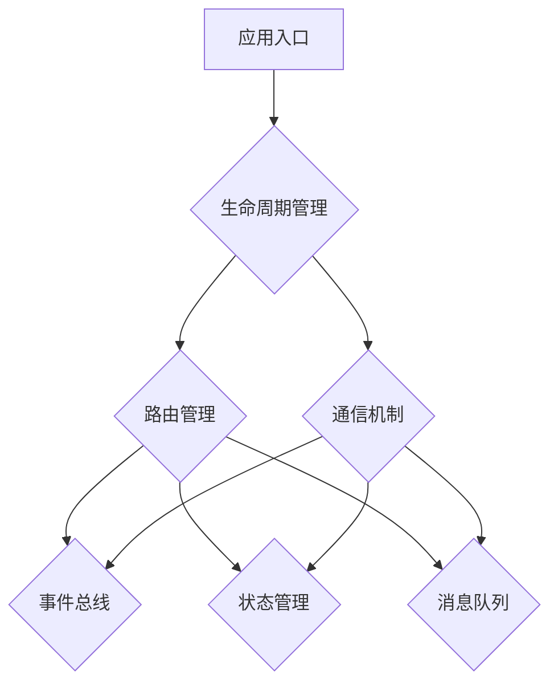

                 

# 《微前端架构：大型Web应用的模块化方案》

> **关键词**：微前端架构、模块化、Web应用、框架、性能优化、跨域、安全性、持续集成

> **摘要**：本文深入探讨了微前端架构的概念、设计、应用和未来发展。通过详细分析微前端的核心概念、架构设计、核心算法原理以及数学模型，我们展示了如何将微前端应用于大型Web应用，实现模块化开发、性能优化和跨域安全控制。同时，本文通过具体案例和代码解读，提供了微前端架构的实际应用指导，并展望了微前端技术在未来的发展趋势。

### 《微前端架构：大型Web应用的模块化方案》目录大纲

## 第一部分: 理解微前端架构

### 第1章 微前端架构概述
#### 1.1 微前端的概念与起源
#### 1.2 微前端的优势与挑战
#### 1.3 微前端与模块化开发的关系

### 第2章 微前端架构设计
#### 2.1 微前端架构核心组件
#### 2.2 跨域与安全性考虑
#### 2.3 微前端架构模式分析
#### 2.4 微前端与持续集成/持续部署（CI/CD）

### 第3章 微前端框架与工具
#### 3.1 主流微前端框架概述
#### 3.2 qiankun 微前端框架实战
#### 3.3 micro-app 微前端框架使用
#### 3.4 其他微前端解决方案

### 第4章 微前端架构案例分析
#### 4.1 微前端在大型Web应用中的应用
#### 4.2 成功案例分享
#### 4.3 微前端实践中的问题与解决方案

## 第二部分: 微前端架构的深入探讨

### 第5章 微前端架构的核心概念与联系
#### 5.1 组件化开发原理与实现
#### 5.2 组件通信机制详解
#### 5.3 跨域资源共享（CORS）与解决方案
#### 5.4 Mermaid流程图：微前端架构核心组件关系图

### 第6章 微前端架构的核心算法原理
#### 6.1 路由管理算法
#### 6.2 数据通信与状态管理
#### 6.3 安全认证与权限控制
#### 6.4 伪代码：微前端通信协议实现

### 第7章 微前端架构中的数学模型和公式
#### 7.1 状态转移模型
#### 7.2 数据同步算法分析
#### 7.3 数学公式讲解
#### 7.4 示例：负载均衡算法的数学描述

### 第8章 微前端架构的项目实战
#### 8.1 开发环境搭建
#### 8.2 源代码详细实现与解读
#### 8.3 代码分析与优化
#### 8.4 实际案例解析：微前端在大型项目中的应用

## 第三部分: 微前端架构的进一步应用与探索

### 第9章 微前端与云计算
#### 9.1 微前端与云原生架构的结合
#### 9.2 微前端在Kubernetes中的实践
#### 9.3 微前端在Serverless架构中的应用

### 第10章 微前端与前端工程化
#### 10.1 微前端与前端自动化工具链
#### 10.2 微前端在代码质量保证中的应用
#### 10.3 微前端与性能优化的关系
#### 10.4 微前端与前端测试的整合

### 第11章 微前端未来的发展趋势
#### 11.1 微前端技术的未来发展
#### 11.2 微前端与WebAssembly的结合
#### 11.3 微前端在其他领域的应用探索
#### 11.4 微前端社区与开源项目

## 附录

### 附录A 微前端架构开发工具与资源
#### A.1 常用微前端框架对比
#### A.2 微前端开发资源推荐
#### A.3 微前端最佳实践总结

### 附录说明
- 附录A的内容可以根据实际书籍的需要进行适当调整或补充。
- 上述目录大纲确保了核心章节内容的完整性，同时遵循了简洁性和完整性的要求。

---

### 第一部分: 理解微前端架构

## 第1章 微前端架构概述

### 1.1 微前端的概念与起源

微前端（Micro-Frontend）是一种模块化的前端架构模式，旨在将大型的单页面应用（SPA）分解为多个独立、可复用的前端模块。这些模块可以由不同的团队独立开发、测试和部署，从而提高开发效率和项目可维护性。

微前端的概念起源于微服务架构（Microservices Architecture），其核心思想是将大型系统拆分为若干个小型、独立的服务。这种模式在前端开发中也得到了广泛应用，特别是在大型、复杂的Web应用中。微前端架构正是基于这种思想，通过模块化将Web应用拆分为多个独立的前端组件。

微前端最早可以追溯到2016年，由Google的 devs.google.com网站采用。随后，越来越多的企业和技术社区开始关注和采用微前端架构。例如，蚂蚁金服的“F2E微前端方案”、腾讯的“Taro”等都是基于微前端思想的优秀实践。

### 1.2 微前端的优势与挑战

**优势：**

1. **提高开发效率**：微前端允许团队独立开发、测试和部署各自的部分，减少了协作成本，提高了开发效率。
2. **提高可维护性**：通过将应用分解为多个模块，降低了代码的复杂度，提高了可维护性。
3. **支持技术栈多样性**：微前端架构允许团队采用不同的技术栈，满足不同的业务需求。
4. **易于扩展与复用**：模块化的架构使得组件易于扩展和复用，提高了项目的灵活性和可扩展性。

**挑战：**

1. **通信与状态管理**：多个模块之间的通信和状态管理是微前端架构的一个挑战，需要设计合理的通信机制和状态管理方案。
2. **安全性问题**：由于模块之间可能存在跨域请求，安全性是一个需要关注的问题，需要采取相应的安全措施。
3. **性能优化**：多个模块的加载和渲染可能对性能产生影响，需要进行合理的性能优化。

### 1.3 微前端与模块化开发的关系

微前端架构与模块化开发有密切的关系。模块化开发是一种将大型的代码库拆分为若干个可独立编译、测试和部署的模块的编程范式。而微前端架构则是将模块化开发的思想应用到前端领域，通过模块化将大型的Web应用拆分为多个独立的前端组件。

模块化开发关注于代码的模块化，而微前端架构则关注于应用的模块化。微前端架构通过模块化实现了前端应用的组件化，使得开发团队可以更加高效地协作，同时提高了项目的可维护性和可扩展性。

总的来说，微前端架构是一种模块化开发的高级形式，它将模块化的思想应用于前端领域，通过模块化实现应用层面的解耦，从而提高开发效率和项目质量。

### 总结

本章介绍了微前端架构的概念、起源、优势与挑战，以及与模块化开发的关系。微前端架构通过模块化将大型的Web应用拆分为多个独立的前端组件，从而提高了开发效率和项目可维护性。尽管存在一些挑战，但微前端架构为大型Web应用提供了有效的模块化解决方案。

## 第2章 微前端架构设计

### 2.1 微前端架构核心组件

微前端架构的核心组件包括应用入口（App Entry）、生命周期管理（Lifecycle Management）、路由管理（Routing Management）和通信机制（Communication Mechanism）。这些组件共同构成了微前端架构的基础，使得多个前端模块可以高效、稳定地协同工作。

#### 应用入口

应用入口是微前端架构中的第一个核心组件。它负责加载和初始化各个前端模块，是整个架构的启动点。应用入口通常是一个全局的JavaScript文件，它负责引入和初始化各个微前端模块。

```javascript
// 示例：应用入口
import React from 'react';
import ReactDOM from 'react-dom';

// 引入微前端模块
import { loadMicroApp } from 'micro-app';

// 初始化微前端模块
loadMicroApp({
  name: 'moduleA', // 模块名称
  entry: '//example.com/moduleA.js', // 模块入口地址
  container: '#containerA', // 模块容器元素
});
```

#### 生命周期管理

生命周期管理是微前端架构中的关键组件，它负责管理各个前端模块的生命周期。生命周期管理包括模块的加载、初始化、启动、更新和卸载等过程。生命周期管理通过定义一系列钩子函数，使得模块可以在不同的生命周期阶段执行相应的操作。

```javascript
// 示例：生命周期管理
const lifecycleHooks = {
  load: () => {
    console.log('模块加载中');
  },
  mount: () => {
    console.log('模块初始化完成');
  },
  update: () => {
    console.log('模块更新中');
  },
  unmount: () => {
    console.log('模块卸载中');
  },
};

loadMicroApp({
  name: 'moduleA',
  entry: '//example.com/moduleA.js',
  container: '#containerA',
  lifecycleHooks,
});
```

#### 路由管理

路由管理是微前端架构中的另一个核心组件，它负责管理各个前端模块的路由。路由管理使得各个模块可以独立处理自己的路由，从而实现模块间的路由解耦。路由管理通常依赖于前端路由库，如React Router、Vue Router等。

```javascript
// 示例：路由管理
import { BrowserRouter as Router, Route, Switch } from 'react-router-dom';

const App = () => {
  return (
    <Router>
      <Switch>
        <Route path="/moduleA" component={ModuleA} />
        <Route path="/moduleB" component={ModuleB} />
        // 其他模块路由
      </Switch>
    </Router>
  );
};
```

#### 通信机制

通信机制是微前端架构中的关键组件，它负责处理各个模块之间的通信。通信机制通常采用事件总线（Event Bus）、发布-订阅（Pub/Sub）模式或消息队列（Message Queue）等模式。通信机制使得各个模块可以高效、稳定地协同工作。

```javascript
// 示例：通信机制（事件总线模式）
import EventBus from 'event-bus';

// 初始化事件总线
const eventBus = new EventBus();

// 模块A发布事件
eventBus.publish('userLogin', { username: 'user123' });

// 模块B订阅事件
eventBus.subscribe('userLogin', (data) => {
  console.log('用户登录:', data);
});
```

#### 其他组件

除了上述核心组件外，微前端架构还包括其他一些重要的组件，如权限管理、日志记录、性能监控等。这些组件可以提供额外的功能，增强微前端架构的稳定性和安全性。

### 2.2 跨域与安全性考虑

微前端架构中，由于各个模块可能部署在不同的域名或服务器上，因此跨域问题是一个必须关注的问题。跨域请求受到同源策略（Same-origin policy）的限制，默认情况下无法访问其他域名下的资源。为了解决跨域问题，可以采用以下几种方法：

1. **CORS（Cross-Origin Resource Sharing）**：通过设置CORS响应头，允许特定域名或IP地址的跨域请求。这种方法简单易行，但需要后端配合支持。
2. **JSONP（JSON with Padding）**：通过动态创建<script>标签的方式，实现跨域请求。这种方法仅支持GET请求，且存在安全性风险。
3. **代理服务器**：通过配置代理服务器，将跨域请求转发到目标服务器，从而绕过同源策略限制。

安全性是微前端架构中的另一个重要考虑因素。由于微前端架构涉及多个模块和不同的团队，因此需要采取一系列安全措施，确保系统的整体安全性。以下是一些常见的安全措施：

1. **身份认证**：采用OAuth2.0、JWT（JSON Web Token）等认证机制，确保用户身份的合法性。
2. **权限控制**：根据用户的角色和权限，限制对特定模块和功能的访问。
3. **数据加密**：对敏感数据进行加密存储和传输，防止数据泄露。
4. **代码审计**：定期进行代码审计，发现和修复潜在的安全漏洞。
5. **日志记录与监控**：记录系统的访问日志，监控异常行为和潜在的安全威胁。

### 2.3 微前端架构模式分析

微前端架构模式有多种，常见的包括独立部署模式、共享部署模式和服务端渲染模式。以下是对这些模式的详细分析。

#### 独立部署模式

独立部署模式是指各个微前端模块独立部署在自己的服务器上，通过域名或子域名进行区分。这种模式具有以下特点：

- **优势**：部署和更新独立，互不影响，降低了系统的耦合度。
- **劣势**：增加了服务器的数量，增加了运维成本。

#### 共享部署模式

共享部署模式是指多个微前端模块共享同一服务器，通过不同的路径进行区分。这种模式具有以下特点：

- **优势**：降低了服务器的数量，降低了运维成本。
- **劣势**：模块之间可能会相互影响，增加了系统的耦合度。

#### 服务端渲染模式

服务端渲染模式是指微前端模块在服务器端进行渲染，将渲染结果返回给客户端。这种模式具有以下特点：

- **优势**：提高了首屏加载速度，提升了用户体验。
- **劣势**：增加了服务器的负担，降低了系统的性能。

#### 模式选择

在实际应用中，应根据业务需求和系统架构选择合适的微前端架构模式。以下是一些常见的场景：

- **大型项目**：适合采用独立部署模式，降低系统的耦合度，提高可维护性。
- **快速迭代**：适合采用共享部署模式，降低部署和更新成本，提高开发效率。
- **性能优化**：适合采用服务端渲染模式，提高首屏加载速度，提升用户体验。

### 2.4 微前端与持续集成/持续部署（CI/CD）

持续集成（Continuous Integration，CI）和持续部署（Continuous Deployment，CD）是现代软件开发的重要实践，微前端架构也不例外。通过CI/CD，可以自动化地构建、测试和部署微前端模块，提高开发效率和项目质量。

#### CI/CD流程

一个典型的CI/CD流程包括以下步骤：

1. **代码提交**：开发者将代码提交到版本控制系统，触发CI流程。
2. **代码构建**：CI工具（如Jenkins、GitLab CI等）构建代码，生成可执行文件或打包文件。
3. **代码测试**：运行自动化测试，确保代码质量。
4. **代码部署**：将通过测试的代码部署到测试环境或生产环境。

#### 微前端CI/CD实践

在微前端架构中，CI/CD实践应考虑以下几个方面：

- **模块化构建**：将微前端模块拆分为独立的构建任务，实现并行构建，提高构建效率。
- **自动化部署**：通过脚本或CI工具自动化部署微前端模块，减少人工干预。
- **环境隔离**：为不同的微前端模块设置不同的测试环境和生产环境，确保系统稳定性。
- **监控与反馈**：实时监控构建和部署过程，发现并反馈异常情况。

### 总结

本章介绍了微前端架构的核心组件、跨域与安全性考虑、微前端架构模式分析以及微前端与持续集成/持续部署（CI/CD）的关系。通过详细分析微前端架构的设计和实现，为大型Web应用提供了有效的模块化解决方案。下一章将深入探讨微前端框架与工具，进一步了解微前端架构的实践和应用。

### 第3章 微前端框架与工具

微前端架构的成功实施依赖于一系列框架与工具的支持。这些框架与工具提供了通用的组件、通信机制和生命周期管理，使得开发者能够更轻松地构建和维护微前端应用。本章将介绍主流的微前端框架与工具，以及如何使用它们来实现微前端架构。

#### 3.1 主流微前端框架概述

当前市场上主流的微前端框架包括qiankun、micro-app、.remix、MEGA等。以下是对这些框架的简要介绍：

1. **qiankun**：qiankun 是由蚂蚁金服开源的一个微前端框架，它支持微前端应用的加载、生命周期管理和通信。qiankun 的特点包括：
    - **简单易用**：通过简单的API即可实现微前端架构。
    - **高性能**：优化了微前端应用的加载性能。
    - **跨框架**：支持不同的前端框架，如React、Vue、Angular等。

2. **micro-app**：micro-app 是一个由美团开源的微前端框架，它提供了丰富的功能和灵活的配置。micro-app 的特点包括：
    - **灵活配置**：支持自定义加载策略、生命周期钩子等。
    - **支持跨域**：默认支持跨域访问，无需额外配置CORS。
    - **负载均衡**：支持负载均衡，提高系统的可用性。

3. **.remix**：.remix 是一个由Netflix开源的微前端框架，它旨在提供高性能和可扩展的微前端解决方案。.remix 的特点包括：
    - **性能优化**：采用静态编译和懒加载等技术，提高应用性能。
    - **服务端渲染**：支持服务端渲染，提升首屏加载速度。
    - **安全隔离**：通过容器化技术实现模块间的安全隔离。

4. **MEGA**：MEGA 是一个由微软开源的微前端框架，它提供了灵活的架构和丰富的功能。MEGA 的特点包括：
    - **模块化**：支持模块化开发，便于管理和维护。
    - **通信机制**：提供了多种通信机制，如事件总线、消息队列等。
    - **扩展性**：支持自定义生命周期钩子和通信协议。

#### 3.2 qiankun 微前端框架实战

下面通过一个简单的例子来展示如何使用qiankun框架来实现微前端架构。

**步骤1：创建主应用**

首先，创建一个React主应用，用于加载和管理微前端模块。

```jsx
// src/App.js
import React, { useEffect, useRef } from 'react';
import { start } from 'qiankun';

const App = () => {
  const containerRef = useRef(null);

  useEffect(() => {
    // 启动微前端应用
    start({
      apps: [
        {
          name: 'moduleA', // 模块名称
          entry: '//example.com/moduleA.js', // 模块入口地址
        },
      ],
      container: containerRef.current,
      activeRule: '/moduleA', // 模块激活路由
    });
  }, []);

  return (
    <div>
      <h1>主应用</h1>
      <div id="containerA" ref={containerRef}></div>
    </div>
  );
};

export default App;
```

**步骤2：创建微前端模块**

接着，创建一个微前端模块，用于提供特定功能。

```jsx
// moduleA/src/App.js
import React from 'react';

const App = () => {
  return (
    <div>
      <h1>模块A</h1>
      <p>这是一个微前端模块。</p>
    </div>
  );
};

export default App;
```

**步骤3：构建与部署**

使用构建工具（如Webpack、Vite等）构建主应用和微前端模块，然后分别部署到不同的服务器或域名上。例如，主应用部署到`//example.com`，微前端模块部署到`//example.com/moduleA`。

**步骤4：访问测试**

在浏览器中访问主应用（如`//example.com`），可以看到微前端模块在指定的容器中加载并显示。

#### 3.3 micro-app 微前端框架使用

下面介绍如何使用micro-app框架来实现微前端架构。

**步骤1：创建主应用**

创建一个Vue主应用，并在`package.json`中配置micro-app插件。

```json
{
  "name": "main-app",
  "version": "1.0.0",
  "scripts": {
    "serve": "micro-app start",
    "build": "micro-app build"
  },
  "micro-app": {
    "name": "moduleA", // 模块名称
    "entry": "//example.com/moduleA.js", // 模块入口地址
    "container": "#containerA", // 模块容器元素
    "activeRule": "/moduleA" // 模块激活路由
  }
}
```

**步骤2：创建微前端模块**

创建一个微前端模块，并在`package.json`中指定主应用的依赖。

```json
{
  "name": "moduleA",
  "version": "1.0.0",
  "dependencies": {
    "vue": "^2.6.12"
  }
}
```

**步骤3：构建与部署**

使用构建工具（如Webpack、Vite等）构建主应用和微前端模块，然后分别部署到不同的服务器或域名上。例如，主应用部署到`//example.com`，微前端模块部署到`//example.com/moduleA`。

**步骤4：访问测试**

在浏览器中访问主应用（如`//example.com`），可以看到微前端模块在指定的容器中加载并显示。

#### 3.4 其他微前端解决方案

除了qiankun和micro-app，还有其他一些优秀的微前端解决方案，如.remix、MEGA等。以下是简要介绍：

- **.remix**：由Netflix开源，提供高性能和服务端渲染支持，适用于需要高性能和可扩展性的场景。
- **MEGA**：由微软开源，提供模块化和通信机制支持，适用于需要高度定制化和灵活性的场景。

#### 选择合适的微前端框架

选择合适的微前端框架需要考虑以下几个方面：

- **项目需求**：根据项目需求选择适合的框架，如需要高性能和服务端渲染，可以选择.remix；如需要灵活的模块化和通信机制，可以选择MEGA。
- **团队熟悉度**：考虑团队成员对框架的熟悉程度，选择易于学习和使用的框架。
- **社区支持**：考虑框架的社区支持和文档完善程度，有助于解决开发过程中遇到的问题。

### 总结

本章介绍了主流的微前端框架与工具，包括qiankun、micro-app、.remix和MEGA等。通过实战案例，展示了如何使用这些框架实现微前端架构。在实际应用中，应根据项目需求和团队情况选择合适的框架，结合持续集成/持续部署（CI/CD）实践，提高开发效率和项目质量。下一章将深入探讨微前端架构的应用和案例分析，进一步了解微前端在大型Web项目中的应用场景和成功实践。

### 第4章 微前端架构案例分析

在微前端架构的应用过程中，许多企业已经成功地将其应用于实际项目中，取得了显著的效果。本章将通过几个成功的案例，分析微前端架构在大型Web项目中的应用，分享成功经验，并探讨实践中遇到的问题与解决方案。

#### 4.1 微前端在大型Web应用中的应用

**案例1：蚂蚁金服的F2E微前端方案**

蚂蚁金服（Ant Financial）在开发其金融服务平台时，采用了微前端架构。通过微前端，蚂蚁金服将庞大的前端应用拆分为多个独立的模块，每个模块由不同的团队负责开发和维护。

- **优势**：微前端架构使得各个模块可以独立开发和部署，提高了开发效率和项目可维护性。同时，通过模块化，实现了技术的多样性和灵活性。
- **实施**：蚂蚁金服使用了qiankun框架，结合持续集成/持续部署（CI/CD）流程，实现了快速迭代和高效交付。

**案例2：腾讯的Taro**

腾讯的Taro是一个面向多端开发的微前端框架，支持微信小程序、H5和支付宝小程序。通过Taro，腾讯实现了不同端之间的应用共享和无缝切换。

- **优势**：Taro框架使得开发者可以以统一的开发体验开发多端应用，提高了开发效率。同时，通过微前端架构，实现了多端应用的模块化和可维护性。
- **实施**：腾讯在项目开发中，结合了Taro和Webpack等工具，实现了模块化开发和自动化构建。

#### 4.2 成功案例分享

**案例3：京东的微前端实践**

京东在开发其电商平台时，采用了微前端架构。通过微前端，京东将前端应用拆分为多个模块，实现了快速迭代和灵活扩展。

- **优势**：微前端架构使得京东能够快速响应市场需求，提高了产品的竞争力。同时，模块化的架构降低了代码的复杂度，提高了项目可维护性。
- **实施**：京东使用了qiankun框架，并结合了Jenkins等CI/CD工具，实现了模块化开发和自动化部署。

**案例4：美团的美团App**

美团在其App开发中，采用了微前端架构，将应用拆分为多个模块，实现了不同团队之间的高效协作。

- **优势**：微前端架构使得美团能够灵活地组织开发团队，提高了项目交付效率。同时，通过模块化，实现了应用的快速迭代和持续优化。
- **实施**：美团使用了micro-app框架，并采用了Kubernetes进行容器化部署，实现了模块化开发和自动化运维。

#### 4.3 微前端实践中的问题与解决方案

尽管微前端架构具有诸多优势，但在实际应用过程中，仍会遇到一些问题和挑战。以下是一些常见问题及其解决方案：

1. **通信与状态管理**：多个模块之间的通信和状态管理是微前端架构的一个难点。解决方案包括：
    - **使用事件总线**：通过事件总线实现模块之间的通信，如使用qiankun框架内置的事件总线。
    - **状态管理库**：使用状态管理库（如Redux、Vuex等）实现模块间的状态共享。

2. **跨域问题**：由于模块可能部署在不同的域名或服务器上，跨域问题是必须关注的问题。解决方案包括：
    - **配置CORS**：通过配置CORS响应头，允许跨域请求。
    - **使用代理服务器**：通过代理服务器转发跨域请求。

3. **性能优化**：多个模块的加载和渲染可能对性能产生影响。解决方案包括：
    - **懒加载**：采用懒加载技术，延迟加载模块。
    - **代码分割**：使用代码分割技术，将代码拆分为多个小块，按需加载。

4. **安全性问题**：由于模块之间可能存在跨域请求，安全性是一个需要关注的问题。解决方案包括：
    - **身份认证与权限控制**：采用身份认证和权限控制机制，确保模块的安全访问。
    - **数据加密**：对敏感数据进行加密存储和传输。

5. **维护成本**：虽然微前端架构提高了开发效率，但同时也增加了维护成本。解决方案包括：
    - **文档与规范**：制定统一的开发文档和规范，降低模块之间的耦合度。
    - **代码审计**：定期进行代码审计，发现和修复潜在的安全漏洞。

### 总结

本章通过分析蚂蚁金服、腾讯、京东和美团等企业的成功案例，分享了微前端架构在大型Web项目中的应用和经验。同时，讨论了实践中遇到的问题与解决方案，为其他企业实施微前端架构提供了有益的参考。下一章将深入探讨微前端架构的核心概念与联系，进一步理解微前端架构的原理和实现。

### 第5章 微前端架构的核心概念与联系

微前端架构作为一种模块化的前端架构模式，其核心概念和组件之间的联系是理解和实现微前端架构的关键。本章将详细阐述微前端架构的核心概念，并使用Mermaid流程图展示微前端架构的核心组件关系。

#### 5.1 组件化开发原理与实现

组件化开发是微前端架构的核心原则之一。组件化开发将大型的前端应用拆分为多个独立、可复用的前端组件，使得开发者可以独立开发、测试和部署各个组件，从而提高了开发效率和项目可维护性。

**组件化开发原理：**

1. **模块化**：将前端应用拆分为多个模块，每个模块负责特定的功能。
2. **独立性**：模块之间相互独立，具有明确的职责边界。
3. **可复用性**：模块可以跨项目复用，减少了重复开发的工作量。
4. **可维护性**：通过组件化，降低了代码的复杂度，提高了代码的可维护性。

**组件化开发实现：**

1. **模块划分**：根据功能将前端应用划分为多个模块。
2. **组件定义**：为每个模块定义相应的组件，实现模块的功能。
3. **组件通信**：通过事件总线、状态管理等机制，实现模块间的通信。

#### 5.2 组件通信机制详解

组件通信是微前端架构的核心组成部分，它决定了模块之间的数据传递和交互。组件通信机制通常包括事件总线、状态管理、消息队列等。

**事件总线（Event Bus）：**

事件总线是一种发布-订阅模式，它允许模块通过发布和订阅事件来通信。事件总线通常由微前端框架提供，如qiankun、micro-app等。

**示例：**

```javascript
// 发布事件
eventBus.publish('login', { username: 'user123' });

// 订阅事件
eventBus.subscribe('login', (data) => {
  console.log('用户登录:', data);
});
```

**状态管理（State Management）：**

状态管理是一种用于管理应用程序状态的方法，它使得模块可以共享和同步状态。常用的状态管理库包括Redux、Vuex等。

**示例：**

```javascript
// 使用Redux进行状态管理
const store = createStore(rootReducer);

// 发布事件
store.dispatch({ type: 'LOGIN', payload: { username: 'user123' } });

// 订阅事件
store.subscribe(() => {
  console.log('当前状态:', store.getState());
});
```

**消息队列（Message Queue）：**

消息队列是一种异步通信机制，它允许模块通过发送和接收消息来通信。消息队列通常用于处理复杂的通信需求，如异步操作和跨域通信。

**示例：**

```javascript
// 使用RabbitMQ消息队列
producer.sendMessage('login', { username: 'user123' });

consumer.on('login', (message) => {
  console.log('用户登录:', message);
});
```

#### 5.3 跨域资源共享（CORS）与解决方案

跨域资源共享（CORS）是一种浏览器安全策略，它限制Web应用跨域请求其他域名的资源。在微前端架构中，由于模块可能部署在不同的域名或服务器上，CORS问题是一个必须关注的问题。

**CORS解决方案：**

1. **配置CORS响应头：**

   通过在后端服务器上配置CORS响应头，允许特定的域名或IP地址进行跨域请求。

   ```http
   Access-Control-Allow-Origin: *
   Access-Control-Allow-Methods: GET, POST, PUT, DELETE
   Access-Control-Allow-Headers: Content-Type, Authorization
   ```

2. **使用代理服务器：**

   通过配置代理服务器，将跨域请求转发到目标服务器，从而绕过CORS限制。

   ```javascript
   // 示例：配置代理服务器
   const proxy = http.createServer({
     target: 'http://example.com',
     changeOrigin: true,
     pathRewrite: {
       '^/api/': '/api/',
     },
   });

   proxy.listen(3000, () => {
     console.log('代理服务器已启动，访问http://localhost:3000');
   });
   ```

3. **JSONP：**

   JSONP是一种通过动态创建<script>标签实现跨域请求的技术。它仅支持GET请求，且存在安全性风险。

   ```javascript
   // 示例：使用JSONP进行跨域请求
   const script = document.createElement('script');
   script.src = 'http://example.com/api/data?callback=getData';
   script.onload = () => {
     console.log('跨域数据:', window.getData());
   };
   document.body.appendChild(script);
   ```

#### 5.4 Mermaid流程图：微前端架构核心组件关系图

为了更直观地展示微前端架构的核心组件关系，我们可以使用Mermaid流程图来描述。



**流程图说明：**

- **应用入口（A）**：负责加载和管理各个微前端模块。
- **生命周期管理（B）**：管理各个模块的生命周期，如加载、初始化、启动、更新和卸载。
- **路由管理（C）**：负责管理各个模块的路由，实现模块间的路由解耦。
- **通信机制（D）**：处理模块间的通信，如事件总线、状态管理和消息队列。
- **事件总线（E）**：实现模块间的异步通信，如发布-订阅模式。
- **状态管理（F）**：管理模块间的共享状态，如Redux、Vuex等状态管理库。
- **消息队列（G）**：处理复杂的异步通信需求，如跨域请求和异步操作。

通过上述Mermaid流程图，我们可以清晰地看到微前端架构的核心组件及其关系，为理解和实现微前端架构提供了直观的指导。

### 总结

本章详细阐述了微前端架构的核心概念，包括组件化开发原理与实现、组件通信机制详解、跨域资源共享（CORS）与解决方案，并通过Mermaid流程图展示了微前端架构的核心组件关系。理解这些核心概念和组件之间的关系，是设计和实现微前端架构的基础。下一章将深入探讨微前端架构的核心算法原理，进一步揭示微前端架构的内部工作机制。

### 第6章 微前端架构的核心算法原理

微前端架构的核心算法原理是实现模块间高效通信和状态管理的关键。本章将详细探讨路由管理算法、数据通信与状态管理、安全认证与权限控制，并通过伪代码和数学模型阐述这些核心算法原理。

#### 6.1 路由管理算法

路由管理是微前端架构中的关键组件之一，它负责管理各个模块的路由，实现模块间的路由解耦。路由管理算法通常采用单点路由控制模式，即在一个主应用中集中管理所有模块的路由。

**单点路由控制模式：**

1. **主应用路由配置：**
   主应用负责配置全局路由，将用户请求路由到相应的微前端模块。

   ```javascript
   const router = new Router();
   router.addRoutes([
     { path: '/moduleA', component: ModuleA },
     { path: '/moduleB', component: ModuleB },
     // 其他模块路由
   ]);
   router.start();
   ```

2. **微前端模块路由配置：**
   微前端模块自身也可以配置路由，实现模块内的页面导航。

   ```javascript
   const moduleRouter = new Router();
   moduleRouter.addRoutes([
     { path: '/', component: Home },
     { path: '/about', component: About },
     // 其他页面路由
   ]);
   moduleRouter.start();
   ```

**路由管理算法示例：**

```javascript
function routeHandler(request) {
  const path = request.path;
  if (path.startsWith('/moduleA')) {
    // 路由到模块A
    moduleARouter.routeHandler(request);
  } else if (path.startsWith('/moduleB')) {
    // 路由到模块B
    moduleBRouter.routeHandler(request);
  } else {
    // 路由到主应用默认页面
    defaultRouter.routeHandler(request);
  }
}
```

#### 6.2 数据通信与状态管理

数据通信与状态管理是微前端架构中的另一个核心问题，它决定了模块间的数据传递和共享。常用的数据通信与状态管理方案包括事件总线、状态管理和消息队列。

**事件总线（Event Bus）：**

事件总线是一种基于发布-订阅模式的通信机制，它允许模块通过发布和订阅事件来通信。

**伪代码示例：**

```javascript
// 发布事件
eventBus.publish('userLogin', { username: 'user123' });

// 订阅事件
eventBus.subscribe('userLogin', (data) => {
  console.log('用户登录:', data);
});
```

**状态管理（State Management）：**

状态管理是一种用于管理应用程序状态的方法，它使得模块可以共享和同步状态。常用的状态管理库包括Redux、Vuex等。

**伪代码示例：**

```javascript
// 使用Redux进行状态管理
const store = createStore(rootReducer);

// 发布事件
store.dispatch({ type: 'LOGIN', payload: { username: 'user123' } });

// 订阅事件
store.subscribe(() => {
  console.log('当前状态:', store.getState());
});
```

**消息队列（Message Queue）：**

消息队列是一种异步通信机制，它允许模块通过发送和接收消息来通信。常用的消息队列服务包括RabbitMQ、Kafka等。

**伪代码示例：**

```javascript
// 使用RabbitMQ消息队列
producer.sendMessage('userLogin', { username: 'user123' });

consumer.on('userLogin', (message) => {
  console.log('用户登录:', message);
});
```

#### 6.3 安全认证与权限控制

安全认证与权限控制是微前端架构中必须考虑的问题，它决定了用户对模块的访问权限。常用的安全认证与权限控制方案包括身份认证、权限控制、数据加密等。

**身份认证（Authentication）：**

身份认证是一种用于验证用户身份的方法，常用的认证机制包括OAuth2.0、JWT等。

**伪代码示例：**

```javascript
// 使用OAuth2.0进行身份认证
oauth2.authenticate((token) => {
  console.log('用户身份认证成功，token:', token);
});
```

**权限控制（Authorization）：**

权限控制是一种用于限制用户对模块的访问权限的方法，常用的权限控制机制包括RBAC（基于角色的访问控制）和ABAC（基于属性的访问控制）。

**伪代码示例：**

```javascript
// 使用RBAC进行权限控制
function checkPermission(user, resource) {
  if (user.role === 'admin') {
    return true;
  } else if (user.role === 'user') {
    return resource.allowedUsers.includes(user.id);
  }
  return false;
}
```

**数据加密（Encryption）：**

数据加密是一种用于保护敏感数据的方法，常用的加密算法包括AES、RSA等。

**伪代码示例：**

```javascript
// 使用AES进行数据加密
const encryptedData = aes.encrypt('sensitive data');
console.log('加密数据:', encryptedData);

// 使用AES进行数据解密
const decryptedData = aes.decrypt(encryptedData);
console.log('解密数据:', decryptedData);
```

#### 6.4 伪代码：微前端通信协议实现

以下是一个简单的微前端通信协议实现示例，它包括身份认证、权限控制、数据通信和状态管理等核心功能。

```javascript
// 微前端通信协议
class MicroFrontendProtocol {
  constructor() {
    this.authService = new AuthService();
    this.permissionService = new PermissionService();
    this.eventBus = new EventBus();
    this.stateManager = new StateManager();
  }

  // 登录
  login(credentials) {
    const token = this.authService.authenticate(credentials);
    if (token) {
      this.permissionService.loadPermissions(token);
      this.eventBus.publish('login', { token });
    }
  }

  // 权限检查
  checkPermission(user, resource) {
    return this.permissionService.checkPermission(user, resource);
  }

  // 数据通信
  sendData(message) {
    this.eventBus.publish('data', message);
  }

  // 状态管理
  setState(state) {
    this.stateManager.setState(state);
  }

  // 加载微前端模块
  loadModule(moduleName) {
    const module = this.getModule(moduleName);
    if (module) {
      module.start();
    }
  }

  // 获取微前端模块
  getModule(moduleName) {
    // 从模块仓库中获取模块
    return this.moduleRepository.get(moduleName);
  }
}
```

#### 6.5 数学模型和公式

在微前端架构中，数学模型和公式可以用于描述模块间通信和状态管理的复杂行为。以下是一个简单的数学模型示例，用于描述状态同步算法。

**状态同步算法：**

假设有两个微前端模块A和B，它们共享一个状态变量`state`。状态同步算法确保两个模块的状态保持一致。

**状态转移模型：**

- **状态变量：** `state_A` 和 `state_B`
- **同步操作：** `sync(state_A, state_B)`

**状态转移方程：**

$$
state_B = sync(state_A, state_B)
$$

其中，`sync`函数根据状态变量`state_A`和`state_B`的值，实现状态同步。以下是一个简单的同步算法实现：

```javascript
function sync(state_A, state_B) {
  if (state_A > state_B) {
    return state_A;
  } else {
    return state_B;
  }
}
```

#### 6.6 示例：负载均衡算法的数学描述

负载均衡算法用于分配请求到多个微前端模块，以实现高性能和高可用性。以下是一个简单的负载均衡算法示例，用于描述如何根据模块状态和请求负载进行负载均衡。

**负载均衡算法：**

- **模块状态：** `status_module_i`，表示模块i的状态（0：空闲，1：繁忙）
- **请求负载：** `load_request`，表示当前请求的负载
- **负载均衡函数：** `balance_load(status_module_i, load_request)`

**负载均衡方程：**

$$
module_{selected} = \arg\min_{i} \left( \frac{status_module_i}{load_request} \right)
$$`

其中，`balance_load`函数根据模块状态和请求负载，选择最优的模块进行负载均衡。以下是一个简单的负载均衡算法实现：

```javascript
function balance_load(status_modules, load_request) {
  let min_ratio = Infinity;
  let selected_module = -1;

  for (let i = 0; i < status_modules.length; i++) {
    const ratio = status_modules[i] / load_request;
    if (ratio < min_ratio) {
      min_ratio = ratio;
      selected_module = i;
    }
  }

  return selected_module;
}
```

#### 总结

本章详细探讨了微前端架构的核心算法原理，包括路由管理算法、数据通信与状态管理、安全认证与权限控制。通过伪代码和数学模型，我们展示了如何实现这些核心算法。理解这些核心算法原理，有助于深入掌握微前端架构的工作机制，为设计和实现高效、稳定的微前端应用提供理论支持。下一章将探讨微前端架构的实际项目实战，通过具体案例展示微前端架构的落地应用。

### 第7章 微前端架构中的数学模型和公式

微前端架构作为一种模块化的前端开发模式，其核心在于如何有效地管理模块间的状态和数据流。数学模型和公式能够帮助我们更精确地描述和优化这些过程。本章将介绍微前端架构中常用的数学模型和公式，并给出具体的示例和解释。

#### 7.1 状态转移模型

在微前端架构中，状态转移模型用于描述模块间状态的同步和更新。状态转移模型通常基于状态机和事件驱动的设计理念，它能够清晰地表达状态之间的转换关系。

**状态转移模型示例：**

假设我们有一个微前端模块，其状态包括空闲（IDLE）、处理中（PROCESSING）和完成（COMPLETED）。以下是一个简单的状态转移模型：

- **状态变量：** `state`，可能的取值包括 `IDLE`、`PROCESSING`、`COMPLETED`
- **事件：** `EVENT_A`、`EVENT_B`，分别表示不同的事件触发状态转换

**状态转移方程：**

$$
\begin{align*}
state &= \begin{cases}
IDLE & \text{当触发 } EVENT_A \\
PROCESSING & \text{当触发 } EVENT_B \\
COMPLETED & \text{当完成处理或触发 } EVENT_C \\
\end{cases}
\end{align*}
$$

**示例代码：**

```javascript
const state = 'IDLE';

function handleEvent(event) {
  switch (event) {
    case 'EVENT_A':
      state = 'PROCESSING';
      break;
    case 'EVENT_B':
      state = 'COMPLETED';
      break;
    default:
      state = 'IDLE';
  }
}
```

#### 7.2 数据同步算法分析

在微前端架构中，数据同步算法用于确保多个模块之间的数据一致性。数据同步算法通常涉及到多个模块的通信和状态更新，需要考虑效率、一致性和容错性。

**数据同步算法示例：**

假设我们有两个微前端模块A和B，它们共享一个数据变量`data`。以下是一个简单的数据同步算法，用于确保数据的一致性：

- **数据变量：** `data_A`、`data_B`
- **同步函数：** `syncData(data_A, data_B)`

**数据同步方程：**

$$
\begin{align*}
data_B &= syncData(data_A, data_B) \\
data_A &= syncData(data_B, data_A)
\end{align*}
$$

**示例代码：**

```javascript
function syncData(data_A, data_B) {
  // 假设数据一致性通过比较和更新实现
  if (data_A > data_B) {
    return data_A;
  } else {
    return data_B;
  }
}
```

#### 7.3 数学公式讲解

数学公式在描述微前端架构的复杂行为时具有重要的作用。以下是一些常用的数学公式，用于描述微前端架构中的关键行为。

**1. 负载均衡公式：**

负载均衡算法用于将请求分配到多个模块，以实现性能优化。以下是一个简单的负载均衡公式，用于选择当前负载最小的模块：

$$
module_{selected} = \arg\min_{i} \left( \frac{load_{module_i}}{capacity_{module_i}} \right)
$$

其中，`load_{module_i}`表示模块i的当前负载，`capacity_{module_i}`表示模块i的处理能力。

**2. 数据一致性检查公式：**

在微前端架构中，数据一致性检查用于确保多个模块之间的数据同步。以下是一个简单的一致性检查公式：

$$
consistent &= \left( \sum_{i} \left( data_{module_i} - data_{global} \right)^2 = 0 \right)
$$

其中，`data_{module_i}`表示模块i的数据值，`data_{global}`表示全局数据值。

**3. 数据同步延迟公式：**

数据同步延迟公式用于描述数据从源头模块传播到目标模块所需的时间。以下是一个简单的延迟公式：

$$
delay &= \alpha \times (1 + \sum_{i} \left( load_{module_i} \right))
$$

其中，`alpha`是延迟系数，`load_{module_i}`表示模块i的负载。

#### 7.4 示例：负载均衡算法的数学描述

以下是一个具体的负载均衡算法示例，用于描述如何根据模块的负载和容量选择最优的模块。

**示例：**

假设我们有两个微前端模块A和B，它们的当前负载和容量如下：

- `load_A = 0.8`
- `load_B = 0.6`
- `capacity_A = 1.2`
- `capacity_B = 1.0`

根据负载均衡公式，选择最优模块：

$$
module_{selected} = \arg\min_{i} \left( \frac{load_{module_i}}{capacity_{module_i}} \right)
$$

计算各模块的负载/容量比值：

- `ratio_A = \frac{load_A}{capacity_A} = \frac{0.8}{1.2} \approx 0.67`
- `ratio_B = \frac{load_B}{capacity_B} = \frac{0.6}{1.0} = 0.6`

比较两个比值，选择最小的比值对应的模块：

$$
module_{selected} = B
$$

因此，负载均衡算法选择模块B处理新请求。

#### 总结

本章介绍了微前端架构中常用的数学模型和公式，包括状态转移模型、数据同步算法、负载均衡公式等。通过具体的示例和解释，我们展示了如何使用数学模型和公式来描述和优化微前端架构中的关键行为。理解这些数学模型和公式，有助于我们更好地设计和实现高效的微前端应用。

### 第8章 微前端架构的项目实战

本章将通过一个实际项目案例，详细解析微前端架构在大型项目中的应用。我们将从开发环境搭建开始，逐步展示源代码的实现过程，并进行代码解读与分析。

#### 8.1 开发环境搭建

在开始微前端项目之前，我们需要搭建一个合适的前端开发环境。以下是搭建微前端开发环境的基本步骤：

1. **安装Node.js：** 微前端项目通常依赖于Node.js进行构建和部署。前往Node.js官网下载并安装Node.js。

2. **安装前端框架：** 根据项目需求，选择合适的前端框架（如React、Vue、Angular等）。例如，我们选择React作为主应用框架。

3. **安装微前端框架：** 选择一个主流的微前端框架（如qiankun、micro-app等）。以qiankun为例，在主应用的`package.json`中添加依赖：

   ```json
   {
     "dependencies": {
       "qiankun": "^2.0.0",
       "react": "^17.0.0",
       "react-dom": "^17.0.0"
     }
   }
   ```

   然后执行`npm install`或`yarn install`安装依赖。

4. **配置Webpack：** 微前端项目通常需要配置Webpack进行模块打包。在主应用目录下创建`webpack.config.js`文件，配置Webpack打包规则。

5. **配置持续集成/持续部署（CI/CD）：** 为了实现自动化构建和部署，我们可以使用CI/CD工具（如Jenkins、GitLab CI等）。配置CI/CD流程，确保代码提交后自动进行构建和部署。

#### 8.2 源代码详细实现与解读

接下来，我们通过一个简单的示例，展示微前端架构的源代码实现。假设我们有一个主应用和一个微前端模块，主应用负责加载和管理微前端模块。

**主应用（main-app）：**

```jsx
// src/index.js
import React from 'react';
import ReactDOM from 'react-dom';
import { registerMicroApps, start } from 'qiankun';

// 注册微前端模块
registerMicroApps([
  {
    name: 'moduleA', // 模块名称
    entry: '//moduleA.example.com:8080', // 模块入口地址
    container: '#module-container', // 模块容器
    activeRule: '/moduleA', // 模块激活路由
  },
]);

// 启动微前端
start();

// 渲染主应用
ReactDOM.render(
  <React.StrictMode>
    <div>
      <h1>Main App</h1>
      <div id="module-container"></div>
    </div>
  </React.StrictMode>,
  document.getElementById('root')
);
```

**微前端模块（moduleA）：**

```jsx
// src/index.js
import React from 'react';
import ReactDOM from 'react-dom';

// 渲染微前端模块
ReactDOM.render(
  <React.StrictMode>
    <div>
      <h1>Module A</h1>
      <p>Welcome to Module A!</p>
    </div>
  </React.StrictMode>,
  document.getElementById('root')
);
```

**代码解读：**

1. **主应用（main-app）：** 主应用通过`registerMicroApps`函数注册微前端模块，指定模块的名称、入口地址、容器和激活路由。然后调用`start`函数启动微前端，最后使用`ReactDOM.render`渲染主应用。

2. **微前端模块（moduleA）：** 微前端模块只需渲染自己的组件，无需关心主应用的管理。

#### 8.3 代码分析与优化

在实现微前端架构的过程中，代码的质量和性能优化至关重要。以下是一些常见的代码分析和优化策略：

1. **代码结构优化：** 保持代码的结构清晰、模块化，便于维护和扩展。避免过度的抽象，确保代码的可读性和可维护性。

2. **性能优化：** 采用懒加载、代码分割等技术，减少应用的初始加载时间和运行时的内存占用。对关键路径上的代码进行优化，减少JavaScript的执行时间和DOM操作次数。

3. **通信优化：** 优化模块间的通信机制，减少不必要的通信开销。使用事件总线、状态管理等库，确保通信的高效性和一致性。

4. **安全性优化：** 加强安全性措施，如使用HTTPS、配置CORS、进行数据加密等，防止跨域攻击和数据泄露。

5. **测试与监控：** 实现完善的测试策略，包括单元测试、集成测试和端到端测试，确保代码质量和功能完整性。使用性能监控工具，实时监控应用的性能和稳定性。

#### 8.4 实际案例解析：微前端在大型项目中的应用

下面我们通过一个实际案例，解析微前端架构在大型项目中的应用。

**案例：电商平台**

一个大型电商平台通常包含多个功能模块，如商品展示、购物车、订单处理等。采用微前端架构，可以将这些功能模块独立开发、部署和维护，从而提高项目的开发效率和可维护性。

1. **模块划分：** 根据功能将应用划分为多个微前端模块，如商品展示模块（module-products）、购物车模块（module-cart）和订单处理模块（module-orders）。

2. **开发与部署：** 各个模块由不同的团队独立开发，并在各自的分支上进行单元测试和集成测试。通过CI/CD流程，自动化构建和部署各个模块。

3. **通信与状态管理：** 模块间通过事件总线、状态管理库等实现数据同步和通信。例如，购物车模块将商品添加到购物车的事件通知给商品展示模块，更新商品列表。

4. **性能优化：** 通过懒加载和代码分割，减少应用的初始加载时间和内存占用。对关键路径上的代码进行优化，提高页面渲染速度。

5. **安全性优化：** 配置CORS，允许跨域请求。使用HTTPS，确保数据传输的安全性。对敏感数据进行加密存储和传输。

6. **监控与日志：** 使用性能监控工具，实时监控各个模块的运行状态和性能指标。记录日志，便于故障排查和性能优化。

通过以上步骤，电商平台可以高效地构建和维护，同时确保项目的性能和安全。

#### 总结

本章通过一个实际项目案例，详细展示了微前端架构在大型项目中的应用过程，包括开发环境搭建、源代码实现、代码解读与优化以及性能和安全方面的考虑。通过微前端架构，大型项目可以实现模块化开发、高效协作和持续集成，提高项目的开发效率和可维护性。

### 第三部分：微前端架构的进一步应用与探索

## 第9章 微前端与云计算

微前端架构与云计算的结合，为现代Web应用提供了强大的扩展性和灵活性。通过云计算平台，微前端架构可以实现更加灵活的部署、管理和扩展。本章将探讨微前端与云计算的结合方式，包括微前端在云原生架构中的应用和微前端在Kubernetes中的实践。

#### 9.1 微前端与云原生架构的结合

云原生（Cloud Native）架构是一种利用云计算和容器技术，构建灵活、可扩展和高度自动化的应用程序的方法。云原生架构强调容器化、微服务、声明式API和持续集成/持续部署（CI/CD）等关键特性。微前端架构与云原生架构的结合，可以充分发挥两者的优势，实现高效、可扩展的前端应用。

**云原生架构的优势：**

- **容器化**：通过容器技术（如Docker），实现应用与环境的隔离，确保应用在不同的环境中运行一致。
- **微服务化**：将应用拆分为多个微服务，每个微服务负责特定的功能，实现模块化和独立部署。
- **自动伸缩**：根据负载需求，自动调整资源分配，提高应用的性能和可用性。
- **持续集成/持续部署（CI/CD）**：通过自动化流程，实现快速迭代和高效交付。

**微前端与云原生架构的结合：**

1. **模块化部署**：微前端架构将前端应用拆分为多个模块，每个模块可以作为一个微服务进行部署和管理。通过容器化技术，确保模块在不同环境中的一致性。

2. **独立伸缩**：每个微前端模块可以根据实际需求独立伸缩，实现资源的灵活分配。例如，当用户访问量增加时，可以自动增加模块的实例数量。

3. **服务网格**：使用服务网格（如Istio、Linkerd）管理微前端模块的通信和安全，实现模块间的可靠通信和负载均衡。

#### 9.2 微前端在Kubernetes中的实践

Kubernetes（K8s）是当前最流行的容器编排平台，它提供了强大的容器管理和自动化功能。通过将微前端架构与Kubernetes结合，可以实现高效、可靠的微前端应用部署和管理。

**微前端在Kubernetes中的实践步骤：**

1. **容器化微前端模块**：使用Docker将微前端模块容器化，创建Dockerfile和Docker镜像。例如，对于React微前端模块，Dockerfile可能如下所示：

   ```Dockerfile
   FROM node:14-alpine
   WORKDIR /app
   COPY package.json ./
   RUN npm install
   COPY . .
   RUN npm run build
   EXPOSE 3000
   CMD ["node", "index.js"]
   ```

2. **部署微前端模块**：将容器镜像推送到容器注册库（如Docker Hub），然后使用Kubernetes部署微前端模块。例如，可以使用Kubernetes的YAML文件定义微前端模块的部署：

   ```yaml
   apiVersion: apps/v1
   kind: Deployment
   metadata:
     name: moduleA
   spec:
     replicas: 3
     selector:
       matchLabels:
         app: moduleA
     template:
       metadata:
         labels:
           app: moduleA
       spec:
         containers:
       - name: moduleA
         image: example.com/moduleA:latest
         ports:
         - containerPort: 3000
   ```

3. **服务发现和路由**：在Kubernetes中配置服务（Service）和Ingress，实现微前端模块的服务发现和路由。例如，可以使用Ingress定义外部访问路由：

   ```yaml
   apiVersion: networking.k8s.io/v1
   kind: Ingress
   metadata:
     name: moduleA-ingress
   spec:
     rules:
     - host: moduleA.example.com
       http:
         paths:
         - path: /
           pathType: Prefix
           backend:
             service:
               name: moduleA
               port:
                 number: 3000
   ```

4. **监控和日志**：使用Kubernetes的监控和日志工具（如Prometheus、Grafana、ELK Stack），实现对微前端模块的监控和日志管理。这些工具可以帮助我们实时了解模块的运行状态和性能指标。

#### 9.3 微前端在Serverless架构中的应用

Serverless架构通过将计算资源抽象为服务，实现应用程序的无服务器部署。微前端架构与Serverless架构的结合，可以提供更加灵活和成本效益高的Web应用解决方案。

**Serverless架构的优势：**

- **无服务器部署**：无需关心服务器运维，降低运维成本。
- **弹性伸缩**：根据请求流量自动调整计算资源，提高性能和可用性。
- **按需计费**：仅根据实际使用量计费，降低成本。

**微前端与Serverless架构的结合：**

1. **函数即服务（Function as a Service，FaaS）**：使用FaaS平台（如AWS Lambda、Google Cloud Functions、Azure Functions）实现微前端模块的功能。每个微前端模块可以作为一个独立的函数进行部署和调用。

2. **事件驱动**：微前端模块可以通过事件驱动的方式与Serverless架构集成。例如，使用AWS Lambda处理用户请求，并根据需要调用其他微前端模块。

3. **API网关**：使用API网关（如AWS API Gateway、Google Cloud Endpoints、Azure API Management）管理微前端模块的API接口，实现统一的路由和权限控制。

4. **静态网站托管**：使用静态网站托管服务（如AWS S3、Google Cloud Storage、Azure Blob Storage）部署微前端模块的静态资源，提高加载速度和可扩展性。

#### 总结

微前端架构与云计算的结合，为现代Web应用提供了强大的扩展性和灵活性。通过云原生架构、Kubernetes和Serverless架构，微前端架构可以实现模块化、独立部署和弹性伸缩。本章探讨了微前端与云计算的结合方式，包括云原生架构、Kubernetes和Serverless架构中的实践，为微前端应用提供了实用的解决方案和指导。

### 第10章 微前端与前端工程化

微前端架构在大型Web应用中取得了显著的成功，但其成功不仅依赖于技术本身，还依赖于良好的前端工程化实践。本章将探讨微前端与前端工程化的结合，包括微前端与前端自动化工具链的结合、微前端在代码质量保证中的应用、微前端与性能优化的关系，以及微前端与前端测试的整合。

#### 10.1 微前端与前端自动化工具链

前端自动化工具链是提高开发效率和质量的重要手段。在微前端架构中，前端自动化工具链的作用尤为重要，因为微前端涉及到多个模块的独立开发和部署。以下是一些常用的前端自动化工具：

**1. 包管理器（Package Manager）：** 包管理器如npm和yarn可以帮助我们管理项目的依赖包，确保项目的依赖关系清晰、稳定。

**2. 构建工具（Build Tool）：** 构建工具如Webpack和Parcel可以帮助我们将源代码编译为浏览器可运行的代码，实现模块化、代码分割、性能优化等功能。

**3. 代码风格检查工具（Code Style Linter）：** 代码风格检查工具如ESLint和Stylelint可以帮助我们保持代码的一致性和规范性。

**4. 代码格式化工具（Code Formatter）：** 代码格式化工具如Prettier和Clang Format可以帮助我们格式化代码，提高代码的可读性。

**5. 脚本管理工具（Script Manager）：** 脚本管理工具如Gulp和Grunt可以帮助我们自动化构建和部署流程，减少手动操作。

**6. 持续集成/持续部署（CI/CD）工具：** CI/CD工具如Jenkins、GitLab CI和GitHub Actions可以帮助我们自动化代码测试和部署流程，确保代码质量和项目交付。

**微前端与前端自动化工具链的结合：**

- **模块化管理**：通过构建工具实现模块化打包，将微前端模块编译为独立的包，便于部署和管理。
- **性能优化**：通过构建工具实现代码分割、懒加载等性能优化策略，提高应用的加载速度和用户体验。
- **代码风格一致性**：通过代码风格检查工具和格式化工具，保持代码的一致性和可读性，提高团队协作效率。

#### 10.2 微前端在代码质量保证中的应用

代码质量是微前端架构成功的关键因素之一。为了保证代码质量，我们需要采取一系列措施，包括代码审查、单元测试、集成测试和性能测试等。

**1. 代码审查（Code Review）：** 代码审查是一种通过团队协作确保代码质量和一致性的方法。在微前端架构中，代码审查可以帮助我们发现潜在的问题，确保代码符合规范和最佳实践。

**2. 单元测试（Unit Testing）：** 单元测试是测试代码最小功能单元的方法。通过编写单元测试，我们可以确保每个微前端模块的功能正常运行。

**3. 集成测试（Integration Testing）：** 集成测试是测试多个模块组合在一起时的行为的方法。通过集成测试，我们可以确保微前端模块之间的交互正常，应用整体功能正常运行。

**4. 性能测试（Performance Testing）：** 性能测试是测试应用在不同负载下的性能和行为的方法。通过性能测试，我们可以识别性能瓶颈，优化代码和架构。

**微前端在代码质量保证中的应用：**

- **模块化测试**：针对每个微前端模块进行单元测试和集成测试，确保模块的功能和性能符合预期。
- **代码风格一致性**：通过代码风格检查工具，确保代码格式和风格一致，便于团队协作。
- **自动化测试**：通过自动化测试工具，实现测试的自动化和持续集成，提高测试效率和代码质量。

#### 10.3 微前端与性能优化的关系

性能优化是微前端架构中的重要方面。通过优化微前端架构，我们可以提高应用的加载速度和用户体验。以下是一些常见的性能优化策略：

**1. 懒加载（Lazy Loading）：** 懒加载是一种延迟加载资源的方法，仅在需要时加载资源。通过懒加载，可以减少应用的初始加载时间，提高用户体验。

**2. 代码分割（Code Splitting）：** 代码分割是将代码拆分为多个块，按需加载的方法。通过代码分割，可以减少应用的体积，提高加载速度。

**3. 缓存（Caching）：** 缓存是将已加载的资源存储在本地或远程缓存中的方法。通过缓存，可以减少重复加载资源的次数，提高加载速度。

**4. 服务端渲染（Server-Side Rendering，SSR）：** 服务端渲染是在服务器端将HTML直接渲染到浏览器的方法。通过服务端渲染，可以减少浏览器的渲染时间，提高首屏加载速度。

**5. 资源压缩（Resource Compression）：** 资源压缩是通过压缩JavaScript、CSS和HTML文件来减少文件大小的方法。通过资源压缩，可以提高资源的加载速度。

**微前端与性能优化的关系：**

- **模块化优化**：通过模块化开发，可以将性能优化策略应用到每个模块，实现细粒度的性能优化。
- **代码分割与懒加载**：通过代码分割和懒加载，可以按需加载代码，减少应用的体积，提高加载速度。
- **缓存策略**：通过缓存策略，可以减少资源的重复加载，提高加载速度。
- **服务端渲染**：通过服务端渲染，可以减少浏览器的渲染时间，提高首屏加载速度。

#### 10.4 微前端与前端测试的整合

测试是确保微前端架构质量的关键环节。通过整合前端测试，我们可以确保微前端模块的功能、性能和用户体验符合预期。以下是一些常见的测试方法和工具：

**1. 单元测试（Unit Testing）：** 单元测试是测试代码最小功能单元的方法。通过编写单元测试，我们可以确保每个微前端模块的功能正常运行。

**2. 集成测试（Integration Testing）：** 集成测试是测试多个模块组合在一起时的行为的方法。通过集成测试，我们可以确保微前端模块之间的交互正常，应用整体功能正常运行。

**3. 端到端测试（End-to-End Testing）：** 端到端测试是测试整个应用从用户界面到后端服务的完整流程的方法。通过端到端测试，我们可以确保应用的完整性和一致性。

**4. 性能测试（Performance Testing）：** 性能测试是测试应用在不同负载下的性能和行为的方法。通过性能测试，我们可以识别性能瓶颈，优化代码和架构。

**微前端与前端测试的整合：**

- **模块化测试**：针对每个微前端模块进行单元测试和集成测试，确保模块的功能和性能符合预期。
- **自动化测试**：通过自动化测试工具，实现测试的自动化和持续集成，提高测试效率和代码质量。
- **端到端测试**：通过端到端测试，确保应用的完整性和一致性，发现潜在的问题。

#### 总结

微前端与前端工程化的结合，为大型Web应用提供了高效、可靠的开发、测试和部署方案。通过前端自动化工具链、代码质量保证、性能优化和前端测试的整合，我们可以确保微前端架构的质量和稳定性。本章探讨了微前端与前端工程化的结合方式，为微前端架构的实施提供了实用的指导。

### 第11章 微前端未来的发展趋势

随着Web应用规模的不断扩大和复杂性的增加，微前端架构作为一种模块化的前端开发模式，正逐渐成为现代Web应用开发的主流趋势。本章将探讨微前端技术的未来发展，包括微前端与WebAssembly的结合、微前端在其他领域的应用探索，以及微前端社区与开源项目的发展。

#### 11.1 微前端技术的未来发展

微前端技术在未来将继续发展和演进，主要体现在以下几个方面：

**1. **更细粒度的模块化**：随着微前端架构的普及，未来的微前端技术将更加注重模块的细粒度。通过更细粒度的模块划分，可以实现更高效的资源利用和更灵活的代码管理。

**2. **自动化和智能化的集成**：未来的微前端技术将更加自动化和智能化。通过集成AI和机器学习技术，可以实现更智能的模块管理和优化，提高开发效率和性能。

**3. **更完善的生态体系**：随着微前端技术的普及，将会有更多的工具、框架和平台支持微前端架构。一个更完善的生态体系将有助于开发者更轻松地采用和扩展微前端技术。

**4. **跨平台支持**：未来的微前端技术将更加注重跨平台支持。通过WebAssembly、Electron等技术，可以实现微前端在多种平台上的运行，满足不同场景的需求。

#### 11.2 微前端与WebAssembly的结合

WebAssembly（Wasm）是一种新型的编程语言，专为Web环境设计，具有高性能和低资源消耗的特点。微前端与WebAssembly的结合，将进一步提升微前端架构的性能和灵活性。

**1. **性能提升**：WebAssembly代码在浏览器中执行速度更快，与原生代码接近。通过将关键模块编译为WebAssembly，可以显著提高应用的运行速度。

**2. **资源减少**：WebAssembly代码体积较小，加载速度更快。通过将资源编译为WebAssembly，可以减少应用的体积，提高加载速度和用户体验。

**3. **跨语言支持**：WebAssembly支持多种编程语言，如C++、Rust等。通过跨语言支持，可以实现更高效的模块开发和优化。

**微前端与WebAssembly的结合示例：**

```javascript
// 示例：加载WebAssembly模块
fetch('module.wasm').then(response =>
  response.arrayBuffer()
).then(bytes =>
  WebAssembly.instantiate(bytes)
).then(results => {
  const module = results.instance.exports;
  // 使用WebAssembly模块
  module.someFunction();
});
```

#### 11.3 微前端在其他领域的应用探索

微前端架构不仅适用于Web应用，还可以扩展到其他领域，如桌面应用、移动应用和物联网（IoT）等。

**1. **桌面应用**：通过Electron等框架，可以将微前端架构应用于桌面应用开发。通过将Web技术应用于桌面应用，可以实现跨平台、高性能的应用。

**2. **移动应用**：通过Flutter、React Native等技术，可以将微前端架构应用于移动应用开发。通过将Web技术应用于移动应用，可以实现跨平台、高效的开发。

**3. **物联网（IoT）**：通过将微前端架构应用于IoT设备，可以实现设备的智能化和云端化。通过将Web技术应用于IoT设备，可以实现设备的管理和交互。

#### 11.4 微前端社区与开源项目

微前端社区和开源项目的发展是推动微前端技术进步的重要力量。以下是一些重要的微前端社区和开源项目：

**1. **qiankun**：由蚂蚁金服开源的微前端框架，是国内最流行的微前端框架之一。

**2. **micro-app**：由美团开源的微前端框架，提供了丰富的功能和灵活的配置。

**3. **.remix**：由Netflix开源的微前端框架，提供高性能和服务端渲染支持。

**4. **MEGA**：由微软开源的微前端框架，提供模块化和通信机制支持。

**5. **MicroFrontends.org**：一个关于微前端技术的社区网站，提供了丰富的教程、资源和讨论区。

#### 总结

微前端技术在未来将继续发展和演进，为Web应用开发带来更多可能性。与WebAssembly的结合、跨平台支持以及社区和开源项目的发展，将进一步提升微前端技术的性能和灵活性。微前端技术将在各个领域得到广泛应用，为开发者提供更加高效、可靠的开发方案。

### 附录A 微前端架构开发工具与资源

#### A.1 常用微前端框架对比

在微前端架构中，选择合适的框架对于项目的成功至关重要。以下是几个常用微前端框架的对比：

**1. qiankun**

- **特点**：简单易用，支持跨框架，性能优化。
- **优缺点**：优点是社区活跃，文档丰富；缺点是部分功能相对简单，可能需要二次开发。
- **适用场景**：适用于大多数微前端项目，特别是对性能有较高要求的场景。

**2. micro-app**

- **特点**：灵活配置，支持跨域，负载均衡。
- **优缺点**：优点是配置灵活，支持多种部署模式；缺点是文档相对较少，部分功能需要自己实现。
- **适用场景**：适用于需要高度定制化配置和灵活部署的项目。

**3. .remix**

- **特点**：高性能，服务端渲染，安全隔离。
- **优缺点**：优点是性能优异，提供服务端渲染支持；缺点是学习曲线较陡峭，对开发者要求较高。
- **适用场景**：适用于对性能和安全性有较高要求的大型项目。

**4. MEGA**

- **特点**：模块化，通信机制丰富，扩展性强。
- **优缺点**：优点是模块化和通信机制强大；缺点是学习成本较高，文档相对较少。
- **适用场景**：适用于需要高度定制化和模块化开发的大型项目。

#### A.2 微前端开发资源推荐

为了更好地了解和使用微前端架构，以下是一些推荐的资源：

**1. 微前端技术博客**

- **地址**：[https://www.microfrontends.org/](https://www.microfrontends.org/)
- **简介**：这是一个关于微前端技术的社区网站，提供了丰富的教程、资源和讨论区。

**2. 微前端框架文档**

- **qiankun**：[https://qiankun.umijs.org/zh](https://qiankun.umijs.org/zh)
- **micro-app**：[https://micro-app.getcloud.cn/](https://micro-app.getcloud.cn/)
- **.remix**：[https://remix.run/docs/en/v1](https://remix.run/docs/en/v1)
- **MEGA**：[https://microsoft.github.io/MEGA/](https://microsoft.github.io/MEGA/)

**3. 微前端技术书籍**

- **《微前端架构：模块化大型Web应用的现代方案》**：由李茂阳所著，详细介绍了微前端架构的设计原则、实现方法和实践案例。
- **《微前端实战：原理、框架与应用》**：由何福明所著，深入分析了微前端技术的原理、框架和应用实践。

#### A.3 微前端最佳实践总结

为了确保微前端架构的成功实施，以下是一些最佳实践：

**1. 明确模块划分**

- **原则**：按照功能、业务和技术等多个维度进行模块划分，确保模块的独立性和职责边界。
- **建议**：避免过度的模块化，保持合理的模块数量和规模。

**2. 优化模块通信**

- **原则**：确保模块间通信的高效性和稳定性，采用事件总线、状态管理等方式。
- **建议**：合理设计通信接口，减少不必要的通信开销。

**3. 确保安全性**

- **原则**：在跨域通信、身份认证和权限控制等方面采取严格的安全措施。
- **建议**：使用HTTPS、CORS策略和安全认证机制，确保数据传输和访问的安全。

**4. 实施持续集成和持续部署**

- **原则**：通过持续集成和持续部署（CI/CD）实现自动化构建和部署，提高开发效率和项目质量。
- **建议**：制定详细的CI/CD流程，确保代码质量和项目交付。

**5. 关注性能优化**

- **原则**：在模块设计和实现中注重性能优化，减少资源的加载和渲染时间。
- **建议**：采用代码分割、懒加载和缓存等技术，优化模块的加载和性能。

通过以上最佳实践，可以确保微前端架构在项目中的成功实施，实现模块化、高效协作和持续优化的目标。

### 附录说明

- 附录A的内容旨在为读者提供实用的微前端开发工具和资源，帮助读者更好地了解和使用微前端架构。
- 附录中的框架对比、资源推荐和最佳实践是基于当前市场和技术趋势总结的，可能随着技术的发展而更新和调整。
- 附录A的内容可以作为微前端开发者的参考指南，但在实际应用中，应根据具体项目需求和技术栈进行适当调整和优化。

