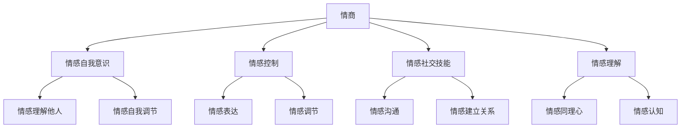

                 

# 《情商领导力：在职场中运用情感智慧》

## 关键词
- 情商领导力
- 情感智慧
- 职场管理
- 个人成长
- 领导力发展
- 跨文化管理
- 职场健康
- 情商评估

## 摘要
在快速变化的职场环境中，情商领导力成为成功的关键要素。本文从情商的定义、情商领导力与团队管理、个人成长、工作沟通、职场关系管理、领导力发展、跨文化管理和职场健康等多个维度，探讨了如何在职场中运用情感智慧。通过深入分析情商领导力的核心概念、实践应用和未来趋势，帮助读者理解和提升自己的情商领导力，实现职业和个人发展的双赢。

## 目录大纲

### 第一部分：情商领导力的核心概念

#### 第1章：情商的定义与重要性
- **1.1 情商的定义**
- **1.2 情商的四大要素**
  - **情感自我意识**
  - **情感控制**
  - **情感社交技能**
  - **情感理解**
- **1.3 情商在职场中的重要性**

#### 第2章：情商领导力与团队管理
- **2.1 情商领导力的核心原则**
- **2.2 情商领导力与团队管理的关系**
- **2.3 提高团队情商的策略**

#### 第3章：情商领导力与个人成长
- **3.1 情商领导力对个人成长的影响**
- **3.2 提高自我情商的技巧**
- **3.3 情商领导力在职业生涯中的应用**

### 第二部分：情商领导力的实践应用

#### 第4章：情商领导力在工作沟通中的应用
- **4.1 情商领导力与有效沟通**
- **4.2 提高沟通情商的技巧**
- **4.3 情商领导力在解决冲突中的应用**

#### 第5章：情商领导力在职场关系管理中的运用
- **5.1 情商领导力与职场关系**
- **5.2 建立和维护良好职场关系的策略**
- **5.3 提高职场情商的案例分析**

#### 第6章：情商领导力在领导力发展中的应用
- **6.1 情商领导力与领导力发展**
- **6.2 提高领导情商的技巧**
- **6.3 情商领导力在领导力培训中的应用**

#### 第7章：情商领导力在跨文化管理中的挑战与应对
- **7.1 跨文化管理中的情商挑战**
- **7.2 提高跨文化情商的策略**
- **7.3 情商领导力在跨国团队管理中的应用**

#### 第8章：情商领导力在职场健康与幸福中的价值
- **8.1 情商领导力与职场健康**
- **8.2 提高职场幸福的策略**
- **8.3 情商领导力在职场心理健康中的应用**

### 第三部分：情商领导力的未来发展

#### 第9章：情商领导力的趋势与未来
- **9.1 情商领导力的发展趋势**
- **9.2 情商领导力在教育、培训和其他领域的应用**
- **9.3 情商领导力的未来挑战与机遇**

#### 附录
- **附录A：情商领导力相关资源**
  - **A.1 情商领导力研究文献推荐**
  - **A.2 情商领导力书籍推荐**
  - **A.3 情商领导力在线课程推荐**

## 《情商领导力：在职场中运用情感智慧》正文开始

### 第一部分：情商领导力的核心概念

#### 第1章：情商的定义与重要性

**1.1 情商的定义**

情商（Emotional Intelligence，简称EQ）是指个体识别、理解、管理自己情绪的能力，以及识别、理解、影响他人情绪的能力。与智商（IQ）不同，情商关注的是情感智慧，即如何运用情感信息来解决问题、处理人际关系和实现个人目标。

情商的概念最早由心理学家约翰·梅耶（John D. Mayer）和彼得·萨洛维（Peter Salovey）在1990年提出。他们认为情商包括四个核心能力：情感自我意识、情感控制、情感社交技能和情感理解。

**1.2 情商的四大要素**

**情感自我意识**是指个体对自己情感状态的认识和觉察。它包括识别和理解自己的情绪，以及意识到情绪如何影响自己的行为和决策。

**情感控制**是指个体管理和调节自己情绪的能力。这包括情绪调节（调节情绪的表达和体验），以及情绪释放（在适当的时机和方式下表达情绪）。

**情感社交技能**是指个体在人际交往中运用情感信息的能力。这包括情感沟通（有效表达自己的情感和倾听他人），以及情感建立关系（建立和维护人际关系）。

**情感理解**是指个体理解和解释他人情感的能力。这包括情感识别（识别他人的情绪状态），以及情感同情（理解和感受他人的情感体验）。

**1.3 情商在职场中的重要性**

情商在职场中具有至关重要的地位。研究表明，情商对于职业成功的影响甚至超过智商和技能。以下是情商在职场中的几个重要作用：

**领导力发展**：情商领导者能够更好地理解和管理团队成员的情绪，建立高效的团队关系，提高团队绩效。情商领导力不仅体现在个人领导能力上，也体现在团队管理和组织发展上。

**团队合作**：情商高的个体能够更好地理解团队成员的需求和情感，促进沟通和合作，减少冲突，提高团队凝聚力。

**决策能力**：情商领导者能够更有效地处理复杂问题和决策过程中的情绪因素，避免情绪化的决策，提高决策质量。

**客户服务**：情商高的员工能够更好地理解客户的需求和情感，提供个性化的服务，提高客户满意度和忠诚度。

**职业发展**：情商对于个人职业发展具有积极影响，包括职业晋升、薪酬提升和职业满意度。

#### 第2章：情商领导力与团队管理

**2.1 情商领导力的核心原则**

情商领导力强调领导者通过情感智慧来管理团队。以下是一些核心原则：

**情感自我意识**：领导者首先需要认识到自己的情感状态，并理解这些情感如何影响自己的行为和决策。自我意识是情商领导力的基础。

**情感控制**：领导者需要能够管理和调节自己的情绪，特别是在压力和挑战面前。情感控制有助于领导者保持冷静和理性，做出明智的决策。

**情感社交技能**：领导者需要具备良好的情感沟通和建立关系的能力。这有助于领导者建立信任和尊重，提高团队凝聚力。

**情感理解**：领导者需要能够理解和解释团队成员的情感状态，提供支持和鼓励。情感理解有助于领导者更好地激励团队成员，发挥他们的潜力。

**2.2 情商领导力与团队管理的关系**

情商领导力对团队管理具有重要影响。以下是几个关键点：

**团队凝聚力**：情商领导者能够建立积极的团队氛围，增强团队成员之间的信任和尊重，提高团队凝聚力。

**团队绩效**：情商领导者能够激发团队成员的潜力，提高团队绩效。通过情感理解和管理，领导者能够更好地满足团队成员的需求，提高工作满意度和投入度。

**冲突管理**：情商领导者能够有效地处理团队内部的冲突，减少负面情绪的影响，维护团队和谐。

**创新与创造力**：情商领导者能够鼓励团队成员表达自己的观点和创意，激发团队的创新和创造力。

**2.3 提高团队情商的策略**

以下是一些提高团队情商的策略：

**领导者的榜样作用**：领导者通过自己的行为树立榜样，提高团队成员的情商水平。

**情感意识培训**：为团队成员提供情感意识培训，帮助他们认识和调节自己的情绪。

**情感沟通技巧**：提高团队成员的情感沟通能力，促进团队内部的开放和真诚交流。

**情感支持系统**：建立情感支持系统，为团队成员提供情感支持和辅导。

**定期团队建设活动**：通过团队建设活动，增强团队成员之间的情感联系和团队凝聚力。

#### 第3章：情商领导力与个人成长

**3.1 情商领导力对个人成长的影响**

情商领导力对个人成长具有深远的影响。以下是几个关键点：

**情感自我意识**：通过提高情感自我意识，个人能够更好地理解和管理自己的情绪，提高自我认知和自我调节能力。

**情感控制**：通过提高情感控制，个人能够更好地处理压力和挑战，保持冷静和理性，提高决策能力和问题解决能力。

**情感社交技能**：通过提高情感社交技能，个人能够更好地与他人沟通和建立关系，提高人际交往能力和团队合作能力。

**情感理解**：通过提高情感理解，个人能够更好地理解和尊重他人的情感，提高同理心和人际敏感性。

**3.2 提高自我情商的技巧**

以下是一些提高自我情商的技巧：

**自我反思**：定期进行自我反思，了解自己的情感状态和行为模式，找出需要改进的地方。

**情绪调节训练**：通过情绪调节训练，学会放松自己，减少负面情绪的影响。

**情感社交技巧**：通过阅读、学习和实践，提高自己的情感沟通和建立关系的能力。

**寻求反馈**：向信任的同事、朋友或导师寻求反馈，了解自己在情感处理和人际关系方面的表现，找出改进的方向。

**3.3 情商领导力在职业生涯中的应用**

情商领导力在职业生涯中具有重要作用。以下是几个关键点：

**职业晋升**：情商领导力有助于个人在职场中脱颖而出，获得更多的职业发展机会。

**团队合作**：情商领导力有助于建立高效的团队，提高团队绩效，实现个人和团队目标。

**人际关系**：情商领导力有助于建立良好的人际关系，提高工作满意度和职业幸福感。

**领导力发展**：情商领导力是领导者必备的素质，有助于个人在领导岗位上取得成功。

### 第二部分：情商领导力的实践应用

#### 第4章：情商领导力在工作沟通中的应用

**4.1 情商领导力与有效沟通**

情商领导力对于有效沟通至关重要。情商领导者能够通过情感智慧来改善沟通效果，提高沟通效率。以下是几个关键点：

**情感自我意识**：情商领导者能够认识到自己在沟通中的情感状态，避免因为情绪而导致的误解和冲突。

**情感控制**：情商领导者能够管理和调节自己的情绪，保持冷静和理性，使沟通更加有效。

**情感社交技能**：情商领导者能够运用情感社交技能，通过倾听、表达和理解，建立积极的沟通氛围。

**情感理解**：情商领导者能够理解和尊重他人的情感，从对方的角度出发，提高沟通效果。

**4.2 提高沟通情商的技巧**

以下是一些提高沟通情商的技巧：

**倾听**：倾听是有效沟通的关键。情商领导者要学会倾听他人的观点和情感，给予关注和理解。

**表达**：情商领导者能够清晰地表达自己的观点和情感，避免模糊和不明确的表述。

**同理心**：情商领导者能够站在对方的角度思考问题，表现出同理心，使沟通更加有效。

**反馈**：情商领导者能够提供具体、建设性的反馈，帮助团队成员改进和成长。

**4.3 情商领导力在解决冲突中的应用**

情商领导力在解决冲突中发挥着重要作用。以下是几个关键点：

**情感自我意识**：情商领导者能够认识到自己在冲突中的情感状态，避免情绪化的决策。

**情感控制**：情商领导者能够管理和调节自己的情绪，保持冷静和理性，寻找解决方案。

**情感社交技能**：情商领导者能够运用情感社交技能，通过协商和调解，解决冲突。

**情感理解**：情商领导者能够理解和尊重他人的情感，从对方的角度出发，寻找共赢的解决方案。

#### 第5章：情商领导力在职场关系管理中的运用

**5.1 情商领导力与职场关系**

情商领导力对于职场关系管理具有重要作用。以下是几个关键点：

**情感自我意识**：情商领导者能够认识到自己在职场关系中的情感状态，避免因情绪而导致的关系破裂。

**情感控制**：情商领导者能够管理和调节自己的情绪，保持积极和健康的职场关系。

**情感社交技能**：情商领导者能够运用情感社交技能，建立和维护良好的职场关系。

**情感理解**：情商领导者能够理解和尊重他人的情感，促进职场关系的和谐发展。

**5.2 建立和维护良好职场关系的策略**

以下是一些建立和维护良好职场关系的策略：

**建立信任**：信任是职场关系的基础。情商领导者要诚实守信，建立信任关系。

**尊重差异**：情商领导者要尊重团队成员的差异，包容不同的观点和情感。

**有效沟通**：情商领导者要通过有效沟通，促进职场关系的和谐发展。

**提供支持**：情商领导者要关心团队成员的成长和发展，提供必要的支持和帮助。

**5.3 提高职场情商的案例分析**

以下是一个提高职场情商的案例分析：

**案例背景**：某公司的一位项目经理在团队管理中遇到了困难。团队成员之间缺乏沟通，导致项目进展缓慢。项目经理意识到自己在沟通中存在不足，决定提高自己的情商水平。

**解决方案**：
1. **自我反思**：项目经理定期进行自我反思，了解自己在沟通中的情感状态和行为模式，找出需要改进的地方。
2. **情感调节训练**：项目经理参加情感调节训练，学习放松技巧和情绪管理方法，提高自己的情感控制能力。
3. **有效沟通**：项目经理运用有效沟通技巧，倾听团队成员的观点和情感，表达自己的意见和情感，建立积极的沟通氛围。
4. **建立信任**：项目经理通过诚实守信和关心团队成员，建立信任关系。

**案例结果**：通过提高情商，项目经理成功地改善了团队沟通，提高了项目进展，增强了团队凝聚力。

#### 第6章：情商领导力在领导力发展中的应用

**6.1 情商领导力与领导力发展**

情商领导力是领导力发展的重要组成部分。以下是几个关键点：

**情感自我意识**：情商领导者能够认识到自己的情感状态，了解这些情感如何影响自己的领导力和决策。

**情感控制**：情商领导者能够管理和调节自己的情绪，保持冷静和理性，提高领导力和决策能力。

**情感社交技能**：情商领导者能够运用情感社交技能，建立和维护良好的团队关系，提高领导力和团队绩效。

**情感理解**：情商领导者能够理解和尊重团队成员的情感，提高领导力和团队凝聚力。

**6.2 提高领导情商的技巧**

以下是一些提高领导情商的技巧：

**自我反思**：定期进行自我反思，了解自己的情感状态和行为模式，找出需要改进的地方。

**情感调节训练**：通过情感调节训练，学习放松技巧和情绪管理方法，提高自己的情感控制能力。

**有效沟通**：通过有效沟通技巧，倾听团队成员的观点和情感，表达自己的意见和情感，建立积极的沟通氛围。

**建立信任**：通过诚实守信和关心团队成员，建立信任关系。

**6.3 情商领导力在领导力培训中的应用**

情商领导力在领导力培训中具有重要地位。以下是几个关键点：

**情感自我意识**：在领导力培训中，通过自我反思和情感评估，提高领导者的情感自我意识。

**情感控制**：通过情感调节训练和情境模拟，提高领导者的情感控制能力。

**情感社交技能**：通过角色扮演和案例分析，提高领导者的情感社交技能。

**情感理解**：通过同理心和情感同理，提高领导者的情感理解能力。

#### 第7章：情商领导力在跨文化管理中的挑战与应对

**7.1 跨文化管理中的情商挑战**

跨文化管理中的情商挑战包括：

**文化差异**：不同文化背景的员工在价值观、沟通方式和行为习惯上存在差异，可能导致误解和冲突。

**情感表达**：不同文化对情感表达有不同的期望，可能存在情感压抑或过度表达的问题。

**文化认同**：跨文化团队中，员工可能面临文化认同的困惑，影响团队凝聚力和工作效率。

**7.2 提高跨文化情商的策略**

以下是一些提高跨文化情商的策略：

**文化意识**：提高文化意识，了解不同文化的特点和价值观，减少文化误解和冲突。

**情感调节**：通过情感调节技巧，适应不同文化的情感表达方式，提高跨文化沟通能力。

**建立信任**：通过建立信任关系，增强跨文化团队的凝聚力和合作效率。

**文化适应**：鼓励员工进行文化适应，培养跨文化团队合作的能力。

**7.3 情商领导力在跨国团队管理中的应用**

情商领导力在跨国团队管理中具有重要应用。以下是几个关键点：

**情感自我意识**：跨国团队领导者需要具备较高的情感自我意识，了解自己在跨文化环境中的情感状态。

**情感控制**：跨国团队领导者需要具备良好的情感控制能力，适应不同文化的情感表达方式。

**情感社交技能**：跨国团队领导者需要具备优秀的情感社交技能，建立和维护跨文化团队的信任和合作关系。

**情感理解**：跨国团队领导者需要具备强烈的情感理解能力，尊重和包容不同文化的员工。

### 第三部分：情商领导力的未来发展

#### 第9章：情商领导力的趋势与未来

**9.1 情商领导力的发展趋势**

情商领导力在未来将继续发展，呈现出以下趋势：

**情感智能技术**：随着情感智能技术的发展，情商领导力将更加依赖于数据分析和情感计算，实现更加精准和高效的领导力管理。

**跨学科整合**：情商领导力将与其他学科，如心理学、管理学、神经科学等，进行跨学科整合，形成更加全面和系统的理论体系。

**个性化和定制化**：情商领导力将更加注重个性化和定制化，根据不同员工的情感需求和能力特点，提供个性化的领导力发展方案。

**9.2 情商领导力在教育、培训和其他领域的应用**

情商领导力在教育、培训和其他领域具有广泛的应用前景：

**教育领域**：情商领导力将融入教育体系中，培养未来领导者的情感智慧，提高他们的综合素质和领导能力。

**培训领域**：情商领导力将成为企业培训的重要组成部分，帮助员工提升情感智慧，提高团队绩效和员工满意度。

**其他领域**：情商领导力将在公共管理、医疗保健、社区服务等领域发挥重要作用，提高组织的情商水平和整体效能。

**9.3 情商领导力的未来挑战与机遇**

情商领导力在未来将面临以下挑战和机遇：

**挑战**：
- **文化差异**：如何在不同文化背景下应用情商领导力，提高跨文化团队的效能。
- **技术依赖**：如何在情感智能技术的支持下，避免过度依赖技术，保持情商领导力的本质。
- **员工情感需求变化**：如何适应员工情感需求的变化，提供个性化的领导力发展支持。

**机遇**：
- **创新性应用**：如何利用情商领导力推动组织创新和变革，提高竞争力。
- **社会影响力**：如何通过情商领导力提升社会影响力，促进社会和谐发展。

### 附录

#### 附录A：情商领导力相关资源

**A.1 情商领导力研究文献推荐**

1. Mayer, J. D., Salovey, P., & Caruso, D. (1997). 'Emotional intelligence.' Imagination, Cognition and Personality, 9(3), 185-211.
2. Goleman, D. (1995). 'Emotional intelligence: Why it can matter more than IQ.' Bantam Books.
3. Boyatzis, R. E. (1999). 'Emotional intelligence, leadership, and learning: A review of research and development.' Consulting Psychology Journal: Practice and Research, 51(4), 267-283.

**A.2 情商领导力书籍推荐**

1. Goleman, D. (1995). 'Emotional Intelligence: Why It Can Matter More Than IQ.' Bantam Books.
2. Boyatzis, R. E., & Mayer, J. D. (2008). 'The Truth About Emotional Intelligence.' Harvard Business Review, 86(2), 98-113.
3. Mayer, J. D., Salovey, P., & Caruso, D. (2016). 'The New Science of Emotional Intelligence: Recognizing, Understanding, and Managing Your Emotions to Gain Personal and Professional Success.' Basic Books.

**A.3 情商领导力在线课程推荐**

1. Coursera - 'Emotional Intelligence: The Science of Happiness and Human Connection'
2. LinkedIn Learning - 'Emotional Intelligence: A Framework for Understanding and Managing Emotions'
3. edX - 'Emotional Intelligence: A Social Intelligence for Leaders'

### 核心概念与联系

**核心概念与联系流程图**



### 核心算法原理讲解

**情商领导力评估算法**

情商领导力评估算法是基于个体在情感自我意识、情感控制、情感社交技能和情感理解四个维度的表现来综合评估的。以下是评估算法的伪代码：

```python
def 情商领导力评估(情感自我意识, 情感控制, 情感社交技能, 情感理解):
    自我意识得分 = 计算得分(情感自我意识)
    控制得分 = 计算得分(情感控制)
    社交技能得分 = 计算得分(情感社交技能)
    理解得分 = 计算得分(情感理解)

    总得分 = 自我意识得分 * 0.4 + 控制得分 * 0.3 + 社交技能得分 * 0.3 + 理解得分 * 0.4

    如果 总得分 >= 90:
        返回 "高情商领导力"
    否则如果 总得分 >= 70:
        返回 "中情商领导力"
    否则:
        返回 "低情商领导力"
```

### 数学模型和数学公式

**情感自我意识的计算公式**

情感自我意识得分（Emotional Self-awareness Score，ESAS）的计算公式如下：

$$
ESAS = \frac{E1 + E2 + E3 + E4 + E5}{5}
$$

其中，E1, E2, E3, E4, E5 分别代表五个情感自我意识的指标得分。

$$
E1 = 2 \times (情感自我认知得分) - 1
$$

$$
E2 = 2 \times (情感自我理解得分) - 1
$$

$$
E3 = 2 \times (情感自我认知准确性得分) - 1
$$

$$
E4 = 2 \times (情感自我调节得分) - 1
$$

$$
E5 = 2 \times (情感自我表达得分) - 1
$$

其中，得分范围在0到1之间。

### 项目实战

**情商领导力评估工具开发**

**开发环境搭建：**
- 使用 Python 作为主要编程语言。
- 使用 Flask 作为 Web 应用框架。
- 使用 MySQL 作为数据库存储用户数据。

**源代码实现：**

```python
from flask import Flask, request, render_template
import pymysql

app = Flask(__name__)

# 数据库连接
def connect_db():
    return pymysql.connect(host='localhost', user='root', password='password', database='emotional_database')

@app.route('/')
def index():
    return render_template('index.html')

@app.route('/evaluate', methods=['POST'])
def evaluate():
    esas = float(request.form['esas'])
    ecs = float(request.form['ecs'])
    ess = float(request.form['ess'])
    eus = float(request.form['eus'])

    total_score = (0.4 * esas) + (0.3 * ecs) + (0.3 * ess) + (0.4 * eus)

    if total_score >= 90:
        result = "高情商领导力"
    elif total_score >= 70:
        result = "中情商领导力"
    else:
        result = "低情商领导力"

    return render_template('result.html', result=result)

if __name__ == '__main__':
    app.run(debug=True)
```

**代码解读与分析：**
- 代码首先导入了 Flask 库和 pymysql 库。
- 定义了一个 Flask 应用程序。
- `connect_db` 函数用于连接 MySQL 数据库。
- `index` 函数返回主页面模板。
- `evaluate` 函数接收用户输入的四个维度的得分，计算总得分，并根据总得分返回情商领导力评估结果。
- 在 `evaluate` 函数中，通过 HTML 表单发送的用户输入得分使用 `request.form` 获取。
- 评估结果通过模板渲染显示给用户。

### 作者信息

**作者：AI天才研究院/AI Genius Institute & 禅与计算机程序设计艺术 /Zen And The Art of Computer Programming**

