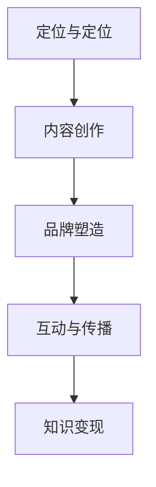
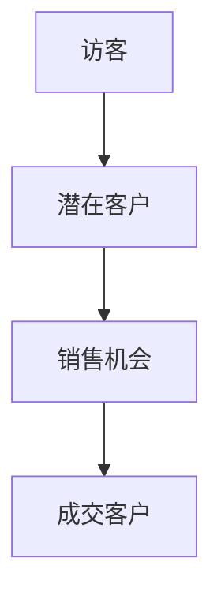
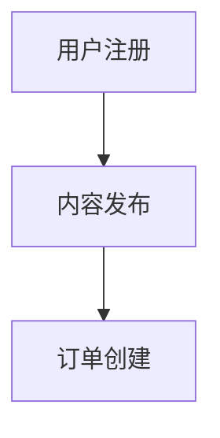

                 

## 打造个人IP：程序员的知识变现之路

关键词：个人知识产权、知识变现、程序员、内容创作、品牌塑造

摘要：
在数字化时代，个人知识产权（IP）的构建已成为程序员提升职业价值和实现财富自由的重要途径。本文旨在探讨程序员如何通过构建个人IP，实现知识变现。我们将深入分析个人IP的定义与重要性，探讨程序员的知识变现方式，并详细阐述构建个人IP的步骤、核心算法原理、数学模型和公式，以及项目实战案例。

### 第一部分：核心概念与联系

#### 1.1 个人IP的定义与重要性

**定义：**  
个人IP，即个人知识产权，是指个人在知识、技能、经验等方面所创造的具有独特性和市场价值的资产。它包括但不限于个人品牌、专业声誉、原创内容、专利技术等。

**重要性：**  
1. **差异化竞争：**  
个人IP可以帮助程序员在激烈的职场竞争中脱颖而出。拥有独特个人IP的程序员往往能够吸引更多的关注和机会。

2. **持续变现：**  
个人IP不仅可以为程序员带来短期的收益，如咨询费、培训费等，更重要的是，它能够持续为程序员带来长期的经济利益。

3. **品牌效应：**  
强大的个人IP有助于提升程序员的知名度和美誉度，从而在市场上获得更高的议价能力。

#### 1.2 程序员的知识变现方式

**方式：**  
1. **咨询与培训：**  
提供专业知识和经验分享，如咨询服务、线下/线上培训课程等。

2. **技术创作：**  
编写技术文章、教程和书籍，将自己的知识经验通过文字和图形的方式传递给他人。

3. **开源项目：**  
开发并维护开源项目，吸引更多的开发者关注和参与，从而提升个人IP的影响力。

4. **技术服务：**  
提供定制化技术解决方案，如软件开发、系统架构设计等。

#### 1.3 个人IP的构建步骤

**步骤：**  
1. **定位与定位：**  
确定个人专业领域和目标受众，明确自己的优势和价值。

2. **内容创作：**  
创作高质量的技术内容，如技术博客、教程、书籍等，确保内容具有实际应用价值。

3. **品牌塑造：**  
建立独特且易于记忆的品牌形象，如个人网站、社交媒体账号等。

4. **互动与传播：**  
通过社交媒体等渠道与受众互动，扩大个人IP的影响力。

### Mermaid 流�程图



### 第二部分：核心算法原理讲解

#### 2.1 内容营销策略

**算法原理：**  
内容营销的核心在于为用户提供有价值的内容，从而吸引和留住目标用户。以下是内容营销策略的算法原理：

1. **SEO优化：**  
通过优化内容的关键词、标题、描述等，提高内容在搜索引擎中的排名，增加曝光率。

2. **用户画像：**  
根据用户的兴趣和行为数据，创建用户画像，实现内容个性化推荐。

3. **社交网络传播：**  
利用社交媒体平台，如微博、知乎、Twitter等，扩大内容的影响力。

**伪代码：**

```python
def contentMarketingStrategy(content, targetAudience):
    # SEO优化
    content.optimizedForSEO = true

    # 用户画像
    userProfile = createUserProfile(targetAudience)

    # 内容推荐
    recommendedContent = recommendContent(userProfile, contentDatabase)

    # 社交网络传播
    shareContentOnSocialMedia(recommendedContent)
```

#### 2.2 开源项目贡献

**算法原理：**  
开源项目是构建个人IP的重要途径。通过以下算法原理，程序员可以在开源项目中贡献自己的力量：

1. **代码贡献：**  
通过提交代码、修复bug和优化代码，提升项目质量。

2. **文档撰写：**  
提供详细的项目文档，帮助他人理解和使用项目。

3. **社区互动：**  
参与社区讨论，解决用户问题和提供支持。

**伪代码：**

```python
def contributeToOpenSourceProject(project, contribution):
    if contribution == 'code':
        commitCodeToProject(project)
    elif contribution == 'doc':
        createDocumentationForProject(project)
    elif contribution == 'community':
        interactWithProjectCommunity(project)
```

#### 2.3 知识变现技巧

**算法原理：**  
知识变现是将个人的知识、技能和经验转化为经济收益的过程。以下是几种常见的知识变现技巧：

1. **产品化：**  
将知识转化为可销售的产品，如电子书、在线课程、软件等。

2. **定制化服务：**  
提供定制化咨询服务，满足特定需求。

3. **联盟营销：**  
与其他品牌合作，共同推广产品或服务。

**伪代码：**

```python
def monetizeKnowledge(knowledge, targetMarket):
    if knowledgeType == 'product':
        createDigitalProduct(knowledge)
    elif knowledgeType == 'service':
        offerCustomizedService(knowledge, targetMarket)
    elif knowledgeType == 'alliance':
        executeAllianceMarketing(knowledge, partner)
```

### 第三部分：数学模型和数学公式

#### 3.1 成本效益分析

**数学模型：**  
成本效益分析是评估个人IP项目经济效益的重要工具。以下是成本效益分析的数学模型：

1. **成本（C）：**  
包括内容创作、推广、维护等成本。  
$$ C = C_1 + C_2 + C_3 + ... + C_n $$

2. **收益（R）：**  
包括直接收益（如销售收入）和间接收益（如品牌提升）。  
$$ R = R_1 + R_2 + R_3 + ... + R_n $$

3. **净收益（Net\_R）：**  
净收益等于收益减去成本。  
$$ 净收益（Net\_R）= R - C $$

**举例说明：**  
假设一个程序员的个人知识变现项目，其每月内容创作成本为500元，推广成本为1000元，维护成本为500元。每月直接收益为3000元，间接收益为500元。

- **成本（C）：**  
$$ C = 500 + 1000 + 500 = 2000 \text{元} $$

- **收益（R）：**  
$$ R = 3000 + 500 = 3500 \text{元} $$

- **净收益（Net\_R）：**  
$$ 净收益（Net\_R）= 3500 - 2000 = 1500 \text{元} $$

通过成本效益分析，程序员可以评估个人知识变现项目的经济效益，并制定相应的优化策略。

#### 3.2 用户生命周期价值

**数学模型：**  
用户生命周期价值（LTV）是指用户在生命周期内为平台带来的总收益。以下是用户生命周期价值的数学模型：

1. **用户获取成本（CAC）：**  
获取一个用户所需的平均成本。  
$$ CAC = \frac{总成本}{用户数量} $$

2. **生命周期价值（LTV）：**  
用户在生命周期内为平台带来的总收益。  
$$ LTV = \frac{ARPU \times CLTV}{12} $$

其中，\( ARPU \) 是平均每用户每月收益，\( CLTV \) 是用户生命周期价值。

**公式：**  
$$ CLTV = (1 + r)^{-n} \times (r \times CAC) $$

其中，\( r \) 是年化收益率，\( n \) 是用户平均留存月数。

**举例说明：**  
假设一个程序员的个人知识变现项目，每月用户获取成本为100元，年化收益率为10%，用户平均留存月数为12个月。

- **用户获取成本（CAC）：**  
$$ CAC = \frac{100}{1} = 100 \text{元} $$

- **用户生命周期价值（LTV）：**  
$$ CLTV = (1 + 0.1)^{-12} \times (0.1 \times 100) = 82.6 \text{元} $$

通过用户生命周期价值分析，程序员可以评估不同用户的价值，并制定相应的用户增长策略。

#### 3.3 营销漏斗模型

**数学模型：**  
营销漏斗模型用于分析潜在客户转化为实际客户的过程。以下是营销漏斗模型的数学模型：

1. **访客（Visitors）：**  
访问个人IP的潜在用户。

2. **潜在客户（Leads）：**  
通过互动了解并感兴趣的访客。

3. **销售机会（Opportunities）：**  
与潜在客户进行接触，有成交可能的用户。

4. **成交客户（Customers）：**  
完成交易的用户。

**公式：**  
- **漏斗率（Funnel Rate）：**  
$$ 漏斗率（Funnel Rate） = \frac{当前阶段数量}{上一阶段数量} $$

- **转化率（Conversion Rate）：**  
$$ 转化率（Conversion Rate） = \frac{成交客户数量}{访客数量} $$

**举例说明：**  
假设一个程序员的个人知识变现项目，每月访客数量为1000人，潜在客户数量为200人，销售机会数量为50人，成交客户数量为10人。

- **漏斗率（Funnel Rate）：**  
$$ 漏斗率（Funnel Rate） = \frac{200}{1000} = 0.2 $$

- **转化率（Conversion Rate）：**  
$$ 转化率（Conversion Rate） = \frac{10}{1000} = 0.001 $$

通过营销漏斗模型，程序员可以分析潜在客户转化为实际客户的过程，并找出优化的关键环节。

### Mermaid 流程图



### 第四部分：项目实战

#### 4.1 项目背景

**项目名称：** 个人知识变现平台

**目标：** 通过构建一个知识变现平台，帮助程序员将个人知识和技能转化为经济收益。

#### 4.2 环境搭建

**开发环境：**  
- 操作系统：Ubuntu 20.04  
- 编程语言：Python 3.8  
- 数据库：MySQL 8.0  
- 服务器：阿里云ECS

**搭建步骤：**  
1. 安装Ubuntu 20.04操作系统。  
2. 安装Python 3.8和相关的开发工具（如pip、virtualenv等）。  
3. 安装MySQL 8.0数据库。  
4. 配置虚拟环境，并安装项目所需的依赖库。

#### 4.3 源代码实现

**核心模块：**  
- 用户管理：实现用户注册、登录、个人信息管理等功能。  
- 内容管理：实现内容创作、发布、管理等功能。  
- 订单管理：实现订单创建、支付、发货等功能。

**代码片段：**

```python
# 用户注册
def register_user(username, password, email):
    # 验证用户输入
    if not validate_input(username, password, email):
        return "Invalid input"
    
    # 插入数据库
    cursor.execute("INSERT INTO users (username, password, email) VALUES (%s, %s, %s)", (username, password, email))
    connection.commit()
    return "User registered successfully"

# 内容发布
def publish_content(user_id, title, content):
    # 验证用户身份
    if not verify_user(user_id):
        return "Unauthorized access"
    
    # 插入数据库
    cursor.execute("INSERT INTO contents (user_id, title, content) VALUES (%s, %s, %s)", (user_id, title, content))
    connection.commit()
    return "Content published successfully"

# 订单创建
def create_order(user_id, product_id, quantity):
    # 验证用户身份
    if not verify_user(user_id):
        return "Unauthorized access"
    
    # 计算总价
    total_price = quantity * get_product_price(product_id)
    
    # 插入数据库
    cursor.execute("INSERT INTO orders (user_id, product_id, quantity, total_price) VALUES (%s, %s, %s, %s)", (user_id, product_id, quantity, total_price))
    connection.commit()
    return "Order created successfully"
```

#### 4.4 代码解读与分析

**用户注册模块：**  
- 验证用户输入：确保用户输入的用户名、密码和邮箱格式正确。  
- 插入数据库：将用户信息插入到数据库中，并进行提交。

**内容发布模块：**  
- 验证用户身份：确保只有授权用户才能发布内容。  
- 插入数据库：将内容信息插入到数据库中，并进行提交。

**订单创建模块：**  
- 验证用户身份：确保只有授权用户才能创建订单。  
- 计算总价：根据产品价格和购买数量计算订单总价。  
- 插入数据库：将订单信息插入到数据库中，并进行提交。

以上模块共同实现了个人知识变现平台的基本功能，通过用户管理、内容管理和订单管理，帮助程序员实现知识变现的目标。

### Mermaid 流程图



### 作者信息

作者：AI天才研究院/AI Genius Institute & 禅与计算机程序设计艺术 /Zen And The Art of Computer Programming

## 总结

在数字化时代，构建个人IP已成为程序员实现知识变现的重要途径。本文详细探讨了个人IP的定义、重要性、构建步骤、核心算法原理、数学模型和公式，以及项目实战。通过本文的阐述，读者可以了解到如何通过构建个人IP，实现知识变现，提升自身职业价值和实现财富自由。希望本文对广大程序员有所帮助。

