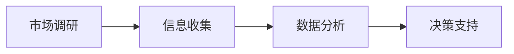

                 

# 技术人如何进行有效的市场调研和竞品分析

> **关键词**：市场调研、竞品分析、定量研究、定性研究、大数据分析、技术人

> **摘要**：
本文旨在帮助技术人掌握市场调研和竞品分析的核心方法与技巧。我们将从市场调研的基本概念和重要性出发，详细探讨市场调研的流程、技术与方法。接着，我们将深入分析竞品分析的概念、原则与实际应用。最后，通过经典案例分析、工具介绍及实战代码，展示如何将理论知识转化为实践能力。

## 目录

1. **市场调研概述**
   1.1. 市场调研的基本概念与重要性
   1.2. 市场调研的流程与步骤
   1.3. 定量市场调研技术
   1.4. 定性市场调研方法
2. **市场调研技术与方法**
   2.1. 市场调研的流程与步骤
   2.2. 大数据与市场调研
3. **竞品分析**
   3.1. 竞品分析的概念与原则
   3.2. 竞品分析的流程与步骤
   3.3. 竞品分析的实践与应用
4. **实战案例分析**
   4.1. 市场调研与竞品分析的经典案例分析
5. **工具与资源**
   5.1. 市场调研与竞品分析工具介绍

## 第1章：市场调研概述

### 1.1.1 市场调研的定义与目的

市场调研是一项旨在收集、分析和解释关于市场、消费者、产品、竞争对手及整体行业信息的研究活动。它的目的是帮助企业在决策过程中获得有价值的洞察力，从而更好地满足市场需求、提高市场竞争力。

- **核心概念与联系**：

在这个流程中，市场调研首先通过信息收集来获取市场数据，然后通过对这些数据的分析来提炼出关键信息，最后将这些信息转化为企业的决策支持。

### 1.1.2 市场调研的重要性

市场调研对于企业的重要性不容忽视。以下是市场调研的几个关键作用：

- **降低市场风险**：通过市场调研，企业可以更准确地了解市场趋势、消费者需求和竞争对手情况，从而减少决策的不确定性。
- **提高市场竞争力**：市场调研能够帮助企业发现市场需求和潜在机会，从而制定出更具有竞争力的市场策略。
- **优化产品和服务**：通过了解消费者的反馈和市场趋势，企业可以不断优化其产品和服务，提高客户满意度。

### 1.1.3 市场调研的类型与方法

市场调研可以分为定量调研和定性调研两大类。每种调研方法都有其独特的适用场景和优势。

- **定量调研**：通过量化的方法，如问卷、统计数据等，对大范围人群进行调查。其优点是数据量大、结果具有代表性，但可能缺乏深度。
- **定性调研**：通过质化的方法，如访谈、焦点小组讨论等，对少数人群进行深入调查。其优点是能够获取深入、细致的信息，但样本量小，结果可能不具有广泛代表性。

### 1.1.4 市场调研的流程与步骤

市场调研通常包括以下步骤：

1. **明确目标**：确定市场调研的具体目标，例如了解市场需求、分析竞争对手、评估产品性能等。
2. **定义范围**：确定调研的覆盖范围，包括目标市场、样本大小等。
3. **选择方法**：根据调研目标选择合适的调研方法，如定量调研或定性调研。
4. **设计问卷/访谈提纲**：制定详细的问卷或访谈提纲，确保能够收集到所需信息。
5. **数据收集**：实施调研计划，收集数据。
6. **数据分析**：对收集到的数据进行分析，提炼出关键信息。
7. **撰写报告**：将分析结果撰写成报告，为决策提供支持。

## 第2章：市场调研的流程与步骤

### 2.1.1 市场调研的准备阶段

在市场调研的初期，准备工作至关重要。以下是准备阶段的主要任务：

1. **明确目标**：确保调研目标具体、明确，例如了解某一产品在市场上的接受程度，或分析竞争对手的产品特点。
2. **定义范围**：确定调研的覆盖范围，包括目标市场、样本大小等。这将有助于确定调研的深度和广度。
3. **选择方法**：根据调研目标选择合适的调研方法，如定量调研或定性调研。例如，如果需要了解消费者的具体需求，可以选择定量调研；如果需要深入了解消费者对某一产品的看法，可以选择定性调研。
4. **设计问卷/访谈提纲**：制定详细的问卷或访谈提纲，确保能够收集到所需信息。问卷应包含开放性和封闭性题目，以获取不同类型的数据。

### 2.1.2 市场调研的设计阶段

设计阶段是市场调研的核心环节，它决定了调研的质量和有效性。以下是设计阶段的主要任务：

1. **确定调研方法**：根据明确的目标和定义的范围，选择最合适的调研方法。例如，如果目标是分析市场需求，可以选择问卷调查；如果目标是深入了解消费者对某一产品的看法，可以选择深度访谈。
2. **设计问卷/访谈提纲**：问卷和访谈提纲的设计至关重要。问卷应包含开放性和封闭性题目，以获取不同类型的数据。访谈提纲应围绕调研目标，确保能够深入了解受访者的观点和需求。
3. **预测试**：在正式调研前，对问卷或访谈提纲进行预测试，以发现和修正潜在的问题。预测试可以采用小样本的方式进行，确保问卷或访谈能够有效收集到所需信息。

### 2.1.3 数据收集阶段

数据收集阶段是市场调研的核心环节，决定了调研结果的质量。以下是数据收集阶段的主要任务：

1. **实施调研计划**：根据设计阶段的成果，实施调研计划。如果采用问卷调查，可以通过线上或线下方式收集数据；如果采用深度访谈，可以邀请受访者进行一对一访谈。
2. **数据清洗**：在收集到大量数据后，进行数据清洗，去除无效或错误的数据，确保数据的准确性和完整性。
3. **数据存储**：将收集到的数据存储在数据库或文件中，方便后续的分析和处理。

### 2.1.4 数据分析阶段

数据分析阶段是市场调研的升华阶段，通过对数据的深入分析，提炼出有价值的信息。以下是数据分析阶段的主要任务：

1. **描述性统计分析**：对数据进行描述性统计分析，包括计算均值、中位数、标准差等。这有助于了解数据的分布情况和总体趋势。
2. **相关性分析**：分析不同变量之间的关系，例如消费者满意度与购买意愿之间的关系。这有助于发现潜在的市场规律。
3. **回归分析**：通过回归分析，建立数学模型，预测市场趋势和消费者行为。这有助于为企业决策提供科学依据。
4. **数据可视化**：将分析结果以图表、图形等形式展示，使结果更加直观、易于理解。

### 2.1.5 市场调研报告撰写

市场调研报告是调研结果的最终呈现形式，它为企业决策提供了重要的依据。以下是撰写市场调研报告的主要任务：

1. **撰写报告大纲**：确定报告的结构和内容，包括摘要、引言、方法、结果、讨论和结论等部分。
2. **编写报告正文**：根据调研结果，详细阐述分析过程和结论。报告应逻辑清晰、条理分明，确保读者能够准确理解调研结果。
3. **数据可视化**：在报告中使用图表、图形等形式展示分析结果，使结果更加直观、易于理解。
4. **撰写摘要和结论**：摘要应简要概括调研结果，结论应明确指出调研对企业决策的启示和建议。

## 第3章：定量市场调研技术

### 3.1.1 问卷设计与实施

问卷设计是定量市场调研的核心环节，它决定了数据收集的质量。以下是问卷设计的主要任务：

1. **确定问卷结构**：问卷通常包括背景信息、核心问题和额外问题。背景信息用于了解受访者的基本特征，核心问题用于收集关键信息，额外问题用于补充调研目标。
2. **设计题目**：题目应简洁明了，避免使用专业术语。题目类型包括开放性题目和封闭性题目。开放性题目允许受访者自由表达观点，封闭性题目提供预设选项。
3. **设置选项**：为封闭性题目设置合理选项，确保选项覆盖所有可能的情况。例如，在调查消费者满意度时，可以设置“非常满意”、“满意”、“一般”、“不满意”和“非常不满意”等选项。
4. **预测试**：在正式实施前，对问卷进行预测试，以确保问卷的有效性和可靠性。

问卷实施是数据收集的关键环节，以下是实施的主要任务：

1. **选择调查方式**：可以选择线上或线下方式进行调查。线上调查可以通过电子邮件、社交媒体或在线调查平台进行，线下调查可以通过面对面访谈或电话访问进行。
2. **培训调查员**：如果采用线下调查，需要对调查员进行培训，确保他们了解问卷内容和调查流程，并能够准确、客观地收集数据。
3. **收集数据**：按照调研计划，实施问卷调查，收集数据。
4. **数据清洗**：在收集到大量数据后，进行数据清洗，去除无效或错误的数据，确保数据的准确性和完整性。

### 3.1.2 采访调研

采访调研是一种深入的定性调研方法，它能够获取受访者的详细观点和感受。以下是采访调研的主要任务：

1. **设计访谈问题**：访谈问题应围绕调研目标，确保能够深入了解受访者的观点和需求。问题类型包括开放性问题和封闭性问题。
2. **选择访谈对象**：根据调研目标，选择合适的访谈对象。例如，如果要了解消费者对某一产品的看法，可以选择该产品的消费者。
3. **进行访谈**：按照访谈计划，与受访者进行一对一访谈，记录访谈内容。
4. **数据整理**：对访谈内容进行整理，提炼出关键信息。

### 3.1.3 观察调研

观察调研是通过观察受访者的行为和互动，获取有关市场信息的定性调研方法。以下是观察调研的主要任务：

1. **选择观察对象**：根据调研目标，选择合适的观察对象。例如，如果要了解消费者在购物过程中的行为，可以选择在商场进行观察。
2. **设计观察表格**：设计观察表格，用于记录受访者的行为和互动。
3. **进行观察**：按照观察计划，进行实地观察，记录观察结果。
4. **数据整理**：对观察结果进行整理，提炼出关键信息。

### 3.1.4 实验调研

实验调研是通过实验方法，控制变量，观察和测量结果的变化，以研究市场现象的方法。以下是实验调研的主要任务：

1. **设计实验**：根据调研目标，设计实验方案。实验方案应包括实验假设、实验变量、实验组和对照组等。
2. **实施实验**：按照实验方案，实施实验，收集数据。
3. **数据分析**：对实验数据进行统计分析，验证实验假设。
4. **实验结果**：根据实验结果，得出结论。

## 第4章：定性市场调研方法

### 4.1.1 深度访谈

深度访谈是一种深入探讨受访者观点和感受的定性调研方法。以下是深度访谈的主要任务：

1. **选择访谈对象**：根据调研目标，选择合适的访谈对象。例如，如果要了解消费者对某一产品的看法，可以选择该产品的消费者。
2. **设计访谈问题**：访谈问题应围绕调研目标，确保能够深入了解受访者的观点和需求。问题类型包括开放性问题和封闭性问题。
3. **进行访谈**：按照访谈计划，与受访者进行一对一访谈，记录访谈内容。
4. **数据整理**：对访谈内容进行整理，提炼出关键信息。

### 4.1.2 小组座谈会

小组座谈会是一种集体讨论的定性调研方法，它能够获取多角度的观点和见解。以下是小组座谈会的主要任务：

1. **选择座谈会对象**：根据调研目标，选择合适的座谈会对象。例如，如果要了解消费者对某一产品的看法，可以选择该产品的消费者和潜在消费者。
2. **设计座谈会问题**：座谈会问题应围绕调研目标，确保能够引导座谈会参与者深入讨论。问题类型包括开放性问题和封闭性问题。
3. **组织座谈会**：按照座谈会计划，组织座谈会，确保参与者能够充分表达观点。
4. **数据整理**：对座谈会内容进行整理，提炼出关键信息。

### 4.1.3 焦点小组讨论

焦点小组讨论是一种集中讨论的定性调研方法，它能够快速收集大量信息。以下是焦点小组讨论的主要任务：

1. **选择讨论对象**：根据调研目标，选择合适的讨论对象。例如，如果要了解消费者对某一产品的看法，可以选择该产品的消费者和潜在消费者。
2. **设计讨论问题**：讨论问题应围绕调研目标，确保能够引导参与者深入讨论。问题类型包括开放性问题和封闭性问题。
3. **组织讨论**：按照讨论计划，组织焦点小组讨论，确保参与者能够充分表达观点。
4. **数据整理**：对讨论内容进行整理，提炼出关键信息。

### 4.1.4 情境模拟

情境模拟是一种通过模拟特定情境，收集参与者反应和意见的定性调研方法。以下是情境模拟的主要任务：

1. **设计情境**：根据调研目标，设计模拟情境。情境应具有代表性，能够引发参与者的兴趣和反应。
2. **选择参与者**：根据调研目标，选择合适的参与者。例如，如果要了解消费者对某一产品的看法，可以选择该产品的消费者和潜在消费者。
3. **进行模拟**：按照情境设计，进行模拟，观察参与者的反应和意见。
4. **数据整理**：对模拟过程进行记录，提炼出关键信息。

## 第5章：大数据与市场调研

### 5.1.1 大数据的概念与特点

大数据是指数据量巨大、类型繁多、价值密度低的数据集合。其特点包括：

1. **数据量大**：大数据的数据量通常在PB级以上。
2. **类型繁多**：大数据包括结构化数据、半结构化数据和非结构化数据。
3. **价值密度低**：大数据中的有价值信息比例较低，需要通过大数据技术进行筛选和分析。

### 5.1.2 大数据在市场调研中的应用

大数据技术在市场调研中具有广泛的应用，包括：

1. **消费者行为分析**：通过大数据技术，可以实时监控和分析消费者的行为，了解他们的需求和偏好。
2. **市场趋势预测**：通过大数据分析，可以预测市场趋势，为企业的决策提供依据。
3. **竞争对手分析**：通过大数据技术，可以实时监控和评估竞争对手的行为和策略，为企业制定竞争策略提供支持。

### 5.1.3 大数据挖掘与分析

大数据挖掘与分析是大数据技术的重要组成部分，包括以下步骤：

1. **数据收集**：收集相关的市场数据，包括消费者行为数据、市场趋势数据等。
2. **数据清洗**：去除无效或错误的数据，确保数据的准确性和完整性。
3. **数据预处理**：对数据进行清洗、转换和集成，为后续分析做准备。
4. **数据分析**：采用各种数据分析方法，如统计分析、机器学习等，对数据进行深入分析。
5. **数据可视化**：将分析结果以图表、图形等形式展示，使结果更加直观、易于理解。

## 第6章：竞品分析的概念与原则

### 6.1.1 竞品分析的定义与目的

竞品分析是指通过分析竞争对手的产品、服务、市场策略等，了解竞争对手的优势和劣势，为企业的产品开发、市场策略和竞争策略提供参考。竞品分析的主要目的是：

1. **了解竞争对手**：通过竞品分析，了解竞争对手的产品特点、市场策略和竞争优势，为企业制定竞争策略提供依据。
2. **优化产品和服务**：通过竞品分析，发现自身产品和服务的不足之处，为产品优化和改进提供参考。
3. **制定市场策略**：通过竞品分析，了解市场需求和竞争环境，为企业制定市场策略提供支持。

### 6.1.2 竞品分析的原则与方法

竞品分析应遵循以下原则：

1. **客观性**：竞品分析应基于客观事实，避免主观偏见。
2. **全面性**：竞品分析应涵盖竞争对手的各个方面，包括产品、服务、市场策略等。
3. **持续更新**：竞品分析应持续更新，以适应市场的变化和竞争对手的调整。

竞品分析的方法包括：

1. **定量分析**：通过量化数据，如市场份额、销售额等，对竞争对手进行客观评估。
2. **定性分析**：通过文本分析、访谈等方式，深入了解竞争对手的产品特点和市场策略。
3. **对比分析**：将自身产品和竞争对手的产品进行对比，找出优势和不足。

### 6.1.3 竞品分析的重要性

竞品分析对于企业的重要性体现在以下几个方面：

1. **了解市场趋势**：通过竞品分析，可以了解市场的最新趋势和需求，为企业制定市场策略提供支持。
2. **优化产品和服务**：通过竞品分析，可以了解竞争对手的产品特点和市场策略，发现自身产品和服务的不足之处，为优化和改进提供参考。
3. **制定竞争策略**：通过竞品分析，可以了解竞争对手的优势和劣势，为企业的竞争策略提供支持。
4. **提高市场竞争力**：通过竞品分析，可以优化产品和服务，提高市场竞争力，从而实现业务的持续增长。

## 第7章：竞品分析的流程与步骤

### 7.1.1 竞品分析的准备阶段

竞品分析的准备阶段是整个过程的起点，至关重要。以下是准备阶段的主要任务：

1. **明确分析目标**：确定竞品分析的具体目标，例如了解竞争对手的市场策略、产品特点等。
2. **确定竞争对手**：根据分析目标，确定需要分析的竞争对手。竞争对手的选择应基于市场地位、产品定位等方面。
3. **收集竞品信息**：通过公开渠道、行业报告、社交媒体等，收集竞争对手的产品信息、市场策略等。
4. **制定分析框架**：根据分析目标，制定分析框架，明确需要分析和评估的各个方面。

### 7.1.2 竞品信息收集

竞品信息收集是竞品分析的核心环节，决定了分析的质量。以下是信息收集的主要任务：

1. **数据来源**：确定数据来源，包括公开渠道、行业报告、社交媒体等。
2. **收集数据**：通过爬虫、手动收集等方式，收集竞争对手的产品信息、市场策略等。
3. **数据整理**：对收集到的数据进行分析和整理，确保数据的准确性和完整性。

### 7.1.3 竞品分析数据的整理与处理

竞品分析数据的整理与处理是确保数据分析准确性的关键。以下是数据整理和处理的主要任务：

1. **数据清洗**：去除无效或错误的数据，确保数据的准确性和完整性。
2. **数据转换**：将不同格式的数据进行转换，确保数据的统一性。
3. **数据存储**：将整理后的数据存储在数据库或文件中，方便后续的分析和处理。

### 7.1.4 竞品分析结果分析与解读

竞品分析结果分析与解读是竞品分析的最后一步，它将直接影响企业的决策。以下是结果分析和解读的主要任务：

1. **结果分析**：对收集到的数据进行统计分析，找出竞争对手的优势和劣势。
2. **结果解读**：根据分析结果，结合企业的实际情况，进行解读和总结。
3. **提出建议**：根据分析结果，为企业制定竞争策略和产品优化方案提供建议。

## 第8章：竞品分析的实践与应用

### 8.1.1 竞品分析在产品策略制定中的应用

竞品分析在产品策略制定中具有重要作用。以下是竞品分析在产品策略制定中的应用：

1. **产品定位**：通过竞品分析，了解竞争对手的产品定位，为自身产品定位提供参考。
2. **功能特点**：通过竞品分析，了解竞争对手的产品功能特点，为自身产品功能设计提供参考。
3. **价格策略**：通过竞品分析，了解竞争对手的价格策略，为自身价格策略制定提供参考。

### 8.1.2 竞品分析在市场营销中的应用

竞品分析在市场营销中具有重要作用。以下是竞品分析在市场营销中的应用：

1. **广告宣传**：通过竞品分析，了解竞争对手的广告宣传策略，为自身广告宣传策略制定提供参考。
2. **促销活动**：通过竞品分析，了解竞争对手的促销活动，为自身促销活动设计提供参考。
3. **社交媒体营销**：通过竞品分析，了解竞争对手的社交媒体营销策略，为自身社交媒体营销策略制定提供参考。

### 8.1.3 竞品分析在企业战略规划中的应用

竞品分析在企业战略规划中具有重要作用。以下是竞品分析在企业战略规划中的应用：

1. **市场拓展**：通过竞品分析，了解竞争对手的市场拓展策略，为自身市场拓展策略制定提供参考。
2. **产品线规划**：通过竞品分析，了解竞争对手的产品线规划，为自身产品线规划提供参考。
3. **竞争策略**：通过竞品分析，了解竞争对手的竞争策略，为自身竞争策略制定提供参考。

## 第9章：市场调研与竞品分析的经典案例分析

### 9.1.1 案例一：某互联网公司的市场调研与竞品分析实践

某互联网公司希望通过市场调研和竞品分析，了解当前市场的需求，为产品开发提供依据。

**市场调研实践**：

1. **明确目标**：了解消费者对当前市场上主流短视频应用的需求。
2. **收集数据**：通过线上问卷调查、社交媒体数据分析等方式，收集消费者对短视频应用的使用习惯、需求等数据。
3. **数据分析**：对收集到的数据进行分析，找出消费者最关注的功能点。
4. **撰写报告**：根据分析结果，撰写市场调研报告，为产品开发提供参考。

**竞品分析实践**：

1. **确定竞争对手**：确定当前市场上主要的短视频应用，如抖音、快手等。
2. **收集竞品信息**：通过竞品网站、社交媒体等渠道，收集竞争对手的产品特点、用户评价等数据。
3. **数据分析**：对收集到的数据进行整理和分析，找出竞争对手的优势和劣势。
4. **撰写报告**：根据分析结果，撰写竞品分析报告，为产品开发提供参考。

### 9.1.2 案例二：某消费电子品牌的竞品分析与市场调研策略

某消费电子品牌希望通过竞品分析和市场调研，了解当前市场上智能手机的竞争态势，为产品研发提供依据。

**市场调研实践**：

1. **明确目标**：了解消费者对当前市场上智能手机的需求和偏好。
2. **收集数据**：通过线上问卷调查、电商平台数据分析等方式，收集消费者对智能手机的品牌偏好、功能需求等数据。
3. **数据分析**：对收集到的数据进行分析，找出消费者最关注的功能点。
4. **撰写报告**：根据分析结果，撰写市场调研报告，为产品研发提供参考。

**竞品分析实践**：

1. **确定竞争对手**：确定当前市场上主要的智能手机品牌，如华为、小米、苹果等。
2. **收集竞品信息**：通过竞品网站、社交媒体等渠道，收集竞争对手的产品特点、用户评价等数据。
3. **数据分析**：对收集到的数据进行整理和分析，找出竞争对手的优势和劣势。
4. **撰写报告**：根据分析结果，撰写竞品分析报告，为产品研发提供参考。

### 9.1.3 案例三：某传统行业的市场调研与竞品分析案例

某传统行业的企业希望通过市场调研和竞品分析，了解当前市场上的竞争态势，为业务拓展提供依据。

**市场调研实践**：

1. **明确目标**：了解当前市场上同类产品或服务的竞争态势。
2. **收集数据**：通过线上问卷调查、行业报告等方式，收集市场上同类产品或服务的价格、质量、用户评价等数据。
3. **数据分析**：对收集到的数据进行分析，找出市场上同类产品或服务的优势与劣势。
4. **撰写报告**：根据分析结果，撰写市场调研报告，为业务拓展提供参考。

**竞品分析实践**：

1. **确定竞争对手**：确定当前市场上主要的竞争对手。
2. **收集竞品信息**：通过竞品网站、社交媒体等渠道，收集竞争对手的产品特点、市场策略等数据。
3. **数据分析**：对收集到的数据进行整理和分析，找出竞争对手的优势和劣势。
4. **撰写报告**：根据分析结果，撰写竞品分析报告，为业务拓展提供参考。

## 第10章：市场调研与竞品分析工具介绍

### 10.1.1 常见市场调研工具

市场调研工具是进行有效市场调研的必要手段。以下是几种常见市场调研工具：

1. **问卷调查工具**：如问卷星、金数据等，可以方便地设计问卷、收集数据和分析结果。
2. **数据分析工具**：如Excel、SPSS等，可以进行数据的清洗、分析和可视化展示。
3. **在线调研平台**：如Zoomerang、SurveyMonkey等，提供在线问卷调查、数据收集和分析等功能。
4. **社交媒体分析工具**：如Social Mention、Brandwatch等，可以分析社交媒体上的用户讨论和趋势。

### 10.1.2 竞品分析工具介绍

竞品分析工具是进行有效竞品分析的必要手段。以下是几种常见竞品分析工具：

1. **Ahrefs**：一款强大的SEO工具，可以分析竞争对手的网站流量、关键词排名等。
2. **SimilarWeb**：一款网站流量分析工具，可以分析竞争对手的网站流量、用户行为等。
3. **Google Analytics**：一款免费的网站分析工具，可以分析竞争对手的网站流量、用户行为等。
4. **SEMrush**：一款全面的SEO和竞品分析工具，可以分析竞争对手的关键词、广告策略等。

### 10.1.3 大数据与人工智能技术在市场调研与竞品分析中的应用

大数据与人工智能技术在市场调研和竞品分析中具有广泛的应用。以下是大数据与人工智能技术在市场调研和竞品分析中的应用：

1. **大数据分析**：通过大数据技术，可以对海量数据进行实时分析，快速提取有价值的信息。
2. **机器学习**：通过机器学习算法，可以自动识别数据中的模式，预测市场趋势和消费者行为。
3. **自然语言处理**：通过自然语言处理技术，可以分析和理解大量的文本数据，提取关键信息。
4. **自动化分析**：通过自动化分析工具，可以自动化地进行数据收集、分析和可视化展示，提高工作效率。

## 结论

市场调研和竞品分析是技术人了解市场和竞争对手的重要手段。通过有效的市场调研和竞品分析，技术人可以更准确地了解市场需求、竞争对手情况，为产品开发和市场策略提供有力支持。本文详细介绍了市场调研和竞品分析的基本概念、流程、方法和技术，并通过经典案例和工具介绍，展示了如何将理论知识转化为实践能力。希望本文能帮助技术人更好地掌握市场调研和竞品分析的技能，为企业的持续发展和市场竞争力提升做出贡献。

### 作者信息

作者：AI天才研究院/AI Genius Institute & 禅与计算机程序设计艺术 /Zen And The Art of Computer Programming

### 附录

附录部分将提供一些扩展阅读资源，以帮助读者更深入地了解市场调研和竞品分析的相关知识。

#### 扩展阅读资源

1. **《市场调研技术与应用》**：这是一本全面介绍市场调研理论和方法的专业书籍，适合市场调研从业者阅读。
2. **《竞品分析实战：如何通过数据分析找到竞争对手的弱点》**：这本书详细介绍了竞品分析的方法和技巧，适合希望提升竞品分析能力的读者。
3. **《大数据分析：理论与实践》**：这本书系统地介绍了大数据分析的理论和实践，适合对大数据技术感兴趣的读者。
4. **《自然语言处理原理与实战》**：这本书深入讲解了自然语言处理的理论和技术，适合希望了解人工智能技术在市场调研中应用的读者。

#### 常见问题解答

1. **市场调研的主要目的是什么？**
   市场调研的主要目的是帮助企业了解市场需求、竞争对手情况，为产品开发和市场策略提供依据。

2. **竞品分析的重要性体现在哪些方面？**
   竞品分析的重要性体现在了解市场趋势、优化产品和服务、制定竞争策略等方面。

3. **如何选择合适的调研方法？**
   选择合适的调研方法取决于调研目标、数据需求和市场环境。定量调研适用于大范围人群的数据收集，定性调研适用于深入探讨受访者观点。

4. **大数据在市场调研中如何应用？**
   大数据技术可以用于实时分析海量数据，提取有价值的信息，帮助市场调研者快速做出决策。

5. **机器学习如何应用于市场调研和竞品分析？**
   机器学习算法可以用于数据分析，自动识别数据中的模式，预测市场趋势和消费者行为，为市场调研和竞品分析提供科学依据。

