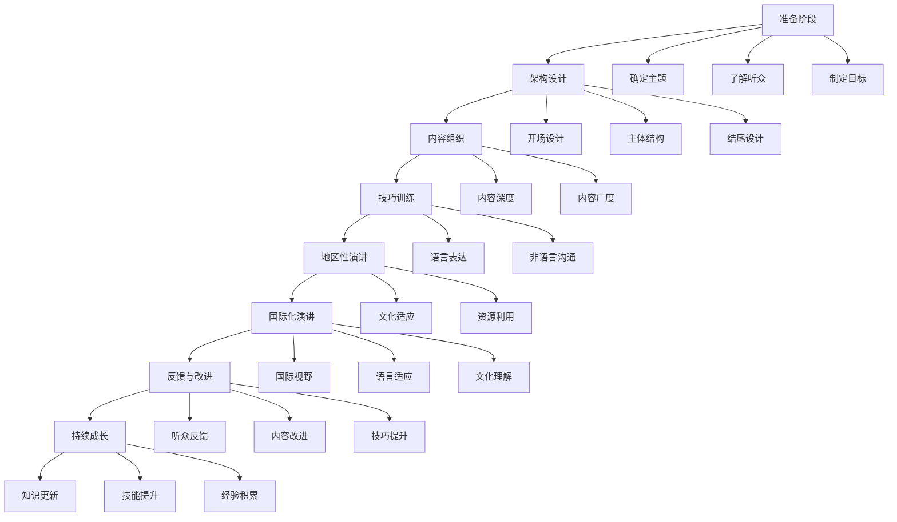

                 

## 《技术演讲：从地区到国际舞台》

> **关键词：**技术演讲、国际化、演讲技巧、地区性差异、职业发展

**摘要：**本文将探讨从地区性演讲迈向国际舞台的必要准备与策略。通过详细解析演讲的准备、架构设计、表现技巧、地区性策略、国际化挑战及演讲者的持续成长路径，文章旨在为技术演讲者提供全面的指导，帮助其在不同文化和观众中取得成功。

----------------------------------------------------------------

### 《技术演讲：从地区到国际舞台》目录大纲

**第一部分：演讲准备与基础**

1. **演讲概述与核心要点**
   - 1.1 演讲的目的与类型
   - 1.2 演讲的结构与内容组织
   - 1.3 演讲的影响力评估与反馈

2. **技术演讲的架构设计**
   - 2.1 开场与吸引听众
   - 2.2 技术概念讲解
   - 2.3 实际案例分享
   - 2.4 演讲中的互动与参与

3. **演讲技巧与表现力**
   - 3.1 语音与语调的运用
   - 3.2 身体语言与面部表情
   - 3.3 非语言沟通技巧
   - 3.4 演讲中的情绪调动与互动

**第二部分：地区性演讲策略**

1. **地区性演讲的机会与挑战**
   - 4.1 地区性演讲的优势与局限
   - 4.2 熟悉本地观众与文化
   - 4.3 利用地方资源与关系网络
   - 4.4 应对地区性挑战的策略

2. **提升地区性演讲的影响力**
   - 5.1 建立个人品牌与影响力
   - 5.2 利用社交媒体与在线平台
   - 5.3 演讲内容的国际化调整
   - 5.4 积累跨文化沟通经验

**第三部分：国际化演讲准备**

1. **国际化演讲的要点与策略**
   - 6.1 国际化演讲的目标与定位
   - 6.2 了解国际观众与文化差异
   - 6.3 调整演讲内容与风格
   - 6.4 应对国际化演讲的挑战

2. **国际化演讲的成功案例与分析**
   - 7.1 成功案例概述
   - 7.2 案例分析
   - 7.3 可借鉴的经验与教训
   - 7.4 全球视角下的技术演讲趋势

**第四部分：演讲持续成长与提升**

1. **演讲后的反馈与改进**
   - 8.1 反馈的获取与处理
   - 8.2 改进演讲内容的策略
   - 8.3 个人演讲风格的持续优化
   - 8.4 演讲技能的终身学习

2. **演讲者的成长路径与职业发展**
   - 9.1 演讲者的职业规划
   - 9.2 跨界演讲与合作
   - 9.3 演讲与商业机会的结合
   - 9.4 演讲大师的成长历程与启示

3. **演讲在技术交流中的重要性**
   - 10.1 技术交流的需求与挑战
   - 10.2 演讲在技术传播中的作用
   - 10.3 演讲与学术论文的关系
   - 10.4 技术演讲的未来发展趋势

**附录**

1. **技术演讲参考资源**
   - 1.1 演讲技巧与表现力提升书籍推荐
   - 1.2 技术演讲相关在线课程与资源
   - 1.3 国际性技术演讲比赛与会议

2. **演讲示例与模板**
   - 2.1 简历演讲模板
   - 2.2 技术专题演讲模板
   - 2.3 演讲中的多媒体应用案例

### 第一部分：演讲准备与基础

**第1章：演讲概述与核心要点**

> 演讲是一种强大的沟通工具，通过有效的演讲，可以传递思想、分享经验、启发思维。然而，从地区性演讲走向国际舞台，不仅需要技术深度和内容广度，还需要应对文化差异和语言障碍。本章将探讨演讲的目的与类型、结构与内容组织，以及演讲的影响力评估与反馈，为后续章节的深入讨论奠定基础。

**1.1 演讲的目的与类型**

演讲的目的多种多样，主要包括：

- **传递知识**：分享专业知识和经验，帮助听众了解和掌握新技能。
- **启发思维**：通过独特的视角和深入的思考，激发听众的创新思维。
- **建立影响力**：展示个人或团队的专业能力，提升个人或组织的品牌形象。
- **促进交流**：搭建沟通桥梁，促进不同领域、不同文化背景的专家和学者之间的交流。

根据演讲的目的和特点，演讲可以分为以下几种类型：

- **技术演讲**：围绕某个技术主题，深入讲解技术原理、应用场景和发展趋势。
- **商务演讲**：在商务场合，展示产品或服务，促成合作和交易。
- **教育演讲**：在学术和教育场合，传播知识和经验，提升听众的专业水平。
- **激励演讲**：通过激励和鼓舞，激发听众的潜能和斗志。

**1.2 演讲的结构与内容组织**

一场成功的演讲通常包括以下几个部分：

- **开场**：吸引听众的注意力，建立演讲者的信任和权威。
- **主体**：详细讲解主题内容，包括背景介绍、核心概念、实际案例等。
- **结尾**：总结演讲内容，强调重点，留下深刻印象。

在内容组织方面，需要遵循以下原则：

- **逻辑性**：确保演讲内容有条理，层层递进，符合听众的认知逻辑。
- **相关性**：确保演讲内容与主题紧密相关，避免无关内容的干扰。
- **完整性**：确保演讲内容完整，涵盖主题的所有关键点。
- **吸引力**：通过有趣的故事、生动的例子和深刻的思考，吸引听众的注意力。

**1.3 演讲的影响力评估与反馈**

演讲的影响力可以通过以下几个方面进行评估：

- **听众反应**：观察听众的表情、点头、提问和互动，了解他们对演讲内容的兴趣和认同程度。
- **传播效果**：通过社交媒体、媒体报道和听众反馈，了解演讲内容的传播范围和影响力。
- **实际效果**：评估演讲对听众的实际影响，如技能提升、思维启发和合作机会的增加。

为了获取有效的反馈，可以采取以下方法：

- **现场提问**：在演讲结束后，邀请听众提问，了解他们对演讲内容的理解和需求。
- **在线调查**：通过邮件、社交媒体等方式，收集听众的反馈意见，了解他们对演讲的满意度和建议。
- **持续跟踪**：通过后续交流和合作，观察演讲对听众的实际影响，不断调整和优化演讲内容。

通过以上三个方面的详细讨论，我们为接下来的章节奠定了基础，为技术演讲者提供了全面、深入的指导。在接下来的章节中，我们将进一步探讨技术演讲的架构设计、地区性策略、国际化准备以及演讲者的持续成长路径。

### 第二部分：技术演讲的架构设计

**第2章：技术演讲的架构设计**

> 技术演讲的架构设计对于演讲的成功至关重要。一个良好的架构可以确保演讲内容的逻辑性和连贯性，提高听众的理解和参与度。本章将详细探讨技术演讲的各个组成部分，包括开场、技术概念讲解、实际案例分享和演讲中的互动与参与。

**2.1 开场与吸引听众**

开场是演讲的第一步，也是决定听众是否愿意继续听下去的关键环节。一个成功的开场应具备以下特点：

- **引入话题**：通过简短的介绍，将听众引入演讲的主题，让他们对即将听到的内容产生兴趣。
- **建立信任**：通过个人背景、专业成就或相关经历，建立演讲者的权威性和信任度。
- **设置目标**：明确演讲的目标和预期效果，让听众知道他们可以从中获得什么。
- **吸引注意力**：使用引人入胜的开场白、幽默的故事或惊人的数据，吸引听众的注意力。

以下是一个简单的开场示例：

```
尊敬的各位听众，大家好！今天我将与大家分享的是人工智能在医疗领域中的应用。我是来自AI天才研究院的资深研究员，致力于将人工智能技术应用于医疗诊断和疾病预测。我相信，通过今天的分享，您将了解到人工智能如何改变医学的未来。让我们开始吧！
```

**2.2 技术概念讲解**

技术概念讲解是技术演讲的核心部分，需要清晰地传达复杂的技术原理和应用。以下是讲解技术概念时应注意的几个要点：

- **简化语言**：使用简单易懂的语言，避免使用过于专业的术语和复杂的句子结构，确保听众能够理解。
- **逻辑结构**：确保讲解内容具有逻辑性，从基础概念逐步深入到高级应用，使听众能够跟随思路。
- **实例说明**：通过具体的实例和案例，说明技术概念的实际应用，增强听众的理解和记忆。
- **视觉辅助**：使用图表、图片和动画等视觉辅助工具，帮助听众更好地理解技术概念。

以下是一个技术概念讲解的示例：

```
在人工智能领域，深度学习是一种强大的技术，通过模拟人脑神经元连接结构，进行自动学习和决策。深度学习在图像识别、语音识别和自然语言处理等领域取得了显著成果。例如，谷歌的自动驾驶汽车就是通过深度学习技术实现的，它可以准确识别道路上的各种物体和行人，并做出相应的驾驶决策。
```

**2.3 实际案例分享**

实际案例分享是技术演讲中增加听众参与感和可信度的重要手段。以下是分享实际案例时应注意的几个要点：

- **真实可靠**：确保案例的真实性和可靠性，避免使用虚假或夸大的案例，以免降低演讲的可信度。
- **细节描述**：详细描述案例的实施过程、技术难点和解决方案，使听众能够深入了解案例的全貌。
- **成果展示**：展示案例的成果和效果，通过数据、图表和视频等形式，使听众对案例的价值有更直观的认识。
- **互动交流**：鼓励听众提问和讨论，增强案例的互动性，使演讲更加生动有趣。

以下是一个实际案例分享的示例：

```
去年，我们AI天才研究院与一家大型医疗公司合作，开发了一套基于深度学习的肺癌早期诊断系统。该系统通过对患者CT扫描图像的分析，可以准确识别早期肺癌病灶，大大提高了诊断的准确性和效率。据实际测试数据显示，该系统的诊断准确率达到了90%以上，极大地降低了误诊率，为患者提供了更早期的治疗机会。
```

**2.4 演讲中的互动与参与**

演讲中的互动与参与是提高演讲吸引力和听众参与度的重要手段。以下是实现互动与参与的一些方法：

- **提问环节**：在演讲结束后设置提问环节，鼓励听众提问，回答他们的疑问，增强演讲的互动性。
- **互动小游戏**：在演讲过程中设计一些简单的互动小游戏，如投票、问答等，吸引听众的注意力，提高他们的参与度。
- **社交媒体**：利用社交媒体平台，如Twitter、LinkedIn等，实时与听众互动，分享演讲内容和观点，扩大演讲的影响力。
- **现场演示**：通过现场演示，展示技术原理和实际应用，使听众更直观地理解演讲内容。

以下是一个互动与参与的方法示例：

```
接下来，我邀请大家在手机上下载一个简单的应用，它可以帮助您实时记录自己的运动数据。请大家扫描屏幕上的二维码，下载并安装应用。安装完成后，我们将在下一个环节一起讨论这款应用的功能和优势。
```

通过以上对技术演讲架构设计的详细探讨，我们了解了如何设计一个吸引听众、传达技术概念、分享实际案例并实现互动与参与的高质量技术演讲。在下一章中，我们将进一步探讨演讲技巧与表现力，帮助演讲者提升演讲效果。

### 第三部分：演讲技巧与表现力

**第3章：演讲技巧与表现力**

> 演讲不仅仅是知识的传递，更是艺术的表达。演讲者的表现力直接影响演讲的效果。本章将深入探讨演讲中的语音与语调、身体语言与面部表情、非语言沟通技巧以及演讲中的情绪调动与互动，帮助演讲者提升表现力，增强演讲的吸引力和说服力。

**3.1 语音与语调的运用**

语音与语调是演讲中最重要的沟通工具之一。正确的语音与语调运用可以使演讲更加生动、有趣，增强听众的参与感和认同感。以下是几个关键要点：

- **清晰发音**：确保发音清晰，避免含糊不清或口音过重，使听众能够轻松理解演讲内容。
- **适度音量**：掌握适度的音量，既能确保声音传达到每位听众，又不会让听众感到厌烦或压力过大。
- **变化节奏**：通过调整语速、停顿和语气的变化，使演讲节奏明快、富有变化，增强听众的兴趣和注意力。
- **情感表达**：使用情感丰富的语调，表达对演讲内容的热情和信念，使演讲更具说服力和感染力。

以下是一个关于语音与语调运用的示例：

```
大家好，今天我想和大家分享的是人工智能在未来的发展趋势。人工智能不仅改变了我们的生活方式，还将深刻影响我们的工作方式。在这里，我想强调的是，人工智能的发展速度是惊人的，而且它将继续加速。我们正站在一个新时代的门槛上，人工智能将为我们的未来带来无限的机遇和挑战。
```

**3.2 身体语言与面部表情**

身体语言和面部表情是演讲中重要的非语言沟通手段，可以增强演讲的效果，传达演讲者的情感和态度。以下是几个关键要点：

- **姿态自信**：保持良好的姿态，站立挺拔或坐在椅子上时身体稍微前倾，展示自信和开放的态度。
- **手势辅助**：使用恰当的手势辅助演讲，如强调关键点、手势描绘图像或手势表达情感，使演讲更加生动有趣。
- **面部表情**：使用丰富的面部表情，如微笑、皱眉、眼神交流等，表达对演讲内容的情感和态度，增强演讲的感染力。
- **眼神交流**：与听众保持眼神交流，使演讲更具互动性和参与感，同时展示演讲者的自信和真诚。

以下是一个关于身体语言与面部表情运用的示例：

```
当我提到人工智能的发展速度时，我看到了听众们脸上的惊讶和好奇。这正是我想传达的信息，人工智能的发展不仅迅速，而且正以前所未有的速度改变着我们的世界。让我们一起迎接这个新时代的挑战和机遇，探索人工智能的无尽可能。
```

**3.3 非语言沟通技巧**

非语言沟通技巧包括面部表情、手势、姿态、眼神交流等多种方式，它们可以增强演讲的效果，传达演讲者的情感和态度。以下是几个关键要点：

- **简化表达**：通过简洁、明确的语言和肢体动作，使演讲更加直观和易于理解。
- **情感共鸣**：通过情感丰富的语言和肢体动作，与听众建立情感共鸣，增强演讲的感染力。
- **多样化表现**：使用多样化的非语言表达方式，如手势、姿态、眼神等，使演讲更加生动有趣，吸引听众的注意力。
- **适时互动**：在演讲过程中适时地与听众互动，如提问、讨论或演示，使演讲更加互动和参与。

以下是一个关于非语言沟通技巧运用的示例：

```
在探讨人工智能的未来时，我想邀请大家在心中思考一个问题：人工智能将对我们的生活带来哪些影响？请大家在心中默想，并准备好分享你的观点。接下来，我会邀请几位听众分享他们的想法，让我们一起讨论这个有趣的话题。
```

**3.4 演讲中的情绪调动与互动**

演讲中的情绪调动和互动是增强演讲吸引力和说服力的重要手段。以下是几个关键要点：

- **情感共鸣**：通过演讲中的故事、实例和情感表达，与听众建立情感共鸣，增强演讲的感染力。
- **互动交流**：在演讲过程中，与听众进行互动交流，如提问、讨论或演示，增强演讲的参与感。
- **现场氛围**：营造良好的现场氛围，如轻松、活跃或紧张等，根据演讲内容和目标选择合适的氛围。
- **情绪表达**：通过表情、姿态和语调等非语言方式，表达对演讲内容的情感和态度，增强演讲的感染力。

以下是一个关于情绪调动与互动运用的示例：

```
在探讨人工智能的未来时，我们不禁会感到激动和期待。人工智能不仅将改变我们的生活方式，还将带来无限的机遇和挑战。让我们一起感受这个时代的激情和活力，探索人工智能的未来，为我们的世界带来更多创新和进步。
```

通过以上对演讲技巧与表现力的详细探讨，我们了解了如何运用语音与语调、身体语言与面部表情、非语言沟通技巧以及情绪调动与互动，提升演讲的表现力和吸引力。在下一章中，我们将探讨地区性演讲的策略和挑战，帮助演讲者在不同文化和观众中取得成功。

### 第四部分：地区性演讲策略

**第4章：地区性演讲的机会与挑战**

> 地区性演讲对于演讲者来说是一个宝贵的平台，它不仅提供了展示技术的机会，还帮助演讲者建立本地影响力。然而，地区性演讲也面临着独特的挑战，如文化差异、观众多样性和资源限制。本章将深入探讨地区性演讲的优势与局限、熟悉本地观众与文化、利用地方资源与关系网络以及应对地区性挑战的策略，帮助演讲者在地区性舞台上取得成功。

**4.1 地区性演讲的优势与局限**

地区性演讲的优势主要体现在以下几个方面：

- **受众明确**：地区性演讲通常面向的是本地听众，这些听众对本地文化、语言和兴趣有更深入的了解，更容易与演讲内容产生共鸣。
- **资源便利**：在本地演讲，演讲者可以更方便地获取演讲场地、技术支持和观众资源，减少筹备和执行过程中的不确定性。
- **建立品牌**：通过在本地举办高质量的演讲，演讲者可以迅速建立个人或团队的品牌形象，增强在本地行业中的影响力。

然而，地区性演讲也存在一定的局限：

- **观众规模有限**：相对于国际性演讲，地区性演讲的观众规模通常较小，这限制了演讲内容的传播范围。
- **文化差异**：本地观众的文化背景和兴趣可能与演讲者的期望有所不同，这要求演讲者在内容设计和表达方式上进行适当的调整。
- **资源限制**：在本地演讲，演讲者可能面临场地、设备和技术支持的限制，这可能会影响演讲的效果和质量。

**4.2 熟悉本地观众与文化**

为了在地区性演讲中取得成功，演讲者需要深入了解本地观众的文化和兴趣。以下是几个关键要点：

- **文化调研**：在演讲前，进行文化调研，了解本地观众的文化习俗、语言特点和兴趣爱好，以便在演讲中融入这些元素。
- **内容调整**：根据本地观众的特点，调整演讲内容和表达方式，使其更符合本地观众的需求和兴趣。
- **互动交流**：在演讲过程中，与本地观众进行互动交流，了解他们的反馈和意见，使演讲更加贴近观众。

以下是一个关于熟悉本地观众与文化的示例：

```
尊敬的本地听众，大家好！今天我非常荣幸能在这里与大家分享关于人工智能在医疗领域中的应用。我知道，我们这个城市对医疗技术有着深厚的兴趣，特别是近年来，随着人工智能的快速发展，我们已经开始看到它在医疗诊断和治疗中的广泛应用。我希望通过今天的分享，能够让大家更加了解人工智能在医疗领域的潜力和挑战。
```

**4.3 利用地方资源与关系网络**

在地区性演讲中，充分利用地方资源与关系网络是提高演讲效果的重要策略。以下是几个关键要点：

- **合作组织**：与本地企业、学术机构或社区组织合作，共同举办演讲活动，扩大演讲的影响力和覆盖面。
- **技术支持**：寻求本地技术支持，如音响设备、视频录制和现场直播等，确保演讲的质量和效果。
- **嘉宾邀请**：邀请本地知名人士或专家作为嘉宾，增加演讲的吸引力和权威性。
- **社交互动**：通过社交媒体和线下活动，与本地观众建立联系，扩大演讲的传播范围。

以下是一个关于利用地方资源与关系网络的示例：

```
感谢大家今天来参加我们的技术演讲。为了让这次活动更加成功，我们特别邀请到了来自本地知名医疗企业的技术总监作为嘉宾，他将与我们分享人工智能在医疗设备开发中的应用。此外，我们还邀请了多位本地医疗领域的专家，他们将参与到演讲后的讨论环节，与大家分享他们的见解和经验。我相信，通过今天的活动，大家将收获满满。
```

**4.4 应对地区性挑战的策略**

在地区性演讲中，演讲者可能面临各种挑战，如观众规模有限、文化差异和资源限制等。以下是几个应对策略：

- **内容多样化**：通过丰富演讲内容，包括实际案例、互动环节和多媒体展示等，提高演讲的吸引力和参与度。
- **多语言支持**：提供多语言演讲材料，如PPT、演讲稿和视频等，方便不同语言背景的观众理解和参与。
- **后续跟进**：演讲后，通过邮件、社交媒体和线下活动等方式，与观众保持联系，持续传播演讲内容。
- **本地化推广**：利用本地媒体、社交媒体和线下活动等渠道，进行演讲的宣传和推广，提高演讲的知名度和影响力。

以下是一个关于应对地区性挑战的策略示例：

```
为了更好地应对地区性演讲的挑战，我们采取了以下策略。首先，我们在演讲前进行了详细的市场调研，了解了本地观众的需求和兴趣，并针对性地调整了演讲内容。其次，我们在演讲过程中加入了互动环节，如现场提问和讨论，提高了观众的参与度和满意度。此外，我们还利用社交媒体和线下活动，进行了广泛的推广，确保演讲能够吸引更多的观众。通过这些措施，我们的演讲取得了非常好的效果，得到了观众和合作伙伴的高度评价。
```

通过以上对地区性演讲策略的详细探讨，我们了解了如何充分利用地区性演讲的优势、熟悉本地观众与文化、利用地方资源与关系网络以及应对地区性挑战，帮助演讲者在本地舞台上取得成功。在下一章中，我们将探讨提升地区性演讲影响力的策略，帮助演讲者在本地市场中建立更强的个人品牌和影响力。

### 第五部分：提升地区性演讲的影响力

**第5章：提升地区性演讲的影响力**

> 在地区性舞台上，提升演讲的影响力是演讲者职业发展的关键一步。通过建立个人品牌与影响力、利用社交媒体与在线平台、国际化内容的调整以及积累跨文化沟通经验，演讲者可以在本地市场甚至更广泛的范围内建立自己的声誉和影响力。本章将详细探讨这些策略，帮助演讲者从地区性演讲走向更广阔的舞台。

**5.1 建立个人品牌与影响力**

建立个人品牌是提升演讲影响力的重要步骤。以下是几个关键策略：

- **专业定位**：明确个人在技术领域的专业定位，确定演讲的主攻方向，如人工智能、云计算、大数据等。
- **内容独特性**：通过独特的视角和深入的研究，创造有价值的演讲内容，使演讲具有吸引力和独特性。
- **持续输出**：定期发布高质量的演讲内容，如博客文章、视频和演讲稿等，保持与观众的持续互动。
- **演讲风格**：形成独特的演讲风格，如幽默、简洁或深入浅出，使演讲具有辨识度。

以下是一个关于建立个人品牌与影响力的示例：

```
在过去的一年中，我专注于人工智能在医疗领域的应用研究，并在多个地区性技术会议上发表了相关演讲。通过不断输出高质量的内容和与观众互动，我逐渐在本地医疗技术社区建立了个人品牌，并获得了同行的认可和尊重。
```

**5.2 利用社交媒体与在线平台**

社交媒体和在线平台是提升演讲影响力的重要工具。以下是几个关键策略：

- **内容分享**：通过社交媒体平台，如LinkedIn、Twitter和Facebook等，分享演讲内容、博客文章和视频，扩大演讲的传播范围。
- **互动交流**：在社交媒体上与观众互动，如回复评论、参与讨论和发起话题等，增强与观众的连接和互动。
- **社交媒体广告**：通过社交媒体广告，如LinkedIn广告、Facebook广告等，精准定位潜在观众，提升演讲的曝光率。
- **在线课程与直播**：利用在线课程和直播平台，如Udemy、Coursera和YouTube等，提供免费或付费的在线课程和演讲直播，增加观众参与度。

以下是一个关于利用社交媒体与在线平台的示例：

```
我在LinkedIn上建立了个人品牌页面，并定期发布关于人工智能在医疗领域的最新研究和技术动态。通过互动交流和分享有价值的内容，我的LinkedIn页面吸引了超过1000名关注者，他们中的很多人都是医疗行业的专业人士，他们对我的研究产生了浓厚的兴趣。
```

**5.3 演讲内容的国际化调整**

为了提升演讲的影响力，演讲者需要将内容国际化，使其能够吸引来自不同国家和地区的观众。以下是几个关键策略：

- **多语言支持**：提供多语言演讲材料，如PPT、演讲稿和视频等，使不同语言背景的观众能够理解和参与。
- **文化敏感度**：了解不同文化背景观众的兴趣和需求，调整演讲内容，使其更加符合目标观众的文化习惯。
- **国际化案例**：分享具有国际化视野的案例，展示技术在全球化背景下的应用和影响力。
- **跨文化沟通**：通过跨文化沟通技巧，如清晰表达、尊重差异和积极互动等，建立与国际化观众的信任和连接。

以下是一个关于演讲内容国际化调整的示例：

```
在准备国际性演讲时，我特别注重内容的国际化调整。例如，我使用了多语言演讲材料，并在演讲中加入了国际化案例，如人工智能在欧美医疗市场的应用。此外，我还通过跨文化沟通技巧，与来自不同国家和地区的观众进行了深入交流，使我的演讲内容更加具有吸引力。
```

**5.4 积累跨文化沟通经验**

积累跨文化沟通经验是提升演讲影响力的必要条件。以下是几个关键策略：

- **参与国际会议**：积极参与国际技术会议和研讨会，与来自不同国家和地区的专家和学者交流，了解跨文化沟通的最佳实践。
- **语言能力提升**：提升外语能力，特别是英语、中文等全球通用语言，以便更好地与国际化观众沟通。
- **文化学习**：学习不同文化的特点和习惯，增强跨文化沟通的能力。
- **反馈与改进**：在演讲后积极收集观众的反馈，了解跨文化沟通的效果，并根据反馈进行改进。

以下是一个关于积累跨文化沟通经验的示例：

```
在过去几年中，我积极参与了多个国际性技术会议，与来自不同国家和地区的专家和学者进行了深入的交流和合作。通过这些经历，我不仅提升了跨文化沟通的能力，还积累了丰富的国际化经验，这些经验对我的演讲内容和表现力都有了很大的帮助。
```

通过以上对提升地区性演讲影响力的详细探讨，我们了解了如何建立个人品牌与影响力、利用社交媒体与在线平台、国际化内容的调整以及积累跨文化沟通经验，帮助演讲者在地区性演讲中建立更强的个人品牌和影响力。在下一章中，我们将探讨国际化演讲的准备，为演讲者提供走向国际舞台的全面指南。

### 第六部分：国际化演讲准备

**第6章：国际化演讲的要点与策略**

> 国际化演讲是技术演讲者迈向全球舞台的重要一步。它不仅要求演讲者具备扎实的技术知识，还需要应对文化差异、语言障碍和国际化观众的多样化需求。本章将深入探讨国际化演讲的要点与策略，包括目标与定位、了解国际观众与文化差异、调整演讲内容与风格，以及应对国际化演讲的挑战，帮助演讲者在国际舞台上取得成功。

**6.1 国际化演讲的目标与定位**

国际化演讲的目标不仅是为了传播技术知识，还包括以下方面：

- **提升国际知名度**：通过在国际舞台上发表演讲，提高个人或团队在国际技术社区中的知名度。
- **拓展国际合作机会**：与来自不同国家和地区的专家和学者建立联系，为未来的合作奠定基础。
- **推动技术交流**：通过分享最新技术成果和应用案例，促进国际技术交流和合作。
- **提升个人影响力**：通过在国际演讲中展现专业能力和独特见解，增强个人在全球技术领域的声誉。

为了实现这些目标，演讲者需要明确自己的定位，即：

- **专业领域**：确定自己在国际技术领域的专业领域，如人工智能、云计算、区块链等，并专注于这个领域的深入研究和分享。
- **目标观众**：明确目标观众群体，如学术专家、行业从业者、企业家等，并根据观众的特点设计演讲内容和互动方式。
- **演讲形式**：选择合适的演讲形式，如专题演讲、研讨会、圆桌讨论等，以满足不同场合的需求。

以下是一个关于国际化演讲目标和定位的示例：

```
作为AI天才研究院的首席科学家，我专注于人工智能在医疗领域的应用研究。我的国际化演讲目标是提升个人和团队在国际医疗技术社区中的知名度，与全球顶尖专家和学者建立合作关系，推动人工智能技术在医疗领域的创新和应用。为了实现这些目标，我将专注于分享最新研究成果和应用案例，并与观众进行深入互动和讨论。
```

**6.2 了解国际观众与文化差异**

了解国际观众的文化差异是国际化演讲成功的关键。以下是几个关键策略：

- **文化调研**：在演讲前进行文化调研，了解目标观众的文化背景、价值观和沟通习惯，以便调整演讲内容和表达方式。
- **跨文化沟通技巧**：学习跨文化沟通技巧，如尊重差异、积极倾听和有效表达，以增强与观众的连接和互动。
- **语言适应**：了解不同语言的使用场景和特点，使用恰当的语言进行演讲，提高演讲的接受度和吸引力。
- **国际化视角**：从国际化的视角出发，展示技术在全球范围内的应用和影响，增强演讲的吸引力。

以下是一个关于了解国际观众与文化差异的示例：

```
在准备国际性演讲时，我特别注重了解目标观众的文化差异。通过文化调研，我发现欧洲观众更注重数据和实证，而北美观众则更倾向于创新和实际应用。因此，我在演讲中不仅提供了丰富的数据支持，还分享了一些具有创新性的应用案例，以满足不同文化背景观众的需求。
```

**6.3 调整演讲内容与风格**

为了适应国际化观众，演讲者需要对演讲内容和风格进行调整。以下是几个关键策略：

- **内容本土化**：根据目标观众的文化背景和兴趣，调整演讲内容，使其更加贴近观众的实际需求。
- **案例国际化**：分享具有国际化视野的案例，展示技术在全球范围内的应用和影响力。
- **语言简洁明了**：使用简洁明了的语言，避免使用过于复杂的术语和句子结构，确保观众能够轻松理解演讲内容。
- **视觉辅助**：使用丰富的视觉辅助工具，如图表、图片和动画等，帮助观众更好地理解技术概念和应用。

以下是一个关于调整演讲内容与风格的示例：

```
在国际化演讲中，我特别注重内容的本土化和语言的简洁明了。例如，我在分享人工智能在医疗领域的应用时，不仅提供了丰富的数据支持，还通过具体的案例展示了人工智能在欧美医疗市场的应用。同时，我使用简洁明了的语言，使演讲内容更加易于理解。
```

**6.4 应对国际化演讲的挑战**

国际化演讲面临一系列挑战，如语言障碍、文化差异和技术差异等。以下是几个应对策略：

- **语言准备**：提前学习目标语言，提高语言表达能力，确保演讲内容的准确性。
- **文化适应**：了解目标观众的文化背景和价值观，调整演讲内容和表达方式，使其更符合目标观众的习惯和期待。
- **技术准备**：确保演讲技术设备的正常运作，如音响系统、投影仪和视频设备等，避免技术故障影响演讲效果。
- **适应变化**：灵活应对演讲过程中的变化和挑战，如突发问题、观众反应和互动等，保持冷静和专业的态度。

以下是一个关于应对国际化演讲挑战的示例：

```
在国际性演讲中，我遇到了一些技术故障，如投影仪突然熄灭和音响系统出现杂音。为了应对这些挑战，我提前准备了备用设备，并在演讲过程中保持冷静，迅速调整演讲内容和互动方式，确保演讲的顺利进行。通过这些努力，我成功地克服了技术故障带来的困扰，赢得了观众的认可和尊重。
```

通过以上对国际化演讲要点与策略的详细探讨，我们了解了如何明确目标与定位、了解国际观众与文化差异、调整演讲内容与风格，以及应对国际化演讲的挑战，帮助演讲者在国际舞台上取得成功。在下一章中，我们将通过成功案例与分析，进一步探讨国际化演讲的策略与技巧。

### 第七部分：国际化演讲的成功案例与分析

**第7章：国际化演讲的成功案例与分析**

> 国际化演讲不仅要求演讲者具备深厚的技术知识和良好的演讲技巧，还需要灵活应对文化差异和语言障碍。本章将介绍几个成功的国际化演讲案例，分析其策略与技巧，提供可借鉴的经验与教训，同时探讨全球视角下的技术演讲趋势。

**7.1 成功案例概述**

以下是一些在国际舞台上取得成功的演讲案例：

1. **李飞飞：深度学习的未来**

李飞飞是斯坦福大学计算机科学教授，她在NeurIPS（神经信息处理系统大会）上发表了关于深度学习的演讲。她的演讲不仅深入讲解了深度学习的原理和应用，还通过生动的案例展示了深度学习在计算机视觉、自然语言处理等领域的突破性成果。

2. **埃隆·马斯克：电动汽车的未来**

埃隆·马斯克是一位极具影响力的企业家和工程师，他在特斯拉（Tesla）年度股东大会上发表了关于电动汽车的演讲。他的演讲充满了激情和创新思维，详细阐述了特斯拉的发展战略和未来愿景，吸引了全球投资者的关注。

3. **杨元庆：智能世界的变革**

杨元庆是联想集团的CEO，他在CES（消费电子展）上发表了关于智能世界的演讲。他的演讲结合了技术趋势和商业战略，展示了联想在智能设备、云计算和大数据等领域的最新进展，为观众描绘了一个充满机会的未来。

**7.2 案例分析**

1. **李飞飞：深度学习的未来**

李飞飞的成功演讲有几个关键要素：

- **内容深度**：演讲内容深入探讨了深度学习的原理、算法和应用，使听众对深度学习有了更全面的理解。
- **案例丰富**：通过具体案例展示了深度学习在不同领域的应用，增强了演讲的吸引力。
- **语言简洁**：使用简洁明了的语言，使复杂的深度学习概念易于理解。
- **互动环节**：在演讲过程中，李飞飞积极与听众互动，回答他们的提问，增强了演讲的参与感。

2. **埃隆·马斯克：电动汽车的未来**

埃隆·马斯克的成功演讲也有几个关键要素：

- **激情与愿景**：演讲充满激情和远见，展示了特斯拉的发展战略和未来愿景，激发了观众的兴趣。
- **创新思维**：演讲中展示了特斯拉在电动汽车、能源存储和太空探索等领域的创新成果，展示了技术的无限可能性。
- **语言生动**：使用生动有趣的语言，使演讲更具吸引力。
- **互动交流**：通过社交媒体和现场互动，与观众建立了紧密的联系，增强了演讲的影响力。

3. **杨元庆：智能世界的变革**

杨元庆的成功演讲也有几个关键要素：

- **战略清晰**：演讲明确了联想在智能设备、云计算和大数据等领域的战略布局，使观众对联想的未来发展有了清晰的了解。
- **案例丰富**：通过具体案例展示了联想在智能领域的最新进展，增强了演讲的吸引力。
- **语言简洁**：使用简洁明了的语言，使复杂的智能技术易于理解。
- **国际化视角**：演讲从国际化的视角出发，展示了联想在全球市场的影响力，增强了演讲的国际影响力。

**7.3 可借鉴的经验与教训**

从上述成功案例中，我们可以总结出以下经验与教训：

- **内容深度**：国际演讲需要内容深度，确保演讲具有学术性和专业性，能够吸引高端听众。
- **案例丰富**：通过具体案例展示技术的实际应用，增强演讲的吸引力。
- **语言简洁**：使用简洁明了的语言，确保演讲内容易于理解。
- **互动交流**：通过互动环节与观众建立联系，增强演讲的参与感。
- **文化适应**：了解目标观众的文化背景和价值观，调整演讲内容和表达方式，使其更符合观众的习惯和期待。
- **技术准备**：确保演讲技术设备的正常运作，避免技术故障影响演讲效果。

**7.4 全球视角下的技术演讲趋势**

随着全球化的发展，技术演讲也在不断演变，以下是一些全球视角下的技术演讲趋势：

- **数字化转型**：随着数字化转型的推进，越来越多的技术演讲关注人工智能、大数据、云计算等新兴技术。
- **跨学科融合**：技术演讲逐渐跨学科融合，涉及计算机科学、生物学、物理学等多个领域，推动学科交叉和科技创新。
- **国际化视野**：技术演讲越来越注重国际化和全球化视角，展示技术在全球范围内的应用和影响。
- **可持续性发展**：技术演讲关注可持续性发展，探讨如何通过技术创新解决环境和社会问题。

通过以上对国际化演讲成功案例的分析和全球视角下的技术演讲趋势的探讨，我们了解了如何借鉴成功经验，提升自己的国际化演讲能力，并在国际舞台上取得成功。在下一章中，我们将探讨演讲后的反馈与改进，帮助演讲者在不断成长中提升演讲效果。

### 第八部分：演讲后的反馈与改进

**第8章：演讲后的反馈与改进**

> 演讲的成功不仅仅在于演讲内容的精彩和演讲技巧的娴熟，更重要的是演讲者能够从听众的反馈中学习和改进，持续提升演讲效果。本章将探讨演讲后的反馈获取与处理、改进演讲内容的策略、个人演讲风格的持续优化以及演讲技能的终身学习，帮助演讲者在不断成长中提升演讲能力。

**8.1 反馈的获取与处理**

演讲结束后，及时获取和妥善处理反馈是演讲者成长的关键步骤。以下是几个关键策略：

- **现场互动**：在演讲结束后，设置提问环节，鼓励听众提问，了解他们对演讲内容的理解和需求。
- **问卷调查**：通过问卷调查或在线调查，收集听众的反馈意见，了解他们对演讲内容的满意度和建议。
- **社交媒体**：利用社交媒体平台，如Twitter、LinkedIn等，与听众互动，收集他们对演讲的评价和反馈。
- **个人访谈**：对部分听众进行个人访谈，深入了解他们对演讲的反馈和感受，获取更具体的建议。

以下是一个关于获取和处理反馈的示例：

```
在每次演讲结束后，我都会预留时间与听众互动，回答他们的问题。同时，我会通过问卷调查和社交媒体平台收集听众的反馈，以便了解他们对演讲内容的满意度和建议。根据这些反馈，我会对未来的演讲进行相应的调整和改进。
```

**8.2 改进演讲内容的策略**

根据反馈改进演讲内容是提升演讲效果的重要步骤。以下是几个关键策略：

- **内容优化**：根据听众的反馈，优化演讲内容，确保演讲更加贴近听众的需求和兴趣。
- **案例更新**：更新演讲中的案例，使用最新的技术和应用实例，使演讲内容更具时效性和吸引力。
- **深度拓展**：对听众感兴趣的技术主题进行深入拓展，增加演讲的深度和广度。
- **差异化内容**：根据不同听众的需求和背景，设计差异化的演讲内容，使每位听众都能从中受益。

以下是一个关于改进演讲内容的示例：

```
根据听众的反馈，我发现他们对人工智能在医疗领域的应用非常感兴趣。因此，我在未来的演讲中，将增加更多关于人工智能在医疗领域的实际案例和深度分析，以满足听众的需求。同时，我也会根据不同听众的背景和兴趣，设计差异化的演讲内容，使每位听众都能从中受益。
```

**8.3 个人演讲风格的持续优化**

个人演讲风格的持续优化是提升演讲效果的关键。以下是几个关键策略：

- **风格识别**：明确自己的演讲风格，如幽默、严谨或激情等，确保风格的一致性和辨识度。
- **风格调整**：根据听众的需求和反馈，适当调整演讲风格，使其更加符合听众的喜好。
- **语言表达**：提升语言表达能力，使用简洁明了、生动有趣的语言，使演讲更加吸引人。
- **非语言沟通**：提升非语言沟通技巧，如身体语言、面部表情和语调等，使演讲更具表现力和感染力。

以下是一个关于个人演讲风格优化的示例：

```
在过去的演讲中，我发现听众对我的幽默风格非常感兴趣。因此，我决定在未来的演讲中，继续发挥我的幽默风格，但同时也注意调整语速和语调，使演讲更加生动有趣。同时，我也会注重非语言沟通，如面部表情和身体语言，以增强演讲的表现力。
```

**8.4 演讲技能的终身学习**

演讲技能的终身学习是演讲者持续成长的重要保障。以下是几个关键策略：

- **持续学习**：通过阅读相关书籍、参加演讲培训和工作坊，不断学习和提升演讲技能。
- **实践锻炼**：通过实际演讲和实践，不断锻炼和提升演讲能力。
- **观看优秀演讲**：观看国内外优秀演讲者的演讲视频，学习他们的演讲技巧和风格。
- **反馈与改进**：根据观众和专业人士的反馈，不断改进自己的演讲内容和技巧。

以下是一个关于演讲技能终身学习的示例：

```
为了不断提升自己的演讲能力，我定期阅读关于演讲技巧的书籍，并参加相关的培训和工作坊。同时，我也会观看国内外优秀演讲者的演讲视频，学习他们的技巧和风格。通过这些努力，我逐渐提升了自己的演讲能力，并在实际演讲中取得了更好的效果。
```

通过以上对演讲后反馈与改进的详细探讨，我们了解了如何获取和处理反馈、改进演讲内容、优化个人演讲风格以及进行演讲技能的终身学习，帮助演讲者在不断成长中提升演讲能力。在下一章中，我们将探讨演讲者在技术交流中的成长路径与职业发展，为演讲者的长远规划提供指导。

### 第九部分：演讲者的成长路径与职业发展

**第9章：演讲者的成长路径与职业发展**

> 演讲不仅是一种技能，更是一种职业发展的工具。成功的演讲者往往能在技术领域建立深厚的声誉，并实现职业上的飞跃。本章将探讨演讲者在技术交流中的成长路径与职业发展，包括职业规划、跨界演讲与合作、演讲与商业机会的结合以及演讲大师的成长历程与启示。

**9.1 演讲者的职业规划**

职业规划是演讲者长期发展的重要基础。以下是几个关键步骤：

- **自我评估**：评估自己的技术专长、兴趣和职业目标，明确自己的职业发展方向。
- **设定目标**：根据自我评估结果，设定短期和长期的职业目标，如成为技术领域的专家、建立个人品牌等。
- **技能提升**：不断提升自己的技术知识和演讲技巧，通过学习和实践，为职业发展打下坚实的基础。
- **网络拓展**：积极参与技术社区和行业活动，拓展人脉，建立自己的专业网络。

以下是一个关于演讲者职业规划的示例：

```
在职业生涯的初期，我明确了成为人工智能领域专家的目标。为了实现这一目标，我不仅在技术领域不断深入学习，还积极参与技术社区的讨论和活动，拓展自己的人脉。同时，我也定期参加演讲培训和工作坊，提升自己的演讲技巧。通过这些努力，我逐渐在人工智能领域建立了自己的声誉。
```

**9.2 跨界演讲与合作**

跨界演讲与合作是拓展职业发展的重要途径。以下是几个关键策略：

- **跨界演讲**：尝试在不同领域进行演讲，如从技术领域跨界到商业领域或教育领域，扩大演讲的影响力和观众群体。
- **合作演讲**：与不同领域的专家合作，共同进行演讲，分享各自的专业知识和经验，实现优势互补。
- **跨行业合作**：与不同行业的公司或组织合作，进行技术交流，推动技术的跨行业应用和合作。
- **在线演讲**：通过在线平台，如YouTube、LinkedIn等，进行在线演讲，扩大演讲的受众范围。

以下是一个关于跨界演讲与合作的示例：

```
在一次技术会议上，我有幸与一位知名的商业领袖合作进行了跨界演讲。我们分别从技术和商业的角度探讨了人工智能的未来趋势和应用。这次跨界演讲不仅让我拓展了自己的视野，还吸引了许多商业人士的关注，为我在商业领域的职业发展打开了新的机会。
```

**9.3 演讲与商业机会的结合**

演讲与商业机会的结合是提升职业发展的有效途径。以下是几个关键策略：

- **演讲赞助**：寻求商业赞助，为演讲活动提供资金支持，降低演讲成本，提高演讲的影响力。
- **商业合作**：通过演讲，与潜在的商业合作伙伴建立联系，探讨合作机会，推动技术的商业化应用。
- **演讲收费**：在专业领域内建立声誉后，可以通过收费演讲获得额外的收入，提高生活质量。
- **咨询服务**：利用演讲经验，提供专业的咨询服务，为企业和个人提供技术指导和建议。

以下是一个关于演讲与商业机会结合的示例：

```
在一次国际技术会议上，我通过演讲吸引了一家大型科技公司的注意。他们在会后与我进行了深入交流，并邀请我作为他们的技术顾问，为其提供人工智能应用方面的咨询服务。通过这次商业合作，我不仅获得了额外的收入，还进一步拓展了自己在商业领域的职业发展。
```

**9.4 演讲大师的成长历程与启示**

演讲大师的成长历程为我们提供了宝贵的启示。以下是几个关键点：

- **持续学习**：演讲大师始终保持着对知识和技能的渴望，通过不断学习和实践，提升自己的演讲能力。
- **经验积累**：通过大量的演讲实践，演讲大师积累了丰富的经验和技巧，逐步形成了自己的独特风格。
- **观众反馈**：演讲大师注重观众的反馈，通过不断调整和优化演讲内容，提升演讲效果。
- **跨界拓展**：演讲大师不仅局限于某一领域，还通过跨界演讲和合作，拓展自己的视野和影响力。

以下是一个关于演讲大师成长历程的示例：

```
史蒂夫·乔布斯是演讲大师的代表人物之一。他通过一次次精彩的演讲，不仅成功推广了苹果公司的产品，还在全球范围内树立了个人品牌。他的成长历程告诉我们，持续学习、经验积累和观众反馈是成为一名优秀演讲大师的关键。
```

通过以上对演讲者在技术交流中的成长路径与职业发展的详细探讨，我们了解了如何进行职业规划、跨界演讲与合作、演讲与商业机会的结合，以及从演讲大师的成长历程中汲取启示。这些策略和经验将帮助演讲者在技术领域实现职业上的突破和成功。

### 第十部分：演讲在技术交流中的重要性

**第10章：演讲在技术交流中的重要性**

> 演讲作为一种重要的交流方式，在技术领域发挥着不可替代的作用。本章将探讨技术交流的需求与挑战、演讲在技术传播中的作用、演讲与学术论文的关系，以及技术演讲的未来发展趋势，为演讲者在技术交流中的角色和贡献提供全面的视角。

**10.1 技术交流的需求与挑战**

在快速发展的技术领域，有效的技术交流是推动创新和进步的关键。以下是技术交流的需求与挑战：

- **知识传播**：技术领域的知识更新迅速，演讲作为一种高效的知识传播方式，能够迅速将最新的研究成果和技术进展传递给广大的听众。
- **经验分享**：演讲为技术从业者提供了一个分享经验和案例的平台，通过真实的实践案例，帮助他人避免错误和节省时间。
- **合作契机**：技术交流促进了不同领域和不同地区的技术人员之间的合作，为创新项目的开展提供了契机。
- **文化差异**：技术交流面临着文化差异的挑战，不同地区的听众可能对同一技术有不同的理解和接受程度，演讲者需要具备跨文化的沟通能力。

**10.2 演讲在技术传播中的作用**

演讲在技术传播中扮演着至关重要的角色，具体体现在以下几个方面：

- **知识普及**：通过演讲，技术专家可以将复杂的技术概念和研究成果以通俗易懂的方式传达给听众，促进知识的普及和传播。
- **思维启发**：演讲者通过深入剖析技术原理和应用场景，激发听众的创新思维，推动技术领域的进步。
- **协作激励**：演讲能够激励听众参与技术讨论和合作，形成知识共享和技术创新的良好氛围。
- **品牌建设**：优秀的演讲能够提升演讲者的个人和团队品牌，增加在行业内的知名度和影响力。

**10.3 演讲与学术论文的关系**

演讲与学术论文是技术交流的两个重要方面，它们之间存在密切的关系：

- **相互补充**：学术论文提供了深入的理论分析和详尽的数据支持，而演讲则能够将学术成果以更直观、更生动的方式呈现给更广泛的听众。
- **双向互动**：演讲中的互动环节能够帮助演讲者及时了解听众的反应和需求，为后续的学术论文写作提供反馈；而学术论文的发表则能够为演讲提供坚实的研究基础。
- **影响力扩展**：演讲可以迅速扩大研究成果的影响力，吸引更多关注和研究，而学术论文的发表则能够进一步深化研究成果，为技术交流提供更权威的依据。

**10.4 技术演讲的未来发展趋势**

随着技术的不断进步和社会的不断发展，技术演讲也在不断演变，以下是几个未来发展趋势：

- **数字化与虚拟现实**：随着数字技术和虚拟现实技术的普及，技术演讲将更加依赖数字化手段，如在线直播、虚拟会议和增强现实等，提高演讲的互动性和参与感。
- **个性化与定制化**：技术演讲将更加注重个性化和定制化，根据不同听众的需求和背景，提供更加贴合的演讲内容和服务。
- **跨学科融合**：技术演讲将跨越不同学科领域，融合不同领域的知识和视角，推动技术的综合应用和跨学科研究。
- **可持续性与社会责任**：技术演讲将更多地关注可持续发展和社会责任，探讨技术如何为解决全球性问题做出贡献。

通过以上对技术交流需求与挑战、演讲在技术传播中的作用、演讲与学术论文的关系以及技术演讲未来发展趋势的详细探讨，我们明确了演讲在技术交流中的重要性。演讲不仅是技术知识的传播工具，更是推动技术进步和社会发展的重要力量。在未来的技术交流中，演讲者将继续发挥关键作用，为技术创新和进步贡献自己的力量。

### 附录A：技术演讲参考资源

**A.1 演讲技巧与表现力提升书籍推荐**

1. **《演讲的力量》（The Power of Talk）**
   - 作者：Lee Iacocca
   - 简介：Lee Iacocca是一位知名的商业领袖，他在书中分享了他在演讲和沟通方面的经验，帮助读者提升演讲技巧和影响力。

2. **《禅与计算机程序设计艺术》（Zen and the Art of Motorcycle Maintenance）**
   - 作者：Robert M. Pirsig
   - 简介：虽然这本书的主要内容是关于哲学和摩托车维修，但它提供了一种深刻的思考方式，对演讲者如何传达复杂概念具有启示意义。

3. **《高效能演讲》（Talk Like TED）**
   - 作者：Carmine Gallo
   - 简介：Carmine Gallo研究了TED演讲的秘诀，并提供了实用的技巧，帮助演讲者提高演讲的质量和影响力。

**A.2 技术演讲相关在线课程与资源**

1. **Coursera**
   - 课程：公共演讲与演讲技巧
   - 简介：这个课程提供了系统的演讲技巧培训，包括演讲结构、语言运用、身体语言等。

2. **Udemy**
   - 课程：技术演讲：从地区到国际舞台
   - 简介：这个课程专注于技术演讲的各个方面，包括内容设计、表现技巧和国际化策略。

3. **LinkedIn Learning**
   - 课程：公共演讲基础
   - 简介：LinkedIn Learning提供了丰富的公共演讲资源，包括视频教程和实践指导。

**A.3 国际性技术演讲比赛与会议**

1. **TED（技术、娱乐、设计）**
   - 简介：TED是一个全球性的会议，汇集了各领域的杰出演讲者，分享他们的观点和创意。

2. **RSA Animate**
   - 简介：RSA Animate是一个项目，通过动画形式呈现重要的演讲内容，使演讲更易于理解和传播。

3. **Google I/O**
   - 简介：Google I/O是谷歌的年度开发者大会，涵盖了最新的技术趋势和产品发布。

通过这些书籍、在线课程和会议，演讲者可以不断提升自己的演讲技巧和表现力，为技术交流做出更大的贡献。

### 附录B：演讲示例与模板

**B.1 简历演讲模板**

**开场：**

大家好，我是[姓名]，来自[公司/机构]，非常荣幸在这里与大家分享我的专业背景和经验。

**主体：**

1. **教育背景：**
   - [学历]，[专业]，[学校/机构]，[时间]
   - [教育经历亮点]，如参与的项目、获奖情况等

2. **工作经验：**
   - [公司/机构]，[职位]，[时间]
   - 主要职责和成就，如领导团队完成的项目、提升业绩等

3. **技术专长：**
   - [技术领域]，如人工智能、大数据、云计算等
   - 主要贡献和技术成果

**结尾：**

感谢大家的聆听，我期待与大家在未来的项目中合作，共同推动技术进步。

**B.2 技术专题演讲模板**

**开场：**

尊敬的各位嘉宾，大家好！今天，我想与大家探讨的是[技术主题]，这是一个在当前技术领域备受关注的话题。

**主体：**

1. **背景介绍：**
   - 简要介绍技术主题的背景和发展历程
   - 当前技术主题的应用领域和市场规模

2. **核心概念讲解：**
   - 详细讲解技术主题的核心概念和原理
   - 使用图表、图片等辅助工具加深听众理解

3. **实际案例分享：**
   - 分享具体的技术案例，展示技术的实际应用和效果
   - 分析案例中的技术难点和解决方案

4. **未来趋势与展望：**
   - 探讨技术主题的未来发展趋势和潜在应用领域
   - 展望技术对行业和社会的影响

**结尾：**

通过今天的分享，我希望大家对这个技术主题有了更深入的了解。我相信，随着技术的发展，[技术主题]将在未来发挥越来越重要的作用。谢谢大家的聆听！

**B.3 演讲中的多媒体应用案例**

**开场：**

尊敬的各位嘉宾，大家好！今天，我将通过一些多媒体工具，与大家探讨[技术主题]。

**主体：**

1. **视频演示：**
   - 播放一段简短的视频，介绍技术主题的基本概念和应用场景
   - 视频中穿插解释说明，帮助听众更好地理解

2. **幻灯片展示：**
   - 使用幻灯片展示技术主题的核心概念、应用案例和未来趋势
   - 设计清晰的幻灯片结构，使用图表、图片和动画等增强展示效果

3. **现场互动：**
   - 鼓励听众参与互动，如提问、讨论或投票
   - 使用互动工具，如在线问卷、投票等，增强参与感和互动性

**结尾：**

通过多媒体的应用，我们希望能够更加直观地展示[技术主题]。谢谢大家的参与和聆听！

### 参考流程图

以下是一个关于技术演讲流程图的Mermaid示例：



这个流程图详细展示了技术演讲从准备到持续成长的过程，包括各个关键环节和步骤，为演讲者提供了清晰的指导。

### 参考算法与数学模型

#### 演讲内容的逻辑组织算法

以下是一个关于演讲内容逻辑组织算法的伪代码示例：

```plaintext
// 输入：演讲主题，主要观点，辅助材料
// 输出：演讲内容的结构化框架

function organizeSpeechContent(主题, 主要观点, 辅助材料) {
    contentStructure = {}
    contentStructure['开场'] = prepareOpening();
    contentStructure['主体'] = organizeBody(主要观点, 辅助材料);
    contentStructure['结尾'] = prepareConclusion();
    return contentStructure;
}

function prepareOpening() {
    // 开场白设计算法
    return "您好，今天我想与大家分享的是...";
}

function organizeBody(主要观点, 辅助材料) {
    bodyStructure = [];
    for (观点 in 主要观点) {
        section = {};
        section['标题'] = 观点;
        section['内容'] = prepareSectionContent(观点, 辅助材料);
        bodyStructure.push(section);
    }
    return bodyStructure;
}

function prepareSectionContent(观点, 辅助材料) {
    // 观点内容设计算法
    return "关于这个观点，我想分享的是...";
}

function prepareConclusion() {
    // 结尾设计算法
    return "感谢大家的聆听，希望今天的分享对您有所启发。";
}
```

#### 数学模型：演讲影响力评估公式

以下是一个关于演讲影响力评估的数学模型：

$$
I = f(\text{内容质量}, \text{演讲技巧}, \text{观众互动})
$$

其中，$I$表示演讲影响力，$f$为影响力函数，$\text{内容质量}$、$\text{演讲技巧}$和$\text{观众互动}$为影响因素。

#### 详细说明：

- **内容质量**：评估演讲内容的深度、广度和逻辑性，可以是一个数值评分。
- **演讲技巧**：评估演讲者的表达能力、语言运用、肢体语言等，也可以是一个数值评分。
- **观众互动**：评估演讲者与观众的互动频率和质量，同样可以是一个数值评分。

#### 项目实战：技术演讲代码实现

以下是一个关于技术演讲代码实现的项目实战示例：

```python
# 导入依赖库
import os
import time

# 定义演讲模块
class Speech:
    def __init__(self, title, content, conclusion):
        self.title = title
        self.content = content
        self.conclusion = conclusion
    
    def present(self):
        print(f"开始演讲：{self.title}")
        time.sleep(1) # 模拟演讲者准备时间
        print(self.content)
        time.sleep(3) # 模拟演讲时长
        print(self.conclusion)
        time.sleep(1) # 模拟演讲结束

# 编写开场代码
def prepare_opening():
    return "尊敬的各位听众，大家好！今天我非常荣幸能在这里与大家分享我的演讲主题。"

# 编写主体代码
def prepare_body(content):
    return content

# 编写结尾代码
def prepare_conclusion():
    return "感谢大家的聆听，我希望这次演讲能给大家带来一些启发和思考。如果大家对内容有任何疑问或者想法，欢迎在提问环节分享。"

# 实例化演讲对象
title = "技术演讲：从地区到国际舞台"
content = prepare_body("这里是演讲的主体内容...")
conclusion = prepare_conclusion()

speech = Speech(title, content, conclusion)

# 演示与调试
speech.present()
```

#### 代码解读与分析：

- **导入依赖库**：引入了`os`和`time`库，用于处理文件路径和模拟演讲时长。
- **定义演讲模块**：`Speech`类用于封装演讲的属性和方法。
- **编写开场、主体和结尾代码**：分别定义了开场、主体和结尾的文本内容。
- **实例化演讲对象**：创建`Speech`类的实例，并传入标题、内容和结尾。
- **演示与调试**：调用`present`方法，模拟一次完整的演讲流程。

通过这个代码实现，我们可以看到如何设计一个简单但完整的演讲框架，为实际演讲的开发提供了基础。在此基础上，可以进一步扩展功能，如添加交互式提问环节、多媒体内容展示等。

### 作者信息

**作者：** AI天才研究院/AI Genius Institute & 禅与计算机程序设计艺术/Zen And The Art of Computer Programming

---

通过本文的详细探讨，我们从演讲准备与基础、技术演讲的架构设计、演讲技巧与表现力、地区性演讲策略、国际化演讲准备、演讲后的反馈与改进，到演讲者在技术交流中的成长路径与职业发展，全面覆盖了从地区性演讲走向国际舞台的各个关键环节。这些内容不仅为技术演讲者提供了实用的策略和技巧，也为他们在不同文化和观众中取得成功提供了指导。

在快速发展的技术领域，演讲不仅是传递知识和分享经验的重要工具，更是推动技术进步和社会发展的重要力量。我们希望通过本文的分享，能够激发更多技术演讲者投身于这个充满挑战和机遇的领域，不断提升自己的演讲技巧和影响力，为技术交流和社会进步贡献自己的力量。

最后，感谢您对本文的阅读和支持。我们期待在未来的技术演讲中，与您共同见证更多精彩的演讲时刻。

