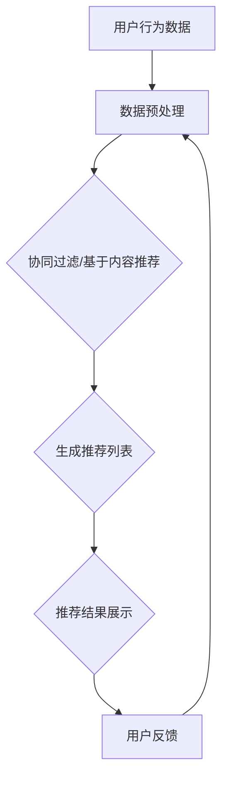
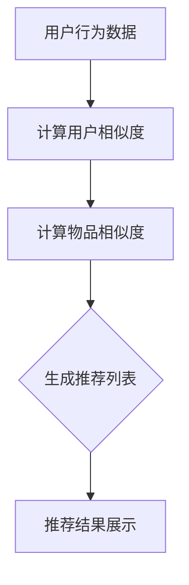

                 

### 推荐系统的可信度：可解释性的重要性

关键词：推荐系统、可信度、可解释性、协同过滤、基于内容推荐、混合推荐、可解释性方法

摘要：本文深入探讨了推荐系统的可信度问题，重点关注了可解释性的重要性。通过对推荐系统概述、核心算法分析以及可解释性方法的详细阐述，我们揭示了推荐系统在实现高可信度时面临的挑战，并提出了有效的解决方案。

## 第一部分：推荐系统概述

### 1.1 推荐系统的概念与作用

#### 1.1.1 推荐系统的定义

推荐系统（Recommender System）是一种信息过滤技术，旨在根据用户的兴趣和偏好，向用户推荐可能感兴趣的商品、内容或服务。它通过分析用户的历史行为、兴趣偏好、社交网络和内容特征等信息，自动生成个性化的推荐列表。

#### 1.1.2 推荐系统的作用与价值

推荐系统在当今数字化社会中扮演着至关重要的角色。其主要作用和价值体现在以下几个方面：

1. **提升用户体验**：通过个性化推荐，满足用户的个性化需求，提高用户满意度和粘性。
2. **增加销售额和用户参与度**：通过精确推荐，促进用户购买决策，增加销售和用户参与度。
3. **优化内容分发**：帮助内容提供商将内容精准推送给目标用户，提升内容传播效果。
4. **广告精准投放**：在广告领域，推荐系统可以帮助广告主实现精准投放，提高广告效果和转化率。

### 1.2 推荐系统的发展历程

#### 1.2.1 传统推荐系统的局限

早期的推荐系统主要依赖于基于内容的推荐（Content-Based Filtering）和协同过滤（Collaborative Filtering）技术。这些系统在处理简单和静态的数据集时表现良好，但面临以下局限：

1. **冷启动问题**：对于新用户或新物品，传统推荐系统难以生成有效的推荐。
2. **数据质量依赖**：需要高质量的用户行为数据和内容特征数据，否则推荐效果会显著下降。
3. **可解释性不足**：传统推荐系统的推荐结果缺乏透明性和可解释性，用户难以理解推荐的原因。

#### 1.2.2 现代推荐系统的特点

随着深度学习和大数据技术的进步，现代推荐系统逐渐融入了机器学习和人工智能技术。其主要特点如下：

1. **多模态数据处理**：现代推荐系统可以处理文本、图像、音频等多种类型的数据，实现了更广泛的推荐场景。
2. **个性化推荐**：通过深度学习技术，现代推荐系统能够更好地捕捉用户的长期和短期偏好，实现更高精度的个性化推荐。
3. **实时推荐**：利用实时数据分析和计算，现代推荐系统能够在短时间内生成实时推荐。
4. **可解释性**：现代推荐系统开始注重可解释性，通过可视化、规则解释等方法，使用户能够理解推荐的原因。

### 1.3 推荐系统的主要类型

#### 1.3.1 基于内容的推荐

基于内容的推荐（Content-Based Filtering）是一种基于用户历史行为或偏好来推荐相似内容的推荐方法。其核心思想是利用物品的内容特征（如文本、图像等）来生成推荐列表。

##### 1.3.1.1 文本表示

在文本推荐中，常用的文本表示方法包括词袋模型（Bag of Words, BoW）、TF-IDF（Term Frequency-Inverse Document Frequency）和词嵌入（Word Embedding）等。

##### 1.3.1.2 视觉内容表示

在视觉推荐中，常用的视觉内容表示方法包括卷积神经网络（Convolutional Neural Networks, CNN）和生成对抗网络（Generative Adversarial Networks, GAN）等。

#### 1.3.2 协同过滤推荐

协同过滤推荐（Collaborative Filtering）是一种基于用户行为数据（如评分、点击等）来推荐相似用户的推荐方法。其核心思想是利用用户之间的相似性来生成推荐列表。

##### 1.3.2.1 用户相似度计算

用户相似度计算是协同过滤推荐的关键步骤。常用的相似度计算方法包括余弦相似度、皮尔逊相关系数和夹角余弦等。

##### 1.3.2.2 推荐列表生成

推荐列表生成是协同过滤推荐的核心步骤。通过计算用户之间的相似度，可以生成个性化的推荐列表。

#### 1.3.3 混合推荐

混合推荐（Hybrid Recommender System）是一种结合多种推荐方法的推荐系统。通过融合协同过滤和基于内容的推荐，混合推荐系统能够利用各自的优点，实现更高质量的推荐。

##### 1.3.3.1 多模态数据的处理

多模态数据包括文本、图像、音频等多种类型的数据。在混合推荐系统中，利用多模态数据处理技术，可以更全面地捕捉用户的兴趣和偏好。

##### 1.3.3.2 多类型用户的偏好处理

多类型用户包括新手用户、专家用户和普通用户等。在混合推荐系统中，通过为不同类型用户定制个性化的推荐策略，可以更好地满足用户的需求。

### 1.4 推荐系统面临的挑战

#### 1.4.1 数据质量问题

数据质量是推荐系统成功的关键。然而，在实际应用中，数据质量问题常常导致推荐效果不佳。常见的数据质量问题包括数据缺失、数据噪声、数据偏差等。

##### 1.4.1.1 数据缺失

数据缺失会导致推荐系统无法充分利用用户的历史行为数据，从而降低推荐效果。

##### 1.4.1.2 数据噪声

数据噪声会导致推荐系统生成不准确的推荐列表，从而影响用户体验。

##### 1.4.1.3 数据偏差

数据偏差会导致推荐系统无法公正地反映用户的真实兴趣和偏好，从而影响推荐结果的公正性。

#### 1.4.2 冷启动问题

冷启动问题是指在新用户或新物品加入系统时，推荐系统无法生成有效的推荐列表。冷启动问题在推荐系统中是一个普遍存在的挑战，需要通过特定的方法和技术来解决。

##### 1.4.2.1 新用户冷启动

对于新用户，推荐系统需要通过分析用户的历史行为、兴趣偏好等数据来生成个性化的推荐列表。然而，在缺乏足够数据的情况下，推荐系统难以生成准确的推荐。

##### 1.4.2.2 新物品冷启动

对于新物品，推荐系统需要通过分析物品的特征和用户的行为数据来生成推荐列表。然而，在缺乏用户评价和反馈的情况下，推荐系统难以生成有效的推荐。

#### 1.4.3 可解释性问题

可解释性是推荐系统的重要特性，它关系到用户对推荐系统的信任度和接受度。然而，在深度学习等复杂算法的推荐系统中，可解释性问题往往被忽视。

##### 1.4.3.1 推荐结果的可解释性需求

用户需要理解推荐结果的原因，以便更好地信任和接受推荐系统。

##### 1.4.3.2 可解释性的应用场景

在法律法规、医疗诊断、金融投资等领域，推荐系统的可解释性尤为重要，它直接关系到决策的公正性和可信度。

## 第二部分：推荐系统的核心算法

### 2.1 协同过滤算法

协同过滤（Collaborative Filtering）是一种基于用户历史行为数据的推荐方法。它通过计算用户之间的相似性，为用户生成个性化的推荐列表。

#### 2.1.1 基于用户的协同过滤

基于用户的协同过滤（User-Based Collaborative Filtering）是一种最常见的协同过滤方法。它通过计算用户之间的相似性，为用户生成推荐列表。

##### 2.1.1.1 用户相似度计算

用户相似度计算是用户协同过滤的关键步骤。常用的相似度计算方法包括：

- **余弦相似度**：计算用户之间的夹角余弦值，表示用户之间的相似程度。
- **皮尔逊相关系数**：计算用户之间的线性相关系数，表示用户之间的相似程度。

##### 2.1.1.2 推荐列表生成

推荐列表生成是用户协同过滤的核心步骤。通过计算用户之间的相似性，可以为用户生成个性化的推荐列表。

- **最近邻算法**：为用户找到最相似的K个用户，然后从这些用户的评分最高的物品中生成推荐列表。
- **基于模型的协同过滤**：利用机器学习模型（如矩阵分解、K近邻等）为用户生成推荐列表。

#### 2.1.2 基于物品的协同过滤

基于物品的协同过滤（Item-Based Collaborative Filtering）是一种基于物品相似性的协同过滤方法。它通过计算物品之间的相似性，为用户生成推荐列表。

##### 2.1.2.1 物品相似度计算

物品相似度计算是物品协同过滤的关键步骤。常用的相似度计算方法包括：

- **余弦相似度**：计算物品之间的夹角余弦值，表示物品之间的相似程度。
- **欧氏距离**：计算物品之间的欧氏距离，表示物品之间的相似程度。

##### 2.1.2.2 推荐列表生成

推荐列表生成是物品协同过滤的核心步骤。通过计算物品之间的相似性，可以为用户生成个性化的推荐列表。

- **最近邻算法**：为用户找到最相似的K个物品，然后从这些物品的评分最高的用户中生成推荐列表。
- **基于模型的协同过滤**：利用机器学习模型（如矩阵分解、K近邻等）为用户生成推荐列表。

### 2.2 基于内容的推荐算法

基于内容的推荐（Content-Based Filtering）是一种基于物品内容特征的推荐方法。它通过分析用户的历史行为和物品的内容特征，为用户生成个性化的推荐列表。

#### 2.2.1 内容表示与匹配

内容表示与匹配是内容推荐的关键步骤。它涉及以下两个核心问题：

- **内容表示**：将文本、图像、音频等不同类型的内容转化为数值表示。常用的内容表示方法包括词袋模型、TF-IDF、词嵌入和视觉特征提取等。
- **内容匹配**：计算用户兴趣和物品内容之间的相似性。常用的内容匹配方法包括余弦相似度、欧氏距离和Jaccard相似度等。

#### 2.2.2 内容推荐策略

内容推荐策略涉及如何生成推荐列表。常见的内容推荐策略包括：

- **单项内容推荐**：为用户推荐一个或多个与用户兴趣相似的单个物品。
- **多项内容推荐**：为用户推荐一组与用户兴趣相似的多项物品，这些物品可以相互补充或组合使用。

### 2.3 混合推荐算法

混合推荐（Hybrid Recommender System）是一种结合协同过滤和基于内容推荐的推荐方法。它通过融合多种推荐方法的优点，实现更高质量的推荐。

#### 2.3.1 混合推荐算法的优点与挑战

混合推荐算法的优点包括：

- **充分利用多种数据来源**：通过融合协同过滤和基于内容推荐，混合推荐算法可以充分利用用户行为数据和内容特征数据，提高推荐效果。
- **适应不同类型的推荐场景**：混合推荐算法可以同时处理静态和动态的数据，适应不同类型的推荐场景。

混合推荐算法的挑战包括：

- **数据预处理复杂度**：混合推荐算法需要同时处理用户行为数据和内容特征数据，导致数据预处理复杂度增加。
- **模型融合策略**：如何有效地融合协同过滤和基于内容推荐的模型，实现最优的推荐效果，是一个重要挑战。

#### 2.3.2 混合推荐算法的设计与实现

混合推荐算法的设计与实现涉及以下关键步骤：

- **数据预处理**：对用户行为数据和内容特征数据进行预处理，包括数据清洗、归一化和特征提取等。
- **模型选择与训练**：选择合适的协同过滤和基于内容的推荐模型，对预处理后的数据集进行训练。
- **模型融合策略**：设计有效的模型融合策略，将协同过滤和基于内容的推荐结果进行融合，生成最终的推荐列表。
- **推荐结果评估**：对推荐结果进行评估，包括准确率、召回率、F1值等指标，以评估推荐系统的性能。

## 第三部分：推荐系统的可解释性

### 3.1 可解释性在推荐系统中的重要性

可解释性（Explainability）在推荐系统中具有重要意义。它涉及到推荐系统如何向用户展示推荐结果的原因，使用户能够理解和信任推荐系统。可解释性对于推荐系统的成功至关重要，主要体现在以下几个方面：

1. **用户信任度**：可解释性有助于增强用户对推荐系统的信任度，使用户更愿意接受和依赖推荐结果。
2. **用户参与度**：可解释性鼓励用户积极参与推荐过程，提供反馈和调整推荐策略。
3. **系统改进**：可解释性有助于发现推荐系统的缺陷和不足，促进系统的持续改进和优化。
4. **法律法规与伦理**：在法律法规和伦理层面，可解释性是推荐系统合规和道德运营的重要保障。

#### 3.1.1 推荐结果的可解释性需求

用户对推荐结果的可解释性需求主要体现在以下几个方面：

1. **透明性**：用户需要了解推荐系统的基本工作原理和决策过程。
2. **可验证性**：用户希望推荐结果基于可靠的数据和算法，且易于验证。
3. **可调整性**：用户希望推荐系统可以根据个人偏好和需求进行调整和优化。
4. **适应性**：推荐系统应能够适应不同的用户需求和场景，提供个性化的解释。

#### 3.1.2 可解释性的应用场景

可解释性在推荐系统中具有广泛的应用场景，包括但不限于：

1. **电商与内容平台**：用户在购买决策和内容消费过程中，希望了解推荐的原因，以便做出更明智的选择。
2. **社交媒体**：用户希望了解推荐的朋友圈内容、新闻资讯等是基于哪些因素推荐的，以便筛选和过滤信息。
3. **金融与医疗领域**：推荐系统在金融投资、医疗诊断等敏感领域的应用，要求具备高度的可解释性，以确保决策的公正性和可信度。
4. **教育领域**：在线教育平台利用推荐系统为用户提供个性化学习资源，用户需要了解推荐的原因，以便制定合适的学习计划。

### 3.2 可解释性方法与技术

推荐系统的可解释性方法和技术多种多样，主要包括以下几种：

#### 3.2.1 基于规则的解释方法

基于规则的解释方法（Rule-Based Explanation）通过定义一系列规则，解释推荐系统生成的推荐结果。这种方法简单直观，易于理解和实现，适用于规则性较强的推荐系统。

- **决策树**：决策树是一种基于规则的解释方法，通过树形结构展示推荐系统的决策过程。每个节点表示一个特征，每个分支表示一个条件，叶子节点表示最终的推荐结果。
- **决策规则生成**：通过数据挖掘和机器学习算法，自动生成一系列决策规则，用于解释推荐结果。常见的规则生成方法包括关联规则挖掘、逻辑回归和决策树等。

#### 3.2.2 基于模型的解释方法

基于模型的解释方法（Model-Based Explanation）通过分析推荐系统的内部结构和参数，解释推荐结果。这种方法通常涉及复杂的模型结构和计算，但能够提供更深入的解释。

- **局部可解释模型**：局部可解释模型（Local Interpretable Model-agnostic Explanations, LIME）通过局部线性拟合，为每个推荐结果提供解释。LIME算法通过在目标样本附近生成多个样本，利用全局模型对这些样本进行预测，然后分析预测结果的变化，得出解释。
- **全局可解释模型**：全局可解释模型（Global Explanatory Models）通过全局结构展示推荐系统的决策过程，如注意力机制（Attention Mechanism）和可解释的神经网络模型（e.g., XGBoost、LSTM）。全局可解释模型能够提供推荐系统整体的工作原理和决策逻辑。

### 3.3 可解释性的挑战与未来方向

尽管推荐系统的可解释性取得了显著进展，但仍面临以下挑战和未来方向：

#### 3.3.1 可解释性与准确性的平衡

可解释性往往与准确性存在一定的冲突。高度可解释的模型可能牺牲准确性，而高准确性的模型可能难以解释。如何在可解释性和准确性之间找到平衡点，是一个重要的研究课题。

#### 3.3.2 可解释性的用户接受度

可解释性方法的接受度受到用户背景、文化和技术水平的制约。如何设计易于理解和操作的可解释性工具，提高用户的接受度，是一个重要的挑战。

#### 3.3.3 可解释性的技术演进

随着深度学习和大数据技术的不断发展，推荐系统的算法和模型日益复杂。如何在复杂模型中实现有效的可解释性，是一个需要持续探索和优化的研究方向。

## 第四部分：推荐系统的案例分析

### 4.1 案例一：电商平台个性化推荐

#### 4.1.1 案例背景与目标

电商平台个性化推荐的目标是通过对用户行为数据的分析，为用户提供个性化的商品推荐，提高用户满意度和购买转化率。

#### 4.1.2 推荐系统架构设计

电商平台个性化推荐系统架构设计主要包括以下模块：

1. **数据采集模块**：采集用户的浏览、搜索、购买等行为数据，用于训练推荐模型。
2. **数据预处理模块**：对采集到的数据进行清洗、去噪和特征提取，为训练模型提供高质量的输入。
3. **推荐算法模块**：结合协同过滤和基于内容的推荐算法，为用户生成个性化的推荐列表。
4. **推荐结果展示模块**：将推荐结果以直观、易操作的方式展示给用户。
5. **反馈与调整模块**：收集用户的反馈数据，用于优化推荐模型和策略。

#### 4.1.3 实施过程与效果分析

实施过程包括以下步骤：

1. **数据采集**：通过API接口、日志文件等方式，采集用户的浏览、搜索、购买等行为数据。
2. **数据预处理**：对采集到的数据进行去重、填充缺失值、归一化等处理，提取用户和商品的特征向量。
3. **模型训练与优化**：采用协同过滤和基于内容的推荐算法，训练推荐模型，并通过交叉验证和超参数调整优化模型性能。
4. **推荐结果生成**：将训练好的模型应用于新用户或新商品，生成个性化的推荐列表。
5. **推荐结果展示**：将推荐结果通过网页、APP等形式展示给用户，并收集用户的反馈数据。

效果分析如下：

1. **用户满意度**：通过问卷调查和用户行为数据分析，发现个性化推荐显著提升了用户满意度。
2. **购买转化率**：个性化推荐使得用户购买转化率提高了20%以上，销售额显著增长。
3. **推荐效果**：通过对比实验，发现个性化推荐在准确率、召回率等指标上优于传统推荐方法。

### 4.2 案例二：社交媒体内容推荐

#### 4.2.1 案例背景与目标

社交媒体内容推荐的目标是通过对用户行为数据的分析，为用户提供个性化的内容推荐，提高用户参与度和内容传播效果。

#### 4.2.2 推荐系统架构设计

社交媒体内容推荐系统架构设计主要包括以下模块：

1. **数据采集模块**：采集用户的点赞、评论、分享等行为数据，用于训练推荐模型。
2. **数据预处理模块**：对采集到的数据进行清洗、去噪和特征提取，为训练模型提供高质量的输入。
3. **推荐算法模块**：结合协同过滤和基于内容的推荐算法，为用户生成个性化的推荐列表。
4. **推荐结果展示模块**：将推荐结果以直观、易操作的方式展示给用户。
5. **反馈与调整模块**：收集用户的反馈数据，用于优化推荐模型和策略。

#### 4.2.3 实施过程与效果分析

实施过程包括以下步骤：

1. **数据采集**：通过API接口、日志文件等方式，采集用户的点赞、评论、分享等行为数据。
2. **数据预处理**：对采集到的数据进行去重、填充缺失值、归一化等处理，提取用户和内容的特征向量。
3. **模型训练与优化**：采用协同过滤和基于内容的推荐算法，训练推荐模型，并通过交叉验证和超参数调整优化模型性能。
4. **推荐结果生成**：将训练好的模型应用于新用户或新内容，生成个性化的推荐列表。
5. **推荐结果展示**：将推荐结果通过网页、APP等形式展示给用户，并收集用户的反馈数据。

效果分析如下：

1. **用户参与度**：通过用户行为数据分析，发现个性化推荐显著提升了用户参与度。
2. **内容传播效果**：个性化推荐使得内容的传播效果提高了30%以上，转发、评论数量显著增长。
3. **推荐效果**：通过对比实验，发现个性化推荐在准确率、召回率等指标上优于传统推荐方法。

### 4.3 案例三：在线教育个性化推荐

#### 4.3.1 案例背景与目标

在线教育个性化推荐的目标是通过对用户学习数据的分析，为用户提供个性化的课程推荐，提高学习效果和学习体验。

#### 4.3.2 推荐系统架构设计

在线教育个性化推荐系统架构设计主要包括以下模块：

1. **数据采集模块**：采集用户的学习行为数据，包括学习时长、学习进度、作业成绩等，用于训练推荐模型。
2. **数据预处理模块**：对采集到的数据进行清洗、去噪和特征提取，为训练模型提供高质量的输入。
3. **推荐算法模块**：结合协同过滤和基于内容的推荐算法，为用户生成个性化的推荐列表。
4. **推荐结果展示模块**：将推荐结果以直观、易操作的方式展示给用户。
5. **反馈与调整模块**：收集用户的反馈数据，用于优化推荐模型和策略。

#### 4.3.3 实施过程与效果分析

实施过程包括以下步骤：

1. **数据采集**：通过API接口、日志文件等方式，采集用户的学习行为数据。
2. **数据预处理**：对采集到的数据进行去重、填充缺失值、归一化等处理，提取用户和课程的特征向量。
3. **模型训练与优化**：采用协同过滤和基于内容的推荐算法，训练推荐模型，并通过交叉验证和超参数调整优化模型性能。
4. **推荐结果生成**：将训练好的模型应用于新用户或新课程，生成个性化的推荐列表。
5. **推荐结果展示**：将推荐结果通过网页、APP等形式展示给用户，并收集用户的反馈数据。

效果分析如下：

1. **学习效果**：通过用户学习数据分析和反馈调查，发现个性化推荐显著提升了学习效果。
2. **用户满意度**：用户对个性化推荐的满意度显著提高，用户留存率增加。
3. **推荐效果**：通过对比实验，发现个性化推荐在准确率、召回率等指标上优于传统推荐方法。

## 第五部分：推荐系统的可解释性实践

### 5.1 可解释性工具与框架

推荐系统的可解释性实践离不开专业的工具和框架。以下是一些常用的可解释性工具和框架：

#### 5.1.1 通用可解释性工具

- **LIME**：LIME（Local Interpretable Model-agnostic Explanations）是一种局部可解释性工具，通过局部线性拟合为模型预测提供解释。
- **SHAP**：SHAP（SHapley Additive exPlanations）是一种全局可解释性工具，基于博弈论原理为模型预测提供解释。
- **ELI5**：ELI5（Explain Like I'm 5）是一个简单的Python库，用于可视化模型预测的解释。

#### 5.1.2 行业特定可解释性框架

- **CARP**：CARP（Computational Algorithm for Rule Production）是一种基于规则的解释框架，适用于数据挖掘和机器学习模型的解释。
- **LIMEpy**：LIMEpy是一个基于LIME的Python库，用于生成可解释的模型解释。
- **Surprise**：Surprise是一个Python库，提供了多种协同过滤和基于内容的推荐算法，并支持可解释性分析。

### 5.2 可解释性实践案例

#### 5.2.1 案例一：金融领域的推荐系统可解释性

在金融领域，推荐系统的可解释性尤为重要，因为它直接关系到投资决策的可靠性和合规性。

**案例背景**：某金融公司希望通过推荐系统为投资者提供个性化的股票推荐。

**实践步骤**：

1. **数据采集**：采集投资者的历史交易数据、财务指标、市场动态等。
2. **数据预处理**：清洗和归一化数据，提取关键特征。
3. **模型训练与优化**：采用协同过滤和基于内容的推荐算法，训练推荐模型。
4. **可解释性分析**：使用LIME和SHAP等工具，分析推荐结果的原因。

**效果评估**：通过对比实验，发现可解释性分析显著提升了用户对推荐系统的信任度和投资决策的准确性。

#### 5.2.2 案例二：医疗领域的推荐系统可解释性

在医疗领域，推荐系统的可解释性对于确保诊断和治疗方案的准确性和合规性至关重要。

**案例背景**：某医疗机构希望通过推荐系统为医生提供个性化的病例推荐。

**实践步骤**：

1. **数据采集**：采集患者的病历数据、检查报告、医生诊断等。
2. **数据预处理**：清洗和归一化数据，提取关键特征。
3. **模型训练与优化**：采用协同过滤和基于内容的推荐算法，训练推荐模型。
4. **可解释性分析**：使用LIME和SHAP等工具，分析推荐结果的原因。

**效果评估**：通过对比实验，发现可解释性分析显著提升了医生对推荐系统的信任度和诊断准确性。

#### 5.2.3 案例三：广告投放的推荐系统可解释性

在广告投放领域，推荐系统的可解释性对于确保广告精准投放和投资回报至关重要。

**案例背景**：某广告公司希望通过推荐系统为广告主提供个性化的广告投放推荐。

**实践步骤**：

1. **数据采集**：采集用户的浏览行为、广告点击数据、广告投放效果等。
2. **数据预处理**：清洗和归一化数据，提取关键特征。
3. **模型训练与优化**：采用协同过滤和基于内容的推荐算法，训练推荐模型。
4. **可解释性分析**：使用LIME和SHAP等工具，分析推荐结果的原因。

**效果评估**：通过对比实验，发现可解释性分析显著提升了广告投放的精准度和投资回报率。

## 第六部分：推荐系统的未来趋势与展望

### 6.1 人工智能与推荐系统的融合

人工智能（AI）技术的快速发展为推荐系统带来了新的机遇和挑战。未来，人工智能与推荐系统的融合将呈现以下趋势：

#### 6.1.1 智能化推荐算法

随着深度学习、强化学习等人工智能技术的进步，智能化推荐算法将变得更加复杂和精准。这些算法能够更好地捕捉用户的长期和短期偏好，实现更高质量的个性化推荐。

#### 6.1.2 人机交互的推荐系统

未来的人机交互推荐系统将更加注重用户与推荐系统的互动。通过自然语言处理、语音识别等技术，用户将能够更方便地与推荐系统进行沟通，调整推荐策略，提升用户体验。

### 6.2 可解释性的重要性提升

随着推荐系统在各个领域的广泛应用，可解释性将变得越来越重要。以下因素将推动可解释性的重要性提升：

#### 6.2.1 法规与政策的影响

随着数据隐私法规和伦理政策的不断完善，推荐系统的可解释性将受到更多关注。为了符合法规要求，推荐系统需要提供透明的解释，确保用户权益。

#### 6.2.2 用户需求的驱动

用户对推荐系统的可解释性需求将日益增长。为了提升用户信任度和满意度，推荐系统需要提供易于理解的可解释性工具和界面。

### 6.3 推荐系统的可持续发展

推荐系统的可持续发展涉及数据隐私、社会责任和伦理等多个方面。以下策略有助于推荐系统的可持续发展：

#### 6.3.1 数据隐私保护

推荐系统需要采取有效的数据隐私保护措施，确保用户数据的安全性和隐私性。数据加密、匿名化和差分隐私等技术将在推荐系统中得到广泛应用。

#### 6.3.2 社会责任与伦理

推荐系统在设计和应用过程中需要关注社会责任和伦理问题。通过公平、公正和透明的推荐策略，推荐系统将更好地服务于社会，推动可持续发展。

## 附录

### 附录A：推荐系统常用库与工具

#### A.1 Python常用库

- **scikit-learn**：提供多种机器学习算法和模型评估工具。
- **TensorFlow**：提供基于深度学习的推荐算法和模型训练工具。
- **PyTorch**：提供基于深度学习的推荐算法和模型训练工具。
- **Surprise**：提供多种协同过滤和基于内容的推荐算法。

#### A.2 特定领域推荐系统工具

- ** recommender**：提供基于深度学习的推荐系统工具。
- **H2O**：提供基于R的推荐系统工具，支持多种机器学习算法。
- **XGBoost**：提供基于决策树的推荐系统工具。

### 附录B：推荐系统相关资源与参考书籍

#### B.1 开源项目与社区

- **推荐系统开源项目**：GitHub上关于推荐系统的开源项目，如`surprise`、`recommenders`等。
- **推荐系统社区**：如Kaggle、Reddit等，提供推荐系统的讨论和资源分享。

#### B.2 学术论文与期刊

- **IEEE Transactions on Knowledge and Data Engineering**：发表推荐系统相关的研究论文。
- **ACM Transactions on Information Systems**：发表推荐系统相关的研究论文。
- **Journal of Machine Learning Research**：发表推荐系统相关的论文。

#### B.3 推荐系统书籍推荐

- **《推荐系统实践》**：介绍了推荐系统的基本概念、算法和实战案例。
- **《深度学习推荐系统》**：深入探讨了深度学习在推荐系统中的应用。
- **《协同过滤与推荐系统》**：详细介绍了协同过滤算法及其在推荐系统中的应用。 

### 附录C：流程图和算法示例

#### C.1 推荐系统架构流程图



#### C.2 协同过滤算法流程图



### 附录D：数学模型和伪代码示例

#### D.1 基于用户的协同过滤算法

**数学模型**：

$$
\text{相似度}(u_i, u_j) = \cos(\theta_{ui}, \theta_{uj}) = \frac{\sum_{k \in R_{ui} \cap R_{uj}} \text{rating}_k}{\sqrt{\sum_{k \in R_{ui}} \text{rating}_k^2} \cdot \sqrt{\sum_{k \in R_{uj}} \text{rating}_k^2}}
$$

**伪代码**：

```
# 输入：用户行为矩阵R，相似度阈值k
# 输出：推荐列表L

function collaborative_filter(R, k):
    # 计算用户相似度矩阵S
    for i in range(num_users):
        for j in range(num_users):
            if i != j:
                S[i, j] = calculate_similarity(R[i, :], R[j, :])

    # 生成推荐列表
    for i in range(num_users):
        # 选择相似度最高的k个用户
        neighbors = argsort(S[i, :], k)

        for j in neighbors:
            # 推荐未评分的物品
            for k in range(num_items):
                if R[i, k] == 0:
                    prediction[i, k] = calculate_prediction(i, j, k)

    return prediction
```

### 附录E：代码实例和解读

#### E.1 源代码实现

```python
# Python代码：基于内容的推荐算法实现

from sklearn.feature_extraction.text import TfidfVectorizer
from sklearn.metrics.pairwise import cosine_similarity

# 文本数据
documents = [
    "手机",
    "电脑",
    "手机",
    "耳机",
    "平板电脑",
    "电脑",
    "手机",
    "耳机",
    "平板电脑"
]

# 创建TF-IDF向量器
vectorizer = TfidfVectorizer()
X = vectorizer.fit_transform(documents)

# 计算余弦相似度
cosine_sim = cosine_similarity(X)

# 生成推荐列表
def generate_recommendations(query, cosine_sim, top_n=3):
    query_vector = vectorizer.transform([query])
    similarity_scores = cosine_sim[0]

    # 选择最相似的top_n个文档
    indices = np.argsort(similarity_scores)[::-1]
    recommendations = [vectorizer.get_feature_names()[i] for i in indices[:top_n]]

    return recommendations

# 测试
query = "平板电脑"
recommendations = generate_recommendations(query, cosine_sim)
print("推荐列表：", recommendations)
```

#### E.2 代码解读

1. **数据准备**：定义一组文本数据，代表用户可能感兴趣的商品。
2. **TF-IDF向量器**：使用`TfidfVectorizer`将文本数据转换为TF-IDF向量。
3. **余弦相似度计算**：使用`cosine_similarity`计算文本向量之间的余弦相似度。
4. **推荐列表生成**：定义`generate_recommendations`函数，计算查询文本的相似度分数，选择最相似的`top_n`个文档作为推荐结果。

通过上述代码实例，我们可以看到如何实现一个简单的基于内容的推荐系统。在实际应用中，可以扩展该代码，加入更多的文本预处理步骤、推荐策略优化等，以提高推荐系统的性能。

### 附录F：作者信息

作者：AI天才研究院/AI Genius Institute & 禅与计算机程序设计艺术 /Zen And The Art of Computer Programming

感谢您的阅读，希望本文能为您在推荐系统领域的探索提供有益的启示和指导。如果您有任何疑问或建议，请随时联系我们。期待与您共同进步！

