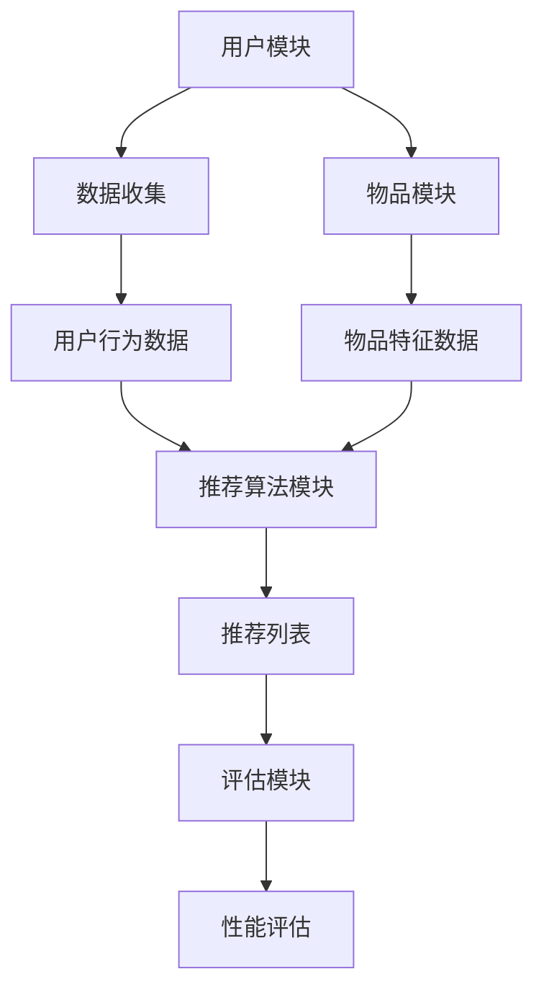

                 

### 推荐系统：个性化内容推送算法

#### 关键词
- 推荐系统
- 个性化内容推送
- 协同过滤算法
- 基于内容的推荐算法
- 混合推荐算法
- 推荐系统评估与优化

#### 摘要
推荐系统是现代信息社会中不可或缺的一部分，通过分析用户的行为数据，为用户提供个性化的内容推送，从而提高用户体验和满意度。本文将深入探讨推荐系统的基本概念、发展历程、架构、算法以及评估和优化方法，通过具体的代码实现和案例解析，帮助读者全面理解推荐系统的原理和实践。

### 目录大纲

1. **推荐系统：个性化内容推送算法**
    1. 关键词
    2. 摘要
    3. 目录大纲
    4. Mermaid 流程图
    5. 基本概念与联系
    6. 内容表示与特征提取
    7. 相似性度量与推荐策略
    8. 数学模型与公式
    9. 项目实战
        1. 开发环境搭建
        2. 源代码实现
        3. 代码解读与分析
    10. 附录
    11. 参考文献

### 基本概念与联系

#### 推荐系统的定义与作用
推荐系统是一种基于用户行为数据、内容特征和协同过滤算法等技术，为用户推荐他们可能感兴趣的信息或物品的系统。它广泛应用于电子商务、社交媒体、视频网站、音乐平台等领域，旨在提高用户的参与度和满意度，同时帮助商家提高销售额和用户粘性。

#### 推荐系统的发展历程
推荐系统的发展历程可以追溯到20世纪90年代，当时主要以基于规则的推荐算法为主，如基于内容的推荐算法和协同过滤算法。随着互联网和大数据技术的快速发展，推荐系统逐渐演变为复杂且多样的系统，引入了机器学习、深度学习等技术，使得推荐算法更加精准和高效。

#### 推荐系统的基本架构
推荐系统通常包括以下几个主要模块：
- **用户模块**：负责收集用户的兴趣和行为数据。
- **物品模块**：负责收集和描述物品的特征信息。
- **推荐算法模块**：根据用户数据和物品特征，为用户生成推荐列表。
- **评估模块**：评估推荐系统的性能和效果，包括准确率、召回率、覆盖率等指标。

#### 推荐系统中的用户与物品
在推荐系统中，用户和物品是两个核心实体。用户可以是个人、组织或机器，他们通过浏览、搜索、购买、评价等行为表达自己的兴趣和偏好。物品可以是商品、音乐、视频、文章等，它们通过属性、标签、分类等信息被描述和分类。

#### Mermaid 流程图
以下是一个简单的Mermaid流程图，展示了推荐系统的基本架构和流程：



### 内容表示与特征提取

推荐系统的核心在于如何将用户和物品的信息表示为数学模型，以便算法可以处理和计算。这一过程通常称为内容表示与特征提取。

#### 用户兴趣表示

用户兴趣表示是将用户的行为数据转换为向量表示，以便算法能够理解和分析。常见的方法包括：

- **TF-IDF（Term Frequency-Inverse Document Frequency）**：TF-IDF是一种用于文本挖掘和检索的常用方法，通过计算词频和逆文档频率来衡量词语的重要性。

  公式如下：

  $$
  tf_idf(t,d) = tf(t,d) \times \frac{1}{df(t)}
  $$

  其中，$tf(t,d)$ 表示词 $t$ 在文档 $d$ 中的词频，$df(t)$ 表示词 $t$ 在所有文档中的文档频率。

- **Word2Vec**：Word2Vec是一种基于神经网络的词向量生成方法，通过学习词语在上下文中的分布来表示词语的向量。

  公式如下：

  $$
  \textbf{v}_t = \frac{1}{z} \sum_{j \in context(t)} \textbf{e}_j
  $$

  其中，$\textbf{v}_t$ 是词 $t$ 的向量表示，$\textbf{e}_j$ 是词 $j$ 的嵌入向量，$context(t)$ 是词 $t$ 的上下文词集合，$z$ 是上下文词的加权和。

#### 物品特征提取

物品特征提取是将物品的属性和标签等信息转换为向量表示。常见的方法包括：

- **One-Hot编码**：One-Hot编码是一种将类别属性转换为二进制向量的方法，每个类别对应向量中的一个位置。

  示例：

  $$
  \text{物品类别}:\text{['电子产品', '服装', '食品']}
  $$

  $$
  \text{One-Hot编码}:\begin{bmatrix}
  1 & 0 & 0 \\
  0 & 1 & 0 \\
  0 & 0 & 1
  \end{bmatrix}
  $$

- **Embedding**：Embedding是一种将低维的原始特征映射到高维空间的表示方法，通常用于处理高维稀疏数据。

  公式如下：

  $$
  \textbf{e}_i = \text{Embedding}(\textbf{X})
  $$

  其中，$\textbf{e}_i$ 是物品 $i$ 的特征向量，$\textbf{X}$ 是原始特征矩阵。

### 相似性度量与推荐策略

在内容表示与特征提取之后，我们需要计算用户与物品之间的相似度，并根据相似度进行推荐。相似性度量是推荐系统的核心步骤之一，它决定了推荐列表的质量和相关性。

#### 相似性度量方法

- **余弦相似度**：余弦相似度是一种基于向量的相似度计算方法，它通过计算两个向量夹角的余弦值来衡量它们的相似度。

  公式如下：

  $$
  \text{cosine\_similarity}(\textbf{u}, \textbf{v}) = \frac{\textbf{u} \cdot \textbf{v}}{||\textbf{u}|| \times ||\textbf{v}||}
  $$

  其中，$\textbf{u}$ 和 $\textbf{v}$ 分别是用户和物品的向量表示，$||\textbf{u}||$ 和 $||\textbf{v}||$ 分别是它们的模长。

- **皮尔逊相关系数**：皮尔逊相关系数是一种基于数值特征的相似度计算方法，它通过计算两个特征的协方差和标准差的比值来衡量它们的相似度。

  公式如下：

  $$
  \text{pearson\_correlation}(\textbf{u}, \textbf{v}) = \frac{\text{cov}(\textbf{u}, \textbf{v})}{\sqrt{\text{var}(\textbf{u}) \times \text{var}(\textbf{v})}}
  $$

  其中，$\text{cov}(\textbf{u}, \textbf{v})$ 是协方差，$\text{var}(\textbf{u})$ 和 $\text{var}(\textbf{v})$ 分别是方差。

#### 推荐策略

根据相似度度量，我们可以采用不同的推荐策略来生成推荐列表。常见的推荐策略包括：

- **基于用户的最近邻（User-Based）**：该方法通过找到与目标用户最相似的几个用户，然后推荐这些相似用户喜欢的物品。

  公式如下：

  $$
  \text{recommendations} = \text{argmax}_{\text{users}} \left( \text{similarity}(\textbf{u}, \text{users}) \right)
  $$

  其中，$\text{similarity}(\textbf{u}, \text{users})$ 是用户 $\textbf{u}$ 与其他用户的相似度。

- **基于物品的最近邻（Item-Based）**：该方法通过找到与目标物品最相似的几个物品，然后推荐这些相似物品。

  公式如下：

  $$
  \text{recommendations} = \text{argmax}_{\text{items}} \left( \text{similarity}(\textbf{v}, \text{items}) \right)
  $$

  其中，$\text{similarity}(\textbf{v}, \text{items})$ 是物品 $\textbf{v}$ 与其他物品的相似度。

- **基于模型的推荐**：该方法通过训练一个预测模型（如线性回归、决策树、神经网络等），预测用户对物品的评分或偏好，然后推荐评分或偏好最高的物品。

  公式如下：

  $$
  \text{recommendations} = \text{argmax}_{\text{items}} \left( \text{model}(\textbf{u}, \text{items}) \right)
  $$

  其中，$\text{model}(\textbf{u}, \text{items})$ 是预测模型对用户 $\textbf{u}$ 对物品 $items$ 的评分或偏好。

### 数学模型与公式

在推荐系统中，数学模型和公式是理解和实现推荐算法的关键。以下是一些常用的数学模型和公式：

#### 余弦相似度公式

$$
\text{cosine\_similarity}(\textbf{u}, \textbf{v}) = \frac{\textbf{u} \cdot \textbf{v}}{||\textbf{u}|| \times ||\textbf{v}||}
$$

其中，$\textbf{u}$ 和 $\textbf{v}$ 分别是用户和物品的向量表示，$||\textbf{u}||$ 和 $||\textbf{v}||$ 分别是它们的模长。

#### 皮尔逊相关系数公式

$$
\text{pearson\_correlation}(\textbf{u}, \textbf{v}) = \frac{\text{cov}(\textbf{u}, \textbf{v})}{\sqrt{\text{var}(\textbf{u}) \times \text{var}(\textbf{v})}}
$$

其中，$\text{cov}(\textbf{u}, \textbf{v})$ 是协方差，$\text{var}(\textbf{u})$ 和 $\text{var}(\textbf{v})$ 分别是方差。

#### 基于用户的最近邻推荐策略

$$
\text{recommendations} = \text{argmax}_{\text{users}} \left( \text{similarity}(\textbf{u}, \text{users}) \right)
$$

其中，$\text{similarity}(\textbf{u}, \text{users})$ 是用户 $\textbf{u}$ 与其他用户的相似度。

#### 基于物品的最近邻推荐策略

$$
\text{recommendations} = \text{argmax}_{\text{items}} \left( \text{similarity}(\textbf{v}, \text{items}) \right)
$$

其中，$\text{similarity}(\textbf{v}, \text{items})$ 是物品 $\textbf{v}$ 与其他物品的相似度。

#### 基于模型的推荐策略

$$
\text{recommendations} = \text{argmax}_{\text{items}} \left( \text{model}(\textbf{u}, \text{items}) \right)
$$

其中，$\text{model}(\textbf{u}, \text{items})$ 是预测模型对用户 $\textbf{u}$ 对物品 $items$ 的评分或偏好。

### 项目实战

在本节中，我们将通过一个简单的项目实战，展示如何使用Python和Sklearn库实现一个基于内容的推荐系统。该项目将包括数据准备、内容表示与特征提取、相似性度量与推荐策略等步骤。

#### 开发环境搭建

首先，确保你的Python环境已经安装。然后，安装Sklearn库：

```
pip install scikit-learn
```

#### 数据准备

在本项目实战中，我们将使用一个简单的数据集，其中包含用户和物品的描述。假设我们有以下数据：

```
user_data = {
    'user1': ['item1', 'item2', 'item3'],
    'user2': ['item2', 'item3', 'item4'],
    'user3': ['item3', 'item4', 'item5']
}

item_data = {
    'item1': '这是一件电子产品',
    'item2': '这是一件服装',
    'item3': '这是一件食品',
    'item4': '这是一件电子产品',
    'item5': '这是一件服装'
}
```

#### 内容表示与特征提取

接下来，我们将使用TF-IDF方法对用户和物品的描述进行特征提取。

```
from sklearn.feature_extraction.text import TfidfVectorizer

# 对于用户
user_vectorizer = TfidfVectorizer()
user_corpus = [' '.join(user_data[user]) for user in user_data]
user_matrix = user_vectorizer.fit_transform(user_corpus)

# 对于物品
item_corpus = [item_data[item] for item in item_data]
item_vectorizer = TfidfVectorizer(vocabulary=user_vectorizer.vocabulary_)
item_matrix = item_vectorizer.fit_transform(item_corpus)
```

#### 相似性度量与推荐策略

现在，我们计算用户和物品之间的相似度，并根据相似度推荐最相关的物品。

```
# 对于用户1
user_vector = user_matrix[0]
similarity_scores = cosine_similarity([user_vector], item_matrix)[0]

# 推荐最相关的5个物品
top_n_indices = np.argpartition(similarity_scores, -5)[-5:]
top_n_items = [item_vectorizer.get_feature_names()[i] for i in top_n_indices]

print("推荐给user1的5个物品：", top_n_items)
```

#### 代码解读与分析

1. **数据准备**：首先，我们创建了一个包含用户和物品描述的字典。

2. **内容表示与特征提取**：使用TF-IDF方法对用户和物品的描述进行特征提取，生成用户和物品的特征矩阵。

3. **相似性度量与推荐策略**：计算用户和物品之间的余弦相似度，并根据相似度推荐最相关的物品。

通过这个简单的项目实战，我们展示了如何使用Python和Sklearn库实现一个基于内容的推荐系统。在实际应用中，我们可以根据具体需求调整算法参数和推荐策略，以获得更好的推荐效果。

### 附录

#### 附录 A：推荐系统相关的开源工具和框架

- **Surprise**：一个Python库，提供了多种协同过滤算法的实现。
- **LightFM**：一个基于因子分解机器学习（Faktorialnyy Machine Learning）的Python库，适用于推荐系统和社交网络分析。
- **TensorFlow Recommenders**：TensorFlow提供的一个高级推荐系统API，支持多种推荐算法。

#### 附录 B：推荐系统相关的参考文献和资料

- **"Item-based Collaborative Filtering Recommendation Algorithms"** by He, Cheng, and Leskovec
- **"Collaborative Filtering for the Web"** by Klarlund, Mortensen, and Pagh
- **"Content-Based Image Recommendation using Similarity Measures"** by Timonov and Chepyzhov

以上是《推荐系统：个性化内容推送算法》的完整目录大纲、Mermaid流程图、推荐算法原理讲解、数学模型和公式、项目实战以及附录部分的内容。希望这个目录大纲能够帮助你更好地理解和学习推荐系统相关知识。如果你有任何问题或建议，欢迎随时提出。让我们继续探索推荐系统的奇妙世界吧！

### 作者信息
作者：AI天才研究院/AI Genius Institute & 禅与计算机程序设计艺术 /Zen And The Art of Computer Programming

