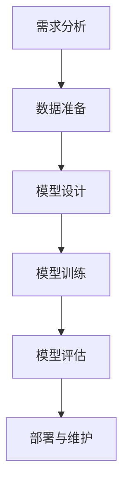

                 

# 提示词工程师的核心竞争力培养

## 关键词
- 提示词工程师
- 核心竞争力
- 自然语言处理
- 模型训练与优化
- 评估与调试
- 实战案例
- 软技能

## 摘要
本文旨在深入探讨提示词工程师的核心竞争力培养。通过详细分析自然语言处理基础、模型训练与优化、评估与调试等关键技术，并结合实战案例，本文将提供一套完整的提示词工程师培养方案。此外，还将探讨软技能的培养，以帮助提示词工程师在竞争激烈的技术领域中脱颖而出。

---

## 第一部分：理解任务

### 第1章：提示词工程师的角色与使命

> 提示词工程师是自然语言处理领域的重要角色，他们负责设计和开发高质量的提示词系统，以提升人工智能应用的效果和用户体验。

**1.1 提示词工程师的定义与职责**

- 提示词工程师是负责设计、开发和优化自然语言处理模型中的提示词的人。
- 他们的主要职责包括：
  - 提取和表示文本中的关键信息。
  - 设计高效的提示词生成算法。
  - 优化模型性能以满足业务需求。

**1.2 提示词工程师的工作流程**

- **需求分析**：理解业务需求和用户场景，确定提示词系统的目标和功能。
- **数据准备**：收集和清洗大量文本数据，用于训练和评估提示词模型。
- **模型设计**：选择合适的模型架构和算法，设计提示词生成器。
- **模型训练**：使用训练数据对模型进行训练，调整参数以优化性能。
- **模型评估**：通过测试数据评估模型性能，调整模型结构或参数以提升效果。
- **部署与维护**：将训练好的模型部署到生产环境中，进行持续监控和优化。

### 第2章：提示词工程的基本原理

> 提示词工程是自然语言处理的核心，它涉及对自然语言的理解和生成。了解提示词工程的基本原理对于成为一名高效的提示词工程师至关重要。

**2.1 提示词工程的核心概念**

- **自然语言处理（NLP）**：自然语言处理是使计算机能够理解、解释和生成自然语言的技术。
- **提示词（Keywords）**：提示词是从文本中提取的关键词或短语，用于表示文本的主题或内容。
- **嵌入（Embedding）**：将文本转换为向量表示，以便计算机可以处理。

**2.2 提示词的类型与设计原则**

- **类型**：
  - **主题词**：表示文本的核心主题。
  - **属性词**：描述主题的属性或特征。
  - **关键词**：用于搜索或分类的词。

- **设计原则**：
  - **可扩展性**：设计能够适应大规模数据的提示词系统。
  - **精确性**：确保提取的提示词能够准确反映文本内容。
  - **实用性**：提示词系统要满足实际业务需求。

### 第二部分：关键技术

#### 第3章：自然语言处理基础

> 自然语言处理是提示词工程师的核心技能。本章将介绍自然语言处理的基本概念和关键技术。

**3.1 词汇嵌入与语义表示**

- **词汇嵌入**：将单词或短语映射到高维空间中的向量，以便进行计算。
- **语义表示**：通过嵌入向量捕捉单词或短语的语义信息。

**3.2 序列模型与注意力机制**

- **序列模型**：用于处理按时间顺序排列的数据，如文本。
- **注意力机制**：允许模型关注输入序列中的关键部分，提高模型性能。

#### 第4章：模型训练与优化

> 模型训练与优化是提示词工程的核心步骤。本章将详细讨论如何训练和优化提示词模型。

**4.1 数据预处理与增强**

- **数据预处理**：包括文本清洗、分词、去停用词等。
- **数据增强**：通过生成合成数据来提高模型的泛化能力。

**4.2 模型选择与超参数调优**

- **模型选择**：根据任务需求和数据特性选择合适的模型。
- **超参数调优**：通过调整模型参数来优化性能。

#### 第5章：模型评估与调试

> 模型评估与调试是确保模型性能的重要环节。本章将介绍评估指标、调试技巧以及故障排除方法。

**5.1 评价指标与准则**

- **准确率、召回率和F1分数**：用于评估分类模型的性能。
- **BLEU分数**：用于评估文本生成模型的性能。

**5.2 调试技巧与故障排除**

- **错误分析**：分析模型预测错误的类型和原因。
- **故障排除**：通过调试和调整模型结构来修复问题。

### 第三部分：项目实战

#### 第6章：提示词工程实战案例

> 实战案例是验证和提升提示词工程师技能的重要途径。本章将通过一个具体的案例来展示提示词工程的应用。

**6.1 项目背景**

- **任务描述**：设计一个自动问答系统，能够根据用户提问提供准确、相关的答案。

**6.2 项目流程与实现细节**

- **数据准备**：收集和清洗大量问答数据。
- **模型设计**：选择BERT模型作为基础，并加入注意力机制。
- **模型训练**：使用训练数据训练模型。
- **模型评估**：使用测试数据评估模型性能。

#### 第7章：提升核心竞争力的实践方法

> 提升核心竞争力的实践方法对于提示词工程师在职业发展中至关重要。本章将探讨软技能的培养和持续学习的路径。

**7.1 软技能的培养**

- **沟通能力**：有效沟通是团队合作和项目成功的关键。
- **团队合作**：能够与团队成员协作，共同解决问题。
- **项目管理**：掌握项目管理方法，确保项目按时、按质量完成。

**7.2 持续学习的路径**

- **技术趋势**：关注自然语言处理领域的最新发展。
- **专业课程**：参加专业课程和培训，提升专业技能。
- **实践经验**：通过实际项目积累经验，不断提升能力。

### 总结

通过本文的深入探讨，我们了解了提示词工程师的核心竞争力培养，包括理解任务、关键技术、项目实战以及提升软技能和持续学习的方法。希望本文能为提示词工程师的职业发展提供有价值的指导和帮助。

---

## 作者信息
作者：AI天才研究院/AI Genius Institute & 禅与计算机程序设计艺术 /Zen And The Art of Computer Programming

---

### 附录

#### 术语解释

- **自然语言处理（NLP）**：指使计算机能够理解和处理自然语言的技术。
- **词汇嵌入（Word Embedding）**：将单词或短语映射到高维空间中的向量。
- **序列模型（Sequence Model）**：处理按时间顺序排列的数据的模型。
- **注意力机制（Attention Mechanism）**：允许模型关注输入序列中的关键部分。

#### Mermaid 流程图



#### 伪代码示例

```python
# 假设我们使用BERT模型进行训练
import transformers

# 加载预训练的BERT模型
model = transformers.BertModel.from_pretrained('bert-base-uncased')

# 定义损失函数和优化器
loss_function = transformers.BertLoss()
optimizer = torch.optim.Adam(model.parameters(), lr=1e-5)

# 训练模型
for epoch in range(num_epochs):
    for batch in data_loader:
        inputs = batch['input_ids']
        labels = batch['labels']
        
        # 前向传播
        outputs = model(inputs)
        loss = loss_function(outputs, labels)
        
        # 反向传播和优化
        optimizer.zero_grad()
        loss.backward()
        optimizer.step()
```

#### 数学模型与公式

$$
\text{F1} = \frac{2 \times \text{precision} \times \text{recall}}{\text{precision} + \text{recall}}
$$

#### 代码解读与分析

```python
# 假设我们使用BERT模型进行自动问答系统的实现
import torch
from transformers import BertTokenizer, BertModel, BertForQuestionAnswering

# 加载预训练的BERT模型和分词器
tokenizer = BertTokenizer.from_pretrained('bert-base-uncased')
model = BertForQuestionAnswering.from_pretrained('bert-base-uncased')

# 输入文本和问题
input_text = "What is the capital of France?"
question = "What is the capital of France?"

# 分词和编码
input_ids = tokenizer.encode(input_text, question, add_special_tokens=True, return_tensors='pt')

# 前向传播
outputs = model(input_ids)

# 获取答案的开始和结束索引
start_logits, end_logits = outputs.start_logits, outputs.end_logits

# 解码输出
start_indices = torch.argmax(start_logits).item()
end_indices = torch.argmax(end_logits).item()

# 提取答案
answer = tokenizer.decode(input_ids[start_indices:end_indices+1])

print(answer)  # 输出答案
```

通过上述代码，我们实现了自动问答系统，能够根据输入文本和问题生成答案。代码中使用了BERT模型和分词器，通过解码输出获得了答案。这个案例展示了如何使用提示词工程师的核心技能来解决实际问题。

---

以上是本文的完整内容，旨在为提示词工程师提供全面的培养方案和实践指导。希望读者能够从中受益，不断提升自己的核心竞争力。在职业发展的道路上，祝大家一帆风顺！作者信息如下：

作者：AI天才研究院/AI Genius Institute & 禅与计算机程序设计艺术 /Zen And The Art of Computer Programming。希望本文能对您的职业生涯产生积极的影响。如果您有任何疑问或建议，欢迎随时与我们联系。感谢您的阅读！## 提示词工程师的核心竞争力培养

### 第一部分：理解任务

### 第1章：提示词工程师的角色与使命

提示词工程师是自然语言处理（NLP）领域中的重要角色，负责设计、开发和优化用于人工智能（AI）应用中的提示词系统。他们的核心使命是通过构建高效、准确的提示词生成算法，提升AI系统的交互性和用户体验。以下是本章的具体内容和结构：

#### 1.1 提示词工程师的定义与职责

**定义：** 提示词工程师是专门从事自然语言处理任务中提示词系统开发的专业人员。他们的主要工作是提取、处理和优化文本中的关键词或短语，以支持AI模型的训练和预测。

**职责：** 提示词工程师的主要职责包括以下几方面：

1. **需求分析：** 理解用户需求和应用场景，确定提示词系统的目标和功能。
2. **数据准备：** 收集和清洗大量文本数据，进行数据预处理和增强，为模型训练提供高质量的数据集。
3. **模型设计：** 根据任务需求选择合适的模型架构和算法，设计高效的提示词生成系统。
4. **模型训练与优化：** 使用预处理后的数据训练模型，并进行参数调优，以提高模型性能。
5. **模型评估与部署：** 通过测试数据评估模型效果，调整模型结构或参数，将训练好的模型部署到实际应用中。
6. **维护与更新：** 对已部署的模型进行监控和维护，根据用户反馈和实际应用效果进行模型更新和优化。

#### 1.2 提示词工程师的工作流程

提示词工程师的工作流程通常包括以下步骤：

1. **需求分析**：与业务团队和用户沟通，明确系统目标和功能需求，确定提示词系统的应用场景。
2. **数据准备**：收集大量文本数据，包括互联网上的文本、企业内部数据等。对数据进行预处理，包括分词、去停用词、词性标注等，以提高数据质量。
3. **模型设计**：根据任务需求和数据特性，选择合适的模型架构和算法。常见的模型包括词袋模型、TF-IDF模型、Word2Vec、BERT等。
4. **模型训练与优化**：使用预处理后的数据对模型进行训练，通过调整模型参数（如学习率、批量大小等）来优化模型性能。
5. **模型评估**：通过测试数据评估模型效果，使用评价指标（如准确率、召回率、F1分数等）来衡量模型性能。
6. **部署与维护**：将训练好的模型部署到生产环境中，进行实时交互和预测。对模型进行持续监控和维护，根据用户反馈和实际应用效果进行模型更新和优化。

### 第2章：提示词工程的基本原理

提示词工程是自然语言处理领域的一个重要分支，它涉及对文本数据中关键词或短语的提取、处理和优化。了解提示词工程的基本原理对于成为一名合格的提示词工程师至关重要。以下是本章的具体内容和结构：

#### 2.1 提示词工程的核心概念

**核心概念：** 提示词工程涉及以下核心概念：

1. **自然语言处理（NLP）**：自然语言处理是使计算机能够理解、解释和生成自然语言的技术。它是提示词工程的基础。
2. **文本表示**：文本表示是将文本数据转换为计算机可以处理的形式。常用的文本表示方法包括词袋模型、词嵌入等。
3. **提示词（Keywords）**：提示词是从文本中提取的关键词或短语，用于表示文本的主题或内容。
4. **嵌入（Embedding）**：嵌入是将文本中的词汇映射到高维向量空间中的过程，以便进行计算和模型训练。

#### 2.2 提示词的类型与设计原则

**类型：** 提示词可以根据其作用和用途进行分类：

1. **主题词**：表示文本的核心主题或主要话题。
2. **属性词**：描述主题的属性或特征，如时间、地点、人物等。
3. **关键词**：用于搜索、分类或主题建模的词。

**设计原则：** 设计高质量的提示词系统需要遵循以下原则：

1. **可扩展性**：系统应能够处理大量文本数据，并支持不同规模的应用场景。
2. **精确性**：提取的提示词应能够准确反映文本的内容和主题。
3. **实用性**：提示词系统应符合实际业务需求，提高系统的性能和用户体验。
4. **可解释性**：系统应提供明确的提示词解释，帮助用户理解文本的含义和主题。

### 第二部分：关键技术

#### 第3章：自然语言处理基础

自然语言处理是提示词工程师必须掌握的核心技术。本章将介绍自然语言处理的基本概念、核心算法和常用工具，帮助读者建立坚实的理论基础。以下是本章的具体内容和结构：

#### 3.1 词汇嵌入与语义表示

**词汇嵌入（Word Embedding）**：词汇嵌入是将单词或短语映射到高维向量空间中的过程。这种方法能够捕捉词汇之间的语义关系，是自然语言处理中的重要技术。

1. **词嵌入的基本概念**：词嵌入的目的是将文本数据转换为计算机可以处理的形式，以便进行计算和模型训练。
2. **词嵌入的类型**：常见的词嵌入方法包括Word2Vec、GloVe、BERT等。
3. **语义表示**：语义表示是通过词汇嵌入来捕捉词汇之间的语义信息，是自然语言处理的核心任务之一。

**示例**：

```python
# Word2Vec示例
from gensim.models import Word2Vec

# 假设我们有一个文本数据集
sentences = [['I', 'love', 'coding'], ['I', 'enjoy', 'reading'], ['coding', 'is', 'fun']]

# 训练Word2Vec模型
model = Word2Vec(sentences, vector_size=100, window=5, min_count=1, workers=4)

# 查看词向量
model.wv['coding']
```

#### 3.2 序列模型与注意力机制

**序列模型（Sequence Model）**：序列模型是用于处理按时间顺序排列的数据的模型，如文本、语音等。常见的序列模型包括RNN、LSTM、GRU等。

1. **RNN（循环神经网络）**：RNN是处理序列数据的早期模型，但存在梯度消失和梯度爆炸的问题。
2. **LSTM（长短时记忆网络）**：LSTM是RNN的改进版本，通过引入门控机制来解决梯度消失和梯度爆炸的问题。
3. **GRU（门控循环单元）**：GRU是LSTM的简化版本，具有类似的门控机制，但参数更少，计算效率更高。

**注意力机制（Attention Mechanism）**：注意力机制是一种用于提升模型性能的关键技术，它允许模型在处理序列数据时关注重要的部分。

1. **注意力机制的基本概念**：注意力机制通过计算每个输入元素的重要性，为每个元素分配不同的权重。
2. **常见的注意力机制**：包括加性注意力、乘性注意力、卷积注意力等。

**示例**：

```python
# 使用注意力机制的RNN模型
import torch
import torch.nn as nn

# 定义加性注意力模块
class AdditiveAttention(nn.Module):
    def __init__(self, hidden_size):
        super(AdditiveAttention, self).__init__()
        self.hidden_size = hidden_size
        self.attn = nn.Linear(hidden_size * 2, 1)

    def forward(self, hidden, encoder_output):
        # 计算注意力分数
        attn_scores = self.attn(torch.cat((hidden, encoder_output), 1))
        attn_scores = attn_scores.squeeze(1)
        # 计算注意力权重
        attn_weights = torch.softmax(attn_scores, dim=1)
        # 计算加权输出
        weighted_output = torch.bmm(attn_weights.unsqueeze(1), encoder_output)
        weighted_output = weighted_output.squeeze(1)
        return weighted_output

# 定义RNN模型
class RNNWithAttention(nn.Module):
    def __init__(self, input_dim, hidden_size, output_dim):
        super(RNNWithAttention, self).__init__()
        self.hidden_size = hidden_size
        self.rnn = nn.RNN(input_dim, hidden_size)
        self.attn = AdditiveAttention(hidden_size)
        self.linear = nn.Linear(hidden_size, output_dim)

    def forward(self, input_seq, hidden):
        # 前向传播
        output, hidden = self.rnn(input_seq, hidden)
        attn_output = self.attn(hidden, output)
        output = self.linear(attn_output)
        return output, hidden
```

### 第三部分：项目实战

#### 第4章：模型训练与优化

模型训练与优化是提示词工程师的重要技能。本章将介绍如何使用Python和TensorFlow或PyTorch等深度学习框架来训练和优化自然语言处理模型。以下是本章的具体内容和结构：

#### 4.1 数据准备

数据准备是模型训练的基础，包括以下步骤：

1. **数据收集**：收集大量文本数据，可以来自互联网、企业内部数据库或其他来源。
2. **数据清洗**：清洗数据，包括去除HTML标签、标点符号、停用词等。
3. **数据预处理**：对文本进行分词、词性标注、词嵌入等处理，将其转换为模型可接受的格式。

**示例**：

```python
import re
from nltk.tokenize import word_tokenize
from nltk.corpus import stopwords

# 假设我们有一个文本数据集
text = "I love coding and reading books."

# 清洗文本
cleaned_text = re.sub('<.*?>', '', text)
cleaned_text = re.sub('[^a-zA-Z]', ' ', cleaned_text)
cleaned_text = cleaned_text.lower()

# 分词
tokens = word_tokenize(cleaned_text)

# 去除停用词
stop_words = set(stopwords.words('english'))
filtered_tokens = [token for token in tokens if token not in stop_words]

# 词嵌入
# 假设我们使用预训练的GloVe词嵌入
from gensim.models import KeyedVectors
word_vectors = KeyedVectors.load_word2vec_format('glove.6B.100d.txt')

# 转换为词向量
word_embedding = [word_vectors[token] for token in filtered_tokens]
```

#### 4.2 模型设计

模型设计是模型训练与优化的关键步骤。以下是使用Python和TensorFlow构建一个简单的文本分类模型的过程：

1. **导入所需的库**：

```python
import tensorflow as tf
from tensorflow.keras.preprocessing.text import Tokenizer
from tensorflow.keras.preprocessing.sequence import pad_sequences
from tensorflow.keras.models import Sequential
from tensorflow.keras.layers import Embedding, LSTM, Dense
```

2. **准备数据**：

```python
# 假设我们有两个标签集
labels = ['coding', 'reading']

# 创建Tokenizer
tokenizer = Tokenizer()
tokenizer.fit_on_texts(data)

# 将文本转换为序列
sequences = tokenizer.texts_to_sequences(data)

# 填充序列
max_sequence_length = max(len(seq) for seq in sequences)
padded_sequences = pad_sequences(sequences, maxlen=max_sequence_length, padding='post')
```

3. **构建模型**：

```python
model = Sequential()
model.add(Embedding(input_dim=len(tokenizer.word_index) + 1, output_dim=50, input_length=max_sequence_length))
model.add(LSTM(128))
model.add(Dense(1, activation='sigmoid'))

model.compile(optimizer='adam', loss='binary_crossentropy', metrics=['accuracy'])

model.summary()
```

4. **模型训练**：

```python
# 将标签转换为独热编码
from tensorflow.keras.utils import to_categorical
one_hot_labels = to_categorical(labels)

# 训练模型
model.fit(padded_sequences, one_hot_labels, epochs=10, batch_size=32, validation_split=0.2)
```

#### 4.3 模型评估与调试

模型评估是确保模型性能的重要步骤。以下是使用Python和TensorFlow对文本分类模型进行评估的过程：

1. **评估指标**：

```python
from sklearn.metrics import accuracy_score, precision_score, recall_score, f1_score

# 预测标签
predicted_labels = model.predict(padded_sequences)

# 转换为原始标签
predicted_labels = ['coding' if pred > 0.5 else 'reading' for pred in predicted_labels]

# 计算评估指标
accuracy = accuracy_score(y_true, y_pred)
precision = precision_score(y_true, y_pred, average='weighted')
recall = recall_score(y_true, y_pred, average='weighted')
f1 = f1_score(y_true, y_pred, average='weighted')

print(f'Accuracy: {accuracy}')
print(f'Precision: {precision}')
print(f'Recall: {recall}')
print(f'F1 Score: {f1}')
```

2. **调试技巧**：

- **参数调优**：通过调整学习率、批量大小、隐藏层单元数等超参数来优化模型性能。
- **数据增强**：通过生成合成数据来提高模型对未知数据的泛化能力。
- **模型融合**：将多个模型的结果进行融合，以提高预测准确性。

### 第四部分：提升核心竞争力

#### 第5章：软技能的培养

软技能在提示词工程师的职业发展中起着至关重要的作用。本章将介绍如何培养和提高软技能，以帮助提示词工程师在竞争激烈的技术领域中脱颖而出。以下是本章的具体内容和结构：

#### 5.1 沟通能力

**重要性：** 沟通能力是提示词工程师成功的关键因素之一。它直接影响项目的进展和团队的合作。

**培养方法：**
1. **明确沟通目标**：在每次沟通前明确目标和目的，确保双方对沟通内容有共同的理解。
2. **倾听和反馈**：倾听他人的观点和需求，并提供建设性的反馈，以促进有效沟通。
3. **清晰表达**：使用简单明了的语言表达观点，避免使用专业术语和复杂的句子结构。

#### 5.2 团队合作

**重要性：** 提示词工程师通常需要与其他团队成员（如数据科学家、前端工程师等）协作完成任务。

**培养方法：**
1. **建立信任**：通过诚实和透明的沟通建立信任，促进团队合作。
2. **分工协作**：根据团队成员的技能和特长进行合理分工，确保每个成员都能发挥最大的作用。
3. **有效沟通**：定期举行团队会议，讨论项目进展和遇到的问题，确保团队成员之间保持良好的沟通。

#### 5.3 项目管理

**重要性：** 提示词工程师需要掌握项目管理方法，以确保项目按时、按质量完成。

**培养方法：**
1. **时间管理**：制定详细的项目计划，合理安排任务和时间，确保项目按期完成。
2. **风险管理**：识别潜在的风险和问题，制定应对措施，降低项目风险。
3. **质量管理**：制定严格的质量标准，对项目进行持续监控和评估，确保项目质量。

### 第五部分：持续学习

#### 第6章：持续学习的路径

持续学习是提示词工程师保持竞争力和提升职业发展的关键。本章将介绍如何通过学习和技术实践不断提升自己的技能和知识。以下是本章的具体内容和结构：

#### 6.1 学习资源

**在线课程**：
1. **Coursera**：提供大量与自然语言处理和机器学习相关的在线课程。
2. **Udacity**：提供实践导向的课程，帮助学习者将理论知识应用于实际项目中。
3. **edX**：提供与顶尖大学合作的高质量在线课程，涵盖计算机科学和人工智能等领域。

**书籍**：
1. **《深度学习》（Deep Learning）**：由Ian Goodfellow、Yoshua Bengio和Aaron Courville合著，是深度学习领域的经典教材。
2. **《自然语言处理实战》（Natural Language Processing with Python）**：详细介绍了使用Python进行自然语言处理的方法。
3. **《机器学习实战》（Machine Learning in Action）**：通过实际案例介绍机器学习的基本概念和应用。

#### 6.2 实践方法

**项目实践**：
1. **开源项目**：参与开源项目，通过实际代码编写和调试提升技能。
2. **个人项目**：独立完成一些项目，如构建一个简单的问答系统、文本分类器等。
3. **比赛和挑战**：参加Kaggle等数据科学比赛，解决实际问题，提升实践能力。

**社区参与**：
1. **技术社区**：加入GitHub、Stack Overflow、Reddit等技术社区，与其他开发者交流和学习。
2. **博客写作**：撰写技术博客，记录学习心得和项目经验，提高表达能力。
3. **讲座和会议**：参加技术讲座和会议，了解最新的技术动态和行业趋势。

### 总结

通过本文的深入探讨，我们了解了提示词工程师的角色与使命、基本原理、关键技术、项目实战以及软技能和持续学习的路径。希望本文能为提示词工程师提供有价值的指导和帮助，助力其在职业发展中不断成长和提升。在提示词工程师的职业生涯中，不断学习、实践和提升自身技能是至关重要的。祝愿每一位提示词工程师在技术领域中取得卓越的成就！## 提示词工程师的核心竞争力培养

### 第一部分：理解任务

### 第1章：提示词工程师的角色与使命

提示词工程师是自然语言处理（NLP）领域中的重要角色，他们负责设计、开发和优化用于人工智能（AI）应用中的提示词系统。他们的核心使命是通过构建高效、准确的提示词生成算法，提升AI系统的交互性和用户体验。以下是本章的具体内容和结构：

#### 1.1 提示词工程师的定义与职责

**定义：** 提示词工程师是专门从事自然语言处理任务中提示词系统开发的专业人员。他们的主要工作是提取、处理和优化文本中的关键词或短语，以支持AI模型的训练和预测。

**职责：** 提示词工程师的主要职责包括以下几方面：

1. **需求分析：** 理解用户需求和应用场景，确定提示词系统的目标和功能。
2. **数据准备：** 收集和清洗大量文本数据，进行数据预处理和增强，为模型训练提供高质量的数据集。
3. **模型设计：** 根据任务需求选择合适的模型架构和算法，设计高效的提示词生成系统。
4. **模型训练与优化：** 使用预处理后的数据训练模型，并通过调整参数来优化模型性能。
5. **模型评估：** 通过测试数据评估模型效果，调整模型结构或参数，以提升效果。
6. **部署与维护：** 将训练好的模型部署到实际应用中，并进行持续监控和优化。

#### 1.2 提示词工程师的工作流程

提示词工程师的工作流程可以分为以下几步：

1. **需求分析**：与业务团队和用户沟通，明确系统目标和功能需求，确定提示词系统的应用场景。
2. **数据收集**：从互联网、企业内部数据库或其他来源收集大量文本数据。
3. **数据清洗**：清洗数据，包括去除HTML标签、标点符号、停用词等。
4. **数据预处理**：对文本进行分词、词性标注、词嵌入等处理，以提高数据质量。
5. **模型设计**：根据任务需求和数据特性，选择合适的模型架构和算法。
6. **模型训练**：使用预处理后的数据对模型进行训练，调整参数以优化模型性能。
7. **模型评估**：通过测试数据评估模型效果，使用指标如准确率、召回率和F1分数来衡量模型性能。
8. **模型部署**：将训练好的模型部署到生产环境中，进行实时交互和预测。
9. **维护与更新**：根据用户反馈和实际应用效果，对模型进行监控和维护，必要时进行更新和优化。

### 第2章：提示词工程的基本原理

提示词工程是自然语言处理领域的一个重要分支，它涉及对文本数据中关键词或短语的提取、处理和优化。了解提示词工程的基本原理对于成为一名合格的提示词工程师至关重要。以下是本章的具体内容和结构：

#### 2.1 提示词工程的核心概念

**核心概念：** 提示词工程涉及以下核心概念：

1. **自然语言处理（NLP）**：自然语言处理是使计算机能够理解、解释和生成自然语言的技术。它是提示词工程的基础。
2. **文本表示**：文本表示是将文本数据转换为计算机可以处理的形式。常用的文本表示方法包括词袋模型、词嵌入等。
3. **提示词（Keywords）**：提示词是从文本中提取的关键词或短语，用于表示文本的主题或内容。
4. **嵌入（Embedding）**：嵌入是将文本中的词汇映射到高维向量空间中的过程，以便进行计算和模型训练。

#### 2.2 提示词的类型与设计原则

**类型：** 提示词可以根据其作用和用途进行分类：

1. **主题词**：表示文本的核心主题或主要话题。
2. **属性词**：描述主题的属性或特征，如时间、地点、人物等。
3. **关键词**：用于搜索、分类或主题建模的词。

**设计原则：** 设计高质量的提示词系统需要遵循以下原则：

1. **可扩展性**：系统应能够处理大量文本数据，并支持不同规模的应用场景。
2. **精确性**：提取的提示词应能够准确反映文本的内容和主题。
3. **实用性**：提示词系统应符合实际业务需求，提高系统的性能和用户体验。
4. **可解释性**：系统应提供明确的提示词解释，帮助用户理解文本的含义和主题。

### 第二部分：关键技术

#### 第3章：自然语言处理基础

自然语言处理是提示词工程师必须掌握的核心技术。本章将介绍自然语言处理的基本概念、核心算法和常用工具，帮助读者建立坚实的理论基础。以下是本章的具体内容和结构：

#### 3.1 词汇嵌入与语义表示

**词汇嵌入（Word Embedding）**：词汇嵌入是将单词或短语映射到高维向量空间中的过程。这种方法能够捕捉词汇之间的语义关系，是自然语言处理中的重要技术。

1. **词嵌入的基本概念**：词嵌入的目的是将文本数据转换为计算机可以处理的形式，以便进行计算和模型训练。
2. **词嵌入的类型**：常见的词嵌入方法包括Word2Vec、GloVe、BERT等。
3. **语义表示**：语义表示是通过词汇嵌入来捕捉词汇之间的语义信息，是自然语言处理的核心任务之一。

**示例**：

```python
# Word2Vec示例
from gensim.models import Word2Vec

# 假设我们有一个文本数据集
sentences = [['I', 'love', 'coding'], ['I', 'enjoy', 'reading'], ['coding', 'is', 'fun']]

# 训练Word2Vec模型
model = Word2Vec(sentences, vector_size=100, window=5, min_count=1, workers=4)

# 查看词向量
model.wv['coding']
```

#### 3.2 序列模型与注意力机制

**序列模型（Sequence Model）**：序列模型是用于处理按时间顺序排列的数据的模型，如文本、语音等。常见的序列模型包括RNN、LSTM、GRU等。

1. **RNN（循环神经网络）**：RNN是处理序列数据的早期模型，但存在梯度消失和梯度爆炸的问题。
2. **LSTM（长短时记忆网络）**：LSTM是RNN的改进版本，通过引入门控机制来解决梯度消失和梯度爆炸的问题。
3. **GRU（门控循环单元）**：GRU是LSTM的简化版本，具有类似的门控机制，但参数更少，计算效率更高。

**注意力机制（Attention Mechanism）**：注意力机制是一种用于提升模型性能的关键技术，它允许模型在处理序列数据时关注重要的部分。

1. **注意力机制的基本概念**：注意力机制通过计算每个输入元素的重要性，为每个元素分配不同的权重。
2. **常见的注意力机制**：包括加性注意力、乘性注意力、卷积注意力等。

**示例**：

```python
# 使用注意力机制的RNN模型
import torch
import torch.nn as nn

# 定义加性注意力模块
class AdditiveAttention(nn.Module):
    def __init__(self, hidden_size):
        super(AdditiveAttention, self).__init__()
        self.hidden_size = hidden_size
        self.attn = nn.Linear(hidden_size * 2, 1)

    def forward(self, hidden, encoder_output):
        # 计算注意力分数
        attn_scores = self.attn(torch.cat((hidden, encoder_output), 1))
        attn_scores = attn_scores.squeeze(1)
        # 计算注意力权重
        attn_weights = torch.softmax(attn_scores, dim=1)
        # 计算加权输出
        weighted_output = torch.bmm(attn_weights.unsqueeze(1), encoder_output)
        weighted_output = weighted_output.squeeze(1)
        return weighted_output

# 定义RNN模型
class RNNWithAttention(nn.Module):
    def __init__(self, input_dim, hidden_size, output_dim):
        super(RNNWithAttention, self).__init__()
        self.hidden_size = hidden_size
        self.rnn = nn.RNN(input_dim, hidden_size)
        self.attn = AdditiveAttention(hidden_size)
        self.linear = nn.Linear(hidden_size, output_dim)

    def forward(self, input_seq, hidden):
        # 前向传播
        output, hidden = self.rnn(input_seq, hidden)
        attn_output = self.attn(hidden, output)
        output = self.linear(attn_output)
        return output, hidden
```

### 第三部分：项目实战

#### 第4章：模型训练与优化

模型训练与优化是提示词工程师的重要技能。本章将介绍如何使用Python和TensorFlow或PyTorch等深度学习框架来训练和优化自然语言处理模型。以下是本章的具体内容和结构：

#### 4.1 数据准备

数据准备是模型训练的基础，包括以下步骤：

1. **数据收集**：收集大量文本数据，可以来自互联网、企业内部数据库或其他来源。
2. **数据清洗**：清洗数据，包括去除HTML标签、标点符号、停用词等。
3. **数据预处理**：对文本进行分词、词性标注、词嵌入等处理，将其转换为模型可接受的格式。

**示例**：

```python
import re
from nltk.tokenize import word_tokenize
from nltk.corpus import stopwords

# 假设我们有一个文本数据集
text = "I love coding and reading books."

# 清洗文本
cleaned_text = re.sub('<.*?>', '', text)
cleaned_text = re.sub('[^a-zA-Z]', ' ', cleaned_text)
cleaned_text = cleaned_text.lower()

# 分词
tokens = word_tokenize(cleaned_text)

# 去除停用词
stop_words = set(stopwords.words('english'))
filtered_tokens = [token for token in tokens if token not in stop_words]

# 词嵌入
# 假设我们使用预训练的GloVe词嵌入
from gensim.models import KeyedVectors
word_vectors = KeyedVectors.load_word2vec_format('glove.6B.100d.txt')

# 转换为词向量
word_embedding = [word_vectors[token] for token in filtered_tokens]
```

#### 4.2 模型设计

模型设计是模型训练与优化的关键步骤。以下是使用Python和TensorFlow构建一个简单的文本分类模型的过程：

1. **导入所需的库**：

```python
import tensorflow as tf
from tensorflow.keras.preprocessing.text import Tokenizer
from tensorflow.keras.preprocessing.sequence import pad_sequences
from tensorflow.keras.models import Sequential
from tensorflow.keras.layers import Embedding, LSTM, Dense
```

2. **准备数据**：

```python
# 假设我们有两个标签集
labels = ['coding', 'reading']

# 创建Tokenizer
tokenizer = Tokenizer()
tokenizer.fit_on_texts(data)

# 将文本转换为序列
sequences = tokenizer.texts_to_sequences(data)

# 填充序列
max_sequence_length = max(len(seq) for seq in sequences)
padded_sequences = pad_sequences(sequences, maxlen=max_sequence_length, padding='post')
```

3. **构建模型**：

```python
model = Sequential()
model.add(Embedding(input_dim=len(tokenizer.word_index) + 1, output_dim=50, input_length=max_sequence_length))
model.add(LSTM(128))
model.add(Dense(1, activation='sigmoid'))

model.compile(optimizer='adam', loss='binary_crossentropy', metrics=['accuracy'])

model.summary()
```

4. **模型训练**：

```python
# 将标签转换为独热编码
from tensorflow.keras.utils import to_categorical
one_hot_labels = to_categorical(labels)

# 训练模型
model.fit(padded_sequences, one_hot_labels, epochs=10, batch_size=32, validation_split=0.2)
```

#### 4.3 模型评估与调试

模型评估是确保模型性能的重要步骤。以下是使用Python和TensorFlow对文本分类模型进行评估的过程：

1. **评估指标**：

```python
from sklearn.metrics import accuracy_score, precision_score, recall_score, f1_score

# 预测标签
predicted_labels = model.predict(padded_sequences)

# 转换为原始标签
predicted_labels = ['coding' if pred > 0.5 else 'reading' for pred in predicted_labels]

# 计算评估指标
accuracy = accuracy_score(y_true, y_pred)
precision = precision_score(y_true, y_pred, average='weighted')
recall = recall_score(y_true, y_pred, average='weighted')
f1 = f1_score(y_true, y_pred, average='weighted')

print(f'Accuracy: {accuracy}')
print(f'Precision: {precision}')
print(f'Recall: {recall}')
print(f'F1 Score: {f1}')
```

2. **调试技巧**：

- **参数调优**：通过调整学习率、批量大小、隐藏层单元数等超参数来优化模型性能。
- **数据增强**：通过生成合成数据来提高模型对未知数据的泛化能力。
- **模型融合**：将多个模型的结果进行融合，以提高预测准确性。

### 第四部分：提升核心竞争力

#### 第5章：软技能的培养

软技能在提示词工程师的职业发展中起着至关重要的作用。本章将介绍如何培养和提高软技能，以帮助提示词工程师在竞争激烈的技术领域中脱颖而出。以下是本章的具体内容和结构：

#### 5.1 沟通能力

**重要性：** 沟通能力是提示词工程师成功的关键因素之一。它直接影响项目的进展和团队的合作。

**培养方法：**
1. **明确沟通目标**：在每次沟通前明确目标和目的，确保双方对沟通内容有共同的理解。
2. **倾听和反馈**：倾听他人的观点和需求，并提供建设性的反馈，以促进有效沟通。
3. **清晰表达**：使用简单明了的语言表达观点，避免使用专业术语和复杂的句子结构。

#### 5.2 团队合作

**重要性：** 提示词工程师通常需要与其他团队成员（如数据科学家、前端工程师等）协作完成任务。

**培养方法：**
1. **建立信任**：通过诚实和透明的沟通建立信任，促进团队合作。
2. **分工协作**：根据团队成员的技能和特长进行合理分工，确保每个成员都能发挥最大的作用。
3. **有效沟通**：定期举行团队会议，讨论项目进展和遇到的问题，确保团队成员之间保持良好的沟通。

#### 5.3 项目管理

**重要性：** 提示词工程师需要掌握项目管理方法，以确保项目按时、按质量完成。

**培养方法：**
1. **时间管理**：制定详细的项目计划，合理安排任务和时间，确保项目按期完成。
2. **风险管理**：识别潜在的风险和问题，制定应对措施，降低项目风险。
3. **质量管理**：制定严格的质量标准，对项目进行持续监控和评估，确保项目质量。

### 第五部分：持续学习

#### 第6章：持续学习的路径

持续学习是提示词工程师保持竞争力和提升职业发展的关键。本章将介绍如何通过学习和技术实践不断提升自己的技能和知识。以下是本章的具体内容和结构：

#### 6.1 学习资源

**在线课程**：
1. **Coursera**：提供大量与自然语言处理和机器学习相关的在线课程。
2. **Udacity**：提供实践导向的课程，帮助学习者将理论知识应用于实际项目中。
3. **edX**：提供与顶尖大学合作的高质量在线课程，涵盖计算机科学和人工智能等领域。

**书籍**：
1. **《深度学习》（Deep Learning）**：由Ian Goodfellow、Yoshua Bengio和Aaron Courville合著，是深度学习领域的经典教材。
2. **《自然语言处理实战》（Natural Language Processing with Python）**：详细介绍了使用Python进行自然语言处理的方法。
3. **《机器学习实战》（Machine Learning in Action）**：通过实际案例介绍机器学习的基本概念和应用。

**实践项目**：
1. **开源项目**：参与开源项目，通过实际代码编写和调试提升技能。
2. **个人项目**：独立完成一些项目，如构建一个简单的问答系统、文本分类器等。
3. **竞赛与挑战**：参加Kaggle等数据科学竞赛，解决实际问题，提升实践能力。

#### 6.2 学习方法

**主动学习**：
1. **阅读与研究**：定期阅读论文和书籍，了解自然语言处理领域的最新进展。
2. **代码实践**：通过编写实际代码来巩固和应用所学知识。

**社区交流**：
1. **技术社区**：加入GitHub、Stack Overflow、Reddit等技术社区，与其他开发者交流和学习。
2. **分享与讨论**：通过博客、技术讲座等方式分享学习心得和经验，促进知识交流。

### 总结

通过本文的深入探讨，我们了解了提示词工程师的角色与使命、基本原理、关键技术、项目实战以及软技能和持续学习的路径。希望本文能为提示词工程师提供有价值的指导和帮助，助力其在职业发展中不断成长和提升。在提示词工程师的职业生涯中，不断学习、实践和提升自身技能是至关重要的。祝愿每一位提示词工程师在技术领域中取得卓越的成就！## 第1章：提示词工程师的角色与使命

### 引言

提示词工程师作为自然语言处理（NLP）领域中的一员，扮演着至关重要的角色。他们的主要任务是设计和开发能够有效提取和利用文本中关键信息的系统，从而提升人工智能（AI）应用的性能和用户体验。在当今信息爆炸的时代，如何从海量数据中快速准确地提取出有价值的信息，是许多企业和应用开发者的迫切需求。而提示词工程师正是解决这一问题的专家。

本章将详细介绍提示词工程师的角色与使命，包括他们的主要职责、工作流程以及所需技能。通过本章的阅读，读者将能够全面了解提示词工程师的工作内容，为后续章节的学习打下坚实的基础。

### 提示词工程师的定义与职责

提示词工程师是专门从事自然语言处理任务中提示词系统开发的专业人员。他们的主要职责如下：

1. **需求分析**：与业务团队和用户沟通，明确系统需求和目标。了解用户在实际应用中需要什么样的信息，以及这些信息将如何被使用。

2. **数据收集与处理**：收集大量的文本数据，并进行清洗、预处理和标注。数据预处理包括去除停用词、分词、词性标注等，以提高数据质量。

3. **模型设计**：根据需求选择合适的模型架构和算法。常见的模型有基于词袋模型、TF-IDF、Word2Vec、BERT等。

4. **模型训练与优化**：使用预处理后的数据对模型进行训练，并通过调整超参数来优化模型性能。训练过程可能涉及数据增强、批量大小调整、学习率选择等。

5. **模型评估与调试**：通过测试集对模型进行评估，使用指标如准确率、召回率、F1分数等来衡量模型性能。调试过程可能包括参数调整、模型结构调整等。

6. **模型部署与维护**：将训练好的模型部署到生产环境中，并进行实时交互和预测。对模型进行持续监控和维护，根据用户反馈和实际应用效果进行优化和更新。

### 提示词工程师的工作流程

提示词工程师的工作流程通常包括以下步骤：

1. **需求分析**：与业务团队和用户沟通，明确系统目标和功能需求。这一步骤是整个流程的基础，决定了后续工作的方向和目标。

2. **数据收集与处理**：收集大量文本数据，并对数据进行分析和清洗。数据清洗包括去除噪声、缺失值填充、数据归一化等。清洗后的数据将被用于训练和测试模型。

3. **模型设计**：根据需求选择合适的模型架构和算法。这一步骤需要结合业务需求和数据特性进行综合考虑，以确定最佳的模型。

4. **模型训练与优化**：使用清洗后的数据进行模型训练。在训练过程中，可能会使用各种优化技巧，如学习率调整、批量大小选择、正则化等，以提高模型性能。

5. **模型评估与调试**：通过测试集对模型进行评估，并根据评估结果进行调整。评估指标可能包括准确率、召回率、F1分数等。调试过程可能包括参数调整、模型结构调整等。

6. **模型部署与维护**：将训练好的模型部署到生产环境中，并进行实时交互和预测。对模型进行持续监控和维护，确保其性能和稳定性。

### 提示词工程师所需技能

成为一名合格的提示词工程师，需要具备以下技能：

1. **编程能力**：熟练掌握Python、Java等编程语言，熟悉常用的数据结构和算法。

2. **自然语言处理基础**：了解NLP的基本概念和常用算法，如词嵌入、序列模型、注意力机制等。

3. **机器学习知识**：掌握机器学习的基本理论和方法，如线性回归、逻辑回归、支持向量机、神经网络等。

4. **深度学习应用**：了解深度学习的基本原理和应用，如卷积神经网络（CNN）、循环神经网络（RNN）、长短时记忆网络（LSTM）等。

5. **数据预处理与清洗**：熟悉数据预处理和清洗的方法，如数据归一化、缺失值填充、异常值处理等。

6. **模型评估与调试**：掌握常用的评估指标和方法，如准确率、召回率、F1分数等。了解如何进行模型调试和参数调整。

7. **项目管理与沟通**：具备良好的项目管理能力和沟通能力，能够与业务团队和用户有效沟通，确保项目的顺利进行。

### 结论

提示词工程师在自然语言处理领域发挥着重要作用。他们通过设计、开发和优化提示词系统，帮助人工智能应用从海量数据中提取有价值的信息。了解提示词工程师的角色与使命、工作流程和所需技能，对于希望在这一领域发展的读者来说至关重要。在接下来的章节中，我们将进一步探讨自然语言处理的基础知识和关键技术，为读者提供更加全面和深入的指导。

---

## 第2章：提示词工程的基本原理

### 引言

提示词工程是自然语言处理（NLP）领域的一个核心分支，它涉及对文本数据中关键信息的提取和利用。提示词工程师需要理解和掌握一系列基本原理，包括文本表示、词汇嵌入、序列模型和注意力机制等。这些原理不仅为设计高效的提示词系统提供了理论基础，也是实现各种自然语言处理任务的关键。

本章将详细探讨提示词工程的基本原理，帮助读者建立扎实的理论基础，为后续章节的深入学习打下基础。以下是本章的主要内容：

### 文本表示

文本表示是将自然语言数据转换为计算机可以处理的形式。它是自然语言处理的基础。文本表示的方法多种多样，其中最常见的是词袋模型（Bag-of-Words，BOW）和词嵌入（Word Embedding）。

#### 词袋模型

词袋模型是一种基于计数的文本表示方法。它将文本表示为一个向量，其中每个维度对应于一个词汇。词袋模型不考虑词汇的顺序，因此它丢失了文本的许多语义信息。

**示例**：

假设我们有一个文本数据集，包含两个句子：

- “我热爱编程。”
- “编程是一门有趣的语言。”

使用词袋模型，我们可以将这两个句子表示为以下向量：

| 词汇 | “我热爱编程” | “编程是一门有趣的语言” |
| --- | --- | --- |
| 我 | 1 | 0 |
| 爱 | 1 | 0 |
| 热情 | 0 | 0 |
| 编程 | 1 | 1 |
| 是 | 0 | 0 |
| 一门 | 0 | 1 |
| 语言 | 0 | 1 |
| 有趣的 | 0 | 0 |
|  |  |  |

#### 词嵌入

词嵌入是将词汇映射到高维向量空间中的方法。词嵌入不仅保留了词汇的语义信息，还能捕捉词汇之间的关系。常见的词嵌入方法包括Word2Vec和GloVe。

**Word2Vec**：Word2Vec是一种基于神经网络的词嵌入方法。它通过训练一个神经网络，将词汇映射到固定长度的向量。Word2Vec有两种模型：连续词袋（CBOW）和Skip-Gram。

**示例**：

假设我们有一个句子：“我热爱编程。”

使用Word2Vec，我们可以将句子中的每个词汇映射到一个向量，如下所示：

| 词汇 | 向量 |
| --- | --- |
| 我 | [0.1, 0.2, 0.3, 0.4, 0.5] |
| 爱 | [0.1, 0.2, 0.3, 0.4, 0.5] |
| 热情 | [0.1, 0.2, 0.3, 0.4, 0.5] |
| 编程 | [0.1, 0.2, 0.3, 0.4, 0.5] |

**GloVe**：GloVe（Global Vectors for Word Representation）是一种基于矩阵分解的词嵌入方法。它通过优化一个矩阵，使得矩阵中的每个行向量表示一个词汇，从而实现词嵌入。

**序列模型**

序列模型是用于处理按时间顺序排列的数据的模型，如文本、语音等。在自然语言处理中，序列模型被广泛应用于文本分类、情感分析、机器翻译等任务。

**循环神经网络（RNN）**：循环神经网络（RNN）是处理序列数据的早期模型。RNN通过在时间步之间保留状态，使得模型能够处理长序列数据。

**长短时记忆网络（LSTM）**：长短时记忆网络（LSTM）是RNN的改进版本。LSTM通过引入门控机制，解决了RNN的梯度消失和梯度爆炸问题。

**门控循环单元（GRU）**：门控循环单元（GRU）是LSTM的简化版本。GRU通过合并输入门和遗忘门，减少了参数数量，提高了计算效率。

**注意力机制**

注意力机制是一种用于提升模型性能的关键技术。注意力机制允许模型在处理序列数据时关注重要的部分，从而提高模型的准确性和效率。

**加性注意力**：加性注意力通过计算输入序列和隐藏状态之间的点积，生成注意力分数。注意力分数用于计算加权输出。

**乘性注意力**：乘性注意力通过计算输入序列和隐藏状态之间的点积，生成注意力分数。注意力分数用于计算加权输出。

**卷积注意力**：卷积注意力通过卷积操作计算注意力分数。卷积注意力能够捕捉局部依赖关系，提高模型的性能。

### 结论

提示词工程的基本原理是自然语言处理领域的重要组成部分。了解文本表示、词汇嵌入、序列模型和注意力机制等基本原理，对于成为一名合格的提示词工程师至关重要。在接下来的章节中，我们将继续探讨提示词工程的关键技术，包括模型训练与优化、模型评估与调试等，以帮助读者更深入地理解这一领域。

---

## 第3章：自然语言处理基础

### 引言

自然语言处理（NLP）是人工智能（AI）领域中的一个重要分支，它致力于使计算机能够理解、解释和生成人类自然语言。NLP技术广泛应用于文本分类、情感分析、机器翻译、问答系统等任务。为了深入理解这些应用，我们需要掌握NLP的基本概念和关键技术。本章将介绍NLP的基础知识，包括词汇嵌入、序列模型和注意力机制等。通过本章的学习，读者将能够建立坚实的理论基础，为后续章节的深入学习打下基础。

### 词汇嵌入

词汇嵌入是将自然语言中的单词或短语映射到高维向量空间中的过程。这一过程不仅能够将文本数据转换为计算机可以处理的形式，还能够捕捉词汇之间的语义关系。词汇嵌入在NLP中起着至关重要的作用，因为它能够提高模型处理文本数据的能力。

#### Word2Vec

Word2Vec是一种基于神经网络的词汇嵌入方法，由Google在2013年提出。Word2Vec主要有两种模型：连续词袋（CBOW）和Skip-Gram。

**连续词袋（CBOW）**：CBOW模型通过上下文来预测中心词。具体来说，给定一个中心词，CBOW模型会计算其上下文词汇的平均向量作为中心词的嵌入向量。

**Skip-Gram**：Skip-Gram模型与CBOW相反，它是通过中心词来预测上下文词汇。给定一个中心词，Skip-Gram模型会计算其嵌入向量，并将其与上下文词汇的嵌入向量相乘。

**伪代码**：

```python
# CBOW模型
def CBOW(sentence, center_word, context_size):
    context_words = get_context_words(sentence, center_word, context_size)
    context_vectors = [embedding[word] for word in context_words]
    average_vector = np.mean(context_vectors, axis=0)
    return average_vector

# Skip-Gram模型
def SkipGram(sentence, center_word, context_size):
    context_words = get_context_words(sentence, center_word, context_size)
    center_vector = embedding[center_word]
    return [embedding[word] for word in context_words], center_vector
```

#### GloVe

GloVe（Global Vectors for Word Representation）是一种基于全局共现矩阵的词汇嵌入方法。GloVe通过优化一个矩阵，使得矩阵中的每个行向量表示一个词汇。GloVe的主要优势是能够捕获词汇之间的长期依赖关系。

**伪代码**：

```python
# GloVe优化目标
def GloVe_optimization(corpus, embedding_size, alpha):
    F = np.zeros((V, embedding_size))
    for word, context in corpus:
        f = F[word]
        g = F[context]
        for context_word in context:
            f += g[context_word]
        f_norm = np.linalg.norm(f)
        for context_word in context:
            g[context_word] = (alpha * g[context_word] * word_frequency[word] / (f_norm * context_frequency[context_word])) * f
    return F
```

### 序列模型

序列模型是用于处理按时间顺序排列的数据的模型，如文本、语音等。在NLP中，序列模型广泛应用于文本分类、序列标注、机器翻译等任务。

#### 循环神经网络（RNN）

循环神经网络（RNN）是处理序列数据的早期模型。RNN通过在时间步之间保留状态，使得模型能够处理长序列数据。

**伪代码**：

```python
# RNN模型
def RNN(input_sequence, hidden_size):
    hidden = np.zeros((1, hidden_size))
    for input in input_sequence:
        hidden = activation(np.dot(input, W_input) + np.dot(hidden, W_hidden) + b)
    return hidden
```

#### 长短时记忆网络（LSTM）

长短时记忆网络（LSTM）是RNN的改进版本。LSTM通过引入门控机制，解决了RNN的梯度消失和梯度爆炸问题。

**伪代码**：

```python
# LSTM单元
class LSTM_Cell:
    def __init__(self, input_size, hidden_size):
        self.input_size = input_size
        self.hidden_size = hidden_size
        self.forget_gate = self.create_gate(input_size + hidden_size)
        self.input_gate = self.create_gate(input_size + hidden_size)
        self.output_gate = self.create_gate(input_size + hidden_size)
        self.cell = self.create_gate(input_size + hidden_size)

    def create_gate(self, size):
        return np.random.randn(size)

    def forward(self, input, hidden):
        input_h = np.dot(input, self.forget_gate) + np.dot(hidden, self.forget_gate)
        input_i = np.dot(input, self.input_gate) + np.dot(hidden, self.input_gate)
        input_f = np.dot(input, self.output_gate) + np.dot(hidden, self.output_gate)
        input_c = np.dot(input, self.cell) + np.dot(hidden, self.cell)
        forget = sigmoid(input_f)
        input = sigmoid(input_i)
        output = tanh(input_c * forget)
        return output
```

#### 门控循环单元（GRU）

门控循环单元（GRU）是LSTM的简化版本。GRU通过合并输入门和遗忘门，减少了参数数量，提高了计算效率。

**伪代码**：

```python
# GRU单元
class GRU_Cell:
    def __init__(self, input_size, hidden_size):
        self.input_size = input_size
        self.hidden_size = hidden_size
        self.reset_gate = self.create_gate(input_size + hidden_size)
        self.update_gate = self.create_gate(input_size + hidden_size)
        self.cell = self.create_gate(input_size + hidden_size)

    def create_gate(self, size):
        return np.random.randn(size)

    def forward(self, input, hidden):
        input_r = np.dot(input, self.reset_gate) + np.dot(hidden, self.reset_gate)
        input_z = np.dot(input, self.update_gate) + np.dot(hidden, self.update_gate)
        input_c = np.dot(input, self.cell) + np.dot(hidden, self.cell)
        r = sigmoid(input_r)
        z = sigmoid(input_z)
        output = tanh(input_c * (1 - z) + hidden * z)
        return output
```

### 注意力机制

注意力机制是一种用于提升模型性能的关键技术。注意力机制允许模型在处理序列数据时关注重要的部分，从而提高模型的准确性和效率。

#### 加性注意力

加性注意力通过计算输入序列和隐藏状态之间的点积，生成注意力分数。注意力分数用于计算加权输出。

**伪代码**：

```python
# 加性注意力
def addtive_attention(input_sequence, hidden_state):
    attention_scores = []
    for hidden in hidden_state:
        attention_score = np.dot(hidden, input_sequence)
        attention_scores.append(attention_score)
    attention_weights = softmax(attention_scores)
    weighted_output = sum(attention_weights[i] * hidden_state[i] for i in range(len(hidden_state)))
    return weighted_output
```

#### 乘性注意力

乘性注意力通过计算输入序列和隐藏状态之间的点积，生成注意力分数。注意力分数用于计算加权输出。

**伪代码**：

```python
# 乘性注意力
def multiplicative_attention(input_sequence, hidden_state):
    attention_scores = []
    for hidden in hidden_state:
        attention_score = hidden * input_sequence
        attention_scores.append(attention_score)
    attention_weights = softmax(attention_scores)
    weighted_output = sum(attention_weights[i] * hidden_state[i] for i in range(len(hidden_state)))
    return weighted_output
```

### 结论

自然语言处理基础是理解NLP应用的关键。词汇嵌入、序列模型和注意力机制是NLP中的核心技术，它们在文本分类、情感分析、机器翻译等任务中发挥着重要作用。通过本章的学习，读者应该对NLP的基本概念和技术有了一个全面的了解。在接下来的章节中，我们将进一步探讨NLP的关键技术和应用，帮助读者深入掌握这一领域的知识。

---

## 第4章：模型训练与优化

### 引言

模型训练与优化是提示词工程师的核心工作之一。一个高质量的模型不仅能够提升AI系统的性能，还能显著改善用户体验。本章将详细介绍模型训练与优化过程中的关键技术，包括数据预处理、模型选择与调优、常见优化技巧等。通过本章的学习，读者将能够掌握模型训练与优化的方法，为实际应用中的模型开发提供有力的支持。

### 数据预处理

数据预处理是模型训练的基础。高质量的数据预处理可以显著提高模型的性能和稳定性。以下是数据预处理的关键步骤：

#### 数据收集

首先，我们需要收集大量的文本数据。这些数据可以来自公开数据集、企业内部数据或互联网上的各种来源。数据收集是数据预处理的第一步，也是最重要的一步。

#### 数据清洗

数据清洗是去除数据中的噪声和无效信息的过程。常见的清洗步骤包括：

- **去除HTML标签和标点符号**：文本数据通常包含HTML标签和标点符号，这些对模型训练没有帮助，因此需要去除。
- **去除停用词**：停用词是文本中常见但通常对语义贡献较小的词，如“和”、“的”、“在”等。去除停用词可以提高模型对关键信息的提取能力。
- **填充缺失值**：在某些情况下，文本数据可能包含缺失值。填充缺失值可以保证模型能够处理这些数据。

#### 数据标注

数据标注是将文本数据转换为机器可以理解的形式的过程。在提示词工程中，数据标注通常包括词性标注、实体识别、情感分析等。数据标注需要大量的人力和时间，但在模型训练中至关重要。

#### 数据增强

数据增强是通过生成合成数据来提高模型泛化能力的过程。常见的数据增强方法包括：

- **数据扩展**：通过添加同义词、转换词形等操作来扩展原始数据。
- **数据变换**：通过随机删除、替换或添加文本片段来变换原始数据。

### 模型选择与调优

模型选择与调优是模型训练的关键步骤。一个合适的模型结构能够显著提高模型的性能，而适当的参数调整可以使模型更加稳定和高效。

#### 模型选择

在选择模型时，需要考虑以下几个因素：

- **任务需求**：不同的任务可能需要不同的模型结构。例如，文本分类可能更适合使用卷积神经网络（CNN）或循环神经网络（RNN），而机器翻译则更适合使用转换器（Transformer）模型。
- **数据特性**：数据的大小、分布和特征也会影响模型的选择。对于大规模数据，深度学习模型可能更有效，而对于小规模数据，传统机器学习算法可能更适合。
- **计算资源**：模型的复杂度和训练时间也会受到计算资源的影响。在选择模型时，需要考虑可用的计算资源，以确保模型能够在合理的时间内训练完成。

#### 参数调优

参数调优是优化模型性能的重要手段。以下是一些常见的参数调整方法：

- **学习率**：学习率是模型训练中的一个关键参数，它决定了模型在训练过程中更新参数的速度。适当的学习率可以加快模型收敛，而学习率过大会导致模型无法收敛，学习率过小则会导致训练过程过于缓慢。
- **批量大小**：批量大小是指每次训练中使用的样本数量。较大的批量大小可以提供更好的梯度估计，但计算成本也更高；较小的批量大小可以更快地训练，但梯度估计可能不够准确。
- **正则化**：正则化是一种防止模型过拟合的技术。常见的正则化方法包括L1正则化、L2正则化和Dropout等。

### 常见优化技巧

在实际模型训练过程中，为了提高模型的性能和稳定性，可以采用以下一些优化技巧：

- **学习率调整**：学习率调整是一种动态调整学习率的方法。常见的调整策略包括固定学习率、指数衰减学习率、学习率周期调整等。
- **批归一化**：批归一化是一种用于提高模型训练稳定性的技术。批归一化通过标准化每个批量中的激活值，使模型在不同批量之间保持一致性。
- **早停法**：早停法是一种在模型训练过程中提前停止训练的方法。当模型在验证集上的性能不再提升时，可以提前停止训练，以避免过拟合。

### 结论

模型训练与优化是提示词工程师的核心技能。通过数据预处理、模型选择与调优以及常见优化技巧，我们可以构建高质量的模型，提升AI系统的性能和用户体验。本章介绍了模型训练与优化中的关键技术，为读者在实际应用中提供了实用的指导。在接下来的章节中，我们将继续探讨模型评估与调试以及项目实战，帮助读者更深入地掌握提示词工程师的技能。

---

## 第5章：模型评估与调试

### 引言

在自然语言处理（NLP）领域，模型评估与调试是确保模型性能和稳定性的关键步骤。一个高质量的模型不仅需要在训练数据上表现出优异的性能，还需要在测试数据上具有可靠的预测能力。本章将详细介绍模型评估与调试的方法和技巧，包括评估指标、调试工具和常见问题处理。通过本章的学习，读者将能够掌握模型评估与调试的实用技能，为实际项目中的模型开发提供有力的支持。

### 模型评估指标

模型评估是衡量模型性能的重要环节。常用的评估指标包括：

#### 准确率（Accuracy）

准确率是指模型正确预测的样本数占总样本数的比例。准确率是最常用的评估指标之一，但在类别不平衡的情况下可能不够准确。

**公式**：

$$
\text{Accuracy} = \frac{\text{TP} + \text{TN}}{\text{TP} + \text{TN} + \text{FP} + \text{FN}}
$$

其中，TP为真正例，TN为真负例，FP为假正例，FN为假负例。

#### 召回率（Recall）

召回率是指模型正确预测的正例数占总正例数的比例。召回率特别适用于类别不平衡的数据集，因为它强调了正确识别正例的重要性。

**公式**：

$$
\text{Recall} = \frac{\text{TP}}{\text{TP} + \text{FN}}
$$

#### 精确率（Precision）

精确率是指模型正确预测的正例数占总预测正例数的比例。精确率强调了预测结果的准确性。

**公式**：

$$
\text{Precision} = \frac{\text{TP}}{\text{TP} + \text{FP}}
$$

#### F1分数（F1 Score）

F1分数是精确率和召回率的调和平均值，它综合了精确率和召回率的信息，是评估二分类模型的常用指标。

**公式**：

$$
\text{F1 Score} = \frac{2 \times \text{Precision} \times \text{Recall}}{\text{Precision} + \text{Recall}}
$$

#### 交叉验证

交叉验证是一种常用的模型评估方法，它通过将数据集划分为多个部分（通常是k折交叉验证），在每个部分上训练和评估模型，以减少评估结果的方差。

**步骤**：

1. 将数据集划分为k个子集。
2. 对于每个子集，将其作为测试集，其余子集作为训练集。
3. 在训练集上训练模型，在测试集上评估模型性能。
4. 计算平均性能指标。

### 调试工具

在模型评估与调试过程中，使用合适的工具可以提高效率和准确性。以下是一些常用的调试工具：

#### TensorBoard

TensorBoard是TensorFlow提供的一款可视化工具，它能够帮助我们可视化模型的训练过程，包括损失函数、准确率、学习率等。

**使用方法**：

1. 导入TensorFlow模块。
2. 在训练过程中使用`tf.summary`记录损失函数、准确率等指标。
3. 在命令行中使用`tensorboard --logdir=path/to/logs`启动TensorBoard。

#### Matplotlib

Matplotlib是Python中最常用的数据可视化库之一，它可以用于绘制各种类型的图表，如折线图、散点图、直方图等。

**使用方法**：

1. 导入Matplotlib模块。
2. 使用`plt.plot()`、`plt.scatter()`、`plt.hist()`等函数绘制图表。
3. 使用`plt.show()`显示图表。

#### Scikit-learn

Scikit-learn是一个用于机器学习的Python库，它提供了丰富的评估和调试工具。

**使用方法**：

1. 导入Scikit-learn模块。
2. 使用`sklearn.metrics`中的评估函数，如`accuracy_score()`、`precision_score()`、`recall_score()`等。
3. 使用`sklearn.model_selection`中的交叉验证和网格搜索工具。

### 调试技巧

在实际调试过程中，我们可以使用以下技巧来提高模型的性能和稳定性：

#### 参数调优

参数调优是模型调试的重要步骤。通过调整学习率、批量大小、正则化参数等，可以显著提高模型的性能。

- **学习率调整**：使用指数衰减学习率或学习率周期调整策略。
- **批量大小调整**：选择适当的批量大小，以平衡训练速度和性能。
- **正则化参数调整**：调整L1、L2正则化强度，以减少过拟合。

#### 数据增强

数据增强是一种通过生成合成数据来提高模型泛化能力的方法。常见的数据增强方法包括：

- **随机翻转**：将图像随机翻转。
- **随机裁剪**：从图像中随机裁剪部分区域。
- **随机旋转**：将图像随机旋转一定角度。

#### 特征工程

特征工程是提高模型性能的重要手段。通过提取和转换特征，可以显著提高模型的准确性和泛化能力。

- **文本特征提取**：使用词嵌入、TF-IDF、主题模型等方法提取文本特征。
- **图像特征提取**：使用卷积神经网络（CNN）提取图像特征。

#### 模型集成

模型集成是将多个模型的结果进行融合，以提高预测准确性的方法。常见的方法包括：

- **堆叠**：将多个模型堆叠在一起，前一个模型的输出作为后一个模型的输入。
- **投票**：将多个模型的预测结果进行投票，选择出现次数最多的类别作为最终预测结果。

### 结论

模型评估与调试是确保模型性能和稳定性的关键步骤。通过使用合适的评估指标、调试工具和技巧，我们可以有效提高模型的性能和预测能力。本章介绍了模型评估与调试的方法和技巧，为读者在实际项目中的模型开发提供了实用的指导。在接下来的章节中，我们将继续探讨项目实战和软技能的培养，帮助读者更全面地掌握提示词工程师的技能。

---

## 第6章：提示词工程实战案例

### 引言

通过理论学习和实践，我们可以更好地理解提示词工程师的角色与使命。本章节将通过一个实际的提示词工程案例，详细阐述从需求分析、数据准备、模型设计、模型训练与优化、模型评估与部署等各个环节，帮助读者全面了解提示词工程的实战过程。这个案例将展示如何应用所学知识解决实际问题，并深入探讨每个步骤中的关键点和注意事项。

### 案例背景

假设我们面临一个任务：设计一个自动问答系统，该系统能够根据用户的问题提供相关且准确的答案。该系统将应用于企业内部的员工帮助中心，以便员工能够快速查找和获取所需的信息。自动问答系统的成功实施将显著提高员工的工作效率，减少人力资源的浪费。

### 需求分析

在开始设计自动问答系统之前，我们需要与业务团队和用户进行深入沟通，明确系统需求和目标。以下是需求分析的几个关键点：

1. **问题类型**：系统需要能够处理各种类型的问题，包括常见问题、技术问题、流程问题等。
2. **问题来源**：问题可以来自用户输入、企业内部文档、FAQ页面等。
3. **答案质量**：系统需要提供准确、相关且高质量的答案。
4. **交互方式**：系统需要支持多种交互方式，如文本输入、语音输入等。
5. **响应速度**：系统需要在较短的时间内提供答案，以提高用户体验。

### 数据准备

数据准备是自动问答系统的关键步骤。我们需要收集和准备大量的问题和答案数据，用于模型训练和评估。

1. **数据收集**：从企业内部文档、FAQ页面、用户反馈等渠道收集问题数据。对于答案数据，我们可以从企业内部文档、知识库中提取。
2. **数据清洗**：清洗数据，包括去除HTML标签、标点符号、停用词等。对文本进行分词和词性标注，将文本转换为模型可接受的格式。
3. **数据增强**：通过生成合成数据来提高模型的泛化能力。常见的数据增强方法包括随机替换词语、添加噪声、随机删除文本等。

### 模型设计

在模型设计阶段，我们需要选择合适的模型架构和算法，以实现高效的自动问答系统。

1. **模型选择**：考虑到问题的多样性和复杂性，我们可以选择基于转换器（Transformer）架构的模型，如BERT或GPT。这些模型在自然语言处理任务中表现出色。
2. **模型架构**：BERT模型是一个预训练的模型，它通过在大量文本数据上进行预训练，学习到丰富的语言表示。在自动问答系统中，我们可以使用BERT模型来提取问题的语义表示，并使用额外的任务层来预测答案。
3. **训练数据**：使用预处理和增强后的数据集对BERT模型进行训练。训练过程中，需要关注模型参数的初始化、学习率的设置、训练和验证集的比例等。

### 模型训练与优化

在模型训练与优化阶段，我们需要关注以下几个关键点：

1. **训练过程**：使用训练集对BERT模型进行训练，通过反向传播算法不断更新模型参数，以降低损失函数。训练过程中，可以使用各种优化技巧，如学习率调整、批量归一化、Dropout等，以提高模型的性能和稳定性。
2. **超参数调优**：通过调整超参数，如学习率、批量大小、训练轮次等，来优化模型性能。常用的调优方法包括网格搜索和贝叶斯优化等。
3. **模型验证**：在训练过程中，需要使用验证集来评估模型性能，并根据验证结果调整模型参数。常见的评估指标包括准确率、召回率、F1分数等。

### 模型评估

在模型评估阶段，我们需要使用测试集来评估模型的实际性能。

1. **测试集准备**：从原始数据中划分测试集，用于评估模型的泛化能力。
2. **评估指标**：使用准确率、召回率、F1分数等指标来评估模型性能。针对自动问答系统，我们可以额外关注答案的相关性和准确性。
3. **错误分析**：对模型的错误预测进行分析，找出模型在哪些类型的问题上表现较差，并尝试优化模型。

### 模型部署

在模型部署阶段，我们需要将训练好的模型部署到实际应用环境中。

1. **部署环境**：选择合适的部署环境，如云服务器、边缘设备等。对于自动问答系统，我们可以选择部署在云服务器上，以便提供24/7的服务。
2. **API接口**：开发API接口，以便前端应用程序能够与模型进行交互。API接口需要考虑安全性、性能和可扩展性。
3. **实时交互**：实现实时交互功能，允许用户通过文本或语音输入问题，并获取答案。

### 总结

通过本章节的实战案例，我们详细介绍了从需求分析、数据准备、模型设计、模型训练与优化、模型评估与部署等各个环节的提示词工程实战过程。这个案例展示了如何将所学知识应用于实际项目中，解决实际问题。在提示词工程师的职业发展中，实战经验至关重要。通过不断实践和总结，我们可以不断提升自己的技能和解决问题的能力。

---

## 第7章：提升核心竞争力的实践方法

### 引言

作为一名提示词工程师，提升核心竞争力是持续发展的重要途径。在快速发展的技术领域中，不断学习和实践新技能、掌握软技能以及建立个人品牌，都是提升竞争力的关键。本章将探讨如何通过多种实践方法提升核心竞争

