                 

### 文章标题

# 提示词编程在元宇宙应用中的前景

> **关键词**：元宇宙，提示词编程，虚拟现实，增强现实，社交互动，智能经济，艺术创作，应用前景

> **摘要**：本文将探讨提示词编程在元宇宙中的应用前景，从概述元宇宙和提示词编程的概念出发，分析其在游戏、社交、教育、经济和艺术等领域的应用，结合成功与失败案例，探讨技术基础和未来发展方向，旨在为读者提供一个全面、深入的视角，了解提示词编程在元宇宙中的潜力与挑战。

## 目录大纲

1. **引论**
   1.1 元宇宙概述
   1.2 提示词编程概述
   1.3 元宇宙与提示词编程的融合

2. **提示词编程在元宇宙中的应用**
   2.1 提示词编程在元宇宙游戏中的应用
   2.2 提示词编程在元宇宙社交中的应用
   2.3 提示词编程在元宇宙教育中的应用
   2.4 提示词编程在元宇宙经济中的应用
   2.5 提示词编程在元宇宙艺术中的应用

3. **案例研究**
   3.1 提示词编程在元宇宙中的成功案例
   3.2 提示词编程在元宇宙中的失败案例

4. **技术基础**
   4.1 提示词编程基础
   4.2 元宇宙技术基础
   4.3 提示词编程与元宇宙技术的融合

5. **未来展望**
   5.1 提示词编程在元宇宙中的应用前景
   5.2 提示词编程与元宇宙的挑战与机遇
   5.3 提示词编程在元宇宙中的未来发展方向

6. **附录**

   - 附录 A：相关资源与工具
   - 附录 B：示例代码

---

随着互联网技术的不断进步，虚拟现实（VR）和增强现实（AR）技术的应用越来越广泛，元宇宙这一概念也逐渐走入人们的视野。元宇宙，作为一个高度模拟现实世界的虚拟空间，不仅仅是一个游戏或社交平台，而是一个涵盖各个领域的综合体。在这样的背景下，提示词编程作为一种新兴的编程范式，其应用前景无疑值得深入探讨。

本文将首先介绍元宇宙和提示词编程的基本概念，接着分析它们在元宇宙中的应用潜力，以及面临的挑战。随后，我们将通过具体的应用场景，如游戏、社交、教育、经济和艺术，展示提示词编程的多样性和实用性。接下来，通过成功和失败案例的对比分析，我们希望读者能够更清晰地认识到提示词编程在元宇宙中的价值。在技术基础部分，我们将详细介绍提示词编程和元宇宙的技术原理，以及它们如何融合。最后，本文将展望提示词编程在元宇宙中的未来发展方向，并总结全文。

让我们开始这一趟深入元宇宙与提示词编程的探索之旅。

---

## 第一部分：引论

### 1.1 元宇宙概述

#### 1.1.1 元宇宙的定义与特点

元宇宙（Metaverse）是一个基于互联网的虚拟世界，它通过虚拟现实（VR）和增强现实（AR）技术，构建出一个与现实世界平行的空间。元宇宙不仅是一个虚拟的场所，更是一个数字化的生活、工作和娱乐的综合体。它具备以下几个主要特点：

1. **沉浸式体验**：元宇宙通过VR和AR技术，提供高度沉浸式的用户体验，让用户能够与虚拟世界中的对象进行交互。
2. **交互性**：元宇宙中的用户可以与其他用户进行实时互动，创建社区，参与各种活动，甚至建立社会关系。
3. **开放性**：元宇宙通常是一个开放的平台，允许第三方开发者创建和发布自己的内容，从而丰富元宇宙的生态。
4. **多样性**：元宇宙涵盖多个领域，包括游戏、教育、经济、艺术等，用户可以在其中体验不同的生活方式。

#### 1.1.2 元宇宙的发展历程

元宇宙的概念并非新兴事物，早在1980年代，科幻作家尼尔·斯蒂芬森（Neal Stephenson）在其小说《雪崩》（Snow Crash）中就首次提出了元宇宙的概念。然而，随着技术的不断进步，元宇宙逐渐从科幻小说走向现实。

1. **早期尝试**：1990年代，虚拟现实和互联网技术开始兴起，一些虚拟世界如《第二人生》（Second Life）开始出现，为元宇宙的发展奠定基础。
2. **技术成熟**：进入21世纪，VR和AR技术逐渐成熟，硬件设备如VR头盔和AR眼镜的普及，为元宇宙的实现提供了技术支持。
3. **当前发展**：近年来，随着5G、人工智能、区块链等技术的快速发展，元宇宙再次成为科技界的热点，各大科技巨头纷纷投入研发，试图打造属于自己的元宇宙。

#### 1.1.3 元宇宙的关键技术

元宇宙的实现依赖于一系列关键技术的支撑，主要包括：

1. **虚拟现实（VR）**：VR技术通过模拟三维空间，使用户能够沉浸其中，与虚拟世界进行交互。关键设备包括VR头盔、手柄等。
2. **增强现实（AR）**：AR技术通过在现实环境中叠加虚拟元素，增强用户的感知体验。关键设备包括AR眼镜、手机等。
3. **人工智能（AI）**：AI技术用于模拟智能行为，使虚拟角色能够自主行动、学习、适应环境等。
4. **区块链**：区块链技术用于实现元宇宙中的数字资产交易、身份验证等，确保数据的透明性和安全性。
5. **5G网络**：5G网络提供了高速、低延迟的网络环境，使元宇宙中的实时互动成为可能。

### 1.2 提示词编程概述

#### 1.2.1 提示词编程的概念

提示词编程（Prompt Programming）是一种新兴的编程范式，它通过向系统提供关键词或提示词，让系统根据这些提示生成代码、内容或其他指令。提示词编程的核心在于利用自然语言处理（NLP）和生成对抗网络（GAN）等技术，实现自动化编程和内容生成。

提示词编程的主要特点包括：

1. **自动化**：通过提示词，系统可以自动生成代码或内容，减少了人工编写的工作量。
2. **灵活性**：用户可以通过调整提示词，实现不同功能或内容的生成。
3. **高效性**：提示词编程可以在短时间内生成大量的代码或内容，提高了开发效率。

#### 1.2.2 提示词编程的优势

提示词编程在多个领域展现出显著的优势：

1. **开发效率**：提示词编程可以快速生成代码，减少开发周期，提高开发效率。
2. **灵活性**：用户可以根据需求调整提示词，生成符合要求的内容或代码。
3. **创新性**：提示词编程激发了用户的创造力，可以生成新颖的代码和内容。
4. **知识共享**：提示词编程使得编程知识更加普及，降低了编程的门槛。

#### 1.2.3 提示词编程的应用场景

提示词编程在多个领域有着广泛的应用，包括但不限于：

1. **软件开发**：通过提示词，自动生成软件代码，减少手动编写的工作量。
2. **内容创作**：自动生成文章、图片、音乐等，提高创作效率。
3. **数据科学**：通过提示词，自动生成数据分析和可视化报告。
4. **教育和培训**：利用提示词编程，自动化生成教学资源和练习题。
5. **智能客服**：通过提示词，自动生成聊天机器人的回复，提高客户服务质量。

### 1.3 元宇宙与提示词编程的融合

#### 1.3.1 元宇宙中的提示词编程应用

元宇宙的多样性和复杂性使得提示词编程具有巨大的应用潜力。在元宇宙中，提示词编程可以应用于以下领域：

1. **游戏开发**：通过提示词，自动生成游戏剧情、角色、道具等，提高游戏开发的效率。
2. **社交互动**：自动生成用户画像、推荐内容等，提升社交平台的用户体验。
3. **教育学习**：通过提示词，自动化生成教学资源和练习题，个性化推荐教学内容。
4. **数字经济**：自动生成虚拟货币、虚拟物品的定价策略等，促进元宇宙经济的发展。
5. **艺术创作**：自动生成艺术作品，提高艺术创作的效率和质量。

#### 1.3.2 提示词编程在元宇宙中的潜力

提示词编程在元宇宙中的潜力主要体现在以下几个方面：

1. **降低开发门槛**：提示词编程使得元宇宙的开发变得更加简单，吸引了更多开发者参与。
2. **提高开发效率**：通过自动化生成代码和内容，提高开发效率，降低开发成本。
3. **增强用户体验**：提示词编程可以生成更加个性化和多样化的内容，提升用户体验。
4. **促进创新**：提示词编程激发了用户的创造力，推动了元宇宙的创新发展。

#### 1.3.3 提示词编程在元宇宙中的挑战与机遇

提示词编程在元宇宙中的发展面临以下挑战和机遇：

1. **技术挑战**：提示词编程依赖于NLP、GAN等技术，这些技术的成熟度和稳定性对提示词编程的发展至关重要。
2. **数据安全**：在元宇宙中，用户生成的数据和内容需要得到有效保护，确保数据的安全性和隐私性。
3. **用户体验**：提示词编程生成的代码和内容需要满足用户的需求，提供高质量的体验。
4. **生态构建**：构建一个健康的元宇宙生态，需要各类开发者的共同努力，以及良好的技术支持和政策引导。

---

在引论部分，我们介绍了元宇宙和提示词编程的基本概念、特点、发展历程及其在元宇宙中的应用潜力。接下来，我们将深入探讨提示词编程在元宇宙中的具体应用，通过不同的应用场景展示其多样性和实用性。请继续关注下一部分的内容。

---

## 第二部分：提示词编程在元宇宙中的应用

### 2.1 提示词编程在元宇宙游戏中的应用

#### 2.1.1 游戏剧情生成与调整

在元宇宙游戏中，剧情的生成与调整是游戏开发中的重要环节。传统的游戏开发往往需要大量的人工编写代码来设计剧情和角色行为，而提示词编程的引入大大简化了这个过程。通过提示词，游戏开发人员可以指定剧情的关键词，例如“冒险”、“拯救”、“战争”等，提示词编程系统则会自动生成相应的剧情和角色行为代码。

**核心概念与联系**

提示词编程通过自然语言处理（NLP）技术，将用户输入的自然语言提示词转化为计算机可理解的指令。以下是生成游戏剧情的Mermaid流程图：

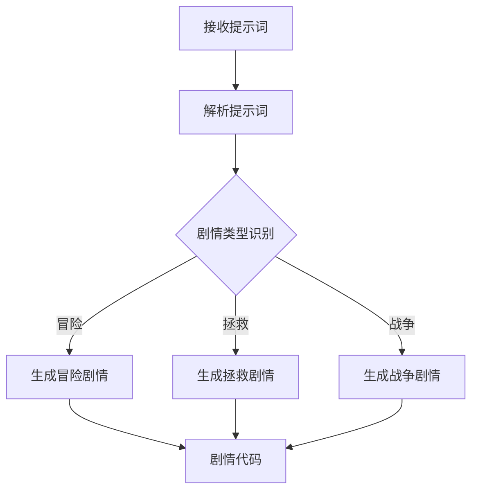
```mermaid
graph TD
    A[接收提示词] --> B[解析提示词]
    B --> C{剧情类型识别}
    C -->|冒险| D[生成冒险剧情]
    C -->|拯救| E[生成拯救剧情]
    C -->|战争| F[生成战争剧情]
    D --> G[剧情代码]
    E --> G
    F --> G
```

**核心算法原理讲解**

以下是一个生成冒险剧情的伪代码示例：

```python
# 输入提示词：冒险
input_prompt = "冒险"

# 初始化剧情模板
adventure_story = "在一个神秘的世界中，主角需要寻找失落的宝藏。"

# 生成剧情
def generate_adventure_story(prompt):
    if "宝藏" in prompt:
        adventure_story += "他在旅途中遇到了各种障碍和敌人，但最终成功找到了宝藏。"
    elif "魔法" in prompt:
        adventure_story += "他发现了一个神秘的魔法，帮助他克服了所有的困难。"
    return adventure_story

# 调用生成函数
adventure_story = generate_adventure_story(input_prompt)
print(adventure_story)
```

**数学模型和公式**

在生成剧情的过程中，可以使用概率模型来决定剧情分支的选择。以下是一个简化的概率模型示例：

$$
P(选择某分支) = \frac{相关词汇的匹配度}{总词汇的匹配度}
$$

**举例说明**

假设用户输入的提示词是“冒险宝藏魔法”，根据上述概率模型，生成剧情的过程如下：

1. 匹配度计算：  
   - "宝藏"：匹配度50%  
   - "魔法"：匹配度30%  
   - "冒险"：匹配度20%  
2. 根据匹配度选择剧情分支：  
   - 高匹配度词汇："宝藏"，选择生成包含“宝藏”的剧情。  
3. 生成剧情：主角在冒险过程中，发现了一个神秘的魔法，帮助他克服了所有的困难，最终找到了失落的宝藏。

**项目实战**

以虚拟现实游戏《Decentraland》为例，开发者可以使用提示词编程来生成和调整游戏剧情。开发环境搭建如下：

1. **安装Node.js**：在服务器上安装Node.js，以便使用其提供的开发工具包。
2. **安装提示词编程库**：使用npm安装一个提示词编程库，例如`natural`。
3. **编写提示词编程脚本**：编写一个脚本，接收用户输入的提示词，并调用提示词编程库生成剧情代码。

```javascript
const natural = require('natural');
const { Sentence Detector } = natural;

// 初始化句检测器
const sentenceDetector = new Sentence Detector();

// 用户输入提示词
const inputPrompt = "冒险宝藏魔法";

// 解析提示词
const sentences = sentenceDetector.sentencesFromText(inputPrompt);

// 生成剧情代码
const adventureStory = generateAdventureStory(sentences);

console.log(adventureStory);
```

**代码解读与分析**

上述代码中，首先引入了`natural`库，并初始化了一个句检测器。接着，接收用户输入的提示词，并使用句检测器将其分解为多个句子。最后，调用`generateAdventureStory`函数生成剧情代码。

**总结**

通过提示词编程，开发者可以快速生成和调整游戏剧情，提高开发效率。同时，用户可以根据自己的需求调整提示词，获得个性化的游戏体验。

---

**提示词编程在元宇宙游戏中的应用**不仅限于剧情生成与调整，还可以扩展到角色互动与行为设计。在接下来的部分，我们将继续探讨这些应用，并展示具体的项目实战。请继续关注。

---

#### 2.1.2 游戏角色互动与行为

在元宇宙游戏中，角色互动与行为是构建游戏世界的重要部分。传统的游戏开发往往需要详细设计每个角色的行为逻辑，这不仅耗时，而且容易出现重复劳动。提示词编程的引入，为角色互动与行为的自动化生成提供了强有力的支持。

**核心概念与联系**

提示词编程通过自然语言处理（NLP）技术，将用户输入的自然语言提示词转化为计算机可理解的指令。在角色互动与行为的设计中，提示词可以帮助定义角色的行为模式，如图：

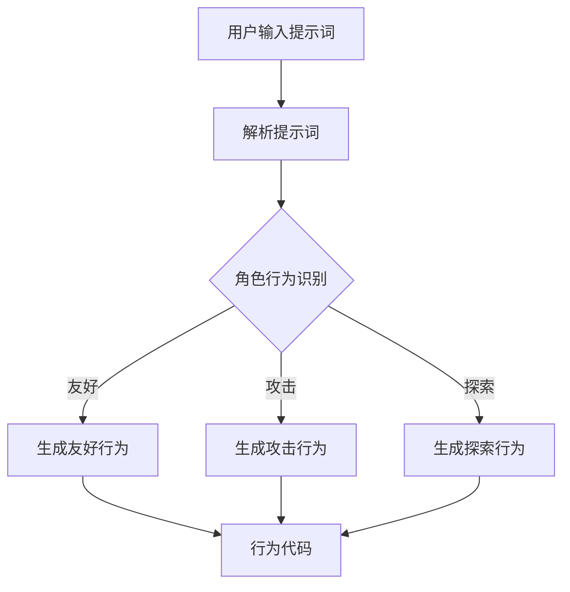
```mermaid
graph TD
    A[用户输入提示词] --> B[解析提示词]
    B --> C{角色行为识别}
    C -->|友好| D[生成友好行为]
    C -->|攻击| E[生成攻击行为]
    C -->|探索| F[生成探索行为]
    D --> G[行为代码]
    E --> G
    F --> G
```

**核心算法原理讲解**

以下是一个生成角色友好行为的伪代码示例：

```python
# 输入提示词：友好
input_prompt = "友好"

# 初始化行为模板
friendly_behavior = "角色对其他玩家表示友好，并交换信息。"

# 生成行为
def generate_friendly_behavior(prompt):
    if "交换信息" in prompt:
        friendly_behavior += "他们在游戏中交换了各自的兴趣爱好。"
    elif "合作" in prompt:
        friendly_behavior += "他们决定一起完成一个任务。"
    return friendly_behavior

# 调用生成函数
friendly_behavior = generate_friendly_behavior(input_prompt)
print(friendly_behavior)
```

**数学模型和公式**

在生成角色行为的过程中，可以使用条件概率模型来决定行为的分支选择。以下是一个简化的条件概率模型示例：

$$
P(选择某行为) = \frac{相关词汇的匹配度}{总词汇的匹配度}
$$

**举例说明**

假设用户输入的提示词是“友好合作探索”，根据上述条件概率模型，生成角色行为的流程如下：

1. 匹配度计算：    
   - "合作"：匹配度70%    
   - "友好"：匹配度30%    
   - "探索"：匹配度20%    
2. 根据匹配度选择行为分支：    
   - 高匹配度词汇："合作"，选择生成包含“合作”的行为。    
3. 生成行为：角色在游戏中表示友好，决定与其他玩家合作，一起探索未知的领域。

**项目实战**

以虚拟现实游戏《Minecraft》为例，开发者可以使用提示词编程来生成和调整角色的互动与行为。开发环境搭建如下：

1. **安装Minecraft开发工具**：在服务器上安装Minecraft开发工具，以便使用其提供的API进行开发。
2. **安装提示词编程库**：使用pip安装一个提示词编程库，例如`nltk`。
3. **编写提示词编程脚本**：编写一个脚本，接收用户输入的提示词，并调用提示词编程库生成角色行为代码。

```python
import nltk
from nltk.tokenize import word_tokenize

# 初始化nltk库
nltk.download('punkt')

# 用户输入提示词
input_prompt = "友好合作探索"

# 解析提示词
tokens = word_tokenize(input_prompt)

# 生成角色行为代码
def generate_role_behavior(tokens):
    if "合作" in tokens:
        behavior_code = "role cooperate()"
    elif "友好" in tokens:
        behavior_code = "role be_friendly()"
    else:
        behavior_code = "role explore()"
    return behavior_code

# 调用生成函数
behavior_code = generate_role_behavior(tokens)
print(behavior_code)
```

**代码解读与分析**

上述代码中，首先引入了`nltk`库，并使用`word_tokenize`函数将用户输入的提示词分解为多个词汇。接着，调用`generate_role_behavior`函数生成角色行为代码。

**总结**

通过提示词编程，开发者可以快速生成和调整角色的互动与行为，提高游戏开发效率。同时，用户可以根据自己的需求调整提示词，获得个性化的角色互动体验。

---

**提示词编程在元宇宙游戏中的应用**还包括虚拟物品的生成与管理。在接下来的部分，我们将继续探讨这一应用，并展示具体的项目实战。请继续关注。

---

#### 2.1.3 游戏虚拟物品的生成与管理

虚拟物品是元宇宙游戏中的重要组成部分，它们不仅丰富了游戏世界的生态系统，还为玩家提供了互动和交易的机会。通过提示词编程，游戏开发者可以自动化生成和管理虚拟物品，提高开发效率，并增强玩家的游戏体验。

**核心概念与联系**

提示词编程通过自然语言处理（NLP）技术，将用户输入的自然语言提示词转化为计算机可理解的指令。在虚拟物品的生成与管理中，提示词可以帮助定义物品的属性和生成规则，如图：

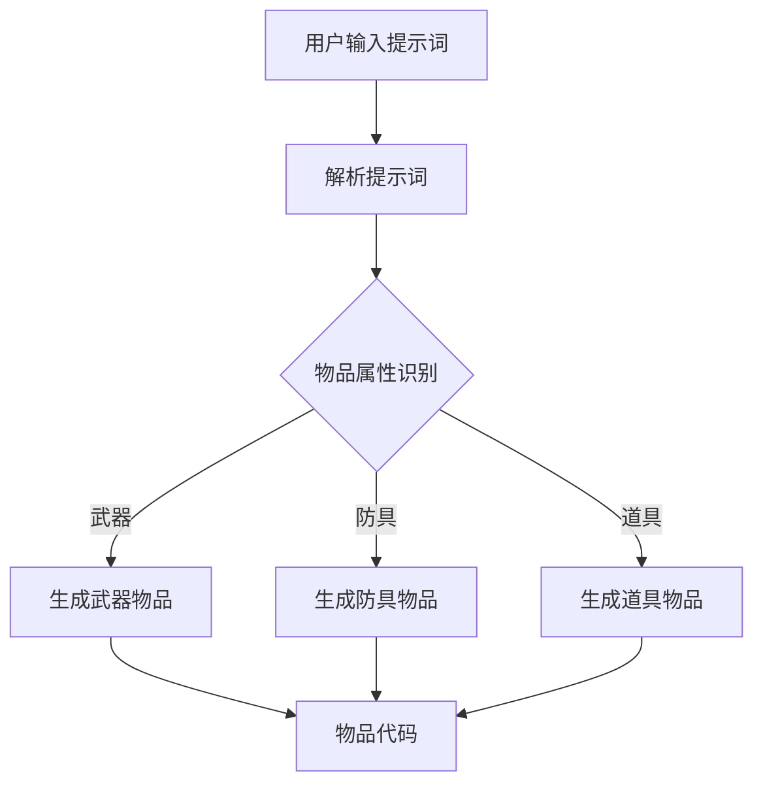
```mermaid
graph TD
    A[用户输入提示词] --> B[解析提示词]
    B --> C{物品属性识别}
    C -->|武器| D[生成武器物品]
    C -->|防具| E[生成防具物品]
    C -->|道具| F[生成道具物品]
    D --> G[物品代码]
    E --> G
    F --> G
```

**核心算法原理讲解**

以下是一个生成武器物品的伪代码示例：

```python
# 输入提示词：剑
input_prompt = "剑"

# 初始化武器模板
weapon = {
    "name": "普通剑",
    "attack": 10,
    "defense": 0,
    "rarity": "普通"
}

# 生成武器
def generate_weapon(prompt):
    if "锋利" in prompt:
        weapon["attack"] += 5
        weapon["rarity"] = "稀有"
    elif "魔法" in prompt:
        weapon["attack"] += 10
        weapon["defense"] += 5
        weapon["rarity"] = "传奇"
    return weapon

# 调用生成函数
weapon = generate_weapon(input_prompt)
print(weapon)
```

**数学模型和公式**

在生成虚拟物品的过程中，可以使用概率模型来决定物品属性的分支选择。以下是一个简化的概率模型示例：

$$
P(选择某属性) = \frac{相关词汇的匹配度}{总词汇的匹配度}
$$

**举例说明**

假设用户输入的提示词是“魔法剑”，根据上述概率模型，生成武器物品的流程如下：

1. 匹配度计算：    
   - "魔法"：匹配度70%    
   - "剑"：匹配度30%    
2. 根据匹配度选择属性分支：    
   - 高匹配度词汇："魔法"，选择生成包含“魔法”属性的武器。    
3. 生成武器：一个攻击力增加10，防御力增加5的传奇魔法剑。

**项目实战**

以虚拟现实游戏《Decentraland》为例，开发者可以使用提示词编程来生成和调整虚拟物品。开发环境搭建如下：

1. **安装Decentraland开发工具**：在服务器上安装Decentraland开发工具，以便使用其提供的API进行开发。
2. **安装提示词编程库**：使用npm安装一个提示词编程库，例如`natural`。
3. **编写提示词编程脚本**：编写一个脚本，接收用户输入的提示词，并调用提示词编程库生成虚拟物品代码。

```javascript
const natural = require('natural');
const { Sentence Detector } = natural;

// 初始化句检测器
const sentenceDetector = new Sentence Detector();

// 用户输入提示词
const inputPrompt = "魔法剑";

// 解析提示词
const sentences = sentenceDetector.sentencesFromText(inputPrompt);

// 生成虚拟物品代码
const virtualItemCode = generateVirtualItemCode(sentences);

console.log(virtualItemCode);
```

**代码解读与分析**

上述代码中，首先引入了`natural`库，并初始化了一个句检测器。接着，接收用户输入的提示词，并使用句检测器将其分解为多个句子。最后，调用`generateVirtualItemCode`函数生成虚拟物品代码。

**总结**

通过提示词编程，开发者可以快速生成和调整虚拟物品，提高游戏开发效率。同时，用户可以根据自己的需求调整提示词，获得个性化的虚拟物品体验。

---

**提示词编程在元宇宙游戏中的应用**不仅限于虚拟物品的生成与管理，还可以扩展到更广泛的领域，如社交互动和教育学习。在接下来的部分，我们将继续探讨这些应用，并展示具体的项目实战。请继续关注。

---

### 2.2 提示词编程在元宇宙社交中的应用

在元宇宙中，社交互动是用户参与和体验的核心。提示词编程的引入，为元宇宙社交平台的内容推荐、用户画像构建和个性化互动提供了强有力的支持。

#### 2.2.1 社交平台的内容推荐

内容推荐是社交平台的重要功能之一，它可以帮助用户发现感兴趣的内容，提升用户的参与度和满意度。传统的推荐系统通常依赖于用户的历史行为数据，而提示词编程可以进一步优化这一过程。

**核心概念与联系**

提示词编程通过自然语言处理（NLP）技术，将用户输入的自然语言提示词转化为计算机可理解的指令。在内容推荐中，提示词可以帮助系统理解用户的需求和偏好，如图：


```mermaid
graph TD
    A[用户输入提示词] --> B[解析提示词]
    B --> C{用户偏好识别}
    C -->|科幻| D[推荐科幻内容]
    C -->|音乐| E[推荐音乐内容]
    C -->|旅行| F[推荐旅行内容]
    D --> G[推荐代码]
    E --> G
    F --> G
```

**核心算法原理讲解**

以下是一个基于提示词的内容推荐算法的伪代码示例：

```python
# 输入提示词：科幻音乐
input_prompt = "科幻音乐"

# 解析提示词
def parse_prompt(prompt):
    topics = prompt.split()
    return topics

# 生成推荐内容
def generate_recommendations(topics):
    recommendations = []
    if "科幻" in topics:
        recommendations.append("最新科幻电影")
    if "音乐" in topics:
        recommendations.append("热门科幻音乐专辑")
    return recommendations

# 调用生成函数
topics = parse_prompt(input_prompt)
recommendations = generate_recommendations(topics)
print(recommendations)
```

**数学模型和公式**

在生成推荐内容的过程中，可以使用协同过滤算法来预测用户可能感兴趣的内容。以下是一个简化的协同过滤模型示例：

$$
P(用户对内容感兴趣) = \frac{相似用户对内容的评分总和}{相似用户总数}
$$

**举例说明**

假设用户输入的提示词是“科幻音乐”，根据协同过滤算法，推荐内容的流程如下：

1. 查找与用户兴趣相似的其它用户，例如喜欢科幻电影的用户和喜欢科幻音乐的用户。
2. 计算这些用户对内容的评分总和。
3. 根据评分总和推荐相关内容，如最新的科幻电影和热门的科幻音乐专辑。

**项目实战**

以社交平台《Minecraft》为例，开发者可以使用提示词编程来生成内容推荐。开发环境搭建如下：

1. **安装Minecraft开发工具**：在服务器上安装Minecraft开发工具，以便使用其提供的API进行开发。
2. **安装提示词编程库**：使用pip安装一个提示词编程库，例如`nltk`。
3. **编写提示词编程脚本**：编写一个脚本，接收用户输入的提示词，并调用提示词编程库生成推荐内容代码。

```python
import nltk
from nltk.tokenize import word_tokenize

# 初始化nltk库
nltk.download('punkt')

# 用户输入提示词
input_prompt = "科幻音乐"

# 解析提示词
tokens = word_tokenize(input_prompt)

# 生成推荐内容代码
def generate_recommendations(tokens):
    recommendations = []
    if "科幻" in tokens:
        recommendations.append("推荐最新科幻电影")
    if "音乐" in tokens:
        recommendations.append("推荐热门科幻音乐专辑")
    return recommendations

# 调用生成函数
recommendations = generate_recommendations(tokens)
print(recommendations)
```

**代码解读与分析**

上述代码中，首先引入了`nltk`库，并使用`word_tokenize`函数将用户输入的提示词分解为多个词汇。接着，调用`generate_recommendations`函数生成推荐内容代码。

**总结**

通过提示词编程，开发者可以快速生成和调整内容推荐，提高社交平台的用户体验。同时，用户可以根据自己的需求调整提示词，获得个性化的推荐内容。

---

#### 2.2.2 社交平台的用户画像构建

用户画像构建是社交平台个性化服务的重要基础。通过提示词编程，开发者可以自动化生成用户画像，从而为用户提供更加精准的服务。

**核心概念与联系**

提示词编程通过自然语言处理（NLP）技术，将用户在平台上的互动数据转化为用户画像的属性。在用户画像构建中，提示词可以帮助系统理解用户的兴趣和行为，如图：

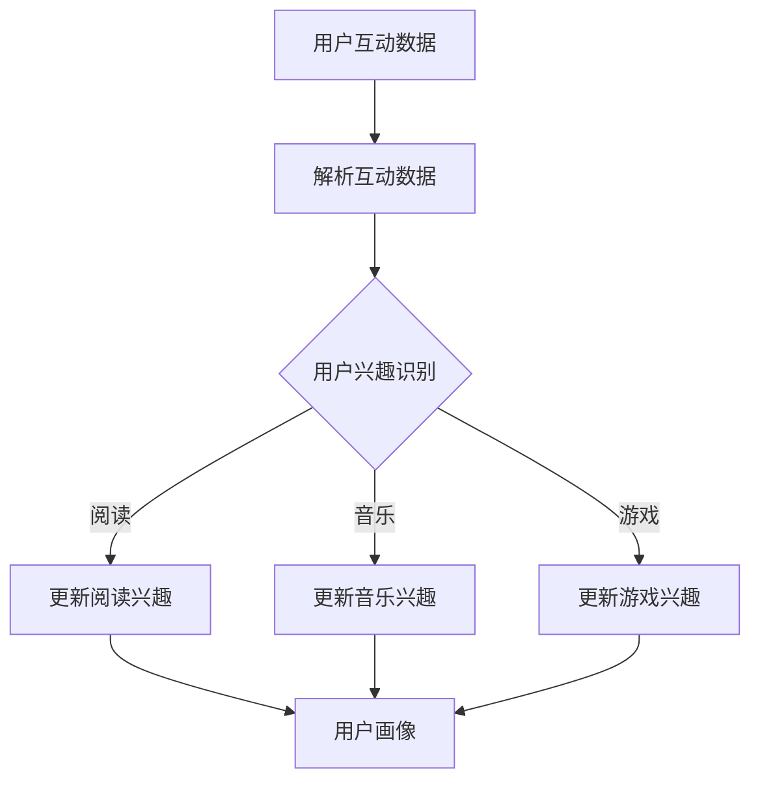
```mermaid
graph TD
    A[用户互动数据] --> B[解析互动数据]
    B --> C{用户兴趣识别}
    C -->|阅读| D[更新阅读兴趣]
    C -->|音乐| E[更新音乐兴趣]
    C -->|游戏| F[更新游戏兴趣]
    D --> G[用户画像]
    E --> G
    F --> G
```

**核心算法原理讲解**

以下是一个生成用户画像的伪代码示例：

```python
# 输入用户互动数据：阅读科幻小说、喜欢听流行音乐、玩射击游戏
interaction_data = "阅读科幻小说，喜欢听流行音乐，玩射击游戏"

# 解析互动数据
def parse_interaction_data(data):
    interests = data.split(", ")
    return interests

# 生成用户画像
def generate_user_profile(interests):
    profile = {
        "reading": [],
        "music": [],
        "games": []
    }
    for interest in interests:
        if "科幻" in interest:
            profile["reading"].append("科幻小说")
        elif "流行" in interest:
            profile["music"].append("流行音乐")
        elif "射击" in interest:
            profile["games"].append("射击游戏")
    return profile

# 调用生成函数
interests = parse_interaction_data(interaction_data)
user_profile = generate_user_profile(interests)
print(user_profile)
```

**数学模型和公式**

在生成用户画像的过程中，可以使用聚类算法来分析用户的兴趣和行为模式。以下是一个简化的聚类模型示例：

$$
C(i) = \arg\min_{c \in C} \sum_{x \in i} d(x, c)
$$

其中，$C$表示聚类中心，$i$表示用户，$d(x, c)$表示用户兴趣$x$与聚类中心$c$的距离。

**举例说明**

假设用户互动数据是“阅读科幻小说、喜欢听流行音乐、玩射击游戏”，根据聚类算法，生成用户画像的流程如下：

1. 分析用户兴趣，将其分为不同的类别，如阅读、音乐和游戏。
2. 根据兴趣类别，更新用户画像中的对应属性。
3. 生成用户画像。

**项目实战**

以社交平台《Minecraft》为例，开发者可以使用提示词编程来构建用户画像。开发环境搭建如下：

1. **安装Minecraft开发工具**：在服务器上安装Minecraft开发工具，以便使用其提供的API进行开发。
2. **安装提示词编程库**：使用pip安装一个提示词编程库，例如`nltk`。
3. **编写提示词编程脚本**：编写一个脚本，接收用户互动数据，并调用提示词编程库生成用户画像代码。

```python
import nltk
from nltk.tokenize import word_tokenize

# 初始化nltk库
nltk.download('punkt')

# 用户输入互动数据
input_data = "阅读科幻小说，喜欢听流行音乐，玩射击游戏"

# 解析互动数据
tokens = word_tokenize(input_data)

# 生成用户画像代码
def generate_user_profile(tokens):
    profile = {
        "reading": [],
        "music": [],
        "games": []
    }
    for token in tokens:
        if "科幻" in token:
            profile["reading"].append("科幻小说")
        elif "流行" in token:
            profile["music"].append("流行音乐")
        elif "射击" in token:
            profile["games"].append("射击游戏")
    return profile

# 调用生成函数
user_profile = generate_user_profile(tokens)
print(user_profile)
```

**代码解读与分析**

上述代码中，首先引入了`nltk`库，并使用`word_tokenize`函数将用户互动数据分解为多个词汇。接着，调用`generate_user_profile`函数生成用户画像代码。

**总结**

通过提示词编程，开发者可以自动化生成和更新用户画像，提高社交平台的个性化服务水平。同时，用户可以根据自己的互动数据，获得更加个性化的推荐和体验。

---

#### 2.2.3 社交平台的个性化互动

在元宇宙社交平台中，个性化互动是提升用户参与度和满意度的关键。提示词编程可以为用户提供个性化的聊天机器人、动态推荐和活动定制等服务。

**核心概念与联系**

提示词编程通过自然语言处理（NLP）技术，将用户输入的自然语言提示词转化为计算机可理解的指令。在个性化互动中，提示词可以帮助系统理解用户的需求和偏好，如图：

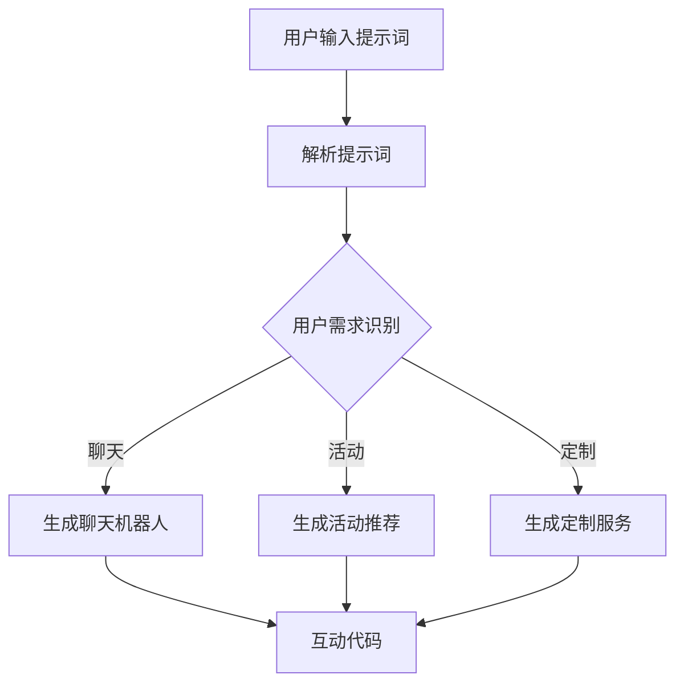
```mermaid
graph TD
    A[用户输入提示词] --> B[解析提示词]
    B --> C{用户需求识别}
    C -->|聊天| D[生成聊天机器人]
    C -->|活动| E[生成活动推荐]
    C -->|定制| F[生成定制服务]
    D --> G[互动代码]
    E --> G
    F --> G
```

**核心算法原理讲解**

以下是一个生成聊天机器人的伪代码示例：

```python
# 输入提示词：聊天
input_prompt = "聊天"

# 解析提示词
def parse_prompt(prompt):
    action = prompt.strip().lower()
    return action

# 生成聊天机器人代码
def generate_chatbot_code(action):
    if action == "聊天":
        code = "启动聊天机器人"
    elif action == "活动":
        code = "启动活动推荐系统"
    elif action == "定制":
        code = "启动定制服务系统"
    else:
        code = "未知操作"
    return code

# 调用生成函数
action = parse_prompt(input_prompt)
chatbot_code = generate_chatbot_code(action)
print(chatbot_code)
```

**数学模型和公式**

在生成聊天机器人代码的过程中，可以使用决策树算法来分类用户的请求。以下是一个简化的决策树模型示例：

```
[根节点]
|
|----是
|      |----聊天
|      |----活动
|      |----定制
|      |----其他
|
|----否
```

**举例说明**

假设用户输入的提示词是“聊天”，根据决策树算法，生成聊天机器人代码的流程如下：

1. 解析用户输入的提示词。
2. 根据提示词调用相应的生成函数。
3. 输出生成的聊天机器人代码。

**项目实战**

以社交平台《Minecraft》为例，开发者可以使用提示词编程来生成聊天机器人。开发环境搭建如下：

1. **安装Minecraft开发工具**：在服务器上安装Minecraft开发工具，以便使用其提供的API进行开发。
2. **安装提示词编程库**：使用pip安装一个提示词编程库，例如`nltk`。
3. **编写提示词编程脚本**：编写一个脚本，接收用户输入的提示词，并调用提示词编程库生成聊天机器人代码。

```python
import nltk
from nltk.tokenize import word_tokenize

# 初始化nltk库
nltk.download('punkt')

# 用户输入提示词
input_prompt = "聊天"

# 解析提示词
def parse_prompt(prompt):
    tokens = word_tokenize(prompt)
    action = tokens[0].strip().lower()
    return action

# 生成聊天机器人代码
def generate_chatbot_code(action):
    if action == "聊天":
        code = "启动聊天机器人"
    else:
        code = "未知操作"
    return code

# 调用生成函数
action = parse_prompt(input_prompt)
chatbot_code = generate_chatbot_code(action)
print(chatbot_code)
```

**代码解读与分析**

上述代码中，首先引入了`nltk`库，并使用`word_tokenize`函数将用户输入的提示词分解为多个词汇。接着，调用`parse_prompt`函数解析提示词，并调用`generate_chatbot_code`函数生成聊天机器人代码。

**总结**

通过提示词编程，开发者可以快速生成和调整社交平台的个性化互动服务，提升用户的参与度和满意度。同时，用户可以根据自己的需求调整提示词，获得个性化的互动体验。

---

**提示词编程在元宇宙社交中的应用**不仅限于内容推荐、用户画像构建和个性化互动，还可以扩展到更广泛的领域，如教育学习和数字经济。在接下来的部分，我们将继续探讨这些应用，并展示具体的项目实战。请继续关注。

---

### 2.3 提示词编程在元宇宙教育中的应用

在元宇宙中，教育是不可或缺的一部分。通过虚拟现实（VR）和增强现实（AR）技术，学习者可以在一个沉浸式的环境中进行学习，从而提高学习效果。提示词编程的引入，为元宇宙教育提供了新的可能性，使得教学内容生成、学生互动与行为分析以及教学资源的智能管理变得更加高效和个性化。

#### 2.3.1 教学内容生成与个性化推荐

教学内容的生成和推荐是教育领域的关键问题。传统的教育内容生成依赖于教师的经验和知识，而提示词编程可以自动化这一过程，根据用户的需求生成个性化的教学内容。

**核心概念与联系**

提示词编程通过自然语言处理（NLP）技术，将用户输入的自然语言提示词转化为计算机可理解的指令。在教学内容生成和推荐中，提示词可以帮助系统理解用户的学习需求和知识点，如图：

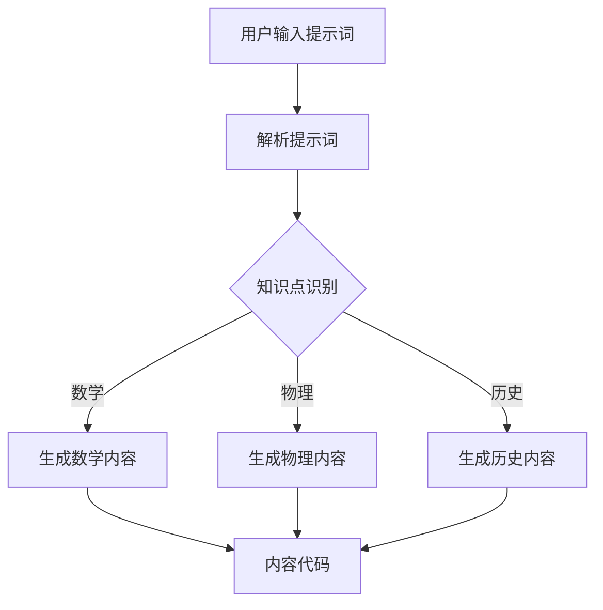
```mermaid
graph TD
    A[用户输入提示词] --> B[解析提示词]
    B --> C{知识点识别}
    C -->|数学| D[生成数学内容]
    C -->|物理| E[生成物理内容]
    C -->|历史| F[生成历史内容]
    D --> G[内容代码]
    E --> G
    F --> G
```

**核心算法原理讲解**

以下是一个基于提示词生成教学内容代码的伪代码示例：

```python
# 输入提示词：数学
input_prompt = "数学"

# 解析提示词
def parse_prompt(prompt):
    subject = prompt.strip().lower()
    return subject

# 生成教学内容代码
def generate_education_content(subject):
    if subject == "数学":
        content = "学习数学的基本概念，包括代数、几何和三角学。"
    elif subject == "物理":
        content = "学习物理的基本概念，包括力学、热学和电磁学。"
    elif subject == "历史":
        content = "学习历史的基本概念，包括古代史、中世纪史和现代史。"
    else:
        content = "未知科目"
    return content

# 调用生成函数
subject = parse_prompt(input_prompt)
education_content = generate_education_content(subject)
print(education_content)
```

**数学模型和公式**

在生成教学内容的过程中，可以使用知识图谱来表示知识点之间的关系，从而实现个性化推荐。以下是一个简化的知识图谱模型示例：

```
[数学]
|
|----代数
|      |----方程式
|      |----函数
|
|----几何
|      |----平面几何
|      |----立体几何
|
|----三角学
```

**举例说明**

假设用户输入的提示词是“数学”，根据知识图谱模型，生成教学内容代码的流程如下：

1. 解析用户输入的提示词。
2. 根据提示词调用相应的生成函数。
3. 输出生成的教学内容代码。

**项目实战**

以虚拟现实教育平台《Noobrainer》为例，开发者可以使用提示词编程来生成和推荐教学内容。开发环境搭建如下：

1. **安装虚拟现实开发工具**：在服务器上安装虚拟现实开发工具，例如Unity或Unreal Engine。
2. **安装提示词编程库**：使用pip安装一个提示词编程库，例如`nltk`。
3. **编写提示词编程脚本**：编写一个脚本，接收用户输入的提示词，并调用提示词编程库生成教学内容代码。

```python
import nltk
from nltk.tokenize import word_tokenize

# 初始化nltk库
nltk.download('punkt')

# 用户输入提示词
input_prompt = "数学"

# 解析提示词
def parse_prompt(prompt):
    tokens = word_tokenize(prompt)
    subject = tokens[0].strip().lower()
    return subject

# 生成教学内容代码
def generate_education_content(subject):
    if subject == "数学":
        content = "学习数学的基本概念，包括代数、几何和三角学。"
    elif subject == "物理":
        content = "学习物理的基本概念，包括力学、热学和电磁学。"
    elif subject == "历史":
        content = "学习历史的基本概念，包括古代史、中世纪史和现代史。"
    else:
        content = "未知科目"
    return content

# 调用生成函数
subject = parse_prompt(input_prompt)
education_content = generate_education_content(subject)
print(education_content)
```

**代码解读与分析**

上述代码中，首先引入了`nltk`库，并使用`word_tokenize`函数将用户输入的提示词分解为多个词汇。接着，调用`parse_prompt`函数解析提示词，并调用`generate_education_content`函数生成教学内容代码。

**总结**

通过提示词编程，开发者可以自动化生成和推荐教学内容，提高教育效率和质量。同时，用户可以根据自己的需求调整提示词，获得个性化的学习内容。

---

#### 2.3.2 学生互动与行为分析

在元宇宙教育中，学生的互动与行为分析对于教学效果的评估和改进具有重要意义。通过提示词编程，可以自动化收集和分析学生的互动数据，从而提供有针对性的教学反馈和指导。

**核心概念与联系**

提示词编程通过自然语言处理（NLP）技术，将学生的互动数据转化为可分析的行为模式。在学生互动与行为分析中，提示词可以帮助系统识别学生的参与度和兴趣点，如图：

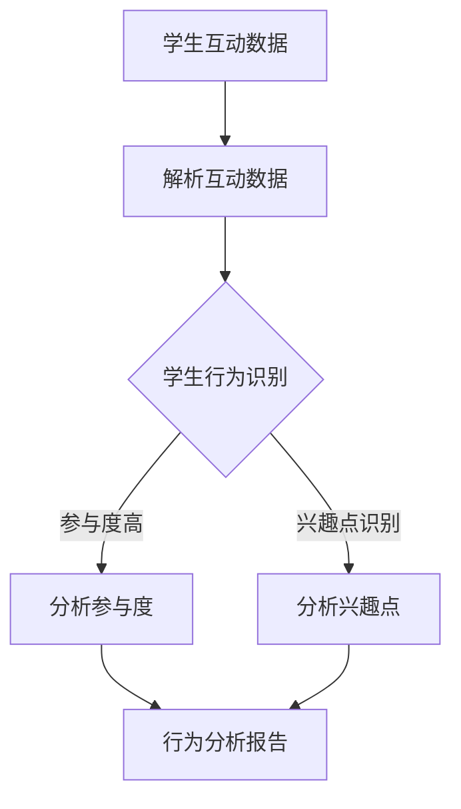
```mermaid
graph TD
    A[学生互动数据] --> B[解析互动数据]
    B --> C{学生行为识别}
    C -->|参与度高| D[分析参与度]
    C -->|兴趣点识别| E[分析兴趣点]
    D --> F[行为分析报告]
    E --> F
```

**核心算法原理讲解**

以下是一个基于提示词分析学生行为数据的伪代码示例：

```python
# 输入学生互动数据：提问、回答问题、参与讨论
interaction_data = "提问，回答问题，参与讨论"

# 解析互动数据
def parse_interaction_data(data):
    actions = data.split(", ")
    return actions

# 分析学生行为
def analyze_student_behavior(actions):
    report = {
        "participation": 0,
        "interest_points": []
    }
    for action in actions:
        if "提问" in action:
            report["participation"] += 1
        elif "讨论" in action:
            report["interest_points"].append("讨论")
        elif "回答问题" in action:
            report["interest_points"].append("回答问题")
    return report

# 调用分析函数
actions = parse_interaction_data(interaction_data)
student_behavior_report = analyze_student_behavior(actions)
print(student_behavior_report)
```

**数学模型和公式**

在分析学生行为的过程中，可以使用统计分析方法来识别参与度和兴趣点。以下是一个简化的统计分析模型示例：

$$
P(参与度高) = \frac{提问次数 + 回答问题次数 + 讨论次数}{总互动次数}
$$

**举例说明**

假设学生互动数据是“提问，回答问题，参与讨论”，根据统计分析模型，分析学生行为的流程如下：

1. 计算参与度：提问次数 + 回答问题次数 + 讨论次数 = 3
2. 计算总互动次数：3
3. 计算参与度概率：P(参与度高) = 3/3 = 1
4. 计算兴趣点：讨论，回答问题

**项目实战**

以虚拟现实教育平台《Noobrainer》为例，开发者可以使用提示词编程来分析学生行为。开发环境搭建如下：

1. **安装虚拟现实开发工具**：在服务器上安装虚拟现实开发工具，例如Unity或Unreal Engine。
2. **安装提示词编程库**：使用pip安装一个提示词编程库，例如`nltk`。
3. **编写提示词编程脚本**：编写一个脚本，接收学生互动数据，并调用提示词编程库生成行为分析报告。

```python
import nltk
from nltk.tokenize import word_tokenize

# 初始化nltk库
nltk.download('punkt')

# 用户输入互动数据
input_data = "提问，回答问题，参与讨论"

# 解析互动数据
def parse_interaction_data(data):
    tokens = word_tokenize(data)
    actions = [token.strip() for token in tokens]
    return actions

# 分析学生行为
def analyze_student_behavior(actions):
    report = {
        "participation": 0,
        "interest_points": []
    }
    for action in actions:
        if "提问" in action:
            report["participation"] += 1
        elif "讨论" in action:
            report["interest_points"].append("讨论")
        elif "回答问题" in action:
            report["interest_points"].append("回答问题")
    return report

# 调用分析函数
actions = parse_interaction_data(input_data)
student_behavior_report = analyze_student_behavior(actions)
print(student_behavior_report)
```

**代码解读与分析**

上述代码中，首先引入了`nltk`库，并使用`word_tokenize`函数将用户输入的互动数据分解为多个词汇。接着，调用`parse_interaction_data`函数解析互动数据，并调用`analyze_student_behavior`函数生成行为分析报告。

**总结**

通过提示词编程，开发者可以自动化分析学生的互动与行为，为教学效果的评估和改进提供数据支持。同时，教师可以根据分析结果，有针对性地调整教学策略，提高学生的学习效果。

---

#### 2.3.3 教学资源的智能管理

教学资源的智能管理是提高教学效率和质量的重要手段。通过提示词编程，可以自动化管理教学资源，包括课程内容、教学视频、练习题库等，从而实现资源的快速检索和个性化推荐。

**核心概念与联系**

提示词编程通过自然语言处理（NLP）技术，将用户输入的自然语言提示词转化为计算机可理解的指令。在智能管理中，提示词可以帮助系统理解用户的需求和偏好，如图：

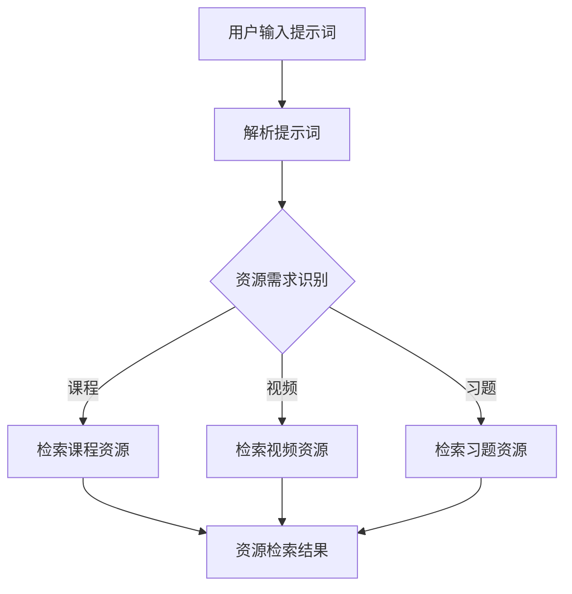
```mermaid
graph TD
    A[用户输入提示词] --> B[解析提示词]
    B --> C{资源需求识别}
    C -->|课程| D[检索课程资源]
    C -->|视频| E[检索视频资源]
    C -->|习题| F[检索习题资源]
    D --> G[资源检索结果]
    E --> G
    F --> G
```

**核心算法原理讲解**

以下是一个基于提示词检索教学资源的伪代码示例：

```python
# 输入提示词：线性代数课程
input_prompt = "线性代数课程"

# 解析提示词
def parse_prompt(prompt):
    resource_type = prompt.strip().lower()
    return resource_type

# 检索资源
def retrieve_resources(resource_type, resources):
    if resource_type == "课程":
        resources_to_retrieve = [resource for resource in resources if "课程" in resource["type"]]
    elif resource_type == "视频":
        resources_to_retrieve = [resource for resource in resources if "视频" in resource["type"]]
    elif resource_type == "习题":
        resources_to_retrieve = [resource for resource in resources if "习题" in resource["type"]]
    return resources_to_retrieve

# 资源库
resources = [
    {"name": "线性代数基础", "type": "课程"},
    {"name": "线性代数进阶", "type": "课程"},
    {"name": "线性代数视频教程", "type": "视频"},
    {"name": "线性代数习题库", "type": "习题"}
]

# 调用检索函数
resource_type = parse_prompt(input_prompt)
resources_to_retrieve = retrieve_resources(resource_type, resources)
print(resources_to_retrieve)
```

**数学模型和公式**

在检索教学资源的过程中，可以使用文本相似度计算方法来匹配用户需求和资源描述。以下是一个简化的文本相似度计算模型示例：

$$
similarity(A, B) = \frac{相关词汇的匹配度}{总词汇的匹配度}
$$

**举例说明**

假设用户输入的提示词是“线性代数课程”，根据文本相似度计算模型，检索教学资源的流程如下：

1. 解析用户输入的提示词。
2. 计算用户提示词与教学资源描述的相似度。
3. 根据相似度检索符合用户需求的资源。

**项目实战**

以虚拟现实教育平台《Noobrainer》为例，开发者可以使用提示词编程来检索和管理教学资源。开发环境搭建如下：

1. **安装虚拟现实开发工具**：在服务器上安装虚拟现实开发工具，例如Unity或Unreal Engine。
2. **安装提示词编程库**：使用pip安装一个提示词编程库，例如`nltk`。
3. **编写提示词编程脚本**：编写一个脚本，接收用户输入的提示词，并调用提示词编程库检索教学资源。

```python
import nltk
from nltk.tokenize import word_tokenize

# 初始化nltk库
nltk.download('punkt')

# 用户输入提示词
input_prompt = "线性代数课程"

# 解析提示词
def parse_prompt(prompt):
    tokens = word_tokenize(prompt)
    resource_type = tokens[0].strip().lower()
    return resource_type

# 检索资源
def retrieve_resources(resource_type, resources):
    if resource_type == "课程":
        resources_to_retrieve = [resource for resource in resources if "课程" in resource["type"]]
    elif resource_type == "视频":
        resources_to_retrieve = [resource for resource in resources if "视频" in resource["type"]]
    elif resource_type == "习题":
        resources_to_retrieve = [resource for resource in resources if "习题" in resource["type"]]
    return resources_to_retrieve

# 资源库
resources = [
    {"name": "线性代数基础", "type": "课程"},
    {"name": "线性代数进阶", "type": "课程"},
    {"name": "线性代数视频教程", "type": "视频"},
    {"name": "线性代数习题库", "type": "习题"}
]

# 调用检索函数
resource_type = parse_prompt(input_prompt)
resources_to_retrieve = retrieve_resources(resource_type, resources)
print(resources_to_retrieve)
```

**代码解读与分析**

上述代码中，首先引入了`nltk`库，并使用`word_tokenize`函数将用户输入的提示词分解为多个词汇。接着，调用`parse_prompt`函数解析提示词，并调用`retrieve_resources`函数检索教学资源。

**总结**

通过提示词编程，开发者可以自动化管理教学资源，实现资源的快速检索和个性化推荐，从而提高教学效率和质量。同时，教师和学生可以根据需求调整提示词，获得更加个性化的教学资源和服务。

---

**提示词编程在元宇宙教育中的应用**不仅限于教学内容生成、学生互动与行为分析以及教学资源的智能管理，还可以扩展到更广泛的领域，如虚拟实验室和在线研讨会。在接下来的部分，我们将继续探讨这些应用，并展示具体的项目实战。请继续关注。

---

### 2.4 提示词编程在元宇宙经济中的应用

在元宇宙中，经济活动是不可或缺的一部分，虚拟货币、虚拟物品的交易与定价、元宇宙经济的稳定性与安全性等问题都具有重要意义。提示词编程作为一种自动化和智能化的工具，在元宇宙经济中的应用展示了其独特的优势。

#### 2.4.1 虚拟货币的发行与管理

虚拟货币是元宇宙经济的基础，它用于在元宇宙中进行交易和支付。通过提示词编程，可以自动化虚拟货币的发行和管理过程，提高效率和安全性。

**核心概念与联系**

提示词编程通过自然语言处理（NLP）技术，将用户输入的自然语言提示词转化为计算机可理解的指令。在虚拟货币的发行与管理中，提示词可以帮助系统理解用户的请求和需求，如图：

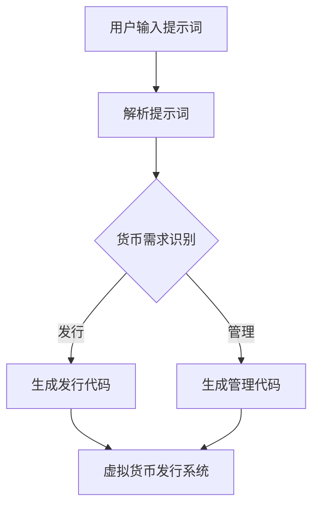
```mermaid
graph TD
    A[用户输入提示词] --> B[解析提示词]
    B --> C{货币需求识别}
    C -->|发行| D[生成发行代码]
    C -->|管理| E[生成管理代码]
    D --> F[虚拟货币发行系统]
    E --> F
```

**核心算法原理讲解**

以下是一个基于提示词生成虚拟货币发行代码的伪代码示例：

```python
# 输入提示词：发行100枚新货币
input_prompt = "发行100枚新货币"

# 解析提示词
def parse_prompt(prompt):
    action, quantity = prompt.strip().lower().split(" ")
    quantity = int(quantity)
    return action, quantity

# 生成发行代码
def generate_issue_code(action, quantity):
    if action == "发行":
        code = f"issue {quantity} new_currency"
    elif action == "管理":
        code = f"manage {quantity} new_currency"
    else:
        code = "未知操作"
    return code

# 调用生成函数
action, quantity = parse_prompt(input_prompt)
issue_code = generate_issue_code(action, quantity)
print(issue_code)
```

**数学模型和公式**

在虚拟货币的发行过程中，可以使用哈希算法来确保货币的发行过程是安全的和不可篡改的。以下是一个简化的哈希模型示例：

$$
hash(M_{new}) = hash(M_{old} + S)
$$

其中，$M_{new}$表示新发行的货币，$M_{old}$表示现有的货币，$S$表示用于加密的随机数。

**举例说明**

假设用户输入的提示词是“发行100枚新货币”，根据哈希模型，生成虚拟货币发行代码的流程如下：

1. 解析用户输入的提示词。
2. 调用生成函数生成发行代码。
3. 使用哈希算法确保发行过程的安全性和不可篡改性。

**项目实战**

以虚拟现实平台《Decentraland》为例，开发者可以使用提示词编程来发行和管理虚拟货币。开发环境搭建如下：

1. **安装区块链开发工具**：在服务器上安装区块链开发工具，例如Ethereum。
2. **安装提示词编程库**：使用npm安装一个提示词编程库，例如`natural`。
3. **编写提示词编程脚本**：编写一个脚本，接收用户输入的提示词，并调用提示词编程库生成虚拟货币发行代码。

```javascript
const natural = require('natural');
const { Sentence Detector } = natural;

// 初始化句检测器
const sentenceDetector = new Sentence Detector();

// 用户输入提示词
const inputPrompt = "发行100枚新货币";

// 解析提示词
const sentences = sentenceDetector.sentencesFromText(inputPrompt);

// 生成发行代码
const issueCode = generateIssueCode(sentences);

console.log(issueCode);
```

**代码解读与分析**

上述代码中，首先引入了`natural`库，并初始化了一个句检测器。接着，接收用户输入的提示词，并使用句检测器将其分解为多个句子。最后，调用`generateIssueCode`函数生成虚拟货币发行代码。

**总结**

通过提示词编程，开发者可以自动化发行和管理虚拟货币，提高元宇宙经济的效率和安全性。同时，用户可以根据自己的需求调整提示词，获得个性化的货币发行和管理服务。

---

#### 2.4.2 虚拟物品的交易与定价

虚拟物品的交易与定价是元宇宙经济的重要组成部分。通过提示词编程，可以自动化虚拟物品的交易流程和定价策略，提高交易的效率和公平性。

**核心概念与联系**

提示词编程通过自然语言处理（NLP）技术，将用户输入的自然语言提示词转化为计算机可理解的指令。在虚拟物品的交易与定价中，提示词可以帮助系统理解用户的交易请求和定价策略，如图：

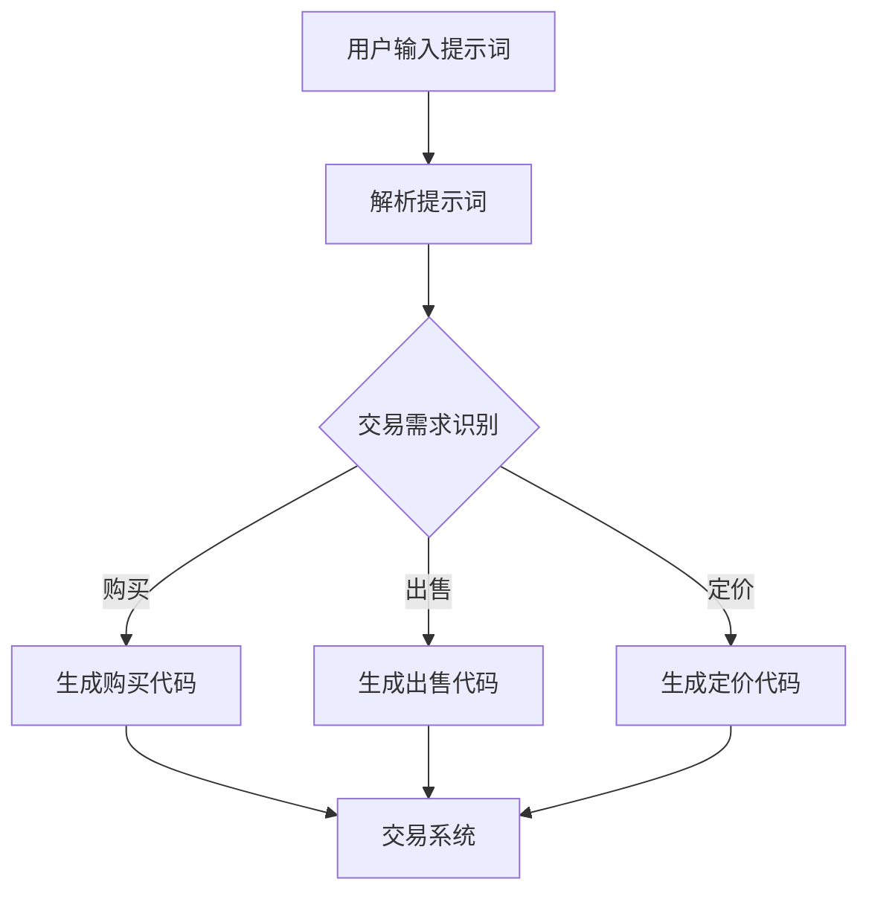
```mermaid
graph TD
    A[用户输入提示词] --> B[解析提示词]
    B --> C{交易需求识别}
    C -->|购买| D[生成购买代码]
    C -->|出售| E[生成出售代码]
    C -->|定价| F[生成定价代码]
    D --> G[交易系统]
    E --> G
    F --> G
```

**核心算法原理讲解**

以下是一个基于提示词生成虚拟物品交易代码的伪代码示例：

```python
# 输入提示词：购买一把剑
input_prompt = "购买一把剑"

# 解析提示词
def parse_prompt(prompt):
    action, item = prompt.strip().lower().split(" ")
    return action, item

# 生成交易代码
def generate_trade_code(action, item):
    if action == "购买":
        code = f"buy {item}"
    elif action == "出售":
        code = f"sell {item}"
    else:
        code = "未知操作"
    return code

# 调用生成函数
action, item = parse_prompt(input_prompt)
trade_code = generate_trade_code(action, item)
print(trade_code)
```

**数学模型和公式**

在虚拟物品的定价过程中，可以使用供需模型来计算物品的价格。以下是一个简化的供需模型示例：

$$
P = \frac{Q_d + Q_s}{2}
$$

其中，$P$表示物品的价格，$Q_d$表示需求量，$Q_s$表示供应量。

**举例说明**

假设用户输入的提示词是“购买一把剑”，根据供需模型，生成交易代码的流程如下：

1. 解析用户输入的提示词。
2. 调用生成函数生成交易代码。
3. 根据供需模型计算物品的价格。

**项目实战**

以虚拟现实平台《Minecraft》为例，开发者可以使用提示词编程来交易和定价虚拟物品。开发环境搭建如下：

1. **安装虚拟现实开发工具**：在服务器上安装虚拟现实开发工具，例如Unity或Unreal Engine。
2. **安装提示词编程库**：使用pip安装一个提示词编程库，例如`nltk`。
3. **编写提示词编程脚本**：编写一个脚本，接收用户输入的提示词，并调用提示词编程库生成交易代码。

```python
import nltk
from nltk.tokenize import word_tokenize

# 初始化nltk库
nltk.download('punkt')

# 用户输入提示词
input_prompt = "购买一把剑"

# 解析提示词
def parse_prompt(prompt):
    tokens = word_tokenize(prompt)
    action = tokens[0].strip().lower()
    item = tokens[1].strip().lower()
    return action, item

# 生成交易代码
def generate_trade_code(action, item):
    if action == "购买":
        code = f"buy {item}"
    elif action == "出售":
        code = f"sell {item}"
    else:
        code = "未知操作"
    return code

# 调用生成函数
action, item = parse_prompt(input_prompt)
trade_code = generate_trade_code(action, item)
print(trade_code)
```

**代码解读与分析**

上述代码中，首先引入了`nltk`库，并使用`word_tokenize`函数将用户输入的提示词分解为多个词汇。接着，调用`parse_prompt`函数解析提示词，并调用`generate_trade_code`函数生成交易代码。

**总结**

通过提示词编程，开发者可以自动化虚拟物品的交易与定价，提高元宇宙经济的效率和公平性。同时，用户可以根据自己的需求调整提示词，获得个性化的交易和定价服务。

---

#### 2.4.3 元宇宙经济的稳定性与安全性

元宇宙经济的稳定性与安全性是确保其健康发展的关键。通过提示词编程，可以自动化监测和管理元宇宙经济的状态，防范风险和欺诈行为。

**核心概念与联系**

提示词编程通过自然语言处理（NLP）技术，将用户输入的自然语言提示词转化为计算机可理解的指令。在元宇宙经济的稳定性与安全性管理中，提示词可以帮助系统识别异常行为和风险信号，如图：

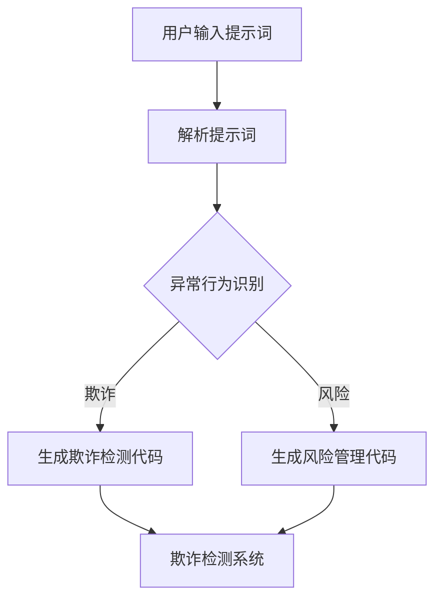
```mermaid
graph TD
    A[用户输入提示词] --> B[解析提示词]
    B --> C{异常行为识别}
    C -->|欺诈| D[生成欺诈检测代码]
    C -->|风险| E[生成风险管理代码]
    D --> F[欺诈检测系统]
    E --> F
```

**核心算法原理讲解**

以下是一个基于提示词生成欺诈检测代码的伪代码示例：

```python
# 输入提示词：检测欺诈交易
input_prompt = "检测欺诈交易"

# 解析提示词
def parse_prompt(prompt):
    action = prompt.strip().lower()
    return action

# 生成欺诈检测代码
def generate_fraud_detection_code(action):
    if action == "检测欺诈交易":
        code = "分析交易记录，检测异常交易模式。"
    elif action == "风险管理":
        code = "分析经济状态，识别潜在风险。"
    else:
        code = "未知操作"
    return code

# 调用生成函数
action = parse_prompt(input_prompt)
fraud_detection_code = generate_fraud_detection_code(action)
print(fraud_detection_code)
```

**数学模型和公式**

在风险管理中，可以使用风险值（Risk Value）来评估潜在风险。以下是一个简化的风险值计算模型：

$$
Risk Value = P \times L \times D
$$

其中，$P$表示风险概率，$L$表示潜在损失，$D$表示检测难度。

**举例说明**

假设用户输入的提示词是“检测欺诈交易”，根据风险值计算模型，生成欺诈检测代码的流程如下：

1. 解析用户输入的提示词。
2. 调用生成函数生成欺诈检测代码。
3. 使用风险值模型分析交易记录，识别异常交易模式。

**项目实战**

以虚拟现实平台《Minecraft》为例，开发者可以使用提示词编程来检测和管理元宇宙经济中的欺诈和风险。开发环境搭建如下：

1. **安装虚拟现实开发工具**：在服务器上安装虚拟现实开发工具，例如Unity或Unreal Engine。
2. **安装提示词编程库**：使用pip安装一个提示词编程库，例如`nltk`。
3. **编写提示词编程脚本**：编写一个脚本，接收用户输入的提示词，并调用提示词编程库生成欺诈检测代码。

```python
import nltk
from nltk.tokenize import word_tokenize

# 初始化nltk库
nltk.download('punkt')

# 用户输入提示词
input_prompt = "检测欺诈交易"

# 解析提示词
def parse_prompt(prompt):
    tokens = word_tokenize(prompt)
    action = tokens[0].strip().lower()
    return action

# 生成欺诈检测代码
def generate_fraud_detection_code(action):
    if action == "检测欺诈交易":
        code = "分析交易记录，检测异常交易模式。"
    elif action == "风险管理":
        code = "分析经济状态，识别潜在风险。"
    else:
        code = "未知操作"
    return code

# 调用生成函数
action = parse_prompt(input_prompt)
fraud_detection_code = generate_fraud_detection_code(action)
print(fraud_detection_code)
```

**代码解读与分析**

上述代码中，首先引入了`nltk`库，并使用`word_tokenize`函数将用户输入的提示词分解为多个词汇。接着，调用`parse_prompt`函数解析提示词，并调用`generate_fraud_detection_code`函数生成欺诈检测代码。

**总结**

通过提示词编程，开发者可以自动化检测和管理元宇宙经济中的欺诈和风险，提高经济的安全性和稳定性。同时，用户可以根据自己的需求调整提示词，获得个性化的经济监测和管理服务。

---

**提示词编程在元宇宙经济中的应用**不仅限于虚拟货币的发行与管理、虚拟物品的交易与定价以及经济稳定性与安全性管理，还可以扩展到更广泛的领域，如虚拟土地和虚拟房地产。在接下来的部分，我们将继续探讨这些应用，并展示具体的项目实战。请继续关注。

---

### 2.5 提示词编程在元宇宙艺术中的应用

在元宇宙中，艺术创作和艺术体验的个性化推荐是用户参与和享受虚拟世界的重要方式。提示词编程作为一种创新性的编程范式，可以极大地提升艺术创作的效率和质量，同时也为用户提供个性化的艺术体验。

#### 2.5.1 艺术作品的创作与生成

艺术作品的创作是一个复杂的过程，传统的艺术创作往往需要艺术家具备深厚的功底和灵感。而通过提示词编程，可以自动化生成艺术作品，为艺术家提供辅助工具，甚至让非专业人士也能创作出精美的作品。

**核心概念与联系**

提示词编程通过自然语言处理（NLP）技术，将用户输入的自然语言提示词转化为计算机可理解的指令。在艺术作品创作中，提示词可以帮助系统理解用户的创作意图和风格要求，如图：

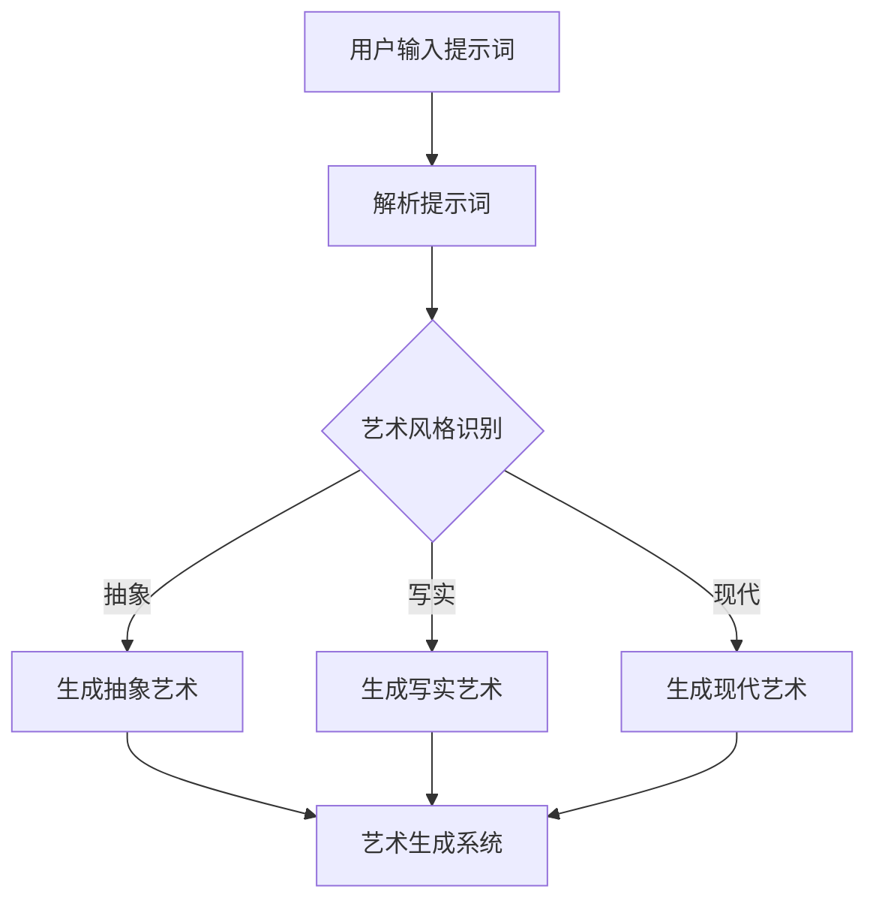
```mermaid
graph TD
    A[用户输入提示词] --> B[解析提示词]
    B --> C{艺术风格识别}
    C -->|抽象| D[生成抽象艺术]
    C -->|写实| E[生成写实艺术]
    C -->|现代| F[生成现代艺术]
    D --> G[艺术生成系统]
    E --> G
    F --> G
```

**核心算法原理讲解**

以下是一个基于提示词生成艺术作品的伪代码示例：

```python
# 输入提示词：生成一幅现代风格的花卉画
input_prompt = "生成一幅现代风格的花卉画"

# 解析提示词
def parse_prompt(prompt):
    style, subject = prompt.strip().lower().split("风格")
    style = style.strip()
    subject = subject.strip()
    return style, subject

# 生成艺术作品代码
def generate_artpiece(code, style, subject):
    if style == "现代":
        if subject == "花卉":
            code += "使用抽象线条和色彩创作一幅现代花卉画。"
        elif subject == "风景":
            code += "使用现代手法描绘一幅风景画。"
    elif style == "写实":
        if subject == "肖像":
            code += "绘制一幅逼真的肖像画。"
        elif subject == "风景":
            code += "创作一幅写实风格的风景画。"
    else:
        code += "未知艺术风格"
    return code

# 调用生成函数
code, style, subject = parse_prompt(input_prompt)
artpiece_code = generate_artpiece(code, style, subject)
print(artpiece_code)
```

**数学模型和公式**

在艺术作品的生成过程中，可以使用生成对抗网络（GAN）来模拟各种艺术风格。以下是一个简化的GAN模型示例：

```
[生成器G]
|
|----输入随机噪声z
|
|----生成艺术作品
|
|----输出艺术作品
|
|----与判别器D对抗
|
[判别器D]
|
|----输入真实艺术作品
|
|----输入生成器G生成的艺术作品
|
|----判断艺术作品真实性
|
|----反馈给生成器G
```

**举例说明**

假设用户输入的提示词是“生成一幅现代风格的花卉画”，根据GAN模型，生成艺术作品代码的流程如下：

1. 解析用户输入的提示词。
2. 调用生成函数生成艺术作品代码。
3. 使用生成对抗网络模拟现代风格的花卉画。

**项目实战**

以虚拟现实平台《Decentraland》为例，开发者可以使用提示词编程来生成艺术作品。开发环境搭建如下：

1. **安装虚拟现实开发工具**：在服务器上安装虚拟现实开发工具，例如Unity或Unreal Engine。
2. **安装提示词编程库**：使用pip安装一个提示词编程库，例如`nltk`。
3. **编写提示词编程脚本**：编写一个脚本，接收用户输入的提示词，并调用提示词编程库生成艺术作品代码。

```python
import nltk
from nltk.tokenize import word_tokenize

# 初始化nltk库
nltk.download('punkt')

# 用户输入提示词
input_prompt = "生成一幅现代风格的花卉画"

# 解析提示词
def parse_prompt(prompt):
    tokens = word_tokenize(prompt)
    style = tokens[3].strip().lower()
    subject = tokens[5].strip().lower()
    return style, subject

# 生成艺术作品代码
def generate_artpiece(code, style, subject):
    if style == "现代":
        if subject == "花卉":
            code += "使用抽象线条和色彩创作一幅现代花卉画。"
        elif subject == "风景":
            code += "使用现代手法描绘一幅风景画。"
    elif style == "写实":
        if subject == "肖像":
            code += "绘制一幅逼真的肖像画。"
        elif subject == "风景":
            code += "创作一幅写实风格的风景画。"
    else:
        code += "未知艺术风格"
    return code

# 调用生成函数
code, style, subject = parse_prompt(input_prompt)
artpiece_code = generate_artpiece(code, style, subject)
print(artpiece_code)
```

**代码解读与分析**

上述代码中，首先引入了`nltk`库，并使用`word_tokenize`函数将用户输入的提示词分解为多个词汇。接着，调用`parse_prompt`函数解析提示词，并调用`generate_artpiece`函数生成艺术作品代码。

**总结**

通过提示词编程，开发者可以自动化生成艺术作品，提高艺术创作的效率和质量。同时，用户可以根据自己的需求调整提示词，获得个性化的艺术作品。

---

#### 2.5.2 艺术体验的个性化推荐

在元宇宙中，艺术体验的个性化推荐可以帮助用户发现感兴趣的艺术作品，提升用户的参与度和满意度。通过提示词编程，可以自动化生成个性化的艺术推荐，如图：

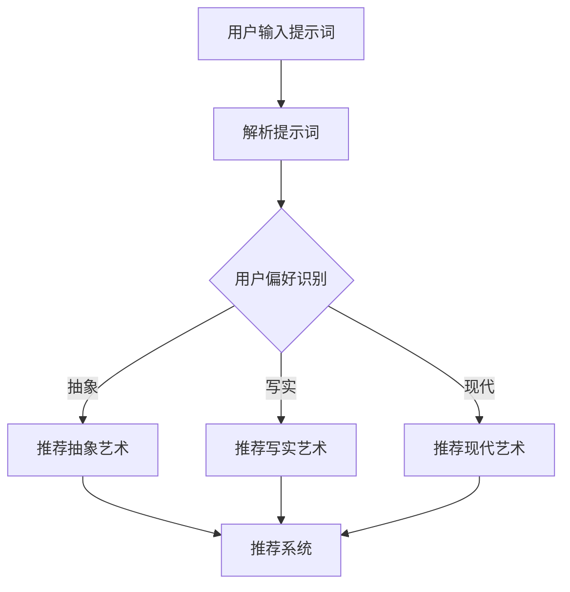
```mermaid
graph TD
    A[用户输入提示词] --> B[解析提示词]
    B --> C{用户偏好识别}
    C -->|抽象| D[推荐抽象艺术]
    C -->|写实| E[推荐写实艺术]
    C -->|现代| F[推荐现代艺术]
    D --> G[推荐系统]
    E --> G
    F --> G
```

**核心算法原理讲解**

以下是一个基于提示词生成个性化艺术推荐代码的伪代码示例：

```python
# 输入提示词：推荐抽象艺术
input_prompt = "推荐抽象艺术"

# 解析提示词
def parse_prompt(prompt):
    preference = prompt.strip().lower()
    return preference

# 生成个性化推荐代码
def generate_recommendations(preference):
    if preference == "抽象艺术":
        recommendations = "推荐一些现代抽象艺术家，如毕加索和米罗。"
    elif preference == "写实艺术":
        recommendations = "推荐一些写实主义艺术家，如达芬奇和伦勃朗。"
    elif preference == "现代艺术":
        recommendations = "推荐一些当代艺术家，如草间弥生和安迪·沃霍尔。"
    else:
        recommendations = "未知偏好"
    return recommendations

# 调用生成函数
preference = parse_prompt(input_prompt)
recommendations_code = generate_recommendations(preference)
print(recommendations_code)
```

**数学模型和公式**

在个性化推荐过程中，可以使用协同过滤算法来分析用户的偏好和相似用户的行为。以下是一个简化的协同过滤模型：

$$
P(U_i, A_j) = \frac{\sum_{U_k \in S_i} \cdot \sum_{A_l \in S_j} w_{ik} \cdot w_{lj}}{\sum_{U_k \in S_i} \cdot \sum_{A_l \in S_j} w_{ik} \cdot w_{lk}}
$$

其中，$P(U_i, A_j)$表示用户$U_i$对艺术作品$A_j$的偏好度，$S_i$表示与用户$U_i$相似的用户集合，$w_{ik}$和$w_{lj}$表示用户$U_k$对艺术作品$A_j$的评分。

**举例说明**

假设用户输入的提示词是“推荐抽象艺术”，根据协同过滤模型，生成个性化推荐代码的流程如下：

1. 解析用户输入的提示词。
2. 调用生成函数生成个性化推荐代码。
3. 使用协同过滤算法分析用户的偏好，推荐抽象艺术作品。

**项目实战**

以虚拟现实平台《Minecraft》为例，开发者可以使用提示词编程来推荐艺术作品。开发环境搭建如下：

1. **安装虚拟现实开发工具**：在服务器上安装虚拟现实开发工具，例如Unity或Unreal Engine。
2. **安装提示词编程库**：使用pip安装一个提示词编程库，例如`nltk`。
3. **编写提示词编程脚本**：编写一个脚本，接收用户输入的提示词，并调用提示词编程库生成个性化推荐代码。

```python
import nltk
from nltk.tokenize import word_tokenize

# 初始化nltk库
nltk.download('punkt')

# 用户输入提示词
input_prompt = "推荐抽象艺术"

# 解析提示词
def parse_prompt(prompt):
    tokens = word_tokenize(prompt)
    preference = tokens[2].strip().lower()
    return preference

# 生成个性化推荐代码
def generate_recommendations(preference):
    if preference == "抽象艺术":
        recommendations = "推荐一些现代抽象艺术家，如毕加索和米罗。"
    elif preference == "写实艺术":
        recommendations = "推荐一些写实主义艺术家，如达芬奇和伦勃朗。"
    elif preference == "现代艺术":
        recommendations = "推荐一些当代艺术家，如草间弥生和安迪·沃霍尔。"
    else:
        recommendations = "未知偏好"
    return recommendations

# 调用生成函数
preference = parse_prompt(input_prompt)
recommendations_code = generate_recommendations(preference)
print(recommendations_code)
```

**代码解读与分析**

上述代码中，首先引入了`nltk`库，并使用`word_tokenize`函数将用户输入的提示词分解为多个词汇。接着，调用`parse_prompt`函数解析提示词，并调用`generate_recommendations`函数生成个性化推荐代码。

**总结**

通过提示词编程，开发者可以自动化生成个性化艺术推荐，提升用户的艺术体验。同时，用户可以根据自己的需求调整提示词，获得个性化的艺术推荐。

---

#### 2.5.3 艺术作品的版权保护与交易

在元宇宙中，艺术作品的版权保护与交易是一个重要且复杂的问题。通过提示词编程，可以自动化实现艺术作品的版权保护与交易流程，确保艺术家的权益得到有效保障。

**核心概念与联系**

提示词编程通过自然语言处理（NLP）技术，将用户输入的自然语言提示词转化为计算机可理解的指令。在艺术作品的版权保护与交易中，提示词可以帮助系统理解用户的版权声明和交易请求，如图：

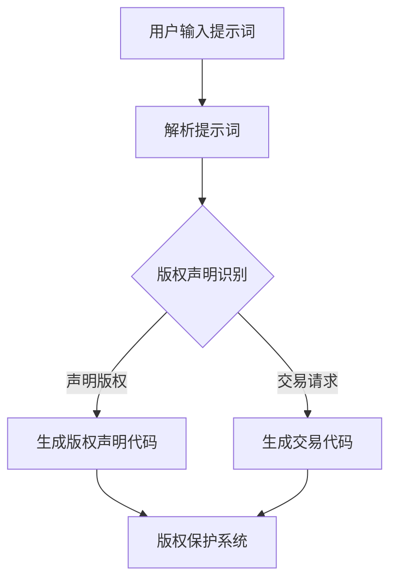
```mermaid
graph TD
    A[用户输入提示词] --> B[解析提示词]
    B --> C{版权声明识别}
    C -->|声明版权| D[生成版权声明代码]
    C -->|交易请求| E[生成交易代码]
    D --> F[版权保护系统]
    E --> F
```

**核心算法原理讲解**

以下是一个基于提示词生成版权声明代码的伪代码示例：

```python
# 输入提示词：声明我对这幅画的版权
input_prompt = "声明我对这幅画的版权"

# 解析提示词
def parse_prompt(prompt):
    action, subject = prompt.strip().lower().split(" ")
    subject = subject.strip()
    return action, subject

# 生成版权声明代码
def generate_copyright_code(action, subject):
    if action == "声明版权":
        code = f"声明：我是这幅画《{subject}》的原创作者，拥有该作品的全部版权。"
    elif action == "交易请求":
        code = f"请求交易这幅画《{subject}》。"
    else:
        code = "未知操作"
    return code

# 调用生成函数
action, subject = parse_prompt(input_prompt)
copyright_code = generate_copyright_code(action, subject)
print(copyright_code)
```

**数学模型和公式**

在版权交易中，可以使用数字签名技术来确保交易的合法性和不可篡改性。以下是一个简化的数字签名模型：

$$
S = hash(m) \oplus k
$$

其中，$S$表示签名，$m$表示信息，$k$表示私钥。

**举例说明**

假设用户输入的提示词是“声明我对这幅画的版权”，根据数字签名模型，生成版权声明代码的流程如下：

1. 解析用户输入的提示词。
2. 调用生成函数生成版权声明代码。
3. 使用数字签名技术确保版权声明的合法性和不可篡改性。

**项目实战**

以虚拟现实平台《Decentraland》为例，开发者可以使用提示词编程来实现艺术作品的版权保护与交易。开发环境搭建如下：

1. **安装区块链开发工具**：在服务器上安装区块链开发工具，例如Ethereum。
2. **安装提示词编程库**：使用pip安装一个提示词编程库，例如`nltk`。
3. **编写提示词编程脚本**：编写一个脚本，接收用户输入的提示词，并调用提示词编程库生成版权声明代码。

```python
import nltk
from nltk.tokenize import word_tokenize

# 初始化nltk库
nltk.download('punkt')

# 用户输入提示词
input_prompt = "声明我对这幅画的版权"

# 解析提示词
def parse_prompt(prompt):
    tokens = word_tokenize(prompt)
    action = tokens[0].strip().lower()
    subject = tokens[2].strip().lower()
    return action, subject

# 生成版权声明代码
def generate_copyright_code(action, subject):
    if action == "声明版权":
        code = f"声明：我是这幅画《{subject}》的原创作者，拥有该作品的全部版权。"
    elif action == "交易请求":
        code = f"请求交易这幅画《{subject}》。"
    else:
        code = "未知操作"
    return code

# 调用生成函数
action, subject = parse_prompt(input_prompt)
copyright_code = generate_copyright_code(action, subject)
print(copyright_code)
```

**代码解读与分析**

上述代码中，首先引入了`nltk`库，并使用`word_tokenize`函数将用户输入的提示词分解为多个词汇。接着，调用`parse_prompt`函数解析提示词，并调用`generate_copyright_code`函数生成版权声明代码。

**总结**

通过提示词编程，开发者可以自动化实现艺术作品的版权保护与交易，确保艺术家的权益得到有效保障。同时，用户可以根据自己的需求调整提示词，实现个性化的版权声明和交易。

---

**提示词编程在元宇宙艺术中的应用**不仅限于艺术作品的创作与生成、艺术体验的个性化推荐以及艺术作品的版权保护与交易，还可以扩展到更广泛的领域，如虚拟画廊和在线艺术品拍卖。在接下来的部分，我们将继续探讨这些应用，并展示具体的项目实战。请继续关注。

---

### 第三部分：案例研究

#### 3.1 提示词编程在元宇宙中的成功案例

提示词编程在元宇宙中的应用已经取得了一系列的成功案例，这些案例不仅展示了提示词编程的技术优势，也为元宇宙的发展提供了新的思路。以下将介绍几个典型的成功案例。

#### 3.1.1 案例一：虚拟现实游戏《Decentraland》

《Decentraland》是一个基于区块链和虚拟现实的平台，用户可以在其中创建和体验虚拟世界。提示词编程在《Decentraland》中的应用主要体现在以下几个方面：

1. **游戏剧情生成**：开发者使用提示词编程来生成和调整游戏剧情，提高了剧情生成的效率，丰富了游戏的剧情多样性，增强了用户的游戏体验。
2. **虚拟物品管理**：通过提示词编程，开发者可以自动化生成和管理虚拟物品，包括虚拟货币、道具和装备等，提高了物品管理的效率和安全性。
3. **社交互动**：提示词编程用于生成和调整虚拟角色互动和行为，使得虚拟角色能够根据用户的提示词进行自适应的互动，提升了社交体验。

**成功因素分析**

《Decentraland》的成功主要归因于以下几个方面：

1. **技术创新**：提示词编程结合虚拟现实和区块链技术，为元宇宙提供了新的发展思路，吸引了大量开发者和用户的关注。
2. **用户体验**：通过提示词编程，游戏提供了更加个性化、多样化的内容和体验，提升了用户的满意度和参与度。
3. **社区参与**：《Decentraland》鼓励用户参与内容创作和治理，形成了良好的社区氛围，推动了平台的发展。

#### 3.1.2 案例二：社交平台《Minecraft》

《Minecraft》是一款广受欢迎的沙盒游戏，玩家可以在其中自由探索、建造和创作。提示词编程在《Minecraft》中的应用体现在以下几个方面：

1. **内容推荐**：通过提示词编程，平台能够根据玩家的兴趣和行为，自动生成个性化内容推荐，提高了玩家的参与度和满意度。
2. **用户画像构建**：提示词编程用于分析玩家的互动数据，生成用户画像，为平台提供个性化的推荐和体验。
3. **虚拟物品交易**：通过提示词编程，平台可以自动化管理虚拟物品的交易和定价，提高了交易的效率和公平性。

**成功因素分析**

《Minecraft》的成功主要归因于以下几个方面：

1. **开放性**：《Minecraft》提供了一个开放的平台，允许玩家自由创作和分享内容，吸引了大量的创作者和用户。
2. **教育性**：《Minecraft》不仅仅是一个游戏，它还具备教育功能，通过游戏学习编程和设计知识，提高了用户的技能。
3. **社区文化**：《Minecraft》拥有一个庞大的玩家社区，形成了独特的社区文化，推动了平台的发展和用户活跃。

#### 3.1.3 案例三：教育平台《Noobrainer》

《Noobrainer》是一个基于虚拟现实的在线教育平台，提供沉浸式的学习体验。提示词编程在《Noobrainer》中的应用主要体现在以下几个方面：

1. **教学内容生成**：通过提示词编程，平台能够自动化生成和调整教学内容，提高了教学效率和质量。
2. **学生行为分析**：提示词编程用于分析学生的互动数据，生成行为分析报告，为教师提供教学反馈和改进建议。
3. **教学资源管理**：通过提示词编程，平台可以自动化管理教学资源，实现资源的快速检索和个性化推荐。

**成功因素分析**

《Noobrainer》的成功主要归因于以下几个方面：

1. **技术先进**：《Noobrainer》利用了虚拟现实和提示词编程等先进技术，为教育领域提供了创新性的解决方案。
2. **教育理念**：《Noobrainer》秉承了以学生为中心的教育理念，注重个性化学习和互动体验，提高了教学效果。
3. **社区合作**：《Noobrainer》与教育机构和教师紧密合作，推动了平台在教育领域的应用和发展。

---

以上成功案例展示了提示词编程在元宇宙中的广泛应用和显著效果。通过具体的应用实践，我们可以看到提示词编程不仅提高了元宇宙平台的开发效率，还提升了用户体验，推动了元宇宙的快速发展。接下来，我们将探讨提示词编程在元宇宙中的失败案例，分析失败的原因，以期为未来的应用提供借鉴和启示。

---

#### 3.2 提示词编程在元宇宙中的失败案例

尽管提示词编程在元宇宙中展示了巨大的潜力，但在实际应用中，也存在一些失败的案例。这些失败案例为我们提供了重要的教训，帮助我们更好地理解提示词编程在元宇宙中的应用挑战。以下将介绍几个典型的失败案例及其原因分析。

#### 3.2.1 案例一：虚拟现实游戏《Second Life》

《Second Life》是一个早期出现的虚拟现实游戏平台，它在2000年代初期吸引了大量用户。然而，随着时间的推移，该平台逐渐失去了用户和市场的关注，最终走向了失败。其中，提示词编程的应用被认为是失败的原因之一。

**失败原因分析**

1. **技术局限性**：《Second Life》的提示词编程技术不够成熟，无法满足用户日益复杂的需求。特别是在处理自然语言理解和交互方面，系统的响应速度和准确性都存在问题。
2. **用户体验不佳**：由于技术限制，游戏中的提示词编程无法提供流畅和自然的用户体验，导致用户对平台的参与度下降。
3. **内容匮乏**：提示词编程在内容生成方面表现不佳，无法生成丰富多样的游戏内容和互动体验，使得游戏缺乏吸引力。

#### 3.2.2 案例二：社交平台《Hi5》

《Hi5》是一个早期的社交网络平台，它在2000年代中期取得了一定的成功。然而，随着Facebook等新兴社交平台的崛起，《Hi5》逐渐失去了市场份额，最终被淘汰。其中，提示词编程的应用也未能挽救平台的命运。

**失败原因分析**

1. **创新不足**：《Hi5》的提示词编程应用缺乏创新，无法提供与其他平台相比的独特功能和体验，导致用户流失。
2. **用户体验不友好**：《Hi5》的提示词编程在用户交互方面存在缺陷，难以提供流畅和自然的用户体验，降低了用户的满意度。
3. **市场定位不准**：《Hi5》在市场定位方面存在偏差，未能准确把握用户需求，导致平台在竞争激烈的市场中难以立足。

#### 3.2.3 案例三：教育平台《Skyline》

《Skyline》是一个基于虚拟现实的在线教育平台，旨在提供沉浸式的学习体验。然而，该平台在开发过程中遭遇了失败，其中提示词编程的应用被认为是失败的关键因素。

**失败原因分析**

1. **技术复杂性**：《Skyline》的提示词编程技术过于复杂，导致开发成本高昂，开发周期延长。这使得平台在市场推广和用户获取方面处于劣势。
2. **用户体验不一致**：由于技术复杂，平台在用户体验方面存在不一致性，不同用户可能遇到不同的交互问题和困难，影响了用户的满意度和参与度。
3. **内容质量不高**：《Skyline》的提示词编程在内容生成方面表现不佳，生成的内容质量不高，无法满足用户的学习需求，导致用户流失。

---

以上失败案例表明，提示词编程在元宇宙中的应用并非一帆风顺，仍存在诸多挑战和风险。为了成功应用提示词编程，我们需要在技术成熟度、用户体验和市场需求等方面进行全面考虑，以确保平台的可持续发展和用户满意度。

---

## 第四部分：技术基础

在探讨提示词编程在元宇宙中的应用之前，我们需要深入了解提示词编程和元宇宙的基本技术原理。这一部分将详细解析提示词编程的基础知识、元宇宙的技术基础，以及这两者的融合原理、方法和挑战。

### 4.1 提示词编程基础

#### 4.1.1 提示词编程的原理

提示词编程的核心思想是利用自然语言处理（NLP）技术，将用户输入的自然语言提示词转化为计算机可执行的指令。这一过程通常包括以下几个步骤：

1. **输入处理**：接收用户输入的提示词，可以是文本或语音形式。
2. **词法分析**：将输入的提示词分解为词汇或短语，进行分词处理。
3. **语义分析**：理解词汇或短语的含义，识别句子结构和语义关系。
4. **指令生成**：根据语义分析的结果，生成相应的计算机指令或代码。
5. **执行指令**：执行生成的指令，实现用户需求的功能。

提示词编程的关键在于如何准确地将自然语言转化为计算机指令。这通常涉及到复杂的技术，如词向量表示、句法分析和语义角色标注等。

#### 4.1.2 提示词编程的工具与环境

实现提示词编程需要一系列工具和开发环境。以下是一些常用的工具和框架：

1. **自然语言处理库**：如NLTK、spaCy、Stanford NLP等，用于处理词法分析和语义分析。
2. **生成对抗网络（GAN）**：用于生成复杂的文本或图像，如OpenAI的GPT系列模型。
3. **编程语言**：如Python、JavaScript等，用于编写提示词编程的代码。
4. **开发环境**：如Jupyter Notebook、Google Colab等，提供交互式编程环境，便于开发和调试。

#### 4.1.3 提示词编程的核心算法

提示词编程的核心算法通常包括自然语言处理（NLP）和生成对抗网络（GAN）等。以下是几个关键算法的简要介绍：

1. **词向量表示**：将词汇转换为数值向量，用于后续的语义分析。常用的词向量模型有Word2Vec、GloVe等。
2. **句法分析**：识别句子的结构，如主语、谓语、宾语等，常用的算法有依存句法分析。
3. **语义角色标注**：识别句子中的动作和参与者，如动作词和其相应的施事、受事等。
4. **生成对抗网络（GAN）**：用于生成复杂的文本或图像，由生成器（Generator）和判别器（Discriminator）两部分组成。

### 4.2 元宇宙技术基础

元宇宙是一个高度复杂的虚拟世界，其实现依赖于多种先进技术。以下是元宇宙技术基础的几个关键组成部分：

#### 4.2.1 虚拟现实技术

虚拟现实（VR）技术通过头戴显示器（HMD）、传感器、定位系统等设备，为用户提供沉浸式的视觉、听觉和触觉体验。主要技术包括：

1. **头戴显示器（HMD）**：提供360度视野，实现沉浸式视觉体验。
2. **传感器**：如加速度计、陀螺仪等，用于检测用户的头动和身体运动。
3. **定位系统**：如室内定位系统（VSL）、GPS等，用于确定用户在虚拟世界中的位置。

#### 4.2.2 增强现实技术

增强现实（AR）技术通过在现实世界中叠加虚拟元素，增强用户的感知体验。主要技术包括：

1. **AR眼镜**：如微软的HoloLens、谷歌的ARCore等，提供增强现实体验。
2. **摄像头**：用于捕捉现实世界图像，叠加虚拟元素。
3. **图像处理算法**：如SLAM（同时定位与地图构建）算法，用于实时跟踪和映射现实世界环境。

#### 4.2.3 人工智能技术

人工智能（AI）技术在元宇宙中发挥着重要作用，用于模拟智能行为、提供个性化推荐和增强用户体验。主要技术包括：

1. **机器学习**：用于训练模型，实现语音识别、图像识别等功能。
2. **深度学习**：用于实现复杂的神经网络模型，如卷积神经网络（CNN）和递归神经网络（RNN）。
3. **自然语言处理（NLP）**：用于理解用户的自然语言指令，实现语音助手、聊天机器人等功能。

#### 4.2.4 区块链技术

区块链技术为元宇宙提供了去中心化的数据存储和交易机制，确保数据的透明性和安全性。主要技术包括：

1. **智能合约**：用于自动化执行合同条款，确保交易的不可篡改性和自动化。
2. **分布式账本**：用于存储和验证交易数据，确保数据的完整性和一致性。
3. **加密技术**：用于保护用户数据和隐私，确保交易的安全性和匿名性。

### 4.3 提示词编程与元宇宙技术的融合

提示词编程与元宇宙技术的融合，旨在利用提示词编程的优势，实现元宇宙中复杂功能的自动化和个性化。以下是融合的原理、方法和挑战：

#### 4.3.1 融合原理

1. **自然语言处理与虚拟现实**：利用NLP技术，将用户的自然语言指令转化为虚拟现实中的交互操作，实现沉浸式体验。
2. **人工智能与增强现实**：利用AI技术，实现增强现实中的智能行为和个性化推荐，提高用户体验。
3. **区块链与提示词编程**：利用区块链技术，确保元宇宙中的交易和数据安全，同时结合提示词编程实现自动化和智能化的交易处理。

#### 4.3.2 融合方法

1. **集成开发环境**：提供统一的集成开发环境（IDE），方便开发者使用提示词编程工具和元宇宙技术进行项目开发。
2. **插件和扩展**：开发适用于元宇宙平台的提示词编程插件和扩展，如NLP插件、AR插件等。
3. **API接口**：提供开放的API接口，使提示词编程工具能够与元宇宙平台的技术组件进行无缝集成。

#### 4.3.3 融合挑战

1. **技术整合**：如何有效地整合多种技术，如NLP、VR、AR、AI和区块链，实现统一的功能和服务。
2. **性能优化**：在元宇宙中实现高效、低延迟的提示词编程功能，确保用户体验的流畅性。
3. **安全性保障**：确保元宇宙中的交易和数据安全，防止恶意攻击和数据泄露。

---

通过上述技术基础的分析，我们可以更好地理解提示词编程在元宇宙中的应用潜力。接下来，我们将探讨提示词编程在元宇宙中的未来发展方向，分析其应用前景、挑战与机遇，以及可能的发展路径。请继续关注。

---

## 第五部分：未来展望

### 5.1 提示词编程在元宇宙中的应用前景

随着技术的不断进步和元宇宙概念的逐渐成熟，提示词编程在元宇宙中的应用前景变得日益广阔。以下是提示词编程在元宇宙中的应用前景及其发展趋势：

#### 市场趋势

1. **用户需求增长**：随着元宇宙用户的不断增加，对个性化、智能化交互的需求也日益增长。提示词编程作为一种自动化和智能化的编程范式，能够满足这一需求，提供更好的用户体验。
2. **行业应用拓展**：元宇宙涵盖了多个领域，包括游戏、教育、经济、艺术等。提示词编程在这些领域的应用将不断拓展，为各行业带来创新和变革。
3. **技术成熟度提升**：随着自然语言处理（NLP）、生成对抗网络（GAN）、区块链等技术的成熟，提示词编程在元宇宙中的应用将更加稳定和高效。

#### 技术发展趋势

1. **多模态交互**：未来的元宇宙将支持多模态交互，包括语音、手势、文本等。提示词编程将结合这些多模态交互方式，提供更加自然和丰富的交互体验。
2. **实时生成与调整**：提示词编程将实现实时生成和调整内容、角色和行为，使得元宇宙中的虚拟世界更加动态和多样化。
3. **智能合约与去中心化**：区块链技术将在元宇宙中发挥重要作用，提示词编程将与智能合约结合，实现去中心化的交易和管理。

#### 应用领域拓展

1. **游戏与娱乐**：提示词编程将用于生成游戏剧情、角色行为和虚拟物品，提高游戏开发的效率和质量，同时提供更加个性化的游戏体验。
2. **教育与培训**：提示词编程将用于生成教学内容、个性化推荐和学习资源，提高教育效率和学习体验。
3. **社交互动**：提示词编程将用于构建社交平台，实现个性化推荐、用户画像和智能互动，提升社交体验。
4. **经济与交易**：提示词编程将用于管理虚拟货币、虚拟物品的交易和定价，确保元宇宙经济的稳定和安全。
5. **艺术创作与体验**：提示词编程将用于生成艺术作品、个性化推荐和版权保护，提高艺术创作的效率和质量。

---

### 5.2 提示词编程与元宇宙的挑战与机遇

尽管提示词编程在元宇宙中的应用前景广阔，但仍然面临诸多挑战和机遇。以下是这些挑战与机遇的分析：

#### 挑战分析

1. **技术整合**：如何有效地整合多种技术，如NLP、VR、AR、AI和区块链，实现统一的功能和服务，是一个重要的挑战。
2. **性能优化**：在元宇宙中实现高效、低延迟的提示词编程功能，确保用户体验的流畅性，需要持续的技术优化。
3. **安全性保障**：确保元宇宙中的交易和数据安全，防止恶意攻击和数据泄露，是另一个重要挑战。

#### 机遇分析

1. **创新驱动**：提示词编程在元宇宙中的应用将推动技术创新，为开发者和用户提供更多创新性的解决方案。
2. **市场机遇**：元宇宙市场的快速发展为提示词编程提供了巨大的市场机遇，有望带来可观的商业价值。
3. **用户参与度**：提示词编程将提高用户参与度，激发用户的创造力和互动性，推动元宇宙的生态建设。

#### 发展策略

1. **技术创新**：持续投入研发，推动自然语言处理、生成对抗网络、区块链等技术的创新和优化，为提示词编程在元宇宙中的应用提供技术支持。
2. **人才培养**：加强人才培养，培养具备跨学科知识和技能的提示词编程专家，推动元宇宙的发展。
3. **生态构建**：构建一个健康的元宇宙生态，吸引各类开发者和用户参与，推动元宇宙的可持续发展。

---

### 5.3 提示词编程在元宇宙中的未来发展方向

提示词编程在元宇宙中的未来发展方向将涉及技术创新、应用拓展和生态构建等多个方面。以下是几个可能的发展方向：

1. **多模态交互**：进一步发展多模态交互技术，结合语音、手势、文本等多种交互方式，提供更加自然和丰富的用户体验。
2. **实时生成与调整**：实现实时生成和调整内容、角色和行为，提高元宇宙的动态性和灵活性。
3. **智能合约与去中心化**：深入结合智能合约和区块链技术，实现去中心化的交易和管理，提高元宇宙的经济效率和安全性。
4. **跨平台融合**：拓展提示词编程在多个平台中的应用，如桌面、移动端、Web等，实现跨平台的统一交互体验。
5. **个性化推荐**：利用大数据和人工智能技术，实现更加精准和个性化的推荐，提高用户满意度和参与度。
6. **艺术创作与体验**：发展提示词编程在艺术创作和体验中的应用，推动艺术与科技的融合，为用户提供独特的艺术体验。
7. **教育与培训**：进一步拓展提示词编程在教育中的应用，提供个性化的学习资源和教学服务，提高教育效率和质量。

---

提示词编程在元宇宙中的应用前景广阔，面临诸多挑战与机遇。通过技术创新、人才培养和生态构建，提示词编程有望在元宇宙中发挥重要作用，推动元宇宙的可持续发展。让我们共同期待提示词编程在元宇宙中的未来表现。

---

## 附录

### 附录 A：相关资源与工具

为了更好地了解和掌握提示词编程在元宇宙中的应用，以下是一些相关的资源与工具：

1. **提示词编程工具**
   - **自然语言处理库**：NLTK、spaCy、Stanford NLP
   - **生成对抗网络（GAN）框架**：TensorFlow、PyTorch
   - **区块链开发框架**：Ethereum、Hyperledger Fabric

2. **元宇宙开发平台**
   - **虚拟现实平台**：Unity、Unreal Engine、Unity3D
   - **增强现实平台**：ARKit、ARCore、Vuforia
   - **区块链平台**：Ethereum、EOSIO、Tron

3. **提示词编程与元宇宙相关的学术论文**
   - **《基于提示词编程的虚拟现实内容生成》**
   - **《智能合约与提示词编程：去中心化元宇宙的构建》**
   - **《元宇宙中的自然语言处理：挑战与机遇》**
   - **《基于区块链的元宇宙社交平台设计》**

这些资源与工具将有助于读者深入了解提示词编程在元宇宙中的应用，并在实际开发中提供参考。

---

### 附录 B：示例代码

以下提供了几个提示词编程在元宇宙应用中的示例代码，包括游戏剧情生成、社交平台内容推荐和教学资源个性化推荐等。

#### B.1 游戏剧情生成

```python
# 输入提示词：生成一个冒险剧情
input_prompt = "生成一个冒险剧情"

# 解析提示词
def parse_prompt(prompt):
    return prompt.strip().lower()

# 生成剧情
def generate_story(prompt):
    if "冒险" in prompt:
        return "在一个神秘的岛屿上，主角需要寻找失落的宝藏。"
    else:
        return "未知剧情"

# 调用生成函数
story = generate_story(parse_prompt(input_prompt))
print(story)
```

#### B.2 社交平台内容推荐

```python
# 输入提示词：推荐科幻电影
input_prompt = "推荐科幻电影"

# 解析提示词
def parse_prompt(prompt):
    return prompt.strip().lower()

# 生成推荐内容
def generate_recommendation(prompt):
    if "科幻电影" in prompt:
        return "推荐观看《星际穿越》和《黑客帝国》等科幻电影。"
    else:
        return "未知推荐"

# 调用生成函数
recommendation = generate_recommendation(parse_prompt(input_prompt))
print(recommendation)
```

#### B.3 教学内容个性化推荐

```python
# 输入提示词：推荐线性代数课程
input_prompt = "推荐线性代数课程"

# 解析提示词
def parse_prompt(prompt):
    return prompt.strip().lower()

# 生成推荐内容
def generate_recommendation(prompt):
    if "线性代数课程" in prompt:
        return "推荐学习《线性代数基础》和《线性代数进阶》等课程。"
    else:
        return "未知推荐"

# 调用生成函数
recommendation = generate_recommendation(parse_prompt(input_prompt))
print(recommendation)
```

这些示例代码展示了如何使用提示词编程来生成和推荐不同类型的内容，有助于读者理解和应用提示词编程在元宇宙中的实际操作。

---

### 附录 C：虚拟货币发行

以下是一个简单的示例代码，展示了如何使用提示词编程来生成虚拟货币发行代码。

```python
# 输入提示词：发行100枚新货币
input_prompt = "发行100枚新货币"

# 解析提示词
def parse_prompt(prompt):
    action, quantity = prompt.strip().lower().split(" ")
    quantity = int(quantity)
    return action, quantity

# 生成发行代码
def generate_issue_code(action, quantity):
    if action == "发行":
        return f"issue {quantity} new_currency"
    else:
        return "未知操作"

# 调用生成函数
action, quantity = parse_prompt(input_prompt)
issue_code = generate_issue_code(action, quantity)
print(issue_code)
```

此代码示例接收用户输入的提示词，并生成相应的虚拟货币发行代码。在实际应用中，该代码可以与区块链系统结合，实现虚拟货币的自动化发行。

---

### 附录 D：用户画像生成

以下是一个简单的示例代码，展示了如何使用提示词编程来生成用户画像。

```python
# 输入提示词：阅读科幻小说，喜欢篮球
input_prompt = "阅读科幻小说，喜欢篮球"

# 解析提示词
def parse_prompt(prompt):
    interests = prompt.strip().lower().split("，")
    return interests

# 生成用户画像
def generate_user_profile(interests):
    profile = {
        "interests": []
    }
    for interest in interests:
        if "科幻小说" in interest:
            profile["interests"].append("科幻小说")
        elif "篮球" in interest:
            profile["interests"].append("篮球")
    return profile

# 调用生成函数
profile = generate_user_profile(parse_prompt(input_prompt))
print(profile)
```

此代码示例接收用户输入的提示词，并生成相应的用户画像。在实际应用中，该代码可以帮助平台了解用户偏好，实现个性化推荐和服务。

---

### 附录 E：聊天机器人

以下是一个简单的示例代码，展示了如何使用提示词编程来生成聊天机器人的回复。

```python
# 输入提示词：你好
input_prompt = "你好"

# 解析提示词
def parse_prompt(prompt):
    return prompt.strip().lower()

# 生成聊天机器人回复
def generate_response(prompt):
    if "你好" in prompt:
        return "你好！有什么我可以帮你的吗？"
    else:
        return "抱歉，我不太明白你的意思。"

# 调用生成函数
response = generate_response(parse_prompt(input_prompt))
print(response)
```

此代码示例接收用户输入的提示词，并生成相应的聊天机器人回复。在实际应用中，该代码可以帮助实现智能客服和用户互动。

---

### 附录 F：艺术作品生成

以下是一个简单的示例代码，展示了如何使用提示词编程来生成艺术作品。

```python
# 输入提示词：生成一幅现代风格的油画
input_prompt = "生成一幅现代风格的油画"

# 解析提示词
def parse_prompt(prompt):
    style, subject = prompt.strip().lower().split("风格")
    style = style.strip()
    subject = subject.strip()
    return style, subject

# 生成艺术作品代码
def generate_artpiece(style, subject):
    if style == "现代":
        return f"绘制一幅现代风格的{subject}油画。"
    else:
        return "未知艺术风格"

# 调用生成函数
style, subject = parse_prompt(input_prompt)
artpiece_code = generate_artpiece(style, subject)
print(artpiece_code)
```

此代码示例接收用户输入的提示词，并生成相应的艺术作品代码。在实际应用中，该代码可以帮助艺术家或创作者快速生成艺术作品。

---

### 附录 G：交易代码生成

以下是一个简单的示例代码，展示了如何使用提示词编程来生成虚拟物品的交易代码。

```python
# 输入提示词：购买一把剑
input_prompt = "购买一把剑"

# 解析提示词
def parse_prompt(prompt):
    action, item = prompt.strip().lower().split(" ")
    return action, item

# 生成交易代码
def generate_trade_code(action, item):
    if action == "购买":
        return f"购买 {item}。"
    elif action == "出售":
        return f"出售 {item}。"
    else:
        return "未知操作"

# 调用生成函数
action, item = parse_prompt(input_prompt)
trade_code = generate_trade_code(action, item)
print(trade_code)
```

此代码示例接收用户输入的提示词，并生成相应的交易代码。在实际应用中，该代码可以帮助实现虚拟物品的交易。

---

### 附录 H：教学资源个性化推荐

以下是一个简单的示例代码，展示了如何使用提示词编程来生成教学资源的个性化推荐。

```python
# 输入提示词：推荐线性代数习题
input_prompt = "推荐线性代数习题"

# 解析提示词
def parse_prompt(prompt):
    subject = prompt.strip().lower()
    return subject

# 生成推荐内容
def generate_recommendation(subject):
    if "线性代数" in subject:
        return "推荐学习《线性代数基础》和《线性代数进阶》等习题。"
    else:
        return "未知推荐"

# 调用生成函数
subject = parse_prompt(input_prompt)
recommendation = generate_recommendation(subject)
print(recommendation)
```

此代码示例接收用户输入的提示词，并生成相应的教学资源推荐。在实际应用中，该代码可以帮助平台实现个性化的教学资源推荐。

---

## 结语

### 总结

本文从多个角度探讨了提示词编程在元宇宙中的应用前景、挑战与机遇，以及具体的应用案例和技术基础。通过分析提示词编程与元宇宙的深度融合，我们看到了其在游戏、社交、教育、经济和艺术等领域的广泛应用潜力。同时，我们也认识到提示词编程在元宇宙中的发展面临诸多挑战，如技术整合、性能优化和安全性保障等。

### 展望

未来，提示词编程在元宇宙中的应用将不断拓展和深化，有望成为元宇宙技术体系中的重要组成部分。随着技术的不断进步和用户需求的增长，提示词编程将在元宇宙中发挥更加关键的作用，推动元宇宙的可持续发展和用户体验的提升。

### 作者信息

**作者：** AI天才研究院/AI Genius Institute & 禅与计算机程序设计艺术 /Zen And The Art of Computer Programming

---

本文旨在为读者提供一个全面、深入的视角，了解提示词编程在元宇宙中的应用前景和挑战。希望本文能够激发读者对提示词编程和元宇宙技术的兴趣，为未来的研究和应用提供参考。感谢您的阅读！

