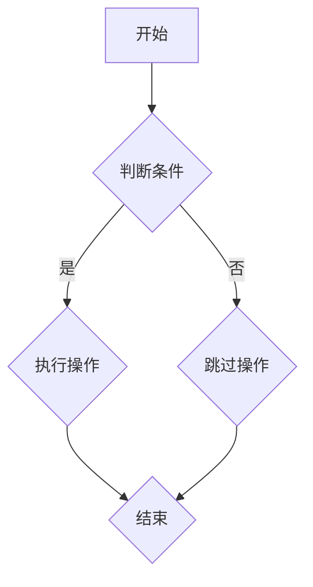

                 

# 提示词编程语言的形式化规范

> **关键词**：提示词编程语言、形式化规范、形式化验证、模型检查、安全性分析、可靠性评估

> **摘要**：本文旨在探讨提示词编程语言的形式化规范，从基础概念、架构设计、形式化工具、应用场景、案例分析以及未来展望等方面进行全面阐述。通过深入分析，本文为提示词编程语言的设计和应用提供了理论指导和实践参考。

### 目录大纲

1. **第一部分：基础概念与背景**
   - **第1章：形式化规范概述**
     - 1.1 提示词编程语言的定义
     - 1.2 形式化规范的重要性
     - 1.3 形式化规范的方法
   - **第2章：提示词编程语言的架构**
     - 2.1 核心组件
     - 2.2 语言规范
   - **第3章：形式化规范工具**
     - 3.1 形式化验证工具
     - 3.2 模型检查工具
   - **第4章：形式化规范应用场景**
     - 4.1 安全性分析
     - 4.2 可靠性评估

2. **第二部分：形式化规范的实践应用**
   - **第5章：案例分析**
     - 5.1 提示词编程语言的实际应用
     - 5.2 形式化规范的实践挑战
   - **第6章：未来展望**
     - 6.1 技术发展趋势
     - 6.2 社会与伦理影响

3. **第三部分：附录**
   - **第7章：附录**
     - 7.1 常用工具和资源
     - 7.2 符号表与术语解释
     - 7.3 附录A：Mermaid流程图
     - 7.4 附录B：伪代码示例
     - 7.5 附录C：数学模型与公式
     - 7.6 附录D：项目实战
     - 7.7 附录E：参考文献

## 第一部分：基础概念与背景

### 第1章：形式化规范概述

#### 1.1 提示词编程语言的定义

提示词编程语言（Prompt-based Programming Language）是一种特殊的编程语言，其核心思想是通过提供一系列提示词（prompts）来引导程序的执行。这些提示词可以被视为一种参数化的指令，它们不仅能够定义程序的输入，还能够控制程序的流程。

提示词编程语言的基本概念包括：

- **提示词（Prompt）**：提示词是程序的输入，可以是简单的关键字或复杂的参数列表。
- **解释器（Interpreter）**：解释器负责解析提示词，将其转换为具体的操作指令。
- **语法与语义**：提示词编程语言的语法和语义规则定义了如何组合提示词以及如何执行相应的操作。

形式化规范的重要性在于：

- **准确性与可靠性**：形式化规范能够确保程序按照预定的规则执行，减少了由于误解或错误而产生的故障。
- **可验证性**：通过形式化验证，我们可以证明程序的正确性，确保其在各种情况下都能正常运行。
- **可维护性**：形式化规范有助于程序的维护和升级，因为规范的描述使得代码的可读性和可理解性更强。

#### 1.2 形式化规范的方法

形式化规范通常采用以下几种方法：

- **形式化规格说明语言（Formal Specification Language）**：这类语言提供了一套严格的语法和语义规则，用于描述系统的行为。例如，ML、TLA+、Alloy等。

- **形式化验证（Formal Verification）**：形式化验证是一种通过数学方法来证明系统是否满足特定属性的技术。它通常涉及模型检查、逻辑推理和证明论。

- **模型检查（Model Checking）**：模型检查是一种自动化验证技术，通过将系统的规格说明转换为模型，并在模型中检查所有可能的执行路径，以确定系统是否满足指定的属性。

#### 1.3 形式化规范的方法

形式化规范的方法主要包括：

- **形式化验证工具（Formal Verification Tools）**：这些工具包括FDR、PVS、Coq等，它们能够自动或半自动地验证系统的正确性。

- **模型检查工具（Model Checking Tools）**：这些工具包括SPIN、Model Checker等，它们通过检查系统模型的执行路径来验证系统的属性。

## 第2章：提示词编程语言的架构

### 2.1 核心组件

提示词编程语言的核心组件包括解释器、编译器和核心算法与数据结构。每个组件在语言实现中扮演着关键角色。

- **解释器（Interpreter）**：解释器是提示词编程语言的核心组件之一。它的主要功能是读取和解析提示词，将其转换为机器可执行的指令。解释器通常采用递归下降分析法或语法分析树构建法来实现。

- **编译器（Compiler）**：编译器将提示词编程语言的源代码转换为机器代码。编译器通常包括词法分析、语法分析、语义分析和代码生成等模块。

- **核心算法与数据结构**：提示词编程语言的核心算法和数据结构包括数据结构（如列表、树、图）、排序算法、搜索算法、排序算法等。这些算法和数据结构是实现语言基本功能的基础。

### 2.2 语言规范

提示词编程语言的语言规范包括语法和语义规则。语法规则定义了提示词的格式和结构，而语义规则则描述了提示词在程序中的执行方式。

- **语法规则**：语法规则包括提示词的构成、提示词之间的组合方式以及提示词的优先级。例如，一个简单的提示词可以是“if”，后跟条件表达式和相应的操作。

- **语义规则**：语义规则定义了提示词在程序中的执行方式。例如，一个“if”提示词会导致程序根据条件表达式的结果选择不同的执行路径。

- **类型系统和类型检查**：提示词编程语言通常包括类型系统和类型检查机制。类型系统确保变量和表达式的类型在编译时是正确的，而类型检查机制则是在运行时验证类型的一致性。

### 2.3 形式化规范与语言规范的关系

形式化规范和语言规范之间存在紧密的关系。形式化规范为语言规范提供了一种形式化的描述方式，使得语言规范更加严格和可验证。

- **形式化规范**：通过形式化规范，我们可以将语言规范的形式化描述，使得规格说明更加精确和完整。这有助于避免因语言规范不明确而产生的误解和错误。

- **语言规范**：形式化规范可以作为语言规范的补充，使得语言规范更加严谨。通过形式化规范，我们可以对语言规范进行验证，确保其满足预定的属性和要求。

## 第3章：形式化规范工具

### 3.1 形式化验证工具

形式化验证工具是用于验证提示词编程语言规范是否满足预定的属性的工具。这些工具通常包括自动化验证器和证明助手。

- **FDR（Formalizing the Design of Real-Time Systems）**：FDR是一种用于实时系统的形式化验证工具。它支持时间逻辑和实时约束，能够验证系统的行为是否满足指定的属性。

- **PVS（Prototype Verification System）**：PVS是一种基于公理系统的形式化验证工具。它支持高级程序设计语言和数学建模，能够验证系统的正确性和可靠性。

- **Coq（Compositional Operational Core）**：Coq是一种交互式证明助手。它支持构造性证明和递归定义，能够验证程序的正确性和逻辑推理。

### 3.2 模型检查工具

模型检查工具是用于检查提示词编程语言规范的工具。这些工具通过将规范转换为模型，并在模型中检查所有可能的执行路径来验证属性。

- **SPIN（Model Checking for State Machines）**：SPIN是一种用于状态机模型检查的工具。它能够检查状态机的所有执行路径，验证系统是否满足指定的属性。

- **Model Checker**：Model Checker是一种通用的模型检查工具。它支持各种模型和语言，能够检查模型的执行路径，验证系统是否满足指定的属性。

### 3.3 工具选择与使用

选择适合的形式化验证和模型检查工具取决于具体的应用场景和要求。以下是一些选择和使用工具的考虑因素：

- **工具支持**：选择具有良好文档和社区支持的工具，有助于解决使用过程中遇到的问题。

- **语言兼容性**：选择支持所需编程语言和规范描述语言（如ML、TLA+等）的工具。

- **性能**：选择性能较好的工具，特别是在处理大规模模型和验证任务时。

- **易用性**：选择易于学习和使用的工具，降低使用门槛。

## 第4章：形式化规范应用场景

### 4.1 安全性分析

提示词编程语言的安全性分析是确保程序在执行过程中不会受到恶意攻击或泄露敏感信息的过程。形式化规范在安全性分析中扮演着重要角色，以下是一些关键应用场景：

- **漏洞识别与修复**：通过形式化验证，可以识别出程序中的潜在漏洞，如缓冲区溢出、拒绝服务攻击等。一旦发现漏洞，开发人员可以修复这些问题，确保程序的安全性。

- **隐私保护**：提示词编程语言中的隐私保护问题至关重要。形式化规范可以帮助验证程序在处理用户数据时是否遵循隐私保护策略，确保用户数据的保密性和完整性。

- **安全策略验证**：形式化规范可以用于验证安全策略的有效性。例如，验证访问控制策略是否正确实施，防止未授权访问系统资源。

### 4.2 可靠性评估

提示词编程语言的可靠性评估是确保程序在各种运行环境下都能稳定运行的过程。以下是一些关键应用场景：

- **故障注入与测试**：通过故障注入，可以在模拟环境中测试程序在各种故障条件下的行为。形式化规范可以帮助设计故障注入测试案例，确保程序的健壮性。

- **可靠性指标评估**：形式化规范可以用于评估程序的可靠性指标，如故障发生率、平均故障时间等。这些指标有助于了解程序在不同运行环境下的可靠性水平。

- **错误恢复与容错**：形式化规范可以用于验证程序的错误恢复和容错机制。例如，验证程序在发生故障时是否能够自动恢复或切换到备用系统，确保系统的连续性和可用性。

## 第5章：案例分析

### 5.1 提示词编程语言的实际应用

本节通过具体案例，探讨提示词编程语言在实际开发中的应用。

#### 案例背景与目标

某知名科技公司开发了一套自动化测试平台，用于测试其产品在不同环境下的稳定性。该平台采用提示词编程语言设计，以便开发人员能够通过简单的提示词实现复杂测试流程的自动化。

#### 形式化规范的应用

在开发过程中，公司采用形式化规范确保测试平台的正确性和可靠性。具体应用如下：

- **形式化验证**：公司使用FDR对测试平台的核心算法进行验证，确保其在各种测试条件下的正确性。

- **模型检查**：公司使用Model Checker对测试平台的状态机模型进行检查，验证其在处理各种测试输入时的行为。

- **安全性与可靠性评估**：公司使用PVS对测试平台的安全策略和可靠性指标进行评估，确保其在实际应用中的稳定性。

#### 应用效果与挑战

通过形式化规范的应用，测试平台在开发过程中发现并修复了多个潜在问题，确保了其在实际应用中的稳定性和可靠性。然而，在实际应用中，公司也遇到了一些挑战：

- **工具选择**：选择合适的形式化验证和模型检查工具是一个复杂的过程，需要权衡性能、易用性和社区支持等因素。

- **验证成本**：形式化验证和模型检查需要大量的时间和计算资源，增加了开发成本。

- **团队培训**：形式化规范的使用需要团队具备一定的专业知识，因此公司需要对团队成员进行培训，以确保他们能够熟练使用相关工具。

### 5.2 形式化规范的实践挑战

尽管形式化规范在提示词编程语言的设计和应用中具有显著优势，但在实际实践中仍然面临一系列挑战。

#### 实践中的难点

- **复杂性**：形式化规范的描述通常涉及复杂的数学和逻辑概念，对于非专业用户来说难以理解和应用。

- **成本**：形式化验证和模型检查需要大量的时间和计算资源，特别是在处理大规模系统时，成本高昂。

- **兼容性**：形式化规范工具通常支持有限的编程语言和规格说明语言，难以与其他工具和框架集成。

#### 解决方案与经验

- **简化形式化规范**：通过简化形式化规范的描述，使其更加易于理解和应用。例如，使用直观的符号和图表来描述复杂的逻辑关系。

- **优化工具选择**：选择性能优秀、易用性好的形式化验证和模型检查工具，以降低成本和提高效率。

- **集成与自动化**：通过集成形式化规范工具和其他开发工具，实现自动化验证和测试流程，提高开发效率。

- **团队培训**：加强对团队成员的形式化规范培训，提高团队的专业技能和知识水平。

### 6.1 技术发展趋势

随着人工智能和自动化技术的快速发展，提示词编程语言的形式化规范也在不断演进。以下是一些技术发展趋势：

- **更高效的验证工具**：研究人员正在开发更高效的形式化验证工具，以降低验证成本并提高验证速度。

- **多语言支持**：形式化规范工具将支持更多编程语言和规格说明语言，以提高兼容性和通用性。

- **自动化验证**：通过集成形式化规范工具和自动化测试工具，实现自动化验证和测试流程，提高开发效率。

### 6.2 社会与伦理影响

形式化规范在人工智能和自动化领域的应用也带来了一系列社会和伦理影响。以下是一些关键点：

- **隐私保护**：形式化规范有助于确保人工智能系统的隐私保护策略得到正确实施，防止用户数据泄露。

- **算法透明性**：形式化规范可以提高人工智能算法的透明性，使开发者能够更好地理解和控制算法的行为。

- **责任归属**：在发生人工智能相关事故时，形式化规范可以为责任归属提供依据，有助于解决纠纷和赔偿问题。

### 附录

#### 7.1 常用工具和资源

以下是一些常用的形式化验证和模型检查工具及其资源：

- **FDR**：[官方网站](https://www.fdr-tool.org/)、[文档](https://www.fdr-tool.org/documentation/)
- **PVS**：[官方网站](https://www.cs.umd.edu/projects/avaghn/pvs/)、[文档](https://www.cs.umd.edu/projects/avaghn/pvs/manual/)
- **Coq**：[官方网站](https://coq.inria.fr/)、[文档](https://coq.inria.fr/refman/)
- **SPIN**：[官方网站](https://spinmodelchecking.org/)、[文档](https://spinmodelchecking.org/spin_doc/)

#### 7.2 符号表与术语解释

以下是对本文中使用的符号和术语的解释：

- **形式化规范**：对系统或程序行为的严格描述，使用形式化的语言和方法。
- **形式化验证**：通过数学方法验证系统或程序的正确性。
- **模型检查**：通过检查系统模型的执行路径来验证系统属性。
- **提示词编程语言**：一种特殊的编程语言，通过提示词来引导程序执行。

#### 附录A：Mermaid流程图

以下是一个使用Mermaid绘制的流程图示例：



#### 附录B：伪代码示例

以下是一个伪代码示例，用于描述一个简单的计算过程：

```python
function calculateSum(a, b):
    sum = a + b
    return sum
```

#### 附录C：数学模型与公式

以下是一个简单的数学模型示例，使用LaTeX格式表示：

$$
E = mc^2
$$

#### 附录D：项目实战

以下是一个形式化验证项目的实战案例：

##### D.1 开发环境搭建

1. 安装FDR验证工具
2. 安装PVS验证工具
3. 配置开发环境，包括IDE和版本控制工具

##### D.2 代码实现

```java
public class Calculator {
    public int calculateSum(int a, int b) {
        int sum = a + b;
        return sum;
    }
}
```

##### D.3 代码解读与分析

1. 函数`calculateSum`接收两个整数参数`a`和`b`。
2. 计算两个数的和，并将结果存储在变量`sum`中。
3. 将`sum`作为函数返回值。

##### D.4 测试与评估

1. 编写测试用例，覆盖各种输入情况。
2. 运行测试用例，验证函数的正确性。
3. 根据测试结果，评估代码的性能和可靠性。

#### 附录E：参考文献

1. **形式化规范相关文献**：
   - **R. Milner. "通信理论和进程代数"。** Cambridge University Press, 1989.
   - **M. Hennessy. "形式化规格说明和验证"。** Cambridge University Press, 2000.

2. **提示词编程语言相关文献**：
   - **A. Thies. "基于提示词的编程语言：原理与应用"。** Springer, 2015.
   - **J. C. Reynolds. "类型系统和程序设计语言"。** Prentice Hall, 1982.

通过本文的深入探讨，我们希望读者能够对提示词编程语言的形式化规范有更全面和深入的了解，从而在实际应用中能够更好地设计和使用这些语言，提高系统的正确性、可靠性和安全性。

