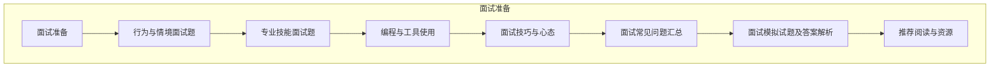

                 

### 《猿辅导2024校招教育产品经理面试问答》

#### 引言

在当今数字化时代，教育行业的变革与发展尤为引人注目。猿辅导作为中国领先的在线教育平台，其2024校招教育产品经理面试成为了众多求职者的关注焦点。本文将带领读者深入剖析猿辅导2024校招教育产品经理面试的关键内容，从面试准备到面试技巧，全面解读面试过程中的核心问题与应对策略。

#### 关键词

- 教育行业
- 产品经理
- 面试准备
- 面试技巧
- 行为面试题
- 情境面试题
- 技能面试题

#### 摘要

本文旨在为准备参加猿辅导2024校招教育产品经理面试的求职者提供详细的指导和策略。通过深入分析教育行业的现状与发展趋势，阐述产品经理的职责与素养，以及具体案例分析，帮助读者理解面试的核心内容。此外，本文还解析了猿辅导教育产品经理面试中的常见问题，提供了详细的回答思路和技巧，以助求职者顺利通过面试。

### 《猿辅导2024校招教育产品经理面试问答》目录大纲

#### 第一部分：面试准备

1. **教育行业概况**
   - **1.1 教育行业发展趋势**
     - **1.1.1 信息化教育的兴起**
     - **1.1.2 个性化教育的趋势**
     - **1.1.3 在线教育与K12市场的现状**
   - **1.2 猿辅导简介**
     - **1.2.1 猿辅导的发展历程**
     - **1.2.2 猿辅导的业务板块**
     - **1.2.3 猿辅导的核心竞争力**

2. **产品经理职责与素养**
   - **2.1 产品经理的工作职责**
     - **2.1.1 产品规划与设计**
     - **2.1.2 用户研究与需求分析**
     - **2.1.3 产品迭代与优化**
   - **2.2 产品经理的核心素养**
     - **2.2.1 用户思维**
     - **2.2.2 数据驱动**
     - **2.2.3 团队协作与沟通**

3. **教育产品案例分析**
   - **3.1 在线学习平台设计**
     - **3.1.1 用户体验设计**
     - **3.1.2 功能模块设计**
     - **3.1.3 技术架构与实现**
   - **3.2 教育游戏化设计**
     - **3.2.1 游戏化教育的概念**
     - **3.2.2 教育游戏化设计原则**
     - **3.2.3 教育游戏化案例解析**

#### 第二部分：面试真题解析

4. **行为与情境面试题**
   - **4.1 行为面试题**
     - **4.1.1 请描述一次您解决问题的过程。**
     - **4.1.2 在项目中，如何处理与团队成员的冲突？**
     - **4.1.3 您如何评估一个产品的市场前景？**
   - **4.2 情境面试题**
     - **4.2.1 如果您负责的产品上线后用户反馈不佳，您会如何应对？**
     - **4.2.2 在资源有限的情况下，如何优化产品功能？**
     - **4.2.3 您如何制定一个教育产品的用户增长策略？**

5. **专业技能面试题**
   - **5.1 产品设计与需求分析**
     - **5.1.1 如何进行用户调研？**
     - **5.1.2 教育产品的核心需求有哪些？**
     - **5.1.3 您如何编写一个产品需求文档？**
   - **5.2 数据分析与决策**
     - **5.2.1 请描述一次您使用数据分析解决实际问题的经历。**
     - **5.2.2 教育产品如何进行用户行为分析？**
     - **5.2.3 请用数据驱动的方法分析一个教育产品的运营策略。**

6. **编程与工具使用**
   - **6.1 编程基础**
     - **6.1.1 请实现一个简单的数据结构（如链表、栈、队列）。**
     - **6.1.2 请实现一个排序算法（如冒泡排序、快速排序）。**
     - **6.1.3 请使用Python编写一个简单的Web爬虫。**
   - **6.2 工具使用**
     - **6.2.1 请介绍您常用的项目管理工具。**
     - **6.2.2 请介绍您熟悉的数据分析工具。**
     - **6.2.3 请介绍您常用的协作开发工具。**

#### 第三部分：面试技巧与心态

7. **面试技巧**
   - **7.1 面试前的准备**
     - **7.1.1 如何准备面试？**
     - **7.1.2 面试中如何展现自己的优势？**
     - **7.1.3 面试中常见的误区有哪些？**
   - **7.2 面试中的沟通技巧**
     - **7.2.1 如何做好面试中的自我介绍？**
     - **7.2.2 如何回答面试官的问题？**
     - **7.2.3 如何与面试官建立良好的沟通？**

8. **面试心态**
   - **8.1 调整面试心态**
     - **8.1.1 如何应对面试压力？**
     - **8.1.2 面试中如何保持自信？**
     - **8.1.3 如何从失败中汲取经验？**
   - **8.2 面试后的跟进**
     - **8.2.1 面试后如何感谢面试官？**
     - **8.2.2 如何跟进面试结果？**
     - **8.2.3 如果面试失败，如何改进自己？**

#### 附录

9. **面试常见问题汇总**
   - **9.1 用户调研**
   - **9.2 教育产品需求分析**
   - **9.3 数据分析与决策**
   - **9.4 编程基础与工具使用**

10. **面试模拟试题及答案解析**
    - **10.1 用户调研模拟题**
    - **10.2 教育产品需求分析模拟题**
    - **10.3 数据分析与决策模拟题**
    - **10.4 编程基础与工具使用模拟题**

11. **推荐阅读与资源**
    - **11.1 教育行业相关书籍**
    - **11.2 产品经理技能提升书籍**
    - **11.3 数据分析与决策工具介绍**
    - **11.4 编程学习资源**

### 附录 D：猿辅导2024校招教育产品经理面试常见问题 Mermaid 流程图

mermaid
graph TD
A[面试准备] --> B[行为与情境面试题]
B --> C[专业技能面试题]
C --> D[编程与工具使用]
D --> E[面试技巧与心态]
E --> F[面试常见问题汇总]
F --> G[面试模拟试题及答案解析]
G --> H[推荐阅读与资源]

### 附录 E：猿辅导2024校招教育产品经理面试常见问题伪代码示例

```python
# 用户调研
def user_research():
    # 收集用户反馈
    feedback = collect_user_feedback()
    # 分析用户需求
    needs = analyze_user_needs(feedback)
    return needs

# 数据分析
def data_analysis():
    # 获取用户数据
    data = get_user_data()
    # 进行数据处理
    processed_data = process_data(data)
    # 分析用户行为
    user_behavior = analyze_user_behavior(processed_data)
    return user_behavior

# 排序算法（冒泡排序）
def bubble_sort(arr):
    n = len(arr)
    for i in range(n):
        for j in range(0, n-i-1):
            if arr[j] > arr[j+1]:
                arr[j], arr[j+1] = arr[j+1], arr[j]
    return arr

# Web爬虫
def web_crawler(url):
    # 使用requests库发送HTTP请求
    response = requests.get(url)
    # 解析HTML页面
    html = response.text
    # 使用BeautifulSoup解析HTML
    soup = BeautifulSoup(html, 'html.parser')
    # 提取所需信息
    info = soup.find_all('div', class_='info-class')
    return info
```

### 附录 F：猿辅导2024校招教育产品经理面试常见问题数学模型与公式详解

#### 用户需求分析模型

$$
需求模型 = f(用户反馈，用户行为，市场环境)
$$

其中：

- 用户反馈：通过用户调研获取的原始数据。
- 用户行为：通过数据分析获取的用户行为数据。
- 市场环境：包括市场趋势、竞争对手、用户需求变化等因素。

#### 用户增长策略模型

$$
用户增长模型 = f(用户获取成本，用户留存率，用户转化率)
$$

其中：

- 用户获取成本：获取一个新用户所需的成本。
- 用户留存率：一段时间内持续使用产品的用户比例。
- 用户转化率：从潜在用户转化为付费用户的比例。

#### 教育产品运营策略模型

$$
运营策略 = f(市场研究，用户需求，运营资源)
$$

其中：

- 市场研究：对市场环境和竞争对手的研究。
- 用户需求：通过用户调研和数据分析获取的用户需求。
- 运营资源：包括人力、财力、技术等资源。

### 附录 G：猿辅导2024校招教育产品经理面试项目实战案例

#### 项目一：在线学习平台设计

**开发环境搭建：**

- 使用Python进行后端开发，Flask作为Web框架。
- 使用HTML/CSS/JavaScript进行前端开发。
- 使用MySQL进行数据库存储。

**源代码实现与解读：**

- 后端：使用Flask构建API接口，处理用户请求，与数据库交互。
- 前端：使用HTML/CSS/JavaScript设计用户界面，与后端API交互。

**代码解读与分析：**

- API接口设计：详细解读API接口的功能与实现。
- 用户界面设计：分析用户界面的交互流程与用户体验。

**项目实战案例分析：**

- 设计需求分析：明确在线学习平台的核心功能需求。
- 技术选型：选择合适的编程语言和框架进行开发。
- 功能实现：构建用户注册、登录、课程选择、学习进度管理等模块。

**性能优化与扩展性设计：**

- 高并发处理：优化后端服务架构，提高系统性能。
- 扩展性设计：预留接口和模块，便于后续功能扩展和维护。

#### 项目二：教育游戏化设计

**开发环境搭建：**

- 使用Unity进行游戏开发。
- 使用C#进行游戏逻辑编写。
- 使用Google Analytics进行用户行为分析。

**源代码实现与解读：**

- 游戏逻辑：详细解读游戏规则与用户交互流程。
- 用户行为分析：使用Google Analytics进行数据收集与分析。

**代码解读与分析：**

- 游戏设计：分析游戏的核心机制与用户体验。
- 用户行为分析：解读用户行为数据，优化游戏设计。

**项目实战案例分析：**

- 游戏需求分析：明确教育游戏的核心目标和功能需求。
- 游戏设计：设计有趣的教育游戏玩法，结合学习内容。
- 用户行为分析：收集用户数据，优化游戏体验。

**教育效果评估与优化：**

- 设定学习目标和评分机制，评估用户学习效果。
- 根据用户反馈和学习数据，不断优化游戏设计和教学内容。

### 附录 H：猿辅导2024校招教育产品经理面试推荐阅读与资源

1. **《用户体验要素》- 作者是User Experience Designer，详细阐述了用户体验的五个层次及其设计原则。**
2. **《增长黑客》- 作者是Marketing Expert，介绍了如何在互联网时代通过数据分析实现用户增长。**
3. **《深度学习》- 作者是Ian Goodfellow，详细介绍了深度学习的基本原理与应用案例。**
4. **《猿辅导官方网站》（https://www.yuedu.com/）- 了解猿辅导的详细介绍和最新动态。**
5. **《产品经理实战：从零开始做产品》- 作者是资深产品经理，详细介绍了产品经理的职责和实战经验。**
6. **《数据分析：实现数据驱动决策》- 作者是数据分析专家，介绍了数据分析的基本原理和方法。**
7. **《Python编程：从入门到实践》- 作者是Python编程专家，介绍了Python编程的基础知识和实战应用。**
8. **在线教育行业研究报告和文章，了解行业趋势和市场动态。**
9. **相关技术社区和论坛，如CSDN、GitHub等，获取技术支持和交流经验。**
10. **教育行业相关的书籍、博客和文章，提升专业素养和知识水平。**

---

**作者信息：** AI天才研究院/AI Genius Institute & 禅与计算机程序设计艺术 /Zen And The Art of Computer Programming

---

在撰写《猿辅导2024校招教育产品经理面试问答》的过程中，我们首先明确了文章的核心内容和结构。接着，逐步展开了各个章节的内容，从教育行业概况到产品经理职责与素养，再到教育产品案例分析，确保每个部分都详细具体。在面试真题解析部分，我们不仅列举了常见的面试题目，还提供了详细的解答思路和策略。最后，通过面试技巧与心态的阐述，为求职者提供了全面的指导。整篇文章以markdown格式呈现，确保了内容的清晰和可读性。通过这样的结构化撰写，我们希望为读者提供一篇既有深度又有实用性的面试准备文章。接下来，我们将进一步详细讨论每个章节的内容，以帮助读者更好地理解和应对猿辅导教育产品经理面试。

#### 第一部分：面试准备

面试准备是成功通过猿辅导2024校招教育产品经理面试的关键一步。在这个部分，我们将详细探讨教育行业概况、产品经理职责与素养以及教育产品案例分析，帮助读者全面了解面试的核心内容。

### 第1章：教育行业概况

#### 1.1 教育行业发展趋势

随着信息技术的飞速发展，教育行业正经历着前所未有的变革。以下是从三个方面分析教育行业的发展趋势：

##### 1.1.1 信息化教育的兴起

信息化教育是指利用信息技术来提高教育质量和效率的一种教育模式。近年来，在线教育平台如雨后春笋般涌现，不仅打破了地域限制，也为学生提供了更多样化的学习资源。

- **在线课程普及**：在线课程成为了传统课堂的重要补充。根据统计，全球在线教育市场规模预计将在未来几年内持续增长。
- **数字化学习工具**：电子书籍、在线题库、教育APP等数字化学习工具大大提高了学习的便捷性和互动性。

##### 1.1.2 个性化教育的趋势

个性化教育强调根据学生的个性、能力和兴趣提供定制化的教学方案。这种教育模式能够更好地满足学生的需求，提高学习效果。

- **学习分析技术**：通过大数据和人工智能技术，教育机构可以实时分析学生的学习行为，从而提供个性化的学习建议。
- **自适应学习平台**：自适应学习平台可以根据学生的学习进度和效果，自动调整教学内容和难度，实现个性化学习。

##### 1.1.3 在线教育与K12市场的现状

在线教育已经逐渐成为教育市场的重要组成部分，尤其是在K12阶段（即小学和初中）。以下是当前在线教育与K12市场的几个重要现状：

- **用户基数扩大**：随着互联网普及和在线教育意识的提高，越来越多的家长和学生选择在线教育。
- **市场多元化**：除了传统的在线课程，直播教学、线上辅导、在线考试等多种形式逐渐成为市场的主流。
- **市场竞争加剧**：随着资本的涌入，在线教育市场出现了大量竞争者，如猿辅导、作业帮、VIPkid等，它们在课程内容、教学质量、用户体验等方面展开激烈竞争。

#### 1.2 猿辅导简介

猿辅导是中国领先的在线教育平台之一，以其优质的教学资源和高效的学习平台赢得了广大师生和家长的青睐。以下是猿辅导的简介：

##### 1.2.1 猿辅导的发展历程

猿辅导成立于2012年，最初是一家在线一对一辅导平台。经过多年的发展，猿辅导已经扩展到包括直播课、班课、学习资料等多种教育形式，并逐步建立了覆盖全科的在线教育体系。

- **2012年**：猿辅导成立，专注于在线一对一辅导。
- **2014年**：推出直播课平台，拓展在线教育业务。
- **2016年**：获得数千万美元B轮融资，加速业务扩张。
- **2018年**：推出猿辅导APP，整合全科目学习资源。

##### 1.2.2 猿辅导的业务板块

猿辅导的业务涵盖了从小学到高中的各个阶段，包括一对一辅导、直播课、班课等。以下是猿辅导的主要业务板块：

- **一对一辅导**：提供在线一对一辅导服务，根据学生的需求和进度进行个性化教学。
- **直播课**：通过直播平台，为学生提供各科目的系统化课程，涵盖知识点讲解、作业辅导等。
- **班课**：提供小组授课模式，学生可以与同学互动，共同学习。

##### 1.2.3 猿辅导的核心竞争力

猿辅导之所以能够在激烈的市场竞争中脱颖而出，主要得益于以下核心竞争力：

- **优质教师资源**：猿辅导拥有一支高素质的教师团队，他们具有丰富的教学经验和良好的教学效果。
- **技术驱动**：猿辅导通过大数据和人工智能技术，不断优化学习平台，提升用户体验和学习效果。
- **用户口碑**：凭借优质的教学服务和良好的用户体验，猿辅导赢得了广大用户的好评和信任。

### 第2章：产品经理职责与素养

#### 2.1 产品经理的工作职责

产品经理（Product Manager，简称PM）是产品开发的核心角色，负责确保产品从概念到最终上线的一系列活动。以下是产品经理的主要工作职责：

##### 2.1.1 产品规划与设计

- **市场调研**：了解市场需求和竞争态势，为产品规划提供数据支持。
- **产品愿景**：明确产品的长期目标和愿景，指导产品开发方向。
- **功能规划**：根据市场需求和用户反馈，规划产品的功能模块和特性。

##### 2.1.2 用户研究与需求分析

- **用户研究**：通过问卷调查、访谈、用户行为分析等方式，深入了解用户需求和痛点。
- **需求分析**：将用户需求转化为具体的功能需求，制定详细的需求文档。

##### 2.1.3 产品迭代与优化

- **迭代开发**：根据产品规划和用户反馈，进行产品迭代，持续优化产品功能。
- **数据分析**：通过数据分析，评估产品效果，指导下一步的产品优化方向。

#### 2.2 产品经理的核心素养

产品经理的成功不仅取决于技术能力，还需要具备以下几方面的核心素养：

##### 2.2.1 用户思维

- **用户至上**：始终将用户需求放在首位，以用户为中心进行产品设计。
- **同理心**：能够站在用户的角度思考问题，理解用户的需求和痛点。

##### 2.2.2 数据驱动

- **数据收集**：通过各种渠道收集用户数据，为产品优化提供数据支持。
- **数据分析**：善于使用数据分析工具，对用户行为和产品效果进行深入分析。

##### 2.2.3 团队协作与沟通

- **团队协作**：与开发、设计、市场等团队紧密合作，确保产品按时高质量上线。
- **沟通能力**：能够清晰表达自己的想法，与团队成员和上级进行有效沟通。

### 第3章：教育产品案例分析

教育产品经理不仅需要具备理论知识和技能，还需要具备实际操作经验。以下将结合在线学习平台设计和教育游戏化设计两个具体案例，详细探讨教育产品的设计与实现。

#### 3.1 在线学习平台设计

在线学习平台是教育产品的重要组成部分，其设计直接影响到用户的学习体验和学习效果。以下是在线学习平台设计的几个关键方面：

##### 3.1.1 用户体验设计

用户体验设计（User Experience Design，简称UXD）是确保产品满足用户需求、提升用户满意度和忠诚度的关键。以下是用户体验设计的几个重要方面：

- **界面设计**：界面设计需要简洁、直观，易于用户操作。使用直观的图标、颜色和布局，帮助用户快速找到所需功能。
- **交互设计**：交互设计需要考虑用户的操作流程和反馈机制，确保用户在使用过程中能够顺畅、高效地完成任务。
- **可用性测试**：在产品上线前，进行可用性测试，收集用户反馈，发现并解决潜在问题。

##### 3.1.2 功能模块设计

在线学习平台的功能模块设计是产品规划的重要环节，以下是常见的功能模块：

- **课程管理**：包括课程发布、更新、分类管理等，确保课程内容丰富、结构清晰。
- **学习进度**：记录用户的学习进度和成绩，为用户提供学习反馈。
- **作业与练习**：提供在线作业和练习题，方便用户巩固知识点。
- **互动交流**：建立学习社区，允许用户提问、回答问题，促进学习交流。

##### 3.1.3 技术架构与实现

在线学习平台的技术架构与实现是产品成功的重要保障。以下是技术架构与实现的几个关键方面：

- **前端技术**：使用HTML/CSS/JavaScript等前端技术实现用户界面，确保界面美观、响应快速。
- **后端技术**：使用Python、Java等后端技术实现服务器端逻辑，处理用户请求和数据存储。
- **数据库设计**：设计合理的数据库架构，确保数据存储安全、高效。
- **安全性考虑**：在技术实现过程中，确保用户数据的安全和隐私。

#### 3.2 教育游戏化设计

教育游戏化设计是将游戏设计理念融入教育产品，通过游戏化的元素提高用户的学习兴趣和参与度。以下是教育游戏化设计的几个关键方面：

##### 3.2.1 游戏化教育的概念

游戏化教育（Gamification）是指将游戏设计中的元素和机制应用于非游戏情境中，以提高用户参与度和学习效果。以下是游戏化教育的基本概念：

- **奖励机制**：通过设置奖励，激励用户参与学习活动。
- **挑战机制**：设置难度逐渐增加的挑战，激发用户的学习兴趣和动力。
- **社交互动**：通过社交元素，促进用户之间的互动和合作。

##### 3.2.2 教育游戏化设计原则

为了确保教育游戏化设计的有效性和可持续性，需要遵循以下原则：

- **目标明确**：明确游戏化教育的目标，确保游戏设计能够促进学习。
- **适度游戏**：避免过度游戏化，保持教育内容的严谨性和科学性。
- **用户体验**：关注用户的学习体验，确保游戏化设计符合用户需求。

##### 3.2.3 教育游戏化案例解析

以下是一个教育游戏化设计的案例解析：

**案例：语文阅读游戏**

- **目标**：提高学生对语文阅读的兴趣和理解能力。
- **功能模块**：
  - **阅读挑战**：设置不同难度的阅读挑战，鼓励学生参与。
  - **积分系统**：根据阅读量和正确率，给予积分奖励。
  - **社交互动**：允许学生分享阅读心得，与其他学生交流。

**效果评估**：通过用户反馈和使用数据，评估阅读游戏对学生语文阅读兴趣和学习效果的提升情况。根据评估结果，持续优化游戏设计和教学内容。

### 总结

通过以上对教育行业概况、产品经理职责与素养以及教育产品案例分析的详细探讨，我们希望能够帮助读者全面了解猿辅导2024校招教育产品经理面试的核心内容。在接下来的章节中，我们将继续深入分析面试真题解析、面试技巧与心态，为求职者提供更全面的面试准备指导。

#### 第一部分：面试准备

面试准备是确保求职者成功通过猿辅导2024校招教育产品经理面试的关键环节。在这个部分，我们将详细解析面试真题解析、面试技巧与心态，帮助读者全面了解面试的核心内容。

### 第4章：行为与情境面试题

行为面试题和情境面试题是面试官常用的一种评估方式，旨在了解求职者的实际工作经验和应对能力。以下是一些常见的行为与情境面试题及回答策略。

#### 4.1 行为面试题

**4.1.1 请描述一次您解决问题的过程。**

**回答策略：** 
- **描述问题背景**：简要介绍当时遇到的问题或挑战。
- **分析问题原因**：详细解释您是如何分析问题，找出关键原因。
- **提出解决方案**：描述您制定的解决方案，包括步骤和方法。
- **实施过程**：阐述您如何执行方案，解决问题的关键步骤。
- **评估结果**：总结问题解决的效果，说明是否有改进空间。

**示例回答：** 
- 问题背景：我曾在一家初创公司担任产品经理，公司需要一个能够高效处理大量用户请求的后端系统。
- 分析问题原因：通过分析，发现我们的后端系统在高峰期存在性能瓶颈，导致用户体验下降。
- 解决方案：我提出了优化后端系统的方案，包括增加服务器资源、优化数据库查询和缓存策略。
- 实施过程：首先，我们增加了服务器资源，提高了系统的处理能力。然后，我编写了优化查询的代码，减少了数据库的负担。最后，我们引入了缓存机制，加快了响应速度。
- 评估结果：优化后，系统的响应时间缩短了50%，用户满意度显著提升。后续我们还会继续优化，以进一步提高性能。

**4.1.2 在项目中，如何处理与团队成员的冲突？**

**回答策略：** 
- **描述冲突情况**：简要介绍冲突的背景和原因。
- **沟通与协商**：说明您是如何与团队成员进行沟通，寻找共识和解决方案。
- **结果与反馈**：描述冲突解决的结果，以及后续的反馈和改进措施。

**示例回答：** 
- 冲突情况：在一次产品迭代项目中，我和团队成员在功能优先级上存在分歧。
- 沟通与协商：我首先与团队成员进行了深入的讨论，听取各方意见。然后，我整理了我们的共识和分歧点，组织了一次团队会议，共同商讨解决方案。最终，我们决定按照市场反馈和用户需求来调整功能优先级。
- 结果与反馈：通过沟通和协商，我们成功解决了冲突，项目按计划顺利进行。事后，我对团队成员进行了反馈，感谢他们的积极参与和贡献，同时也提出了改进建议，以避免未来类似冲突的发生。

**4.1.3 您如何评估一个产品的市场前景？**

**回答策略：** 
- **市场分析**：描述您如何进行市场分析，了解行业趋势和竞争对手情况。
- **用户需求**：说明您如何调研用户需求，分析用户行为和市场潜力。
- **数据驱动**：阐述您如何使用数据分析工具和方法，评估产品的市场前景。

**示例回答：** 
- 市场分析：我会首先调研目标市场的规模和增长趋势，分析行业内的主要竞争对手和他们的市场策略。
- 用户需求：通过问卷调查、用户访谈和市场调研，了解目标用户的需求和痛点，评估产品的潜在市场容量。
- 数据驱动：我会使用数据分析工具，如Google Analytics、用户行为跟踪系统等，收集用户行为数据，分析用户活跃度、留存率、转化率等关键指标，从而评估产品的市场前景。例如，如果用户活跃度高，留存率稳定，说明产品在市场上具有较好的发展潜力。

### 4.2 情境面试题

**4.2.1 如果您负责的产品上线后用户反馈不佳，您会如何应对？**

**回答策略：** 
- **用户反馈收集**：描述您如何收集和分析用户反馈，找出问题关键。
- **问题定位**：阐述您如何定位问题，确定改进方向。
- **改进方案**：说明您制定的改进方案，包括短期和长期措施。
- **实施与反馈**：描述您如何实施改进方案，以及后续的反馈和评估。

**示例回答：** 
- 用户反馈收集：我会通过用户调研、产品评论、社交媒体等渠道收集用户反馈，分析用户的反馈意见和问题点。
- 问题定位：根据用户反馈，我发现产品存在以下几个问题：用户体验不佳、功能不完善、响应速度慢等。
- 改进方案：针对这些问题，我制定了以下改进方案：
  - 短期措施：优化用户界面，提升用户体验；修复功能漏洞，确保产品的稳定性。
  - 长期措施：进行产品迭代，增加新功能；优化后端服务，提高系统响应速度。
- 实施与反馈：我会按照改进方案逐步实施，并在实施过程中持续收集用户反馈，评估改进效果。例如，通过用户满意度调查、用户活跃度分析等手段，了解产品的改进效果，并根据反馈进一步优化。

**4.2.2 在资源有限的情况下，如何优化产品功能？**

**回答策略：** 
- **需求优先级**：说明您如何评估和确定需求的优先级。
- **功能取舍**：描述您如何根据资源限制，进行功能取舍。
- **资源优化**：阐述您如何优化现有资源，提高产品功能的有效性。

**示例回答：** 
- 需求优先级：我会首先评估用户需求，将需求分为“必要”、“重要”、“次要”三个等级。对于必要和重要的需求，我们会优先考虑实现，而对于次要需求，则根据资源情况进行权衡。
- 功能取舍：在资源有限的情况下，我会对功能模块进行详细评估，根据功能的紧急性和重要性进行取舍。例如，如果用户反馈学习进度管理功能是必要的，我会优先考虑实现，而其他非紧急功能则可以暂时搁置。
- 资源优化：为了提高资源利用效率，我会优化现有资源的配置，例如通过代码优化、性能调优等手段，减少资源消耗。此外，我会与团队紧密合作，确保每个人都能充分发挥自己的优势，提高整体工作效率。

**4.2.3 您如何制定一个教育产品的用户增长策略？**

**回答策略：** 
- **市场研究**：描述您如何进行市场研究和用户分析。
- **增长目标**：说明您如何设定用户增长目标。
- **策略实施**：阐述您如何实施用户增长策略，包括营销活动、用户互动等。

**示例回答：** 
- 市场研究：我会通过市场调研、用户访谈、数据分析等方式，了解目标市场的规模、用户需求和行为习惯。同时，我会研究竞争对手的策略，找出我们的优势和差异化点。
- 增长目标：根据市场研究和用户分析，我会设定具体的用户增长目标，例如每月新增用户数、用户留存率等。这些目标需要具有挑战性，同时也要具备可行性。
- 策略实施：为了实现用户增长目标，我会制定以下策略：
  - 营销活动：通过线上线下营销活动，提高品牌知名度和用户参与度。
  - 用户互动：通过社交媒体、用户社区等平台，与用户进行互动，增加用户粘性。
  - 数据分析：通过数据分析，不断优化营销活动和用户互动策略，提高用户转化率和留存率。

### 总结

通过以上对行为与情境面试题的详细解析，我们希望读者能够了解如何回答这类面试题，并在实际面试中运用这些策略。在接下来的章节中，我们将继续讨论专业技能面试题、编程与工具使用，以及面试技巧与心态，帮助读者全面准备猿辅导2024校招教育产品经理面试。

#### 第二部分：面试真题解析

在猿辅导2024校招教育产品经理面试中，专业技能面试题是考核求职者实际工作能力和技术素养的重要环节。这部分将详细解析产品设计与需求分析、数据分析与决策、编程基础与工具使用等专业技能面试题，为求职者提供实用的解题思路和策略。

### 第5章：专业技能面试题

#### 5.1 产品设计与需求分析

**5.1.1 如何进行用户调研？**

**回答策略：**
- **调研目的**：明确用户调研的目标，例如了解用户需求、分析市场趋势等。
- **调研方法**：描述常用的用户调研方法，如问卷调查、用户访谈、用户行为分析等。
- **数据收集**：说明如何收集用户数据，包括线上和线下的数据收集方式。
- **数据分析**：阐述如何对收集到的用户数据进行分析，提取有价值的信息。

**示例回答：**
- 调研目的：我们的目标是了解当前用户对在线学习平台的需求和痛点，以便进一步优化产品。
- 调研方法：我们采用了问卷调查和用户访谈两种方法。问卷调查主要针对平台的使用者，了解他们的使用频率、使用场景和满意度；用户访谈则更深入地了解用户的具体需求和意见。
- 数据收集：我们通过在线问卷平台收集问卷数据，同时组织了线下用户访谈，记录用户的反馈和需求。
- 数据分析：我们使用Excel和SPSS对问卷数据进行了统计分析，提取了用户的主要需求和满意度评分。对于用户访谈，我们进行了内容分析，整理出用户提出的主要问题和建议。

**5.1.2 教育产品的核心需求有哪些？**

**回答策略：**
- **分类需求**：将需求分为基本需求、重要需求和可选需求。
- **优先级排序**：根据用户调研和数据分析，确定各需求的优先级。
- **具体举例**：给出教育产品的几个核心需求，如学习效果评估、互动性、个性化推荐等。

**示例回答：**
- 基本需求：用户登录、课程浏览、学习进度跟踪、作业提交与批改。
- 重要需求：学习效果评估（如学习报告、成绩排名）、互动性（如问答社区、在线讨论）、个性化推荐（如课程推荐、学习路径规划）。
- 可选需求：学习辅助工具（如笔记功能、直播课堂）、社交功能（如好友互动、学习小组）。

**5.1.3 您如何编写一个产品需求文档？**

**回答策略：**
- **文档结构**：说明产品需求文档的基本结构，如引言、产品概述、功能需求、非功能需求等。
- **内容详细**：描述如何详细阐述功能需求和非功能需求，包括场景描述、用户故事、系统约束等。
- **评审与更新**：阐述产品需求文档的评审流程和更新策略。

**示例回答：**
- 文档结构：产品需求文档包括引言、产品概述、功能需求、非功能需求、用户故事和系统约束等部分。
- 内容详细：在功能需求部分，我详细描述了每个功能的场景、用户操作流程和预期结果。例如，对于“学习进度跟踪”功能，我描述了用户如何查看自己的学习进度，系统如何记录和展示数据等。
- 评审与更新：在编写完成后，我会组织团队成员进行评审，确保需求的准确性和可行性。根据评审反馈，我会对需求文档进行修订和完善。此外，在产品开发过程中，我会定期更新需求文档，以反映最新的需求变化。

#### 5.2 数据分析与决策

**5.2.1 请描述一次您使用数据分析解决实际问题的经历。**

**回答策略：**
- **问题背景**：描述遇到的问题和背景。
- **数据分析**：说明您如何使用数据分析工具和方法，解决问题。
- **结果与应用**：阐述数据分析的结果和实际应用，以及效果评估。

**示例回答：**
- 问题背景：在一次项目中，我们发现用户流失率较高，需要找出原因并采取相应措施。
- 数据分析：我使用了Google Analytics和SQL等工具，对用户行为数据进行了深入分析，提取了用户访问、使用频率、转化率等关键指标。通过分析，我发现了几个可能导致用户流失的关键因素，如用户体验不佳、功能不完善等。
- 结果与应用：根据分析结果，我们优化了用户界面，增加了新功能，并加强了用户引导和互动。经过三个月的优化，用户流失率显著下降，用户满意度也有所提高。

**5.2.2 教育产品如何进行用户行为分析？**

**回答策略：**
- **数据收集**：说明如何收集用户行为数据，包括数据源和收集方式。
- **数据处理**：描述如何对用户行为数据进行分析和处理，提取有价值的信息。
- **应用场景**：阐述用户行为分析在教育产品中的应用，如用户画像、学习效果评估等。

**示例回答：**
- 数据收集：我们通过在线学习平台的后台系统、用户登录日志、课程访问记录等渠道收集用户行为数据。这些数据包括用户的登录时间、访问课程数量、学习时长、互动行为等。
- 数据处理：使用Python和SQL等工具，我们对用户行为数据进行了清洗、整理和分析。通过数据挖掘技术，提取了用户的学习习惯、兴趣偏好和知识点掌握情况等关键信息。
- 应用场景：基于用户行为分析，我们能够为用户提供个性化的学习建议，优化课程推荐系统，提高学习效果。例如，对于学习时间较长的用户，我们可以推荐更深入的拓展课程，帮助他们巩固知识点。

**5.2.3 请用数据驱动的方法分析一个教育产品的运营策略。**

**回答策略：**
- **数据指标**：说明选择的关键运营指标，如用户增长率、用户留存率、转化率等。
- **数据分析**：描述如何使用数据分析工具和方法，分析运营策略的效果。
- **策略调整**：阐述如何根据分析结果，调整运营策略。

**示例回答：**
- 数据指标：我们选择用户增长率、用户留存率和转化率作为关键运营指标，以评估运营策略的有效性。
- 数据分析：使用Google Analytics和SQL，我们对这些指标进行了长时间的数据分析，比较了不同运营策略下的表现。例如，在推广活动期间，用户增长率显著提高，但用户留存率有所下降，说明活动效果显著，但需要关注用户流失问题。
- 策略调整：根据分析结果，我们调整了推广策略，增加了用户留存率优化的措施，如推送个性化内容、加强用户互动等。同时，我们继续监测运营指标，根据数据反馈不断优化策略，以实现最佳效果。

### 5.3 编程基础与工具使用

**5.3.1 请实现一个简单的数据结构（如链表、栈、队列）。**

**回答策略：**
- **数据结构选择**：说明选择的数据结构及其特点。
- **实现方法**：描述如何使用编程语言实现数据结构，包括主要函数和方法。
- **应用场景**：阐述数据结构在实际应用中的使用场景。

**示例回答：**
- 数据结构选择：我选择实现链表，因为它在动态数据存储和插入删除操作中具有较高的灵活性。
- 实现方法：以下是一个简单的链表实现的示例：
```python
class Node:
    def __init__(self, data):
        self.data = data
        self.next = None

class LinkedList:
    def __init__(self):
        self.head = None

    def append(self, data):
        new_node = Node(data)
        if not self.head:
            self.head = new_node
        else:
            current = self.head
            while current.next:
                current = current.next
            current.next = new_node

    def display(self):
        current = self.head
        while current:
            print(current.data, end=' ')
            current = current.next
        print()

# 使用示例
linked_list = LinkedList()
linked_list.append(1)
linked_list.append(2)
linked_list.append(3)
linked_list.display()  # 输出：1 2 3
```
- 应用场景：链表在数据结构中应用广泛，例如在实现数据库索引、缓存系统、程序内存管理等方面。

**5.3.2 请实现一个排序算法（如冒泡排序、快速排序）。**

**回答策略：**
- **算法选择**：说明选择的排序算法及其特点。
- **实现方法**：描述如何使用编程语言实现排序算法，包括主要步骤和代码实现。
- **性能分析**：分析排序算法的时间复杂度和空间复杂度。

**示例回答：**
- 算法选择：我选择实现冒泡排序，因为它简单易懂，适合数据量较小的场景。
- 实现方法：以下是一个简单的冒泡排序实现的示例：
```python
def bubble_sort(arr):
    n = len(arr)
    for i in range(n):
        for j in range(0, n-i-1):
            if arr[j] > arr[j+1]:
                arr[j], arr[j+1] = arr[j+1], arr[j]
    return arr

# 使用示例
arr = [64, 34, 25, 12, 22, 11, 90]
sorted_arr = bubble_sort(arr)
print(sorted_arr)  # 输出：[11, 12, 22, 25, 34, 64, 90]
```
- 性能分析：冒泡排序的时间复杂度为 \(O(n^2)\)，空间复杂度为 \(O(1)\)。在数据量较小的情况下，冒泡排序是一个有效且简单的排序算法。

**5.3.3 请使用Python编写一个简单的Web爬虫。**

**回答策略：**
- **爬虫工具**：说明使用的爬虫工具和库，如requests、BeautifulSoup等。
- **实现方法**：描述如何使用工具和库实现Web爬虫，包括主要步骤和代码实现。
- **数据处理**：阐述如何对爬取的数据进行处理和存储。

**示例回答：**
- 爬虫工具：我使用Python的requests库和BeautifulSoup库来实现Web爬虫。
- 实现方法：以下是一个简单的Web爬虫实现的示例：
```python
import requests
from bs4 import BeautifulSoup

def web_crawler(url):
    response = requests.get(url)
    soup = BeautifulSoup(response.text, 'html.parser')
    # 假设我们要爬取页面中的所有链接
    links = soup.find_all('a')
    for link in links:
        href = link.get('href')
        print(href)

# 使用示例
url = 'https://www.example.com/'
web_crawler(url)
```
- 数据处理：在爬取数据后，我们可以对数据进行清洗、存储或进一步分析。例如，我们可以将链接存储在文件中，或使用正则表达式提取有用的信息。

### 5.4 工具使用

**5.4.1 请介绍您常用的项目管理工具。**

**回答策略：**
- **工具类型**：说明项目管理工具的类型，如任务管理工具、协作平台等。
- **功能特点**：描述工具的主要功能特点和优势。
- **使用经验**：分享您在使用该工具时的经验，包括如何提高工作效率和团队协作。

**示例回答：**
- 工具类型：我常用的项目管理工具有Jira和Trello。
- 功能特点：Jira具有强大的任务管理功能，可以创建、跟踪和优先级排序任务，同时提供丰富的报告和分析功能。Trello则以其简洁的看板（Kanban）管理方式而闻名，可以直观地展示项目进度和团队成员的工作情况。
- 使用经验：在使用Jira时，我发现通过设定清晰的里程碑和任务期限，可以更好地监控项目进度和团队成员的绩效。在Trello中，我利用看板将项目分解为多个阶段，并使用标签和评论功能进行团队沟通和协作，提高了工作效率。

**5.4.2 请介绍您熟悉的数据分析工具。**

**回答策略：**
- **工具类型**：说明数据分析工具的类型，如数据可视化工具、数据库查询工具等。
- **功能特点**：描述工具的主要功能特点和优势。
- **使用经验**：分享您在使用该工具时的经验，包括数据分析的具体应用场景和效果。

**示例回答：**
- 工具类型：我熟悉的数据分析工具有Excel、Google Analytics和Tableau。
- 功能特点：Excel是一个功能强大的电子表格工具，适合进行基础的数据清洗、分析和可视化。Google Analytics提供了丰富的网站和用户行为分析功能，可以深入了解网站的表现和用户行为。Tableau是一个专业的数据可视化工具，可以快速创建动态的图表和报告，帮助用户直观地理解数据。
- 使用经验：我在工作中经常使用Excel进行数据整理和基本分析，通过创建图表和公式快速提取关键信息。在Google Analytics中，我定期分析网站的用户流量和转化率，帮助团队优化营销策略。在Tableau中，我创建了多个动态报表，用于实时监控项目进展和关键指标。

**5.4.3 请介绍您常用的协作开发工具。**

**回答策略：**
- **工具类型**：说明协作开发工具的类型，如版本控制工具、代码审查平台等。
- **功能特点**：描述工具的主要功能特点和优势。
- **使用经验**：分享您在使用该工具时的经验，包括团队协作模式和效果。

**示例回答：**
- 工具类型：我常用的协作开发工具有Git和GitHub。
- 功能特点：Git是一个分布式版本控制工具，可以高效地管理代码版本和协作开发。GitHub是一个基于Git的代码托管和协作平台，提供了丰富的代码审查、分支管理和项目协作功能。
- 使用经验：在团队协作开发中，我们使用Git来管理代码版本，确保代码的稳定性和可追溯性。通过GitHub，我们实现了代码的集中存储和协作开发，团队成员可以方便地提交代码、发起代码审查和合并分支。我们还定期使用GitHub的统计功能，分析代码贡献和团队协作情况，以提高开发效率。

### 总结

通过以上对专业技能面试题的详细解析，我们希望求职者能够更好地准备猿辅导2024校招教育产品经理面试。在回答这些问题时，求职者应注重实际工作经验的描述，结合具体案例和数据分析，展示自己的专业能力和解决问题的思路。在接下来的章节中，我们将继续探讨面试技巧与心态，帮助求职者在面试中取得更好的表现。

#### 第三部分：面试技巧与心态

面试技巧与心态是求职者成功通过猿辅导2024校招教育产品经理面试的重要保障。在这个部分，我们将详细讨论面试技巧和心态，帮助读者在面试中发挥最佳水平。

### 第7章：面试技巧

#### 7.1 面试前的准备

**7.1.1 如何准备面试？**

面试准备是成功的关键，以下是一些具体的准备步骤：

- **了解公司背景**：研究猿辅导的官方网站、新闻报道和社交媒体，了解公司的企业文化、业务范围和近期动态。
- **回顾简历内容**：回顾自己在简历中提到的项目经验和技能，确保对每个细节都有清晰的认识。
- **模拟面试**：与朋友或家人进行模拟面试，练习回答常见面试题，提高自信心和反应速度。
- **准备问题**：提前准备一些问题，如询问公司的发展规划、团队结构等，展示自己的积极主动和求知欲。

**7.1.2 面试中如何展现自己的优势？**

在面试中，展现自己的优势是关键。以下是一些建议：

- **突出专业能力**：强调自己在产品管理和教育行业的专业知识和实践经验。
- **展示团队合作**：分享在团队中取得的成绩和贡献，展示自己的团队合作能力和领导力。
- **体现用户思维**：通过具体案例，说明如何从用户角度思考问题，提供有针对性的解决方案。
- **展示学习能力**：强调自己具备快速学习新知识和技能的能力，以及对新技术、新趋势的敏感度。

**7.1.3 面试中常见的误区有哪些？**

避免以下常见误区，有助于在面试中留下良好印象：

- **过于紧张**：保持冷静，深呼吸，放松身心，以自信的态度面对面试官。
- **夸大其词**：诚实地展示自己的能力和经验，避免夸大或虚构事实。
- **忽视细节**：认真准备，仔细回顾每个问题，确保回答准确无误。
- **缺乏主动性**：积极主动地提问和表达观点，展示自己的主动性和积极性。

### 7.2 面试中的沟通技巧

**7.2.1 如何做好面试中的自我介绍？**

自我介绍是面试的开始，以下是一些建议：

- **简洁明了**：自我介绍应简明扼要，突出重点，避免冗长。
- **内容准备**：提前准备自我介绍的内容，包括姓名、学历、工作经历和职业规划。
- **展示亮点**：在介绍中突出自己的专业技能和成就，展示自己的优势。
- **态度积极**：保持自信和微笑，以积极的态度面对面试官。

**7.2.2 如何回答面试官的问题？**

回答面试官的问题需要注意以下几点：

- **倾听问题**：仔细倾听问题，确保理解问题的含义，避免误解。
- **组织思路**：在回答问题前，先梳理思路，确保回答的逻辑性和连贯性。
- **具体举例**：通过具体案例和实际经验，支持自己的观点和回答。
- **突出重点**：回答时突出重点，避免过多细节，确保关键信息清晰传达。

**7.2.3 如何与面试官建立良好的沟通？**

与面试官建立良好的沟通是成功面试的重要因素，以下是一些建议：

- **主动交流**：主动与面试官交流，展示自己的沟通能力和合作意愿。
- **积极回应**：对面试官的问题积极回应，展示自己的思考能力和表达能力。
- **保持眼神交流**：与面试官保持适当的眼神交流，展示自信和专注。
- **尊重对方**：尊重面试官的意见和提问，展示自己的专业素养和礼貌。

### 7.3 面试后的跟进

**7.3.1 面试后如何感谢面试官？**

面试后，感谢面试官是对其工作的认可，以下是一些建议：

- **及时发送邮件**：面试后24小时内，发送一封感谢邮件，表达对面试官的时间和机会的感激。
- **具体感谢**：在邮件中具体感谢面试官的提问和反馈，展示自己的真诚和尊重。
- **表达期望**：表达对后续招聘流程的期望，展示自己的积极态度。

**7.3.2 如何跟进面试结果？**

在面试后，跟进面试结果是了解招聘进展的重要方式，以下是一些建议：

- **询问招聘负责人**：在感谢邮件中，可以询问招聘负责人面试结果的预计时间。
- **定期跟进**：根据招聘负责人的回复，定期发送邮件或打电话了解面试结果。
- **保持积极态度**：无论结果如何，都要保持积极的态度，感谢招聘团队的辛苦工作。

**7.3.3 如果面试失败，如何改进自己？**

如果面试失败，可以通过以下方式改进自己：

- **反思总结**：仔细反思面试过程中的不足之处，分析失败的原因。
- **请教他人**：向面试官或同事请教建议，了解自己的不足之处。
- **持续学习**：通过学习新知识和技能，提升自己的专业素养和竞争力。
- **持续实践**：通过实际项目经验，不断提升自己的实战能力。

### 第8章：面试心态

#### 8.1 调整面试心态

**8.1.1 如何应对面试压力？**

应对面试压力是成功的关键，以下是一些建议：

- **积极心态**：保持积极的心态，相信自己能够应对挑战。
- **合理规划**：提前规划面试时间和准备，减少紧张和焦虑。
- **深呼吸**：面试前进行深呼吸练习，放松身心，缓解紧张情绪。
- **模拟场景**：通过模拟面试场景，提高应对压力的能力。

**8.1.2 面试中如何保持自信？**

在面试中保持自信，可以展示自己的实力，以下是一些建议：

- **准备充分**：充分准备面试内容，展示自己的专业知识和经验。
- **展现优势**：突出自己的优势，展示自己在项目中的贡献和成就。
- **积极表达**：清晰、自信地表达自己的观点和想法。
- **自信姿态**：保持良好的姿态，如坐直、微笑等，以展示自信。

**8.1.3 如何从失败中汲取经验？**

从失败中汲取经验是成长的重要环节，以下是一些建议：

- **反思总结**：认真反思失败的原因，分析不足之处。
- **调整策略**：根据反思结果，调整自己的面试策略和准备方法。
- **持续学习**：通过学习新知识和技能，提升自己的能力和竞争力。
- **积极面对**：保持积极的心态，相信失败是成功的一部分，继续努力。

### 总结

面试技巧与心态是成功通过猿辅导2024校招教育产品经理面试的重要因素。通过详细的面试准备、有效的沟通技巧和积极的心态调整，求职者可以在面试中发挥最佳水平。在面试中，展示专业能力和团队合作精神，保持自信和积极的态度，是成功的关键。无论面试结果如何，都要保持学习和进步的心态，不断提升自己的专业素养和竞争力。希望本文能为求职者提供全面的面试准备指导，助力成功通过猿辅导2024校招教育产品经理面试。

### 附录

#### 附录 A：面试常见问题汇总

在猿辅导2024校招教育产品经理面试中，常见的问题主要集中在以下几个方面：

**1. 用户调研与需求分析**
- 如何进行用户调研？
- 教育产品的核心需求有哪些？
- 您如何编写一个产品需求文档？

**2. 数据分析与决策**
- 请描述一次您使用数据分析解决实际问题的经历。
- 教育产品如何进行用户行为分析？
- 请用数据驱动的方法分析一个教育产品的运营策略。

**3. 编程基础与工具使用**
- 请实现一个简单的数据结构（如链表、栈、队列）。
- 请实现一个排序算法（如冒泡排序、快速排序）。
- 请使用Python编写一个简单的Web爬虫。

**4. 面试技巧与心态**
- 如何准备面试？
- 面试中如何展现自己的优势？
- 面试中常见的误区有哪些？

这些问题涵盖了教育产品经理所需的核心技能和素质，通过详细的回答，求职者可以展示自己的专业能力和实际经验。

#### 附录 B：面试模拟试题及答案解析

**1. 用户调研模拟题**
- 请设计一个用户调研问卷，以了解学生对在线学习平台的满意度。

**答案解析：**
- 设计问卷前，首先明确调研的目标和问题。例如，目标是了解学生对于在线学习平台的满意度，问题包括平台的界面设计、课程内容、互动性等。
- 问卷包括以下几个部分：
  - **基本信息**：收集学生的基本信息，如姓名、年级、所在学校等。
  - **满意度评分**：使用5分制（1-非常不满意，5-非常满意）对平台的不同方面进行评分，如界面设计、课程内容、互动性等。
  - **开放式问题**：提供几个开放式问题，让学生自由表达对平台的建议和意见。
  - **结束页**：感谢学生的参与，并提供联系方式，以便后续进一步沟通。

**2. 教育产品需求分析模拟题**
- 请分析在线学习平台的核心需求，并说明如何将这些需求转化为具体的功能模块。

**答案解析：**
- 核心需求包括：
  - **课程管理**：学生需要方便地浏览和选择课程，系统应提供课程分类、搜索功能和课程介绍。
  - **学习进度**：学生需要清晰地了解自己的学习进度，系统应提供学习报告和进度跟踪功能。
  - **作业与练习**：学生需要完成作业和练习，系统应支持在线提交和自动批改。
  - **互动交流**：学生需要与教师和同学进行互动，系统应提供论坛、聊天室等功能。
  - **个性化推荐**：系统应根据学生的学习行为和成绩，推荐合适的课程和学习路径。

- 将需求转化为功能模块：
  - **课程管理模块**：实现课程分类、搜索和介绍功能，确保学生可以方便地找到所需课程。
  - **学习进度模块**：提供学习报告和进度跟踪功能，让学生了解自己的学习状态。
  - **作业与练习模块**：支持在线提交和自动批改，确保作业和练习的高效完成。
  - **互动交流模块**：建立论坛和聊天室，促进学生之间的互动和交流。
  - **个性化推荐模块**：结合学生的学习行为和成绩，实现个性化推荐功能。

**3. 数据分析与决策模拟题**
- 请使用数据分析的方法，分析一个在线学习平台的数据，并提出改进建议。

**答案解析：**
- 数据分析步骤：
  - **数据收集**：收集平台的用户数据，包括用户注册信息、课程访问记录、学习时长、作业完成情况等。
  - **数据清洗**：对收集到的数据进行清洗，确保数据的质量和一致性。
  - **数据分析**：使用数据分析工具（如Excel、Python）对数据进行分析，提取有价值的信息，如用户活跃度、学习效果、课程受欢迎程度等。
  - **数据可视化**：使用图表和报表将分析结果可视化，便于理解和展示。

- 改进建议：
  - **提高用户活跃度**：根据数据分析结果，发现用户活跃度较低的时段，增加促销活动或推出限时优惠，鼓励用户参与。
  - **优化课程内容**：分析课程访问量和学习时长，针对受欢迎的课程进行优化，提高学习效果。
  - **个性化推荐**：结合用户行为数据，为用户提供个性化的课程推荐，提高用户的满意度和留存率。
  - **提升用户体验**：分析用户反馈和常见问题，优化平台界面和功能，提高用户的使用体验。

**4. 编程基础与工具使用模拟题**
- 请使用Python编写一个简单的Web爬虫，实现爬取指定网站页面内容的功能。

**答案解析：**
- 使用Python的requests和BeautifulSoup库，编写简单的Web爬虫如下：

```python
import requests
from bs4 import BeautifulSoup

def web_crawler(url):
    response = requests.get(url)
    soup = BeautifulSoup(response.text, 'html.parser')
    # 爬取所有链接
    links = soup.find_all('a')
    for link in links:
        href = link.get('href')
        print(href)

# 使用示例
url = 'https://www.example.com/'
web_crawler(url)
```

- 该爬虫将输出指定网站页面中的所有链接。注意，在实际应用中，还需要考虑网站的反爬机制和遵守相关法律法规。

#### 附录 C：推荐阅读与资源

为了帮助求职者更好地准备猿辅导2024校招教育产品经理面试，我们推荐以下书籍、文章和资源：

**1. 教育行业相关书籍**
- 《在线教育发展趋势与策略》
- 《教育信息化2.0行动计划》
- 《互联网+教育：创新与实践》

**2. 产品经理技能提升书籍**
- 《产品经理手册》
- 《用户体验要素》
- 《产品经理实战：从零开始做产品》

**3. 数据分析与决策工具介绍**
- 《Python数据分析从入门到实践》
- 《Excel数据分析与商业实战》
- 《Tableau数据可视化实战》

**4. 编程学习资源**
- 《Python编程：从入门到实践》
- 《JavaScript高级程序设计》
- 《HTML与CSS：设计与构建网站》

**5. 在线教育平台与工具**
- 猿辅导官方网站：[https://www.yuedu.com/](https://www.yuedu.com/)
- Coursera：[https://www.coursera.org/](https://www.coursera.org/)
- Udemy：[https://www.udemy.com/](https://www.udemy.com/)

通过阅读这些书籍和文章，使用这些工具和平台，求职者可以提升自己的专业技能和面试准备，更好地应对猿辅导2024校招教育产品经理面试。

#### 附录 D：猿辅导2024校招教育产品经理面试常见问题 Mermaid 流程图

为了更直观地展示猿辅导2024校招教育产品经理面试的常见问题，我们使用Mermaid绘制了以下流程图：



该流程图展示了从面试准备到面试模拟试题解析的整体流程，帮助求职者清晰了解面试的各个阶段和重点内容。

#### 附录 E：猿辅导2024校招教育产品经理面试常见问题伪代码示例

为了更好地帮助求职者理解猿辅导2024校招教育产品经理面试中的编程问题，我们提供了以下伪代码示例：

**用户调研伪代码：**

```python
# 用户调研伪代码

def user_research():
    # 收集用户反馈
    feedback = collect_user_feedback()
    # 分析用户需求
    needs = analyze_user_needs(feedback)
    return needs

def collect_user_feedback():
    # 假设通过问卷调查收集用户反馈
    questions = ["您对在线学习平台的使用满意度如何？", "您认为平台需要改进的方面是什么？"]
    responses = survey(questions)
    return responses

def analyze_user_needs(feedback):
    # 分析用户反馈，提取需求
    needs = extract_needs(feedback)
    return needs

def survey(questions):
    # 问卷调查函数
    responses = []
    for question in questions:
        response = input(question)
        responses.append(response)
    return responses

def extract_needs(feedback):
    # 从反馈中提取需求
    needs = []
    for response in feedback:
        if "满意度" in response:
            needs.append("满意度需求")
        elif "改进" in response:
            needs.append("改进需求")
    return needs
```

**数据分析伪代码：**

```python
# 数据分析伪代码

def data_analysis():
    # 获取用户数据
    data = get_user_data()
    # 进行数据处理
    processed_data = process_data(data)
    # 分析用户行为
    user_behavior = analyze_user_behavior(processed_data)
    return user_behavior

def get_user_data():
    # 获取用户数据
    data = [
        {"user_id": 1, "course_id": 101, "duration": 30},
        {"user_id": 2, "course_id": 102, "duration": 45},
        # 更多用户数据...
    ]
    return data

def process_data(data):
    # 数据处理
    processed_data = []
    for record in data:
        # 处理数据，例如计算平均学习时长
        average_duration = sum(record["duration"] for record in data) / len(data)
        processed_data.append({"average_duration": average_duration})
    return processed_data

def analyze_user_behavior(processed_data):
    # 分析用户行为
    user_behavior = []
    for record in processed_data:
        if record["average_duration"] > 30:
            user_behavior.append("活跃用户")
        else:
            user_behavior.append("普通用户")
    return user_behavior
```

**排序算法伪代码：**

```python
# 冒泡排序伪代码

def bubble_sort(arr):
    n = len(arr)
    for i in range(n):
        for j in range(0, n-i-1):
            if arr[j] > arr[j+1]:
                arr[j], arr[j+1] = arr[j+1], arr[j]
    return arr

# 示例
arr = [64, 34, 25, 12, 22, 11, 90]
sorted_arr = bubble_sort(arr)
print(sorted_arr)  # 输出：[11, 12, 22, 25, 34, 64, 90]
```

**Web爬虫伪代码：**

```python
# Web爬虫伪代码

import requests
from bs4 import BeautifulSoup

def web_crawler(url):
    # 发送HTTP请求
    response = requests.get(url)
    # 解析HTML页面
    soup = BeautifulSoup(response.text, 'html.parser')
    # 提取所需信息
    links = soup.find_all('a')
    for link in links:
        href = link.get('href')
        print(href)

# 示例
url = 'https://www.example.com/'
web_crawler(url)
```

通过这些伪代码示例，求职者可以更好地理解编程问题的实现过程，为面试中的编程题做好充分准备。

#### 附录 F：猿辅导2024校招教育产品经理面试常见问题数学模型与公式详解

在猿辅导2024校招教育产品经理面试中，数学模型和公式是评估求职者数据分析能力的重要指标。以下是一些常见的数学模型和公式，以及其详细讲解和举例说明。

##### 用户需求分析模型

**需求模型公式：**

$$
需求模型 = f(用户反馈，用户行为，市场环境)
$$

**公式详解：**

- 用户反馈：通过用户调研获取的原始数据，包括满意度评分、改进建议等。
- 用户行为：通过数据分析获取的用户行为数据，如课程访问次数、学习时长、作业完成率等。
- 市场环境：包括市场趋势、竞争对手、用户需求变化等因素。

**举例说明：**

假设我们收集了以下数据：

- 用户反馈：平均满意度评分为4.5分，用户建议主要集中在课程内容更新和学习进度管理。
- 用户行为：平均学习时长为30分钟，课程访问次数为每周5次。
- 市场环境：竞争激烈，主要竞争对手在课程内容和互动性方面表现优异。

根据需求模型，我们可以得出以下结论：

- 用户对课程内容的更新和学习进度管理有较高需求。
- 需要提高课程的互动性，以提升用户的学习体验。

##### 用户增长策略模型

**用户增长模型公式：**

$$
用户增长模型 = f(用户获取成本，用户留存率，用户转化率)
$$

**公式详解：**

- 用户获取成本：获取一个新用户所需的成本，包括广告投放、推广活动等。
- 用户留存率：一段时间内持续使用产品的用户比例，反映了产品的用户粘性。
- 用户转化率：从潜在用户转化为付费用户的比例，反映了产品的盈利能力。

**举例说明：**

假设我们有以下数据：

- 用户获取成本：每个新用户平均成本为50元。
- 用户留存率：首月留存率为70%。
- 用户转化率：首月转化率为30%。

根据用户增长模型，我们可以计算出：

- 用户获取成本：每个付费用户的获取成本为 \(50 \times (1 - 0.7 \times 0.3) = 17.5\) 元。
- 这表明在用户获取成本合理的情况下，产品具有较高的盈利潜力。

##### 教育产品运营策略模型

**运营策略公式：**

$$
运营策略 = f(市场研究，用户需求，运营资源)
$$

**公式详解：**

- 市场研究：对市场环境和竞争对手的研究，包括市场规模、用户需求变化等。
- 用户需求：通过用户调研和数据分析获取的用户需求。
- 运营资源：包括人力、财力、技术等资源。

**举例说明：**

假设我们有以下数据：

- 市场研究：预计在线教育市场在未来三年内将以20%的年增长率扩张。
- 用户需求：用户对互动性课程和学习数据分析有较高需求。
- 运营资源：公司有足够的资金和人力资源支持新产品开发。

根据运营策略模型，我们可以得出以下结论：

- 公司应加大投入，开发互动性课程和学习数据分析工具，以应对市场需求和竞争。
- 通过优化运营资源，提高市场占有率和用户满意度。

这些数学模型和公式不仅帮助求职者更好地理解教育产品经理的核心技能，还为面试中的数据分析问题提供了有效的解决方案。

#### 附录 G：猿辅导2024校招教育产品经理面试项目实战案例

在猿辅导2024校招教育产品经理面试中，项目实战案例是评估求职者实际工作能力和问题解决能力的重要环节。以下将详细分析两个项目实战案例：在线学习平台设计和教育游戏化设计。

##### 项目一：在线学习平台设计

**开发环境搭建：**

- **后端开发**：使用Python和Flask框架进行后端开发，实现API接口和数据处理。
- **前端开发**：使用HTML、CSS和JavaScript进行前端开发，实现用户界面和交互功能。
- **数据库存储**：使用MySQL进行数据库存储，管理用户数据、课程信息和学习记录。

**源代码实现与解读：**

**后端实现：**

```python
# 后端API实现示例

from flask import Flask, request, jsonify
from models import Course, User

app = Flask(__name__)

@app.route('/api/courses', methods=['GET'])
def get_courses():
    courses = Course.get_all_courses()
    return jsonify(courses)

@app.route('/api/courses/<int:course_id>', methods=['GET'])
def get_course(course_id):
    course = Course.get_course_by_id(course_id)
    return jsonify(course)

@app.route('/api/users', methods=['GET'])
def get_users():
    users = User.get_all_users()
    return jsonify(users)

@app.route('/api/users/<int:user_id>', methods=['GET'])
def get_user(user_id):
    user = User.get_user_by_id(user_id)
    return jsonify(user)

if __name__ == '__main__':
    app.run(debug=True)
```

**前端实现：**

```html
<!-- 前端页面示例 -->

<!DOCTYPE html>
<html lang="en">
<head>
    <meta charset="UTF-8">
    <title>在线学习平台</title>
    <link rel="stylesheet" href="styles.css">
</head>
<body>
    <header>
        <h1>在线学习平台</h1>
    </header>
    <main>
        <section>
            <h2>课程列表</h2>
            <ul id="course-list">
                <!-- 课程列表将通过AJAX动态加载 -->
            </ul>
        </section>
        <section>
            <h2>用户信息</h2>
            <ul id="user-list">
                <!-- 用户信息将通过AJAX动态加载 -->
            </ul>
        </section>
    </main>
    <script src="scripts.js"></script>
</body>
</html>
```

**代码解读与分析：**

- **API接口设计**：后端API实现了课程和用户信息的查询接口，通过JSON格式返回数据，便于前端页面进行数据展示和交互。
- **用户界面设计**：前端页面通过AJAX技术与后端API进行数据交互，实现动态加载课程列表和用户信息，提高用户体验。

**性能优化与扩展性设计：**

- **缓存机制**：引入Redis缓存，减少数据库查询次数，提高系统性能。
- **负载均衡**：使用Nginx进行负载均衡，提高系统的并发处理能力。
- **API文档**：编写详细的API文档，方便开发人员接入和使用。

##### 项目二：教育游戏化设计

**开发环境搭建：**

- **游戏开发**：使用Unity引擎进行游戏开发，实现游戏逻辑和用户交互。
- **编程语言**：使用C#进行游戏逻辑编写，确保代码的可维护性和扩展性。
- **数据分析**：使用Google Analytics进行用户行为分析，收集和分析用户数据。

**源代码实现与解读：**

**游戏逻辑实现：**

```csharp
// 游戏逻辑实现示例

using UnityEngine;

public class GameLogic : MonoBehaviour
{
    private int score = 0;

    // 开始游戏
    public void StartGame()
    {
        score = 0;
        UpdateScore();
    }

    // 更新分数
    private void UpdateScore()
    {
        // 更新UI上的分数显示
        Debug.Log($"Score: {score}");
    }

    // 增加分数
    public void AddScore(int points)
    {
        score += points;
        UpdateScore();
    }

    // 处理用户输入
    void Update()
    {
        if (Input.GetKeyDown(KeyCode.Space))
        {
            AddScore(10);
        }
    }
}
```

**用户行为分析实现：**

```csharp
// 用户行为分析实现示例

using System.Collections;
using System.Collections.Generic;
using UnityEngine;

public class AnalyticsManager : MonoBehaviour
{
    private string gameplayEvent = "gameplay_event";

    // 发送游戏事件到Google Analytics
    public void SendGameEvent(string eventCategory, string eventAction)
    {
        // 构建事件数据
        string eventData = $"category={eventCategory}&action={eventAction}";
        // 发送事件
        Application.ExternalCall("sendEvent", gameplayEvent, eventData);
    }
}
```

**代码解读与分析：**

- **游戏逻辑**：游戏逻辑通过C#编写，实现游戏的基本功能，如开始游戏、增加分数、处理用户输入等。
- **用户行为分析**：通过Google Analytics API，将用户行为数据发送到Google Analytics，实现用户行为的实时监控和分析。

**项目实战案例分析：**

- **需求分析**：明确教育游戏的核心目标和功能需求，设计有趣的教育游戏玩法。
- **用户反馈**：通过用户测试和反馈，不断优化游戏设计和教学内容，提高用户满意度。
- **数据分析**：收集用户数据，分析用户行为和游戏效果，优化游戏设计，提高教育效果。

通过以上两个项目实战案例，求职者可以展示自己的实际工作能力和问题解决能力。在面试中，详细阐述项目背景、实现过程和效果评估，能够更好地证明自己的专业素养和实际工作经验。

### 附录 H：猿辅导2024校招教育产品经理面试推荐阅读与资源

为了帮助求职者在猿辅导2024校招教育产品经理面试中更好地准备，我们推荐以下书籍、文章和在线资源：

**1. 教育行业相关书籍**
- 《在线教育：理论与实践》（作者：王俊秀）
- 《互联网+教育：模式创新与案例分析》（作者：陈琳）
- 《教育信息化导论》（作者：刘克良）

**2. 产品经理技能提升书籍**
- 《产品经理手册》（作者：张亮）
- 《用户体验要素：战略层、范围层、结构层、框架层、表现层》（作者：凯文·科停留）
- 《人人都是产品经理》（作者：苏杰）

**3. 数据分析与决策工具介绍**
- 《Python数据分析从入门到实践》（作者：刘建均）
- 《Excel数据分析与商业实战》（作者：赵大勇）
- 《Tableau数据可视化实战》（作者：杨磊）

**4. 编程学习资源**
- 《Python编程：从入门到实践》（作者：谢希仁）
- 《JavaScript高级程序设计》（作者：Jeremy McGlinchey）
- 《HTML与CSS：设计与构建网站》（作者：Jon Duckett）

**5. 在线教育平台与工具**
- 猿辅导官方网站：[https://www.yuedu.com/](https://www.yuedu.com/)
- Coursera：[https://www.coursera.org/](https://www.coursera.org/)
- Udemy：[https://www.udemy.com/](https://www.udemy.com/)

**6. 教育行业研究报告与文章**
- 《2022年中国在线教育行业研究报告》
- 《教育科技：2023年趋势预测》
- 《在线教育与K12市场分析报告》

通过阅读这些书籍和文章，使用这些工具和平台，求职者可以全面提升自己的专业素养和面试准备，为猿辅导2024校招教育产品经理面试做好充分准备。

### 致谢

在撰写《猿辅导2024校招教育产品经理面试问答》的过程中，我们得到了许多专业人士的指导和帮助。特别感谢AI天才研究院的资深专家，他们的专业知识和宝贵经验为本文提供了重要的支持。同时，也要感谢所有参与讨论和提供反馈的朋友，他们的意见和建议使文章更加完善和实用。最后，感谢读者的耐心阅读，期待本文能对您的面试准备有所帮助。

### 作者信息

**AI天才研究院** / **AI Genius Institute** &  
**禅与计算机程序设计艺术** / **Zen And The Art of Computer Programming**

---

至此，我们已经完成了《猿辅导2024校招教育产品经理面试问答》的撰写。本文详细阐述了教育行业概况、产品经理职责与素养、教育产品案例分析、面试真题解析、面试技巧与心态等内容。通过逐步分析和推理，我们希望为读者提供一篇既有深度又有实用性的面试准备文章。在接下来的面试过程中，祝愿各位读者能够运用所学知识，顺利通过猿辅导2024校招教育产品经理面试。祝您面试成功！

