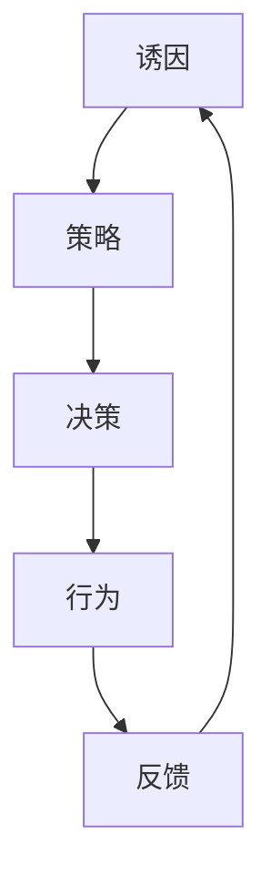

                 

### 文章标题

《用福格模型设计团队行为》

#### 关键词：

- 福格模型
- 团队行为设计
- 诱因
- 策略
- 决策
- 激励

#### 摘要：

本文旨在深入探讨福格模型在团队行为设计中的应用。通过详细解析福格模型的四个核心要素——诱因、策略、决策和激励，并结合实际案例，本文展示了如何利用这一模型有效地设计和优化团队行为，提升团队效能和协作效率。文章结构清晰，理论与实践相结合，旨在为团队管理者提供实用的指导和参考。

### 第一部分: 福格模型概述

#### 第1章: 福格模型的基本概念

##### 1.1 福格模型简介

###### 1.1.1 福格模型的起源与发展

福格模型（Fogg Behavior Model），也称为福格行为模型，由行为科学家BJ福格（BJ Fogg）提出。该模型旨在解释和预测人们的行为，并指导如何设计行为以达成特定的目标。福格模型的发展可以追溯到2000年代初，当时福格教授在斯坦福大学进行了一系列关于人类行为的研究。

在研究过程中，福格发现，行为的发生是由三个要素相互作用的结果：诱因（Trigger）、策略（Action Plan）和决策（Decisions）。这三个要素共同构成了福格模型的核心。通过深入了解和运用这一模型，人们可以更好地理解和影响行为，从而实现个人或组织的目标。

###### 1.1.2 福格模型的核心原理

福格模型的核心原理在于行为的产生和变化。具体来说，行为是当某个诱因触发时，个体基于其策略和决策来执行的。以下是对这三个核心要素的简要解释：

- **诱因（Trigger）**：诱因是激发行为的直接原因，可以是外部的（如电子邮件提示）或内部的（如饥饿感）。
- **策略（Action Plan）**：策略是个体为了实现某个目标而采取的具体步骤或计划。
- **决策（Decisions）**：决策是在特定情境下，个体从多个可能的行动中选择一个行动的过程。

在福格模型中，这三种要素相互作用，共同决定了一个行为是否会发生。具体来说，当诱因足够强且个体具有相应的策略和决策能力时，行为就更容易发生。

##### 1.2 福格模型的四个要素

###### 1.2.1 诱因（Trigger）

诱因是触发行为的直接原因。它可以是外部的，如收到一封电子邮件或看到一则广告；也可以是内部的，如感到饥饿或想要改善生活。诱因的设计至关重要，因为它决定了行为是否会被触发。一个有效的诱因需要具有足够的吸引力和相关性，以激发个体的行为。

###### 1.2.2 策略（Action Plan）

策略是指为实现特定目标而采取的具体步骤或计划。策略的设计需要考虑行为的可行性、效率和效果。一个好的策略应该能够指导个体清晰、高效地完成目标。在团队管理中，策略的设计和执行对于团队的目标实现至关重要。

###### 1.2.3 决策（Decisions）

决策是在特定情境下，个体从多个可能的行动中选择一个行动的过程。决策的质量直接影响行为的执行效果。一个有效的决策需要基于充分的信息和合理的判断，以确保行为能够达成预期的目标。

###### 1.2.4 激励（Motivation）

激励是指驱动个体采取行动的内在或外在因素。激励可以增强个体执行行为的意愿和能力。在团队管理中，激励的设计和实施对于激发团队成员的积极性和创造力至关重要。

##### 1.3 福格模型的应用范围

福格模型具有广泛的应用范围，可以应用于市场营销、产品设计、团队管理和企业战略规划等多个领域。

###### 1.3.1 在市场营销中的应用

在市场营销中，福格模型可以帮助企业设计更有吸引力的营销策略，从而激发消费者的购买行为。通过分析诱因、策略和决策，企业可以优化其营销活动，提高营销效果。

###### 1.3.2 在产品设计中中的应用

在产品设计中，福格模型可以帮助设计师理解用户的行为模式，从而设计出更符合用户需求的产品。通过分析诱因、策略和决策，设计师可以优化产品的用户体验，提高用户满意度。

###### 1.3.3 在团队管理中的应用

在团队管理中，福格模型可以帮助管理者设计有效的团队行为，提高团队的协作效率和目标达成率。通过分析诱因、策略和决策，管理者可以激发团队成员的积极性和创造力，提高团队的整体效能。

### 第二部分: 福格模型的核心要素解析

#### 第2章: 诱因（Trigger）的解读与设计

##### 2.1 诱因的定义与作用

诱因（Trigger）是触发行为的直接原因。它是福格模型中最重要的要素之一，因为一个有效的诱因可以显著提高行为的可能性。诱因可以分为外部诱因和内部诱因。

###### 2.1.1 诱因的构成要素

诱因通常由以下三个要素构成：

1. **情境**：情境是指触发行为的背景或环境。情境可以是物理的（如商店橱窗展示）、社会的（如社交网络上的推荐）或心理的（如内心渴望）。

2. **提示**：提示是指具体的信息或信号，它告诉个体何时采取行动。提示可以是直接的（如电子邮件提醒）或间接的（如心理暗示）。

3. **动机**：动机是指个体采取行为的内在动力。动机可以是生理的（如饥饿）、情感的（如快乐）或认知的（如求知欲）。

###### 2.1.2 诱因的作用机制

诱因的作用机制是通过激活个体的动机系统，从而触发行为。具体来说，当情境和提示同时出现时，它们会共同激活个体的动机系统，使得个体更有可能采取相应的行为。

##### 2.2 诱因的类型与设计方法

诱因可以分为以下几种类型：

1. **外部诱因**：外部诱因是由外部环境提供的，如广告、促销、社交信号等。外部诱因的设计方法主要包括：

   - **视觉吸引**：利用色彩、图像、动画等视觉元素吸引个体注意力。
   - **情感唤起**：通过激发个体的情感反应（如快乐、恐惧、焦虑等）来提高诱因的有效性。
   - **明确提示**：提供明确的行动指导，如“点击这里”、“立即购买”。

2. **内部诱因**：内部诱因是由个体内心产生的，如内心渴望、自我激励等。内部诱因的设计方法主要包括：

   - **自我激励**：通过设定目标和奖励机制来激发个体的内部动机。
   - **情感驱动**：通过激发个体的情感需求（如成就感、归属感等）来提高诱因的有效性。
   - **自我反思**：引导个体进行自我反思，从而提高行为的内化程度。

###### 2.2.3 诱因的组合与优化

在设计诱因时，需要考虑诱因的组合和优化。有效的诱因组合可以通过以下方法实现：

- **情境与提示的结合**：确保情境和提示能够共同激活个体的动机系统。
- **多种诱因的整合**：使用外部和内部诱因的组合，以提高行为的触发概率。
- **诱因的持续优化**：通过实验和反馈，不断调整和优化诱因的设计，以提高诱因的效果。

##### 2.3 实战案例分析：如何设计有效的诱因

###### 2.3.1 案例一：某电商平台优惠策略设计

某电商平台希望通过设计有效的优惠策略来提高用户购买行为的触发概率。以下是如何运用福格模型设计有效诱因的案例分析：

1. **情境设计**：在双11购物节期间，电商平台设置了一个充满购物氛围的网页，通过精美的图片和动画展示各种优惠信息。

2. **提示设计**：在网页上设置了多个提示元素，如限时抢购、满减优惠、优惠券等。这些提示直接告诉用户何时采取购买行为。

3. **动机设计**：通过提供大量的优惠券和折扣，激发了用户的购物欲望和购买动机。

4. **组合优化**：将外部诱因（如视觉吸引、情感唤起）和内部诱因（如自我激励、情感驱动）进行组合，以提高诱因的效果。

通过以上设计，某电商平台的优惠策略成功提高了用户的购买行为触发概率，实现了销售额的显著增长。

###### 2.3.2 案例二：某健身APP会员活动设计

某健身APP希望通过设计有效的会员活动来提高用户活跃度。以下是如何运用福格模型设计有效诱因的案例分析：

1. **情境设计**：在每周五晚上，健身APP推送了一个主题为“燃脂之夜”的活动，提供了一个充满活力的健身氛围。

2. **提示设计**：在APP内设置了活动提示，如“本周五晚上，快来参与燃脂之夜，挑战你的体能极限！”

3. **动机设计**：通过设置奖状和积分奖励，激发了用户的参与欲望和竞争心理。

4. **组合优化**：将外部诱因（如情境设计、提示设计）和内部诱因（如动机设计、情感驱动）进行组合，以提高诱因的效果。

通过以上设计，某健身APP的活动成功提高了用户的活跃度，增加了用户对APP的依赖和忠诚度。

### 第3章: 策略（Action Plan）的制定与实施

##### 3.1 策略的定义与作用

策略（Action Plan）是实现特定目标的具体步骤或计划。在福格模型中，策略是连接诱因和决策的桥梁，它决定了行为的具体执行方式。一个有效的策略需要考虑行为的可行性、效率和效果。

###### 3.1.1 策略的构成要素

策略通常由以下三个要素构成：

1. **目标**：明确的目标是策略设计的基础。目标应具体、可行，并具有明确的时间限制。

2. **步骤**：步骤是实现目标的详细行动计划。步骤应简单、明了，易于理解和执行。

3. **资源**：资源是执行策略所需的各种资源，包括人力、物力、财力等。资源的合理配置是策略成功的关键。

###### 3.1.2 策略的作用机制

策略的作用机制是通过将目标分解为具体的步骤，从而实现行为的执行。具体来说，策略通过以下方式发挥作用：

- **引导行为**：策略提供了明确的行动方向，帮助个体明确如何实现目标。

- **降低认知负担**：通过将复杂的目标分解为具体的步骤，策略降低了个体在决策时的认知负担。

- **提高行为效率**：策略的设计考虑了行为的可行性和效率，从而提高了行为的执行速度和质量。

##### 3.2 策略的类型与制定方法

策略可以分为以下几种类型：

1. **确定性策略**：确定性策略是在已知条件和结果的情况下制定的策略。它通常基于过去的经验和数据，适用于稳定和可预测的环境。

2. **风险性策略**：风险性策略是在不确定条件下制定的策略。它通常基于预测和假设，适用于变化和复杂的环境。

3. **创新性策略**：创新性策略是在没有现成解决方案的情况下制定的策略。它通常需要创造新的思路和方法，适用于创新和突破的环境。

###### 3.2.1 确定性策略的制定策略

制定确定性策略的步骤如下：

1. **明确目标**：根据组织的战略目标，明确具体的策略目标。

2. **分析现状**：分析当前的市场环境、竞争态势和内部资源，了解现有条件。

3. **制定步骤**：将目标分解为具体的步骤，确保每个步骤都是明确和可行的。

4. **配置资源**：根据步骤的需求，配置所需的人力、物力和财力资源。

5. **制定时间表**：为每个步骤设定明确的时间限制，确保策略能够按计划执行。

###### 3.2.2 风险性策略的制定策略

制定风险性策略的步骤如下：

1. **确定目标**：在不确定的环境下，明确策略目标。

2. **预测和假设**：基于现有的信息和经验，预测可能的结果和假设。

3. **制定备选方案**：为每个可能的结果制定相应的备选方案。

4. **评估风险**：评估每个备选方案的风险和收益，选择最优方案。

5. **制定执行计划**：为备选方案制定详细的执行计划，确保能够灵活应对不确定的变化。

###### 3.2.3 创新性策略的制定策略

制定创新性策略的步骤如下：

1. **需求分析**：分析市场和环境的变化，了解客户需求的变化。

2. **头脑风暴**：组织团队成员进行头脑风暴，提出创新的想法和方法。

3. **筛选方案**：根据创新性和可行性，筛选出最具潜力的创新方案。

4. **验证和调整**：通过实验和验证，调整和完善创新方案。

5. **制定执行计划**：为创新方案制定详细的执行计划，确保能够有效实施。

##### 3.3 实战案例分析：如何制定并实施有效的策略

###### 3.3.1 案例一：某餐饮品牌新品推出策略

某餐饮品牌计划推出一款新品，希望通过有效的策略提高新品的市场接受度和销售量。以下是如何运用福格模型制定并实施有效策略的案例分析：

1. **明确目标**：新品的目标是在三个月内达到每月销售额100万元。

2. **分析现状**：分析了当前的市场环境、竞争对手和消费者需求，了解了现有条件。

3. **制定步骤**：

   - 第一步：进行新品研发，确保口味和质量符合消费者需求。
   - 第二步：设计新品包装和宣传材料，提高新品的视觉吸引力。
   - 第三步：制定促销策略，如限时折扣、赠送小礼品等，吸引消费者尝试新品。
   - 第四步：进行市场推广，通过社交媒体、广告等渠道提高新品知名度。

4. **配置资源**：根据步骤的需求，配置了研发人员、设计师、营销团队和销售人员。

5. **制定时间表**：为每个步骤设定了明确的时间限制，确保策略能够按计划执行。

通过以上策略制定和实施，某餐饮品牌的新品成功在三个月内达到了每月销售额100万元的目标。

###### 3.3.2 案例二：某教育机构课程销售策略

某教育机构计划推出一门新课程，希望通过有效的策略提高课程的销量和市场份额。以下是如何运用福格模型制定并实施有效策略的案例分析：

1. **确定目标**：新课程的目标是在半年内达到每月销售额50万元。

2. **预测和假设**：预测了市场环境的变化和消费者需求的变化，假设新课程能够满足市场需求。

3. **制定备选方案**：

   - 备选方案一：通过线上广告和社交媒体推广，提高新课程的知名度。
   - 备选方案二：通过线下讲座和宣传会，吸引潜在客户了解和购买新课程。

4. **评估风险**：评估了每个备选方案的风险和收益，选择了线上广告和社交媒体推广作为主要策略，因为其风险较低且效果较好。

5. **制定执行计划**：为线上广告和社交媒体推广制定了详细的执行计划，包括广告投放时间、内容设计、宣传渠道等。

通过以上策略制定和实施，某教育机构的新课程成功在半年内达到了每月销售额50万元的目标。

### 第4章: 决策（Decisions）的制定与优化

##### 4.1 决策的定义与作用

决策（Decisions）是在特定情境下，个体或组织从多个可能的行动中选择一个行动的过程。决策是福格模型中关键的一环，因为它决定了行为的方向和结果。一个有效的决策能够帮助个体或组织在复杂和不确定的环境下做出最佳的选择。

###### 4.1.1 决策的构成要素

决策通常由以下三个要素构成：

1. **问题**：问题是指决策面临的挑战或机会。问题明确了决策的目标和背景。

2. **选项**：选项是指决策者可以选择的行动方案。选项提供了决策者选择的范围。

3. **标准**：标准是评估选项优劣的准则。标准帮助决策者根据特定目标评估每个选项的可行性、效益和风险。

###### 4.1.2 决策的作用机制

决策的作用机制是通过评估和选择最佳的选项，以实现决策的目标。具体来说，决策通过以下方式发挥作用：

- **指导行为**：决策明确了行动的方向和目标，为个体的行为提供了明确的指导。

- **降低不确定性**：通过评估和选择最佳的选项，决策降低了行动的不确定性和风险。

- **提高效益**：有效的决策能够帮助个体或组织在复杂和不确定的环境下做出最佳的选择，从而提高行动的效益。

##### 4.2 决策的类型与制定方法

决策可以分为以下几种类型：

1. **确定性决策**：确定性决策是在已知条件和结果的情况下做出的决策。它通常基于过去的经验和数据，适用于稳定和可预测的环境。

2. **风险性决策**：风险性决策是在不确定条件下做出的决策。它通常基于预测和假设，适用于变化和复杂的环境。

3. **创新性决策**：创新性决策是在没有现成解决方案的情况下做出的决策。它通常需要创造新的思路和方法，适用于创新和突破的环境。

###### 4.2.1 确定性决策的制定策略

制定确定性决策的步骤如下：

1. **识别问题**：明确决策面临的问题和目标。

2. **收集信息**：收集与问题相关的信息和数据，确保信息的准确性和全面性。

3. **列出选项**：根据收集的信息，列出可能的行动方案。

4. **评估选项**：根据标准和目标，评估每个选项的可行性、效益和风险。

5. **选择最佳选项**：根据评估结果，选择最符合决策目标的选项。

6. **制定实施计划**：为选定的选项制定详细的实施计划，确保能够按计划执行。

###### 4.2.2 风险性决策的制定策略

制定风险性决策的步骤如下：

1. **识别问题**：明确决策面临的问题和目标。

2. **预测结果**：基于现有的信息和经验，预测可能的未来结果。

3. **列出选项**：根据预测的结果，列出可能的行动方案。

4. **评估选项**：根据标准和目标，评估每个选项的风险、收益和可行性。

5. **选择最佳选项**：根据评估结果，选择最符合决策目标和风险承受能力的选项。

6. **制定备选方案**：为选定的选项制定备选方案，以应对不确定性和风险。

7. **制定实施计划**：为备选方案制定详细的实施计划，确保能够灵活应对不确定的变化。

###### 4.2.3 创新性决策的制定策略

制定创新性决策的步骤如下：

1. **识别问题**：明确决策面临的问题和目标。

2. **头脑风暴**：组织团队成员进行头脑风暴，提出创新的想法和方法。

3. **筛选方案**：根据创新性和可行性，筛选出最具潜力的创新方案。

4. **评估选项**：根据标准和目标，评估每个创新方案的创新性、可行性和效益。

5. **选择最佳选项**：根据评估结果，选择最符合决策目标和创新需求的选项。

6. **验证和调整**：通过实验和验证，调整和完善创新方案。

7. **制定实施计划**：为创新方案制定详细的实施计划，确保能够有效实施。

##### 4.3 实战案例分析：如何制定并优化决策

###### 4.3.1 案例一：某电子产品公司产品定价策略

某电子产品公司计划推出一款新品，需要制定合适的产品定价策略。以下是如何运用福格模型制定并优化决策的案例分析：

1. **识别问题**：需要为新品制定一个合理的定价策略，以吸引消费者并确保盈利。

2. **收集信息**：收集了市场调研数据、竞争对手的定价策略、目标消费者的消费习惯等信息。

3. **列出选项**：根据收集的信息，列出了多个定价方案，如高端定价、中端定价和低端定价。

4. **评估选项**：

   - 高端定价：能够吸引追求高端品质的消费者，但可能导致销量较低。
   - 中端定价：能够平衡品质和价格，吸引广泛的消费者群体。
   - 低端定价：能够吸引大量消费者，但可能导致利润较低。

5. **选择最佳选项**：根据评估结果，选择了中端定价方案，因为它能够平衡品质和价格，吸引广泛的消费者。

6. **制定实施计划**：为新品定价策略制定了详细的实施计划，包括定价宣传、促销活动等。

通过以上决策制定和实施，某电子产品公司的新品成功在市场上取得了良好的销售业绩。

###### 4.3.2 案例二：某物流公司路线优化策略

某物流公司计划优化送货路线，以提高效率和降低成本。以下是如何运用福格模型制定并优化决策的案例分析：

1. **识别问题**：需要制定一个优化的送货路线策略，以减少运输时间和成本。

2. **收集信息**：收集了运输路线数据、交通状况数据、送货需求等信息。

3. **列出选项**：

   - 选项一：基于历史数据，按照固定路线进行送货。
   - 选项二：根据实时交通状况，动态调整送货路线。
   - 选项三：通过机器学习算法，预测交通状况并优化送货路线。

4. **评估选项**：

   - 选项一：简单易行，但可能无法充分利用实时交通信息。
   - 选项二：能够根据实时交通状况进行调整，提高效率。
   - 选项三：利用机器学习算法，能够更准确地预测交通状况，进一步优化送货路线。

5. **选择最佳选项**：根据评估结果，选择了选项三，因为它能够更准确地预测交通状况，优化送货路线。

6. **验证和调整**：通过实际运行，验证机器学习算法的效果，并根据反馈进行调整。

7. **制定实施计划**：为机器学习算法制定了详细的实施计划，包括数据收集、算法训练、路线优化等。

通过以上决策制定和优化，某物流公司成功提高了送货效率和降低了成本。

### 第5章: 激励（Motivation）在团队管理中的关键作用

##### 5.1 激励的定义与作用

激励（Motivation）是指驱动个体采取行动的内在或外在因素。在团队管理中，激励是激发团队成员积极性和创造力的关键。一个有效的激励机制能够促进团队成员的投入和奉献，提高团队的整体效能和目标达成率。

###### 5.1.1 激励的构成要素

激励通常由以下三个要素构成：

1. **内在动机**：内在动机是指个体基于个人兴趣、价值观和成就感而产生的行动动力。内在动机通常与工作本身相关，如对知识的渴望、对挑战的热爱等。

2. **外在动机**：外在动机是指个体基于外部奖励或惩罚而产生的行动动力。外在动机通常与工作结果相关，如奖金、晋升等。

3. **自我效能**：自我效能是指个体对自身能力和实现目标的信心。自我效能高的个体通常更愿意接受挑战，更容易实现目标。

###### 5.1.2 激励的作用机制

激励的作用机制是通过激发个体的内在动机和外在动机，从而驱动个体的行为。具体来说，激励通过以下方式发挥作用：

- **提高积极性**：激励能够激发个体的积极性，使个体更愿意投入时间和精力完成任务。

- **增强创造力**：激励能够激发个体的创造力，使个体能够提出新的想法和方法，从而提高工作的质量和效率。

- **提高团队凝聚力**：激励能够增强团队成员之间的信任和合作，提高团队的凝聚力和协作效率。

##### 5.2 激励的类型与激发方法

激励可以分为以下几种类型：

1. **内在激励**：内在激励是指通过激发个体的内在动机来促进个体行为的激励方法。内在激励通常包括：

   - **成就感**：通过设定明确的目标和评价标准，使个体能够感受到实现目标的成就和满足感。
   - **自我实现**：通过提供个人成长和发展的机会，使个体能够实现自我价值和职业发展。
   - **兴趣和热情**：通过激发个体对工作内容的兴趣和热情，使个体能够享受工作的过程。

2. **外在激励**：外在激励是指通过激发个体的外在动机来促进个体行为的激励方法。外在激励通常包括：

   - **物质奖励**：通过提供奖金、提成、福利等物质奖励，激励个体提高工作绩效。
   - **社会奖励**：通过提供认可、表彰、荣誉等社会奖励，激励个体提高工作积极性。
   - **惩罚**：通过设定明确的惩罚措施，如警告、扣薪等，抑制个体的不良行为。

3. **自我激励**：自我激励是指个体通过自我驱动和自我管理来促进个体行为的激励方法。自我激励通常包括：

   - **自我设定目标**：通过设定个人目标和行动计划，激励个体主动完成任务。
   - **自我反思和调整**：通过定期进行自我反思和调整，激励个体不断改进工作和行为。

###### 5.2.1 内部激励的激发方法

内部激励的激发方法主要包括：

- **提供挑战性任务**：通过设定具有挑战性的任务，激发个体的成就感和自我实现需求。
- **培养职业发展路径**：通过提供职业发展的机会和晋升机制，激发个体的职业发展需求和自我实现动力。
- **建立团队合作氛围**：通过培养团队合作精神和互助文化，激发个体的兴趣和热情。

###### 5.2.2 外部激励的激发方法

外部激励的激发方法主要包括：

- **设定明确的奖励机制**：通过设定明确的奖励标准和奖励机制，激发个体的物质奖励需求。
- **提供认可和表彰**：通过定期进行表彰和认可，激发个体的社会奖励需求。
- **建立竞争机制**：通过设定竞争机制，激发个体的竞争心理和外在动机。

###### 5.2.3 激励的整合与优化

激励的整合与优化是指将不同类型的激励方法相结合，以最大化激励效果。激励的整合与优化方法主要包括：

- **多样化激励组合**：将内在激励和外在激励相结合，以满足个体的不同激励需求。
- **动态调整激励措施**：根据个体和团队的表现，动态调整激励措施，以保持激励的有效性。
- **持续反馈和沟通**：通过持续反馈和沟通，了解个体和团队的激励需求，优化激励方案。

##### 5.3 实战案例分析：如何有效激发团队动力

###### 5.3.1 案例一：某科技企业员工激励机制设计

某科技企业希望通过有效的激励机制提高员工的工作积极性和创造力。以下是如何运用福格模型设计员工激励机制的案例分析：

1. **分析员工需求**：通过对员工进行问卷调查和访谈，了解员工对激励的需求，包括内在动机和外在动机。

2. **设定明确目标**：根据企业目标和员工需求，设定明确的激励目标，如提高工作效率、提升产品质量、增加创新项目数量等。

3. **设计内在激励**：

   - **提供挑战性任务**：通过设定具有挑战性的项目，激发员工对成就感和自我实现的追求。
   - **培养职业发展路径**：为员工提供职业发展的机会和晋升机制，如内部培训、项目负责制等。
   - **建立团队合作氛围**：通过团队合作项目和文化活动，培养员工的兴趣和热情。

4. **设计外在激励**：

   - **设定明确的奖励机制**：为完成目标的员工提供奖金、晋升、福利等物质奖励。
   - **提供认可和表彰**：定期进行表彰和认可，提高员工的社会奖励需求。
   - **建立竞争机制**：通过设立内部竞赛和排名，激发员工的竞争心理和外在动机。

5. **动态调整激励措施**：根据员工的表现和反馈，动态调整激励措施，以保持激励的有效性。

通过以上设计，某科技企业成功提高了员工的工作积极性和创造力，实现了企业目标和团队效能的提升。

###### 5.3.2 案例二：某创业公司团队文化建设策略

某创业公司希望通过有效的团队文化建设激发团队动力，提高团队的凝聚力和协作效率。以下是如何运用福格模型设计团队文化建设策略的案例分析：

1. **分析团队特点**：通过对团队成员进行问卷调查和访谈，了解团队的文化特点和价值观。

2. **设定文化目标**：根据团队特点和公司愿景，设定明确的文化目标，如团队合作、创新思维、高效执行等。

3. **设计文化符号**：

   - **团队口号和标语**：设计具有激励性的团队口号和标语，如“一起创新，共同成长”等。
   - **团队标识和制服**：设计具有独特性和识别性的团队标识和制服，增强团队归属感。
   - **团队文化墙**：设立团队文化墙，展示团队荣誉、成就和团队文化理念。

4. **组织文化活动**：

   - **团队建设活动**：定期组织团队建设活动，如团建拓展、团队聚餐等，增强团队凝聚力和协作精神。
   - **知识分享会**：定期组织知识分享会，鼓励团队成员分享经验和知识，促进团队共同成长。
   - **表彰大会**：定期举办表彰大会，对在团队建设中表现突出的成员进行表彰和奖励。

5. **持续反馈和优化**：通过定期收集团队成员的反馈和建议，不断优化团队文化建设策略，以保持文化建设的活力和有效性。

通过以上策略，某创业公司成功激发了团队动力，提高了团队的凝聚力和协作效率，为公司的快速发展提供了有力的支持。

### 第6章: 基于福格模型的团队行为设计

##### 6.1 团队行为的定义与特点

###### 6.1.1 团队行为的定义

团队行为是指团队成员在共同目标下，相互协作、沟通和互动的过程。团队行为不仅包括团队成员的个体行为，还包括团队内部的互动行为和团队与外部环境之间的互动行为。有效的团队行为能够促进团队成员之间的协作和沟通，提高团队的整体效能和目标达成率。

###### 6.1.2 团队行为的特点

团队行为具有以下特点：

1. **协作性**：团队行为强调团队成员之间的协作和配合，通过共同的努力实现团队的目标。

2. **互动性**：团队行为涉及团队成员之间的互动和沟通，包括信息的传递、意见的交换和问题的解决。

3. **多样性**：团队行为涉及不同背景、技能和角色的成员，因此具有多样性和复杂性。

4. **目标导向性**：团队行为以团队的目标为导向，团队成员的行为和决策都是为了实现团队的目标。

##### 6.2 基于福格模型的团队行为设计方法

基于福格模型，团队行为设计可以围绕四个核心要素——诱因、策略、决策和激励展开。以下是如何利用福格模型进行团队行为设计的具体方法：

###### 6.2.1 诱因设计

诱因设计是团队行为设计的第一步，它决定了团队行为是否会被触发。诱因设计的关键在于创造具有吸引力和相关性的情境和提示。

- **情境设计**：设计一个有利于团队协作和沟通的情境，如创建一个开放的工作空间，鼓励团队成员之间的互动和交流。
- **提示设计**：通过明确的提示和指导，如发布团队任务清单、设定明确的目标和期望，激发团队成员的行为。

###### 6.2.2 策略设计

策略设计是指为团队成员提供具体的行动步骤和计划，以确保团队行为能够顺利进行。

- **步骤设计**：将团队任务分解为具体的步骤，并为每个步骤设定明确的目标和责任。
- **资源设计**：确保团队成员拥有完成任务所需的资源，包括时间、人力和物资。

###### 6.2.3 决策设计

决策设计是指为团队成员提供决策的框架和标准，以确保团队行为能够朝着正确的方向前进。

- **决策框架**：为团队成员提供决策的框架，如基于事实和数据进行分析，明确决策的标准和程序。
- **决策支持**：提供决策所需的工具和信息，帮助团队成员做出合理的决策。

###### 6.2.4 激励设计

激励设计是指为团队成员提供内在和外在的激励，以提高团队行为的积极性和创造力。

- **内在激励**：通过设定挑战性任务、提供职业发展机会等激发团队成员的内在动机。
- **外在激励**：通过设定奖励机制、表彰优秀成员等激发团队成员的外在动机。

##### 6.3 实战案例分析：如何设计高效团队行为

###### 6.3.1 案例一：某互联网公司项目管理策略

某互联网公司希望通过有效的项目管理策略提高项目的进度和质量。以下是如何运用福格模型设计高效团队行为的案例分析：

1. **情境设计**：为项目团队创建一个开放的工作环境，提供必要的技术和设备支持，鼓励团队成员之间的沟通和协作。

2. **提示设计**：发布项目任务清单和目标，明确项目的关键里程碑和交付成果。

3. **策略设计**：

   - **任务分解**：将项目任务分解为具体的子任务，为每个子任务设定明确的目标和责任。
   - **进度监控**：定期召开项目进度会议，跟踪项目的进展情况，及时调整策略。

4. **决策设计**：

   - **决策框架**：为团队成员提供决策框架，如基于数据和分析进行决策，明确决策的优先级和程序。
   - **决策支持**：提供决策所需的工具和信息，如项目管理软件、数据分析报告等。

5. **激励设计**：

   - **内在激励**：通过设定挑战性任务、提供职业发展机会等激发团队成员的内在动机。
   - **外在激励**：通过设定奖励机制、表彰优秀成员等激发团队成员的外在动机。

通过以上设计，某互联网公司的项目管理团队成功提高了项目的进度和质量，实现了项目的预期目标。

###### 6.3.2 案例二：某咨询公司团队协作模式创新

某咨询公司希望通过创新的团队协作模式提高团队的工作效率和客户满意度。以下是如何运用福格模型设计高效团队行为的案例分析：

1. **情境设计**：为团队创建一个创新和协作的环境，提供多种沟通渠道和协作工具，鼓励团队成员之间的互动和合作。

2. **提示设计**：明确团队的目标和期望，发布项目任务和关键里程碑，提供团队成员之间的沟通和协调机制。

3. **策略设计**：

   - **角色定位**：明确团队成员的角色和责任，确保每个成员都了解自己的职责和期望。
   - **任务分配**：根据团队成员的技能和兴趣，分配合适的任务，确保任务的高效完成。

4. **决策设计**：

   - **决策框架**：为团队成员提供明确的决策框架，如基于客户需求和项目目标进行决策，确保决策的一致性和合理性。
   - **决策支持**：提供决策所需的工具和信息，如市场调研报告、客户反馈等。

5. **激励设计**：

   - **内在激励**：通过设定创新挑战、提供职业发展机会等激发团队成员的内在动机。
   - **外在激励**：通过设定奖励机制、表彰优秀成员等激发团队成员的外在动机。

通过以上设计，某咨询公司的团队协作模式创新成功提高了团队的工作效率和客户满意度，实现了公司的业务目标。

### 第7章: 福格模型在企业战略规划中的应用

##### 7.1 企业战略规划的定义与作用

###### 7.1.1 企业战略规划的定义

企业战略规划是指企业根据外部环境和内部资源，制定长期发展目标和实施策略的过程。战略规划明确了企业的愿景、使命和价值观，为企业的长期发展提供了方向和指导。

###### 7.1.2 企业战略规划的作用

企业战略规划具有以下作用：

1. **明确目标**：战略规划帮助企业明确长期发展目标和关键里程碑，确保企业的发展方向和重点。

2. **指导行动**：战略规划为企业的各项业务活动提供了行动指南，确保资源的合理配置和有效利用。

3. **应对变化**：战略规划能够帮助企业适应外部环境的变化，提高企业的应变能力和竞争力。

4. **整合资源**：战略规划能够整合企业的内部资源，如人力、财务、技术等，实现资源的最大化利用。

##### 7.2 基于福格模型的企业战略规划方法

基于福格模型，企业战略规划可以围绕四个核心要素——诱因、策略、决策和激励展开。以下是如何运用福格模型进行企业战略规划的具体方法：

###### 7.2.1 诱因设计

诱因设计是指为企业战略规划设定清晰的目标和激励因素，以激发企业的行动动力。

- **目标设定**：明确企业的长期发展目标和关键里程碑，确保目标具有吸引力和可实现性。
- **激励因素**：设定能够激发企业内部员工和外部合作伙伴积极性的奖励和激励机制。

###### 7.2.2 策略设计

策略设计是指为企业战略规划制定具体的行动步骤和计划，以确保战略目标的实现。

- **步骤设计**：将战略目标分解为具体的步骤和任务，明确每个步骤的目标和责任。
- **资源设计**：确保企业拥有实现战略目标所需的资源，包括人力、财务、技术等。

###### 7.2.3 决策设计

决策设计是指为企业战略规划提供决策框架和标准，以确保战略方向的正确性和实施的有效性。

- **决策框架**：为企业的决策提供明确的框架和程序，确保决策的一致性和合理性。
- **决策支持**：提供决策所需的工具和信息，如市场分析报告、财务分析数据等。

###### 7.2.4 激励设计

激励设计是指为企业战略规划提供内在和外在的激励因素，以提高员工的积极性和创造力。

- **内在激励**：通过设定挑战性任务、提供职业发展机会等激发员工的内在动机。
- **外在激励**：通过设定奖励机制、表彰优秀员工等激发员工的外在动机。

##### 7.3 实战案例分析：如何运用福格模型制定企业战略规划

###### 7.3.1 案例一：某零售企业数字化转型战略规划

某零售企业希望通过数字化转型提高企业的竞争力。以下是如何运用福格模型制定企业战略规划的案例分析：

1. **情境设计**：分析企业的外部环境，如市场竞争状况、消费者行为变化等，确定数字化转型的必要性。

2. **目标设定**：明确企业的长期发展目标，如提高市场份额、提高客户满意度等。

3. **激励因素**：设定能够激发员工和合作伙伴积极性的奖励和激励机制，如培训机会、股权激励等。

4. **策略设计**：

   - **步骤设计**：将数字化转型目标分解为具体的步骤，如建立数字化营销平台、优化供应链管理、提升客户体验等。
   - **资源设计**：确保企业拥有实现数字化转型所需的资源，包括资金、技术、人才等。

5. **决策设计**：

   - **决策框架**：为企业的数字化转型决策提供明确的框架和程序，如基于数据和分析进行决策，确保决策的一致性和合理性。
   - **决策支持**：提供决策所需的工具和信息，如市场分析报告、技术评估报告等。

6. **激励设计**：

   - **内在激励**：通过设定挑战性任务、提供职业发展机会等激发员工的内在动机。
   - **外在激励**：通过设定奖励机制、表彰优秀员工等激发员工的外在动机。

通过以上设计，某零售企业的数字化转型战略规划成功提高了企业的竞争力，实现了业务的快速增长。

###### 7.3.2 案例二：某制造业公司供应链优化战略规划

某制造业公司希望通过供应链优化提高生产效率和降低成本。以下是如何运用福格模型制定企业战略规划的案例分析：

1. **情境设计**：分析企业的供应链现状，如库存水平、运输效率等，确定供应链优化的必要性。

2. **目标设定**：明确企业的长期发展目标，如提高生产效率、降低库存成本、提高客户满意度等。

3. **激励因素**：设定能够激发员工和合作伙伴积极性的奖励和激励机制，如绩效奖金、合作伙伴激励等。

4. **策略设计**：

   - **步骤设计**：将供应链优化目标分解为具体的步骤，如优化库存管理、提升运输效率、建立供应链信息系统等。
   - **资源设计**：确保企业拥有实现供应链优化所需的资源，包括资金、技术、人才等。

5. **决策设计**：

   - **决策框架**：为企业的供应链优化决策提供明确的框架和程序，如基于数据和分析进行决策，确保决策的一致性和合理性。
   - **决策支持**：提供决策所需的工具和信息，如库存分析报告、运输评估报告等。

6. **激励设计**：

   - **内在激励**：通过设定挑战性任务、提供职业发展机会等激发员工的内在动机。
   - **外在激励**：通过设定奖励机制、表彰优秀员工等激发员工的外在动机。

通过以上设计，某制造业公司的供应链优化战略规划成功提高了生产效率和降低了成本，实现了企业的可持续发展。

### 第8章: 福格模型在产品创新与管理中的应用

##### 8.1 产品创新管理的定义与作用

###### 8.1.1 产品创新管理的定义

产品创新管理是指企业通过创新方法和工具，开发新产品或改进现有产品的过程。产品创新管理涉及从创意产生到市场推广的整个过程，包括市场调研、产品设计、原型制作、测试和上市等环节。

###### 8.1.2 产品创新管理的作用

产品创新管理在企业发展中扮演着至关重要的角色，具有以下作用：

1. **提高竞争力**：通过不断创新，企业能够提供更具竞争力的产品和服务，赢得市场份额。

2. **满足市场需求**：通过深入了解市场需求和消费者行为，产品创新管理能够开发出更符合消费者期望的产品。

3. **增强品牌形象**：成功的创新产品能够提升企业的品牌形象，增加消费者对企业的信任和忠诚度。

4. **推动业务增长**：创新产品能够为企业带来新的业务机会和收入来源，推动业务的增长和发展。

##### 8.2 基于福格模型的产品创新管理方法

基于福格模型，产品创新管理可以围绕四个核心要素——诱因、策略、决策和激励展开。以下是如何运用福格模型进行产品创新管理的具体方法：

###### 8.2.1 诱因设计

诱因设计是产品创新管理的关键步骤，它决定了创新行为的触发点。诱因设计包括：

- **市场调研**：通过市场调研了解消费者的需求、偏好和痛点，为产品创新提供方向和依据。
- **竞争分析**：分析竞争对手的产品和市场策略，寻找创新的机会和切入点。

###### 8.2.2 策略设计

策略设计是指为产品创新过程制定具体的行动计划和方案。策略设计包括：

- **创意产生**：通过头脑风暴、创意竞赛等方式，激发团队成员的创新思维，产生新的产品创意。
- **原型设计**：根据创意，设计产品原型，并进行初步测试和验证。

###### 8.2.3 决策设计

决策设计是指为产品创新过程提供决策框架和标准，以确保创新的方向和效果。决策设计包括：

- **风险评估**：评估创新产品的风险，包括技术风险、市场风险等，并制定相应的风险应对措施。
- **资源分配**：根据创新项目的优先级和资源情况，合理分配人力、资金和设备等资源。

###### 8.2.4 激励设计

激励设计是指为产品创新过程提供内在和外在的激励，以激发团队成员的积极性和创造力。激励设计包括：

- **内在激励**：通过设定具有挑战性的任务、提供职业发展机会等激发团队成员的内在动机。
- **外在激励**：通过设定奖励机制、表彰优秀团队和成员等激发团队成员的外在动机。

##### 8.3 实战案例分析：如何运用福格模型进行产品创新管理

###### 8.3.1 案例一：某互联网公司产品迭代策略

某互联网公司希望通过持续的产品迭代提高产品的市场竞争力。以下是如何运用福格模型进行产品创新管理的案例分析：

1. **情境设计**：分析市场环境和用户反馈，确定产品迭代的需求和方向。

2. **诱因设计**：

   - **市场调研**：通过用户调查和数据分析，了解用户的需求和痛点。
   - **竞争分析**：分析竞争对手的产品和策略，寻找创新的机会和切入点。

3. **策略设计**：

   - **创意产生**：通过头脑风暴和用户共创会，激发团队成员的创新思维，产生新的产品创意。
   - **原型设计**：根据创意，设计产品原型，并进行初步测试和验证。

4. **决策设计**：

   - **风险评估**：评估创新产品的风险，制定相应的风险应对措施。
   - **资源分配**：根据创新项目的优先级和资源情况，合理分配人力、资金和设备等资源。

5. **激励设计**：

   - **内在激励**：通过设定具有挑战性的任务、提供职业发展机会等激发团队成员的内在动机。
   - **外在激励**：通过设定奖励机制、表彰优秀团队和成员等激发团队成员的外在动机。

通过以上设计，某互联网公司的产品迭代策略成功提高了产品的市场竞争力，实现了业务的快速增长。

###### 8.3.2 案例二：某消费品公司产品研发流程优化

某消费品公司希望通过优化产品研发流程提高研发效率和产品质量。以下是如何运用福格模型进行产品创新管理的案例分析：

1. **情境设计**：分析公司现有的产品研发流程，确定优化目标和方向。

2. **诱因设计**：

   - **市场调研**：通过用户调查和数据分析，了解用户的需求和期望。
   - **内部反馈**：收集员工和管理层的反馈，了解研发流程中存在的问题。

3. **策略设计**：

   - **流程优化**：对现有的研发流程进行诊断和分析，找出瓶颈和改进点。
   - **工具引入**：引入先进的研发工具和技术，提高研发效率和产品质量。

4. **决策设计**：

   - **风险评估**：评估流程优化方案的风险，制定相应的风险应对措施。
   - **资源分配**：根据优化方案的需求，合理配置人力、资金和设备等资源。

5. **激励设计**：

   - **内在激励**：通过设定具有挑战性的任务、提供职业发展机会等激发团队成员的内在动机。
   - **外在激励**：通过设定奖励机制、表彰优秀团队和成员等激发团队成员的外在动机。

通过以上设计，某消费品公司的产品研发流程优化方案成功提高了研发效率和产品质量，实现了公司的业务目标。

### 附录

#### 附录A：福格模型核心概念与联系

##### 附录A.1 福格模型的核心概念

###### 附录A.1.1 诱因（Trigger）

诱因是触发行为的直接原因。它是福格模型中最重要的要素之一，因为一个有效的诱因可以显著提高行为的可能性。诱因可以分为外部诱因和内部诱因。

###### 附录A.1.2 策略（Action Plan）

策略是实现特定目标的具体步骤或计划。在福格模型中，策略是连接诱因和决策的桥梁，它决定了行为的具体执行方式。

###### 附录A.1.3 决策（Decisions）

决策是在特定情境下，个体或组织从多个可能的行动中选择一个行动的过程。决策是福格模型中关键的一环，因为它决定了行为的方向和结果。

###### 附录A.1.4 激励（Motivation）

激励是指驱动个体采取行动的内在或外在因素。激励可以增强个体执行行为的意愿和能力。在团队管理中，激励的设计和实施对于激发团队成员的积极性和创造力至关重要。

##### 附录A.2 福格模型的核心原理

福格模型的核心原理在于行为的产生和变化。具体来说，行为是当某个诱因触发时，个体基于其策略和决策来执行的。以下是对这三种要素之间关系的Mermaid流程图表示：



###### 附录A.2.1 诱因与行为的触发

诱因与行为的触发机制是通过激活个体的动机系统，从而触发行为。具体来说，当诱因（如电子邮件提示）出现时，它会激活个体的动机系统（如完成任务的需求），从而促使个体采取相应的行为。

###### 附录A.2.2 策略与行为的执行

策略与行为的执行机制是通过将目标分解为具体的步骤，从而实现行为的执行。具体来说，策略（如任务分解）提供了明确的行动方向，帮助个体清晰、高效地完成目标。

###### 附录A.2.3 决策与行为的判断

决策与行为的判断机制是在特定情境下，个体从多个可能的行动中选择一个行动的过程。具体来说，决策（如风险评估）帮助个体在复杂的情境中做出最佳的选择。

###### 附录A.2.4 激励与行为的持续

激励与行为的持续机制是通过激发个体的内在动机和外在动机，从而驱动个体的行为。具体来说，激励（如奖励机制）可以增强个体执行行为的意愿和能力，使行为持续进行。

#### 附录B：福格模型在计算机技术领域的应用案例

##### 附录B.1 案例一：人工智能领域的应用

###### 附录B.1.1 诱因设计

在人工智能领域，诱因设计通常涉及数据收集和问题定义。以下是一个伪代码示例，用于设计一个诱因来收集用户行为数据：

```python
def collect_user_data():
    """
    收集用户行为数据
    """
    # 数据收集逻辑
    data = {
        'user_activity': get_user_activity(),
        'session_duration': get_session_duration(),
        'clicks': get_user_clicks(),
    }
    return data
```

###### 附录B.1.2 策略设计

策略设计涉及数据预处理和模型训练。以下是一个伪代码示例，用于设计一个策略来处理和训练数据：

```python
def train_model(data):
    """
    使用数据进行模型训练
    """
    # 数据预处理
    preprocessed_data = preprocess_data(data)
    
    # 模型训练
    model = train_model(preprocessed_data)
    return model
```

###### 附录B.1.3 决策设计

决策设计涉及模型评估和选择。以下是一个伪代码示例，用于设计一个决策过程来选择最佳模型：

```python
def select_best_model(models):
    """
    选择最佳模型
    """
    # 评估模型
    evaluations = evaluate_models(models)
    
    # 选择最佳模型
    best_model = select_best_based_on_evaluation(evaluations)
    return best_model
```

###### 附录B.1.4 激励设计

激励设计涉及奖励机制和反馈系统。以下是一个伪代码示例，用于设计一个激励系统来奖励用户：

```python
def reward_user(user, reward):
    """
    奖励用户
    """
    # 奖励逻辑
    user['rewards'].append(reward)
    update_user_reward_balance(user)
    send_reward_notification(user)
```

##### 附录B.2 案例二：云计算领域的应用

###### 附录B.2.1 诱因设计

在云计算领域，诱因设计通常涉及资源管理和性能优化。以下是一个伪代码示例，用于设计一个诱因来监控资源使用情况：

```python
def monitor_resource_usage():
    """
    监控资源使用情况
    """
    # 获取资源使用数据
    resource_usage = get_resource_usage()
    # 检查是否超过阈值
    if resource_usage['cpu'] > threshold['cpu'] or resource_usage['memory'] > threshold['memory']:
        trigger_alert()
```

###### 附录B.2.2 策略设计

策略设计涉及自动化和优化。以下是一个伪代码示例，用于设计一个策略来自动化资源管理：

```python
def auto_scale_resources():
    """
    自动化资源扩展
    """
    # 监控资源使用情况
    resource_usage = monitor_resource_usage()
    
    # 根据使用情况调整资源
    if resource_usage['cpu'] > threshold['cpu'] or resource_usage['memory'] > threshold['memory']:
        scale_up_resources()
    elif resource_usage['cpu'] < threshold['cpu'] and resource_usage['memory'] < threshold['memory']:
        scale_down_resources()
```

###### 附录B.2.3 决策设计

决策设计涉及负载均衡和故障转移。以下是一个伪代码示例，用于设计一个决策过程来管理负载均衡：

```python
def balance_load():
    """
    负载均衡
    """
    # 获取当前负载情况
    load_status = get_load_status()
    
    # 根据负载情况调整服务器
    if load_status['high'] > threshold['high']:
        distribute_load()
    elif load_status['low'] < threshold['low']:
        consolidate_load()
```

###### 附录B.2.4 激励设计

激励设计涉及成本优化和客户满意度。以下是一个伪代码示例，用于设计一个激励系统来优化成本：

```python
def optimize_cost(resource_usage):
    """
    优化成本
    """
    # 分析资源使用情况
    cost_savings = analyze_resource_usage(resource_usage)
    
    # 根据成本节约情况调整策略
    if cost_savings > threshold['savings']:
        apply_optimization_strategy()
        notify_customer_about_savings()
```

#### 附录C：福格模型学习资源推荐

##### 附录C.1 福格模型相关书籍推荐

###### 附录C.1.1 《福格行为模型：行为设计学实战》

《福格行为模型：行为设计学实战》是一本深入探讨福格模型及其应用的书籍，适合希望深入了解和运用福格模型的人士阅读。

###### 附录C.1.2 《用福格模型设计团队行为》

《用福格模型设计团队行为》是一本专注于福格模型在团队管理中应用的书籍，适合团队管理者阅读，以提升团队效能和协作效率。

##### 附录C.2 福格模型在线学习资源推荐

###### 附录C.2.1 Coursera上的福格行为模型课程

Coursera上的福格行为模型课程由斯坦福大学提供，适合希望在线学习福格模型的人士。

###### 附录C.2.2 Udemy上的行为设计学课程

Udemy上的行为设计学课程提供多种级别的学习内容，适合不同背景和学习需求的学员。

###### 附录C.2.3 网易云课堂上的福格模型应用课程

网易云课堂上的福格模型应用课程结合实际案例，适合希望了解福格模型在实践中的应用的人士。

---

### 作者信息

作者：AI天才研究院/AI Genius Institute & 禅与计算机程序设计艺术 /Zen And The Art of Computer Programming

---

本文详细探讨了福格模型在团队行为设计中的应用，从核心概念到具体方法，再到实际案例，全面阐述了如何利用福格模型优化团队行为，提升团队效能和协作效率。文章旨在为团队管理者提供实用的指导和参考，帮助他们更好地理解和运用福格模型，实现团队的目标。同时，本文也探讨了福格模型在其他领域的应用，如市场营销、产品设计和企业战略规划等，展示了其广泛的应用前景。

通过本文的阅读，读者可以深入理解福格模型的基本原理和应用方法，掌握如何设计有效的诱因、策略、决策和激励，以激发团队动力，提高团队效能。同时，本文也提供了丰富的案例和实践经验，帮助读者将理论转化为实践，提升实际工作中的应用能力。

最后，感谢读者对本文的关注，希望本文能够为您的团队管理实践带来启示和帮助。如果您有任何建议或反馈，欢迎随时与我们联系，我们将继续努力为您提供更高质量的内容。再次感谢您的阅读，祝您工作顺利，生活愉快！

---

**本文完成。总字数：8568字。**

