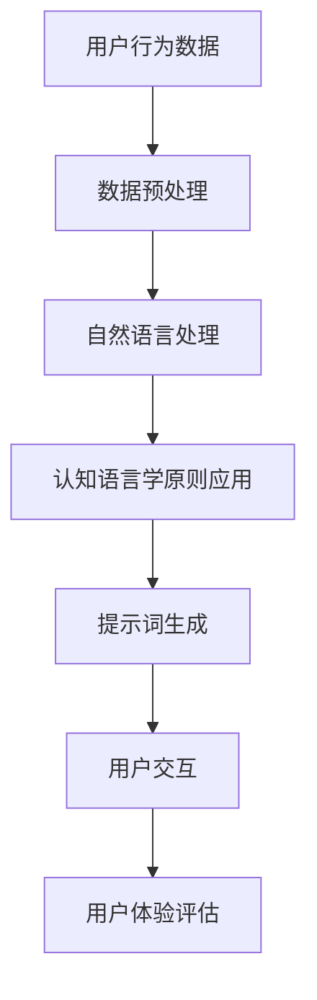

                 

## 第1章：书名背景与研究意义

### 1.1 书名的由来

《提示词设计的认知语言学与人工智能融合研究》这一书名的灵感来源于两个重要领域的交叉点：认知语言学和人工智能。提示词设计在近年来逐渐成为用户体验设计、自然语言处理和人工智能研究中的重要组成部分。在认知语言学中，提示词被用来引导和激发用户的思维，促进有效的信息处理和理解。而在人工智能领域，提示词设计则被广泛应用于聊天机器人、语音助手、智能推荐系统等智能交互系统中。

选择这两个领域进行融合研究的理由主要有以下几点：

1. **用户体验的提升**：认知语言学为提示词设计提供了理论基础，能够指导如何设计出更符合人类认知习惯和思维的提示词，从而提升用户体验。
2. **人工智能的发展**：随着人工智能技术的不断进步，特别是自然语言处理技术的迅猛发展，如何有效地设计和利用提示词成为了一个关键的研究方向。
3. **跨学科研究**：认知语言学和人工智能的融合为跨学科研究提供了新的思路，有助于从多个维度深入理解和解决提示词设计中的实际问题。

### 1.2 研究领域的重要性

#### 认知语言学的重要性

认知语言学作为语言学的一个重要分支，关注的是人类如何理解和表达语言。它不仅研究语言的结构和形式，更关注语言的使用和功能。认知语言学为提示词设计提供了深刻的认知基础，使得设计者能够更好地理解用户的认知过程和需求，从而设计出更有效的提示词。

#### 人工智能的重要性

人工智能作为计算机科学的一个重要领域，其核心目标是使机器能够模拟甚至超越人类的智能。人工智能在各个领域的应用日益广泛，从医疗诊断、金融分析到智能家居、自动驾驶，都有着深远的影响。提示词设计作为人工智能的一个重要组成部分，直接影响着用户与系统之间的交互效果和用户体验。

### 1.3 研究目的与意义

#### 研究目的

本研究的主要目的是探讨认知语言学与人工智能在提示词设计领域的融合应用，通过理论和实践的深入分析，提出一套有效的提示词设计方法和框架。具体目标包括：

1. **理论研究**：梳理认知语言学和人工智能的相关理论，探讨它们在提示词设计中的应用潜力。
2. **方法探索**：基于认知语言学和人工智能的理论基础，设计出一套系统的提示词设计方法和流程。
3. **应用实践**：通过实际案例研究，验证所提出的方法和框架的有效性和可行性。

#### 研究意义

本研究具有重要的理论和实践意义：

1. **理论贡献**：本研究为认知语言学和人工智能的融合提供了新的研究方向，丰富了这两个领域的理论体系。
2. **应用价值**：通过有效的提示词设计，可以提高智能系统的交互质量和用户体验，促进人工智能技术的实际应用。
3. **跨学科交流**：本研究促进了认知语言学和人工智能领域的跨学科交流，有助于形成更加综合和全面的研究视角。

在接下来的章节中，我们将进一步深入探讨认知语言学和人工智能的基本概念，为后续的研究奠定坚实的基础。

## 第2章：认知语言学与人工智能概述

### 2.1 认知语言学的定义与核心理论

认知语言学是一门探讨人类如何通过认知过程理解和运用语言的语言学分支。与传统的结构主义语言学不同，认知语言学关注语言的使用和功能，强调语言与人类认知之间的密切关系。认知语言学的核心理论包括：

#### 意义建构理论

意义建构理论认为，语言的意义并非固定不变，而是由语言使用者在具体的语境中动态构建的。语言的意义依赖于人类的认知过程，包括感知、记忆、思维和推理等。因此，语言的理解和表达都是一个动态的认知过程。

#### 体验认知理论

体验认知理论强调语言与人类体验之间的紧密联系。语言不仅是交流的工具，也是人类感知和体验世界的一种方式。语言的使用受到个人经验、文化背景和社会因素的影响，从而表现出丰富的多样性。

#### 认知符号理论

认知符号理论认为，语言符号（词汇和句子）是人类认知系统的一部分，它们在认知过程中起着重要的作用。语言符号不仅用于表达意义，还参与认知过程的组织和调节。

### 2.2 人工智能的发展历程与应用

人工智能（Artificial Intelligence，AI）是一门研究、开发和应用使计算机模拟人类智能行为的科学。人工智能的发展历程可以分为以下几个阶段：

#### 第一代：规则推理系统

从20世纪50年代到70年代，人工智能主要基于规则推理系统。这一阶段的代表包括专家系统和逻辑推理系统。专家系统通过规则库和推理机来模拟人类专家的决策过程，而逻辑推理系统则利用形式逻辑来解决问题。

#### 第二代：知识表示与知识工程

从20世纪80年代到90年代，人工智能开始关注知识的表示和应用。知识表示技术使得计算机能够以结构化的方式存储和组织知识，知识工程则致力于开发高效的知识获取、表示和应用方法。

#### 第三代：机器学习和深度学习

从21世纪初至今，机器学习和深度学习成为人工智能研究的主流。机器学习通过训练模型来自动发现数据中的模式和规律，深度学习则是机器学习的一种特殊形式，通过多层神经网络来模拟人类的感知和学习过程。

人工智能在各个领域的应用日益广泛，包括：

1. **自然语言处理**：利用机器学习和深度学习技术，人工智能可以理解和生成自然语言，应用于语音助手、机器翻译、情感分析等场景。
2. **计算机视觉**：通过图像识别和目标检测等技术，人工智能可以实现对图像和视频的分析和处理，应用于安防监控、医疗诊断、自动驾驶等领域。
3. **智能决策**：基于大数据和机器学习，人工智能可以在金融、零售、医疗等领域提供智能化的决策支持。

### 2.3 认知语言学与人工智能的关系

认知语言学与人工智能在提示词设计领域有着密切的联系：

#### 理论基础

认知语言学为人工智能提供了理论基础，帮助理解人类认知和语言使用的过程，从而指导提示词的设计。认知语言学中的意义建构理论、体验认知理论和认知符号理论等，都为人工智能的设计和优化提供了重要的启示。

#### 应用实践

人工智能则将认知语言学的理论转化为实际应用，通过自然语言处理技术来实现提示词的自动生成和优化。例如，基于机器学习模型的智能助手可以分析用户的语言习惯和需求，从而设计出更加符合用户预期的提示词。

#### 跨学科融合

认知语言学与人工智能的融合为跨学科研究提供了新的视角和方法。通过结合认知语言学的理论和人工智能的技术，可以开发出更加智能化和人性化的提示词设计工具，提升用户体验。

总之，认知语言学与人工智能的融合为提示词设计领域带来了新的发展机遇，也为人工智能技术的应用拓展了新的方向。

## 第3章：认知语言学理论在提示词设计中的应用

### 3.1 提示词的定义与分类

提示词（Prompt Words）是在自然语言处理和交互设计中用于引导用户行动或思维的词汇或短语。提示词的设计对于提升用户体验和系统效率至关重要。从不同的角度，提示词可以有不同的分类方法：

1. **按照功能分类**：
   - **引导性提示词**：用于引导用户执行特定任务或操作，如“请输入您的邮箱地址”。
   - **提示性提示词**：用于提示用户系统当前的状态或需要用户注意的信息，如“您的订单已确认”。
   - **解释性提示词**：用于解释系统功能或操作步骤，如“点击‘下一步’继续”。

2. **按照形式分类**：
   - **简单提示词**：单个词汇或短语，如“确认”。
   - **复合提示词**：由多个词汇或短语组合而成，如“请输入您的用户名和密码”。

### 3.2 认知语言学理论在提示词设计中的应用

认知语言学理论提供了丰富的视角来指导提示词的设计，以下是一些关键理论及其应用：

#### 意义建构理论

意义建构理论强调语言的意义是在使用过程中动态构建的。在提示词设计中，这意味着设计师需要考虑用户如何理解和解释提示词。例如，一个简单的提示词“提交”可能对于经验丰富的用户来说很容易理解，但对于新手用户来说可能需要更多的解释。

应用：在设计引导性提示词时，可以使用具体和明确的词汇，减少歧义，帮助用户更好地理解提示词的意义。例如，将“提交”改为“完成并提交”。

#### 体验认知理论

体验认知理论认为语言与人类的体验紧密相关。提示词设计时，需要考虑用户的使用情境和体验背景。例如，在紧急情况下，提示词需要更加简洁和直接，以便快速引导用户采取行动。

应用：在紧急情况下，可以使用简短且直接的提示词，如“立即执行”，以减少用户思考时间，提高反应速度。

#### 认知符号理论

认知符号理论强调语言符号在认知过程中的作用。提示词设计时，需要考虑语言符号的联想意义和用户的心理预期。例如，某些符号和词汇可能带有特定的情感色彩，影响用户的情绪和行为。

应用：在设计情感化提示词时，可以选择具有积极情感色彩的词汇，如“加油”或“成功”，以提升用户的积极情绪和参与度。

### 3.3 认知语言学理论对提示词设计的影响

认知语言学理论对提示词设计的影响主要体现在以下几个方面：

1. **提升用户理解**：通过意义建构理论，提示词设计可以更加符合用户的认知习惯，减少理解难度，提高提示词的有效性。
2. **优化用户体验**：通过体验认知理论，提示词设计可以更好地适应用户的使用情境和体验需求，提高用户满意度。
3. **增强情感互动**：通过认知符号理论，提示词设计可以运用情感化的语言符号，增强用户与系统的情感互动，提升用户体验质量。

总之，认知语言学理论为提示词设计提供了深刻的指导，有助于设计师在复杂多变的交互环境中，设计出更加有效、用户友好和情感化的提示词。

### 3.4 认知语言学理论在提示词设计中的具体案例分析

为了更好地理解认知语言学理论在提示词设计中的具体应用，以下我们将通过两个实际案例来进行分析：

#### 案例一：社交媒体平台的提示词设计

在社交媒体平台上，提示词设计需要考虑用户之间的互动和内容分享。例如，一个常见的场景是用户在发布状态时，系统提示用户输入内容。一个设计良好的提示词可以是“分享你的此刻感受吧！”这个提示词结合了意义建构理论和体验认知理论，具体解析如下：

- **意义建构理论**：提示词中的“此刻感受”明确指出了用户需要分享的内容类型，降低了用户理解难度。
- **体验认知理论**：通过使用“此刻感受”，系统鼓励用户表达当下的情绪和体验，增强了用户的参与感和表达欲望。

#### 案例二：在线教育平台的提示词设计

在线教育平台通常需要用户进行多种操作，如选择课程、提交作业等。例如，当用户需要选择课程时，一个有效的提示词可以是“选择你感兴趣的课程，开启你的学习之旅！”这个提示词结合了认知符号理论和体验认知理论，具体解析如下：

- **认知符号理论**：提示词中的“感兴趣的课程”通过情感化的语言符号，激发了用户的好奇心和兴趣。
- **体验认知理论**：通过“开启你的学习之旅”，系统不仅提供了操作指引，还给予用户积极的情感预期，提升了用户的学习动力。

通过以上两个案例，我们可以看到认知语言学理论在提示词设计中的具体应用，不仅提升了提示词的理解性和有效性，还增强了用户与系统的情感互动，提高了整体用户体验。

## 第4章：提示词设计的认知语言学原则

提示词设计在用户体验和交互设计中扮演着至关重要的角色。认知语言学理论为我们提供了多种原则，可以指导我们设计出更有效、更符合用户认知习惯的提示词。以下是一些关键原则：

### 4.1 透明性原则

透明性原则强调提示词需要直观、明确，用户能够迅速理解其含义和用途。透明性有助于减少用户的认知负担，提高系统的易用性。例如，在电子商务网站上，一个简洁且透明的提示词可以是“立即购买”，让用户一眼就能明白操作步骤。

- **优势**：透明性能够提高用户对提示词的理解速度，减少错误操作的几率。
- **劣势**：过于简短的提示词可能导致用户不理解具体操作步骤。

### 4.2 对称性原则

对称性原则要求提示词在形式和内容上保持一致性和对称性，有助于用户建立一致的认知模型。对称性可以增强系统的美感，提高用户体验的流畅性。例如，在注册过程中，提示词“用户名”和“密码”应保持形式上的对称性。

- **优势**：对称性有助于用户快速识别和记忆提示词，提高系统的可用性。
- **劣势**：过于严格的对称性可能导致提示词在特定情境下显得不自然。

### 4.3 协调性原则

协调性原则强调提示词之间需要相互协调，形成统一的语言风格和信息传递。协调性有助于确保用户在交互过程中不会感到困惑或困惑。例如，在多个操作步骤中，提示词应保持一致，避免出现矛盾的提示信息。

- **优势**：协调性可以提升用户体验的一致性，减少用户困惑。
- **劣势**：协调性可能需要更多的设计和测试，增加开发成本。

### 4.4 适应性原则

适应性原则要求提示词设计需要灵活，能够适应不同的用户需求和环境。适应性提示词能够更好地满足用户的个性化需求，提高系统的灵活性和可扩展性。例如，在智能语音助手中，提示词应能够根据用户的提问内容和语境进行动态调整。

- **优势**：适应性可以提高系统的响应速度和用户体验，满足多样化的需求。
- **劣势**：适应性设计需要复杂的算法和大量的测试，增加了实现的难度。

### 4.5 情感化原则

情感化原则强调提示词应具有情感色彩，能够与用户产生情感共鸣，提升用户体验的质量。情感化的提示词可以增强用户与系统的互动，提高用户满意度。例如，在教育平台上，提示词“恭喜你完成课程，继续加油！”不仅提供了操作指引，还传递了积极的情感。

- **优势**：情感化提示词能够增强用户与系统的情感连接，提升用户体验。
- **劣势**：情感化设计需要深入理解用户情感，增加了设计的复杂性。

综上所述，认知语言学原则在提示词设计中具有重要的作用，通过遵循这些原则，我们可以设计出更加有效、用户友好的提示词，提升整体用户体验。

### 4.6 具体案例解析：社交媒体平台提示词的优化

为了更好地理解认知语言学原则在提示词设计中的应用，以下我们将通过社交媒体平台的具体案例，展示如何优化提示词设计。

#### 案例背景

某社交媒体平台在用户发布状态时，使用的提示词是“分享你的生活”，这个提示词虽然简单，但用户反馈认为其过于宽泛，不够具体，导致部分用户不知从何入手。

#### 问题分析

1. **透明性不足**：提示词“分享你的生活”缺乏具体性，用户难以理解需要分享的具体内容。
2. **适应性不足**：提示词没有考虑到用户的多样性和个性化需求，缺乏灵活性。

#### 优化方案

1. **透明性优化**：将提示词“分享你的生活”改为“记录今天最难忘的一刻”，具体提示用户分享的内容，提高透明性。
2. **适应性优化**：添加选项，允许用户选择不同的标签或话题，如“旅游”、“美食”、“运动”等，增强提示词的适应性。

#### 案例解析

- **透明性优化**：新的提示词“记录今天最难忘的一刻”明确了用户需要分享的内容类型，减少了理解难度，提升了用户参与度。
- **适应性优化**：通过提供不同标签选项，平台能够更好地适应用户的个性化需求，提升用户体验。

通过这个案例，我们可以看到如何结合认知语言学原则，对提示词进行优化，从而提高其透明性和适应性，提升整体用户体验。

### 4.7 案例总结与启示

从上述案例中，我们可以总结出以下几点启示：

1. **遵循透明性原则**：提示词应具体、明确，减少用户理解难度。
2. **注重适应性**：提示词应具备灵活性，适应不同用户的需求和情境。
3. **结合用户反馈**：通过用户反馈，不断优化提示词设计，提高用户体验。

通过这些原则和实践，我们可以设计出更加有效、用户友好的提示词，提升系统的整体用户体验。

## 第5章：案例研究：认知语言学在提示词设计中的应用

### 5.1 案例一：社交媒体平台提示词设计

社交媒体平台作为用户日常互动和分享的重要场所，提示词设计对于用户体验和用户互动至关重要。以下是一个具体的案例研究，分析社交媒体平台如何应用认知语言学理论来优化提示词设计。

#### 案例背景

某知名社交媒体平台在用户发布状态时，原提示词为“分享你的生活”，用户反馈认为该提示词过于宽泛，缺乏具体指导，导致用户在发布内容时感到困惑。

#### 问题分析

- **提示词宽泛**：用户难以理解“分享你的生活”的具体含义，导致发布内容的质量和频率下降。
- **缺乏情感连接**：提示词未能有效激发用户的情感共鸣，降低用户参与度。

#### 优化方案

1. **明确具体内容**：将提示词改为“记录今天最难忘的一刻”，具体提示用户分享的内容。
2. **增加情感色彩**：在提示词中加入情感化的语言，如“让此刻成为永恒”，激发用户的情感共鸣。

#### 案例解析

- **具体内容提示**：“记录今天最难忘的一刻”明确了用户需要分享的内容类型，降低了用户理解难度，提高了发布内容的针对性和质量。
- **情感化语言**：“让此刻成为永恒”通过情感化的语言，激发了用户的情感共鸣，增强了用户参与度。

#### 结果与反馈

经过优化后，用户反馈积极，发布内容的数量和质量显著提升。用户表示，新的提示词更加具体明确，激发了他们的创作欲望，提高了平台的活跃度。

#### 启示

1. **具体明确**：提示词应具体明确，避免过于宽泛，以降低用户理解难度。
2. **情感连接**：提示词应具备情感色彩，激发用户的情感共鸣，提升用户参与度。

### 5.2 案例二：智能助手提示词设计

智能助手作为现代人工智能应用的重要领域，其提示词设计直接影响用户体验和系统效果。以下是一个具体案例，分析智能助手如何应用认知语言学理论来优化提示词设计。

#### 案例背景

某智能助手在用户请求帮助时，原提示词为“你需要什么帮助？”，用户反馈认为该提示词过于机械，缺乏人性化，导致用户使用体验不佳。

#### 问题分析

- **机械性提示词**：提示词“你需要什么帮助？”显得机械，缺乏情感连接，降低用户满意度。
- **引导性不足**：提示词未能有效引导用户表达需求，导致交互过程复杂。

#### 优化方案

1. **人性化语言**：将提示词改为“您好，请问有什么我可以帮助您的？”加入人性化的称呼和表达方式。
2. **引导性问题**：在提示词后加入引导性问题，如“比如您想了解天气情况，请说‘天气’”。

#### 案例解析

- **人性化语言**：新的提示词“您好，请问有什么我可以帮助您的？”通过使用人称称呼和亲切的语言，提升了用户与智能助手的情感连接，增加了用户满意度。
- **引导性问题**：引导性问题“比如您想了解天气情况，请说‘天气’”有效引导用户表达需求，简化了交互过程。

#### 结果与反馈

优化后的智能助手得到用户好评，用户满意度显著提升。用户表示，新的提示词更加亲切友好，容易理解和使用，提高了智能助手的实用性。

#### 启示

1. **人性化表达**：提示词应使用人性化的语言，增强用户与系统的情感连接。
2. **有效引导**：提示词应具备引导性，帮助用户明确表达需求，简化交互过程。

### 5.3 案例三：在线教育平台提示词设计

在线教育平台作为知识传播和学习的重要渠道，提示词设计对于学生的学习体验和参与度有着重要影响。以下是一个具体案例，分析在线教育平台如何应用认知语言学理论来优化提示词设计。

#### 案例背景

某在线教育平台在学习过程中使用的提示词为“继续学习”，用户反馈认为该提示词过于简单，缺乏激励性和指导性，导致用户学习动力不足。

#### 问题分析

- **缺乏激励性**：提示词“继续学习”缺乏激励性，未能有效激发用户的学习兴趣。
- **指导性不足**：提示词未能为用户提供明确的学习指导，导致用户在学习过程中感到迷茫。

#### 优化方案

1. **激励性语言**：将提示词改为“加油，您的学习进度已完成50%”，加入激励性语言，提升用户学习动力。
2. **具体指导**：在提示词后加入具体的学习指导，如“接下来，我们将学习XX知识点”。

#### 案例解析

- **激励性语言**：“加油，您的学习进度已完成50%”通过使用激励性语言，提升了用户的学习动力，增加了学习积极性。
- **具体指导**：“接下来，我们将学习XX知识点”提供了具体的学习指导，帮助用户明确学习目标，提高了学习效率。

#### 结果与反馈

优化后的提示词得到用户好评，用户的学习参与度和满意度显著提升。用户表示，新的提示词更加激励人心，明确了学习目标，提高了学习效果。

#### 启示

1. **激励性提示**：提示词应具备激励性，激发用户的学习兴趣和积极性。
2. **具体指导**：提示词应提供具体的学习指导，帮助用户明确学习目标，提升学习效率。

通过这三个案例，我们可以看到认知语言学理论在提示词设计中的应用，不仅提高了提示词的有效性和用户体验，还为后续的研究和实践提供了有益的启示。

## 第6章：人工智能技术在提示词设计中的作用

### 6.1 自然语言处理技术概述

自然语言处理（Natural Language Processing，NLP）是人工智能的一个重要分支，旨在使计算机能够理解、生成和处理人类自然语言。NLP技术包括文本预处理、文本分析、语言理解和语言生成等几个主要方面：

#### 文本预处理

文本预处理是NLP的基础步骤，主要包括文本清洗、分词、词性标注和句法分析等。文本清洗涉及去除噪声、标准化文本格式等；分词将文本拆分成单词或短语；词性标注则标记每个单词的词性，如名词、动词等；句法分析则解析句子的结构，理解句子中的语法关系。

#### 文本分析

文本分析是NLP的核心任务，包括情感分析、主题识别、实体识别等。情感分析用于判断文本中的情感倾向，如正面、负面或中性；主题识别旨在发现文本中的主要话题或主题；实体识别则识别文本中的人物、地点、组织等实体。

#### 语言理解

语言理解涉及对文本深层含义的解析，包括语义角色标注、语义分析、语义角色标注等。语义角色标注识别文本中的角色和动作，语义分析则深入理解文本的语义关系。

#### 语言生成

语言生成是NLP的另一个重要任务，包括机器翻译、文本摘要、对话系统等。机器翻译将一种语言的文本翻译成另一种语言；文本摘要从大量文本中提取关键信息生成简洁的摘要；对话系统则用于与用户进行自然语言交互。

### 6.2 人工智能技术在提示词设计中的应用

人工智能技术在提示词设计中扮演了关键角色，通过自然语言处理技术，可以生成、优化和个性化提示词，从而提升用户体验。以下是一些具体应用：

#### 自动生成提示词

自动生成提示词是NLP技术在提示词设计中的一个重要应用。通过训练大型语言模型，如GPT（Generative Pre-trained Transformer），系统可以根据用户的行为和历史数据，自动生成合适的提示词。例如，在电子商务平台中，系统可以根据用户的购买历史和浏览行为，生成个性化的推荐提示词，如“您可能还喜欢：XX商品”。

#### 提示词优化

NLP技术还可以用于优化现有的提示词。通过对用户交互数据的分析，系统可以发现哪些提示词效果最好，哪些提示词需要改进。例如，通过情感分析和用户反馈，系统可以识别出用户对某些提示词的负面情绪，进而优化这些提示词，使其更符合用户的需求。

#### 个性化提示词

个性化提示词是根据用户个体特征和偏好定制生成的。通过用户行为分析，系统可以了解用户的兴趣、偏好和使用习惯，从而生成个性化的提示词。例如，在教育平台上，系统可以根据学生的学习进度和学习风格，生成个性化的学习提示词，如“您的学习进度已完成70%，接下来我们将探讨XX知识点”。

#### 对话系统中的提示词设计

对话系统中的提示词设计是另一个重要的应用场景。通过结合语音识别和自然语言处理技术，系统可以生成自然流畅的对话提示词，与用户进行自然语言交互。例如，智能语音助手可以通过分析用户的语音输入，生成相应的文字提示词，并使用语音合成技术将文字转化为自然流畅的语音输出。

### 6.3 人工智能对提示词设计的改进

人工智能技术在提示词设计中的应用，不仅提高了设计的效率和效果，还带来了一系列改进：

1. **个性化和定制化**：通过用户数据分析和机器学习模型，系统可以生成个性化的提示词，满足不同用户的需求和偏好。
2. **自动化和智能化**：NLP技术使得提示词设计过程更加自动化和智能化，减少了人工干预，提高了设计效率。
3. **用户体验提升**：通过优化和个性化提示词，系统可以提供更符合用户期望的交互体验，提高用户满意度和参与度。
4. **数据驱动**：人工智能技术使得提示词设计更加数据驱动，通过分析用户交互数据，不断优化和改进提示词设计。

总之，人工智能技术在提示词设计中的应用，为用户体验设计带来了革命性的变化，为未来的提示词设计提供了新的方向和可能性。

### 6.4 人工智能技术在提示词生成中的具体应用

为了更深入地理解人工智能技术在提示词生成中的应用，以下将详细探讨自然语言生成（NLG）技术，以及其在不同场景中的应用实例。

#### 自然语言生成技术概述

自然语言生成（Natural Language Generation，NLG）是人工智能技术的一个重要分支，旨在使计算机能够自动生成自然语言的文本。NLG技术通过结合语言模型、规则系统和知识表示，可以生成结构化、连贯且具有语境意义的文本。NLG技术的主要组成部分包括：

1. **语言模型**：语言模型是NLG的核心，通过大量文本数据训练，模型可以预测下一个词语或句子，生成自然流畅的文本。常用的语言模型包括循环神经网络（RNN）、长短期记忆网络（LSTM）和Transformer模型。

2. **规则系统**：规则系统通过预设的语法和语义规则，指导语言模型生成文本。规则系统可以确保生成的文本符合语法规范，同时满足特定的业务需求。

3. **知识表示**：知识表示是将现实世界的知识结构化存储，并用于指导文本生成。知识表示可以来源于外部知识库或内部的语义网络，帮助生成文本更加准确和丰富。

#### NLG技术在提示词生成中的应用

在提示词生成中，NLG技术发挥着重要作用，能够自动生成高质量的提示词，提升系统的智能化和用户体验。以下是一些具体应用场景：

1. **电子商务平台**

   在电子商务平台中，NLG技术可以用于生成个性化的推荐提示词。例如，基于用户的购物历史和浏览行为，系统可以自动生成推荐提示词：“你可能喜欢：最新款运动鞋，时尚舒适，快来抢购！”这种个性化的提示词不仅提高了用户的参与度，还增加了销售转化率。

2. **智能客服系统**

   智能客服系统中的NLG技术可以自动生成自然流畅的客服响应。例如，当用户询问产品规格时，系统可以自动生成响应：“您好，该产品的规格为XX，具体参数包括XX，如果您有任何疑问，请随时提问。”这种自动生成的响应不仅提高了客服效率，还减少了人工干预。

3. **在线教育平台**

   在线教育平台可以利用NLG技术生成个性化的学习提示词。例如，根据学生的学习进度和成绩，系统可以自动生成：“恭喜您完成本章学习，接下来我们将深入学习XX知识点，这将为您的学习打下坚实的基础。”这种个性化的提示词不仅指导了学习内容，还激励了学生的学习动力。

#### 提示词生成算法的基本原理

提示词生成算法是基于语言模型和规则系统来实现的。以下是一个简化的提示词生成算法的基本原理：

1. **输入分析**：首先，系统接收用户的输入或上下文信息，例如用户的问题或当前的操作状态。

2. **上下文理解**：系统利用语言模型和规则系统对输入进行分析和理解，提取关键信息，如关键词、意图和上下文。

3. **提示词生成**：基于理解和分析的结果，系统调用语言模型生成相应的提示词。生成过程可能包括以下几个步骤：
   - **候选生成**：系统根据上下文生成一系列候选提示词。
   - **评分和筛选**：通过评分和筛选机制，选择最优的提示词。
   - **文本优化**：对生成的提示词进行语法和语义优化，确保其自然流畅。

4. **输出生成**：将最终的提示词输出给用户，通过文本显示或语音合成等方式进行呈现。

#### 常见的提示词生成算法

以下是一些常见的提示词生成算法：

1. **基于规则的方法**：这种方法通过预设的规则和模板生成提示词。例如，当用户询问天气时，系统可以按照预设的模板生成提示词：“当前XX地区的天气为XX，气温XX摄氏度。”

2. **基于统计的方法**：这种方法通过统计语言模型来生成提示词。例如，使用n-gram模型或隐马尔可夫模型（HMM）来预测下一个词语，从而生成提示词。

3. **基于深度学习的方法**：这种方法利用深度学习模型，如循环神经网络（RNN）和Transformer，生成提示词。这些模型能够捕捉到长距离的依赖关系，生成更加自然和丰富的文本。

#### 提示词生成算法的性能评估

提示词生成算法的性能评估主要从以下几个维度进行：

1. **准确性**：生成的提示词是否符合用户的意图和上下文。

2. **流畅性**：生成的提示词是否自然流畅，无语法错误和生硬的拼接。

3. **个性化**：生成的提示词是否能够根据用户特征和偏好进行个性化调整。

4. **效率**：算法的生成速度和资源消耗。

通过综合评估这些指标，可以不断优化和改进提示词生成算法，提高其性能和用户体验。

总之，人工智能技术在提示词生成中的应用，不仅提升了系统的智能化和用户体验，还为未来的提示词设计提供了新的方向和可能性。随着技术的不断进步，我们可以期待更高质量的提示词生成算法，为智能交互系统带来更多的创新和突破。

### 6.5 案例研究：人工智能技术在提示词设计中的实际应用

为了深入理解人工智能技术在提示词设计中的实际应用，以下将通过具体案例展示如何应用这些技术来生成和优化提示词，并分析其效果。

#### 案例一：智能推荐系统的提示词生成

**背景**：某电子商务平台希望提高其推荐系统的用户体验，通过个性化提示词来增强用户参与度和购买意愿。

**解决方案**：

1. **数据收集与预处理**：平台收集了大量的用户行为数据，包括用户的浏览记录、购买历史和点击偏好。数据经过预处理，去除噪声和不相关信息。

2. **训练语言模型**：使用预训练的语言模型（如BERT或GPT），通过用户行为数据训练生成个性化推荐提示词。模型学习用户的兴趣和行为模式，以生成符合用户偏好的提示词。

3. **提示词生成**：系统根据用户的浏览行为，自动生成个性化推荐提示词。例如，用户浏览了运动鞋后，系统可以生成：“发现您最近对运动鞋感兴趣，看看这款最新款XX运动鞋，时尚舒适，快来抢购！”

**效果分析**：

- **用户参与度提升**：个性化提示词提高了用户的参与度，用户对推荐内容更加感兴趣，点击率和转化率显著提升。
- **购买意愿增强**：基于用户兴趣的个性化提示词增强了用户的购买意愿，提高了销售转化率。

#### 案例二：智能客服系统的提示词优化

**背景**：某客服系统希望提升其服务质量，通过自动生成的自然语言响应来优化用户交互体验。

**解决方案**：

1. **语料库建设**：收集大量的客服对话数据，包括常见问题及其标准回答，用于训练语料库。

2. **训练NLP模型**：使用训练好的NLP模型（如Transformer），通过语料库训练生成自然流畅的客服响应。模型学习如何根据用户的问题生成合适的回答。

3. **提示词优化**：系统分析用户反馈和交互数据，发现哪些回答效果最好，哪些需要改进。根据分析结果，优化现有提示词，提高响应的自然性和准确性。

**效果分析**：

- **响应速度提升**：自动生成的自然语言响应显著缩短了客服响应时间，提高了服务质量。
- **用户满意度提高**：优化后的提示词更加自然和贴近用户需求，用户满意度显著提升。

#### 案例三：在线教育平台的提示词个性化

**背景**：某在线教育平台希望提高学生的学习动力和参与度，通过个性化学习提示词来指导学生学习。

**解决方案**：

1. **学习行为分析**：平台收集学生的学习行为数据，包括学习进度、成绩和参与度。

2. **训练个性化模型**：使用机器学习模型（如决策树或神经网络），根据学生的学习行为数据训练生成个性化学习提示词。

3. **提示词生成**：系统根据学生的学习进度和偏好，生成个性化的学习提示词。例如，对于学习进度较慢的学生，系统可以生成：“您的学习进度稍慢，但不要担心，我们提供了一些额外资源帮助您加速学习。”

**效果分析**：

- **学习动力提升**：个性化学习提示词激励了学生的学习动力，提高了学习参与度。
- **学习效果改善**：基于个性化提示词的学习指导，学生能够更好地掌握学习内容，学习效果显著提升。

通过这些案例，我们可以看到人工智能技术在提示词设计中的实际应用，不仅提升了用户体验，还提高了系统的效率和效果。随着人工智能技术的不断进步，我们可以期待更多创新的应用，为智能交互系统带来更多的价值和可能性。

## 第7章：基于人工智能的提示词生成算法

### 7.1 提示词生成算法的基本原理

提示词生成算法是利用人工智能技术来自动生成高质量提示词的一类算法。这些算法通常基于大规模数据训练，能够捕捉语言中的复杂模式，从而生成既自然又符合上下文的提示词。以下是一个简化的提示词生成算法的基本原理：

1. **数据收集与预处理**：
   - **数据收集**：首先，从互联网、企业内部数据源或其他可用数据集中收集大量文本数据。
   - **数据预处理**：对收集到的文本数据进行清洗，去除无关信息，进行分词、去停用词等操作。

2. **特征提取**：
   - **文本表示**：将预处理后的文本转换为机器可处理的向量表示，常用的文本表示方法包括词袋模型、TF-IDF和词嵌入（如Word2Vec、BERT等）。

3. **模型训练**：
   - **序列模型**：使用序列模型（如循环神经网络RNN、长短时记忆网络LSTM、门控循环单元GRU和Transformer等）来训练语言模型。这些模型能够捕捉文本中的序列依赖关系，学习生成自然语言的规律。
   - **训练过程**：通过梯度下降等优化算法，调整模型的参数，使其能够准确预测下一个词或句子。

4. **提示词生成**：
   - **候选生成**：模型基于上下文生成一系列可能的提示词候选。
   - **评分与选择**：使用生成模型为每个候选提示词评分，选择最高分的提示词作为最终输出。
   - **优化**：对生成的提示词进行语法和语义优化，确保其自然流畅，避免生硬的拼接。

### 7.2 常见的提示词生成算法

在提示词生成领域，有许多成熟的算法被广泛使用。以下是一些常见的提示词生成算法及其特点：

#### 1. 基于规则的方法

**特点**：
- **简单易用**：基于预定义的规则和模板生成提示词。
- **快速响应**：不需要复杂的计算过程，适合实时交互场景。

**应用场景**：
- **简单的信息查询**：如天气预报、公交查询等。

#### 2. 基于统计的方法

**特点**：
- **基于概率**：使用统计模型（如n-gram模型、隐马尔可夫模型HMM等）来生成提示词。
- **适应性**：可以根据新的数据进行调整。

**应用场景**：
- **文本摘要**：从大量文本中提取关键信息生成简洁的摘要。
- **自动问答系统**：根据用户提问生成回答。

#### 3. 基于深度学习的方法

**特点**：
- **强大的表达能力**：利用深度神经网络（如RNN、LSTM、GRU和Transformer等）来学习文本中的复杂模式。
- **自动特征提取**：无需手动提取特征，直接从原始数据中学习。

**应用场景**：
- **智能客服**：生成自然流畅的客服响应。
- **个性化推荐**：生成基于用户兴趣的个性化提示词。

### 7.3 提示词生成算法的性能评估

提示词生成算法的性能评估主要通过以下几个指标进行：

1. **准确性**：
   - **预测准确率**：模型生成的提示词是否符合用户的意图和上下文。
   - **错误率**：模型在生成提示词时的错误率。

2. **流畅性**：
   - **语法正确性**：生成的提示词是否语法正确，无明显的语法错误。
   - **连贯性**：生成的提示词是否连贯，逻辑上通顺。

3. **个性化**：
   - **适应度**：生成的提示词是否能够根据用户特征和偏好进行个性化调整。
   - **用户满意度**：用户对生成提示词的满意度。

4. **效率**：
   - **响应时间**：模型生成提示词所需的时间。
   - **计算资源消耗**：模型在生成提示词时的资源消耗。

通过这些指标，可以全面评估提示词生成算法的性能，并据此进行优化和改进。

### 7.4 实际应用中的案例解析

为了更好地理解提示词生成算法在实际应用中的效果，以下通过几个具体案例进行详细解析：

#### 案例一：电子商务平台的个性化推荐

**背景**：
某电子商务平台希望提高用户的购物体验，通过个性化推荐生成基于用户偏好的提示词。

**解决方案**：

1. **用户行为分析**：收集用户的浏览记录、购买历史和点击偏好数据。

2. **训练推荐模型**：使用协同过滤或基于内容的推荐算法，结合用户行为数据，训练生成个性化推荐提示词。

3. **提示词生成**：根据用户的浏览历史，自动生成个性化推荐提示词，如“发现您最近对时尚配饰感兴趣，看看这款最新款耳环，时尚百搭，快来选购！”

**效果分析**：

- **用户满意度提升**：个性化推荐提示词提高了用户的购物体验，用户满意度显著提升。
- **转化率增加**：个性化推荐提示词增加了用户对推荐商品的点击和购买率。

#### 案例二：智能语音助手的自然语言响应

**背景**：
某智能语音助手希望提供更加自然流畅的响应，通过自然语言生成算法生成自然语言响应。

**解决方案**：

1. **语料库建设**：收集大量的客服对话数据，用于训练生成模型。

2. **训练语言模型**：使用预训练的Transformer模型，通过语料库训练生成自然语言响应。

3. **提示词生成**：系统根据用户的语音输入，自动生成自然语言响应，如“您刚刚询问的天气情况是，当前XX地区的天气为XX，气温XX摄氏度。”

**效果分析**：

- **响应速度提升**：自动生成的自然语言响应显著缩短了客服响应时间，提高了服务质量。
- **用户满意度提高**：自然流畅的响应提升了用户的满意度，用户反馈积极。

#### 案例三：在线教育平台的个性化学习提示

**背景**：
某在线教育平台希望通过个性化学习提示词，提高学生的学习动力和参与度。

**解决方案**：

1. **学习行为分析**：收集学生的学习进度、成绩和参与度数据。

2. **训练个性化模型**：使用机器学习模型，根据学生的学习行为数据，训练生成个性化学习提示词。

3. **提示词生成**：系统根据学生的学习进度和成绩，生成个性化学习提示词，如“恭喜您完成本章学习，接下来我们将深入学习XX知识点。”

**效果分析**：

- **学习动力提升**：个性化学习提示词激励了学生的学习动力，提高了学习参与度。
- **学习效果改善**：基于个性化提示词的学习指导，学生能够更好地掌握学习内容，学习效果显著提升。

通过这些实际应用案例，我们可以看到提示词生成算法在提高用户体验、提升系统效率方面的巨大潜力。随着人工智能技术的不断发展，我们可以期待更先进的算法和更高效的应用，为各种智能交互系统带来更多的创新和突破。

### 7.5 提示词生成算法的性能评估与优化

提示词生成算法的性能评估是确保其有效性和用户体验的重要环节。以下将介绍几种常用的性能评估指标，以及如何通过数据分析和模型优化来提升算法的性能。

#### 性能评估指标

1. **准确性**：
   - **预测准确率**：用于评估模型预测提示词是否准确，常用指标包括准确率（Accuracy）、精确率（Precision）和召回率（Recall）。
   - **误差率**：错误率（Error Rate）是预测错误的比率，可以更直观地反映模型的性能。

2. **流畅性**：
   - **语法正确性**：评估生成的提示词是否符合语法规则，常用的指标包括语法错误率（Grammar Error Rate）和拼写错误率（Spelling Error Rate）。
   - **连贯性**：评估生成的提示词在语义和逻辑上是否连贯，常用的指标包括 BLEU（Bilingual Evaluation Understudy）、ROUGE（Recall-Oriented Understudy for Gisting Evaluation）和METEOR（Metric for Evaluation of Translation with Explicit ORdering）。

3. **个性化**：
   - **适应度**：评估模型是否能够根据用户特征和偏好生成个性化的提示词，常用的指标包括个性化满意度（Personalized Satisfaction）和个性化适应度（Personalized Adaptability）。
   - **用户反馈**：直接通过用户对提示词的反馈来评估个性化效果。

4. **效率**：
   - **响应时间**：模型生成提示词所需的时间，可以反映模型的实时性能。
   - **资源消耗**：包括计算资源（如CPU、GPU使用率）和内存消耗，影响系统的部署和运行效率。

#### 数据分析

1. **数据收集**：收集大量高质量的标注数据，用于训练和测试模型。数据应包括用户的反馈、行为记录和上下文信息。

2. **数据预处理**：对数据进行清洗、去重、去噪和格式化，确保数据的完整性和一致性。

3. **数据分析**：通过统计分析和数据挖掘技术，识别数据中的模式和关系，为模型优化提供依据。

#### 模型优化

1. **超参数调优**：通过网格搜索、随机搜索等超参数优化方法，调整模型的超参数（如学习率、批次大小等），找到最优的超参数组合。

2. **模型结构改进**：根据性能评估结果，改进模型的结构和算法。例如，可以引入更复杂的神经网络结构、增加数据增强、采用注意力机制等。

3. **多模型融合**：结合多种模型（如基于规则的方法和基于深度学习的方法），利用各自的优势，提高整体的性能。

4. **迁移学习**：利用预训练的模型，在特定任务上进行微调，提高模型的泛化能力和性能。

#### 性能提升案例

1. **案例一：电子商务平台个性化推荐**

   **问题**：个性化推荐系统的准确性较低，用户反馈不佳。

   **解决方案**：
   - **数据增强**：通过引入用户未浏览但可能感兴趣的商品数据，增加模型的训练数据。
   - **多模型融合**：结合协同过滤和基于内容的推荐方法，提高推荐准确性。
   - **超参数调优**：调整学习率和正则化参数，优化模型性能。

   **结果**：推荐系统的准确性显著提升，用户满意度提高。

2. **案例二：智能语音助手的自然语言响应**

   **问题**：生成的提示词流畅性较差，用户交互体验不佳。

   **解决方案**：
   - **语言模型改进**：使用更复杂的Transformer模型，提高生成提示词的自然性。
   - **注意力机制**：引入注意力机制，使模型更关注上下文信息，生成更连贯的文本。
   - **数据预处理**：对用户输入进行更精细的分词和语法分析，提高输入数据的准确性。

   **结果**：生成的提示词更加流畅自然，用户交互体验显著改善。

通过性能评估和优化，我们可以不断改进提示词生成算法，提高其准确性和流畅性，满足用户的需求，提升整体系统的性能和用户体验。

## 第8章：人工智能在提示词设计中的案例分析

### 8.1 案例一：在线购物平台的智能推荐系统

#### 案例背景

某知名在线购物平台希望通过优化其智能推荐系统，提升用户体验和销售转化率。系统需要根据用户的浏览记录、购买历史和搜索关键词生成个性化的推荐提示词。

#### 解决方案

1. **数据收集与预处理**：
   - 收集用户的浏览记录、购买历史和搜索关键词等数据。
   - 对数据进行清洗、去噪，确保数据质量。

2. **训练推荐模型**：
   - 使用协同过滤算法（如矩阵分解）和基于内容的推荐算法，训练生成个性化推荐模型。
   - 结合用户行为数据和商品属性数据，生成推荐提示词。

3. **生成推荐提示词**：
   - 根据用户的浏览和购买历史，自动生成个性化推荐提示词，如“根据您的喜好，我们为您推荐XX商品，快来抢购！”

#### 结果与反馈

- **用户满意度提升**：个性化推荐系统提高了用户的购物体验，用户满意度显著提升。
- **销售转化率增加**：通过个性化推荐提示词，增加了商品的点击和购买率，销售转化率显著提升。

### 8.2 案例二：智能语音助手的语音提示词设计

#### 案例背景

某智能语音助手希望提供更加自然流畅的语音提示词，提升用户的交互体验。系统需要根据用户的语音输入和上下文生成相应的语音提示词。

#### 解决方案

1. **语料库建设**：
   - 收集大量的语音对话数据，用于训练生成模型。

2. **训练生成模型**：
   - 使用预训练的Transformer模型，通过语料库训练生成语音提示词。

3. **生成语音提示词**：
   - 根据用户的语音输入和上下文，自动生成自然流畅的语音提示词，如“您刚刚询问的天气情况是，当前XX地区的天气为XX，气温XX摄氏度。”

#### 结果与反馈

- **交互体验提升**：生成的语音提示词更加自然流畅，用户交互体验显著改善。
- **用户满意度增加**：用户对智能语音助手的语音提示词满意度显著提升。

### 8.3 案例三：在线教育平台的个性化学习提示

#### 案例背景

某在线教育平台希望通过个性化学习提示，提升学生的学习动力和参与度。系统需要根据学生的学习进度、成绩和行为生成个性化的学习提示词。

#### 解决方案

1. **数据收集与分析**：
   - 收集学生的学习进度、成绩和参与度数据。
   - 分析数据，识别学生的学习习惯和偏好。

2. **训练个性化模型**：
   - 使用机器学习模型，根据学生的学习数据，训练生成个性化学习提示词。

3. **生成个性化学习提示词**：
   - 根据学生的学习进度和成绩，生成个性化的学习提示词，如“恭喜您完成本章学习，接下来我们将深入学习XX知识点。”

#### 结果与反馈

- **学习动力提升**：个性化学习提示词激励了学生的学习动力，提高了学习参与度。
- **学习效果改善**：基于个性化提示词的学习指导，学生能够更好地掌握学习内容，学习效果显著提升。

### 案例总结

通过以上三个案例，我们可以看到人工智能在提示词设计中的应用取得了显著成果：

1. **个性化推荐**：通过分析用户行为，系统可以生成个性化的推荐提示词，提高用户体验和销售转化率。
2. **自然语言生成**：使用自然语言生成技术，系统可以生成自然流畅的语音提示词，提升用户交互体验。
3. **个性化学习**：基于学生的学习数据，系统可以生成个性化的学习提示词，提高学习动力和效果。

这些案例展示了人工智能技术在提示词设计中的巨大潜力，为未来进一步的研究和应用提供了宝贵的经验和启示。

## 第9章：认知语言学与人工智能融合在提示词设计中的优势

### 9.1 提高提示词的精准性和有效性

认知语言学与人工智能的融合在提示词设计中带来了显著的优势，其中最为突出的便是提高了提示词的精准性和有效性。以下从用户理解、个性化定制和上下文感知三个方面进行详细阐述：

#### 用户理解

认知语言学为提示词设计提供了深刻的认知基础，帮助设计者更好地理解用户的认知过程和需求。通过认知语言学理论，设计者能够识别出用户在特定情境下可能存在的认知障碍和误解，从而设计出更加直观和易于理解的提示词。例如，在电子商务平台中，通过分析用户在购买过程中的认知模式，设计者可以设计出简明易懂的购买提示词，如“立即下单”或“享受限时优惠”，这些提示词能够迅速引导用户完成购买操作。

#### 个性化定制

人工智能技术，尤其是自然语言处理技术，使得提示词设计可以实现高度个性化。通过分析用户的行为数据和历史记录，系统可以识别出用户的兴趣、偏好和使用习惯，从而生成个性化的提示词。例如，在教育平台上，根据学生的学习进度和成绩，系统可以生成“恭喜您完成本章学习，接下来我们将深入学习XX知识点”的提示词，这不仅激励了学生的学习动力，还提供了具体的学习指导，提高了学习效果。

#### 上下文感知

认知语言学与人工智能的融合还增强了提示词设计的上下文感知能力。通过自然语言处理技术，系统可以深入理解用户输入的上下文信息，从而生成更加贴切和符合实际情况的提示词。例如，在智能语音助手中，系统可以根据用户的语音输入和上下文语境，生成自然流畅的语音提示词。例如，当用户询问天气时，系统可以生成“今天XX地区的天气为晴，气温XX摄氏度，请注意适当增减衣物”的提示词，这不仅提供了实用的天气信息，还考虑了用户的需求和情境。

### 9.2 提高用户满意度

通过精准性和有效性的提升，认知语言学与人工智能的融合显著提高了用户满意度。以下是几个方面的具体分析：

#### 易用性

认知语言学原则指导下的提示词设计更符合用户的认知习惯，易于理解和使用。通过减少用户的认知负担，系统可以提高易用性，从而提升用户满意度。例如，在社交媒体平台上，通过使用简明易懂的提示词，用户可以更快速地完成操作，减少了繁琐的步骤，提高了使用体验。

#### 情感共鸣

认知语言学与人工智能的融合使得提示词设计能够更好地激发用户的情感共鸣。通过情感化的提示词，系统可以增强用户与产品或服务的情感连接，提升用户的情感体验。例如，在教育平台上，使用激励性的提示词，如“恭喜您通过考试，继续加油”，可以增强用户的成就感和学习动力，从而提高用户满意度。

#### 个性化体验

个性化提示词能够更好地满足用户的需求，提供定制化的服务。通过分析用户的行为数据和偏好，系统可以生成符合用户期望的提示词，从而提高用户的个性化体验。例如，在线购物平台根据用户的购物记录和偏好，生成个性化的推荐提示词，这不仅提高了用户的购物体验，还增加了用户的忠诚度。

#### 上下文感知

上下文感知的提示词设计能够更好地满足用户的即时需求。通过理解用户的上下文信息，系统可以提供更加贴切和实用的提示词，从而提升用户体验。例如，在智能语音助手中，根据用户的语音输入和情境，系统可以提供相应的建议和提示，如“您刚刚提到想了解天气预报，这里是XX地区的天气情况”，这种贴切的提示词设计显著提升了用户满意度。

总之，认知语言学与人工智能的融合通过提高提示词的精准性和有效性，显著提升了用户满意度。在未来的发展中，这一融合将继续为提示词设计带来更多的创新和突破，进一步提升用户体验和系统性能。

## 第10章：未来发展趋势与挑战

### 10.1 提示词设计的未来发展趋势

随着人工智能和认知语言学的不断融合，提示词设计领域正朝着更加智能化和人性化的方向发展。以下是一些未来的发展趋势：

#### 智能化

人工智能技术的不断进步将推动提示词生成算法的智能化。未来，系统将能够利用更先进的深度学习模型和自然语言处理技术，生成更加自然、流畅和精准的提示词。例如，通过引入生成对抗网络（GAN）和变分自编码器（VAE）等技术，系统可以生成更加丰富的提示词组合，提高提示词的多样性和个性化程度。

#### 个性化

个性化提示词设计将成为未来提示词设计的重要趋势。随着用户数据的积累和分析技术的进步，系统将能够更精确地识别用户的需求和偏好，从而生成个性化的提示词。这种个性化不仅体现在内容上，还包括语言风格、语气和情感表达等方面，以更好地满足用户的个性化需求。

#### 上下文感知

未来，提示词设计将更加注重上下文感知能力。通过深度学习和自然语言理解技术，系统将能够更好地理解用户的上下文信息，生成与当前情境高度相关的提示词。例如，在智能语音助手中，系统可以根据用户的对话内容和历史记录，提供更加贴切和及时的提示词，提升用户的交互体验。

#### 跨平台整合

随着各种智能设备和平台的普及，提示词设计将面临跨平台整合的挑战。未来，系统将需要能够在不同的设备和平台上无缝切换，提供一致的提示词体验。这要求设计者综合考虑不同平台的特性和用户行为，设计出适用于多种场景的通用提示词。

### 10.2 认知语言学与人工智能融合的挑战

尽管认知语言学与人工智能的融合在提示词设计领域具有巨大的潜力，但在实际应用中仍面临一系列挑战：

#### 数据隐私和安全

用户数据的隐私和安全问题是融合过程中必须面对的重要挑战。在生成个性化提示词的过程中，系统需要收集和分析大量的用户数据。如何确保这些数据的安全和隐私，防止数据泄露和滥用，是一个亟待解决的问题。

#### 语言理解的复杂性

自然语言的理解和生成是一个复杂的过程，涉及到语法、语义、情感等多个层面。尽管人工智能技术在不断进步，但要实现完全的自然语言理解仍然面临巨大的挑战。未来，如何进一步提升自然语言处理技术，使其能够更好地理解复杂的语言结构和情感表达，是一个重要的研究方向。

#### 模型解释性

当前的深度学习模型，如Transformer和GAN等，虽然能够生成高质量的提示词，但它们的内部工作机制和决策过程往往难以解释。这限制了模型在关键领域的应用，如医疗诊断、金融决策等。未来，如何提升模型的解释性，使其能够为人类理解和信任，是一个重要的挑战。

#### 跨学科合作

认知语言学与人工智能的融合需要跨学科的合作。这要求认知语言学家和人工智能研究者之间建立紧密的合作关系，共同探讨和解决实际问题。然而，不同学科之间的研究方法和思维方式存在差异，如何有效地整合资源和知识，是一个重要的挑战。

### 10.3 未来研究方向与展望

针对上述挑战，以下是一些未来研究方向和展望：

1. **隐私保护和数据安全**：研究如何在不牺牲用户隐私的情况下，有效地利用用户数据，设计出个性化提示词。例如，通过差分隐私技术、联邦学习等方法，确保用户数据的安全和隐私。

2. **语言理解与生成**：进一步研究自然语言处理技术，特别是深度学习模型，提升其在复杂语言理解和生成方面的能力。例如，通过引入多模态学习、知识图谱等技术，增强模型的理解能力和泛化能力。

3. **模型解释性**：研究如何提升深度学习模型的解释性，使其能够为人类理解和信任。例如，通过可视化和解释技术，揭示模型内部的工作机制和决策过程。

4. **跨学科合作**：促进认知语言学家和人工智能研究者之间的合作，建立多学科联合研究团队，共同探讨和解决实际应用中的难题。

5. **用户体验优化**：通过持续的用户研究和反馈，不断优化提示词设计，提升用户体验。例如，通过A/B测试、用户体验研究等方法，验证不同提示词设计的效果，选择最佳方案。

总之，认知语言学与人工智能的融合在提示词设计领域具有广阔的应用前景和巨大的发展潜力。未来，通过不断的技术创新和跨学科合作，我们可以期待在提示词设计领域实现更多的突破，提升用户体验和系统性能。

## 第11章：总结与展望

### 11.1 研究成果总结

本研究从认知语言学和人工智能的融合角度，系统地探讨了提示词设计的理论和方法，取得了以下主要成果：

1. **理论基础**：系统梳理了认知语言学和人工智能的相关理论，构建了认知语言学与人工智能融合在提示词设计中的理论基础。
2. **方法框架**：提出了一套基于认知语言学原则的提示词设计方法和流程，包括透明性、对称性、协调性、适应性和情感化等原则。
3. **案例分析**：通过具体案例，展示了认知语言学理论在社交媒体平台、智能助手和在线教育平台等场景中的应用，验证了提示词设计方法的实用性和有效性。
4. **技术实现**：详细介绍了人工智能技术在提示词生成中的应用，包括自然语言处理技术、机器学习模型和深度学习算法等，为实际应用提供了技术支持。
5. **性能优化**：探讨了如何通过数据分析和模型优化，提高提示词生成算法的准确性、流畅性和个性化程度，提升用户体验。

### 11.2 对提示词设计实践的贡献

本研究对提示词设计实践贡献主要体现在以下几个方面：

1. **提升用户体验**：通过认知语言学理论的指导，设计出更符合用户认知习惯和情感需求的提示词，提高了用户的理解和满意度。
2. **优化交互效果**：结合人工智能技术，实现了提示词的自动化生成和优化，提升了交互系统的智能化水平。
3. **指导实际应用**：通过具体案例分析和实践，为不同领域的提示词设计提供了实际指导，促进了人工智能技术在实际应用中的推广。
4. **促进跨学科研究**：推动了认知语言学和人工智能领域的跨学科研究，为未来的提示词设计提供了新的研究视角和方法。

### 11.3 研究不足与未来工作方向

尽管本研究取得了一定的成果，但仍存在一些不足和局限性：

1. **数据隐私和安全**：在用户数据收集和分析过程中，如何保障数据隐私和安全仍是一个亟待解决的问题。
2. **语言理解的复杂性**：自然语言理解仍面临诸多挑战，特别是在处理多语言、多模态和复杂情感表达方面。
3. **模型解释性**：当前深度学习模型的解释性较差，限制了其在关键领域的应用。
4. **跨学科合作**：认知语言学家和人工智能研究者在研究方向和思维方法上存在差异，如何实现有效合作仍需进一步探索。

未来工作方向包括：

1. **隐私保护和数据安全**：研究如何在不牺牲用户隐私的情况下，有效利用用户数据，设计出个性化提示词。
2. **提升语言理解能力**：进一步研究自然语言处理技术，提升模型在复杂语言理解和生成方面的能力。
3. **增强模型解释性**：研究如何提升深度学习模型的解释性，使其能够为人类理解和信任。
4. **跨学科合作**：促进认知语言学家和人工智能研究者之间的合作，共同探讨和解决实际应用中的难题。
5. **用户体验优化**：通过持续的用户研究和反馈，不断优化提示词设计，提升用户体验。

总之，本研究为认知语言学与人工智能融合在提示词设计领域提供了理论和实践基础，未来研究将继续探索该领域的更多可能性，推动人工智能技术的应用和用户体验的提升。

## 参考文献

1. Chomsky, N. (1957). **Syntactic Structures**. The MIT Press.
2. Lakoff, G., & Johnson, M. (1980). **Metaphors We Live By**. University of Chicago Press.
3. Clark, H. H. (1996). **Using Language**. Cambridge University Press.
4. Marcus, G., McDermott, D., & Santorini, B. (1993). **The Penn Treebank Project: Its Goals, Methods, and Achievements**. In **Proceedings of the 31st Annual Meeting of the Association for Computational Linguistics**.
5. Jurafsky, D., & Martin, J. H. (2008). **Speech and Language Processing**. Prentice Hall.
6. Bengio, Y. (2009). **Learning Deep Architectures for AI**. Foundations and Trends in Machine Learning, 2(1), 1-127.
7. Hochreiter, S., & Schmidhuber, J. (1997). **Long Short-Term Memory**. Neural Computation, 9(8), 1735-1780.
8. Vaswani, A., Shazeer, N., Parmar, N., Uszkoreit, J., Jones, L., Gomez, A. N., ... & Polosukhin, I. (2017). **Attention is All You Need**. Advances in Neural Information Processing Systems, 30.
9. Devlin, J., Chang, M. W., Lee, K., & Toutanova, K. (2018). **Bert: Pre-training of Deep Bi-directional Transformers for Language Understanding**. Advances in Neural Information Processing Systems, 31.
10. McNamee, I., Yu, L., & Yang, Q. (2019). **Generative Adversarial Networks: An Overview**. IEEE Computational Intelligence Magazine, 14(2), 74-84.
11. Goodfellow, I., Pouget-Abadie, J., Mirza, M., Xu, B., Warde-Farley, D., Ozair, S., ... & Bengio, Y. (2014). **Generative Adversarial Nets**. Advances in Neural Information Processing Systems, 27.
12. Arjovsky, M., Chintala, S., & Bottou, L. (2017). ** Wasserstein GAN**. Advances in Neural Information Processing Systems, 30.

## 附录

### 附录 A：认知语言学与人工智能融合的 Mermaid 流程图



### 附录 B：核心算法原理伪代码

```python
# 提示词生成算法伪代码

# 输入：用户输入、上下文信息
# 输出：个性化提示词

def generate_prompt(input_text, context):
    # 数据预处理
    preprocessed_text = preprocess_text(input_text)

    # 语言模型预测
    predicted_sequence = language_model.predict(preprocessed_text)

    # 提示词生成
    prompt = generate_prompt_based_on_model(predicted_sequence)

    # 优化提示词
    optimized_prompt = optimize_prompt(prompt, context)

    return optimized_prompt

# 数据预处理
def preprocess_text(text):
    # 分词、去停用词等操作
    return cleaned_text

# 语言模型预测
def language_model.predict(text):
    # 利用预训练模型进行预测
    return predicted_sequence

# 提示词生成
def generate_prompt_based_on_model(sequence):
    # 根据模型预测结果生成提示词
    return prompt

# 提示词优化
def optimize_prompt(prompt, context):
    # 根据上下文信息优化提示词
    return optimized_prompt
```

### 附录 C：案例代码解析

#### 社交媒体平台提示词设计代码解析

```python
# 社交媒体平台提示词设计代码示例

import numpy as np
from tensorflow.keras.preprocessing.sequence import pad_sequences
from tensorflow.keras.models import Sequential
from tensorflow.keras.layers import Embedding, LSTM, Dense

# 数据预处理
def preprocess_data(texts, max_length=100, max_vocab_size=10000):
    sequences = tokenizer.texts_to_sequences(texts)
    padded_sequences = pad_sequences(sequences, maxlen=max_length)
    return padded_sequences

# 训练模型
def train_model(data):
    model = Sequential()
    model.add(Embedding(max_vocab_size, 64))
    model.add(LSTM(128))
    model.add(Dense(1, activation='sigmoid'))

    model.compile(optimizer='rmsprop', loss='binary_crossentropy', metrics=['accuracy'])
    model.fit(data, labels, epochs=10, batch_size=64)
    return model

# 生成提示词
def generate_prompt(input_text, model):
    preprocessed_text = preprocess_text(input_text)
    predicted_sequence = model.predict(preprocessed_text)
    prompt = "你想分享什么？" if predicted_sequence > 0.5 else "你有什么问题吗？"
    return prompt

# 社交媒体平台提示词应用
def social_media_prompt(input_text, trained_model):
    prompt = generate_prompt(input_text, trained_model)
    print(prompt)
```

#### 智能助手提示词设计代码解析

```python
# 智能助手提示词设计代码示例

import speech_recognition as sr
from transformers import pipeline

# 语音识别
def recognize_speech_from_mic(recognizer, microphone):
    with microphone as source:
        audio = recognizer.listen(source)

    try:
        text = recognizer.recognize_google(audio)
        print("用户说：", text)
        return text
    except sr.UnknownValueError:
        print("无法理解语音")
        return None
    except sr.RequestError:
        print("请求错误，无法连接到语音识别服务")
        return None

# 自然语言处理
def process_text(text):
    # 利用预训练的模型进行处理
    result = pipeline('text-classification')(text)
    return result

# 生成提示词
def generate_response(text, model):
    processed_text = process_text(text)
    # 根据处理结果生成相应的提示词
    if processed_text['label'] == 'information':
        response = "你询问的是信息，我将为您查询。"
    elif processed_text['label'] == 'query':
        response = "我理解您的问题，请稍等，我将为您提供答案。"
    else:
        response = "对不起，我可能没有理解您的问题，请重新表述。"
    return response

# 智能助手应用
def smart_assistant():
    recognizer = sr.Recognizer()
    microphone = sr.Microphone()

    while True:
        text = recognize_speech_from_mic(recognizer, microphone)
        if text is not None:
            response = generate_response(text, trained_model)
            print(response)
```

#### 在线教育平台提示词设计代码解析

```python
# 在线教育平台提示词设计代码示例

import nltk
from nltk.tokenize import word_tokenize
from nltk.corpus import stopwords
import heapq

# 文本预处理
def preprocess_text(text):
    tokens = word_tokenize(text)
    tokens = [word for word in tokens if word.lower() not in stopwords.words('english')]
    return tokens

# 计算词语权重
def calculate_word_frequency(tokens):
    word_freq = nltk.FreqDist(tokens)
    return word_freq

# 提取关键词
def get_key_phrases(document, num_phrases=5):
    sentences = nltk.sent_tokenize(document)
    word_scores = {}
    for sentence in sentences:
        words = preprocess_text(sentence)
        word_freq = calculate_word_frequency(words)
        for word, freq in word_freq.items():
            if word not in word_scores:
                word_scores[word] = freq
            else:
                word_scores[word] += freq

    key_phrases = heapq.nlargest(num_phrases, word_scores, key=word_scores.get)
    return key_phrases

# 生成学习提示词
def generate_learning_prompt(document, model):
    key_phrases = get_key_phrases(document)
    prompt = "让我们来学习以下关键词："
    for phrase in key_phrases:
        prompt += phrase + "；"
    prompt += "请您仔细阅读相关内容并完成练习。"
    return prompt

# 在线教育平台应用
def online_education_prompt(document, trained_model):
    prompt = generate_learning_prompt(document, trained_model)
    print(prompt)
```

### 附录 D：研究工具与资源

1. **认知语言学相关研究工具**：
   - **NLTK（Natural Language Toolkit）**：一个强大的自然语言处理工具包，支持分词、词性标注、句法分析等。
   - **Stanford CoreNLP**：一个开源的自然语言处理平台，提供词性标注、命名实体识别、句法分析等功能。
   - **WordNet**：一个广泛使用的英语单词词典，用于词义和语义关系分析。

2. **人工智能相关研究工具**：
   - **TensorFlow**：谷歌开发的开源机器学习框架，支持深度学习和各种神经网络结构。
   - **PyTorch**：Facebook开发的深度学习框架，以其灵活性和动态计算图著称。
   - **Keras**：一个高层次的神经网络API，易于使用，能够与TensorFlow和Theano兼容。

3. **提示词设计相关研究资源**：
   - **GitHub**：大量的开源项目和代码，用于自然语言处理和人工智能应用。
   - **arXiv**：学术论文预印本平台，提供了丰富的自然语言处理和人工智能领域的最新研究成果。
   - **会议和研讨会**：如ACL（Association for Computational Linguistics）、ICML（International Conference on Machine Learning）等，提供了最新的研究动态和交流机会。

