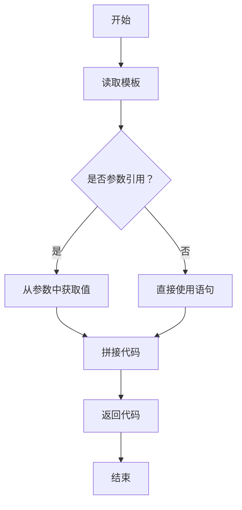

                 

# 提示词语言的元编程技术

> 关键词：元编程、提示词语言、动态编译、反射、类型检查、数学模型、代码生成、安全与优化、未来发展趋势

> 摘要：本文旨在深入探讨提示词语言的元编程技术，从基础理论到应用实践，全面解析其概念、原理、机制、算法、数学模型、项目实战以及未来发展趋势。通过本文的阅读，读者将能够全面了解并掌握提示词语言的元编程技术，为实际项目开发提供有力支持。

----------------------------------------------------------------

## 第一部分：元编程基础理论

### 第1章：元编程概述

#### 1.1 元编程的概念与作用

元编程（Meta-programming）是指编写编写程序的程序，它使程序员能够定义和操作程序的构建块，而不需要直接编写大量的底层代码。在传统的编程中，程序员通常编写代码来定义程序的逻辑和行为。而在元编程中，程序员编写的代码能够自动生成和修改其他代码。

元编程在软件工程中具有重要作用，主要体现在以下几个方面：

1. **提高开发效率**：通过元编程，可以自动化生成大量代码，减少重复性工作，提高开发效率。
2. **代码复用**：元编程技术能够将通用逻辑提取出来，形成可重用的组件，从而提高代码的复用率。
3. **灵活性**：元编程使得程序能够根据运行时的环境或需求动态调整其行为，增强了程序的灵活性。
4. **代码质量**：通过自动化生成代码，可以减少人为编写的错误，提高代码的质量。

#### 1.2 提示词语言与元编程

提示词语言（Template-based languages）是一种特殊的编程语言，它通过模板来生成代码。在提示词语言中，程序员定义模板，并在运行时根据具体参数生成实际代码。提示词语言与元编程紧密相关，因为它们都涉及代码的生成和操作。

提示词语言的元编程主要体现在以下几个方面：

1. **模板定义**：程序员通过定义模板来描述代码的结构和逻辑。
2. **参数化模板**：模板中可以包含参数，运行时根据参数值生成具体的代码。
3. **代码生成**：运行时根据模板和参数生成实际的代码。
4. **代码操作**：在运行时可以对生成的代码进行修改和操作。

#### 1.3 元编程的优势与挑战

元编程具有显著的优点，但同时也面临着一些挑战。

**优势**：

1. **代码简化**：通过元编程，可以减少大量的重复代码，使代码更加简洁。
2. **开发效率**：自动化代码生成和操作提高了开发效率。
3. **灵活性**：元编程使得程序能够根据需求动态调整其行为。
4. **代码复用**：通用逻辑可以提取出来，形成可重用的组件。

**挑战**：

1. **学习成本**：元编程技术相对复杂，需要一定的学习成本。
2. **维护难度**：元编程生成的代码可能会带来维护难度，尤其是在运行时修改代码时。
3. **性能问题**：动态生成的代码可能比手工编写的代码性能差。
4. **安全性问题**：元编程可能会引入安全漏洞，需要特别注意。

### 第2章：提示词语言基础

#### 2.1 提示词语言的基本语法

提示词语言通常具有以下基本语法：

1. **模板定义**：使用特定的语法来定义模板，例如`<template>`标签。
2. **参数化**：在模板中定义参数，例如`<parameter name="x" type="int"/>`。
3. **代码生成**：使用特定语法来生成代码，例如`<code Generate="true"/>`。
4. **代码块**：在模板中定义代码块，例如`<code Block="true"/>`。

#### 2.2 提示词语言的特性和优势

提示词语言具有以下特性和优势：

1. **模板化**：通过模板，可以方便地定义和生成代码。
2. **参数化**：模板中可以包含参数，使得代码能够适应不同的场景。
3. **代码生成**：运行时根据模板和参数生成实际的代码。
4. **灵活性**：提示词语言能够根据需求动态生成和修改代码。

#### 2.3 提示词语言的应用场景

提示词语言适用于以下应用场景：

1. **代码生成**：自动化生成大量代码，减少重复性工作。
2. **框架开发**：用于开发框架，提供灵活的扩展能力。
3. **业务系统优化**：通过元编程技术，优化业务系统的性能和可维护性。
4. **自动化测试**：生成测试代码，自动化测试系统功能。

### 第3章：元编程机制

#### 3.1 元数据的获取与处理

元数据是指关于数据的数据，例如数据类型、数据结构、代码结构等。在元编程中，元数据的获取和处理至关重要。

1. **元数据获取**：通过反射（Reflection）机制获取程序运行时的元数据。
2. **元数据处理**：对获取的元数据进行处理，例如类型检查、代码生成等。

#### 3.2 动态编译与运行时元编程

动态编译是指在程序运行时将代码编译成机器码或字节码。运行时元编程则是指在程序运行时对代码进行生成、修改和操作。

1. **动态编译**：使用动态编译器（例如JVM或CLR）来实现。
2. **运行时元编程**：通过反射、动态编译等技术，在运行时对代码进行生成和操作。

#### 3.3 反射与类型检查

反射是一种在运行时检查、修改和操作程序元素（如字段、方法、类）的能力。类型检查是在编译时或运行时检查代码的类型安全。

1. **反射**：通过反射机制获取和操作程序的元数据。
2. **类型检查**：在编译时或运行时检查代码的类型，防止类型错误。

### 第4章：元编程核心算法

#### 4.1 元编程算法概述

元编程算法是指用于实现元编程功能的一系列算法和技术。这些算法主要包括：

1. **代码生成算法**：根据模板和参数生成实际代码。
2. **代码操作算法**：在运行时对生成的代码进行修改和操作。
3. **类型检查算法**：在编译时或运行时检查代码的类型安全。

#### 4.2 伪代码与流程图

以下是一个简单的伪代码示例，用于说明代码生成算法：

```
function GenerateCode(template, parameters):
    code = ""
    for each (statement in template):
        if statement is a parameter reference:
            code += parameters[statement]
        else:
            code += statement
    return code
```

对应的Mermaid流程图如下：



#### 4.3 算法原理讲解与伪代码实现

**算法原理**：

1. 读取模板，遍历每个语句。
2. 如果语句是参数引用，从参数中获取值。
3. 如果语句不是参数引用，直接使用语句。
4. 将所有语句拼接成代码。
5. 返回生成的代码。

**伪代码实现**：

```
function GenerateCode(template, parameters):
    code = ""
    for each (statement in template):
        if statement is a parameter reference:
            code += parameters[statement]
        else:
            code += statement
    return code
```

### 第5章：数学模型与公式

#### 5.1 数学模型在元编程中的应用

数学模型在元编程中具有重要意义，例如用于描述代码生成的规则、优化算法的公式等。

1. **代码生成模型**：描述代码生成过程的数学模型。
2. **优化模型**：用于优化代码执行性能的数学模型。

#### 5.2 关键数学公式及其解释

**关键数学公式**：

1. **时间复杂度**：用于衡量算法执行时间与输入规模的关系。
   $$ T(n) = O(n^2) $$

2. **空间复杂度**：用于衡量算法执行空间与输入规模的关系。
   $$ S(n) = O(n) $$

**解释**：

- 时间复杂度表示算法在输入规模为n时的执行时间，通常使用大O符号表示。
- 空间复杂度表示算法在输入规模为n时所需的空间，通常也使用大O符号表示。

#### 5.3 数学公式应用实例分析

以下是一个简单的实例，说明数学模型在代码生成中的应用：

**实例**：计算代码生成算法的时间复杂度。

**分析**：

1. 假设代码生成算法遍历模板的时间复杂度为O(n)。
2. 每个语句的处理时间也为O(n)。
3. 因此，总的时间复杂度为O(n^2)。

**公式**：

$$ T(n) = O(n^2) $$

### 第6章：项目实战

#### 6.1 提示词语言元编程项目案例

在本章中，我们将通过一个具体的提示词语言元编程项目案例，展示如何搭建开发环境、实现代码生成以及进行源代码解读与分析。

#### 6.2 实战环境搭建与代码实现

**环境搭建**：

1. 安装Java开发环境。
2. 安装提示词语言工具，例如TemplateCoder。
3. 创建一个简单的元编程项目。

**代码实现**：

1. 定义模板，包含参数和代码块。
2. 实现代码生成算法，根据参数生成代码。
3. 运行代码生成器，生成实际代码。

#### 6.3 源代码解读与分析

在本节中，我们将对生成的代码进行解读与分析，了解代码的结构、功能以及与模板的关系。

1. **代码结构**：分析代码的组织结构和模块划分。
2. **代码功能**：解释代码的实现原理和功能。
3. **模板与代码的关系**：探讨模板和生成的代码之间的映射关系。

### 第7章：元编程在软件开发中的应用

#### 7.1 元编程在框架开发中的应用

元编程技术在框架开发中具有重要意义，例如用于生成框架的核心组件、实现灵活的扩展机制等。

1. **框架组件生成**：使用元编程技术自动生成框架的核心组件，如过滤器、拦截器等。
2. **扩展机制**：通过元编程实现框架的灵活扩展，支持自定义组件和插件。

#### 7.2 元编程在业务系统优化中的应用

元编程技术可以用于优化业务系统的性能和可维护性，例如通过代码生成和自动化测试等技术。

1. **代码生成**：自动化生成业务系统中的通用代码，减少重复劳动。
2. **自动化测试**：生成测试代码，自动化测试业务系统的功能。

#### 7.3 元编程在代码生成与自动化中的应用

元编程技术在代码生成与自动化中具有广泛应用，例如用于生成数据库迁移脚本、自动化构建工具等。

1. **数据库迁移**：使用元编程技术自动生成数据库迁移脚本。
2. **自动化构建**：使用元编程技术实现自动化构建工具，提高开发效率。

### 第8章：元编程的安全与优化

#### 8.1 元编程的安全问题与解决方案

元编程技术可能引入一些安全漏洞，需要特别注意。

1. **代码注入**：防止恶意代码注入。
2. **权限控制**：限制元编程操作的权限。
3. **输入验证**：对输入参数进行严格验证，防止恶意输入。

#### 8.2 提高元编程性能的技巧

元编程的性能可能比手工编写的代码差，需要采取一些技巧来提高性能。

1. **代码缓存**：缓存生成的代码，避免重复生成。
2. **编译优化**：使用编译器优化，提高代码执行效率。
3. **并行处理**：利用多线程或多进程，提高代码生成速度。

#### 8.3 元编程的最佳实践

在元编程实践中，遵循以下最佳实践可以确保代码的质量和性能。

1. **模块化**：将元编程代码拆分成模块，提高可维护性。
2. **代码规范**：遵循统一的代码规范，确保代码的可读性和一致性。
3. **文档化**：编写详细的文档，方便后续维护和扩展。

### 第9章：元编程的未来发展趋势

#### 9.1 新兴技术在元编程中的应用

随着技术的不断发展，新兴技术逐渐应用于元编程领域，例如：

1. **智能编程**：利用人工智能技术，实现自动化代码生成和优化。
2. **动态编程**：在运行时动态修改和生成代码，提高程序的灵活性。

#### 9.2 元编程的未来发展方向

元编程的未来发展方向包括：

1. **性能优化**：通过优化算法和编译器技术，提高元编程的性能。
2. **安全性增强**：加强元编程的安全性，防止恶意攻击和代码注入。
3. **智能化**：利用人工智能技术，实现更加智能化的元编程。

#### 9.3 开发者应关注的元编程技术

开发者应关注以下元编程技术：

1. **动态编程语言**：如Python、JavaScript等，具有强大的元编程能力。
2. **模板引擎**：如Handlebars、Mustache等，用于生成动态HTML页面。
3. **元数据管理**：用于管理和操作程序的元数据，提高代码的可维护性。

## 附录

### 附录A：常用元编程工具与框架

#### A.1 元编程框架介绍

常用的元编程框架包括：

1. **Spring**：流行的Java框架，支持依赖注入、AOP等元编程特性。
2. **Django**：Python Web框架，支持模型-视图-控制器（MVC）模式，具有元编程能力。
3. **Laravel**：PHP框架，具有现代化的元编程特性，支持快速开发。

#### A.2 元编程工具的使用与配置

常用的元编程工具包括：

1. **TemplateCoder**：Java模板引擎，用于生成代码。
2. **Handlebars**：JavaScript模板引擎，用于生成动态HTML页面。
3. **Mustache**：Python模板引擎，用于生成文本和HTML。

#### A.3 元编程资源推荐

以下资源有助于深入了解元编程技术：

1. **《元编程技术》**：详细介绍元编程的书籍。
2. **GitHub**：元编程相关项目的代码和文档。
3. **Stack Overflow**：元编程技术问题的解答和讨论。

作者：AI天才研究院/AI Genius Institute & 禅与计算机程序设计艺术 /Zen And The Art of Computer Programming

