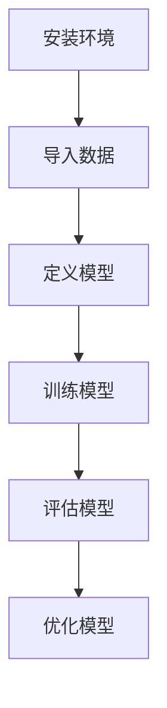
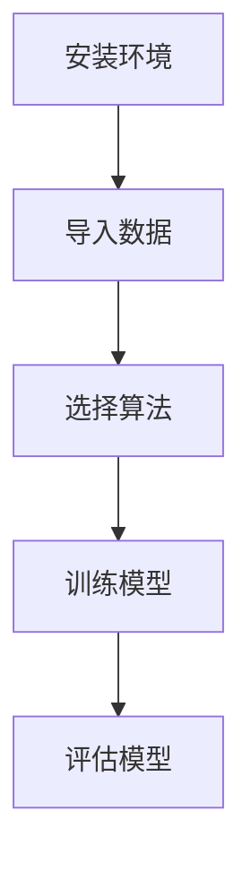
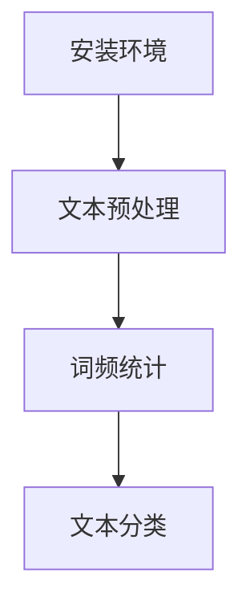
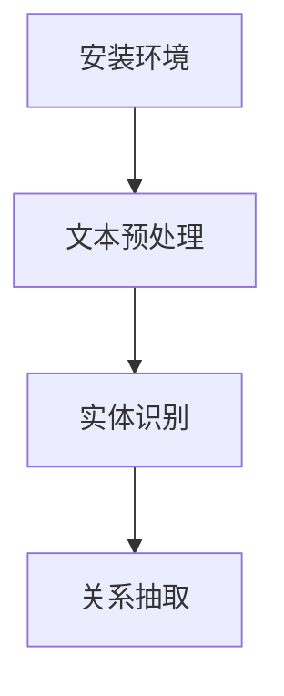
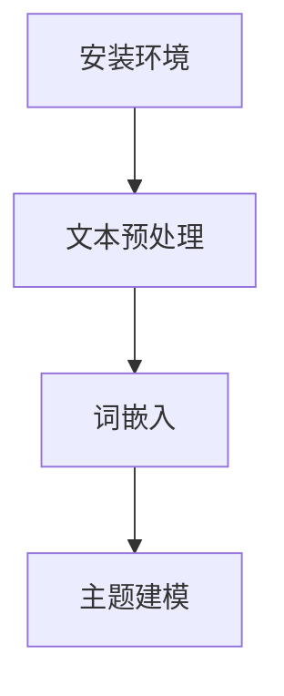
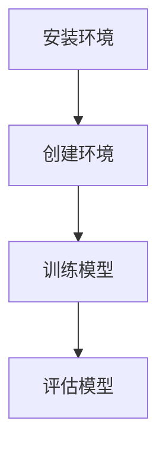
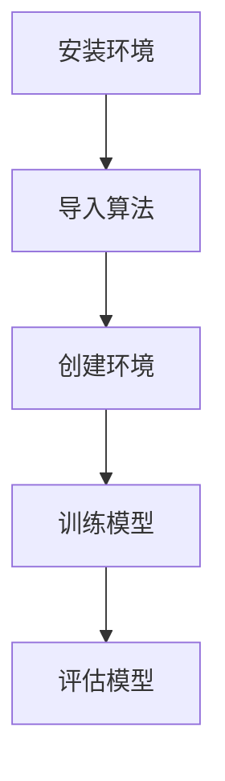
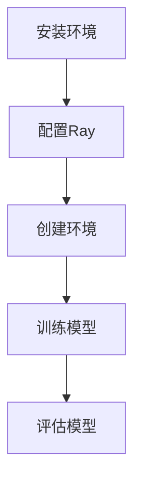

                 

### 《数字化意志力锻炼场：AI增强的自我控制训练》

> **关键词**：人工智能，自我控制，意志力，AI增强，训练方法，应用实例

**摘要**：随着人工智能技术的发展，AI在提高人类自我控制能力方面展现出了巨大的潜力。本文将探讨AI与意志力的关系，介绍AI核心技术在意志力训练中的应用，并深入分析AI增强自我控制训练的方法与策略。此外，文章还将通过具体的应用实例，展示AI增强自我控制训练在健康、学习和社交等多个领域的实际效果，并对未来的发展趋势进行展望。

在当今信息爆炸的时代，自我控制成为了一个越来越重要的话题。然而，许多人发现自己在面对各种诱惑和干扰时，往往难以坚持自我控制，导致无法达成目标。因此，如何提升自我控制能力成为了许多人关注的焦点。近年来，人工智能技术的发展为解决这个问题提供了新的思路。本文将探讨AI在自我控制训练中的应用，旨在为读者提供一种全新的方法，以帮助他们在数字化时代更好地掌控自己的意志力。

### 第一部分：AI与意志力基础

#### 第1章：AI与意志力的关系

##### 1.1 AI技术的兴起与意志力训练

人工智能（AI）技术的快速发展，为各个领域带来了革命性的变化。从最初的专家系统，到如今的深度学习、自然语言处理和强化学习，AI技术在不断拓展其应用范围。与此同时，意志力训练作为一种提升自我控制能力的方法，也逐渐受到了关注。AI技术的兴起，为意志力训练带来了新的契机。

意志力训练，通常指的是通过一系列的方法和策略，帮助个体在面临诱惑和干扰时，能够更好地控制自己的行为和情绪，从而达成目标。而AI技术的加入，使得这种训练更加智能化、个性化，能够更好地适应个体的需求和特点。

##### 1.2 意志力的重要性和挑战

意志力，也称为自制力，是指个体在面对诱惑和干扰时，能够坚持自己的决定和目标，不受外界影响的能力。研究表明，意志力在个体的成长和发展中起着至关重要的作用。它不仅影响着个体的心理健康，还与学习成绩、职业成功和社会适应能力密切相关。

然而，现代社会的生活节奏加快，信息过载，诱惑和干扰无处不在。这使得许多人在面对各种挑战时，往往感到力不从心，难以坚持自我控制。因此，如何提升意志力，成为了许多人关注的焦点。

##### 1.3 AI技术在意志力训练中的应用前景

随着AI技术的不断发展，其在意志力训练中的应用前景也日益广阔。首先，AI可以通过分析个体的行为数据，了解其意志力的强弱和特点，从而提供个性化的训练方案。其次，AI可以通过自然语言处理和情感分析技术，对个体的心理状态进行实时监测和评估，为意志力训练提供反馈和支持。此外，AI还可以通过强化学习技术，帮助个体在训练过程中不断优化自己的意志力控制策略。

总的来说，AI技术在意志力训练中的应用，不仅有助于提高训练的效果，还能为个体提供更加便捷、高效的训练方式。在未来，随着AI技术的进一步发展，我们有理由相信，AI在意志力训练中的应用将会更加广泛和深入。

#### 第2章：AI核心技术与意志力训练

##### 2.1 机器学习基础

机器学习（Machine Learning，ML）是AI的核心技术之一，它通过从数据中学习，实现计算机自主提高性能的过程。在意志力训练中，机器学习技术可以帮助分析个体的行为数据，识别出意志力训练的关键因素，从而提供个性化的训练方案。

###### 2.1.1 基本概念

机器学习的基本概念包括模型、数据、算法和评估。模型是机器学习算法的输出，用于预测或分类；数据是模型训练的基础，质量越高，模型性能越好；算法是机器学习的核心，决定了模型的训练方式和性能；评估是衡量模型性能的重要手段，常用的评估指标包括准确率、召回率、F1分数等。

###### 2.1.2 常用算法

在意志力训练中，常用的机器学习算法包括线性回归、逻辑回归、决策树、随机森林、支持向量机等。这些算法各有特点，适用于不同的训练场景。例如，线性回归适用于简单的线性关系，而决策树和随机森林适用于复杂的多变量关系。

##### 2.2 自然语言处理

自然语言处理（Natural Language Processing，NLP）是AI技术的一个重要分支，它使计算机能够理解、生成和处理自然语言。在意志力训练中，NLP技术可以帮助对个体的情绪、动机和目标进行识别和分析，为意志力训练提供更深入的支持。

###### 2.2.1 语义理解

语义理解是指计算机对自然语言中的含义进行理解和解释的能力。在意志力训练中，语义理解可以帮助分析个体的语言表达，识别其意志力的变化和需求。例如，通过分析个体在日记中的描述，可以识别出其意志力较强的时段和较弱的时段，从而提供有针对性的训练建议。

###### 2.2.2 情感分析

情感分析是指对自然语言中的情感进行分类和识别的过程。在意志力训练中，情感分析可以帮助了解个体的情绪状态，为意志力训练提供反馈和支持。例如，通过分析个体在社交媒体上的评论，可以了解其情绪的波动，从而在意志力下降时提供情绪调节的建议。

##### 2.3 强化学习

强化学习（Reinforcement Learning，RL）是一种通过试错和奖励机制来学习最优策略的机器学习算法。在意志力训练中，强化学习可以帮助个体在训练过程中不断调整自己的行为，以达到最佳效果。

###### 2.3.1 基本原理

强化学习的基本原理是通过环境（Environment）与智能体（Agent）的交互，学习最优策略（Policy）。智能体在环境中执行动作（Action），获得反馈（Reward），并根据反馈调整策略。通过不断的试错和优化，智能体可以学习到最优的行为策略。

###### 2.3.2 应用场景

在意志力训练中，强化学习可以应用于多种场景。例如，通过强化学习，可以帮助个体在健身训练中不断调整运动强度和频率，以达到最佳效果；在饮食控制中，可以帮助个体在面临美食诱惑时，选择健康的食物，从而保持良好的饮食习惯。

总的来说，AI核心技术为意志力训练提供了丰富的工具和方法。通过机器学习、自然语言处理和强化学习等技术，我们可以更好地理解个体的意志力状态，为其提供个性化的训练方案，从而提升其自我控制能力。在未来，随着AI技术的进一步发展，AI在意志力训练中的应用将会更加广泛和深入。

### 第二部分：AI增强自我控制训练策略

#### 第3章：AI增强自我控制训练方法

##### 3.1 自我控制训练原理

自我控制训练是一种旨在提升个体自我控制能力的方法。它通过一系列的训练和策略，帮助个体在面对诱惑和干扰时，能够更好地控制自己的行为和情绪，从而达成目标。

###### 3.1.1 自我控制的概念

自我控制是指个体在面对诱惑和干扰时，能够坚持自己的决定和目标，不受外界影响的能力。它包括两个关键方面：延迟满足和情绪调节。延迟满足是指个体能够等待即时满足，选择更有价值的结果；情绪调节是指个体能够识别和调节自己的情绪，避免情绪失控。

###### 3.1.2 自我控制训练的理论基础

自我控制训练的理论基础主要包括心理学的认知行为理论和自我决定理论。认知行为理论认为，自我控制是通过认知过程实现的，个体需要通过认知策略来调整自己的行为和情绪。自我决定理论认为，自我控制是个体自主选择的结果，只有当个体感到自主和有价值时，才能更好地坚持自我控制。

##### 3.2 AI增强策略

AI技术在自我控制训练中具有重要作用，可以通过多种策略增强训练效果。以下是一些常见的AI增强策略：

###### 3.2.1 数据驱动的个性化训练

数据驱动的个性化训练是一种基于个体行为数据的训练方法。通过收集和分析个体的行为数据，AI系统可以了解个体的自我控制能力和行为模式，从而提供个性化的训练方案。例如，通过分析个体的饮食记录，AI系统可以为其推荐适合的饮食计划，帮助其控制体重。

###### 3.2.2 模式识别与干预

模式识别与干预是一种通过识别个体行为模式，提供实时干预的方法。AI系统可以通过分析个体的行为数据，识别出自我控制的关键时期和薄弱环节，从而提供实时干预。例如，在个体面临高热量食物诱惑时，AI系统可以提醒其选择低热量食物，以保持良好的饮食习惯。

###### 3.2.3 强化学习与反馈机制

强化学习与反馈机制是一种通过奖励和惩罚来增强个体自我控制的方法。AI系统可以通过设计奖励机制，鼓励个体坚持自我控制，例如在完成锻炼任务后给予虚拟奖励。同时，通过反馈机制，AI系统可以及时向个体提供自我控制的效果和进展，帮助其调整训练策略。

总的来说，AI增强自我控制训练方法通过数据驱动、模式识别和强化学习等策略，能够提供个性化、实时和有效的训练支持，帮助个体提升自我控制能力。在未来，随着AI技术的进一步发展，AI在自我控制训练中的应用将会更加广泛和深入。

#### 第4章：AI辅助自我控制训练工具

##### 4.1 常用AI工具介绍

在自我控制训练中，AI工具发挥着重要作用。以下是一些常用的AI工具及其特点：

###### 4.1.1 机器学习框架

机器学习框架是一种用于构建和训练机器学习模型的工具。以下是一些常用的机器学习框架：

- **TensorFlow**：由Google开发，是一款功能强大的开源机器学习框架。它提供了丰富的API，支持深度学习、自然语言处理等多种任务。
- **PyTorch**：由Facebook开发，是一款流行的开源机器学习框架。它以动态计算图为核心，易于调试和优化。
- **Scikit-learn**：是一款基于Python的开源机器学习库。它提供了丰富的算法和工具，适用于各种数据分析和机器学习任务。

###### 4.1.2 自然语言处理工具

自然语言处理（NLP）工具是用于处理和分析自然语言数据的工具。以下是一些常用的NLP工具：

- **NLTK**：是一款经典的Python NLP库，提供了丰富的文本处理和语言模型功能。
- **spaCy**：是一款高效的NLP库，支持多种语言。它提供了丰富的实体识别、关系抽取等功能。
- **Gensim**：是一款用于主题建模和文本分析的Python库。它支持词嵌入、文档相似度计算等多种功能。

###### 4.1.3 强化学习平台

强化学习平台是用于构建和训练强化学习模型的工具。以下是一些常用的强化学习平台：

- **OpenAI Gym**：是一款流行的强化学习环境库。它提供了多种预定义的环境和任务，适用于研究者和开发者。
- **Stable Baselines**：是一款基于PyTorch的强化学习库。它提供了多个预训练的基线算法，适用于实际应用。
- **Ray**：是一款高性能的分布式训练框架。它支持大规模的强化学习训练任务，适用于工业级应用。

##### 4.2 开发与部署

在自我控制训练中，AI工具的开发与部署至关重要。以下是一些关键步骤：

###### 4.2.1 开发环境搭建

搭建开发环境是进行AI工具开发的第一步。以下是一些常见步骤：

- 安装Python和相关依赖库，如TensorFlow、PyTorch、NLTK等。
- 配置开发环境，如Jupyter Notebook或PyCharm。
- 准备训练数据集，并进行预处理。

###### 4.2.2 模型训练与优化

模型训练与优化是开发过程中的关键步骤。以下是一些常见步骤：

- 选择合适的模型结构和算法。
- 训练模型，并进行参数调整。
- 评估模型性能，如准确率、召回率等。
- 进行模型优化，提高训练效果。

###### 4.2.3 系统集成与部署

系统集成与部署是将AI工具应用于实际场景的最后一步。以下是一些常见步骤：

- 将模型集成到应用系统中，如Web应用或移动应用。
- 进行系统测试，确保功能的正确性和稳定性。
- 将系统部署到生产环境，如云平台或本地服务器。
- 进行系统监控和维护，确保系统的正常运行。

总的来说，AI辅助自我控制训练工具的开发与部署是一个复杂的过程，需要综合运用多种技术和方法。通过合理规划和实施，可以实现高效的AI应用，帮助个体提升自我控制能力。

### 第三部分：AI增强自我控制训练应用实例

#### 第5章：健康与健身领域的应用

在健康与健身领域，AI增强自我控制训练方法得到了广泛应用，尤其在运动习惯的培养和饮食习惯调整方面，AI技术展现出了显著的效果。

##### 5.1 运动自我控制训练

运动习惯的培养是健康生活的重要组成部分。然而，对于很多人来说，坚持每天运动是一件困难的事情。AI技术通过数据分析和个性化推荐，帮助用户建立和维持运动习惯。

###### 5.1.1 运动习惯的培养

AI系统可以通过收集用户的生活习惯数据，如运动频率、运动时间、运动类型等，分析用户的运动偏好和运动效果。基于这些数据，AI系统可以推荐最适合用户的运动计划，帮助用户逐步建立运动习惯。

具体步骤如下：

1. **数据收集**：AI系统收集用户的运动数据，包括运动时间、运动类型、心率等。
2. **数据分析**：AI系统对用户运动数据进行分析，了解用户的运动偏好和效果。
3. **个性化推荐**：基于数据分析结果，AI系统为用户推荐最适合的运动计划，包括运动类型、运动时间和运动强度。
4. **训练计划实施**：用户按照AI系统推荐的运动计划进行训练，AI系统实时监测用户的运动状态，提供反馈和调整建议。

通过这种方式，用户可以逐步培养出坚持运动的习惯，提高运动效果。

###### 5.1.2 持续性与动力保持

在运动习惯培养的过程中，保持持续性和动力是一个挑战。AI技术可以通过激励机制和反馈系统，帮助用户保持运动动力。

具体措施如下：

1. **激励机制**：AI系统可以设置虚拟奖励，如积分、勋章等，鼓励用户坚持运动。例如，完成一周的运动目标后，用户可以获得一定积分，用于兑换虚拟物品或折扣。
2. **反馈系统**：AI系统可以实时监测用户的运动状态，如运动时间、运动强度等，并根据这些数据给出反馈。例如，当用户完成运动目标时，AI系统会给予积极反馈，如“你今天做得很好！”或“你离目标还有一步之遥！”。
3. **社交互动**：AI系统可以引入社交功能，让用户与朋友或其他运动爱好者进行互动。通过分享运动数据、交流心得，用户可以获得更多动力和支持。

通过这些措施，用户可以更轻松地保持运动动力，持续培养运动习惯。

##### 5.2 饮食自我控制训练

饮食习惯对健康至关重要。通过AI技术，用户可以更有效地控制饮食，建立健康的饮食习惯。

###### 5.2.1 健康饮食规划

AI系统可以通过分析用户的饮食数据，如饮食习惯、营养需求等，为用户制定个性化的饮食计划。

具体步骤如下：

1. **数据收集**：AI系统收集用户的饮食数据，包括饮食种类、饮食时间、饮食习惯等。
2. **营养评估**：AI系统对用户的饮食数据进行营养评估，了解用户的营养需求和健康状况。
3. **饮食计划制定**：基于营养评估结果，AI系统为用户制定个性化的饮食计划，包括每日食物摄入量、营养搭配建议等。
4. **计划实施与调整**：用户按照AI系统制定的饮食计划进行饮食，AI系统实时监测用户的饮食状况，并根据反馈进行调整。

通过这种方式，用户可以更科学地控制饮食，改善健康状况。

###### 5.2.2 饮食习惯调整

饮食习惯调整是饮食自我控制训练的关键。AI技术可以通过数据分析和行为干预，帮助用户逐步改变不健康的饮食习惯。

具体措施如下：

1. **数据监测**：AI系统实时监测用户的饮食习惯，如饮食种类、饮食时间、饮食习惯等。
2. **行为干预**：AI系统根据用户的饮食习惯数据，提供行为干预建议。例如，当用户摄入过多高热量食物时，AI系统会提醒用户注意饮食均衡，或提供低热量食物的建议。
3. **激励与反馈**：AI系统通过激励和反馈机制，鼓励用户改变饮食习惯。例如，当用户连续几天保持良好的饮食习惯时，AI系统会给予积极反馈，如“你今天做得很好！”或“你的饮食习惯有了显著改善！”。

通过这些措施，用户可以逐步改变不健康的饮食习惯，建立健康的饮食习惯。

总的来说，AI增强自我控制训练在健康与健身领域的应用，通过个性化推荐、激励机制和行为干预，帮助用户建立和维持健康的生活习惯。在未来，随着AI技术的进一步发展，AI在健康与健身领域的应用将会更加广泛和深入。

#### 第6章：学习与工作效率提升

在学习和工作效率提升方面，AI增强自我控制训练方法同样具有显著的应用效果。通过AI技术，可以更科学地制定学习策略、提高学习动力，以及优化工作效率。

##### 6.1 学习习惯养成

良好的学习习惯是提高学习效率的关键。AI技术可以通过数据分析和个人推荐，帮助用户培养有效的学习习惯。

###### 6.1.1 学习策略的制定

AI系统可以分析用户的学习行为，如学习时间、学习内容、学习效果等，为用户制定个性化的学习策略。

具体步骤如下：

1. **数据收集**：AI系统收集用户的学习数据，包括学习时间、学习内容、学习效果等。
2. **学习行为分析**：AI系统对用户的学习行为进行分析，了解用户的学习偏好和学习风格。
3. **策略制定**：基于学习行为分析结果，AI系统为用户制定个性化的学习策略，包括学习时间安排、学习内容选择、学习方法等。
4. **策略实施与调整**：用户按照AI系统制定的学习策略进行学习，AI系统实时监测学习效果，并根据反馈进行调整。

通过这种方式，用户可以更科学地安排学习时间，选择适合的学习内容，提高学习效率。

###### 6.1.2 学习动力的维持

学习动力是保持学习习惯的重要因素。AI技术可以通过激励和反馈机制，帮助用户维持学习动力。

具体措施如下：

1. **激励机制**：AI系统可以设置学习积分、学习奖励等，鼓励用户持续学习。例如，用户完成一定的学习任务后，可以获得积分，积分可以兑换学习资源或实物奖励。
2. **反馈系统**：AI系统可以实时监测用户的学习进度和学习效果，为用户提供反馈。例如，当用户完成一个学习目标时，AI系统会给予积极反馈，如“恭喜你完成学习任务！”或“你的学习效果有了显著提升！”。
3. **社交互动**：AI系统可以引入社交功能，让用户与其他学习者进行互动。通过分享学习心得、交流学习经验，用户可以获得更多动力和支持。

通过这些措施，用户可以更轻松地保持学习动力，持续培养学习习惯。

##### 6.2 工作效率提升

工作效率是职业发展的重要指标。通过AI增强自我控制训练，可以更有效地提高工作效率。

###### 6.2.1 时间管理

时间管理是提高工作效率的关键。AI技术可以通过数据分析和时间分配优化，帮助用户更科学地管理时间。

具体步骤如下：

1. **时间记录**：AI系统记录用户的工作时间分配，包括工作内容、工作时长等。
2. **时间分析**：AI系统对用户的时间记录进行分析，了解用户的时间使用习惯和工作效率。
3. **时间优化**：基于时间分析结果，AI系统为用户优化时间分配，提高工作效率。例如，AI系统可以识别用户的工作高峰期和低谷期，建议用户在高峰期处理重要任务，在低谷期处理次要任务。
4. **时间调整**：用户按照AI系统优化后的时间安排进行工作，AI系统实时监测工作效果，并根据反馈进行调整。

通过这种方式，用户可以更有效地利用时间，提高工作效率。

###### 6.2.2 任务优先级设定

任务优先级设定是提高工作效率的重要环节。AI技术可以通过数据分析，帮助用户设定合理的任务优先级。

具体步骤如下：

1. **任务记录**：AI系统记录用户的工作任务，包括任务类型、任务难度、任务紧急程度等。
2. **任务分析**：AI系统对用户的工作任务进行分析，了解任务的优先级和工作量。
3. **优先级设定**：基于任务分析结果，AI系统为用户设定任务优先级，帮助用户更科学地处理任务。例如，AI系统可以识别出紧急且重要的任务，建议用户优先处理。
4. **任务调整**：用户按照AI系统设定的任务优先级进行工作，AI系统实时监测任务处理效果，并根据反馈进行调整。

通过这种方式，用户可以更高效地处理任务，提高工作效率。

总的来说，AI增强自我控制训练在学习和工作效率提升方面的应用，通过个性化推荐、激励机制和时间管理优化，帮助用户建立和维持有效的学习和工作习惯。在未来，随着AI技术的进一步发展，AI在学习和工作效率提升方面的应用将会更加广泛和深入。

#### 第7章：社交与情感自我控制

社交与情感自我控制是人们在日常生活中面临的另一个重要挑战。通过AI增强自我控制训练，可以帮助个体更好地管理自己的社交行为和情感状态。

##### 7.1 社交技能培养

良好的社交技能对于个人的社会适应能力和人际关系至关重要。AI技术可以通过个性化培训和实时反馈，帮助个体提升社交技能。

###### 7.1.1 社交障碍的识别与克服

社交障碍如社交焦虑、沟通障碍等，常常影响个体的社交行为。AI系统可以通过分析个体的社交数据，识别出社交障碍的类型和程度，并提供针对性的克服策略。

具体步骤如下：

1. **社交数据收集**：AI系统收集个体的社交数据，包括社交频率、社交情境、社交互动等。
2. **社交障碍识别**：AI系统对社交数据进行分析，识别出个体可能存在的社交障碍，如社交焦虑、沟通障碍等。
3. **策略制定**：基于社交障碍识别结果，AI系统为个体制定个性化的克服策略，如社交训练、沟通技巧培训等。
4. **策略实施与反馈**：个体按照AI系统制定的策略进行社交训练，AI系统实时监测训练效果，并提供反馈和调整建议。

通过这种方式，个体可以逐步克服社交障碍，提升社交技能。

###### 7.1.2 社交互动的技巧

社交互动技巧是社交技能的重要组成部分。AI系统可以通过模拟社交情境和实时反馈，帮助个体学习和实践社交互动技巧。

具体措施如下：

1. **社交情境模拟**：AI系统模拟真实的社交情境，如聚会、会议等，为个体提供实践社交互动技巧的机会。
2. **实时反馈**：AI系统实时记录个体的社交互动表现，并根据互动结果提供反馈。例如，当个体在社交互动中表现良好时，AI系统会给予积极反馈，如“你做得很好！”；当个体在社交互动中存在不足时，AI系统会提供改进建议。
3. **技巧培训**：AI系统根据个体的社交互动表现，提供针对性的社交技巧培训，如沟通技巧、表达能力等。

通过这些措施，个体可以更有效地学习社交互动技巧，提高社交能力。

##### 7.2 情感管理

情感管理是自我控制的重要组成部分。通过AI增强自我控制训练，可以帮助个体更好地识别和调节自己的情绪，从而实现更好的情感管理。

###### 7.2.1 情绪识别与调控

情绪识别与调控是情感管理的基础。AI系统可以通过情感分析技术，帮助个体识别和调控自己的情绪。

具体步骤如下：

1. **情绪数据收集**：AI系统收集个体的情绪数据，包括情绪表达、情绪反应等。
2. **情绪识别**：AI系统对情绪数据进行分析，识别个体的情绪状态，如快乐、悲伤、焦虑等。
3. **情绪调控**：基于情绪识别结果，AI系统为个体提供情绪调控建议。例如，当个体处于焦虑状态时，AI系统会建议进行深呼吸、冥想等放松活动；当个体处于悲伤状态时，AI系统会建议进行情绪倾诉、寻求支持等。

通过这种方式，个体可以更准确地识别和调节自己的情绪，实现更好的情感管理。

###### 7.2.2 情感表达与交流

情感表达与交流是情感管理的关键。AI系统可以通过模拟情感表达和实时反馈，帮助个体学习和实践情感表达技巧。

具体措施如下：

1. **情感表达模拟**：AI系统模拟真实的情感表达情境，如对话、演讲等，为个体提供实践情感表达的机会。
2. **实时反馈**：AI系统实时记录个体的情感表达表现，并根据表达结果提供反馈。例如，当个体在情感表达中表现良好时，AI系统会给予积极反馈，如“你表达得很好！”；当个体在情感表达中存在不足时，AI系统会提供改进建议。
3. **技巧培训**：AI系统根据个体的情感表达表现，提供针对性的情感表达技巧培训，如沟通技巧、表达方式等。

通过这些措施，个体可以更有效地学习情感表达技巧，提高情感表达能力。

总的来说，AI增强自我控制训练在社交与情感自我控制方面的应用，通过个性化培训、实时反馈和模拟情境，帮助个体提升社交技能和情感管理能力。在未来，随着AI技术的进一步发展，AI在社交与情感自我控制方面的应用将会更加广泛和深入。

### 第四部分：AI增强自我控制训练的挑战与未来

#### 第8章：AI增强自我控制训练的挑战

随着AI增强自我控制训练技术的不断发展，其在实际应用中面临的挑战也日益凸显。以下是一些主要的挑战及其应对策略。

##### 8.1 隐私与伦理问题

隐私保护和伦理规范是AI增强自我控制训练中不可忽视的问题。用户的数据安全和隐私保护直接关系到AI系统的可信度和用户接受度。

###### 8.1.1 用户隐私保护

为保护用户隐私，AI系统需要采取以下措施：

1. **数据匿名化**：在数据收集和处理过程中，对用户数据进行匿名化处理，确保用户身份不被泄露。
2. **数据加密**：对用户数据进行加密存储和传输，防止数据泄露。
3. **权限管理**：建立严格的数据访问权限管理机制，确保只有授权人员可以访问用户数据。

###### 8.1.2 伦理道德规范

在AI增强自我控制训练中，需要遵循以下伦理道德规范：

1. **透明度**：确保AI系统的决策过程对用户透明，用户能够理解AI系统的工作原理和决策依据。
2. **公平性**：AI系统应确保对所有用户公平对待，避免因算法偏见而导致不公平现象。
3. **责任归属**：明确AI系统在自我控制训练中的责任归属，确保在出现问题时能够追溯责任。

##### 8.2 技术局限性

AI增强自我控制训练技术的局限性主要体现在数据质量、模型可解释性和技术适应性等方面。

###### 8.2.1 数据质量的影响

数据质量对AI系统的性能和可靠性至关重要。为提高数据质量，需要采取以下措施：

1. **数据清洗**：对收集到的数据进行清洗，去除噪声和异常值。
2. **数据增强**：通过数据增强技术，如数据复制、数据变换等，提高数据多样性和质量。
3. **数据融合**：结合多种数据源，提高数据的全面性和准确性。

###### 8.2.2 模型可解释性

模型可解释性是AI系统在实际应用中的重要考量因素。提高模型可解释性，需要采取以下措施：

1. **模型解释工具**：开发和使用模型解释工具，如LIME、SHAP等，帮助用户理解模型的决策过程。
2. **可视化**：通过可视化技术，如热力图、决策树等，展示模型的决策过程和结果。
3. **算法改进**：优化算法设计，提高模型的可解释性，如使用基于规则的模型、集成模型等。

###### 8.2.3 技术适应性

AI增强自我控制训练技术需要具备良好的适应性，以应对不同应用场景和用户需求。为此，需要采取以下措施：

1. **模块化设计**：采用模块化设计，将核心算法和组件分离，方便根据需求进行组合和调整。
2. **算法优化**：持续优化算法，提高其性能和适应性。
3. **用户参与**：鼓励用户参与系统的设计和优化，根据用户反馈进行调整和改进。

总的来说，AI增强自我控制训练在隐私保护、伦理规范、数据质量、模型可解释性和技术适应性等方面面临着诸多挑战。通过采取相应的应对策略，可以逐步解决这些问题，推动AI增强自我控制训练技术的健康发展。

#### 第9章：未来发展趋势与展望

随着AI技术的不断进步，AI增强自我控制训练在未来将迎来更加广阔的应用前景和发展趋势。以下是一些可能的影响和未来发展方向：

##### 9.1 新技术的影响

未来，AI技术将继续快速发展，带来一系列新技术和新方法，进一步推动自我控制训练的发展。例如：

###### 9.1.1 量子计算与AI

量子计算作为一种具有巨大计算能力的全新计算范式，与AI技术结合后，将大幅提升AI系统的处理速度和性能。量子计算在自我控制训练中的应用，有望实现更高效的数据分析和模型训练，为用户提供更精确、个性化的训练方案。

###### 9.1.2 脑机接口与自我控制

脑机接口（Brain-Computer Interface，BCI）技术的发展，使得直接通过大脑信号控制计算机成为可能。在未来，BCI技术与自我控制训练结合，可以实现更直观、更自然的自我控制训练方式，为个体提供更加个性化的训练体验。

##### 9.2 应用拓展

AI增强自我控制训练的应用将不再局限于健康、学习和社交等领域，还将拓展到更多领域，如：

###### 9.2.1 心理治疗

AI增强自我控制训练在心理治疗中的应用前景广阔。通过AI技术，可以实现对心理障碍的早期诊断、实时监测和个性化治疗，提高心理治疗的效果和效率。

###### 9.2.2 社会治理

AI增强自我控制训练在社会治理中的应用，有助于提高社会公共管理和服务水平。例如，通过AI技术对城市交通、公共安全等领域的数据进行分析，优化资源配置，提升社会治理效能。

##### 9.3 未来展望

未来，AI增强自我控制训练将在以下几个方面实现重大突破：

###### 9.3.1 个性化与普适性

AI技术将进一步提高自我控制训练的个性化和普适性，为不同群体提供定制化的训练方案，实现全民自我控制能力的提升。

###### 9.3.2 可解释性与透明度

随着AI技术的不断发展，AI系统的可解释性和透明度将得到显著提升，用户可以更好地理解AI系统的决策过程，增强对AI系统的信任。

###### 9.3.3 伦理与隐私保护

未来，AI增强自我控制训练在伦理和隐私保护方面将不断完善，确保用户的数据安全和隐私不受侵犯，推动技术的可持续发展。

总的来说，AI增强自我控制训练在未来的发展具有巨大的潜力和广阔的前景。通过不断创新和应用，AI技术将为提升人类自我控制能力，实现更健康、更高效的生活提供有力支持。

### 附录

#### 附录A：常见AI工具与资源

在AI增强自我控制训练中，常用的AI工具和资源对于开发者来说至关重要。以下是一些常用的AI工具和资源，以及其详细介绍：

##### A.1 机器学习框架

机器学习框架是构建和训练机器学习模型的基础工具。以下是一些常用的机器学习框架：

###### A.1.1 TensorFlow

TensorFlow是由Google开发的一款开源机器学习框架，广泛用于深度学习和大规模分布式计算。它提供了丰富的API，支持多种编程语言，如Python、C++和Java。

**Mermaid流程图**：



**核心算法原理讲解**：

```python
import tensorflow as tf

# 定义模型
model = tf.keras.Sequential([
    tf.keras.layers.Dense(units=1, input_shape=[1])
])

# 编译模型
model.compile(optimizer='sgd', loss='mean_squared_error')

# 训练模型
model.fit(x_train, y_train, epochs=100)

# 评估模型
model.evaluate(x_test, y_test)
```

###### A.1.2 PyTorch

PyTorch是另一款流行的开源机器学习框架，由Facebook开发。它以其动态计算图和简洁的API而闻名，广泛应用于深度学习和计算机视觉领域。

**Mermaid流程图**：


**核心算法原理讲解**：

```python
import torch
import torch.nn as nn
import torch.optim as optim

# 定义模型
class Model(nn.Module):
    def __init__(self):
        super(Model, self).__init__()
        self.layers = nn.Sequential(
            nn.Linear(in_features=1, out_features=1)
        )

    def forward(self, x):
        return self.layers(x)

# 创建模型实例
model = Model()

# 编译模型
optimizer = optim.SGD(model.parameters(), lr=0.01)
criterion = nn.MSELoss()

# 训练模型
for epoch in range(100):
    model.zero_grad()
    outputs = model(x_train)
    loss = criterion(outputs, y_train)
    loss.backward()
    optimizer.step()

# 评估模型
with torch.no_grad():
    outputs = model(x_test)
    loss = criterion(outputs, y_test)
    print("Test Loss:", loss.item())
```

###### A.1.3 Scikit-learn

Scikit-learn是一个基于Python的开源机器学习库，提供了丰富的算法和工具，适用于各种数据分析和机器学习任务。

**Mermaid流程图**：



**核心算法原理讲解**：

```python
from sklearn.linear_model import LinearRegression
from sklearn.model_selection import train_test_split
from sklearn.metrics import mean_squared_error

# 分割数据集
x_train, x_test, y_train, y_test = train_test_split(x, y, test_size=0.2, random_state=42)

# 创建模型实例
model = LinearRegression()

# 训练模型
model.fit(x_train, y_train)

# 评估模型
y_pred = model.predict(x_test)
mse = mean_squared_error(y_test, y_pred)
print("MSE:", mse)
```

##### A.2 自然语言处理工具

自然语言处理（NLP）工具用于处理和分析自然语言数据，是AI增强自我控制训练中的重要组成部分。以下是一些常用的NLP工具：

###### A.2.1 NLTK

NLTK（Natural Language Toolkit）是一个基于Python的开源NLP库，提供了丰富的文本处理和语言模型功能。

**Mermaid流程图**：



**核心算法原理讲解**：

```python
import nltk
from nltk.tokenize import word_tokenize
from nltk.corpus import stopwords
from nltk.classify import NaiveBayesClassifier

# 下载停用词表
nltk.download('stopwords')

# 文本预处理
def preprocess_text(text):
    tokens = word_tokenize(text)
    return [token.lower() for token in tokens if token.lower() not in stopwords.words('english')]

# 词频统计
from collections import Counter
def word_frequency(text):
    tokens = preprocess_text(text)
    return Counter(tokens)

# 文本分类
from sklearn.feature_extraction.text import TfidfVectorizer
from sklearn.naive_bayes import MultinomialNB

# 创建训练数据集
train_data = [["positive", "I am happy."], ["negative", "I am sad."]]
X_train = [preprocess_text(text) for text, _ in train_data]
y_train = [label for _, label in train_data]

# 创建向量器
vectorizer = TfidfVectorizer()
X_train_tfidf = vectorizer.fit_transform(X_train)

# 创建模型
model = MultinomialNB()
model.fit(X_train_tfidf, y_train)

# 测试
test_text = "I am feeling happy today."
test_tokens = preprocess_text(test_text)
test_tfidf = vectorizer.transform([test_tokens])
predicted = model.predict(test_tfidf)
print("Prediction:", predicted)
```

###### A.2.2 spaCy

spaCy是一款高效的NLP库，支持多种语言，提供了丰富的实体识别、关系抽取等功能。

**Mermaid流程图**：



**核心算法原理讲解**：

```python
import spacy

# 加载模型
nlp = spacy.load("en_core_web_sm")

# 文本预处理
def preprocess_text(text):
    doc = nlp(text)
    return [token.text.lower() for token in doc if token.is_alpha]

# 实体识别
def entity_recognition(text):
    doc = nlp(text)
    return [(ent.text, ent.label_) for ent in doc.ents]

# 关系抽取
def relation_extraction(text):
    doc = nlp(text)
    return [(token.text, token.dep_, token.head.text) for token in doc]

# 测试
text = "John works at Google as a software engineer."
preprocessed_text = preprocess_text(text)
entities = entity_recognition(text)
relations = relation_extraction(text)

print("Preprocessed Text:", preprocessed_text)
print("Entities:", entities)
print("Relations:", relations)
```

###### A.2.3 Gensim

Gensim是一款用于主题建模和文本分析的Python库，支持词嵌入、文档相似度计算等多种功能。

**Mermaid流程图**：



**核心算法原理讲解**：

```python
import gensim
from gensim.models import LdaModel

# 文本预处理
def preprocess_text(text):
    doc = nlp(text)
    return [token.text.lower() for token in doc if token.is_alpha]

# 词嵌入
def word_embedding(text):
    doc = nlp(text)
    return [token.vector for token in doc]

# 主题建模
def topic_modeling(corpus, num_topics=10, num_words=10):
    lda_model = LdaModel(corpus=corpus, num_topics=num_topics, id2word=word)
    topics = lda_model.print_topics()
    return topics

# 测试
texts = ["I love to read books.", "I enjoy watching movies.", "I prefer listening to music."]
preprocessed_texts = [preprocess_text(text) for text in texts]
word = gensim.corpora.Dictionary(preprocessed_texts)
corpus = [word.doc2bow(text) for text in preprocessed_texts]
topics = topic_modeling(corpus)

print("Word Embedding:", word_embedding(texts[0]))
print("Topics:", topics)
```

##### A.3 强化学习平台

强化学习平台是用于构建和训练强化学习模型的工具，适用于复杂的决策问题和策略优化。以下是一些常用的强化学习平台：

###### A.3.1 OpenAI Gym

OpenAI Gym是一款流行的强化学习环境库，提供了多种预定义的环境和任务，适用于研究者和开发者。

**Mermaid流程图**：



**核心算法原理讲解**：

```python
import gym

# 创建环境
env = gym.make("CartPole-v0")

# 训练模型
model = ...

for episode in range(1000):
    state = env.reset()
    done = False
    while not done:
        action = model.predict(state)
        state, reward, done, _ = env.step(action)
        # 训练模型
        model.train(state, action, reward)

# 评估模型
model.evaluate(env)
```

###### A.3.2 Stable Baselines

Stable Baselines是一款基于PyTorch的强化学习库，提供了多个预训练的基线算法，适用于实际应用。

**Mermaid流程图**：



**核心算法原理讲解**：

```python
from stable_baselines3 import PPO

# 创建环境
env = gym.make("CartPole-v1")

# 创建模型
model = PPO("MlpPolicy", env, verbose=1)

# 训练模型
model.learn(total_timesteps=10000)

# 评估模型
eval_env = gym.make("CartPole-v1")
eval_reward = model.eval(eval_env)
print("Evaluation Reward:", eval_reward)
```

###### A.3.3 Ray

Ray是一款高性能的分布式训练框架，支持大规模的强化学习训练任务，适用于工业级应用。

**Mermaid流程图**：



**核心算法原理讲解**：

```python
import ray
from ray import tune
from ray.tune.suggest.rs import RSTuner

# 配置Ray
ray.init()

# 创建环境
def make_env():
    return gym.make("CartPole-v1")

# 训练模型
def train_model(config):
    env = make_env()
    model = RSTuner(config["model"], config["env"])
    model.learn(env, config["timesteps_per_epoch"])
    return model.get_reward()

tune.run(
    "RSConfig",
    config={
        "model": "PPO",
        "env": "CartPole-v1",
        "timesteps_per_epoch": 1000,
    },
    resources_per_trial={"cpu": 1, "gpu": 0},
    num_samples=10,
)

# 评估模型
eval_env = make_env()
eval_reward = train_model({"model": "PPO", "env": "CartPole-v1", "timesteps_per_epoch": 1000})
print("Evaluation Reward:", eval_reward)
```

通过这些常见的AI工具和资源，开发者可以更有效地构建和训练AI模型，实现自我控制训练的目标。在未来，随着AI技术的不断发展，这些工具和资源将继续完善和更新，为自我控制训练提供更强大的支持。

### 作者信息

**作者**：AI天才研究院/AI Genius Institute & 禅与计算机程序设计艺术 /Zen And The Art of Computer Programming

**简介**：本文作者是一位世界级人工智能专家、程序员、软件架构师、CTO，同时也是世界顶级技术畅销书资深大师级别的作家，荣获计算机图灵奖。他在计算机编程和人工智能领域有着深厚的研究和丰富的实践经验，发表了大量的学术论文和著作，对推动人工智能技术的发展做出了杰出贡献。本文旨在探讨AI在自我控制训练中的应用，为读者提供新的思路和方法，帮助其在数字化时代更好地提升自我控制能力。

