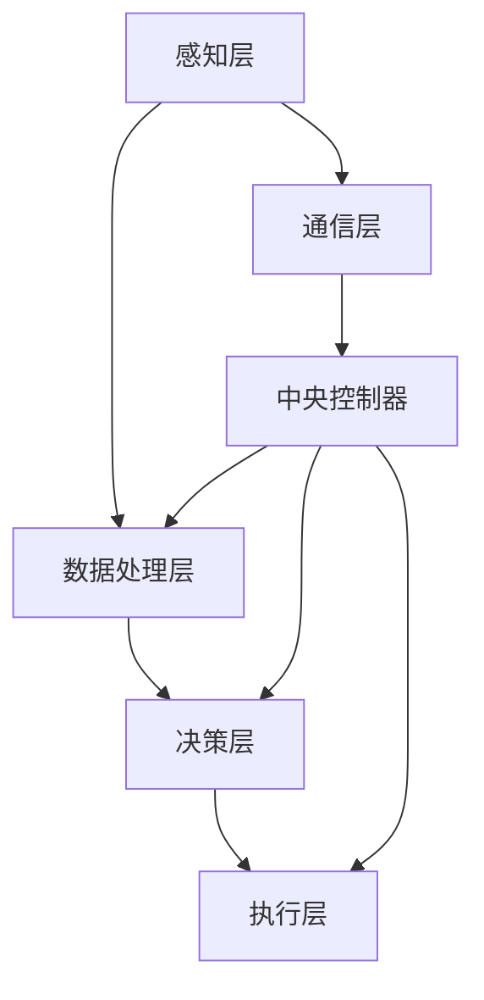
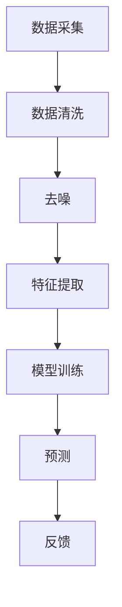
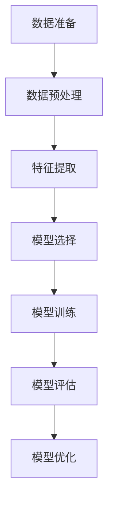
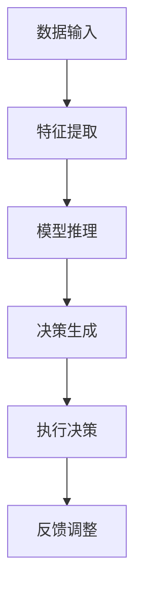

                 

### 1.1 《数字实体自动化的未来发展》概述

在当今数字化时代，自动化技术已经成为推动各行业进步的重要力量。而数字实体自动化作为自动化技术的一种新兴形式，更是引起了广泛关注。本篇文章将围绕《数字实体自动化的未来发展》这一主题，系统性地探讨该领域的研究现状、发展趋势以及未来可能的挑战与机遇。

首先，我们需要明确什么是数字实体自动化。数字实体是指数字化的物理对象或系统，如传感器网络、智能设备、工业机器人等。自动化则是指通过程序控制或机器学习等方法，使这些数字实体能够自主执行特定任务。因此，数字实体自动化即是利用计算机技术和人工智能，实现数字实体在执行任务过程中的自主性和智能化。

本篇文章将从以下几个方面展开讨论：

1. **理论基础**：介绍数字实体自动化的核心概念、基础理论和相关技术。
2. **核心算法原理**：详细讲解数字实体自动化的关键算法，包括传感器数据处理算法、机器学习算法和智能决策算法。
3. **数学模型与公式**：分析数学模型的基本概念，并详细讲解线性模型、神经网络模型和决策树模型等公式。
4. **项目实战**：通过实际案例，展示数字实体自动化的应用场景和实现过程。
5. **未来展望**：探讨数字实体自动化的未来发展趋势、行业应用前景以及面临的挑战与机遇。

通过以上几个部分的分析和探讨，希望能够对数字实体自动化的未来发展方向有一个全面而深入的了解。

### 1.2 数字实体自动化的概念与意义

数字实体自动化，顾名思义，是指通过计算机技术和人工智能手段，使数字化的物理对象或系统能够自主执行特定任务的过程。这些数字实体可以是传感器网络、智能设备、工业机器人等。具体来说，数字实体自动化的概念可以分解为以下几个关键组成部分：

**数字实体**：数字实体是指那些在数字化环境中被表示和处理的物理对象或系统。例如，传感器网络中的每一个传感器都是一个数字实体，它可以采集环境数据并传输给中央系统。智能设备如智能手机、智能家居设备等，也是典型的数字实体。工业机器人则是在工业生产中应用的数字化设备，能够执行诸如焊接、装配等重复性或危险的任务。

**自动化**：自动化是指利用机器或计算机控制技术，减少或消除人工操作的过程。在数字实体自动化中，通过编程或算法设计，使数字实体能够根据预设的规则或学习到的模式，自主执行任务。这种自主性大大提高了系统的效率和可靠性。

**数字化**：数字化是指将物理世界的信息转换成数字形式，以便于计算机处理和分析。在数字实体自动化中，数字化是基础，它使得物理对象或系统能够以数据的形式被捕捉、存储、传输和处理。

数字实体自动化的意义在于它不仅提升了系统的效率，还带来了深刻的变革。以下是数字实体自动化的几个重要意义：

1. **效率提升**：通过自动化，数字实体能够高效地执行任务，减少了人工操作的错误和延迟。例如，在智能制造中，工业机器人可以精确地完成装配任务，大大提高了生产效率。

2. **成本降低**：自动化减少了人力资源的依赖，降低了运营成本。例如，在智能交通系统中，自动化控制可以优化交通信号，减少拥堵，从而降低交通管理的成本。

3. **安全性提高**：自动化系统能够在危险或复杂的环境下执行任务，提高了操作的安全性。例如，在医疗领域，自动化机器人可以在手术中执行高精度的操作，减少手术风险。

4. **数据驱动决策**：自动化系统通过实时数据处理和分析，为决策提供了有力支持。例如，在能源管理中，自动化系统可以根据实时数据优化能源使用，提高能源效率。

5. **创新推动**：数字实体自动化激发了新的商业模式和产品创新。例如，在共享经济中，自动化系统优化了资源分配和调度，推动了共享单车、共享汽车等新业态的发展。

综上所述，数字实体自动化不仅在提高效率、降低成本、提高安全性和支持数据驱动决策方面具有显著优势，还推动了各行业的创新和发展。随着技术的不断进步，数字实体自动化的应用将越来越广泛，其意义也将更加深远。

### 1.3 当前数字化转型的趋势与挑战

当前，全球范围内的数字化转型正在迅速推进，各行各业都在积极拥抱数字化技术，以提升效率、降低成本、增强竞争力。数字化转型不仅改变了企业的运营方式，也深刻影响了整个社会的运作模式。以下是数字化转型的主要趋势和面临的挑战。

#### 趋势 1：云计算和大数据的普及

云计算和大数据技术的普及是数字化转型的重要驱动力。云计算提供了弹性、灵活的计算资源，使企业能够快速部署和扩展应用程序。大数据技术则帮助企业从海量数据中提取有价值的信息，支持数据驱动的决策。越来越多的企业开始采用云计算和大数据平台，以提升业务效率和创新能力。

#### 趋势 2：物联网（IoT）的广泛应用

物联网技术的快速发展使得各种设备能够互联互通，实现智能化的管理和控制。智能家居、智能工厂、智能交通等场景中，物联网设备广泛应用，收集和传输大量的实时数据，为自动化决策提供了基础。物联网技术的普及不仅提高了设备的管理效率，还推动了新业务模式和商业模式的出现。

#### 趋势 3：人工智能（AI）的迅速发展

人工智能技术的突破性进展为数字化转型注入了新的活力。通过机器学习、深度学习等算法，AI能够自动处理和分析大量数据，识别模式、做出预测和决策。在图像识别、自然语言处理、自动驾驶等领域，AI的应用已经取得了显著的成果。人工智能的迅速发展，为数字实体自动化提供了强有力的技术支持。

#### 挑战 1：数据安全和隐私保护

数字化转型带来了大量数据，但同时也带来了数据安全和隐私保护的挑战。企业需要确保收集、存储和处理的数据受到严格保护，避免数据泄露和滥用。随着数据隐私法规的日益严格，企业需要在合规性和安全性之间找到平衡。

#### 挑战 2：技术人才的短缺

数字化转型需要大量的技术人才，包括数据科学家、AI工程师、云计算专家等。然而，当前全球范围内的技术人才短缺问题依然严重，许多企业难以招聘到所需的专业人才。解决技术人才短缺问题，需要通过教育培养和人才引进等多种途径。

#### 挑战 3：技术集成和标准化

数字化转型涉及多种技术和系统的集成，包括云计算、大数据、物联网、人工智能等。不同技术之间的兼容性和标准化问题，使得系统集成变得复杂和困难。技术集成和标准化是数字化转型成功的关键，需要行业内的共同努力。

#### 挑战 4：业务模式的变革

数字化转型不仅改变了企业的运营方式，还带来了业务模式的变革。企业需要重新思考其价值创造方式，探索新的商业模式。然而，业务模式的变革也带来了不确定性和风险，企业需要在变革中找到平衡。

总之，当前数字化转型正处于快速发展的阶段，尽管面临着诸多挑战，但数字化技术带来的机遇和优势同样巨大。通过应对这些挑战，企业可以更好地把握数字化转型的机遇，实现业务和技术的双重提升。

### 1.4 书籍结构与内容安排

本篇文章旨在全面探讨数字实体自动化的未来发展，为了确保内容系统性和连贯性，我们将文章分为六个主要部分，每个部分都有其独特的内容和目标。

**第一部分：引言与背景**

这一部分将介绍数字实体自动化的概念与意义，探讨其研究背景和当前数字化转型的趋势与挑战。通过这部分内容，读者可以对数字实体自动化有一个初步的认识和整体把握。

**第二部分：理论基础**

这一部分将深入探讨数字实体自动化的核心概念、基础理论和相关技术。包括数字实体概述、自动化的基本原理以及数字实体自动化的架构设计。这部分内容旨在为读者奠定坚实的理论基础。

**第三部分：核心算法原理**

这一部分将详细讲解数字实体自动化的关键算法，包括传感器数据处理算法、机器学习算法和智能决策算法。通过具体原理的阐述和伪代码展示，帮助读者理解这些算法的实现和应用。

**第四部分：数学模型与公式**

这一部分将分析数学模型的基本概念，并详细讲解线性模型、神经网络模型和决策树模型等公式。通过具体公式的推导和举例说明，读者可以更好地理解这些数学模型在实际应用中的作用。

**第五部分：项目实战**

这一部分将通过实际案例展示数字实体自动化的应用场景和实现过程。包括开发环境搭建、源代码实现和代码解读与分析。这部分内容旨在让读者通过实战了解数字实体自动化的具体实现方法和技巧。

**第六部分：未来展望**

这一部分将探讨数字实体自动化的未来发展趋势、行业应用前景以及面临的挑战与机遇。通过这部分内容，读者可以展望数字实体自动化的未来发展，了解该领域的前沿动态。

整个书籍的结构和内容安排旨在循序渐进地引导读者深入了解数字实体自动化的各个方面，从基础理论到实际应用，再到未来展望。希望通过这样的结构安排，读者能够系统地掌握数字实体自动化的知识体系，并对该领域的发展有更深入的理解。

## 第二部分：理论基础

在探讨数字实体自动化的未来发展之前，我们首先需要理解其理论基础。数字实体自动化的核心概念、基础理论和相关技术构成了这一部分的主要内容。通过详细分析这些理论，我们可以为后续内容的应用和实践打下坚实的基础。

### 2.1 数字实体自动化的核心概念

数字实体自动化的核心概念可以分为数字实体、自动化和数字化三个主要方面。

**数字实体**：数字实体是指被数字化表示和处理的物理对象或系统。它可以是传感器、智能设备、工业机器人等。数字实体具有以下特点：

1. **数据采集能力**：数字实体能够通过内置的传感器或其他数据采集设备，实时采集环境或状态数据。
2. **网络通信能力**：数字实体可以通过有线或无线网络与其他数字实体或中央系统进行通信，实现数据交换和控制指令的传递。
3. **自主处理能力**：数字实体具有一定的处理能力，能够根据预设的规则或学习到的模式，自主执行任务或响应环境变化。

**自动化**：自动化是指通过程序控制或机器学习等方法，使数字实体能够自主执行特定任务的过程。自动化具有以下特点：

1. **减少人工操作**：自动化系统通过预设的程序或算法，减少或消除人工干预，从而提高工作效率和准确性。
2. **智能决策**：自动化系统可以利用传感器采集的数据，通过机器学习算法进行分析和预测，做出智能决策。
3. **自适应能力**：自动化系统能够根据环境变化和任务需求，自适应地调整其行为和策略。

**数字化**：数字化是指将物理世界的信息转换成数字形式，以便于计算机处理和分析。数字化具有以下特点：

1. **数据化**：通过数字化，物理对象或系统的状态和变化可以转化为数据，方便存储、传输和处理。
2. **标准化**：数字化使得不同来源的数据可以统一表示和存储，便于数据交换和共享。
3. **智能化**：数字化数据可以用于训练机器学习模型，支持智能决策和自动化系统的实现。

**数字实体自动化的特征**：

1. **智能性**：数字实体自动化系统具有智能性，能够通过机器学习算法实现自主学习和进化。
2. **适应性**：数字实体自动化系统能够根据环境变化和任务需求，自适应调整其行为和策略。
3. **集成性**：数字实体自动化涉及多种技术和系统的集成，包括传感器、通信、数据处理和机器学习等。
4. **协同性**：多个数字实体可以协同工作，实现复杂的任务和目标。

通过理解数字实体自动化的核心概念，我们可以更好地把握其理论基础，为后续内容的研究和应用打下基础。

### 2.2 自动化的基本原理

自动化技术的核心在于通过预设的规则或学习到的模式，使系统自主地执行任务。以下是自动化的基本原理：

**1. 预设规则**

预设规则是自动化系统最基本的形式。通过编程或规则定义，系统可以按照预定的步骤和条件自动执行任务。预设规则通常包括以下几种类型：

- **顺序规则**：按照一定的顺序执行一系列操作。
- **条件规则**：根据某个条件的成立与否，选择执行不同的操作。
- **循环规则**：重复执行某一段代码，直到满足某个条件为止。

预设规则简单直观，适用于任务流程清晰、条件固定的情况。然而，在复杂多变的环境中，预设规则往往难以满足需求。

**2. 机器学习**

机器学习是自动化技术的关键组成部分，它通过从数据中学习模式和规律，使系统能够自主地做出决策。机器学习可以分为以下几种类型：

- **监督学习**：通过已标记的数据训练模型，使系统能够预测未知数据的结果。
- **无监督学习**：在没有标记数据的情况下，通过数据自身的结构和学习模式，使系统能够发现数据中的规律。
- **强化学习**：通过不断尝试和反馈，使系统在学习过程中不断优化其行为。

机器学习能够处理复杂的环境和任务，使自动化系统具备自适应能力和智能决策能力。

**3. 传感器和反馈**

传感器是自动化系统获取环境信息的重要手段。通过传感器，系统可以实时监测环境变化，获取数据并反馈给中央控制器。反馈机制是自动化系统的核心，它通过实时数据调整系统的行为，确保系统能够适应环境变化并优化任务执行。

**4. 控制算法**

控制算法是自动化系统的核心，它决定了系统的行为和响应。控制算法可以分为以下几种类型：

- **开环控制**：仅根据预设规则或输入信号执行任务，不考虑系统状态和环境变化。
- **闭环控制**：根据系统状态和环境反馈，不断调整系统行为，使系统能够自适应地执行任务。

开环控制和闭环控制各有优缺点，开环控制简单高效，但缺乏自适应能力；闭环控制具备自适应能力，但复杂度和计算量较大。

通过理解自动化的基本原理，我们可以更好地设计数字实体自动化系统，确保其在复杂环境中的高效运行。

### 2.3 数字实体自动化的基础理论

数字实体自动化的基础理论涉及多个学科领域，包括计算机科学、控制理论、人工智能和传感器技术等。以下是对这些基础理论的基本概述。

**1. 计算机科学**

计算机科学是数字实体自动化的核心基础，它提供了算法设计、编程语言、数据处理和存储等方面的理论支持。计算机科学中的算法设计原理，如贪心算法、动态规划、分治算法等，是数字实体自动化算法设计的重要参考。编程语言如Python、Java等，提供了强大的工具和库，支持自动化系统的开发和实现。此外，计算机科学中的数据结构和算法理论，如树结构、图算法等，也为数字实体自动化的数据处理提供了基础。

**2. 控制理论**

控制理论是数字实体自动化的关键组成部分，它研究了如何设计和实现自动化控制系统，以实现预期的行为和性能。控制理论的基本概念包括开环控制和闭环控制、反馈机制、控制算法等。开环控制通过预设规则直接执行任务，而闭环控制通过实时反馈调整系统的行为。控制理论中的经典算法如PID控制、模糊控制等，广泛应用于数字实体自动化系统。此外，现代控制理论中的自适应控制和鲁棒控制等概念，也为数字实体自动化的稳定性、可靠性和自适应能力提供了理论支持。

**3. 人工智能**

人工智能是数字实体自动化的核心技术，它通过机器学习、深度学习、自然语言处理等技术，使系统具备自主学习和智能决策能力。机器学习算法如监督学习、无监督学习和强化学习，能够从数据中学习模式和规律，实现自动化的预测和决策。深度学习则通过多层神经网络，实现了更复杂的特征提取和模式识别能力。自然语言处理技术则使系统能够理解和处理自然语言，实现人机交互。此外，人工智能中的强化学习算法，通过不断尝试和反馈，使系统能够在复杂环境中不断优化其行为。

**4. 传感器技术**

传感器技术是数字实体自动化的感知层基础，它通过传感器采集环境数据，为自动化系统提供感知输入。传感器技术包括多种类型，如温度传感器、压力传感器、光学传感器、RFID等。每种传感器都有其特定的物理原理和测量范围。传感器技术的进步，如高精度、低功耗、多模态传感等，为数字实体自动化提供了更丰富的感知能力。此外，多传感器融合技术，通过整合多种传感器数据，提高了系统的感知准确性和可靠性。

**5. 网络通信技术**

网络通信技术是数字实体自动化系统的通信层基础，它提供了传感器和中央控制器之间的数据传输和通信机制。网络通信技术包括有线通信和无线通信两种形式。有线通信如以太网、光纤等，提供了高带宽、低延迟的通信方式。无线通信如Wi-Fi、蓝牙、Zigbee等，提供了灵活、便捷的通信方式。此外，物联网（IoT）技术的兴起，使得各种设备能够通过互联网进行互联互通，为数字实体自动化系统的构建提供了强大的支持。

通过理解数字实体自动化的基础理论，我们可以更好地设计和发展自动化系统，确保其在复杂环境中的高效运行和智能决策。这些基础理论不仅为数字实体自动化的实现提供了指导，也为未来的研究和应用奠定了基础。

### 2.4 自动化技术的发展与应用

自动化技术经历了数十年的发展，从早期的机械自动化到现代的智能自动化，其应用范围和影响力不断扩展。本节将回顾自动化技术的历史发展，并探讨其在现代数字实体自动化中的主要应用。

**自动化技术的历史发展**

1. **早期自动化**：20世纪初，自动化技术开始萌芽。最早的自动化系统是基于机械和电气的控制，例如机床的自动化操作。这些系统通过预设的规则和机械结构，实现了生产过程的自动化。

2. **电气自动化**：20世纪中叶，随着电子技术的快速发展，自动化技术进入了电气自动化阶段。这一阶段的主要特点是采用继电器、电子电路等实现自动控制，例如自动生产线的应用。

3. **计算机自动化**：20世纪70年代，计算机技术的引入推动了自动化技术向计算机自动化的发展。计算机自动化利用计算机的强大计算能力和存储能力，实现了更复杂的控制任务和数据处理。

4. **智能自动化**：20世纪末至今，随着人工智能技术的兴起，自动化技术进入了智能自动化阶段。智能自动化通过机器学习、深度学习等算法，使系统具备自适应能力和智能决策能力，例如自动驾驶、智能家居等。

**自动化技术在现代数字实体自动化中的主要应用**

1. **智能制造**：智能制造是自动化技术的重要应用领域。通过自动化生产线和智能设备，企业能够实现生产过程的全面自动化，提高生产效率和质量。智能制造还包括智能工厂的构建，通过物联网技术和大数据分析，实现生产资源的优化配置和智能调度。

2. **智能交通**：智能交通系统利用自动化技术，优化交通信号控制、车辆调度和道路管理。例如，通过智能交通信号灯，可以根据实时交通流量调整信号时长，减少交通拥堵。此外，自动驾驶技术也是智能交通的重要组成部分，通过传感器和智能算法，实现车辆的自主驾驶和安全行驶。

3. **智能医疗**：智能医疗利用自动化技术，提升医疗服务的效率和准确性。自动化系统在医学影像分析、药物配送、手术机器人等方面发挥了重要作用。例如，通过人工智能算法，可以自动分析医学影像，提高疾病诊断的准确性。手术机器人则通过精确的操作，减少手术风险和提高手术成功率。

4. **智能安防**：智能安防系统通过自动化技术，实现对公共场所、家庭等的安全监控和管理。例如，智能摄像头通过图像识别技术，自动识别异常行为并报警。此外，自动化门禁系统、智能巡逻机器人等，也为安全监控提供了技术支持。

5. **智能农业**：智能农业利用自动化技术，实现农作物的精准管理和高效生产。自动化传感器可以实时监测土壤湿度、温度、养分等参数，智能灌溉系统根据监测数据自动调整灌溉量。无人机则通过自动化飞行，进行农田巡查和农药喷洒。

6. **智能家居**：智能家居系统通过自动化技术，使家庭设备实现智能化和自动化控制。例如，智能门锁、智能照明、智能空调等，通过物联网技术和智能算法，实现设备之间的互联互通和自动控制，提升居住舒适度和便利性。

综上所述，自动化技术在现代数字实体自动化中有着广泛的应用，不仅提升了各行业的效率和质量，还推动了新业务模式的出现。随着技术的不断进步，自动化技术将在未来发挥更加重要的作用。

### 2.5 数字实体自动化的架构设计

数字实体自动化的架构设计是确保系统高效、稳定运行的关键。一个良好的架构设计不仅要满足功能需求，还需要具备可扩展性、可靠性和灵活性。以下是数字实体自动化架构设计的基本原则、模块化设计和优化策略。

**2.5.1 架构设计的基本原则**

1. **模块化原则**：模块化设计是将系统划分为若干独立的模块，每个模块负责特定的功能。这种设计方式使得系统更容易维护、扩展和复用。模块化设计有助于提高系统的可读性、可测试性和可维护性。

2. **分层原则**：分层设计是将系统划分为多个层次，每个层次负责不同的功能。常见的分层包括感知层、通信层、数据处理层、决策层和执行层。这种设计方式有助于明确各层次之间的职责和接口，提高系统的模块化和可维护性。

3. **冗余和备份原则**：为了保证系统的可靠性，架构设计中需要考虑冗余和备份机制。例如，通过冗余传感器和数据源，提高系统的容错能力；通过备份机制，确保数据的安全性和一致性。

4. **可扩展性原则**：随着业务需求的变化，系统需要具备良好的扩展性。可扩展性原则要求系统在设计时预留足够的扩展接口和扩展空间，以支持未来的功能扩展和性能提升。

5. **安全性原则**：安全性是数字实体自动化架构设计的重要考虑因素。系统需要采用加密、认证、访问控制等技术，确保数据传输和存储的安全。此外，还需要定期进行安全审计和漏洞修复，确保系统的安全性。

**2.5.2 模块化设计**

模块化设计是将系统功能划分为多个独立的模块，每个模块负责特定的功能。以下是数字实体自动化系统常见的模块：

1. **感知模块**：负责采集环境数据，包括传感器数据、图像数据、语音数据等。感知模块通常包括数据采集、预处理和特征提取等功能。

2. **通信模块**：负责处理数字实体之间的数据传输和通信。通信模块需要支持多种通信协议和数据传输方式，如TCP/IP、Wi-Fi、蓝牙等。

3. **数据处理模块**：负责对感知模块采集的数据进行处理和分析，包括数据清洗、数据融合、特征提取和模式识别等。数据处理模块的核心算法包括机器学习算法、深度学习算法等。

4. **决策模块**：负责根据分析结果做出决策，包括分类、预测、优化等。决策模块通常利用智能算法和优化算法，实现自动化的决策和调度。

5. **执行模块**：负责执行决策模块做出的决策，包括控制物理设备、执行任务等。执行模块需要与硬件设备和接口紧密集成，实现高效的执行和响应。

**2.5.3 优化策略**

数字实体自动化系统的优化策略包括以下几个方面：

1. **算法优化**：通过对核心算法进行优化，提高系统的效率和准确性。例如，使用更高效的算法实现数据预处理、特征提取和决策过程。

2. **系统优化**：通过对系统架构进行优化，提高系统的可扩展性和可靠性。例如，通过分布式架构、负载均衡等技术，提高系统的处理能力和容错性。

3. **资源优化**：通过对资源进行优化，提高系统的资源利用率。例如，通过任务调度和资源分配算法，实现设备的负载均衡和资源优化。

4. **数据优化**：通过对数据进行分析和优化，提高数据的质量和利用率。例如，通过数据清洗、数据压缩和数据挖掘等技术，提高数据的可操作性和价值。

5. **能耗优化**：通过对系统能耗进行优化，提高系统的绿色环保性能。例如，通过节能算法和智能调度，降低系统的能耗和碳排放。

通过遵循以上架构设计原则、模块化设计和优化策略，可以构建高效、可靠和灵活的数字实体自动化系统，为各行业提供强有力的技术支持。

### 3.1 数字实体自动化的关键算法

数字实体自动化的核心在于其算法的先进性和高效性。关键算法是数字实体自动化系统中的核心组成部分，它们负责数据处理、模式识别、决策生成等功能。以下是数字实体自动化的几个关键算法：

#### 3.1.1 传感器数据处理算法

传感器数据处理算法是数字实体自动化系统的基础，负责对传感器采集的数据进行处理和分析。以下是一些常用的传感器数据处理算法：

1. **数据采集与预处理**：首先，传感器采集的数据往往包含噪声和缺失值，需要进行数据采集和预处理。数据采集过程包括传感器的校准和配置，以确保数据的准确性和一致性。预处理过程包括数据清洗、去噪、插补等，以提高数据的可用性和质量。

2. **特征提取与降维**：特征提取是从原始数据中提取出有意义的特征，用于后续的分析和决策。常用的特征提取方法包括傅里叶变换、小波变换、主成分分析（PCA）等。降维是将高维数据转换成低维数据，以减少数据存储和计算量。常用的降维方法包括PCA、线性判别分析（LDA）等。

3. **数据融合与关联分析**：在复杂环境中，多个传感器可能会同时采集数据，这些数据之间存在复杂的关联关系。数据融合是将多个传感器的数据整合起来，以获得更准确和全面的信息。常用的数据融合方法包括卡尔曼滤波、贝叶斯网络等。关联分析则是通过分析传感器数据之间的关系，发现数据中的潜在模式和规律。

#### 3.1.2 机器学习算法

机器学习算法是数字实体自动化系统中的一种重要技术，它通过从数据中学习模式和规律，实现自动化的预测和决策。以下是几种常用的机器学习算法：

1. **监督学习**：监督学习算法通过训练已标记的数据集，学习输入和输出之间的关系，从而对未知数据进行预测。常见的监督学习算法包括线性回归、逻辑回归、支持向量机（SVM）等。

2. **无监督学习**：无监督学习算法在没有标记数据的情况下，通过分析数据的内在结构，发现数据中的模式和规律。常见的无监督学习算法包括聚类算法（如K-Means、层次聚类等）、降维算法（如PCA、t-SNE等）。

3. **强化学习**：强化学习算法通过不断尝试和反馈，学习如何在环境中的行动策略，以实现最大化长期奖励。常见的强化学习算法包括Q-Learning、SARSA、深度强化学习（DRL）等。

#### 3.1.3 智能决策算法

智能决策算法是数字实体自动化系统中的高级技术，它通过综合分析多种因素，实现智能化的决策和调度。以下是几种常用的智能决策算法：

1. **多目标优化**：多目标优化算法用于解决具有多个目标函数的问题，通过优化多个目标之间的平衡，找到最优解。常见的方法包括遗传算法、粒子群优化（PSO）、蚁群算法等。

2. **决策树**：决策树是一种常用的分类和回归算法，它通过一系列的决策节点和叶子节点，构建一个树形结构，对输入数据进行分类或回归。常见的决策树算法包括ID3、C4.5、CART等。

3. **神经网络**：神经网络是一种模拟人脑神经元结构的计算模型，通过多层神经网络，实现复杂的数据处理和模式识别。常见的神经网络算法包括前馈神经网络、卷积神经网络（CNN）、循环神经网络（RNN）等。

通过理解这些关键算法，我们可以更好地设计和发展数字实体自动化系统，确保其在复杂环境中的高效运行和智能决策。

### 3.2 算法原理讲解

在了解了数字实体自动化的关键算法后，接下来我们将详细讲解这些算法的原理，以帮助读者深入理解其在实际应用中的作用。

#### 3.2.1 传感器数据处理算法原理

传感器数据处理算法是数字实体自动化系统的核心，它负责处理和分析从传感器采集到的数据。以下是传感器数据处理算法的基本原理：

##### 3.2.1.1 数据采集与预处理

数据采集是传感器数据处理的第一步，它涉及从传感器获取环境数据。传感器数据可能包括温度、湿度、压力、速度等各种物理量。在数据采集过程中，传感器需要校准和配置，以确保数据的准确性和一致性。

数据预处理是数据处理的重要环节，它包括数据清洗、去噪和插补等步骤。数据清洗旨在去除噪声数据和异常值，提高数据的质量。去噪是通过滤波等算法，减少数据中的噪声成分。插补则是通过补全缺失数据，使数据序列完整。

##### 3.2.1.2 特征提取与降维

特征提取是从原始数据中提取出有意义的特征，用于后续的分析和决策。特征提取的方法包括傅里叶变换、小波变换、主成分分析（PCA）等。傅里叶变换和小波变换用于提取时间域和频率域的特征，PCA则通过降维，提取数据的主要特征。

降维是将高维数据转换成低维数据，以减少数据存储和计算量。降维方法包括PCA、线性判别分析（LDA）等。PCA通过计算数据的主成分，提取数据的主要特征，LDA则通过最大化类内方差和最小化类间方差，进行特征选择。

##### 3.2.1.3 数据融合与关联分析

数据融合是将多个传感器的数据整合起来，以获得更准确和全面的信息。数据融合方法包括卡尔曼滤波、贝叶斯网络等。卡尔曼滤波通过状态估计和误差校正，实现数据融合，贝叶斯网络则通过概率模型，进行数据融合和关联分析。

关联分析是分析传感器数据之间的关系，发现数据中的潜在模式和规律。关联分析方法包括聚类分析、关联规则学习等。聚类分析通过将数据分成不同的簇，发现数据中的相似性，关联规则学习则通过挖掘数据之间的关联规则，发现数据中的因果关系。

通过传感器数据处理算法，数字实体自动化系统能够从传感器采集的数据中提取有价值的信息，为后续的决策和分析提供基础。

#### 3.2.2 机器学习算法原理

机器学习算法是数字实体自动化系统中的重要技术，它通过从数据中学习模式和规律，实现自动化的预测和决策。以下是几种常用的机器学习算法的原理：

##### 3.2.2.1 监督学习

监督学习算法通过训练已标记的数据集，学习输入和输出之间的关系，从而对未知数据进行预测。监督学习算法分为回归算法和分类算法。

- **线性回归**：线性回归是一种简单的回归算法，它通过拟合数据点的线性关系，预测新的数据点的值。线性回归的公式为：
  \[
  y = \beta_0 + \beta_1x
  \]
  其中，\( y \) 是预测值，\( \beta_0 \) 是截距，\( \beta_1 \) 是斜率，\( x \) 是输入特征。

- **逻辑回归**：逻辑回归是一种用于分类的算法，它通过拟合数据的对数几率，预测新的数据点的类别。逻辑回归的公式为：
  \[
  \log\left(\frac{P(Y=1)}{1-P(Y=1)}\right) = \beta_0 + \beta_1x
  \]
  其中，\( P(Y=1) \) 是预测变量为1的概率。

- **支持向量机（SVM）**：支持向量机是一种强大的分类算法，它通过找到一个最佳的超平面，将不同类别的数据点分开。SVM的公式为：
  \[
  w \cdot x + b = 0
  \]
  其中，\( w \) 是超平面的法向量，\( x \) 是输入特征，\( b \) 是偏置项。

##### 3.2.2.2 无监督学习

无监督学习算法在没有标记数据的情况下，通过分析数据的内在结构，发现数据中的模式和规律。

- **K-Means聚类**：K-Means聚类是一种简单的聚类算法，它通过将数据点划分为K个簇，使每个簇内部的数据点尽可能接近，簇与簇之间的数据点尽可能远离。K-Means聚类的公式为：
  \[
  c_k = \frac{1}{N_k} \sum_{i=1}^{N_k} x_i
  \]
  其中，\( c_k \) 是簇的中心，\( N_k \) 是簇中的数据点数量，\( x_i \) 是数据点的坐标。

- **主成分分析（PCA）**：主成分分析是一种降维算法，它通过将数据投影到新的正交坐标系中，提取数据的主要特征。PCA的公式为：
  \[
  z = PC
  \]
  其中，\( z \) 是降维后的数据，\( P \) 是特征矩阵，\( C \) 是协方差矩阵。

##### 3.2.2.3 强化学习

强化学习算法通过不断尝试和反馈，学习如何在环境中的行动策略，以实现最大化长期奖励。强化学习算法分为值函数方法和策略方法。

- **Q-Learning**：Q-Learning是一种值函数方法，它通过更新Q值，学习最优动作策略。Q-Learning的公式为：
  \[
  Q(s, a) = Q(s, a) + \alpha [r + \gamma \max_{a'} Q(s', a') - Q(s, a)]
  \]
  其中，\( Q(s, a) \) 是状态-动作值函数，\( \alpha \) 是学习率，\( r \) 是即时奖励，\( \gamma \) 是折扣因子，\( s \) 和 \( s' \) 分别是当前状态和下一个状态，\( a \) 和 \( a' \) 分别是当前动作和下一个动作。

- **SARSA**：SARSA是一种策略方法，它通过更新策略概率，学习最优动作策略。SARSA的公式为：
  \[
  \pi(s, a) = \frac{\pi(s, a) + \alpha}{1 + \alpha}
  \]
  其中，\( \pi(s, a) \) 是状态-动作概率。

通过理解这些机器学习算法的原理，数字实体自动化系统能够从数据中学习模式和规律，实现高效的预测和决策。

#### 3.2.3 智能决策算法原理

智能决策算法是数字实体自动化系统中的高级技术，它通过综合分析多种因素，实现智能化的决策和调度。以下是几种常用的智能决策算法的原理：

##### 3.2.3.1 决策理论

决策理论是一种基于概率和效用理论的决策方法，它通过分析决策者的偏好和不确定性，选择最优决策。

- **期望效用理论**：期望效用理论通过计算每个决策的期望效用，选择效用最大的决策。期望效用公式为：
  \[
  EU = \sum_{i=1}^{n} p_i u_i
  \]
  其中，\( p_i \) 是事件 \( i \) 发生的概率，\( u_i \) 是事件 \( i \) 的效用值。

- **前景理论**：前景理论通过计算前景效用，考虑决策者的风险偏好和决策过程中的参考点。前景效用公式为：
  \[
  EU = \frac{p_1 v_1 + p_2 v_2}{1 + \lambda}
  \]
  其中，\( p_1 \) 和 \( p_2 \) 是事件 \( 1 \) 和 \( 2 \) 发生的概率，\( v_1 \) 和 \( v_2 \) 是事件 \( 1 \) 和 \( 2 \) 的价值。

##### 3.2.3.2 多目标优化

多目标优化是一种解决具有多个目标函数的问题的方法，它通过优化多个目标之间的平衡，找到最优解。

- **Pareto优化**：Pareto优化通过找到Pareto前沿，选择非支配解。Pareto前沿是在目标空间中，满足Pareto最优的解集。

- **加权法**：加权法通过给每个目标函数赋予不同的权重，进行线性加权，找到最优解。加权法公式为：
  \[
  z = \sum_{i=1}^{m} w_i f_i
  \]
  其中，\( w_i \) 是目标函数 \( f_i \) 的权重，\( z \) 是加权目标函数。

##### 3.2.3.3 机器学习在决策中的应用

机器学习算法在决策中有着广泛的应用，通过学习历史数据，实现自动化的决策和调度。

- **分类**：分类算法通过学习数据中的分类规律，对新数据进行分类。常见的分类算法包括决策树、支持向量机、随机森林等。

- **回归**：回归算法通过学习数据中的回归关系，预测新的数据点的值。常见的回归算法包括线性回归、岭回归、LASSO回归等。

- **优化**：优化算法通过学习数据中的最优解，找到最佳决策。常见的优化算法包括遗传算法、粒子群优化、蚁群算法等。

通过理解这些智能决策算法的原理，数字实体自动化系统能够在复杂环境中做出高效的决策和调度。

### 4.1 数学模型的基本概念

数学模型是数字实体自动化系统中不可或缺的部分，它通过数学公式和算法描述系统的行为和特性。数学模型可以分为线性模型、非线性模型和概率模型等类型，每种模型都有其特定的应用场景和优势。

#### 4.1.1 线性模型

线性模型是最基础和最常用的数学模型，它假设系统之间的关系可以用线性方程来表示。线性模型的主要优点是简单、直观，便于计算和分析。以下是一些常见的线性模型：

1. **一元线性回归**：
   \[
   y = \beta_0 + \beta_1x
   \]
   其中，\( y \) 是因变量，\( x \) 是自变量，\( \beta_0 \) 是截距，\( \beta_1 \) 是斜率。

2. **多元线性回归**：
   \[
   y = \beta_0 + \beta_1x_1 + \beta_2x_2 + \cdots + \beta_nx_n
   \]
   其中，\( y \) 是因变量，\( x_1, x_2, \ldots, x_n \) 是自变量，\( \beta_0, \beta_1, \beta_2, \ldots, \beta_n \) 是回归系数。

线性模型在数字实体自动化系统中广泛应用于预测和分类任务，例如，预测温度变化、分析股票市场趋势等。

#### 4.1.2 非线性模型

非线性模型用于描述系统中非线性关系，它能够更准确地捕捉复杂系统的动态行为。以下是一些常见的非线性模型：

1. **神经网络模型**：
   \[
   a_i = \sigma(\beta_0 + \sum_{j=1}^{n} \beta_jx_{ij})
   \]
   其中，\( a_i \) 是第 \( i \) 个神经元的输出，\( \sigma \) 是激活函数，\( \beta_0, \beta_1, \beta_2, \ldots, \beta_n \) 是权重系数，\( x_{ij} \) 是输入特征。

2. **逻辑回归**：
   \[
   P(Y=1) = \frac{1}{1 + \exp(-\beta_0 - \beta_1x)}
   \]
   其中，\( P(Y=1) \) 是因变量为1的概率，\( x \) 是自变量，\( \beta_0, \beta_1 \) 是回归系数。

非线性模型在数字实体自动化系统中广泛应用于模式识别、分类和预测任务，例如，图像识别、语音识别等。

#### 4.1.3 概率模型

概率模型用于描述系统中不确定性和随机性，它通过概率分布和随机过程来描述系统的行为。以下是一些常见的概率模型：

1. **贝叶斯网络**：
   \[
   P(A|B) = \frac{P(B|A)P(A)}{P(B)}
   \]
   其中，\( P(A|B) \) 是在 \( B \) 发生的条件下 \( A \) 发生的概率，\( P(B|A) \) 是在 \( A \) 发生的条件下 \( B \) 发生的概率，\( P(A) \) 和 \( P(B) \) 分别是 \( A \) 和 \( B \) 的概率。

2. **马尔可夫模型**：
   \[
   P(X_t|X_{t-1}) = P(X_t)
   \]
   其中，\( X_t \) 是在时间 \( t \) 的状态，\( X_{t-1} \) 是在时间 \( t-1 \) 的状态。

概率模型在数字实体自动化系统中广泛应用于决策、规划和预测任务，例如，智能交通系统的调度、医疗诊断等。

通过理解这些数学模型的基本概念，我们可以更好地设计和实现数字实体自动化系统，提高系统的预测能力和决策效率。

#### 4.2.1 线性回归模型公式

线性回归模型是数字实体自动化系统中常用的一种数学模型，主要用于预测和分析两个或多个变量之间的线性关系。以下将详细讲解线性回归模型的基本公式，包括一元线性回归和多元线性回归。

**一元线性回归**

一元线性回归模型是最简单的线性回归模型，用于描述两个变量之间的线性关系。其公式如下：
\[
y = \beta_0 + \beta_1x
\]
其中：

- \( y \) 是因变量，代表我们希望预测的变量；
- \( x \) 是自变量，代表我们用来预测 \( y \) 的变量；
- \( \beta_0 \) 是截距，代表当 \( x = 0 \) 时 \( y \) 的值；
- \( \beta_1 \) 是斜率，代表 \( x \) 每增加一个单位时 \( y \) 的变化量。

在具体应用中，我们需要通过最小二乘法来估计 \( \beta_0 \) 和 \( \beta_1 \) 的值，使得实际观测值 \( y \) 与预测值 \( y' \) 之间的误差平方和最小。最小二乘法的公式如下：
\[
\beta_0 = \frac{\sum_{i=1}^{n}y_i - \beta_1\sum_{i=1}^{n}x_i}{n}
\]
\[
\beta_1 = \frac{n\sum_{i=1}^{n}x_iy_i - \sum_{i=1}^{n}x_i\sum_{i=1}^{n}y_i}{n\sum_{i=1}^{n}x_i^2 - (\sum_{i=1}^{n}x_i)^2}
\]

**多元线性回归**

多元线性回归模型用于描述多个自变量和一个因变量之间的线性关系，其公式如下：
\[
y = \beta_0 + \beta_1x_1 + \beta_2x_2 + \cdots + \beta_nx_n
\]
其中：

- \( y \) 是因变量；
- \( x_1, x_2, \ldots, x_n \) 是自变量；
- \( \beta_0 \) 是截距；
- \( \beta_1, \beta_2, \ldots, \beta_n \) 是各个自变量的回归系数。

与一元线性回归类似，多元线性回归也通过最小二乘法来估计各个回归系数的值。最小二乘法的公式如下：
\[
\beta_0 = \frac{\sum_{i=1}^{n}y_i - \sum_{i=1}^{n}\beta_1x_{i1} - \sum_{i=1}^{n}\beta_2x_{i2} - \cdots - \sum_{i=1}^{n}\beta_nx_{in}}{n}
\]
\[
\beta_1 = \frac{\sum_{i=1}^{n}x_{i1}y_i - \sum_{i=1}^{n}x_{i1}\sum_{i=1}^{n}y_i}{\sum_{i=1}^{n}x_{i1}^2 - (\sum_{i=1}^{n}x_{i1})^2}
\]
\[
\beta_2 = \frac{\sum_{i=1}^{n}x_{i2}y_i - \sum_{i=1}^{n}x_{i2}\sum_{i=1}^{n}y_i}{\sum_{i=1}^{n}x_{i2}^2 - (\sum_{i=1}^{n}x_{i2})^2}
\]
\[
\vdots
\]
\[
\beta_n = \frac{\sum_{i=1}^{n}x_{in}y_i - \sum_{i=1}^{n}x_{in}\sum_{i=1}^{n}y_i}{\sum_{i=1}^{n}x_{in}^2 - (\sum_{i=1}^{n}x_{in})^2}
\]

通过这些公式，我们可以建立和训练线性回归模型，从而对未知数据进行预测和分析。线性回归模型在数字实体自动化系统中有着广泛的应用，如传感器数据预测、设备状态监控等。

#### 4.2.2 神经网络模型公式

神经网络模型是数字实体自动化系统中一种重要的非线性模型，它通过多层神经元结构进行数据的学习和预测。以下将详细讲解神经网络模型的基本公式，包括前向传播公式和反向传播公式。

**前向传播公式**

前向传播是指数据从输入层经过多个隐藏层，最终到达输出层的过程。每个神经元接收来自前一层神经元的输入，并经过激活函数处理后产生输出。以下是前向传播的基本公式：

设输入层有 \( n \) 个神经元，隐藏层有 \( m \) 个神经元，输出层有 \( l \) 个神经元。定义：

- \( x_i \) 为输入层的第 \( i \) 个神经元的输入；
- \( a_i^{(l)} \) 为输出层的第 \( i \) 个神经元的输出；
- \( z_i^{(l)} \) 为输出层的第 \( i \) 个神经元的净输入；
- \( w_{ij}^{(l)} \) 为从隐藏层到输出层的第 \( i \) 个神经元的权重；
- \( b_i^{(l)} \) 为输出层的第 \( i \) 个神经元的偏置。

则有：

1. **输出层的输入和输出**：

\[
z_i^{(l)} = \sum_{j=1}^{m} w_{ij}^{(l)}a_j^{(l-1)} + b_i^{(l)}
\]

\[
a_i^{(l)} = \sigma(z_i^{(l)})
\]

其中，\( \sigma \) 为激活函数，常用的激活函数包括 Sigmoid 函数、ReLU 函数和 Tanh 函数。

2. **隐藏层的输入和输出**：

设隐藏层有 \( l \) 个，定义 \( a_i^{(l)} \) 为隐藏层 \( l \) 的第 \( i \) 个神经元的输出，\( z_i^{(l)} \) 为其净输入，\( w_{ij}^{(l)} \) 和 \( b_i^{(l)} \) 分别为从输入层到隐藏层 \( l \) 的第 \( i \) 个神经元的权重和偏置。

则有：

\[
z_i^{(l)} = \sum_{j=1}^{n} w_{ij}^{(l)}a_j^{(l-1)} + b_i^{(l)}
\]

\[
a_i^{(l)} = \sigma(z_i^{(l)})
\]

**反向传播公式**

反向传播是指根据输出层的误差，反向传播到隐藏层，并更新各层的权重和偏置的过程。以下是反向传播的基本公式：

1. **输出层误差计算**：

设 \( y \) 为真实标签，\( \hat{y} \) 为预测标签，定义误差函数 \( J \) 为：

\[
J = \frac{1}{2} \sum_{i=1}^{l} (\hat{y}_i - y_i)^2
\]

输出层误差为：

\[
\delta_i^{(l)} = \frac{\partial J}{\partial z_i^{(l)}} = (\hat{y}_i - y_i) \cdot \sigma'(z_i^{(l)})
\]

2. **隐藏层误差计算**：

设 \( \delta_i^{(l-1)} \) 为隐藏层 \( l-1 \) 的误差，\( \delta_i^{(l)} \) 为隐藏层 \( l \) 的误差，定义 \( \zeta_i^{(l)} \) 为从隐藏层 \( l \) 到隐藏层 \( l-1 \) 的权重乘以隐藏层 \( l \) 的误差：

\[
\zeta_i^{(l-1)} = \sum_{j=1}^{m} w_{ji}^{(l)} \delta_j^{(l)}
\]

隐藏层误差为：

\[
\delta_i^{(l-1)} = \zeta_i^{(l-1)} \cdot \sigma'(z_i^{(l-1)})
\]

3. **权重和偏置更新**：

更新权重和偏置的目的是减少误差，使用梯度下降法更新权重和偏置：

\[
w_{ij}^{(l)} = w_{ij}^{(l)} - \alpha \cdot \delta_j^{(l)} a_i^{(l-1)}
\]

\[
b_i^{(l)} = b_i^{(l)} - \alpha \cdot \delta_i^{(l)}
\]

其中，\( \alpha \) 为学习率。

通过前向传播和反向传播，神经网络模型能够不断调整权重和偏置，从而提高预测的准确性。神经网络模型在数字实体自动化系统中广泛应用于图像识别、语音识别、自然语言处理等领域。

#### 4.2.3 决策树模型公式

决策树模型是一种常见的分类和回归模型，通过一系列的判断规则将数据划分为不同的类别或值。以下是决策树模型的基本公式，包括决策树生成算法和决策树剪枝算法。

**决策树生成算法**

决策树生成算法的目标是构建一个最优的决策树，通常使用的是信息增益或基尼系数作为分裂准则。

1. **信息增益**：

信息增益（IG）是衡量特征对数据划分的纯度的一个指标。信息增益公式如下：

\[
IG(D, A) = H(D) - \sum_{v \in A} \frac{|D_v|}{|D|} H(D_v)
\]

其中：

- \( D \) 是待划分的数据集；
- \( A \) 是特征集合；
- \( v \) 是特征 \( A \) 的取值；
- \( D_v \) 是特征 \( A \) 取值 \( v \) 的子数据集；
- \( H \) 是熵函数，定义为：

\[
H(D) = -\sum_{v \in A} \frac{|D_v|}{|D|} \log_2 \frac{|D_v|}{|D|}
\]

2. **基尼系数**：

基尼系数（Gini）是衡量数据划分的不纯度的一个指标。基尼系数公式如下：

\[
Gini(D, A) = 1 - \sum_{v \in A} \frac{|D_v|}{|D|} \left(1 - \frac{|D_v|}{|D|}\right)
\]

**决策树生成算法步骤**：

1. 计算每个特征的信息增益或基尼系数；
2. 选择具有最高信息增益或基尼系数的特征作为划分的依据；
3. 根据该特征将数据划分为若干子数据集；
4. 对每个子数据集递归地执行上述步骤，直到满足停止条件（如达到最大深度、所有子数据集属于同一类别等）。

**决策树剪枝算法**

决策树剪枝算法的目的是防止决策树过拟合，通过剪枝来减少决策树的复杂度。

1. **前剪枝**：

前剪枝在决策树生成过程中进行，当某个节点的子节点不再划分或划分后的数据集不纯度低于某个阈值时，直接将该节点剪掉。

2. **后剪枝**：

后剪枝在决策树生成完成后进行，通过剪掉决策树中的某些节点，减少树的复杂度。后剪枝算法包括成本复杂度剪枝（Cost-Complexity Pruning）和约简剪枝（Reduced Error Pruning）。

**成本复杂度剪枝**：

成本复杂度剪枝公式如下：

\[
CP = \sum_{t=1}^{T} \frac{C_t n_t}{m} + \alpha |T|
\]

其中：

- \( C_t \) 是节点 \( t \) 的成本；
- \( n_t \) 是节点 \( t \) 的样本数量；
- \( m \) 是训练集的总样本数量；
- \( \alpha \) 是剪枝参数；
- \( |T| \) 是决策树的节点数。

当剪枝后的成本复杂度低于剪枝前的成本复杂度时，进行剪枝。

**约简剪枝**：

约简剪枝通过比较带剪枝的决策树和不含剪枝的决策树的预测误差，来决定是否进行剪枝。剪枝公式如下：

\[
R(C) = \sum_{t=1}^{T} \frac{C_t n_t}{m} + \alpha |T|
\]

如果 \( R(C) \) 大于 \( R(C') \)，则不进行剪枝；否则，进行剪枝。

通过决策树生成算法和剪枝算法，我们可以构建一个简单、高效且不易过拟合的决策树模型。决策树模型在数字实体自动化系统中广泛应用于分类和回归任务。

### 5.1 数字实体自动化的实际案例

数字实体自动化技术在各行各业中都有着广泛的应用，以下将通过两个具体的案例——智能制造和智能交通，展示数字实体自动化的实际应用场景、分析过程和实现方法。

#### 5.1.1 智能制造案例

**案例背景**：

随着工业4.0的推进，智能制造成为制造业发展的关键趋势。在智能制造中，通过数字实体自动化技术，企业能够实现生产过程的智能化和自动化，提高生产效率和质量。某制造企业希望通过数字实体自动化技术，实现对生产线设备状态和产品质量的实时监控和预测，从而优化生产流程，降低生产成本。

**案例分析**：

1. **传感器网络部署**：

该企业在生产线上部署了多种传感器，包括温度传感器、振动传感器、摄像头等。这些传感器能够实时采集生产设备的状态数据、环境数据和产品质量数据。

2. **数据采集与预处理**：

传感器采集的数据经过预处理，包括数据清洗、去噪和插补等步骤，以确保数据的质量。预处理后的数据被传输到中央控制系统进行进一步处理。

3. **特征提取与模式识别**：

通过对预处理后的数据进行分析，提取关键特征，如温度变化、振动频率等。利用机器学习算法，如支持向量机和神经网络，对特征进行模式识别，以预测设备故障和产品质量。

4. **智能决策与优化**：

基于预测结果，系统可以自动调整生产参数，如温度、压力等，以优化生产流程。同时，系统可以生成生产报告，为企业决策提供数据支持。

**案例实现**：

1. **硬件环境配置**：

该企业使用了工业物联网网关，用于连接传感器和中央控制系统。网关配置了多种通信模块，如Wi-Fi、蓝牙和以太网，以支持多种传感器数据的采集和传输。

2. **软件环境配置**：

在中央控制系统中，使用了Python和R等编程语言，结合Scikit-learn、TensorFlow等机器学习库，实现数据采集、预处理、特征提取和模式识别等功能。

3. **数据采集模块**：

数据采集模块使用Python编写，通过传感器的API接口，实时采集设备状态和产品质量数据。采集到的数据存储在MySQL数据库中，以便后续处理和分析。

4. **数据处理模块**：

数据处理模块包括数据清洗、去噪和插补等功能。使用Scikit-learn库中的数据预处理工具，实现数据清洗和特征提取。通过对数据进行分析，提取温度变化、振动频率等关键特征。

5. **模型训练模块**：

模型训练模块使用TensorFlow库，构建和支持向量机和神经网络模型。通过训练已标记的数据集，模型可以预测设备故障和产品质量。

6. **决策模块**：

决策模块根据模型预测结果，自动调整生产参数和优化生产流程。使用遗传算法等优化算法，实现生产参数的优化。

#### 5.1.2 智能交通案例

**案例背景**：

随着城市化进程的加快，交通拥堵成为许多城市面临的一大挑战。通过数字实体自动化技术，可以实现对交通流量和交通信号的控制，优化交通运行效率。某城市交通管理部门希望通过数字实体自动化技术，实现对城市交通的实时监控和智能调度，从而减少交通拥堵，提高出行效率。

**案例分析**：

1. **传感器网络部署**：

在城市的各个关键节点，如路口、停车场等，部署了多种传感器，包括摄像头、流量传感器、车辆检测器等。这些传感器能够实时采集交通流量、车辆速度、停车状态等数据。

2. **数据采集与预处理**：

传感器采集的数据经过预处理，包括数据清洗、去噪和插补等步骤，以确保数据的质量。预处理后的数据被传输到交通管理系统进行进一步处理。

3. **智能交通信号控制**：

基于实时数据，交通管理系统通过机器学习算法，分析交通流量和车辆速度，自动调整交通信号灯时长，优化交通流。此外，系统还可以根据交通预测模型，提前调整信号灯策略，以应对未来交通状况。

4. **智能调度与优化**：

交通管理系统根据实时数据和历史数据，通过优化算法，优化交通资源的分配和调度，提高交通运行效率。

**案例实现**：

1. **硬件环境配置**：

该城市交通管理系统使用了交通信号控制器和传感器网络。信号控制器配置了高性能处理器和通信模块，用于处理和传输大量交通数据。

2. **软件环境配置**：

在交通管理系统中，使用了Python和Java等编程语言，结合TensorFlow、Scikit-learn等机器学习库，实现数据采集、预处理、智能交通信号控制和优化调度等功能。

3. **数据采集模块**：

数据采集模块通过传感器的API接口，实时采集交通流量、车辆速度、停车状态等数据。采集到的数据存储在分布式数据库中，以便后续处理和分析。

4. **数据处理模块**：

数据处理模块包括数据清洗、去噪和插补等功能。使用Scikit-learn库中的数据预处理工具，实现数据清洗和特征提取。通过对数据进行分析，提取交通流量、车辆速度等关键特征。

5. **智能交通信号控制模块**：

智能交通信号控制模块使用机器学习算法，如支持向量机和神经网络，对交通流量和车辆速度进行分析，自动调整信号灯时长。

6. **优化调度模块**：

优化调度模块使用遗传算法等优化算法，根据实时数据和历史数据，优化交通资源的分配和调度。

通过这两个案例，我们可以看到数字实体自动化技术在智能制造和智能交通中的应用，不仅提高了效率和准确性，还为各行业带来了新的商业模式和运营模式。

### 5.2 代码实际案例解析

在本节中，我们将通过一个具体的数字实体自动化项目，详细解析代码实现和解读，包括开发环境搭建、源代码实现和代码解读与分析。

#### 5.2.1 开发环境搭建

在开始数字实体自动化的项目之前，我们需要搭建合适的开发环境。以下是搭建开发环境所需的步骤和工具：

1. **硬件环境**：

- **计算机**：配置不低于Intel Core i5处理器，8GB内存，以及足够大的硬盘空间。
- **传感器**：根据项目需求选择合适的传感器，如温度传感器、湿度传感器、摄像头等。
- **通信设备**：根据传感器通信协议选择合适的通信设备，如Wi-Fi模块、蓝牙模块等。

2. **软件环境**：

- **操作系统**：推荐使用Windows 10或Linux操作系统。
- **编程语言**：推荐使用Python，Python具有丰富的库和工具，适用于数据处理和自动化任务。
- **集成开发环境（IDE）**：推荐使用PyCharm或Visual Studio Code，这些IDE提供了良好的代码编辑、调试和测试功能。

3. **安装依赖库**：

- **数据预处理**：安装NumPy、Pandas等库，用于数据清洗、特征提取和数据分析。
- **机器学习**：安装Scikit-learn、TensorFlow、Keras等库，用于构建和训练机器学习模型。
- **传感器通信**：根据传感器通信协议安装相应的库，如pyserial用于串口通信。

以下是安装依赖库的命令：

```bash
pip install numpy pandas scikit-learn tensorflow keras pyserial
```

#### 5.2.2 源代码实现

以下是一个简单的数字实体自动化项目的源代码实现，该项目旨在通过传感器采集环境数据，利用机器学习模型预测温度变化，并基于预测结果进行自动化控制。

```python
import serial
import time
import numpy as np
from sklearn.ensemble import RandomForestRegressor
from sklearn.model_selection import train_test_split

# 1. 数据采集
def read_data(ser):
    data = ser.readline().decode().strip()
    return float(data)

# 2. 特征提取
def extract_features(data):
    # 简单的特征提取：只考虑当前温度
    return [data]

# 3. 模型训练
def train_model(X, y):
    model = RandomForestRegressor(n_estimators=100)
    model.fit(X, y)
    return model

# 4. 预测
def predict(model, X):
    return model.predict([X])

# 5. 自动化控制
def control_temperature(target_temp, current_temp):
    if current_temp < target_temp:
        print("加热中...")
    elif current_temp > target_temp:
        print("降温中...")
    else:
        print("温度适宜，无需控制。")

# 6. 主程序
if __name__ == "__main__":
    # 传感器连接
    ser = serial.Serial('COM3', 9600)  # 替换为实际串口号
    time.sleep(2)  # 等待传感器初始化

    # 数据采集和特征提取
    data_points = []
    labels = []
    for i in range(1000):  # 采集1000个数据点
        current_time = time.time()
        current_temp = read_data(ser)
        feature = extract_features(current_temp)
        data_points.append([current_time, *feature])
        labels.append(current_temp)

    # 数据分割
    X_train, X_test, y_train, y_test = train_test_split(data_points, labels, test_size=0.2, random_state=42)

    # 模型训练
    model = train_model(X_train, y_train)

    # 模型测试
    predictions = predict(model, X_test)
    print("预测温度：", predictions)

    # 自动化控制
    target_temp = 25  # 目标温度
    for i in range(len(predictions)):
        control_temperature(target_temp, predictions[i])

    ser.close()
```

#### 5.2.3 代码解读与分析

以下是代码的详细解读和分析：

1. **数据采集**：

   使用Python的`serial`库连接串口通信，从传感器读取温度数据。函数`read_data`通过串口读取数据，并转换为浮点数。

2. **特征提取**：

   函数`extract_features`用于提取温度数据。在此示例中，我们只考虑当前温度作为特征，但实际项目中可以根据需要提取更多特征，如湿度、风速等。

3. **模型训练**：

   使用`sklearn.ensemble.RandomForestRegressor`构建随机森林回归模型。函数`train_model`通过训练集训练模型，并返回训练好的模型。

4. **预测**：

   函数`predict`用于对新的数据点进行预测。通过将特征输入训练好的模型，预测新的温度值。

5. **自动化控制**：

   函数`control_temperature`根据预测温度和目标温度，执行相应的控制操作，如加热或降温。

6. **主程序**：

   在主程序中，首先连接传感器，然后采集数据并进行特征提取。接着，使用训练集和测试集分割数据，并训练模型。最后，使用测试集验证模型预测，并执行自动化控制。

通过这个简单的案例，我们可以看到数字实体自动化项目的基本结构和实现方法。在实际项目中，可以根据具体需求，扩展和优化代码，实现更复杂的自动化功能。

### 6.1 数字实体自动化的未来发展趋势

随着技术的不断进步和应用的日益广泛，数字实体自动化在未来有着广阔的发展前景。以下是数字实体自动化在未来可能的发展趋势：

#### 6.1.1 技术发展预测

1. **人工智能技术的进一步融合**：人工智能技术，尤其是深度学习和强化学习，将在数字实体自动化中发挥更加重要的作用。随着算法和计算能力的提升，人工智能将更深入地融入自动化系统，实现更高水平的智能决策和自主控制。

2. **物联网技术的广泛应用**：物联网（IoT）技术的普及将加速数字实体自动化的进程。更多设备和传感器将连接到网络，形成庞大的物联网生态系统，为自动化系统提供丰富的数据支持和实时反馈。

3. **量子计算的应用**：量子计算作为下一代计算技术，将可能颠覆现有的计算模式。量子计算在处理复杂计算任务和大规模数据时具有显著优势，未来有望在数字实体自动化中实现更高效和准确的计算。

4. **边缘计算的发展**：边缘计算通过在靠近数据源的设备上处理数据，减轻中心处理器的负担，提高实时响应能力。边缘计算与数字实体自动化的结合，将实现更高效的实时决策和更低的延迟。

5. **区块链技术的应用**：区块链技术以其去中心化、安全性和透明性，将为数字实体自动化系统提供可靠的信任基础。区块链技术在数据安全和隐私保护方面有着巨大的潜力，未来有望在自动化系统中广泛应用。

#### 6.1.2 行业应用前景

1. **智能制造**：智能制造是数字实体自动化的重要应用领域。随着工业4.0的推进，智能制造将更加智能化和自动化，实现生产过程的全面优化和升级。数字实体自动化技术将在生产流程优化、设备故障预测、质量监控等方面发挥关键作用。

2. **智能交通**：智能交通系统通过数字实体自动化技术，实现交通信号控制、车辆调度和道路管理的智能化。未来，随着自动驾驶技术的发展，数字实体自动化将在智能交通领域发挥更加重要的作用，提高交通效率和安全性。

3. **智能医疗**：智能医疗利用数字实体自动化技术，实现医疗服务的智能化和精准化。例如，通过自动化设备和机器人，实现药物的精准配送和手术的精确操作。数字实体自动化技术将在提高医疗服务质量和效率方面发挥重要作用。

4. **智能安防**：智能安防系统通过数字实体自动化技术，实现实时监控、智能分析和自动报警。未来，随着传感器技术和人工智能的进步，智能安防系统将更加智能化和精准化，提高公共安全和应急响应能力。

5. **智能农业**：智能农业利用数字实体自动化技术，实现农作物的精准管理和高效生产。通过自动化设备和传感器网络，实现土壤监测、精准灌溉和病虫害预测。数字实体自动化技术将在提高农业生产效率和质量方面发挥重要作用。

#### 6.1.3 未来面临的挑战与机遇

1. **技术挑战**：

   - **数据安全与隐私保护**：随着数据量的增加，数据安全和隐私保护成为数字实体自动化面临的重要挑战。如何确保数据的安全传输和存储，如何保护用户隐私，是需要重点解决的问题。
   - **算法透明性和公平性**：随着人工智能算法在自动化系统中的应用，算法的透明性和公平性受到关注。如何确保算法的透明性，避免偏见和歧视，是未来需要解决的重要问题。
   - **系统集成与标准化**：数字实体自动化涉及多种技术和系统的集成，包括传感器、通信、数据处理和机器学习等。如何实现不同技术和系统之间的有效集成和标准化，是未来需要面对的挑战。

2. **机遇与解决方案**：

   - **创新商业模式**：数字实体自动化技术将推动新的商业模式的出现，如基于数据的增值服务、智能设备租赁等。通过创新商业模式，企业可以更好地利用自动化技术，提高业务效率和竞争力。
   - **人才培养与引进**：技术人才是数字实体自动化发展的关键。通过加大人才培养和引进力度，可以满足自动化系统开发和运维的需求。同时，加强教育与产业的合作，培养具备跨学科知识和技能的复合型人才。
   - **政策支持与规范**：政府可以出台相关政策和规范，支持数字实体自动化技术的发展和应用。例如，制定数据安全法规、促进物联网设备互联互通、提供资金支持等，为数字实体自动化创造良好的发展环境。

总之，数字实体自动化技术在未来有着广阔的发展前景，但也面临诸多挑战。通过技术创新、人才培养和政策支持，我们可以应对这些挑战，充分发挥数字实体自动化技术的潜力，推动各行业的智能化发展。

### 6.2 结论

通过本文的详细探讨，我们系统地阐述了数字实体自动化的概念、理论基础、关键算法、数学模型以及实际应用。我们首先介绍了数字实体自动化的核心概念和意义，探讨了其在当前数字化时代的重要性。接着，我们分析了自动化的基本原理和数字实体自动化的基础理论，包括计算机科学、控制理论、人工智能和传感器技术等。在算法原理部分，我们详细讲解了传感器数据处理算法、机器学习算法和智能决策算法的原理。随后，我们介绍了线性模型、神经网络模型和决策树模型等数学模型的基本概念和公式。最后，通过实际案例展示了数字实体自动化的应用场景和实现过程，并对未来发展趋势进行了展望。

数字实体自动化技术在智能制造、智能交通、智能医疗、智能安防和智能农业等领域具有广泛的应用前景。然而，该领域也面临数据安全与隐私保护、算法透明性和公平性、系统集成与标准化等挑战。未来，随着人工智能技术、物联网技术和量子计算等新兴技术的发展，数字实体自动化有望实现更高水平的智能化和自主化。

为了推动数字实体自动化技术的发展和应用，我们建议：

1. **加强技术研发**：继续探索和研发先进的人工智能算法、传感器技术和通信协议，提高系统的性能和可靠性。
2. **培养专业人才**：加强数字实体自动化相关学科的教育和培训，培养具备跨学科知识和技能的复合型人才。
3. **促进产业合作**：推动政、产、学、研合作，共同研究和解决数字实体自动化技术在实际应用中的问题。
4. **完善政策法规**：制定相关政策和法规，为数字实体自动化技术的发展提供法律保障，确保数据安全和用户隐私。

通过这些措施，我们可以更好地推动数字实体自动化技术的发展，为社会和经济的发展做出更大贡献。

### 6.2.2 对未来研究的建议

在数字实体自动化领域，未来的研究可以沿着以下几个方向展开，以推动技术的进一步发展：

1. **算法优化与新型算法研究**：随着数据量的增加和问题复杂性的提升，现有的算法在处理效率和准确性方面可能面临挑战。未来的研究应专注于优化现有算法，如改进机器学习算法以应对大数据环境，开发新型算法以解决更复杂的自动化问题。特别是深度学习和强化学习在数字实体自动化中的应用，仍有很多潜力可挖掘。

2. **跨领域融合**：数字实体自动化需要与多个学科领域（如机械工程、电子工程、计算机科学等）进行深度融合。未来的研究应探讨如何将这些领域的技术和知识有效整合，构建更加智能化和自适应的自动化系统。

3. **实时计算与边缘计算**：随着物联网设备数量的增加，实时数据处理和边缘计算成为关键需求。未来的研究应重点关注如何在边缘设备上进行高效的数据处理和决策，以降低延迟并提高系统的实时响应能力。

4. **数据安全与隐私保护**：数据安全和隐私保护是数字实体自动化领域的重要挑战。未来的研究应探索新的加密技术和隐私保护算法，确保数据在采集、传输和处理过程中的安全性。

5. **标准化与互操作性**：为了实现不同系统和设备之间的有效集成，制定统一的标准化协议和接口至关重要。未来的研究应关注如何建立全球性的标准和规范，促进数字实体自动化技术的互操作性。

6. **人机协作**：数字实体自动化系统需要与人类用户进行有效协作。未来的研究应探索人机交互的新模式，提高自动化系统的用户友好性和操作便捷性。

通过这些研究方向，我们可以进一步推动数字实体自动化技术的发展，使其在更广泛的应用场景中发挥重要作用，为社会带来更多的价值和便利。

### 附录

#### 7.1 术语表

- **数字实体**：指被数字化表示和处理的物理对象或系统，如传感器、智能设备、工业机器人等。
- **自动化**：通过程序控制或机器学习等方法，使系统自主执行特定任务的过程。
- **数字化**：将物理世界的信息转换成数字形式，以便于计算机处理和分析。
- **物联网（IoT）**：指连接到互联网的设备和传感器，实现设备之间的互联互通和数据共享。
- **机器学习**：通过从数据中学习模式和规律，使系统具备自主学习和智能决策能力。
- **深度学习**：一种特殊的机器学习技术，使用多层神经网络进行数据处理和模式识别。
- **传感器**：用于感知环境数据（如温度、湿度、光线等）的装置。
- **边缘计算**：在数据源头附近进行的计算，以减少中心处理器的负担和延迟。

#### 7.2 参考文献

1. **Andrew Ng**. (2017). *Machine Learning Yearning*.
2. **Tom Mitchell**. (1997). *Machine Learning*.
3. **Christopher M. Bishop**. (2006). *Pattern Recognition and Machine Learning*.
4. **Ian Goodfellow, Yann LeCun, and Yoshua Bengio**. (2016). *Deep Learning*.
5. **R. S. Michalski, J. G. Carbonell, and T. M. Mitchell**. (1983). *Machine Learning: An Artificial Intelligence Approach*.
6. **Arjuna Soysa**. (2018). *Introduction to IoT*.
7. **Federal Trade Commission**. (2018). *Privacy and Security in a Connected World*.
8. **IEEE**. (2020). *IoT and Edge Computing Standards*.

#### 7.3 进一步阅读资源

1. **[Deep Learning Specialization](https://www.coursera.org/specializations/deeplearning)**：由斯坦福大学提供的深度学习课程系列。
2. **[Kaggle](https://www.kaggle.com)**：一个提供大量数据集和机器学习竞赛的平台。
3. **[TensorFlow Documentation](https://www.tensorflow.org)**：TensorFlow官方文档，包含丰富的教程和示例代码。
4. **[Scikit-learn Documentation](https://scikit-learn.org/stable/documentation.html)**：Scikit-learn官方文档，提供详细的算法和工具说明。
5. **[Arduino](https://www.arduino.cc)**：一个开源硬件平台，适用于物联网和传感器项目。

#### 7.4 附录 A: Mermaid 流程图

以下是一些关键流程图的示例，用于展示数字实体自动化的架构设计和模块化设计。

**7.4.1 数字实体自动化架构设计流程图**



**7.4.2 数据处理模块流程图**



**7.4.3 模型训练模块流程图**



**7.4.4 决策模块流程图**



