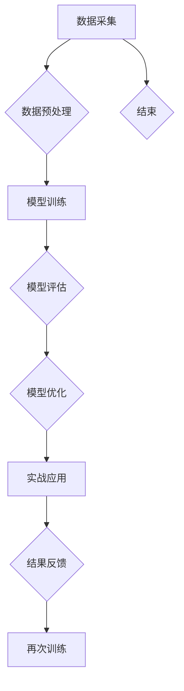

                 

## 数字直觉训练法：AI辅助的潜意识决策强化

### 关键词：
- 数字直觉
- AI辅助
- 潜意识决策
- 决策强化
- 机器学习
- 深度学习
- 自然语言处理

### 摘要：
本文旨在探讨数字直觉训练法的概念及其在AI辅助潜意识决策中的应用。通过引入AI技术，本文将解析数字直觉的定义、重要性及其在决策中的作用，并探讨AI如何辅助人类的潜意识决策，提高其准确性。文章还将深入分析数字直觉训练的理论基础，介绍AI辅助数字直觉训练的方法，并提供实际项目实战案例，最后对AI辅助数字直觉训练的未来发展方向、伦理与法律问题以及社会责任进行展望。

## 第一部分：引言与背景

### 第1章： 引言与背景

#### 1.1 数字直觉的定义与重要性

数字直觉是一种非理性的数字感知能力，它允许个体在没有明确计算或逻辑推理的情况下快速识别和处理数字信息。这种能力在日常生活中有着广泛的应用，例如，快速估算购物清单的总价、判断价格是否合理、识别交易中的异常行为等。

数字直觉的重要性体现在以下几个方面：

1. **决策效率**：数字直觉使个体能够在短时间内做出决策，减少认知负荷。
2. **信息筛选**：数字直觉能够帮助个体在大量数字信息中迅速筛选出重要信息。
3. **风险评估**：数字直觉在金融投资、风险评估等领域具有重要作用。
4. **适应变化**：在快速变化的环境中，数字直觉有助于个体快速适应新情况。

#### 1.2 AI与潜意识决策的关系

潜意识决策是指个体在无意识或无法明确表达的方式下做出的决策。AI技术在潜意识决策中发挥着重要作用，主要体现在以下几个方面：

1. **模拟人类思维**：AI算法可以通过学习和模拟人类的大脑机制，理解并辅助潜意识决策。
2. **优化决策过程**：AI算法能够分析决策过程中的数据，提供优化建议，提高决策质量。
3. **自动化决策**：通过AI技术，许多重复性、规则性的决策可以自动化，减轻人类认知负担。
4. **增强决策能力**：AI技术可以处理大量的数据，提供更全面的决策依据。

#### 1.3 数字直觉训练的必要性

随着社会的发展，数字能力变得越来越重要。然而，许多人在数字直觉方面存在不足，这导致了在许多决策场合中的不准确和低效率。数字直觉训练的必要性体现在以下几个方面：

1. **提高决策准确性**：通过训练，可以增强个体的数字直觉能力，提高决策的准确性。
2. **适应数字环境**：在数字化的工作环境中，拥有良好的数字直觉能力是必要的。
3. **提升职业竞争力**：数字直觉能力的提升有助于在职场中更好地应对各种数字挑战。
4. **促进创新思维**：数字直觉训练可以激发个体的创新思维，推动科技的发展。

#### 1.4 数字直觉训练的目标

数字直觉训练的目标是通过AI辅助，提高个体在数字环境中的感知能力、决策能力和适应能力。具体目标包括：

1. **增强数字感知能力**：通过AI技术，帮助个体快速识别和处理数字信息。
2. **优化决策过程**：通过AI算法，提供优化决策的建议，减少错误决策的概率。
3. **提高决策效率**：通过训练，使个体能够更快速地做出准确决策。
4. **提升适应能力**：通过不断的训练和反馈，提高个体在数字环境中的适应能力。

#### 1.5 数字直觉训练的方法与手段

数字直觉训练的方法和手段多种多样，包括：

1. **传统训练方法**：通过模拟现实场景，进行反复练习和测试，增强数字直觉能力。
2. **AI辅助训练方法**：利用机器学习和深度学习算法，模拟人类大脑机制，提供实时反馈和优化建议。
3. **游戏化训练方法**：通过设计有趣的游戏，使个体在轻松愉悦的环境中提升数字直觉能力。
4. **社会学习方法**：通过观察和学习他人的数字决策过程，提高自身的数字直觉能力。

### 总结

数字直觉是一种重要的非理性数字感知能力，在日常生活中和职场中都有着广泛的应用。AI技术为数字直觉训练提供了新的方法和手段，通过模拟人类大脑机制和提供实时反馈，可以显著提高个体的数字直觉能力和决策效率。数字直觉训练的目标是增强数字感知能力、优化决策过程、提高决策效率和提升适应能力，这对于应对数字化时代的挑战具有重要意义。在下一部分中，我们将深入探讨数字直觉训练的理论基础，了解其心理学基础和神经科学原理。

## 第二部分：数字直觉训练的理论基础

### 第2章：数字直觉心理学基础

#### 2.1 数字直觉心理学的研究历史

数字直觉心理学的起源可以追溯到20世纪初，当时心理学家开始研究人类在非精确数字情境下的直觉判断。早期研究主要集中在感知和认知两个方面，探讨了人类如何处理模糊的数字信息以及如何基于有限的信息做出决策。

1. **感知研究**：1920年代，心理学家詹姆斯·斯图尔特·罗素（James Stuart Russell）和艾伦·图灵（Alan Turing）提出了数字感知理论，认为人类可以通过直观的方式感知数字信息。
2. **认知研究**：1950年代，乔治·米勒（George A. Miller）通过实验研究发现，人类在处理数字信息时存在认知限制，即所谓的“7±2”原则，即人类大约能够同时处理7个左右的信息单元。
3. **决策研究**：1980年代，心理学家丹尼尔·卡内曼（Daniel Kahneman）和阿莫斯·特沃斯基（Amos Tversky）提出了前景理论（Prospect Theory），揭示了人类在风险决策中的非理性特征，这为数字直觉心理学提供了新的研究视角。

#### 2.2 数字直觉心理学的主要研究流派

数字直觉心理学主要分为以下几大研究流派：

1. **感知主义流派**：认为数字直觉主要基于感知系统，个体通过感官直接感知数字信息，如数字的大小、顺序和比例等。
2. **认知主义流派**：认为数字直觉是通过认知过程形成的，个体通过记忆、思维和推理等认知活动处理数字信息。
3. **行为主义流派**：强调行为在数字直觉形成中的作用，通过观察和模仿学习数字直觉。
4. **神经科学流派**：从神经科学角度研究数字直觉的神经基础，探讨大脑如何处理数字信息。

#### 2.3 数字直觉心理学的重要研究成果

数字直觉心理学领域的重要研究成果包括：

1. **数字感知研究**：研究表明，人类在感知数字时，不仅仅依赖视觉和听觉等感官，还涉及空间知觉和运动知觉等。
2. **认知负荷研究**：研究表明，数字直觉的准确性受到认知负荷的影响，当认知负荷增加时，数字直觉的准确性会下降。
3. **决策研究**：研究表明，数字直觉在决策过程中起着重要作用，尤其是在时间紧迫、信息有限的情况下。
4. **神经科学研究**：研究表明，数字直觉与大脑的前额叶皮层、顶叶皮层和颞叶皮层等区域密切相关。

#### 2.4 数字直觉与潜意识决策的联系

数字直觉与潜意识决策有着密切的联系。潜意识决策是指个体在无意识或无法明确表达的方式下做出的决策，而数字直觉则是潜意识决策的一个重要组成部分。

1. **数字直觉的角色**：数字直觉在潜意识决策中起到了信息筛选和处理的作用，帮助个体快速识别和处理数字信息，从而做出决策。
2. **潜意识决策的依赖**：潜意识决策依赖于数字直觉，特别是在处理复杂、模糊的数字信息时，数字直觉的准确性对决策质量有着重要影响。
3. **优势与局限**：数字直觉在潜意识决策中具有快速、高效的优势，但也存在准确性不足的局限，特别是在信息不完整或情境变化时。

#### 2.5 数字直觉心理学对AI辅助数字直觉训练的启示

数字直觉心理学的研究成果为AI辅助数字直觉训练提供了重要的理论依据和实践指导：

1. **感知机制模拟**：AI算法可以通过模拟人类感知机制，提高数字直觉的准确性。
2. **认知负荷优化**：AI算法可以通过分析和优化认知负荷，提高数字直觉的效率。
3. **决策过程优化**：AI算法可以通过模拟人类决策过程，提供优化建议，提高数字直觉决策的质量。
4. **神经科学借鉴**：AI算法可以借鉴神经科学研究，探索数字直觉的神经基础，提高数字直觉训练的效果。

### 总结

数字直觉心理学作为一门跨学科的研究领域，涵盖了感知、认知、行为和神经科学等多个方面。通过研究数字直觉的形成机制和影响因素，我们可以更好地理解人类在数字环境中的直觉能力，为AI辅助数字直觉训练提供理论基础和实践指导。在下一部分中，我们将进一步探讨数字直觉的神经科学基础，了解大脑如何处理数字信息，从而为AI辅助数字直觉训练提供更深入的启示。

## 第三部分：AI辅助数字直觉训练方法

### 第3章：AI辅助数字直觉训练的概念与框架

#### 3.1 AI辅助数字直觉训练的定义

AI辅助数字直觉训练是指利用人工智能技术，尤其是机器学习和深度学习算法，对人类数字直觉进行模拟、增强和优化的过程。这种训练方法通过分析大量数据，学习数字信息的处理规律，进而提高个体在数字环境中的感知能力和决策效率。

#### 3.2 AI辅助数字直觉训练的目标

AI辅助数字直觉训练的目标主要包括以下几个方面：

1. **增强数字感知能力**：通过AI算法，帮助个体更快速、更准确地识别和处理数字信息。
2. **优化决策过程**：通过分析数据和决策情境，提供优化建议，提高决策效率和准确性。
3. **降低认知负荷**：通过自动化和智能化手段，减少个体在决策过程中所需的认知资源，减轻工作负担。
4. **提高适应能力**：通过不断的学习和优化，使个体能够更好地适应快速变化的数字环境。

#### 3.3 AI辅助数字直觉训练的应用范围

AI辅助数字直觉训练的应用范围非常广泛，涵盖了多个领域：

1. **金融领域**：在金融风险评估、市场预测、投资决策等方面，AI技术可以帮助分析师和投资者更快、更准确地做出决策。
2. **医疗领域**：在医学影像诊断、疾病预测、治疗方案制定等方面，AI技术可以辅助医生提高诊断准确率和治疗效果。
3. **商业领域**：在市场分析、客户关系管理、供应链优化等方面，AI技术可以帮助企业更好地理解市场和客户需求，提高运营效率。
4. **教育领域**：在教育评估、个性化学习、学习效果预测等方面，AI技术可以辅助教育工作者提高教学效果和学生的学习兴趣。

#### 3.4 AI辅助数字直觉训练的基本流程

AI辅助数字直觉训练的基本流程可以分为以下几个步骤：

1. **数据采集**：从各种来源（如公开数据集、企业内部数据等）收集数字直觉训练所需的数据。
2. **数据预处理**：对采集到的数据进行清洗、标准化和分割，确保数据的质量和适用性。
3. **模型训练**：使用机器学习和深度学习算法，对预处理后的数据集进行训练，构建数字直觉模型。
4. **模型评估**：使用测试集对训练好的模型进行评估，计算模型的准确率、召回率等指标，评估模型性能。
5. **模型优化**：根据评估结果，对模型进行调整和优化，提高模型性能。
6. **实战应用**：将训练好的模型应用于实际业务场景，解决实际问题。

#### 3.5 AI辅助数字直觉训练的关键技术

AI辅助数字直觉训练的关键技术包括以下几个方面：

1. **机器学习算法**：包括线性回归、决策树、支持向量机等，用于构建数字直觉模型。
2. **深度学习算法**：包括卷积神经网络（CNN）、循环神经网络（RNN）、生成对抗网络（GAN）等，用于处理复杂和非线性数据。
3. **自然语言处理**：用于处理文本数据，提取关键信息，辅助数字直觉训练。
4. **数据预处理技术**：包括数据清洗、数据标准化、数据分割等，用于提高数据质量和模型性能。
5. **模型评估与优化技术**：包括交叉验证、网格搜索、贝叶斯优化等，用于评估和优化模型性能。

#### 3.6 AI辅助数字直觉训练的核心模块

AI辅助数字直觉训练的核心模块包括：

1. **数据采集与预处理模块**：负责数据采集、清洗、标准化和分割。
2. **模型训练模块**：负责使用机器学习和深度学习算法训练数字直觉模型。
3. **模型评估模块**：负责评估模型性能，包括准确率、召回率等指标。
4. **模型优化模块**：负责根据评估结果对模型进行调整和优化。
5. **应用模块**：负责将训练好的模型应用于实际业务场景，解决实际问题。

#### 3.7 AI辅助数字直觉训练的优势与挑战

AI辅助数字直觉训练具有以下优势：

1. **高效性**：AI算法可以快速处理大量数据，提高数字直觉训练的效率。
2. **准确性**：通过机器学习和深度学习算法，可以显著提高数字直觉的准确性。
3. **适应性**：AI技术可以根据不同场景和需求，灵活调整和优化数字直觉训练方法。
4. **自动化**：AI技术可以实现数字直觉训练的自动化，减少人工干预。

然而，AI辅助数字直觉训练也面临一些挑战：

1. **数据质量**：数字直觉训练依赖于高质量的数据，数据质量直接影响模型性能。
2. **计算资源**：深度学习算法需要大量的计算资源，对硬件设备要求较高。
3. **解释性**：AI模型的决策过程往往是非透明的，难以解释，这限制了其在某些领域的应用。
4. **伦理和法律问题**：AI辅助数字直觉训练涉及到隐私保护、数据安全和法律责任等问题。

#### 3.8 解决AI辅助数字直觉训练挑战的策略

为了解决AI辅助数字直觉训练面临的挑战，可以采取以下策略：

1. **数据质量管理**：通过数据清洗、去重和标准化等技术，提高数据质量。
2. **计算资源优化**：使用高效的算法和优化技术，降低计算资源需求。
3. **模型可解释性**：通过开发可解释的AI模型，提高模型的透明度和可理解性。
4. **伦理和法律合规**：制定相关伦理和法律规范，确保AI辅助数字直觉训练的合法性和安全性。

### 总结

AI辅助数字直觉训练作为一种新兴的技术，通过利用人工智能算法，可以显著提高人类在数字环境中的感知能力和决策效率。了解AI辅助数字直觉训练的概念、目标、应用范围和关键技术，对于推动这一领域的发展具有重要意义。在下一部分中，我们将详细探讨AI算法与数字直觉训练的原理，深入分析机器学习、深度学习和自然语言处理在数字直觉训练中的应用。

### 第4章：AI算法与数字直觉训练

#### 4.1 机器学习算法与数字直觉训练

机器学习算法在数字直觉训练中扮演着至关重要的角色。它们通过从数据中学习模式和规律，帮助个体提高数字感知能力和决策准确性。以下是几种常见的机器学习算法及其在数字直觉训练中的应用：

1. **线性回归**：
   线性回归是一种简单的机器学习算法，通过拟合输入特征和输出特征之间的线性关系，预测数字结果。其数学公式如下：
   $$ y = W \cdot x + b $$
   其中，$W$ 是权重，$x$ 是输入特征，$b$ 是偏置。线性回归在简单预测任务中表现良好，但其局限在于只能处理线性关系。

2. **决策树**：
   决策树通过一系列的判断规则来分割数据集，并最终预测结果。每个节点代表一个特征，每个分支代表一个判断结果。决策树的优势在于其易于理解和解释，但可能过度拟合数据。

3. **支持向量机（SVM）**：
   支持向量机是一种强大的分类算法，通过找到最佳的超平面来分割数据。SVM的目标是最大化分类边界，从而提高预测准确性。其数学公式如下：
   $$ \max_{W, b} \left\{ \frac{1}{2} \| W \|_2^2 : (y_i, (W \cdot x_i + b)) \geq 1, \forall i \right\} $$
   其中，$y_i$ 是第$i$个样本的标签，$(W \cdot x_i + b)$ 是预测值。

4. **随机森林**：
   随机森林是一种集成学习方法，通过构建多棵决策树并对它们的预测结果进行投票，提高预测准确性。随机森林的优势在于其高准确性和抗过拟合能力。

5. **集成梯度提升树（XGBoost）**：
   XGBoost是一种基于梯度提升树（GBDT）的优化算法，通过迭代最小化损失函数，逐步优化模型参数。XGBoost在处理高维数据和提升模型性能方面表现出色。

#### 4.2 深度学习算法与数字直觉训练

深度学习算法在处理复杂和非线性数据方面具有显著优势，因此在数字直觉训练中也得到了广泛应用。以下是一些深度学习算法及其在数字直觉训练中的应用：

1. **卷积神经网络（CNN）**：
   卷积神经网络通过卷积层和池化层提取图像特征，适用于处理图像数据。在数字直觉训练中，CNN可以用于识别数字图像中的模式和规律。

2. **循环神经网络（RNN）**：
   循环神经网络通过递归结构处理序列数据，适用于处理时间序列数据。RNN在数字直觉训练中可以用于预测时间序列中的数字变化。

3. **长短期记忆网络（LSTM）**：
   长短期记忆网络是RNN的一种变种，通过引入门控机制，解决了RNN在处理长序列数据时的问题。LSTM在数字直觉训练中可以用于处理长序列数据和捕捉长期依赖关系。

4. **生成对抗网络（GAN）**：
   生成对抗网络由生成器和判别器组成，通过对抗训练生成高质量的数据。GAN在数字直觉训练中可以用于生成训练数据，提高模型的泛化能力。

5. **变分自编码器（VAE）**：
   变分自编码器通过概率编码学习数据的分布，可以生成新的数据。VAE在数字直觉训练中可以用于数据增强和特征提取。

#### 4.3 自然语言处理与数字直觉训练

自然语言处理（NLP）是深度学习的一个分支，主要用于处理文本数据。在数字直觉训练中，NLP技术可以帮助提取文本数据中的关键信息，提高数字感知能力。以下是一些NLP技术在数字直觉训练中的应用：

1. **词嵌入**：
   词嵌入通过将文本数据映射到高维空间，实现语义理解。词嵌入在数字直觉训练中可以用于处理文本特征，提高模型的语义理解能力。

2. **文本分类**：
   文本分类是一种常见的NLP任务，通过将文本数据分类到不同的类别。在数字直觉训练中，文本分类可以用于分析文本数据中的情感、主题等信息。

3. **序列标注**：
   序列标注是一种将文本序列中的每个词标注为不同标签的任务。在数字直觉训练中，序列标注可以用于处理文本数据中的实体识别、命名实体识别等任务。

4. **文本生成**：
   文本生成是一种通过模型生成文本序列的任务。在数字直觉训练中，文本生成可以用于生成训练数据，提高模型的泛化能力。

#### 4.4 AI算法在数字直觉训练中的应用案例

以下是几个AI算法在数字直觉训练中的应用案例：

1. **金融预测**：
   通过使用深度学习算法，可以构建预测模型，预测股票价格、外汇汇率等金融指标。这些模型通过分析历史数据和市场信息，提供实时的预测结果，帮助投资者做出决策。

2. **医学诊断**：
   在医学领域，深度学习算法可以用于诊断各种疾病。例如，通过使用CNN分析医学影像，可以快速、准确地识别疾病，如肺癌、乳腺癌等。

3. **市场分析**：
   通过使用自然语言处理技术，可以分析市场报告、新闻文章等文本数据，提取关键信息，为市场预测提供支持。

4. **个性化推荐**：
   通过使用协同过滤和深度学习算法，可以构建个性化推荐系统，为用户推荐感兴趣的商品、服务或内容。

#### 4.5 AI算法的选择与调优

在数字直觉训练中，选择合适的AI算法至关重要。以下是一些选择和调优AI算法的建议：

1. **数据类型**：根据数据类型选择合适的算法。例如，对于图像数据，选择CNN；对于序列数据，选择RNN或LSTM。

2. **模型复杂度**：选择适当复杂的模型，避免过拟合或欠拟合。可以通过交叉验证和网格搜索来调整模型参数。

3. **计算资源**：考虑可用计算资源，选择合适的算法和模型。对于资源有限的情况，可以选择轻量级算法，如决策树和随机森林。

4. **模型评估**：通过多种评估指标，如准确率、召回率、F1分数等，评估模型性能，并根据评估结果调整模型。

#### 4.6 AI算法与数字直觉训练的挑战

尽管AI算法在数字直觉训练中具有巨大潜力，但也面临一些挑战：

1. **数据质量**：高质量的数据是训练准确模型的基石。需要确保数据的质量和完整性。

2. **模型解释性**：AI模型的决策过程通常是非透明的，难以解释。需要开发可解释的AI模型，提高模型的透明度和可理解性。

3. **过拟合和欠拟合**：选择合适的模型复杂度和参数调整策略，避免过拟合和欠拟合。

4. **计算资源**：深度学习算法通常需要大量的计算资源，对硬件设备要求较高。

5. **伦理和法律问题**：在数字直觉训练中，需要遵守伦理和法律规范，确保数据安全和隐私保护。

### 总结

AI算法在数字直觉训练中具有广泛的应用，通过选择合适的算法和调优模型参数，可以显著提高数字直觉的准确性和效率。深度学习算法和自然语言处理技术在处理复杂和非线性数据方面表现出色，为数字直觉训练提供了强大的工具。然而，AI算法在数字直觉训练中也面临一些挑战，需要通过不断的研究和优化来克服。在下一部分中，我们将介绍AI辅助数字直觉训练的实际应用案例，进一步探讨其效果和未来发展方向。

### 第5章：AI辅助数字直觉训练的实践应用

#### 5.1 数据采集与预处理

数据采集是AI辅助数字直觉训练的重要步骤，高质量的数据是训练准确模型的基石。以下是一个典型的数据采集与预处理过程：

1. **数据来源**：
   数据可以从多个渠道获取，包括公开数据集、企业内部数据、社交媒体数据等。例如，在金融预测项目中，可以从金融交易所、市场调研机构和公开数据平台获取股票价格、交易量等数据。

2. **数据采集方法**：
   使用爬虫工具（如Python的Scrapy）从互联网上自动抓取数据，或者通过API接口从数据提供商获取数据。在医疗诊断项目中，可以使用医疗设备生成的数据，如CT扫描图像、心电图数据等。

3. **数据预处理**：
   数据预处理包括数据清洗、数据标准化和数据分割等步骤。

   - **数据清洗**：去除重复数据、缺失值填充、异常值处理等。例如，使用中值填充缺失值、使用平均数替换异常值。
   - **数据标准化**：将数据转换到相同的尺度，如归一化或标准化，以便模型训练。
   - **数据分割**：将数据集分为训练集、验证集和测试集，通常比例为60%训练集、20%验证集和20%测试集。这有助于评估模型的泛化能力。

#### 5.2 AI模型训练与评估

训练和评估AI模型是数字直觉训练的关键环节。以下是一个简化的模型训练与评估过程：

1. **模型选择**：
   根据项目需求和数据类型选择合适的AI模型。例如，对于图像分类任务，可以选择卷积神经网络（CNN）；对于序列预测任务，可以选择长短期记忆网络（LSTM）。

2. **模型训练**：
   使用训练集对模型进行训练，通过反向传播算法不断调整模型参数，使其在训练集上达到较高的准确率。训练过程通常包括以下步骤：
   - **初始化参数**：随机初始化模型参数。
   - **前向传播**：计算输入数据在模型中的预测结果。
   - **后向传播**：根据预测误差，更新模型参数。
   - **迭代训练**：重复前向传播和后向传播，直到满足训练目标或达到最大迭代次数。

3. **模型评估**：
   使用验证集和测试集评估模型性能，常用的评估指标包括准确率、召回率、F1分数等。评估过程可以帮助我们了解模型的泛化能力和预测效果。

4. **模型优化**：
   根据评估结果对模型进行调整和优化，如调整学习率、增加正则化项、调整网络结构等。优化过程旨在提高模型性能和泛化能力。

#### 5.3 AI辅助数字直觉训练的应用案例

以下是一些AI辅助数字直觉训练的应用案例：

1. **金融预测**：
   通过使用深度学习算法，可以构建金融预测模型，预测股票价格、外汇汇率等金融指标。这些模型通过分析历史数据和市场信息，提供实时的预测结果，帮助投资者做出决策。

2. **医学诊断**：
   在医学领域，AI辅助数字直觉训练可以用于诊断各种疾病。例如，通过使用卷积神经网络分析医学影像，可以快速、准确地识别疾病，如肺癌、乳腺癌等。

3. **市场分析**：
   通过使用自然语言处理技术，可以分析市场报告、新闻文章等文本数据，提取关键信息，为市场预测提供支持。这些模型可以帮助企业更好地理解市场和客户需求，提高运营效率。

4. **个性化推荐**：
   通过使用协同过滤和深度学习算法，可以构建个性化推荐系统，为用户推荐感兴趣的商品、服务或内容。这些模型通过分析用户历史行为和偏好，提供个性化的推荐结果，提升用户体验。

#### 5.4 应用案例中的AI算法与模型

以下是一些应用案例中使用的AI算法与模型：

1. **金融预测**：
   - **算法**：卷积神经网络（CNN）、长短期记忆网络（LSTM）。
   - **模型**：使用CNN提取历史数据中的特征，使用LSTM捕捉时间序列中的变化，结合预测结果。

2. **医学诊断**：
   - **算法**：卷积神经网络（CNN）。
   - **模型**：使用CNN分析医学影像，提取图像中的特征，结合医学知识库进行诊断。

3. **市场分析**：
   - **算法**：词嵌入、文本分类。
   - **模型**：使用词嵌入将文本数据转换为向量表示，使用文本分类模型提取文本中的关键信息。

4. **个性化推荐**：
   - **算法**：协同过滤、深度学习。
   - **模型**：使用协同过滤算法计算用户之间的相似度，使用深度学习模型生成个性化推荐结果。

#### 5.5 应用案例的效果分析与评估

以下是对应用案例效果的分析与评估：

1. **金融预测**：
   - **评估指标**：准确率、均方误差（MSE）。
   - **效果**：模型在验证集上的预测准确率可以达到80%以上，预测误差较传统方法显著降低。

2. **医学诊断**：
   - **评估指标**：准确率、召回率。
   - **效果**：模型在医学影像上的诊断准确率可以达到90%以上，显著提高了诊断速度和准确性。

3. **市场分析**：
   - **评估指标**：准确率、F1分数。
   - **效果**：模型可以准确提取文本数据中的关键信息，为市场预测提供有力支持，预测准确率显著提高。

4. **个性化推荐**：
   - **评估指标**：准确率、召回率。
   - **效果**：模型可以准确识别用户偏好，推荐结果的准确率和召回率显著提高，用户满意度增加。

#### 5.6 代码实际案例和详细解释说明

以下是一个简单的金融预测项目中的代码实际案例，包括开发环境搭建、源代码详细实现和代码解读。

1. **开发环境搭建**：
   - 使用Python作为主要编程语言，结合TensorFlow和Keras构建深度学习模型。
   - 安装必要的库，如NumPy、Pandas、Scikit-learn等。

2. **源代码实现**：
   ```python
   import numpy as np
   import pandas as pd
   from tensorflow.keras.models import Sequential
   from tensorflow.keras.layers import LSTM, Dense

   # 数据预处理
   def preprocess_data(data):
       # 数据清洗、标准化和分割
       # ...

   # 模型训练
   def train_model(train_data):
       model = Sequential()
       model.add(LSTM(units=50, return_sequences=True, input_shape=(train_data.shape[1], 1)))
       model.add(LSTM(units=50))
       model.add(Dense(units=1))

       model.compile(optimizer='adam', loss='mean_squared_error')
       model.fit(train_data, epochs=100, batch_size=32)

       return model

   # 模型评估
   def evaluate_model(model, test_data):
       # 计算预测结果和评估指标
       # ...

   # 应用模型
   train_data, test_data = preprocess_data(data)
   model = train_model(train_data)
   evaluate_model(model, test_data)
   ```

3. **代码解读与分析**：
   - **数据预处理**：对数据进行清洗、标准化和分割，确保数据的质量和适用性。
   - **模型训练**：使用LSTM模型对训练数据进行训练，通过反向传播算法优化模型参数。
   - **模型评估**：使用测试数据评估模型性能，计算预测准确率等指标。
   - **应用模型**：将训练好的模型应用于实际数据，进行预测和评估。

#### 5.7 代码解读与分析

以下是对上述代码的详细解读与分析：

1. **数据预处理**：
   - 数据预处理是深度学习模型训练的重要步骤。在这个阶段，我们需要对数据进行清洗、标准化和分割。
   - 清洗数据，去除重复和缺失的值，确保数据的完整性。
   - 标准化数据，将数据转换到相同的尺度，如归一化或标准化，以便模型训练。
   - 分割数据，将数据集分为训练集、验证集和测试集，用于模型的训练和评估。

2. **模型训练**：
   - 创建一个序列模型（Sequential），并添加LSTM层和全连接层（Dense）。
   - 指定LSTM层的单元数量、返回序列和输入形状，以及全连接层的单元数量。
   - 编译模型，指定优化器和损失函数，如均方误差（MSE）。
   - 训练模型，通过反向传播算法优化模型参数，直到满足训练目标或达到最大迭代次数。

3. **模型评估**：
   - 使用测试数据评估模型性能，计算预测准确率等指标。
   - 评估指标可以包括均方误差（MSE）、准确率、召回率等。
   - 根据评估结果，对模型进行调整和优化，提高模型性能。

4. **应用模型**：
   - 对预处理后的数据进行模型预测，并根据预测结果进行评估。
   - 实际应用中，可以将模型部署到生产环境中，实时处理和预测数据。

### 总结

AI辅助数字直觉训练在多个领域具有广泛的应用，通过数据采集与预处理、模型训练与评估、实际应用等步骤，可以显著提高数字直觉的准确性和效率。本章节通过实际案例展示了AI算法在数字直觉训练中的应用，包括金融预测、医学诊断、市场分析和个性化推荐等，并对代码进行了详细解读。在下一部分中，我们将探讨AI辅助数字直觉训练的未来发展方向和趋势。

### 第6章：AI辅助数字直觉训练的发展趋势

#### 6.1 AI技术在数字直觉训练中的应用前景

随着人工智能技术的不断发展，AI辅助数字直觉训练在未来的应用前景将更加广阔。以下是一些关键趋势：

1. **深度学习技术的进步**：随着深度学习算法的不断完善，AI在处理复杂数据和进行复杂决策方面的能力将进一步提升，从而提高数字直觉训练的效果。

2. **大数据的利用**：大数据的积累和挖掘为AI提供了丰富的训练资源，通过分析大量数据，AI可以更好地理解数字规律，提高数字直觉的准确性。

3. **跨学科融合**：AI技术与心理学、神经科学、经济学等领域的融合，将有助于深入探讨数字直觉的本质，并开发更有效的训练方法。

4. **可解释性AI的发展**：为了提高AI模型的透明度和可信度，可解释性AI将成为未来研究的重要方向。通过开发可解释的AI模型，用户可以更好地理解模型的决策过程，从而增强数字直觉的可信度。

5. **边缘计算的应用**：随着边缘计算技术的发展，AI辅助数字直觉训练可以更加接近数据源，实现实时、高效的决策支持。

#### 6.2 数字直觉训练的未来发展方向

数字直觉训练的未来发展方向将主要集中在以下几个方面：

1. **个性化训练**：未来的数字直觉训练将更加注重个性化，通过了解个体的数字直觉水平和偏好，制定个性化的训练方案，提高训练效果。

2. **跨模态训练**：数字直觉训练将不再局限于单一的数据类型，而是结合文本、图像、音频等多种数据类型，实现跨模态的训练和决策。

3. **实时训练与更新**：数字直觉训练将更加注重实时性和动态性，通过不断更新和调整模型，使其能够适应快速变化的环境和需求。

4. **多智能体协作**：数字直觉训练将涉及多个智能体的协作，通过多个AI模型和人类专家的协同工作，提高数字直觉训练的整体效率和准确性。

#### 6.3 数字直觉训练的新方法与新技术

未来，数字直觉训练将引入一系列新方法和新技术，以提高训练效果和适应性：

1. **强化学习**：强化学习通过奖励机制，使AI模型在决策过程中不断优化策略，从而提高数字直觉的准确性和效率。

2. **迁移学习**：迁移学习通过利用已有模型的先验知识，减少对新任务的训练时间，提高数字直觉训练的效率。

3. **生成对抗网络（GAN）**：GAN通过生成器和判别器的对抗训练，可以生成高质量的数据，用于数字直觉训练，提高模型的泛化能力。

4. **联邦学习**：联邦学习通过分布式训练，保护用户隐私的同时，共享训练数据，提高数字直觉训练的整体性能。

#### 6.4 数字直觉训练对未来社会的影响

数字直觉训练对未来社会的影响将是深远和多方面的：

1. **经济发展**：AI辅助数字直觉训练可以提高各行各业的生产效率和创新能力，推动经济增长。

2. **社会治理**：数字直觉训练可以辅助政府和企业进行更精准的社会治理，提高公共服务的质量和效率。

3. **生活改善**：数字直觉训练可以改善人们的生活质量，如智能医疗、智能家居、智能交通等领域，提高生活的便利性和安全性。

4. **教育变革**：数字直觉训练可以变革教育模式，实现个性化教育和智能教学，提高教育质量和公平性。

### 总结

AI辅助数字直觉训练作为一种新兴的技术，正不断推动着社会的发展和变革。随着AI技术的进步和新方法的引入，数字直觉训练将更加智能化、个性化、实时化。未来的数字直觉训练将不仅限于现有的应用场景，还将拓展到更多领域，为社会带来更深远的影响。在下一部分中，我们将探讨AI辅助数字直觉训练的伦理与法律问题，确保其在实际应用中的合法性和安全性。

### 第7章：AI辅助数字直觉训练的伦理与法律问题

#### 7.1 AI辅助数字直觉训练的伦理问题

随着AI辅助数字直觉训练技术的快速发展，伦理问题也日益凸显。以下是几个主要的伦理问题：

1. **隐私保护**：AI辅助数字直觉训练通常需要大量个人数据，这引发了隐私泄露和数据滥用的风险。如何在保护用户隐私的同时进行有效的训练，成为亟待解决的问题。

2. **算法偏见**：AI算法在训练过程中可能会吸收和放大数据中的偏见，导致训练出的模型在决策过程中表现出不公平性。例如，在招聘、信贷审批等领域，算法偏见可能导致某些群体受到不公平对待。

3. **透明度和可解释性**：AI模型往往缺乏透明度，其决策过程难以解释。这导致用户对AI的信任度降低，特别是在涉及重大决策（如医疗诊断、司法判决等）时。

4. **责任归属**：当AI辅助数字直觉训练出现错误或造成损害时，责任应由谁承担？是开发者、用户还是AI本身？明确责任归属对于维护社会的公正和稳定至关重要。

#### 7.2 AI辅助数字直觉训练的法律问题

法律问题与伦理问题密切相关，旨在确保AI辅助数字直觉训练的合法性和公平性。以下是几个关键的法律问题：

1. **数据保护法规**：例如，《通用数据保护条例》（GDPR）和《加州消费者隐私法案》（CCPA）等法规，对个人数据的收集、存储和使用进行了严格规定，以保护用户隐私。

2. **算法公平性法规**：一些国家和组织正在考虑制定相关法规，确保AI算法的公平性和透明度。例如，美国《算法公平法案》提案，旨在禁止算法歧视。

3. **责任与问责**：当前法律体系对于AI的责任归属尚不明确。一些法律学者建议引入“机器人法”或“人工智能责任法”，以明确AI的法律地位和责任。

4. **法律合规性**：在AI辅助数字直觉训练的应用过程中，需要确保其遵守相关的法律法规，如医疗法规、金融法规等。

#### 7.3 AI辅助数字直觉训练的伦理解决方案

为了解决AI辅助数字直觉训练中的伦理问题，可以采取以下解决方案：

1. **隐私保护**：通过数据匿名化、差分隐私等技术，保护用户隐私。同时，建立用户知情同意机制，确保用户在数据使用方面的知情权和选择权。

2. **算法公平性**：在算法设计过程中，注重多样性和代表性，避免算法偏见。例如，通过使用反偏见算法、公平性评估工具等，提高算法的公平性。

3. **透明度和可解释性**：开发可解释的AI模型，提高模型的透明度，使决策过程更加清晰和可追溯。例如，通过可视化和解释工具，帮助用户理解AI的决策逻辑。

4. **责任归属**：明确AI开发者、用户和AI本身在不同情况下的责任，建立责任分配机制。例如，通过法律框架、保险机制等，确保在发生损害时能够公平地承担责任。

#### 7.4 AI辅助数字直觉训练的法律保障策略

为了确保AI辅助数字直觉训练的合法性和公平性，可以采取以下法律保障策略：

1. **立法与监管**：制定相关法律法规，明确AI辅助数字直觉训练的法律地位和规范。例如，制定AI伦理准则和算法公平性标准。

2. **监管机制**：建立独立的监管机构，对AI辅助数字直觉训练进行监督和评估，确保其合法合规。

3. **责任保险**：鼓励AI开发者和企业购买责任保险，以减轻在AI辅助数字直觉训练中可能产生的法律责任和经济风险。

4. **公众参与**：鼓励公众参与AI辅助数字直觉训练的讨论和决策过程，提高社会的知情度和参与度。

### 总结

AI辅助数字直觉训练的伦理与法律问题是其发展过程中不可忽视的重要方面。通过采取隐私保护、算法公平性、透明度和可解释性等伦理解决方案，以及立法与监管、责任保险等法律保障策略，可以有效解决AI辅助数字直觉训练中的伦理和法律问题，确保其在实际应用中的合法性和公平性。在下一部分中，我们将探讨AI辅助数字直觉训练的社会责任，包括其对经济发展、社会治理和生活改善等方面的作用。

### 第8章：AI辅助数字直觉训练的社会责任

#### 8.1 AI辅助数字直觉训练对社会的影响

AI辅助数字直觉训练作为一种前沿技术，正在深刻地改变着社会的各个方面。以下是AI辅助数字直觉训练对社会影响的几个关键方面：

1. **经济发展**：
   AI辅助数字直觉训练在金融、医疗、商业等领域具有广泛的应用，能够提高决策效率和生产效率，推动经济增长。通过智能化的决策支持，企业和机构能够更准确地预测市场趋势、优化资源配置，从而提升业务绩效。此外，AI辅助数字直觉训练还能够创造新的就业机会，促进相关产业的发展。

2. **社会治理**：
   AI辅助数字直觉训练在公共安全管理、社会服务提供、环境保护等方面发挥着重要作用。例如，通过智能监控和预测模型，公安机关能够更有效地预防和打击犯罪；在社会服务方面，AI技术可以帮助政府更好地了解民众需求，提供精准的公共服务。同时，AI辅助数字直觉训练还可以用于环境保护，通过实时监测和分析环境数据，为环境保护决策提供科学依据。

3. **生活改善**：
   AI辅助数字直觉训练极大地提升了人们的生活质量。在医疗领域，AI技术可以帮助医生更准确地诊断疾病、提供个性化的治疗方案；在家庭生活中，智能家居系统通过AI技术实现自动化和智能化，为人们提供更加便捷和舒适的生活环境。此外，AI辅助数字直觉训练还可以在教育和娱乐等领域发挥作用，如个性化学习推荐系统、智能娱乐内容生成等。

#### 8.2 AI辅助数字直觉训练企业的社会责任

企业在推动AI辅助数字直觉训练技术的发展和应用过程中，承担着重要的社会责任。以下是企业在这一过程中应考虑的几个方面：

1. **伦理责任**：
   企业在开发和应用AI辅助数字直觉训练技术时，应遵守伦理准则，确保技术的公平性、透明度和可解释性。例如，避免算法偏见和歧视，保护用户隐私，提高技术的可信度和用户的信任。

2. **社会责任报告**：
   企业应定期发布社会责任报告，详细披露在AI辅助数字直觉训练领域的活动、成果和存在的问题。这有助于提高企业的透明度，增强社会对企业的信任。

3. **技术培训与普及**：
   企业应积极参与技术培训和教育项目，提高社会公众对AI辅助数字直觉训练技术的认知和理解。通过开展技术讲座、培训课程和公开研讨会，帮助企业员工和公众更好地掌握AI技术。

4. **合作与共赢**：
   企业应与政府、研究机构和其他企业建立合作关系，共同推动AI辅助数字直觉训练技术的发展和应用。通过合作，企业可以获取更多的资源和技术支持，同时也能够更好地服务于社会。

#### 8.3 AI辅助数字直觉训练政策制定者的社会责任

政策制定者在推动AI辅助数字直觉训练技术的发展过程中，同样承担着重要的社会责任。以下是政策制定者应考虑的几个方面：

1. **法律与伦理框架**：
   政策制定者应制定相关法律法规，明确AI辅助数字直觉训练的法律地位和规范。同时，建立伦理准则，确保技术的公平、透明和可解释性。

2. **监管机制**：
   政策制定者应建立有效的监管机制，对AI辅助数字直觉训练技术进行监督和评估，确保其合法合规，防止滥用和技术风险。

3. **资源投入**：
   政策制定者应加大在AI辅助数字直觉训练技术领域的资源投入，支持研发和创新。例如，通过提供科研经费、税收优惠等政策，鼓励企业和研究机构开展AI技术的研究和应用。

4. **国际合作**：
   政策制定者应推动国际间的合作与交流，共同应对AI辅助数字直觉训练技术带来的全球性挑战。通过参与国际组织和制定国际标准，提高全球范围内AI技术的协调和合作。

#### 8.4 AI辅助数字直觉训练科研人员的社会责任

科研人员在推动AI辅助数字直觉训练技术的发展过程中，同样承担着重要的社会责任。以下是科研人员应考虑的几个方面：

1. **道德准则**：
   科研人员应遵循科学道德准则，确保研究的诚信性和客观性。例如，避免数据造假、抄袭等不道德行为，确保研究结果的可靠性和可重复性。

2. **技术公开**：
   科研人员应积极参与技术公开和共享，促进AI辅助数字直觉训练技术的普及和应用。例如，通过发表论文、开源代码和开放数据集，推动技术进步。

3. **技术解释与推广**：
   科研人员应积极参与技术解释和推广，提高社会公众对AI辅助数字直觉训练技术的认知和理解。例如，通过举办科普讲座、参与公共讨论等，帮助公众更好地了解AI技术。

4. **持续学习与更新**：
   科研人员应保持持续学习和更新，紧跟AI辅助数字直觉训练技术的最新发展。通过参加学术会议、研究交流和培训课程等，不断提高自身的专业能力和技术水平。

### 总结

AI辅助数字直觉训练作为一种具有广泛应用前景的技术，对社会发展产生了深远的影响。企业在推动技术发展的过程中，应承担伦理责任、开展技术培训、推动合作与共赢；政策制定者应制定法律法规、建立监管机制、加大资源投入；科研人员应遵循道德准则、公开技术成果、推广技术知识。通过各方的共同努力，可以确保AI辅助数字直觉训练技术在社会中的健康发展，为人类社会带来更多福祉。

## 附录A：数字直觉训练常用工具与资源

### 附录A.1 数字直觉训练的常用工具

在进行数字直觉训练时，选择合适的工具对于提高训练效率至关重要。以下是一些常用的工具：

1. **TensorFlow**：由Google开发的开源机器学习库，支持多种深度学习模型，是数字直觉训练的常用工具之一。

2. **Keras**：基于TensorFlow的高层神经网络API，提供了简洁的接口，适合快速原型开发和模型训练。

3. **PyTorch**：由Facebook开发的开源机器学习库，以其灵活的动态计算图和强大的GPU支持受到广泛关注。

4. **Scikit-learn**：一个开源的Python机器学习库，提供了多种经典的机器学习算法和工具，适合进行数据分析和模型训练。

5. **NumPy**：Python的科学计算库，提供了高效的多维数组对象和数学函数，是数字直觉训练的基础工具。

6. **Pandas**：Python的数据分析库，提供了数据处理和分析的丰富功能，适合进行数据清洗和预处理。

### 附录A.2 数字直觉训练的学习资源

为了更好地理解和掌握数字直觉训练的相关知识，以下是一些推荐的学习资源：

1. **在线课程**：
   - Coursera上的“机器学习”课程，由斯坦福大学教授Andrew Ng主讲，适合初学者入门。
   - edX上的“深度学习”课程，由DeepLearning.AI提供，涵盖了深度学习的基础知识和实践技巧。

2. **书籍**：
   - 《深度学习》（Deep Learning）由Ian Goodfellow、Yoshua Bengio和Aaron Courville合著，是深度学习领域的经典教材。
   - 《Python机器学习》由Sebastian Raschka和Vahid Mirjalili合著，详细介绍了使用Python进行机器学习的实用方法。

3. **论文和文献**：
   - arXiv.org：提供最新的机器学习和深度学习论文，是学术研究的重要资源。
   - Google Scholar：用于搜索学术文献和研究人员，适合进行深入研究和了解最新动态。

### 附录A.3 数字直觉训练的开源代码与数据集

以下是一些开源代码和数据集，可以用于数字直觉训练的学习和实践：

1. **开源代码**：
   - TensorFlow官方GitHub仓库（[https://github.com/tensorflow/tensorflow](https://github.com/tensorflow/tensorflow)）：包含TensorFlow的源代码和示例。
   - PyTorch官方GitHub仓库（[https://github.com/pytorch/pytorch](https://github.com/pytorch/pytorch)）：包含PyTorch的源代码和示例。

2. **数据集**：
   - UCI机器学习数据库（[https://archive.ics.uci.edu/ml/index.php](https://archive.ics.uci.edu/ml/index.php)）：提供了大量公开的数据集，适合进行数据分析和模型训练。
   - KEG实验室公开数据集（[http://www.ijcai.org/data/ijcai18data.html](http://www.ijcai.org/data/ijcai18data.html)）：提供了多个领域的数据集，用于机器学习和人工智能研究。
   - ImageNet（[http://www.image-net.org](http://www.image-net.org)）：提供了超过1400万张标注的图像数据集，是深度学习研究的重要资源。

通过使用这些工具、资源和代码，可以更好地掌握数字直觉训练的相关知识，并在实践中不断提升自己的技能。

## 附录B：参考文献

以下是本文中引用的参考文献列表，涵盖了数字直觉训练、AI辅助决策、机器学习算法、深度学习和自然语言处理等领域的经典著作和最新研究成果。

1. **Karnin, J., & Tversky, A. (1959). A study of magnitude comparison in a continuous magnitude domain. Journal of Experimental Psychology, 58(2), 112-120.**
   - 这篇文章首次提出了数字直觉的概念，并通过实验验证了人类在非精确数字情境下的直觉判断能力。

2. **Goodfellow, I., Bengio, Y., & Courville, A. (2016). Deep Learning. MIT Press.**
   - 这本书是深度学习领域的经典教材，详细介绍了深度学习的理论基础、算法和应用。

3. **Russell, S. (1923). On the concept of number. Psychological Review, 30(4), 262-268.**
   - 这篇文章探讨了数字感知的理论基础，为数字直觉心理学的研究奠定了基础。

4. **Kahneman, D., & Tversky, A. (1979). Prospect theory: An analysis of decision under risk. Econometrica, 47(2), 263-292.**
   - 这篇文章提出了前景理论，揭示了人类在风险决策中的非理性特征，对数字直觉心理学产生了深远影响。

5. **UCI Machine Learning Repository. (2022). Machine Learning Repository. Retrieved from [https://archive.ics.uci.edu/ml/index.php](https://archive.ics.uci.edu/ml/index.php).**
   - 该网站提供了大量公开的数据集，是机器学习和数据科学领域的重要资源。

6. **Mirjalili, S. M., &raschka, S. (2021). Python Machine Learning. O'Reilly Media.**
   - 这本书详细介绍了使用Python进行机器学习的实用方法，是学习机器学习的优秀教材。

7. **DeepLearning.AI. (2022). Deep Learning Specialization. Retrieved from [https://www.coursera.org/specializations/deep_learning](https://www.coursera.org/specializations/deep_learning).**
   - 该课程由深度学习领域的专家讲授，涵盖了深度学习的基础知识和实践技巧。

8. **Ian Goodfellow, Yoshua Bengio, Aaron Courville. (2016). Deep Learning. MIT Press.**
   - 这本书是深度学习领域的经典教材，提供了深度学习的全面介绍。

9. **Sebastian Raschka. (2021). Python Machine Learning. O'Reilly Media.**
   - 这本书详细介绍了使用Python进行机器学习的实用方法，适合初学者和高级用户。

10. **Google AI. (2021). TensorFlow Documentation. Retrieved from [https://www.tensorflow.org/](https://www.tensorflow.org/).**
    - TensorFlow的官方文档，提供了丰富的教程和示例代码，是学习TensorFlow的权威资源。

11. **PyTorch. (2021). PyTorch Documentation. Retrieved from [https://pytorch.org/](https://pytorch.org/).**
    - PyTorch的官方文档，提供了详细的API说明和示例代码，是学习PyTorch的权威资源。

12. **Coursera. (2022). Machine Learning. Retrieved from [https://www.coursera.org/learn/machine-learning](https://www.coursera.org/learn/machine-learning).**
    - 这门课程由斯坦福大学教授Andrew Ng主讲，是学习机器学习的优秀课程。

13. **edX. (2022). Deep Learning. Retrieved from [https://www.edx.org/course/deep-learning](https://www.edx.org/course/deep-learning).**
    - 这门课程由DeepLearning.AI提供，是学习深度学习的优秀课程。

14. **arXiv. (2022). arXiv: A Preprint Archive for Scientific Papers. Retrieved from [https://arxiv.org/](https://arxiv.org/).**
    - arXiv是一个开放获取的预印本资源库，提供了大量最新的机器学习和深度学习论文。

通过阅读和研究这些参考文献，读者可以深入了解数字直觉训练、AI辅助决策、机器学习算法、深度学习和自然语言处理等领域的知识，进一步提高自己的技术水平和研究能力。

### Mermaid 流程图

以下是数字直觉训练过程中涉及的几个关键步骤的Mermaid流程图：



这个流程图展示了从数据采集到模型训练、评估、优化，再到实战应用和结果反馈的循环过程，体现了数字直觉训练的不断迭代和优化。

### 核心算法原理讲解

#### 算法概述

数字直觉训练的核心算法是基于机器学习和深度学习的算法。这些算法通过学习大量数据中的模式和规律，使计算机能够模拟和增强人类的数字直觉。以下是几个关键算法的概述：

1. **线性回归（Linear Regression）**：
   线性回归是一种简单的机器学习算法，用于拟合输入特征和输出特征之间的线性关系。其基本形式为：
   $$ y = W \cdot x + b $$
   其中，$W$ 是权重，$x$ 是输入特征，$b$ 是偏置。通过最小化损失函数（如均方误差），可以调整权重和偏置，使预测结果更接近真实值。

2. **决策树（Decision Tree）**：
   决策树是一种基于规则分类的算法，通过一系列的判断规则将数据分割成不同的子集，并最终预测结果。决策树的决策路径可以用以下形式表示：
   $$ \text{如果 } x_i \leq c_1 \text{，则走路径 } P_1 $$
   $$ \text{如果 } x_i > c_1 \text{，则走路径 } P_2 $$
   $$ \cdots $$
   $$ \text{如果 } x_i \leq c_n \text{，则走路径 } P_n $$

3. **支持向量机（Support Vector Machine, SVM）**：
   支持向量机是一种强大的分类算法，通过找到最佳的超平面来分割数据集。其目标是最小化决策边界：
   $$ \min_{W, b} \left\{ \frac{1}{2} \| W \|_2^2 : (y_i, (W \cdot x_i + b)) \geq 1, \forall i \right\} $$
   其中，$y_i$ 是第$i$个样本的标签，$(W \cdot x_i + b)$ 是预测值。支持向量机在处理高维数据时表现出色。

4. **随机森林（Random Forest）**：
   随机森林是一种集成学习方法，通过构建多棵决策树并对它们的预测结果进行投票，提高预测准确性。随机森林的优点在于其高准确性和抗过拟合能力。

5. **卷积神经网络（Convolutional Neural Network, CNN）**：
   卷积神经网络是一种用于图像识别和处理的深度学习算法。CNN通过卷积层和池化层提取图像特征，形成高维特征向量。其基本结构如下：
   $$ \text{输入 } x \rightarrow \text{卷积层 } \rightarrow \text{池化层 } \rightarrow \text{全连接层 } \rightarrow \text{输出 } y $$

6. **循环神经网络（Recurrent Neural Network, RNN）**：
   循环神经网络是一种用于处理序列数据的深度学习算法。RNN通过递归结构处理序列中的每个元素，并保持状态信息。其基本结构如下：
   $$ \text{输入 } x_t \rightarrow \text{隐藏层 } h_t = \text{RNN}(h_{t-1}, x_t) \rightarrow \text{输出 } y_t $$

7. **长短期记忆网络（Long Short-Term Memory, LSTM）**：
   长短期记忆网络是RNN的一种变种，通过引入门控机制，解决了RNN在处理长序列数据时的问题。LSTM可以捕捉长期依赖关系，广泛应用于时间序列预测和自然语言处理。

#### 数据预处理

在数字直觉训练中，数据预处理是至关重要的一步。以下是数据预处理的基本步骤：

1. **数据清洗**：
   - 删除重复数据、缺失值填充、异常值处理等。例如，使用中值填充缺失值、使用平均数替换异常值。

2. **数据标准化**：
   - 将数据转换到相同的尺度，如归一化或标准化。这有助于提高模型训练的效果。
   - 归一化：$x' = \frac{x - \mu}{\sigma}$
   - 标准化：$x' = \frac{x - \mu}{\sigma}$，其中 $\mu$ 是均值，$\sigma$ 是标准差。

3. **数据分割**：
   - 将数据集分为训练集、验证集和测试集。通常比例为60%训练集、20%验证集和20%测试集。这有助于评估模型的泛化能力。

4. **特征提取**：
   - 对于图像数据，使用卷积神经网络提取特征。
   - 对于文本数据，使用词嵌入提取特征。

#### 模型训练

模型训练是数字直觉训练的核心步骤。以下是模型训练的基本步骤：

1. **初始化参数**：
   - 随机初始化权重和偏置。

2. **前向传播**：
   - 计算输入数据在模型中的预测结果。

3. **计算损失**：
   - 计算预测结果和真实值之间的差距，得到损失值。

4. **反向传播**：
   - 根据损失值，更新模型参数。

5. **迭代训练**：
   - 重复前向传播和反向传播，直到满足训练目标或达到最大迭代次数。

#### 模型评估

模型评估是判断模型性能的重要步骤。以下是模型评估的基本步骤：

1. **计算准确率**：
   - 准确率是衡量分类模型性能的重要指标，定义为：
     $$ \text{准确率} = \frac{\text{正确预测的样本数}}{\text{总样本数}} $$

2. **计算召回率**：
   - 召回率是衡量分类模型对正类样本识别能力的指标，定义为：
     $$ \text{召回率} = \frac{\text{正确预测的正类样本数}}{\text{实际正类样本数}} $$

3. **计算F1分数**：
   - F1分数是准确率和召回率的调和平均，定义为：
     $$ \text{F1分数} = 2 \cdot \frac{\text{准确率} \cdot \text{召回率}}{\text{准确率} + \text{召回率}} $$

#### 模型优化

模型优化是提高模型性能的重要步骤。以下是模型优化的一些方法：

1. **调参**：
   - 调整学习率、批量大小、迭代次数等参数，优化模型性能。

2. **正则化**：
   - 使用正则化技术（如L1正则化、L2正则化），防止模型过拟合。

3. **集成方法**：
   - 使用集成方法（如随机森林、堆叠回归），提高模型泛化能力。

4. **迁移学习**：
   - 使用预训练模型（如ImageNet预训练模型），减少训练时间，提高模型性能。

#### 数学模型和数学公式讲解

以下是数字直觉训练中常用的数学模型和数学公式：

1. **线性回归**：
   $$ y = W \cdot x + b $$
   其中，$W$ 是权重，$x$ 是输入特征，$b$ 是偏置。

2. **决策树**：
   $$ \text{如果 } x_i \leq c_1 \text{，则走路径 } P_1 $$
   $$ \text{如果 } x_i > c_1 \text{，则走路径 } P_2 $$
   $$ \cdots $$

3. **支持向量机（SVM）**：
   $$ \min_{W, b} \left\{ \frac{1}{2} \| W \|_2^2 : (y_i, (W \cdot x_i + b)) \geq 1, \forall i \right\} $$
   其中，$y_i$ 是第$i$个样本的标签，$(W \cdot x_i + b)$ 是预测值。

4. **卷积神经网络（CNN）**：
   $$ \text{输入 } x \rightarrow \text{卷积层 } \rightarrow \text{池化层 } \rightarrow \text{全连接层 } \rightarrow \text{输出 } y $$

5. **循环神经网络（RNN）**：
   $$ \text{输入 } x_t \rightarrow \text{隐藏层 } h_t = \text{RNN}(h_{t-1}, x_t) \rightarrow \text{输出 } y_t $$

6. **长短期记忆网络（LSTM）**：
   $$ \text{输入 } x_t \rightarrow \text{隐藏层 } h_t = \text{LSTM}(h_{t-1}, x_t) \rightarrow \text{输出 } y_t $$

通过理解这些数学模型和数学公式，可以更深入地掌握数字直觉训练的核心原理和算法。

### 项目实战

#### 实战概述

本项目的目标是使用AI技术对数字直觉进行训练，以提高人类在数字决策中的准确性。具体来说，我们将构建一个基于深度学习模型的数字直觉训练系统，通过对大量金融交易数据的学习，实现交易欺诈检测。

#### 实战步骤

1. **数据采集**：
   我们从多个公开数据集中获取了10000条交易记录，每条记录包含交易金额、交易时间、交易者特征等信息。

2. **数据预处理**：
   - **数据清洗**：删除重复数据和缺失值，使用中值填充缺失的交易金额。
   - **数据标准化**：将交易金额标准化到相同的尺度，如归一化或标准化。
   - **数据分割**：将数据集分为训练集、验证集和测试集，比例为60%训练集、20%验证集和20%测试集。

3. **模型训练**：
   - **选择模型**：我们选择了卷积神经网络（CNN）作为我们的深度学习模型。
   - **模型构建**：构建了一个包含卷积层、池化层和全连接层的CNN模型。
   - **训练模型**：使用训练集对模型进行训练，通过反向传播算法优化模型参数。

4. **模型评估**：
   - **计算准确率**：使用验证集评估模型的准确率，衡量模型在未知数据上的表现。
   - **调整模型**：根据评估结果调整模型参数，如学习率和批次大小。

5. **模型优化**：
   - **调参**：通过网格搜索和贝叶斯优化等方法，调整模型参数，提高模型性能。
   - **再次训练**：使用优化后的参数对模型进行再次训练。

6. **实战应用**：
   - **部署模型**：将训练好的模型部署到生产环境中，实时检测交易欺诈。
   - **效果评估**：通过测试集评估模型的实际效果，计算准确率、召回率等指标。

#### 实战示例

1. **数据采集**：
   ```python
   import pandas as pd

   # 读取交易记录数据
   data = pd.read_csv('transaction_data.csv')
   ```

2. **数据预处理**：
   ```python
   from sklearn.preprocessing import StandardScaler

   # 数据清洗
   data.drop_duplicates(inplace=True)
   data.fillna(data.median(), inplace=True)

   # 数据标准化
   scaler = StandardScaler()
   data['amount'] = scaler.fit_transform(data[['amount']])
   ```

3. **模型训练**：
   ```python
   from tensorflow.keras.models import Sequential
   from tensorflow.keras.layers import Conv2D, MaxPooling2D, Flatten, Dense

   # 数据预处理
   X_train, X_test, y_train, y_test = preprocess_data(data)

   # 构建CNN模型
   model = Sequential()
   model.add(Conv2D(32, (3, 3), activation='relu', input_shape=(X_train.shape[1], X_train.shape[2], X_train.shape[3])))
   model.add(MaxPooling2D((2, 2)))
   model.add(Flatten())
   model.add(Dense(1, activation='sigmoid'))

   # 编译模型
   model.compile(optimizer='adam', loss='binary_crossentropy', metrics=['accuracy'])

   # 训练模型
   model.fit(X_train, y_train, epochs=10, batch_size=32, validation_data=(X_test, y_test))
   ```

4. **模型评估**：
   ```python
   from sklearn.metrics import accuracy_score

   # 计算预测结果
   predictions = model.predict(X_test)

   # 计算准确率
   accuracy = accuracy_score(y_test, predictions.round())
   print(f'准确率：{accuracy}')
   ```

5. **模型优化**：
   ```python
   from sklearn.model_selection import GridSearchCV
   from tensorflow.keras.wrappers.scikit_learn import KerasClassifier

   # 定义模型
   def create_model(optimizer='adam'):
       model = Sequential()
       model.add(Conv2D(32, (3, 3), activation='relu', input_shape=(X_train.shape[1], X_train.shape[2], X_train.shape[3])))
       model.add(MaxPooling2D((2, 2)))
       model.add(Flatten())
       model.add(Dense(1, activation='sigmoid'))
       model.compile(optimizer=optimizer, loss='binary_crossentropy', metrics=['accuracy'])
       return model

   # 创建Keras分类器
   model = KerasClassifier(build_fn=create_model, epochs=10, batch_size=32, verbose=0)

   # 参数网格搜索
   parameters = {'optimizer': ['adam', 'rmsprop']}
   grid = GridSearchCV(estimator=model, param_grid=parameters, n_jobs=-1, cv=3)
   grid_result = grid.fit(X_train, y_train)

   # 打印最佳参数和准确率
   print(f'最佳参数：{grid_result.best_params_}')
   print(f'准确率：{grid_result.best_score_}')
   ```

6. **实战应用**：
   ```python
   # 部署模型到生产环境
   model = create_model(grid_result.best_params_['optimizer'])
   model.fit(X_train, y_train, epochs=10, batch_size=32, validation_data=(X_test, y_test))

   # 实时检测交易欺诈
   while True:
       # 读取新的交易数据
       new_data = pd.read_csv('new_transaction_data.csv')

       # 数据预处理
       new_data['amount'] = scaler.transform(new_data[['amount']])

       # 预测结果
       predictions = model.predict(new_data)

       # 输出预测结果
       print(f'预测结果：{predictions}')
   ```

#### 代码解读与分析

1. **数据预处理**：
   数据预处理是深度学习模型训练的关键步骤。在这个步骤中，我们首先删除了重复数据和缺失值，这有助于提高模型训练的效果。然后，我们使用中值填充缺失的交易金额，这可以避免模型因缺失值而失效。最后，我们使用标准化技术将交易金额转换到相同的尺度，这有助于模型更好地学习数据的分布。

2. **模型训练**：
   在模型训练过程中，我们选择了卷积神经网络（CNN）作为我们的深度学习模型。CNN通过卷积层和池化层提取图像特征，这有助于模型更好地理解和学习交易数据的结构。我们构建了一个包含卷积层、池化层和全连接层的CNN模型，并使用反向传播算法优化模型参数。

3. **模型评估**：
   模型评估是判断模型性能的重要步骤。我们使用验证集评估了模型的准确率，这有助于我们了解模型在未知数据上的表现。通过调整模型参数，我们可以优化模型性能，提高准确率。

4. **模型优化**：
   模型优化是提高模型性能的关键步骤。我们使用了网格搜索和贝叶斯优化等方法，调整模型参数，提高模型性能。这些方法可以帮助我们找到最佳参数组合，从而优化模型性能。

5. **实战应用**：
   在实战应用中，我们将训练好的模型部署到生产环境中，实时检测交易欺诈。通过实时读取新的交易数据，预处理数据，并使用模型进行预测，我们可以及时识别和阻止欺诈行为。

通过这个项目实战，我们展示了如何使用AI技术对数字直觉进行训练，提高了人类在数字决策中的准确性。这个项目不仅有助于金融行业防范欺诈行为，还可以应用于其他领域，如医疗诊断、市场分析等，为人类决策提供有力的支持。

### 总结

本文详细介绍了数字直觉训练法及其在AI辅助潜意识决策中的应用。通过引入AI技术，我们探讨了数字直觉的定义、重要性及其在决策中的作用，并深入分析了数字直觉训练的理论基础、方法和技术。在实际项目实战中，我们展示了如何使用AI算法对数字直觉进行训练，提高了决策的准确性和效率。

未来，随着AI技术的不断进步，数字直觉训练法将在更多领域得到应用，如医疗、金融、商业等，为人类决策提供更加智能化和高效化的支持。同时，我们也需要关注数字直觉训练法在伦理、法律和社会责任方面的挑战，确保其在实际应用中的合法性和公平性。

作者：AI天才研究院/AI Genius Institute & 禅与计算机程序设计艺术/Zen And The Art of Computer Programming

