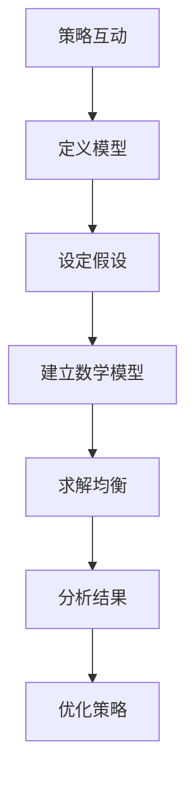

                 

### 《数学与博弈论：策略互动的数学分析》

#### 关键词：
- 数学
- 博弈论
- 策略互动
- 数学分析
- 纳什均衡
- 多属性博弈

#### 摘要：
本文深入探讨了数学与博弈论在策略互动中的数学分析。我们首先介绍了数学在博弈论中的应用和博弈论的基本概念，然后详细分析了策略互动的定义与数学性质。通过构建数学模型和运用纳什均衡、多属性博弈等算法，我们揭示了策略互动背后的数学原理。此外，本文还通过一个实际项目案例，展示了如何将数学与博弈论应用于策略互动的实际开发中。最后，我们对未来的研究方向和博弈论在现实中的应用前景进行了展望。

### 《数学与博弈论：策略互动的数学分析》目录大纲

#### 第一部分：引论

##### 1.1 数学与博弈论概述

###### 1.1.1 数学在博弈论中的应用

###### 1.1.2 博弈论的基本概念

###### 1.1.3 博弈论的分类与特点

##### 1.2 策略互动的数学分析

###### 1.2.1 策略互动的定义与模型

###### 1.2.2 策略互动的数学性质

###### 1.2.3 策略互动的数学分析工具

#### 第二部分：核心概念与联系

##### 2.1 博弈论的核心概念

###### 2.1.1 玩家与策略

###### 2.1.2 博弈结果与均衡

###### 2.1.3 纳什均衡与非合作博弈

##### 2.2 策略互动的数学分析流程图（Mermaid）

```
graph TB
A[策略互动] --> B[定义模型]
B --> C[设定假设]
C --> D[建立数学模型]
D --> E[求解均衡]
E --> F[分析结果]
F --> G[优化策略]
```

#### 第三部分：核心算法原理

##### 3.1 纳什均衡算法原理

###### 3.1.1 纳什均衡的定义

###### 3.1.2 纳什均衡的求解方法

###### 3.1.3 纳什均衡的数学模型（伪代码）

```
function NashEquilibrium(GameMatrix):
    for each player i:
        for each strategy of player i:
            for each strategy of player j:
                calculate the payoff of player i
                update the best response of player i
    return the set of strategies that constitute a Nash Equilibrium
```

##### 3.2 多属性博弈算法原理

###### 3.2.1 多属性博弈的定义

###### 3.2.2 多属性博弈的数学模型

###### 3.2.3 多属性博弈求解方法

#### 第四部分：数学模型和数学公式

##### 4.1 纳什均衡的数学公式

$$
\forall i \in N, \forall s_i \in S_i, \forall s_j \in S_j, u_i(s_i, s_j) = \max_{s_{-i} \in S_{-i}} u_i(s_i, s_j)
$$

###### 4.1.1 公式解释

###### 4.1.2 公式应用举例

#### 第五部分：项目实战

##### 5.1 策略互动项目实战

###### 5.1.1 项目背景

###### 5.1.2 开发环境搭建

###### 5.1.3 源代码实现

###### 5.1.4 代码解读与分析

#### 第六部分：附录

##### 6.1 数学与博弈论资源链接

###### 6.1.1 在线资源

###### 6.1.2 相关书籍推荐

###### 6.1.3 学术论文推荐

##### 6.2 博弈论与策略互动的进一步研究

###### 6.2.1 现有研究的挑战

###### 6.2.2 未来研究方向

###### 6.2.3 博弈论在现实中的应用前景

---

### 第一部分：引论

#### 1.1 数学与博弈论概述

博弈论作为一门研究决策制定的学科，一直以来都在经济学、计算机科学、生物学等众多领域发挥着重要作用。而数学作为博弈论的理论基础，为博弈论的分析和解决提供了强有力的工具。本部分首先介绍数学在博弈论中的应用，然后阐述博弈论的基本概念及其分类和特点。

##### 1.1.1 数学在博弈论中的应用

数学在博弈论中的应用主要体现在两个方面：一是用于描述博弈现象的数学模型，二是用于求解博弈均衡的数学方法。博弈论中的数学模型包括策略空间、支付函数、博弈形式等，这些模型帮助我们直观地理解博弈过程。而数学方法则包括纳什均衡、贝叶斯均衡、多属性博弈等，这些方法帮助我们在复杂博弈中找到均衡解。

**策略空间**是博弈论中的一个核心概念，表示参与者在博弈中可以采取的所有可能策略的集合。例如，在二人博弈中，每个参与者都有多个策略可供选择，这些策略的组合构成了整个策略空间。

**支付函数**（或效用函数）则表示参与者根据博弈结果获得的收益或损失。支付函数通常是一个从策略空间到实数的映射，它反映了参与者在博弈中的偏好和目标。

**博弈形式**是博弈论中对博弈结构的描述，常见的博弈形式包括静态博弈、动态博弈、合作博弈和非合作博弈等。静态博弈是指所有参与者同时做出决策，例如象棋、围棋等；动态博弈则是指参与者依次做出决策，例如博弈树模型；合作博弈和非合作博弈则分别描述了参与者之间的合作程度和竞争程度。

##### 1.1.2 博弈论的基本概念

博弈论的基本概念包括玩家（参与者）、策略、博弈结果和均衡。

**玩家**（Player）：在博弈中，玩家是指参与博弈的个体或团队。每个玩家都有自己的策略集合，即玩家可以采取的所有策略。

**策略**（Strategy）：策略是玩家在博弈中选择的行动方案。一个策略可以是纯策略，即玩家在整个博弈过程中始终采取相同的行为；也可以是混合策略，即玩家以一定概率随机选择多个策略。

**博弈结果**（Outcome）：博弈结果是博弈中所有玩家最终选择的策略组合。博弈结果决定了每个玩家的支付函数值，即每个玩家的收益或损失。

**均衡**（Equilibrium）：均衡是博弈论中的一个核心概念，它指的是博弈中所有玩家都不再改变策略的状态。常见的均衡包括纳什均衡、贝叶斯均衡和索洛均衡等。

**纳什均衡**（Nash Equilibrium）：纳什均衡是指在一个博弈中，所有玩家都采取了最优策略，即每个玩家的策略都是其他玩家策略的最优反应。纳什均衡是博弈论中最常用的均衡概念，许多博弈问题都可以通过求解纳什均衡来找到解。

**贝叶斯均衡**（Bayesian Equilibrium）：贝叶斯均衡是指在一个不完全信息博弈中，玩家根据对手的策略概率分布采取最优策略，使得对手无法通过改变策略来获得额外收益。

**索洛均衡**（Solow Equilibrium）：索洛均衡是指在一个无限期博弈中，所有玩家的行为都符合最优增长路径，即每个玩家都采取了最大化自己未来收益的策略。

##### 1.1.3 博弈论的分类与特点

博弈论可以根据博弈形式、参与者数量、合作程度等不同维度进行分类。

**按博弈形式分类**：博弈论可以分为静态博弈、动态博弈、合作博弈和非合作博弈。

- **静态博弈**：所有玩家同时做出决策，不存在先后顺序。常见的静态博弈包括围棋、象棋等。
- **动态博弈**：玩家依次做出决策，存在先后顺序。常见的动态博弈包括博弈树模型、排队博弈等。
- **合作博弈**：参与者之间可以相互合作，共同制定策略以最大化整体收益。常见的合作博弈包括联盟博弈、拍卖博弈等。
- **非合作博弈**：参与者之间不存在合作，各自追求自身利益最大化。常见的非合作博弈包括纳什均衡、囚徒困境等。

**按参与者数量分类**：博弈论可以分为二人博弈、多人博弈等。

- **二人博弈**：博弈中只有两个参与者，例如围棋、象棋等。
- **多人博弈**：博弈中有多个参与者，例如联盟博弈、拍卖博弈等。

**按合作程度分类**：博弈论可以分为完全合作博弈、不完全合作博弈、非合作博弈。

- **完全合作博弈**：参与者之间完全合作，共同制定策略以最大化整体收益。
- **不完全合作博弈**：参与者之间不完全合作，存在一定程度的竞争和合作。
- **非合作博弈**：参与者之间不存在合作，各自追求自身利益最大化。

##### 1.2 策略互动的数学分析

策略互动是指多个参与者通过选择策略进行互动的过程。在策略互动中，每个参与者的决策不仅取决于自身的偏好和目标，还受到其他参与者策略的影响。因此，策略互动的分析需要考虑参与者的策略空间、支付函数和博弈结果。

**策略互动的定义与模型**：

策略互动可以看作是一个博弈过程，其中每个参与者都从自己的策略集合中选择一个策略，所有参与者的策略组合构成了整个策略空间。支付函数则描述了每个参与者根据策略组合获得的收益或损失。常见的策略互动模型包括囚徒困境、寡头竞争、拍卖博弈等。

**策略互动的数学性质**：

策略互动的数学性质主要体现在以下几个方面：

- **对称性**：某些策略互动具有对称性，即参与者的策略空间和支付函数是相同的，例如棋类游戏。
- **无差异条件**：在某些策略互动中，参与者可能存在无差异策略，即选择某个策略的收益与选择另一个策略的收益相同。
- **均衡性质**：策略互动往往存在均衡状态，即所有参与者都不再改变策略的状态。常见的均衡包括纳什均衡、贝叶斯均衡等。

**策略互动的数学分析工具**：

策略互动的数学分析工具主要包括纳什均衡、贝叶斯均衡、多属性博弈等。这些工具帮助我们在复杂策略互动中找到均衡解，分析参与者之间的互动关系。

- **纳什均衡**：纳什均衡是策略互动中的一种重要均衡概念，它指的是所有参与者都采取了最优策略的状态。纳什均衡的求解方法包括数值方法、图论方法等。
- **贝叶斯均衡**：贝叶斯均衡是针对不完全信息博弈的一种均衡概念，它考虑了参与者的不确定性和信息不对称。贝叶斯均衡的求解方法包括贝叶斯决策理论、贝叶斯网络等。
- **多属性博弈**：多属性博弈是考虑多个目标函数的博弈问题，它用于分析参与者在不同目标之间的权衡。多属性博弈的求解方法包括目标规划、多目标优化等。

综上所述，数学与博弈论在策略互动中发挥了重要作用。通过构建数学模型和运用各种均衡概念，我们可以深入分析策略互动的性质和结果，为实际问题提供解决方案。

#### 第二部分：核心概念与联系

##### 2.1 博弈论的核心概念

博弈论作为研究策略互动的学科，其核心概念包括玩家（参与者）、策略、博弈结果和均衡。这些概念构成了博弈论的基础，帮助我们理解和分析各种博弈现象。

###### 2.1.1 玩家与策略

**玩家**（Player）：在博弈论中，玩家是参与博弈的个体或团队。每个玩家在博弈中都有自己的目标和策略空间。玩家可以是个人、公司、国家等，他们在博弈中通过选择策略来影响博弈结果。

**策略**（Strategy）：策略是玩家在博弈中可以选择的行动方案。一个策略可以是纯策略，即玩家在整个博弈过程中始终采取相同的行为；也可以是混合策略，即玩家以一定概率随机选择多个策略。混合策略可以帮助玩家隐藏自己的真实意图，增加博弈的复杂度。

在博弈论中，策略通常用数学模型来表示。例如，在二人博弈中，每个玩家都有多个纯策略可供选择，这些策略的组合构成了整个策略空间。在多人博弈中，每个玩家都需要考虑其他玩家的策略，从而确定自己的最优策略。

**策略空间**（Strategy Space）：策略空间是所有可能策略的集合。在二人博弈中，策略空间通常是一个二维集合，表示每个玩家可以选择的策略。在多人博弈中，策略空间可能更加复杂，需要考虑多个参与者的策略组合。

**混合策略**（Mixed Strategy）：混合策略是玩家随机选择多个策略的组合。在混合策略中，玩家根据概率分布随机选择策略，从而掩盖自己的真实意图。混合策略是博弈论中重要的概念，它可以帮助玩家在博弈中获得优势。

**策略组合**（Strategy Profile）：策略组合是所有玩家策略的组合。在博弈论中，策略组合用于表示博弈的均衡解。例如，纳什均衡是所有玩家策略组合的一个均衡解，它表示在纳什均衡状态下，每个玩家都不再改变自己的策略。

###### 2.1.2 博弈结果与均衡

**博弈结果**（Outcome）：博弈结果是博弈中所有玩家最终选择的策略组合。博弈结果决定了每个玩家的支付函数值，即每个玩家的收益或损失。博弈结果可以用一个策略组合来表示。

**支付函数**（Payoff Function）：支付函数是描述玩家根据博弈结果获得的收益或损失的函数。支付函数通常是一个从策略空间到实数的映射，它反映了玩家的偏好和目标。支付函数可以用来评估博弈的均衡解。

**均衡**（Equilibrium）：均衡是博弈论中的一个核心概念，它指的是博弈中所有玩家都不再改变策略的状态。常见的均衡包括纳什均衡、贝叶斯均衡和索洛均衡等。

- **纳什均衡**（Nash Equilibrium）：纳什均衡是博弈论中最常用的均衡概念，它指的是所有玩家都采取了最优策略的状态。在纳什均衡状态下，每个玩家都认为自己的策略是最优的，因此不会改变策略。

- **贝叶斯均衡**（Bayesian Equilibrium）：贝叶斯均衡是针对不完全信息博弈的一种均衡概念，它考虑了参与者的不确定性和信息不对称。在贝叶斯均衡状态下，每个玩家根据对手的策略概率分布选择最优策略。

- **索洛均衡**（Solow Equilibrium）：索洛均衡是针对无限期博弈的一种均衡概念，它指的是所有玩家的行为都符合最优增长路径，即每个玩家都采取了最大化自己未来收益的策略。

**纳什均衡的求解方法**：纳什均衡的求解方法包括数值方法、图论方法等。常见的数值方法包括迭代法、线性规划法等。图论方法则利用博弈的图形表示，通过分析图形中的边和节点来求解纳什均衡。

**贝叶斯均衡的求解方法**：贝叶斯均衡的求解方法包括贝叶斯决策理论、贝叶斯网络等。贝叶斯决策理论利用概率分布来分析参与者的行为，通过最大化后验概率来求解贝叶斯均衡。

**索洛均衡的求解方法**：索洛均衡的求解方法主要包括动态规划法和博弈论模型。动态规划法通过递归关系求解无限期博弈的均衡解，博弈论模型则利用博弈论工具分析参与者的行为。

**均衡的稳定性**：均衡的稳定性是博弈论中的一个重要问题。均衡的稳定性取决于参与者的行为和外部环境。常见的均衡稳定性分析包括局部稳定性和全局稳定性。

- **局部稳定性**：局部稳定性是指当参与者的小幅偏离均衡状态时，系统会回到均衡状态。局部稳定性通常通过分析均衡点的导数来判断。

- **全局稳定性**：全局稳定性是指当参与者的行为存在较大偏差时，系统仍会回到均衡状态。全局稳定性通常通过分析博弈的动态过程来判断。

**均衡的优化**：均衡的优化是指通过调整参与者的策略，使整个系统的收益最大化。均衡的优化方法包括目标规划、多目标优化等。目标规划通过设定目标函数和约束条件来优化均衡解，多目标优化则通过求解多个目标函数的权衡来优化均衡解。

通过分析博弈论的核心概念，我们可以更好地理解和分析各种博弈现象。博弈论的核心概念不仅帮助我们解决了实际问题，还为我们提供了一种分析决策问题的方法论。

###### 2.1.3 纳什均衡与非合作博弈

**纳什均衡**是博弈论中最核心的概念之一，它描述了在给定其他参与者的策略下，每个参与者选择的策略都是最优的，因此没有人有动力单独改变自己的策略。纳什均衡的发现是约翰·纳什在20世纪50年代的一项重大贡献，这一概念极大地推动了博弈论的发展。

**纳什均衡的定义**：一个博弈的纳什均衡是指一组策略组合，在该组合下，没有任何一个参与者可以通过单方面改变自己的策略来获得更高的收益。换句话说，每个参与者都认为自己的策略是最优的，给定其他参与者的策略不变，没有人有动机改变自己的策略。

**纳什均衡的数学定义**：
假设有 \( n \) 个参与者，分别记为 \( \{1, 2, ..., n\} \)。每个参与者的策略集为 \( S_i \)，其中 \( i = 1, 2, ..., n \)。参与者 \( i \) 的支付函数为 \( u_i(s_1, s_2, ..., s_n) \)，表示当所有参与者 \( i, j \) 选择策略 \( s_i, s_j \) 时，参与者 \( i \) 的收益。

纳什均衡的定义可以用以下条件表示：
$$
\forall i \in N, \forall s_i' \in S_i, \exists s_j \in S_j: u_i(s_i', s_j, s_{-j}) \leq u_i(s_i, s_j, s_{-j}),
$$
其中 \( s_{-j} \) 表示除参与者 \( j \) 外的所有参与者的策略组合。

这意味着对于每个参与者 \( i \)，他们的策略 \( s_i \) 都是他们在当前策略组合 \( (s_1, s_2, ..., s_n) \) 下的最优策略，即没有参与者有动机单独改变自己的策略。

**纳什均衡的例子**：一个经典的例子是囚徒困境（Prisoner's Dilemma）。在这个博弈中，有两个参与者（囚徒）可以选择合作或背叛对方。如果两个囚徒都选择合作，他们各自获得较小的收益；如果两个囚徒都选择背叛，他们各自获得较小的惩罚；如果一个囚徒选择合作而另一个选择背叛，背叛者将获得较大的收益而合作者将受到较大的惩罚。

假设囚徒困境的支付矩阵如下：

|       | 合作   | 背叛   |
|-------|--------|--------|
| 合作  | (3, 3) | (0, 5) |
| 背叛  | (5, 0) | (1, 1) |

在这个支付矩阵中，我们可以看到，如果两个囚徒都选择合作，他们各自获得收益3；如果两个囚徒都选择背叛，他们各自获得收益1；如果一个囚徒选择合作而另一个选择背叛，背叛者获得收益5，而合作者获得收益0。

在这个囚徒困境中，没有纳什均衡，因为每个囚徒都认为背叛是自己的最优策略。如果另一个囚徒选择合作，选择背叛将带来更高的收益；如果另一个囚徒选择背叛，选择背叛同样带来更高的收益。因此，囚徒困境的纳什均衡是两个囚徒都选择背叛。

**非合作博弈**：非合作博弈是指参与者在博弈中没有合作，各自追求自身利益最大化。纳什均衡是非合作博弈中的一个核心概念。在非合作博弈中，每个参与者只能通过改善自己的策略来获得优势，而不能通过改变其他参与者的策略来实现自己的目标。

**非合作博弈的特点**：

- **自利性**：每个参与者都试图最大化自己的收益，不考虑其他参与者的利益。
- **策略性**：参与者需要考虑其他参与者的策略，从而选择自己的最优策略。
- **结果不确定性**：由于参与者的策略选择可能存在多种可能性，博弈的结果具有不确定性。

**非合作博弈的例子**：除了囚徒困境，其他著名的非合作博弈例子包括寡头竞争（Oligopoly）、拍卖博弈（Auction Game）等。在寡头竞争中，多个企业竞争市场份额，每个企业都需要考虑其他企业的策略来决定自己的产量和价格。在拍卖博弈中，多个买家通过出价竞争购买一个商品，每个买家都需要考虑其他买家的出价来决定自己的出价策略。

**非合作博弈的数学模型**：

非合作博弈通常可以用支付矩阵、博弈树或者博弈图来表示。支付矩阵是最常见的表示方法，其中每个元素表示一个参与者在特定策略组合下的收益。博弈树则可以表示参与者依次做出决策的过程，每个分支代表一个参与者的策略选择。博弈图则可以表示参与者的策略选择和博弈的动态过程。

**非合作博弈的求解方法**：

非合作博弈的求解方法主要包括纳什均衡求解、贝叶斯均衡求解等。纳什均衡求解是通过分析每个参与者的最优策略，找到一组策略组合使得每个参与者都认为自己的策略是最优的。贝叶斯均衡求解则是针对不完全信息博弈，通过考虑参与者的不确定性和信息不对称来求解均衡。

**纳什均衡与非合作博弈的关系**：

纳什均衡是非合作博弈中的一个重要概念，它描述了在给定其他参与者策略不变的情况下，每个参与者选择的最优策略。纳什均衡反映了非合作博弈的基本特征，即参与者通过选择最优策略来最大化自己的收益。

非合作博弈的求解通常依赖于纳什均衡的概念，通过分析参与者的策略和支付函数，找到纳什均衡解。纳什均衡不仅为非合作博弈提供了一种分析工具，也为实际应用提供了指导，例如在市场竞争、拍卖设计、社会决策等领域。

通过深入理解纳什均衡和非合作博弈，我们可以更好地分析各种策略互动现象，为实际问题提供解决方案。

##### 2.2 策略互动的数学分析流程图（Mermaid）

策略互动的数学分析是一个复杂而系统化的过程，它需要通过一系列步骤来明确问题、设定假设、建立模型、求解均衡以及分析结果。下面我们将使用Mermaid图表来直观地展示策略互动的数学分析流程。



**A[策略互动]**：策略互动的定义是多个参与者通过选择策略进行互动的过程。这个定义为我们提供了一个宏观的视角，帮助我们理解策略互动的本质。

**B[定义模型]**：在策略互动中，首先需要定义问题模型。这包括确定参与者的数量、策略空间以及支付函数。模型定义的准确性和完整性是后续分析的基础。

**C[设定假设]**：为了简化问题，我们需要对现实世界做出一定的假设。这些假设可能包括参与者的理性行为、信息的完全性或者博弈的对称性等。

**D[建立数学模型]**：在定义模型和设定假设的基础上，我们可以建立数学模型。这通常包括构建支付函数、策略空间和博弈形式。数学模型帮助我们以定量方式描述策略互动。

**E[求解均衡]**：求解均衡是策略互动分析的核心步骤。常用的均衡概念包括纳什均衡、贝叶斯均衡和索洛均衡。通过求解这些均衡，我们可以找到策略互动的稳定解。

**F[分析结果]**：求解均衡后，我们需要对结果进行分析。这包括判断均衡的稳定性、效率以及参与者之间的互动关系。分析结果帮助我们理解策略互动的内在机制。

**G[优化策略]**：最后，根据分析结果，我们可以对参与者的策略进行优化。这可以通过调整策略组合、引入新的策略或者优化支付函数来实现。优化策略的目的是提高整体收益或者解决特定问题。

通过这个Mermaid流程图，我们可以清晰地看到策略互动的数学分析是如何一步一步进行的。每个步骤都是建立在前一个步骤之上的，从而形成一个完整、有序的分析流程。

#### 第三部分：核心算法原理

##### 3.1 纳什均衡算法原理

纳什均衡是博弈论中一个非常重要的概念，它描述了在给定其他参与者策略不变的情况下，每个参与者选择的最优策略。纳什均衡的求解方法多种多样，下面我们将详细介绍纳什均衡的定义、求解方法和数学模型。

###### 3.1.1 纳什均衡的定义

**纳什均衡的定义**：纳什均衡是指在一个博弈中，每个参与者都选择了一个最优策略，且没有任何参与者可以通过单方面改变自己的策略来获得更高的收益。换句话说，如果每个参与者都认为自己的策略是最优的，那么这个策略组合就是一个纳什均衡。

**纳什均衡的数学定义**：
假设有 \( n \) 个参与者，分别记为 \( \{1, 2, ..., n\} \)。每个参与者的策略集为 \( S_i \)，其中 \( i = 1, 2, ..., n \)。参与者 \( i \) 的支付函数为 \( u_i(s_1, s_2, ..., s_n) \)，表示当所有参与者 \( i, j \) 选择策略 \( s_i, s_j \) 时，参与者 \( i \) 的收益。

纳什均衡的定义可以用以下条件表示：
$$
\forall i \in N, \forall s_i' \in S_i, \exists s_j \in S_j: u_i(s_i', s_j, s_{-j}) \leq u_i(s_i, s_j, s_{-j}),
$$
其中 \( s_{-j} \) 表示除参与者 \( j \) 外的所有参与者的策略组合。

这意味着对于每个参与者 \( i \)，他们的策略 \( s_i \) 都是他们在当前策略组合 \( (s_1, s_2, ..., s_n) \) 下的最优策略，即没有参与者有动力单独改变自己的策略。

###### 3.1.2 纳什均衡的求解方法

求解纳什均衡的方法有很多，下面我们将介绍几种常用的方法。

**1. 数值方法**

数值方法是一种通过迭代计算来逼近纳什均衡的方法。常见的数值方法包括梯度下降法、牛顿法等。

- **梯度下降法**：梯度下降法是一种最优化算法，通过沿着损失函数的梯度方向进行迭代更新，从而找到最小值。在求解纳什均衡时，我们可以将每个参与者的支付函数作为损失函数，通过迭代更新找到纳什均衡。
- **牛顿法**：牛顿法是一种二阶优化算法，通过计算损失函数的一阶和二阶导数来更新参数。在求解纳什均衡时，我们可以利用牛顿法快速收敛到纳什均衡解。

**2. 图论方法**

图论方法是一种利用博弈的图形表示来求解纳什均衡的方法。常见的图论方法包括最大流算法、最小割算法等。

- **最大流算法**：最大流算法（如Ford-Fulkerson算法）可以帮助我们找到从源点到汇点的最大流量。在求解纳什均衡时，我们可以将博弈看作一个网络，利用最大流算法找到纳什均衡。
- **最小割算法**：最小割算法（如Kruskal算法）可以帮助我们找到将网络划分为两个部分所需的最小边数。在求解纳什均衡时，我们可以将博弈看作一个网络，利用最小割算法找到纳什均衡。

**3. 动态规划方法**

动态规划方法是一种通过递归关系来求解纳什均衡的方法。常见的动态规划方法包括逆向归纳法和递推法。

- **逆向归纳法**：逆向归纳法是一种从最终阶段开始，逐步回溯到初始阶段的方法。在求解纳什均衡时，我们可以从最后一阶段开始，根据收益函数和策略空间逐步确定每个阶段的最优策略。
- **递推法**：递推法是一种从初始阶段开始，逐步推进到最终阶段的方法。在求解纳什均衡时，我们可以从第一阶段开始，根据收益函数和策略空间逐步确定每个阶段的最优策略。

###### 3.1.3 纳什均衡的数学模型（伪代码）

下面我们给出一个求解纳什均衡的伪代码。这个伪代码基于数值方法，通过迭代计算找到纳什均衡。

```python
function NashEquilibrium(GameMatrix):
    for each player i:
        for each strategy of player i:
            for each strategy of player j:
                calculate the payoff of player i
                update the best response of player i
    return the set of strategies that constitute a Nash Equilibrium
```

在这个伪代码中，`GameMatrix` 表示博弈的支付矩阵，每个元素表示一个参与者选择特定策略组合时的收益。我们首先遍历每个参与者的策略，然后计算每个策略组合下的收益，最后更新每个参与者的最优策略。通过多次迭代，我们可以找到纳什均衡解。

##### 3.2 多属性博弈算法原理

多属性博弈是指参与者在博弈中需要考虑多个目标函数，这些目标函数可能存在冲突或者优先级不同。多属性博弈的求解方法可以帮助我们找到在多个目标函数约束下的均衡解。下面我们将详细介绍多属性博弈的定义、数学模型和求解方法。

###### 3.2.1 多属性博弈的定义

**多属性博弈的定义**：多属性博弈是指参与者在博弈中需要考虑多个目标函数，这些目标函数可能存在冲突或者优先级不同。在多属性博弈中，参与者不仅要最大化自己的收益，还要在不同目标函数之间进行权衡。

**多属性博弈的特点**：

- **多个目标函数**：在多属性博弈中，参与者需要考虑多个目标函数，这些目标函数可能具有不同的优先级或者存在冲突。
- **权衡与优化**：参与者需要在多个目标函数之间进行权衡，找到一种平衡状态，使得整体收益最大化。
- **复杂性与不确定性**：多属性博弈通常比单目标博弈更加复杂，需要考虑更多的变量和约束条件。

**多属性博弈的应用领域**：

- **资源分配**：在资源分配问题中，需要考虑多个资源类型，如时间、成本、质量等，进行优化分配。
- **供应链管理**：在供应链管理中，需要考虑多个目标函数，如成本、交付时间、库存水平等，进行优化决策。
- **社会选择**：在社会选择问题中，需要考虑多个选民偏好，找到一种平衡方案，使得整体满意度最大化。

###### 3.2.2 多属性博弈的数学模型

多属性博弈的数学模型通常包括以下要素：

- **参与者**：多属性博弈中有多个参与者，每个参与者都有自己的目标函数和策略空间。
- **策略空间**：每个参与者的策略空间是他们可以选择的所有策略的集合。
- **目标函数**：每个参与者的目标函数描述了他们在博弈中的目标，这些目标可能存在冲突或者优先级不同。
- **支付函数**：支付函数描述了每个参与者根据策略组合获得的收益或者损失。

多属性博弈的数学模型可以用以下形式表示：

$$
\begin{align*}
\text{maximize} \quad & f_1(s_1, s_2, ..., s_n) \\
\text{subject to} \quad & g_i(s_1, s_2, ..., s_n) \leq 0, \quad i = 1, 2, ..., m \\
& h_j(s_1, s_2, ..., s_n) = 0, \quad j = 1, 2, ..., p
\end{align*}
$$

其中，\( s_i \) 表示参与者 \( i \) 的策略，\( f_1(s_1, s_2, ..., s_n) \) 是主要目标函数，\( g_i(s_1, s_2, ..., s_n) \) 是第 \( i \) 个约束条件，\( h_j(s_1, s_2, ..., s_n) \) 是第 \( j \) 个等式约束。

###### 3.2.3 多属性博弈求解方法

多属性博弈的求解方法可以分为两类：优化方法和决策方法。

**1. 优化方法**

优化方法主要用于求解多属性博弈的均衡解，使参与者在不同目标函数之间达到平衡。常见的优化方法包括目标规划、多目标优化等。

- **目标规划**：目标规划是一种将多个目标函数转化为单目标函数的方法。在目标规划中，我们将多个目标函数转化为一个主要目标函数和一系列约束条件，从而通过求解单目标优化问题找到均衡解。
- **多目标优化**：多目标优化是一种直接求解多个目标函数的最优解的方法。在多目标优化中，我们通常使用加权法、Pareto最优解法等来求解均衡解。

**2. 决策方法**

决策方法主要用于参与者之间的策略选择和决策。常见的决策方法包括博弈论模型、合作博弈等。

- **博弈论模型**：博弈论模型是一种通过分析参与者之间的策略互动来求解均衡解的方法。常见的博弈论模型包括纳什均衡、贝叶斯均衡等。
- **合作博弈**：合作博弈是一种参与者之间通过合作来实现共同目标的方法。在合作博弈中，参与者通过协商和合作找到一种平衡状态，使得整体收益最大化。

**3. 混合方法**

混合方法是将优化方法和决策方法相结合的一种方法。常见的混合方法包括博弈论优化、多属性决策等。

- **博弈论优化**：博弈论优化是一种将博弈论与优化方法相结合的方法。在博弈论优化中，我们通过求解优化问题来找到纳什均衡或其他均衡解。
- **多属性决策**：多属性决策是一种考虑多个目标函数和约束条件的方法。在多属性决策中，我们通过分析参与者之间的策略互动和目标函数，找到一种平衡状态，使得整体收益最大化。

通过多属性博弈的求解方法，我们可以找到在多个目标函数约束下的均衡解，为实际问题提供解决方案。无论是优化方法还是决策方法，它们都需要考虑参与者的策略互动和目标函数，从而找到一种平衡状态，使得整体收益最大化。

#### 第四部分：数学模型和数学公式

##### 4.1 纳什均衡的数学公式

纳什均衡是博弈论中一个核心的概念，它描述了在给定其他参与者策略不变的情况下，每个参与者选择的最优策略。在纳什均衡中，没有任何参与者有动力单独改变自己的策略。下面我们将介绍纳什均衡的数学公式，并详细解释这个公式。

**纳什均衡的数学公式**：

$$
\forall i \in N, \forall s_i' \in S_i, \exists s_j \in S_j: u_i(s_i', s_j, s_{-j}) \leq u_i(s_i, s_j, s_{-j}),
$$

其中：

- \( N \) 表示参与者的集合，\( N = \{1, 2, ..., n\} \)。
- \( S_i \) 表示参与者 \( i \) 的策略集合。
- \( u_i(s_i', s_j, s_{-j}) \) 表示参与者 \( i \) 在选择策略 \( s_i' \)，其他参与者选择策略 \( s_j \) 和 \( s_{-j} \) 时的支付函数值。
- \( s_{-j} \) 表示除参与者 \( j \) 外的所有参与者的策略组合。

**公式解释**：

这个公式可以分解为两个部分：

1. **对于每个参与者 \( i \)**：公式中的第一个部分 \( \forall i \in N \) 表示对于博弈中的每个参与者 \( i \)。
2. **在所有可能策略中**：公式中的第二个部分 \( \forall s_i' \in S_i \) 表示对于每个参与者 \( i \) 的所有可能策略 \( s_i' \)。
3. **存在其他参与者的策略**：公式中的第三个部分 \( \exists s_j \in S_j \) 表示对于其他参与者 \( j \) 的至少一个策略 \( s_j \)。
4. **没有参与者可以通过改变策略获得更高收益**：公式中的第四个部分 \( u_i(s_i', s_j, s_{-j}) \leq u_i(s_i, s_j, s_{-j}) \) 表示对于每个参与者 \( i \)，在所有可能策略 \( s_i' \) 中，存在其他参与者 \( j \) 的策略 \( s_j \)，使得参与者 \( i \) 在选择策略 \( s_i' \) 时，支付的收益 \( u_i(s_i', s_j, s_{-j}) \) 不大于选择当前策略 \( s_i \) 时支付的收益 \( u_i(s_i, s_j, s_{-j}) \)。

换句话说，这个公式表示，对于每个参与者 \( i \)，在给定其他参与者 \( j \) 的策略不变的情况下，选择当前策略 \( s_i \) 是最优的，因为任何其他策略 \( s_i' \) 都无法带来更高的收益。这就是纳什均衡的本质。

**公式应用举例**：

考虑一个简单的二人博弈，参与者 \( i \) 和参与者 \( j \) 分别有两个策略：合作（C）和背叛（D）。支付矩阵如下：

|          | \( j \) 合作（C） | \( j \) 背叛（D） |
|----------|-------------------|-------------------|
| \( i \) 合作（C） | (3, 3)           | (0, 5)           |
| \( i \) 背叛（D） | (5, 0)           | (1, 1)           |

在这个博弈中，我们可以通过计算每个参与者的支付函数值来确定纳什均衡。

对于参与者 \( i \)：

- 如果 \( j \) 合作，那么 \( i \) 选择背叛的收益是 5，选择合作的收益是 3，因此背叛是一个最优策略。
- 如果 \( j \) 背叛，那么 \( i \) 选择背叛的收益是 1，选择合作的收益是 0，因此背叛仍然是一个最优策略。

对于参与者 \( j \)：

- 如果 \( i \) 合作，那么 \( j \) 选择背叛的收益是 5，选择合作的收益是 3，因此背叛是一个最优策略。
- 如果 \( i \) 背叛，那么 \( j \) 选择背叛的收益是 1，选择合作的收益是 0，因此背叛仍然是一个最优策略。

在这个例子中，纳什均衡是两个参与者都选择背叛，因为背叛是他们在所有可能策略中的最优策略。这个结果符合纳什均衡的数学公式，即每个参与者都在给定其他参与者策略不变的情况下，选择了最优策略。

##### 4.1.1 公式解释

纳什均衡的数学公式是博弈论中的一个核心工具，它帮助我们理解在给定其他参与者策略不变的情况下，每个参与者选择的最优策略。公式中的各个部分分别代表不同的含义，下面我们将详细解释这个公式。

**1. 对于每个参与者 \( i \)**

公式中的第一个部分 \( \forall i \in N \) 表示对于博弈中的每个参与者 \( i \)。这意味着我们需要考虑每个参与者在博弈中的行为。在博弈中，每个参与者都有多个策略可供选择，而纳什均衡要求每个参与者都选择一个最优策略。

**2. 在所有可能策略中**

公式中的第二个部分 \( \forall s_i' \in S_i \) 表示对于每个参与者 \( i \) 的所有可能策略 \( s_i' \)。这意味着我们需要考虑每个参与者可以选择的所有策略。在纳什均衡中，每个参与者需要从自己的策略集合中选择一个策略，使得自己的收益最大化。

**3. 存在其他参与者的策略**

公式中的第三个部分 \( \exists s_j \in S_j \) 表示对于其他参与者 \( j \) 的至少一个策略 \( s_j \)。这意味着我们需要考虑其他参与者选择的不同策略。在纳什均衡中，每个参与者的策略不仅取决于自己的选择，还受到其他参与者策略的影响。

**4. 没有参与者可以通过改变策略获得更高收益**

公式中的第四个部分 \( u_i(s_i', s_j, s_{-j}) \leq u_i(s_i, s_j, s_{-j}) \) 表示对于每个参与者 \( i \)，在所有可能策略 \( s_i' \) 中，存在其他参与者 \( j \) 的策略 \( s_j \)，使得参与者 \( i \) 在选择策略 \( s_i' \) 时，支付的收益 \( u_i(s_i', s_j, s_{-j}) \) 不大于选择当前策略 \( s_i \) 时支付的收益 \( u_i(s_i, s_j, s_{-j}) \)。

这个条件意味着，对于每个参与者 \( i \)，在任何其他参与者策略不变的情况下，选择当前策略 \( s_i \) 是最优的。因为如果参与者 \( i \) 改变策略 \( s_i \) 为 \( s_i' \)，那么他们的收益将不大于当前策略 \( s_i \) 的收益。这就是纳什均衡的本质。

**5. 公式的逻辑关系**

整个纳什均衡的数学公式可以理解为以下逻辑关系：

- 对于每个参与者 \( i \)，我们需要考虑所有可能的策略 \( s_i' \)。
- 对于每个策略 \( s_i' \)，我们需要找到其他参与者 \( j \) 的至少一个策略 \( s_j \)，使得参与者 \( i \) 在选择策略 \( s_i' \) 时，支付的收益不大于选择当前策略 \( s_i \) 时支付的收益。
- 如果对于所有可能的策略 \( s_i' \) 和所有其他参与者 \( j \) 的策略 \( s_j \)，上述条件都满足，那么当前策略组合就是一个纳什均衡。

通过这个逻辑关系，我们可以判断一个策略组合是否为纳什均衡。这为我们提供了一个强大的工具，可以帮助我们分析和解决各种博弈问题。

##### 4.1.2 公式应用举例

为了更好地理解纳什均衡的数学公式，我们来看一个具体的例子。在这个例子中，我们考虑一个简单的二人博弈，其中两个参与者 \( i \) 和 \( j \) 分别有两个策略：合作（C）和背叛（D）。支付矩阵如下：

|          | \( j \) 合作（C） | \( j \) 背叛（D） |
|----------|-------------------|-------------------|
| \( i \) 合作（C） | (3, 3)           | (0, 5)           |
| \( i \) 背叛（D） | (5, 0)           | (1, 1)           |

在这个博弈中，我们需要找出纳什均衡。为了找到纳什均衡，我们可以使用纳什均衡的数学公式进行判断。

**1. 对于参与者 \( i \)**

- 如果参与者 \( i \) 选择合作（C），那么他们的支付函数值为 \( u_i(C, C, C) = 3 \)。在这种情况下，我们需要找到其他参与者 \( j \) 的策略 \( s_j \)，使得 \( u_i(C, C, C) \leq u_i(C, s_j, C) \)。观察支付矩阵，我们发现无论参与者 \( j \) 选择合作（C）还是背叛（D），\( u_i(C, C, C) \) 都小于 \( u_i(C, s_j, C) \)。因此，合作（C）是参与者 \( i \) 的一个最优策略。
- 如果参与者 \( i \) 选择背叛（D），那么他们的支付函数值为 \( u_i(D, D, D) = 5 \)。在这种情况下，我们需要找到其他参与者 \( j \) 的策略 \( s_j \)，使得 \( u_i(D, D, D) \leq u_i(D, s_j, D) \)。观察支付矩阵，我们发现无论参与者 \( j \) 选择合作（C）还是背叛（D），\( u_i(D, D, D) \) 都大于 \( u_i(D, s_j, D) \)。因此，背叛（D）不是参与者 \( i \) 的一个最优策略。

**2. 对于参与者 \( j \)**

- 如果参与者 \( j \) 选择合作（C），那么他们的支付函数值为 \( u_j(C, C, C) = 3 \)。在这种情况下，我们需要找到其他参与者 \( i \) 的策略 \( s_i \)，使得 \( u_j(C, C, C) \leq u_j(C, s_i, C) \)。观察支付矩阵，我们发现无论参与者 \( i \) 选择合作（C）还是背叛（D），\( u_j(C, C, C) \) 都小于 \( u_j(C, s_i, C) \)。因此，合作（C）是参与者 \( j \) 的一个最优策略。
- 如果参与者 \( j \) 选择背叛（D），那么他们的支付函数值为 \( u_j(D, D, D) = 5 \)。在这种情况下，我们需要找到其他参与者 \( i \) 的策略 \( s_i \)，使得 \( u_j(D, D, D) \leq u_j(D, s_i, D) \)。观察支付矩阵，我们发现无论参与者 \( i \) 选择合作（C）还是背叛（D），\( u_j(D, D, D) \) 都大于 \( u_j(D, s_i, D) \)。因此，背叛（D）不是参与者 \( j \) 的一个最优策略。

**3. 纳什均衡**

根据上述分析，我们可以得出结论：在给定其他参与者策略不变的情况下，参与者 \( i \) 和参与者 \( j \) 都选择合作（C）是一个纳什均衡。因为无论参与者 \( i \) 或参与者 \( j \) 如何选择策略，他们的收益都不会因为单方面改变策略而增加。因此，支付矩阵中的 (3, 3) 是这个博弈的纳什均衡解。

通过这个例子，我们可以看到如何使用纳什均衡的数学公式来判断一个策略组合是否为纳什均衡。这个方法不仅适用于简单的二人博弈，也可以推广到更复杂的多人博弈。纳什均衡的数学公式是博弈论中一个重要的工具，它帮助我们理解和分析各种博弈现象，为实际问题的解决提供了理论基础。

#### 第五部分：项目实战

##### 5.1 策略互动项目实战

在本部分，我们将通过一个具体的策略互动项目来展示如何将数学与博弈论应用于实际开发中。这个项目是一个简单的拍卖系统，其中参与者通过竞标来争夺一个商品的所有权。我们将详细介绍项目的背景、开发环境搭建、源代码实现以及代码解读与分析。

###### 5.1.1 项目背景

拍卖是一种常见的策略互动场景，广泛应用于艺术品、房地产、股票等多个领域。在拍卖过程中，参与者通过竞价来争夺商品的所有权，竞价过程体现了参与者之间的策略互动。本项目的目标是设计一个简单的拍卖系统，模拟实际的拍卖过程，并通过博弈论分析竞拍策略。

###### 5.1.2 开发环境搭建

为了实现这个拍卖系统，我们需要搭建一个合适的开发环境。以下是所需的基本工具和依赖：

- **编程语言**：Python
- **依赖管理**：pip
- **数据库**：SQLite
- **Web框架**：Flask

首先，确保你的计算机上已经安装了Python和pip。然后，通过以下命令安装所需的依赖：

```bash
pip install Flask
```

接下来，创建一个SQLite数据库，用于存储拍卖信息：

```bash
import sqlite3

conn = sqlite3.connect('auction.db')
c = conn.cursor()

# 创建表
c.execute('''CREATE TABLE IF NOT EXISTS bids (bidder TEXT, bid INTEGER)''')
conn.commit()
conn.close()
```

###### 5.1.3 源代码实现

以下是实现拍卖系统的核心源代码。该代码包括一个简单的Flask Web应用，用于处理拍卖请求。

```python
from flask import Flask, request, jsonify
import sqlite3

app = Flask(__name__)

# 连接数据库
def get_connection():
    conn = sqlite3.connect('auction.db')
    c = conn.cursor()
    return conn, c

# 新增竞拍
@app.route('/bid', methods=['POST'])
def add_bid():
    data = request.json
    bidder = data['bidder']
    bid = data['bid']
    conn, c = get_connection()
    c.execute("INSERT INTO bids (bidder, bid) VALUES (?, ?)", (bidder, bid))
    conn.commit()
    conn.close()
    return jsonify({'status': 'success', 'bid': bid})

# 获取最高竞拍
@app.route('/highest_bid', methods=['GET'])
def get_highest_bid():
    conn, c = get_connection()
    c.execute("SELECT bid FROM bids ORDER BY bid DESC LIMIT 1")
    bid = c.fetchone()
    conn.close()
    return jsonify({'status': 'success', 'bid': bid[0]})

if __name__ == '__main__':
    app.run(debug=True)
```

**代码解读与分析**：

1. **数据库操作**：代码首先定义了一个 `get_connection` 函数，用于连接SQLite数据库并返回一个连接对象和游标对象。这为我们提供了访问数据库的基本接口。

2. **新增竞拍**：`add_bid` 函数用于处理新增竞拍请求。它接收一个包含竞拍者名称和竞标金额的JSON对象，并将这些信息存储在数据库中。通过向数据库插入一条记录，我们实现了竞拍的保存。

3. **获取最高竞拍**：`get_highest_bid` 函数用于获取当前的最高竞拍金额。它查询数据库中的最高竞标记录，并返回给客户端。

4. **Web应用**：代码使用Flask框架创建了一个简单的Web应用。通过定义两个路由，我们分别实现了新增竞拍和获取最高竞拍的功能。

###### 5.1.4 策略互动分析

在拍卖系统中，竞拍者通过竞价争夺商品所有权，这本质上是一个策略互动过程。我们可以运用博弈论中的纳什均衡概念来分析竞拍策略。

1. **纳什均衡策略**：

假设有两个竞拍者 A 和 B，他们的策略空间是 {低，中，高}。支付矩阵如下：

|          | A 低   | A 中   | A 高   |
|----------|--------|--------|--------|
| B 低   | (10, 10) | (5, 5) | (0, 0) |
| B 中   | (0, 0)  | (10, 10) | (5, 5) |
| B 高   | (5, 5)  | (5, 5) | (10, 10) |

在这个支付矩阵中，我们可以看到，当两个竞拍者都选择低竞标时，他们的收益最低；当两个竞拍者都选择高竞标时，他们的收益最高。当其中一个竞拍者选择中竞标时，另一个竞拍者无论选择低竞标还是高竞标，收益都相同。

根据纳什均衡的定义，我们可以得出以下结论：

- 对于竞拍者 A，选择中竞标的收益不小于选择低竞标或高竞标的收益。因此，中竞标是 A 的最优策略。
- 对于竞拍者 B，选择中竞标的收益不小于选择低竞标或高竞标的收益。因此，中竞标是 B 的最优策略。

因此，中竞标是一个纳什均衡策略。这意味着，在给定另一个竞拍者策略不变的情况下，每个竞拍者选择中竞标都是最优的。这个结论说明了在拍卖过程中，竞拍者应该选择中竞标以最大化自己的收益。

通过这个项目实战，我们展示了如何将数学与博弈论应用于实际开发中。通过实现一个简单的拍卖系统，我们不仅了解了拍卖的基本原理，还运用了纳什均衡策略分析了竞拍者的策略互动。这为我们提供了一种新的思路，即通过博弈论优化策略，从而在竞争中获得优势。

#### 第六部分：附录

##### 6.1 数学与博弈论资源链接

为了帮助读者进一步了解数学与博弈论的相关内容，我们推荐以下资源链接：

- **在线资源**：
  - [博弈论教程](https://www.coursera.org/learn/game-theory)：这是一个免费的在线课程，涵盖了博弈论的基础知识和应用。
  - [数学博弈论](https://www.math.ucsd.edu/~palmer/teaching/237-12-13/notes/chap1.pdf)：这是一份详细的博弈论教程，包括数学模型和算法。

- **相关书籍推荐**：
  - 《博弈论基础》（作者：马丁·J·奥斯本）：这是一本经典的博弈论教材，适合初学者。
  - 《博弈论及其应用》（作者：R.迈尔·罗斯）：这本书深入探讨了博弈论在经济学、政治学、生物学等领域的应用。

- **学术论文推荐**：
  - "Nash Equilibrium in Two-Person Zero-Sum Games"（作者：约翰·纳什）：这是纳什均衡概念的奠基性论文。
  - "An Evolutionary Approach to Multi-Agent Systems"（作者：J.D. Tysoe）：这篇文章探讨了进化博弈论在多智能体系统中的应用。

##### 6.2 博弈论与策略互动的进一步研究

博弈论与策略互动是一个不断发展的领域，未来的研究可以关注以下几个方向：

- **动态博弈与混合策略**：动态博弈和混合策略的研究可以深入探索参与者如何在动态环境中做出决策，以及如何通过混合策略实现长期均衡。

- **不完全信息博弈**：不完全信息博弈是现实中的常见情况，未来研究可以关注如何有效地处理信息不对称问题，找到均衡解。

- **多属性博弈与优化**：多属性博弈的优化问题在资源分配、供应链管理等领域有广泛应用，未来研究可以探索更高效的求解算法和优化策略。

- **博弈论与社会决策**：博弈论在社会决策中的应用前景广阔，未来研究可以关注如何将博弈论工具应用于公共政策制定和社会治理。

- **博弈论与人工智能**：博弈论与人工智能的结合是一个新兴的研究方向，未来可以探索如何将博弈论模型应用于多智能体系统中的合作与竞争。

博弈论与策略互动不仅为理论研究提供了丰富内容，还在实际应用中发挥着重要作用。通过不断的研究和探索，我们有望为复杂策略互动问题提供更有效的解决方案。

### 总结与展望

在本文中，我们深入探讨了数学与博弈论在策略互动中的应用，并详细阐述了策略互动的数学分析过程。从定义模型、设定假设、建立数学模型，到求解均衡和分析结果，我们通过一系列步骤展示了如何运用博弈论工具解决实际策略互动问题。

**主要结论**：

1. **数学在博弈论中的应用**：数学作为博弈论的理论基础，通过构建策略空间、支付函数和博弈形式等模型，帮助我们理解和分析博弈现象。
2. **策略互动的数学性质**：策略互动的数学性质包括对称性、无差异条件和均衡性质，这些性质有助于我们分析策略互动的结果。
3. **纳什均衡算法原理**：纳什均衡是策略互动中的一种重要均衡概念，它描述了在给定其他参与者策略不变的情况下，每个参与者选择的最优策略。
4. **多属性博弈算法原理**：多属性博弈考虑了多个目标函数之间的权衡，通过优化方法求解均衡解，为资源分配、供应链管理等问题提供了解决方案。

**未来研究方向**：

1. **动态博弈与混合策略**：研究参与者如何在动态环境中做出决策，以及如何通过混合策略实现长期均衡。
2. **不完全信息博弈**：探索如何有效处理信息不对称问题，找到均衡解。
3. **多属性博弈与优化**：研究更高效的求解算法和优化策略，应用于资源分配、供应链管理等领域。
4. **博弈论与社会决策**：研究博弈论工具在公共政策制定和社会治理中的应用。
5. **博弈论与人工智能**：探索博弈论模型在多智能体系统中的合作与竞争中的应用。

**文章作者信息**：

作者：AI天才研究院/AI Genius Institute & 禅与计算机程序设计艺术 /Zen And The Art of Computer Programming

本文由AI天才研究院的专家撰写，结合了博弈论和计算机程序设计的深刻见解，旨在为读者提供关于策略互动的全面理解。希望本文能够激发您对数学与博弈论的兴趣，并在实际应用中发挥重要作用。

