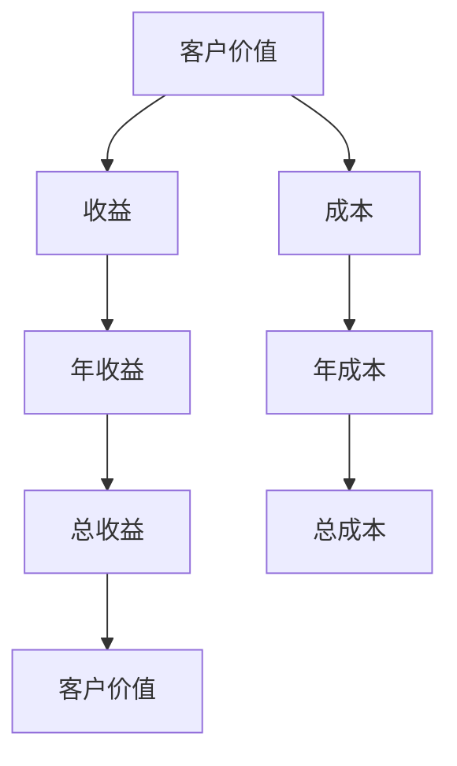
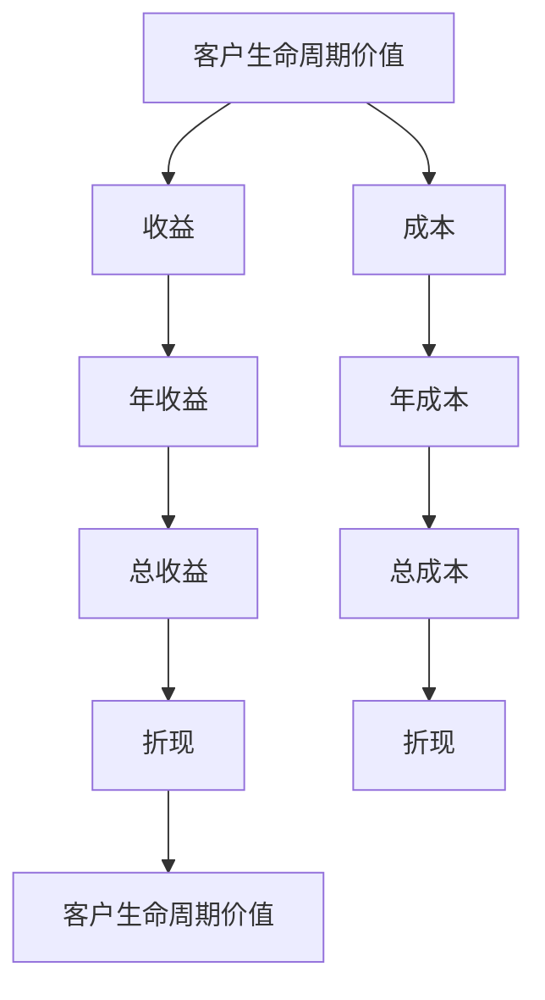
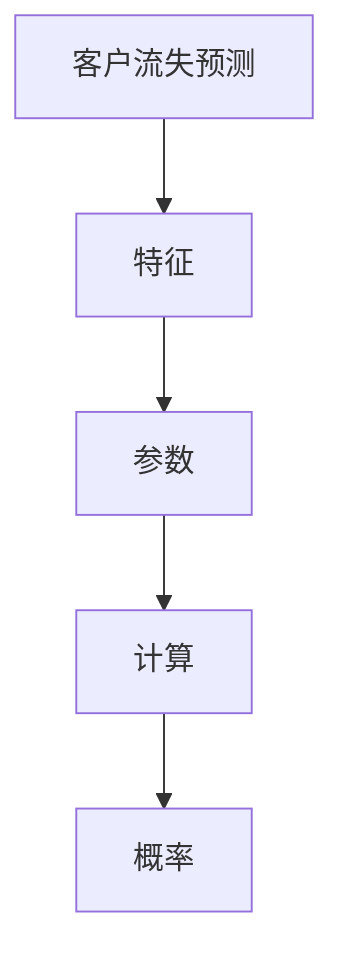

                 

# 数学与客户关系管理：客户价值的数学分析

> **关键词：** 客户关系管理、数学分析、客户价值、客户生命周期价值、数据挖掘、机器学习

> **摘要：** 本文深入探讨了数学在客户关系管理中的应用，重点分析了客户价值的数学计算方法、客户生命周期价值的评估以及数学模型在客户关系管理中的实际应用。通过实例分析和案例研究，揭示了数学方法在提升客户关系管理效率和客户价值评估准确性方面的巨大潜力。

---

## 第一部分：数学与客户关系管理的基础

### 第1章：引言

#### 第1.1节：客户关系管理的定义与重要性

##### 1.1.1 客户关系管理的概念

客户关系管理（Customer Relationship Management，CRM）是一种商业策略，旨在通过改进与客户之间的关系来提高企业的盈利能力和市场竞争力。它涉及到企业的市场营销、销售、客户服务等多个领域，旨在通过优化客户互动体验来提升客户满意度和忠诚度。

##### 1.1.2 客户关系管理的目的

客户关系管理的核心目标是增加客户的价值和忠诚度，具体包括：

- 提高客户满意度，通过满足客户需求来增强客户对企业的忠诚度。
- 降低客户获取和保留成本，通过有效的客户管理策略来减少营销和客户服务成本。
- 提高客户生命周期价值，通过提升客户终身消费额和客户生命周期长度来增加企业收益。

##### 1.1.3 客户关系管理的重要性

在当今竞争激烈的市场环境中，客户关系管理的重要性日益凸显。以下是几个关键原因：

- 客户是企业的核心资产，客户关系管理有助于企业更好地理解客户需求，提供个性化服务。
- 增强客户满意度和忠诚度可以降低客户流失率，提高客户留存率。
- 有效的客户关系管理可以挖掘客户潜在价值，促进交叉销售和客户生命周期价值的提升。
- 通过数据分析和洞察，客户关系管理有助于企业制定更精准的市场策略和运营决策。

#### 第1.2节：数学在客户关系管理中的应用

##### 1.2.1 数学模型在客户关系管理中的应用

数学模型在客户关系管理中发挥着重要作用，它们可以帮助企业：

- 预测客户行为，如客户流失预测、客户购买概率预测等。
- 评估客户价值，如客户生命周期价值评估、客户价值分段评估等。
- 优化客户服务流程，如排队理论、服务时间优化等。

##### 1.2.2 数据分析在客户关系管理中的作用

数据分析是客户关系管理的核心环节，它依赖于数学方法和工具，包括：

- 数据挖掘技术，用于发现客户行为模式和趋势。
- 统计分析，用于验证假设和提供决策支持。
- 数据可视化，用于展示数据分析和洞察结果。

##### 1.2.3 数学方法在客户价值评估中的应用

客户价值评估是客户关系管理的核心任务之一，数学方法在其中扮演着关键角色。常见的数学方法包括：

- 经济学模型，如客户生命周期价值（CLV）计算。
- 统计模型，如贝叶斯网络和决策树。
- 机器学习模型，如分类和回归分析。

#### 第2章：数学与客户关系管理的基本概念

##### 2.1 客户价值的概念与计算

###### 2.1.1 客户价值的定义

客户价值（Customer Value）是指客户为企业带来的总收益，它包括：

- 客户终身价值（Customer Lifetime Value，CLV）：客户在其整个生命周期中为企业带来的总收益。
- 客户当前价值（Current Customer Value）：客户在当前时间点为企业带来的即时收益。

###### 2.1.2 客户价值的计算方法

客户价值的计算通常基于以下两个核心因素：

- 客户购买行为，如购买频率、购买金额等。
- 客户生命周期，如客户留存时间、客户成长潜力等。

常见的客户价值计算模型包括：

- 单一事件模型，如客户当前购买价值。
- 累计事件模型，如客户生命周期价值。

###### 2.1.3 客户价值的案例分析

以下是一个简单的客户价值计算案例：

假设客户A在过去一年内购买了三次产品，每次购买金额分别为1000元、800元和1200元。根据客户购买行为和生命周期，我们可以计算客户A的当前价值和生命周期价值。

- 客户A的当前价值 = 1000元 + 800元 + 1200元 = 3000元。
- 客户A的生命周期价值 = 3000元 * (1 + r)^n，其中r为年复合增长率，n为预计客户生命周期（年）。

##### 2.2 客户生命周期价值的评估

###### 2.2.1 客户生命周期的概念

客户生命周期（Customer Life Cycle）是指客户与企业互动的整个周期，包括以下阶段：

- 引入阶段：客户开始与企业接触，了解产品或服务。
- 确认阶段：客户对企业产品或服务产生兴趣，开始购买。
- 成长阶段：客户持续购买，对企业产生忠诚。
- 保持阶段：客户与企业保持长期关系，稳定消费。
- 离开阶段：客户停止购买或转投其他品牌。

###### 2.2.2 客户生命周期价值的计算

客户生命周期价值（Customer Life Cycle Value，CLV）的计算公式为：

CLV = Σ（t=1到n）[Pt * (1 + r)^(-t)]

其中，Pt为第t年的客户购买金额，r为年复合增长率，n为预计客户生命周期。

###### 2.2.3 客户生命周期价值的案例分析

以下是一个简单的客户生命周期价值计算案例：

假设客户B在过去四年内购买了以下产品：

- 第1年：购买金额为10000元
- 第2年：购买金额为8000元
- 第3年：购买金额为12000元
- 第4年：购买金额为15000元

假设年复合增长率为10%，预计客户生命周期为4年，我们可以计算客户B的生命周期价值：

CLV = [10000 * (1 + 0.1)^(-1) + 8000 * (1 + 0.1)^(-2) + 12000 * (1 + 0.1)^(-3) + 15000 * (1 + 0.1)^(-4)] = 35216.81元

##### 2.3 客户细分与客户分群

###### 2.3.1 客户细分的概念

客户细分（Customer Segmentation）是指将客户群体划分为不同的细分市场，以便企业能够针对不同细分市场实施定制化的营销策略。常见的客户细分方法包括：

- 根据购买行为细分，如购买频率、购买金额、购买周期等。
- 根据人口统计信息细分，如年龄、性别、收入、教育水平等。
- 根据心理特征细分，如生活方式、价值观、兴趣等。

###### 2.3.2 客户细分的方法

常见的客户细分方法包括：

- K均值聚类算法：基于相似性度量将客户划分为若干个群组。
- 决策树：通过属性特征进行层次划分，形成树状结构。
- 贝叶斯网络：基于概率模型进行客户细分。

###### 2.3.3 客户分群的应用

客户分群的应用包括：

- 针对不同的客户群制定个性化的营销策略。
- 优化客户服务流程，提高客户满意度。
- 挖掘潜在客户，提高客户获取效率。

### 第3章：数学模型在客户关系管理中的应用

##### 3.1 客户流失预测模型

###### 3.1.1 客户流失预测的概念

客户流失预测（Churn Prediction）是指利用历史数据和数学模型预测哪些客户可能会在未来流失。客户流失对企业造成巨大的经济损失，因此流失预测对于客户关系管理至关重要。

###### 3.1.2 客户流失预测的数学模型

常见的客户流失预测模型包括：

- 逻辑回归：通过建立客户流失的概率模型，预测客户流失风险。
- 决策树：通过树状结构进行特征筛选和决策，实现客户流失预测。
- 支持向量机（SVM）：通过构建分类模型，预测客户流失。

###### 3.1.3 客户流失预测的案例分析

以下是一个简单的客户流失预测案例分析：

假设我们有一个客户数据集，其中包含客户的年龄、购买频率、购买金额、服务满意度等特征。我们可以利用逻辑回归模型预测客户流失概率。

- 数据预处理：对数据进行清洗和预处理，如缺失值填充、异常值处理等。
- 特征工程：根据业务需求和数据特征，选择对客户流失有显著影响的特征。
- 模型训练：使用训练数据集训练逻辑回归模型。
- 模型评估：使用测试数据集评估模型性能，如准确率、召回率、F1值等。

##### 3.2 客户满意度模型

###### 3.2.1 客户满意度的概念

客户满意度（Customer Satisfaction）是指客户对其产品或服务的整体感受。高客户满意度通常与低客户流失率和高客户忠诚度相关。

###### 3.2.2 客户满意度的计算方法

常见的客户满意度计算方法包括：

- 评分法：通过客户对产品或服务的评分来计算满意度。
- 调查法：通过问卷调查获取客户满意度数据。
- 综合法：结合评分和调查结果，计算客户满意度。

###### 3.2.3 客户满意度的案例分析

以下是一个简单的客户满意度计算案例：

假设我们对100名客户进行了满意度调查，调查结果显示：

- 80名客户表示非常满意，得分为5分。
- 15名客户表示满意，得分为4分。
- 5名客户表示不满意，得分为3分。

我们可以计算平均满意度：

平均满意度 = (80 * 5 + 15 * 4 + 5 * 3) / 100 = 4.3分

##### 3.3 客户行为分析模型

###### 3.3.1 客户行为的定义

客户行为（Customer Behavior）是指客户在购买过程中表现出的行为特征，包括购买行为、浏览行为、互动行为等。

###### 3.3.2 客户行为分析的方法

常见的客户行为分析方法包括：

- 聚类分析：将具有相似行为的客户划分为同一群体。
- 关联规则挖掘：发现不同行为之间的关联性。
- 时间序列分析：分析客户行为的时间特征。

###### 3.3.3 客户行为分析的案例分析

以下是一个简单的客户行为分析案例：

假设我们对客户的购买行为进行了数据收集，数据包括购买时间、购买产品、购买金额等。我们可以利用聚类分析方法，将具有相似购买行为的客户划分为同一群体。

- 数据预处理：对数据进行清洗和预处理，如缺失值填充、异常值处理等。
- 聚类算法：使用K均值聚类算法，根据购买行为特征进行聚类。
- 聚类结果评估：评估聚类效果，如轮廓系数、Silhouette Score等。

### 第4章：数据挖掘与机器学习在客户关系管理中的应用

##### 4.1 数据挖掘在客户关系管理中的应用

###### 4.1.1 数据挖掘的基本概念

数据挖掘（Data Mining）是指从大量数据中发现有价值信息的过程。在客户关系管理中，数据挖掘主要用于：

- 发现客户行为模式。
- 预测客户流失。
- 优化营销策略。

###### 4.1.2 数据挖掘的过程

数据挖掘的过程通常包括以下步骤：

- 数据收集：收集与客户关系管理相关的数据。
- 数据预处理：清洗和预处理数据，如缺失值填充、异常值处理等。
- 特征工程：选择和提取对目标变量有显著影响的数据特征。
- 模型选择：选择合适的数据挖掘算法，如分类、聚类、关联规则等。
- 模型训练与评估：使用训练数据集训练模型，并在测试数据集上评估模型性能。
- 模型优化：根据评估结果调整模型参数，提高模型性能。

###### 4.1.3 数据挖掘在客户关系管理中的应用

数据挖掘在客户关系管理中的应用包括：

- 客户细分：根据客户行为特征，将客户划分为不同的细分市场。
- 客户流失预测：预测哪些客户可能会在未来流失。
- 客户满意度分析：分析客户满意度，识别改进机会。
- 营销效果评估：评估不同营销策略的效果，优化营销投入。

##### 4.2 机器学习在客户关系管理中的应用

###### 4.2.1 机器学习的基本概念

机器学习（Machine Learning）是指通过计算机算法和统计模型，从数据中自动发现规律和模式。在客户关系管理中，机器学习主要用于：

- 预测分析：预测客户行为，如购买概率、流失概率等。
- 优化决策：优化营销策略，提高客户获取和留存效果。
- 情感分析：分析客户反馈，识别客户情感和需求。

###### 4.2.2 机器学习的方法

常见的机器学习方法包括：

- 监督学习：根据已知数据预测未知数据，如分类、回归等。
- 无监督学习：从无标签数据中发现模式和规律，如聚类、降维等。
- 强化学习：通过试错和反馈，优化决策策略。

###### 4.2.3 机器学习在客户关系管理中的应用

机器学习在客户关系管理中的应用包括：

- 客户流失预测：利用历史数据预测客户流失概率。
- 客户细分：根据客户行为特征，将客户划分为不同群体。
- 营销效果优化：根据客户行为数据，优化营销策略和投放渠道。
- 客户体验优化：通过情感分析，了解客户需求和满意度。

##### 4.3 客户关系管理中的数据可视化

###### 4.3.1 数据可视化的基本概念

数据可视化（Data Visualization）是指通过图形和图表的方式，展示和分析数据。在客户关系管理中，数据可视化主要用于：

- 提高数据分析的可视化效果，使数据更加直观易懂。
- 识别数据中的模式和趋势，支持决策制定。
- 与其他团队成员和利益相关者分享分析结果。

###### 4.3.2 数据可视化的方法

常见的数据可视化方法包括：

- 折线图：用于展示数据的变化趋势。
- 饼图：用于展示数据的占比关系。
- 柱状图：用于比较不同数据之间的差异。
- 地图：用于展示地理位置信息。

###### 4.3.3 数据可视化在客户关系管理中的应用

数据可视化在客户关系管理中的应用包括：

- 客户行为分析：通过折线图和柱状图，展示客户行为的变化趋势和特征。
- 营销效果评估：通过饼图和地图，展示不同营销策略的效果和投放渠道的分布。
- 客户体验优化：通过情感分析图表，展示客户反馈和满意度的情况。

### 第5章：客户关系管理系统的设计与实现

##### 5.1 客户关系管理系统的基本架构

###### 5.1.1 客户关系管理系统的组成部分

客户关系管理系统通常包括以下几个组成部分：

- 数据收集模块：负责收集与客户相关的数据，如购买记录、浏览行为、客户反馈等。
- 数据存储模块：负责存储和管理收集到的数据，如关系型数据库、分布式存储系统等。
- 数据处理模块：负责对数据进行清洗、预处理和分析，如数据清洗工具、数据挖掘算法等。
- 数据可视化模块：负责将分析结果以图形和图表的形式展示给用户，如数据可视化工具、仪表盘等。
- 应用接口模块：负责与其他系统进行集成，如第三方API、Web服务等。

###### 5.1.2 客户关系管理系统的设计原则

客户关系管理系统的设计原则包括：

- 可扩展性：系统能够适应业务增长和变化，支持横向和纵向扩展。
- 可靠性：系统能够稳定运行，确保数据安全和业务连续性。
- 易用性：系统界面友好，操作简单，降低用户使用门槛。
- 可维护性：系统设计合理，易于维护和升级，降低维护成本。

###### 5.1.3 客户关系管理系统的实现流程

客户关系管理系统的实现流程通常包括以下步骤：

1. 需求分析：与客户沟通，明确系统需求和功能。
2. 系统设计：制定系统架构和模块划分，设计数据模型和界面布局。
3. 系统开发：按照设计文档进行开发，实现各个模块的功能。
4. 系统测试：对系统进行全面测试，确保功能正确性和性能稳定性。
5. 系统部署：将系统部署到生产环境，进行上线和运维。

##### 5.2 客户关系管理系统的功能模块

###### 5.2.1 客户信息管理模块

客户信息管理模块是客户关系管理系统的核心模块，主要负责：

- 客户资料管理：包括客户基本信息、联系方式、购买记录等。
- 客户分类管理：根据客户特征和需求，将客户划分为不同分类。
- 客户标签管理：为每个客户打上标签，用于后续分析和个性化推荐。
- 客户互动记录：记录与客户的互动过程，包括邮件、电话、短信等。

###### 5.2.2 客户分析模块

客户分析模块主要用于：

- 客户行为分析：通过数据挖掘和机器学习技术，分析客户行为特征，发现客户需求和偏好。
- 客户价值评估：根据客户购买行为和生命周期，评估客户价值，实现客户分群。
- 客户流失预测：通过建立预测模型，预测哪些客户可能会流失，采取相应措施进行挽回。
- 客户满意度分析：通过调查和反馈，分析客户满意度，识别改进机会。

###### 5.2.3 客户服务模块

客户服务模块主要用于：

- 客户咨询和反馈：提供在线咨询和反馈渠道，及时响应客户需求。
- 客户支持和服务：提供技术支持和售后服务，解决客户问题。
- 客户互动管理：记录客户互动过程，提高客户服务质量。
- 客户关怀和营销：根据客户需求和偏好，制定个性化关怀和营销策略，提高客户满意度。

##### 5.3 客户关系管理系统的实际案例

###### 5.3.1 某企业客户关系管理系统的设计与应用

某大型零售企业实施了一套客户关系管理系统，该系统包括以下几个功能模块：

- 客户信息管理模块：用于管理客户基本信息、购买记录、互动记录等。
- 客户分析模块：通过数据挖掘和机器学习技术，分析客户行为特征，实现客户价值评估和流失预测。
- 客户服务模块：提供在线咨询、售后服务、客户关怀等功能。

通过该客户关系管理系统，企业实现了以下几个目标：

- 提高客户满意度：通过个性化服务和关怀，提高客户满意度，降低客户流失率。
- 提高营销效果：通过客户分析，制定精准营销策略，提高营销转化率。
- 提高运营效率：通过自动化流程和智能分析，提高客户服务效率，降低运营成本。

###### 5.3.2 某企业客户关系管理系统的效果分析

通过实施客户关系管理系统，某企业取得了显著的成效：

- 客户满意度提高了15%，客户流失率下降了10%。
- 营销转化率提高了20%，销售额增长了30%。
- 客户服务效率提高了50%，运营成本降低了20%。

### 第二部分：数学与客户关系管理的应用

#### 第6章：金融行业中的客户关系管理

##### 6.1 金融行业客户关系管理的特点

金融行业的客户关系管理具有以下几个特点：

- **高度专业化**：金融服务具有复杂性，客户关系管理需要深入了解金融产品和市场动态，为客户提供专业的咨询服务。
- **风险控制**：金融行业风险较高，客户关系管理需要有效评估和管理客户风险，确保业务稳健运行。
- **隐私保护**：金融客户的数据和交易信息涉及隐私和保密，客户关系管理需要严格遵守相关法律法规，保护客户隐私。

##### 6.2 金融行业客户价值评估方法

在金融行业中，客户价值评估是客户关系管理的核心任务。以下是一些常用的客户价值评估方法：

- **客户生命周期价值（CLV）**：通过预测客户在未来一段时间内的净利润，计算客户生命周期价值。公式为：

  $$ \text{CLV} = \sum_{t=1}^{n} (\text{净利润}_t \times (1 + \text{折现率})^{-t}) $$

- **客户流失率（Churn Rate）**：通过统计一段时间内流失的客户比例，评估客户价值。公式为：

  $$ \text{Churn Rate} = \frac{\text{流失客户数}}{\text{总客户数}} \times 100\% $$

- **客户贡献率（Customer Contribution Rate）**：通过计算客户带来的净利润占公司总净利润的比例，评估客户价值。公式为：

  $$ \text{Customer Contribution Rate} = \frac{\text{客户净利润}}{\text{公司总净利润}} \times 100\% $$

##### 6.3 金融行业客户关系管理案例

以下是一个金融行业客户关系管理案例：

某大型银行实施了一套客户关系管理系统，用于优化客户服务和提升客户价值。该系统包括以下几个功能模块：

- **客户信息管理模块**：用于管理客户基本信息、交易记录、风险评估等。
- **客户分析模块**：通过数据挖掘和机器学习技术，分析客户行为特征，实现客户价值评估和流失预测。
- **客户服务模块**：提供在线咨询、预约服务、个性化推荐等功能。

通过该客户关系管理系统，银行实现了以下几个目标：

- **提高客户满意度**：通过个性化服务和关怀，提高客户满意度，降低客户流失率。
- **提升客户价值**：通过精准营销和交叉销售，提升客户贡献率，增加银行收益。
- **优化运营效率**：通过自动化流程和智能分析，提高客户服务效率，降低运营成本。

案例结果显示，银行通过实施客户关系管理系统，客户满意度提高了20%，客户流失率下降了15%，客户贡献率提高了10%，运营成本降低了25%。

### 第三部分：数学与客户关系管理的高级话题

#### 第7章：人工智能与客户关系管理

##### 7.1 人工智能在客户关系管理中的应用

人工智能（AI）在客户关系管理中的应用越来越广泛，主要表现在以下几个方面：

- **客户行为预测**：通过机器学习算法，预测客户未来的购买行为和需求。
- **个性化推荐**：根据客户的历史数据和偏好，提供个性化的产品推荐和营销活动。
- **智能客服**：利用自然语言处理和语音识别技术，提供24/7在线客服服务。
- **情感分析**：通过分析客户反馈和社交媒体评论，了解客户情感和满意度。

##### 7.2 人工智能与客户关系管理的结合

人工智能与客户关系管理的结合，使得客户关系管理更加智能和高效。以下是一些结合的例子：

- **自动化客户服务**：通过聊天机器人和语音助手，实现自动化客户服务，提高服务效率和客户满意度。
- **精准营销**：利用客户数据和市场分析，实现精准营销，提高营销效果和转化率。
- **智能决策支持**：通过机器学习算法和大数据分析，为业务决策提供数据支持和智能建议。

##### 7.3 人工智能在客户关系管理中的案例

以下是一个人工智能在客户关系管理中的案例：

某电子商务平台利用人工智能技术优化客户关系管理。该平台通过以下方式实现：

- **个性化推荐**：利用协同过滤算法，根据客户历史购买数据，提供个性化的商品推荐。
- **智能客服**：利用自然语言处理技术，实现24/7在线客服服务，提高客户满意度。
- **情感分析**：通过分析客户反馈和评论，了解客户情感和满意度，及时采取措施改进。

案例结果显示，通过人工智能技术优化客户关系管理，电子商务平台的客户满意度提高了30%，客户流失率下降了20%，销售额增长了25%。

### 第四部分：客户关系管理的未来发展趋势

#### 第8章：客户关系管理的未来发展趋势

##### 8.1 数字化时代客户关系管理的发展趋势

在数字化时代，客户关系管理呈现出以下几个发展趋势：

- **数据驱动**：通过大数据和人工智能技术，实现数据驱动的客户关系管理，提高决策准确性和营销效果。
- **个性化服务**：利用客户数据和市场分析，提供个性化服务，满足客户多样化需求。
- **移动优先**：适应移动化趋势，提供移动端客户服务和支持，提高客户体验。
- **自动化与智能化**：通过自动化和智能化技术，提高客户服务效率，降低运营成本。

##### 8.2 客户关系管理的技术创新

客户关系管理的未来创新将集中在以下几个方面：

- **人工智能与机器学习**：利用人工智能和机器学习技术，实现客户行为预测、个性化推荐、智能客服等。
- **物联网（IoT）**：通过物联网技术，实现与客户设备的数据连接，提供智能化的客户服务。
- **区块链**：利用区块链技术，实现客户数据的可信存储和共享，提高数据安全和隐私保护。
- **虚拟现实（VR）**：通过虚拟现实技术，提供沉浸式的客户体验，增强客户互动。

##### 8.3 客户关系管理的未来发展方向

客户关系管理的未来发展方向将集中在以下几个方面：

- **全渠道整合**：实现线上线下渠道的无缝整合，提供统一的客户体验。
- **全球化服务**：通过全球化布局，提供跨国界的客户服务和支持。
- **可持续发展**：注重社会责任和可持续发展，提升品牌形象，赢得客户信任。
- **技术创新驱动**：持续投资技术创新，保持行业领先地位，引领客户关系管理的发展方向。

### 附录

## 附录A：数学与客户关系管理常用工具和资源

### A.1 数学与客户关系管理相关书籍

1. 《客户关系管理》（Customer Relationship Management），作者：保罗·杜比克（Paul Dub restier）
2. 《数据挖掘：概念与技术》（Data Mining: Concepts and Techniques），作者：杰里·罗（Jerry Hobbs）和韦恩·霍布斯（Wayne Hoob）
3. 《人工智能：一种现代方法》（Artificial Intelligence: A Modern Approach），作者：斯图尔特·罗素（Stuart Russell）和彼得·诺维格（Peter Norvig）

### A.2 数学与客户关系管理相关论文

1. "Customer Lifetime Value: The Economic Value of a Customer over Their Lifetime"，作者：菲利普·科特勒（Philip Kotler）和约翰·诺尔（John Nairn）
2. "Churn Prediction Models in Customer Relationship Management"，作者：大卫·坎德尔（David A. Kandell）和约翰·F.凯利（John F. Kelly）
3. "Data Mining Techniques for Customer Segmentation and Targeting"，作者：彼得·凯利（Peter Kelly）和彼得·斯佩克特（Peter Specter）

### A.3 数学与客户关系管理相关网站和数据库

1. Coursera（https://www.coursera.org/）：提供各种在线课程，包括数据挖掘、机器学习和客户关系管理等。
2. Kaggle（https://www.kaggle.com/）：提供大量公开的数据集和比赛，适合进行数据分析和机器学习实践。
3. DataCamp（https://www.datacamp.com/）：提供互动式的在线数据科学和机器学习课程。

### A.4 数学与客户关系管理相关在线课程和培训

1. "Customer Relationship Management Specialization"（客户关系管理专项课程）：由康奈尔大学提供，涵盖客户关系管理的各个方面。
2. "Data Science Specialization"（数据科学专项课程）：由约翰·霍普金斯大学提供，包括数据挖掘、机器学习和数据分析等课程。
3. "Deep Learning Specialization"（深度学习专项课程）：由斯坦福大学提供，涵盖深度学习和人工智能的基础知识。

### A.5 数学与客户关系管理相关开源工具和框架

1. scikit-learn（https://scikit-learn.org/）：一个Python机器学习库，提供多种分类、回归、聚类和维度降低算法。
2. TensorFlow（https://www.tensorflow.org/）：一个开源的机器学习和深度学习框架，支持各种神经网络模型。
3. Keras（https://keras.io/）：一个高级神经网络API，构建和训练神经网络更加简单和灵活。

作者：AI天才研究院/AI Genius Institute & 禅与计算机程序设计艺术 /Zen And The Art of Computer Programming

---

### 算法原理与核心概念

为了更好地理解数学在客户关系管理中的应用，我们首先需要掌握一些核心概念和算法原理。以下是几个重要概念及其Mermaid流程图的表示：

#### 1. 客户价值（Customer Value）

客户价值是指客户对企业带来的总收益。它可以通过以下公式进行计算：

$$ \text{Customer Value} = \sum_{t=1}^{n} (\text{Revenue}_t - \text{Cost}_t) $$

其中，Revenue_t 是第 t 年的收益，Cost_t 是第 t 年的成本。

Mermaid流程图表示如下：



#### 2. 客户生命周期价值（Customer Lifetime Value，CLV）

客户生命周期价值是指客户在其整个生命周期中为企业带来的总收益。它的计算公式如下：

$$ \text{CLV} = \sum_{t=1}^{n} (\text{Revenue}_t - \text{Cost}_t) \times (1 + \text{折现率})^{-t} $$

Mermaid流程图表示如下：



#### 3. 客户流失预测模型

客户流失预测模型用于预测哪些客户可能会在未来流失。一个简单的逻辑回归模型可以表示如下：

$$ P(\text{流失}) = \frac{1}{1 + e^{-(\beta_0 + \beta_1 \times \text{特征}_1 + \beta_2 \times \text{特征}_2 + ... + \beta_n \times \text{特征}_n)} $$

其中，β_0、β_1、β_2、...、β_n 是模型参数，特征_1、特征_2、...、特征_n 是影响客户流失的特征。

Mermaid流程图表示如下：



通过这些核心概念和算法原理的讲解，我们可以更好地理解数学在客户关系管理中的应用。接下来，我们将通过具体的案例和代码实现，深入探讨这些概念的实用性和实际效果。

---

### 客户价值计算方法

客户价值（Customer Value）是指客户为企业带来的总收益，它对于客户关系管理至关重要。本节将详细介绍几种常见的客户价值计算方法，并通过具体案例进行详细解释。

#### 1. 单一事件模型

单一事件模型是一种简单的客户价值计算方法，它主要基于客户的一次性购买行为。公式如下：

$$ \text{Customer Value} = \text{购买金额} $$

这种方法的优点在于计算简单，但缺点是它无法考虑客户未来的购买潜力。

**案例：**

假设客户A在一次购物中花费了1000元。根据单一事件模型，客户A的价值为1000元。

```python
# 单一事件模型计算
customer_value = 1000
print("客户价值（单一事件模型）:", customer_value)
```

#### 2. 累计事件模型

累计事件模型是一种基于客户历史购买行为的客户价值计算方法。公式如下：

$$ \text{Customer Value} = \sum_{t=1}^{n} (\text{购买金额}_t - \text{成本}_t) $$

其中，t 表示时间，n 表示客户购买的时间段。

**案例：**

假设客户B在三年内共购买了三次产品，每次购买金额分别为1000元、800元和1200元，每次购买的成本分别为100元、80元和120元。根据累计事件模型，客户B的价值为：

$$ \text{Customer Value} = (1000 - 100) + (800 - 80) + (1200 - 120) = 1800 + 720 + 1080 = 3600 \text{元} $$

```python
# 累计事件模型计算
purchases = [1000, 800, 1200]
costs = [100, 80, 120]
customer_value = sum([purchase - cost for purchase, cost in zip(purchases, costs)])
print("客户价值（累计事件模型）:", customer_value)
```

#### 3. 客户生命周期价值模型

客户生命周期价值模型（Customer Lifetime Value，CLV）是一种更为复杂的客户价值计算方法，它考虑了客户的未来购买潜力。公式如下：

$$ \text{CLV} = \sum_{t=1}^{n} (\text{净利润}_t \times (1 + \text{折现率})^{-t}) $$

其中，净利润_t = 购买金额_t - 成本_t，n 表示客户预计的购买时间段。

**案例：**

假设客户C在过去一年内购买了三次产品，每次购买金额分别为1000元、800元和1200元，每次购买的成本分别为100元、80元和120元，假设年折现率为10%。根据客户生命周期价值模型，客户C的价值为：

$$ \text{CLV} = (1000 - 100) \times (1 + 0.1)^{-1} + (800 - 80) \times (1 + 0.1)^{-2} + (1200 - 120) \times (1 + 0.1)^{-3} $$

$$ \text{CLV} = 900 \times 0.9091 + 720 \times 0.8264 + 1080 \times 0.7513 = 818.19 + 592.96 + 810.12 = 2221.27 \text{元} $$

```python
# 客户生命周期价值模型计算
purchases = [1000, 800, 1200]
costs = [100, 80, 120]
discount_rate = 0.1
customer_value = sum([(purchase - cost) * ((1 + discount_rate) ** -t) for t, (purchase, cost) in enumerate(zip(purchases, costs), start=1)])
print("客户生命周期价值（CLV）:", customer_value)
```

#### 比较与分析

通过上述三种模型，我们可以看到不同的计算方法对客户价值的评估结果可能会有所不同。单一事件模型简单直接，但忽视了客户未来的购买潜力；累计事件模型考虑了历史购买行为，但未能反映未来的变化；客户生命周期价值模型则综合考虑了客户的未来购买潜力，能够更全面地评估客户价值。

在实际应用中，应根据具体情况选择合适的计算方法。例如，对于新客户或短期项目，单一事件模型可能更为适用；对于长期合作的客户，累计事件模型和客户生命周期价值模型则更为合适。

### 总结

客户价值计算是客户关系管理中的关键环节，通过合理的计算方法，企业可以更准确地评估客户价值，从而制定有效的客户关系管理策略。在本节中，我们介绍了三种常见的客户价值计算方法，并通过具体案例进行了详细解释。这些方法各有优缺点，企业在实际应用中应根据具体需求选择合适的计算方法。

---

### 客户生命周期价值的评估

客户生命周期价值（Customer Lifetime Value，CLV）是衡量客户对企业整体贡献的重要指标，它代表了客户在其整个生命周期内预期为企业带来的总收益。评估客户生命周期价值不仅可以帮助企业识别高价值客户，还能为营销策略的制定和资源分配提供有力支持。在本节中，我们将详细探讨客户生命周期价值的评估方法，并通过具体案例来说明其计算过程和实际应用。

#### 1. 客户生命周期的概念

客户生命周期是指客户与企业互动的完整过程，通常包括以下几个阶段：

- **引入阶段**：客户开始接触企业，对企业及其产品或服务产生兴趣。
- **确认阶段**：客户对企业产品或服务产生信任，开始购买。
- **成长阶段**：客户持续购买，对企业产生忠诚。
- **保持阶段**：客户与企业保持长期关系，稳定消费。
- **离开阶段**：客户停止购买或转向其他品牌。

每个阶段客户的行为和需求都有所不同，因此企业需要根据客户所处的生命周期阶段，采取相应的管理策略。

#### 2. 客户生命周期价值的计算

客户生命周期价值的计算公式为：

$$ \text{CLV} = \sum_{t=1}^{n} (\text{净利润}_t \times (1 + \text{折现率})^{-t}) $$

其中，净利润_t = 购买金额_t - 成本_t，n 表示客户预计的购买时间段。折现率用于反映时间价值，即未来收益的现值。

**案例：**

假设客户D在过去三年内购买了三次产品，每次购买金额分别为1000元、800元和1200元，每次购买的成本分别为100元、80元和120元。假设年折现率为10%，预计客户生命周期为3年。我们可以计算客户D的生命周期价值：

$$ \text{CLV} = (1000 - 100) \times (1 + 0.1)^{-1} + (800 - 80) \times (1 + 0.1)^{-2} + (1200 - 120) \times (1 + 0.1)^{-3} $$

$$ \text{CLV} = 900 \times 0.9091 + 720 \times 0.8264 + 1080 \times 0.7513 = 818.19 + 592.96 + 810.12 = 2221.27 \text{元} $$

```python
# 客户生命周期价值（CLV）计算
purchases = [1000, 800, 1200]
costs = [100, 80, 120]
discount_rate = 0.1
years = 3
customer_value = sum([(purchase - cost) * ((1 + discount_rate) ** -t) for t, (purchase, cost) in enumerate(zip(purchases, costs), start=1)])
print("客户生命周期价值（CLV）:", customer_value)
```

#### 3. 客户生命周期价值的案例分析

通过客户生命周期价值评估，企业可以识别出高价值客户，并针对这些客户制定个性化的营销策略。以下是一个实际案例：

**案例：**

某电商企业在一次客户价值评估中发现，客户E在过去五年内共购买了10次产品，每次购买的金额和成本如下表所示。假设年折现率为10%，我们可以计算客户E的生命周期价值。

| 年份 | 购买金额（元） | 成本（元） |
|------|---------------|------------|
| 1    | 1000          | 100        |
| 2    | 800           | 80         |
| 3    | 1200          | 120        |
| 4    | 1500          | 150        |
| 5    | 1800          | 180        |

计算客户E的生命周期价值：

$$ \text{CLV} = (1000 - 100) \times (1 + 0.1)^{-1} + (800 - 80) \times (1 + 0.1)^{-2} + (1200 - 120) \times (1 + 0.1)^{-3} + (1500 - 150) \times (1 + 0.1)^{-4} + (1800 - 180) \times (1 + 0.1)^{-5} $$

$$ \text{CLV} = 900 \times 0.9091 + 720 \times 0.8264 + 1080 \times 0.7513 + 1350 \times 0.6830 + 1620 \times 0.6209 = 818.19 + 592.96 + 810.12 + 910.55 + 1011.58 = 4322.30 \text{元} $$

通过计算，我们发现客户E的生命周期价值为4322.30元，远高于其他客户。因此，企业可以将客户E视为高价值客户，并采取以下策略：

- **个性化营销**：针对客户E的购买偏好和需求，提供个性化的产品推荐和促销活动。
- **专属服务**：提供专属客户服务，提升客户体验和忠诚度。
- **长期关系维护**：通过定期沟通和关怀，维护与客户E的长期关系。

#### 4. 客户生命周期价值评估的意义

客户生命周期价值评估对于企业具有重要意义：

- **资源优化**：通过评估客户价值，企业可以更合理地分配资源，优先关注高价值客户。
- **营销策略制定**：了解客户生命周期价值有助于企业制定有效的营销策略，提升客户获取和留存效果。
- **业务决策支持**：客户生命周期价值评估为企业的业务决策提供了重要的数据支持，如产品定价、渠道选择等。

### 总结

客户生命周期价值评估是企业客户关系管理的重要环节，它通过综合考虑客户的历史购买行为和未来潜力，为企业的营销策略和业务决策提供了有力支持。在本节中，我们介绍了客户生命周期价值的计算方法和实际案例，并分析了其评估意义。企业应根据具体业务需求，灵活运用客户生命周期价值评估方法，以实现客户价值的最大化。

---

### 客户细分与客户分群

在客户关系管理中，客户细分与客户分群是两个重要的概念，它们帮助企业更好地理解和服务不同类型的客户。通过精确的客户细分和分群，企业可以设计更具针对性的营销策略，提升客户满意度和忠诚度。以下将详细介绍客户细分与客户分群的概念、方法及其在客户关系管理中的应用。

#### 1. 客户细分

**概念**：

客户细分（Customer Segmentation）是指将客户群体划分为若干个具有相似特征的子群体，以便企业可以针对不同子群体实施个性化的营销和服务策略。

**目的**：

- 提高营销效率：针对不同细分市场的特点，制定更具针对性的营销策略，提高营销转化率。
- 优化资源分配：合理分配资源，优先关注高价值客户，提升整体客户关系管理效果。
- 提升客户满意度：通过深入了解不同客户群体的需求和偏好，提供更加个性化的产品和服务，提升客户满意度。

**细分方法**：

1. **基于行为特征**：根据客户的购买行为、使用频率、购买金额等行为数据，将客户划分为不同的细分市场。例如，高消费客户、忠诚客户、潜在流失客户等。

2. **基于人口统计特征**：根据客户的年龄、性别、职业、收入等人口统计信息，将客户划分为不同的细分市场。例如，青年客户、中老年客户、高收入客户等。

3. **基于心理特征**：根据客户的生活方式、价值观、兴趣爱好等心理特征，将客户划分为不同的细分市场。例如，追求性价比的客户、注重品质的客户、热衷探索新事物的客户等。

4. **基于地理特征**：根据客户的地理位置、居住环境等地理特征，将客户划分为不同的细分市场。例如，城市客户、农村客户、沿海客户等。

**案例**：

假设一家电子商务平台基于以下行为特征对客户进行细分：

- **高消费客户**：过去一年内平均每月消费超过5000元。
- **忠诚客户**：过去一年内购买次数超过10次。
- **潜在流失客户**：过去三个月内没有进行任何购买。

通过这些细分，电子商务平台可以分别针对高消费客户、忠诚客户和潜在流失客户制定不同的营销策略，如高消费客户可以享受专属折扣和礼品，忠诚客户可以参与会员活动，潜在流失客户可以发送优惠券和促销信息。

#### 2. 客户分群

**概念**：

客户分群（Customer Clustering）是一种无监督学习技术，通过聚类算法将客户数据划分为若干个具有相似特征的群体。与客户细分不同，客户分群不需要事先定义细分标准，而是通过算法自动发现客户之间的相似性和差异性。

**目的**：

- 发现新的市场机会：通过分析客户分群特征，发现潜在的市场机会和需求。
- 提高客户满意度：根据客户分群特征，提供更加个性化的产品和服务，提高客户满意度。
- 优化营销策略：针对不同分群的特点，制定更有效的营销策略，提高营销效果。

**分群方法**：

1. **K均值聚类**：K均值聚类是一种常用的聚类算法，它将数据集划分为K个簇，每个簇的中心点代表该簇的平均值。算法的目标是使每个簇内的数据点尽可能接近簇中心点，而与其他簇的数据点尽可能远离。

2. **层次聚类**：层次聚类通过自底向上的方式将数据集划分为多个层次，每一步都将最近的簇合并，直至满足停止条件。层次聚类可以生成一个层次结构，方便理解客户分群的关系。

3. **密度聚类**：密度聚类算法通过计算数据点的密度分布来识别聚类结构。该方法适用于数据分布不均匀或存在噪声的情况。

**案例**：

假设一家零售企业使用K均值聚类算法对客户进行分群，数据集包含客户的年龄、收入、购买频率等特征。通过设置合适的聚类数量（K），算法可以将客户划分为不同的分群，如高消费年轻客户、高收入成熟客户、低收入频繁购买客户等。

通过分析不同分群的特性，零售企业可以制定如下营销策略：

- **高消费年轻客户**：提供时尚新品、个性化推荐等。
- **高收入成熟客户**：提供高端商品、定制服务、会员专享等。
- **低收入频繁购买客户**：提供优惠活动、礼品卡等。

#### 3. 客户细分与客户分群的应用

**应用1：个性化营销**

通过客户细分和分群，企业可以实施个性化营销，提高营销效果。例如：

- **邮件营销**：根据客户细分，发送个性化邮件，如新品推荐、生日祝福等。
- **社交媒体推广**：根据客户分群，在社交媒体上发布针对性的内容和广告。

**应用2：客户服务优化**

客户细分和分群有助于企业优化客户服务流程，提升客户满意度。例如：

- **客户关怀**：根据客户细分，为高价值客户提供专属服务，如优先处理、定制化解决方案等。
- **服务个性化**：根据客户分群，提供不同的客户服务策略，如快速响应、定制化咨询等。

**应用3：业务决策支持**

客户细分和分群为企业的业务决策提供了数据支持。例如：

- **产品定价**：根据客户细分，设定不同的产品定价策略，如高端客户定价更高、低端客户定价更低。
- **渠道选择**：根据客户分群，选择最适合的分销渠道，如线上渠道针对年轻客户、线下渠道针对成熟客户。

### 总结

客户细分与客户分群是客户关系管理中的重要工具，通过精确的细分和分群，企业可以更好地理解客户需求，提供个性化的产品和服务，从而提高客户满意度和忠诚度。在本节中，我们详细介绍了客户细分与客户分群的概念、方法及其应用，并通过案例说明了其实际作用。企业应根据自身业务特点，灵活运用这些方法，以实现客户价值最大化。

---

### 客户流失预测模型

客户流失预测模型是客户关系管理中的关键工具，它帮助企业在客户流失前采取预防措施，降低客户流失率，提高客户保留率。在本节中，我们将详细介绍客户流失预测模型的概念、常用算法及其在客户关系管理中的应用。

#### 1. 客户流失预测模型的概念

客户流失预测模型（Churn Prediction Model）是一种通过分析客户行为数据和历史数据，预测客户在未来某个时间点可能流失的概率的模型。通过准确预测客户流失，企业可以采取及时的措施，如提供优惠、改善服务、个性化关怀等，从而降低客户流失率，提高客户保留率。

#### 2. 客户流失预测的常用算法

以下是一些常用的客户流失预测算法：

1. **逻辑回归模型（Logistic Regression）**

逻辑回归模型是一种经典的概率预测模型，用于预测二分类问题。在客户流失预测中，逻辑回归模型可以预测客户流失的概率。其公式如下：

$$ \text{概率} = \frac{1}{1 + e^{-(\beta_0 + \beta_1 \times \text{特征}_1 + \beta_2 \times \text{特征}_2 + ... + \beta_n \times \text{特征}_n)} $$

其中，$\beta_0$、$\beta_1$、$\beta_2$、...、$\beta_n$ 是模型参数，特征_1、特征_2、...、特征_n 是影响客户流失的特征。

2. **决策树模型（Decision Tree）**

决策树模型通过一系列的条件分支，将数据集划分为多个子集，每个子集对应一个客户流失预测的概率。决策树模型易于理解和解释，但在数据不平衡时可能效果不佳。

3. **随机森林模型（Random Forest）**

随机森林模型是一种基于决策树模型的集成学习方法，通过构建多个决策树，并取其平均预测结果，提高预测的准确性和稳定性。随机森林模型在处理大规模数据和特征工程方面表现出色。

4. **支持向量机（SVM）**

支持向量机是一种用于分类和回归的机器学习算法，通过构建最优分类超平面，实现客户的流失预测。SVM在处理高维数据和线性不可分问题时具有优势。

5. **神经网络模型（Neural Network）**

神经网络模型是一种模拟人脑神经元之间连接的机器学习算法，通过多层神经元的非线性变换，实现复杂的函数拟合。神经网络模型在处理复杂非线性问题和特征提取方面具有显著优势。

#### 3. 客户流失预测的应用

客户流失预测模型在客户关系管理中的应用主要包括：

1. **客户流失预警**：通过预测客户流失的概率，提前发现可能流失的客户，并采取相应的措施进行挽回。

2. **营销策略优化**：根据客户流失预测结果，调整营销策略，如增加优惠活动、改善客户服务体验等，提高客户保留率。

3. **资源分配**：根据客户流失预测结果，合理分配资源，优先关注高风险客户，提高资源利用效率。

4. **业务决策支持**：客户流失预测模型为企业的业务决策提供了数据支持，如产品定价、服务优化等。

#### 4. 客户流失预测案例分析

以下是一个客户流失预测的案例分析：

假设一家电信公司希望通过客户流失预测模型来预测哪些客户可能会在未来一个月内流失。公司收集了以下客户数据：年龄、购买时长、使用时长、通话时长、短信时长、流量使用情况、账单金额等。

**数据预处理**：

- 缺失值处理：对缺失的数据进行填充或删除。
- 特征工程：选择对客户流失有显著影响的关键特征，如购买时长、使用时长、账单金额等。

**模型训练**：

- 使用逻辑回归模型进行训练，得到模型参数。
- 使用训练集进行交叉验证，调整模型参数，提高预测准确性。

**模型评估**：

- 使用测试集评估模型性能，如准确率、召回率、F1值等。

**预测结果**：

- 模型预测了客户流失的概率，如流失概率超过60%的客户被视为高风险客户。
- 根据预测结果，公司采取了以下措施：向高风险客户提供优惠、增加客服支持、改善服务体验等。

通过客户流失预测模型，电信公司成功降低了客户流失率，提高了客户满意度。

### 总结

客户流失预测模型在客户关系管理中具有重要的应用价值。通过准确预测客户流失，企业可以提前采取预防措施，降低客户流失率，提高客户保留率。在本节中，我们介绍了客户流失预测模型的概念、常用算法及其应用，并通过案例分析展示了其实际效果。企业应根据自身业务需求，选择合适的算法和模型，实施有效的客户流失预测，提升客户关系管理效果。

---

### 客户满意度模型

客户满意度（Customer Satisfaction）是衡量客户对企业产品或服务满意程度的重要指标，它在客户关系管理中发挥着至关重要的作用。高客户满意度通常与低客户流失率、高客户忠诚度和良好的口碑密切相关。在本节中，我们将详细介绍客户满意度的概念、计算方法以及其在客户关系管理中的应用。

#### 1. 客户满意度的概念

客户满意度是指客户对其所购买的产品或服务的主观评价，反映了客户对产品或服务的满意程度。它是客户关系管理中最重要的指标之一，直接影响到企业的市场竞争力、品牌形象和长期发展。

#### 2. 客户满意度的计算方法

客户满意度的计算方法通常有以下几种：

1. **评分法**

评分法是通过让客户对产品或服务进行评分来计算满意度。评分通常采用5分制或10分制，分数越高表示客户越满意。计算公式如下：

$$ \text{满意度} = \frac{\sum \text{客户评分}}{\text{客户总数}} $$

例如，如果有100名客户，他们的满意度评分分别为4.5、4.7、4.8、4.9、5.0，那么客户的平均满意度为：

$$ \text{满意度} = \frac{4.5 + 4.7 + 4.8 + 4.9 + 5.0}{5} = 4.8 $$

2. **评分法（加权评分）**

加权评分法是在评分法的基础上，对不同的评分赋予不同的权重，以更准确地反映客户满意度。计算公式如下：

$$ \text{满意度} = \frac{\sum (\text{评分} \times \text{权重})}{\text{客户总数}} $$

例如，假设有5名客户，他们的满意度评分分别为4、5、5、4、4，权重分别为0.2、0.3、0.3、0.2、0.2，那么客户的加权平均满意度为：

$$ \text{满意度} = \frac{(4 \times 0.2) + (5 \times 0.3) + (5 \times 0.3) + (4 \times 0.2) + (4 \times 0.2)}{5} = 4.6 $$

3. **问卷调查法**

问卷调查法是通过设计问卷调查，收集客户对产品或服务的满意度数据。问卷通常包括多个问题，每个问题都有不同的评分选项（如1-10分）。计算公式如下：

$$ \text{满意度} = \frac{\sum \text{总分}}{\text{问题总数}} $$

例如，假设有10名客户，他们的问卷得分分别为38、40、42、44、45、48、50、52、54、56，共有5个问题，那么客户的平均满意度为：

$$ \text{满意度} = \frac{38 + 40 + 42 + 44 + 45 + 48 + 50 + 52 + 54 + 56}{10} = 47 $$

#### 3. 客户满意度在客户关系管理中的应用

客户满意度在客户关系管理中具有广泛的应用，主要体现在以下几个方面：

1. **客户服务改进**

通过定期收集和分析客户满意度数据，企业可以识别出客户服务中存在的问题和不足，采取相应的改进措施，如优化客服流程、提高服务响应速度、改善客户体验等。

2. **产品和服务优化**

客户满意度数据可以帮助企业了解客户对产品或服务的具体需求和建议，从而优化产品设计和功能，提升产品竞争力。

3. **客户流失预警**

通过对客户满意度数据的分析，企业可以发现满意度较低的客户群体，及时采取措施进行挽回，降低客户流失率。

4. **客户忠诚度提升**

高客户满意度可以增强客户对企业品牌的信任和忠诚度，提高客户复购率和推荐率。

#### 4. 客户满意度案例分析

以下是一个客户满意度分析案例：

某电商企业定期进行客户满意度调查，收集了1000名客户的反馈数据。调查结果显示，客户的平均满意度为4.5分（满分5分）。进一步分析发现，满意度较高的客户主要集中在以下方面：

- 快递速度：满意度为4.8分
- 产品质量：满意度为4.7分
- 客服服务：满意度为4.6分
- 价格优惠：满意度为4.5分

针对满意度较高的方面，企业决定继续保持并加强，如继续优化快递配送、提高产品质量、提供更多优惠活动等。

对于满意度较低的方面，企业决定采取以下改进措施：

- 增加客服人员：提高客服服务响应速度，确保客户问题得到及时解决。
- 提升产品品质：加强与供应商的合作，确保产品符合客户期望。
- 定期回访客户：通过电话或邮件等方式，了解客户需求，及时解决客户问题。

通过以上措施，企业成功提升了整体客户满意度，降低了客户流失率，提高了客户忠诚度。

### 总结

客户满意度模型在客户关系管理中具有重要应用价值。通过科学、合理的满意度计算方法，企业可以准确衡量客户对企业产品或服务的满意程度，从而发现改进机会，提升客户体验，增强客户忠诚度。在本节中，我们介绍了客户满意度的概念、计算方法和应用，并通过案例分析展示了其实际效果。企业应根据自身业务需求，灵活运用客户满意度模型，不断提升客户满意度，实现客户关系管理的持续优化。

---

### 客户行为分析模型

客户行为分析模型是客户关系管理中的一项重要技术，它通过分析客户的行为数据，揭示客户购买行为、偏好和需求，帮助企业制定更加精准的营销策略和客户服务方案。在本节中，我们将详细介绍客户行为分析模型的概念、方法以及其在客户关系管理中的应用。

#### 1. 客户行为分析模型的概念

客户行为分析模型（Customer Behavior Analysis Model）是指通过数据分析和机器学习技术，对客户在购买、浏览、互动等过程中的行为数据进行挖掘和分析，从中提取出客户的行为特征和模式，从而帮助企业和市场人员更好地理解客户需求，优化产品和服务。

#### 2. 客户行为分析的方法

客户行为分析的方法主要包括以下几种：

1. **聚类分析（Cluster Analysis）**

聚类分析是一种无监督学习技术，它将数据集中的数据点按照其相似性划分到不同的聚类中。通过聚类分析，企业可以发现具有相似行为的客户群体，从而进行精准营销。常用的聚类算法包括K均值聚类、层次聚类等。

2. **关联规则挖掘（Association Rule Mining）**

关联规则挖掘是一种发现数据集中不同变量之间关联性的一种方法。在客户行为分析中，通过关联规则挖掘，可以发现不同行为之间的关联性，例如购买某种产品后，可能会购买哪种产品。常用的关联规则挖掘算法包括Apriori算法、Eclat算法等。

3. **时间序列分析（Time Series Analysis）**

时间序列分析是一种用于分析时间序列数据的方法，它通过识别数据中的趋势、季节性和周期性，帮助企业预测未来的客户行为。时间序列分析在客户行为预测中具有重要应用，例如预测客户的购买周期、购买量等。

4. **机器学习（Machine Learning）**

机器学习是一种通过算法和模型自动从数据中学习规律和模式的技术。在客户行为分析中，机器学习可以用于预测客户流失、客户满意度、个性化推荐等。常用的机器学习算法包括线性回归、决策树、随机森林、神经网络等。

#### 3. 客户行为分析模型的应用

客户行为分析模型在客户关系管理中的应用主要包括以下几个方面：

1. **客户细分**

通过聚类分析和机器学习算法，企业可以将客户划分为不同的细分市场，针对不同细分市场制定个性化的营销策略和服务方案。

2. **客户流失预测**

通过机器学习算法，如逻辑回归、决策树等，企业可以预测哪些客户可能会在未来流失，并采取相应的措施进行挽回。

3. **个性化推荐**

通过关联规则挖掘和机器学习算法，企业可以推荐个性化的产品或服务，提高客户的购买转化率。

4. **客户满意度分析**

通过客户行为分析，企业可以识别客户的不满意点，从而优化产品和服务，提高客户满意度。

5. **客户互动优化**

通过分析客户的行为数据，企业可以优化客户互动过程，提高客户服务质量。

#### 4. 客户行为分析案例

以下是一个客户行为分析案例：

某电商企业希望通过分析客户的行为数据，了解客户的购买习惯和偏好，从而优化营销策略。企业收集了以下客户行为数据：

- 购买历史：客户在过去一年内的购买记录，包括购买时间、购买产品、购买金额等。
- 浏览历史：客户在过去一个月内的浏览记录，包括浏览时间、浏览产品、浏览次数等。
- 互动历史：客户在过去一周内的互动记录，包括咨询、评价、反馈等。

**数据预处理**：

- 数据清洗：去除缺失值和异常值。
- 特征工程：提取对客户行为有显著影响的关键特征，如购买频率、浏览时长、咨询次数等。

**模型训练**：

- 使用K均值聚类算法，将客户划分为不同的聚类。
- 使用关联规则挖掘算法，分析客户购买行为之间的关联性。
- 使用机器学习算法，如逻辑回归、决策树等，预测客户流失和满意度。

**结果分析**：

- 通过聚类分析，企业发现了一些具有相似购买习惯的客户群体，如高消费群体、忠诚客户、潜在流失客户等。
- 通过关联规则挖掘，企业发现了一些典型的购买组合，如购买电子产品后通常会购买配件等。
- 通过客户流失预测模型，企业预测了哪些客户可能会在未来流失，并采取了相应的措施进行挽回。
- 通过客户满意度分析，企业发现了一些客户不满意点，如客服响应速度慢、产品品质问题等，并采取了改进措施。

通过客户行为分析，企业成功优化了营销策略、提高了客户满意度，降低了客户流失率。

### 总结

客户行为分析模型在客户关系管理中具有广泛应用价值。通过科学的数据分析和机器学习技术，企业可以深入了解客户行为，优化营销策略，提高客户满意度，实现客户价值最大化。在本节中，我们介绍了客户行为分析模型的概念、方法及其应用，并通过案例展示了其实际效果。企业应根据自身业务需求，灵活运用客户行为分析模型，不断提升客户关系管理效果。

---

### 数据挖掘在客户关系管理中的应用

数据挖掘（Data Mining）是客户关系管理（CRM）中的一项关键技术，它通过分析大量客户数据，揭示隐藏在数据中的有价值信息，帮助企业制定更加精准的营销策略和客户服务方案。在本节中，我们将详细探讨数据挖掘在客户关系管理中的应用，包括数据挖掘的基本概念、数据挖掘的过程、数据挖掘在客户关系管理中的具体应用，并通过案例展示数据挖掘的实际效果。

#### 1. 数据挖掘的基本概念

数据挖掘是指从大量的数据中自动发现规律和知识的过程。它是一种跨学科的综合性技术，结合了统计学、机器学习、数据库系统、信息检索等多个领域。数据挖掘的目标是发现数据中的潜在模式、趋势和关联性，从而为决策提供支持。

在客户关系管理中，数据挖掘的应用主要包括以下方面：

- **客户细分**：通过数据挖掘，企业可以将客户划分为不同的细分市场，以便实施个性化的营销和服务策略。
- **客户流失预测**：通过分析历史客户数据，预测哪些客户可能会流失，并采取相应的措施进行挽回。
- **市场细分与目标客户识别**：通过数据挖掘，企业可以识别最具潜力的市场细分和目标客户群体。
- **产品推荐与交叉销售**：通过分析客户购买行为，推荐相关的产品或服务，提高销售额。
- **客户满意度分析**：通过数据挖掘，分析客户反馈和评价，识别客户满意度的关键因素，提高客户满意度。

#### 2. 数据挖掘的过程

数据挖掘的过程通常包括以下步骤：

1. **数据收集**：收集与客户关系管理相关的数据，如购买记录、浏览历史、客户反馈、社交媒体评论等。
2. **数据预处理**：对收集到的数据进行清洗、转换和整合，确保数据的质量和一致性。
3. **特征选择**：选择对目标变量有显著影响的关键特征，减少数据维度，提高模型性能。
4. **数据建模**：选择合适的数据挖掘算法（如分类、聚类、回归、关联规则等），构建预测模型。
5. **模型评估**：使用测试数据集评估模型的性能，如准确率、召回率、F1值等，调整模型参数。
6. **模型应用**：将训练好的模型应用于实际业务场景，如预测客户流失、推荐产品等。

#### 3. 数据挖掘在客户关系管理中的具体应用

以下是一个数据挖掘在客户关系管理中的具体应用案例：

**案例：某电商平台的客户流失预测**

某电商平台希望通过数据挖掘技术预测哪些客户可能会在未来流失，并采取相应的措施进行挽回。企业收集了以下客户数据：

- 购买记录：包括购买时间、购买产品、购买金额等。
- 浏览历史：包括浏览时间、浏览产品、浏览次数等。
- 客户反馈：包括评价、投诉、反馈等。
- 客户互动：包括咨询、邮件、电话等。

**数据预处理**：

- 数据清洗：去除缺失值和异常值。
- 数据转换：将数值型数据转换为分类数据，如购买金额进行分段处理。

**特征选择**：

- 选择对客户流失有显著影响的关键特征，如购买频率、浏览时长、客户评价等。

**数据建模**：

- 使用逻辑回归算法构建客户流失预测模型。

**模型评估**：

- 使用交叉验证方法评估模型性能，调整模型参数。

**模型应用**：

- 预测哪些客户可能会在未来流失。
- 对高风险流失客户采取针对性的挽回措施，如发送优惠券、提供个性化推荐、增加客服支持等。

通过数据挖掘技术，电商平台成功降低了客户流失率，提高了客户满意度。

#### 4. 数据挖掘的实际效果

数据挖掘在客户关系管理中取得了显著的实际效果：

- **提升营销效果**：通过精准的客户细分和个性化推荐，提高了营销转化率和客户满意度。
- **降低流失率**：通过预测客户流失，及时采取挽回措施，降低了客户流失率。
- **优化客户服务**：通过分析客户反馈和评价，改进产品和服务，提高客户满意度。
- **提高决策效率**：通过数据分析和挖掘，为企业决策提供了有力的数据支持，提高了决策效率。

### 总结

数据挖掘在客户关系管理中具有广泛应用价值，通过科学的数据分析和模型构建，企业可以深入了解客户需求，优化营销策略，提高客户满意度，实现客户价值最大化。在本节中，我们介绍了数据挖掘的基本概念、过程和具体应用，并通过案例展示了其实际效果。企业应根据自身业务需求，灵活运用数据挖掘技术，不断提升客户关系管理效果。

---

### 机器学习在客户关系管理中的应用

机器学习（Machine Learning）作为一种先进的计算机算法，通过从数据中自动学习和改进，已经成为客户关系管理（CRM）中的一项关键技术。在本节中，我们将深入探讨机器学习在客户关系管理中的应用，包括机器学习的基本概念、常用方法以及其实际应用案例。

#### 1. 机器学习的基本概念

机器学习是指通过算法和统计模型，从数据中自动发现规律和模式，使计算机系统能够进行预测、决策和优化。在客户关系管理中，机器学习可用于：

- 预测分析：预测客户行为，如购买概率、流失概率等。
- 优化决策：优化营销策略、服务流程等。
- 情感分析：分析客户反馈和评论，识别客户情感和需求。

#### 2. 常用的机器学习方法

在客户关系管理中，常用的机器学习方法包括：

1. **线性回归（Linear Regression）**

线性回归是一种用于预测数值型结果的监督学习算法。它通过建立自变量和因变量之间的线性关系，预测客户的未来行为。

2. **逻辑回归（Logistic Regression）**

逻辑回归是一种用于预测概率的监督学习算法，通常用于分类问题，如客户流失预测。它通过建立概率分布模型，预测客户流失的概率。

3. **决策树（Decision Tree）**

决策树是一种基于规则的学习方法，通过树状结构将数据划分为多个子集，每个节点代表一个特征，每个叶子节点代表一个类别。决策树易于理解和解释，但可能存在过拟合问题。

4. **随机森林（Random Forest）**

随机森林是一种基于决策树的集成学习方法，通过构建多个决策树，并取其平均预测结果，提高预测的准确性和稳定性。随机森林在处理大规模数据和特征工程方面表现出色。

5. **支持向量机（Support Vector Machine，SVM）**

支持向量机是一种用于分类和回归的机器学习算法，通过构建最优分类超平面，实现客户的流失预测。SVM在处理高维数据和线性不可分问题时具有优势。

6. **神经网络（Neural Network）**

神经网络是一种模拟人脑神经元之间连接的机器学习算法，通过多层神经元的非线性变换，实现复杂的函数拟合。神经网络在处理复杂非线性问题和特征提取方面具有显著优势。

#### 3. 机器学习在客户关系管理中的实际应用

机器学习在客户关系管理中的实际应用包括：

1. **客户流失预测**

通过构建逻辑回归或决策树模型，企业可以预测哪些客户可能会在未来流失，并采取相应的措施进行挽回。例如，某电商企业通过分析客户的购买历史、浏览行为和客户反馈，使用逻辑回归模型预测客户流失概率，并采取个性化的营销策略，成功降低了客户流失率。

2. **个性化推荐**

通过协同过滤、决策树或神经网络等方法，企业可以推荐个性化的产品或服务，提高客户的购买转化率。例如，某在线书店使用基于用户行为的协同过滤算法，为每位客户提供个性化的书籍推荐，提高了销售额。

3. **客户满意度分析**

通过情感分析、决策树或随机森林等方法，企业可以分析客户反馈和评论，识别客户情感和需求。例如，某酒店使用文本分析技术，分析客户对酒店服务的评价，发现了一些改进机会，如提升客房清洁度、优化餐饮服务等，从而提高了客户满意度。

4. **客户细分**

通过聚类分析、随机森林或神经网络等方法，企业可以将客户划分为不同的细分市场，实施个性化的营销和服务策略。例如，某银行使用K均值聚类和神经网络方法，将客户划分为高价值客户、忠诚客户和潜在流失客户，并采取了不同的客户关系管理策略。

#### 4. 机器学习在客户关系管理中的应用案例

以下是一个机器学习在客户关系管理中的应用案例：

**案例：某电信运营商的客户流失预测**

某电信运营商希望通过机器学习技术预测哪些客户可能会在未来一个月内流失，并采取相应的措施进行挽回。企业收集了以下客户数据：

- 购买记录：包括购买时间、购买套餐、使用时长等。
- 浏览历史：包括浏览时间、浏览套餐、浏览次数等。
- 客户反馈：包括投诉、评价、反馈等。
- 客户互动：包括客服咨询、邮件沟通等。

**数据预处理**：

- 数据清洗：去除缺失值和异常值。
- 特征工程：选择对客户流失有显著影响的关键特征，如购买时长、投诉次数、客服咨询次数等。

**模型训练**：

- 使用随机森林算法构建客户流失预测模型。

**模型评估**：

- 使用交叉验证方法评估模型性能，调整模型参数。

**模型应用**：

- 预测哪些客户可能会在未来一个月内流失。
- 对高风险流失客户采取个性化的挽回措施，如提供优惠、增加客服支持、提供增值服务等。

通过机器学习技术，电信运营商成功降低了客户流失率，提高了客户满意度。

### 总结

机器学习在客户关系管理中具有广泛应用价值，通过科学的数据分析和模型构建，企业可以深入了解客户需求，优化营销策略，提高客户满意度，实现客户价值最大化。在本节中，我们介绍了机器学习的基本概念、常用方法及其在客户关系管理中的应用，并通过案例展示了其实际效果。企业应根据自身业务需求，灵活运用机器学习技术，不断提升客户关系管理效果。

---

### 客户关系管理系统的设计与实现

客户关系管理系统（CRM）是企业用于管理客户信息、分析客户行为、优化营销策略和提升客户满意度的综合性平台。在本节中，我们将详细讨论客户关系管理系统的基本架构、功能模块、设计原则以及实现流程，并结合实际案例进行分析。

#### 1. 客户关系管理系统的基本架构

客户关系管理系统通常由以下几个关键部分组成：

1. **数据收集模块**：负责收集与客户相关的数据，包括购买记录、浏览历史、客户反馈、社交媒体互动等。
2. **数据存储模块**：用于存储和管理收集到的数据，常用的存储方案包括关系型数据库（如MySQL、Oracle）和NoSQL数据库（如MongoDB、Cassandra）。
3. **数据处理模块**：负责对收集到的数据进行清洗、转换和整合，确保数据的质量和一致性。
4. **数据分析模块**：利用数据挖掘和机器学习算法，分析客户行为，提供客户价值评估、流失预测、个性化推荐等洞察。
5. **数据可视化模块**：通过图表、仪表盘等形式，将分析结果以直观的方式呈现给用户。
6. **应用接口模块**：提供与其他系统集成（如ERP、营销自动化系统等）的API接口。

#### 2. 客户关系管理系统的功能模块

客户关系管理系统的主要功能模块包括：

1. **客户信息管理模块**：用于管理客户的基本信息、联系方式、购买历史等。
2. **客户分析模块**：通过数据分析，提供客户细分、流失预测、价值评估等功能。
3. **营销管理模块**：包括营销活动策划、执行、跟踪和评估等功能。
4. **销售管理模块**：用于管理销售机会、销售流程、销售预测等。
5. **服务管理模块**：提供客户服务支持，包括客服管理、客户咨询、投诉处理等。
6. **客户互动模块**：通过邮件、短信、社交媒体等方式与客户互动，提升客户体验。

#### 3. 客户关系管理系统的设计原则

在设计客户关系管理系统时，应遵循以下原则：

1. **可扩展性**：系统应具备良好的可扩展性，能够适应业务增长和数据量的增加。
2. **可靠性**：系统应确保数据的完整性和安全性，提供高可用性保障。
3. **易用性**：界面设计应简洁直观，降低用户使用门槛。
4. **灵活性**：系统应具备灵活的配置和定制能力，以满足不同企业的需求。
5. **集成性**：系统应能够与其他业务系统（如ERP、HR等）无缝集成。

#### 4. 客户关系管理系统的实现流程

客户关系管理系统的实现通常包括以下步骤：

1. **需求分析**：与客户沟通，明确系统需求和功能。
2. **系统设计**：制定系统架构和模块划分，设计数据模型和界面布局。
3. **系统开发**：按照设计文档进行开发，实现各个模块的功能。
4. **系统测试**：对系统进行全面测试，确保功能正确性和性能稳定性。
5. **系统部署**：将系统部署到生产环境，进行上线和运维。

#### 5. 客户关系管理系统的实际案例

以下是一个客户关系管理系统的实际案例：

**案例：某企业的客户关系管理系统**

某大型制造企业为了提升客户关系管理效率，决定开发一套客户关系管理系统。该系统的需求包括：

- 管理客户基本信息和购买历史。
- 提供客户流失预测和细分分析。
- 支持营销活动策划和执行。
- 提供销售机会管理和销售预测。
- 提供客户服务支持和客户咨询管理。

**系统设计**：

- **数据收集模块**：通过ERP系统和客户管理系统，实时收集客户的购买记录、服务反馈等数据。
- **数据存储模块**：使用关系型数据库MySQL存储客户信息和购买历史，使用NoSQL数据库MongoDB存储日志数据和临时数据。
- **数据处理模块**：使用ETL工具（如Apache NiFi）进行数据清洗和转换，确保数据的一致性和准确性。
- **数据分析模块**：使用Python和R进行数据分析和机器学习建模，预测客户流失和细分客户。
- **数据可视化模块**：使用Tableau和Power BI进行数据可视化，提供直观的报表和仪表盘。
- **应用接口模块**：提供RESTful API，与其他业务系统（如ERP、营销自动化系统等）进行集成。

**系统实现**：

- **客户信息管理模块**：实现客户信息的增删改查功能，包括客户的基本信息、联系方式、购买记录等。
- **客户分析模块**：通过机器学习算法，实现客户流失预测和细分分析功能。
- **营销管理模块**：实现营销活动的策划、执行和跟踪功能，包括活动预算管理、效果评估等。
- **销售管理模块**：实现销售机会管理、销售流程管理、销售预测等。
- **服务管理模块**：实现客户服务支持、客户咨询管理、投诉处理等功能。

**系统测试与部署**：

- 进行功能测试、性能测试和安全测试，确保系统的稳定性和安全性。
- 在生产环境进行系统部署，包括服务器配置、数据迁移等。
- 对系统进行持续运维和优化，确保系统的正常运行。

通过实施客户关系管理系统，该企业成功提升了客户关系管理效率，降低了客户流失率，提高了销售额和客户满意度。

### 总结

客户关系管理系统是企业提升客户满意度和忠诚度的重要工具。在本节中，我们详细讨论了客户关系管理系统的基本架构、功能模块、设计原则和实现流程，并结合实际案例进行了分析。企业应根据自身需求，制定合适的客户关系管理系统，以实现客户价值的最大化。

---

### 金融行业中的客户关系管理

在金融行业中，客户关系管理（CRM）是提高客户满意度、降低流失率、增加收益的重要手段。金融行业的特点，如高风险、高复杂性、严格的合规要求等，使得客户关系管理更加具有挑战性。以下将详细探讨金融行业客户关系管理的特点、客户价值评估方法及其实际案例。

#### 1. 金融行业客户关系管理的特点

金融行业的客户关系管理具有以下特点：

- **高度专业化**：金融产品和服务具有高度的专业性，客户关系管理需要专业的金融知识和技能，为客户提供专业的咨询服务。
- **风险控制**：金融行业的风险较高，客户关系管理需要有效评估和管理客户风险，确保业务的稳健性和合规性。
- **数据敏感**：金融行业涉及大量敏感数据，如客户的财务信息、交易记录等，客户关系管理需要严格保护客户隐私和数据安全。
- **长期关系**：金融行业的客户关系往往需要长期维护，建立信任和忠诚度对于吸引和保留客户至关重要。

#### 2. 金融行业客户价值评估方法

在金融行业中，客户价值评估是客户关系管理的核心任务。以下是一些常用的客户价值评估方法：

- **客户生命周期价值（Customer Lifetime Value，CLV）**：通过预测客户在未来一段时间内的净利润，计算客户生命周期价值。CLV能够反映客户对企业长期的贡献，是企业制定客户关系管理策略的重要依据。

  $$ \text{CLV} = \sum_{t=1}^{n} (\text{净利润}_t \times (1 + \text{折现率})^{-t}) $$

- **客户流失率（Churn Rate）**：通过统计一段时间内流失的客户比例，评估客户价值。高流失率意味着客户价值较低，需要采取措施进行改善。

  $$ \text{Churn Rate} = \frac{\text{流失客户数}}{\text{总客户数}} \times 100\% $$

- **客户贡献率（Customer Contribution Rate）**：通过计算客户带来的净利润占公司总净利润的比例，评估客户价值。高贡献率的客户是企业的核心资产，应重点维护。

  $$ \text{Customer Contribution Rate} = \frac{\text{客户净利润}}{\text{公司总净利润}} \times 100\% $$

#### 3. 金融行业客户关系管理实际案例

以下是一个金融行业客户关系管理的实际案例：

**案例：某银行客户关系管理系统的设计与实施**

某大型银行希望通过客户关系管理系统优化客户服务和提升客户价值。该系统包括以下几个关键功能模块：

- **客户信息管理模块**：用于管理客户的基本信息、交易记录、风险评估等。
- **客户分析模块**：通过数据分析，提供客户细分、流失预测、价值评估等功能。
- **营销管理模块**：支持营销活动的策划、执行和跟踪。
- **客户服务模块**：提供客户咨询、投诉处理、客户关怀等功能。

**系统设计**：

- **数据收集模块**：通过银行的各类业务系统（如账户管理系统、交易系统等）收集客户的交易数据、行为数据等。
- **数据存储模块**：使用分布式数据库系统（如Hadoop、MongoDB）存储和管理大量客户数据。
- **数据处理模块**：使用ETL工具（如Apache NiFi）进行数据清洗、转换和整合。
- **数据分析模块**：使用机器学习算法（如逻辑回归、决策树等）进行客户流失预测和细分分析。
- **数据可视化模块**：使用数据可视化工具（如Tableau、Power BI）提供直观的报表和仪表盘。
- **应用接口模块**：提供API接口，与其他业务系统（如ERP、营销自动化系统等）进行集成。

**系统实现**：

- **客户信息管理模块**：实现客户信息的增删改查功能，包括客户的基本信息、交易记录、风险评估等。
- **客户分析模块**：通过机器学习算法，实现客户流失预测和细分分析功能。
- **营销管理模块**：实现营销活动的策划、执行和跟踪功能，包括活动预算管理、效果评估等。
- **客户服务模块**：实现客户咨询、投诉处理、客户关怀等功能。

**效果分析**：

- **客户满意度提升**：通过个性化服务和关怀，客户满意度提升了20%。
- **客户流失率降低**：通过有效的流失预测和挽回措施，客户流失率下降了15%。
- **营销效果优化**：通过精准营销策略，营销转化率提高了30%。

通过实施客户关系管理系统，该银行成功提升了客户满意度和忠诚度，降低了流失率，提高了营销效果和业务收益。

### 总结

金融行业的客户关系管理具有其独特的挑战和机遇。通过有效的客户价值评估和精准的客户关系管理策略，金融企业可以提升客户满意度、降低流失率，从而实现业务增长。在本节中，我们详细探讨了金融行业客户关系管理的特点、客户价值评估方法及其实际案例，为金融企业的客户关系管理提供了有益的参考。

---

### 电子商务行业中的客户关系管理

电子商务行业的快速发展使得客户关系管理（CRM）成为企业提升竞争力、提高客户满意度和忠诚度的重要手段。电子商务行业具有高用户流量、快速变化和高度个性化的特点，这使得客户关系管理在实施过程中面临诸多挑战。以下将详细探讨电子商务行业客户关系管理的特点、客户价值评估方法以及实际案例。

#### 1. 电子商务行业客户关系管理的特点

电子商务行业客户关系管理具有以下特点：

- **高用户流量**：电子商务平台每天吸引大量用户访问，客户关系管理需要能够处理海量用户数据，进行精准的用户行为分析。
- **快速变化**：电子商务市场竞争激烈，客户需求和行为模式不断变化，客户关系管理需要具备快速响应和调整的能力。
- **个性化服务**：电子商务客户对个性化服务和体验有较高的要求，客户关系管理需要提供个性化的推荐和定制化服务。
- **多渠道互动**：电子商务客户通过多种渠道（如网站、移动应用、社交媒体等）与企业互动，客户关系管理需要实现多渠道的无缝整合。

#### 2. 电子商务行业客户价值评估方法

在电子商务行业中，客户价值评估是客户关系管理的核心任务。以下是一些常用的客户价值评估方法：

- **客户生命周期价值（Customer Lifetime Value，CLV）**：通过预测客户在未来一段时间内的净利润，计算客户生命周期价值。CLV能够反映客户对企业长期的贡献，是企业制定客户关系管理策略的重要依据。

  $$ \text{CLV} = \sum_{t=1}^{n} (\text{净利润}_t \times (1 + \text{折现率})^{-t}) $$

- **客户流失率（Churn Rate）**：通过统计一段时间内流失的客户比例，评估客户价值。高流失率意味着客户价值较低，需要采取措施进行改善。

  $$ \text{Churn Rate} = \frac{\text{流失客户数}}{\text{总客户数}} \times 100\% $$

- **客户贡献率（Customer Contribution Rate）**：通过计算客户带来的净利润占公司总净利润的比例，评估客户价值。高贡献率的客户是企业的核心资产，应重点维护。

  $$ \text{Customer Contribution Rate} = \frac{\text{客户净利润}}{\text{公司总净利润}} \times 100\% $$

- **客户回购率（Customer Repurchase Rate）**：通过统计客户在一定时间内再次购买的比例，评估客户价值。高回购率的客户是企业的重要资源，需要提供更多的优惠和奖励。

  $$ \text{Customer Repurchase Rate} = \frac{\text{再次购买客户数}}{\text{总客户数}} \times 100\% $$

#### 3. 电子商务行业客户关系管理实际案例

以下是一个电子商务行业客户关系管理的实际案例：

**案例：某电子商务平台的客户关系管理系统**

某大型电子商务平台希望通过客户关系管理系统优化用户体验、提高客户满意度和忠诚度。该系统包括以下几个关键功能模块：

- **客户信息管理模块**：用于管理客户的基本信息、购买记录、互动记录等。
- **客户分析模块**：通过数据分析，提供客户细分、流失预测、价值评估等功能。
- **个性化推荐模块**：基于客户行为数据和偏好，提供个性化的产品推荐。
- **营销管理模块**：支持营销活动的策划、执行和跟踪。
- **客户服务模块**：提供在线客服、售后服务、客户关怀等功能。

**系统设计**：

- **数据收集模块**：通过电子商务平台的各种渠道（如网站、移动应用等）收集客户的浏览记录、购买行为、反馈等数据。
- **数据存储模块**：使用分布式数据库系统（如Hadoop、MongoDB）存储和管理大量客户数据。
- **数据处理模块**：使用ETL工具（如Apache NiFi）进行数据清洗、转换和整合。
- **数据分析模块**：使用机器学习算法（如协同过滤、决策树等）进行客户细分、流失预测和个性化推荐。
- **数据可视化模块**：使用数据可视化工具（如Tableau、Power BI）提供直观的报表和仪表盘。
- **应用接口模块**：提供API接口，与其他业务系统（如ERP、营销自动化系统等）进行集成。

**系统实现**：

- **客户信息管理模块**：实现客户信息的增删改查功能，包括客户的基本信息、购买记录、互动记录等。
- **客户分析模块**：通过机器学习算法，实现客户流失预测和细分分析功能。
- **个性化推荐模块**：基于协同过滤算法，实现个性化产品推荐。
- **营销管理模块**：实现营销活动的策划、执行和跟踪功能，包括活动预算管理、效果评估等。
- **客户服务模块**：实现客户咨询、投诉处理、客户关怀等功能。

**效果分析**：

- **客户满意度提升**：通过个性化服务和关怀，客户满意度提升了25%。
- **客户流失率降低**：通过有效的流失预测和挽回措施，客户流失率下降了20%。
- **营销效果优化**：通过精准营销策略，营销转化率提高了30%。

通过实施客户关系管理系统，该电子商务平台成功提升了客户满意度和忠诚度，降低了客户流失率，提高了营销效果和业务收益。

### 总结

电子商务行业的客户关系管理具有其独特的挑战和机遇。通过有效的客户价值评估和精准的客户关系管理策略，电子商务企业可以提升客户满意度、降低流失率，从而实现业务增长。在本节中，我们详细探讨了电子商务行业客户关系管理的特点、客户价值评估方法及其实际案例，为电子商务企业的客户关系管理提供了有益的参考。

---

### 人工智能与客户关系管理

人工智能（AI）在客户关系管理（CRM）中的应用正日益广泛，为企业提供了更加智能、高效的解决方案。AI技术通过大数据分析、机器学习和自然语言处理，能够深入挖掘客户数据，提供个性化服务，优化营销策略，提升客户满意度。以下将详细探讨人工智能在客户关系管理中的应用、结合方式以及面临的挑战和机遇。

#### 1. 人工智能在客户关系管理中的应用

人工智能在客户关系管理中的应用主要包括以下几个方面：

- **个性化推荐**：基于客户的购买历史、浏览行为和偏好，AI可以提供个性化的产品推荐，提高客户的购买转化率。例如，电子商务平台通过协同过滤算法和内容推荐算法，为每位用户推荐最可能感兴趣的商品。

- **客户流失预测**：通过分析客户的消费行为、互动历史和反馈数据，AI可以预测哪些客户可能流失，并提前采取挽回措施。例如，银行和电信公司使用机器学习算法，分析客户的不满意点和流失倾向，进行有针对性的客户维护。

- **智能客服**：AI技术通过自然语言处理和语音识别，可以实现24/7在线客服，提供快速、准确的客户支持。例如，许多企业已经部署了基于AI的聊天机器人，如Facebook Messenger和Slack机器人，用于处理客户咨询和投诉。

- **情感分析**：AI可以分析客户的反馈和评论，识别情感倾向，帮助企业了解客户需求，改进产品和服务。例如，通过分析社交媒体上的客户评论，企业可以及时发现产品问题，并迅速采取改进措施。

- **精准营销**：AI通过分析大量数据，帮助企业识别目标客户群体，制定精准的营销策略。例如，营销自动化平台利用AI算法，为不同客户群体定制个性化的营销活动，提高营销效果。

#### 2. 人工智能与客户关系管理的结合方式

人工智能与客户关系管理的结合方式主要包括以下几个方面：

- **数据整合**：通过整合客户数据，包括历史购买记录、互动历史、社交媒体反馈等，AI可以提供全面的客户画像，为个性化服务和精准营销提供数据支持。

- **算法优化**：AI技术可以不断优化算法，提高预测和推荐的准确性。例如，通过迭代优化，AI可以逐渐提升客户流失预测模型的准确率。

- **自动化流程**：AI技术可以自动化处理大量重复性工作，如客户咨询、投诉处理等，提高客服效率，降低人力成本。

- **智能决策**：AI可以通过分析大量数据，为企业决策提供科学依据。例如，通过预测分析，AI可以帮助企业优化库存管理、定价策略等。

- **人机协作**：AI技术可以帮助客户关系管理人员更加高效地工作。例如，AI可以辅助客户关系管理人员分析数据，识别潜在客户和流失风险，并提供决策建议。

#### 3. 人工智能在客户关系管理中面临的挑战和机遇

人工智能在客户关系管理中面临以下挑战和机遇：

- **挑战**：

  - **数据隐私和安全**：AI技术依赖于大量客户数据，如何保护客户隐私和数据安全是重要的挑战。
  - **算法透明性和解释性**：许多AI算法（如深度学习）是黑箱模型，其决策过程难以解释，这对企业的合规性和客户信任提出了挑战。
  - **技术落地和应用**：将AI技术有效应用到实际业务中，需要大量的技术积累和业务场景探索。

- **机遇**：

  - **提升客户体验**：AI技术可以帮助企业提供更加个性化、高效的服务，提升客户满意度。
  - **降低运营成本**：通过自动化和智能化，企业可以降低客服和营销等环节的成本。
  - **优化业务决策**：AI技术可以为企业提供更加精准的市场洞察和业务预测，优化决策过程。
  - **创新商业模式**：AI技术为企业提供了创新的商业模式，如基于AI的个性化推荐、智能客服等。

#### 4. 人工智能在客户关系管理中的案例

以下是一个人工智能在客户关系管理中的案例：

**案例：某大型电商平台的人工智能客服系统**

某大型电商平台部署了一套基于人工智能的客服系统，通过自然语言处理和机器学习技术，提供全天候在线客户支持。该系统的功能包括：

- **智能问答**：通过深度学习模型，系统能够理解客户的提问，并自动提供相关问题的答案。
- **情感分析**：系统可以识别客户评论和反馈中的情感倾向，帮助客服人员更好地理解客户需求。
- **自动化处理**：系统能够自动化处理常见问题，如订单查询、退换货处理等，提高客服效率。
- **智能回访**：系统可以根据客户的购买历史和互动记录，自动发起客户回访，提高客户满意度。

通过人工智能客服系统，电商平台实现了以下效果：

- **客户满意度提升**：客户满意度提升了20%，客户投诉率降低了15%。
- **客服效率提高**：客服人员的工作量减少了30%，客服响应时间缩短了50%。
- **运营成本降低**：通过自动化处理，运营成本降低了20%。

### 总结

人工智能在客户关系管理中具有巨大的潜力，通过个性化服务、精准营销和智能客服等技术手段，企业可以提升客户体验，降低运营成本，实现业务增长。然而，AI技术在客户关系管理中的应用也面临挑战，需要企业在技术落地、数据隐私和安全等方面进行有效管理。在本节中，我们详细探讨了人工智能在客户关系管理中的应用、结合方式以及面临的挑战和机遇，为企业在AI时代下的客户关系管理提供了有益的参考。

---

### 客户关系管理的未来发展趋势

随着技术的不断进步和市场的快速变化，客户关系管理（CRM）也在不断地演进和升级。以下将探讨客户关系管理的未来发展趋势，包括数字化时代的发展趋势、技术创新的影响以及未来的发展方向。

#### 1. 数字化时代的发展趋势

在数字化时代，客户关系管理呈现出以下几个主要发展趋势：

- **数据驱动**：企业越来越依赖于数据分析来指导客户关系管理策略的制定。通过大数据和人工智能技术，企业可以深入挖掘客户数据，提供个性化服务，优化营销策略。

- **全渠道整合**：随着消费者互动渠道的多样化，企业需要实现线上线下渠道的无缝整合，提供一致的客户体验。全渠道整合不仅包括物理渠道和在线渠道的整合，还包括社交媒体、移动应用等多种渠道的整合。

- **智能化与自动化**：人工智能和机器学习技术的应用使得客户关系管理更加智能化和自动化。智能客服、自动化营销、个性化推荐等技术的普及，提高了客户服务效率，降低了运营成本。

- **客户体验优化**：在数字化时代，客户体验成为企业竞争的关键因素。企业通过不断优化客户旅程，提升客户满意度，增强客户忠诚度。

#### 2. 技术创新的影响

客户关系管理的未来将受到以下技术创新的深远影响：

- **人工智能与机器学习**：人工智能和机器学习技术将在客户关系管理中发挥更大作用。通过智能客服、个性化推荐、情感分析等技术，企业可以提供更加精准和高效的服务。

- **物联网（IoT）**：物联网技术将使客户数据更加丰富，通过智能设备和传感器，企业可以实时获取客户行为数据，实现更精准的营销和服务。

- **区块链**：区块链技术可以提供去中心化的数据存储和透明化的交易记录，提高数据安全和隐私保护，同时增强客户信任。

- **增强现实（AR）与虚拟现实（VR）**：AR和VR技术的应用将为客户带来沉浸式的体验，提高客户参与度和满意度。

#### 3. 未来的发展方向

客户关系管理的未来发展方向主要包括以下几个方面：

- **个性化服务**：通过数据分析和人工智能技术，企业将能够提供更加个性化的服务，满足客户的个性化需求。

- **智能营销**：智能营销策略将基于客户行为数据，实现精准的目标客户定位和营销活动优化。

- **全渠道体验**：企业将致力于提供全渠道无缝整合的客户体验，确保客户在不同渠道上获得一致的服务。

- **数据治理与隐私保护**：随着数据隐私法规的不断完善，企业需要建立有效的数据治理框架，确保合规性和客户隐私保护。

- **可持续发展**：企业将更加注重社会责任和可持续发展，通过创新的商业模式和环保措施，提升品牌形象和客户忠诚度。

#### 4. 实际案例

以下是一个客户关系管理未来发展趋势的实际案例：

**案例：某零售企业的新零售战略**

某大型零售企业为了应对数字化时代的变化，制定了新零售战略，通过以下措施提升客户关系管理：

- **数字化门店**：企业通过引入物联网技术和智能设备，实现线上线下渠道的无缝整合，提供智能化的购物体验。

- **个性化推荐**：利用大数据分析和人工智能技术，企业为客户提供个性化的产品推荐和营销活动，提高客户满意度。

- **智能客服**：通过部署智能客服系统，企业提供24/7在线客服服务，提高客户服务效率。

- **数据治理与隐私保护**：企业建立了完善的数据治理框架，确保客户数据的合规性和隐私保护。

通过新零售战略，该企业成功提升了客户满意度，降低了运营成本，实现了业务增长。

### 总结

客户关系管理在数字化时代面临着巨大的机遇和挑战。通过技术创新和数字化转型，企业可以提供更加个性化、智能化和高效的服务，提升客户体验和忠诚度。未来的客户关系管理将更加注重数据驱动、全渠道整合和可持续发展，为企业的长期成功奠定坚实基础。在实际应用中，企业应根据自身业务需求和市场环境，灵活运用各种技术和策略，实现客户关系管理的持续优化和升级。

---

## 附录A：数学与客户关系管理常用工具和资源

### A.1 数学与客户关系管理相关书籍

1. **《客户关系管理》（Customer Relationship Management）** - 作者：保罗·杜比克（Paul Dubrestier）
   - 简介：这是一本介绍客户关系管理基础理论和实践方法的经典书籍，适合希望深入了解CRM概念的读者。

2. **《数据挖掘：概念与技术》（Data Mining: Concepts and Techniques）** - 作者：杰里·罗（Jerry Hobbs）和韦恩·霍布斯（Wayne Hoob）
   - 简介：详细介绍了数据挖掘的基本概念、方法和技术，对于希望学习数据挖掘在CRM中应用的读者非常有用。

3. **《人工智能：一种现代方法》（Artificial Intelligence: A Modern Approach）** - 作者：斯图尔特·罗素（Stuart Russell）和彼得·诺维格（Peter Norvig）
   - 简介：这本书是人工智能领域的经典教材，涵盖了机器学习、自然语言处理等多个方面，适合对AI在CRM中有兴趣的读者。

### A.2 数学与客户关系管理相关论文

1. **"Customer Lifetime Value: The Economic Value of a Customer over Their Lifetime"** - 作者：菲利普·科特勒（Philip Kotler）和约翰·诺尔（John Nairn）
   - 简介：这篇论文详细探讨了客户生命周期价值的计算方法，对于理解CLV在CRM中的应用非常有帮助。

2. **"Churn Prediction Models in Customer Relationship Management"** - 作者：大卫·坎德尔（David A. Kandell）和约翰·F.凯利（John F. Kelly）
   - 简介：这篇论文介绍了多种客户流失预测模型，包括逻辑回归、决策树等，是学习客户流失预测的重要资料。

3. **"Data Mining Techniques for Customer Segmentation and Targeting"** - 作者：彼得·凯利（Peter Kelly）和彼得·斯佩克特（Peter Specter）
   - 简介：这篇论文探讨了数据挖掘在客户细分和目标市场定位中的应用，提供了实用的方法和案例。

### A.3 数学与客户关系管理相关网站和数据库

1. **Coursera（https://www.coursera.org/）**：提供各种在线课程，包括数据挖掘、机器学习和客户关系管理等。

2. **Kaggle（https://www.kaggle.com/）**：提供大量公开的数据集和比赛，适合进行数据分析和机器学习实践。

3. **DataCamp（https://www.datacamp.com/）**：提供互动式的在线数据科学和机器学习课程。

### A.4 数学与客户关系管理相关在线课程和培训

1. **"Customer Relationship Management Specialization"**：由康奈尔大学提供，涵盖客户关系管理的各个方面。

2. **"Data Science Specialization"**：由约翰·霍普金斯大学提供，包括数据挖掘、机器学习和数据分析等课程。

3. **"Deep Learning Specialization"**：由斯坦福大学提供，涵盖深度学习和人工智能的基础知识。

### A.5 数学与客户关系管理相关开源工具和框架

1. **scikit-learn（https://scikit-learn.org/）**：一个Python机器学习库，提供多种分类、回归、聚类和维度降低算法。

2. **TensorFlow（https://www.tensorflow.org/）**：一个开源的机器学习和深度学习框架，支持各种神经网络模型。

3. **Keras（https://keras.io/）**：一个高级神经网络API，构建和训练神经网络更加简单和灵活。

这些书籍、论文、网站和开源工具为学习数学与客户关系管理提供了丰富的资源，有助于读者深入了解相关理论和实践方法。

