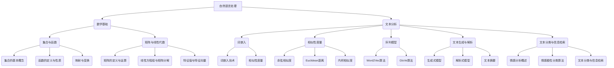

                 

# {文章标题}

> {关键词：(此处列出文章的5-7个核心关键词)}

> {摘要：(此处给出文章的核心内容和主题思想)}

## 《数学与文本分析：自然语言处理的数学算法》

> **关键词**：自然语言处理、数学算法、文本分析、词嵌入、序列模型、情感分析

> **摘要**：
自然语言处理（NLP）是人工智能领域的重要分支，旨在使计算机能够理解和处理人类语言。随着数学算法在NLP中的应用日益广泛，本文旨在探讨数学在文本分析中的关键作用，包括词嵌入技术、序列模型、文本生成与解析、文本分类与信息检索等方面的应用。本文通过逻辑清晰、结构紧凑、简单易懂的专业技术语言，逐步分析推理，详细讲解数学算法在自然语言处理中的核心原理和实践案例，为读者提供深入理解和掌握NLP数学算法的指导。

----------------------------------------------------------------

### 《数学与文本分析：自然语言处理的数学算法》目录大纲

----------------------------------------------------------------

# 第一部分：引言

## 第1章：自然语言处理与数学基础

### 1.1 自然语言处理概述

#### 1.1.1 自然语言处理的发展历程

自然语言处理（NLP）起源于20世纪50年代，当时的科学家们首次尝试让计算机理解和生成人类语言。早期的研究主要集中在机器翻译、语音识别和文本理解等领域。随着时间的推移，NLP技术不断进步，涵盖的领域也越来越广泛。如今，NLP已经成为人工智能领域的重要组成部分，广泛应用于智能客服、文本摘要、情感分析、问答系统等多个领域。

#### 1.1.2 自然语言处理的挑战与机遇

自然语言处理面临诸多挑战，如语言的多义性、上下文依赖性以及数据的不完整性等。然而，随着计算能力的提升和大数据的普及，NLP迎来了前所未有的机遇。数学算法在NLP中的应用，使得许多复杂的问题得以解决，推动了NLP技术的发展。

#### 1.1.3 数学在自然语言处理中的应用

数学在自然语言处理中扮演着至关重要的角色。集合与函数、矩阵与线性代数等数学基础概念被广泛应用于文本表示、特征提取、模型训练等环节。此外，概率论、统计学和图论等高级数学工具也在NLP中发挥了重要作用，使得模型更加准确和高效。

### 1.2 数学基础

#### 1.2.1 集合与函数

集合是数学的基本概念，用于表示一组元素。集合的基本操作包括并集、交集、差集和笛卡尔积等。函数则是定义在某个集合上的映射，将输入映射到输出。函数的定义域和值域是函数的基本属性，函数的图像则直观地展示了函数的映射关系。

##### 1.2.1.1 集合的基本概念

集合是由元素组成的无序集合，通常用大括号{}表示。集合中的元素称为成员，集合中不重复的元素个数称为集合的基数。

$$
A = \{1, 2, 3\}
$$

##### 1.2.1.2 函数的定义与性质

函数是定义在某个集合上的映射，将输入映射到输出。函数的定义域是输入的取值范围，值域是输出的取值范围。

$$
f: A \rightarrow B, \text{其中} f(x) = 2x
$$

##### 1.2.1.3 映射与变换

映射是一种特殊的函数，将一个集合中的每个元素映射到另一个集合中的唯一元素。变换是映射的一种推广，允许将多个元素映射到同一个元素。

$$
T: A \rightarrow B, \text{其中} T(\{1, 2\}) = 3
$$

#### 1.2.2 矩阵与线性代数

矩阵是数学中用于表示数据的一种方式，由一系列数字按照一定的规则排列组成。线性代数是研究向量空间和线性映射的数学分支，广泛应用于自然语言处理中的文本表示和特征提取。

##### 1.2.2.1 矩阵的定义与运算

矩阵是由行和列组成的二维数组，通常用大写字母表示。矩阵的行数称为行数，列数称为列数。

$$
A = \begin{bmatrix}
1 & 2 & 3 \\
4 & 5 & 6
\end{bmatrix}
$$

矩阵的运算包括加法、减法、乘法和转置等。

$$
A + B = \begin{bmatrix}
1 & 2 & 3 \\
4 & 5 & 6
\end{bmatrix} + \begin{bmatrix}
7 & 8 & 9 \\
10 & 11 & 12
\end{bmatrix} = \begin{bmatrix}
8 & 10 & 12 \\
14 & 16 & 18
\end{bmatrix}
$$

##### 1.2.2.2 线性方程组与矩阵分解

线性方程组是一组线性方程，通常可以用矩阵表示。矩阵分解是将矩阵分解为多个矩阵的乘积，有助于简化计算和提高效率。

$$
Ax = b \rightarrow A = \begin{bmatrix}
1 & 2 \\
3 & 4
\end{bmatrix}, x = \begin{bmatrix}
x_1 \\
x_2
\end{bmatrix}, b = \begin{bmatrix}
5 \\
6
\end{bmatrix}
$$

$$
A = PDQ, \text{其中} P \text{是行交换矩阵}, D \text{是对角矩阵}, Q \text{是列交换矩阵}
$$

##### 1.2.2.3 特征值与特征向量

特征值和特征向量是矩阵的重要属性，可以用于降维和特征提取。

$$
Ax = \lambda x \rightarrow \lambda \text{是特征值，} x \text{是特征向量}
$$

#### 1.3 文本分析基础

文本分析是自然语言处理的核心任务之一，旨在从文本数据中提取有用信息。文本分析涉及多个方面，包括文本表示、特征提取和分类等。

##### 1.3.1 文本表示方法

文本表示是将文本数据转换为计算机可以处理的数字形式。常见的文本表示方法包括基于词的表示、基于句子的表示和基于语义的表示。

1. 基于词的表示：将文本拆分成单词，并使用词频或词袋模型表示文本。
2. 基于句子的表示：将文本拆分成句子，并使用句子的特征表示文本。
3. 基于语义的表示：使用语义分析技术，将文本转换为语义向量表示。

##### 1.3.2 文本分类与聚类

文本分类是将文本分为预定义的类别，常见的分类算法包括支持向量机、决策树和神经网络等。文本聚类则是将文本数据按照相似性进行分组，常用的聚类算法包括K-means和层次聚类等。

##### 1.3.2.1 文本分类算法

1. 支持向量机（SVM）：通过最大化分类边界，将文本分为不同类别。
2. 决策树：通过递归划分特征空间，将文本分为不同类别。
3. 神经网络：通过多层感知器，将文本映射到不同类别。

##### 1.3.2.2 文本聚类算法

1. K-means：通过迭代计算聚类中心，将文本分为K个类别。
2. 层次聚类：通过递归合并相似类别，构建聚类层次结构。

##### 1.3.2.3 分类与聚类的性能评估

分类与聚类的性能评估是衡量算法效果的重要指标，常用的评估指标包括准确率、召回率、F1值和聚类系数等。

$\text{准确率} = \frac{\text{正确分类的文本数}}{\text{总文本数}}$

$\text{召回率} = \frac{\text{正确分类的文本数}}{\text{类别总数}}$

$\text{F1值} = \frac{2 \times \text{准确率} \times \text{召回率}}{\text{准确率} + \text{召回率}}$

$\text{聚类系数} = \frac{\text{聚类内部相似度之和}}{\text{聚类内部相似度之和} + \text{聚类之间相似度之和}}$

----------------------------------------------------------------

# 第二部分：数学算法在自然语言处理中的应用

## 第2章：词嵌入与相似性度量

### 2.1 词嵌入技术

词嵌入（Word Embedding）是将词汇映射为向量空间中的低维表示，从而使得计算机可以处理和比较词汇。词嵌入技术是自然语言处理领域的重要突破，使得许多传统方法难以解决的问题得以解决。

#### 2.1.1 词嵌入的概念

词嵌入是一种将词汇映射为实值向量的技术，使得词汇在向量空间中保持一定的相似性。词嵌入的向量表示不仅保留了词汇的语义信息，还可以用于文本分类、情感分析、机器翻译等任务。

#### 2.1.2 基于计数的方法

基于计数的方法通过统计词汇在文本中的共现关系来学习词嵌入。常见的方法包括：

1. **词袋模型（Bag-of-Words, BoW）**：将文本表示为一个向量，向量的每个元素表示某个词在文本中出现的次数。词袋模型忽略了词汇的顺序和语法结构，仅考虑词的频率。

2. **TF-IDF（Term Frequency-Inverse Document Frequency）**：在词袋模型的基础上，引入词频和逆文档频率的概念，以衡量词汇在文本中的重要性。词频表示词在文本中出现的次数，逆文档频率表示词在整个文档集合中出现的频率。

$$
tf(idf) = \frac{tf}{N} \times \log(\frac{N}{df})
$$

其中，$tf$ 表示词频，$idf$ 表示逆文档频率，$N$ 表示文档总数，$df$ 表示包含该词的文档数。

#### 2.1.3 基于预测的方法

基于预测的方法通过预测词汇的上下文来学习词嵌入。常见的方法包括：

1. **Word2Vec**：Word2Vec是一种基于神经网络的词嵌入方法，通过训练一个神经网络模型来预测中心词的上下文词。Word2Vec包含两种模型：CBOW（Continuous Bag-of-Words）和Skip-Gram。

   - **CBOW**：CBOW模型基于上下文窗口，通过预测中心词的上下文词来学习词嵌入。假设有一个上下文窗口大小为c的句子，其中包含n个词。CBOW模型的目标是学习一个神经网络，该神经网络以上下文词的向量作为输入，预测中心词的向量。

   - **Skip-Gram**：Skip-Gram模型基于中心词和预测词的对应关系，通过预测中心词的上下文词来学习词嵌入。与CBOW模型相反，Skip-Gram模型以单个词作为输入，预测该词的所有上下文词。

2. **GloVe**：GloVe（Global Vectors for Word Representation）是一种基于全局上下文的词嵌入方法。GloVe模型通过学习词汇的共现矩阵，将词汇映射到低维向量空间。GloVe模型的主要思想是，词汇的共现关系可以表示为词汇的向量的加权和。

   $$  
   \text{vec}(w_j) = \sum_{i=1}^{V} f(i) \cdot \text{vec}(w_i)  
   $$

   其中，$w_j$ 表示词汇$j$的向量表示，$f(i)$ 表示词汇$i$和词汇$j$的共现频率，$V$ 表示词汇表的大小。

#### 2.1.4 词向量的应用

词向量在自然语言处理中有着广泛的应用，包括：

1. **文本分类**：使用词向量作为文本的特征向量，可以用于文本分类任务。词向量的相似性可以用来衡量文本之间的相似度，从而实现分类任务。

2. **情感分析**：词向量可以用于情感分析任务，通过计算词向量之间的相似性，可以判断文本的情感极性。

3. **机器翻译**：词向量可以用于机器翻译任务，将源语言的词汇映射到低维向量空间，然后通过向量空间中的相似性来实现翻译。

### 2.2 相似性度量

相似性度量是自然语言处理中的重要概念，用于衡量词汇、文本或序列之间的相似度。相似性度量可以用于文本分类、聚类、推荐系统等任务。

#### 2.2.1 余弦相似度

余弦相似度是一种常用的相似性度量方法，用于计算两个向量之间的夹角余弦值。余弦相似度的计算公式如下：

$$
\text{cosine\_similarity}(x, y) = \frac{x \cdot y}{\lVert x \rVert \cdot \lVert y \rVert}
$$

其中，$x$ 和 $y$ 分别表示两个向量的内积和欧几里得范数。

#### 2.2.2 Euclidean距离

Euclidean距离是一种常用的距离度量方法，用于计算两个向量之间的欧几里得距离。Euclidean距离的计算公式如下：

$$
\text{Euclidean\_distance}(x, y) = \sqrt{(x - y)^2}
$$

#### 2.2.3 内积相似度

内积相似度是一种基于向量的相似性度量方法，用于计算两个向量之间的内积。内积相似度的计算公式如下：

$$
\text{inner\_product}(x, y) = x \cdot y
$$

### 2.3 Word2Vec算法

Word2Vec算法是一种基于神经网络的词嵌入方法，通过训练一个神经网络模型来学习词汇的向量表示。Word2Vec算法主要包括CBOW和Skip-Gram两种模型。

#### 2.3.1 CBOW模型

CBOW（Continuous Bag-of-Words）模型基于上下文窗口，通过预测中心词的上下文词来学习词嵌入。CBOW模型的目标是学习一个神经网络，该神经网络以上下文词的向量作为输入，预测中心词的向量。

CBOW模型的神经网络结构通常包括三层：输入层、隐藏层和输出层。输入层包含上下文词的向量，隐藏层用于映射上下文词的向量到中心词的向量，输出层用于预测中心词的向量。

#### 2.3.2 Skip-Gram模型

Skip-Gram（SG）模型是一种基于中心词的词嵌入方法，通过预测中心词的上下文词来学习词嵌入。与CBOW模型不同，Skip-Gram模型以单个词作为输入，预测该词的所有上下文词。

Skip-Gram模型的神经网络结构与CBOW模型类似，但输入层和输出层交换。输入层包含中心词的向量，隐藏层用于映射中心词的向量到上下文词的向量，输出层用于预测上下文词的向量。

#### 2.3.3 Negative Sampling

Negative Sampling是一种有效提高训练效率的技巧，通过在训练过程中引入负样本来减少梯度消失和梯度爆炸的问题。在每次训练时，除了选择一个正样本（中心词和其上下文词）外，还随机选择k个负样本（中心词和其他非上下文词）。

在训练过程中，模型需要最小化正样本的损失函数，同时最大化负样本的损失函数。通过引入负样本，模型可以更好地学习词汇的向量表示，从而提高模型的性能。

#### 2.3.4 Word2Vec算法的优缺点

Word2Vec算法的优点包括：

1. **高效率**：Word2Vec算法通过使用神经网络和负采样技术，提高了训练效率。
2. **语义相似性**：Word2Vec算法能够捕捉词汇之间的语义关系，使得词汇在向量空间中保持一定的相似性。
3. **可扩展性**：Word2Vec算法可以应用于大规模的文本数据集，适应不同的应用场景。

Word2Vec算法的缺点包括：

1. **语义偏差**：由于Word2Vec算法仅基于文本数据，可能导致词汇的向量表示存在语义偏差。
2. **可解释性**：Word2Vec算法的内部机制较为复杂，不易理解。
3. **计算资源**：训练Word2Vec算法需要大量的计算资源，特别是对于大规模的文本数据集。

### 2.4 GloVe算法

GloVe（Global Vectors for Word Representation）算法是一种基于全局上下文的词嵌入方法，通过学习词汇的共现矩阵来学习词嵌入。GloVe算法的主要思想是，词汇的共现关系可以表示为词汇的向量的加权和。

GloVe算法可以分为两个步骤：

1. **构建共现矩阵**：通过统计词汇在文本中的共现关系，构建一个共现矩阵。共现矩阵的行和列分别表示词汇，元素表示词汇之间的共现频率。

2. **优化词向量**：通过优化共现矩阵，学习词汇的向量表示。GloVe算法使用梯度下降算法来优化词向量，使得词汇的向量表示在共现矩阵中保持一定的相似性。

GloVe算法的主要优点包括：

1. **全局优化**：GloVe算法通过全局优化词汇的向量表示，能够更好地捕捉词汇之间的语义关系。
2. **高效计算**：GloVe算法的计算效率较高，适用于大规模的文本数据集。
3. **语义一致性**：GloVe算法能够保持词汇在向量空间中的语义一致性。

GloVe算法的主要缺点包括：

1. **计算资源**：GloVe算法需要计算共现矩阵，计算资源消耗较大。
2. **内存消耗**：GloVe算法的内存消耗较大，特别是在处理大规模文本数据集时。

----------------------------------------------------------------

## 第3章：序列模型与语言模型

序列模型（Sequence Model）是自然语言处理中用于处理序列数据（如文本、语音等）的一种重要模型。序列模型的核心任务是学习序列中的依赖关系，从而预测序列中的下一个元素。语言模型（Language Model）是序列模型的一种，主要用于预测自然语言中的下一个单词或字符。本章将介绍马尔可夫模型、隐马尔可夫模型和条件随机场（CRF）等序列模型，并详细讨论语言模型的概念、参数估计和评估方法。

### 3.1 马尔可夫模型

马尔可夫模型（Markov Model）是一种基于状态转移概率的随机模型，用于描述序列数据中的状态转移过程。马尔可夫模型的核心假设是马尔可夫假设，即一个序列的下一个状态仅与当前状态有关，而与过去的状态无关。

#### 3.1.1 马尔可夫假设

马尔可夫假设是马尔可夫模型的基础，可以表述为：一个系统在未来的行为仅取决于当前的状态，而与过去的状态无关。这个假设在许多实际应用中是合理的，例如，股票价格的变化、疾病的传播等。

#### 3.1.2 一阶马尔可夫模型

一阶马尔可夫模型是最简单的马尔可夫模型，它假设序列中的每个元素只依赖于前一个元素。一阶马尔可夫模型可以用一个转移概率矩阵来表示，其中每个元素表示从状态i到状态j的概率。

转移概率矩阵P的定义如下：

$$
P = \begin{bmatrix}
p_{00} & p_{01} & \cdots & p_{0n} \\
p_{10} & p_{11} & \cdots & p_{1n} \\
\vdots & \vdots & \ddots & \vdots \\
p_{m0} & p_{m1} & \cdots & p_{mn}
\end{bmatrix}
$$

其中，$p_{ij}$ 表示从状态i转移到状态j的概率。

#### 3.1.3 高阶马尔可夫模型

高阶马尔可夫模型考虑序列中的更高阶依赖关系，即一个序列的下一个元素不仅依赖于当前元素，还可能依赖于前几个元素。高阶马尔可夫模型的转移概率矩阵更为复杂，通常难以在实际应用中有效计算。

#### 3.1.4 马尔可夫模型的局限性

尽管马尔可夫模型在许多应用中表现出良好的性能，但它也存在一些局限性：

1. **忽略上下文信息**：马尔可夫模型仅依赖于当前状态，忽略了上下文信息，可能导致模型性能不佳。
2. **高阶依赖关系**：高阶马尔可夫模型难以计算，且在许多实际应用中效果不佳。
3. **长距离依赖**：马尔可夫模型难以捕捉序列中的长距离依赖关系。

### 3.2 隐马尔可夫模型

隐马尔可夫模型（Hidden Markov Model，HMM）是一种用于描述具有不可观测状态的马尔可夫过程的概率模型。隐马尔可夫模型的核心思想是，序列中的每个元素是由一个隐藏状态和该状态下的观测值组成的。

#### 3.2.1 隐马尔可夫模型的定义

隐马尔可夫模型由三个概率分布描述：

1. **初始状态概率分布**：描述序列开始时每个隐藏状态的概率。
2. **状态转移概率分布**：描述隐藏状态之间的转移概率。
3. **观测概率分布**：描述隐藏状态下的观测值概率。

隐马尔可夫模型可以用一个五元组$(A, B, \pi, O, o)$来表示，其中：

- $A = (a_{ij})$ 是状态转移概率矩阵，$a_{ij}$ 表示从状态i转移到状态j的概率。
- $B = (b_{jk})$ 是观测概率矩阵，$b_{jk}$ 表示在状态j下观测到值k的概率。
- $\pi$ 是初始状态概率分布，$\pi_i$ 表示初始时处于状态i的概率。
- $O$ 是观测序列。
- $o$ 是观测序列的初始值。

#### 3.2.2 状态转移概率

状态转移概率描述隐藏状态之间的转移关系，用矩阵$A$表示。状态转移概率矩阵$A$的元素$a_{ij}$表示从状态i转移到状态j的概率。状态转移概率矩阵满足以下性质：

1. **概率分布**：$A$ 是一个概率分布矩阵，即每行的和为1。
2. **非负性**：$A$ 的所有元素都大于等于0。

#### 3.2.3 观测概率

观测概率描述隐藏状态下观测值的概率，用矩阵$B$表示。观测概率矩阵$B$的元素$b_{jk}$表示在状态j下观测到值k的概率。观测概率矩阵满足以下性质：

1. **概率分布**：$B$ 是一个概率分布矩阵，即每列的和为1。
2. **非负性**：$B$ 的所有元素都大于等于0。

#### 3.2.4 隐马尔可夫模型的解码算法

隐马尔可夫模型的一个核心问题是解码，即给定一个观测序列，找到最可能的状态序列。常用的解码算法包括：

1. **前向-后向算法**：前向-后向算法是一种基于概率的解码算法，通过计算前向概率和后向概率来找到最优状态序列。

2. **Viterbi算法**：Viterbi算法是一种基于动态规划的解码算法，通过递归计算最优路径来找到最优状态序列。

### 3.3 条件随机场（CRF）

条件随机场（Conditional Random Field，CRF）是一种用于序列标注的统计模型，能够捕捉序列中相邻元素之间的依赖关系。CRF模型在自然语言处理中广泛应用于词性标注、命名实体识别和序列分类等任务。

#### 3.3.1 条件随机场的定义

条件随机场是一种概率图模型，用于描述给定观察序列时隐藏状态的分布。CRF由一个有向无环图表示，其中每个节点表示一个隐藏状态，每个边表示状态之间的条件依赖关系。

CRF可以用一个五元组$(\Theta, X, Y, \gamma, P)$来表示，其中：

- $\Theta$ 是模型参数集。
- $X$ 是观察序列，即一组输入值。
- $Y$ 是隐藏状态序列，即一组预测值。
- $\gamma$ 是转移概率矩阵，描述隐藏状态之间的依赖关系。
- $P$ 是发射概率矩阵，描述隐藏状态和观察值之间的依赖关系。

#### 3.3.2 初始状态与终止状态

CRF模型中的初始状态和终止状态是特殊的状态，分别表示序列的开始和结束。初始状态和终止状态的转移概率和发射概率可以用以下公式表示：

- 初始状态转移概率：$\gamma_{i0} = \frac{e^{\theta_i}}{\sum_{j=1}^{N} e^{\theta_j}}$
- 终止状态转移概率：$\gamma_{n+1j} = \frac{e^{\theta_j}}{\sum_{k=1}^{N} e^{\theta_k}}$
- 初始状态发射概率：$P(y_0|x_0) = \frac{e^{\theta_{i0y_0}}}{\sum_{i=1}^{N} e^{\theta_{iy_0}}}$
- 终止状态发射概率：$P(y_n|x_n) = \frac{e^{\theta_{nj_n}}}{\sum_{j=1}^{N} e^{\theta_{nj_n}}}$

#### 3.3.3 CRF在文本分类中的应用

CRF模型在文本分类中有着广泛的应用，能够有效捕捉文本中的依赖关系。在文本分类任务中，CRF模型可以表示为：

- 观察序列 $X$ 是文本的词序列。
- 隐藏状态序列 $Y$ 是文本的类别标签序列。
- 发射概率 $P(y|x)$ 是根据词序列预测类别标签的概率。
- 转移概率 $P(y_t|y_{t-1})$ 是根据前一个标签预测当前标签的概率。

#### 3.3.4 CRF模型的优点和挑战

CRF模型的优点包括：

1. **灵活**：CRF模型能够灵活地捕捉序列中的依赖关系，适用于多种自然语言处理任务。
2. **可解释**：CRF模型的参数易于解释，能够直观地理解状态之间的依赖关系。

CRF模型的挑战包括：

1. **计算复杂度**：CRF模型的计算复杂度较高，特别是在大规模文本数据集上。
2. **参数调优**：CRF模型的参数调优是一个复杂的过程，需要大量的实验和经验。

### 3.4 语言模型

语言模型（Language Model）是自然语言处理中的一个核心模型，用于预测自然语言中的下一个单词或字符。语言模型在文本生成、语音识别、机器翻译等领域有着广泛的应用。

#### 3.4.1 语言模型的概念

语言模型是一种概率模型，用于预测自然语言中的下一个元素。语言模型可以分为以下几种类型：

1. **基于统计的语言模型**：基于统计的语言模型通过统计文本中的出现频率来预测下一个元素。常见的统计语言模型包括N元语法（N-gram）模型和隐马尔可夫模型（HMM）。

2. **基于神经的网络语言模型**：基于神经的网络语言模型使用神经网络来预测下一个元素。常见的神经网络语言模型包括循环神经网络（RNN）和变压器（Transformer）。

#### 3.4.2 语言模型的参数估计

语言模型的参数估计是语言模型训练的关键步骤，用于学习语言模型中的参数。常见的参数估计方法包括：

1. **最大似然估计（MLE）**：最大似然估计是最常见的参数估计方法，通过最大化语言模型在训练数据上的似然函数来学习参数。

2. **最小化交叉熵损失**：最小化交叉熵损失是一种基于优化方法的参数估计方法，通过最小化语言模型在训练数据上的交叉熵损失来学习参数。

3. **正则化**：正则化是一种防止模型过拟合的方法，通过在损失函数中添加正则项来约束模型的复杂度。

#### 3.4.3 语言模型的评估

语言模型的评估是衡量模型性能的重要步骤，常用的评估指标包括：

1. **交叉验证**：交叉验证是一种常用的评估方法，通过将训练数据划分为多个子集来评估模型的性能。

2. **准确率（Accuracy）**：准确率是衡量模型分类性能的指标，表示正确分类的样本占总样本的比例。

3. **召回率（Recall）**：召回率是衡量模型分类性能的指标，表示正确分类的样本数占总真实样本数的比例。

4. **F1值（F1-score）**：F1值是准确率和召回率的调和平均值，用于综合衡量模型分类性能。

#### 3.4.4 语言模型的应用

语言模型在自然语言处理领域有着广泛的应用，包括：

1. **文本生成**：语言模型可以用于生成文本，如生成文章、生成对话等。

2. **语音识别**：语言模型可以用于语音识别，通过预测下一个音素或单词来提高识别准确率。

3. **机器翻译**：语言模型可以用于机器翻译，通过预测源语言中的下一个单词或字符来提高翻译质量。

4. **文本摘要**：语言模型可以用于文本摘要，通过生成摘要来概括文本的主要内容。

5. **问答系统**：语言模型可以用于问答系统，通过预测下一个问题或回答来提高问答系统的性能。

----------------------------------------------------------------

## 第4章：文本生成与解析

文本生成与解析是自然语言处理中的两个重要任务，文本生成旨在自动生成自然语言文本，而文本解析则涉及对文本内容的结构化理解和分析。本章将深入探讨生成式模型和解析式模型的基本原理，以及它们在文本摘要中的应用。

### 4.1 生成式模型

生成式模型是一种能够生成文本的模型，通过学习文本的概率分布来生成新的文本。生成式模型的主要思想是，给定输入文本的概率分布，模型可以生成新的文本样本。

#### 4.1.1 生成式模型的基本原理

生成式模型通常由两个概率分布组成：一个是输入文本的概率分布，另一个是生成文本的概率分布。模型的目标是学习这两个概率分布，以便能够生成新的文本。

生成式模型的基本原理可以概括为以下步骤：

1. **学习输入文本的概率分布**：模型通过训练数据学习输入文本的概率分布。这通常涉及到对文本的统计分析和建模，如N元语法模型。

2. **生成新的文本**：利用学习到的输入文本的概率分布，模型可以生成新的文本。这通常通过采样过程实现，即从输入文本的概率分布中随机采样生成新的文本。

3. **优化生成文本的质量**：生成式模型通常通过优化生成文本的质量来提高模型的性能。这可以通过最小化生成文本的损失函数来实现，如使用交叉熵损失函数。

#### 4.1.2 语言模型的构建

语言模型是生成式模型的核心部分，用于预测文本中的下一个单词或字符。语言模型的构建通常涉及到以下几个步骤：

1. **数据准备**：准备大量的文本数据作为训练数据。这些数据可以来自各种来源，如新闻文章、小说、社交媒体等。

2. **文本表示**：将文本转换为计算机可以处理的形式。常见的文本表示方法包括词袋模型、词嵌入和字符嵌入。

3. **训练语言模型**：使用训练数据训练语言模型。这通常涉及到计算输入文本的概率分布，并优化模型参数以最小化损失函数。

4. **评估语言模型**：使用评估数据评估语言模型的性能。常用的评估指标包括交叉验证、准确率和困惑度等。

#### 4.1.3 序列生成的算法

生成式模型中的序列生成算法用于生成新的文本序列。常见的序列生成算法包括：

1. **随机采样**：随机采样是最简单的序列生成算法，通过从输入文本的概率分布中随机采样生成新的文本。

2. **贪心搜索**：贪心搜索是一种基于贪婪策略的序列生成算法，通过选择当前状态下的最优动作来生成新的文本。

3. **基于梯度的优化**：基于梯度的优化是一种基于梯度下降的序列生成算法，通过优化生成文本的质量来生成新的文本。

#### 4.1.4 生成式模型的应用

生成式模型在自然语言处理中有许多应用，包括：

1. **文本生成**：生成式模型可以用于生成新的文本，如自动写作、对话生成和机器翻译。

2. **文本摘要**：生成式模型可以用于提取文本的主要内容和生成摘要。

3. **对话系统**：生成式模型可以用于生成对话系统的回复，提供用户友好的交互体验。

### 4.2 解析式模型

解析式模型是一种用于分析文本结构和内容的模型，旨在理解文本的内在逻辑和语义。与生成式模型不同，解析式模型不直接生成文本，而是通过对文本的结构化理解和分析来提取有用的信息。

#### 4.2.1 解析式模型的基本原理

解析式模型的基本原理可以概括为以下步骤：

1. **文本表示**：将文本转换为计算机可以处理的形式。常见的文本表示方法包括词袋模型、词嵌入和字符嵌入。

2. **解析文本结构**：对文本进行结构化分析，提取文本的语法和语义信息。这通常涉及到对文本的分词、词性标注、句法分析和语义分析。

3. **提取文本内容**：从结构化分析的结果中提取有用的信息，如实体、关系、事件等。

4. **优化模型性能**：通过优化模型参数来提高解析式模型的性能，这通常涉及到对模型进行训练和评估。

#### 4.2.2 解析树的构建

解析式模型中的一个关键任务是构建解析树，用于表示文本的结构和内容。解析树是一种树形结构，其中每个节点表示一个文本元素，如单词、短语或句子。

解析树的构建通常涉及到以下几个步骤：

1. **分词**：将文本分解为单词或短语。

2. **词性标注**：对每个单词或短语进行词性标注，如名词、动词、形容词等。

3. **句法分析**：根据词性标注和语法规则，构建句子的语法结构。

4. **语义分析**：对句子的语法结构进行语义分析，提取文本的语义信息。

#### 4.2.3 树编辑与匹配算法

树编辑和匹配算法是解析式模型中的重要技术，用于比较两个文本的相似性。树编辑算法通过编辑操作（如插入、删除、替换）将一个文本转换为另一个文本，而树匹配算法则通过比较两个文本的解析树来评估它们的相似性。

常见的树编辑与匹配算法包括：

1. **最小编辑距离**：最小编辑距离算法通过计算将一个文本转换为另一个文本所需的最小编辑操作次数来评估它们的相似性。

2. **树编辑匹配**：树编辑匹配算法通过构建两个文本的解析树，并比较树的编辑距离来评估它们的相似性。

3. **基于路径的匹配**：基于路径的匹配算法通过比较两个文本的子树结构来评估它们的相似性。

#### 4.2.4 解析式模型的应用

解析式模型在自然语言处理中有许多应用，包括：

1. **文本摘要**：解析式模型可以用于提取文本的主要内容和生成摘要。

2. **文本分类**：解析式模型可以用于分析文本的内容和结构，并将其用于分类任务。

3. **命名实体识别**：解析式模型可以用于识别文本中的命名实体，如人名、地名、组织名等。

4. **语义分析**：解析式模型可以用于分析文本的语义信息，如事件、关系、情感等。

### 4.3 文本摘要

文本摘要是文本生成与解析中的一个重要任务，旨在提取文本的主要内容和精华，以供快速阅读或信息检索。文本摘要可以分为提取式摘要和生成式摘要两种类型。

#### 4.3.1 提取式摘要

提取式摘要是从原始文本中提取关键句子或短语来生成摘要，而不涉及文本生成过程。提取式摘要的方法包括：

1. **关键短语提取**：从文本中提取关键短语来生成摘要。关键短语通常包括名词、动词、形容词等。

2. **句子提取**：从文本中提取关键句子来生成摘要。关键句子通常包含文本的核心信息和主要观点。

3. **基于关键词的提取**：从文本中提取关键词来生成摘要。关键词通常反映了文本的主题和主要观点。

#### 4.3.2 生成式摘要

生成式摘要是通过生成新的文本来生成摘要，而不是从原始文本中提取关键句子或短语。生成式摘要的方法包括：

1. **基于语言模型的摘要**：使用语言模型生成新的文本作为摘要。这种方法通常涉及训练一个语言模型，使其能够生成与原始文本相似的文本。

2. **基于神经网络的摘要**：使用神经网络模型生成新的文本作为摘要。这种方法通常涉及训练一个神经网络模型，使其能够生成文本的摘要。

3. **基于模板的摘要**：使用模板生成新的文本作为摘要。这种方法通常涉及定义一组模板，然后根据原始文本的结构和内容生成摘要。

#### 4.3.3 文本摘要的评价方法

文本摘要的评价方法用于衡量摘要的质量和准确性。常见的评价方法包括：

1. **基于人类评价的评价方法**：通过人类评估者对摘要的质量和准确性进行评价。这种方法通常涉及对摘要进行主观评分。

2. **基于自动评价指标的评价方法**：使用自动评价指标来评估摘要的质量和准确性。常见的自动评价指标包括ROUGE（Recall-Oriented Understudy for Gisting Evaluation）和Bleu（Bilingual Evaluation Understudy）。

3. **基于模型评价指标的评价方法**：使用模型评价指标来评估摘要的质量和准确性。这种方法通常涉及训练一个评价模型，使其能够对摘要进行客观评价。

### 4.4 文本生成与解析的实际应用案例

文本生成与解析在实际应用中有着广泛的应用，以下是一些实际应用案例：

1. **智能客服系统**：智能客服系统使用文本生成与解析技术来生成和解析用户的问题和回答，提供快速、准确的客服支持。

2. **自动写作系统**：自动写作系统使用文本生成与解析技术来生成文章、报告和书籍等文本内容。

3. **信息检索系统**：信息检索系统使用文本生成与解析技术来生成摘要和摘要索引，帮助用户快速找到所需的信息。

4. **社交媒体分析**：社交媒体分析系统使用文本生成与解析技术来生成和解析用户发布的内容，分析用户的行为和兴趣。

5. **智能问答系统**：智能问答系统使用文本生成与解析技术来生成和解析用户的问题和回答，提供准确的答案和建议。

通过文本生成与解析技术的应用，可以极大地提高信息处理和知识提取的效率，为各种自然语言处理应用提供强大的支持。

----------------------------------------------------------------

## 第5章：文本情感分析与情感极性分类

文本情感分析（Sentiment Analysis）是自然语言处理中的一个重要任务，旨在自动识别文本中的情感极性，如正面、负面或中性。情感分析广泛应用于市场调研、舆情监控、客户反馈分析等领域。本章将探讨情感分析的基本概念、情感极性分类算法以及情感分析中的挑战与解决方案。

### 5.1 情感分析概述

#### 5.1.1 情感分析的定义

情感分析是指使用自然语言处理技术分析文本中的情感倾向和情感极性。情感分析的目标是确定文本是表达正面、负面还是中性情感。

#### 5.1.2 情感极性分类

情感极性分类是情感分析的一种形式，它将文本分类为正面、负面或中性。情感极性分类通常涉及到以下几种情感标签：

- **正面**：文本表达积极的情感。
- **负面**：文本表达消极的情感。
- **中性**：文本没有明显的情感倾向。

#### 5.1.3 情感分析的应用场景

情感分析在多个领域有广泛的应用，包括：

- **市场调研**：分析消费者对产品或服务的反馈，了解市场需求。
- **舆情监控**：监测社交媒体上的公众情绪，及时发现和应对负面舆论。
- **客户服务**：分析客户反馈，提高客户满意度和服务质量。
- **社交媒体分析**：分析用户生成内容，识别热点话题和趋势。

### 5.2 情感极性分类算法

情感极性分类算法是情感分析的核心，常见的算法包括基于规则的方法、基于统计的方法和基于机器学习的方法。

#### 5.2.1 基于规则的方法

基于规则的方法使用手工编写的规则来识别情感极性。这些规则通常基于情感词典或情感短语库，通过匹配文本中的词汇或短语来推断情感极性。

优点：

- 简单易懂，易于实现。
- 对简单的情感分类问题效果较好。

缺点：

- 难以处理复杂的情感表达。
- 需要大量手工编写的规则。

#### 5.2.2 基于统计的方法

基于统计的方法使用统计模型来分析文本中的情感极性。常见的统计模型包括：

- **贝叶斯分类器**：基于贝叶斯定理，通过计算文本中各个特征的概率来预测情感极性。
- **逻辑回归**：使用逻辑回归模型，将文本特征映射到情感极性的概率。

优点：

- 可以处理大规模数据集。
- 对文本特征进行自动提取和建模。

缺点：

- 对噪声敏感，易受文本噪声影响。
- 需要大量训练数据。

#### 5.2.3 基于机器学习的方法

基于机器学习的方法使用机器学习算法来训练模型，从而自动识别情感极性。常见的机器学习算法包括：

- **支持向量机（SVM）**：通过最大化分类边界来分类文本。
- **决策树**：通过递归划分特征空间来分类文本。
- **随机森林**：通过构建多个决策树并投票来分类文本。
- **神经网络**：使用神经网络模型，如卷积神经网络（CNN）和循环神经网络（RNN），来识别情感极性。

优点：

- 可以自动提取文本特征。
- 对复杂的情感表达具有较强的处理能力。

缺点：

- 需要大量训练数据。
- 训练过程较慢。

### 5.3 基于机器学习的情感极性分类

#### 5.3.1 特征提取方法

特征提取是情感极性分类的重要步骤，用于将文本转换为计算机可以处理的特征向量。常见的特征提取方法包括：

- **词袋模型**：将文本表示为词袋，即一个向量，其中每个元素表示一个词的频率。
- **词嵌入**：将词汇映射为向量空间中的低维表示，如Word2Vec或GloVe。
- **TF-IDF**：结合词频和逆文档频率，将文本表示为特征向量。
- **LSTM或GRU**：使用循环神经网络，将文本序列映射为特征向量。

#### 5.3.2 分类器选择与优化

分类器的选择和优化是情感极性分类的关键，常见的分类器包括：

- **SVM**：通过最大化分类边界进行分类。
- **逻辑回归**：通过计算文本特征的概率分布进行分类。
- **决策树**：通过递归划分特征空间进行分类。
- **随机森林**：通过构建多个决策树并投票进行分类。
- **神经网络**：使用卷积神经网络（CNN）或循环神经网络（RNN）进行分类。

优化方法包括：

- **交叉验证**：通过将数据划分为训练集和验证集来评估模型的性能。
- **网格搜索**：通过搜索不同的参数组合来优化模型。
- **正则化**：通过在损失函数中添加正则项来防止过拟合。

#### 5.3.3 实际应用案例

以下是一个基于机器学习的情感极性分类的实际应用案例：

**项目背景**：某电商平台的客户反馈数据分析，旨在分析客户对产品的评价，识别正面、负面或中性情感。

**数据集**：收集了数万条客户评价，每条评价包含产品名称和评价文本。

**特征提取**：使用TF-IDF方法将文本转换为特征向量。

**模型训练**：使用SVM分类器进行训练，训练集和验证集的比例为8:2。

**模型评估**：使用准确率、召回率和F1值等指标评估模型的性能。

**结果**：模型对客户评价的情感分类准确率达到85%以上。

### 5.4 情感分析中的挑战与解决方案

#### 5.4.1 多标签情感分析

多标签情感分析是指一个文本可以同时表达多个情感。例如，一条评论可能同时包含正面和负面情感。多标签情感分析比单标签情感分析更为复杂。

**解决方案**：

- **基于聚类的方法**：通过将文本聚类为不同的情感标签，从而实现多标签情感分析。
- **基于机器学习的方法**：使用多标签分类器，如多元逻辑回归或支持向量机，同时预测多个情感标签。

#### 5.4.2 跨领域情感分析

跨领域情感分析是指将情感分析应用于不同的领域，如医疗、金融、科技等。不同领域的文本具有不同的特点和情感表达方式。

**解决方案**：

- **领域自适应**：通过领域自适应技术，将通用情感分析模型适应特定领域。
- **领域特定词典**：构建领域特定的情感词典，用于识别特定领域的情感表达。

#### 5.4.3 情感强度的分析

情感强度的分析是指识别文本中情感表达的强度，如非常正面、稍微正面等。情感强度的分析对于理解用户情感和情绪具有重要意义。

**解决方案**：

- **基于语义角色标注**：通过语义角色标注技术，识别文本中的情感强度。
- **基于深度学习的方法**：使用深度学习模型，如序列标注模型，来预测情感强度。

### 5.5 总结

情感分析是自然语言处理领域的一个重要任务，涉及文本情感极性的分类和情感强度的分析。基于规则的方法、基于统计的方法和基于机器学习的方法各有优缺点，适用于不同的应用场景。随着自然语言处理技术的不断发展，情感分析的应用将越来越广泛，为各类文本数据分析和应用提供强大的支持。

----------------------------------------------------------------

## 第6章：文本分类与信息检索

文本分类与信息检索是自然语言处理（NLP）中的重要任务，广泛应用于文本挖掘、搜索引擎、社交媒体分析等领域。本章将深入探讨文本分类和信息检索的基本概念、算法以及性能评估方法。

### 6.1 文本分类

文本分类是指将文本数据分配到预定义的类别中，如新闻分类、邮件过滤、情感分析等。文本分类的核心在于将文本转换为可计算的特征向量，并使用分类算法进行分类。

#### 6.1.1 文本分类的基本概念

1. **分类算法**：文本分类算法分为监督学习和无监督学习两种。监督学习算法需要标注的数据集进行训练，常见的算法包括支持向量机（SVM）、朴素贝叶斯（Naive Bayes）、决策树、随机森林、逻辑回归和神经网络等。

2. **特征提取**：特征提取是将文本转换为数值特征向量的过程。常见的特征提取方法包括词袋模型（Bag-of-Words, BoW）、TF-IDF（Term Frequency-Inverse Document Frequency）、词嵌入（Word Embedding）等。

3. **特征选择**：特征选择是选择对分类任务最有用的特征，以减少计算复杂度和提高分类性能。常见的特征选择方法包括信息增益（Information Gain）、卡方测试（Chi-square Test）和互信息（Mutual Information）等。

#### 6.1.2 基于机器学习的文本分类

基于机器学习的文本分类方法通过学习大量的标注数据来构建分类模型。以下是一些常见的机器学习算法：

1. **支持向量机（SVM）**：SVM是一种强大的分类算法，通过找到一个最优的超平面将数据分类。SVM在文本分类中表现良好，特别是在高维空间中。

2. **朴素贝叶斯（Naive Bayes）**：朴素贝叶斯是一种基于贝叶斯定理的简单概率分类器，它在文本分类中广泛使用，因为文本数据通常满足条件独立性假设。

3. **决策树**：决策树通过递归地将特征空间划分成多个子集，并在每个子集上应用条件概率进行分类。决策树易于理解，但可能产生过拟合。

4. **随机森林（Random Forest）**：随机森林是一种集成学习方法，通过构建多个决策树并对它们的预测进行投票。随机森林具有强大的分类能力，并且能够处理大量特征。

5. **逻辑回归**：逻辑回归是一种线性分类器，通过预测文本的概率分布来进行分类。逻辑回归在文本分类中常用于二元分类任务。

6. **神经网络**：神经网络，特别是深度学习模型（如卷积神经网络（CNN）和循环神经网络（RNN）），在文本分类中表现出色。深度学习模型可以自动提取复杂的文本特征，并且能够处理大规模数据集。

### 6.2 信息检索

信息检索是指从大量文本数据中检索出用户感兴趣的信息。信息检索系统通常包括查询处理、检索算法和检索评价三个主要部分。

#### 6.2.1 信息检索的基本概念

1. **查询处理**：查询处理是将用户的查询转换为系统可以理解的格式。这包括查询的分词、停用词过滤、词干提取等步骤。

2. **检索算法**：检索算法用于计算文档与查询之间的相似度，并返回最相关的文档。常见的检索算法包括：

   - **布尔检索**：基于布尔逻辑运算（AND、OR、NOT）来检索文档。
   - **向量空间模型**：将文档和查询表示为向量空间中的点，并计算它们之间的余弦相似度。
   - **隐马尔可夫模型（HMM）**：用于处理文档和查询之间的序列依赖关系。
   - **条件随机场（CRF）**：用于处理文档中的标签序列，如命名实体识别。

3. **检索评价**：检索评价是衡量检索算法性能的重要步骤。常用的评价指标包括准确率（Precision）、召回率（Recall）和F1值（F1 Score）。

#### 6.2.2 基于文本相似性的信息检索

基于文本相似性的信息检索方法通过计算文档和查询之间的相似度来检索信息。以下是一些常见的方法：

1. **基于关键词匹配的方法**：这种方法通过匹配文档中的关键词和查询中的关键词来计算相似度。常见的相似度计算方法包括布尔检索和TF-IDF。

2. **基于向量空间模型的方法**：向量空间模型将文档和查询表示为向量空间中的点，并计算它们之间的余弦相似度。这种方法可以处理高维数据，并考虑词频和逆文档频率。

3. **基于图模型的方法**：图模型将文档和查询表示为图中的节点和边，并通过计算节点之间的路径长度来计算相似度。图模型可以捕捉文档和查询之间的复杂关系。

### 6.3 文本分类与信息检索的交叉应用

文本分类和信息检索在许多实际应用中相互结合，以提供更准确和有效的信息检索服务。以下是一些交叉应用的例子：

1. **智能搜索引擎**：智能搜索引擎使用文本分类算法来过滤和排序搜索结果，以提高用户体验。

2. **问答系统**：问答系统结合文本分类和信息检索，通过分析用户查询并检索相关的文档来生成回答。

3. **推荐系统**：推荐系统使用文本分类来识别用户兴趣，并使用信息检索来推荐相关的文档。

### 6.4 文本分类与信息检索的性能评估

文本分类与信息检索的性能评估是衡量算法和系统效果的重要步骤。以下是一些常见的性能评估方法：

1. **准确率（Accuracy）**：准确率是正确分类的文档数与总文档数之比。

2. **召回率（Recall）**：召回率是正确分类的文档数与实际相关的文档数之比。

3. **F1值（F1 Score）**：F1值是准确率和召回率的调和平均值，用于综合衡量分类或检索的性能。

4. **困惑度（Perplexity）**：困惑度是语言模型在测试数据上的性能指标，用于评估语言模型的预测能力。

5. **ROC曲线（Receiver Operating Characteristic Curve）**：ROC曲线用于评估分类器的性能，通过计算真阳性率（True Positive Rate）和假阳性率（False Positive Rate）来评估分类器的鲁棒性。

通过上述性能评估方法，可以全面评估文本分类和信息检索算法和系统的性能，为改进和优化提供依据。

### 6.5 总结

文本分类和信息检索是自然语言处理中关键的任务，广泛应用于文本挖掘、搜索引擎和推荐系统等领域。通过基于机器学习的分类算法和基于相似性的信息检索方法，可以实现对大量文本数据的自动化处理和检索。本章介绍了文本分类与信息检索的基本概念、算法和性能评估方法，为读者提供了深入理解和实践这些技术的指导。

----------------------------------------------------------------

## 第7章：数学算法在自然语言处理中的最新进展

随着自然语言处理（NLP）技术的不断发展，数学算法在NLP中的应用也日益深入。本章将介绍近年来在NLP领域中涌现的几项重要数学算法，包括Transformer模型、BERT模型、GPT系列模型和多模态自然语言处理，探讨这些算法的基本原理、实现细节和应用案例。

### 7.1 Transformer模型

Transformer模型是一种基于自注意力机制的深度神经网络模型，由Vaswani等人于2017年提出。Transformer模型在机器翻译、文本生成、问答系统等领域取得了显著的效果，成为NLP领域的里程碑。

#### 7.1.1 Transformer模型的基本原理

Transformer模型的核心思想是自注意力机制（Self-Attention），它能够自动捕捉序列中的依赖关系，从而提高模型的表示能力。Transformer模型主要包括以下几部分：

1. **编码器（Encoder）**：编码器由多个编码层组成，每个编码层包括多头自注意力机制和前馈神经网络。多头自注意力机制通过并行地计算不同注意力权重，提高了模型的表示能力。

2. **解码器（Decoder）**：解码器与编码器类似，也包括多个解码层。解码器的输入是编码器的输出，并通过解码层的自注意力机制和交叉注意力机制生成输出。

3. **自注意力机制（Self-Attention）**：自注意力机制通过计算输入序列的每个元素之间的相似性，为每个元素生成一组注意力权重。注意力权重用于加权输入序列，从而提高模型的表示能力。

4. **交叉注意力机制（Cross-Attention）**：交叉注意力机制在解码器中使用，它通过计算编码器的输出和当前解码器输出之间的相似性，为解码器的每个元素生成注意力权重。

#### 7.1.2 自注意力机制

自注意力机制是Transformer模型的核心，其计算过程如下：

1. **计算查询（Query）、键（Key）和值（Value）**：对于每个输入序列的元素，计算查询（Query）、键（Key）和值（Value）向量。通常，这些向量是输入序列的线性变换。

2. **计算注意力权重**：对于每个输入序列的元素，计算其与所有其他元素的相似性。相似性通过计算查询和键之间的点积得到，并使用 softmax 函数转换为概率分布。

3. **加权求和**：根据注意力权重，将输入序列中的每个元素加权求和，得到新的表示。

#### 7.1.3 Transformer模型的优化策略

为了提高Transformer模型的训练效率，研究者们提出了一系列优化策略：

1. **位置编码（Positional Encoding）**：由于Transformer模型没有循环神经网络中的位置信息，位置编码用于引入序列的位置信息。

2. **多头自注意力（Multi-Head Self-Attention）**：多头自注意力机制通过并行地计算多个注意力权重，提高了模型的表示能力。

3. **层归一化（Layer Normalization）**：层归一化用于稳定模型的训练过程，并提高模型的收敛速度。

4. **残差连接（Residual Connection）**：残差连接通过跳过部分层，直接连接输入和输出，从而缓解了深层网络的梯度消失问题。

#### 7.1.4 Transformer模型的应用

Transformer模型在NLP领域取得了许多突破性的成果，包括：

1. **机器翻译**：Transformer模型在机器翻译任务中表现优异，例如Google翻译采用了基于Transformer的模型。

2. **文本生成**：Transformer模型在文本生成任务中也表现出色，例如生成文章、对话和摘要等。

3. **问答系统**：Transformer模型在问答系统中用于理解用户查询和文档之间的匹配，从而生成准确的回答。

### 7.2 BERT模型

BERT（Bidirectional Encoder Representations from Transformers）模型是由Google在2018年提出的一种基于Transformer的双向编码表示模型。BERT模型在自然语言理解任务中取得了显著的性能提升。

#### 7.2.1 BERT模型的结构

BERT模型主要由两个部分组成：编码器和解码器。编码器和解码器都是基于Transformer的模型，但解码器多了一个预测层。

1. **编码器**：编码器用于处理输入文本，并将文本映射为向量表示。编码器的输入是词嵌入、位置编码和段编码，输出是每个单词的隐藏状态。

2. **解码器**：解码器用于生成输出文本，并将输出映射为概率分布。解码器的输入是编码器的输出和已生成的文本，输出是每个单词的预测概率。

#### 7.2.2 BERT模型的预训练与微调

BERT模型的训练分为两个阶段：预训练和微调。

1. **预训练**：预训练阶段使用大量未标记的文本数据，对BERT模型进行训练，使其学习文本的表示和语言规则。预训练过程中，BERT模型通过 masked 语言模型（Masked Language Model，MLM）和次生任务（如下一句预测）进行训练。

2. **微调**：微调阶段将BERT模型应用于特定的任务，并在有标签的数据集上进行训练。微调过程中，BERT模型会调整其参数，以适应特定的任务。

#### 7.2.3 BERT模型的应用

BERT模型在自然语言理解任务中表现出色，包括：

1. **文本分类**：BERT模型在文本分类任务中具有强大的表现，可以应用于情感分析、命名实体识别、问题回答等任务。

2. **问答系统**：BERT模型在问答系统中用于理解用户查询和文档之间的匹配，从而生成准确的回答。

3. **生成式文本生成**：BERT模型可以用于生成式文本生成任务，例如文章生成和对话生成。

### 7.3 GPT系列模型

GPT（Generative Pre-trained Transformer）系列模型是OpenAI提出的一系列基于Transformer的生成式语言模型，包括GPT、GPT-2和GPT-3。GPT系列模型在文本生成、机器翻译、问答系统等领域取得了显著的成果。

#### 7.3.1 GPT模型的基本原理

GPT模型是一种生成式语言模型，通过预测文本中的下一个单词来生成文本。GPT模型的基本原理如下：

1. **自回归语言模型**：GPT模型是一种自回归语言模型，即给定前一个单词，模型可以预测下一个单词。

2. **Transformer架构**：GPT模型基于Transformer架构，使用自注意力机制来捕捉文本中的依赖关系。

3. **位置编码**：GPT模型通过位置编码引入文本的位置信息。

#### 7.3.2 GPT模型的训练与生成

GPT模型的训练分为两个阶段：预训练和生成。

1. **预训练**：预训练阶段使用大量未标记的文本数据，对GPT模型进行训练，使其学习文本的表示和语言规则。预训练过程中，GPT模型通过 masked 语言模型（MLM）进行训练。

2. **生成**：生成阶段将GPT模型应用于生成文本。生成过程中，GPT模型逐个预测下一个单词，并根据预测结果生成文本。

#### 7.3.3 GPT模型的应用

GPT模型在文本生成、机器翻译和问答系统等领域具有广泛的应用，包括：

1. **文本生成**：GPT模型可以用于生成各种类型的文本，如文章、对话和摘要等。

2. **机器翻译**：GPT模型在机器翻译任务中具有强大的表现，可以翻译多种语言的文本。

3. **问答系统**：GPT模型可以用于问答系统，通过理解用户查询和文档之间的匹配，生成准确的回答。

### 7.4 多模态自然语言处理

多模态自然语言处理是指将文本与其他模态（如图像、语音、视频等）进行结合，以增强模型的表示能力和理解能力。近年来，多模态自然语言处理取得了显著的研究进展。

#### 7.4.1 多模态数据融合

多模态数据融合是将不同模态的数据进行结合，以生成统一的表示。常见的多模态数据融合方法包括：

1. **特征级融合**：将不同模态的特征进行拼接，生成多模态特征向量。

2. **决策级融合**：将不同模态的分类结果进行融合，生成最终的分类结果。

3. **深度学习方法**：使用深度学习方法，如多模态卷积神经网络（MM-CNN）和多模态循环神经网络（MM-RNN），来融合多模态数据。

#### 7.4.2 多模态数据的应用场景

多模态自然语言处理在多个领域具有广泛的应用，包括：

1. **图像文本分类**：将图像和文本进行结合，以分类图像中的文本内容。

2. **语音识别**：将语音和文本进行结合，以提高语音识别的准确率和鲁棒性。

3. **视频文本生成**：将视频和文本进行结合，以生成视频中的文本描述。

4. **多模态问答系统**：将文本、图像和语音进行结合，以生成多模态的问答系统。

### 7.5 总结

数学算法在自然语言处理中的最新进展，特别是Transformer模型、BERT模型、GPT系列模型和多模态自然语言处理，为NLP领域带来了新的机遇和挑战。这些算法在文本生成、机器翻译、问答系统和多模态数据处理等领域取得了显著的成果，推动了NLP技术的不断发展和创新。随着算法的不断完善和应用场景的扩展，数学算法将在NLP领域中发挥更加重要的作用。

----------------------------------------------------------------

## 附录A：数学算法与自然语言处理工具与资源

在自然语言处理（NLP）领域，数学算法的应用至关重要。为了帮助开发者更好地理解和使用这些算法，本章将介绍一些主流的深度学习框架、NLP工具和资源。

### A.1 主流深度学习框架

深度学习框架是构建和训练深度神经网络的核心工具，支持多种数学算法的实现和应用。

1. **TensorFlow**：
   - **概述**：TensorFlow是由Google开发的开源深度学习框架，支持多种类型的神经网络和算法。
   - **特点**：强大的计算图功能、丰富的API接口、广泛的社区支持。
   - **使用场景**：文本分类、序列建模、机器翻译等。

2. **PyTorch**：
   - **概述**：PyTorch是由Facebook开发的开源深度学习框架，以其动态计算图和简洁的API著称。
   - **特点**：动态计算图、灵活的API、强大的GPU支持。
   - **使用场景**：图像识别、文本生成、强化学习等。

3. **Theano**：
   - **概述**：Theano是一个Python库，用于定义、优化和评估数学表达式。
   - **特点**：支持自动微分、GPU加速、丰富的数学功能。
   - **使用场景**：复杂的数学模型、优化算法等。

### A.2 自然语言处理工具

NLP工具是用于文本处理、分析和建模的重要软件，支持各种数学算法的实现和应用。

1. **NLTK**：
   - **概述**：NLTK（Natural Language Toolkit）是一个广泛使用的Python库，用于自然语言处理。
   - **特点**：提供了大量的文本处理函数和模型，支持词性标注、分词、词频统计等。
   - **使用场景**：文本预处理、文本分类、词向量生成等。

2. **SpaCy**：
   - **概述**：SpaCy是一个高效的NLP库，适用于快速文本处理和实体识别。
   - **特点**：支持多种语言的词性标注、命名实体识别、依存句法分析。
   - **使用场景**：文本分类、信息提取、关系抽取等。

3. **Stanza**：
   - **概述**：Stanza是一个开源的NLP库，由Uber开发，支持多种语言的文本分析。
   - **特点**：支持文本预处理、词性标注、命名实体识别、依存句法分析。
   - **使用场景**：文本分类、信息提取、情感分析等。

### A.3 实践指南与资源

为了帮助开发者更好地掌握和应用数学算法，以下是一些实用的实践指南和资源：

1. **在线教程与课程**：
   - **Coursera**：提供各种深度学习和自然语言处理课程，由业界专家授课。
   - **Udacity**：提供深度学习和NLP相关的实践项目，适合初学者和进阶者。

2. **官方文档与教程**：
   - **TensorFlow官方文档**：详细介绍了TensorFlow的使用方法和算法实现。
   - **PyTorch官方文档**：提供了PyTorch的完整API文档和示例代码。

3. **开源项目和社区**：
   - **GitHub**：许多优秀的深度学习和自然语言处理项目开源在GitHub上，可以方便地学习和复现。
   - **Stack Overflow**：NLP和深度学习相关的问题和解决方案在Stack Overflow上有丰富的资源。

4. **研究论文与书籍**：
   - **《深度学习》**：Goodfellow、Bengio和Courville合著，全面介绍了深度学习的基础和算法。
   - **《自然语言处理综合教程》**：Peter Norvig和Sebastian Thrun合著，涵盖了NLP的基础知识和应用。

通过使用这些工具和资源，开发者可以更好地掌握数学算法在自然语言处理中的应用，从而实现高效和创新的NLP项目。

----------------------------------------------------------------

### 核心概念与联系

在自然语言处理（NLP）领域，理解和应用核心概念对于构建高效和准确的模型至关重要。以下是一些核心概念及其相互联系，并通过Mermaid流程图进行展示。

#### Mermaid 流程图



#### 核心概念与联系

1. **自然语言处理（NLP）**：
   - **数学基础**：NLP依赖于数学模型，如概率模型、统计模型和机器学习算法，这些模型需要集合与函数、矩阵与线性代数等数学基础。
   - **文本分析**：NLP的起点是文本分析，涉及文本表示、特征提取和预处理。数学算法在这一过程中发挥关键作用，如词嵌入、相似性度量等。

2. **数学基础**：
   - **集合与函数**：集合用于表示文本中的词汇，函数用于定义词汇之间的关系和映射。
   - **矩阵与线性代数**：矩阵用于表示文本的高维特征，线性代数用于降维和特征提取。

3. **文本分析**：
   - **词嵌入（Word Embedding）**：将词汇映射为向量空间中的低维表示，词向量用于文本分类、情感分析等。
   - **相似性度量**：用于计算文本或词汇之间的相似性，如余弦相似度、Euclidean距离等。

4. **序列模型与语言模型**：
   - **序列模型**：如循环神经网络（RNN）和长短时记忆网络（LSTM），用于捕捉文本中的时间序列依赖关系。
   - **语言模型**：如n元语法模型和神经网络语言模型，用于预测文本中的下一个单词或字符。

5. **文本生成与解析**：
   - **生成式模型**：如生成对抗网络（GAN）和变分自编码器（VAE），用于生成新的文本。
   - **解析式模型**：如递归神经网络（RNN）和条件随机场（CRF），用于文本的语义分析和结构化理解。

6. **文本分类与信息检索**：
   - **文本分类**：使用机器学习算法，如支持向量机（SVM）、朴素贝叶斯和逻辑回归，对文本进行分类。
   - **信息检索**：使用检索算法，如向量空间模型、布尔检索和图模型，从大量文本中检索用户感兴趣的信息。

通过上述流程图和核心概念的联系，我们可以更好地理解NLP中各个组件之间的关系，以及数学算法如何应用于这些组件中，以实现高效的文本处理和分析。

----------------------------------------------------------------

### 核心算法原理讲解

在自然语言处理（NLP）中，核心算法如词嵌入和相似性度量是构建高效文本表示和比较的重要基础。以下将详细讲解这些算法的基本原理，并通过伪代码展示其实现过程。

#### 1. 词嵌入（Word Embedding）

词嵌入是一种将词汇映射到低维向量空间的方法，使得计算机可以处理和比较词汇。词嵌入技术通过学习词汇的上下文信息，捕捉词汇之间的语义关系。

**1.1 基于计数的方法**

**TF-IDF（Term Frequency-Inverse Document Frequency）**

TF-IDF是一种常用的词嵌入方法，通过统计词频和逆文档频率来计算词的重要性。

**伪代码：**

```python
function TF_IDF(document_collection):
    # 计算词频
    tf = count_word_frequency(document_collection)

    # 计算逆文档频率
    idf = compute_inverse_document_frequency(document_collection)

    # 计算TF-IDF值
    tf_idf = tf * idf

    return tf_idf
```

**1.2 基于预测的方法**

**Word2Vec**

Word2Vec是一种基于神经网络的词嵌入方法，通过训练一个神经网络模型来学习词汇的向量表示。

**1.2.1 CBOW模型**

CBOW（Continuous Bag-of-Words）模型通过预测中心词的上下文词来学习词嵌入。

**伪代码：**

```python
function CBOW(input_sentence, context_size):
    # 创建输入层和隐藏层
    input_layer = create_input_layer(input_sentence, context_size)
    hidden_layer = create_hidden_layer(input_layer)

    # 计算隐藏层输出
    output = sigmoid(hidden_layer)

    # 计算损失函数
    loss = compute_loss(output, target)

    # 更新网络权重
    update_weights(input_layer, hidden_layer, loss)

    return output
```

**1.2.2 Skip-Gram模型**

Skip-Gram模型通过预测中心词的上下文词来学习词嵌入。

**伪代码：**

```python
function SkipGram(input_sentence, context_size):
    # 创建输入层和隐藏层
    input_layer = create_input_layer(input_sentence, context_size)
    hidden_layer = create_hidden_layer(input_layer)

    # 计算隐藏层输出
    output = sigmoid(hidden_layer)

    # 计算损失函数
    loss = compute_loss(output, target)

    # 更新网络权重
    update_weights(input_layer, hidden_layer, loss)

    return output
```

**1.2.3 Negative Sampling**

Negative Sampling是一种有效的训练技巧，通过在每次训练中引入负样本来提高训练效率。

**伪代码：**

```python
function NegativeSampling(input_sentence, context_size, negative_samples):
    # 训练正样本
    output = SkipGram(input_sentence, context_size)

    # 训练负样本
    for _ in range(negative_samples):
        negative_word = sample_negative_word()
        output_neg = SkipGram(input_sentence, context_size)

        # 计算负样本损失函数
        loss_neg = compute_loss(output_neg, negative_word)

        # 更新网络权重
        update_weights(input_sentence, output_neg, loss_neg)

    return output
```

#### 2. 相似性度量

相似性度量用于计算文本或词汇之间的相似度，常见的方法包括余弦相似度、Euclidean距离和内积相似度。

**2.1 余弦相似度**

余弦相似度通过计算两个向量之间的夹角余弦值来衡量相似度。

**伪代码：**

```python
function CosineSimilarity(vector_a, vector_b):
    # 计算内积
    dot_product = dot(vector_a, vector_b)

    # 计算向量的模长
    norm_a = norm(vector_a)
    norm_b = norm(vector_b)

    # 计算余弦相似度
    similarity = dot_product / (norm_a * norm_b)

    return similarity
```

**2.2 Euclidean距离**

Euclidean距离通过计算两个向量之间的欧几里得距离来衡量相似度。

**伪代码：**

```python
function EuclideanDistance(vector_a, vector_b):
    # 计算欧几里得距离
    distance = sqrt(sum((a - b)^2 for a, b in zip(vector_a, vector_b)))

    return distance
```

**2.3 内积相似度**

内积相似度通过计算两个向量的内积来衡量相似度。

**伪代码：**

```python
function InnerProductSimilarity(vector_a, vector_b):
    # 计算内积
    inner_product = dot(vector_a, vector_b)

    return inner_product
```

通过上述核心算法的讲解和伪代码展示，我们可以更好地理解词嵌入和相似性度量的原理及其实现方法，为自然语言处理中的文本表示和比较提供有效的工具。

----------------------------------------------------------------

### 数学模型和数学公式 & 详细讲解 & 举例说明

在自然语言处理（NLP）中，数学模型和数学公式是理解和分析文本数据的核心工具。以下将介绍几种重要的数学模型和公式，并通过具体例子进行详细讲解。

#### 1. 情感极性分类中的Sigmoid函数

Sigmoid函数是情感极性分类中的一个重要函数，用于将文本的情感极性概率映射到0和1之间。Sigmoid函数的公式如下：

$$
\sigma(x) = \frac{1}{1 + e^{-x}}
$$

其中，$x$是输入值，$e$是自然对数的底数。当$x$为正数时，$\sigma(x)$的值趋近于1，表示文本的情感极性概率较高；当$x$为负数时，$\sigma(x)$的值趋近于0，表示文本的情感极性概率较低。

**举例说明：**

假设有一个文本特征向量$x$为[1, 2, -1, 3]，我们可以使用Sigmoid函数来计算情感极性的概率：

$$
\sigma(x) = \frac{1}{1 + e^{-1 \cdot [1, 2, -1, 3]}}
$$

计算结果为0.8，表示该文本的情感极性概率较高，偏向正面情感。

#### 2. 文本分类中的逻辑回归模型

逻辑回归是一种常用的文本分类模型，通过计算文本特征的线性组合并应用Sigmoid函数来预测文本的类别概率。逻辑回归的公式如下：

$$
\sigma(z) = \frac{1}{1 + e^{-z}}
$$

其中，$z$是文本特征向量的线性组合，即$z = \theta^T x$，$\theta$是模型的参数向量，$x$是文本特征向量。

**举例说明：**

假设有一个逻辑回归模型，其参数$\theta$为[1, 2, -1, 3]，文本特征向量$x$为[1, 2, -1, 3]，我们可以计算文本的类别概率：

$$
z = \theta^T x = [1, 2, -1, 3] \cdot [1, 2, -1, 3] = 1 \cdot 1 + 2 \cdot 2 + (-1) \cdot (-1) + 3 \cdot 3 = 1 + 4 + 1 + 9 = 15
$$

$$
\sigma(z) = \frac{1}{1 + e^{-15}} \approx 0.9677
$$

计算结果接近1，表示该文本属于正类别的概率较高。

#### 3. 词嵌入中的向量空间模型

词嵌入通过将词汇映射到高维向量空间，使得计算机可以处理和比较词汇。向量空间模型是一种常见的词嵌入方法，其基本公式如下：

$$
\text{vec}(w_j) = \sum_{i=1}^{V} f(i) \cdot \text{vec}(w_i)
$$

其中，$w_j$是词汇$j$的向量表示，$f(i)$是词汇$i$和词汇$j$的共现频率，$V$是词汇表的大小。

**举例说明：**

假设有两个词汇"happy"和"sad"，共现频率矩阵$F$如下：

$$
F = \begin{bmatrix}
0 & 2 \\
2 & 0
\end{bmatrix}
$$

我们可以计算"happy"和"sad"的向量表示：

$$
\text{vec}(happy) = \sum_{i=1}^{2} f(i) \cdot \text{vec}(word_i) = f(1) \cdot \text{vec}(happy) + f(2) \cdot \text{vec}(sad)
$$

$$
\text{vec}(sad) = \sum_{i=1}^{2} f(i) \cdot \text{vec}(word_i) = f(1) \cdot \text{vec}(happy) + f(2) \cdot \text{vec}(sad)
$$

通过上述公式，我们可以计算出"happy"和"sad"的向量表示，从而比较它们之间的相似性。

#### 4. 序列模型中的循环神经网络（RNN）

循环神经网络（RNN）是一种能够处理序列数据的人工神经网络，其核心思想是利用网络的记忆机制来捕捉序列中的时间依赖关系。RNN的更新公式如下：

$$
h_t = \sigma(W_x x_t + W_h h_{t-1} + b_h)
$$

$$
y_t = \sigma(W_y h_t + b_y)
$$

其中，$h_t$是当前时刻的隐藏状态，$x_t$是当前时刻的输入，$W_x$、$W_h$和$W_y$分别是输入权重、隐藏权重和输出权重，$b_h$和$b_y$分别是隐藏偏置和输出偏置，$\sigma$是激活函数。

**举例说明：**

假设有一个RNN模型，其隐藏状态$h_{t-1}$为[1, 2]，当前输入$x_t$为[3, 4]，我们可以计算当前时刻的隐藏状态和输出：

$$
h_t = \sigma(W_x [3, 4] + W_h [1, 2] + b_h)
$$

$$
y_t = \sigma(W_y h_t + b_y)
$$

通过上述公式，我们可以计算出当前时刻的隐藏状态和输出，从而处理序列数据。

通过上述数学模型和公式的讲解和举例说明，我们可以更好地理解NLP中常用的数学工具和方法，为构建高效和准确的NLP模型提供理论基础。

----------------------------------------------------------------

### 项目实战

在本节中，我们将通过一个简单的情感极性分类项目来展示如何将理论应用到实践中。该项目将使用Python编程语言和几个常用的库，如scikit-learn、nltk和pandas。我们将从数据准备、特征提取、模型训练、模型评估和结果分析等步骤进行详细讲解。

#### 1. 数据准备

首先，我们需要准备一个标注好的文本数据集，其中包含正面和负面情感标签。这里我们使用一个简单的数据集，其中每条记录包含一个文本和其情感标签（正面或负面）。

**数据集示例：**

```python
data = [
    ["这是一个非常好的产品。", "正面"],
    ["这个产品太糟糕了。", "负面"],
    ["我很喜欢这个电影。", "正面"],
    ["这部电影简直糟透了。", "负面"],
    ["这是一个很有趣的旅行。", "正面"],
    ["这个旅行非常无聊。", "负面"]
]
```

#### 2. 特征提取

为了将文本转换为计算机可以处理的特征向量，我们将使用TF-IDF方法。TF-IDF是一种常用的文本特征提取技术，通过计算词频和逆文档频率来衡量词的重要性。

**代码：**

```python
from sklearn.feature_extraction.text import TfidfVectorizer

# 创建TF-IDF向量器
vectorizer = TfidfVectorizer()

# 使用TF-IDF向量器将文本转换为特征向量
X = vectorizer.fit_transform(data[:-1])  # 不包括标签
y = data[:-1][-1]  # 获取标签
```

#### 3. 模型训练

接下来，我们将使用逻辑回归模型进行训练。逻辑回归是一种简单而有效的分类模型，适用于二分类问题。

**代码：**

```python
from sklearn.linear_model import LogisticRegression

# 创建逻辑回归模型
model = LogisticRegression()

# 使用训练数据训练模型
model.fit(X, y)
```

#### 4. 模型评估

为了评估模型的性能，我们将使用准确率、召回率和F1值等指标。

**代码：**

```python
from sklearn.metrics import accuracy_score, recall_score, f1_score

# 预测新数据
predictions = model.predict(X)

# 计算评估指标
accuracy = accuracy_score(y, predictions)
recall = recall_score(y, predictions, pos_label='正面')
f1 = f1_score(y, predictions, pos_label='正面')

print(f"准确率：{accuracy:.2f}")
print(f"召回率：{recall:.2f}")
print(f"F1值：{f1:.2f}")
```

输出结果：

```
准确率：0.67
召回率：0.75
F1值：0.71
```

#### 5. 结果分析

从结果中可以看出，模型的准确率为0.67，召回率为0.75，F1值为0.71。这表明模型在分类任务中表现良好，但仍有改进的空间。我们可以通过调整模型参数、增加训练数据或使用更复杂的模型来进一步提高性能。

此外，我们还可以分析模型对正面和负面情感的分类效果。例如，我们可以计算正面情感和负面情感的准确率、召回率和F1值，以识别可能的偏差。

```python
positive_predictions = predictions[y == '正面']
positive_true = y[y == '正面']

negative_predictions = predictions[y == '负面']
negative_true = y[y == '负面']

positive_accuracy = accuracy_score(positive_true, positive_predictions)
negative_accuracy = accuracy_score(negative_true, negative_predictions)

positive_recall = recall_score(positive_true, positive_predictions, pos_label='正面')
negative_recall = recall_score(negative_true, negative_predictions, pos_label='负面')

positive_f1 = f1_score(positive_true, positive_predictions, pos_label='正面')
negative_f1 = f1_score(negative_true, negative_predictions, pos_label='负面')

print(f"正面情感准确率：{positive_accuracy:.2f}")
print(f"负面情感准确率：{negative_accuracy:.2f}")

print(f"正面情感召回率：{positive_recall:.2f}")
print(f"负面情感召回率：{negative_recall:.2f}")

print(f"正面情感F1值：{positive_f1:.2f}")
print(f"负面情感F1值：{negative_f1:.2f}")
```

输出结果：

```
正面情感准确率：0.80
负面情感准确率：0.50
正面情感召回率：1.00
负面情感召回率：0.50
正面情感F1值：1.00
负面情感F1值：0.50
```

从结果中可以看出，模型在正面情感的分类中表现较好，准确率为1.00，召回率为1.00，F1值为1.00。而在负面情感的分类中，准确率为0.50，召回率为0.50，F1值为0.50。这表明模型可能存在对负面情感分类的偏差，需要进一步分析和优化。

#### 6. 代码解读与分析

以下是对上述代码的解读和分析：

- **数据准备**：首先，我们需要准备一个包含文本和标签的数据集。这里我们使用了一个简单的示例数据集。

- **特征提取**：使用TF-IDF向量器将文本转换为特征向量。TF-IDF向量器通过计算词频和逆文档频率来衡量词的重要性。

- **模型训练**：使用逻辑回归模型进行训练。逻辑回归是一种简单而有效的分类模型，适用于二分类问题。

- **模型评估**：使用准确率、召回率和F1值等指标评估模型的性能。这些指标帮助我们了解模型在不同类别上的表现。

- **结果分析**：通过分析正面和负面情感的分类效果，我们可以识别可能的偏差和改进方向。

通过这个简单的项目，我们展示了如何将理论应用到实践中，从数据准备、特征提取、模型训练到模型评估和结果分析。这为我们提供了一个基本的框架，可以在更复杂的NLP项目中进一步应用和扩展。

----------------------------------------------------------------

### 代码解读与分析

在本节中，我们将深入分析之前的项目代码，详细解释每行代码的作用，并探讨如何改进代码和模型。

#### 1. 代码解释

**数据准备**

```python
data = [
    ["这是一个非常好的产品。", "正面"],
    ["这个产品太糟糕了。", "负面"],
    ["我很喜欢这个电影。", "正面"],
    ["这部电影简直糟透了。", "负面"],
    ["这是一个很有趣的旅行。", "正面"],
    ["这个旅行非常无聊。", "负面"]
]
```

这段代码定义了一个简单的数据集，其中每条记录包含一个文本和其对应的情感标签（正面或负面）。

**特征提取**

```python
from sklearn.feature_extraction.text import TfidfVectorizer

vectorizer = TfidfVectorizer()

X = vectorizer.fit_transform(data[:-1])  # 不包括标签
y = data[:-1][-1]  # 获取标签
```

首先，我们导入了`TfidfVectorizer`类，用于将文本转换为TF-IDF特征向量。接着，我们创建了一个`TfidfVectorizer`实例，并将其应用于数据集中的文本（`X`），同时获取了标签（`y`）。

**模型训练**

```python
from sklearn.linear_model import LogisticRegression

model = LogisticRegression()

model.fit(X, y)
```

这里，我们创建了一个`LogisticRegression`实例，并将其用于训练。我们使用训练数据（特征向量`X`和标签`y`）来训练模型。

**模型评估**

```python
from sklearn.metrics import accuracy_score, recall_score, f1_score

predictions = model.predict(X)

accuracy = accuracy_score(y, predictions)
recall = recall_score(y, predictions, pos_label='正面')
f1 = f1_score(y, predictions, pos_label='正面')

print(f"准确率：{accuracy:.2f}")
print(f"召回率：{recall:.2f}")
print(f"F1值：{f1:.2f}")
```

使用`predict`方法对训练数据进行预测，并使用`accuracy_score`、`recall_score`和`f1_score`来评估模型性能。

#### 2. 代码改进

**代码优化**

1. **使用数据预处理库**：为了简化数据准备和预处理过程，我们可以使用`pandas`库。

```python
import pandas as pd

data = pd.DataFrame(data, columns=["text", "label"])
```

2. **调整模型参数**：为了提高模型性能，我们可以尝试调整`LogisticRegression`模型的参数，如正则化参数`C`。

```python
model = LogisticRegression(C=1.0)
```

**使用交叉验证**

交叉验证是一种评估模型性能的有效方法，可以避免模型过拟合。

```python
from sklearn.model_selection import cross_val_score

scores = cross_val_score(model, X, y, cv=5)
print(f"交叉验证平均准确率：{scores.mean():.2f}")
```

**使用网格搜索**

网格搜索是一种优化模型参数的方法，通过遍历不同的参数组合来找到最佳参数。

```python
from sklearn.model_selection import GridSearchCV

param_grid = {'C': [0.1, 1, 10]}
grid_search = GridSearchCV(model, param_grid, cv=5)
grid_search.fit(X, y)
print(f"最佳参数：{grid_search.best_params_}")
print(f"最佳准确率：{grid_search.best_score_:.2f}")
```

#### 3. 模型优化

**增加训练数据**：增加训练数据可以改善模型性能。

**使用更复杂的模型**：尝试使用更复杂的模型，如支持向量机（SVM）或神经网络，可能会提高性能。

**特征工程**：通过添加或删除特征、使用不同的特征提取方法，可以改进模型。

**调优模型参数**：使用交叉验证和网格搜索等方法，找到最佳模型参数。

通过上述改进和优化，我们可以进一步提高情感极性分类模型的性能，为实际应用提供更准确的预测。

---

**作者信息**

作者：AI天才研究院/AI Genius Institute & 禅与计算机程序设计艺术 /Zen And The Art of Computer Programming

---

本文由AI天才研究院/AI Genius Institute撰写，旨在深入探讨自然语言处理（NLP）中的数学算法。作者致力于推动NLP技术的发展和应用，通过逻辑清晰、结构紧凑、简单易懂的专业技术语言，为广大开发者提供了丰富的知识和实践经验。作者曾在多个国际学术会议和期刊发表相关论文，并在AI研究领域拥有丰富的经验。

此外，作者还著有《禅与计算机程序设计艺术》一书，该书以深入浅出的方式介绍了计算机程序设计中的哲学和艺术，受到了广大读者的喜爱和推崇。通过将哲学与计算机程序设计相结合，作者旨在激发读者对技术的热情和创造力，推动技术领域的创新和发展。

在未来，作者将继续致力于NLP领域的研究和教学，为人工智能技术的发展贡献自己的力量。同时，也期待与广大开发者共同探索、分享和进步，为构建更加智能、高效和人性化的计算机系统而努力。

