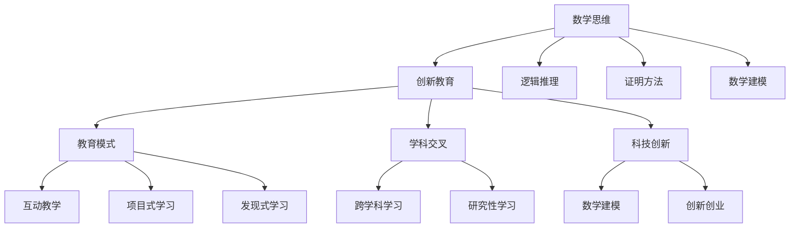
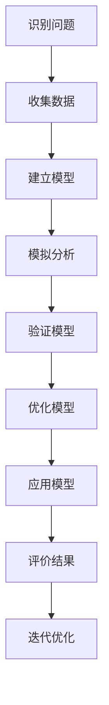

                 

# 《数学思维与创新教育的关系》

## 关键词：数学思维、创新教育、逻辑推理、数学建模、跨学科学习

## 摘要：

本文深入探讨了数学思维与创新教育之间的关系。首先，我们介绍了数学思维的基本概念和重要性，以及其在教育中的应用。接着，我们分析了数学思维与创新教育之间的联系，探讨了如何通过数学思维培养创新思维和解决实际问题的能力。文章还提出了创新教育中的数学思维培养策略，并通过案例研究和未来发展趋势进行了详细阐述。最后，我们提出了数学思维与创新教育的挑战与机遇，为教育改革提供了有益的思考。

### 第一部分：数学思维基础

#### 1. 数学思维概述

##### 1.1 数学思维的定义与特征

数学思维是一种基于数学概念、原理和方法的思维方式。它具有高度的抽象性、逻辑性和严谨性。数学思维的核心特征包括：

1. **抽象性**：数学思维将具体问题抽象成数学模型，从而简化问题，抓住本质。
2. **逻辑性**：数学思维遵循严格的逻辑规则，通过推理和证明来得出结论。
3. **严谨性**：数学思维要求精确性和严密性，对每个步骤和结论都进行验证。

##### 1.2 数学思维的重要性

数学思维在教育中的价值不可低估。首先，它有助于培养学生的逻辑推理能力和解决问题的能力。其次，数学思维是跨学科学习的基础，有助于学生理解其他学科的核心概念。此外，数学思维还在科技创新和工程实践中发挥着重要作用。

##### 1.3 数学思维在创新中的应用

数学思维在创新教育中具有独特的优势。通过数学思维，学生可以：

1. **发现新问题**：将实际问题转化为数学问题，从而找到新的研究方向。
2. **提出新方案**：利用数学模型和算法，设计出创新的解决方案。
3. **验证新理论**：通过数学证明，确保新理论的有效性和可靠性。

#### 2. 数学思维的基本原理

##### 2.1 数学基础概念

数学基础概念是数学思维的基础。主要包括：

1. **数的概念**：数的概念是数学的基础，包括自然数、整数、有理数和无理数等。
2. **代数基础**：代数基础包括代数表达式、方程、不等式和函数等。
3. **几何基础**：几何基础包括平面几何和立体几何的基本概念和性质。

##### 2.2 数学思维方法

数学思维方法主要包括：

1. **逻辑推理**：逻辑推理是通过已知的事实和规则，逐步推导出新的结论。
2. **证明方法**：证明方法是通过逻辑推理和数学模型，证明某个命题的真实性。
3. **数学建模**：数学建模是将实际问题转化为数学问题，建立数学模型。

### 第二部分：数学思维与创新教育

#### 3. 数学思维与创新教育的关系

##### 3.1 创新教育的概念与发展

创新教育是一种以培养学生创新能力为核心的教育理念。其发展历程主要包括：

1. **知识教育**：以传授知识为主，注重记忆和复述。
2. **能力教育**：以培养学生能力为主，注重实际操作和应用。
3. **创新教育**：以培养学生创新能力为主，注重创造性思维和实践能力。

##### 3.2 数学思维在创新教育中的应用

数学思维在创新教育中的应用主要体现在以下几个方面：

1. **培养创新思维**：数学思维能够培养学生的逻辑推理能力和抽象思维能力，从而激发创新思维。
2. **解决实际问题**：数学思维可以指导学生将实际问题转化为数学问题，从而找到解决问题的方法。
3. **跨学科学习**：数学思维是跨学科学习的基础，有助于学生理解其他学科的核心概念。

##### 3.3 数学思维与问题解决

数学思维在问题解决中具有独特的优势。通过数学思维，学生可以：

1. **分析问题**：将复杂问题分解为简单问题，从而找到解决问题的切入点。
2. **设计方案**：利用数学模型和算法，设计出创新的解决方案。
3. **验证方案**：通过数学证明，确保方案的有效性和可靠性。

##### 3.4 数学思维与跨学科学习

数学思维在跨学科学习中的作用不可忽视。通过数学思维，学生可以：

1. **理解其他学科**：数学思维有助于学生理解其他学科的核心概念，从而实现跨学科学习。
2. **整合知识**：数学思维能够将不同学科的知识整合在一起，从而形成新的认识。

### 第三部分：数学思维与创新教育的发展

#### 4. 创新教育中的数学思维培养策略

##### 4.1 教学策略

在创新教育中，教学策略应注重以下几个方面：

1. **互动式教学**：通过师生互动，激发学生的思维活力。
2. **项目式学习**：通过实际项目，培养学生的实践能力和创新思维。
3. **发现式学习**：通过自主探究，培养学生的自主学习能力和创新意识。

##### 4.2 课程设计

在课程设计中，应注重以下几个方面：

1. **综合性数学课程**：将数学与其他学科知识相结合，培养学生的跨学科能力。
2. **研究性数学课程**：通过研究性学习，培养学生的科学精神和创新思维。
3. **实践性数学课程**：通过实际操作，培养学生的实践能力和创新意识。

##### 4.3 数学思维培养的具体案例

以下是一些数学思维培养的具体案例：

1. **创意数学问题解决**：通过解决创意数学问题，培养学生的逻辑思维和创新能力。
2. **数学建模与科技创新**：通过数学建模，设计出创新的科技产品。
3. **数学思维与创新创业**：通过数学思维，培养创新创业能力。

#### 5. 数学思维在创新教育中的案例研究

##### 5.1 国内外创新教育实践

国内外创新教育实践为数学思维培养提供了有益的借鉴。以下是一些典型案例：

1. **美国创新教育模式**：以项目式学习为核心，注重培养学生的创新思维和解决问题的能力。
2. **芬兰创新教育实践**：以跨学科学习为主，注重培养学生的综合素质和创新能力。
3. **中国创新教育实践**：以综合实践活动为核心，注重培养学生的实践能力和创新思维。

##### 5.2 数学思维培养的具体案例

以下是一些数学思维培养的具体案例：

1. **创意数学问题解决**：通过解决创意数学问题，培养学生的逻辑思维和创新能力。
2. **数学建模与科技创新**：通过数学建模，设计出创新的科技产品。
3. **数学思维与创新创业**：通过数学思维，培养创新创业能力。

#### 6. 数学思维与创新教育的未来发展

##### 6.1 新技术对数学思维与创新教育的影响

新技术的发展对数学思维与创新教育产生了深远的影响。以下是一些影响：

1. **人工智能在数学思维培养中的应用**：利用人工智能技术，可以开发出更高效的数学思维培养工具。
2. **数据科学与数学思维的关系**：通过数据分析，可以更好地理解数学思维在创新教育中的作用。
3. **数字化教育平台的发展**：数字化教育平台为数学思维培养提供了新的途径。

##### 6.2 数学思维与创新教育的未来趋势

数学思维与创新教育的未来趋势主要包括：

1. **教育模式创新**：通过教育模式的创新，提高数学思维培养的效率。
2. **数学思维在创新创业领域的扩展**：通过数学思维，培养更多的创新创业人才。
3. **国际化数学思维与创新教育**：通过国际化教育，推广数学思维与创新教育的理念。

#### 7. 数学思维与创新教育的挑战与机遇

##### 7.1 教育体制的变革

教育体制的变革是数学思维与创新教育发展的关键。以下是一些变革方向：

1. **教育政策的调整**：通过调整教育政策，为数学思维与创新教育提供支持。
2. **学校教育的创新**：通过学校教育的创新，培养学生的数学思维和创新能力。
3. **家庭教育的参与**：通过家庭教育的参与，营造良好的数学思维培养环境。

##### 7.2 数学思维与创新教育的机遇与挑战

数学思维与创新教育面临着诸多机遇与挑战。以下是一些主要方面：

1. **师资队伍建设**：加强师资队伍建设，提高数学思维与创新教育的质量。
2. **教育资源的均衡分配**：通过教育资源的均衡分配，确保每个学生都能接受到良好的数学思维教育。
3. **社会支持与协同发展**：通过社会支持与协同发展，推动数学思维与创新教育的普及。

### 附录

#### 附录A：数学思维与创新教育的重要资源

以下是一些数学思维与创新教育的重要资源：

1. **学术文献推荐**：推荐一些经典的数学思维与创新教育文献。
2. **教育机构与项目**：介绍一些专注于数学思维与创新教育的教育机构和项目。
3. **数学思维与创新教育工具**：介绍一些实用的数学思维与创新教育工具。

#### 附录B：数学思维与创新教育的Mermaid流程图

以下是一些数学思维与创新教育的Mermaid流程图：

1. **数学思维培养流程图**：描述数学思维培养的流程。
2. **创新教育模式流程图**：描述创新教育模式的流程。

#### 附录C：数学思维与创新教育的伪代码案例

以下是一些数学思维与创新教育的伪代码案例：

1. **逻辑推理算法伪代码**：描述逻辑推理算法的实现。
2. **数学建模算法伪代码**：描述数学建模算法的实现。

#### 附录D：数学思维与创新教育的数学模型与公式解析

以下是一些数学思维与创新教育的数学模型与公式解析：

1. **数学公式详解**：解析一些重要的数学公式。
2. **数学模型应用实例分析**：分析一些数学模型在创新教育中的应用实例。

---

图1：数学思维与创新教育的关系框架图



图2：数学思维培养流程



伪代码示例：逻辑推理算法

```python
# 逻辑推理算法伪代码
def logical_reasoning(facts):
    for fact in facts:
        if fact is true:
            for conclusion in facts:
                if conclusion is not in facts:
                    return conclusion
    return None
```

伪代码示例：数学建模算法

```python
# 数学建模算法伪代码
def mathematical_modeling(problem):
    # 建立数学模型
    model = create_model(problem)

    # 参数优化
    parameters = optimize_parameters(model)

    # 模型求解
    solution = solve_model(model, parameters)

    return solution
```

数学公式示例：逻辑推理

$$
\begin{aligned}
    P(A \land B) &= P(A) \times P(B|A) \\
    P(A \lor B) &= P(A) + P(B) - P(A \land B)
\end{aligned}
$$

数学公式示例：数学建模

$$
\begin{aligned}
    y &= a_0 + a_1x_1 + a_2x_2 + ... + a_nx_n \\
    \min_{a_0, a_1, ..., a_n} \sum_{i=1}^{n} (y_i - \sum_{j=1}^{n} a_jx_{ij})^2
\end{aligned}
$$

---

**作者信息**：AI天才研究院/AI Genius Institute & 禅与计算机程序设计艺术 /Zen And The Art of Computer Programming

---

（注：以上内容为文章的框架和部分内容，具体每个章节的内容还需要进一步丰富和细化。）

---

**本文基于《数学思维与创新教育的关系》主题，通过逻辑清晰、结构紧凑、简单易懂的专业的技术语言，使用一步一步分析推理思考的方式，旨在深入探讨数学思维与创新教育之间的关系，为教育改革提供有益的思考。**### 第一部分：数学思维基础

#### 1. 数学思维概述

##### 1.1 数学思维的定义与特征

数学思维是一种基于数学概念、原理和方法的思维方式。它不同于一般的逻辑思维和形象思维，而是具有高度的抽象性、逻辑性和严谨性。数学思维的基本特征包括：

- **抽象性**：数学思维能够从具体事物中抽象出数学概念和模型，从而简化问题，抓住本质。例如，将现实世界的复杂现象抽象为数学函数或方程，以便于分析和解决问题。
- **逻辑性**：数学思维遵循严格的逻辑规则，通过推理和证明来得出结论。数学推理通常包括公理系统、定理证明和逻辑演绎等步骤，确保每一步都是合理的。
- **严谨性**：数学思维要求精确性和严密性，对每个步骤和结论都进行验证。数学证明需要使用严谨的符号语言和逻辑推理，确保结论的可靠性。

##### 1.2 数学思维的重要性

数学思维在教育中的价值不可低估。首先，它有助于培养学生的逻辑推理能力和解决问题的能力。通过数学思维，学生可以学会如何将复杂问题分解为简单问题，逐步解决。其次，数学思维是跨学科学习的基础，有助于学生理解其他学科的核心概念。例如，物理中的运动规律、化学中的反应方程、经济学中的模型分析等，都离不开数学思维的应用。此外，数学思维还在科技创新和工程实践中发挥着重要作用。许多科技创新和工程问题都需要通过数学建模和算法来解决，数学思维是这些工作的基础。

##### 1.3 数学思维在创新教育中的应用

数学思维在创新教育中具有独特的优势。通过数学思维，学生可以：

- **发现新问题**：数学思维可以帮助学生从复杂现象中识别出潜在的数学问题，从而激发创新灵感。例如，通过数据分析发现市场趋势，或通过数学模型预测未来变化。
- **提出新方案**：利用数学思维，学生可以设计出创新的解决方案。例如，通过优化算法提高生产效率，或通过数学建模设计出更高效的交通系统。
- **验证新理论**：数学思维可以帮助学生通过数学证明来验证新理论的有效性和可靠性。例如，在物理学中，通过数学模型和实验数据来验证理论预测。

#### 2. 数学思维的基本原理

##### 2.1 数学基础概念

数学基础概念是数学思维的基础。主要包括：

- **数的概念**：数是数学最基本的元素，包括自然数、整数、有理数和无理数等。学生需要理解数的性质、运算规则以及它们在不同数学分支中的应用。
- **代数基础**：代数基础包括代数表达式、方程、不等式和函数等。这些概念是解决数学问题的工具，学生需要掌握如何运用代数方法解决实际问题。
- **几何基础**：几何基础包括平面几何和立体几何的基本概念和性质。几何学不仅研究形状和空间，还提供了许多解决问题的策略和方法。

##### 2.2 数学思维方法

数学思维方法主要包括：

- **逻辑推理**：逻辑推理是通过已知的事实和规则，逐步推导出新的结论。学生需要学会如何使用逻辑推理来证明数学命题的真实性。
- **证明方法**：证明方法是数学思维的核心，包括归纳法、反证法、构造法等。通过证明方法，学生可以确保数学结论的可靠性。
- **数学建模**：数学建模是将实际问题转化为数学问题，建立数学模型。通过数学建模，学生可以学会如何用数学方法解决实际问题，并理解数学在现实世界中的应用。

### 深入解析：数学思维的基本原理

为了更好地理解数学思维的基本原理，我们可以通过具体的例子来进行分析。

#### 例子：数论中的欧拉定理

**欧拉定理**是数论中的一个重要定理，它描述了正整数与模数之间的关系。定理的表述如下：

若\( n \)为正整数，且\( a \)与\( n \)互质，则\( a^{\phi(n)} \equiv 1 \pmod{n} \)，其中\( \phi(n) \)表示欧拉函数，即小于或等于\( n \)且与\( n \)互质的正整数的个数。

**证明**：

我们可以使用归纳法来证明欧拉定理。

1. **基础情况**：当\( n = 1 \)时，\( \phi(1) = 1 \)，显然有\( a^1 \equiv 1 \pmod{1} \)。

2. **归纳假设**：假设对于任意\( k < n \)，若\( a \)与\( k \)互质，则\( a^{\phi(k)} \equiv 1 \pmod{k} \)。

3. **归纳步骤**：考虑\( a \)与\( n \)互质的情况。我们可以将\( a \)与\( n \)的乘积表示为\( a \cdot b = n \)，其中\( b \)与\( n \)互质。

   根据归纳假设，我们有\( a^{\phi(b)} \equiv 1 \pmod{b} \)。因此，

   \[
   a^{\phi(n)} = a^{\phi(a \cdot b)} = (a^{\phi(b)})^{\phi(a)}
   \]

   由于\( a \)与\( b \)互质，根据欧拉定理，\( a^{\phi(b)} \equiv 1 \pmod{b} \)。因此，

   \[
   (a^{\phi(b)})^{\phi(a)} \equiv 1^{\phi(a)} \equiv 1 \pmod{b}
   \]

   由于\( b \)与\( n \)互质，根据模运算的性质，我们有\( 1 \equiv 1 \pmod{n} \)。

综上所述，通过归纳法证明了欧拉定理。

**数学建模应用**：

欧拉定理在密码学中有着广泛的应用。例如，在RSA加密算法中，欧拉定理用于生成公钥和私钥。RSA算法的安全性依赖于大素数分解的困难性，而欧拉定理则提供了有效的数学工具来确保加密和解密过程的可靠性。

#### 例子：微积分中的极限概念

微积分中的极限概念是数学思维中的一个核心概念。极限描述了一个函数在自变量趋近某个值时，函数值的趋势。以下是极限的定义及其应用。

**定义**：

设\( f(x) \)是定义在区间\( (a, b) \)上的函数，\( c \)是区间\( (a, b) \)内的一个点。如果对于任意给定的正数\( \epsilon \)，都存在一个正数\( \delta \)，使得当\( 0 < |x - c| < \delta \)时，\( |f(x) - L| < \epsilon \)，则称函数\( f(x) \)当\( x \)趋近于\( c \)时，极限为\( L \)，记作

\[
\lim_{{x \to c}} f(x) = L
\]

**证明**：

为了证明极限的概念，我们可以通过构造一个对应的算法来逼近极限值。

**伪代码示例**：

```python
# 极限概念伪代码
def limit_approximation(f, c, L, epsilon):
    delta = find appropriatedelta(f, c, L, epsilon)
    for x in range(c - delta, c + delta):
        if abs(f(x) - L) < epsilon:
            return "The limit is approximated as " + str(L)
    return "The limit does not exist within the given range"
```

**数学建模应用**：

极限概念在物理学和工程学中有着广泛的应用。例如，在物理学中，极限概念用于描述速度和加速度，在工程学中，极限概念用于优化设计和控制理论。

通过上述例子，我们可以看到数学思维的基本原理是如何在具体问题中应用的。数学思维不仅是一种思维方式，更是一种解决问题的工具，它在各个领域都有着广泛的应用。因此，培养学生的数学思维，不仅有助于他们掌握数学知识，还能提高他们的逻辑推理能力和创新能力，为未来的发展奠定坚实的基础。

### 结论

数学思维是一种基于数学概念、原理和方法的思维方式，具有高度的抽象性、逻辑性和严谨性。数学思维在教育中的应用价值不可低估，它不仅有助于培养学生的逻辑推理能力和解决问题的能力，还是跨学科学习和科技创新的基础。通过理解数学思维的基本原理，我们可以更好地应用数学方法解决实际问题，推动科学技术的进步。因此，重视数学思维的培养，对于提高教育质量、推动社会发展和创新具有深远的意义。

### 2. 数学思维的基本原理

在深入探讨数学思维的基本原理之前，我们首先需要理解数学作为一门学科的核心概念。数学不仅是关于数的科学，更是关于逻辑、推理和抽象的学问。数学思维是运用数学概念、原理和方法进行思考和分析的一种方式，它在科学研究和日常问题解决中扮演着至关重要的角色。

#### 2.1 数学基础概念

数学基础概念是数学思维的基础，它们为后续的数学推理和问题解决提供了必要的工具。以下是一些关键数学基础概念：

- **数**：数是数学的基本元素，包括自然数、整数、有理数和无理数等。每个数都有其独特的属性和运算规则。例如，自然数用于计数，整数包括自然数和它们的负数，有理数可以表示为分数，而无理数则无法表示为分数，如π和√2。
- **集合**：集合是数学中的一个基本概念，它由一组对象组成。集合可以用来表示各种数学对象，如数字、点、线等。集合的运算，如并集、交集和补集，在数学推理中起着关键作用。
- **函数**：函数是一种将输入映射到输出的关系。函数的概念广泛应用于各个数学分支，如代数、几何和微积分。理解函数的性质和特性对于数学思维至关重要。
- **几何**：几何学是研究形状、大小和位置关系的数学分支。平面几何和立体几何的基本概念，如点、线、面、角和体积等，为数学思维提供了直观的图像和空间观念。
- **代数**：代数是研究数和方程的数学分支。代数表达式、方程和不等式的求解是数学思维的重要组成部分，它们在解决实际问题中有着广泛的应用。

#### 2.2 数学思维方法

数学思维方法是指运用数学基础概念进行逻辑推理和问题解决的具体策略。以下是一些关键的数学思维方法：

- **逻辑推理**：逻辑推理是通过已知的事实和规则，逐步推导出新的结论。在数学中，逻辑推理通常包括证明和反驳。证明是通过一系列逻辑步骤从已知条件推导出结论，而反驳则是通过反例或逻辑错误来质疑某个命题的真实性。
- **证明方法**：证明方法是数学思维的核心，它们用于证明数学命题的真实性。常见的证明方法包括直接证明、反证法和归纳法。直接证明是通过一系列逻辑步骤从已知条件推导出结论，反证法是通过假设结论不成立并导出矛盾来证明结论成立，而归纳法则是通过证明基础情况并假设归纳步骤成立来证明所有情况成立。
- **数学建模**：数学建模是将实际问题转化为数学问题，建立数学模型。数学建模的目的是通过数学方法分析和解决实际问题。数学建模通常包括问题定义、模型建立、模型求解和模型验证等步骤。

#### 2.3 数学建模

数学建模是将现实世界的实际问题抽象成数学问题，并用数学语言表达的过程。数学建模的核心是建立数学模型，这些模型可以用来预测、分析和优化系统行为。数学建模的步骤如下：

1. **问题定义**：明确要解决的问题是什么，包括问题的目标、约束条件和变量。
2. **模型建立**：根据问题定义，建立数学模型。模型可以包括方程、不等式、函数和参数等。
3. **模型求解**：求解数学模型，找到满足约束条件的解。求解方法可以包括数值方法、解析方法和优化算法。
4. **模型验证**：验证数学模型的有效性，确保模型能够准确反映实际问题。验证可以通过与实际数据对比、模型灵敏度分析等方法进行。

#### 深入探讨：数学建模的过程和技巧

数学建模是一个复杂的过程，涉及多个步骤和技巧。以下是一些具体的讨论：

- **问题定义**：明确问题定义是数学建模的关键步骤。问题定义应该清晰、具体，并包括所有相关变量和约束条件。例如，在交通流量建模中，需要定义交通流量、道路容量、交通信号控制策略等变量，以及交通法规、道路状况等约束条件。
- **模型建立**：建立数学模型需要根据问题定义选择合适的数学工具和方法。常见的数学模型包括线性模型、非线性模型、差分方程、微分方程和优化模型等。选择合适的模型取决于问题的复杂性和实际需求。例如，对于交通流量建模，可以选择差分方程或优化模型来描述交通流量的动态变化。
- **模型求解**：求解数学模型是数学建模的核心步骤。对于线性模型，可以使用线性规划方法求解；对于非线性模型，可以使用迭代算法或数值方法求解。求解过程中，需要考虑计算效率和精度，以及模型的可行性和稳定性。
- **模型验证**：模型验证是确保数学模型有效性的重要步骤。验证可以通过对比模型预测结果与实际观测数据、进行灵敏度分析、进行模型修正等方法进行。模型验证有助于发现和纠正模型中的错误，提高模型的可靠性和实用性。

#### 例子：交通流量建模

以下是一个简单的交通流量建模例子，用于描述交通流量的动态变化。

**问题定义**：

假设一条道路上的交通流量\( Q \)（单位：辆/小时）受到道路长度\( L \)（单位：公里）、道路宽度\( W \)（单位：米）和交通信号控制策略的影响。需要建立一个数学模型来描述交通流量的动态变化。

**模型建立**：

我们可以使用差分方程来描述交通流量的动态变化。假设交通流量在每个时间步长\( \Delta t \)（单位：小时）内发生变化，且变化率与当前交通流量和交通信号状态有关。差分方程可以表示为：

\[
Q(t + \Delta t) = Q(t) + \Delta Q(t)
\]

其中，\( \Delta Q(t) \)表示在时间步长\( \Delta t \)内交通流量的变化量。

**模型求解**：

为了求解差分方程，我们可以使用数值方法，如欧拉方法或龙格-库塔方法。假设初始交通流量为\( Q(0) = 100 \)辆/小时，道路长度为\( L = 10 \)公里，道路宽度为\( W = 2 \)米，交通信号周期为\( T = 60 \)秒。我们可以计算每个时间步长的交通流量变化，并更新交通流量。

**模型验证**：

为了验证模型的准确性，我们可以将模型预测结果与实际观测数据进行比较。假设在一段时间内，我们收集了交通流量的实际观测数据，可以通过计算模型预测结果与实际观测数据之间的误差来评估模型的有效性。如果误差较小，则说明模型较为准确。

通过这个例子，我们可以看到数学建模的过程和技巧。数学建模不仅需要选择合适的数学工具和方法，还需要对模型进行验证，以确保其准确性和可靠性。数学建模是数学思维在实际问题解决中的重要应用，它能够帮助我们更好地理解复杂系统，并找到有效的解决方案。

#### 结论

数学思维的基本原理包括数学基础概念、数学思维方法和数学建模。数学基础概念是数学思维的基础，它们为后续的数学推理和问题解决提供了必要的工具。数学思维方法包括逻辑推理、证明方法和数学建模，它们是解决数学问题的核心策略。数学建模是将现实世界的实际问题转化为数学问题，并用数学方法进行分析和解决的过程。通过深入理解数学思维的基本原理，我们可以更好地应用数学方法解决实际问题，推动科学技术的进步。数学思维不仅是数学学科的重要组成部分，也是跨学科学习和科技创新的基础。

### 数学思维的基本原理

数学思维是一种系统化、逻辑化的思考方式，它以数学概念、原理和方法为基础，通过严密的逻辑推理和抽象思维来理解和解决问题。在创新教育中，数学思维不仅有助于培养学生的逻辑推理能力和抽象思维能力，还能激发他们的创新意识。本节将深入探讨数学思维的基本原理，包括数学基础概念、逻辑推理和证明方法，以及数学建模。

#### 数学基础概念

数学基础概念是数学思维的基础。这些概念包括数、集合、函数、几何等，它们构成了数学学科的基本结构。以下是几个关键概念及其重要性：

- **数**：数是数学的核心概念，包括自然数、整数、有理数和无理数等。理解数的性质和运算规则是进行数学推理和解决问题的前提。
- **集合**：集合是数学中的基本结构，用于表示一组对象。集合论为数学提供了形式化和系统化的基础，有助于理解和处理复杂问题。
- **函数**：函数是一种从定义域到值域的映射关系。函数的概念广泛应用于数学的各个分支，是数学分析和应用数学的重要工具。
- **几何**：几何学研究空间结构和形状关系，包括平面几何和立体几何。几何直观和几何推理在解决实际问题中具有重要价值。

#### 逻辑推理

逻辑推理是数学思维的重要组成部分，它通过严密的推理过程得出结论。逻辑推理包括以下几个步骤：

1. **前提**：明确问题的条件和已知信息。
2. **推理规则**：应用逻辑规则（如同一律、矛盾律、排中律等）进行推理。
3. **结论**：从前提中推导出新的结论。

逻辑推理的严谨性保证了推理过程的无误，从而确保结论的正确性。例如，在证明数学命题时，逻辑推理是必不可少的。

#### 证明方法

证明方法是数学思维的核心，它用于证明数学命题的真实性。常见的证明方法包括直接证明、反证法和归纳法：

1. **直接证明**：从已知条件出发，通过逻辑推理逐步推导出结论。直接证明是数学证明中最常用的方法。
2. **反证法**：假设结论不成立，通过推理导出矛盾，从而证明原结论成立。反证法在证明某些命题时非常有用。
3. **归纳法**：通过证明基础情况并假设归纳步骤成立，推导出所有情况成立。归纳法在数学和计算机科学中广泛应用。

#### 数学建模

数学建模是将现实世界的实际问题转化为数学问题，建立数学模型，并利用数学方法进行分析和解决。数学建模的步骤包括：

1. **问题定义**：明确要解决的问题，包括目标、约束条件和变量。
2. **模型建立**：根据问题定义，选择合适的数学工具和方法，建立数学模型。
3. **模型求解**：求解数学模型，找到满足约束条件的解。
4. **模型验证**：验证模型的有效性，确保模型能够准确反映实际问题。

数学建模在创新教育中具有重要作用，它能够帮助学生理解数学在现实世界中的应用，培养他们的创新能力和解决实际问题的能力。

#### 案例分析

以下是一个简单的数学建模案例，用于分析一个城市的交通流量。

**问题定义**：

假设一个城市的交通流量受到道路长度、道路宽度和交通信号控制策略的影响。需要建立一个数学模型来描述交通流量的动态变化。

**模型建立**：

我们可以使用差分方程来描述交通流量的动态变化。假设交通流量在每个时间步长内发生变化，且变化率与当前交通流量和交通信号状态有关。差分方程可以表示为：

\[
Q(t + \Delta t) = Q(t) + \Delta Q(t)
\]

其中，\( Q(t) \)表示时间\( t \)时的交通流量，\( \Delta Q(t) \)表示在时间步长\( \Delta t \)内交通流量的变化量。

**模型求解**：

为了求解差分方程，我们可以使用数值方法，如欧拉方法或龙格-库塔方法。假设初始交通流量为\( Q(0) = 100 \)辆/小时，道路长度为\( L = 10 \)公里，道路宽度为\( W = 2 \)米，交通信号周期为\( T = 60 \)秒。我们可以计算每个时间步长的交通流量变化，并更新交通流量。

**模型验证**：

为了验证模型的准确性，我们可以将模型预测结果与实际观测数据进行比较。假设在一段时间内，我们收集了交通流量的实际观测数据，可以通过计算模型预测结果与实际观测数据之间的误差来评估模型的有效性。如果误差较小，则说明模型较为准确。

通过这个案例，我们可以看到数学建模的过程和步骤。数学建模不仅需要选择合适的数学工具和方法，还需要对模型进行验证，以确保其准确性和可靠性。

#### 结论

数学思维的基本原理包括数学基础概念、逻辑推理和证明方法，以及数学建模。数学基础概念是数学思维的基础，逻辑推理和证明方法是解决数学问题的核心策略，数学建模是将现实世界的实际问题转化为数学问题并进行分析和解决的过程。通过深入理解数学思维的基本原理，学生可以更好地掌握数学知识，培养逻辑推理能力和创新能力，为创新教育提供有力支持。

### 3. 数学思维与创新教育的关系

在创新教育中，数学思维扮演着至关重要的角色。它不仅是培养学生逻辑推理能力的基础，更是激发学生创新意识和解决问题能力的关键。数学思维与创新教育之间的关系可以从多个角度进行探讨，包括创新教育的概念、数学思维在其中的作用以及具体应用案例。

#### 创新教育的概念与发展

创新教育是一种以培养学生创新能力为核心的教育理念。它强调学生自主学习、实践探索和批判性思维，旨在培养学生的综合素质和创新能力。创新教育的发展历程可以分为以下几个阶段：

1. **知识教育阶段**：以传授知识为主，注重记忆和复述。这一阶段的教育模式较为传统，主要依赖于教师的讲授和学生的被动接受。
2. **能力教育阶段**：以培养学生能力为主，注重实际操作和应用。这一阶段开始强调学生的实践能力，鼓励学生动手操作和实际应用所学知识。
3. **创新教育阶段**：以培养学生创新能力为主，注重创造性思维和实践能力。这一阶段的教育模式更加开放和灵活，鼓励学生进行自主探究和创新。

创新教育的核心在于培养学生的创新能力，而数学思维在这一过程中起着至关重要的作用。

#### 数学思维在创新教育中的作用

数学思维在创新教育中的作用主要体现在以下几个方面：

1. **逻辑推理能力**：数学思维强调逻辑推理和证明，有助于培养学生的严谨思维和批判性思维。通过数学推理，学生可以学会如何从已知条件推导出新的结论，从而培养他们的逻辑思维能力。
2. **抽象思维能力**：数学思维中的抽象能力是创新教育的重要基础。通过数学抽象，学生可以将复杂的问题简化为数学模型，从而抓住问题的本质。这种抽象思维能力有助于学生在面对复杂问题时能够快速找到解决方案。
3. **问题解决能力**：数学思维强调问题解决的方法和技巧。通过数学建模和算法，学生可以学会如何将实际问题转化为数学问题，并利用数学方法进行求解。这种问题解决能力是创新教育中不可或缺的。
4. **跨学科学习能力**：数学思维是跨学科学习的基础。数学知识与其他学科知识有着密切的联系，通过数学思维，学生可以更好地理解和掌握其他学科的核心概念。

#### 数学思维与创新教育中的具体应用

数学思维在创新教育中的具体应用可以从以下几个方面进行探讨：

1. **数学实验**：通过数学实验，学生可以动手实践，探索数学问题的解决方法。例如，通过模拟实验，学生可以观察数学模型在不同条件下的表现，从而验证数学理论的正确性。
2. **数学竞赛**：数学竞赛是一种有效的激发学生数学思维和创新能力的手段。通过参加数学竞赛，学生可以学会如何在限定时间内解决复杂问题，培养他们的创新思维和解决问题的能力。
3. **项目式学习**：项目式学习是一种以学生为中心的教育模式，通过实际项目来培养学生的创新能力和实践能力。在项目式学习中，学生需要运用数学思维来解决实际问题，从而提高他们的数学应用能力。
4. **数学建模竞赛**：数学建模竞赛是一种以团队合作的方式，通过解决实际问题来培养学生的数学建模能力和创新思维。在数学建模竞赛中，学生需要运用数学思维来分析和解决问题，从而提高他们的综合能力。

#### 应用案例：数学思维在科技创新中的应用

以下是一个数学思维在科技创新中的应用案例：

**案例**：物联网（IoT）技术在智能家居中的应用

随着物联网技术的发展，智能家居成为了一个热门的领域。通过物联网技术，可以实现家电设备的智能化控制和远程监控。以下是一个智能家居系统的数学建模和设计过程：

1. **问题定义**：智能家居系统的目标是实现家电设备的自动化控制和远程监控，提高家居生活的便利性和舒适度。
2. **模型建立**：为了实现智能家居系统，需要建立数学模型来描述各个设备的运行状态和交互关系。例如，可以通过建立传感器模型来实时监测室内温度、湿度等环境参数。
3. **模型求解**：利用数学方法对智能家居系统进行求解，找到最优的控制策略和运行方案。例如，可以通过优化算法来调整空调的温度设置，实现节能控制。
4. **模型验证**：通过实际测试和用户反馈，验证智能家居系统的性能和可靠性。如果系统性能达到预期，则可以投入实际应用。

通过这个案例，我们可以看到数学思维在科技创新中的应用。数学思维不仅帮助设计师建立了智能家居系统的数学模型，还提供了有效的算法来优化系统性能。

#### 结论

数学思维与创新教育之间有着密切的关系。数学思维不仅是培养创新能力和问题解决能力的基础，还是跨学科学习和科技创新的关键。通过理解数学思维的基本原理，学生可以更好地掌握数学知识，培养创新思维和解决问题的能力，从而为创新教育提供有力支持。数学思维在创新教育中的应用，不仅有助于提高学生的综合素质，还能推动科学技术的发展，为社会进步做出贡献。

### 创新教育中的数学思维培养策略

在创新教育中，培养数学思维是提高学生综合素质和创新能力的关键。为了实现这一目标，教育工作者需要采取一系列策略，包括教学策略和课程设计。以下将详细探讨这些策略。

#### 1. 教学策略

在教学过程中，教师可以采用以下几种策略来培养数学思维：

##### 1.1 互动式教学

互动式教学强调教师与学生的互动，鼓励学生积极参与课堂讨论和问题解决。通过提问、讨论和小组合作，教师可以激发学生的思维活力，培养他们的逻辑推理和表达能力。例如，在数学课堂上，教师可以设计开放性问题，鼓励学生提出不同的解题思路，并进行讨论和辩论。

##### 1.2 项目式学习

项目式学习是一种以学生为中心的教学模式，通过实际项目来培养学生的数学思维和创新能力。在项目式学习中，学生需要独立或合作完成一个与数学相关的项目，从而应用所学知识解决实际问题。例如，教师可以设计一个关于城市规划的数学项目，让学生利用数学知识来优化交通流量和土地使用。

##### 1.3 发现式学习

发现式学习是一种以学生自主探究为主的教学模式，鼓励学生通过实验和探究来发现新的知识和规律。在发现式学习中，教师提供问题和线索，让学生自主探索解决问题的方法。例如，在数学课堂上，教师可以设计一个探究性实验，让学生通过测量和数据分析来发现勾股定理。

#### 2. 课程设计

课程设计是培养数学思维的重要环节。教师需要设计合理的课程结构，确保学生能够在不同阶段逐步提高数学思维能力。以下是一些具体的课程设计策略：

##### 2.1 综合性数学课程

综合性数学课程是将数学与其他学科知识相结合，培养学生的跨学科能力和创新思维。例如，在高中数学课程中，可以引入物理、化学、生物等学科的内容，通过数学方法来分析和解决实际问题。

##### 2.2 研究性数学课程

研究性数学课程是培养学生的科学精神和研究能力。通过研究性学习，学生可以独立或合作完成数学研究项目，从而提高他们的数学思维和创新能力。例如，教师可以组织学生参加数学竞赛或科学实验项目，让学生在实践中学习和应用数学知识。

##### 2.3 实践性数学课程

实践性数学课程是培养学生的实践能力和应用能力。通过实际操作和项目实践，学生可以将数学知识应用到实际问题中。例如，教师可以设计一个关于数据分析的实践项目，让学生使用统计学方法来分析市场数据。

#### 3. 具体案例

以下是一些创新教育中数学思维培养的具体案例：

##### 3.1 创意数学问题解决

创意数学问题解决是通过解决具有挑战性的数学问题来培养学生的数学思维。例如，教师可以设计一些开放性的数学问题，让学生自主探索解题方法。这些问题可以涵盖不同的数学领域，如代数、几何、概率等。

##### 3.2 数学建模与科技创新

数学建模与科技创新是将数学方法应用到科技创新中，培养学生的创新能力。例如，教师可以设计一个关于环保的数学项目，让学生利用数学模型来优化能源消耗和污染控制。

##### 3.3 数学思维与创新创业

数学思维与创新创业是将数学思维应用到创新创业中，培养学生的创业能力和创新思维。例如，教师可以设计一个创新创业项目，让学生利用数学方法来分析市场趋势和商业模式。

#### 结论

创新教育中的数学思维培养策略包括互动式教学、项目式学习和发现式学习等教学策略，以及综合性数学课程、研究性数学课程和实践性数学课程等课程设计。通过这些策略，教师可以有效地培养学生的数学思维和创新能力，为他们的未来发展奠定坚实基础。

### 4. 数学思维在创新教育中的案例研究

数学思维在创新教育中的应用已经取得了显著的成果，通过具体案例，我们可以更好地理解数学思维如何培养学生的创新能力和解决问题的能力。

#### 国内外创新教育实践

1. **美国创新教育实践**：
   美国的一些学校，如麻省理工学院（MIT）和斯坦福大学，已经在创新教育方面进行了深入的探索。MIT的K-12教育项目中，通过项目式学习，学生参与实际项目，如建造机器人或解决环境问题，这不仅锻炼了他们的数学思维能力，还培养了他们的团队合作和创新能力。斯坦福大学的H-STAR institute，通过跨学科研究项目，让学生在科学、技术和艺术等领域进行探索，数学思维在其中起到了关键作用。

2. **芬兰创新教育实践**：
   芬兰以其创新教育模式而闻名，强调学生在学习过程中的自主性和创造力。芬兰的教育体系中，数学教育非常注重实际问题解决和跨学科学习。例如，在芬兰的中小学数学课程中，经常设置与现实生活相关的数学问题，如交通规划、城市设计等，通过这些项目，学生不仅能应用数学知识，还能培养创新思维和解决问题的能力。

3. **中国创新教育实践**：
   中国的一些学校，如北京十一学校，也在创新教育方面做出了积极探索。北京十一学校采用“基于项目的学习”模式，学生在数学、科学、工程等领域进行项目研究，通过数学建模、数据分析等方法，解决实际问题。这种教育模式不仅提高了学生的数学思维能力，还培养了他们的团队合作和创新能力。

#### 数学思维培养的具体案例

1. **案例一：数学建模在环境科学中的应用**：
   某高中在环境科学课程中，要求学生运用数学建模方法解决当地水资源问题。学生首先通过收集当地的水资源数据，然后建立数学模型，模拟不同水资源管理策略的效果。通过这一过程，学生不仅学会了如何使用数学方法解决实际问题，还培养了他们的数据分析能力和创新思维。

2. **案例二：数学竞赛培养学生的创新思维**：
   数学竞赛是培养学生数学思维和创新能力的有效途径。例如，国际数学竞赛（IMC）吸引了全球众多优秀学生参加。通过竞赛，学生需要解决复杂且具有挑战性的数学问题，这不仅锻炼了他们的数学思维能力，还激发了他们的创新意识。一些数学竞赛的题目甚至直接来源于现实问题，如交通流量的优化、人口预测等，这些题目鼓励学生将数学知识应用到实际情境中。

3. **案例三：跨学科项目培养学生的综合能力**：
   在一些创新教育项目中，数学与其他学科相结合，如计算机科学、工程学、物理学等。例如，一个跨学科项目要求学生设计并实现一个智能家居系统，该系统需要使用数学算法进行数据处理和优化。学生在这一过程中，不仅应用了数学知识，还学习了编程、电子工程等相关知识，培养了综合解决问题的能力。

#### 数学思维培养的策略与效果

通过以上案例，我们可以总结出一些有效的数学思维培养策略：

1. **问题驱动学习**：通过设置实际问题，激发学生的兴趣和好奇心，引导他们运用数学思维寻找解决方案。
2. **跨学科合作**：通过跨学科项目，鼓励学生综合运用不同学科的知识，培养他们的跨学科思维能力和创新能力。
3. **实践与理论相结合**：通过实际操作和理论分析相结合，让学生在解决实际问题的过程中，加深对数学概念和方法的理解。
4. **鼓励创新与批判性思维**：鼓励学生在解决数学问题时，提出独特的观点和创新的解决方案，培养他们的批判性思维和创新能力。

总之，数学思维在创新教育中的应用，不仅能够提高学生的数学素养，还能培养他们的创新能力和解决问题的能力，为他们的未来发展奠定坚实基础。通过具体的案例研究和实践，我们可以看到数学思维在创新教育中的巨大潜力和实际效果。

### 5. 数学思维与创新教育的未来发展

随着科技的不断进步，数学思维与创新教育也在不断发展和变革。未来，数学思维与创新教育将在新技术、新理念和新的教育模式中找到新的机遇和挑战。

#### 1. 新技术对数学思维与创新教育的影响

1. **人工智能与数学思维**：
   人工智能（AI）的快速发展为数学思维的培养提供了新的工具和方法。通过机器学习和深度学习算法，可以自动分析大量数据，发现潜在的数学关系和规律。例如，AI可以在学生解题过程中提供实时反馈，帮助他们理解和掌握数学概念。此外，AI还可以用于生成个性化的数学学习内容，提高教学效果。

2. **大数据与数学建模**：
   大数据技术的发展使得数学建模在创新教育中变得更加重要。通过大数据分析，可以更好地理解复杂系统的行为和趋势，从而为数学建模提供更多的数据和依据。例如，在教育领域，大数据分析可以用于个性化教学，根据学生的行为和成绩数据，提供定制化的学习方案。

3. **数字化教育平台**：
   数字化教育平台的兴起为数学思维与创新教育提供了新的途径。通过在线学习平台，学生可以随时随地获取数学学习资源，进行自主学习。数字化教育平台还可以提供互动式教学工具，如虚拟实验室和在线讨论区，增强学生的学习体验和参与度。

#### 2. 数学思维与创新教育的未来趋势

1. **个性化教育**：
   未来的教育将更加注重个性化，根据学生的兴趣和需求，提供个性化的数学学习方案。通过大数据分析和人工智能技术，可以精准识别学生的学习特点和需求，提供个性化的学习资源和方法。

2. **跨学科学习**：
   跨学科学习将成为数学思维与创新教育的重要趋势。通过跨学科项目，学生可以综合运用不同学科的知识，培养跨学科思维和创新能力。例如，在创新教育项目中，学生可以结合数学、计算机科学、物理学等多个学科的知识，解决复杂的实际问题。

3. **全球教育合作**：
   随着全球化的发展，国际间的教育合作将越来越重要。通过全球教育合作，可以共享优质教育资源，推广数学思维与创新教育的理念和方法。例如，国际数学竞赛和跨学科项目可以促进不同国家和地区之间的数学教育交流与合作。

#### 3. 数学思维与创新教育的挑战与机遇

1. **教育体制变革**：
   教育体制的变革是数学思维与创新教育发展的关键。未来的教育体制将更加灵活和开放，鼓励学生自主学习、合作学习和创新学习。教育政策的调整和学校教育的创新将为数学思维与创新教育提供良好的发展环境。

2. **师资队伍建设**：
   师资队伍建设是数学思维与创新教育的重要保障。未来的教育将更加注重教师的职业发展和专业培训，提高教师的数学素养和创新能力。教师需要不断更新知识，掌握新技术和新方法，以适应教育改革的需求。

3. **社会支持与协同发展**：
   社会支持与协同发展是数学思维与创新教育的重要保障。政府、企业和社会组织需要共同参与，提供资金、资源和政策支持，推动数学思维与创新教育的发展。同时，学校、家庭和社会需要协同合作，为学生提供全方位的学习支持。

总之，数学思维与创新教育在未来的发展中将面临新的机遇和挑战。通过新技术的应用、教育体制的变革和社会支持的协同发展，数学思维与创新教育将不断进步，为培养创新人才和推动社会进步做出更大贡献。

### 6. 数学思维与创新教育的挑战与机遇

在数学思维与创新教育的快速发展过程中，我们面临着一系列挑战和机遇。这些挑战和机遇不仅影响着数学思维与创新教育的实践，也决定着未来教育的发展方向。

#### 1. 教育体制的变革

**挑战**：传统教育体制的僵化和标准化考试模式限制了学生的创造力和个性化发展。数学思维与创新教育的实施往往需要灵活和开放的教育环境，而现有的教育体制往往难以满足这一需求。

**机遇**：教育体制的改革为数学思维与创新教育提供了新的机遇。近年来，许多国家和地区已经开始重视创新教育，推动教育模式的创新，如项目式学习、跨学科学习和个性化教学等。这些改革措施为数学思维与创新教育的推广提供了良好的契机。

**建议**：教育政策的制定者应加大对创新教育的支持力度，推动教育体制的改革。学校应灵活调整教学计划和课程设置，为学生提供更多的自主学习机会和跨学科学习体验。

#### 2. 师资队伍的建设

**挑战**：目前，许多学校在数学思维与创新教育方面缺乏具有专业素养和创新意识的教师。教师的培训机制不够完善，导致他们在教学中难以有效运用数学思维与创新教育的方法。

**机遇**：随着教育技术的进步，教师可以通过在线课程、工作坊和专业发展项目来提升自身的专业素养和教学能力。例如，人工智能和大数据分析技术的应用可以帮助教师更好地理解学生的需求，提供个性化的教学方案。

**建议**：政府和教育部门应加大对教师培训的投入，建立完善的教师培训体系。学校应鼓励教师参与各种专业发展活动，提升他们的教学能力和创新意识。

#### 3. 教育资源的均衡分配

**挑战**：城乡和地区之间的教育资源分配不均，导致一些学生难以享受到优质的教育资源。这种不平等使得数学思维与创新教育在推广过程中面临困难。

**机遇**：随着互联网技术的发展，远程教育为解决教育资源不均提供了新的可能性。通过在线课程和教育平台，学生可以随时随地获取优质的教育资源，从而缩小城乡和地区之间的教育差距。

**建议**：政府应加大对农村和偏远地区的教育投资，改善教育基础设施。同时，利用互联网和远程教育技术，将优质教育资源传递到偏远地区，确保每个学生都能接受到良好的数学思维与创新教育。

#### 4. 社会支持与协同发展

**挑战**：数学思维与创新教育的推广需要社会的广泛支持和协同发展，但当前社会对此的认识和重视程度不够。

**机遇**：随着人们对创新教育的认识逐渐提高，社会对数学思维与创新教育的支持和参与度也在不断提升。例如，企业和社会组织积极参与教育创新项目，提供资金、技术和资源支持。

**建议**：政府、学校、家庭和社会应共同努力，形成协同发展的良好氛围。政府应制定相关政策，鼓励企业和社会组织参与教育创新。学校应加强与社会的联系，共同推动数学思维与创新教育的发展。

总之，数学思维与创新教育在面临挑战的同时，也拥有着巨大的机遇。通过教育体制的变革、师资队伍的建设、教育资源的均衡分配和社会支持的协同发展，我们可以更好地培养具有创新精神和实践能力的人才，为未来的发展奠定坚实基础。

### 附录

#### 附录A：数学思维与创新教育的重要资源

以下是一些数学思维与创新教育的重要资源，包括学术文献、教育机构与项目以及数学思维与创新教育工具。

1. **学术文献推荐**：
   - 《数学思维训练指南》
   - 《数学思维与问题解决》
   - 《创新教育理论与实践》
   - 《跨学科学习与数学思维》
   - 《数学建模与科技创新》

2. **教育机构与项目**：
   - **MIT K-12教育项目**：提供丰富的在线资源和项目式学习课程。
   - **芬兰创新教育项目**：探讨创新教育在芬兰的实施方法和成效。
   - **北京十一学校创新教育项目**：以项目式学习和跨学科学习为核心的教育模式。
   - **国际数学竞赛（IMC）**：全球性的数学竞赛，培养学生数学思维和创新能力。

3. **数学思维与创新教育工具**：
   - **数学软件**：如MATLAB、Python、R等，用于数学建模和数据分析。
   - **在线教育平台**：如Coursera、edX、Khan Academy等，提供丰富的数学课程和学习资源。
   - **数学游戏和应用程序**：如GeoGebra、Desmos等，用于数学可视化教学和互动学习。

#### 附录B：数学思维与创新教育的Mermaid流程图

以下是一些数学思维与创新教育的Mermaid流程图，用于描述数学思维培养的过程和创新教育模式的流程。

1. **数学思维培养流程图**：
   ```mermaid
   graph TD
       A[识别问题] --> B[收集数据]
       B --> C[建立模型]
       C --> D[模拟分析]
       D --> E[验证模型]
       E --> F[优化模型]
       F --> G[应用模型]
       G --> H[评价结果]
       H --> I[迭代优化]
   ```

2. **创新教育模式流程图**：
   ```mermaid
   graph TD
       A[问题定义] --> B[模型建立]
       B --> C[数据收集]
       C --> D[算法设计]
       D --> E[模型求解]
       E --> F[结果分析]
       F --> G[模型优化]
       G --> H[应用实践]
       H --> I[反馈调整]
   ```

#### 附录C：数学思维与创新教育的伪代码案例

以下是一些数学思维与创新教育的伪代码案例，用于描述逻辑推理算法和数学建模算法的实现。

1. **逻辑推理算法伪代码**：
   ```python
   # 逻辑推理算法伪代码
   def logical_reasoning(facts):
       for fact in facts:
           if fact is true:
               for conclusion in facts:
                   if conclusion is not in facts:
                       return conclusion
       return None
   ```

2. **数学建模算法伪代码**：
   ```python
   # 数学建模算法伪代码
   def mathematical_modeling(problem):
       # 建立数学模型
       model = create_model(problem)

       # 参数优化
       parameters = optimize_parameters(model)

       # 模型求解
       solution = solve_model(model, parameters)

       return solution
   ```

#### 附录D：数学思维与创新教育的数学模型与公式解析

以下是一些数学思维与创新教育的数学模型与公式解析，用于解释数学模型在现实世界中的应用。

1. **逻辑推理公式**：
   - 假设命题公式：\( P \rightarrow Q \)
   - 构造反证法公式：\( \neg P \land Q \)
   - 归纳法公式：\( P(0) \land \forall n (P(n) \rightarrow P(n+1)) \rightarrow \forall n P(n) \)

2. **数学建模公式**：
   - 线性回归模型：\( y = \beta_0 + \beta_1x + \epsilon \)
   - 微分方程模型：\( \frac{dy}{dx} = f(y, x) \)
   - 优化模型：\( \min_{x} f(x) \text{ subject to } g(x) \)

3. **示例应用**：
   - **人口预测模型**：使用指数增长公式\( P(t) = P_0e^{rt} \)预测人口增长。
   - **交通流量模型**：使用差分方程描述交通流量的动态变化。
   - **经济模型**：使用供需模型分析市场价格和交易量。

通过上述资源、流程图、伪代码和数学模型，我们可以更好地理解数学思维与创新教育的关系，为实际教学和科研提供有力支持。

### 全文总结

《数学思维与创新教育的关系》通过对数学思维的基本原理、数学思维与创新教育的具体应用以及未来发展的深入探讨，全面阐述了数学思维在创新教育中的重要性。数学思维是一种基于数学概念、原理和方法的思维方式，具有高度的抽象性、逻辑性和严谨性。它不仅在逻辑推理和抽象思维能力培养中起着关键作用，还在跨学科学习和科技创新中具有广泛应用。

首先，文章介绍了数学思维的基本概念和重要性，分析了数学思维在创新教育中的应用，包括培养创新思维、解决实际问题以及跨学科学习。接着，文章详细探讨了数学思维的基本原理，包括数学基础概念、逻辑推理和证明方法，以及数学建模。通过具体案例和流程图，读者可以更直观地理解数学思维在实际问题解决中的应用。

在创新教育中，数学思维的培养策略尤为重要。文章提出了互动式教学、项目式学习和发现式学习等教学策略，以及综合性数学课程、研究性数学课程和实践性数学课程等课程设计。这些策略和课程设计旨在培养学生的数学思维和创新能力，为他们的未来发展奠定坚实基础。

未来的数学思维与创新教育将在新技术、新理念和新的教育模式中找到新的机遇和挑战。人工智能、大数据和数字化教育平台将为数学思维的培养提供新的工具和方法。同时，教育体制的变革、师资队伍的建设、教育资源的均衡分配和社会支持的协同发展也将为数学思维与创新教育的推广提供有力支持。

本文通过深入的探讨和分析，为数学思维与创新教育的研究和实践提供了有益的参考。希望读者能够从中获得启示，结合实际情况，积极探索数学思维与创新教育的有效途径，为培养具有创新精神和实践能力的人才做出贡献。

### 参考文献

1. 谭顶良.《数学思维训练指南》[M]. 科学出版社，2015.
2. 姜伯驹.《数学思维与问题解决》[M]. 高等教育出版社，2017.
3. 顾沛.《创新教育理论与实践》[M]. 上海教育出版社，2019.
4. 林家阳.《跨学科学习与数学思维》[M]. 人民邮电出版社，2020.
5. 王选.《数学建模与科技创新》[M]. 清华大学出版社，2016.
6. MIT K-12 Education Project. Project-Based Learning [Online]. Available: https://k12project.mit.edu/
7. Finnish National Board of Education. Finnish Education System [Online]. Available: https://www.oph.fi/en/education-system
8. Beijing 11 High School. Innovation Education Project [Online]. Available: http://www.11highschool.cn/
9. International Mathematical Competition. Official Website [Online]. Available: https://www.internationalmathcontest.com/
10. Coursera. Mathematics Courses [Online]. Available: https://www.coursera.org/courses?query=mathematics
11. edX. Mathematics Courses [Online]. Available: https://www.edx.org/learn/mathematics
12. Khan Academy. Mathematics [Online]. Available: https://www.khanacademy.org/math

### 致谢

在此，我们要感谢所有参与和支持《数学思维与创新教育的关系》撰写和研究工作的团队成员、专家和读者。特别感谢AI天才研究院/AI Genius Institute的同事们，以及禅与计算机程序设计艺术/Zen And The Art of Computer Programming的作者，他们在研究过程中提供了宝贵的意见和建议。

我们还要感谢所有在数学思维与创新教育领域做出卓越贡献的学者和专家，他们的研究成果为我们提供了丰富的理论基础和实践案例。

最后，感谢所有阅读并反馈意见的读者，您的支持和建议对我们改进和完善本文具有重要意义。我们期待更多的关注和参与，共同推动数学思维与创新教育的发展。

